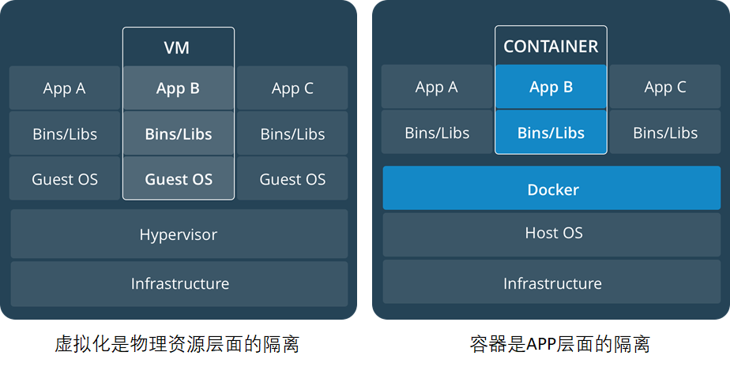
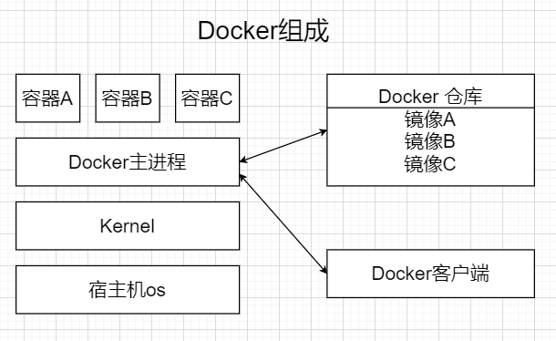
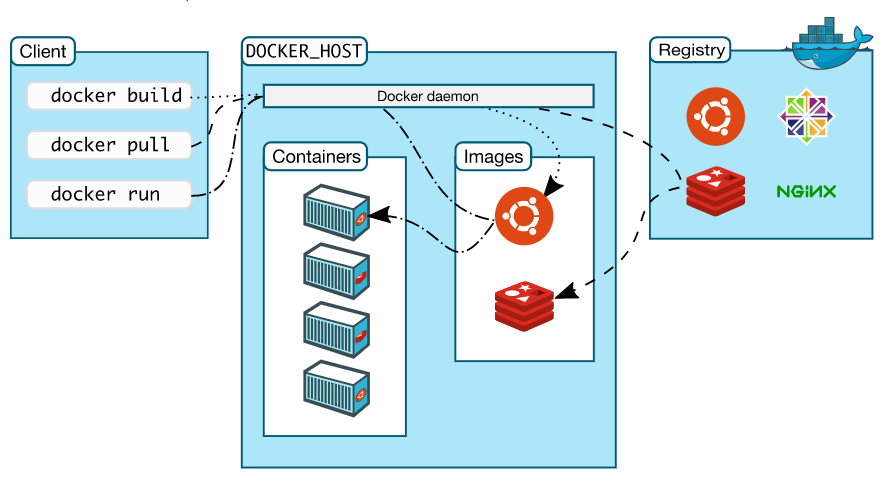
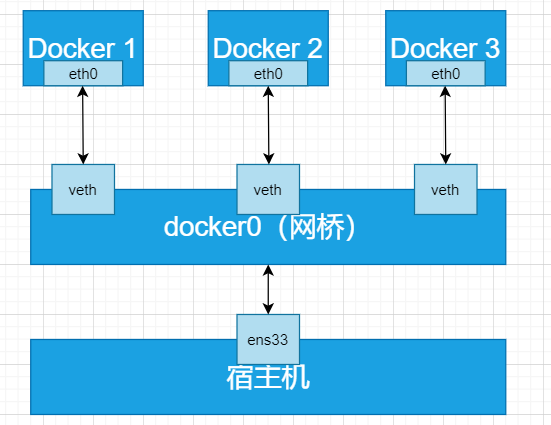

# Docker是什么？

Docker是一个在2013年开源的应用程序，并且是一个基于go语言编写的PAAS服务。

Docker最早采用LXC技术，之后改为自己研发并开源的runc技术运行容器。

Docker相比虚拟机的交付速度更快，资源消耗更低，Docker采用客户端、服务端架构，使用远程api来管理和创建Docker容器。

Docker的三大理念是build（构建）、ship（运输）、run（运行）。

Docker通过namespace、cgroup等技术来提供容器的资源隔离与安全保障。

# Docker与虚拟机之间的对比



| **虚拟化**                                       | **容器**                                                |
| ------------------------------------------------ | ------------------------------------------------------- |
| 隔离性强，有独立的GUEST  OS                      | 共享内核和OS，隔离性弱!                                 |
| 虚拟化性能差(>15%)                               | 计算/存储无损耗，无Guest  OS内存开销(~200M)             |
| 虚拟机镜像庞大(十几G~几十G),  且实例化时不能共享 | Docker容器镜象200~300M，且公共基础镜象实例化时可以共享  |
| 虚拟机镜象缺乏统一标准                           | Docker提供了容器应用镜象事实标准，OCI推动进一  步标准化 |
| 虚拟机创建慢(>2分钟)                             | 秒级创建(<10s)相当于建立索引                            |
| 虚拟机启动慢(>30s)  读文件逐个加载               | 秒级(<1s,不含应用本身启动)                              |
| 资源虚拟化粒度低，单机10~100虚拟机               | 单机支持1000+容器密度很高，适合大规模的部署             |

- 资源利用率更高：一台物理机可以运行数百个容器，但一般只能运行数十个虚拟机
- 开销更小：不需要启动单独的虚拟机占用硬件资源
- 启动速度更快：可以在数秒内完成启动

# Docker的组成

官网：https://docs.docker.com/get-started/overview/

Docker主机 host：一个物理机或者虚拟机，用于运行docker服务进程和容器

Docker服务端 Server：Docker守护进程，运行docker容器

Docker客户端 client：客户端使用docker命令或其他工具调用docker api

Docker仓库 registry：保存镜像的仓库，类似于git或svn这样的版本控制器

Docker镜像 images：镜像可以理解为创建实例使用的模板

Docker容器 container：容器是从镜像生成对外提供服务的一个或一组服务





# Docker服务端软件选择

Docker CE（Community Edition，社区版）和 Docker EE（Enterprise Edition，企业版）是 Docker 产品的两个主要版本，它们之间的主要区别在于目标用户、功能集、支持和维护等方面：

1. **目标用户**：
   - **Docker CE**：面向个人开发者、小团队以及技术爱好者，主要用于开发和测试环境。
   - **Docker EE**：面向大型企业和组织，提供企业级的功能和支持。
2. **功能集**：
   - **Docker CE**：提供基本的容器化功能，包括构建、运行和共享容器。
   - **Docker EE**：除了包含 CE 版本的所有功能外，还提供了额外的企业级特性，如增强的安全、管理、可扩展性和集成性。
3. **支持和维护**：
   - **Docker CE**：社区支持，适合自我解决问题的开发者。
   - **Docker EE**：提供商业支持和专业服务，适合需要稳定运行环境的企业。
4. **安全性**：
   - **Docker CE**：安全性相对较低，适合非生产环境。
   - **Docker EE**：提供更高级的安全特性，如镜像扫描、安全策略和合规性报告。
5. **管理**：
   - **Docker CE**：通常不需要复杂的管理工具。
   - **Docker EE**：提供 Docker Universal Control Plane (UCP) 和 Docker Trusted Registry (DTR) 等管理工具，帮助企业更有效地管理容器环境。
6. **成本**：
   - **Docker CE**：免费。
   - **Docker EE**：需要购买许可证。
7. **更新和生命周期**：
   - **Docker CE**：更新频繁，可能包含实验性功能，生命周期较短。
   - **Docker EE**：更新周期更稳定，更注重稳定性和兼容性，生命周期较长。

# Docker安装

- 安装docker-ce

```bash
[root@localhost ~]# yum install -y yum-utils
[root@localhost ~]# yum-config-manager --add-repo https://mirrors.aliyun.com/docker-ce/linux/centos/docker-ce.repo
[root@localhost ~]# sed -i 's+download.docker.com+mirrors.aliyun.com/docker-ce+' /etc/yum.repos.d/docker-ce.repo
[root@localhost ~]# yum install docker-ce -y
```

- 启动docker

```bash
[root@localhost ~]# systemctl enable --now docker
Created symlink /etc/systemd/system/multi-user.target.wants/docker.service → /usr/lib/systemd/system/docker.service.
[root@localhost ~]# systemctl status docker
● docker.service - Docker Application Container Engine
     Loaded: loaded (/usr/lib/systemd/system/docker.service; enabled; preset: disabled)
     Active: active (running) since Sun 2025-03-23 23:36:27 CST; 10s ago
TriggeredBy: ● docker.socket
       Docs: https://docs.docker.com
   Main PID: 29081 (dockerd)
      Tasks: 10
     Memory: 25.7M
        CPU: 141ms
     CGroup: /system.slice/docker.service
             └─29081 /usr/bin/dockerd -H fd:// --containerd=/run/containerd/containerd.sock
```

## 镜像加速配置

由于Docker Image仓库在国外，目前，从23年底开始，国内陆续访问不到了，所以要通过一些镜像加速器才能获取到镜像

```bash
[root@localhost ~]# docker pull nginx
Error response from daemon: Get "https://registry-1.docker.io/v2/": context deadline exceeded

# 无法从docker官方镜像仓库，docker.io获取镜像
```

**使用国内镜像加速器**（不稳定，会经常变化）

```bash
[root@localhost ~]# mkdir -p /etc/docker
[root@localhost ~]# vim /etc/docker/daemon.json
{
  "registry-mirrors": [
    "https://docker.m.daocloud.io"
  ]
}

# 重启容器服务
[root@localhost ~]# systemctl daemon-reload
[root@localhost ~]# systemctl restart docker

# 可选加速地址（不一定有用，随时会跑路）：
1、https://docker.m.daocloud.io 
2、https://docker.1panelproxy.com
3、https://atomhub.openatom.cn 
4、https://docker.1panel.live 
5、https://dockerhub.jobcher.com 
6、https://hub.rat.dev 
7、https://docker.registry.cyou 
8、https://docker.awsl9527.cn 
9、https://do.nark.eu.org/ 
10、https://docker.ckyl.me 
11、https://hub.uuuadc.top
12、https://docker.chenby.cn
13、https://docker.ckyl.me


# 实在不行的话，可以在拉去的时候手动加上镜像加速器，因为有时候写到daemon.json中也有可能访问不到
[root@localhost ~]# docker pull nginx
[root@localhost ~]# docker pull docker.m.daocloud.io/nginx
[root@localhost ~]# docker images
REPOSITORY   TAG       IMAGE ID       CREATED       SIZE
nginx        latest    53a18edff809   6 weeks ago   192MB
```

## 快速开始

```bash
[root@localhost ~]# docker pull nginx
[root@localhost ~]# docker images
REPOSITORY   TAG       IMAGE ID       CREATED      SIZE
nginx        latest    d1a364dc548d   5 days ago   133MB
[root@localhost ~]# docker run -d -p 80:80 nginx
e617ca1db9a5d242e6b4145b9cd3dff9f7955c6ab1bf160f13fb6bec081a29e4
[root@localhost ~]# docker ps
CONTAINER ID   IMAGE     COMMAND                  CREATED         STATUS         PORTS                               NAMES
e617ca1db9a5   nginx     "/docker-entrypoint.…"   6 seconds ago   Up 5 seconds   0.0.0.0:80->80/tcp, :::80->80/tcp   intelligent_turing
[root@localhost ~]# docker exec -it e617ca1db9a5 bash
root@e617ca1db9a5:/# cd /usr/share/nginx/html/
root@e617ca1db9a5:/usr/share/nginx/html# ls
50x.html  index.html
root@e617ca1db9a5:/usr/share/nginx/html# echo 'docker nginx test' > index.html 
[root@localhost ~]# curl 192.168.88.10
docker nginx test

[root@admin ~]# docker ps
CONTAINER ID   IMAGE     COMMAND                   CREATED                                                        NAMES
e0a818c40b7e   nginx     "/docker-entrypoint.…"   About an hour ago  0.0.0.0:9000->9000/tcp, :::9000->9000/tcp   determined_sanderson
9b066ef4bcd2   nginx     "/docker-entrypoint.…"   About an hour ago  90->80/tcp, :::90->80/tcp                   vigorous_hypatia
[root@admin ~]# docker stop e0a818c40b7e
e0a818c40b7e
[root@localhost ~]# docker ps
CONTAINER ID   IMAGE     COMMAND   CREATED   STATUS    PORTS     NAMES
```

- **`-i`（`--interactive`）**：
  - **功能**：保持标准输入（stdin）打开，即使没有附加终端。
  - **作用**：允许用户与容器内的命令进行交互。
- **`-t`（`--tty`）**：
  - **功能**：分配一个伪终端（TTY）。
  - **作用**：为用户创建一个类似本地终端的交互环境，支持颜色显示、光标操作等终端特性。

### Docker快速搭建RPG小游戏

```bash
[root@localhost ~]# docker pull registry.cn-guangzhou.aliyuncs.com/welldene/games:rpg_game
[root@localhost ~]# docker run -d -p 8000:8000 -p 8787:8787  --name rpg -e HOST_IP=192.168.88.10 registry.cn-guangzhou.aliyuncs.com/welldene/games:rpg_game
9c4bc95c98836a1df0453c282196083e4cb0b5d06e507d5d4567a4c018c13272
[root@localhost ~]# docker ps
CONTAINER ID   IMAGE                                                        COMMAND         CREATED         STATUS         PORTS                                                                                      NAMES
35a6b44d5645   registry.cn-guangzhou.aliyuncs.com/welldene/games:rpg_game   "bash run.sh"   3 seconds ago   Up 2 seconds   0.0.0.0:8000->8000/tcp, [::]:8000->8000/tcp, 0.0.0.0:8787->8787/tcp, [::]:8787->8787/tcp   rpg
```

**浏览器访问: http://IP:8787**


### Docker参数说明

```bash
-d, --detach: 以守护进程方式运行容器  
-p, --publish: 映射容器端口到宿主机端口  
格式: `-p [hostPort]:[containerPort]`  

-P（大写）：随机端口映射  

-v, --volume: 挂载数据卷  
格式: `-v [hostPath]:[containerPath]`  

-e, --env: 设置环境变量  
--name: 为容器指定名称  
--network: 指定容器所属网络  
--restart: 容器退出时的重启策略  
可选值: `no`, `on-failure`, `unless-stopped`, `always`  

-i, --interactive: 保持标准输入打开  
-t, --tty: 分配一个伪终端  
-u, --user: 指定运行容器的用户  
--entrypoint: 覆盖容器的默认入口点  
--rm: 容器退出后自动删除  
--hostname: 设置容器主机名  
--add-host: 添加自定义主机名到 IP 的映射  
--link: 添加到另一个容器的链接  
--expose: 暴露容器端口  
--volume-driver: 指定数据卷驱动程序  
--cpu-shares: 设置 CPU 权重  
--memory: 设置容器内存限制  
```

# Docker核心技术

## Linux namespace技术

如果一个宿主机运行了N个容器，多个容器带来的以下问题怎么解决：

1. 怎么样保证每个容器都有不同的文件系统并且能互不影响？
2. 一个docker主进程内的各个容器都是其子进程，那么如何实现同一个主进程下不同类型的子进程？各个子进程间通信能相互访问吗？
3. 每个容器怎么解决IP以及端口分配的问题？
4. 多个容器的主机名能一样吗？
5. 每个容器都要不要有root用户？怎么解决账户重名问题呢？

以上问题怎么解决

Docker 的 Namespace 技术是实现容器隔离的核心机制之一。它通过 Linux Namespace 提供的隔离功能，为每个容器创建独立的资源视图，从而实现容器之间的隔离

**namespace**是Linux系统的底层概念，在内核层实现，即有一些不同类型的命名空间都部署在核内，**各个docker容器运行在同一个docker主进程并且共用同一个宿主机系统内核**，各个docker容器运行在宿主机的用户空间，每个容器都要有类似于虚拟机一样的相**互隔离的运行空间**，但是容器技术是在一个进程内实现运行指定服务的运行环境，并且还可以保护宿主机内核不受其他进程的干扰和影响，如文件系统、网络空间、进程空间等，目前主要通过以下技术实现容器运行空间的相互隔离：

| 隔离类型                                     | 功能                               | 系统调用参数  | 内核   |
| -------------------------------------------- | ---------------------------------- | ------------- | ------ |
| MNT Namespace（mount）                       | 提供磁盘挂载点和文件系统的隔离能力 | CLONE_NEWNS   | 2.4.19 |
| IPC Namespace（Inter-Process Communication） | 提供进程间通信的隔离能力           | CLONE_NEWIPC  | 2.6.19 |
| UTS Namespace（UNIX Timesharing System）     | 提供主机名隔离能力                 | CLONE_NEWUTS  | 2.6.19 |
| PID Namespace（Process Identification）      | 提供进程隔离能力                   | CLONE_NEWPID  | 2.6.24 |
| Net Namespace（network）                     | 提供网络隔离能力                   | CLONE_NEWNET  | 2.6.29 |
| User Namespace（user）                       | 提供用户隔离能力                   | CLONE_NEWUSER | 3.8    |

### MNT Namespace

每个容器都要有独立的根文件系统有独立的用户空间，以实现容器里面启动服务并且使用容器的运行环境。

- 启动三个容器

```bash
[root@localhost ~]# docker run -d --name nginx-1 -p 80:80 nginx
0e72f06bba417073d1d4b2cb53e62c45b75edc699b737e46a157a3249f3a803e
[root@localhost ~]# docker run -d --name nginx-2 -p 81:80 nginx
c8ce6a0630b66e260eef16d8ecf48049eed7b893b87459888b634bf0e9e40f23
[root@localhost ~]# docker run -d --name nginx-3 -p 82:80 nginx
1cddbd412b5997f8935815c2f588431e100b752595ceaa92b95758ca45179096
[root@localhost ~]# docker ps
CONTAINER ID   IMAGE     COMMAND                  CREATED          STATUS          PORTS                                 NAMES
b42378a51c40   nginx     "/docker-entrypoint.…"   2 seconds ago    Up 1 second     0.0.0.0:82->80/tcp, [::]:82->80/tcp   nginx-3
d30f033c2f29   nginx     "/docker-entrypoint.…"   5 seconds ago    Up 5 seconds    0.0.0.0:81->80/tcp, [::]:81->80/tcp   nginx-2
d34a012dcebc   nginx     "/docker-entrypoint.…"   10 seconds ago   Up 10 seconds   0.0.0.0:80->80/tcp, [::]:80->80/tcp   nginx-1
```

- 连接进入某一个容器中，并创建一个文件

```bash
[root@localhost ~]# docker exec -it nginx-1 bash
root@d34a012dcebc:/# echo 'hello world test!' > /opt/test_nginx-1
root@d34a012dcebc:/# exit
```

- 宿主机是使用了chroot技术把容器锁定到一个指定的运行目录里

```bash
[root@localhost ~]# find / -name test_nginx-1
/var/lib/docker/overlay2/075b51fb5d33011d4b449fde8c14199c1e30f86224862f68a6116b1cb1dacfdf/diff/opt/test_nginx-1
/var/lib/docker/overlay2/075b51fb5d33011d4b449fde8c14199c1e30f86224862f68a6116b1cb1dacfdf/merged/opt/test_nginx-1
```

在 Docker 中，文件系统是通过分层存储机制实现的，这与 Docker 的镜像和容器的架构有关。看到的两个文件路径反映了 Docker 的存储驱动（如 Overlay2）的工作原理。

#### Docker 的存储架构

1. **镜像层（Read-Only）**：
   - Docker 镜像是由多个只读层组成的。每一层代表了镜像的某个状态或修改。
   - 这些层是不可变的，一旦创建，不会被修改。
2. **容器层（Read-Write）**：
   - 当你运行一个容器时，Docker 会在镜像层之上添加一个可写层。
   - 容器的所有写操作（如创建文件、修改文件等）都会在这个可写层中进行，而不会影响下面的镜像层。

#### Overlay2 存储驱动

Docker 默认使用 Overlay2 存储驱动（在支持的系统上）。Overlay2 的工作机制如下：

- **`merged` 目录**：
  - 这是容器的根文件系统，是镜像层和容器层的联合视图。
  - 当你在容器中访问文件时，看到的是 `merged` 目录中的内容。
  - 例如，你在容器中创建的文件 `/opt/test_nginx-1`，在宿主机上可以通过 `/var/lib/docker/overlay2/<id>/merged/opt/test_nginx-1` 访问。
- **`diff` 目录**：
  - 这是容器的可写层，记录了容器对文件系统的修改。
  - 当你在容器中创建或修改文件时，实际的文件数据会存储在 `diff` 目录中。
  - 例如，你在容器中创建的文件 `/opt/test_nginx-1`，其实际数据存储在 `/var/lib/docker/overlay2/<id>/diff/opt/test_nginx-1`。

- 当你在容器中创建文件 `/opt/test_nginx-1` 时：
  - 文件的实际数据被写入到 `diff` 目录中。
  - 在 `merged` 目录中，通过联合文件系统（OverlayFS）的机制，将 `diff` 目录中的文件映射到 `merged` 目录中，让你在容器中看到完整的文件系统视图。

### IPC Namespace

一个容器内的进程间通信，允许一个容器内的不同进程数据互相访问，但是不能跨容器访问其他容器的数据

UTS Namespace包含了运行内核的名称、版本、底层体系结构类型等信息用于系统表示，其中包含了hostname和域名，它使得一个容器拥有属于自己hostname标识，这个主机名标识独立于宿主机系统和其上的其他容器。

### PID Namespace

Linux系统中，有一个pid为1的进程（init/systemd）是其他所有进程的父进程，那么在每个容器内也要有一个父进程来管理其下属的进程，那么多个容器的进程通PID namespace进程隔离

- 安装软件包

```bash
[root@localhost ~]# docker exec -it 065f06e5caa4 bash
root@0e72f06bba41:/# apt update
# ifconfig
root@0e72f06bba41:/# apt install -y net-tools
root@0e72f06bba41:/# apt install -y procps
root@0e72f06bba41:/# ps -ef
UID         PID   PPID  C STIME TTY          TIME CMD
root          10  0 03:20 ?        00:00:00 nginx: master process nginx -g d
nginx        32      1  0 03:20 ?        00:00:00 nginx: worker process
nginx        33      1  0 03:20 ?        00:00:00 nginx: worker process
nginx        34      1  0 03:20 ?        00:00:00 nginx: worker process
nginx        35      1  0 03:20 ?        00:00:00 nginx: worker process
nginx        36      1  0 03:20 ?        00:00:00 nginx: worker process
nginx        37      1  0 03:20 ?        00:00:00 nginx: worker process
nginx        38      1  0 03:20 ?        00:00:00 nginx: worker process
nginx        39      1  0 03:20 ?        00:00:00 nginx: worker process
root         59      0  0 03:35 pts/0    00:00:00 bash
root        503     59  0 03:42 pts/0    00:00:00 ps -ef
```

**那么宿主机的PID与容器内的PID是什么关系？**

```bash
[root@localhost ~]# yum install psmisc
[root@localhost ~]# pstree -p
[root@localhost ~]# pstree -p
systemd(1)─┬─NetworkManager(769)─┬─{NetworkManager}(772)
           │                     └─{NetworkManager}(775)
           ├─agetty(817)
           ├─atd(799)
           ├─auditd(693)─┬─sedispatch(695)
           │             ├─{auditd}(694)
           │             └─{auditd}(696)
           ├─bluetoothd(742)
           ├─chronyd(753)
           ├─containerd(28884)─┬─{containerd}(28886)
           │                   ├─{containerd}(28887)
           │                   ├─{containerd}(28888)
           │                   ├─{containerd}(28889)
           │                   ├─{containerd}(28890)
           │                   ├─{containerd}(28891)
           │                   ├─{containerd}(28892)
           │                   └─{containerd}(28894)
           ├─containerd-shim(30330)─┬─bash(30801)
           │                        ├─nginx(30353)─┬─nginx(30426)
           │                        │              ├─nginx(30427)
           │                        │              ├─nginx(30428)
           │                        │              └─nginx(30429)
           │                        ├─{containerd-shim}(30332)
           │                        ├─{containerd-shim}(30333)
           │                        ├─{containerd-shim}(30334)
           │                        ├─{containerd-shim}(30335)
           │                        ├─{containerd-shim}(30336)
           │                        ├─{containerd-shim}(30337)
           │                        ├─{containerd-shim}(30338)
           │                        ├─{containerd-shim}(30339)
           │                        ├─{containerd-shim}(30340)
           │                        ├─{containerd-shim}(30703)
           │                        └─{containerd-shim}(30909)
           ├─containerd-shim(30447)─┬─nginx(30469)─┬─nginx(30546)
           │                        │              ├─nginx(30547)
           │                        │              ├─nginx(30548)
           │                        │              └─nginx(30549)
           │                        ├─{containerd-shim}(30448)
           │                        ├─{containerd-shim}(30449)
           │                        ├─{containerd-shim}(30450)
           │                        ├─{containerd-shim}(30451)
           │                        ├─{containerd-shim}(30452)
           │                        ├─{containerd-shim}(30453)
           │                        ├─{containerd-shim}(30454)
           │                        ├─{containerd-shim}(30455)
           │                        ├─{containerd-shim}(30456)
           │                        └─{containerd-shim}(30705)
           ├─containerd-shim(30566)─┬─nginx(30587)─┬─nginx(30662)
           │                        │              ├─nginx(30663)
           │                        │              ├─nginx(30664)
           │                        │              └─nginx(30665)
           │                        ├─{containerd-shim}(30567)
           │                        ├─{containerd-shim}(30568)
           │                        ├─{containerd-shim}(30569)
           │                        ├─{containerd-shim}(30570)
           │                        ├─{containerd-shim}(30571)
           │                        ├─{containerd-shim}(30572)
           │                        ├─{containerd-shim}(30573)
           │                        ├─{containerd-shim}(30574)
           │                        ├─{containerd-shim}(30593)
           │                        ├─{containerd-shim}(30706)
           │                        └─{containerd-shim}(30780)
           ├─crond(801)
           ├─dbus-broker-lau(719)───dbus-broker(723)
           ├─dockerd(29156)─┬─docker-proxy(30381)─┬─{docker-proxy}(30382)
           │                │                     ├─{docker-proxy}(30383)
           │                │                     ├─{docker-proxy}(30384)
           │                │                     ├─{docker-proxy}(30385)
           │                │                     ├─{docker-proxy}(30386)
           │                │                     └─{docker-proxy}(30388)
           │                ├─docker-proxy(30387)─┬─{docker-proxy}(30389)
           │                │                     ├─{docker-proxy}(30390)
           │                │                     ├─{docker-proxy}(30391)
           │                │                     ├─{docker-proxy}(30392)
           │                │                     ├─{docker-proxy}(30393)
           │                │                     ├─{docker-proxy}(30394)
           │                │                     ├─{docker-proxy}(30395)
           │                │                     └─{docker-proxy}(30396)
           │                ├─docker-proxy(30497)─┬─{docker-proxy}(30498)
           │                │                     ├─{docker-proxy}(30499)
           │                │                     ├─{docker-proxy}(30500)
           │                │                     ├─{docker-proxy}(30501)
           │                │                     ├─{docker-proxy}(30502)
           │                │                     ├─{docker-proxy}(30503)
           │                │                     ├─{docker-proxy}(30504)
           │                │                     └─{docker-proxy}(30505)
           │                ├─docker-proxy(30506)─┬─{docker-proxy}(30507)
           │                │                     ├─{docker-proxy}(30508)
           │                │                     ├─{docker-proxy}(30509)
           │                │                     ├─{docker-proxy}(30510)
           │                │                     ├─{docker-proxy}(30511)
           │                │                     ├─{docker-proxy}(30512)
           │                │                     └─{docker-proxy}(30513)
           │                ├─docker-proxy(30616)─┬─{docker-proxy}(30617)
           │                │                     ├─{docker-proxy}(30618)
           │                │                     ├─{docker-proxy}(30619)
           │                │                     ├─{docker-proxy}(30620)
           │                │                     ├─{docker-proxy}(30621)
           │                │                     ├─{docker-proxy}(30622)
           │                │                     ├─{docker-proxy}(30624)
           │                │                     └─{docker-proxy}(30625)
           │                ├─docker-proxy(30623)─┬─{docker-proxy}(30626)
           │                │                     ├─{docker-proxy}(30627)
           │                │                     ├─{docker-proxy}(30628)
           │                │                     ├─{docker-proxy}(30629)
           │                │                     ├─{docker-proxy}(30630)
           │                │                     ├─{docker-proxy}(30631)
           │                │                     └─{docker-proxy}(30632)
           │                ├─{dockerd}(29157)
           │                ├─{dockerd}(29159)
           │                ├─{dockerd}(29161)
           │                ├─{dockerd}(29163)
           │                ├─{dockerd}(29407)
           │                ├─{dockerd}(29420)
           │                ├─{dockerd}(29430)
           │                ├─{dockerd}(29537)
           │                ├─{dockerd}(29711)
           │                ├─{dockerd}(29712)
           │                ├─{dockerd}(29823)
           │                ├─{dockerd}(29844)
           │                ├─{dockerd}(29845)
           │                ├─{dockerd}(30633)
           │                └─{dockerd}(30683)
           ├─irqbalance(729)───{irqbalance}(738)
           ├─lsmd(730)
           ├─mcelog(734)
           ├─polkitd(944)─┬─{polkitd}(975)
           │              ├─{polkitd}(976)
           │              ├─{polkitd}(979)
           │              ├─{polkitd}(980)
           │              ├─{polkitd}(981)
           │              ├─{polkitd}(982)
           │              └─{polkitd}(1004)
           ├─rsyslogd(1063)─┬─{rsyslogd}(1095)
           │                └─{rsyslogd}(1096)
           ├─sshd(786)─┬─sshd(1527)───sshd(1541)───bash(1542)───docker(30781)─┬─{docker}(30782)
           │           │                                                      ├─{docker}(30783)
           │           │                                                      ├─{docker}(30784)
           │           │                                                      ├─{docker}(30785)
           │           │                                                      ├─{docker}(30786)
           │           │                                                      ├─{docker}(30787)
           │           │                                                      ├─{docker}(30788)
           │           │                                                      └─{docker}(30807)
           │           └─sshd(30928)───sshd(30932)───bash(30933)───pstree(31158)
           ├─systemd(1532)───(sd-pam)(1534)
           ├─systemd-journal(635)
           ├─systemd-logind(739)
           ├─systemd-udevd(648)
           └─tuned(791)─┬─{tuned}(1106)
                        ├─{tuned}(1137)
                        └─{tuned}(1138)

[root@localhost ~]# ps aux | grep b42378a51c40
root       30566  0.0  0.9 1237984 16524 ?       Sl   18:42   0:00 /usr/bin/containerd-shim-runc-v2 -namespace moby -id b42378a51c402d7ffa408d331a61ebdefe1b920eb723cd343ebc8e5781bec03d -address /run/containerd/containerd.sock
root       31171  0.0  0.1   3880  2048 pts/1    S+   18:54   0:00 grep --color=auto b42378a51c40
```

**在宿主机上查看容器的进程**

```bash
[root@localhost ~]# docker top nginx-1
UID                 PID                 PPID                C                   STIME               TTY                 TIME                CMD
root                30353               30330               0                   18:42               ?                   00:00:00            nginx: master process nginx -g daemon off;
101                 30426               30353               0                   18:42               ?                   00:00:00            nginx: worker process
101                 30427               30353               0                   18:42               ?                   00:00:00            nginx: worker process
101                 30428               30353               0                   18:42               ?                   00:00:00            nginx: worker process
101                 30429               30353               0                   18:42               ?                   00:00:00            nginx: worker process
root                30801               30330               0                   18:46               pts/0               00:00:00            bash
```

首先，可以看到容器内的进程在宿主机上的 PID。容器内的进程只能看到自己命名空间中的进程，而无法看到宿主机或其他容器的进程

所以说明docker采用PID Namespace技术将容器内部的进程与宿主机的进程进行了隔离

并且，容器内部的进程和宿主机上的进程还存在一定的对应或者映射关系

1. **独立的 PID 命名空间**:
   - 每个 Docker 容器都有自己独立的 PID 命名空间。
   - 容器内的进程 PID 从 1 开始编号,与宿主机上的 PID 是相互独立的。
2. **PID 映射**:
   - 容器内的进程 PID 与宿主机上的进程 PID 之间是有映射关系的。
3. **PID 可见性**:
   - 容器内的进程只能看到容器内部的 PID。
   - 宿主机上的进程可以看到容器内部的 PID,但容器内的进程无法看到宿主机上的 PID。
4. **PID 隔离**:
   - 容器内的进程无法访问或影响宿主机上的其他进程。
   - 宿主机上的进程可以访问和管理容器内的进程。

### Net Namespace

每一个容器都类似于虚拟机一样有自己的网卡、监听端口、TCP/IP协议栈等，Docker使用network namespace启动一个vethX接口，这样容器将拥有它自己的桥接IP地址，通常是docker0，而docker0实质就是linux的虚拟网桥。

查看容器内部的IP网络信息，发现有一个eth0的网卡

```bash
root@d34a012dcebc:/# ifconfig
eth0: flags=4163<UP,BROADCAST,RUNNING,MULTICAST>  mtu 1500
        inet 172.17.0.2  netmask 255.255.0.0  broadcast 172.17.255.255
        ether ce:f2:f5:63:47:16  txqueuelen 0  (Ethernet)
        RX packets 4713  bytes 10994487 (10.4 MiB)
        RX errors 0  dropped 0  overruns 0  frame 0
        TX packets 3888  bytes 212050 (207.0 KiB)
        TX errors 0  dropped 0 overruns 0  carrier 0  collisions 0

lo: flags=73<UP,LOOPBACK,RUNNING>  mtu 65536
        inet 127.0.0.1  netmask 255.0.0.0
        inet6 ::1  prefixlen 128  scopeid 0x10<host>
        loop  txqueuelen 1000  (Local Loopback)
        RX packets 0  bytes 0 (0.0 B)
        RX errors 0  dropped 0  overruns 0  frame 0
        TX packets 0  bytes 0 (0.0 B)
        TX errors 0  dropped 0 overruns 0  carrier 0  collisions 0
```

而我们的宿主机上的网卡中，多了个docker0的虚拟网桥，这样以来，通过Net Namespace将容器的网络与宿主机的网络进行隔离，并且通过虚拟网桥docker0与容器进行网络通信

```bash
[root@localhost ~]# ifconfig
docker0: flags=4163<UP,BROADCAST,RUNNING,MULTICAST>  mtu 1500
        inet 172.17.0.1  netmask 255.255.0.0  broadcast 172.17.255.255
        inet6 fe80::38a5:cdff:fe6b:7dbc  prefixlen 64  scopeid 0x20<link>
        ether 3a:a5:cd:6b:7d:bc  txqueuelen 0  (Ethernet)
        RX packets 5820  bytes 11520579 (10.9 MiB)
        RX errors 0  dropped 0  overruns 0  frame 0
        TX packets 9483  bytes 11508761 (10.9 MiB)
        TX errors 0  dropped 0 overruns 0  carrier 0  collisions 0

ens160: flags=4163<UP,BROADCAST,RUNNING,MULTICAST>  mtu 1500
        inet 192.168.88.10  netmask 255.255.255.0  broadcast 192.168.88.255
        inet6 fe80::20c:29ff:fe26:8384  prefixlen 64  scopeid 0x20<link>
        ether 00:0c:29:26:83:84  txqueuelen 1000  (Ethernet)
        RX packets 235433  bytes 340010957 (324.2 MiB)
        RX errors 0  dropped 0  overruns 0  frame 0
        TX packets 54812  bytes 14709198 (14.0 MiB)
        TX errors 0  dropped 0 overruns 0  carrier 0  collisions 0

lo: flags=73<UP,LOOPBACK,RUNNING>  mtu 65536
        inet 127.0.0.1  netmask 255.0.0.0
        inet6 ::1  prefixlen 128  scopeid 0x10<host>
        loop  txqueuelen 1000  (Local Loopback)
        RX packets 0  bytes 0 (0.0 B)
        RX errors 0  dropped 0  overruns 0  frame 0
        TX packets 0  bytes 0 (0.0 B)
        TX errors 0  dropped 0 overruns 0  carrier 0  collisions 0

veth51c3173: flags=4163<UP,BROADCAST,RUNNING,MULTICAST>  mtu 1500
        inet6 fe80::d8fa:18ff:fe0f:d176  prefixlen 64  scopeid 0x20<link>
        ether da:fa:18:0f:d1:76  txqueuelen 0  (Ethernet)
        RX packets 3888  bytes 212050 (207.0 KiB)
        RX errors 0  dropped 0  overruns 0  frame 0
        TX packets 4714  bytes 10994557 (10.4 MiB)
        TX errors 0  dropped 0 overruns 0  carrier 0  collisions 0

veth813b530: flags=4163<UP,BROADCAST,RUNNING,MULTICAST>  mtu 1500
        inet6 fe80::e498:2eff:fe08:2c5b  prefixlen 64  scopeid 0x20<link>
        ether e6:98:2e:08:2c:5b  txqueuelen 0  (Ethernet)
        RX packets 3  bytes 126 (126.0 B)
        RX errors 0  dropped 0  overruns 0  frame 0
        TX packets 15  bytes 1118 (1.0 KiB)
        TX errors 0  dropped 0 overruns 0  carrier 0  collisions 0

vethc11c399: flags=4163<UP,BROADCAST,RUNNING,MULTICAST>  mtu 1500
        inet6 fe80::a482:dfff:fe74:dec7  prefixlen 64  scopeid 0x20<link>
        ether a6:82:df:74:de:c7  txqueuelen 0  (Ethernet)
        RX packets 3  bytes 126 (126.0 B)
        RX errors 0  dropped 0  overruns 0  frame 0
        TX packets 18  bytes 1244 (1.2 KiB)
        TX errors 0  dropped 0 overruns 0  carrier 0  collisions 0
```

- **`docker0` 网桥**：
  - 它是 Docker 默认创建的一个虚拟网桥，用于管理容器的网络通信。
  - 它为连接到它的容器提供了一个内部网络环境，允许容器之间通过这个网桥进行通信。
- **`veth3ad3c5b` 接口**：
  - 这是一个虚拟以太网接口，用于连接容器和宿主机的网络。
  - 它的一端连接到 `docker0` 网桥，另一端连接到容器的网络命名空间。
  - 当容器启动时，Docker 会自动创建这样的 veth pair，并将一端连接到 `docker0`，另一端连接到容器的网络命名空间。

逻辑图



### User Namespace

各个容器内可能会出现重名的用户和用户组名称，或重复的用户UID或者GID，那么怎么隔离各个容器内的用户空间呢？

User Namespace允许在宿主机的各个容器空间内创建相同的用户名以及相同的uid和gid，只是此用户的有效范围仅仅是当前的容器内，不能访问另外一个容器内的文件系统，即相互隔离、互不影响、永不相见

## Linux control groups

在一个容器内部，如果不对其做任何资源限制，则宿主机会允许其占用无限大的内存空间，有时候会因为代码bug程序会一直申请内存，直到把宿主机内存占完，为了避免此类的问题出现，宿主机有必要对容器进行资源分配限制，比如cpu、内存等，Linux Cgroups的全称是Linux control Groups，它最重要的作用就是限制一个进程组能够使用的资源上线，包括cpu、内存、磁盘、网络等等。

- 验证系统内核层已经默认开启cgroup功能

```bash
[root@localhost ~]# cat /boot/config-5.14.0-427.13.1.el9_4.x86_64 | grep cgroup -i
CONFIG_CGROUPS=y
# CONFIG_CGROUP_FAVOR_DYNMODS is not set
CONFIG_BLK_CGROUP=y
CONFIG_CGROUP_WRITEBACK=y
CONFIG_CGROUP_SCHED=y
CONFIG_CGROUP_PIDS=y
CONFIG_CGROUP_RDMA=y
CONFIG_CGROUP_FREEZER=y
CONFIG_CGROUP_HUGETLB=y
CONFIG_CGROUP_DEVICE=y
CONFIG_CGROUP_CPUACCT=y
CONFIG_CGROUP_PERF=y
CONFIG_CGROUP_BPF=y
CONFIG_CGROUP_MISC=y
# CONFIG_CGROUP_DEBUG is not set
CONFIG_SOCK_CGROUP_DATA=y
CONFIG_BLK_CGROUP_RWSTAT=y
CONFIG_BLK_CGROUP_IOLATENCY=y
CONFIG_BLK_CGROUP_FC_APPID=y
# CONFIG_BLK_CGROUP_IOCOST is not set
# CONFIG_BLK_CGROUP_IOPRIO is not set
# CONFIG_BFQ_CGROUP_DEBUG is not set
CONFIG_NETFILTER_XT_MATCH_CGROUP=m
CONFIG_NET_CLS_CGROUP=y
CONFIG_CGROUP_NET_PRIO=y
CONFIG_CGROUP_NET_CLASSID=y
# CONFIG_DEBUG_CGROUP_REF is not set
```

- 关于内存的模块

```bash
[root@localhost ~]#  cat /boot/config-3.10.0-957.el7.x86_64 | grep mem -i | grep cg -i
CONFIG_MEMCG=y
CONFIG_MEMCG_SWAP=y
CONFIG_MEMCG_SWAP_ENABLED=y
CONFIG_MEMCG_KMEM=y
```

扩展阅读：

https://blog.csdn.net/qyf158236/article/details/110475457

### Docker 中的 cgroups 资源限制

#### 1. **CPU 资源限制**

Docker 提供了多种方式来限制容器的 CPU 使用：

- **`--cpus`**：限制容器可以使用的 CPU 核心数量。例如，`--cpus="1.5"` 表示容器最多可以使用 1.5 个 CPU。
- **`--cpu-shares`**：设置容器的 CPU 使用权重。默认值为 1024，值越高，分配的 CPU 时间片越多。
- **`--cpu-period` 和 `--cpu-quota`**：更细粒度地控制 CPU 时间片。`--cpu-period` 设置 CPU 时间片的周期（单位为微秒），`--cpu-quota` 设置每个周期内容器可以使用的 CPU 时间。

#### 2. **内存资源限制**

Docker 可以通过以下参数限制容器的内存使用：

- **`-m` 或 `--memory`**：限制容器的物理内存使用量。例如，`-m 512m` 表示限制容器使用 512MB 的物理内存。
- **`--memory-swap`**：限制容器的总内存使用量（物理内存 + 交换空间）。例如，`--memory-swap=1g` 表示容器可以使用 1GB 的总内存。

#### 3. **磁盘 I/O 资源限制**

Docker 可以限制容器的磁盘 I/O 使用：

- **`--blkio-weight`**：设置容器的块设备 I/O 权重，范围为 10 到 1000。
- **`--device-read-bps` 和 `--device-write-bps`**：限制特定设备的读写速率。例如，`--device-read-bps /dev/sda:1mb` 表示限制容器对 `/dev/sda` 的读取速率为 1MB/s。

### 查看和管理 cgroups 资源限制

- **查看 cgroups 配置**：可以通过访问 `/sys/fs/cgroup` 目录来查看容器的 cgroups 配置。例如，`/sys/fs/cgroup/cpu/docker/<container_id>` 目录下包含了容器的 CPU 资源限制文件。
- **动态调整资源限制**：在容器运行时，可以通过修改 cgroups 文件的内容来动态调整资源限制。

### 使用压缩工具测试

```plain
[root@bogon ~]# docker pull lorel/docker-stress-ng
Using default tag: latest
latest: Pulling from lorel/docker-stress-ng
c52e3ed763ff: Pull complete 
a3ed95caeb02: Pull complete 
7f831269c70e: Pull complete 
Digest: sha256:c8776b750869e274b340f8e8eb9a7d8fb2472edd5b25ff5b7d55728bca681322
Status: Downloaded newer image for lorel/docker-stress-ng:latest
```

#### 测试CPU

不限制cpu使用

```bash
[root@bogon ~]# docker container run --name stress -it --rm lorel/docker-stress-ng:latest  --cpu 4
stress-ng: info: [1] defaulting to a 86400 second run per stressor
stress-ng: info: [1] dispatching hogs: 8 cpu
[root@bogon ~]# docker stats
CONTAINER ID        NAME                CPU %               MEM USAGE / LIMIT     MEM %               NET I/O             BLOCK I/O           PIDS
92b0b8d916c1        stress              101.54%             15.81MiB / 983.3MiB   1.61%               648B / 0B           0B / 0B             9
[root@bogon ~]# top
top - 19:15:49 up 2 days,  2:38,  2 users,  load average: 7.02, 3.00, 1.15
Tasks: 131 total,  10 running, 121 sleeping,   0 stopped,   0 zombie
%Cpu(s): 99.7 us,  0.3 sy,  0.0 ni,  0.0 id,  0.0 wa,  0.0 hi,  0.0 si,  0.0 st
KiB Mem :  1006892 total,   100680 free,   320704 used,   585508 buff/cache
KiB Swap:  2097148 total,  2096628 free,      520 used.   422732 avail Mem 
  PID USER      PR  NI    VIRT    RES    SHR S %CPU %MEM     TIME+ COMMAND                                                                     
40035 root      20   0    6908   4180    252 R 12.6  0.4   0:12.79 stress-ng-cpu                                                               
40037 root      20   0    6908   4180    252 R 12.6  0.4   0:12.78 stress-ng-cpu                                                               
40038 root      20   0    6908   2136    252 R 12.6  0.2   0:12.78 stress-ng-cpu                                                               
40040 root      20   0    6908   2136    252 R 12.6  0.2   0:12.78 stress-ng-cpu                                                               
40036 root      20   0    6908   2136    252 R 12.3  0.2   0:12.77 stress-ng-cpu                                                               
40039 root      20   0    6908   2136    252 R 12.3  0.2   0:12.78 stress-ng-cpu                                                               
40041 root      20   0    6908   4180    252 R 12.3  0.4   0:12.77 stress-ng-cpu                                                               
40042 root      20   0    6908   2136    252 R 12.3  0.2   0:12.77 stress-ng-cpu                                                               
    1 root      20   0  128484   7208   4196 S  0.0  0.7   0:10.12 systemd
```

可以看到，cpu使用已经满了

重新启动容器加入CPU限制参数

```bash
[root@bogon ~]# docker container run --name stress --cpus=0.5 -it --rm lorel/docker-stress-ng:latest  --cpu 8
stress-ng: info: [1] defaulting to a 86400 second run per stressor
stress-ng: info: [1] dispatching hogs: 8 cpu
[root@bogon ~]# docker stats
CONTAINER ID        NAME                CPU %               MEM USAGE / LIMIT     MEM %               NET I/O             BLOCK I/O           PIDS
845220ef9982        stress              51.57%              20.05MiB / 983.3MiB   2.04%               648B / 0B           0B / 0B             9
```

# 容器规范

## 容器技术及其标准化组织 OCI

容器技术是一种轻量级的虚拟化技术，用于隔离应用程序及其依赖项，使其能够在不同的环境中一致地运行。除了 Docker 之外，还有其他多种容器运行时和工具，例如 CoreOS 的 rkt、阿里的 Pouch 和红帽的 Podman。为了确保容器生态系统的标准性和可持续发展，Linux 基金会、Docker、微软、红帽、谷歌和 IBM 等公司在 2015 年 6 月共同成立了 **Open Container Initiative (OCI)** 组织。

### **OCI 的目标**

OCI 的主要目标是制定开放的容器规范，以确保不同容器技术之间的可移植性和互操作性。目前，OCI 已经发布了两个核心规范：

1. **Runtime Spec**：定义了容器运行时的规范，包括容器的生命周期管理、资源隔离和安全等。
2. **Image Format Spec**：定义了容器镜像的格式和元数据，确保镜像可以在不同的容器运行时之间共享和运行。

通过遵循这些规范，不同的容器运行时和工具可以实现互操作性，从而推动容器技术的标准化和健康发展。

### 主流容器运行时

容器运行时是真正运行容器的地方，它需要与操作系统的内核紧密合作，为容器提供隔离的运行环境。以下是目前主流的三种容器运行时：

#### 1. **LXC (Linux Containers)**

- **简介**：LXC 是 Linux 上早期的容器运行时，它利用 Linux 内核的 Namespace 和 Cgroups 技术来实现进程隔离和资源管理。
- **特点**：
  - 提供了完整的 Linux 系统环境，支持多种 Linux 发行版。
  - 早期 Docker 也曾使用 LXC 作为其默认的运行时。
- **适用场景**：适用于需要完整 Linux 系统环境的容器化应用。

#### 2. **Runc**

- **简介**：Runc 是目前 Docker 默认的容器运行时，它是一个轻量级的命令行工具，用于运行和管理容器。
- **特点**：
  - 完全遵循 OCI 的 Runtime Spec 规范，确保与 OCI 标准的兼容性。
  - 由于其轻量级和高性能的特点，Runc 已经成为许多容器运行时的底层实现。
- **适用场景**：适用于需要高性能和轻量级容器运行环境的场景。

#### 3. **Rkt (Rocket)**

- **简介**：Rkt 是由 CoreOS 开发的容器运行时，旨在提供一个安全、可靠且符合 OCI 规范的容器运行环境。
- **特点**：
  - 与 Docker 不同，Rkt 本身是一个独立的容器运行时，不依赖 Docker 的守护进程。
  - 提供了更好的安全性和隔离性，例如通过 AppArmor 和 SELinux 等安全机制。
- **适用场景**：适用于对安全性要求较高的容器化应用。

容器技术的发展离不开标准化的推动。OCI 通过制定 Runtime Spec 和 Image Format Spec，为容器运行时和工具提供了统一的标准，确保了不同容器技术之间的互操作性和可移植性。目前主流的容器运行时（如 LXC、Runc 和 Rkt）都遵循这些规范，从而推动了容器技术的广泛应用和发展。

# docker info信息

```bash
[root@localhost ~]# docker info 
Client:
 Context:    default
 Debug Mode: false
 Plugins:
  app: Docker App (Docker Inc., v0.9.1-beta3)
  buildx: Build with BuildKit (Docker Inc., v0.5.1-docker)
  scan: Docker Scan (Docker Inc.)

Server:
 Containers: 2		# 当前主机运行容器总数
  Running: 1		# 有几个容器是正在运行的
  Paused: 0			# 有几个容器是暂停的
  Stopped: 1		# 有几个容器是停止的
 Images: 1			# 当前服务器的镜像数
 Server Version: 20.10.6		# 服务端版本
 Storage Driver: overlay2		# 正在使用的存储引擎
  Backing Filesystem: xfs		# 后端文件系统，即服务器的磁盘文件系统
  Supports d_type: true			# 是否支持d_type
  Native Overlay Diff: true		# 是否支持差异数据存储
  userxattr: false
 Logging Driver: json-file		# 日志文件类型
 Cgroup Driver: cgroupfs		# cgroups类型
 Cgroup Version: 1
 Plugins:						# 插件
  Volume: local					# 卷
  Network: bridge host ipvlan macvlan null overlay
  Log: awslogs fluentd gcplogs gelf journald json-file local logentries splunk syslog
 Swarm: inactive				# 是否支持swarm
 Runtimes: io.containerd.runc.v2 io.containerd.runtime.v1.linux runc
 Default Runtime: runc			# 默认的runtime
 Init Binary: docker-init		# 初始化容器的守护进程
 containerd version: d71fcd7d8303cbf684402823e425e9dd2e99285d
 runc version: b9ee9c6314599f1b4a7f497e1f1f856fe433d3b7
 init version: de40ad0
 Security Options:				# 安全选项
  seccomp
   Profile: default
 Kernel Version: 3.10.0-693.el7.x86_64		# 宿主机内核版本
 Operating System: CentOS Linux 7 (Core)	# 宿主机操作系统
 OSType: linux								# 宿主机操作系统类型
 Architecture: x86_64						# 宿主机架构
 CPUs: 1									# 宿主机cpu数量
 Total Memory: 1.781GiB						# 宿主机总内存
 Name: docker-server						# 宿主机主机名
 ID: ARN5:ESPO:FEZ4:KDZ6:RWGG:WQ3X:SIXN:3FVG:ATXH:JAXA:ENGH:RAVE
 Docker Root Dir: /var/lib/docker			# 宿主机数据保存目录
 Debug Mode: false
 Registry: https://index.docker.io/v1/		# 镜像仓库
 Labels:
 Experimental: false						# 是否是测试版
 Insecure Registries:
  127.0.0.0/8
 Live Restore Enabled: false				# 是否开启活动容器（重启不关闭容器）
```

# docker 存储引擎

Docker 的存储引擎是 Docker 平台中用于管理容器和镜像数据的核心组件。它负责容器的文件系统、网络配置、权限管理等，以及其他与容器运行相关的任务。以下是对 Docker 存储引擎的详细介绍：

## **核心概念及工作原理**

Docker 存储引擎的核心思想是“层”的概念。镜像是由多个只读层组成的，而容器则在镜像的基础上添加了一个可读写的层。这种分层架构使得镜像的复用和部署变得非常方便，同时减少了容器的体积。

Docker 使用联合文件系统（Union File System）来管理容器的文件系统。联合文件系统允许将多个目录（或文件系统）合并为一个统一的文件系统视图。Docker 的存储引擎通过这种机制，将镜像层和容器层合并在一起，使得容器能够看到一个完整的文件系统。

Docker 支持多种存储引擎，每种存储引擎都有其特点和适用场景。以下是一些常见的存储引擎：

**AUFS（Another Union File System）**

- **特点**：AUFS 是一种文件级的存储驱动，允许多个目录共享相同的文件系统层次结构。它通过联合挂载技术将多个目录挂载到一个单一的文件系统上。
- **适用场景**：AUFS 曾是 Docker 早期版本的默认存储驱动，但在较新的 Docker 版本中已被 Overlay2 替代。

**OverlayFS**

- **特点**：OverlayFS 是一种更现代的联合文件系统，从 Linux 内核 3.18 开始支持。它将文件系统简化为两层：一个只读的下层（lowerdir）和一个可读写的上层（upperdir），统一后的视图称为合并层（merged）。
- **优势**：OverlayFS 支持页缓存共享，多个容器如果读取相同层的同一个文件，可以共享页缓存，从而提高内存利用率。此外，OverlayFS 在性能和稳定性方面表现更好，是目前 Docker 的默认存储驱动。

## Docker 的 Overlay2 存储驱动介绍

1. **什么是 Overlay2？**

Overlay2 是 Docker 中的一种存储驱动，用于管理容器和镜像的文件系统。它是 OverlayFS 的改进版本，解决了早期 Overlay 驱动可能遇到的 inode 耗尽问题。Overlay2 使用联合文件系统（Union File System）技术，将多个文件系统层合并为一个统一的文件系统视图，从而实现高效的容器文件系统管理。

2. **Overlay2 的工作原理**

Overlay2 通过以下三个主要目录来管理文件系统：

- **`LowerDir`**：只读层，包含基础镜像的文件系统。可以有多个只读层，每层都是独立的。
- **`UpperDir`**：读写层，用于存储容器运行时的文件系统变更（即 diff 层）。
- **`MergedDir`**：联合挂载后的视图，容器看到的完整文件系统。它将 `LowerDir` 和 `UpperDir` 合并为一个统一的文件系统视图。
- **`WorkDir`**：工作目录，用于联合挂载的内部操作，挂载后内容被清空。

当启动一个容器时，Overlay2 会将镜像层（`LowerDir`）和容器层（`UpperDir`）联合挂载到 `MergedDir`，容器通过这个目录看到完整的文件系统。