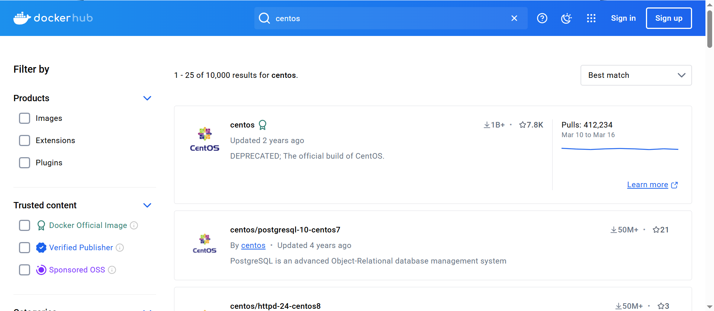

# 搜索镜像

```bash
[root@docker-server ~]# docker search centos
NAME                               DESCRIPTION                                     STARS     OFFICIAL   AUTOMATED
centos                             The official build of CentOS.                   6584      [OK]       
ansible/centos7-ansible            Ansible on Centos7                              134                  [OK]
consol/centos-xfce-vnc             Centos container with "headless" VNC session…   129                  [OK]
jdeathe/centos-ssh                 OpenSSH / Supervisor / EPEL/IUS/SCL Repos - …   118                  [OK]
centos/systemd                     systemd enabled base container.                 99                   [OK]
imagine10255/centos6-lnmp-php56    centos6-lnmp-php56                              58                   [OK]
tutum/centos                       Simple CentOS docker image with SSH access      48                   
kinogmt/centos-ssh                 CentOS with SSH                                 29                   [OK]
pivotaldata/centos-gpdb-dev        CentOS image for GPDB development. Tag names…   13                   
guyton/centos6                     From official centos6 container with full up…   10                   [OK]
centos/tools                       Docker image that has systems administration…   7                    [OK]
drecom/centos-ruby                 centos ruby                                     6                    [OK]
pivotaldata/centos                 Base centos, freshened up a little with a Do…   5                    
pivotaldata/centos-gcc-toolchain   CentOS with a toolchain, but unaffiliated wi…   3                    
darksheer/centos                   Base Centos Image -- Updated hourly             3                    [OK]
mamohr/centos-java                 Oracle Java 8 Docker image based on Centos 7    3                    [OK]
pivotaldata/centos-mingw           Using the mingw toolchain to cross-compile t…   3                    
miko2u/centos6                     CentOS6 日本語環境                                   2                    [OK]
indigo/centos-maven                Vanilla CentOS 7 with Oracle Java Developmen…   2                    [OK]
amd64/centos                       The official build of CentOS.                   2                    
dokken/centos-7                    CentOS 7 image for kitchen-dokken               2                    
pivotaldata/centos6.8-dev          CentosOS 6.8 image for GPDB development         1                    
blacklabelops/centos               CentOS Base Image! Built and Updates Daily!     1                    [OK]
smartentry/centos                  centos with smartentry                          0                    [OK]
```

可以看到返回了很多包含关键字的镜像，其中包括镜像名字、描述、点赞数（表示该镜像的受欢迎程度）、是否官方创建、是否自动创建。默认输出结果按照星级评价进行排序。



# 下载镜像

可以使用docker pull命令直接下载镜像，语法为：

```bash
docker pull NAME:TAG
```

其中，NAME是镜像名称，TAG是镜像的标签（往往用来是表示版本信息），通常情况下，描述一个镜像需要包括名称+标签，如果不指定标签，标签的值默认为latest。

- 下载nginx、centos、hello-world镜像

```bash
[root@docker-server ~]# docker pull nginx
[root@docker-server ~]# docker pull centos
[root@docker-server ~]# docker pull hello-world
```

# 查看镜像信息

## docker images

- 列出本地所有镜像

```bash
[root@docker-server ~]# docker images
REPOSITORY    TAG       IMAGE ID       CREATED        SIZE
nginx         latest    d1a364dc548d   2 weeks ago    133MB
hello-world   latest    d1165f221234   3 months ago   13.3kB
centos        latest    300e315adb2f   6 months ago   209MB
```

在列出的信息中可以看到几个字段：

- REPOSITORY：镜像仓库名称
- TAG：镜像的标签信息
- 镜像ID：唯一用来标识镜像，如果两个镜像的ID相同，说明他们实际上指向了同一个镜像，只是具有不同标签名称而已
- CREATED：创建时间，说明镜像的最后更新时间
- SIZE：镜像大小，优秀的镜像往往体积都较小

## docker tag

为了方便在后续工作中使用特定镜像，可以使用docker tag命令来为本地镜像任意添加新的标签

```bash
[root@localhost ~]# docker tag nginx:latest mynginx:latest
[root@localhost ~]# docker images
REPOSITORY                                          TAG        IMAGE ID       CREATED         SIZE
mynginx                                             latest     53a18edff809   6 weeks ago     192MB
nginx                                               latest     53a18edff809   6 weeks ago     192MB
hello-world                                         latest     74cc54e27dc4   2 months ago    10.1kB
registry.cn-guangzhou.aliyuncs.com/welldene/games   rpg_game   6a963645d135   22 months ago   310MB
```

## docker inspect

可以使用docker inspect命令获取该镜像的详细信息

```bash
[root@localhost ~]# docker inspect nginx:latest
[
    {
        "Id": "sha256:53a18edff8091d5faff1e42b4d885bc5f0f897873b0b8f0ace236cd5930819b0",
        "RepoTags": [
            "mynginx:latest",
            "nginx:latest"
        ],
        "RepoDigests": [
            "nginx@sha256:124b44bfc9ccd1f3cedf4b592d4d1e8bddb78b51ec2ed5056c52d3692baebc19"
        ],
        "Parent": "",
        "Comment": "buildkit.dockerfile.v0",
        "Created": "2025-02-05T21:27:16Z",
        "DockerVersion": "",
        "Author": "",
        "Config": {
            "Hostname": "",
            "Domainname": "",
            "User": "",
            "AttachStdin": false,
            "AttachStdout": false,
            "AttachStderr": false,
            "ExposedPorts": {
                "80/tcp": {}
            },
            "Tty": false,
            "OpenStdin": false,
            "StdinOnce": false,
            "Env": [
                "PATH=/usr/local/sbin:/usr/local/bin:/usr/sbin:/usr/bin:/sbin:/bin",
                "NGINX_VERSION=1.27.4",
                "NJS_VERSION=0.8.9",
                "NJS_RELEASE=1~bookworm",
                "PKG_RELEASE=1~bookworm",
                "DYNPKG_RELEASE=1~bookworm"
            ],
            "Cmd": [
                "nginx",
                "-g",
                "daemon off;"
            ],
            "Image": "",
            "Volumes": null,
            "WorkingDir": "",
            "Entrypoint": [
                "/docker-entrypoint.sh"
            ],
            "OnBuild": null,
            "Labels": {
                "maintainer": "NGINX Docker Maintainers <docker-maint@nginx.com>"
            },
            "StopSignal": "SIGQUIT"
        },
        "Architecture": "amd64",
        "Os": "linux",
        "Size": 192004242,
        "GraphDriver": {
            "Data": {
                "LowerDir": "/var/lib/docker/overlay2/5698387a01cba2eedc0058d1ceec91493ae1c0a55352cc3d3ff2de257add6461/diff:/var/lib/docker/overlay2/3c85557f47aee3bc95423d00407b301ba73ee79e689a4acaa63b22aea3f64a29/diff:/var/lib/docker/overlay2/0dcd12c3dfdc4ca7e74cc05e6ec1ea701bff84acbdbe8c0ece63a1a5cbac85c4/diff:/var/lib/docker/overlay2/3105b0866bd0cba95bb28d3df6e7948853129aaadf4bdb6f162de3d61bb176cc/diff:/var/lib/docker/overlay2/f0864c0d8aa319dbf9e0f63d00b817bd9723badce3eef3879cc3114523ed6831/diff:/var/lib/docker/overlay2/44374136ef63aea5fd69dc1dc7d3c6238b4eca766845f15a869eb1479bd12387/diff",
                "MergedDir": "/var/lib/docker/overlay2/d658b597a569f714a0dab28da1ddf3b7b15001f1b1889dfc72f1ea8ed56d2cad/merged",
                "UpperDir": "/var/lib/docker/overlay2/d658b597a569f714a0dab28da1ddf3b7b15001f1b1889dfc72f1ea8ed56d2cad/diff",
                "WorkDir": "/var/lib/docker/overlay2/d658b597a569f714a0dab28da1ddf3b7b15001f1b1889dfc72f1ea8ed56d2cad/work"
            },
            "Name": "overlay2"
        },
        "RootFS": {
            "Type": "layers",
            "Layers": [
                "sha256:1287fbecdfcce6ee8cf2436e5b9e9d86a4648db2d91080377d499737f1b307f3",
                "sha256:135f786ad04647c6e58d9a2d4f6f87bd677ef6144ab24c81a6f5be7acc63fbc9",
                "sha256:ad2f08e39a9de1e12157c800bd31ba86f8cc222eedec11e8e072c3ba608d26fb",
                "sha256:d98dcc720ae098efb91563f0a9abe03de50b403f7aa6c6f0e1dfb8297aedb61f",
                "sha256:aa82c57cd9fe730130e35d42c6b26a4a9d3c858f61c23f63d53b703abf30adf8",
                "sha256:d26dc06ef910f67b1b2bcbcc6318e2e08881011abc7ad40fd859f38641ab105c",
                "sha256:03d9365bc5dc9ec8b2f032927d3d3ae10b840252c86cf245a63b713d50eaa2fd"
            ]
        },
        "Metadata": {
            "LastTagTime": "2025-03-24T19:26:37.193805768+08:00"
        }
    }
]
```

## docker history

镜像由多层组成，可以使用history子命令，该命令将列出各层创建信息

```bash
[root@localhost ~]# docker history nginx
IMAGE          CREATED       CREATED BY                                      SIZE      COMMENT
53a18edff809   6 weeks ago   CMD ["nginx" "-g" "daemon off;"]                0B        buildkit.dockerfile.v0
<missing>      6 weeks ago   STOPSIGNAL SIGQUIT                              0B        buildkit.dockerfile.v0
<missing>      6 weeks ago   EXPOSE map[80/tcp:{}]                           0B        buildkit.dockerfile.v0
<missing>      6 weeks ago   ENTRYPOINT ["/docker-entrypoint.sh"]            0B        buildkit.dockerfile.v0
<missing>      6 weeks ago   COPY 30-tune-worker-processes.sh /docker-ent…   4.62kB    buildkit.dockerfile.v0
<missing>      6 weeks ago   COPY 20-envsubst-on-templates.sh /docker-ent…   3.02kB    buildkit.dockerfile.v0
<missing>      6 weeks ago   COPY 15-local-resolvers.envsh /docker-entryp…   389B      buildkit.dockerfile.v0
<missing>      6 weeks ago   COPY 10-listen-on-ipv6-by-default.sh /docker…   2.12kB    buildkit.dockerfile.v0
<missing>      6 weeks ago   COPY docker-entrypoint.sh / # buildkit          1.62kB    buildkit.dockerfile.v0
<missing>      6 weeks ago   RUN /bin/sh -c set -x     && groupadd --syst…   117MB     buildkit.dockerfile.v0
<missing>      6 weeks ago   ENV DYNPKG_RELEASE=1~bookworm                   0B        buildkit.dockerfile.v0
<missing>      6 weeks ago   ENV PKG_RELEASE=1~bookworm                      0B        buildkit.dockerfile.v0
<missing>      6 weeks ago   ENV NJS_RELEASE=1~bookworm                      0B        buildkit.dockerfile.v0
<missing>      6 weeks ago   ENV NJS_VERSION=0.8.9                           0B        buildkit.dockerfile.v0
<missing>      6 weeks ago   ENV NGINX_VERSION=1.27.4                        0B        buildkit.dockerfile.v0
<missing>      6 weeks ago   LABEL maintainer=NGINX Docker Maintainers <d…   0B        buildkit.dockerfile.v0
<missing>      6 weeks ago   # debian.sh --arch 'amd64' out/ 'bookworm' '…   74.8MB    debuerreotype 0.15
```

# 镜像导入导出

## 导出

可以将镜像从本地导出为一个压缩文件，然后复制到其他服务器进行导入使用

- 导出方法一

```bash
[root@localhost ~]# docker save nginx:latest -o /opt/nginx.tar.gz
[root@localhost ~]# ll /opt/nginx.tar.gz
-rw-------. 1 root root 196167168 Mar 24 19:28 /opt/nginx.tar.gz
```

- 导出方法二

```bash
[root@localhost ~]# docker save nginx:latest > /opt/nginx-1.tar.gz
[root@localhost ll /opt/nginx-1.tar.gz
-rw-r--r--. 1 root root 196167168 Mar 24 19:29 /opt/nginx-1.tar.gz
```

## 导入

先将导出的镜像发到需要导入的docker服务器中

- 导入方法一

```bash
[root@docker-server ~]# docker load -i /opt/nginx.tar.gz 
Loaded image: centos:latest
```

- 导出方法二

```bash
[root@docker-server ~]# docker load < /opt/nginx.tar.gz 
Loaded image: centos:latest
```

# 删除镜像
- 使用镜像名称+标签

```bash
[root@docker-server ~]# docker images
REPOSITORY    TAG       IMAGE ID       CREATED        SIZE
nginx         latest    d1a364dc548d   2 weeks ago    133MB
hello-world   latest    d1165f221234   3 months ago   13.3kB
centos        latest    300e315adb2f   6 months ago   209MB
mycentos      latest    300e315adb2f   6 months ago   209MB
[root@docker-server ~]# docker rmi nginx:latest 
Untagged: nginx:latest
Untagged: nginx@sha256:6d75c99af15565a301e48297fa2d121e15d80ad526f8369c526324f0f7ccb750
Deleted: sha256:d1a364dc548d5357f0da3268c888e1971bbdb957ee3f028fe7194f1d61c6fdee
Deleted: sha256:fcc8faba78fe8a1f75025781c8fa1841079b75b54fce8408d039f73a48b7a81b
Deleted: sha256:a476b265974ace4c857e3d88b358e848f126297a8249840c72d5f5ea1954a4bf
Deleted: sha256:56722ee1ee7e73a5c6f96ea2959fa442fb4db9f044399bcd939bb0a6eb7919dc
Deleted: sha256:c657df997c75f6c1a9c5cc683e8e34c6f29e5b4c1dee60b632d3477fd5fdd644
Deleted: sha256:e9e1f772d2a8dbbeb6a4a4dcb4f0d07ff1c432bf94fac7a2db2216837bf9ec5b
Deleted: sha256:02c055ef67f5904019f43a41ea5f099996d8e7633749b6e606c400526b2c4b33
```
- 使用镜像id
```bash
[root@docker-server ~]# docker images
REPOSITORY    TAG       IMAGE ID       CREATED        SIZE
hello-world   latest    d1165f221234   3 months ago   13.3kB
centos        latest    300e315adb2f   6 months ago   209MB
mycentos      latest    300e315adb2f   6 months ago   209MB
[root@docker-server ~]# docker rmi 300e315adb2f
Error response from daemon: conflict: unable to delete 300e315adb2f (must be forced) - image is referenced in multiple repositories
[root@docker-server ~]# docker rmi 300e315adb2f -f
Untagged: centos:latest
Untagged: centos@sha256:5528e8b1b1719d34604c87e11dcd1c0a20bedf46e83b5632cdeac91b8c04efc1
Untagged: mycentos:latest
Deleted: sha256:300e315adb2f96afe5f0b2780b87f28ae95231fe3bdd1e16b9ba606307728f55
Deleted: sha256:2653d992f4ef2bfd27f94db643815aa567240c37732cae1405ad1c1309ee9859
[root@docker-server ~]# docker images
REPOSITORY    TAG       IMAGE ID       CREATED        SIZE
hello-world   latest    d1165f221234   3 months ago   13.3kB

```
