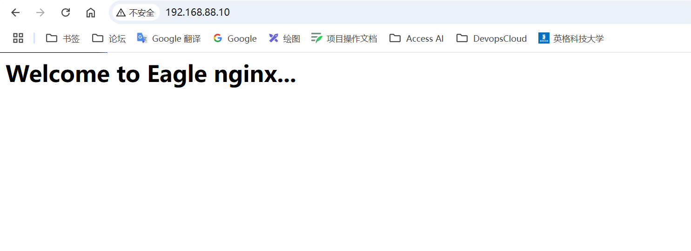
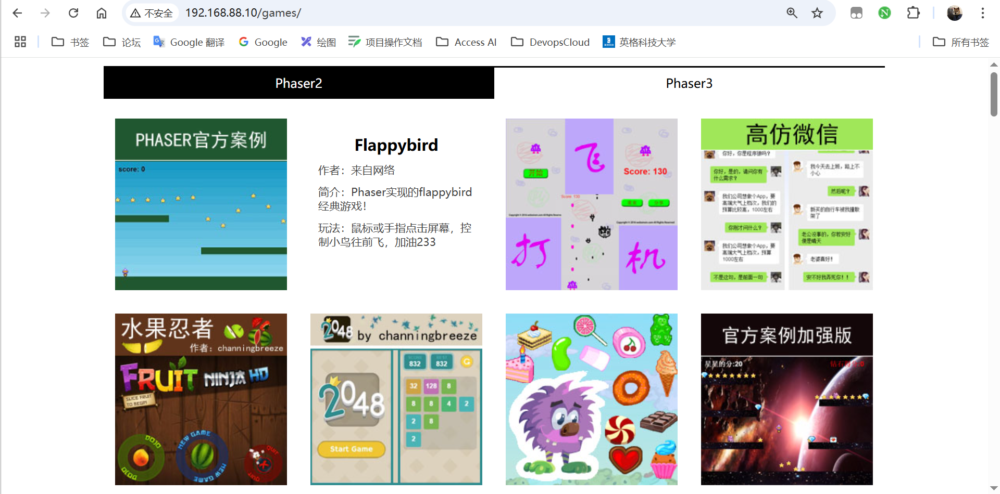
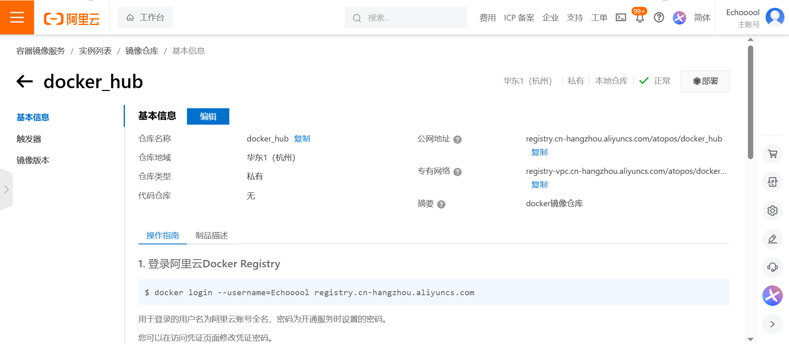

# Docker镜像制作

# 基于rocky手动构建nginx镜像

Docker镜像制作类似于虚拟机的模板制作，即按照公司的实际业务将需要安装的软件、相关配置等基础环境配置完成，然后将容器再提交为模板，最后再批量从模板批量创建新的虚拟机，这样可以极大地简化业务中相同环境的虚拟机运行环境的部署工作，Docker的镜像制作分为手动制作可自动制作（基于DockerFile），企业通常都是基于DockerFile制作镜像。

## 从初始镜像开始构建

一、启动一个RockyLinux容器，安装好nginx以及常用软件

```bash
[root@localhost ~]# docker run -it -d --name mynginx_server rockylinux:9 bash
18914b0f6005e7b20122508f8bc70a830845711ff6200392bf0a7c76dc4a8a60
[root@localhost ~]# docker ps
CONTAINER ID   IMAGE          COMMAND   CREATED         STATUS         PORTS     NAMES
18914b0f6005   rockylinux:9   "bash"    3 seconds ago   Up 2 seconds             mynginx_server
[root@localhost ~]# docker exec -it mynginx_server bash

# 进入容器以后，安装nginx以及一些常用的软件
[root@18914b0f6005 /]# yum install -y epel-release nginx
[root@18914b0f6005 /]# yum install vim wget pcre pcre-devel zlib zlib-devel openssl openssl-devel iproute net-tools iotop -y
```

二、关闭nginx后台运行

```bash
[root@18914b0f6005 /]# vim /etc/nginx/nginx.conf
......
daemon off;
......
```

三、自定义web界面

```bash
[root@18914b0f6005 /]# vim /etc/nginx/nginx.conf
[root@18914b0f6005 /]# echo "<h1>Welcome to Eagle nginx...</h1>" > /usr/share/nginx/html/index.html
```

## 镜像提交

通过commit提交为镜像

```bash
[root@localhost ~]# docker commit --help
Usage:  docker commit [OPTIONS] CONTAINER [REPOSITORY[:TAG]]

Create a new image from a container's changes

Aliases:
  docker container commit, docker commit

Options:
  -a, --author string    Author (e.g., "John Hannibal Smith
                         <hannibal@a-team.com>")
  -c, --change list      Apply Dockerfile instruction to the created image
  -m, --message string   Commit message
  -p, --pause            Pause container during commit (default true)

# 重新打包为新镜像
[root@localhost ~]# docker commit -a "Eagle_nls" -m "my nginx image v1" 18914b0f6005 rocky_nginx:v1
sha256:9411e13b57d003a6d709054ccbbc026a7b005a1727ec470755f987e25ff45a6b
[root@localhost ~]# docker images
REPOSITORY                                          TAG        IMAGE ID       CREATED          SIZE
rocky_nginx                                         v1         9411e13b57d0   33 seconds ago   357MB
mynginx                                             v1         81ef4ae01fed   2 hours ago      190MB
codercom/code-server                                latest     5d9cf2e7e6bb   10 days ago      718MB
neosmemo/memos                                      latest     8f07b54db502   6 weeks ago      65.9MB
```

docker commit**适用场景：**主要作用是将配置好的一些容器复用，再生成新的镜像。
commit是合并了save、load、export、import这几个特性的一个综合性的命令，它主要做了：
1、将container当前的读写层保存下来，保存成一个新层
2、和镜像的历史层一起合并成一个新的镜像

## 从新镜像启动容器

从自己的镜像启动容器

```bash
[root@localhost ~]# docker run -d -p 80:80 --name mynginx_rocky rocky_nginx:v1 /usr/sbin/nginx
dc4225c68d28ffdcc559662b8680f9e4b4b95bdaeeca2f1ed566d638aa8fc8fe
[root@localhost ~]# docker ps
CONTAINER ID   IMAGE            COMMAND             CREATED         STATUS        PORTS                                 NAMES
dc4225c68d28   rocky_nginx:v1   "/usr/sbin/nginx"   2 seconds ago   Up 1 second   0.0.0.0:80->80/tcp, [::]:80->80/tcp   mynginx_rocky
```

访问测试：



# DockerFile制作镜像

Dockerfile 是一种可以被 Docker 程序解释的脚本，它是一个文本文件，包含了一系列指令，用于定义如何构建 Docker 镜像。每一条指令都会创建镜像的一层，最终生成的镜像是由这些层叠加而成的。Dockerfile 中的指令关键字必须大写，执行顺序是从上到下，且每条指令创建一个镜像层。

Docker 程序会读取 Dockerfile 并根据指令生成 Docker 镜像。Dockerfile 的指令类似于 Linux 下的命令，但 Docker 程序会将这些 Dockerfile 指令翻译成真正的 Linux 命令来执行。相比手动制作镜像的方式，Dockerfile 能更直观地展示镜像是如何产生的。有了写好的 Dockerfile 文件，当后期某个镜像有额外的需求时，只需在之前的 Dockerfile 中添加或修改相应的操作，即可重新生成新的 Docker 镜像，避免了重复手动制作镜像的麻烦。

## 指令说明

### 配置指令

| 指令          | 说明                               |
| :------------ | :--------------------------------- |
| `ARG`         | 定义创建镜像过程中使用的变量       |
| `FROM`        | 指定所创建镜像的基础镜像           |
| `LABEL`       | 为生成的镜像添加元数据标签信息     |
| `EXPOSE`      | 声明镜像内服务监听的端口           |
| `ENV`         | 指定环境变量                       |
| `ENTRYPOINT`  | 指定镜像的默认入口命令             |
| `VOLUME`      | 创建一个数据卷挂载点               |
| `USER`        | 指定运行容器时的用户名或UID        |
| `WORKDIR`     | 配置工作目录                       |
| `ONBUILD`     | 创建子镜像时指定自动执行的操作指令 |
| `STOPSIGNAL`  | 指定退出的信号值                   |
| `HEALTHCHECK` | 配置所启动容器如何进行健康检查     |
| `SHELL`       | 指定默认shell类型                  |

### 操作指令

| 指令   | 说明                         |
| :----- | :--------------------------- |
| `RUN`  | 运行指定命令                 |
| `CMD`  | 启动容器时指定默认执行的命令 |
| `ADD`  | 添加内容到镜像               |
| `COPY` | 复制内容到镜像               |

## 配置指令详解

### ARG

定义创建过程中使用到的变量，例如 `HTTP_PROXY`、`HTTPS_PROXY`、`FTP_PROXY`、`NO_PROXY` 等，不区分大小写。

### FROM

指定所创建镜像的基础镜像。为了保证镜像精简，可以选用体积较小的 Alpin 或 Debian 作为基础镜像。

### EXPOSE

声明镜像内服务监听的端口。例如：

```bash
EXPOSE 22 80 8443
```

该指令只是起到声明作用，并不会自动完成端口映射。

### ENTRYPOINT

指定镜像的默认入口命令，该入口命令会在启动容器时作为根命令执行，所有传入值作为该命令的参数。支持两种格式：

- `ENTRYPOINT ["executable","param1","param2"]`（exec 调用执行）
- `ENTRYPOINT command param1 param2`（在 shell 中执行）

此时 `CMD` 指令指定值将作为根命令的参数。每个 Dockerfile 中只能有一个 `ENTRYPOINT`，当指定多个时只有最后一个起效。

### VOLUME

创建一个数据卷挂载点。例如：

```bash
VOLUME ["/data"]
```

### WORKDIR

为后续的 `RUN`、`CMD`、`ENTRYPOINT` 指令配置工作目录。例如：

```bash
WORKDIR /path/to/workdir
```

可以使用多个 `WORKDIR` 指令，后续命令如果参数是相对路径，则会基于之前命令指定的路径。例如：

```bash
WORKDIR /a
WORKDIR b
WORKDIR c
RUN pwd
```

最终路径为 `/a/b/c`。因此，为了避免出错，推荐在 `WORKDIR` 指令中只使用绝对路径。

### 操作指令详解

### RUN

运行指定Linux命令。每条 `RUN` 指令将在当前镜像基础上执行指定命令，并提交为新的镜像层。当命令较长时可以使用 `\` 来换行。

### CMD

`CMD` 指令用来指定启动容器时默认执行的命令。支持三种格式：

- `CMD ["executable","param1","param2"]`（相当于执行 `executable param1 param2`）
- `CMD command param1 param2`（在默认的 shell 中执行，提供给需要交互的应用）
- `CMD ["param1","param2"]`（提供给 `ENTRYPOINT` 的默认参数）

每个 Dockerfile 只能有一条 `CMD` 命令。如果指定了多条命令，只有最后一条会被执行。

### ADD

添加内容到镜像。例如：

```bash
ADD <src> <dest>
```

该命令将复制指定的 `src` 路径下内容到容器中的 `dest` 路径下。`src` 可以是 Dockerfile 所在目录的一个相对路径，也可以是一个 URL，还可以是一个 tar 文件。`dest` 可以是镜像内绝对路径，或者相对于工作目录的相对路径。

### COPY

复制内容到镜像。例如：

```bash
COPY <src> <dest>
```

`COPY` 与 `ADD` 指令功能类似，当使用本地目录为源目录时，推荐使用 `COPY`。

## 制作nginx镜像

DockerFile可以说是一种可以被Docker程序解释的脚本，DockerFIle是由一条条的命令组成的，每条命令对应Linux下面的一条命令，Docker程序将这些DockerFile指令再翻译成真正的Linux命令，其有自己的书写方式和支持的命令，Docker程序读取DockerFile并根据指令生成Docker镜像。

### 基于编译安装制作nginx小游戏网站

#### 环境准备

一、下载镜像

```bash
[root@localhost ~]# docker pull rockylinux:9
```

二、创建所需文件存放的目录环境

```bash
[root@localhost ~]# mkdir -pv dockerfile/nginx
mkdir: created directory 'dockerfile'
mkdir: created directory 'dockerfile/nginx'
```

三、进入到指定目录中

```bash
[root@localhost ~]# cd dockerfile/nginx/
[root@localhost nginx]# pwd
/root/dockerfile/nginx
```

四、下载nginx和小游戏网页的源码包

```bash
[root@localhost nginx]# wget http://nginx.org/download/nginx-1.22.0.tar.gz
[root@localhost nginx]# wget http://file.eagleslab.com:8889/%E8%AF%BE%E7%A8%8B%E7%9B%B8%E5%85%B3%E8%BD%AF%E4%BB%B6/%E4%BA%91%E8%AE%A1%E7%AE%97%E8%AF%BE%E7%A8%8B/%E8%AF%BE%E7%A8%8B%E7%9B%B8%E5%85%B3%E6%96%87%E4%BB%B6/games.tar.gz
[root@localhost nginx]# ll
total 125100
-rw-r--r--. 1 root root 127022187 Jan 18  2022 games.tar.gz
-rw-r--r--. 1 root root   1073322 May 24  2022 nginx-1.22.0.tar.gz
```

#### 编写Dockerfile

一、编写DockerFile

```bash
[root@docker-server nginx]# vim Dockerfile 
# 第一行先定义基础镜像，后面的本地有效的镜像名，如果本地没有，会从远程仓库下载
FROM rockylinux:9

# 镜像作者的信息
MAINTAINER Eagle_nls 2898485992@qq.com

# 接下来在基础镜像之上构建nginx等所需环境

# 1. 编译安装nginx
# 1.1 安装所需环境及工具
RUN yum install -y vim wget unzip tree lrzsz gcc gcc-c++ automake pcre pcre-devel zlib zlib-devel openssl openssl-devel iproute net-tools iotop

# 1.2 上传nginx的官方源码包到指定目录
ADD nginx-1.22.0.tar.gz /usr/local/src/

# 1.3 由于ADD会直接解压好，所以直接编译nginx
RUN cd /usr/local/src/nginx-1.22.0 \
&& ./configure --prefix=/usr/local/nginx --with-http_sub_module \
&& make \
&& make install \
&& cd /usr/local/nginx

# 如果有配置文件，可以上传自己准备好的配置文件
# ADD nginx.conf /usr/local/nginx/conf/nginx.conf

# 2. 完善网站
RUN useradd -s /sbin/nologin nginx \
&& ln -sv /usr/local/nginx/sbin/nginx /usr/sbin/nginx

# 3. 上传小游戏网页源码
ADD games.tar.gz /usr/local/nginx/html/

# 4. 声明端口号
EXPOSE 80 443

# 5. 设定启动时执行命令
CMD ["nginx", "-g", "daemon off;"]
```

#### 构建镜像

一、通过docker build来构建镜像

```bash
[root@localhost nginx]# docker build -t nginx_games:v1 .
[root@localhost nginx]# docker images |grep nginx_games
nginx_games                                         v1         9c86d96dfba0   4 minutes ago       686MB
```

二、镜像运行测试

```bash
[root@localhost nginx]# docker run -d -it -p 80:80 --name nginx_games nginx_games:v1
e3c415425f95b3deac80ecb772d1de2a89e18a611c2ecc603f3c0b175bbea335
[root@localhost nginx]# docker ps
CONTAINER ID   IMAGE            COMMAND                  CREATED         STATUS         PORTS                                          NAMES
e3c415425f95   nginx_games:v1   "nginx -g 'daemon of…"   3 seconds ago   Up 2 seconds   0.0.0.0:80->80/tcp, [::]:80->80/tcp, 443/tcp   nginx_games
```

三、访问测试



# 镜像上传

## 官方docker仓库

- 准备账户

登陆到docker hub官网创建账号，登陆后点击settings完善信息

- 填写账户基本信息


- 登陆仓库

```bash
[root@docker-server ~]# docker login docker.io
Login with your Docker ID to push and pull images from Docker Hub. If you don't have a Docker ID, head over to https://hub.docker.com to create one.
Username: smqy
Password:
WARNING! Your password will be stored unencrypted in /root/.docker/config.json.
Configure a credential helper to remove this warning. See
https://docs.docker.com/engine/reference/commandline/login/#credentials-store

Login Succeeded
[root@docker-server ~]# ls -a 
.                .bash_history  .bashrc  dockerfile    .tcshrc
..               .bash_logout   .cshrc   docker_in.sh  .viminfo
anaconda-ks.cfg  .bash_profile  .docker  .pki
[root@docker-server ~]# cat .docker/config.json 
{
	"auths": {
		"https://index.docker.io/v1/": {
			"auth": "YmJqMTAzMDp6aGFuZ2ppZTEyMw=="
		}
	}
}[root@docker-server ~]# 

```

- 给镜像tag标签并上传

```bash
[root@docker-server ~]# docker tag nginx:v1 docker.io/smqy/nginx:v1
[root@docker-server ~]# docker images
REPOSITORY     TAG       IMAGE ID       CREATED          SIZE
nginx          v1        fbd06c1753c0   12 minutes ago   581MB
smqy/nginx     v1        fbd06c1753c0   12 minutes ago   581MB
centos_nginx   v1        74acdcca8c97   21 hours ago     525MB
nginx          latest    2b7d6430f78d   3 weeks ago      142MB
centos         7         eeb6ee3f44bd   12 months ago    204MB
nginx          1.8       0d493297b409   6 years ago      133MB
[root@docker-server ~]# docker push docker.io/smqy/nginx:v1
The push refers to repository [docker.io/smqy/nginx]
4f86a3bf507f: Pushed
0d11c01ff3ef: Pushed
45fc5772a4e4: Pushed
174f56854903: Mounted from library/centos
v1: digest: sha256:385bfe364839b645f1b2aa70a1d779b0dca50256ea01ccbe4ebde53aabd1d96d size: 1164
```

- 到docker官网进行验证


- 更换到其他docker服务器下载镜像

```bash
[root@docker-server ~]# docker login docker.io
```

## 阿里云仓库

将本地镜像上传至阿里云，实现镜像备份与统一分发的功能

https://cr.console.aliyun.com/

注册并且登录阿里云镜像仓库，创建namespace空间，创建一个普通的镜像仓库



具体如何拉取镜像，上传镜像，可以查看阿里云仓库下方提供的操作指南

### Push镜像案例

一、登录阿里云仓库

```bash
[root@localhost nginx]# docker login --username=Echooool registry.cn-hangzhou.aliyuncs.com

i Info → A Personal Access Token (PAT) can be used instead.
         To create a PAT, visit https://app.docker.com/settings


Password:
Error response from daemon: Get "https://registry.cn-hangzhou.aliyuncs.com/v2/": unauthorized: authentication required
[root@localhost nginx]# docker login --username=Echooool registry.cn-hangzhou.aliyuncs.com

i Info → A Personal Access Token (PAT) can be used instead.
         To create a PAT, visit https://app.docker.com/settings


Password:

WARNING! Your credentials are stored unencrypted in '/root/.docker/config.json'.
Configure a credential helper to remove this warning. See
https://docs.docker.com/go/credential-store/

Login Succeeded
```

二、推送镜像

```bash
# 先给要推送的镜像打上标签
[root@localhost nginx]# docker tag 9c86d96dfba0 registry.cn-hangzhou.aliyuncs.com/atopos/docker_hub:nginx_games-v1

# 推送镜像
docker push registry.cn-hangzhou.aliyuncs.com/atopos/docker_hub:nginx_games-v1
```

三、阿里云查看


四、拉取镜像

```bash
[root@localhost nginx]# docker pull registry.cn-hangzhou.aliyuncs.com/atopos/docker_hub:nginx_games-v1
nginx_games-v1: Pulling from atopos/docker_hub
446f83f14b23: Already exists
d9262d5a1401: Already exists
7330c5b74c49: Already exists
55e1c23f0b49: Already exists
5de772a29709: Already exists
f4819c5e7596: Already exists
Digest: sha256:f9a6ac50b9771c524017304847f3d8b2ffa4acbe01cef9279052272e50a9a3f3
```
