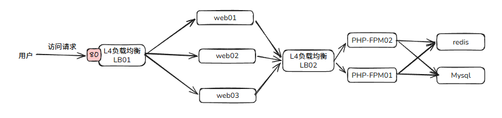

# 1. 实现需求

- 实验按照如下方式架构
  - 只对外暴露80端口



- 配置和程序代码文件结构

```bash
[root@localhost ~]# cd /opt/lnmp
[root@localhost lnmp]# tree
.
├── blog
│   ├── nginx			# 存放blog应用的nginx虚拟主机配置文件
│   ├── php				# 存放blog应用的php-fpm配置文件
│   └── www				# 存放blog引用的源代码
├── lb01				# 存放lb01的配置文件
├── lb02				# 存放lb02的配置文件
├── mysql
│   ├── config			# 存放mysql的配置文件
│   └── data			# 存放mysql的数据
└── redis
    ├── config			# 存放redis的配置文件
    └── data			# 存放redis的数据

12 directories, 0 files
```

# 2. LB01负载均衡

- 将三个web容器启动好
  - 只作为负载均衡测试，所以不挂数据
  - 方便测试，临时端口对外，后续是要删掉的
- 将LB01启动好
  - 配置文件需要持久化

```bash
docker run -d -p 8081:80 --name web01 nginx:latest
docker run -d -p 8082:80 --name web02 nginx:latest
docker run -d -p 8083:80 --name web03 nginx:latest
docker exec web01 sh -c 'echo "web01" > /usr/share/nginx/html/index.html'
docker exec web02 sh -c 'echo "web02" > /usr/share/nginx/html/index.html'
docker exec web03 sh -c 'echo "web03" > /usr/share/nginx/html/index.html'
```

- 在自己电脑上cmd测试一下

```bash
curl 192.168.173.128:8081
web01

curl 192.168.173.128:8082
web02

curl 192.168.173.128:8083
web03
```

- 创建LB01容器
  - 先将原本的配置复制到/opt/lnmp/lb01目录下
  - 配置负载均衡到web01-03

```bash
docker run -d --rm -v /opt/lnmp/lb01:/data nginx:latest cp -r /etc/nginx/. /data
docker run -d --rm -v /opt/lnmp/lb02:/data nginx:latest cp -r /etc/nginx/. /data

cat /opt/lnmp/lb01/nginx.conf
# 注释掉http模块中的include命令
# 在最后追加 
stream {
    upstream web_cluster {
        # 轮询策略（rr是默认值，按顺序分发）
        server web01:80;
        server web02:80;
        server web03:80;
    }
    server {
        listen 80;
        proxy_pass web_cluster;
        
        # 后端连接超时
        proxy_connect_timeout 3s;
        # 后端响应超时
        proxy_timeout 600s;
    }
}

docker rm -f lb01
docker run -d --restart=always \
-p 80:80 \
--name lb01 \
-v `pwd`/lb01:/etc/nginx \
--link web01:web01 \
--link web02:web02 \
--link web03:web03 \
nginx:latest
```

# 3. web服务器

- nginx的web服务器，需要将配置文件，以及源码挂载

```bash
docker run -d --rm -v /opt/lnmp/blog/nginx:/data nginx:latest cp -r /etc/nginx/. /data
```

- 修改虚拟主机文件

```bash
[root@localhost conf.d]# cat default.conf 
server {
    listen 80;
    
    root /usr/share/nginx/html;
    index index.php index.html index.htm;
    
    access_log /var/log/nginx/example.com.access.log;
    error_log /var/log/nginx/example.com.error.log;

    location ~ \.php$ {
        include fastcgi_params;
        fastcgi_pass lb02:9000;
        fastcgi_param SCRIPT_FILENAME $document_root$fastcgi_script_name;
        fastcgi_index index.php;
    }

}
```

- 创建php探针

```bash
[root@localhost www]# cat tz.php 
<?php
    phpinfo();
?>
```

- 为了防止lb01服务出现问题，使用run.sh文件启动nginx服务

```bash
cat run.sh 
#=====web01-03====
docker rm -f web01
docker rm -f web02
docker rm -f web03

docker run -d --restart=always \
        --name web01 \
        -v `pwd`/blog/nginx:/etc/nginx \
        -v `pwd`/blog/www:/usr/share/nginx/html/ \
        nginx:latest

docker run -d --restart=always \
        --name web02 \
        -v `pwd`/blog/nginx:/etc/nginx \
        -v `pwd`/blog/www:/usr/share/nginx/html/ \
        nginx:latest

docker run -d --restart=always \
        --name web03 \
        -v `pwd`/blog/nginx:/etc/nginx \
        -v `pwd`/blog/www:/usr/share/nginx/html/ \
        nginx:latest

sleep 3
#=====LB01=====
docker rm -f lb01
docker run -d --restart=always \
        -p 80:80 \
        --name lb01 \
        -v `pwd`/lb01:/etc/nginx \
        --link web01:web01 \
        --link web02:web02 \
        --link web03:web03 \
        nginx:latest
```

# 4. LB02负载均衡

- 创建两个php-fpm做测试，需要加到run.sh开头，不是直接执行

```bash
docker run -d --name php-fpm01 -v `pwd`/blog/www:/usr/share/nginx/html php:7.4-fpm
docker run -d --name php-fpm02 -v `pwd`/blog/www:/usr/share/nginx/html php:7.4-fpm
```

- 修改lb02的配置文件

```bash
cat /opt/lnmp/lb02/nginx.conf
# 注释掉http模块中的include命令
# 在最后追加 
stream {
    upstream php_cluster {
        # 轮询策略（rr是默认值，按顺序分发）
        server php-fpm01:9000;
        server php-fpm02:9000;
    }
    server {
        listen 9000;
        proxy_pass php_cluster;
        
        # 后端连接超时
        proxy_connect_timeout 3s;
        # 后端响应超时
        proxy_timeout 600s;
    }
}
```

- 创建lb02，也是写到run.sh中

```bash
cat run.sh 
#=====php-fpm01,02=====
docker rm -f php-fpm01
docker rm -f php-fpm02
docker run -d --name php-fpm01 -v `pwd`/blog/www:/usr/share/nginx/html php:7.4-fpm
docker run -d --name php-fpm02 -v `pwd`/blog/www:/usr/share/nginx/html php:7.4-fpm

sleep 3
#=====lb02=====
docker rm -f lb02
docker run -d --name lb02 --restart=always \
        -v `pwd`/lb02:/etc/nginx \
        --link php-fpm01:php-fpm01 \
        --link php-fpm02:php-fpm02 \
        nginx:latest

sleep 3
#=====web01-03====
docker rm -f web01
docker rm -f web02
docker rm -f web03

docker run -d --restart=always \
        --link lb02:lb02 \
        --name web01 \
        -v `pwd`/blog/nginx:/etc/nginx \
        -v `pwd`/blog/www:/usr/share/nginx/html/ \
        nginx:latest

docker run -d --restart=always \
        --link lb02:lb02 \
        --name web02 \
        -v `pwd`/blog/nginx:/etc/nginx \
        -v `pwd`/blog/www:/usr/share/nginx/html/ \
        nginx:latest

docker run -d --restart=always \
        --link lb02:lb02 \
        --name web03 \
        -v `pwd`/blog/nginx:/etc/nginx \
        -v `pwd`/blog/www:/usr/share/nginx/html/ \
        nginx:latest

sleep 3
#=====LB01=====
docker rm -f lb01
docker run -d --restart=always \
        -p 80:80 \
        --name lb01 \
        -v `pwd`/lb01:/etc/nginx \
        --link web01:web01 \
        --link web02:web02 \
        --link web03:web03 \
        nginx:latest
```

# 5. php-fpm镜像构建

- Dockerfile参考如下，在本案例中，Dockerfile文件放在了/opt/lnmp/build目录下

```bash
FROM php:7.4-fpm

ARG DEBIAN_FRONTEND=noninteractive

RUN set -eux; \
    # 1. 替换 Debian APT 源为阿里云镜像（加速系统包下载）
    sed -i 's/deb.debian.org/mirrors.aliyun.com/g' /etc/apt/sources.list; \
    sed -i 's/security.debian.org/mirrors.aliyun.com/g' /etc/apt/sources.list; \
    \
    # 2. 更新包索引
    apt-get update; \
    \
    # 3. 安装系统依赖（包含 ca-certificates 确保 HTTPS 可用）
    apt-get install -y --no-install-recommends \
        libzip-dev \
        libonig-dev \
        $PHPIZE_DEPS \
        ca-certificates; \
    \
    # 4. 配置 PECL（阿里云已失效，改用华为云镜像）
    pecl channel-update pecl.php.net; \
    (pecl config-set preferred_mirror https://repo.huaweicloud.com/repository/pecl/ || \
     pecl config-set preferred_mirror https://mirrors.tuna.tsinghua.edu.cn/pecl/ || \
     true); \
    \
    # 5. 安装 mysqli 扩展（PHP 7.4 使用 mysqlnd，无需额外 MySQL 客户端库）
    docker-php-ext-install -j$(nproc) mysqli pdo_mysql; \
    \
    # 6. 安装 Redis 扩展（6.0.2 兼容 PHP 7.4，-n 非交互模式）
    pecl install -n redis-6.0.2; \
    docker-php-ext-enable redis; \
    \
    # 7. 清理构建缓存（减小镜像体积，关键步骤）
    apt-get purge -y --auto-remove $PHPIZE_DEPS; \
    rm -rf /var/lib/apt/lists/* /tmp/* /var/tmp/* /usr/src/php/src/* /usr/src/php.tar.gz

EXPOSE 9000
CMD ["php-fpm"]
```

- 构建支持mysqli和redis的php-fpm镜像

```bash
cd /opt/lnmp/build
docker build -t myphp:7.4-fpm .
```

- 修改run.sh中的php-fpm容器的镜像，改为myphp:7.4-fpm，然后重新运行整个环境

# 6. mysql数据库节点

- mysql容器在启动的时候，需要指定root密码以及data的映射目录

```bash
# 在run.sh中加上
docker run -d --restart=always \
        --name mysql \
        -e MYSQL_ROOT_PASSWORD=123456 \
        -v `pwd`/mysql/config:/etc/mysql/conf.d \
        -v `pwd`/mysql/data:/var/lib/mysql \
        mysql:5.7
```

- 创建数据库测试的php文件

```bash
cat /opt/lnmp/blog/www/test_db.php
<?php
// ========== 安全提示 ==========
// ⚠️ 测试完成后请立即删除此脚本！切勿留在生产环境！

// ========== 错误报告 ==========
error_reporting(E_ALL);
ini_set('display_errors', 1);

// ========== 【用户必填】数据库连接配置 ==========
$dbConfig = [
    'host'     => 'mysql',      // 本地用127.0.0.1，Docker用服务名
    'port'     => 3306,             // 默认3306
    'username' => 'root',           // 用户名
    'password' => '123456',        // 密码
    'dbname'   => 'test',           // 目标数据库名（不存在将自动创建）
    'charset'  => 'utf8mb4'         // 字符集
];

// ========== 检测扩展 ==========
if (!extension_loaded('mysqli')) {
    die("❌ 错误：PHP未加载mysqli扩展，请先安装");
}

// ========== 第一步：连接到MySQL服务器（不指定数据库） ==========
$mysqli = new mysqli();
$host = $dbConfig['host'] . ':' . $dbConfig['port'];

if (!$mysqli->real_connect($host, $dbConfig['username'], $dbConfig['password'], null, $dbConfig['port'])) {
    die("❌ MySQL服务器连接失败！<br>错误代码：" . $mysqli->connect_errno . "<br>错误原因：" . $mysqli->connect_error);
}

echo "<h3>✅ 成功连接到MySQL服务器</h3>";
echo "<ul><li><b>服务器：</b>" . htmlspecialchars($dbConfig['host']) . ":" . $dbConfig['port'] . "</li>";
echo "<li><b>当前用户：</b>" . htmlspecialchars($mysqli->user) . "</li></ul>";

// ========== 第二步：检查并创建数据库 ==========
$targetDb = $dbConfig['dbname'];

// 查询数据库是否存在（使用反引号防止保留字冲突）
$result = $mysqli->query("SHOW DATABASES LIKE '" . $mysqli->real_escape_string($targetDb) . "'");
$dbExists = ($result && $result->num_rows > 0);

if (!$dbExists) {
    echo "<p>⚠️ 数据库 <b>$targetDb</b> 不存在，正在尝试创建...</p>";
    
    // 创建数据库（指定UTF8MB4字符集）
    $createSql = "CREATE DATABASE IF NOT EXISTS `$targetDb` CHARACTER SET utf8mb4 COLLATE utf8mb4_unicode_ci";
    
    if ($mysqli->query($createSql)) {
        echo "<p>✅ 数据库 <b>$targetDb</b> 创建成功！</p>";
    } else {
        echo "<p>❌ 数据库 <b>$targetDb</b> 创建失败！<br>";
        echo "错误代码：" . $mysqli->errno . "<br>";
        echo "错误原因：" . $mysqli->error . "</p>";
        
        // 权限错误提示
        if (in_array($mysqli->errno, [1044, 1045, 1227])) {
            echo "<p>💡 <b>可能原因：</b><br>";
            echo "1. 当前用户没有 CREATE DATABASE 权限<br>";
            echo "2. 请手动执行：<code>CREATE DATABASE $targetDb;</code><br>";
            echo "3. 或授权：<code>GRANT ALL ON *.* TO '" . htmlspecialchars($dbConfig['username']) . "'@'%' IDENTIFIED BY '密码';</code></p>";
        }
        
        $mysqli->close();
        exit;
    }
} else {
    echo "<p>✅ 数据库 <b>$targetDb</b> 已存在，跳过创建。</p>";
}

// ========== 第三步：切换到目标数据库 ==========
if (!$mysqli->select_db($targetDb)) {
    die("❌ 无法选择数据库 $targetDb：" . $mysqli->error);
}

// 设置字符集
if (!$mysqli->set_charset($dbConfig['charset'])) {
    die("❌ 设置字符集失败：" . $mysqli->error);
}

// ========== 第四步：执行测试查询 ==========
echo "<h4>📊 数据库信息测试：</h4><ul>";

// 1. 获取MySQL版本
$res = $mysqli->query("SELECT VERSION() as ver");
if ($res) {
    $row = $res->fetch_assoc();
    echo "<li><b>MySQL版本：</b>" . htmlspecialchars($row['ver']) . "</li>";
    $res->free();
}

// 2. 获取当前用户
$res = $mysqli->query("SELECT USER() as user, DATABASE() as db");
if ($res) {
    $row = $res->fetch_assoc();
    echo "<li><b>登录用户：</b>" . htmlspecialchars($row['user']) . "</li>";
    echo "<li><b>当前数据库：</b>" . htmlspecialchars($row['db']) . "</li>";
    $res->free();
}

echo "</ul>";

// ========== 第五步：权限测试（创建/删除表） ==========
echo "<h4>🔧 权限测试：</h4>";
$testTable = 'test_conn_' . time();

// 测试创建表
if ($mysqli->query("CREATE TABLE `$testTable` (id INT PRIMARY KEY, created_at TIMESTAMP DEFAULT CURRENT_TIMESTAMP) ENGINE=InnoDB DEFAULT CHARSET=utf8mb4")) {
    echo "<p>✅ 表创建权限：<b>通过</b></p>";
    
    // 测试插入
    if ($mysqli->query("INSERT INTO `$testTable` (id) VALUES (1)")) {
        echo "<p>✅ 数据插入权限：<b>通过</b></p>";
    } else {
        echo "<p>⚠️ 数据插入失败：" . htmlspecialchars($mysqli->error) . "</p>";
    }
    
    // 测试查询
    $res = $mysqli->query("SELECT * FROM `$testTable`");
    if ($res) {
        echo "<p>✅ 数据查询权限：<b>通过</b>（共 " . $res->num_rows . " 条）</p>";
        $res->free();
    }
    
    // 删除测试表
    $mysqli->query("DROP TABLE `$testTable`");
    echo "<p>✅ 测试表已清理</p>";
} else {
    echo "<p>❌ 表创建失败（当前用户可能缺少 CREATE TABLE 权限）：<br>" . htmlspecialchars($mysqli->error) . "</p>";
}

// ========== 第六步：关闭连接 ==========
$mysqli->close();

echo "<hr><small style='color:red;'>⚠️ 测试完成，请立即删除此脚本！</small>";
?>
```

# 7. redis节点

- 本案例中redis用于保持session的信息

```bash
docker run -d --restart=always \
-v `pwd`/redis/config:/usr/local/etc/redis \
-v `pwd`/redis/data:/data \
--name redis \
redis:7.4 \
redis-server --save 60 1 --loglevel warning
```

- 修改php的配置，以支持redis保存session信息

```bash
# 将原本的配置复制出来
docker run -d -v /opt/lnmp/blog/php:/data --rm myphp:7.4-fpm cp -r /usr/local/etc/. /data

# 修改php-fpm的启动命令，将这个外挂的配置加上
docker run -d --restart=always \
        --link mysql:mysql \
        --link redis:redis \
        --name php-fpm01 \
        -v `pwd`/blog/www:/usr/share/nginx/html \
        -v `pwd`/blog/php:/usr/local/etc \
        myphp:7.4-fpm

# 编辑php.ini文件
cd /opt/lnmp/blog/php/php
cp php.ini-development php.ini
[root@localhost php]# cat php.ini |grep session.save
session.save_handler = redis
session.save_path = "tcp://redis:6379"
```

- blog项目的源码放在www目录下，需要nginx的用户有写权限

```bash
[root@localhost blog]# chmod o+w -R www/
[root@localhost blog]# ll -l
total 4
drwxr-xr-x 3 root root  132 Jul 16 11:26 nginx
drwxr-xr-x 4 root root   99 Jul 16 14:27 php
drwxr-xrwx 4 root root 4096 Jul 16 15:10 www
```

- 部署网站完成后，正常登录，可以看到redis的key和value

```bash
[root@localhost blog]# redis-cli -h 172.17.0.10
172.17.0.10:6379> keys *
1) "PHPREDIS_SESSION:50i7g4lp71mf7bi7h369b4amja"
```

- 清空session后，会话失效

```bash
172.17.0.10:6379> flushdb
OK
```

- 最终的run.sh脚本

```bash
[root@localhost lnmp]# cat run.sh 
#=====redis====
docker rm -f redis
docker run -d --restart=always \
        -v `pwd`/redis/config:/usr/local/etc/redis \
        -v `pwd`/redis/data:/data \
        --name redis \
        redis:7.4 \
        redis-server --save 60 1 --loglevel warning

sleep 3
#====mysql======
docker rm -f mysql
docker run -d --restart=always \
        --name mysql \
        -e MYSQL_ROOT_PASSWORD=123456 \
        -v `pwd`/mysql/config:/etc/mysql/conf.d \
        -v `pwd`/mysql/data:/var/lib/mysql \
        mysql:5.7

sleep 3
#=====php-fpm01,02=====
docker rm -f php-fpm01
docker rm -f php-fpm02
docker run -d --restart=always \
        --link mysql:mysql \
        --link redis:redis \
        --name php-fpm01 \
        -v `pwd`/blog/www:/usr/share/nginx/html \
        -v `pwd`/blog/php:/usr/local/etc \
        myphp:7.4-fpm
docker run -d --restart=always \
        --link mysql:mysql \
        --link redis:redis \
        --name php-fpm02 \
        -v `pwd`/blog/www:/usr/share/nginx/html \
        -v `pwd`/blog/php:/usr/local/etc \
        myphp:7.4-fpm

sleep 3
#=====lb02=====
docker rm -f lb02
docker run -d --name lb02 --restart=always \
        -v `pwd`/lb02:/etc/nginx \
        --link php-fpm01:php-fpm01 \
        --link php-fpm02:php-fpm02 \
        nginx:latest

sleep 3
#=====web01-03====
docker rm -f web01
docker rm -f web02
docker rm -f web03

docker run -d --restart=always \
        --link lb02:lb02 \
        --name web01 \
        -v `pwd`/blog/nginx:/etc/nginx \
        -v `pwd`/blog/www:/usr/share/nginx/html/ \
        nginx:latest

docker run -d --restart=always \
        --link lb02:lb02 \
        --name web02 \
        -v `pwd`/blog/nginx:/etc/nginx \
        -v `pwd`/blog/www:/usr/share/nginx/html/ \
        nginx:latest

docker run -d --restart=always \
        --link lb02:lb02 \
        --name web03 \
        -v `pwd`/blog/nginx:/etc/nginx \
        -v `pwd`/blog/www:/usr/share/nginx/html/ \
        nginx:latest

sleep 3
#=====LB01=====
docker rm -f lb01
docker run -d --restart=always \
        -p 80:80 \
        --name lb01 \
        -v `pwd`/lb01:/etc/nginx \
        --link web01:web01 \
        --link web02:web02 \
        --link web03:web03 \
        nginx:latest
```