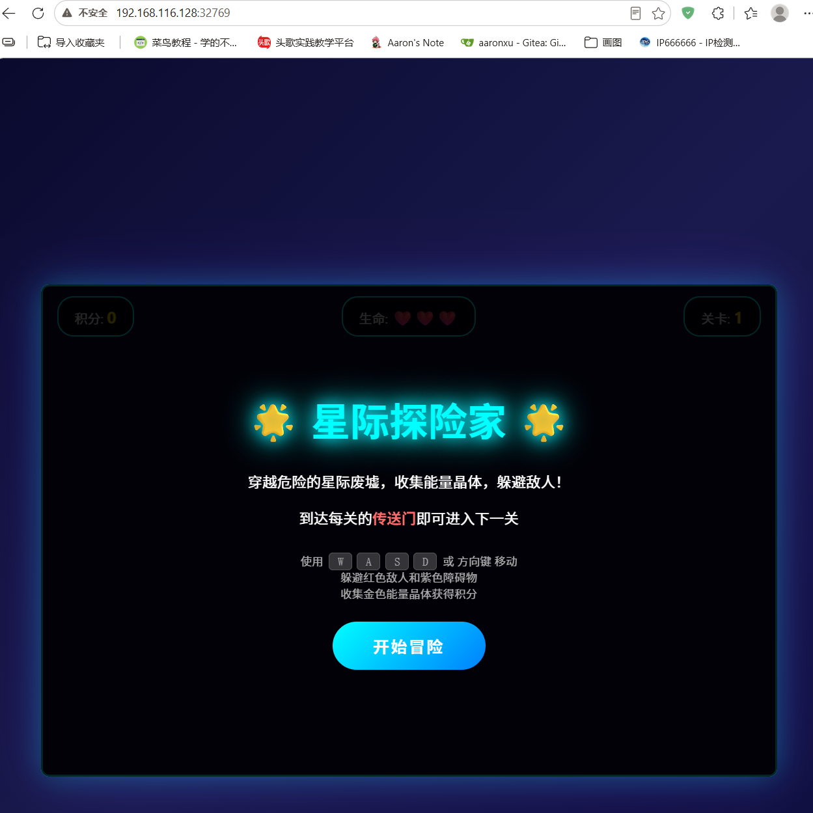
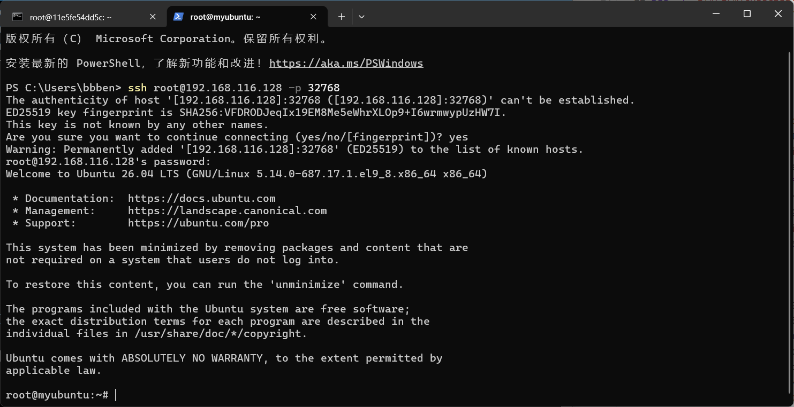

# 背景介绍
Docker 镜像制作类似于虚拟机的模板制作，即按照公司的实际业务将需要安装的软件、相关配置等基础环境配置完成，然后将虚拟机再提交为模板，最后再批量从模板批量创建新的虚拟机，这样可以极大地简化业务中相同环境的虚拟机运行环境的部署工作，Docker的镜像制作分为手动制作可自动制作（基于 DockerFile ），企业通常都是基于 DockerFile 制作镜像。

# 手动制作nginx镜像
```shell
[root@localhost ~]# docker images -a
                                                                                i Info →   U  In Use
IMAGE            ID             DISK USAGE   CONTENT SIZE   EXTRA
centos:7         be65f488b776        299MB         76.1MB        
nginx:latest     ec4ed8b5299e        238MB           66MB        
rockylinux:9.3   d7be1c094cc5        260MB         68.9MB        
[root@localhost ~]# docker run -it rockylinux:9.3 
[root@9385ad25ca5d /]# yum -y install nginx vim
[root@9385ad25ca5d /]# vim /etc/nginx/nginx.conf		# 关闭nginx后台运行
user nginx;
worker_processes auto;
error_log /var/log/nginx/error.log;
pid /run/nginx.pid;
daemon off;
# 定义web界面
[root@9385ad25ca5d /]# echo "dockerhahaha!" > /usr/share/nginx/html/index.html 
[root@9385ad25ca5d /]# grep daemon /etc/nginx/nginx.conf
daemon off;

# 提交为镜像
Usage:  docker commit [OPTIONS] CONTAINER [REPOSITORY[:TAG]]
[root@localhost ~]# docker commit -a "bbben" -m "nginx server v1" 9385ad25ca5d rocky_nginx:v1
sha256:e6d0ecc1f8d8972ed21bc7755cd160dcec35e735f191f966e3caa81964e8881d
[root@localhost ~]# docker images
                                                                                i Info →   U  In Use
IMAGE            ID             DISK USAGE   CONTENT SIZE   EXTRA
centos:7         be65f488b776        299MB         76.1MB        
nginx:latest     ec4ed8b5299e        238MB           66MB        
rocky_nginx:v1   e6d0ecc1f8d8        439MB          126MB        
rockylinux:9.3   d7be1c094cc5        260MB         68.9MB    U   

# 通过rocky_nginx:v1镜像启动容器
[root@localhost ~]# docker run -d -p 80:80 --name my_nginx rocky_nginx:v1 /usr/sbin/nginx
4efead6eea38edcd73c5a66c05de560c490ba7603bff3d15b29a5e8083273beb
[root@localhost ~]# curl 192.168.116.128
dockerhahaha!
```
**适用场景**：主要作用是将配置好的一些容器复用，再生成新的镜像。
commit是合并了save、load、export、import这几个特性的一个综合性的命令，它主要做了：

1. 将容器当前的读写层保存成一个新层。
2. 和镜像的历史层一起合并成一个新的镜像
3. 如果原本的镜像有3层，commit之后就会有4层，最新的一层为从镜像运行到commit之间对文件系统的修改。

# DockerFile制作镜像
DockerFile可以说是一种可以被Docker程序解释的脚本，DockerFile是由一条条的命令组成的，每条命令对应linux下面的一条命令，Docker程序将这些DockerFile指令再翻译成真正的linux命令，其有自己的书写方式和支持的命令，Docker程序读取DockerFile并根据指令生成Docker镜像，相比手动制作镜像的方式，DockerFile更能直观地展示镜像是怎么产生的，有了写好的各种各样的DockerFIle文件，当后期某个镜像有额外的需求时，只要在之前的DockerFile添加或者修改相应的操作即可重新生成新的Docker镜像，避免了重复手动制作镜像的麻烦。

## 最佳实践
```shell
# Dockerfile
## 使用官方 Ubuntu 22.04 LTS 作为基础镜像
FROM ubuntu:22.04

## 设置环境变量避免交互式提示
ENV DEBIAN_FRONTEND=noninteractive

## 安装 Nginx 并清理缓存（合并操作用于减少镜像层）
RUN apt-get update && \
    apt-get install -y \
    nginx \
    # 安装常用工具（可选）
    curl \
    vim-tiny && \
    # 清理APT缓存
    apt-get clean && \
    rm -rf /var/lib/apt/lists/*

## 删除默认配置文件（按需保留）
RUN rm /etc/nginx/sites-enabled/default

## 暴露 HTTP 和 HTTPS 端口
EXPOSE 80 443

## 创建日志目录（确保日志可持久化）
RUN mkdir -p /var/log/nginx && \
    chown -R www-data:www-data /var/log/nginx

## 添加自定义配置（示例文件需存在于构建上下文）
# COPY nginx.conf /etc/nginx/nginx.conf
# COPY sites-available/ /etc/nginx/sites-available/

## 设置健康检查
HEALTHCHECK --interval=30s --timeout=3s \
    CMD curl -f http://localhost/ || exit 1

## 以非root用户运行（Ubuntu官方nginx包已使用www-data用户）
USER www-data

## 启动Nginx并保持前台运行
CMD ["nginx", "-g", "daemon off;"]

# 通过Dockerfile构建镜像
[root@docker-server ~]# docker build -t nginx:v1 .
```
## 优化说明
- 层合并: 将多个`RUN`指令合并以减少镜像层数
- 缓存清理: 清理APT缓存减小镜像体积
- 安全实践: 非root用户运行；只读挂载配置文件
- 可维护性: 显式声明暴露端口；健康检查配置；日志目录持久化
- 稳定性: 指定精确的ubuntu版本；禁用Nginx后台模式
  

## 指令说明
操作指令

| 指令   | 说明                         |
| ------ | ---------------------------- |
| `RUN`  | 运行指定命令                 |
| `CMD`  | 启动容器时指定默认执行的命令 |
| `ADD`  | 添加内容到镜像               |
| `COPY` | 复制内容到镜像               |

配置指令

| 指令          | 说明                               |
| ------------- | ---------------------------------- |
| `ARG`         | 定义创建镜像过程中使用的变量       |
| `FROM`        | 指定所创建镜像的基础镜像           |
| `LABEL`       | 为生成的镜像添加元数据标签信息     |
| `EXPOSE`      | 声明镜像内服务监听的端口           |
| `ENV`         | 指定环境变量                       |
| `ENTRYPOINT`  | 指定镜像的默认入口命令             |
| `VOLUME`      | 创建一个数据卷挂载点               |
| `USER`        | 指定运行容器时的用户名或UID        |
| `WORKDIR`     | 配置工作目录                       |
| `ONBUILD`     | 创建子镜像时指定自动执行的操作指令 |
| `STOPSIGNAL`  | 指定退出的信号值                   |
| `HEALTHCHECK` | 配置所启动容器如何进行健康检查     |
| `SHELL`       | 指定默认shell类型                  |


**注意事项**
```shell
# RUN
- 运行指定命令
- 每条RUN指令将在当前镜像基础上执行指定命令，并提交为新的镜像层
- 当命令较长时可以使用\来换行

# CMD
- 每个Dockerfile只能有一条CMD命令。如果指定了多条命令，只有最后一条会被执行
- CMD指令用来指定启动容器时默认执行的命令,支持三种格式:
    CMD ["executable","param1","param2"] 
    CMD command param1 param2`
    CMD ["param1","param2"]

# ADD
- 该命令将复制指定的src路径下内容到容器中的dest路径下
- src可以是DockerFIle所在目录的一个相对路径，也可以是一个url，还可以是一个tar
- dest可以是镜像内绝对路径，或者相对于工作目录的相对路径

# COPY
- COPY与ADD指令功能类似，当使用本地目录为源目录时，推荐使用COPY

# ARG
- 定义创建过程中使用到的变量；比如:HTTP_PROXY 、HTTPS_PROXY 、FTP_PROXY 、NO_PROXY不区分大小写。

# FROM
- 指定所创建镜像的基础镜像：为了保证镜像精简，可以选用体积较小的Alpin或Debian作为基础镜像

# EXPOSE
- 声明镜像内服务监听的端口：该指令只是起到声明作用，并不会自动完成端口映射

# ENTRYPOINT
- 指定镜像的默认入口命令，该入口命令会在启动容器时作为根命令执行，所有传入值作为该命令的参数支持两种格式:
    ENTRYPOINT ["executable","param1","param2"]
    ENTRYPOINT command param1 param2
- 此时CMD指令指定值将作为根命令的参数
- 每个DockerFile中只能有一个ENTRYPOINT，当指定多个时只有最后一个起效

# VOLUME: 创建一个数据卷挂载点

# WORKDIR
- 为后续的RUN、CMD、ENTRYPOINT指令配置工作目录：建议使用绝对路径
```

## DockerFile实践

```bash
[root@localhost ~]# mkdir web_game
[root@localhost ~]# cd web_game
[root@localhost web_game]# vim Dockerfile	# 构建Dockfile
FROM rockylinux:9.3

RUN yum -y install nginx && \
echo "daemon off;" >> /etc/nginx/nginx.conf && \
yum clean all && rm -rf /usr/share/nginx/html/*
ADD index.html /usr/share/nginx/html

EXPOSE 80
ENTRYPOINT ["/usr/sbin/nginx"]

# 构建index.html文件
[root@localhost web_game]# vim index.html
。。。

# 构建镜像
[root@localhost web_game]# docker build -t web_game:v1 .
[+] Building 39.9s (8/8) FINISHED                                                    docker:default
 => [internal] load build definition from Dockerfile                                           0.0s
 => => transferring dockerfile: 232B                                                           0.0s
 => [internal] load metadata for docker.io/library/rockylinux:9.3                              0.0s
 => [internal] load .dockerignore                                                              0.0s
 => => transferring context: 2B                                                                0.0s
 => CACHED [1/3] FROM docker.io/library/rockylinux:9.3@sha256:d7be1c094cc5845ee815d4632fe3775  0.1s
 => => resolve docker.io/library/rockylinux:9.3@sha256:d7be1c094cc5845ee815d4632fe377514ee6eb  0.1s
 => [internal] load build context                                                              0.0s
 => => transferring context: 33B                                                               0.0s
 => [2/3] RUN yum -y install nginx && echo "daemon off;" >> /etc/nginx/nginx.conf && yum cle  34.5s
 => [3/3] ADD index.html /usr/share/nginx/html                                                 0.1s
 => exporting to image                                                                         5.0s 
 => => exporting layers                                                                        4.0s 
 => => exporting manifest sha256:d027345d5625261bcd87a370cf1b7ce74cb8d10fc6a4262bb5e347c4cd2f  0.0s 
 => => exporting config sha256:59aef169ec3855cd0d16a17a1d4bdd7969d3818d48191cf3afdf51fd78d434  0.0s 
 => => exporting attestation manifest sha256:a0852ed8eaf42bbbfb16d15233dbf7774abdfaa1a97a3416  0.0s 
 => => exporting manifest list sha256:7e56a049dd9472e0fbf8efd0627ee0efefbedfd545378392f848104  0.0s
 => => naming to docker.io/library/web_game:v1                                                 0.0s
 => => unpacking to docker.io/library/web_game:v1                                              0.9s
[root@localhost web_game]# docker images -a
                                                                                i Info →   U  In Use
IMAGE            ID             DISK USAGE   CONTENT SIZE   EXTRA
centos:7         be65f488b776        299MB         76.1MB        
nginx:latest     ec4ed8b5299e        238MB           66MB        
rocky_nginx:v1   e6d0ecc1f8d8        439MB          126MB    U   
rockylinux:9.3   d7be1c094cc5        260MB         68.9MB        
web_game:v1      7e56a049dd94        310MB         78.9MB        

# 启动容器，端口号随机映射
[root@localhost web_game]# docker run -d -P web_game:v1 
ed48ba9ed132e7bf5fa22b384237492ec5ad52ee38408c960d311fc016845ee5
[root@localhost web_game]# docker ps -a
CONTAINER ID   IMAGE            COMMAND             CREATED          STATUS          PORTS                                       NAMES
ed48ba9ed132   web_game:v1      "/usr/sbin/nginx"   6 seconds ago    Up 6 seconds    0.0.0.0:32769->80/tcp, [::]:32769->80/tcp   confident_merkle
4efead6eea38   rocky_nginx:v1   "/usr/sbin/nginx"   37 minutes ago   Up 37 minutes   0.0.0.0:80->80/tcp, [::]:80->80/tcp         my_nginx
```



-----------------

- 构建可以ssh的ubuntu镜像

```bash
[root@localhost ~]# mkdir myubuntu
[root@localhost ~]# cd myubuntu/
[root@localhost myubuntu]# vim Dockerfile
FROM ubuntu:26.04

ENV DEBIAN_FRONTEND=noninteractive
ENV TZ=Asia/Shanghai
ENV APP_VERSION=v1.0

RUN apt update \
  && ln -snf /usr/share/zoneinfo/$TZ /etc/localtime \
  && echo "$TZ" > /etc/timezone \
  && apt install -y vim net-tools openssh-server iputils-ping iproute2 python3 \
  && sed -i "s/#PermitRootLogin prohibit-password/PermitRootLogin yes/" /etc/ssh/sshd_config \
  && echo 1 | passwd --stdin root \
  && apt clean

EXPOSE 22 8000

CMD ["/usr/sbin/sshd", "-D"]

[root@localhost myubuntu]# docker build -t myubuntu:v2 /root/myubuntu/
[+] Building 258.7s (6/6) FINISHED                                                           docker:default
 => [internal] load build definition from Dockerfile                                                   0.0s
 => => transferring dockerfile: 514B                                                                   0.0s
 => [internal] load metadata for docker.io/library/ubuntu:26.04                                        0.0s
 => [internal] load .dockerignore                                                                      0.0s
 => => transferring context: 2B                                                                        0.0s
 => CACHED [1/2] FROM docker.io/library/ubuntu:26.04@sha256:b7f48194d4d8b763a478a621cdc81c27be222ba22  0.1s
 => => resolve docker.io/library/ubuntu:26.04@sha256:b7f48194d4d8b763a478a621cdc81c27be222ba2206ca3ca  0.1s
 => [2/2] RUN apt update   && ln -snf /usr/share/zoneinfo/Asia/Shanghai /etc/localtime   && echo "A  223.2s
 => exporting to image                                                                                35.2s 
 => => exporting layers                                                                               25.8s 
 => => exporting manifest sha256:d932388694458b2cd2eb9349d357d4a2a6ff4a6d0eacef4693f625ce9d4a9204      0.0s 
 => => exporting config sha256:2afa22f6bb2a2f7fd66f4480b7a9a436bd08f6c5469bc39e9d81500926d334ec        0.0s 
 => => exporting attestation manifest sha256:ed3ff5695bbf4b2c29e43b1bc632dec85bb2fd2209e2ede19f8ee177  0.0s 
 => => exporting manifest list sha256:df14cafdae1e93e79e1d0c1b5dc6151098ec4c9cfc5cf9c594a0c9b887d323c  0.0s 
 => => naming to docker.io/library/myubuntu:v2                                                         0.0s
 => => unpacking to docker.io/library/myubuntu:v2                                                      9.1s
[root@localhost myubuntu]# docker images -l
unknown shorthand flag: 'l' in -l

Usage:  docker images [OPTIONS] [REPOSITORY[:TAG]]

Run 'docker images --help' for more information

[root@localhost ~]# docker run -d -P --hostname myubuntu myubuntu:v2
6b9a8c0c5e487dcaefcc0ab0075217a0eb67a1ca8478ccc86796ea03712a38a2
[root@localhost ~]# docker ps -a
CONTAINER ID   IMAGE            COMMAND               CREATED          STATUS          PORTS                                                                                      NAMES
6b9a8c0c5e48   myubuntu:v2      "/usr/sbin/sshd -D"   6 seconds ago    Up 5 seconds    0.0.0.0:32768->22/tcp, [::]:32768->22/tcp, 0.0.0.0:32769->8000/tcp, [::]:32769->8000/tcp   wizardly_darwin
11e5fe54dd5c   myubuntu:26.04   "/usr/sbin/sshd -D"   53 minutes ago   Up 53 minutes   0.0.0.0:8022->22/tcp, [::]:8022->22/tcp                                                    naughty_satoshi
```

