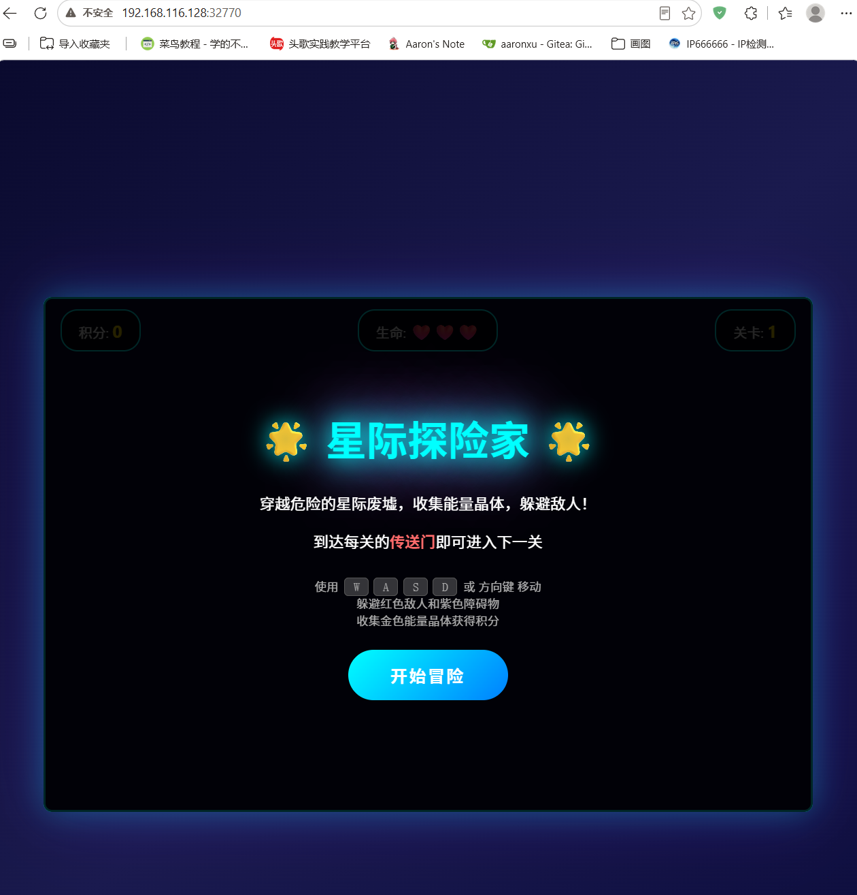
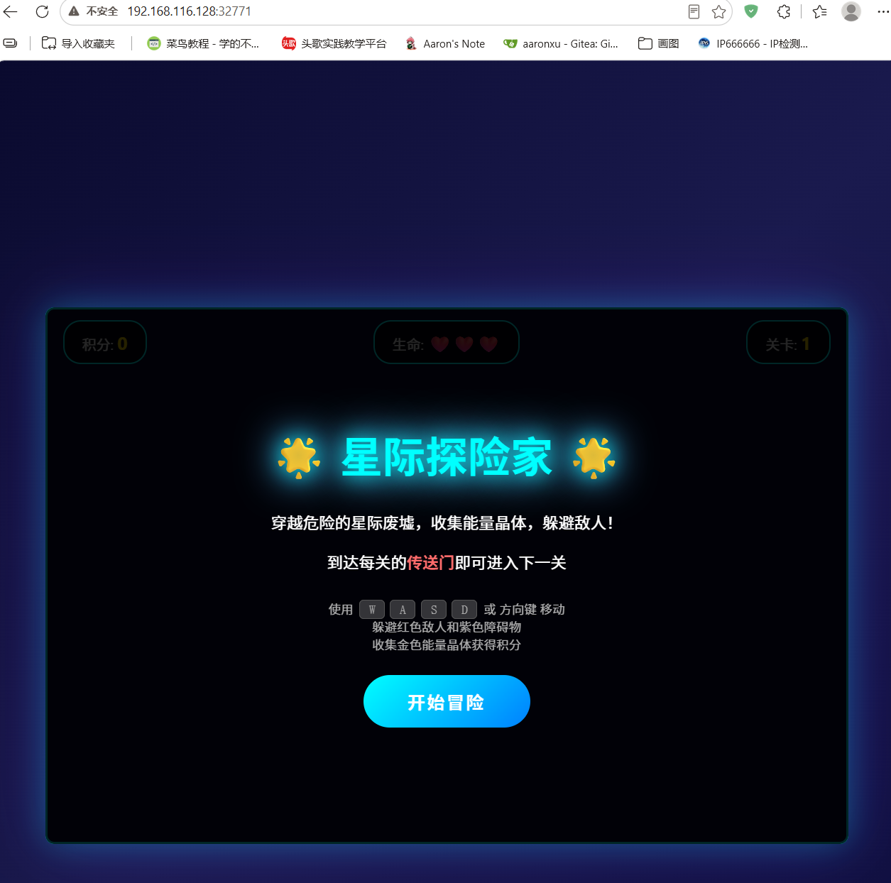

# 存储
## 介绍
默认情况下，容器内创建的所有文件都存储在可写的容器层上，该层位于只读、不可变的图像层之上。

写入容器层的数据在容器销毁后不会保留。这意味着，如果其他进程需要这些数据，则很难将其从容器中取出。

每个容器的可写层都是唯一的。无法将数据从可写层提取到主机或其他容器。

```bash
[root@localhost web_game]# docker inspect rockylinux:9.3
[
    {
        "Id": "sha256:d7be1c094cc5845ee815d4632fe377514ee6ebcf8efaed6892889657e5ddaaa6",
        "RepoTags": [
            "rockylinux:9.3"
        ],
        "RepoDigests": [
            "rockylinux@sha256:d7be1c094cc5845ee815d4632fe377514ee6ebcf8efaed6892889657e5ddaaa6"
        ],
        "Comment": "buildkit.dockerfile.v0",
        "Created": "2023-11-28T20:08:58Z",
        "Config": {
            "Env": [
                "PATH=/usr/local/sbin:/usr/local/bin:/usr/sbin:/usr/bin:/sbin:/bin"
            ],
            "Cmd": [
                "/bin/bash"
            ],
            "WorkingDir": "/",
            "ArgsEscaped": true
        },
        "Architecture": "amd64",
        "Os": "linux",
        "Size": 64317141,
        "RootFS": {
            "Type": "layers",
            "Layers": [
                "sha256:44343de3ea1d3f71f143967c71a91df76138a17a21ac56642f3c0f2a64b07dce"
            ]
        },
        "Metadata": {
            "LastTagTime": "2026-07-14T06:00:38.183334021Z"
        },
        "Descriptor": {
            "mediaType": "application/vnd.oci.image.index.v1+json",
            "digest": "sha256:d7be1c094cc5845ee815d4632fe377514ee6ebcf8efaed6892889657e5ddaaa6",
            "size": 4717
        },
        "Identity": {
            "Pull": [
                {
                    "Repository": "docker.io/library/rockylinux"
                }
            ]
        }
    }
]

```


## 存储挂载选项

| 挂载类型 | 说明 | 使用场景 | 特点 |
|:---------|:-----|:---------|:-----|
| Volume Mounts | Docker管理的持久化数据卷，存储在/var/lib/docker/volumes/目录下 | 数据库存储、应用数据持久化 | 独立于容器生命周期、可在容器间共享、支持数据备份和迁移 |
| Bind Mounts | 将宿主机目录或文件直接挂载到容器内 | 开发环境代码热更新、配置文件挂载 | 方便直接操作文件、依赖宿主机文件系统、适合开发调试 |
| Tmpfs Mounts | 将数据临时存储在宿主机内存中 | 敏感数据存储、临时文件存储 | 高性能、数据易失性、增加内存占用 |
| Named Pipes | 在容器间建立命名管道进行通信 | 容器间进程通信、数据流传输 | 低延迟、进程间通信、适合流式数据传输 |

# Volume mounts
## 管理操作
`Usage:  docker volume create [OPTIONS] [VOLUME]`
`Usage:  docker volume ls [OPTIONS]`
`Usage:  docker volume inspect [OPTIONS] VOLUME [VOLUME...]`
`Usage:  docker volume rm [OPTIONS] VOLUME [VOLUME...]`
`Usage:  docker volume prune [OPTIONS]`
```shell

```

## 使用卷启动容器
如果使用不存在的卷启动容器，Docker 会为创建该卷。

`Usage:  docker run --mount type=volume[,src=<volume-name>],dst=<mount-path>[,<key>=<value>...]`

| 参数 | 说明 | 使用示例 | 最佳实践 |
|:---------|:-----|:---------|:---------|
| source, src | 卷的名称，用于指定要挂载的数据卷 | `src=myvolume` | 使用有意义的名称便于识别和管理 |
| target, dst | 容器内的挂载路径，指定数据卷挂载到容器内的位置 | `dst=/data/app` | 遵循容器内标准目录结构 |
| type | 卷的类型，可选值：volume、bind、tmpfs，默认为volume | `type=volume` | 根据数据持久化需求选择合适类型 |
| readonly, ro | 只读挂载标志，设置后容器内无法修改挂载内容 | `ro=true` | 对配置文件等静态内容建议只读挂载 |
| volume-subpath | 卷的子路径，只挂载数据卷中的指定子目录 | `volume-subpath=/config` | 用于精确控制挂载范围，提高安全性 |
| volume-opt | 卷的额外选项，用于指定卷的特定行为 | `volume-opt=size=10G` | 根据实际需求配置，避免过度使用 |
| volume-nocopy | 创建卷时不从容器复制数据 | `volume-nocopy=true` | 用于避免不必要的数据复制，提高性能 |

```shell
docker run -d --name devtest --mount source=myvol2,target=/app nginx:latest
```

`Usage:  docker run -v [<volume-name>:]<mount-path>[:opts]`
```shell
docker run -d --name devtest -v myvol2:/app nginx:latest
```

## 目录挂载案例
```shell
[root@localhost ~]# mkdir webdir
[root@localhost ~]# docker run -d -P -v /root/webdir:/usr/share/nginx/html nginx:latest # -v 挂载本地目录到容器中的目录
73015a7efb846e8a0db4b3d6fcdf74bf702fcfada93a17c9d15035537c2f66b9
[root@localhost ~]# docker ps -a | grep nginx:latest
73015a7efb84   nginx:latest     "/docker-entrypoint.…"   16 seconds ago      Up 16 seconds      0.0.0.0:32770->80/tcp, [::]:32770->80/tcp   frosty_taussig
[root@localhost ~]# cd webdir/
[root@localhost webdir]# cp ../web_game/index.html . # 放在本地目录，容器中就有了页面
```



## 数据卷挂载案例

- 本质还是挂载的目录，主要是为了方便docker**统一管理**
- 如果不同的容器挂载的都是同一个数据卷的话，具体的挂载内容也都是相同的

```bash
[root@localhost webdir]# docker volume ls
DRIVER    VOLUME NAME
[root@localhost webdir]# docker volume create webdir
webdir
[root@localhost webdir]# docker volume ls
DRIVER    VOLUME NAME
local     webdir
[root@localhost webdir]# docker volume inspect webdir
[
    {
        "CreatedAt": "2026-07-14T15:46:42+08:00",
        "Driver": "local",
        "Labels": null,
        "Mountpoint": "/var/lib/docker/volumes/webdir/_data",	# 实际数据卷对应的目录
        "Name": "webdir",
        "Options": null,
        "Scope": "local"
    }
]
[root@localhost webdir]# docker run -d -P -v webdir:/usr/share/nginx/html nginx:latest 	# 相当于将上面的目录挂载
557bdc925e99b3baa35ca75f12a88ab7f77f2adf02094b725475c7fcf7ff78f6
[root@localhost webdir]# docker ps -l
CONTAINER ID   IMAGE          COMMAND                  CREATED          STATUS          PORTS                                       NAMES
557bdc925e99   nginx:latest   "/docker-entrypoint.…"   14 seconds ago   Up 13 seconds   0.0.0.0:32771->80/tcp, [::]:32771->80/tcp   dazzling_bardeen
[root@localhost webdir]# cd /var/lib/docker/volumes/webdir/_data/
[root@localhost _data]# ls
50x.html  index.html
[root@localhost _data]# rm -f *
[root@localhost _data]# cp ~/web_game/index.html .
```



# Bind mounts

使用绑定挂载时，主机上的文件或目录将从主机挂载到容器中。

如果将目录绑定挂载到容器上的非空目录中，则目录的现有内容被绑定挂载隐藏。

## 使用绑定挂载启动容器
```shell
Usage: 
docker run --mount type=bind,src=<host-path>,dst=<container-path>[,<key>=<value>...]
docker run -v <host-path>:<container-path>[:opts]
```

| 参数 | 说明 | 使用场景 | 最佳实践 |
|:---------|:-----|:---------|:---------|
| readonly, ro | 将挂载点设置为只读模式，容器内无法修改挂载的内容 | 配置文件、静态资源文件挂载 | 对于不需要容器内修改的内容，建议使用只读模式增加安全性 |
| rprivate | 使挂载点的挂载事件不会传播到其他挂载点 | 默认的挂载传播模式 | 适用于大多数场景，确保挂载隔离性 |
| rshared | 使挂载点的挂载事件双向传播 | 需要在多个挂载点间共享挂载事件的场景 | 谨慎使用，可能影响容器隔离性 |
| rslave | 使挂载点的挂载事件单向传播（从主机到容器） | 需要容器感知主机挂载变化的场景 | 在特定场景下使用，如动态存储管理 |
| rbind | 递归绑定挂载，包含所有子目录 | 需要完整复制目录结构的场景 | 确保目录结构完整性，但注意性能开销 |


## 实践案例
**需求**：启动Nginx容器并挂载宿主机nginx配置文件和主页目录，容器内无权限修改相关内容，测试验证。

```shell

```

# 扩展阅读
tmpfs mounts: https://docs.docker.com/engine/storage/tmpfs/

volumes plugins: https://docs.docker.com/engine/extend/legacy_plugins/