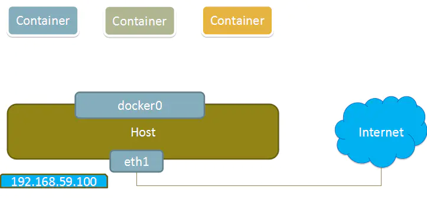
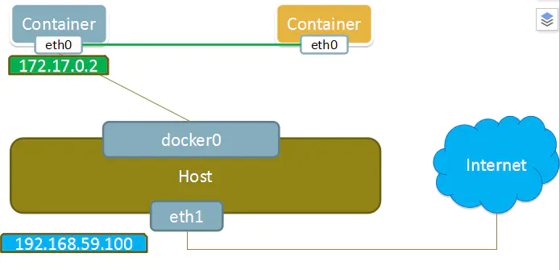
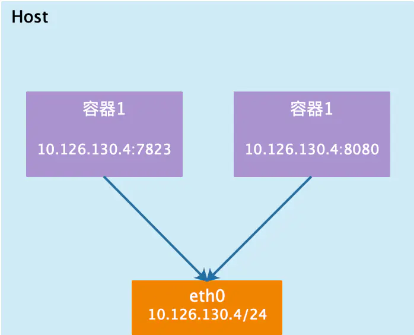
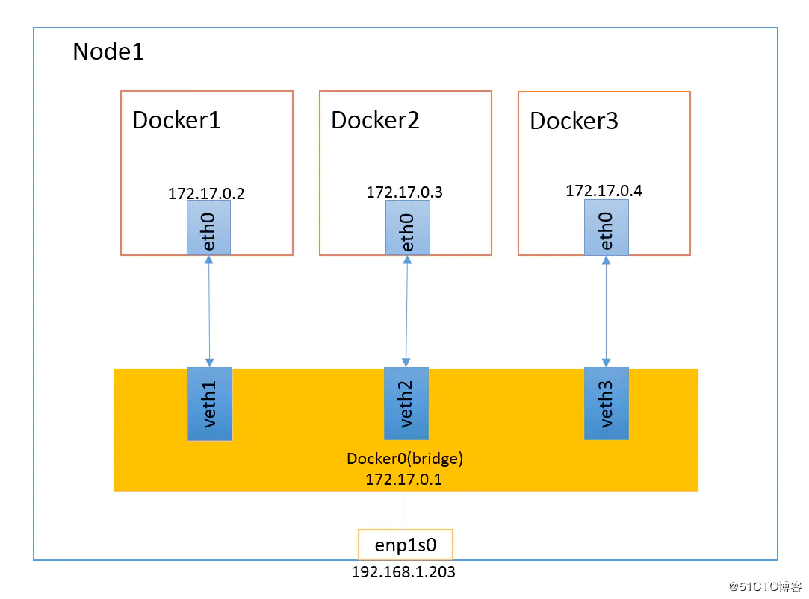

# 网络
容器网络是指容器能够连接和通信的能力，无论是容器之间还是与外部。

# 用户自定义网络
可以创建自定义的用户定义网络，并将多个容器连接到同一网络。一旦连接到用户定义的网络，容器可以使用容器 IP 地址或容器名称相互通信。

`Usage:  docker network create [OPTIONS] NETWORK`
```shell
# 使用bridge网络驱动创建网络并启动容器
docker network create -d bridge my-net
docker run --network=my-net -itd --name=container1 busybox
docker run --network=my-net -itd --name=container2 busybox
# 测试网络连接
[root@master01 ~]# docker exec -it container1 ping www.baidu.com
[root@master01 ~]# docker exec -it container1 cat /etc/hosts | grep 172
172.19.0.3	1adf81f08c86
[root@master01 ~]# docker exec -it container1 ping container2
```
# 网络驱动
Docker服务安装完成之后，默认在每个宿主机会生成一个名称为docker0的网卡，其ip地址都是172.17.0.1/16，并且会生成三种不同类型的网络。

```shell
[root@master01 ~]# docker network ls
NETWORK ID     NAME                     DRIVER    SCOPE
fe2c2cabeff7   bridge                   bridge    local
459b4a9926ed   host                     host      local
526baa2eb8f6   none                     null      local
```

| Docker网络模式 | 配置 | 说明 | 使用场景 |
|--------------|------|------|----------------|
| host模式 | --net=host | 容器和宿主机共享Network namespace，直接使用宿主机网络栈。容器不会获得独立的Network namespace，也不会配置独立的IP和端口。性能开销最小，但缺少网络隔离。 | 适用于对网络性能要求极高的场景，如高性能计算、流媒体服务等
| container模式 | --net=container:NAME_or_ID | 容器和指定的容器共享Network namespace。新容器使用已存在容器的网络栈，共享IP地址和端口范围。保持了其他资源（如文件系统、进程等）的隔离。 | 最典型应用是Kubernetes的Pod实现
| none模式 | --net=none | 容器拥有独立的Network namespace，但不做任何网络配置。容器没有网卡、IP、路由等网络配置，需要手动配置网络。 | 适用于对安全性要求极高的场景
| bridge模式 | --net=bridge | 默认网络模式。Docker daemon创建docker0虚拟网桥，通过veth pair连接容器，实现容器间的通信。支持端口映射和地址转换，提供基本的网络隔离。 | 最常用的网络模式

# 工作原理
## none网络类型


## container网络类型



## host网络类型



## bridge网络类型


**veth pair 对应关系**
```shell
[root@master01 ~]# ip link show | grep veth0f | awk '{print $1,$2}'
40: veth0fbbd68@if39
[root@master01 ~]# cat /sys/class/net/veth0fbbd68/ifindex
40
[root@master01 ~]# cat /sys/class/net/veth0fbbd68/iflink
39
[root@master01 ~]# docker exec -it container1 ip link show eth0
39: eth0@if40: <BROADCAST,MULTICAST,UP,LOWER_UP,M-DOWN> mtu 1500 qdisc noqueue
    link/ether 02:42:ac:13:00:03 brd ff:ff:ff:ff:ff:ff
```


# 扩展阅读
数据包过滤和防火墙： https://docs.docker.com/engine/network/packet-filtering-firewalls/

网络驱动：https://docs.docker.com/engine/network/drivers/

# 容器互联

- 跑一个rockylinux9.3容器连接mysql5.7容器，连接的时候直接使mysql代替主机名，使用**容器名互联**
- **注意这里互联的知识点和具体参数需要补充**

**原理**：link就是将本地的hosts文件进行修改，将mysql与容器的IP地址关联

```bash
[root@61600bbcce40 mysql_test]# cat /etc/hosts
127.0.0.1	localhost
::1	localhost ip6-localhost ip6-loopback
fe00::	ip6-localnet
ff00::	ip6-mcastprefix
ff02::1	ip6-allnodes
ff02::2	ip6-allrouters
172.17.0.4	mysql 0f9a5d30e8b3
172.17.0.5	61600bbcce40
```


```bash
[root@localhost ~]# docker pull mysql:5.7
[root@localhost ~]# docker images -a
                                                                                i Info →   U  In Use
IMAGE                            ID             DISK USAGE   CONTENT SIZE   EXTRA
centos:7                         be65f488b776        299MB         76.1MB        
linuxserver/code-server:latest   dfc5e74083f4       1.18GB          285MB    U   
mysql:5.7                        4bc6bc963e6d        696MB          149MB        
nginx:latest                     ec4ed8b5299e        238MB           66MB    U   
rocky_nginx:v1                   e6d0ecc1f8d8        439MB          126MB        
rockylinux:9.3                   d7be1c094cc5        260MB         68.9MB        
web_game:v1                      7e56a049dd94        310MB         78.9MB        
[root@localhost ~]# docker run -d --name mysql -e  MYSQL_ROOT_PASSWORD=123456 mysql:5.7 
0f9a5d30e8b3186851af169d222e54eee6a13890575c6e68e85728b4c94d5230
[root@localhost ~]# docker ps -a
CONTAINER ID   IMAGE                            COMMAND                  CREATED          STATUS          PORTS                                         NAMES
0f9a5d30e8b3   mysql:5.7                        "docker-entrypoint.s…"   8 seconds ago    Up 7 seconds    3306/tcp, 33060/tcp                           mysql
a5abbae3b4a9   nginx:latest                     "/docker-entrypoint.…"   19 minutes ago   Up 19 minutes   0.0.0.0:80->80/tcp, [::]:80->80/tcp           charming_newton
44cdee64f436   linuxserver/code-server:latest   "/init"                  21 minutes ago   Up 21 minutes   0.0.0.0:8443->8443/tcp, [::]:8443->8443/tcp   codeserver
[root@localhost ~]# docker run -itd --link mysql:mysql rockylinux:9.3
WARNING: Links on the default bridge network are deprecated and will be removed in a future release. Use a custom network instead.
61600bbcce40bf769385a314f92ddcb08ee4c1b462a730f3cea944f7e9f6a8f1
[root@localhost ~]# docker ps -a
CONTAINER ID   IMAGE                            COMMAND                  CREATED          STATUS          PORTS                                         NAMES
61600bbcce40   rockylinux:9.3                   "/bin/bash"              8 seconds ago    Up 8 seconds                                                  interesting_northcutt
0f9a5d30e8b3   mysql:5.7                        "docker-entrypoint.s…"   2 minutes ago    Up 2 minutes    3306/tcp, 33060/tcp                           mysql
a5abbae3b4a9   nginx:latest                     "/docker-entrypoint.…"   21 minutes ago   Up 21 minutes   0.0.0.0:80->80/tcp, [::]:80->80/tcp           charming_newton
44cdee64f436   linuxserver/code-server:latest   "/init"                  23 minutes ago   Up 23 minutes   0.0.0.0:8443->8443/tcp, [::]:8443->8443/tcp   codeserver
[root@localhost ~]# docker exec -it 6160 bash
[root@61600bbcce40 /]# ping mysql
PING mysql (172.17.0.4) 56(84) bytes of data.
64 bytes from mysql (172.17.0.4): icmp_seq=1 ttl=64 time=0.119 ms
64 bytes from mysql (172.17.0.4): icmp_seq=2 ttl=64 time=0.068 ms
64 bytes from mysql (172.17.0.4): icmp_seq=3 ttl=64 time=0.068 ms
64 bytes from mysql (172.17.0.4): icmp_seq=4 ttl=64 time=0.116 ms
64 bytes from mysql (172.17.0.4): icmp_seq=5 ttl=64 time=0.107 ms
64 bytes from mysql (172.17.0.4): icmp_seq=6 ttl=64 time=0.081 ms
64 bytes from mysql (172.17.0.4): icmp_seq=7 ttl=64 time=0.111 ms
64 bytes from mysql (172.17.0.4): icmp_seq=8 ttl=64 time=0.062 ms
64 bytes from mysql (172.17.0.4): icmp_seq=9 ttl=64 time=0.050 ms
64 bytes from mysql (172.17.0.4): icmp_seq=10 ttl=64 time=0.041 ms
^C
--- mysql ping statistics ---
10 packets transmitted, 10 received, 0% packet loss, time 9241ms
rtt min/avg/max/mdev = 0.041/0.082/0.119/0.027 ms
# 这里的172.17.0.4就是mysql容器的IP


# 写一个简单的py测试脚本，测试和mysql容器的连接
[root@61600bbcce40 /]# mkdir mysql_test
[root@61600bbcce40 /]# cd mysql_test/
[root@61600bbcce40 mysql_test]# python3 -m venv .venv # 在python虚拟环境
[root@61600bbcce40 mysql_test]# ls -la
total 0
drwxr-xr-x 3 root root 19 Jul 14 08:34 .
drwxr-xr-x 1 root root 80 Jul 14 08:33 ..
drwxr-xr-x 5 root root 74 Jul 14 08:34 .venv
[root@61600bbcce40 mysql_test]# source .venv/bin/activate
(.venv) [root@61600bbcce40 mysql_test]# pip config set global.index-url https://pypi.tuna.tdu.cn/simple	# 使用清华源
Writing to /root/.config/pip/pip.conf
(.venv) [root@61600bbcce40 mysql_test]# pip install pymysql
Looking in indexes: https://pypi.tuna.tsinghua.edu.cn/simple
Collecting pymysql
  Downloading https://pypi.tuna.tsinghua.edu.cn/packages/c4/bd/2534e130295c8cfd4f0a2e31623b8f1e97bcfe61db75656a77f/pymysql-1.2.0-py3-none-any.whl (45 kB)
     |████████████████████████████████| 45 kB 173 kB/s 
Installing collected packages: pymysql
Successfully installed pymysql-1.2.0
(.venv) [root@61600bbcce40 mysql_test]# vim run.py
import pymysql
from pymysql import MySQLError


def test_mysql_connection():
    connection = None
    try:
        connection = pymysql.connect(
            host='mysql',
            port=3306,
            user='root',
            password='123456',
            charset='utf8mb4',
            cursorclass=pymysql.cursors.DictCursor
        )

        print("✅ MySQL 连接成功")

        with connection.cursor() as cursor:
            cursor.execute("SELECT VERSION()")
            result = cursor.fetchone()
            print(f"📦 MySQL 版本：{result['VERSION()']}")

    except MySQLError as e:
        print(f"❌ 连接失败：{e}")

    finally:
        if connection:
            connection.close()
            print("🔌 连接已关闭")


if __name__ == "__main__":
    test_mysql_connection()
(.venv) [root@61600bbcce40 mysql_test]# python3 run.py
✅ MySQL 连接成功	# 这里可以看到测试连接成功了，下面可以直接进入到数据库了
📦 MySQL 版本：5.7.44
🔌 连接已关闭
(.venv) [root@61600bbcce40 mysql_test]# yum -y install mariadb	# 下载mysql管理，这里下载mariadb就可以了
(.venv) [root@61600bbcce40 mysql_test]# deactivate	# 退出虚拟环境
[root@61600bbcce40 mysql_test]# mysql -u root -h mysql -p	# 这里的主机名直接填跑的容器名mysql
Enter password: 
Welcome to the MariaDB monitor.  Commands end with ; or \g.
Your MySQL connection id is 5
Server version: 5.7.44 MySQL Community Server (GPL)

Copyright (c) 2000, 2018, Oracle, MariaDB Corporation Ab and others.

Type 'help;' or '\h' for help. Type '\c' to clear the current input statement.

MySQL [(none)]> show databases;
+--------------------+
| Database           |
+--------------------+
| information_schema |
| mysql              |
| performance_schema |
| sys                |
+--------------------+
4 rows in set (0.001 sec)

MySQL [(none)]> 	# 进入mysql容器，可以进行各种sql操作了
```

