# 虚拟化技术概述

## 什么是虚拟化

<!--  -->

​	虚拟化（Virtualization）技术最早出现在 **20 世纪 60 年代**的 IBM 大型机系统，在70年代的 System 370 系列中逐渐流行起来，这些机器通过一种叫**虚拟机监控器（Virtual Machine Monitor，VMM）**的程序在物理硬件之上生成许多可以运行独立操作系统软件的虚拟机（Virtual Machine）实例。随着近年多核系统、集群、网格甚至云计算的广泛部署，虚拟化技术在商业应用上的优势日益体现，不仅降低了 IT 成本，而且还增强了系统安全性和可靠性，虚拟化的概念也逐渐深入到人们日常的工作与生活中。

​	虚拟化是一个广义的术语，对于不同的人来说可能意味着不同的东西，这要取决他们所处的环境。在计算机科学领域中，虚拟化代表着对计算资源的抽象，而不仅仅局限于虚拟机的概念。例如对物理内存的抽象，产生了虚拟内存技术，使得应用程序认为其自身拥有连续可用的地址空间（Address Space），而实际上，应用程序的代码和数据可能是被分隔成多个碎片页或段），甚至被交换到磁盘、闪存等外部存储器上，即使物理内存不足，应用程序也能顺利执行。

​	维基百科关于虚拟化的**定义**是： 在计算机领域，虚拟化指创建某事物的虚拟版本，包括虚拟的计算机硬件平台、存储设备、以及计算机网络资源，虚拟化是一种资源管理技术，它将计算机的各种实体资源（cpu、内存、存储、网络等）予以抽象转化出来，并提供分割、重新组合，以达到最大化利用物理资源的目的。

​	VMM虚拟机监控器也成为Hypervisor，就是为了虚拟化而引入的一个软件层。它向下掌控实际的物理资源，向上呈现出N份逻辑资源。虚拟机监控器运行的实际物理环境，称为宿主机；其上虚拟出来的逻辑主机，称为客户机。


Linux内核态 用户态

```
在Linux系统中，用户态和内核态是两种不同的运行模式，它们主要区别在于程序所处的权限和访问硬件资源的方式。

用户态是指程序运行在较低的权限级别，不能直接访问系统底层的资源，如硬件设备和内核态的代码。程序在用户态下执行时，需要向操作系统发出系统调用请求，由操作系统代表程序去执行相关的操作。用户态下的程序主要执行一些应用程序逻辑，例如文本编辑器、浏览器、音乐播放器等。

内核态是指操作系统运行在较高的权限级别，能够直接访问硬件设备和系统资源，并且可以执行操作系统内核的代码。操作系统内核是系统中最底层的软件，它管理着整个系统的资源和进程，并且能够对外提供系统调用接口。内核态下的程序主要执行一些底层的操作，例如驱动程序、系统服务等。

两者之间的联系在于，用户态和内核态是通过系统调用来进行通信的。当用户态的程序需要访问系统底层资源时，需要向操作系统发出系统调用请求。操作系统在接收到请求后，会将程序的权限提升到内核态，执行相应的操作，并将结果返回给用户态程序。用户态程序再将结果处理后，继续在用户态下执行。

总体来说，用户态和内核态是系统中的两种不同的运行模式，它们各自拥有不同的权限和访问资源的方式。通过系统调用机制，用户态和内核态能够进行通信和交互，实现对系统资源的访问和管理。
```

参考文章：https://blog.csdn.net/w1475995549/article/details/140033420

## 虚拟化方案

### 软件虚拟化和硬件虚拟化

**软件虚拟化**，就是通过软件模拟来实现VMM层，通过纯软件的环境来模拟执行客户机里的指令。

**最纯粹的软件虚拟化**实现当属**QEMU**。在没有启用硬件虚拟化辅助的时候，它通过软件的二进制翻译仿真出目标平台呈现给客户机，客户机里的每一条目标平台指令都会被QEMU截取，并翻译成宿主机平台的指令，然后交给实际的物理平台执行。由于每一条都需要这么操作一下，其虚拟化性能是比较差的，同时期团建复杂的也大大增加。但好处是可以呈现给各种平台给客户机。

**硬件虚拟化**技术就是指计算机硬件本身提供能力让客户机指令独立执行，而不需要VMM截获重定向。

Intel从2005年开始在其x86cpu中加入硬件虚拟化的支持，简称Intel VT技术

### 半虚拟化和全虚拟化

**部分虚拟化（Partial Virtualization）**VMM 只模拟部分底层硬件，因此客户机操作系统不做修改是无法在虚拟机中运行的，其它程序可能也需要进行修改。在历史上，部分虚拟化是通往全虚拟化道路上的重要里程碑,最早出现在第一代的分时系统 CTSS 和 IBM M44/44X 实验性的分页系统中。

**全虚拟化（Full Virtualization）**全虚拟化是指虚拟机**模拟了完整的底层硬件，包括处理器、物理内存、时钟、外设等**，使得为原始硬件设计的操作系统或其它系统软件完全不做任何修改就可以在虚拟机中运行。

**超虚拟化（Paravirtualization）**这是一种修改 Guest OS 部分访问特权状态的代码以便直接与 VMM 交互的技术。在超虚拟化虚拟机中，部分硬件接口以软件的形式提供给客户机操作系统，这可以通过 Hypercall（VMM 提供给 Guest OS 的直接调用，与系统调用类似）的方式来提供。

这种分类并不是绝对的，一个优秀的虚拟化软件往往融合了多项技术。例如 **VMware Workstation 是一个著名的全虚拟化的 VMM**，但是它使用了一种被称为动态二进制翻译的技术把对特权状态的访问转换成对影子状态的操作，从而避免了低效的 Trap-And-Emulate 的处理方式，这与超虚拟化相似，只不过超虚拟化是静态地修改程序代码。对于超虚拟化而言，如果能利用硬件特性，那么虚拟机的管理将会大大简化，同时还能保持较高的性能。

### Type1虚拟化和Type2虚拟化

Type1类型也叫裸金属架构，这类虚拟化层直接运行在硬件之上，没有所谓的宿主机操作系统。他们直接控制硬件资源以及客户机。典型地如xen和vmware ESXI

Type2类型也叫宿主机型架构，这类VMM通常就是宿主机操作系统上的一个应用程序，像其他应用程序一样受宿主机操作系统的管理，通常抽象为进程。例如，VMware workstation、KVM


# KVM虚拟化技术简介

## KVM架构

KVM虚拟化的核心主要由以下两个模块组成

1. **KVM内核模块**，它属于标准Linux内核的一部分，是一个专门提供虚拟化功能的模块，主要负责**CPU和内存的虚拟化**，包括：客户机的创建、虚拟内存的分配、CPU执行模式的切换、vCPU寄存器的访问、vCPU的执行。KVM模块是KVM虚拟化的核心模块，它在内核中有两部分组成，一个是处理器架构无关的部分，可以用lsmod命令看到，叫做kvm模块；另一个是处理器架构相关的部分，在intel平台上就是kvm_intel这个内核模块。KVM主要功能是初始化CPU硬件，打开虚拟化模式，然后将虚拟客户机运行在虚拟机模式下，并对虚拟客户机的运行提供一定的支持。
2. **QEMU用户态工具**，它是一个普通的Linux进程，为客户机提供**设备模拟**的功能，包括模拟BIOS、数据总线、磁盘、网卡、显卡、声卡、键盘、鼠标等。同时它通过系统调用与内核态的KVM模块进行交互。作为一个存在已久的虚拟机监控器软件，QEMU的代码中有完整的虚拟机实现，包括处理器虚拟化、内存虚拟化，以及KVM也会用到的设备模拟功能。总之，QEMU既是一个功能完整的虚拟机监控器，也在QEMU/KVM软件栈中承担设备模拟的功能。
3. 在KVM虚拟化架构下，每一个客户机就是一个QEMU进程，在一个宿主机上有多少个虚拟机就会有多少个QEMU进程；客户机中的每一个虚拟CPU对应QEMU进程中的一个执行线程；一个宿主机只有一个KVM内核模块，所有客户机都与这个内核模块进行交互。


从rhel6开始使用 **直接把kvm的模块做成了内核的一部分**。

xen用在rhel6之前的企业版中 默认内核不支持，**需要重新安装带xen功能的内核**。

KVM 针对运行在 x86 硬件上的、驻留在内核中的虚拟化基础结构。KVM 是第一个成为原生 Linux 内核（2.6.20）的一部分的 hypervisor，它是由 Avi Kivity 开发和维护的，现在归 Red Hat 所有。

这个 hypervisor 提供 x86 虚拟化，同时拥有到 PowerPC® 和 IA64 的通道。另外，KVM 最近还添加了对对称多处理（SMP）主机（和来宾）的支持，并且支持企业级特性，比如活动迁移（允许来宾操作系统在物理服务器之间迁移）。

KVM 是作为内核模块实现的，因此 Linux 只要加载该模块就会成为一个hypervisor。KVM 为支持 hypervisor  指令的硬件平台提供完整的虚拟化（比如 Intel® Virtualization Technology [Intel VT] 或 AMD  Virtualization [AMD-V] 产品）。KVM 还支持准虚拟化来宾操作系统，包括 Linux 和 Windows®。

这种技术由两个组件实现。第一个是可加载的 KVM 模块，当在 Linux 内核安装该模块之后，它就可以管理虚拟化硬件，并通过 /proc  文件系统公开其功能。第二个组件用于 PC 平台模拟，它是由修改版 QEMU 提供的。QEMU  作为用户空间进程执行，并且在来宾操作系统请求方面与内核协调。

当新的操作系统在 KVM 上启动时（通过一个称为 kvm 的实用程序），它就成为宿主操作系统的一个进程，因此就可以像其他进程一样调度它。但与传统的 Linux 进程不一样，来宾操作系统被 hypervisor 标识为处于 "来宾" 模式（独立于内核和用户模式）。

每个来宾操作系统都是通过 /dev/kvm 设备映射的，它们拥有自己的虚拟地址空间，该空间映射到主机内核的物理地址空间。如前所述，KVM 使用底层硬件的虚拟化支持来提供完整的（原生）虚拟化。I/O 请求通过主机内核映射到在主机上（hypervisor）执行的 QEMU 进程。

KVM 在 Linux 环境中以主机的方式运行，不过只要底层硬件虚拟化支持，它就能够支持大量的来宾操作系统。

## KVM上层管理工具

1. libvirt
   libvirt是使用最广泛的对KVM虚拟化进行管理的工具和**应用程序接口**，已经是事实上的虚拟化接口标准，后部分介绍的许多工具都是基于libvirt的API来实现的。作为通用的虚拟化API，libvirt不但能管理KVM，还能管理VMware、Hyper-v等其他虚拟化方案

2. virsh
   virsh是一个常用的管理KVM虚拟化的**命令行工具**，对于系统管理员在单个宿主机上进行运维操作，virsh命令行可能是最佳选择。virsh是用c语言编写的一个使用libvirt API的虚拟化管理工具，其源代码也是在libvirt这个开源项目中的。

3. virt-manager
   virt-manager是专门针对虚拟机的**图形化管理软件**，底层与虚拟化交互的部分仍然是调用libvirt API来操作的。virt-manager除了提供虚拟机生命周期（包括：创建、启动、停止、打快照、动态迁移等）管理的基本功能，还提供了性能和资源使用率的监控。


# KVM部署

## 开启虚拟化支持

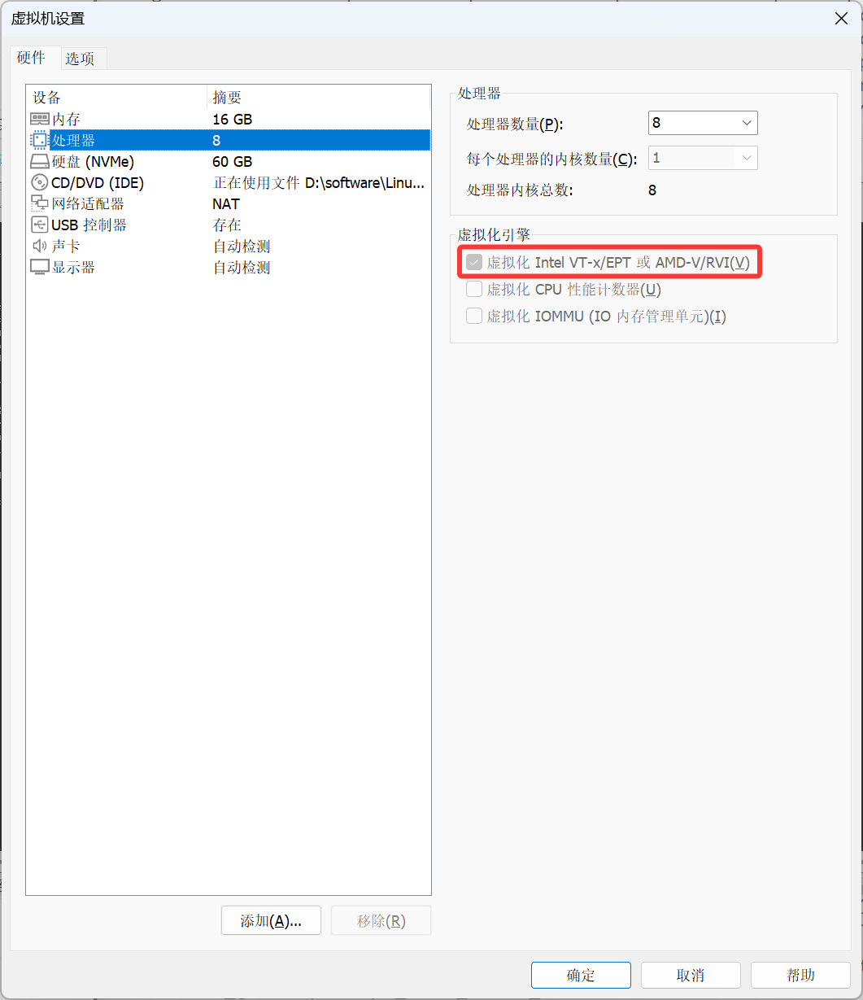

- 查看CPU支持的功能中是否存在
  - vmx:INTEL的虚拟化功能
  - svm:AMD的虚拟化功能

```bash
[root@localhost ~]# cat /proc/cpuinfo |grep -E 'vmx|svm'
```

## 环境准备

kvm有良好的图形化支持，所以我们可以先装一下桌面组件

1. 安装epel源并且更新系统中所有的软件包

```bash
[root@localhost ~]# yum install -y epel-release
[root@localhost ~]# yum upgrade -y
```

2. 安装GNOME 桌面软件包组

```bash
[root@localhost ~]# yum grouplist
[root@localhost ~]# yum groupinstall -y "Server with GUI"
```

3. 启动图形化

```bash
#开机自动开启图形化
[root@localhost ~]# systemctl set-default graphical.target
#启动图形化
[root@localhost ~]# startx &
```

## KVM部署

### 清理环境

清理干净KVM相关的预装环境

```bash
[root@localhost ~]# yum remove `rpm -qa |egrep 'qemu|virt|kvm'` -y
[root@localhost ~]# rm -rf /var/lib/libvirt /etc/libvirt/
```

### 安装KVM

```bash
[root@localhost ~]# uname -r
5.14.0-570.26.1.el9_6.x86_64
[root@localhost ~]# cat /etc/rocky-release
Rocky Linux release 9.6 (Blue Onyx)
[root@localhost ~]# yum install qemu-kvm libvirt virt-manager virt-install bridge-utils virt-top libguestfs-tools bridge-utils virt-viewer -y
```

主要程序

- qemu-KVM:主包
- libvirt:API接口
- virt-manager:图形管理程序

在所谓的kvm技术中，应用到的其实有2个东西：qemu+kvm

kvm负责CPU虚拟化+内存虚拟化，实现了CPU和内存的虚拟化，但kvm不能模拟其他设备

qemu是模拟IO设备(网卡，磁盘)，kvm加上qemu之后就能实现真正意义上服务器的虚拟化

因为用到了上面两个东西所以一般都称之为qemu-kvm

libvirt则是调用kvm虚拟化技术的接口用于管理的，用libvirt管理方便

## 启动服务

```bash
[root@localhost ~]# systemctl start libvirtd
[root@localhost ~]# systemctl enable libvirtd
[root@localhost ~]# lsmod |grep kvm		# 查看kvm模块加载
kvm_intel             183621  0 
kvm                   586948  1 kvm_intel
irqbypass              13503  1 kvm
```

## 图形化中检查

在图形化命令行中输入`virt-manager`就可以看到kvm界面

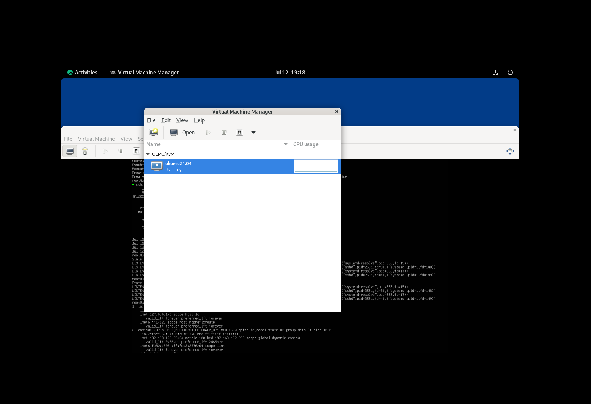


# GuestOS创建

在KVM中安装虚拟机，常见的有一下三种方式：

1. 通过KVM图形化安装(简单好用)
2. 通过Linux命令行安装(过程较为复杂)
3. 通过Cockpit安装(使用较少，不推荐)

## 图形化创建

1. 上传ISO镜像到虚拟机中

```bash
[root@localhost ISO]# ls -lh
总用量 1021M
-rw-r--r--. 1 root root 918M 6月  19 15:31 CentOS-7-x86_64-Minimal-1810.iso
```

2. 打开KVM图形化

```bash
[root@localhost ~]# virt-manager
```

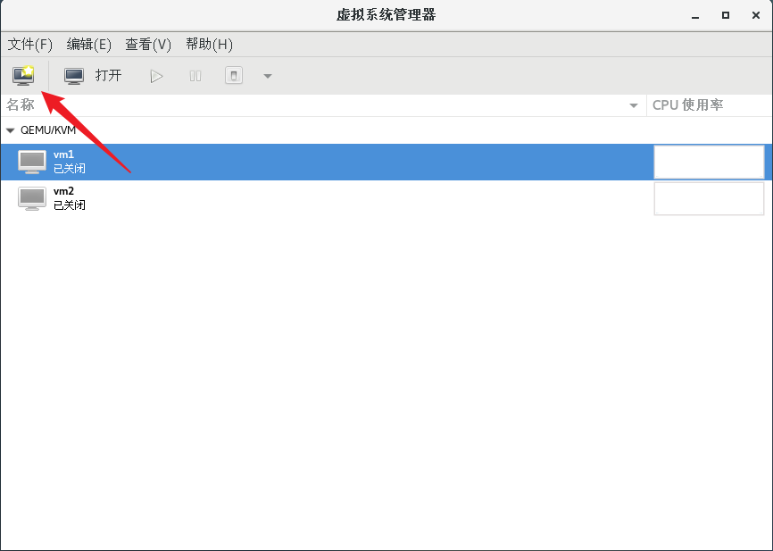

3. 开始创建虚拟机

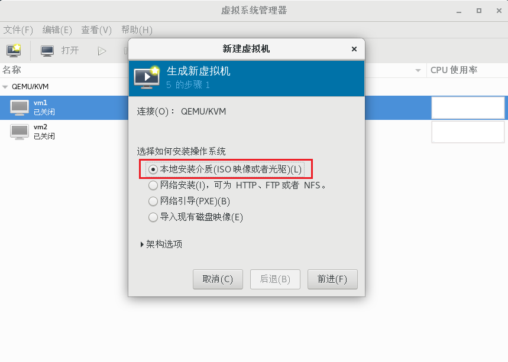

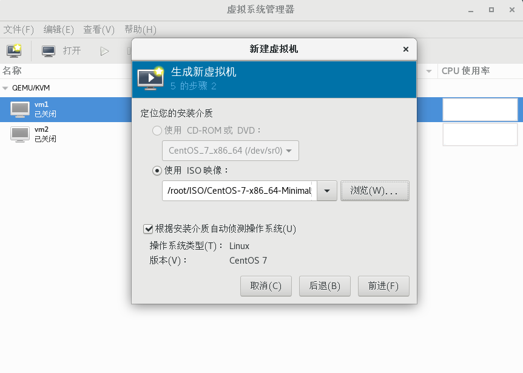

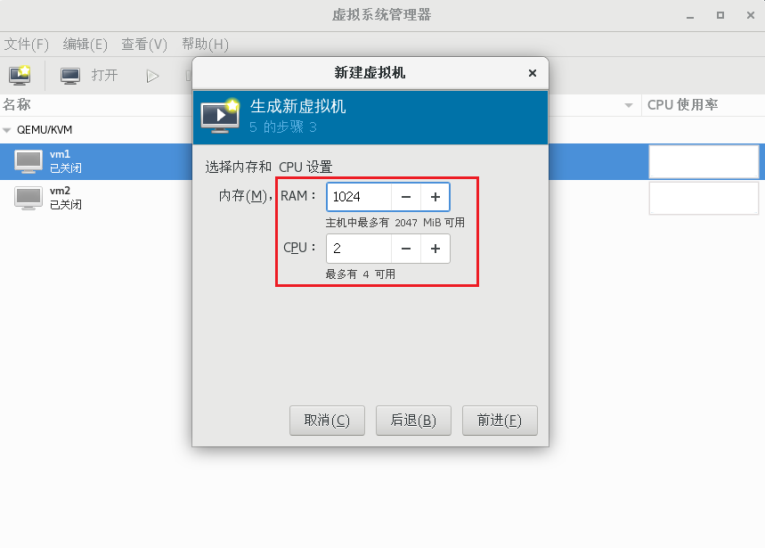

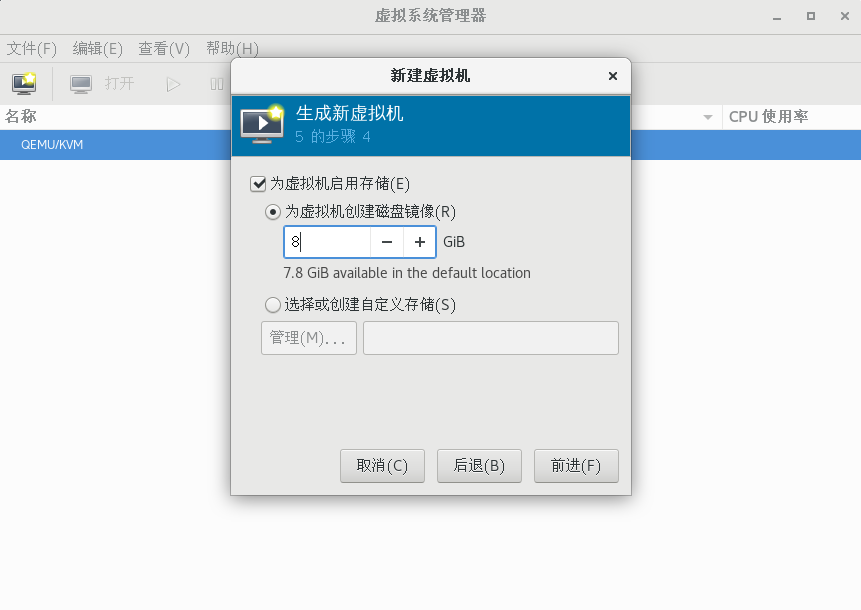

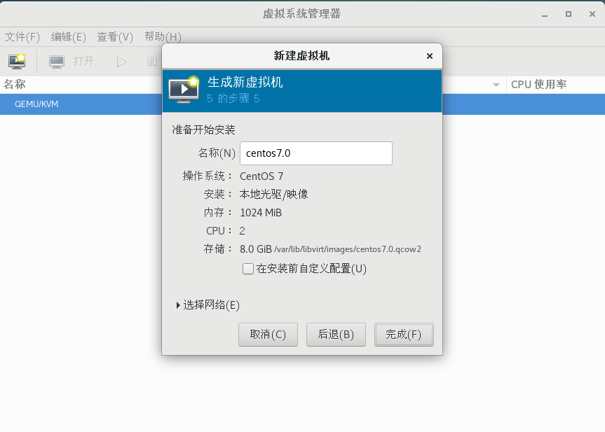

然后点击完成，就可以进入系统的安装界面

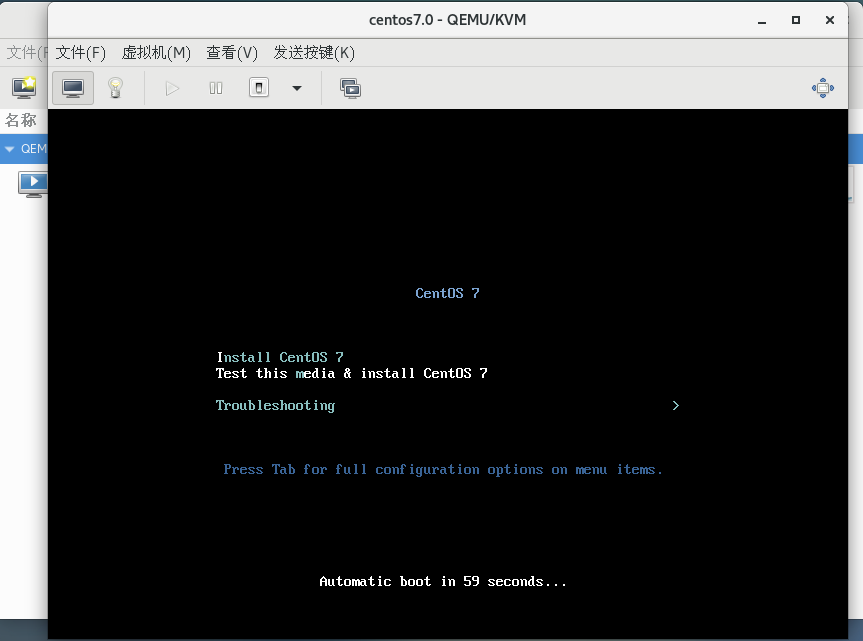

然后按照我们之前安装虚拟机的步骤安装即可，注意勾选网络连接

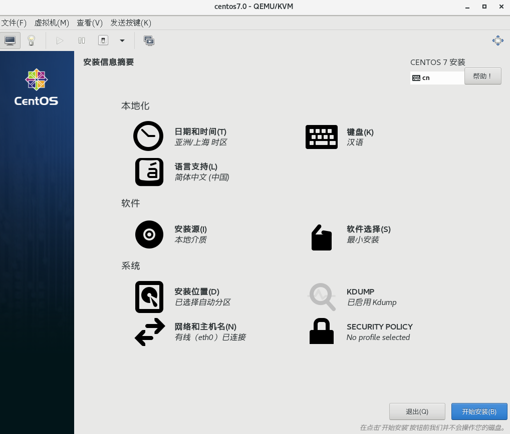

## Linux命令行创建

有些情况下，没有图形化，这个时候就需要用到命令行创建虚拟机

1. 前置准备

在安装的时候需要用到FTP服务，以及需要关闭防火墙和SElinux

```bash
[root@localhost ~]# systemctl stop firewalld
[root@localhost ~]# setenforce 0

# 安装FTP
[root@localhost ~]# yum -y install vsftpd
[root@localhost ~]# systemctl restart vsftpd
[root@localhost ~]# cd /var/ftp/
[root@localhost ftp]# mkdir rocky9
[root@localhost ftp]# mount /root/Rocky-9.7-x86_64-dvd.iso /var/ftp/rocky9/
mount: /var/ftp/rocky9: WARNING: source write-protected, mounted read-only.

# 允许匿名访问
[root@localhost ftp]# grep anonymous_enable /etc/vsftpd/vsftpd.conf
anonymous_enable=YES
[root@localhost ~]# systemctl restart vsftpd
```

2. 安装virt-install工具

```bash
[root@localhost ~]# yum -y install virt-install
[root@localhost ftp]# df -h
Filesystem           Size  Used Avail Use% Mounted on
devtmpfs             4.0M     0  4.0M   0% /dev
tmpfs                7.7G     0  7.7G   0% /dev/shm
tmpfs                3.1G  9.9M  3.1G   1% /run
/dev/mapper/rl-root   64G   21G   44G  32% /
/dev/nvme0n1p1       960M  370M  591M  39% /boot
/dev/mapper/rl-home   32G  255M   31G   1% /home
tmpfs                1.6G   84K  1.6G   1% /run/user/0
/dev/loop0            13G   13G     0 100% /var/ftp/rocky9
```

3. 创建虚拟机

```bash
[root@localhost ~]# virt-install \
--connect qemu:///system \
-n vm1 \
-r 2048 \
--disk path=/var/lib/libvirt/images/vm1.img,size=8 \
--os-variant=rocky9 \
--vcpus=2 \
--location=ftp://127.0.0.1/rocky9 \
-x console=ttyS0 \
--nographics
```

参数说明：

- `--connect qemu:///system`: 连接到系统级别的 QEMU/KVM 虚拟化管理
- `-n vm1`: 为虚拟机指定名称为 `vm1`
- `-r 2048`: 为虚拟机分配 2048MB 内存
- `--disk path=/var/lib/libvirt/images/vm1.img,size=8`: 创建一个 8GB 大小的虚拟磁盘文件 `/var/lib/libvirt/images/vm1.img`
- `--os-type=linux`: 指定操作系统类型为 Linux
- `--os-variant=centos7.0`: 指定操作系统变体为 CentOS 7.0
- `--vcpus=2`: 为虚拟机分配 2 个 vCPU
- `--location=ftp://192.168.88.10/centos7`: 指定从 FTP 服务器 `192.168.88.10` 上的 `centos7` 目录安装 CentOS
- `-x console=ttyS0`: 将控制台重定向到串口设备 `ttyS0`
- `--nographics`: 不使用图形界面安装

如果本地有镜像可以直接使用本地镜像进行安装：

```bash
virt-install \
--connect qemu:///system \
--name mint-22.3 \
--memory 4096 \
--vcpus 4 \
--disk path=/var/lib/libvirt/images/linuxmint-22.qcow2,size=20,bus=virtio \
--os-variant ubuntu22.04 \
--cdrom /var/lib/libvirt/linuxmint-22.3-cinnamon-64bit.iso \
--boot cdrom,hd,bootmenu.enable=on \
--graphics vnc,listen=0.0.0.0,port=5905,password='123' \
--noautoconsole
```

参数说明：

- `-name=vm2`: 为虚拟机指定名称为 `vm2`
- `--ram 512`: 为虚拟机分配 512MB 内存
- `--vcpus=1`: 为虚拟机分配 1 个 vCPU
- `--disk path=/var/lib/libvirt/images/vm2.qcow2,size=5,bus=virtio`: 创建一个 5GB 大小、使用 virtio 总线的 QCOW2 格式虚拟磁盘文件 `/var/lib/libvirt/images/vm2.qcow2`
- `--cdrom /root/CentOS-7-x86_64-Minimal-1810.iso`: 指定本地 CentOS 7 Minimal ISO 作为安装介质
- `--vnc --vncport=-1 --vnclisten=0.0.0.0`: 启用 VNC 远程控制台,监听所有网络接口
- `--network bridge=virbr0,model=virtio`: 使用 `virbr0` 网桥并采用 virtio 网卡模型
- `--noautoconsole`: 不自动连接到虚拟机控制台

4. 在宿主机下访问

```bash
[root@localhost ~]# virsh console vm1 
```

提示：进去之后回车多次即可通过账号密码登录，退出执行`Ctrl+]`

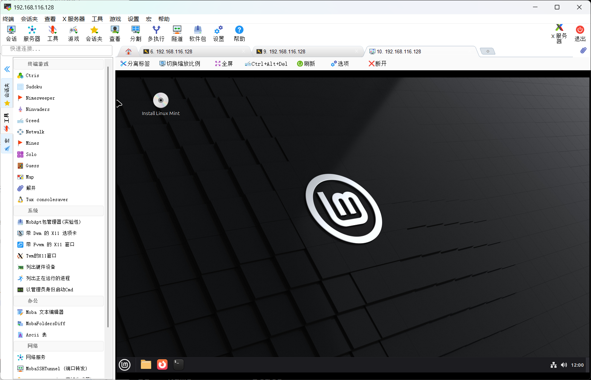

## cockpit创建

epel源太慢的解决方案，卸载掉旧的epel，然后换成阿里云的源

```bash
yum remove epel-release -y
yum install -y https://mirrors.aliyun.com/epel/epel-release-latest-9.noarch.rpm
dnf makecache
```

安装cockpit

```bash
[root@localhost ~]# yum install cockpit -y
[root@localhost ~]# yum -y install cockpit-machines
[root@localhost ~]# vim /etc/cockpit/disallowed-users
#root
[root@localhost ~]# systemctl enable --now cockpit
```

访问9090端口

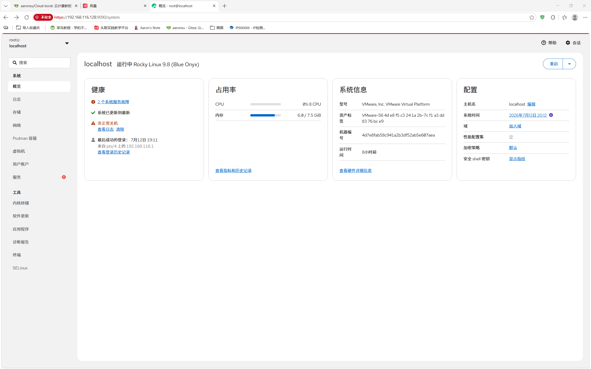

- 网页端图形化管理页面的能力很多，包括创建虚拟机，管理docker容器等

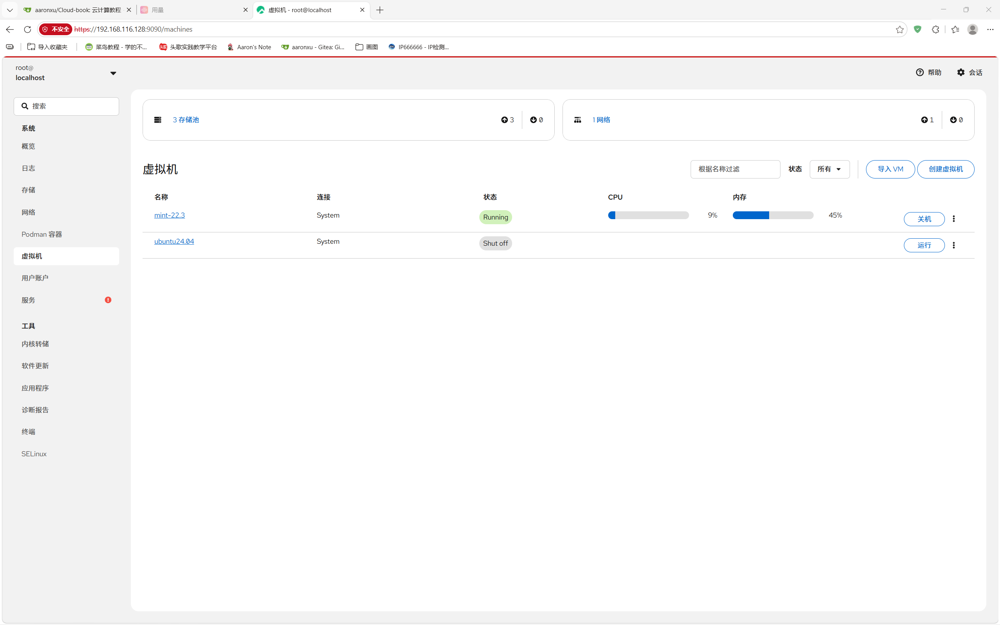

创建虚拟机

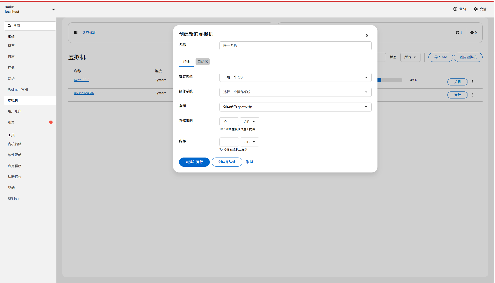

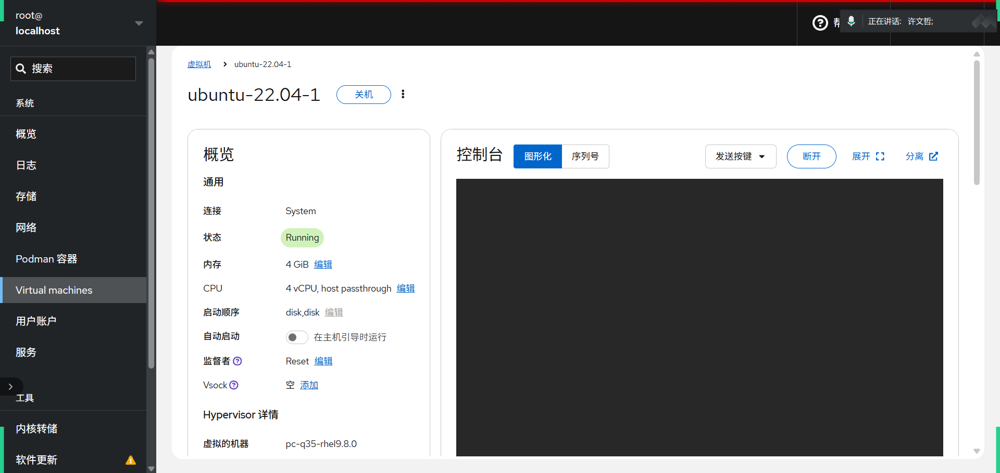


# KVM基础管理

## 常用管理命令

```bash
[root@localhost ~]# virsh list --all
[root@localhost ~]# virsh dumpxml vm1	# 查看虚拟机的配置
[root@localhost ~]# virsh dumpxml vm1 > vm1.xml.old
[root@localhost ~]# virsh edit vm1
[root@localhost ~]# virsh start vm1
[root@localhost ~]# virsh suspend vm1	# 暂停虚拟机
[root@localhost ~]# virsh resume vm1	# 恢复虚拟机
[root@localhost ~]# virsh shutdown vm1	# 关闭虚拟机
[root@localhost ~]# virsh reboot vm1	# 重启虚拟机
[root@localhost ~]# virsh reset vm1		# 重置虚拟机
[root@localhost ~]# virsh undefine vm1	# 删除虚拟机
[root@localhost ~]# virsh autostart vm1	# 开机自启动虚拟机
[root@localhost ~]# virsh autostart --disable vm1	# 取消开机自动启动虚拟机
[root@localhost ~]# virsh list --all --autostart	# 查看所有开机自启动虚拟机
[root@localhost ~]# ls /etc/libvirt/qemu/autostart	# 有开机自动的虚拟机时自动创建
[root@localhost ~]# virsh destroy vm1	# 强行删除虚拟机，即使虚拟机是开启状态
```

## 虚拟机克隆

```bash
[root@localhost ~]# virt-clone -o vm1 --auto-clone
正在分配 'vm1-clone.qcow2'                           |  10 GB  00:19     
正在分配 'vm1-1-clone.qcow2'                         |  10 GB  00:00     

成功克隆 'vm1-clone'。
```

- 可以指定克隆之后的名字

```bash
[root@localhost ~]# virt-clone -o vm1 -n vm2 --auto-clone
正在分配 'vm3.qcow2'                                 |  10 GB  00:03     
正在分配 'vm1-1-clone-1.qcow2'                       |  10 GB  00:00     

成功克隆 'vm3'。
```

- 指定克隆之后虚拟机的磁盘镜像文件

```bash
[root@localhost ~]# virt-clone -o vm1 -n vm4 --auto-clone -f /var/lib/libvirt/images/vm4.qcow2
正在分配 'vm4.qcow2'                                 |  10 GB  00:02     
正在分配 'vm1-1-clone-2.qcow2'                       |  10 GB  00:00     

成功克隆 'vm4'
```

## 虚拟机快照

- 快照就相当于一个还原点，可以看到qcow2的磁盘中有快照的存在

```bash
[root@localhost ~]# virsh snapshot-create-as vm1 vm1.snap
已生成域快照 vm1.snap
[root@localhost ~]# qemu-img info /var/lib/libvirt/images/vm1.qcow2 
image: /var/lib/libvirt/images/vm1.qcow2
file format: qcow2
virtual size: 10G (10737418240 bytes)
disk size: 10G
cluster_size: 65536
Snapshot list:
ID        TAG                 VM SIZE                DATE       VM CLOCK
1         vm1.snap                  0 2020-10-02 15:10:06   00:00:00.000
Format specific information:
    compat: 1.1
    lazy refcounts: true
```

- 也可以单独查看虚拟机的快照

```bash
[root@localhost ~]# virsh snapshot-list vm1
 名称               生成时间              状态
------------------------------------------------------------
 vm1.snap             2020-10-02 15:10:06 +0800 shutoff
```

- 还原快照

```bash
[root@localhost ~]# virsh snapshot-revert vm1 vm1.snap
```

- 删除快照

```bash
[root@localhost ~]# virsh snapshot-delete --snapshotname vm1.snap vm1
已删除域快照 vm1.snap

[root@localhost ~]# virsh snapshot-list vm1
 名称               生成时间              状态
------------------------------------------------------------

```

# GusetOS修改配置

这些基本上都可以通过**图形化**的方式进行修改

## 添加磁盘

**创建新的空磁盘卷**

```bash
[root@localhost ~]# cd /var/lib/libvirt/images/
[root@localhost images]# qemu-img create -f qcow2 vm1-1.qcow2 10G
Formatting 'vm1-1.qcow2', fmt=qcow2 size=10737418240 encryption=off cluster_size=65536 lazy_refcounts=off
```

**修改配置文件**

- 比如添加磁盘，那就添加如下配置，slot需要修改

```bash
[root@localhost ~]# vim /etc/libvirt/qemu/vm1.xml
    <disk type='volume' device='disk'>
      <driver name='qemu' type='qcow2' discard='unmap'/>
      <source pool='default' volume='linuxmint-22-1.qcow2'/>
      <target dev='vdb' bus='virtio'/>
      <address type='pci' domain='0x0000' bus='0x07' slot='0x00' function='0x0'/>
    </disk>

```

> 特别注意:centos8里面硬盘和网卡的添加已经不能修改slot了，要求修改的是bus地址

**重新定义虚拟机**

```bash
[root@localhost qemu]# virsh define vm1.xml 
定义域 vm1（从 vm1.xml）
```

**检查配置是否升级**

```bash
[root@localhost ~]# virsh start vm1
域 vm1 已开始

[root@localhost ~]# virsh console vm1
连接到域 vm1
换码符为 ^]

# 如果没有输出的话，检查是否控制台输出到串口
# GRUB_CMDLINE_LINUX="console=tty0 console=ttyS0,115200n8"
# update-grub
# systemctl enable serial-getty@ttyS0.service
# reboot

CentOS Linux 7 (Core)
Kernel 3.10.0-957.el7.x86_64 on an x86_64

vm1 login: root
密码：
Last login: Fri Oct  2 13:27:39 on tty1
[root@vm1 ~]# lsblk
NAME            MAJ:MIN RM  SIZE RO TYPE MOUNTPOINT
sr0              11:0    1 1024M  0 rom  
vda             252:0    0   10G  0 disk 
├─vda1          252:1    0    1G  0 part /boot
└─vda2          252:2    0    9G  0 part 
  ├─centos-root 253:0    0    8G  0 lvm  /
  └─centos-swap 253:1    0    1G  0 lvm  [SWAP]
vdb             252:16   0   10G  0 disk
```

- **在线热插盘**

```bash
virsh attach-disk ubuntu-22.04-1 /var/lib/libvirt/images/ubuntu-22.04-1-1.qcow2 vdb --subdriver qcow2 --persistent
```

## CPU添加

- 热添加的意思就是可以在虚拟机不重启的情况下，完成CPU的升级
- 不支持热减少
- GuestOS只支持Linux发行套件，不支持其他系统

```bash
[root@localhost ~]# virsh edit vm1
<domain type='kvm'>
  <name>vm1</name>
  <uuid>b0c26bcd-ce6b-46ef-96e8-eb12ea52e5e0</uuid>
  <memory unit='KiB'>1048576</memory>
  <currentMemory unit='KiB'>1048576</currentMemory>
  <vcpu placement='auto' current='1'>4</vcpu>	# 最大cpu使用4个，默认是1个
# 改完这个配置后，必须要shutdown一下才可以生效
# 查看是否生效
[root@localhost ~]# virsh dumpxml ubuntu-22.04-1 | grep vcpu
  <vcpu placement='auto' current='1'>4</vcpu>
[root@localhost ~]# virsh vcpucount vm1
最大值    配置         4
当前       配置         1
[root@localhost ~]# virsh vcpucount mint-22.3 
maximum      config         4
maximum      live           4
current      config         1
current      live           4
[root@localhost ~]# virsh start vm1
域 vm1 已开始
[root@localhost ~]# virsh dominfo vm1	# 看虚拟机具体的硬件信息等
Id:             2							
名称：       vm1
UUID:           b0c26bcd-ce6b-46ef-96e8-eb12ea52e5e0
OS 类型：    hvm
状态：       running
CPU：          1								# 可以看到目前只有一颗CPU
CPU 时间：   16.6s
最大内存： 1048576 KiB
使用的内存： 1048576 KiB
持久：       是
自动启动： 禁用
管理的保存： 否
安全性模式： none
安全性 DOI： 0
[root@localhost ~]# virsh setvcpus vm1 2 --live	# 手动设置cpu核心数
[root@localhost ~]# virsh dominfo vm1
Id:             2
名称：       vm1
UUID:           b0c26bcd-ce6b-46ef-96e8-eb12ea52e5e0
OS 类型：    hvm
状态：       running
CPU：          2							# 现在有两颗CPU
CPU 时间：   19.0s
最大内存： 1048576 KiB
使用的内存： 1048576 KiB
持久：       是
自动启动： 禁用
管理的保存： 否
安全性模式： none
安全性 DOI： 0
```

## 内存热添加

- 在线热添加

```bash
virsh attach-disk mint-22.3 /var/lib/libvirt/images/linuxmint-22.qcow2 vdb --subdriver qcow2 --persistent
```

- 将最大可用内存调整为2048M

```bash
[root@localhost ~]# virsh edit vm1
<domain type='kvm'>
  <name>vm1</name>
  <uuid>b0c26bcd-ce6b-46ef-96e8-eb12ea52e5e0</uuid>
  <memory unit='KiB'>2097152</memory>		# 最大可用内存
  <currentMemory unit='KiB'>1048576</currentMemory>		# 内存当前大小
  <vcpu placement='auto' current='1'>4</vcpu>
```

- 重启虚拟机让其生效

```bash
[root@localhost ~]# virsh reboot vm1
```

- 查看现在内存大小

```bash
[root@localhost ~]# virsh qemu-monitor-command vm1 --hmp --cmd info balloon
balloon: actual=1024
```

- 调整内存到2048M

```bash
[root@localhost ~]# virsh qemu-monitor-command vm1 --hmp --cmd balloon 2048
[root@localhost ~]# virsh qemu-monitor-command vm1 --hmp --cmd info balloon
balloon: actual=2048
```

> 注意！不推荐调整生产环境中的虚拟机内存，有崩溃的可能

# KVM存储

- kvm配置一个目录当做存储磁盘镜像(存储卷)的目录，这个目录为存储池
- 默认存储池：`/var/lib/libvirt/images/`

## 使用KVM存储池

  为简化KVM存储管理的目的，可以创建存储池。在宿主机上创建存储池，可以简化KVM存储设备的管理。采用存储池的方式还可以实现对提前预留的存储空间的分配。这种策略对于大型应用环境很有效，存储管理员和创建虚拟机的管理经常不是同一个人。这样，在创建首台虚拟机之前先完成KVM存储池的创建是很好的方法。

## 存储池创建使用相关命令

存储池是一个由libvirt管理的文件、目录或存储设备，提供给虚拟机使用。存储池被分为存储卷，这些存储卷保存虚拟镜像或连接到虚拟机作为附加存储。libvirt通过存储池的形式对存储进行统一管理、简化操作。对于虚拟机操作来说，存储池和卷并不是必需的。

- 创建基于文件夹的存储池(目录)，并且定义存储池与其目录

```bash
[root@localhost ~]# mkdir -p /data/vmfs
[root@localhost ~]# virsh pool-define-as vmdisk --type dir --target /data/vmfs
定义池 vmdisk·
```

- 创建已定义的存储池，然后查看已定义的存储池，存储池不激活无法使用

```bash
# 构建池 vmdisk
[root@localhost ~]# virsh pool-build vmdisk

# 查看池
[root@localhost ~]# virsh pool-list --all
 名称               状态     自动开始
-------------------------------------------
 default              活动     是       
 vmdisk               不活跃  否       
 [root@localhost ~]# virsh pool-list --all
 Name      State      Autostart
---------------------------------
 default   active     yes
 libvirt   active     yes
 root      active     yes
 vmdisk    inactive   no

# 启用存储池
[root@localhost ~]# virsh pool-start vmdisk
池 vmdisk 已启动

# 设置开机自动启动
[root@localhost ~]# virsh pool-autostart vmdisk
池 vmdisk 标记为自动启动

[root@localhost ~]# virsh pool-list --all
 名称               状态     自动开始
-------------------------------------------
 default              活动     是       
 vmdisk               活动     是
```

- 在存储池中创建虚拟机存储卷

```bash
[root@localhost ~]# virsh vol-create-as vmdisk vm1-2.qcow2 10G --format qcow2
创建卷 vm1-2.qcow2
```

> 注1：KVM存储池主要是体现一种管理方式，可以通过挂载存储目录，LVM逻辑卷的方式创建存储池，虚拟机存储卷创建完成后，剩下的操作与无存储卷的方式无任何区别

> 注2：KVM存储池也用于虚拟机迁移任务

## 存储池删除相关管理命令

- 在存储池中删除虚拟机存储卷

```bash
[root@localhost ~]# virsh vol-delete --pool vmdisk vm1-2.qcow2
```

- 取消激活存储池

```bash
[root@localhost ~]# virsh pool-destroy vmdisk
```

- 删除存储池定义的目录

```bash
[root@localhost ~]# virsh pool-delete vmdisk
```

- 取消定义存储池

```bash
[root@localhost ~]# virsh pool-undefine vmdisk
```

## 磁盘格式

- raw
  - 原始格式，性能最好 直接占用你一开始给多少 系统就占多少 不支持快照
- qcow
  - 性能远不能和raw相比，所以很快夭折了，所以出现了qcow2。（性能低下 早就被抛弃）
- qcow2
  - 性能上还是不如raw，但是raw不支持快照，qcow2支持快照。

### 写时拷贝(copy on write)

raw立刻分配空间，不管你有没有用到那么多空间
qcow2只是承诺给你分配空间，但是只有当你需要用空间的时候，才会给你空间。最多只给你承诺空间的大小，避免空间浪费

### 不同格式磁盘大小比较

- 可以看到qcow2的文件大小初始很小

```bash
[root@localhost ~]# qemu-img create -f qcow2 test1.qcow2 1G
Formatting 'test1.qcow2', fmt=qcow2 size=1073741824 encryption=off cluster_size=65536 lazy_refcounts=off 
[root@localhost ~]# qemu-img create -f raw test2.raw 1G
Formatting 'test2.raw', fmt=raw size=1073741824 
[root@localhost ~]# ls -lh test1.qcow2 test2.raw 
-rw-r--r-- 1 root root 193K 10月  2 14:39 test1.qcow2
-rw-r--r-- 1 root root 1.0G 10月  2 14:39 test2.raw
```

## 虚拟机磁盘挂载至宿主机

- 当虚拟机无法启动的时候，可以将虚拟磁盘文件直接挂载到主机上，以获得其中的文件
- 查看磁盘镜像分区信息

```bash
[root@localhost ~]# virt-df -h -d vm1
文件系统                            大小 已用空间 可用空间 使用百分比%
vm1:/dev/sda1                            1014M       100M       914M   10%
vm1:/dev/centos/root                      8.0G       971M       7.0G   12%
[root@localhost ~]# virt-df -h -d ubuntu24.04
Filesystem                                Size       Used  Available  Use%
ubuntu24.04:/dev/sda2                     1.9G       103M       1.7G    6%
ubuntu24.04:/dev/ubuntu-vg/ubuntu-lv       11G       4.8G       5.8G   43%
[root@localhost ~]# virt-filesystems -d vm1
/dev/sda1
/dev/centos/root
[root@localhost ~]# virt-filesystems -d ubuntu24.04
/dev/sda2
/dev/ubuntu-vg/ubuntu-lv
```

- 挂载磁盘镜像分区，挂载完成之后可以看到vm1虚拟机根目录下的文件

```bash
[root@localhost ~]# guestmount -d vm1 -m /dev/centos/root --rw /root/vm1
[root@localhost ~]# ls vm1/
bin   dev  home  lib64  mnt  proc  run   srv  tmp  var
boot  etc  lib   media  opt  root  sbin  sys  usr
[root@localhost ~]# guestmount -d ubuntu24.04 -m /dev/ubuntu-vg/ubuntu-lv --rw /root/ubuntu2404
[root@localhost ~]# cd ubuntu2404/
[root@localhost ubuntu2404]# ls
bin                home               mnt   sbin.usr-is-merged  usr
bin.usr-is-merged  lib                opt   snap                var
boot               lib.usr-is-merged  proc  srv
cdrom              lib64              root  swap.img
dev                lost+found         run   sys
etc                media              sbin  tmp
[root@localhost ubuntu2404]# cat etc/os-release 
PRETTY_NAME="Ubuntu 24.04.4 LTS"
NAME="Ubuntu"
VERSION_ID="24.04"
VERSION="24.04.4 LTS (Noble Numbat)"
VERSION_CODENAME=noble
ID=ubuntu
ID_LIKE=debian
HOME_URL="https://www.ubuntu.com/"
SUPPORT_URL="https://help.ubuntu.com/"
BUG_REPORT_URL="https://bugs.launchpad.net/ubuntu/"
PRIVACY_POLICY_URL="https://www.ubuntu.com/legal/terms-and-policies/privacy-policy"
UBUNTU_CODENAME=noble
LOGO=ubuntu-logo
```

- 取消挂载

```bash
[root@localhost ~]# guestunmount /root/vm1
```

# 网络管理

- KVM有如下三种网络连接方式
  - nat
  - isolated
  - bridge
- 虚拟交换机
  - linux-bridge(linux自带)
  - ovs(open-vswitch)

**扩展阅读**，如果让netplan(ubuntu2204默认的网络管理工具)让给NetworkManager管理网络

```bash
root@ubuntu:~# cat /etc/netplan/50-cloud-init.yaml 
network:
    renderer: NetworkManager
    ethernets:
        enp1s0:
            dhcp4: true
    version: 2
root@ubuntu:~# netplan apply
root@ubuntu:~# systemctl disable --now systemd-networkd
root@ubuntu:~# systemctl enable --now NetworkManager
root@ubuntu:~# nmcli device status
DEVICE  TYPE      STATE      CONNECTION 
enp1s0  ethernet  connected  enp1s0     
lo      loopback  unmanaged  --   
```

**NAT网络拓扑**

- 查看Linux网卡桥接
- NAT网络下
  - 宿主机和虚拟机可以互相访问
  - 虚拟机可以访问宿主机所在的物理网络
  - 宿主机所在的物理网络无法主动访问虚拟机

```bash
[root@localhost ~]# brctl show
bridge name     bridge id               STP enabled     interfaces
virbr0          8000.525400a816c6       yes             virbr0-nic
                                                        vnet0
virbr1          8000.525400a15e56       yes             virbr1-nic

```


**隔离网络拓扑**

- 在隔离网络下
  - 虚拟机和宿主机可以互相访问
  - 宿主机不提供NAT功能，所以虚拟机与宿主机所在的物理网络无法互相访问

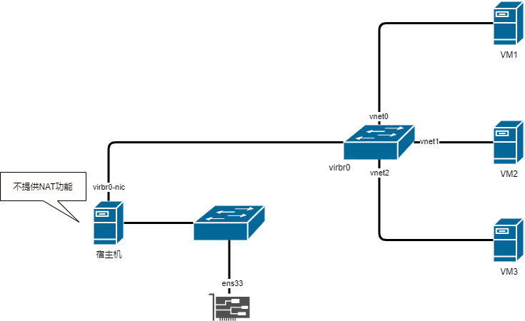

**桥接网络拓扑**

- 在桥接网络下
  - 虚拟机和宿主机可以互相访问
  - 虚拟机和宿主机同处于一个物理网络下
  - 物理网络可以直接访问虚拟机，虚拟机也可以直接访问物理网络

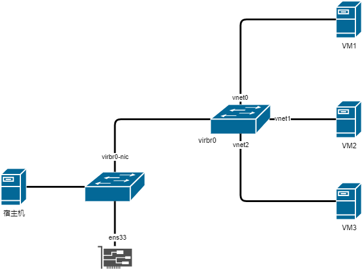

## 配置桥接网络

在宿主机上，桥接自动获取IP地址

- 注意，物理网卡在这样操作后，ens160就会被挂到br0桥下，原本ens160的IP地址会丢失，br0桥的虚拟接口会获得原本的IP。

```bash
nmcli connection add type bridge ifname br0 con-name br0
nmcli connection modify br0 ipv4.method auto ipv6.method ignore

nmcli connection add type ethernet ifname ens160 con-name br0-slave-ens160 master br0

nmcli connection modify ens160 connection.autoconnect no
nmcli connection modify br0-slave-ens160 no

nmcli connection down ens160
nmcli connection up br0
nmcli connection up br0-slave-ens160
```

- 检查配置，如果虚拟机网卡没有挂到br0下，可以手动操作
- 删除原本virbr0桥上的vnet0网卡`brctl delif virbr0 vnet0` , 加到br0的网桥上`brctl addif virbr0 vnet0`

```bash
[root@localhost ~]# brctl show
bridge name     bridge id               STP enabled     interfaces
br0             8000.000c292e48c6       yes             ens160
                                                        vnet3
docker0         8000.22698a118ebc       no              
virbr0          8000.525400b17117       yes             vnet2
```

- 修改虚拟机配置，然后启动虚拟机检查网络是否生效

```bash
[root@localhost ~]# virsh edit vm1
<interface type='bridge'>
	<mac address='52:54:00:63:99:c1'/>
	<source bridge='br0'/>
	<model type='virtio'/>
	<address type='pci' domain='0x0000' bus='0x00' slot='0x03' function='0x0'/>
</interface>
```

删除桥接网卡步骤

- 删除br0的配置文件
- 修改正常网卡的配置文件

```text
nmcli connection down br0-slave-ens160
nmcli connection down br0
nmcli connection delete br0-slave-ens160
nmcli connection delete br0

nmcli connection modify ens160 connection.autoconnect yes
nmcli connection up ens160
```

## 配置NAT网络

- 复制默认的NAT网络配置

```bash
[root@localhost ~]# cd /etc/libvirt/qemu/networks/
[root@localhost networks]# cp default.xml nat1.xml
```

- 修改配置文件

```bash
[root@localhost networks]# vim nat1.xml 
<network>
  <name>nat1</name>
  <uuid>64fa0e8c-b799-4e27-8b23-7c4d512b50e7</uuid>
  <forward mode='nat'/>
  <bridge name='virbr1' stp='on' delay='0'/>
  <mac address='52:54:00:8a:1e:8c'/>
  <ip address='192.168.66.1' netmask='255.255.255.0'>
    <dhcp>
      <range start='192.168.66.2' end='192.168.66.254'/>
    </dhcp>
  </ip>
</network>
```

- 重启`libvirtd`服务，然后激活新的nat网络

```bash
[root@localhost networks]# systemctl restart libvirtd
[root@localhost networks]# virsh net-define nat1.xml
[root@localhost ~]# virsh net-autostart nat1
网络nat1标记为自动启动
[root@localhost ~]# virsh net-start nat1
网络 nat1 已开始
[root@localhost ~]# virsh net-list
 名称               状态     自动开始  持久
----------------------------------------------------------
 default              活动     是           是
 nat1                 活动     是           是
```

- 修改虚拟机配置，然后启动虚拟机检查网络是否生效	

```bash
[root@localhost ~]# virsh edit vm1
<interface type='network'>
  <mac address='52:54:00:63:99:c1'/>
  <source network='nat1'/>
  <model type='virtio'/>
  <address type='pci' domain='0x0000' bus='0x00' slot='0x03' function='0x0'/>
</interface>
```

## 配置隔离网络

复制默认的NAT网络配置

```bash
[root@localhost ~]# cd /etc/libvirt/qemu/networks/
[root@localhost networks]# cp default.xml isolate1.xml
```

修改配置文件

和创建NAT网络一样，不过需要额外的在配置文件中删除如下一行

```bash
[root@localhost networks]# vim isolate1.xml 
<forward mode='nat'/>
```

重启`libvirtd`服务，然后激活新的nat网络

```bash
[root@localhost networks]# systemctl restart libvirtd
[root@localhost networks]# virsh net-define isolate1.xml
[root@localhost ~]# virsh net-autostart isolate1
网络isolate1标记为自动启动
[root@localhost ~]# virsh net-start isolate1
网络 isolate1 已开始
[root@localhost ~]# virsh net-list
 名称               状态     自动开始  持久
----------------------------------------------------------
 default              活动     是           是
 isolate1             活动     是           是
 nat1                 活动     是           是
```

修改虚拟机配置，然后启动虚拟机检查网络是否生效

```bash
[root@localhost ~]# virsh edit vm1
<interface type='network'>
  <mac address='52:54:00:63:99:c1'/>
  <source network='isolate1'/>
  <model type='virtio'/>
  <address type='pci' domain='0x0000' bus='0x00' slot='0x03' function='0x0'/>
</interface>
```

## virbr0网卡

virbr0是kvm默认创建的一个Bridge，其作用是为连接其上的虚拟机网卡提供DHCP功能

virbr0默认分配一个IP `192.168.122.1`，并为连接其上的其他虚拟机网卡提供网关和DHCP功能

virbr0使用dnsmasq提供DHCP服务

```bash
[root@localhost ~]# ps -elf |grep dnsmasq
5 S nobody     1325      1  0  80   0 - 13475 poll_s 16:02 ?        00:00:00 /usr/sbin/dnsmasq --conf-file=/var/lib/libvirt/dnsmasq/default.conf --leasefile-ro --dhcp-script=/usr/libexec/libvirt_leaseshelper
```

在`/var/lib/libvirt/dnsmasq/`目录下有一个virbr0.status文件，里面记录了所有获得IP的记录

```bash
[root@localhost ~]# cat /var/lib/libvirt/dnsmasq/virbr0.status 
[
  {
    "ip-address": "192.168.122.232",
    "mac-address": "52:54:00:37:68:dc",
    "hostname": "vm1",
    "expiry-time": 1601891907
  }
]
```

