# 1. 变量

- 只能存一个值，`int a = 10;`
- 变量名不允许重复定义
- 变量在使用之前一定要进行赋值

```java
int a;
a = 10;	// 或者直接int a = 10;
System.out.println(a);
```

- 一条语句可以定义多个变量，也可以连续赋值

```java
int a, b, c, d;
a = 10;
b = 20;
c = 30;
d = 40;
// a = b = c = d = 10;
System.out.println(a)
System.out.println(b)
System.out.println(c)
System.out.println(d)
```

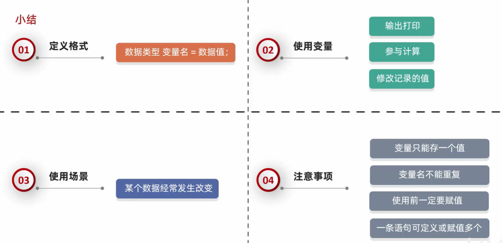

# 2. 计算机存储规则

## 2.1 二进制

- 规则：逢二进一

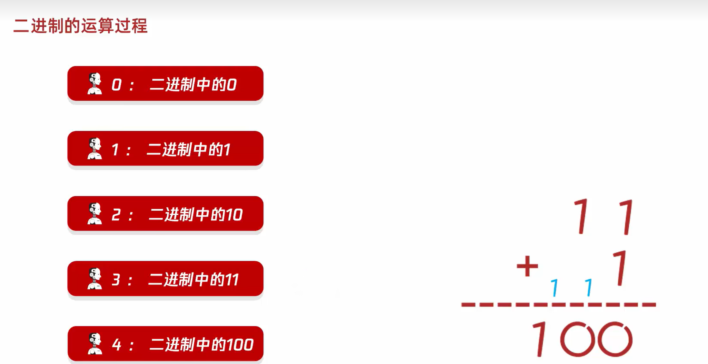

- 在计算机中，任何数据都是以二进制的形式来存储的
- 在计算机中，不同类型的数据有不同的`存储单元`

## 2.2 计算机的存储单元

- 字节，计算机中的最小存储单元，`1个字节=8个bit位`

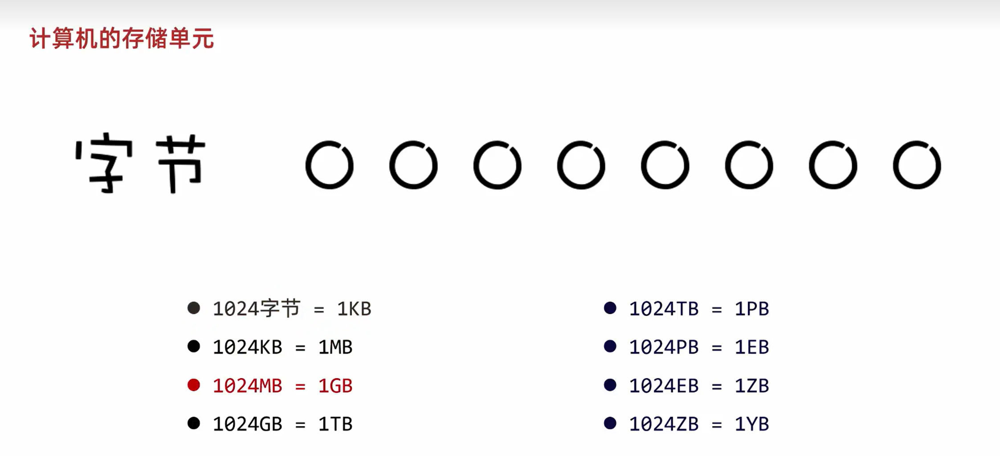

- Java中，int类型占4个字节/32个bit位

# 3. 数据类型

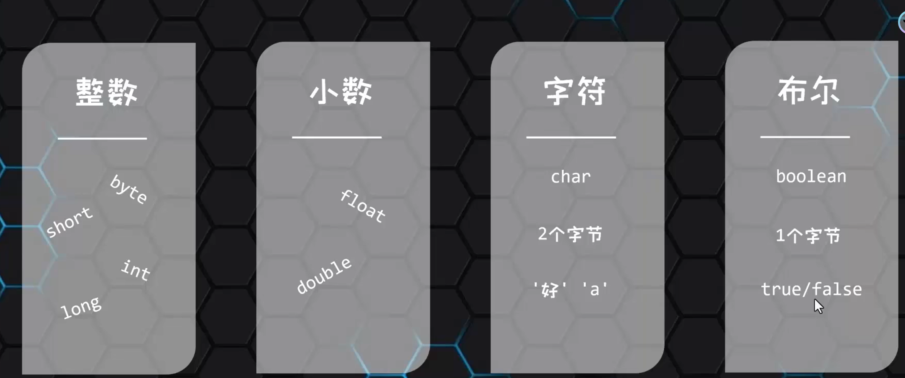

- 整数类型，内存单位都是字节
- 注意，定义`long`类型的变量，必须要以`L/l`结尾，大小写都可以

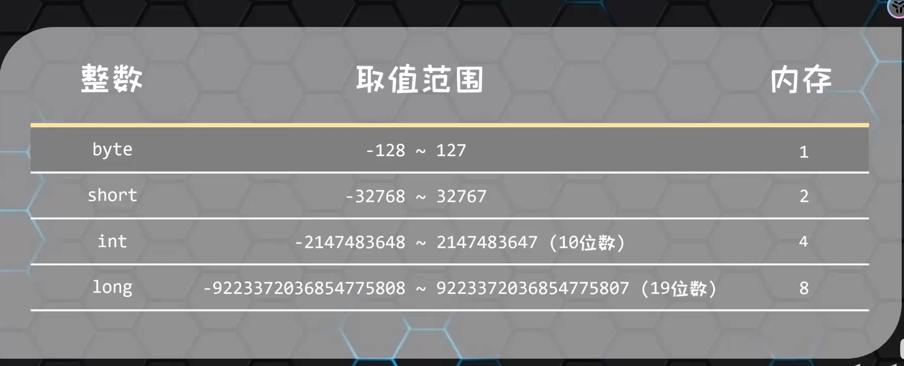

- 小数类型，也就是浮点数类型
- 注意，定义`float`类型的变量，必须以`F/f`结尾，大小写都可以

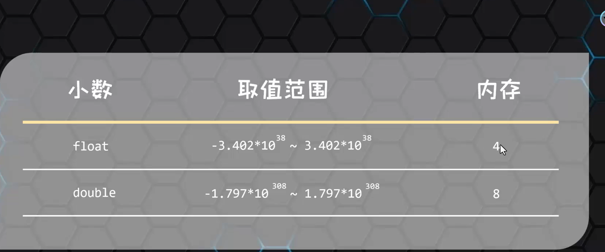

- 字符类型`char`，占2个字节
- 布尔类型`boolean`，`true/false`，占1个字节

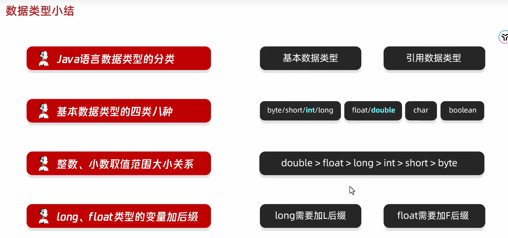

# 4. 标识符

- 标识符：代码中所有我们自己起的名字，包括：类名、变量名、方法名
- 命名规则（具体看阿里巴巴编码规范）：
  - 由数字、字母、下划线`_`、美元符号`$`组成
  - 不能以数字开头
  - 不能是关键字
  - 区分大小写
- 软性建议：见名知意，驼峰命名
  - 其中驼峰命名分为：小驼峰命名（方法、变量）、大驼峰命名（类名）

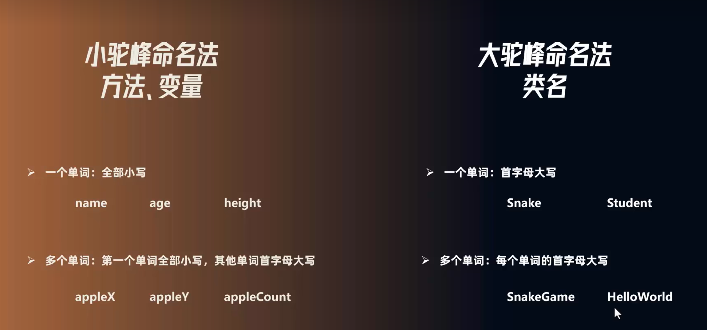

# 5. 键盘录入

- 键盘录入：获取键盘按下的数据，并保存在变量当中

```java
package test.first;

import java.util.Scanner;

public class demo04 {
    public static void main(String[] args) {
        /* 键盘录入：
                第一步：找到Scanner类这个打工人
                第二部：让Scanner对象干活
         */

        // 1. 创建Scanner对象
        Scanner sc = new Scanner(System.in);

        // 2. 让Scanner干活，接受键盘录入的整数
        int num = sc.nextInt();
        System.out.println(num);

        // 3. 接受键盘录入的小数
        double num2 = sc.nextDouble();
        System.out.println(num2);

        // 4. 接受键盘录入的字符串
        String str = sc.next();
        System.out.println(str);
    }
}
```

# 6. 算数运算符

## 6.1 算术运算符的基本用法

- 运算符有：`+、-、*、/、%`
  - 整数相除结果是整数
  - 小数计算有可能不精确

### 练习：数值拆分

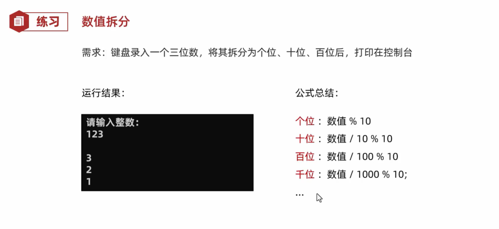

```java
package test.first;

import java.util.Scanner;

public class demo05 {
    public static void main(String[] args) {
        // 1. 键盘录入一个三位数
        Scanner sc = new Scanner(System.in);
        System.out.println("请输入一个三位数：");

        int number = sc.nextInt();
        System.out.println(number);

        // 2. 拆分 数
        // 获取个位
        int ge = number % 10;
        System.out.println("个位：" + ge);
        // 获取十位
        int shi = number / 10 % 10;
        System.out.println("十位：" + shi);
        // 获取百位
        int bai = number / 100 % 10;
        System.out.println("百位：" + bai);
    }
}
```

### 练习：时间转换

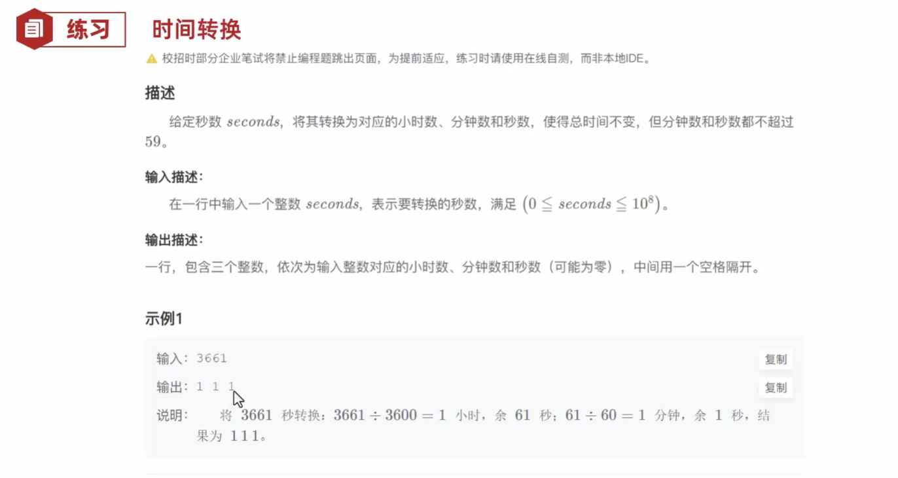

```java
package test.first;

public class demo06 {
    public static void main(String[] args) {
        // 1. 定义变量记录秒数
        int seconds = 3661;
        // 2. 计算小时数
        int hours = seconds / 3600;
        // 3. 计算分钟数
        int minutes = (seconds % 3600) / 60;
        // 4. 计算秒数
        int second = (seconds % 3600) % 60;

        // 5. 输出结果
        System.out.println(hours + ":" + minutes + ":" + second);
    }
}
```

## 6.2 算术运算符的三种情况

- 三种情况：数字运算、字符运算、字符串运算

### 6.2.1 数字运算

- 数字运算：类型不一样不能运算，需要转成同类型的才能计算，分为从小到大和从大到小两种类型

1. 从小到大的隐式转换

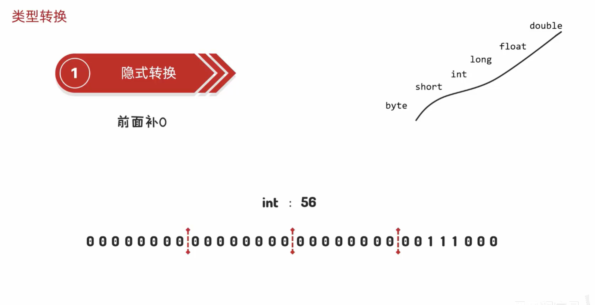

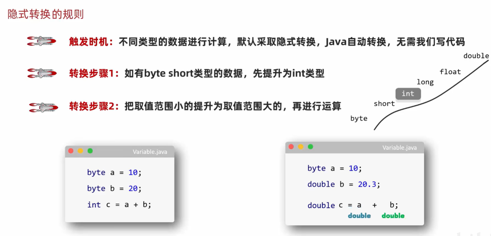

2. 从大到小的强制转换

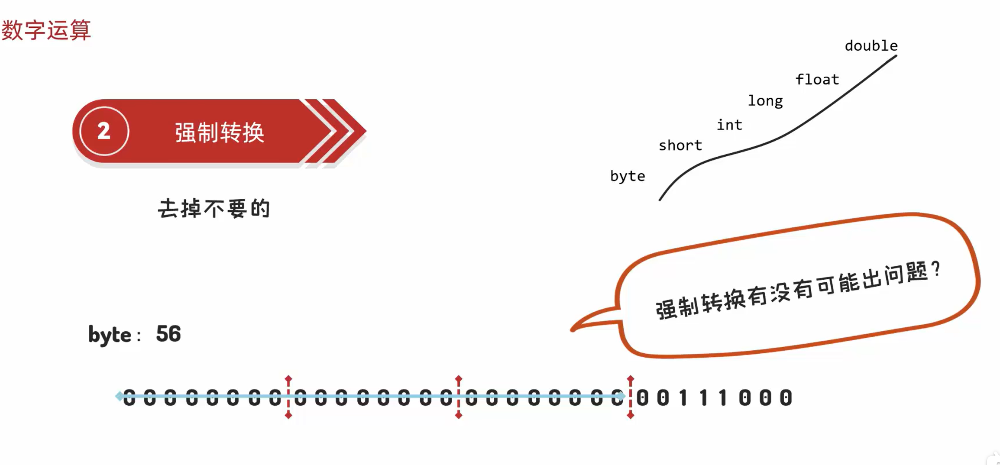

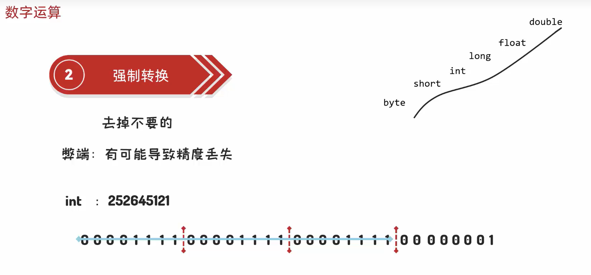

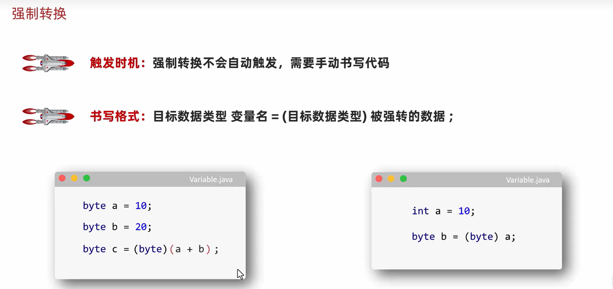

### 6.2.2 字符运算

- 字符在ASCALL码表中是与数字一一对应的

#### 练习：大小写转换

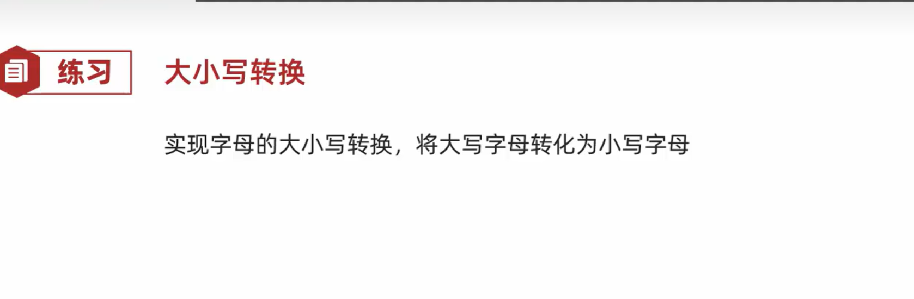

```java
package test.first;

public class demo07 {
    public static void main(String[] args) {
        // 根据ASCALL码表，实现字母的大小写转换，将大写字母转换为小写字母
        // 1. 定义变量记录大写的字符
        char ch = 'A';

        // 2. 转换成小写的字符
        ch = (char)(ch + 32);

        System.out.println(ch);
    }

}
```

### 6.2.3 字符串运算

- 字符串只有`+`操作，没有其他操作
- 任何数据`+`字符串都是拼接操作，并产生一个新的字符串

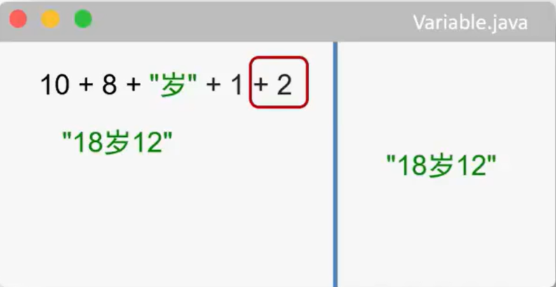

# 7. 自增自减运算符

- 符号：`++`，*变量的值+1*
- 符号：`--`，*变量的值-1*
- 两者用法相同，符号在前则先进行符号运算，后赋值；符号在后则先进性赋值，后进行符号运算

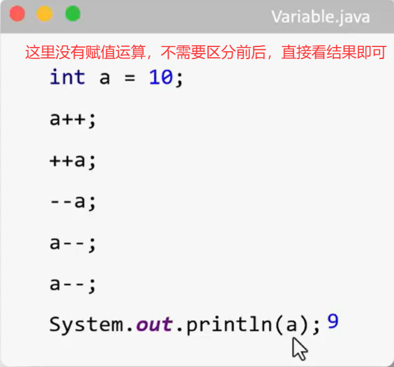

# 8. 赋值运算符

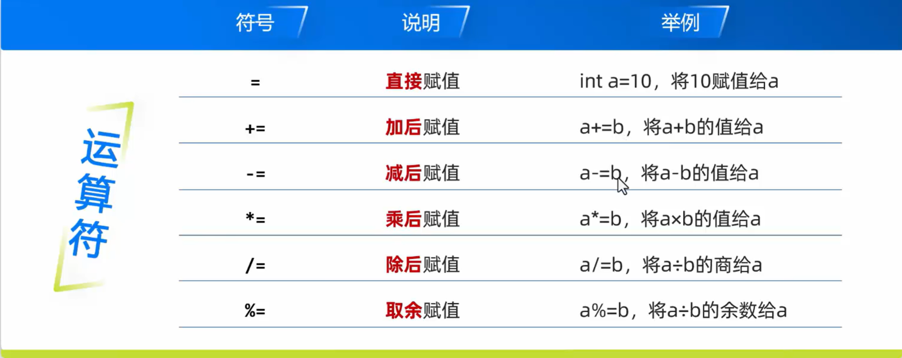

# 9. 关系运算符

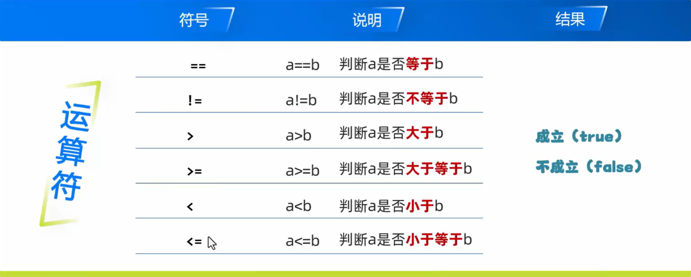

# 10. 逻辑运算符

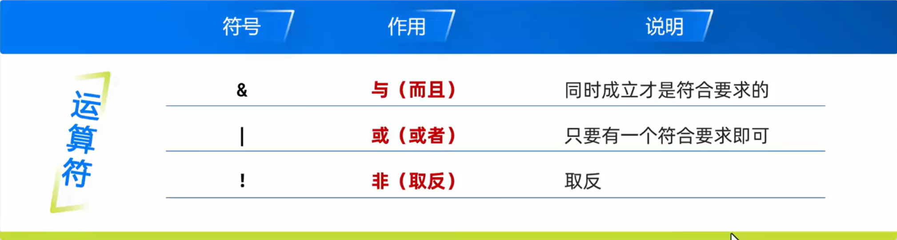

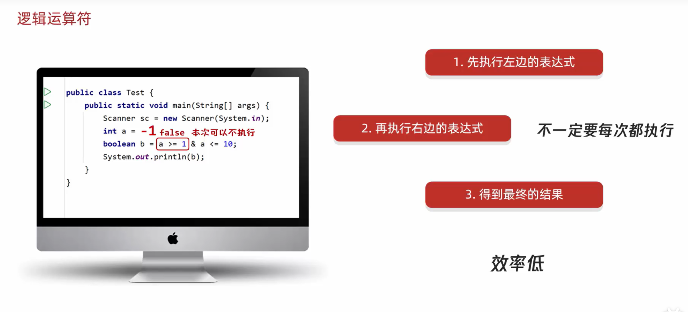

- 短路逻辑运算符，提高运行效率

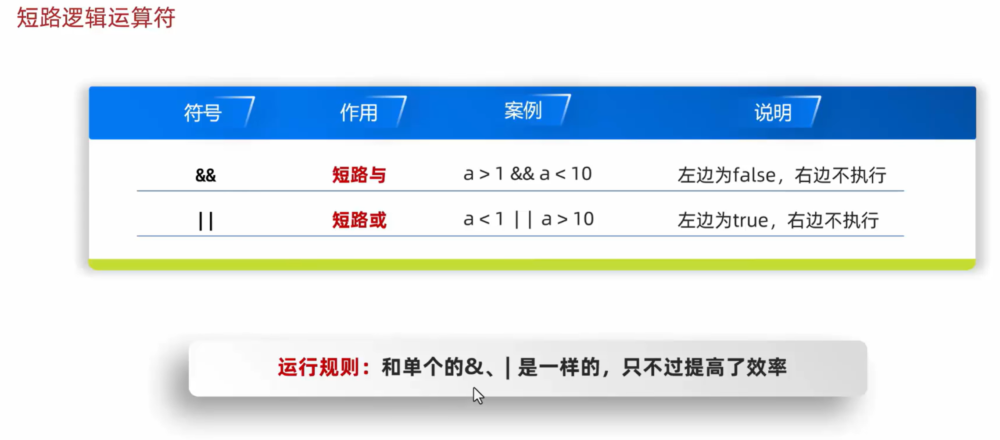

# 11. 三元运算符

- 格式：`关系表达式` `?` `表达式1` `:` `表达式2` `;`

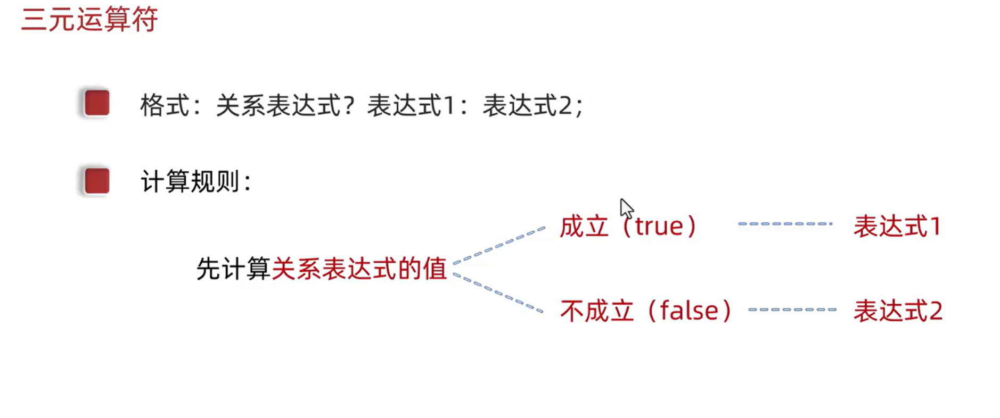

# 12. 运算符的优先级

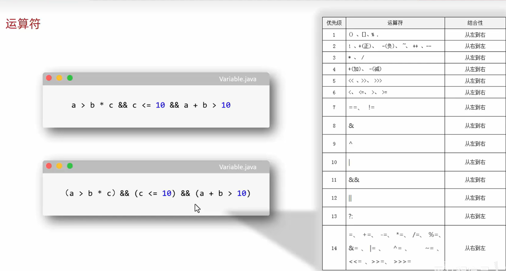

