# 1. 判断

- 应用场景：只有满足条件，对应的代码才能执行

## 1.1 判断语句格式

- `if`语句

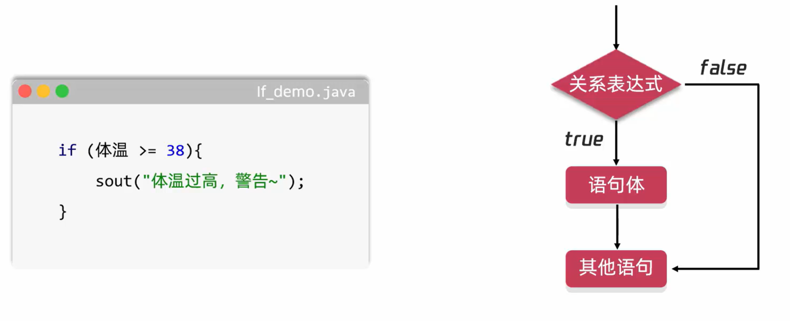

### 练习：游戏人物的血条

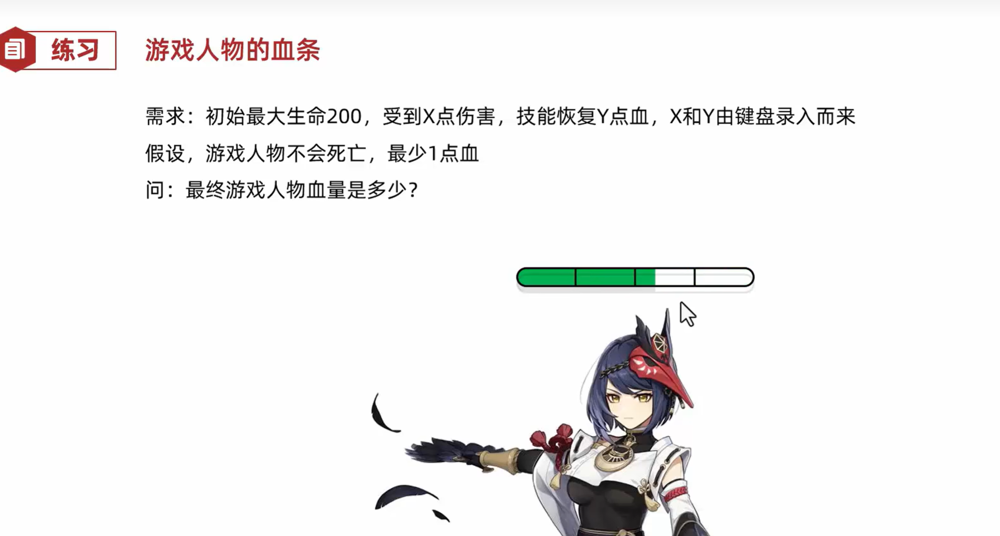

```java
package ifdemo.test.two;

import java.util.Scanner;

public class IfDemo2 {
    public static void main(String[] args) {
//         需求：初始最大生命200，受到X点伤害，技能恢复Y点血，X和Y由键盘录入而来
//         假设，游戏人物不会死亡，最少1点血
//         问：最终游戏人物血量是多少？

        // 1. 定义一个变量记录人物生命值
        int hp = 200;
        // 2. 键盘录入伤害值
        Scanner sc = new Scanner(System.in);
        System.out.println("请输入伤害值：");
        int damage = sc.nextInt();
        hp -= damage;

        // if判断：如果生命值小于等于0，则设置为1
        if (hp <= 0) {
            hp = 1;
        }

        System.out.println("当前人物的血量是：" + hp);
        // 3. 键盘录入技能恢复值
        System.out.println("请输入技能恢复值：");
        int recover = sc.nextInt();
        hp += recover;

        // if判断：如果生命值大于200，则设置为200
        if (hp > 200) {
            hp = 200;
        }
        System.out.println("当前人物的血量是：" + hp);


    }
}
```

## 1.2 判断语句细节

- If语句大括号的位置
  - 左括号写在上一行的末尾，不要单独写一行
- If语句大括号的省略
  - 如果大括号中语句体只有一行，大括号可以省略
- 小括号后面不能有分号
  - 小括号后面不能有分号，这样会拆开if的语句结构
- 判断布尔类型的变量
  - 判断布尔类型的变量，直接把变量写在小括号中即可

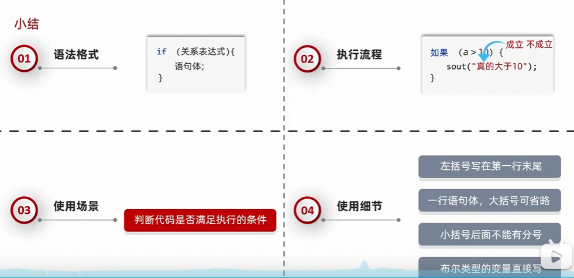

## 1.3 判断语句其他格式

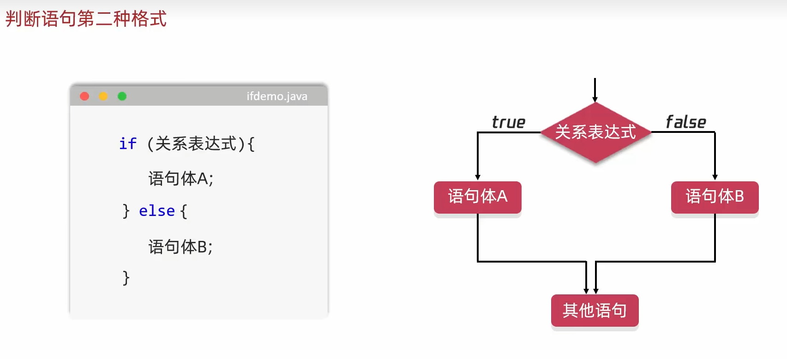

## 1.4 判断语句第三中格式

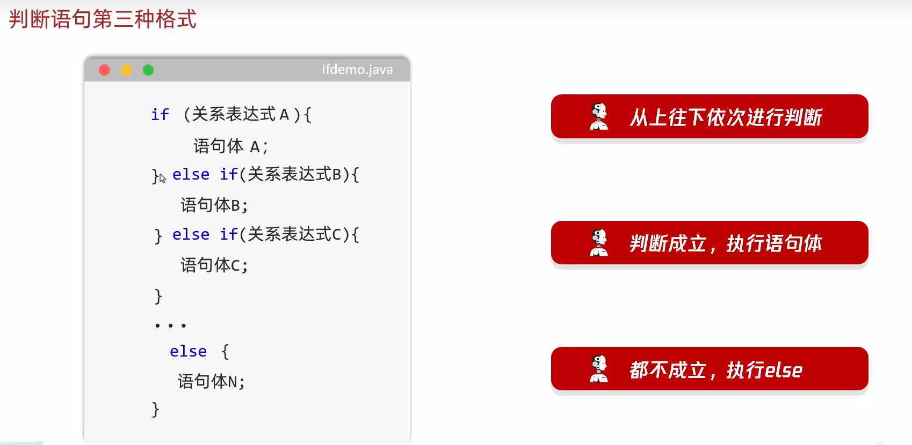

# 2. 选择

- 选择语句：把所有的选择一一列举出来，根据不同的条件任选其一

## 2.1 选择语句格式

- `switch`语句

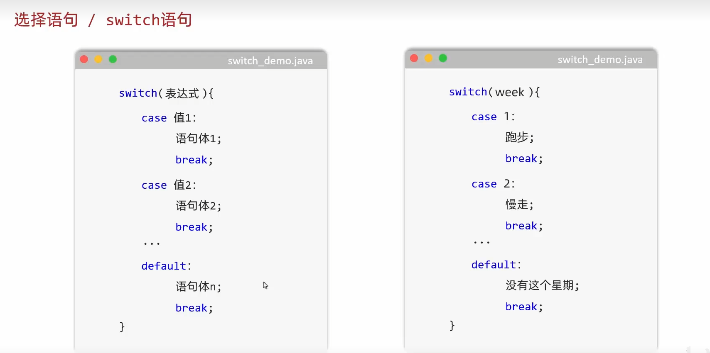

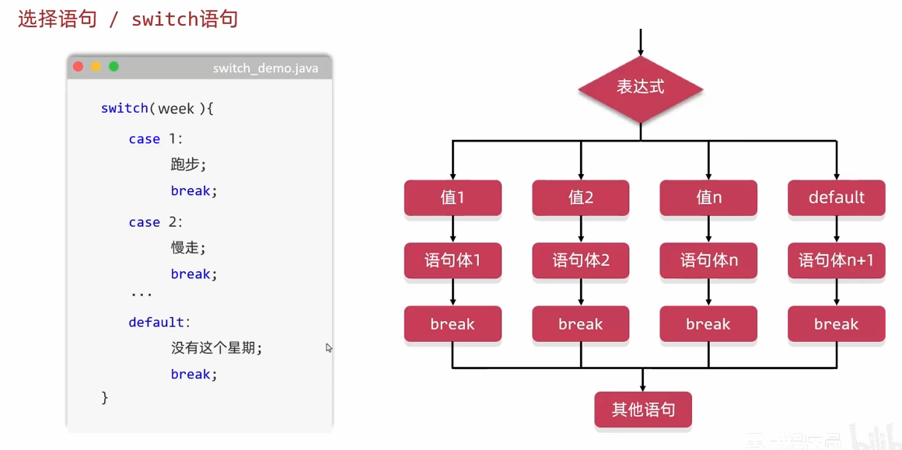

## 2.2 switch注意点

- 表达式：结果（字符/整数byte short int/枚举/字符串）--- 跳转表，索引不支持小数，也不支持大的整数long
- case：被匹配的值，只能是真实的数据 --- 不能写变量
- case：值不允许重复
- break：表示中断，结束的意思，结束switch语句 --- break关键字，作用结束switch语句
- default：所有情况都不匹配，执行该处的内容 --- if里面的else是非常类似的

## 2.3 switch其他注意点

- default的位置和省略
  - 位置：case和default是没有标准的上下之分，位置可以任意的书写。为了观看比较方便，提高代码的阅读性，一般来讲，case从小到大依次书写，default是写在最下面的
  - 省略：default是可以省略不写的，在此时如果所有的case都不匹配，则没有任何的输出结果
- case穿透
  - 在我们写代码时候，如果break没有写，此时就会触发case穿透现象
  - 执行流程：
    - 拿着小括号中表达式的值跟下面的case进行匹配
    - 如果匹配上了，就会执行case里面的语句体，遇到break结束整个的switch（正常情况）
    - 如果在执行语句体的时候没有看到break，那么程序会继续执行下一个case的语句体，直到遇到break或者运行完整个的switch为止
  - 应用场景：当多个case的语句体重复的时候，利用case穿透节省代码

## 2.4 switch新特性

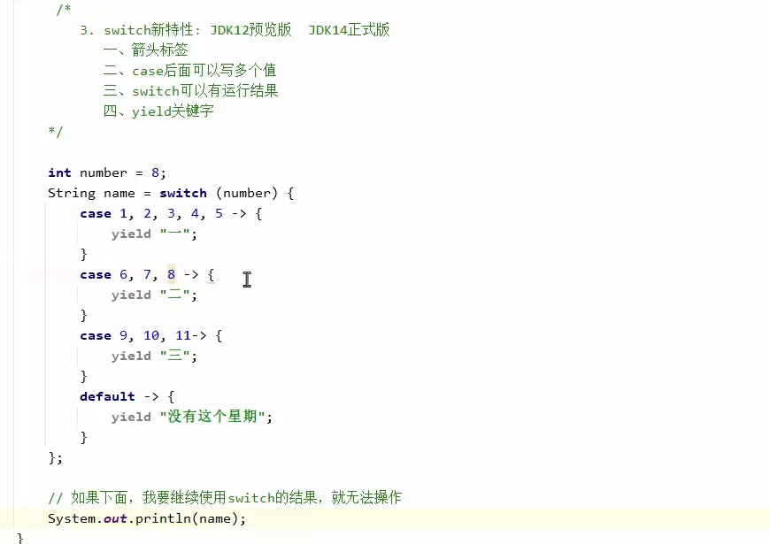

- JDK12预览版	JDK14正式版
- 一、箭头标签
- 二、case后面可以写多个值
- 三、switch可以有运行结果
- 四、yield关键字

## 2.5 switch和if第三种格式各自的使用场景

- if语句：用于对范围的判断
- switch语句：case的值是有限的

# 3. 循环

- 重复执行某件事情

## 3.1 for循环

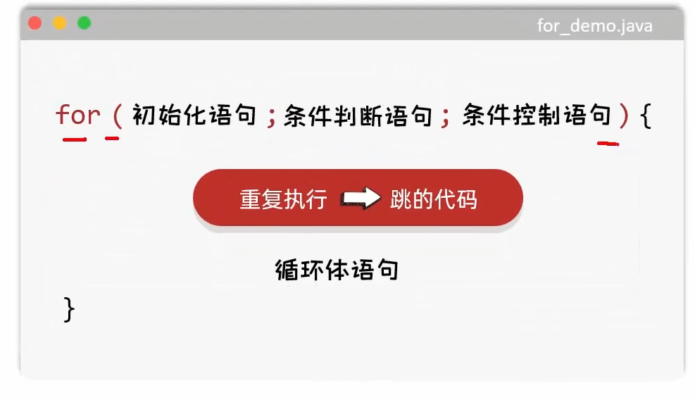

- 初始化语句：循环的开始
- 条件判断语句：循环的结束条件
- 条件控制语句：控制变量如何变化
- 循环体语句：要重复执行的代码

## 3.2 while循环

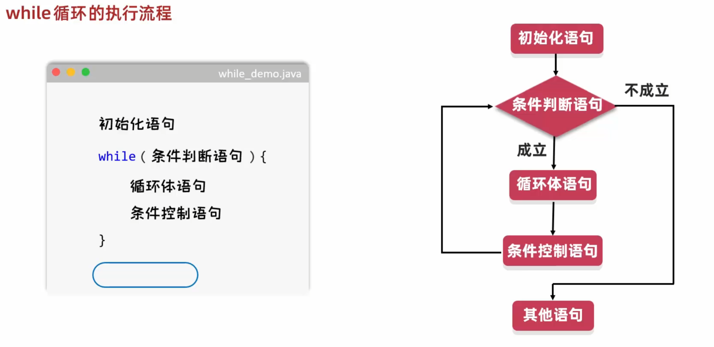

- for和while的对比

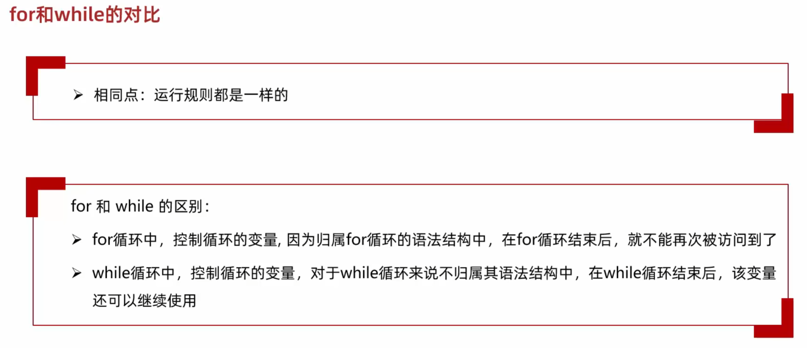

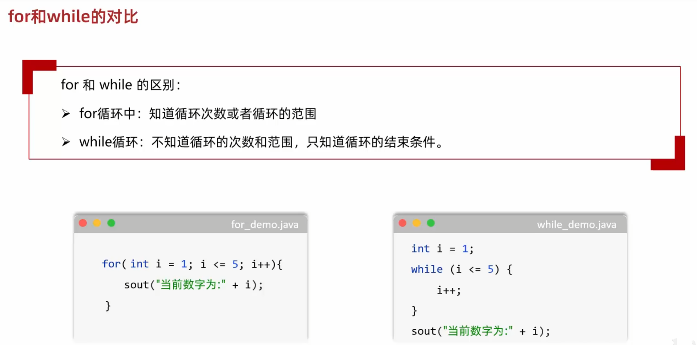

## 3.3 do...while循环

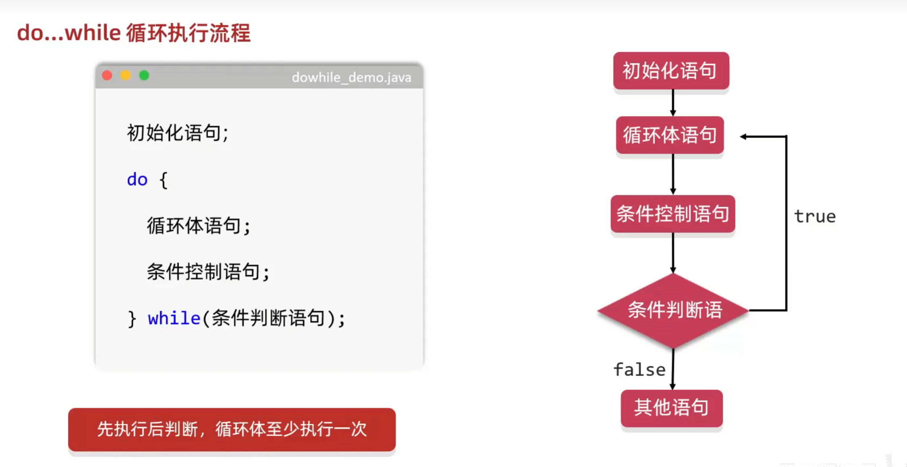

- 特点：先执行后判断，循环体至少执行一次

## 3.4 无限循环

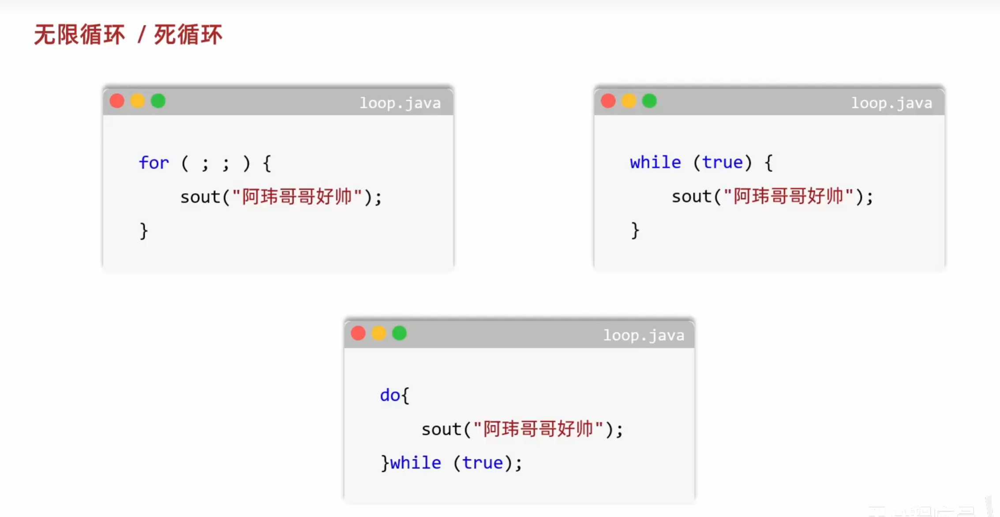

## 3.5 循环控制语句

- 关键字`break`和`continue`

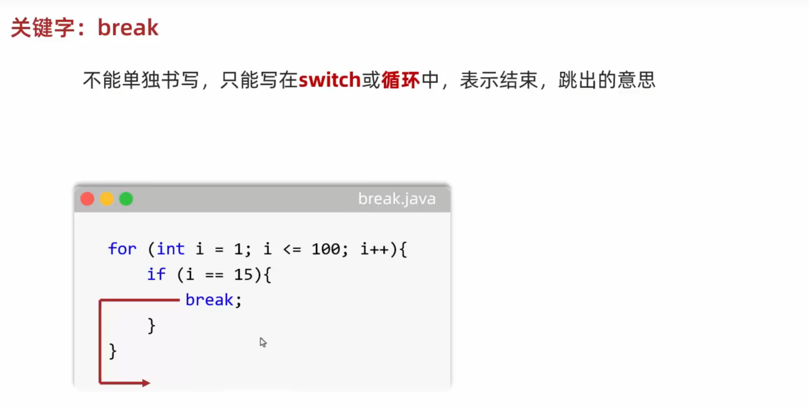

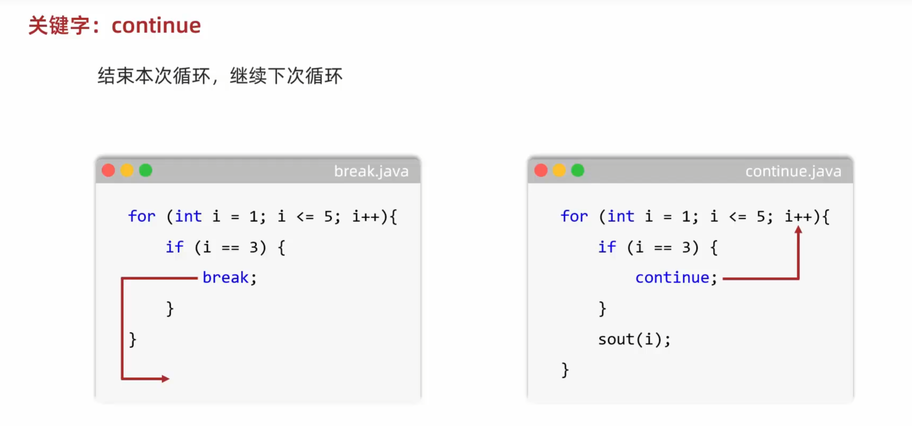

## 3.6 循环语句嵌套

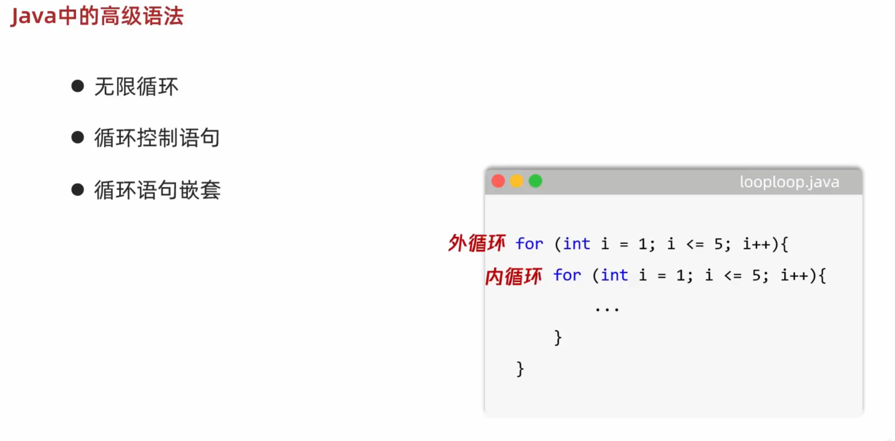

## 3.7 制表符`\t`

- 简单理解：长度可变的打空格，打印表格类型的时候，可以让上下对齐
- 真正的含义：
  - 在前面的字符后面补上1~4个空格，让这个整体的长度凑成4的整数倍	---- idea
  - 在前面的字符后面补上1~8个空格，让这个整体的长度凑成8的整数倍
