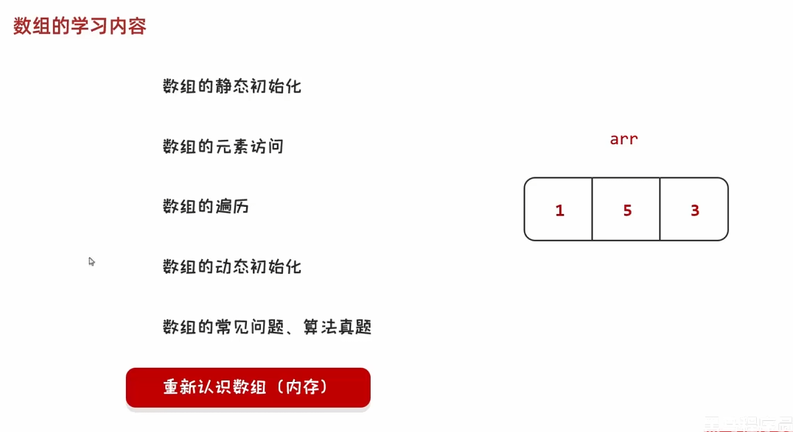
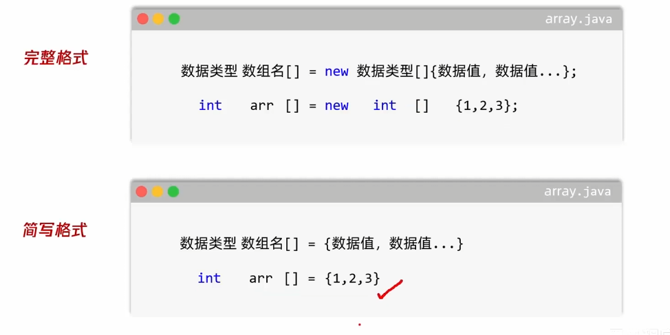
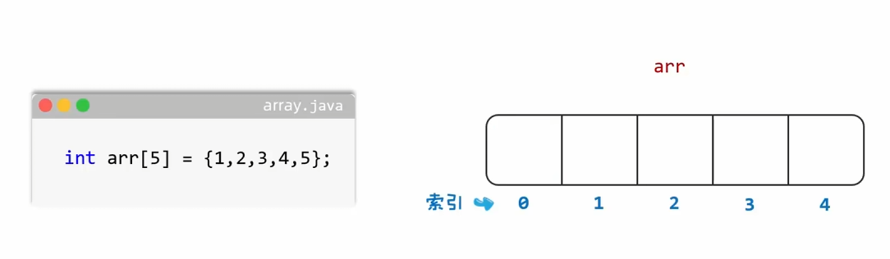
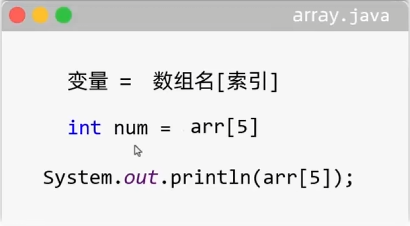
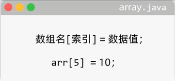
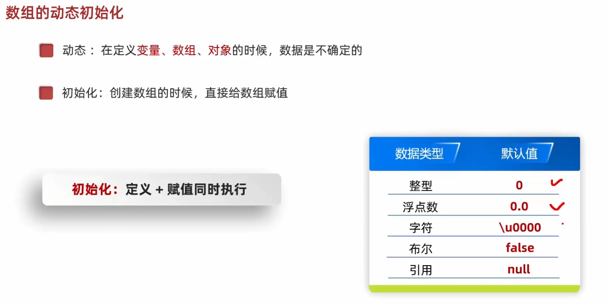
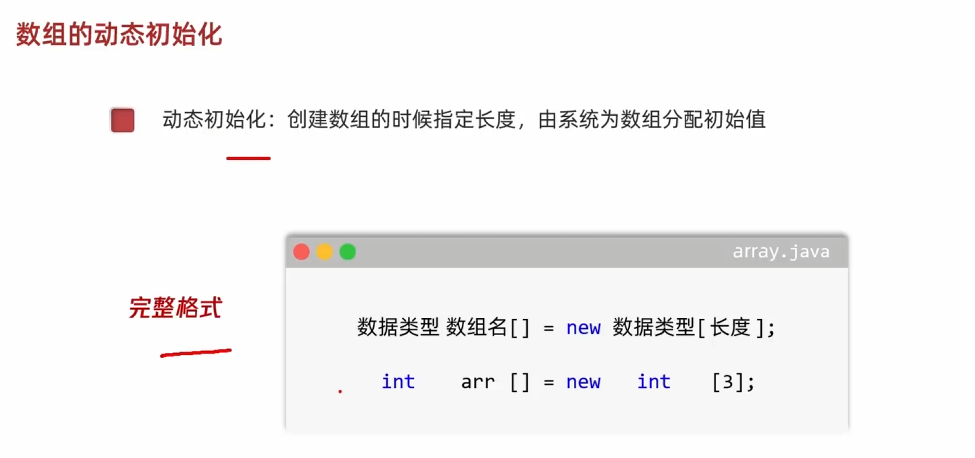

# 1. 数组定义

- 数组：是一种容器，可以用来存储`同种数据类型`的多个值




# 2. 数组的静态初始化

- 初始化：是指在定义`变量`、`数组`、`对象`的时候
  - 定义+赋值同时执行
- 静态：在定义`变量`、`数组`、`对象`的时候，数据是静止、确定的
- 静态初始化：创建数组的时候，直接给数组赋值



- 特点1：连续的空间
- 特点2：一旦定义，长度不可变

# 3. 数组的元素访问 -- 获取 修改

## 3.1 索引

- 索引就是数组的一个编号，也叫做：角标、下标、编号
- 特点：从0开始的，连续+1，不间断



## 3.2 获取



## 3.3 修改



## 3.4 数组的遍历

```java
package array;

public class ArrayDemo03 {
    public static void main(String[] args) {
        int[] arr = {10, 20, 30, 40, 50};

        // 获取数组的长度
        System.out.println(arr.length);

        // 数组名.fori + 回车
        for (int i = 0; i < arr.length; i++) {
            System.out.println(arr[i]);
        }
    }
}
```

- idea遍历数组快捷方式：`数组名.fori + 回车`

# 4 数组的动态初始化

- 初始化：创建数组的时候，直接给数组赋值
  - 定义+赋值同时执行
- 动态：在定义`变量`、`数组`、`对象`的时候，数据是不确定的



- 动态初始化：创建数组的时候指定长度，由系统为数组分配初始值



# 5. 数组的常见问题

- 最大的问题：数组的索引越界