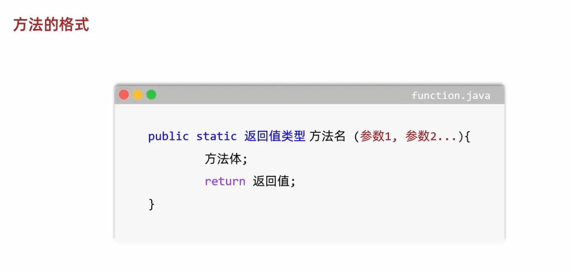
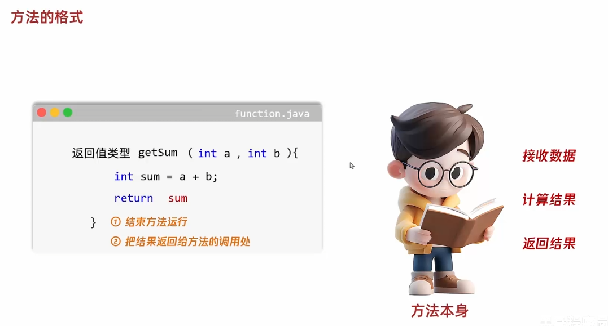
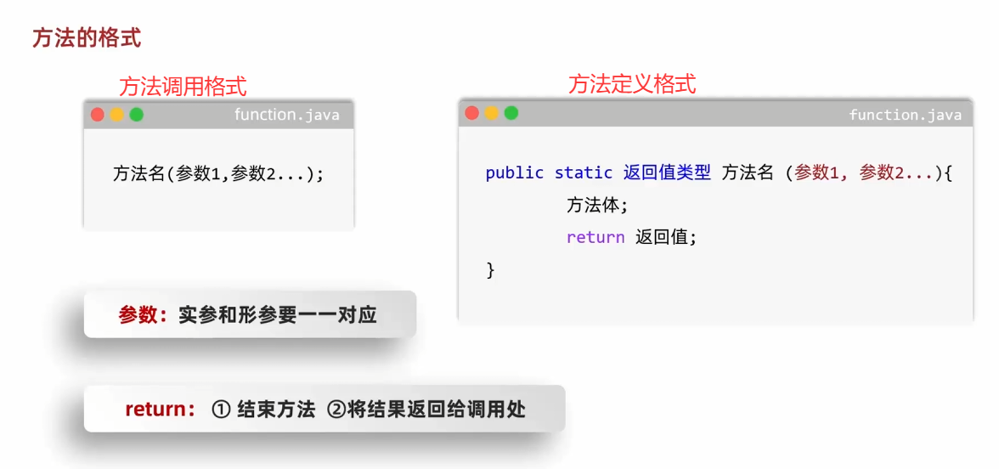
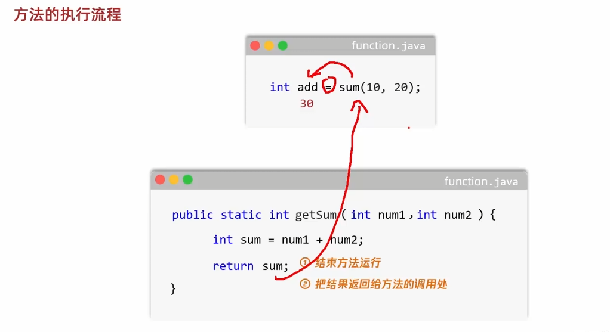
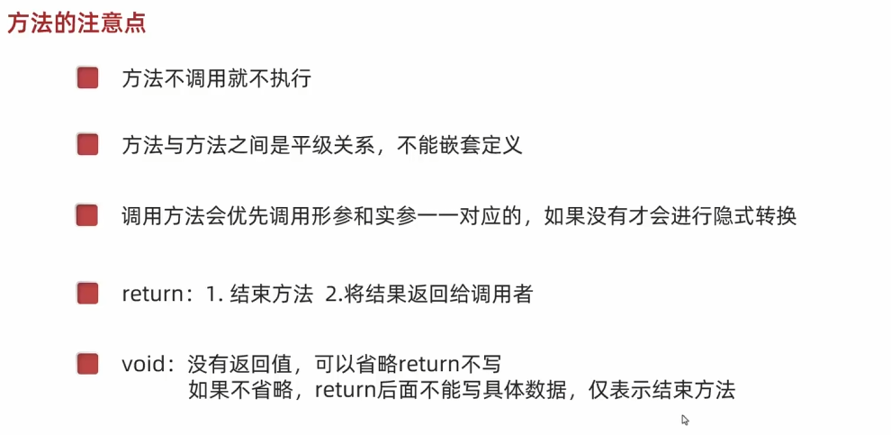

# 1. 方法的定义

- 方法：程序中的独立功能，也是最小的执行单元
- 使用场景：经常使用的代码打包，放在方法当中
- 好处：提高了程序的`复用性`和`可维护性`
- 应用：游戏跳跃等动作、商城购买商品加减等操作

# 2. 方法的格式

# 3. 方法的执行流程

# 4. 定义方法的小诀窍

- 观察在大段的代码中，反复使用的独立功能是什么？`反复使用`+`独立功能`
- 这个独立功能，需要什么才能完成？`形参`
- 方法的调用处，是否需要这个独立功能的结果继续做其他事情？`返回值`

# 5. 方法的重载

- 同一个类中，定义了多个同名的方法，这些方法具有类似的功能
- 每个方法具有不同的参数类型和参数个数，这些同名的方法，就构成了`重载关系`
- `简单理解`：同一个类，方法名相同，参数不同的方法发，无需看返回值   `个数不同` `类型不同` `顺序不同`

# 6. 方法的注意点

