# 1. Java的运行机制

- Java程序真正运行的是`.class`后缀的字节码文件，并且文件是运行在`JVM虚拟机`中的，这样Java代码就可以实现`跨平台`的操作

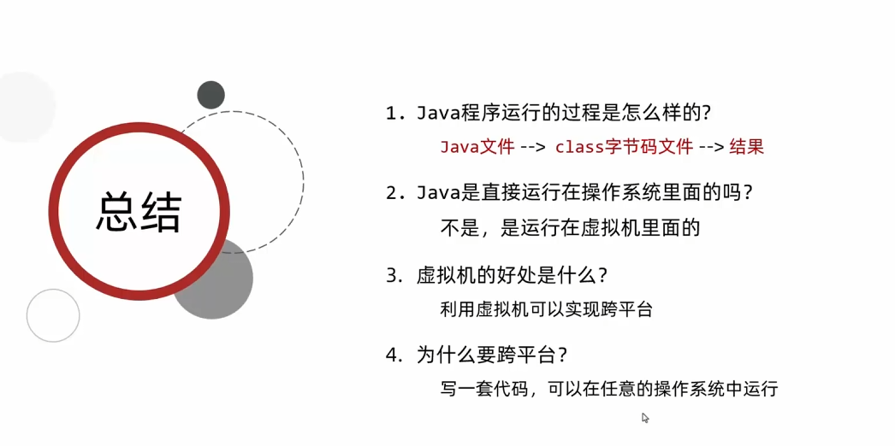

# 2. 内存

- 内存：软件在运行时，用来`临时`存储数据的

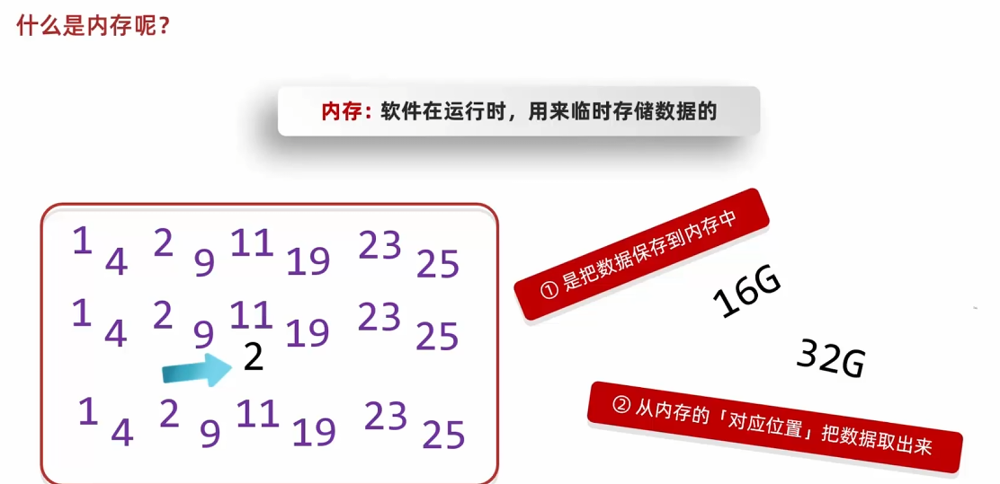

## 2.1 内存地址

- 内存地址：内存中每个小格子的编号

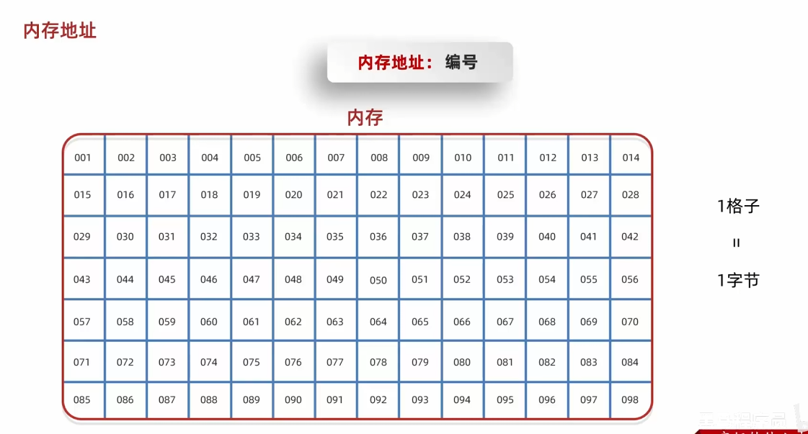

- 内存地址的规则

  - 32位的操作系统，内存地址以32位的二进制表示
  - 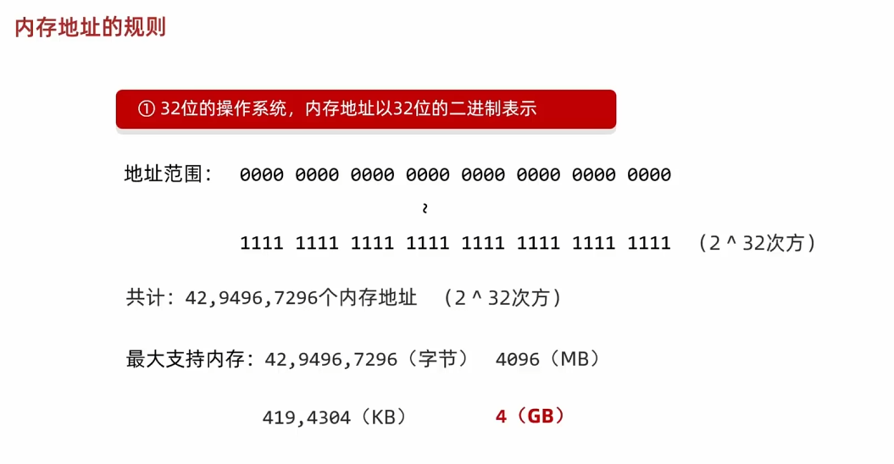

  - 64位的操作系统，内存地址以64位的二进制表示
  - 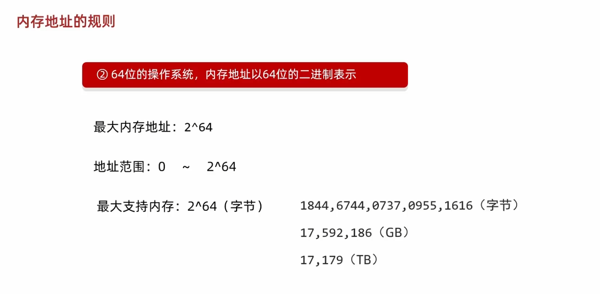

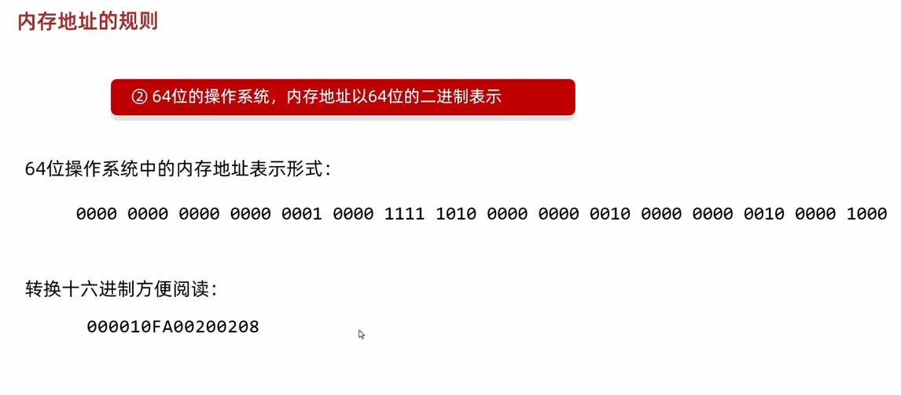

## 2.2 Java中的内存分配

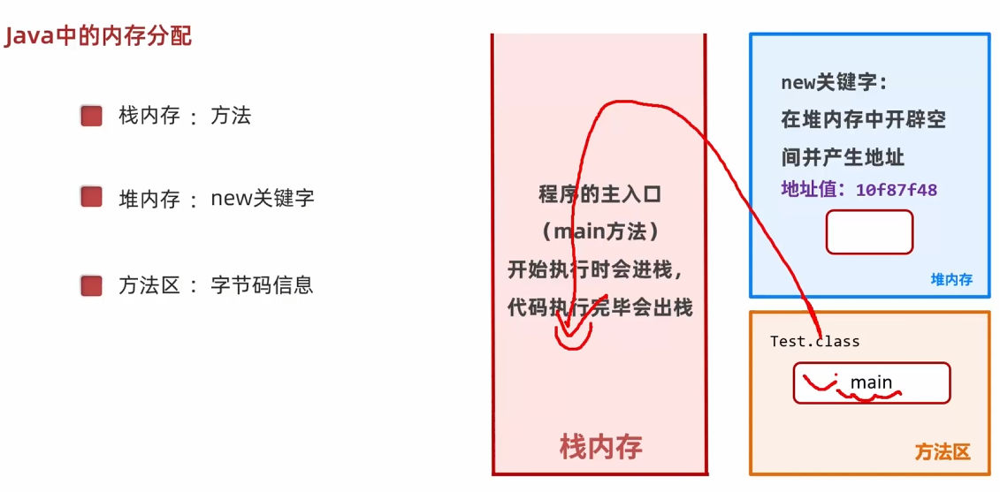

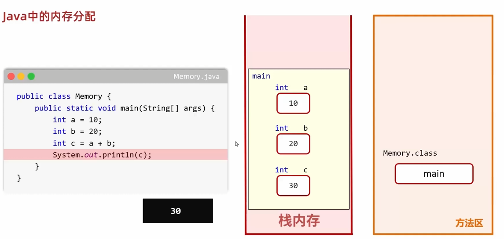

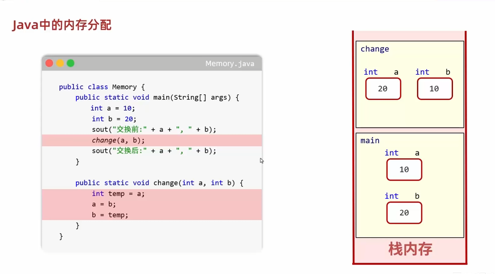

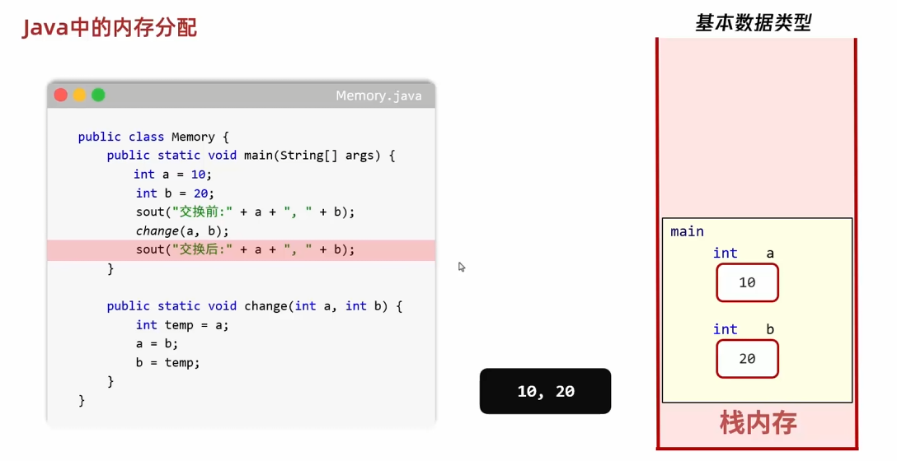

- 基本数据类型：变量里面记录的是真实的数据，传递也是真实的数据

## 2.3 Java中数组的内存分配

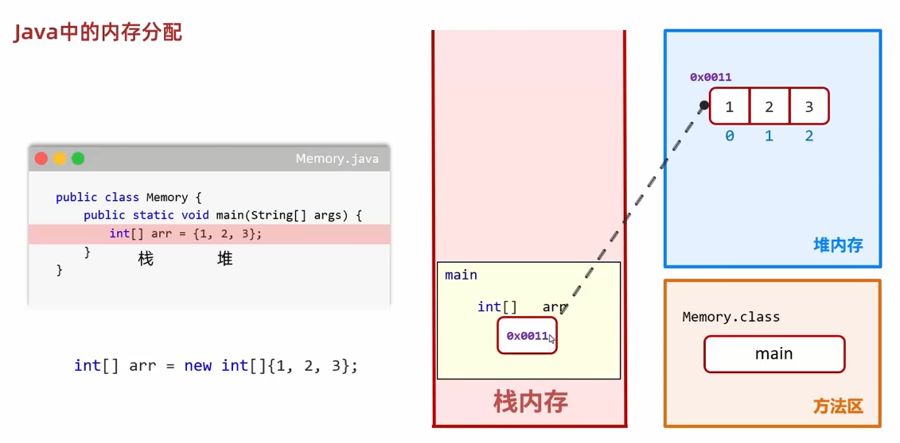

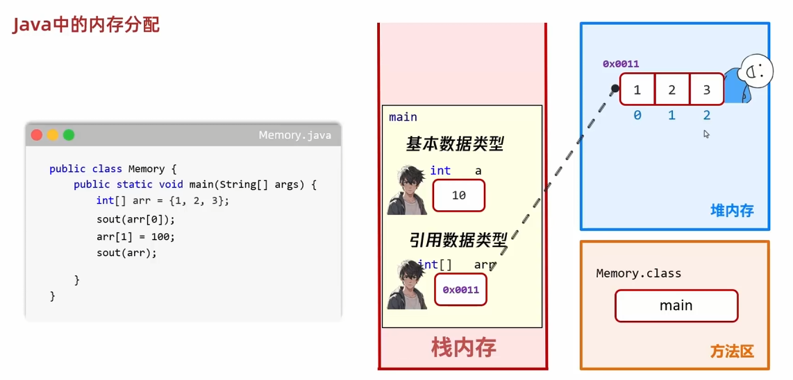

- 引用数据类型：变量里面记录的是数组的内存地址，传递的也是内存地址

## 2.4 数组在方法中传递

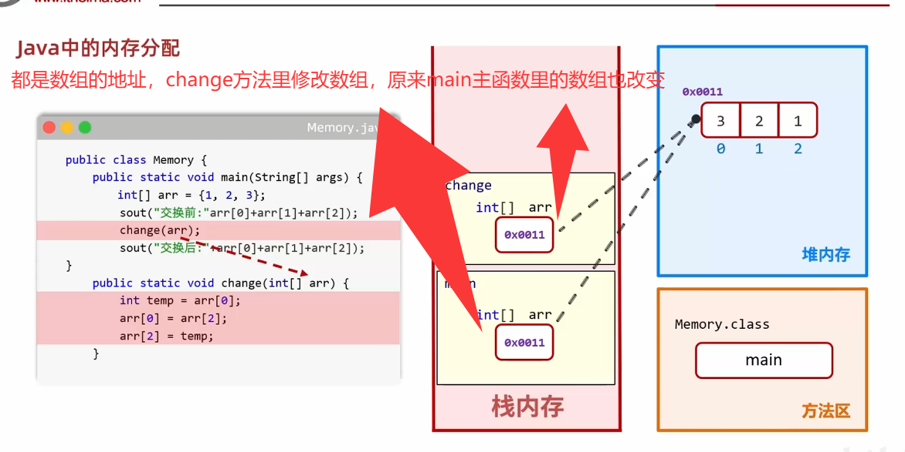

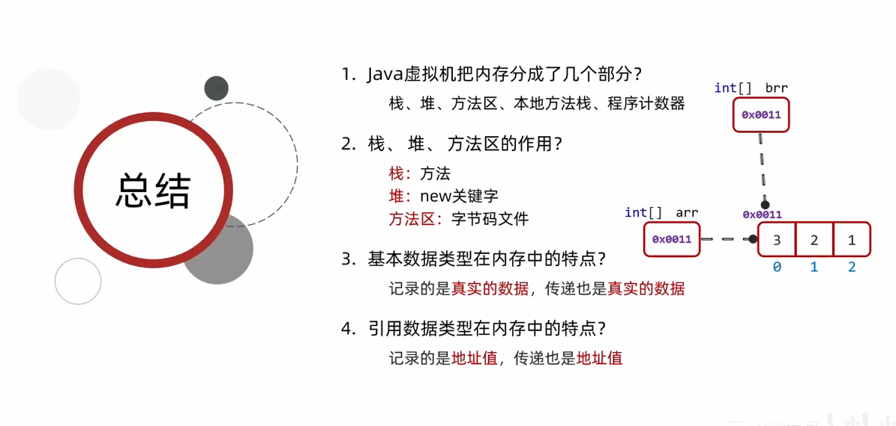