# 1. 什么是面向对象

- 对象：把相关的`数据`和`方法`组织为一个`整体`来看待
- 面向对象：利用`对象`进行软件开发
- Javabean类：用来描述一类事物的（属性/行为），`属性`用`成员变量`来体现，`行为`用`方法`来体现

# 2. 类和对象

- 类是新建的一个类，由项目的具体事物的属性抽象得到（`定义一个类描述一类事物`）
- 对象是对应的类建立后，在`main方法`里面`new`建立出来的，可以对抽象类里面的属性进行赋值得到对象（`创建对象，记录单独个体的所有信息`）

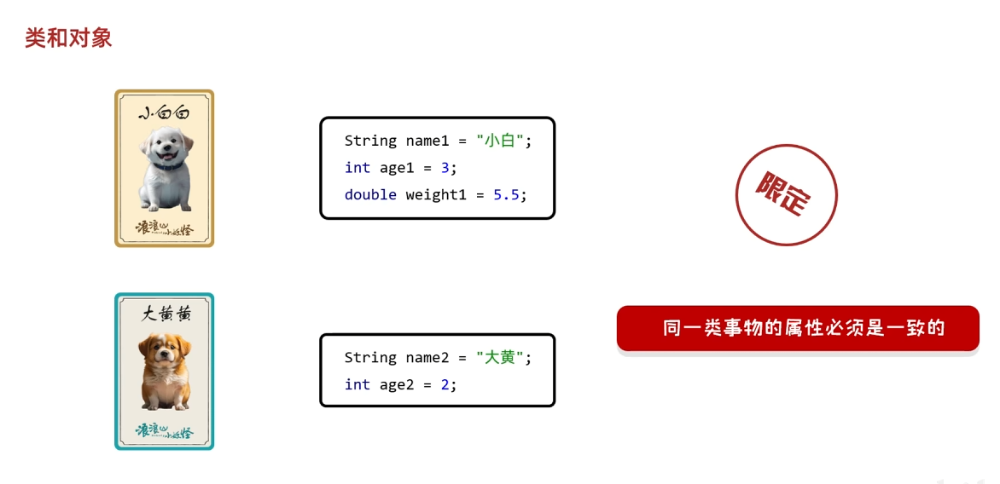

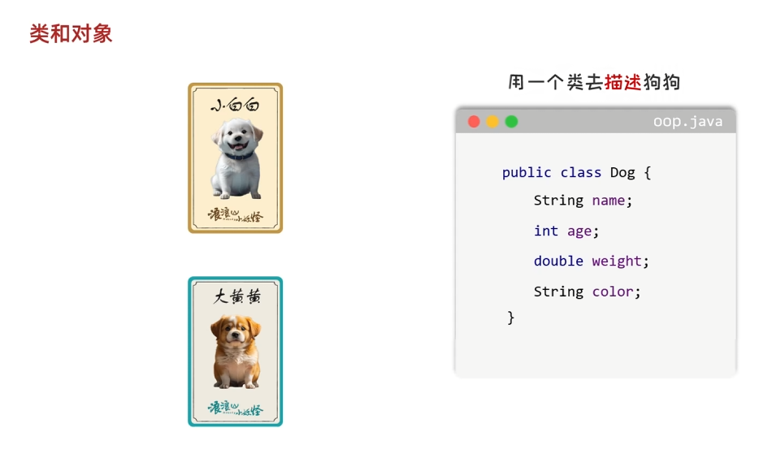

- 定义类时只定义不赋值，把共同事物的属性抽象出来
- 定义完类之后可以创建对象，相当于抽象到具体

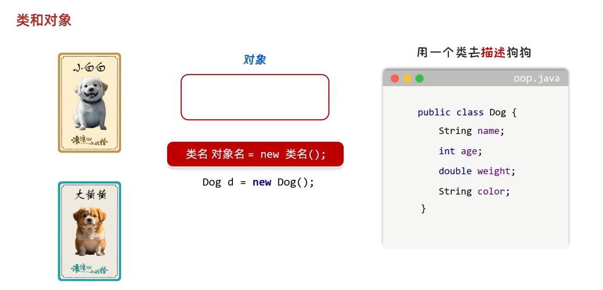

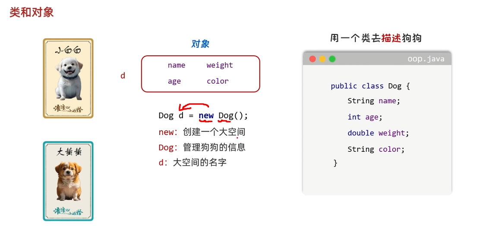

- 新建对象之后可以对对象的属性进行具体赋值

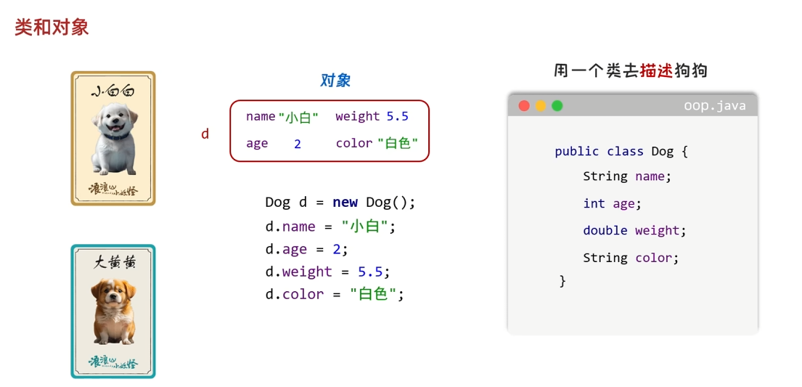

- 可以再新建一个对象对另一个对象的属性进行赋值

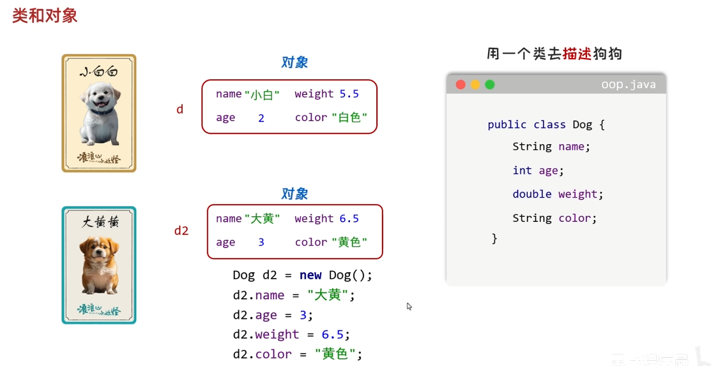

# 3. 面向对象的小细节

- 描述一类事物的类叫做`Javabean类`
- 带有`main方法`的类叫`测试类`
- `Javabean类`可以写属性和行为，行为就是定义的方法
  - 但要注意，`Javabean类`中的方法是不加`static`的

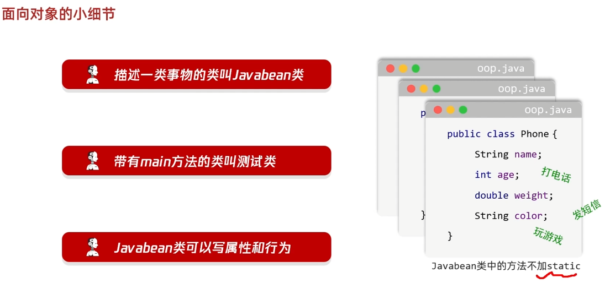

# 4. 面向对象中的数据安全问题

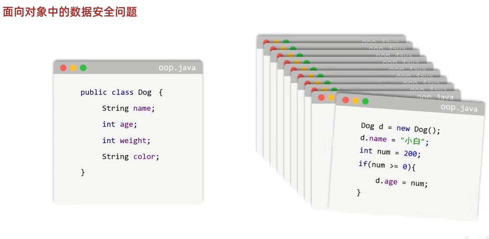

- 正常情况下可以输入一些不符合事实的数据，需要对对象的属性进行限制，这时可以用到下面的知识点

## 4.1 private关键字

- `private`关键字是一个权限修饰符，可以修饰成员变量和成员方法
  - 成员变量就是定义在方法里的属性
  - 成员方法就是上面写的行为
  - 特点：一旦被`private`修饰，只能在本类中才能访问，外界无法访问
- 讲到这里解决了无法赋值错误数据的问题，但是由`private`修饰的属性只有在本类中才可以访问，所以在主类中直接赋值就算是正确的值也会报错

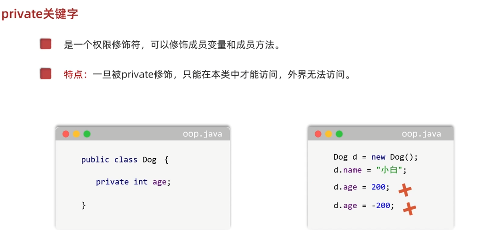

## 4.2 get/set方法

- 要解决上面的问题就引入了`public`修饰的`setAge`和`getAge`方法
  - 其中`setAge`是用来赋值的，在这个方法里可以对数据进行约束来过滤错误的数据
  - `getAge`方法是用来对外提供`age`这个属性的数据

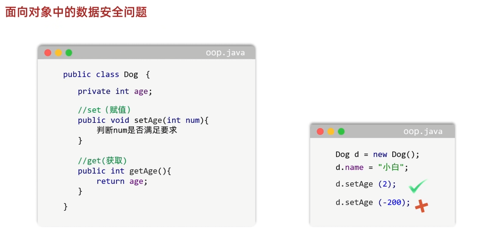

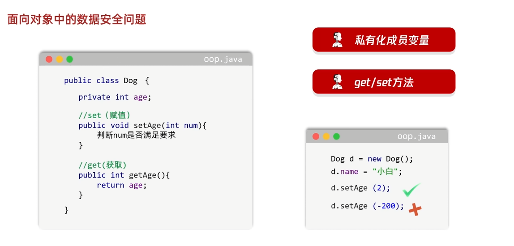

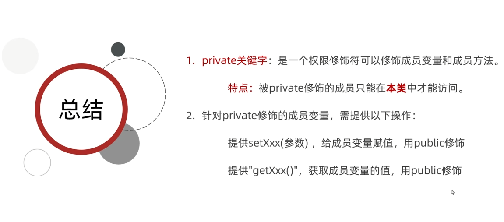

# 5. this关键字

- 定义方法时，方法里面的变量叫做`局部变量`，外面定义的属性叫做`成员变量`
- 在方法里面调用变量遵守`就近原则`，当方法里的局部变量与外面的成员变量重名时，会引起冲突，这时就需要用到`this关键字`

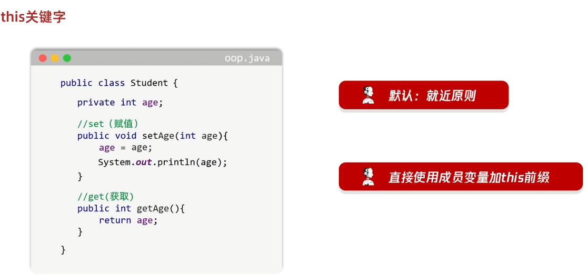

- 想要在方法里面直接使用成员变量就在变量前加上`this关键字`

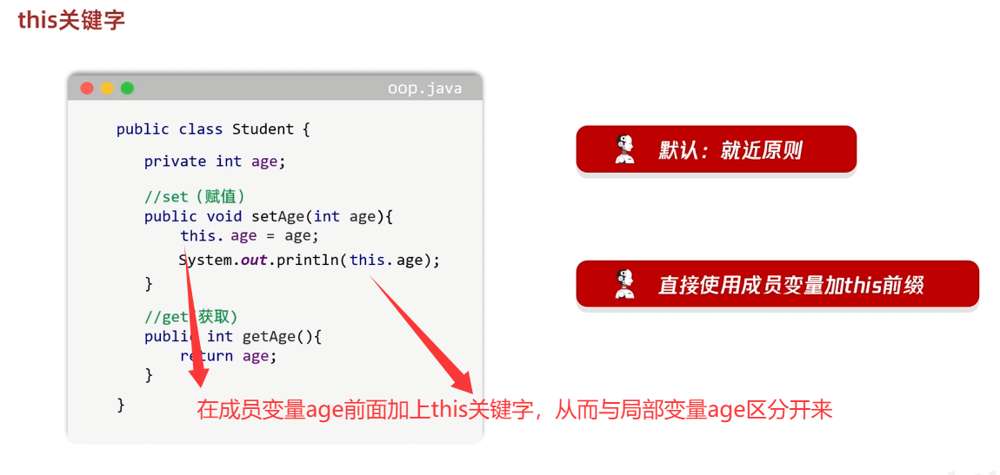

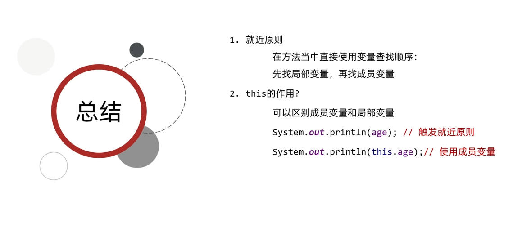

# 6. 构造方法

- 构造方法也叫做`构造器`、`构造函数`
- 作用：在创建对象的时候给成员变量进行初始化的

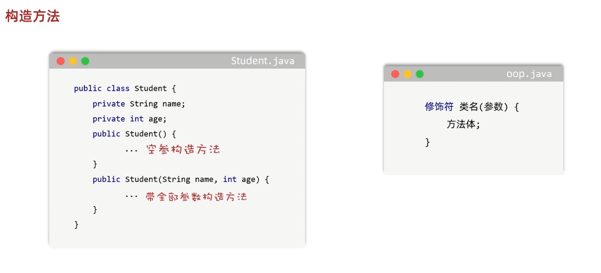

- 特点：
  - 方法名与类名相同，大小写也要一致
  - 没有返回值类型，连void都没有
  - 没有具体的返回值（不能由return带回结果数据）
- 执行时机：
  - 创建对象的时候由虚拟机调用，不能手动调用构造方法
  - 每创建一次对象，就会调用一次构造方法

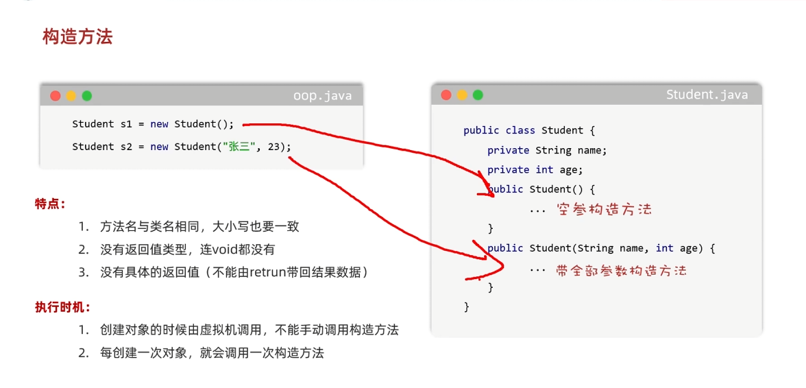

# 7. 构造方法注意事项

- 如果没有定义构造方法，系统将给出一个`默认的无参构造方法`
- 如果自己写了任意构造方法，系统将`不再提供`默认的构造方法
- 带参构造方法和无参数构造方法，两者方法名相同，但是参数不同，这叫做`构造方法的重载`
- **习惯**：无论是否使用，都手动书写无参数构造方法，和带全部参数的构造方法

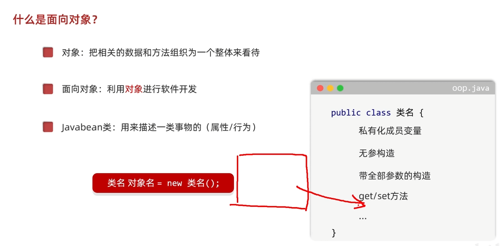
