# 1. static关键字

- `static关键字`：表示`静态`，是Java的修饰符，用来修饰（成员变量/成员方法）

## 1.1 static关键字修饰成员变量

- 特点：叫做静态变量，被该类所有对象共享，只需赋值一次即可
- 调用方式：
  - 方法一：**类名调用**，推荐使用方法一
  - 方法二：对象名调用

## 1.2 static关键字的内存解析

- 静态变量是随着字节码的文件加载而加载到方法区里的

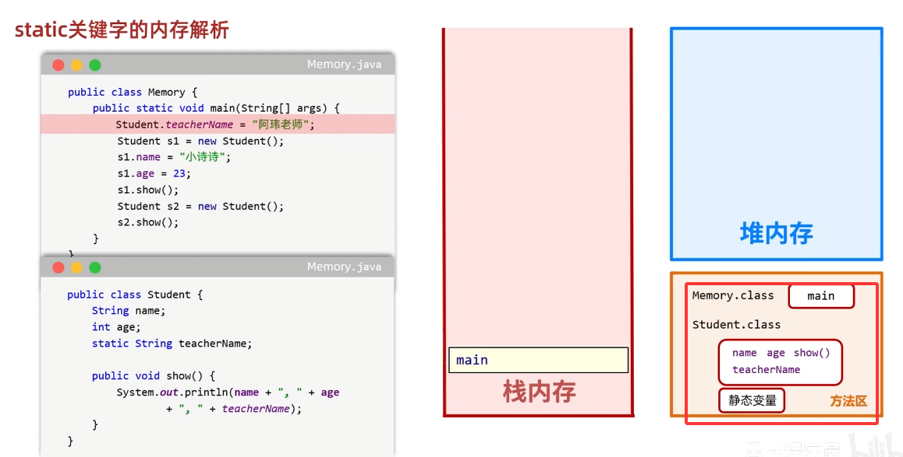

- 但是从jdk8开始，静态变量由方法区移动到了堆内存里面，静态变量里记录所有共享属性

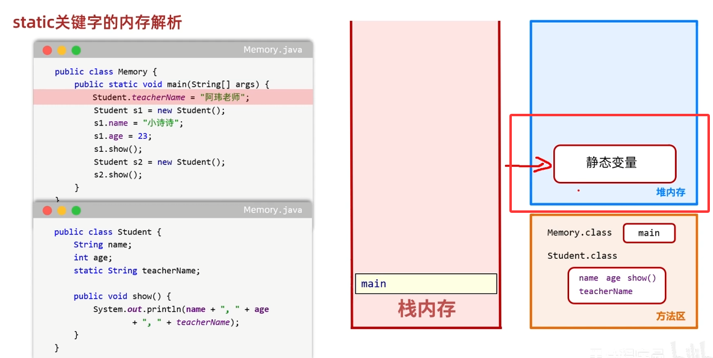

- **静态变量是随着类的加载而加载的，优先于对象出现的**

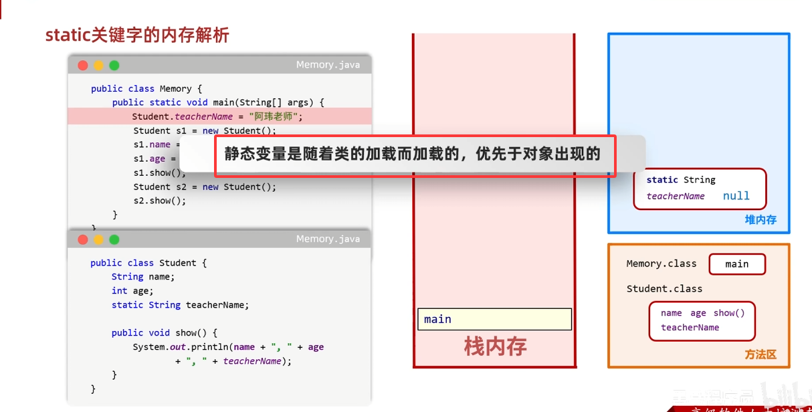

- 执行过程：

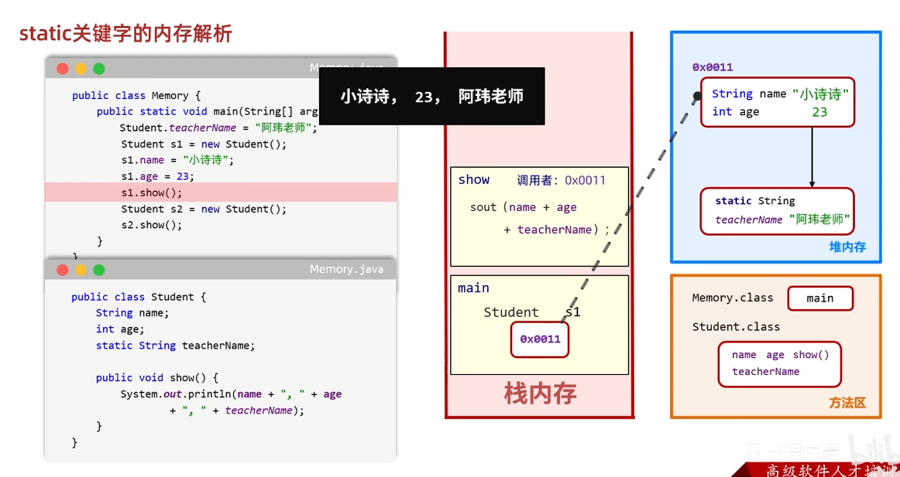

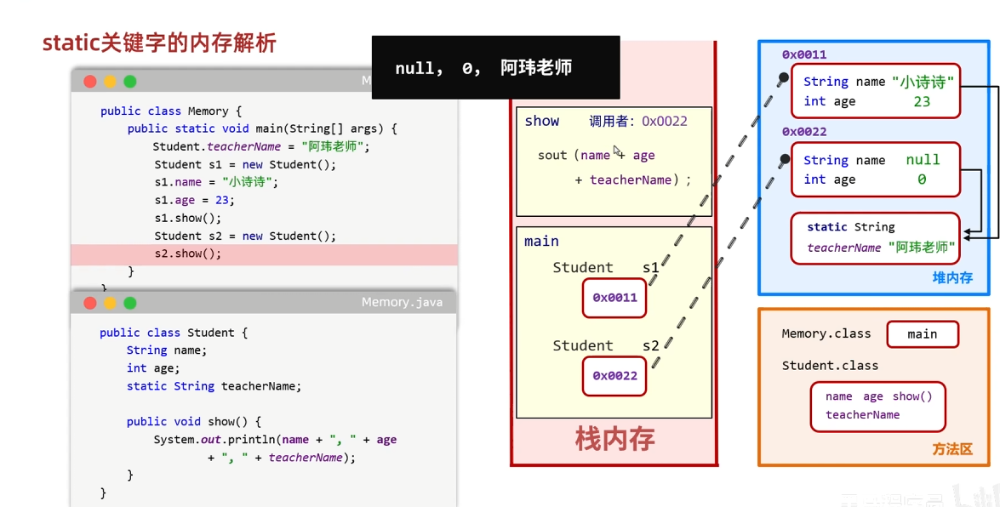

- **堆内存中静态变量这一部分空间是所有对象共享的，每个对象要使用的时候通过对应的对象来访问，对象里面记录的是静态变量的地址**

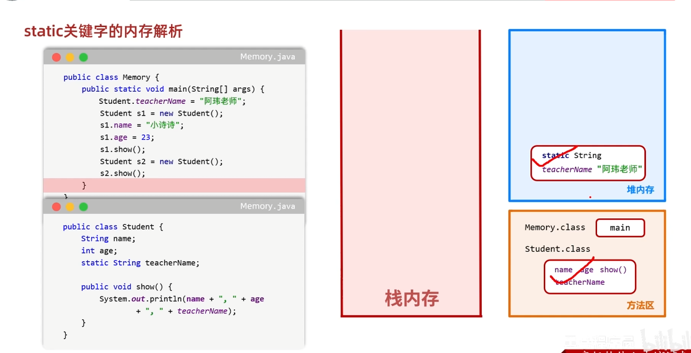

- 最后代码执行完毕，但是堆内存里的静态变量和方法区里的字节码信息内仍然存在，只有整个虚拟机关掉才会消失

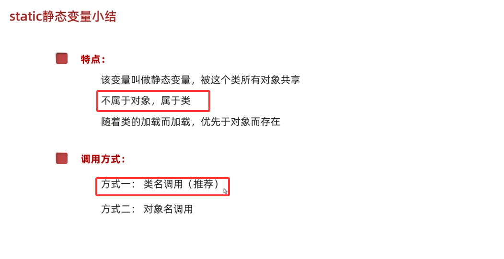

## 1.3 static关键字修饰成员方法

- 特点：
  - static修饰的方法叫做静态方法
  - 该方法多用在`测试类`和`工具类`中
  - Javabean类中很少会用
- 调用方式：
  - 方式一：**类名调用**，推荐
  - 方式二：对象名调用

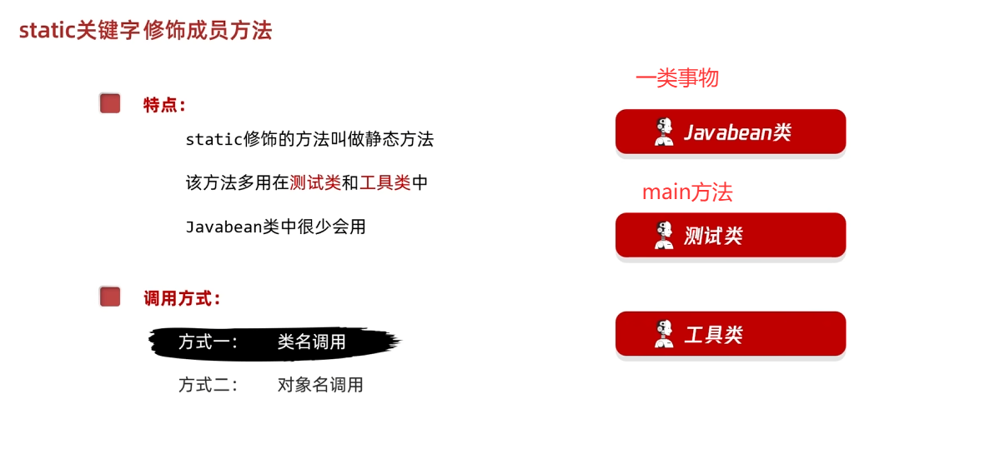

### 工具类

- 不是用来描述一类事物的，也没有main方法，而是帮我们做一些事情的类

## 工具类书写方法

1. **类名见名知意**
2. **私有化构造方法**
3. **方法定义为静态**

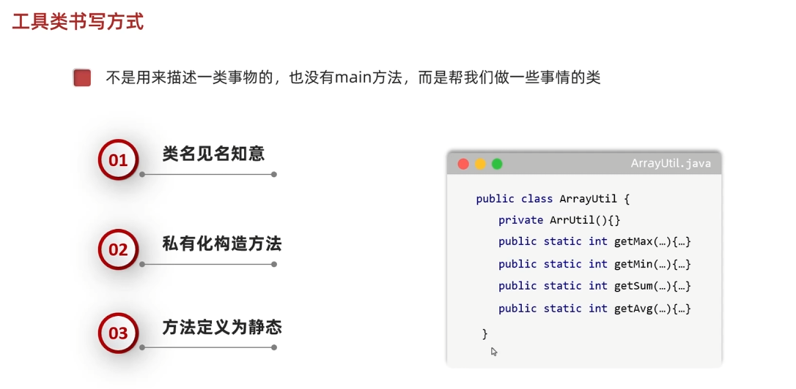

## 1.4 static关键字的注意事项

- 静态方法只能访问`静态变量`和`其他的静态方法`

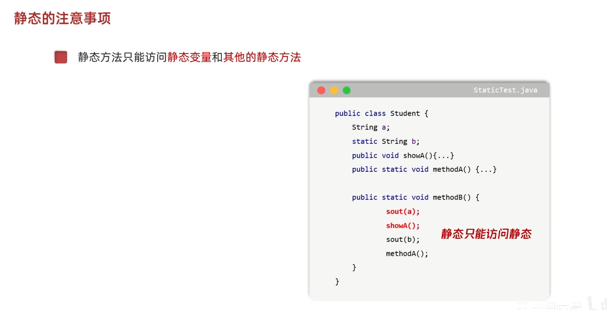

- 非静态方法可以访问`静态变量`或者`静态方法`，也可以访问`非静态的成员变量`和`非静态的成员方法`

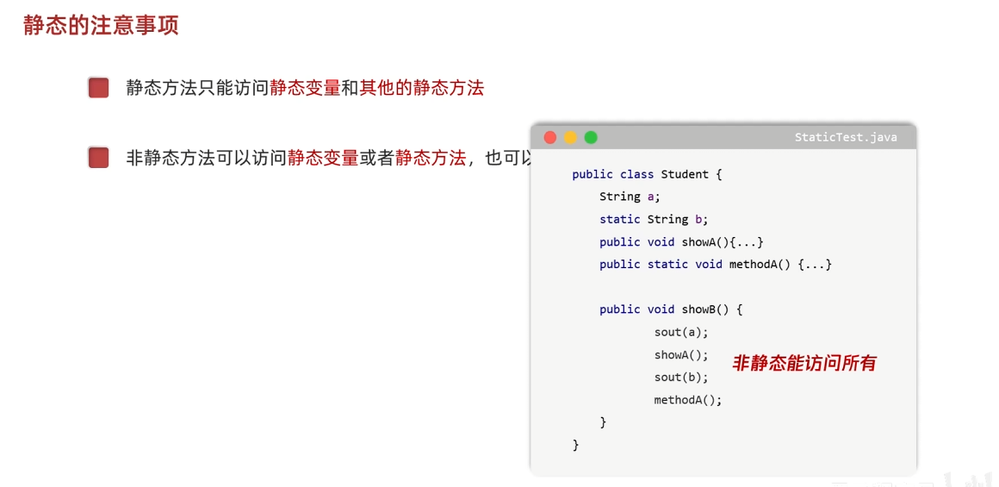

- 静态方法中`没有this关键字`

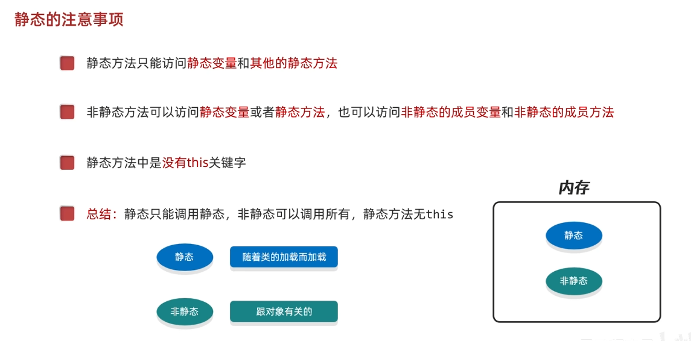

- 静态方法无法调用非静态的变量

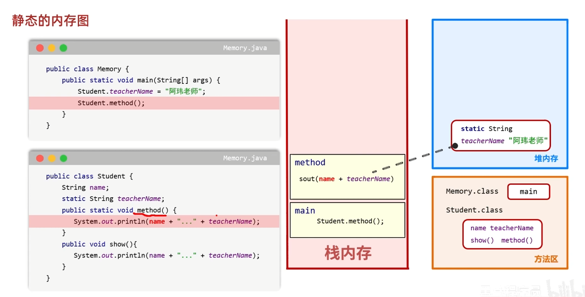

- 非静态的方法可以调用静态以及非静态的内容，可以调用所有

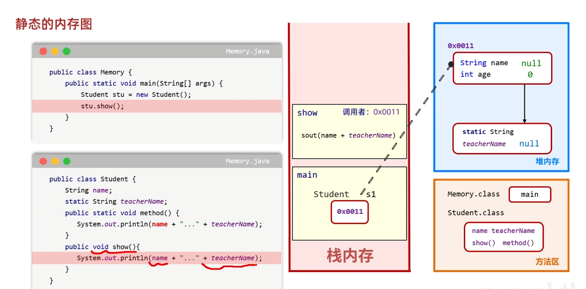

## 重新认识main方法

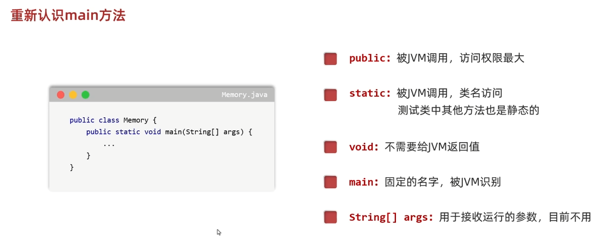

# 2. final关键字

- final：表示`最终，不可变`。可以修饰`变量、类、方法`。

## 2.1 final关键字修饰变量

- `final关键字`修饰的变量叫做**常量**
- 常量特点：
  - 特点一：只能赋值一次，数据不可变
  - 特点二：名字大写，多个单词下划线隔开

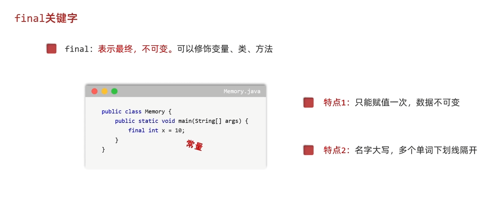

- 细节：
  - 基本数据类型：
    - byte short int long float double char boolean
    - 变量里面记录的是真实的数据
    - `final int a=10;`此时变量里面记录的数据无法发生改变
  - 引用数据类型
    - 除了上面四类八种，其他所有的数据类型都是引用类型，数组、JavaBean类等
    - `final Student stu = new Student();`中`stu`里面记录对象的内存地址，不可改变的是`stu`记录的内存地址，而对象里面的属性值，是可以发生改变的
  - 综上所述：
    - `final`修饰哪一个变量，这个变量里面记录的内容就无法再次发生改变

## 2.2 final的内存解析

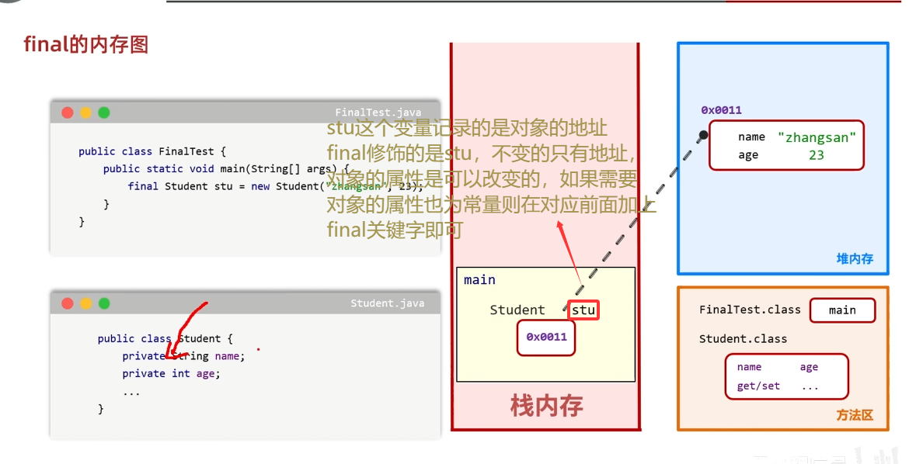

# 3. 枚举

- 之前的JavaBean类创建都是随便创建，没有个数限制
- 但当遇到下面的情况的时候

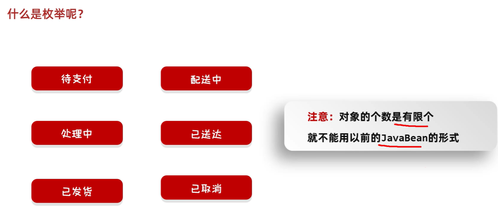

- **对象的个数是有限个，就不能用以前的`JavaBean`的形式**
- 这个时候就需要用到**枚举**

---------------------------------------------------------------------------------

## 3.1 枚举定义

- **枚举**是一个特殊的Javabean类，这个类的对象是有限个
- 使用场景：订单的状态、月份、星期、游戏角色职业、会议室预约状态、设备状态...

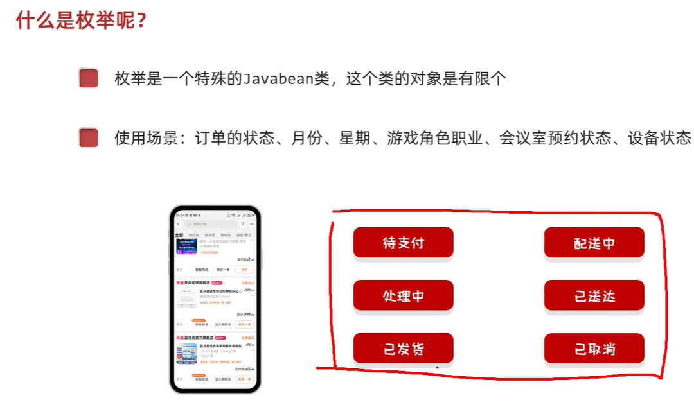

## 3.2 枚举的定义格式

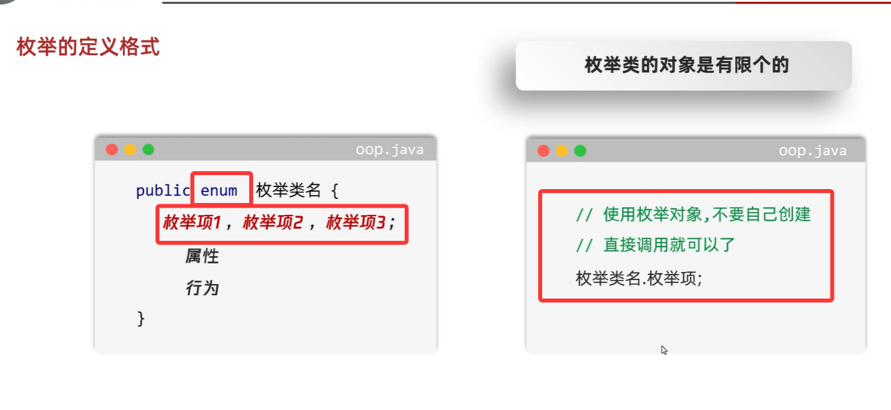

- 细节：所有的枚举项，默认使用`public static final`修饰的

## 3.3 枚举的注意事项

- 每一个枚举项，都是该枚举项的对象，每一个对象都是通过构造方法创建出来的
- 枚举项在底层其实就是常量，默认用`public static final`修饰
- 枚举类的第一行上必须是枚举项，枚举项之间用逗号隔开，以分号作为结尾
- 枚举类的构造方法必须是`private`修饰，不让外界创建本类的对象。
  - 枚举类的构造方法默认使用`private`修饰，就算不写，虚拟机也会自动补上
- 编译器会给枚举类新增两个默认存在的方法：`values()`，`valueOf()`
  - `values()`表示获取本类所有的枚举项
  - `valueOf()`表示获取一个指定的枚举项
