-  面向对象三大特征：**`封装`、`继承`、`多态`**

# 1. 继承

- 继承适用场景：

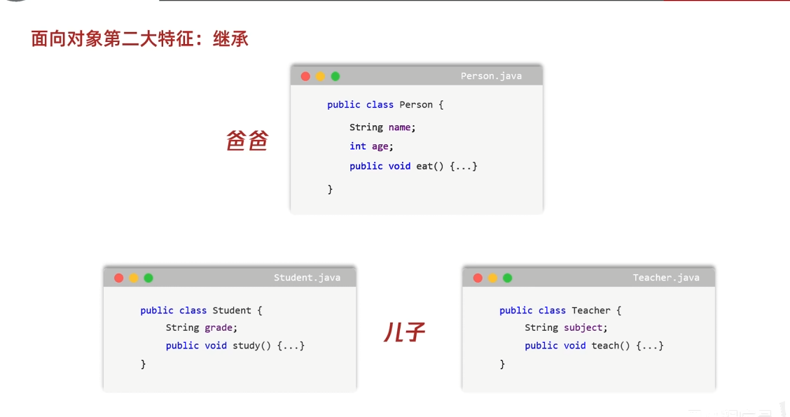

## 1.1 什么是继承？继承的好处？

- **继承**是类与类之间的一种父子关系，Java中提供关键字`extends`，用于建立类与类之间的关系
- **好处**：
  - 可以把多个子类中重复的代码抽取到父类中了，提高代码的复用性
  - 子类可以在父类的基础上，增加其他的功能，使子类更强大

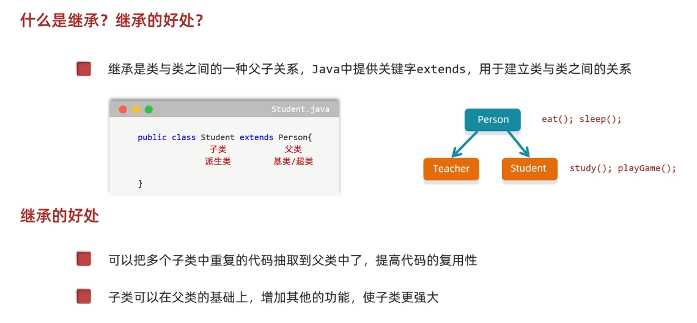

## 1.2 如何设计一个复杂的继承体系

- 当类和类之间，存在相同（共性）的内容，**并满足子类使父类中的一种**，就可以考虑使用继承，来优化代码

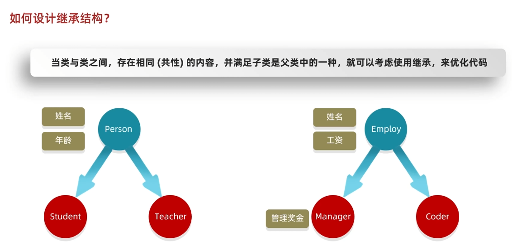

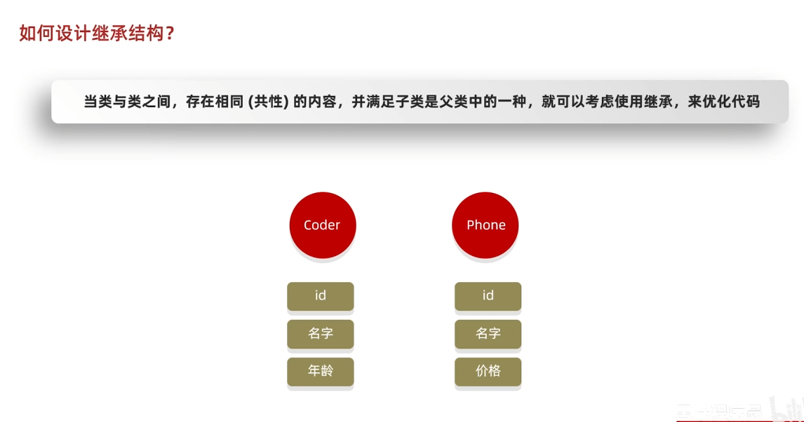

- 使用图像可以清晰看出各个类之间的关系，是否适合使用继承的关系，最好是类图
- 这一个图考虑的时候，从下往上画，写代码时从上往下写

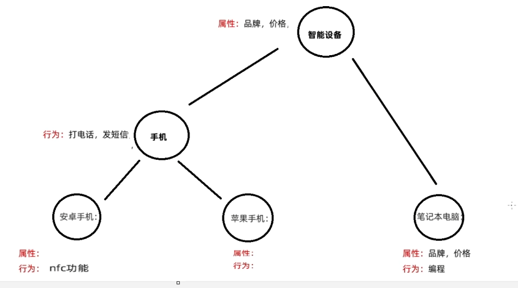

- 小结

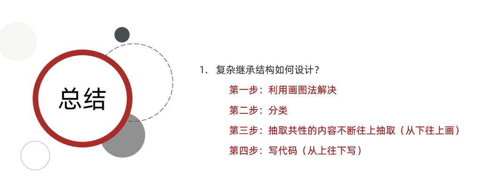

## 1.3 继承的特点

- Java只支持**单继承**，不支持**多继承**，但支持**多层继承**

- **单继承**：一个子类只能继承一个父类
- **不能多继承**：子类不能同时继承多个父类

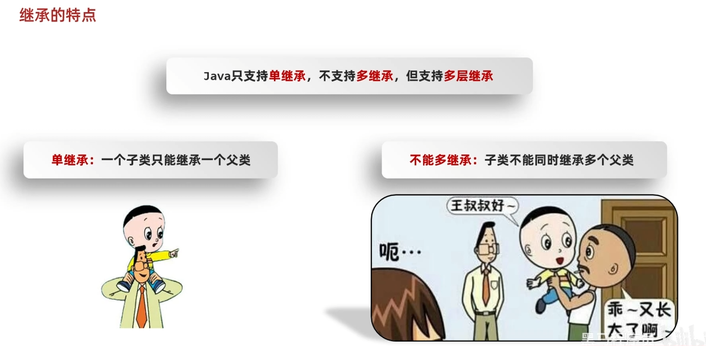

---------------------------------------------------------------

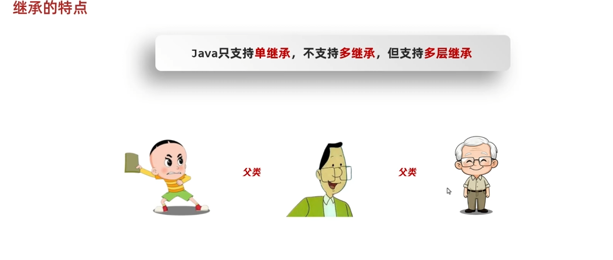

- 细节一：直接父类和间接父类

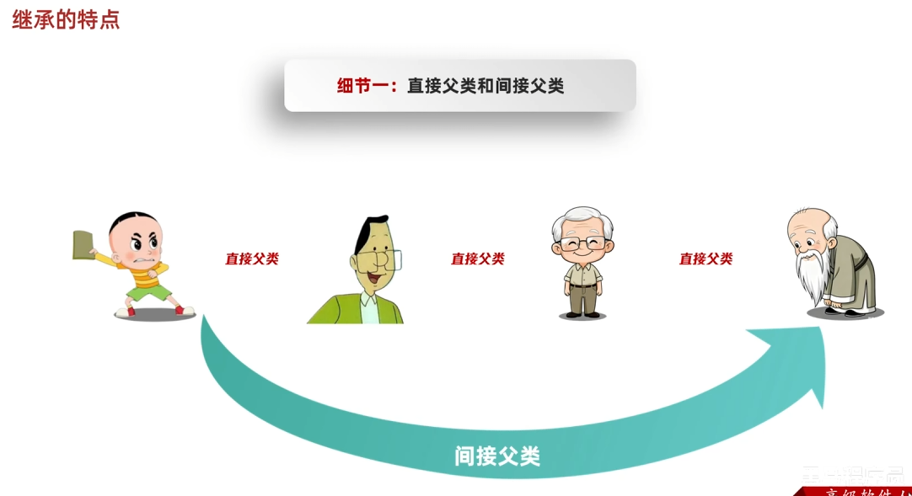

- 细节二：顶级父类**Object**
- 定义Javabean类时，如果没有写`extends`继承某个类的话，默认都是继承`Object`类

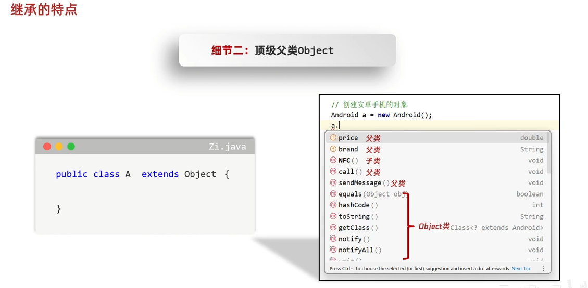

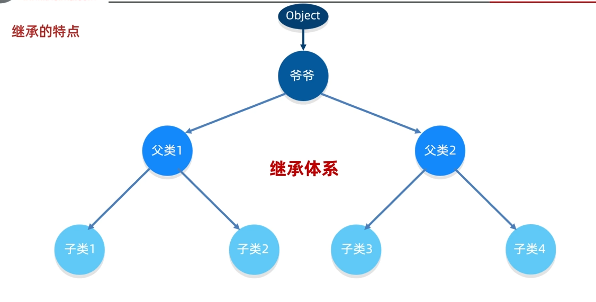

- 小结

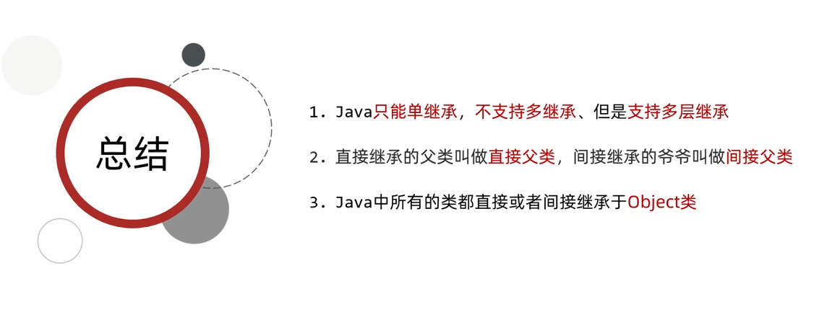

## 1.4 继承中成员变量的特点

- **书写规则**：把多个子类中相同的属性抽取到父类当中
- **调用规则**：遵守就近原则（谁离我近，我就用谁）

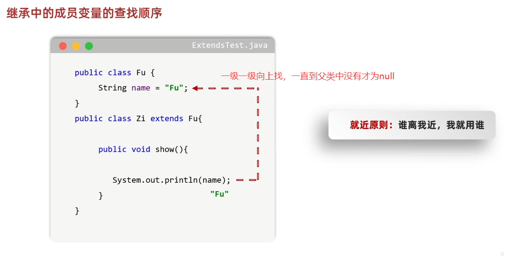

### 1.4.1 super关键字

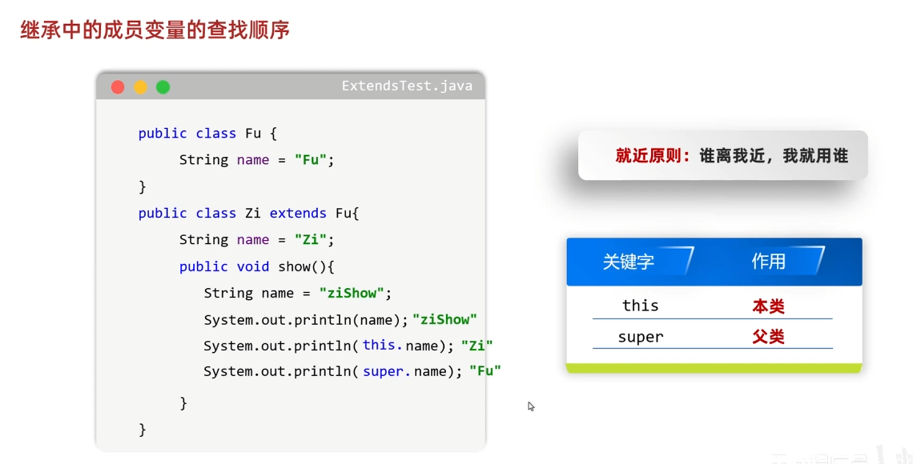

- 这里第三个`name`如果要调用父类`Fu`中的`name`则使用`super关键字`继承父类的`name属性`
- 注意：最多使用**super关键字**能访问到父类中的属性，父类的父类则无法访问到

-----------------------------------------------------

- 小结

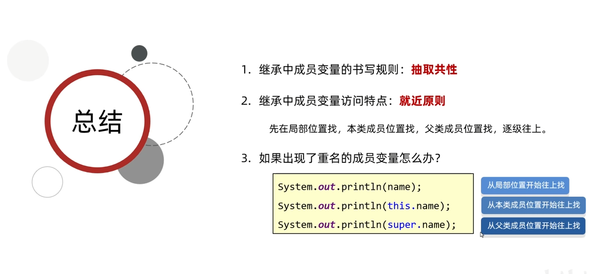

## 1.5 继承中成员方法的特点

- **书写规则**：把多个子类中共性的成员方法抽取到父类当中
- **调用规则**：遵守就近原则

---------------------------------

- 情况一：外界创建子类的对象，并调用方法
  - 先去子类中查找有没有方法，没有则去对应父类中继续查找
- 情况二：本类中，调用其他方法
  - 先在本类中查找是否有这个方法，没有则去对应父类中查找
  - 若本类中本就没有，直接调用父类中的方法，则直接`super.方法名()`直接去父类中查找

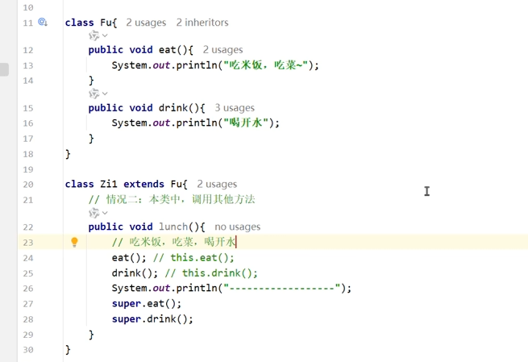

### 1.5.1 方法的重写

- **方法重写**：在子类中，把父类的方法再写一遍，方法申明保持一致
- **使用场景**：如果父类的方法不能满足子类的要求了，子类中可以把该方法再重写一遍

----------------------------

- 小结

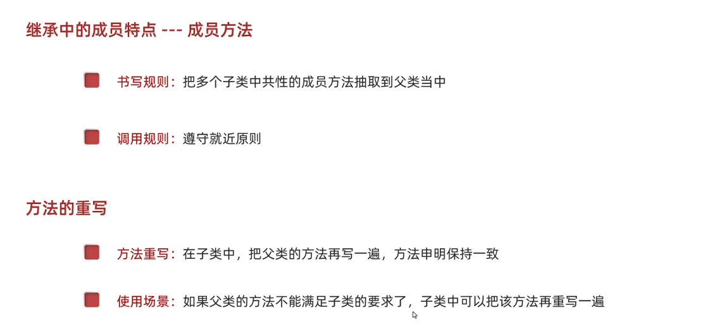

- 注意：
  1. 如果父类里面的代码，我一行都不想用，此时子类中的方法体重新完整写一遍即可
  2. 如果父类里面的代码我还想用，此时我只需要在父类的基础上再加其他的逻辑。先通过`super关键字`调用父类的方法得到一个结果，再对这个结果进行操作即可

### 1.5.2 方法重写注意事项和要求

- 重写方法的**名称**、**形参列表**必须与父类中的一致，**方法体**按照实际需求书写
- **了解**：子类重写父类方法时，访问权限子类必须大于等于父类（空着不写<protected<public）
- **了解**：子类重写父类方法时，返回值类型子类必须小于等于父类
- **建议**：重写的方法申明和父类保持一致即可
- **final修饰类**为最终类，里面所有的方法都不能被重写
- **private私有方法**、**static静态方法**、**final最终方法**不能被重写

-------------

- 小结

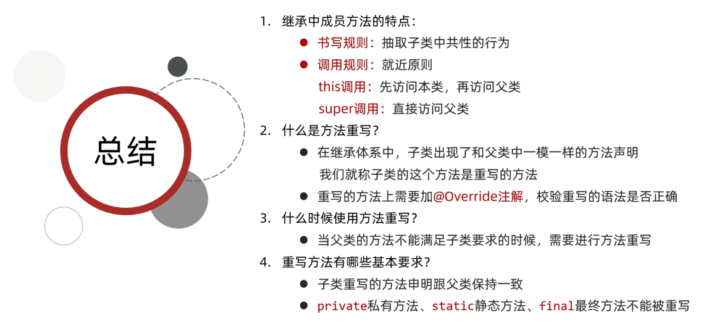

## 1.6 继承中的成员特点 --- 构造方法

- 父类中的构造方法不会被子类继承，只能通过**super关键字**调用 
- 如果子类的构造方法不写super，**JVM**也会加一个默认的**super()**，先访问父类的无参构造

-------------

- 书写实例

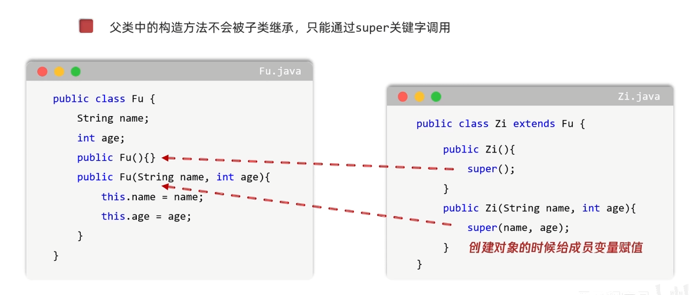

-----------------

- 小结

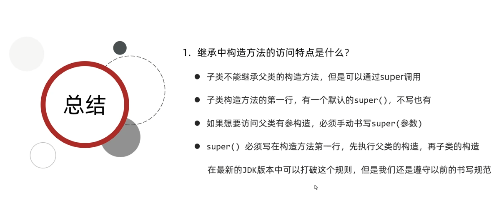

## 1.7 this和super关键字

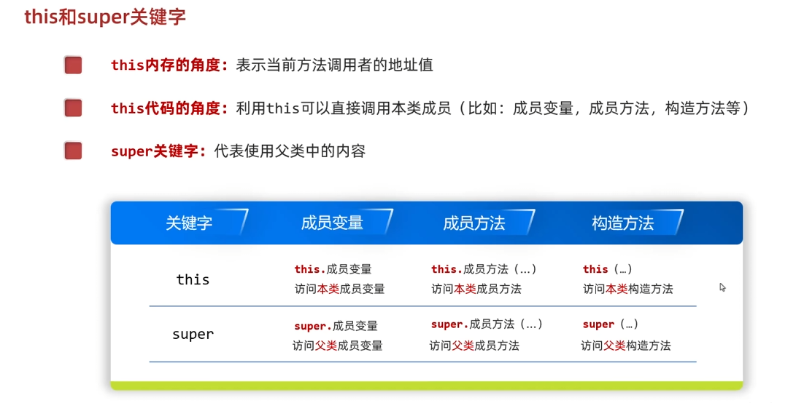

## 1.8 继承的底层原理

- **子类能调用≠子类能继承**

-------------------

- **子类真正能继承父类的是什么？**

- **构造方法**：不能被子类继承，可以利用super关键字调用
- **成员变量**：可以被子类继承，private私有的也可以，但是私有的无法直接调用
- **成员方法**：虚方法可以被继承；final修饰的最终方法不能被继承，可以被调用；static修饰的静态方法不能被继承，可以被调用；private修饰的私有方法不能被继承，不能被调用

### 1.8.1 继承结构的内存图解

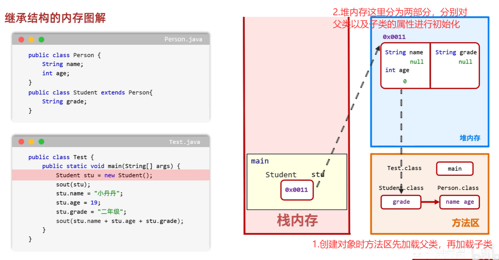

### 1.8.2 具体解析

**虚方法**

- 虚方法：就是普通的成员方法，非final、非static、非private修饰的方法
- 虚方法表，提高效率，**空间换时间的思想**

**方法重写就是替换方法中的地址**

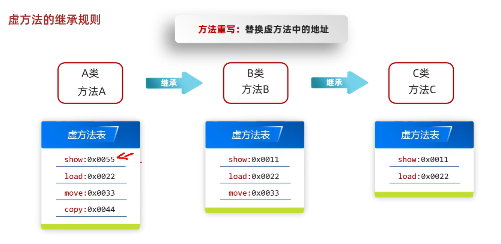

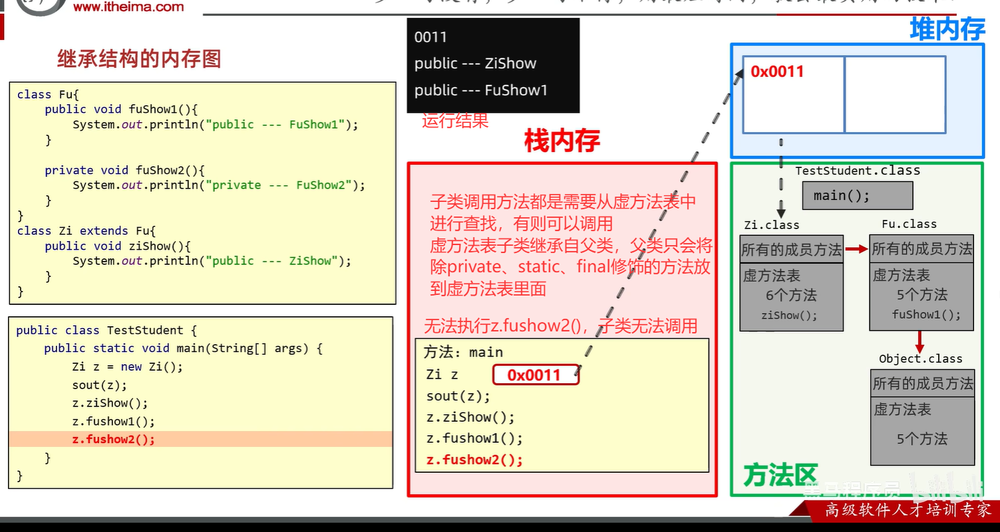

-------------------

**继承中的 其他方法**

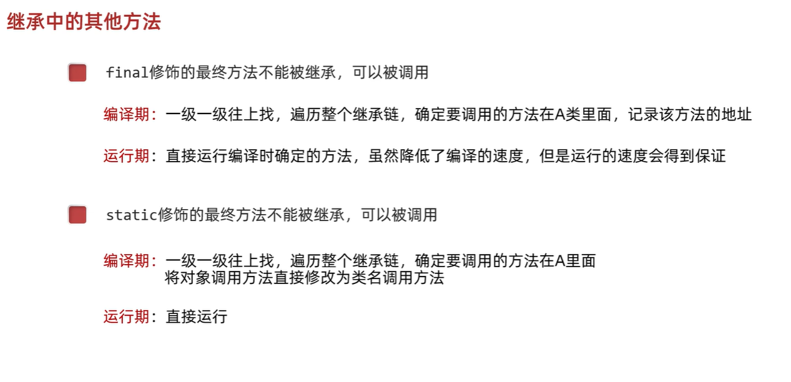

# 2. Java中的权限修饰符

- **权限修饰符**：其实就是Java中的关键字，用来控制一个成员被访问的范围
- **修饰的内容**：可以修饰成员变量、成员方法、构造方法等

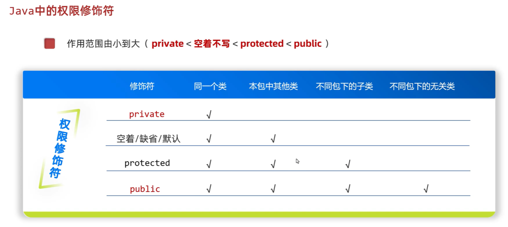

 # 3. 多态

## 3.1 什么是多态

- 多态：事物的多种形态

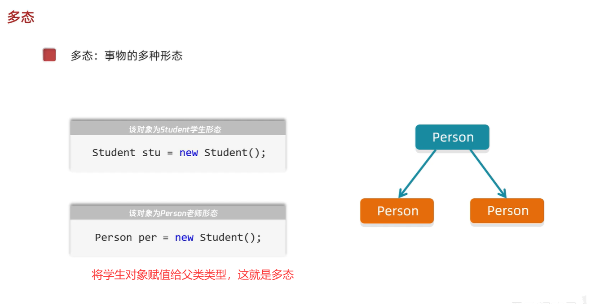

-------------

- 多态的使用场景

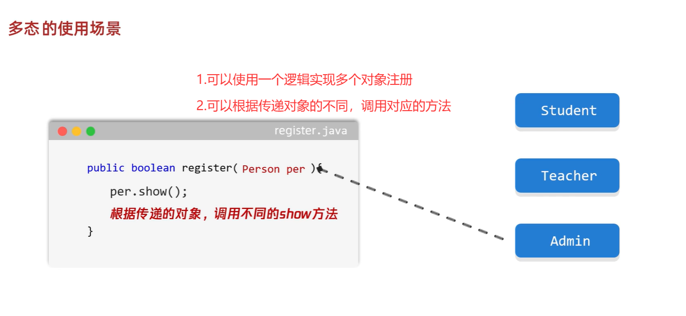

**多态的表现形式**

>  **父类类型 对象名称 = 子类对象；**

**多态的前提**

- 有继承/实现关系（**必须**）
- 有父类引用指向子类对象（**必须**）

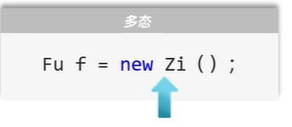

- 有方法重写（**可选**）

-----------

- 小结

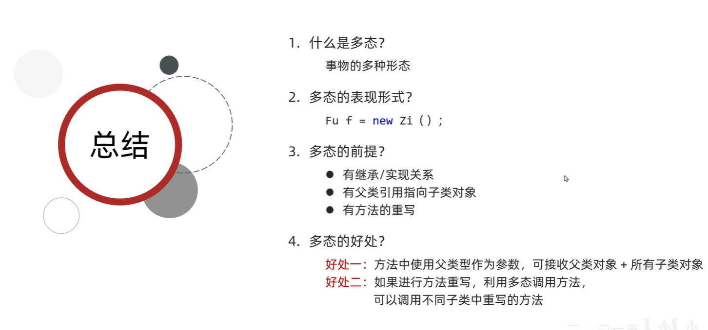

## 3.2 多态调用成员的特点

- **变量调用**：编译看左边，运行也看左边
  - 编译看左边：在把java文件编译成class文件的时候，看父类有没有这个变量，如果有则编译成功，没有则编译失败
  - 运行也看左边：在代码真正运行的时候，使用父类中的变量
- **方法调用**：编译看左边，运行看右边
  - 编译看左边：看父类中有没有这个方法，如果没有则代码报错
  - 运行看右边：在代码真正运行的时候，运行的是子类里面的方法，如果子类没有重写父类里面的方法，则使用的还是父类的方法

## 3.3 多态的弊端

- 弊端：多态下不能使用子类的独有功能
- 解决方法：**类型转换**

## 3.4 类型转换

- **自动类型转换（从子到父）**：子类对象赋值给父类类型的变量

- **强制类型转换（从父到子）**：子类 对象变量=(子类)父类类型的变量

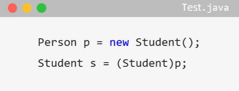

- **作用**：可以解决多态的弊端，可以实现调用子类独有的功能

----------

- 小结

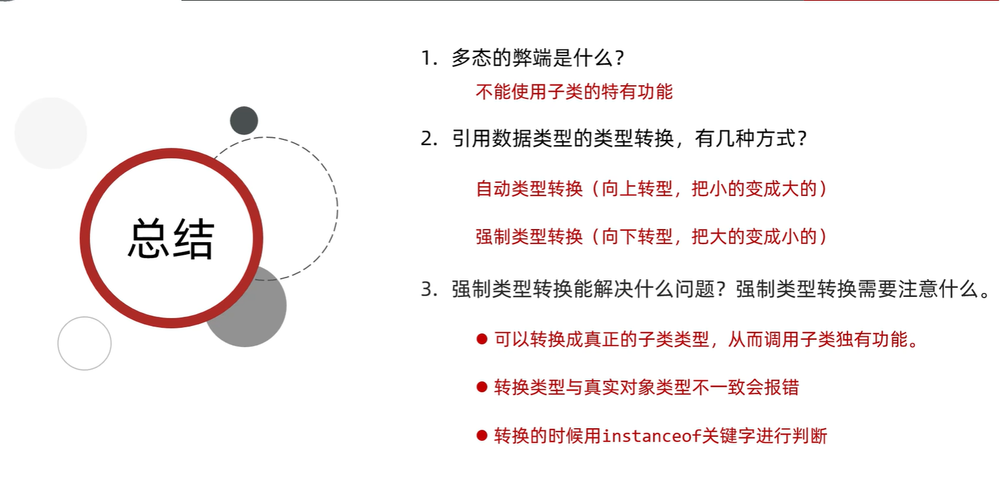

-----------

- 总结

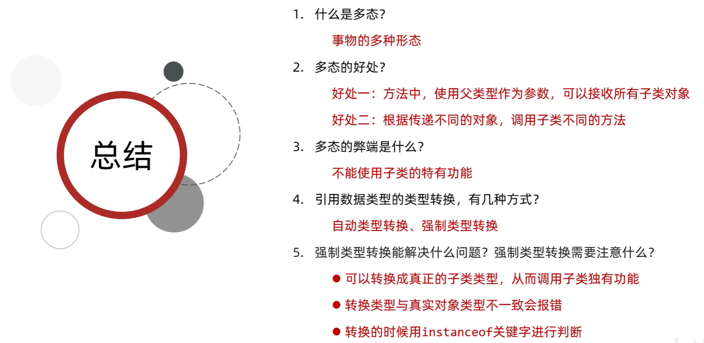

# 4. 抽象类和抽象方法

- 上面的继承中说到，父类中的方法根据子类的要求在子类中进行重写，父类的方法体中的内容其实没有意义，仅仅为了语法不报错，子类不重写调用的才是父类的方法

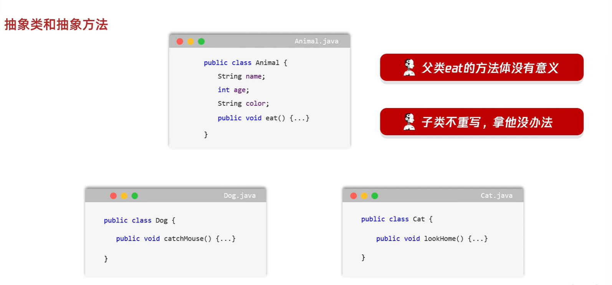

- 这时就可以引入抽象类和抽象方法

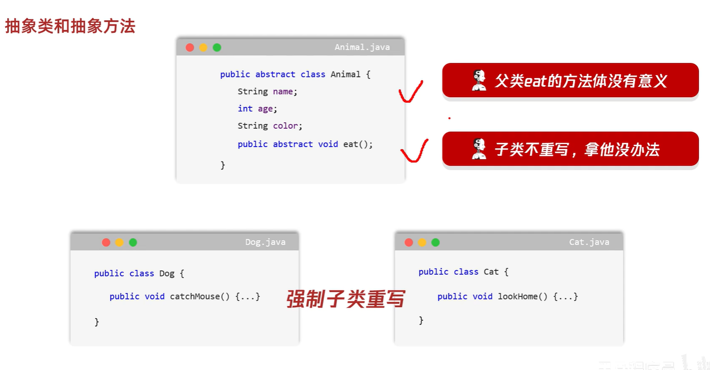

- 这里一是要在类前加一个`abstract`关键字，一个是在方法名前加上`abstract`关键字，方法名小括号之后加上`;`即可，此时父类就是一个抽象类了
- 同时子类的方法是需要强制重写的

## 4.1 什么是抽象方法以及抽象类

- **抽象方法**：将共性的行为（方法）抽取到父类之后。因为每一个子类的方法是不一样的，所以，在父类中**不能确定具体的方法体**。该方法就可以定义为抽象方法
- **抽象类**：如果一个**类中存在抽象方法**，那么该类就**必须声明为抽象类**

## 4.2 抽象类和抽象方法的定义格式

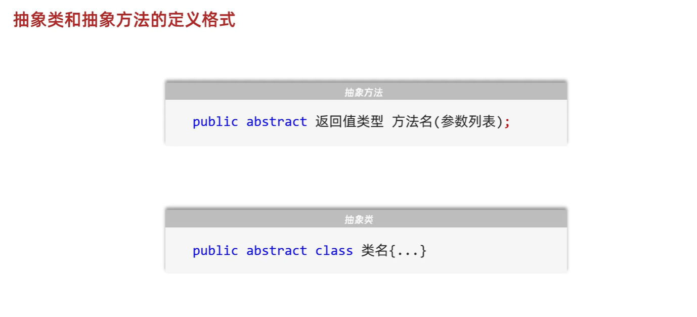

## 4.3 抽象类和抽象方法的注意事项

- **`抽象类不能实例化`**
  - 如果可以创建抽象类的对象的话，用对象调用一个没有方法体的抽象方法，没有任何意义

- **`抽象类中不一定有抽象方法，有抽象方法的类一定是抽象类`**
  - 抽象类中不一定有抽象方法，作用：为了不让外界创建本类的对象（比如说子类中只需要重写抽象类中的部分方法，可以建一个中间过滤的抽象类，这个抽象类里就没有抽象方法）

- **`抽象类中可以有构造方法`**
  - 作用：为了给成员变量赋值

- **`抽象类的子类，要么重写抽象类中的所有抽象方法（正常），要么子类也是抽象类（正常不用）`**
  - 子类也是抽象类，这种方式意义不大，还要写一个孙子类继承子类，并且重写所有的抽象方法，这样外界才可以创建子类的对象，调用里面的方法

## 4.4 抽象类和抽象方法的意义

- 强制子类必须按照抽象方法的格式进行重写

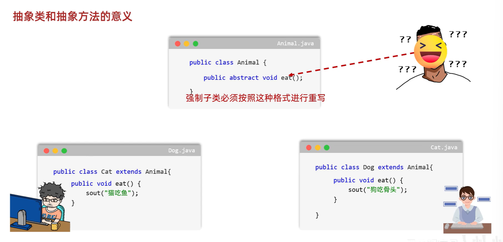

-----------

- 小结

 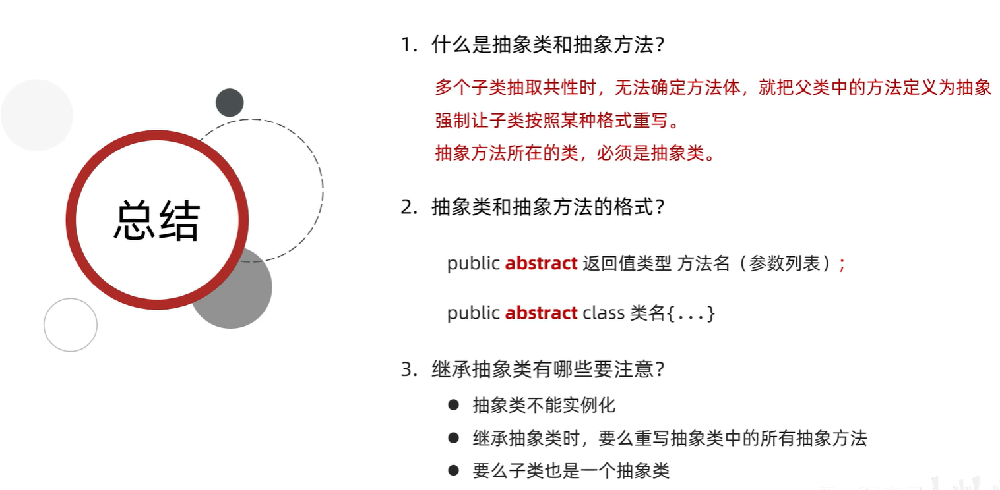

# 5. 接口

- 承接上面继承的知识，父类中无法包括一些子类有而另一些子类没有的抽象方法，所以**接口**出现了，用来放部分子类共有的抽象方法

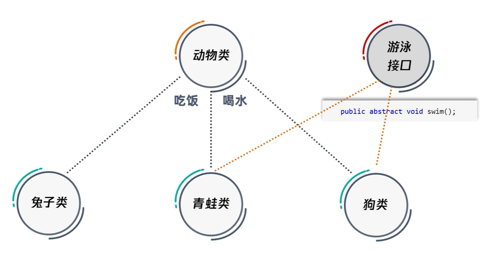

## 5.1 什么是接口

- **接口**：接口就是一个规则，而且是独立于继承体系以外的规则。（可以理解为干爹，而抽象父类是亲爹）

## 5.2 接口的定义格式以及与子类之间关系

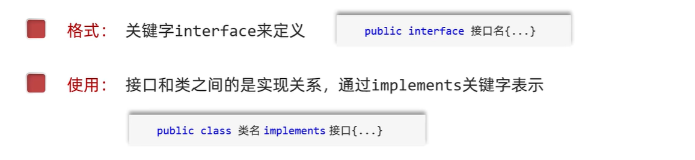

- 使用：接口和类之间的是实现关系，通过`implements`关键字表示

## 5.3 接口注意点

- **`接口不能实例化`**
- **`接口的子类（实现类），要么重写接口中所有的抽象方法，要么实现类是一个抽象类`**

- **`一个类可以实现多个接口，也可以在继承一个类的同时，实现多个接口`**（亲爹只能有一个，但是干爹可以有无数个）


## 5.4 接口中成员的特点

- **成员变量**：只能是常量。默认修饰符：`public static final`

- **构造方法**：没有
- **成员方法**：只能是抽象方法。默认修饰符：`public abstract`
  - JDK7以前：接口中只能定义抽象方法
  - JDK8的新特性：接口中可以定义有方法体的方法
  - JDK9的新特性：接口中可以定义私有方法

## 5.5 接口和类之间的关系

- 三种关系

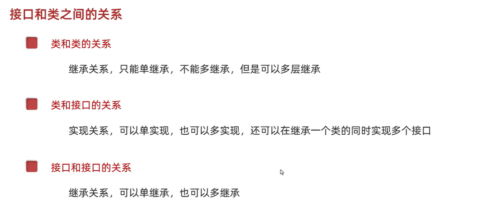

**类和接口的关系**

- 实现关系，可以单实现，也可以多实现，还可以在继承一个类的同时实现多个接口

- 如果一个类实现了多个接口，那么就要重写多个接口中所有的抽象方法
- 注意点：
  - 如果父类Person也是一个抽象类的话，那么在子类当中，需要把所有的抽象方法进行抽象，要么子类本身也是一个抽象类
  - 如果在重写的时候出现了重复的重复的抽象方法，此时只要重写一次就可以了

**接口和接口的关系**

- 继承关系，可以单继承，也可以多继承
- 注意点：
  - 如果有一个接口A继承了多个接口，此时相当于是把多个接口中的抽象方法全部继承下来了。在之后，实现类实现接口A的时候，就要把所有的抽象方法进行重写

## 5.6 接口在JDK8和JDK9的新特性

**JDK7及以前**：接口中只能定义抽象方法

**JDK8新特性**：为了接口升级时向下兼容，接口中可以定义有方法体的方法（默认、静态）

**JDK9新特性**：为了抽取重复代码，接口中可以定义私有方法（私有普通方法，私有静态方法）

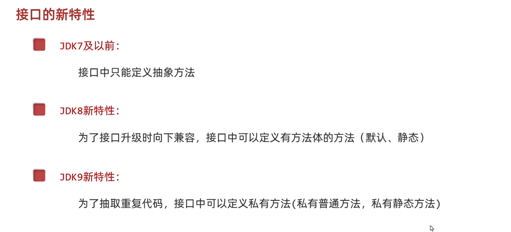

### 5.6.1 JDK8以后接口中新增的方法

#### 默认方法

- 允许在接口中定义**默认方法**，需要使用`default`修饰
  - 作用：为了接口升级时，代码不报错

-----------

接口中**默认方法**的定义格式：

- 格式：`public default 返回值类型 方法名(参数列表){}`
- 范例：`public default void show(){}`

-------------

接口中默认方法的`注意事项`：

- 默认方法不是抽象方法，所以不强制被重写。但是如果被重写，重写的时候子类去掉`default`关键字
- `public`可以省略，`default`不能省略
- 如果实现了多个接口，多个接口中存在相同名字的默认方法，子类就必须对该方法进行重写

---------------------------

----------------------------

#### 静态方法

- 允许在接口中定义**静态方法**，需要使用`static`修饰

------------

接口中**静态方法**的定义格式：

- 格式：`pubic static 返回值类型 方法名(参数列表){}`
- 范例：`public static void show(){}`

--------------

接口中静态方法的**注意事项**：

- 静态方法只能通过接口名调用，不能通过实现类名或者对象名调用
- `public`可以省略，`static`不能省略

### 5.6.2 JDK9新增的私有方法

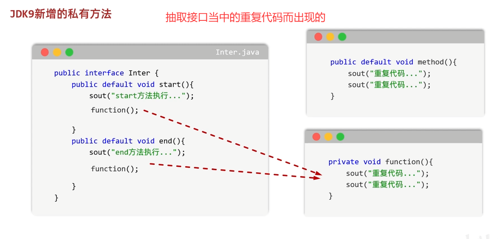

**为了抽取默认方法和静态方法中重复代码而出现的**

- 格式1：`private 返回值类型 方法名(参数列表){}`
- 范例1：`private void show() {}`

---------

- 格式2：`private static 返回值类型 方法名(参数列表) {}`
- 范例2：`private static void method() {}`

------------

- 小结

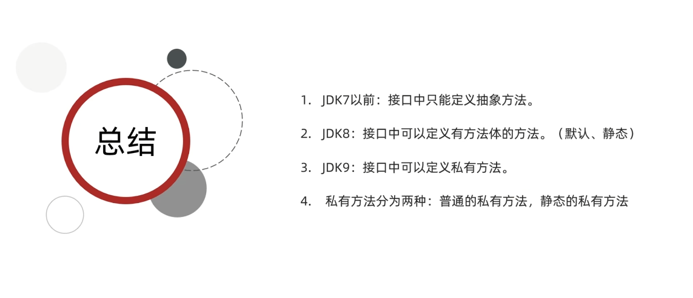

# 6. 内部类

## 6.1 什么是内部类？为什么会有内部类？

- **内部类**：在一类的里面，再定义一个类

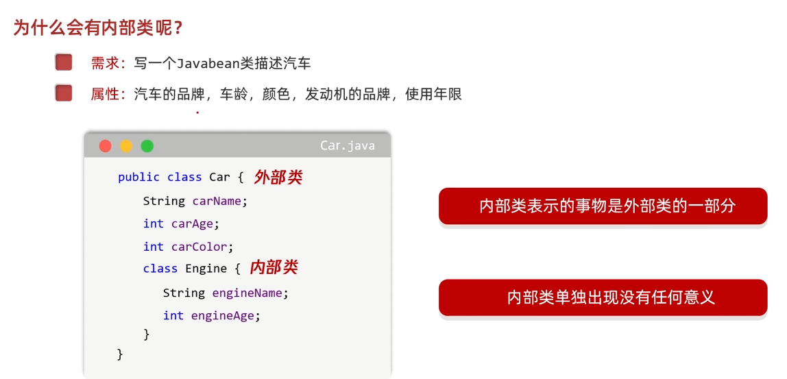

- 内部类表示的事物是外部类的一部分
- 内部类单独出现没有任何意义

-----------

- 小结

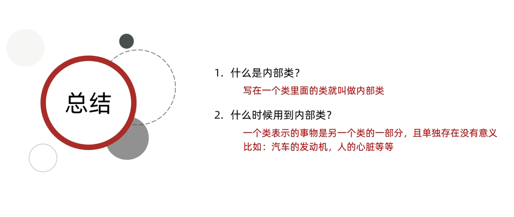

## 6.2 内部类的分类

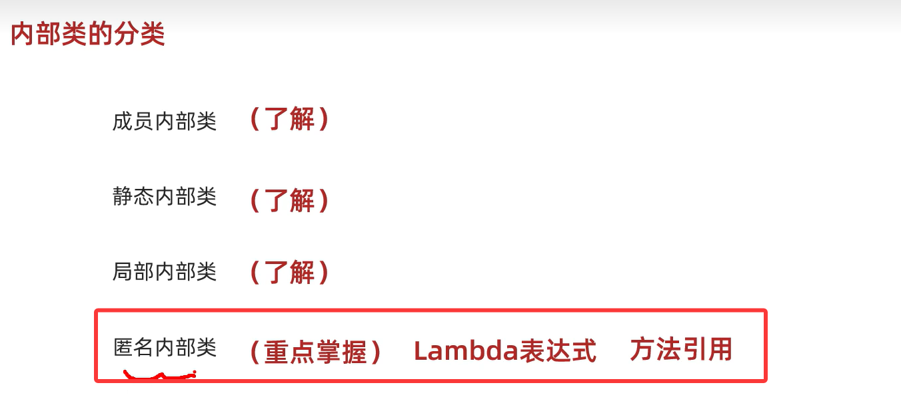

### 6.2.1 成员内部类（了解）

- 写在成员位置的，属于外部类的成员
- 成员内部类可以被一些修饰符所修饰，比如：`private、默认、protected、public、static等`

- 写在成员内部类里面，JDK16之前不能定义静态变量，JDK16开始才可以定义静态变量

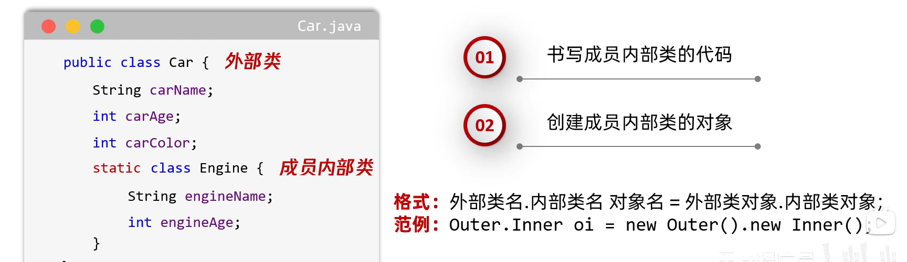

> 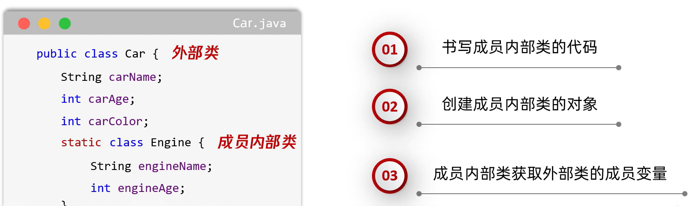

------------

**获取成员内部类对象的两种方式**：

- 方式一：外部类编写方法，对外提供内部类对象（只有在内部类私有化，被`private`修饰的时候）
- 方法二：直接创建
- 格式：`外部类名.内部类名 对象名 = new 外部类对象.内部类对象;`
- 范例：`Outer.Inner oi = new Outer().new Inner();`

**获取外部类成员变量的方法**

```java
package com.itbbben.oopinnerclass.Test3;

public class Outer {
    private int a = 10;

    class Inner{
        private int a = 20;
        public void show() {
            int a = 30;
            System.out.println(a);//30
            System.out.println(this.a);//20
            System.out.println(Outer.this.a);//10
        }
    }
}
```

**内部类的内存图**

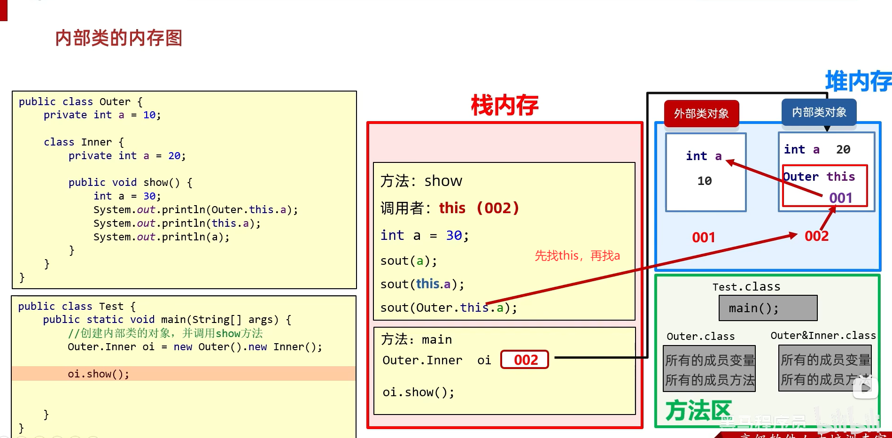

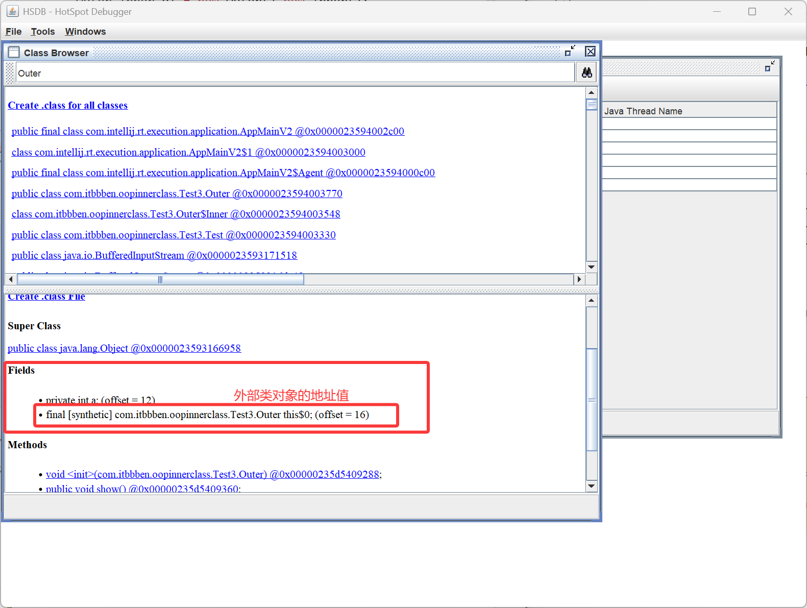

---------

- 小结

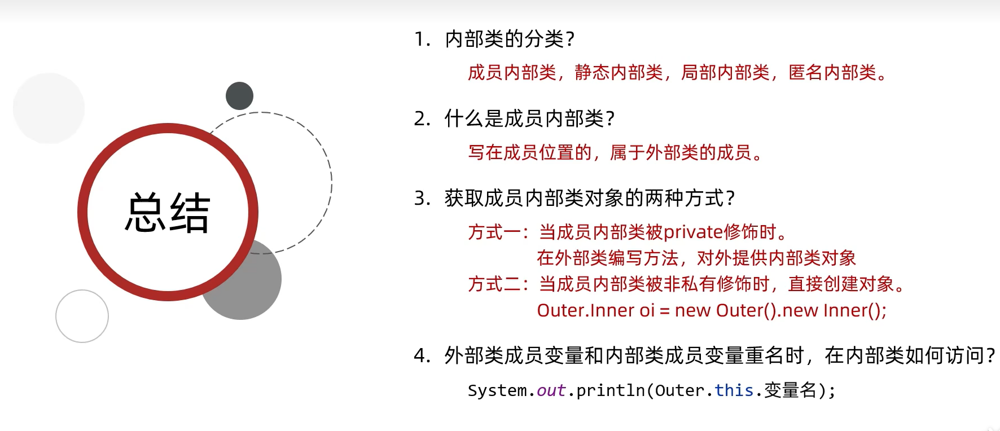

### 6.2.2 静态内部类

- 静态内部类只能访问外部类中的静态变量和静态方法
- 如果在静态内部类中，想要访问外部类非静态的内容，需要创建外部类的对象

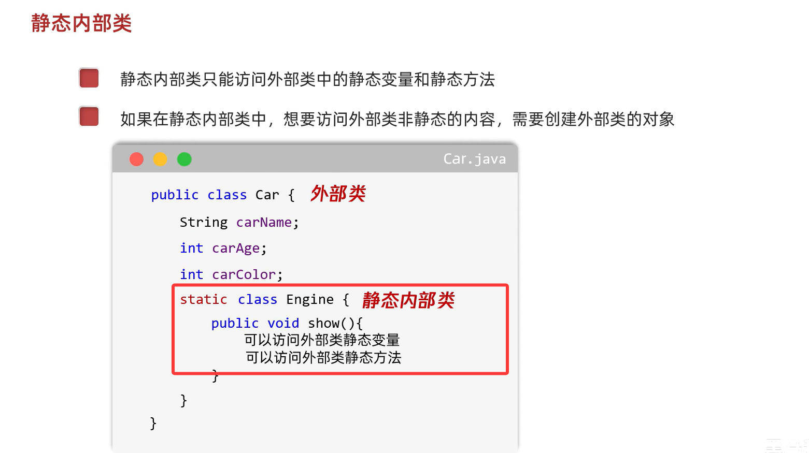

**创建静态内部类的对象**：`外部类名.内部类名 对象名 = new 外部类名.内部类名();`

**调用静态内部类中非静态方法的格式**：`先创建对象，用对象调用`

```java
Outer.Inner oi = new Outer.Inner();
oi.show1();// show1()静态内部类中非静态方法
```

**调用静态内部类中静态方法的格式**：`外部类名.内部类名.方法名();`

```java
oi.show2();// 可以直接通过创建的内部类对象调用静态方法，但是idle并没有提示
//静态方法
 Outer.Inner.show2();// show2()静态内部类中静态方法
```

-------

- 小结

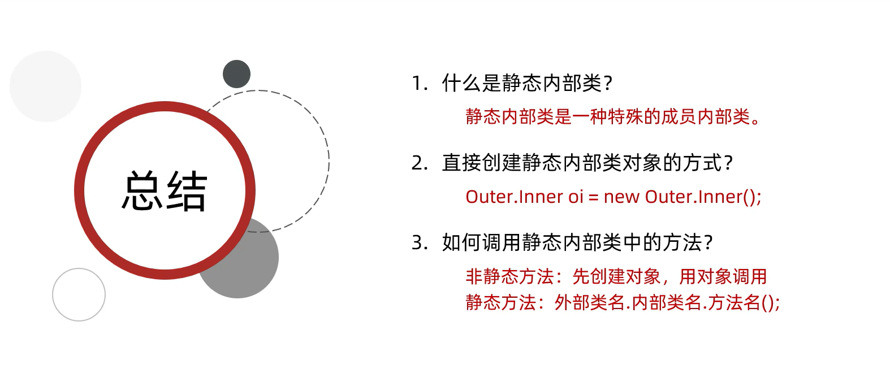

### 6.2.3 局部内部类（了解）

- 将内部类定义在方法里面就叫做局部内部类，类似于方法里面的局部变量
- 外界是无法直接使用的，需要在方法内部创建对象并使用
- 该类可以直接访问外部类的成员，也可以访问方法内的局部变量
- Outer类中：

```java
package com.itbbben.oopinnerclass.Test5;

public class Outer {
    int b = 20;
    public void show() {
        final int a = 10;

        class Inner{
            String name;
            int age;

            public void method1() {
                System.out.println(a);
                System.out.println(b);
                System.out.println("局部内部类中的method1方法");
            }

            public static void method2() {
                System.out.println("局部内部类中的method2静态方法");
            }

        }

        Inner i = new Inner();
        System.out.println(i.name);
        System.out.println(i.age);
        i.method1();
        Inner.method2();
    }
}
```

- Test主类中：

```java
package com.itbbben.oopinnerclass.Test5;

public class Test {
    public static void main(String[] args) {
        Outer o = new Outer();
        o.show();
    }
}
```

- 运行结果：

```bash
null
0
10
20
局部内部类中的method1方法
局部内部类中的method2静态方法
```

局部内部类正常场景下不会用到，所以了解即可

### 6.2.4 匿名内部类（重点）

- 就是一个没有名字的内部类
- **作用**：在继承一个类或者实现一个接口的时候少写一个文件，也是lamba的前置知识点

**定义格式**：

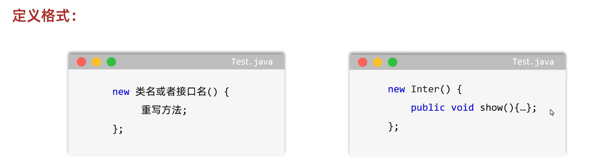

----------------

- 引入示例：

```java
package com.itbbben.oopinnerclass.Test6;

public class Test {
    public static void main(String[] args) {

        // 传统使用goSwimming方法：
        // 1.新建java文件，新建Student类，在文件当中新建Student类进行方法重写
        // 2. 创建学生的对象
        // 3. 调用方法
        // 问题是如果Student类我只要用到一次，那么这个java文件单独新建就显得有点浪费
        // 此时匿名内部类就出现了
        // 匿名内部类的作用就是：少定义一个java文件

        Student s = new Student();
        goSwimming(s);
    }

    public static void goSwimming(Swim s) {
        s.swim();
    }
}
```

```java
匿名内部类的定义格式：
    new 类名/接口名() {
    	重写类/接口里面的方法;
	}
```

**匿名内部类的定义格式 = 没有名字的java类 + 继承/实现 + 重写方法 + 创建对象**

**最终格式可以理解为：是一个没有名字的java类的对象**

- 示例引入匿名类后可以这样写

```java
package com.itbbben.oopinnerclass.Test6;

public class Test {
    public static void main(String[] args) {
		// 一种直接放入操作类定义的方法参数里面
        goSwimming(new Swim() {

            @Override
            public void swim() {
                System.out.println("学生正在游泳");
            }
        });
        
        // 另一种赋值给一个这个接口的变量，然后将这个变量传入操作类方法
        Swim s = new Swim() {

            @Override
            public void swim() {
                System.out.println("学生正在游泳");
            }
        };
        goSwimming(s);


    }

    public static void goSwimming(Swim s) {
        s.swim();
    }
}

```

---------------

```java
new Swim() {

            @Override
            public void swim() {
                System.out.println("学生正在游泳");
            }
        }
```

**没有名字的java类：大括号**
**Swim：就是这个没有名字的java类实现了swim接口**
**这个没有没有名字的java类和Swim之间是继承或者实现关**

**重写方法：要在大括号当中重写swim所有的抽象方法**

**创建对象：new关键字作用的是后面这个没有名字的java类，创建了他的对象**

**整体：创建了一个Swim实现类的对象，只不过这个对象没有名字而已**

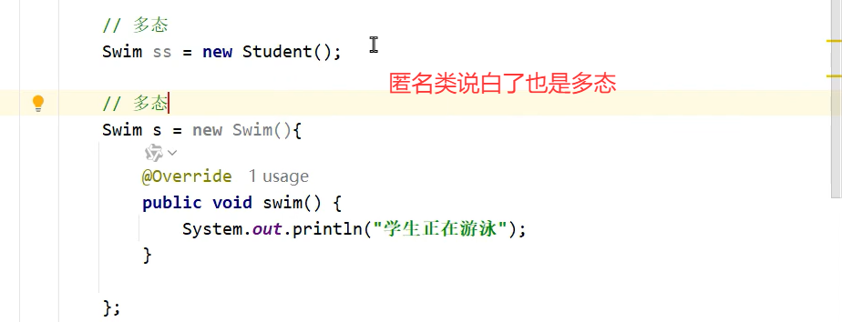

--------

- 小结

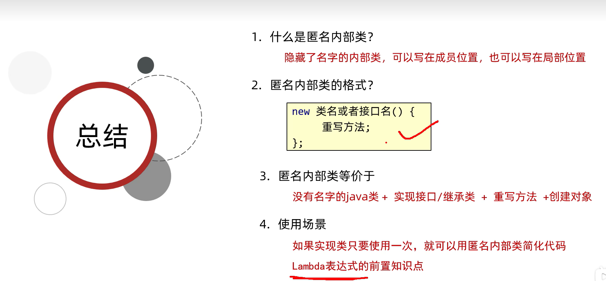
