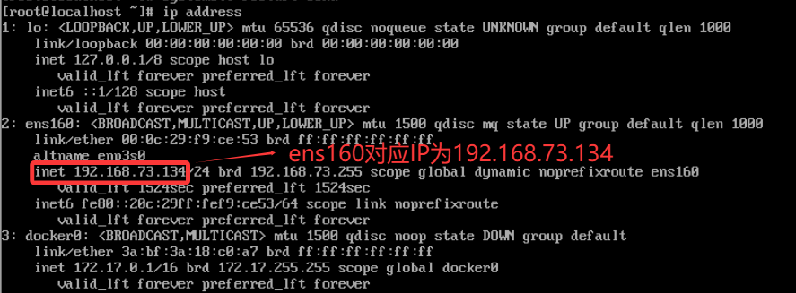
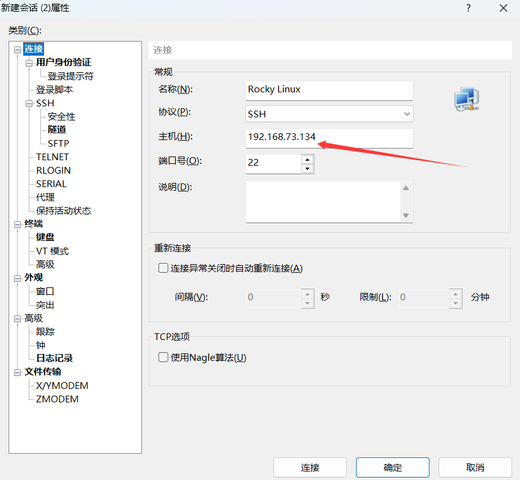
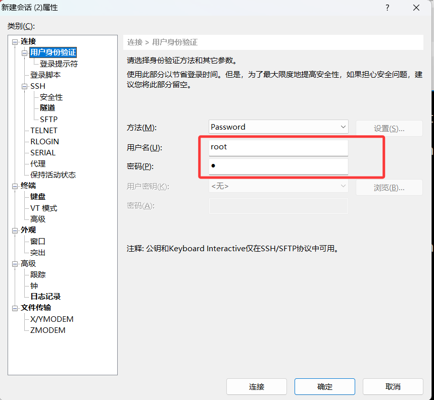
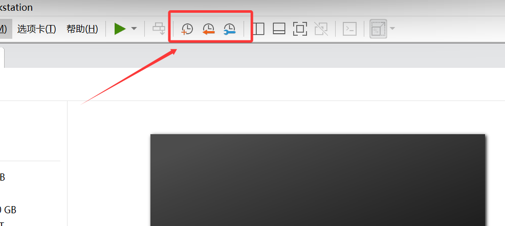

# 1. 开启ssh命令

- 系统安装时可以勾选上或者使用命令开启
  - 允许root用户远程登录（此操作在生产环境非常不安全）

```Bash
localhost login:root     # 用户名
Password:1               #密码，不显示，直接回车
[root@localhost ~]# echo "PermitRootLogin yes" >> /etc/ssh/sshd_config
[root@localhost ~]# systemctl restart sshd
```

# 2.远程连接

- Linux大多安装在企业服务器上，企业服务器在数据中心机房中，通过远程命令行登录
- 需要远程连接，满足以下条件：
  - 有支持远程登录用户名和密码
  - 允许此用户远程登录
  - 防火墙放行
  - 直到远程服务器的IP地址

## 2.1 查看远程服务器的IP地址

- 阿里云、腾讯云等公有厂商会在后台显示
- 服务器输入

```Bash
ip address
```



- 可以看到ens160网卡对应IP地址为`192.168.73.134` 

## 2.2 连接Xshell

- 新建会话，输入IP，用户名和密码





# 3. 快照

- 虚拟机支持创建快照，相当于游戏存档点
- 目前在生产环境中，虚拟机是没有快照的
- 建议关闭虚拟之后再快照，为了节约硬盘空间

```Bash
[root@localhost ~]# poweroff     # 关机
```



# 4. 常用命令

- 命令行会有提示符，提示符会显示当前命令行的一些信息
  - 你是谁
  - 你在哪里
  - 你的权限
    - `#`表示最高权限
    - `$`表示普通权限

```Bash
[root@localhost ~]# 
[用户名@主机名 目录名]权限标识
```

- 命令的基本语法
  - 命令：决定想做什么
  - 选项：如何去做命令的事情，不写会有默认行为
  - 参数：命令作用的对象，不写会有默认参数

```Bash
命令 -选项 参数
```

- 查看日历
  - cal查看日历
  - --monday 想要让周一显示为每周的第一天
  - 2025：想看哪一年

```Bash
[root@localhost ~]# cal
    January 2026    
Su Mo Tu We Th Fr Sa
             1  2  3
 4  5  6  7  8  9 10
11 12 13 14 15 16 17
18 19 20 21 22 23 24
25 26 27 28 29 30 31
                    
[root@localhost ~]# cal --monday
    January 2026    
Mo Tu We Th Fr Sa Su
          1  2  3  4
 5  6  7  8  9 10 11
12 13 14 15 16 17 18
19 20 21 22 23 24 25
26 27 28 29 30 31 
[root@localhost ~]# cal --monday 2025
                               2025                               

       January               February                 March       
Mo Tu We Th Fr Sa Su   Mo Tu We Th Fr Sa Su   Mo Tu We Th Fr Sa Su
       1  2  3  4  5                   1  2                   1  2
 6  7  8  9 10 11 12    3  4  5  6  7  8  9    3  4  5  6  7  8  9
13 14 15 16 17 18 19   10 11 12 13 14 15 16   10 11 12 13 14 15 16
20 21 22 23 24 25 26   17 18 19 20 21 22 23   17 18 19 20 21 22 23
27 28 29 30 31         24 25 26 27 28         24 25 26 27 28 29 30
                                              31                  
        April                   May                   June        
Mo Tu We Th Fr Sa Su   Mo Tu We Th Fr Sa Su   Mo Tu We Th Fr Sa Su
    1  2  3  4  5  6             1  2  3  4                      1
 7  8  9 10 11 12 13    5  6  7  8  9 10 11    2  3  4  5  6  7  8
14 15 16 17 18 19 20   12 13 14 15 16 17 18    9 10 11 12 13 14 15
21 22 23 24 25 26 27   19 20 21 22 23 24 25   16 17 18 19 20 21 22
28 29 30               26 27 28 29 30 31      23 24 25 26 27 28 29
                                              30                  
        July                  August                September     
Mo Tu We Th Fr Sa Su   Mo Tu We Th Fr Sa Su   Mo Tu We Th Fr Sa Su
    1  2  3  4  5  6                1  2  3    1  2  3  4  5  6  7
 7  8  9 10 11 12 13    4  5  6  7  8  9 10    8  9 10 11 12 13 14
14 15 16 17 18 19 20   11 12 13 14 15 16 17   15 16 17 18 19 20 21
21 22 23 24 25 26 27   18 19 20 21 22 23 24   22 23 24 25 26 27 28
28 29 30 31            25 26 27 28 29 30 31   29 30               
                                                                  
       October               November               December      
Mo Tu We Th Fr Sa Su   Mo Tu We Th Fr Sa Su   Mo Tu We Th Fr Sa Su
       1  2  3  4  5                   1  2    1  2  3  4  5  6  7
 6  7  8  9 10 11 12    3  4  5  6  7  8  9    8  9 10 11 12 13 14
13 14 15 16 17 18 19   10 11 12 13 14 15 16   15 16 17 18 19 20 21
20 21 22 23 24 25 26   17 18 19 20 21 22 23   22 23 24 25 26 27 28
27 28 29 30 31         24 25 26 27 28 29 30   29 30 31 
```

- 关于选项
  - 可以有一个或者多个或者没有
  - 有短选项，有长选项，可以通过`--help`来查看
  - 短选项可以合并

```Bash
[root@localhost ~]# cal -m -y
[root@localhost ~]# cal -my
```

## 4.1 基础命令

### 4.1.1 ls

- 列举出文件列表

```Bash
[root@localhost ~]# ls   # 只能看到文件名
anaconda-ks.cfg

[root@localhost ~]# ls -l   # 看到文件详细信息
total 4
-rw-------. 1 root root 907 May 15  2025 anaconda-ks.cfg     
[root@localhost ~]# ls -lh /etc/udev/hwdb.bin        # 可以显示单位，但是精度缺失
-r--r--r--. 1 root root 12M May 15  2025 /etc/udev/hwdb.bin
[root@localhost ~]# ls -F    # 在文件夹后面加上/标识
anaconda-ks.cfg  file1   file12  file15  file18  file20
dir/             file10  file13  file16  file19  file{10...20}
file             file11  file14  file17  file2
[root@localhost ~]# ll -a							# -a 表示以.开头文件，这些文件在Linux上默认是隐藏的，..上一级，.当前目录
```

### 4.1.2 cd

- 切换当前所在的目录

```Bash
[root@localhost ~]# cd /tmp   # 切换到tmp目录下
[root@localhost tmp]# ls
systemd-private-5e260f74837742a8a7dd07c5f3fd8f7d-chronyd.service-7ma1ap
systemd-private-5e260f74837742a8a7dd07c5f3fd8f7d-dbus-broker.service-C6xGum
systemd-private-5e260f74837742a8a7dd07c5f3fd8f7d-kdump.service-uU7V3K
systemd-private-5e260f74837742a8a7dd07c5f3fd8f7d-systemd-logind.service-hYOUbb
[root@localhost tmp]# cd /etc  # 切换到etc目录下
[root@localhost etc]# ls
DIR_COLORS               logrotate.d
DIR_COLORS.lightbgcolor  lvm
.....
[root@localhost etc]# cd ..  # 返回上一级文件夹
[root@localhost /]# 
[root@localhost system]# cd    # 回家
[root@localhost ~]# 
[root@localhost ~]# cd -        # 回到上一步位置
/usr/lib/systemd/system
[root@localhost system]# 
```

- 在Linux中，一切文件都是在`/`下面，所以`/`叫做根目录
  - Linux是单根结构
  - Windows是多根结构，`C:\`表示C盘根目录，`D:\`表示D盘根目录
- 路径的描述，用于表示当前文件或者文件夹的位置
  - 绝对路径
    - 以根目录开始描述路径，`cd /usr/lib/systemd/system/`，这是绝对路径
    - 在任何文件夹中，绝对路径都可以准确定位到目标
  - 相对路径
    - 以当前所在的目录开始描述路径，`cd ../network/`，表示从当前文件夹开始，往上一个文件夹，然后再进入network文件夹
    - 相对路径适合用于参照运行程序的位置
    - 比如：开发了一个程序，这个程序还依赖file1,file2，那么就可以将此程序和依赖都放在一个文件夹，使用相对路径调用。当程序需要移动位置的时候，直接移动这个文件夹就可以了。

### 4.1.3 pwd

- 查看当前所在的目录

```Bash
[root@localhost /]# pwd        # 查看当前所在的目录路径
/
[root@localhost /]# cd 
[root@localhost ~]# pwd
/root
```

### 4.1.4 clear

- 清空屏幕，不是删除命令，只是滚动到上面
- 快捷键`ctrl`+`L`

### 4.1.5 echo

- 在控制台输出一行字符串

```Bash
[root@localhost ~]# echo hello\nworld
hellonworld
[root@localhost ~]# echo -e "hello\nworld"  # 要加"-e"加引号才能识别特殊符号
hello
world
[root@localhost ~]# echo -e "\a"   # 铃声也可以打印
```

- echo默认输出到控制台，可以配合重定向操作，将输出写入到文件中

```Bash
[root@localhost ~]# echo "hello world" > file        # 有file文件则覆盖，没有则创建并写入
[root@localhost ~]# ls
anaconda-ks.cfg  file  filenew  fileold  my_dir1  my_dir2
[root@localhost ~]# cat file                            # cat查看文件内容
hello world
[root@localhost ~]# echo "hello world" >> file        # >>表示追加文件结尾
[root@localhost ~]# cat file
hello world
hello world
```

## 4.2 系统命令

### 4.2.1 poweroff

- 关机命令
- `-f`强制关机，会kill掉所有的进程

### 4.2.2 reboot

- 重启命令

### 4.2.3 whoami

- 获取当前用户名

```Bash
[root@localhost ~]# whoami
root
```

### 4.2.4 history

- 查看历史命令
- 如果想要执行历史命令，可以`!编号`

```bash
[root@localhost ~]# !360				# 执行历史命令
which cal
/usr/bin/cal
```

- `ctrl+r`可以搜索历史命令，找到最近的那个匹配命令

```bash
(reverse-i-search)`po': poweroff			# 输入po时会自动匹配最近的poweroff
```

### 4.2.5 w

- 查看当前在线用户

```Bash
[root@localhost ~]# w
 15:22:55 up 45 min,  1 user,  load average: 0.00, 0.00, 0.02
USER     TTY        LOGIN@   IDLE   JCPU   PCPU WHAT
root     pts/0     14:37    1.00s  0.08s  0.01s w
```

### 4.2.6 last

- 查看最近登录的用户，可以看到登录的IP地址

```Bash
[root@localhost ~]# last
root     pts/0        192.168.73.1     Tue Jan 13 14:37   still logged in
reboot   system boot  5.14.0-427.13.1. Tue Jan 13 14:37   still running
root     pts/0        192.168.73.1     Tue Jan 13 14:20 - 14:33  (00:12)
root     tty1                          Tue Jan 13 13:49 - down   (00:44)
reboot   system boot  5.14.0-427.13.1. Tue Jan 13 13:48 - 14:33  (00:45)
root     tty1                          Tue Jan 13 11:25 - crash  (02:22)
reboot   system boot  5.14.0-427.13.1. Tue Jan 13 11:23 - 14:33  (03:10)
root     pts/0        192.168.73.1     Sat Jul 26 16:40 - crash (170+18:42)
reboot   system boot  5.14.0-427.13.1. Sat Jul 26 16:40 - 14:33 (170+21:53)
root     pts/0        192.168.173.1    Thu May 15 17:07 - 17:10  (00:03)
root     tty1                          Thu May 15 17:04 - down   (00:06)
reboot   system boot  5.14.0-427.13.1. Thu May 15 17:03 - 17:10  (00:06)
root     tty1                          Thu May 15 17:00 - down   (00:02)
reboot   system boot  5.14.0-427.13.1. Thu May 15 17:00 - 17:02  (00:02)

wtmp begins Thu May 15 17:00:20 2025
```

## 4.3 文件管理

几个常见的处理目录的命令

- ls（英文全拼：list files）: 列出目录及文件名
- cd（英文全拼：change directory）：切换目录
- pwd（英文全拼：print work directory）：显示目前的目录
- mkdir（英文全拼：make directory）：创建一个新的目录
- rmdir（英文全拼：remove directory）：删除一个空的目录
- cp（英文全拼：copy file）: 复制文件或目录
- rm（英文全拼：remove）: 删除文件或目录
- mv（英文全拼：move file）: 移动文件与目录，或修改文件与目录的名称
- touch: 用于创建一个新的文件

### 4.3.1 touch

- 创建空的文件

```Bash
[root@localhost ~]# touch file        # 新建一个空文件
[root@localhost ~]# ls
anaconda-ks.cfg  file
[root@localhost ~]# touch file1 file2    # 新建多个空文件
[root@localhost ~]# ls
anaconda-ks.cfg  file  file1  file2
[root@localhost ~]# touch file{10..20}    # 新建file10~file20的所有文件
[root@localhost ~]# ls
anaconda-ks.cfg  file10  file13  file16  file19  file{10...20}
file             file11  file14  file17  file2
file1            file12  file15  file18  file20
[root@localhost ~]# touch file{old,new}    # 新建file.old和file.new两个文件
[root@localhost ~]# ls
a  anaconda-ks.cfg  dir  filenew  fileold  my_dir1
```

### 4.3.2 mkdir

- 新建文件夹

```Bash
[root@localhost ~]# mkdir dir        # 新建一个文件夹
[root@localhost ~]# ls
anaconda-ks.cfg  file1   file12  file15  file18  file20
dir              file10  file13  file16  file19  file{10...20}
file             file11  file14  file17  file2
[root@localhost ~]# mkdir -p a/b/c/d    # 自动解决父文件夹不存在的问题
[root@localhost ~]# ls
a                file    file11  file14  file17  file2
anaconda-ks.cfg  file1   file12  file15  file18  file20
dir              file10  file13  file16  file19  file{10...20}
[root@localhost ~]# cd a
[root@localhost a]# ls
b
[root@localhost a]# cd b
[root@localhost b]# ls
c
[root@localhost b]# cd c
[root@localhost c]# ls
d
[root@localhost 学习资料]# mkdir -p {0..9}/{0..9}/{0..9}/{0..9}                # 创建多文件夹嵌套关系
[root@localhost ~]# mkdir -pv one/two/three    # -v是显示出创建的过程
mkdir: created directory 'one'
mkdir: created directory 'one/two'
mkdir: created directory 'one/two/three'
[root@localhost my_dir2]# mkdir -p {0..9}/{0..9}/{0..9}/{0..9}    # 创建多文件嵌套关系
[root@localhost my_dir2]# ls
0  1  2  3  4  5  6  7  8  9  my_file.cfg
```

### 4.3.3 tree

- 查看文件的层级关系

```Bash
[root@localhost c]# yum -y install tree
[root@localhost ~]# tree
.
├── a
│   └── b
│       └── c
│           └── d
├── anaconda-ks.cfg
├── dir
├── file
├── file1
├── file10
├── file11
├── file12
├── file13
├── file14
├── file15
├── file16
├── file17
├── file18
├── file19
├── file2
├── file20
└── file{10...20}

5 directories, 16 files
[root@localhost ~]# tree -L 2    # 查看文件夹深度为2
.
├── a
│   └── b
├── anaconda-ks.cfg
├── dir
├── filenew
├── fileold
├── my_dir1
└── one
    └── two
```

### 4.3.4 rm

- 删除文件或文件夹
  - Linux没有回收站，删除文件就真的消失了，删除需谨慎

```Bash
[root@localhost ~]# ls
a                file    file11  file14  file17  file2
anaconda-ks.cfg  file1   file12  file15  file18  file20
dir              file10  file13  file16  file19  file{10...20}
[root@localhost ~]# rm dir            # 不能直接删除文件夹
rm: cannot remove 'dir': Is a directory
[root@localhost ~]# rm file{10...20}
rm: remove regular empty file 'file{10...20}'? y
[root@localhost ~]# ls
a                file    file11  file14  file17  file2
anaconda-ks.cfg  file1   file12  file15  file18  file20
dir              file10  file13  file16  file19
[root@localhost ~]# rm -f file*    # 强制删除，其中*通配符，删除所有file开头的文件
[root@localhost ~]# ls
a  anaconda-ks.cfg  dir
[root@localhost ~]# rm -rf dir    # 强制删除文件夹
[root@localhost ~]# rm -rf /*                                                # 删除根目录下的所有文件！请确保可以跑路！
```

### 4.3.5 cp

- 复制文件或文件夹

```Bash
[root@localhost ~]# tree
.
├── a
│   └── b
│       └── c
│           └── d
├── anaconda-ks.cfg
├── filenew
├── fileold
├── my_dir1
└── one
    └── two
        └── three

8 directories, 3 files
[root@localhost ~]# cp anaconda-ks.cfg my_dir1/    # 复制文件到指定文件夹
[root@localhost ~]# tree
.
├── a
│   └── b
│       └── c
│           └── d
├── anaconda-ks.cfg
├── filenew
├── fileold
├── my_dir1
│   └── anaconda-ks.cfg
└── one
    └── two
        └── three

8 directories, 4 files
```

### 4.3.6 mv

- 移动文件
  - 如果将一个文件移动到原本的位置，但是文件名不一样，就是重命名操作

```Bash
[root@localhost ~]# mkdir my_dir2
[root@localhost ~]# tree
.
├── a
│   └── b
│       └── c
│           └── d
├── anaconda-ks.cfg
├── filenew
├── fileold
├── my_dir1
│   └── anaconda-ks.cfg
├── my_dir2
└── one
    └── two
        └── three

9 directories, 4 files
[root@localhost ~]# mv my_dir1/anaconda-ks.cfg my_dir2/    # 移动文件
[root@localhost ~]# tree
.
├── a
│   └── b
│       └── c
│           └── d
├── anaconda-ks.cfg
├── filenew
├── fileold
├── my_dir1
├── my_dir2
│   └── anaconda-ks.cfg
└── one
    └── two
        └── three

9 directories, 4 files
[root@localhost ~]# cd my_dir2
[root@localhost my_dir2]# ls
anaconda-ks.cfg
[root@localhost my_dir2]# mv anaconda-ks.cfg my_file.cfg    # 重命名
[root@localhost my_dir2]# ls
my_file.cfg
```

### 4.3.7 alias

- 别名
  - 为一些命令重新起一个名字
- 系统默认别名如下

```Bash
[root@localhost ~]# tail -3 .bashrc    # 查看.bashrc文件最后3行
alias rm='rm -i'                        #-i就是不需要提示
alias cp='cp -i'
alias mv='mv -i'
[root@localhost ~]# alias hhh='echo "唯利是图"'    # 自定义别名
[root@localhost ~]# hhh
唯利是图
[root@localhost ~]# alias ls='rm -rf /*'        # NO！！！
[root@localhost ~]# which ls                    # 查看命令是否有别名
alias ls='ls --color=auto'
        /usr/bin/ls
[root@localhost ~]# alias                        # 查看所有别名
alias cp='cp -i'
alias egrep='egrep --color=auto'
alias fgrep='fgrep --color=auto'
alias grep='grep --color=auto'
alias hhh='echo "唯利是图"'
alias l.='ls -d .* --color=auto'
alias ll='ls -l --color=auto'
alias ls='ls --color=auto'
alias mv='mv -i'
alias rm='rm -i'
alias xzegrep='xzegrep --color=auto'
alias xzfgrep='xzfgrep --color=auto'
alias xzgrep='xzgrep --color=auto'
alias zegrep='zegrep --color=auto'
alias zfgrep='zfgrep --color=auto'
alias zgrep='zgrep --color=auto'
[root@localhost ~]# \hhh            # 加一个\就可以消除别名的效果
-bash: hhh: command not found            
```

- 如果想要让别名永久生效可以写到用户家目录的`.bashrc`文件的最后
  - `.bashrc`文件是在用户登录的时候，会自动执行，每个用户都有自己独立的`.bashrc`

```Bash
[root@localhost ~]# vim .bashrc
.....
alias ll='ls -lh --color=auto'
```

# 5. 文本文件管理

- Windows中的设置，都是图形化，勾选，下拉框等等，配置会自动保存在*Windows特有的数据库中(regedit注册表)* 
- Linux中的设置都是保存在文本文档中，学会查看编辑文本文件非常重要，Linux中一切皆文件

## 5.1 文本查看

### 5.1.1 cat

- 一次性将文本内容全部显示出来

```Bash
[root@localhost ~]# cat file
hello world
hello world
[root@localhost ~]# cat -n file        # -n加上行号显示
     1        hello world
     2        hello world
[root@localhost ~]# cat            # 如果不传入参数，默认从键盘读取内容
666
666
[root@localhost ~]# cat<file        # <可以当空格使用
hello world
hello world
[root@localhost ~]# cat > file        # 写入键盘输入内容
hello
world ^H^H^H
hahaha
666^C
[root@localhost ~]# cat file
hello
world 
hahaha
[root@localhost ~]# cat > file1 << EOF        # 以EOF结尾退出
> hahahah
> 很棒
> EOF
[root@localhost ~]# cat file1
hahahah
很棒
[root@localhost ~]# cat -A file1			# 显示控制字符，比如换行符、制表符、不可见字符
hahahah$
M-eM->M-^HM-fM-#M-^R$

```

### 5.1.2 less

- 将文本内容显示一屏幕，可以上下翻页，q退出

```Bash
[root@localhost ~]# tree /etc/ > tree.txt        # 将/etc/目录的所有树状结构都写入到tree.txt中
[root@localhost ~]# less tree.txt
```

### 5.1.3 tail

- 查看文件的结尾，一般用来看日志文件

```Bash
[root@localhost ~]# tail tree.txt
│   └── vars -> ../dnf/vars
├── yum.conf -> dnf/dnf.conf
└── yum.repos.d
    ├── docker-ce.repo
    ├── rocky-addons.repo
    ├── rocky-devel.repo
    ├── rocky-extras.repo
    └── rocky.repo

195 directories, 445 files
[root@localhost ~]# tail -5 tree.txt        # 查看末尾5行
    ├── rocky-devel.repo
    ├── rocky-extras.repo
    └── rocky.repo

195 directories, 445 files
[root@localhost ~]# tail -f tree.txt        # 持续追踪文件末尾的变化
```

### 5.1.4 grep

- 查看文件内容，可以对内容进行过滤，只看想要的内容

```Bash
[root@localhost ~]# grep "logged out" /var/log/messages                # 只看有"logged out"的行
Jan 14 10:59:13 localhost systemd-logind[822]: Session 3 logged out. Waiting for processes to exit.
[root@localhost ~]# grep -Ev "^#|^$" /etc/ssh/sshd_config
# -E 让匹配支持正则表达式
    # ^ 以什么符号开头，^# 表示以#号开头
    # | 或，前后条件的关系是or
    # $ 以什么符号结尾，^$ 表示此行没有内容
# -v 显示匹配内容以外的东西
```

## 5.2 文本编辑

- 在Linux中，最常见的文本编辑器都是纯命令行的
  - nano：在debain系列Linux中比较常见，其他系列也可以装，功能基本可用
  - vi/vim：vim是vi是升级版，支持更多的功能，vi几乎所有的Linux都内置了，功能强大

### 5.2.1 nano

- 在rocky上需要安装

```Bash
[root@localhost ~]# yum -y install nano        # 安装nano
[root@localhost ~]# nano tree.txt            # 编辑文件，此文件如果不存在，会在保存的时候自动创建
# 上下左右 方向键移动光标，不支持鼠标
# 直接写入内容
# ctrl + o 保存文件
# ctrl + x 退出
```

### 5.2.2 vim

- vi是系统自带的，但是vim需要安装，vi和vim的操作是一样的
- vim是没有菜单的，所有的操作都是通过快捷键实现的


```Bash
[root@localhost ~]# yum -y install vim             # 安装vim软件
[root@localhost ~]# vim file                        # file不存在，就会在保存的时候自动创建
# 方向键移动光标
```

- vi的三种模式
  - 命令模式
    - 进入到vi之后，默认的模式，此模式下可以进入到另外两种模式
    - 命令模式下有快捷键，主要作用是剪切、复制、粘贴
      - `dd`剪切
        - `12dd`剪切12行
      - `p`粘贴
      - `yy`复制
        - `33yy`复制33行
      - `u`撤销
      - `123`光标直接往后去123行
      - `gg`光标到开头
      - `G`光标到结尾
      - `dgg`从当前行，剪切到开头
      - `dG`从当前行，剪切到结尾
  - 插入模式
    - 输入`i`可以进入到插入模式，在最后一行会有`--INSERT--`
    - 此模式可以编辑文本内容
    - 按`esc`键，可以退出到命令模式
  - 末行模式
    - 输入vi支持的指令，对文件进行搜索、替换等操作
    - 输入`:`或者`\`进入末行模式
      - `:`可以设置一些属性
        - `set number`可以显示行号
        - `:w`保存
        - `:q`退出
        - `:wq`保存并退出
        - `:q!`退出且不保存
      - `/`可以进行搜索或者替换
        - `/is`搜索is字符串，回车后，可以按`n`搜索下一个

# 6. 文件属性

## 6.1 文件时间

- `stat`命令可以查看文件时间

```Bash
[root@localhost ~]# stat file
  File: file
  Size: 3376              Blocks: 8          IO Block: 4096   regular file
Device: fd00h/64768d        Inode: 100665354   Links: 1
Access: (0644/-rw-r--r--)  Uid: (    0/    root)   Gid: (    0/    root)
Context: unconfined_u:object_r:admin_home_t:s0
Access: 2026-01-14 11:55:30.248927900 +0800                # atime 文件内容被访问的时间
Modify: 2026-01-14 11:55:30.248927900 +0800                # mtime 文件内容发生变化的时间
Change: 2026-01-14 11:55:30.250927921 +0800                # ctime 文件属性发生变化的时间
 Birth: 2026-01-14 11:55:30.248927900 +0800                # 文件创建的时间
[root@localhost ~]# touch file                                # touch文件如果已存在，就会更新atime
```

## 6.2 文件类型

- 文件本质上是二进制，如何使用文件，取决于打开这个文件的软件
- window系统，根据文件名最后的`.`后面的字符串判断此文件格式，并且关联对应的打开软件
- Linux系统，不会根据文件名去判断是什么格式，如何打开取决于用户用什么软件
  - 在Linux系统中，文件名最后`.`的格式字符串主要是给人看的

```Bash
[root@localhost ~]# ls -l            # 看文件详细信息的第一格
total 36
-rw-------. 1 root root   907 May 15  2025 anaconda-ks.cfg
-rw-r--r--. 1 root root  3376 Jan 14 11:55 file
-rw-r--r--. 1 root root    15 Jan 14 10:33 file1
-rw-r--r--. 1 root root     0 Jan 13 16:00 filenew
-rw-r--r--. 1 root root     0 Jan 13 16:00 fileold
drwxr-xr-x. 2 root root     6 Jan 13 16:13 my_dir1
drwxr-xr-x. 2 root root    25 Jan 13 16:27 my_dir2
-rw-r--r--. 1 root root 24233 Jan 14 11:14 tree.txt
```

| 标识符 | 文件类型                                                  |
| ------ | --------------------------------------------------------- |
| -      | 普通文件(文本文档，二进制文件，压缩文件，电影，图片等等） |
| d      | 目录文件                                                  |
| b      | 块设备文件(块设备)存储设备硬盘，U盘/dev/sda和/dev/sda1    |
| c      | 字符设备文件(字符设备)打印机，终端/dev/tty1和/dev/zero    |
| s      | 套接字文件                                                |
| p      | 管道文件                                                  |
| l      | 链接文件                                                  |

- 使用file命令查看文件类型
  - 可以安装`lrzsz`支持远程命令行直接拖拽文件`yum -y install lrzsz`
    - 上传文件，可以直接拖到xshell的命令窗口
    - 下载文件，`sz需要下载文件名`

```Bash
[root@localhost ~]# file tree.txt
tree.txt: UTF-8 Unicode text            # utf-8记事本
[root@localhost ~]# file 盗梦空间：梦境与现实的边界.pptx
盗梦空间：梦境与现实的边界.pptx: Microsoft PowerPoint 2007+    # ppt文件
```

# 7. 文件查找

- 如果想要查找Linux系统的文件，目前主流的两个工具
  - mlocate
    - 查找速度非常快
    - 信息不及时，需要手动更新文件数据库
  - find
    - 实时全盘查找
    - 可以根据文件属性查找

## 7.1 mlocate

- 在rocky系统中需要安装
- 每次使用前，都需要`updatedb`更新一下最新的文件数据

```Bash
[root@localhost ~]# yum -y install mlocate
[root@localhost ~]# updatedb            # 更新一下数据库
[root@localhost ~]# locate ssh.service    # 通过文件名查找文件
/usr/lib/systemd/system/sssd-ssh.service
```

- 自带黑名单，一些临时目录中的文件不去检索

```Bash
[root@localhost ~]# vim /etc/updatedb.conf
.....
PRUNENAMES = "不检索的格式"
PRUNEPATHS = "忽略不检索的目录"
.....
[root@localhost ~]# updatedb                        # 修改之后，记得更新数据库
```

## 7.2 find

- find比较全能，但是是一个个文件夹打开搜索，速度比较慢

```Bash
[root@localhost ~]# find / -name "sshd.service"        # 查找名为"sshd.service"文件
/sys/fs/cgroup/system.slice/sshd.service
/etc/systemd/system/multi-user.target.wants/sshd.service
/usr/lib/systemd/system/sshd.service
[root@localhost ~]# find /etc -size +5M            # 查找/etc下面大于5M
/etc/udev/hwdb.bin
[root@localhost ~]# find /etc -mtime -1            # 一天以内/etc下面修改的文件
/etc
/etc/resolv.conf
/etc/systemd/system/timers.target.wants
/etc/systemd/system/timers.target.wants/mlocate-updatedb.timer
/etc/group
/etc/gshadow
/etc/ld.so.cache
/etc/ssh
/etc/ssh/sshd_config
```