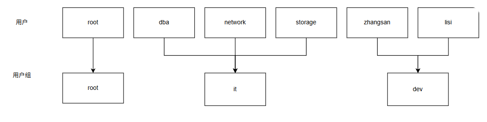
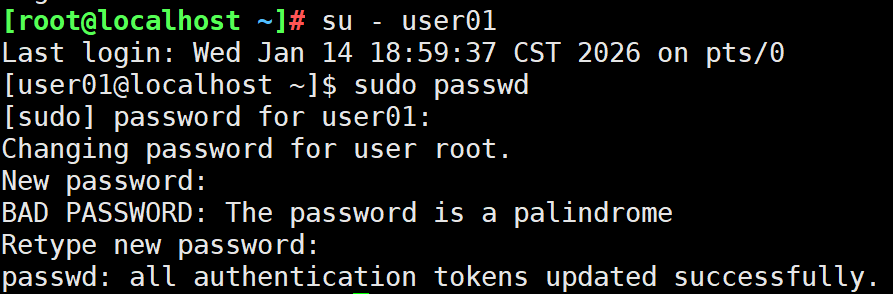
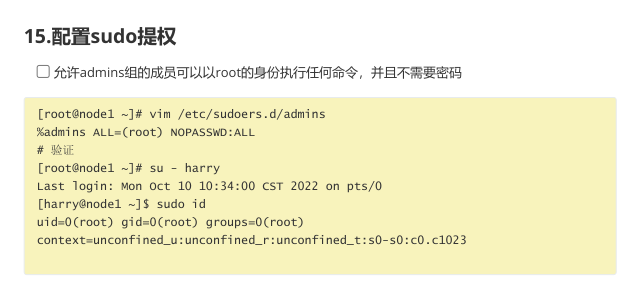
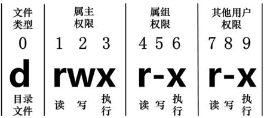

- Linux多用户主要用于资源的隔离，在实际工作中，会出现不同的岗位管理同一个Linux服务器的情况，可以创建多个用户，让他们彼此资源隔离

   

# 1.用户管理

- 用户名在Linux中的作用
  - 决定文件的权限，文件可以被什么用户的进程进行什么样的操作
  - 决定进程的权限
  - 有些不给登录的用户，主要是拿来做权限约束的

## 1.1 id

- 显示用户的id，以及所属的组
  - 为了方便管理用户，Linux中会给每个用户分配一个独一无二的id
  - 0：专属于root用户
  - 1-999：属于系统保留预设，不是给用户登录使用
  - 1000+：用于普通用户
- 一个用户所属的组有两种
  - 主组
    - 只能有一个
    - 在创建用户的时候，如果指定，就会创建同名的组，作为自己主组
  - 附加组
    - 可以有多个

```bash
[root@localhost ~]# id
uid=0(root) gid=0(root) groups=0(root) context=unconfined_u:unconfined_r:unconfined_t:s0-s0:c0.c1023
# uid 表示用户的id
# gid 表示用户主要的组id
# groups 表示用户的附属组
[root@localhost ~]# useradd user01			# 创建普通用户user01
[root@localhost ~]# id user01				# 查看user01的id信息
uid=1000(user01) gid=1000(user01) groups=1000(user01)
[root@localhost ~]# useradd user02			# 创建普通用户user02
[root@localhost ~]# id user02				# 查看user02的id信息
uid=1001(user02) gid=1001(user02) groups=1001(user02)

```

## 1.2 相关文件

### 1.2.1 passwd文件

- 用于保存用户的信息，包括用户名、用户家目录、用户密码以及用户登录后执行的命令等等

```bash
[root@localhost ~]# cat /etc/passwd
root:x:0:0:root:/root:/bin/bash
bin:x:1:1:bin:/bin:/sbin/nologin
daemon:x:2:2:daemon:/sbin:/sbin/nologin
adm:x:3:4:adm:/var/adm:/sbin/nologin
lp:x:4:7:lp:/var/spool/lpd:/sbin/nologin
sync:x:5:0:sync:/sbin:/bin/sync
shutdown:x:6:0:shutdown:/sbin:/sbin/shutdown
halt:x:7:0:halt:/sbin:/sbin/halt
mail:x:8:12:mail:/var/spool/mail:/sbin/nologin
operator:x:11:0:operator:/root:/sbin/nologin
games:x:12:100:games:/usr/games:/sbin/nologin
ftp:x:14:50:FTP User:/var/ftp:/sbin/nologin
nobody:x:65534:65534:Kernel Overflow User:/:/sbin/nologin
systemd-coredump:x:999:997:systemd Core Dumper:/:/sbin/nologin
dbus:x:81:81:System message bus:/:/sbin/nologin
tss:x:59:59:Account used for TPM access:/:/usr/sbin/nologin
sssd:x:998:996:User for sssd:/:/sbin/nologin
sshd:x:74:74:Privilege-separated SSH:/usr/share/empty.sshd:/usr/sbin/nologin
chrony:x:997:995:chrony system user:/var/lib/chrony:/sbin/nologin
user01:x:1000:1000::/home/user01:/bin/bash
user03:x:1002:0::/home/user03:/bin/bash
user04:x:1003:1003::/home/test:/bin/bash
dev01:x:1004:1004:dev user:/home/dev01:/bin/bash

# 用户名:密码(被加密了，此处用x占位置):uid:gid:描述:用户家目录:登录之后执行的命令
# 密码其实是保存到了/etc/shadow文件中
# /bin/bash 是一个交互系统，也就是我们登录后看到的命令行输入界面
```

### 1.2.2 shadow文件

- 存放用户的密码

```bash
[root@localhost ~]# cat /etc/shadow
root:$6$mBkrTYGuk8eBiIYT$NCl0euAXHjtXYZRYAgOM99xG5YcrBNaBVlrAU6B98FNtrgdC6UJYydMc1mgCjL16DjU4tvH..h5STYL0E9Z1P.::0:99999:7:::
bin:*:19820:0:99999:7:::
daemon:*:19820:0:99999:7:::
adm:*:19820:0:99999:7:::
lp:*:19820:0:99999:7:::
sync:*:19820:0:99999:7:::
shutdown:*:19820:0:99999:7:::
halt:*:19820:0:99999:7:::
mail:*:19820:0:99999:7:::
operator:*:19820:0:99999:7:::
games:*:19820:0:99999:7:::
ftp:*:19820:0:99999:7:::
nobody:*:19820:0:99999:7:::
systemd-coredump:!!:20223::::::
dbus:!!:20223::::::
tss:!!:20223::::::
sssd:!!:20223::::::
sshd:!!:20223::::::
chrony:!!:20223::::::
user01:!!:20467:0:99999:7:::
# 用户名:加密密码:最后修改时间:最小修改间隔:最大有效期限:警告期限:不活动期限:账号过期时间:保留字段

```

### 1.2.3 group文件

- 存放组相关的信息

```bash
[root@localhost ~]# cat /etc/group
root:x:0:
bin:x:1:
daemon:x:2:
sys:x:3:
adm:x:4:
tty:x:5:
disk:x:6:
lp:x:7:
mem:x:8:
kmem:x:9:
wheel:x:10:
cdrom:x:11:
mail:x:12:
man:x:15:
dialout:x:18:
floppy:x:19:
games:x:20:
tape:x:33:
video:x:39:
ftp:x:50:
lock:x:54:
audio:x:63:
users:x:100:
nobody:x:65534:
utmp:x:22:
utempter:x:35:
input:x:999:
kvm:x:36:
render:x:998:
systemd-journal:x:190:
systemd-coredump:x:997:
dbus:x:81:
ssh_keys:x:101:
tss:x:59:
sssd:x:996:
sshd:x:74:
chrony:x:995:
sgx:x:994:
docker:x:993:
slocate:x:21:
user01:x:1000:
user04:x:1003:
dev01:x:1004:
```

# 2. 用户管理命令

## 2.1 添加新用户

```bash
[root@localhost ~]# id user01
[root@localhost ~]# useradd -g root user03		# 指定主组为root，这样user03就有了root的权限
[root@localhost ~]# id user03
uid=1002(user03) gid=0(root) groups=0(root)
[root@localhost ~]# useradd -d /home/test user04	# 定义用户的家目录，如果此目录不存在，就会自动创建
[root@localhost ~]# useradd -c "dev user" dev01		# 创建用户，附带描述
```

## 2.2 切换用户

- `root`用户切换到普通用户，不需要输入密码
- 普通用户切换到`root`用户或者其他用户都需要输入密码

```bash
[root@localhost ~]# su - user01
[user01@localhost ~]$ 
[user01@localhost ~]$ su - root
Password: 
Last login: Wed Jan 14 10:58:28 CST 2026 from 192.168.73.1 on pts/1
[root@localhost ~]# 
```

- 中间有个`-`符号，是决定环境变量要不要切换过来
- 环境变量在windows和linux上都是存在的
  - windows是保存在注册表里的
  - linux是保存在`/etc/profile`文件中，在linux中`export`定义的变量只在当前会话有效，写入`.bashrc`可以在每次特定用户增加功能
  - 环境变量，就是在命令行中任意地方都可以获取到的变量
  - 在环境变量中，就有一个特殊的值叫做`PATH`
    - 在执行任何一个命令的时候，现在当前目录寻找是否存在此程序，不存在就去`PATH`的每一个目录中找一遍

```bash
[root@localhost etc]# export PWD="/tmp"			# PWD是个环境变量，决定当前所在的文件夹
[root@localhost tmp]# 
[root@localhost ~]# su user03					# 这样切换用户，环境变量是不会变化的
[user03@localhost root]$ 
[root@localhost ~]# su - user03
```


## 2.3 修改用户

- 一般生产环境下，不要去修改一个已经存在的用户

```bash
[root@localhost home]# su - user01
Last login: Wed Jan 14 15:26:39 CST 2026 on pts/0
[user01@localhost ~]$ pwd
/home
[user01@localhost ~]$ exit
logout
[root@localhost home]# usermod -d /home/test01 user01		# 修改家目录
[root@localhost home]# su - user01
Last login: Wed Jan 14 16:48:20 CST 2026 on pts/0
[user01@localhost ~]$ pwd
/home/test01

[root@localhost ~]# id user03
uid=1002(user03) gid=0(root) groups=0(root)
[root@localhost ~]# usermod -u 8888 user03			# 修改用户的uid
[root@localhost ~]# id user03
uid=8888(user03) gid=0(root) groups=0(root)

[root@localhost ~]# usermod -L user03			# 锁定用户，不可锁定root
[root@localhost ~]# usermod -U user03			# 解锁用户
```


## 2.4 删除用户

```bash
[root@localhost ~]# userdel user01			# 删除用户，但是家目录还存在
userdel: user user01 is currently used by process 3235
[root@localhost ~]# ll /home
total 0
drwx------. 2 dev01  dev01  62 Jan 14 15:23 dev01
drwx------. 2 user04 user04 62 Jan 14 15:21 test
drwx------. 2 user01 user01 62 Jan 14 15:00 user01
drwx------. 2 user02 user02 62 Jan 14 15:00 user02
[root@localhost ~]# userdel -r user02		# 删除用户以及家目录的文件夹
[root@localhost ~]# ll /home
total 0
drwx------. 2 dev01  dev01  62 Jan 14 15:23 dev01
drwx------. 2 user04 user04 62 Jan 14 15:21 test
drwx------. 2 user01 user01 62 Jan 14 15:00 user01
```

## 2.5 修改密码

- root用户可以修改任何用户的密码，并且不需要提供旧密码，并且无视密码复杂度约束
- 普通用户只能修改自己的密码，并且必须提供旧密码，并且必须符合密码复杂度要求

```bash
[root@localhost ~]# passwd					# 修改root用户自己的密码
Changing password for user root.
New password: 
BAD PASSWORD: The password is a palindrome
Retype new password: 
passwd: all authentication tokens updated successfully.
[root@localhost ~]# passwd user03			# 只有root用户可以修改其他用户的密码
Changing password for user user03.
New password: 
BAD PASSWORD: The password is a palindrome
Retype new password: 
passwd: all authentication tokens updated successfully.

```

# 3. 用户组管理

## 3.1 添加用户组

```bash
[root@localhost ~]# groupadd hr -g 1000			# 添加hr组，gid指定为1000
[root@localhost ~]# groupadd sale -g 2000
[root@localhost ~]# groupadd it -g 3000
[root@localhost ~]# groupadd fd -g 4000
[root@localhost ~]# cat /etc/group
...
hr:x:1000:
sale:x:2000:
it:x:3000:
fd:x:4000:
```

## 3.2 修改用户组

```bash
[root@localhost ~]# groupmod -n hirement hr			# 修改hr组名为hirement
[root@localhost ~]# tail -4 /etc/group
sale:x:2000:
it:x:3000:
fd:x:4000:
hirement:x:1000:
```

## 3.3 删除用户组

```bash
[root@localhost ~]# groupadd test
[root@localhost ~]# tail -1 /etc/group
test:x:4001:
[root@localhost ~]# groupdel test					# 删除test用户组
[root@localhost ~]# tail -1 /etc/group
hirement:x:1000:
```

## 3.4 添加组成员

```bash
[root@localhost ~]# id user03
uid=8888(user03) gid=0(root) groups=0(root)
[root@localhost ~]# gpasswd -a user03 it			# 将user03附加组，加上it组
Adding user user03 to group it
[root@localhost ~]# id user03
uid=8888(user03) gid=0(root) groups=0(root),3000(it)

[root@localhost ~]# gpasswd -d user03 it			# 将user03从it组中删除
Removing user user03 from group it
[root@localhost ~]# id user03
uid=8888(user03) gid=0(root) groups=0(root)

```

# 4. sudo提权

- 处于安全性考虑，有必要通过useradd创建一些非root用户，只让它们拥有不完全的权限；如有必要，再来提升权限执行。
- sudo本质上是让普通用户可以请求root用户执行一些代码，默认情况下都不允许
- 可以通过sudo配置文件，可以让某些用户可以请求某些命令

```bash
[root@localhost ~]# visudo					# 编辑sudo配置文件
...
root    ALL=(ALL)       ALL
%wheel  ALL=(ALL)       ALL
...
授权用户/%组 主机=[(切换到哪些用户或组)] [是否需要输入密码验证,默认需要] 命令1,命令2,...
```

- user01具备sudo的权限，可以直接加入到wheel组

```bash
[root@localhost home]# gpasswd -a user01 wheel
Adding user user01 to group wheel
[root@localhost home]# id user01
uid=8889(user01) gid=8889(user01) groups=8889(user01),10(wheel)
[root@localhost home]# su - user01
Last login: Wed Jan 14 18:46:03 CST 2026 on pts/0
[user01@localhost ~]$ sudo whoami				# 命令前加上sudo，等同于root执行

We trust you have received the usual lecture from the local System
Administrator. It usually boils down to these three things:

    #1) Respect the privacy of others.
    #2) Think before you type.
    #3) With great power comes great responsibility.

[sudo] password for user01: 
root

```

- 如果要单独限制user01具备sudo执行命令的权限
  - 给user01,whoami,cal,白名单机制
  - 黑名单，`ALL,!/user/bin/passwd`

```bash
[root@localhost home]# visudo
...
user01 ALL=(ALL) /usr/bin/whoami,/usr/bin/cal,!/usr/bin/passwd
...
```



- `sudo passwd`的结果是正常passwd的结果，无法修改`root`用户的密码，黑名单起作用了
- 可以使用sudo切换到root用户，切记切记

```bash
[user03@localhost ~]$ sudo -i
[root@localhost ~]# 					# 此处执行的命令都默认是root，相当于登录了root

# 所以在有约束的情况下，要把这个sudo -i给彻底禁止
# 格式：用户名  ALL=(ALL)  允许的命令, !禁止的命令
# sudo -i的本质是登录root用户，root用户登录之后本质是执行/usr/bin/bash
test  ALL=(ALL)  ALL, !/usr/bin/sudo -i, !/usr/bin/sudo --login, !/bin/su

# 即使是这样，依旧不安全，因为还有visudo，vim,cat,sed很多命令如果能够root运行，都会导致问题
# 建议命令白名单机制，确保没有问题的命令，加入到sudo中
```

---------------

-------------

- rhcsa题目：

  - ### 📌 核心原理：`sudo`会**自动加载 `/etc/sudoers.d/`目录下的所有配置文件**

    - `/etc/sudoers`是主配置文件，但直接编辑它风险高（语法错误会导致 `sudo`失效）。
    - 为了解决这个问题，Linux 引入了 **`/etc/sudoers.d/`目录**，用于**模块化、分权管理 sudo 权限**。
    - `sudo`在启动或执行时，会**递归读取 `/etc/sudoers.d/`下所有以 `.conf`或无扩展名结尾的文件**（具体取决于系统和 `visudo`配置，但通常所有文件都会被加载）。
    - **这些文件的语法和 `/etc/sudoers`完全一致**，可以看作“子配置文件”。



```bash
%admins ALL=(root) NOPASSWD:ALL
```

我们逐部分解释：

| 部分           | 含义                                                         |
| -------------- | ------------------------------------------------------------ |
| `%admins`      | 表示“**admins 组**”中的所有成员。`%`是组的标识前缀。如果是用户名，就直接写用户名（如 `harry`）。 |
| `ALL`          | 表示“**所有主机**”（即无论你在哪台机器上执行 `sudo`，都适用）。 |
| `(root)`       | 表示“**以 root 身份**”执行命令。括号里是目标用户。           |
| `NOPASSWD:ALL` | 表示“**不需要密码**”执行“**所有命令**”。`NOPASSWD`是关键，后面跟冒号和命令列表（这里 `ALL`表示所有命令）。 |

**🧩 完整翻译：**

> “**所有属于 admins 组的用户，在任何主机上，都可以以 root 身份执行任何命令，且不需要输入密码。**”

# 5. 文件权限

- 文件的权限决定了这个文件可以被这个用户以什么方式操作
  - 读(r)：查看文件内容
    - 针对目录（文件夹），r权限决定是否允许枚举此文件夹下的目录
    - `ls`命令是否可以执行
  - 写(w)：修改文件内容
    - 针对目录，w权限决定是否允许在此目录下新增或者删除或者重命名文件/目录
    - 文件的内容是否允许修改，看文件的修改，但是文件是否可以删除，看的是目录的权限
  - 执行(x)：运行程序
    - 针对目录，x的权限决定是否允许cd到这个目录下

```bash
[root@localhost ~]# ll
total 32
-rw-------. 1 root root   907 May 15  2025 anaconda-ks.cfg
-rw-r--r--. 1 root root    15 Jan 14 10:33 file1
-rw-r--r--. 1 root root     0 Jan 13 16:00 filenew
-rw-r--r--. 1 root root     0 Jan 13 16:00 fileold
drwxr-xr-x. 2 root root     6 Jan 13 16:13 my_dir1
drwxr-xr-x. 2 root root    25 Jan 13 16:27 my_dir2
-rw-r--r--. 1 root root 24233 Jan 14 11:14 tree.txt

# 文件的类型： - 普通文件 d 文件夹
# rw- 文件拥有者的权限： r可读 w可写 -不可执行，如果是可执行，此处是x
# r-- 文件拥有组员的权限：只可读
# r-- 除了文件拥有者，文件所属组以外的人权限：只可读
# . 文件的facl是否设置，.表示没有设置，+表示设置了
# 1 文件的硬链接数，可以理解为文件的别名数量
# root 文件拥有者的id对应的用户名，本质上记录的是id
# root 文件所在组的id对应的组名
# 24233 文件大小，单位字节，如果ls -lh就可以看到大概的单位
# Jan 14 11:14 文件最后的修改名
# tree.txt 文件名
```

- 硬链接和软链接
  - 硬链接相当于是文件的多个被访问入口名称，但是访问的是同一个位置的文件，也就是文件名，硬连接数表示这个文件名的数量，`rm`删除文件，本质上是减少此文件的入口，如果硬链接数为0，那么此文件就被彻底删除了
  - `ln 原文件 硬链接文件`创建
  - 硬链接不能跨分区创建
  - 硬链接不能用在文件夹上
- 软链接是文件的快捷方式
  - `ln -s 原文件 软链接文件`创建
  - 可以用来管理不同版本的软件环境对应同一个快捷方式，根据需要切换快捷方式的目的地
  - 软链接可以跨分区创建



- root用户无视上面的规则，任何用户的文件都有rwx权限

## 5.1 修改文件属组

```bash
[root@localhost ~]# ll
-rw-rw-r--. 1 root root 24233 Jan 14 11:14 tree.txt
[root@localhost ~]# chown dev01:it tree.txt			# 修改文件的属主和属组
-rw-rw-r--. 1 dev01 it   24233 Jan 14 11:14 tree.txt
[root@localhost ~]# chown :fd tree.txt				# 只改属组
-rw-rw-r--. 1 dev01 fd   24233 Jan 14 11:14 tree.txt
[root@localhost dir]# chown -R dev01 dir1/			# 递归修改，可以将文件夹所有的文件或文件夹都修改
[root@localhost dir]# ll
total 0
drwxr-xr-x. 2 dev01 root 136 Jan 16 11:46 dir1
-rw-r--r--. 1 root  root   0 Jan 16 11:40 file0
-rw-r--r--. 1 root  root   0 Jan 16 11:40 file1
-rw-r--r--. 1 root  root   0 Jan 16 11:40 file2
-rw-r--r--. 1 root  root   0 Jan 16 11:40 file3
-rw-r--r--. 1 root  root   0 Jan 16 11:40 file4
-rw-r--r--. 1 root  root   0 Jan 16 11:40 file5
-rw-r--r--. 1 root  root   0 Jan 16 11:40 file6
-rw-r--r--. 1 root  root   0 Jan 16 11:40 file7
-rw-r--r--. 1 root  root   0 Jan 16 11:40 file8
-rw-r--r--. 1 root  root   0 Jan 16 11:40 file9

[root@localhost ~]# ll	
-rw-rw-r--. 1 dev01 fd    12 Jan 16 11:49 tree.txt			# 当前文件夹给user03只有可读权限
[root@localhost tmp]# ll
total 4
-rw-rw-r--. 1 dev01 fd 12 Jan 16 11:49 tree.txt
[user03@localhost ~]$ cd /tmp
[user03@localhost tmp]$ cat tree.txt 
hello world
[user03@localhost tmp]$ echo "yes" > tree.txt			# 无法修改此文件
-bash: tree.txt: Permission denied
```

- 当用户在执行某个软件处理文件的时候，这个软件会以当前用户的身份启动，此用户的身份会用来判断权限

```bash
[root@localhost ~]# ps aux |grep vim			# 这个命令可以查看vim进程的用户是user03
user03      2315  1.0  0.2  11648  8960 pts/0    S+   12:01   0:00 vim tree.txt
root        2321  0.0  0.0   3876  2048 pts/1    S+   12:01   0:00 grep --color=auto vim
[root@localhost ~]# ps aux |grep vim			 # 如果使用sudo ，可以看到vim的用户是root
root        2361  0.2  0.2  17108  7936 pts/0    S+   12:04   0:00 sudovim tree.txt
root        2365  0.3  0.2  11680  9088 pts/0    S+   12:04   0:00 vim tree.txt
root        2368  0.0  0.0   3876  2048 pts/1    S+   12:04   0:00 grep --color=auto vim

```

## 5.2 修改文件权限

- 使用rwx的方式修改
  - u：文件的属主
  - g：文件的属组
  - o：其他权限

```bash
[root@localhost ~]# chmod g+w tree.txt				# 为tree.txt的属组加上w权限
-rw-rw-r--. 1 root root 24233 Jan 14 11:14 tree.txt

[root@localhost ~]# cat test.txt
今天空气不怎么好啊，有污染
[root@localhost ~]# ll
-rw-r--r--. 1 root root  40 Jan 16 12:08 test.txt
[root@localhost ~]# chmod o-r test.txt 				# 为test.txt的其他用户权限减掉r
[root@localhost ~]# ll
-rw-r-----. 1 root root  40 Jan 16 12:08 test.txt
[root@localhost ~]# chmod o=r-- test.txt			# 设置test.txt的其他用户权限
-rw-r--r--. 1 root root  40 Jan 16 12:08 test.txt
```

- 使用八进制方式修改，下面是权限
  - r：4
  - w：2
  - x：1

```bash
[root@localhost ~]# chmod 660 test.txt				# 设置u=rw- g=rw-
-rw-rw----. 1 root root  40 Jan 16 12:08 test.txt
[root@localhost ~]# chmod 644 test.txt				# 文件初始状态
[root@localhost ~]# ll
-rw-r--r--. 1 root root  40 Jan 16 12:08 test.txt
```

# 6. 文件访问控制列表

- `facl`:(File Access Control List)可以实现对文件更加精准的控制
- `ugo`的权限管理精度不够，不能针对特定的用户做限制
  - 比如，user01:user01的文件，不能单独的给user03开可写权限，而其他用户没有

## 6.1 getfacl

- 获取文件的facl
  - 如果只有`ugo`说明没有对此文件配置`facl`

```bash
[user03@localhost tmp]$ getfacl tree.txt 
# file: tree.txt
# owner: dev01
# group: fd
user::rw-
group::rw-
other::r--

```

## 6.2 setfacl

- 设置facl
  - -m 更改文件的访问控制列表
  - -x 删除对应的facl
  - -b 清空所有的facl

```bash
[root@localhost tmp]# setfacl -m u:user03:rwx tree.txt	# 为此文件单独设置user03是rwx
[root@localhost tmp]# getfacl tree.txt
# file: tree.txt
# owner: dev01
# group: fd
user::rw-
user:user03:rwx		# ①
group::rw-
mask::rwx			# ②
other::r--
[root@localhost tmp]# setfacl -x u:user03 tree.txt 		# 删除user03对应的facl
[root@localhost tmp]# getfacl tree.txt
# file: tree.txt
# owner: dev01
# group: fd
user::rw-
group::rw-
mask::rw-		# 这里的mask仍有
other::r--
[root@localhost tmp]# ll
total 4
-rw-rw-r--+ 1 dev01 fd 12 Jan 16 11:49 tree.txt		# 这里也还是+号
[root@localhost tmp]# setfacl -b tree.txt 			# 清空所有的facl，这样最干净
[root@localhost tmp]# getfacl tree.txt
# file: tree.txt
# owner: dev01
# group: fd
user::rw-
group::rw-
other::r--
[root@localhost tmp]# ll
total 4
-rw-rw-r--. 1 dev01 fd 12 Jan 16 11:49 tree.txt
```

- 某个项目文件夹中后续创建的每一个文件都要给user03 rwx权限

```bash
[root@localhost tmp]# mkdir user03_project
[root@localhost tmp]# cd user03_project/
[root@localhost user03_project]# touch file{a..f}
[root@localhost user03_project]# ls
filea  fileb  filec  filed  filee  filef
[root@localhost user03_project]# cd ..
[root@localhost tmp]# ls
tree.txt  user03_project
[root@localhost tmp]# setfacl -R -m u:user03:rwx user03_project/	# 先把所有的文件都附带上user03可写权限
[root@localhost tmp]# setfacl -m d:u:user03:rwx user03_project/		# 后续在此目录下创建文件，默认带上user03的rw权限
[root@localhost tmp]# getfacl user03_project/
# file: user03_project/
# owner: root
# group: root
user::rwx
user:user03:rwx
group::r-x
mask::rwx
other::r-x
default:user::rwx
default:user:user03:rwx
default:group::r-x
default:mask::rwx
default:other::r-x
```

# 7. 特殊权限

- 特殊权限
  - suid
    - 只能配置在可执行程序上，如果程序不可执行，配置无效，并且会显示为`S`
    - 任何用户执行此程序，执行的身份都是文件属主
    - 比如`/user/bin/passwd`程序，就是suid程序，普通用户也可以用passwd命令修改shadow密码文件，而这个文件权限是`000`
    - 配置示例：`chomd u+s /usr/bin/whoami`加上，取消减去即可
  - sgid
    - 配置在目录上，此目录下所有创建的文件的属组和目录一致

```bash
[root@localhost tmp]# chmod g+s user03_project/			# 给目录加上sgid
[root@localhost tmp]# chown :it user03_project/
[root@localhost tmp]# ll
total 4
-rw-rw-r--. 1 dev01 fd 12 Jan 16 11:49 tree.txt
drwxrwsr-x+ 2 root  it 84 Jan 16 14:43 user03_project
[root@localhost tmp]# cd user03_project/
[root@localhost user03_project]# touch newfile			# 创建的文件都会和目录的组一样
[root@localhost user03_project]# ll newfile 
-rw-rw-r--+ 1 root it 0 Jan 16 15:01 newfile
```

- sticky
  - 用在目录上，此目录的所有用户，只能删除自己创建的文件

```bash
[root@localhost tmp]# chmod o+t user03_project/
[root@localhost tmp]# chmod o+w user03_project/
[root@localhost tmp]# ll
total 8
-rw-r--r--. 1 root  root 84 Jan 16 15:13 login.log
-rw-rw-r--. 1 dev01 fd   12 Jan 16 11:49 tree.txt
drwxrwsrwt+ 2 root  it   99 Jan 16 15:01 user03_project

# 创建一个root用户的文件
[root@localhost user03_project]# touch root_file
[root@localhost user03_project]# su - user03
[user03@localhost ~]$ cd /tmp/user03_project/

# 创建普通用户的文件
[user03@localhost user03_project]$ touch user03_file

# 无法删除其他用户的文件
[user03@localhost user03_project]$ rm -rf root_file
rm: cannot remove 'root_file': Operation not permitted

# 只可以删除自己的文件
[user03@localhost user03_project]$ rm -rf user03_file 
```

# 8. 文件属性

- Linux中文件可以设置一些特殊的属性
  - a属性：文件只能追加，不能减少

```bash
[root@localhost tmp]# echo "登录成功!" >> login.log 		# 如有个日志文件
[root@localhost tmp]# chattr +a login.log
[root@localhost tmp]# lsattr login.log 
-----a---------------- login.log
[root@localhost tmp]# echo "登录成功!" >> login.log 		# 追加内容在结尾是允许的
[root@localhost tmp]# cat login.log 
登录成功!
登录成功!
登录成功!
登录成功!
登录成功!
登录成功!
[root@localhost tmp]# vim login.log
[root@localhost tmp]# echo > login.log 						# 覆盖内容是不允许的
-bash: login.log: Operation not permitted
```

- vim原理
  - vim打开一个文件，本质上是复制当前文件出来，复制的文件是一个隐藏文件，`.原文件名.swp`，为了防止程序意外退出，会破坏源文件
  - 如果vim在打开某个文件的时候，发现存在`.原文件名.swp`文件，就会提醒是否恢复之前编辑的内容
