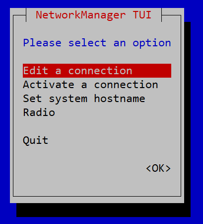
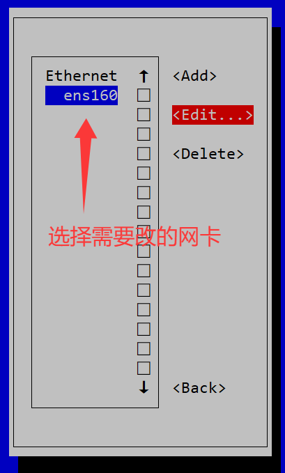
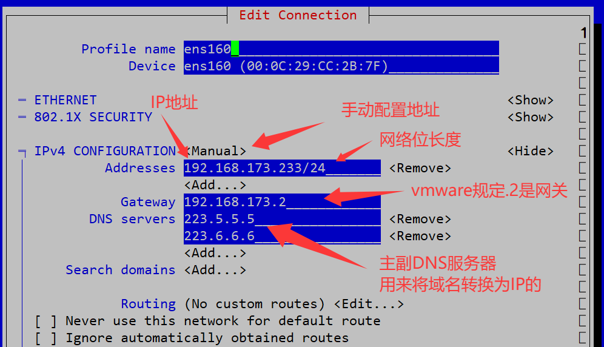
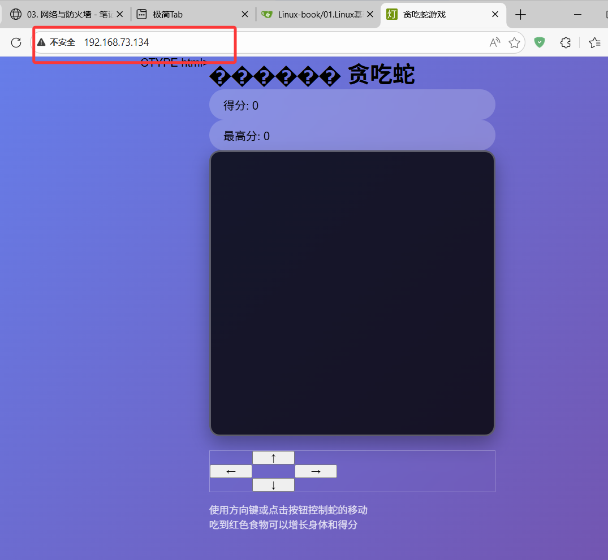
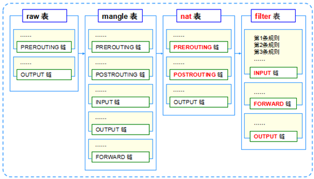

# 1. IP地址

- IP地址用于在网络上标识唯一位置的
- IP地址由IANA组织分配的，再由各级运行商分派下来，目前国内大多数情况下是拿不到IPv4地址的
- IPv4地址有公网地址和私有地址，私有地址在内部随意使用
  - 私有IP地址段
    - 10.0.0.0~10.255.255.255
    - 172.16.0.0~172.31.255.255
    - 192.168.0.0~192.168.255.255
  - 127开头的所有地址都是本机预留做测试的
  - `169.254`开头的地址，是作为得不到IP的时候，本机自己随机产生的(APIPA)
- 如果要访问公共互联网，那么私有IP地址必须经过地址转换（NAT），才可以临时借用出口的公网IP地址与外面通信
-    制0~255
- IP网络并不是一个平面，IP网络会根据需要，进行局域网划分管理，通过IP地址的网络位进行局域网的区分
  - IP地址的网络位相当于手机号的前7位，可以判断出归属地，网络位一样的IP地址，属于一个局域网
  - 不同局域网的IP地址，想要互相通信，必须中间要有路由器以及类似功能的网络设备
  - 网络位长度必须要根据子网掩码来判断，子网掩码有两种格式
    - `/24`：也叫前缀长度(prefix)，意思是转成二进制后，前多少位是网络位
    - `255.255.255.0`：子网掩码，和IP地址二进制等长，子网掩码位是1，表示对应的是网络位
  - 在一个网段中，第一个地址会保留作为网段号作为此网段的称呼，最后一个地址会保留作为此网段的广播地址。

# 2. 配置IP地址

## 2.1 图形化方式修改

- windows配置IP地址

  - 运行`ncpa.cpl`
  - 找到无线或者有线网卡，双击打开，详细信息，找到IPv4或者IPv6修改

- linux配置IP地址

  - 运行`nmtui`，上下回车选择，esc返回

  

  

  

- DNS是可以提供一个查询域名对应IP地址的服务，`223.5.5.5，223.6.6.6`是阿里提供的

- 配置结束后，一路确定与返回，然后重启对应的网卡

  - 重启网卡之后，远程连接就断开了，需要修改xshell的地址，重新连接

```bash
[root@localhost ~]# nmcli d reapply ens160					# 重新应用ens160的配置
Connection successfully reapplied to device 'ens160'.
```

## 2.2 修改配置文件

- Rocky Linux/Centos系列

```bash
[root@localhost ~]# vim /etc/NetworkManager/system-connections/ens160.nmconnection

[connection]
id=ens160
uuid=27dd7411-b011-382b-a0a9-bf6431880c76
type=ethernet
autoconnect-priority=-999
interface-name=ens160
timestamp=1768527540

[ethernet]

[ipv4]
address1=192.168.73.134/24,192.168.73.2
dns=223.5.5.5;223.6.6.6;
method=manual

[ipv6]
addr-gen-mode=eui64
method=auto

[proxy]


[root@localhost ~]# nmcli d reapply ens160			# 重启网卡生效
```

- ubuntu系列

```bash
[root@localhost ~]# vim /etc/netplan/50-cloud-init.yaml
network:
  version: 2
  ethernets:
    ens33:
      dhcp4: no
      addresses:
        - 192.168.1.100/24
      gateway4: 192.168.1.1
      nameservers:
        addresses:
          - 8.8.8.8
          - 8.8.4.4

[root@localhost ~]# netplan --debug try			# 检查配置是否正确
[root@localhost ~]# netplan apply				# 应用配置
```

# 3. 防火墙

- 防火墙保护内部的网络免受攻击，会检测攻击流量，并且拦截
- 企业级防火墙往往都具备应用流量识别的功能，能够识别针对不同应用的攻击行为
- 在Linux或者Windows中，也有系统自带的软件防火墙，允许端口的开关


## 3.1 端口

- 一台主机可以提供多个不同的服务，或者可以同时接受不同的数据，需要区分不同的服务，或者收到的不同数据，就需要端口号
  - 比喻：学校食堂相当于一台主机，不同窗口提供不同的食物，相当于主机提供不同的服务
  - 一个IP地址可以监听`65536`个端口= 2的16次方
  - 一些常见的端口
    - http:80/tcp
    - ssh:22/tcp&udp
    - https:443/tcp&udp

```bash
[root@localhost ~]# ss -ntl					# 查看开放的端口，以及状态
State    Recv-Q   Send-Q     Local Address:Port     Peer Address:Port  Process   
LISTEN   0        128              0.0.0.0:22            0.0.0.0:*               
LISTEN   0        128                 [::]:22               [::]:*                   
[root@localhost ~]# ss -ntlp				 # 查看开发端口占用的服务名称
State     Recv-Q    Send-Q       Local Address:Port         Peer Address:Port    Process                                                                          
LISTEN    0         128                0.0.0.0:22                0.0.0.0:*        users:(("sshd",pid=868,fd=3))                                                   
LISTEN    0         128                   [::]:22                   [::]:*        users:(("sshd",pid=868,fd=4)) 
```

## 3.2 TCP和UDP

- TCP和UDP是两种不同的数据传输方式，相当于寄快递，或者是找顺风车送过去

### 3.2.1 TCP

- TCP是可靠传输，每个数据的传输都必须得到确定，才可以继续

### 3.2.2 UDP

- UDP是尽力而为的传输，每个数据都无法确认对方是否准确收到

# 4. iptables

- 可以针对端口号、IP地址、TCP/UDP、mac地址、自定义的特征进行识别，并且处理
  - 放行:ACCEPT
  - 拒绝:REJECT
  - 丢弃:DROP
- 在RedHat6以后默认使用的是firewalled进行防火墙管理，但是firewalld只在Redhat系列中通用性比较高，在别的Linux发行版中用的不多
- iptables是所有的Linux发行版中大多自带的

```bash
# 关闭firewalled防火墙管理服务，启用iptables防火墙管理服务
[root@localhost ~]# systemctl disable --now firewalld		
Removed "/etc/systemd/system/multi-user.target.wants/firewalld.service".
Removed "/etc/systemd/system/dbus-org.fedoraproject.FirewallD1.service".
```

## 4.1 五链

- iptables命令中设 置数据过滤或处理数据包的策略叫做规则，将多个规则合成一个链，叫规则链
- iptables根据流量的不同位置，分类出五个链


- 启动一个网站服务用于测试

```bash
[root@localhost ~]# cd web
[root@localhost web]# vim index.html
[root@localhost web]# nohup python -m http.server 80 > access.log &
# nohup 需要运行的命令 > 日志文件 & 可以让命令到后台运行
```

- 效果，在浏览器能够访问`192.168.73.134:80`的页面



- iptables基础操作

```bash
[root@localhost web]# iptables -L -n		# -L 查看规则，-n 不要解析端口和 
Chain INPUT (policy ACCEPT)					# INPUT链，默认行为是放行
target     prot opt source               destination         

Chain FORWARD (policy DROP)
target     prot opt source               destination         
DOCKER-USER  all  --  anywhere             anywhere            
DOCKER-FORWARD  all  --  anywhere             anywhere            

Chain OUTPUT (policy ACCEPT)
target     prot opt source               destination         

[root@localhost web]# iptables -P INPUT DROP		# 此命令会直接导致服务器无法连接
[root@localhost web]# iptables -A INPUT -p tcp --dport 80 -j REJECT		# 拒绝80端口访问
# -A 在INPUT链最后加上一条规则
# -p 匹配tcp传输方式
# --dport 匹配被访问的端口号
# -j 动作	
[root@localhost web]# iptables -L --line-number		# 为每个规则加上序号，用于删除
Chain INPUT (policy ACCEPT)
num  target     prot opt source               destination         
1    REJECT     tcp  --  anywhere             anywhere             tcp dpt:http reject-with icmp-port-unreachable

Chain FORWARD (policy DROP)
num  target     prot opt source               destination         
1    DOCKER-USER  all  --  anywhere             anywhere            
2    DOCKER-FORWARD  all  --  anywhere             anywhere            

Chain OUTPUT (policy ACCEPT)
num  target     prot opt source               destination    
[root@localhost web]# iptables -D INPUT 1		# 根据上面显示的序号，删除对应的规则
[root@localhost web]# iptables -L --line-number
Chain INPUT (policy ACCEPT)
num  target     prot opt source               destination         

Chain FORWARD (policy DROP)
num  target     prot opt source               destination         
1    DOCKER-USER  all  --  anywhere             anywhere            
2    DOCKER-FORWARD  all  --  anywhere             anywhere            

Chain OUTPUT (policy ACCEPT)
num  target     prot opt source               destination       
```

- INPUT配置如下，INPUT所有端口DROP，但放行22端口和80端口，白名单机制

```bash
[root@localhost web]# iptables -L -n
Chain INPUT (policy DROP)
target     prot opt source               destination         
ACCEPT     6    --  0.0.0.0/0            0.0.0.0/0            tcp dpt:22
ACCEPT     6    --  0.0.0.0/0            0.0.0.0/0            tcp dpt:80  
```

## 4.2 四表

- 五链是根据规则作用的位置来定义的，四表是根据功能来定义的
  - raw表
    - 确定是否对该数据包进行状态跟踪
  - mangle表
    - 为数据包设置标记（较少使用）
  - nat表
    - 修改数据包中的源、目标IP地址或端口
  - filter表
    - 确定是否放行该数据包（过滤）



```bash
[root@localhost web]# iptables -L -n -t filter			# 默认查看的表是filter，如果要看nat表，那么需要加上-t nat
[root@localhost web]# iptables -L -n -v					# -v显示规则匹配中的数据包个数
Chain INPUT (policy DROP 269 packets, 23936 bytes)
 pkts bytes target     prot opt in     out     source               destination         
  407 30528 ACCEPT     6    --  *      *       0.0.0.0/0            0.0.0.0/0            tcp dpt:22
   36  2762 ACCEPT     6    --  *      *       0.0.0.0/0            0.0.0.0/0            tcp dpt:80

[root@localhost web]# watch -n 1 "iptables -L -n -v"	# watch可以让后续的命令周期性执行

```

## 4.3 使用案例

- 根据端口号，数据传输方式tcp、udp，进行规则匹配

```bash
[root@localhost web]# iptables -A INPUT -p tcp --dport 80 -j REJECT		# 拒绝80端口访问
```

- 根据IP地址，进行规则匹配

```bash
[root@localhost web]# iptables -A INPUT -s 192.168.73.2 -p tcp --dport 80 -j ACCEPT
# 只允许来自192.168.73.2的IP地址使用tcp访问80端口的数据访问
```

- 控制ping是否响应，在本环境中，默认是drop，我们可以将ping允许
  - ping利用的是icmp协议，不是tcp或者udp

```bash
[root@localhost web]# iptables -A INPUT -p icmp -j ACCEPT
[root@localhost web]# iptables -L -n
Chain INPUT (policy DROP)
target     prot opt source               destination         
ACCEPT     6    --  0.0.0.0/0            0.0.0.0/0            tcp dpt:22
ACCEPT     6    --  192.168.73.2         0.0.0.0/0            tcp dpt:80
ACCEPT     1    --  0.0.0.0/0            0.0.0.0/0           


# icmp协议是可以看出是被拒绝还是超时
# drop的现象是超时，reject的响应是拒绝
```

- 修改一条现有的规则

```bash
[root@localhost web]# iptables -L INPUT -n				# -L 查看指定的链
Chain INPUT (policy DROP)
target     prot opt source               destination         
ACCEPT     6    --  0.0.0.0/0            0.0.0.0/0            tcp dpt:22
ACCEPT     6    --  192.168.73.2         0.0.0.0/0            tcp dpt:80
ACCEPT     1    --  0.0.0.0/0            0.0.0.0/0    
[root@localhost web]# iptables -R INPUT 2 -s 0.0.0.0/0 -j ACCEPT	# -R 修改对应序号的规则
[root@localhost web]# iptables -L INPUT -n
Chain INPUT (policy DROP)
target     prot opt source               destination         
ACCEPT     6    --  0.0.0.0/0            0.0.0.0/0            tcp dpt:22
ACCEPT     0    --  0.0.0.0/0            0.0.0.0/0           
ACCEPT     1    --  0.0.0.0/0            0.0.0.0/0 
```

- 自定义链
  - 比如：关于网站有很多的过滤规则，关于邮箱也有很多规则，除此以外，还有关于打印机，关于文件服务等等很多规则，都写在INPUT链中，过于复杂，所以可以自定义每个功能的链，然后在INPUT中关联

```bash
[root@localhost ~]# iptables -N web_chain							# 默认是-t filter
[root@localhost ~]# iptables -A web_chain -s 192.168.73.1 -j REJECT	# 加上拒绝的规则
[root@localhost ~]# iptables -A INPUT -p tcp --dport 80 -j web_chain	# 符合此应用特征的流量，交给web_chain来处理
[root@localhost ~]# iptables -L -n
Chain INPUT (policy ACCEPT)
target     prot opt source               destination         
web_chain  tcp  --  0.0.0.0/0            0.0.0.0/0            tcp dpt:80

Chain FORWARD (policy DROP)
target     prot opt source               destination         
DOCKER-USER  all  --  0.0.0.0/0            0.0.0.0/0           
DOCKER-FORWARD  all  --  0.0.0.0/0            0.0.0.0/0           

Chain OUTPUT (policy ACCEPT)
target     prot opt source               destination    

Chain web_chain (1 references)
target     prot opt source               destination         
REJECT     all  --  192.168.73.1         0.0.0.0/0            reject-with icmp-port-unreachable
[root@localhost ~]# iptables -F web_chain			# 清空规则
[root@localhost ~]# iptables -L -n
Chain web_chain (1 references)
target     prot opt source               destination  
[root@localhost ~]# iptables -D INPUT 1				# 删除引用
Chain INPUT (policy ACCEPT)
target     prot opt source               destination    
[root@localhost ~]# iptables -X web_chain			# 删除链
```

## 4.4 保存与恢复

- 将配置导出，然后在下次启动的时候，自动导入

```bash
[root@localhost ~]# iptables-save > /etc/sysconfig/iptables		# 手动导出
[root@localhost ~]# iptables-restore < /etc/sysconfig/iptables	# 手动导入

[root@localhost ~]# yum -y install iptables-services	# 安装iptables-services服务
[root@localhost ~]# systemctl enable --now iptables
[root@localhost ~]# iptables-save > /etc/sysconfig/iptables		# 保存当前规则
```

## 4.5 NAT

- NAT主要有两种
  - SNAT
    - 让内网设备可以临时借用出口的地址上网
    - 比如：内网是192.168.22.200，在访问百度的时候，原地址就是192.168.22.200，目的地址36.152.44.132（www.baidu.com），数据发送给百度的时候是没有问题，但是百度回复数据的时候，192.168.22.200是私有IP地址只在内部使用，百度无法回复
    - 解决方案：内网的出口设备，在数据包发送出去的时候，将192.168.22.200(原IP地址)替换成公网的地址，百度在回复的时候数据包先回到出口设备上，出口设备根据替换的历史数据，可以知道具体是哪一个内网的设备的数据，进行转发
  - DNAT
    - 将内网的特定地址端口号暴露对外
- 实验环境


- 先修改IP地址，其中Gateway的ens224网关IP改为`172.16.0.1/24`，Server的ens160网关IP改为`172.16.0.2/24`

```bash
root@Gateway:~# nmcli d reapply ens224
Connection successfully reapplied to device 'ens224'
root@Gateway:~# systemctl disable --now firewalld		# 关闭firewalld，同时iptables要没有策略
Removed "/etc/systemd/system/multi-user.target.wants/firewalld.service".
Removed "/etc/systemd/system/dbus-org.fedoraproject.FirewallD1.service".
root@Gateway:~# ping 172.16.0.2							# Gateway和Server能互相ping通
PING 172.16.0.2 (172.16.0.2) 56(84) bytes of data.
64 bytes from 172.16.0.2: icmp_seq=1 ttl=64 time=1.46 ms
64 bytes from 172.16.0.2: icmp_seq=2 ttl=64 time=0.859 ms
64 bytes from 172.16.0.2: icmp_seq=3 ttl=64 time=0.345 ms
64 bytes from 172.16.0.2: icmp_seq=4 ttl=64 time=0.624 ms
64 bytes from 172.16.0.2: icmp_seq=5 ttl=64 time=0.799 ms
root@Gateway:~# ssh root@172.16.0.2						# 个人电脑可以通过Gateway的ssh来远程连接到Server
```

- 修改主机名

```bash
root@localhost:~# hostnamectl set-hostname Gateway		# 改完重连生效
[root@localhost]:~# hostnamectl set-hostname Server
```

- 测试，当前Gateway是有网络的，但是Server没有网络

```bash
[root@Gateway]:~$ ping -c 5 www.baidu.com
PING www.a.shifen.com (36.152.44.93) 56(84) bytes of data.
64 bytes from 36.152.44.93 (36.152.44.93): icmp_seq=1 ttl=128 time=16.0 ms
64 bytes from 36.152.44.93 (36.152.44.93): icmp_seq=2 ttl=128 time=14.0 ms
64 bytes from 36.152.44.93 (36.152.44.93): icmp_seq=3 ttl=128 time=14.1 ms
64 bytes from 36.152.44.93 (36.152.44.93): icmp_seq=4 ttl=128 time=14.7 ms
64 bytes from 36.152.44.93: icmp_seq=5 ttl=128 time=14.4 ms

--- www.a.shifen.com ping statistics ---
5 packets transmitted, 5 received, 0% packet loss, time 40102ms
rtt min/avg/max/mdev = 14.005/14.658/16.014/0.726 ms
[root@Server]:~# ping -c 5 www.baidu.com
ping: www.baidu.com: Name or service not known
```

- 在Gateway上开启转发功能
  - 开启了转发以后，Gateway可以帮助Server转发数据，但是不会做任何处理，由于G-S之间是私有IP地址，此地址无法得到回复

```bash
[root@Gateway]:~$ echo "net.ipv4.ip_forward=1" >> /usr/lib/sysctl.d/50-default.conf
[root@Gateway]:~$ sysctl -w net.ipv4.ip_forward=1
net.ipv4.ip_forward = 1
[root@Gateway]:~$ sysctl -p

```

- SNAT
  - 在Gateway上配置，将自己的上网地址与`172.16.0.0/24`共享

```bash
[root@Gateway]:~$ iptables -t nat -A POSTROUTING -s 172.16.0.0/24 -j MASQUERADE
# 此时Server会以Gateway的身份访问外网
[root@Server]:~# ping -c 5 www.baidu.com
PING www.a.shifen.com (36.152.44.93) 56(84) bytes of data.
64 bytes from 36.152.44.93 (36.152.44.93): icmp_seq=1 ttl=127 time=15.7 ms
64 bytes from 36.152.44.93 (36.152.44.93): icmp_seq=2 ttl=127 time=15.3 ms
64 bytes from 36.152.44.93 (36.152.44.93): icmp_seq=3 ttl=127 time=15.6 ms
64 bytes from 36.152.44.93 (36.152.44.93): icmp_seq=4 ttl=127 time=16.6 ms
64 bytes from 36.152.44.93 (36.152.44.93): icmp_seq=5 ttl=127 time=16.3 ms

--- www.a.shifen.com ping statistics ---
5 packets transmitted, 5 received, 0% packet loss, time 4007ms
rtt min/avg/max/mdev = 15.327/15.893/16.554/0.454 ms
```

- 保存配置

```bash
[root@Gateway]:~$ systemctl enable --now iptables
[root@Gateway]:~$ iptables-save > /etc/sysconfig/iptables
```

- DNAT
  - 将Server上的服务对外暴露，在Server上运行一个网站，然后在Gateway上暴露Server的80端口

```bash
[root@Server]:~# mkdir web
[root@Server]:~# cd web
[root@Server]:~/web# vi index.html
[root@Server]:~/web# python3 -m http.server 8888 # 或者nohup python3 -m http:server 8888 > access.log &后台运行 
Serving HTTP on 0.0.0.0 port 8888 (http://0.0.0.0:8888/) ...
[root@Server]:~# ss -ntlp					# 查看启动的端口号，确认web服务开启
State  Recv-Q Send-Q Local Address:Port Peer Address:PortProcess                           
LISTEN 0      5            0.0.0.0:8080      0.0.0.0:*    users:(("python3",pid=1444,fd=3)
```

- 在Gateway上，把`172.16.0.2:8888`映射到自己的`80`端口号

```bash
[root@Gateway]:~$ iptables -t nat -A PREROUTING -p tcp --dport 80 -j DNAT --to-destination 172.16.0.2:8888
```

- 浏览器访问`192.168.73.136:80`可以看到在Server上运行的网站，在Server上可以看到日志


```bash
[root@Server]:~/web# python3 -m http.server 8888
Serving HTTP on 0.0.0.0 port 8888 (http://0.0.0.0:8888/) ...
192.168.73.1 - - [17/Jan/2026 23:45:48] "GET / HTTP/1.1" 200 -
192.168.73.1 - - [17/Jan/2026 23:45:48] code 404, message File not found
192.168.73.1 - - [17/Jan/2026 23:45:48] "GET /favicon.ico HTTP/1.1" 404 -
```

- 可以将`172.16.0.2:22`映射到Gateway的`2222`端口，这样就不需要在Gateway上去登录Server

```bash
[root@Gateway]:~$ iptables -t nat -A PREROUTING -p tcp --dport 2222 -j DNAT --to-destination 172.16.0.2:22
```

- 这样只要Gateway正常运行，在xshell上可以直接登录Server

```bash
[D:\~]$ ssh root@192.168.73.136:2222


Connecting to 192.168.73.136:2222...
Connection established.
To escape to local shell, press 'Ctrl+Alt+]'.

WARNING! The remote SSH server rejected X11 forwarding request.
Last login: Sat Jan 17 23:29:16 2026 from 172.16.0.1
[root@Server]:~# 
```

- 此时NAT规则有

```bash
[root@Gateway]:~$ iptables -t nat -L -n -v			# 查看所有nat规则
Chain PREROUTING (policy ACCEPT 21 packets, 1570 bytes)
 pkts bytes target     prot opt in     out     source               destination         
   33  1724 DNAT       tcp  --  *      *       0.0.0.0/0            0.0.0.0/0            tcp dpt:80 to:172.16.0.2:8888
    1    52 DNAT       tcp  --  *      *       0.0.0.0/0            0.0.0.0/0            tcp dpt:2222 to:172.16.0.2:22

Chain INPUT (policy ACCEPT 0 packets, 0 bytes)
 pkts bytes target     prot opt in     out     source               destination         

Chain OUTPUT (policy ACCEPT 0 packets, 0 bytes)
 pkts bytes target     prot opt in     out     source               destination         

Chain POSTROUTING (policy ACCEPT 58 packets, 4033 bytes)
 pkts bytes target     prot opt in     out     source               destination         
   26  1825 MASQUERADE  all  --  *      *       172.16.0.0/24        0.0.0.0/0 
```

- 最后要保存配置

```bash
[root@Gateway]:~$ systemctl enable --now iptables			# 注意一定要加这一步，不然无效
Created symlink /etc/systemd/system/multi-user.target.wants/iptables.service → /usr/lib/systemd/system/iptables.service.
[root@Gateway]:~$ iptables-save > /etc/sysconfig/iptables
```
