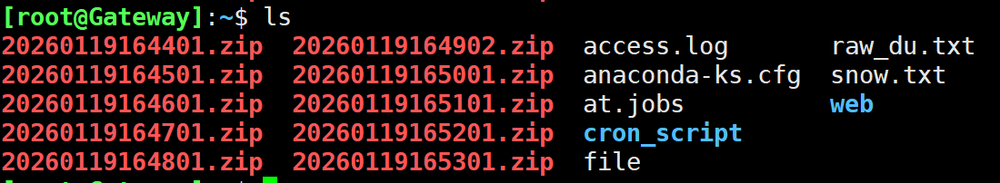

- 计划任务主要是做一些周期性的任务，可以让某个任务按照我们的预期的时间或计划去执行

# 1. 单次调度执行at

- 安装at软件包

```bash
[root@Gateway]:~$ yum install -y at
[root@Gateway]:~$ systemctl enable --now atd
```

- 一些案例

```bash
[root@Gateway]:~$ at now +2min
warning: commands will be executed using /bin/sh
at> echo "今天下雪了" > /root/snow.txt
at> EOT
at> <EOT>
at> <EOT>			# ctrl + d 退出编辑
job 1 at Mon Jan 19 13:48:00 2026
[root@Gateway]:~$ cat snow.txt
今天下雪了

at now +5min			# 从现在开始5分钟后
at teatime tomorrow  # 明天的下午16：00
at noon +4 days		# 4天后的中午
at 11:20 AM			# 早上11：20
  .....
  .....
  
# 对于at任务的时间写法有很多，不需要记忆，用到的时候查询一下就行
```

- 通过文件创建任务

```bash
[root@Gateway]:~$ cat at.jobs
nohup python3 -m http.server > access.log &
[root@Gateway]:~$ at -l				# 查看将要进行的任务列表
[root@Gateway]:~$ at now +1min -f at.jobs		# 到时候执行at.jobs中的任务
warning: commands will be executed using /bin/sh
job 3 at Mon Jan 19 13:58:00 2026
[root@Gateway]:~$ at -l
3	Mon Jan 19 13:58:00 2026 a root

[root@Gateway]:~$ ps aux | grep pthon
root        2159  0.0  0.0   3876  2048 pts/0    S+   13:58   0:00 grep --color=auto pthon

```

# 2. 循环调度执行cron

- 自动周期性执行预定的任务，它非常适合定期运行脚本、备份数据、清理临时文件等一系列重复性任务。
- 服务的概念：
  - 专一性：一个服务往往只做一间事情
  - 持续在线：服务往往一直开着，等待连接
  - 多设备都能用：可以同时服务多台设备

```bash
[root@Gateway]:~$ systemctl start sshd				# 启动服务，sshd使用来远程命令行的服务
[root@Gateway]:~$ systemctl stop sshd				# 停止服务
[root@Gateway]:~$ systemctl restart sshd			# 重启服务
[root@Gateway]:~$ systemctl enable sshd				# 设置自启动，--now，相当于同时start一下
[root@Gateway]:~$ systemctl disable sshd			# 关闭自启动，--now，相当于同时stop一下
[root@Gateway]:~$ systemctl status sshd				# 查看服务的状态，active是启动了，inactive是未启动
[root@Gateway]:~$ systemctl cat sshd				# 查看服务具体做的事情
```


- cron需要周期性运行，时刻检查时间是否符合执行要求，所以也是一个服务，主要是持续在线

```bash
[root@Gateway]:~$ systemctl status crond.service		# 检查服务启动状态
● crond.service - Command Scheduler
     Loaded: loaded (/usr/lib/systemd/system/crond.service; enabled>
     Active: active (running) since Mon 2026-01-19 09:30:24 CST; 4h>
   Main PID: 845 (crond)
      Tasks: 1 (limit: 22951)
     Memory: 1.2M
        CPU: 432ms
     CGroup: /system.slice/crond.service
             └─845 /usr/sbin/crond -n

Jan 19 11:01:01 Gateway CROND[1764]: (root) CMD (run-parts /etc/cro>
Jan 19 11:01:01 Gateway run-parts[1773]: (/etc/cron.hourly) finishe>
Jan 19 12:01:01 Gateway CROND[1962]: (root) CMD (run-parts /etc/cro>
Jan 19 12:01:01 Gateway run-parts[1965]: (/etc/cron.hourly) startin>
Jan 19 12:01:01 Gateway CROND[1961]: (root) CMDEND (run-parts /etc/>
Jan 19 13:01:01 Gateway CROND[2032]: (root) CMD (run-parts /etc/cro>
Jan 19 13:01:01 Gateway run-parts[2041]: (/etc/cron.hourly) finishe>
Jan 19 14:01:01 Gateway CROND[2183]: (root) CMD (run-parts /etc/cro>
Jan 19 14:01:01 Gateway run-parts[2186]: (/etc/cron.hourly) startin>
Jan 19 14:01:01 Gateway CROND[2182]: (root) CMDEND (run-parts /etc/>
...skipping...

```

## 2.1 cron的基础用法

- cron任务的格式如下：

```bash
分 时 日 月 星期 命令
* 表示任何数字都符合
0 2 * * * date >> date.txt		# 每天的2点
0 2 14 * * date >> date.txt		# 每月14号2点
0 2 14 2 * date >> date.txt		# 每年2月14号2点
0 2 * * 5 date >> date.txt		# 每个星期5的2点
0 2 * 6 5 date >> date.txt		# 每年6月份的星期5的2点
0 2 2 * 5 date >> date.txt		# 每月2号或者星期5的2点   星期和日同时存在，那么就是或的关系
0 2 2 6 5 date >> date.txt		# 每年6月2号或者星期5的2点

*/5 * * * * date >> date.txt	# 每隔5分钟执行一次
0 2 1,4,6 * * date >> date.txt	# 每月1号，4号，6号的2点
0 2 5-9 * * date >> date.txt		# 每月5-9号的2点

* * * * * date >> date.txt		# 每分钟
0 * * * * date >> date.txt		# 每整点
* * 2 * * date >> date.txt		# 每月2号的每分钟
```

- 案例
  - 周期性备份一个文件夹，放到压缩包中，要求压缩包以时间命名
  - `crontab -e`有些符号会导致语法错位，执行失败
    - 不能带的符号`+`

```bash
[root@Gateway]:~$ yum install -y zip		# 安装zip工具
[root@Gateway]:~$ zip -r `date %Y%m%d%H%M%S`.zip web/
# date +%Y%m%d%H%M%S 是显示年月日时分秒
# 如果执行命令的时候遇到``包围，就会先执行``内容，将结果变成字符串返回
# zip -r 压缩文件夹

[root@Gateway]:~/cron_script$ vim backup
[root@Gateway]:~$ cat /root/cron_script/backup		# 将备份的命令写在一个文件中
zip -r /root/`date +%Y%m%d%H%M%S`.zip /root/web/
[root@Gateway]:~/cron_script$ chmod +x backup 		# 给于可执行权限
[root@Gateway]:~/cron_script$ ll -h
total 4.0K
-rwxr-xr-x. 1 root root 49 Jan 19 16:36 backup
[root@Gateway]:~$ crontab -e						# 编辑一个计划任务
# 分 时 日 月 星期 命令 命令要注意使用绝对路径,最好把复杂的操作写到一个脚本中
* * * * * bash /root/cron_script/backup

[root@Gateway]:~$ tail -f /var/log/cron				# 如果执行失败了，可以查看日志


```

- 结果如图，可以看到生成的文件并不在web文件夹中，在root下



```bash
[root@Gateway]:~$ vim /root/cron_script/backup 
#!/bin/bash
export PATH=/usr/local/sbin:/usr/local/bin:/sbin:/bin:/usr/sbin:/usr/bin
cd /root
/usr/bin/zip -r /root/web/$(date +\%Y\%m\%d\%H\%M\%S).zip /root/web/	# 应该放到web文件夹

```


