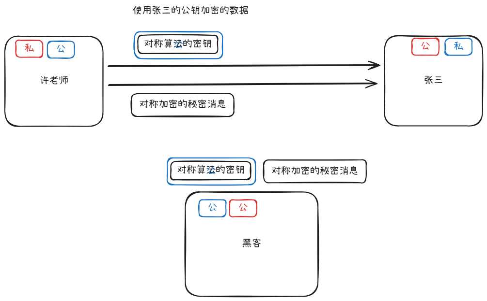
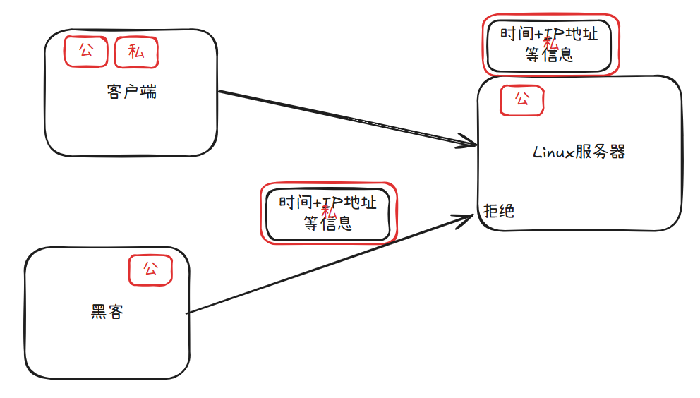
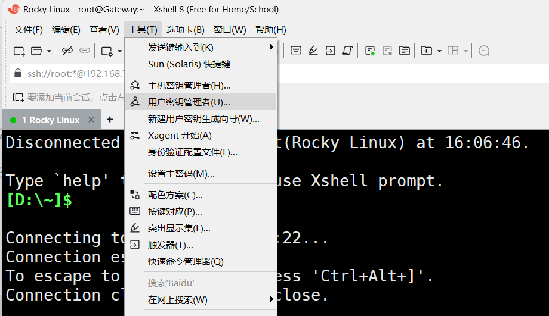
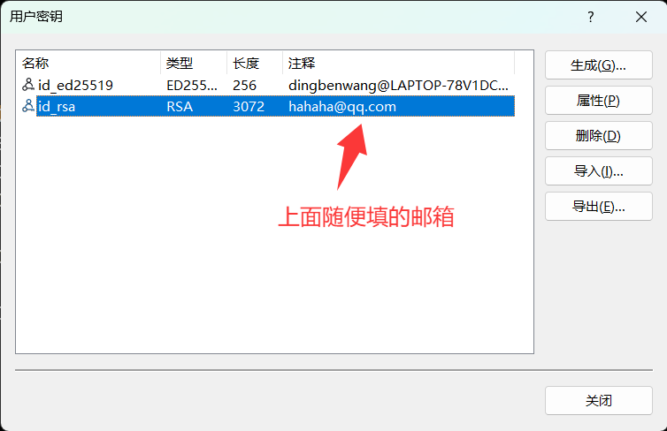
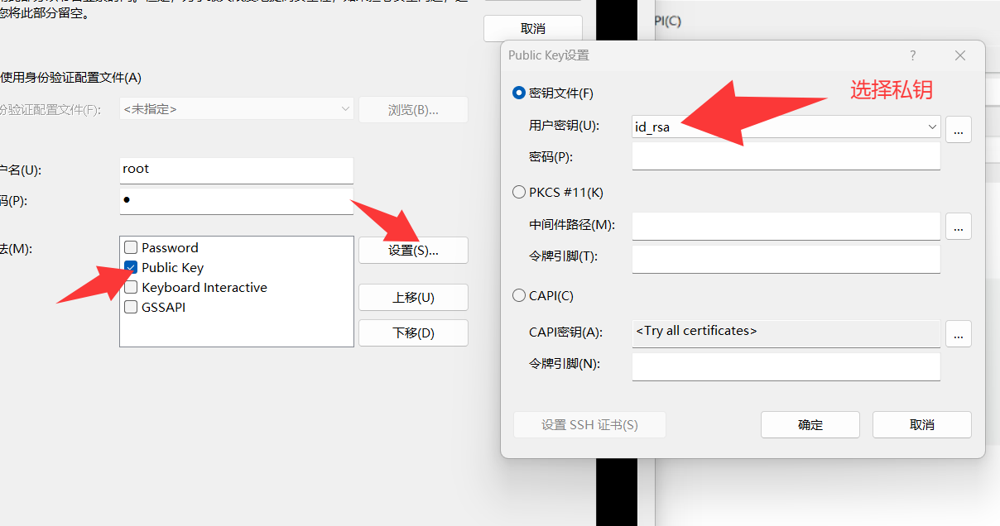

- SSH（Secure Shell）协议是一种网络协议，用于加密方式远程登录到服务器。
- 远程连接服务器有所种方式
  - 第三方工具类
    - todesk
    - 向日葵
    - uu远程
    - rustdesk
    - QQ
    - Parsec
      - 云游戏
    - moonlight
      - 云游戏
  - 系统自带
    - Windows RDP
      - 主要是远程办公
      - 需要自己解决公网问题
    - Linux SSH
      - 命令行连接
      - 需要自己解决公网问题

# 1. ssh配置

- 启动ssh服务

```bash
[root@Gateway]:~$ systemctl start sshd
```

- 相关配置

```bash
/[root@Gateway]:~$ vim /etc/ssh/sshd_config
#Port 22						# 如果不配置，默认是22端口
PermitRootLogin yes			# 允许root登录，默认是不允许
PubkeyAuthentication yes	# 允许使用公钥登录
AuthorizedKeysFile      .ssh/authorized_keys		# 公钥存放位置
Banner /etc/FBI				# ssh登录后，显示的头部提示

[root@Gateway]:~$ systemctl restart sshd		# 修改完配置后需要重启sshd服务生效
```

## 1.1 对称加密算法

- 使用一个密钥+算法，可以对明文内容进行加密，在没有密钥的情况下，即使知道算法，也解不开
- 常见的对称加密算法
  - DES
    - 以现在的计算机算力，几分钟就可以解开
  - 3DES
    - 3遍DES加密
  - AES
    - 目前比较普遍
    - 在线体验：https://the-x.cn/cryptography/Aes.aspx
- 对称加密算法优势
  - 加解密速度极快
  - 在密码足够安全的情况下，无法破解
  - 加密之后的源文长度不会长太多
- 对称加密的缺点
  - 密码一旦丢失，数据等同于明文
- 对称加密算法一般用于文件或者数据的加密

## 1.2 非对称加密算法

- 非对称加密算法会同时产生两个密钥，一个叫密钥，一个叫私钥
  - 公钥加密的数据，只能由私钥解密，公钥自己都解不开
  - 私钥加密的数据，公钥可以解开，只有私钥理论是可以的，私钥可以推算出公钥的内容，但是公钥无法推算出私钥

- 目前非对称加密算法的主流用途如下
  - 加密数据，往往只用来加密对称加密算法的密钥
    - a. 接收者先使用RSA算法产生一对密钥，将公钥方法送给发送者
    - b. 发送者使用接受者的公钥加密对称加密的密码
    - c. 发送使用对称加密的密码加密真实数据发送出去
    - d. 此过程中，黑客即使全程监听，也无法得知任何通信内容，最多得到双方的公钥，但是无法解密



- 数字签名
  1. 客户端使用RSA算法生成一对密钥，然后将公钥复制到Linux上
  2. 客户端使用私钥加密时间IP一次性鉴权字符等信息，发送给服务器
  3. 服务器使用公钥解密数据，验证数据无误，就让客户端直接登录成功
  4. 此过程中，黑客可以得到公钥，以及发送的认证信息并且也可以解密，但是无法重放，也无法修改，因为改完后没有私有加密，服务器不认可



## 1.3 配置密钥登录

1. 生成一对密钥，可以使用windows命令行生成

- 打开cmd，输入如下命令，生成密钥之后，查看公钥内容

```bash
C:\Users\ddd>ssh-keygen -t rsa -C "hahaha@qq.com"
ssh-keygen -t rsa -C "hahaha@qq.com"
Generating public/private rsa key pair.
Enter file in which to save the key (C:\Users\ddd/.ssh/id_rsa):
Created directory 'C:\\Users\\ddd/.ssh'.
Enter passphrase (empty for no passphrase):
Enter same passphrase again:
Your identification has been saved in C:\Users\ddd/.ssh/id_rsa
Your public key has been saved in C:\Users\ddd/.ssh/id_rsa.pub
The key fingerprint is:
SHA256:uK0bZiTQ3iNdvvo8jHvhhe+Lj5/avh73gEo0VnpoTpc hahaha@qq.com
The key's randomart image is:
+---[RSA 3072]----+
|                 |
|   .             |
|  . .   . .      |
|   o o + + .     |
|    + * S.E      |
|     + Xo=..     |
|      =+=+o o    |
|     o.*==.+ o   |
|      ==BO@o  .  |
+----[SHA256]-----+

C:\Users\ddd>notepad C:\Users\ddd/.ssh/id_rsa.pub
```

- 登录Linux，将公钥内容复制过去

```BASH
[root@Gateway]:~$ vim .ssh/authorized_keys
```

- 此时cmd已经可以直接`ssh root@192.168.73.136`登录Linux了，不需要输入密码
- xshell按照如下配置，进入用户密钥管理者



- 导入，找到上面私钥的位置，导入私钥



- 修改Linux在xshell上的认证方式，改成使用公钥



- 这样就可以直接登录了，后续优化关闭密码登录的方式，这样彻底杜绝黑客爆破

```bash
[root@Gateway]:~$ echo "PasswordAuthentication no" >> /etc/ssh/sshd_config
[root@Gateway]:~$ systemctl restart sshd
```

# 2. scp

- scp可以直接在服务器之间传输文件

```bash
[root@Gateway ~]# scp file root@172.16.0.2:/tmp/		# 将当前目录的file文件传到远程服务器的/tmp目录下
[root@Gateway ~]# scp root@172.16.0.2:/tmp/file /root/	# 将远程的文件，复制到本机的/root下
```


