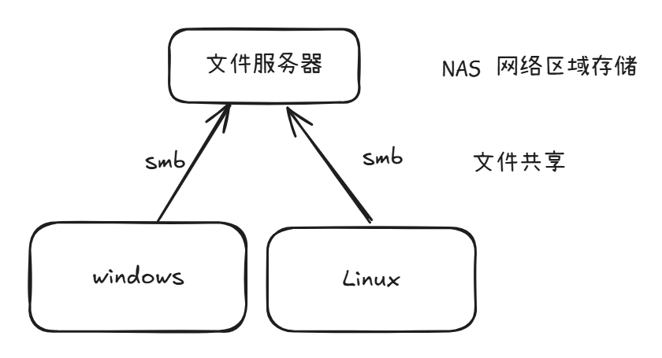
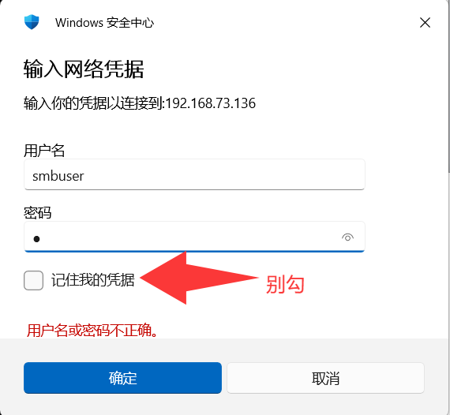
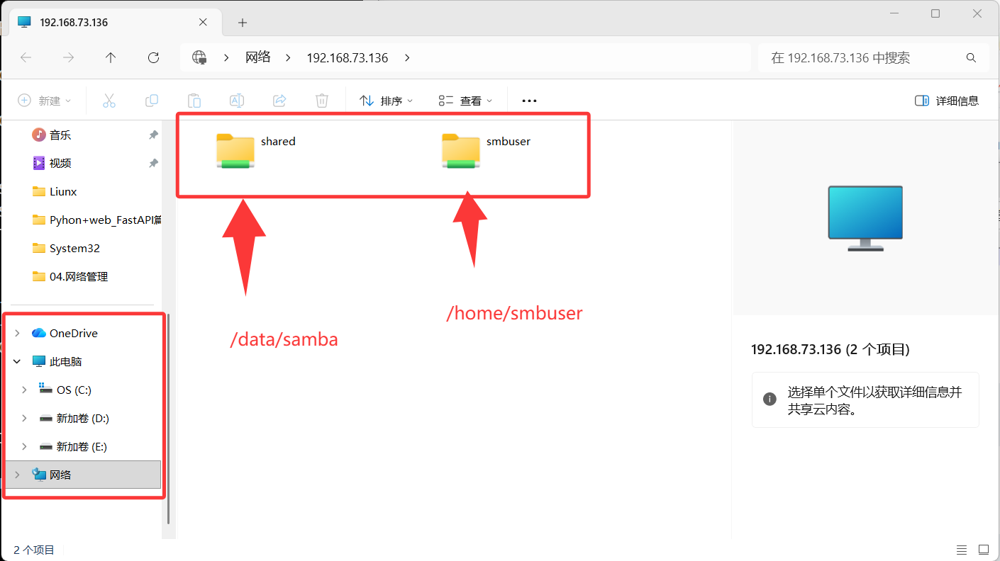
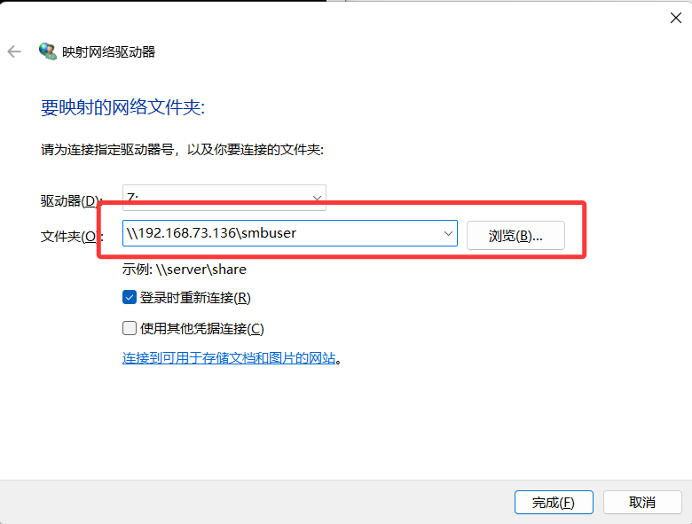
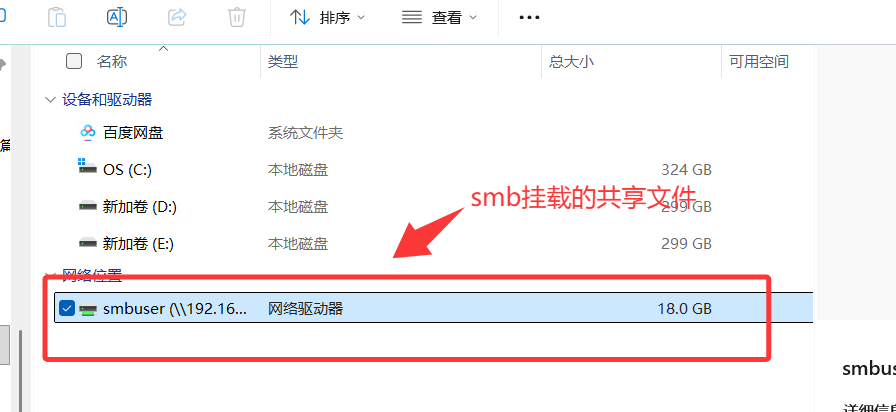
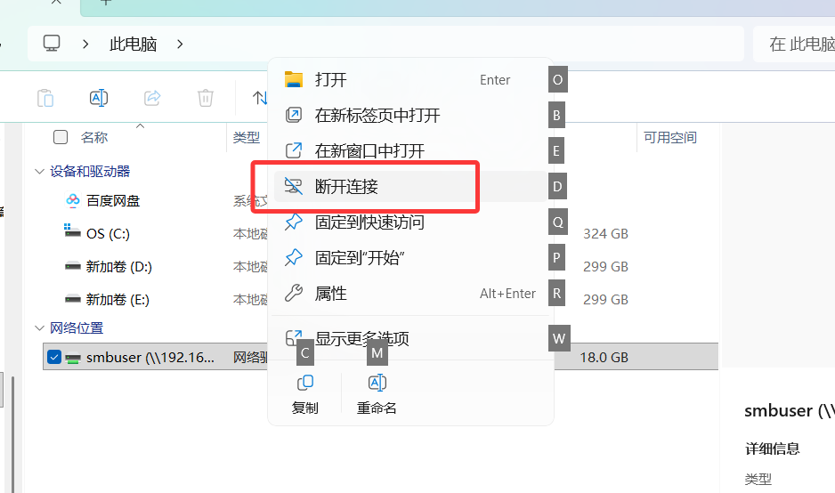
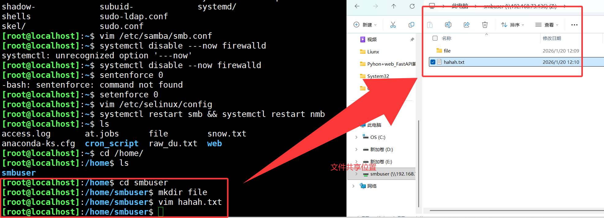
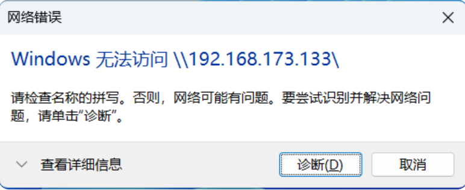
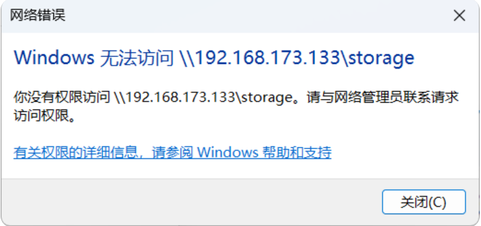

- samba主要是为了可以让文件在多台设备之间共享，samba支持windows和linux



- 相应的端口号

  - **smbd**：提供文件共享和打印服务，TCP：139、445。

  - **nmbd**：负责 NetBIOS 名称解析和浏览功能，UDP：137、138。

# 1. 搭建smb

```bash
[root@localhost]:~$ yum -y install samba
[root@localhost]:~$ systemctl enable --now smb
Created symlink /etc/systemd/system/multi-user.target.wants/smb.service → /usr/lib/systemd/system/smb.service.
[root@localhost]:~$ systemctl enable --now nmb
Created symlink /etc/systemd/system/multi-user.target.wants/nmb.service → /usr/lib/systemd/system/nmb.service.

# 确认服务端口已启动
# n表示显示IP地址不做域名解析，t只显示TCP连接，n只显示UDP连接，l列出处于监听状态的端口，p会显示占用端口的进程信息
[root@localhost]:~$ ss -ntlp |grep "smb"
LISTEN 0      50           0.0.0.0:445       0.0.0.0:*    users:(("smbd",pid=2416,fd=29))
LISTEN 0      50           0.0.0.0:139       0.0.0.0:*    users:(("smbd",pid=2416,fd=30))
LISTEN 0      50              [::]:445          [::]:*    users:(("smbd",pid=2416,fd=27))
LISTEN 0      50              [::]:139          [::]:*    users:(("smbd",pid=2416,fd=28))
[root@localhost]:~$ ss -nulp |grep nmb
UNCONN 0      0        172.16.0.255:137       0.0.0.0:*    users:(("nmbd",pid=2443,fd=19)) 
UNCONN 0      0          172.16.0.1:137       0.0.0.0:*    users:(("nmbd",pid=2443,fd=18)) 
UNCONN 0      0      192.168.73.255:137       0.0.0.0:*    users:(("nmbd",pid=2443,fd=15)) 
UNCONN 0      0      192.168.73.136:137       0.0.0.0:*    users:(("nmbd",pid=2443,fd=14)) 
UNCONN 0      0             0.0.0.0:137       0.0.0.0:*    users:(("nmbd",pid=2443,fd=12)) 
UNCONN 0      0        172.16.0.255:138       0.0.0.0:*    users:(("nmbd",pid=2443,fd=21)) 
UNCONN 0      0          172.16.0.1:138       0.0.0.0:*    users:(("nmbd",pid=2443,fd=20)) 
UNCONN 0      0      192.168.73.255:138       0.0.0.0:*    users:(("nmbd",pid=2443,fd=17)) 
UNCONN 0      0      192.168.73.136:138       0.0.0.0:*    users:(("nmbd",pid=2443,fd=16)) 
UNCONN 0      0             0.0.0.0:138       0.0.0.0:*    users:(("nmbd",pid=2443,fd=13)) 
```

# 2. 配置用户

- samba用户需要是Linux用户，建议使用`/sbin/nologin`此用户不给登录，只是用于文件权限约定

```bash
# 创建系统用户
[root@localhost]:~$ useradd -s /sbin/nologin smbuser	# 创建smbuser，用于后续文件权限约束
[root@localhost]:~$ echo 123 | passwd --stdin smbuser	# 非交互方式修改用户密码，适合自动化脚本
Changing password for user smbuser.
passwd: all authentication tokens updated successfully.

# 创建samba用户
[root@localhost]:~$ smbpasswd -a smbuser			# 添加smbuser，此用户可以登录smb
New SMB password:
Retype new SMB password:
Added user smbuser.
[root@localhost]:~$ smbpasswd -e smbuser			# 启用smbuser
Enabled user smbuser.
[root@localhost]:~$ pdbedit -L -v					# 查看smb用户
---------------
Unix username:        smbuser
NT username:          
Account Flags:        [U          ]
User SID:             S-1-5-21-2854318884-3986082568-2238033842-1000
Primary Group SID:    S-1-5-21-2854318884-3986082568-2238033842-513
Full Name:            
Home Directory:       \\LOCALHOST\smbuser
HomeDir Drive:        
Logon Script:         
Profile Path:         \\LOCALHOST\smbuser\profile
Domain:               LOCALHOST
Account desc:         
Workstations:         
Munged dial:          
Logon time:           0
Logoff time:          Wed, 06 Feb 2036 23:06:39 CST
Kickoff time:         Wed, 06 Feb 2036 23:06:39 CST
Password last set:    Tue, 20 Jan 2026 11:41:18 CST
Password can change:  Tue, 20 Jan 2026 11:41:18 CST
Password must change: never
Last bad password   : 0
Bad password count  : 0
Logon hours         : FFFFFFFFFFFFFFFFFFFFFFFFFFFFFFFFFFFFFFFFFF
[root@localhost]:~$ smbstatus						# 查看smb连接情况等信息

Samba version 4.22.4
PID     Username     Group        Machine                                   Protocol Version  Encryption           Signing              
----------------------------------------------------------------------------------------------------------------------------------------

Service      pid     Machine       Connected at                     Encryption   Signing     
---------------------------------------------------------------------------------------------

No locked files
```

- 管理用户相关命令

```bash
[root@localhost]:~$ smbpasswd smbuser			# 修改smbuser用户密码
New SMB password:
Retype new SMB password:
[root@localhost]:~$ smbpasswd -x smbuser		
# 删除用户
[root@localhost]:~$ smbpasswd -x -u smbuser		# 删除用户，和上面命令用一个就行了
[root@localhost]:~$ pdbedit -L -v				# 查看用户列表
---------------
Unix username:        smbuser
NT username:          
Account Flags:        [U          ]
User SID:             S-1-5-21-2854318884-3986082568-2238033842-1000
Primary Group SID:    S-1-5-21-2854318884-3986082568-2238033842-513
Full Name:            
Home Directory:       \\LOCALHOST\smbuser
HomeDir Drive:        
Logon Script:         
Profile Path:         \\LOCALHOST\smbuser\profile
Domain:               LOCALHOST
Account desc:         
Workstations:         
Munged dial:          
Logon time:           0
Logoff time:          Wed, 06 Feb 2036 23:06:39 CST
Kickoff time:         Wed, 06 Feb 2036 23:06:39 CST
Password last set:    Tue, 20 Jan 2026 11:49:33 CST
Password can change:  Tue, 20 Jan 2026 11:49:33 CST
Password must change: never
Last bad password   : 0
Bad password count  : 0
Logon hours         : FFFFFFFFFFFFFFFFFFFFFFFFFFFFFFFFFFFFFFFFFF
```

# 3. 创建共享

- 创建一个文件夹用于共享，需要配置好对应用户的权限，共享目录为：`/data/samba`
- 在`/etc/samba/smb.conf`配置文件中关联这个文件夹和用户

```bash
[root@localhost]:~$ mkdir -p /data/samba
[root@localhost]:~$ chown -R smbuser:smbuser /data/samba/
[root@localhost]:~$ chmod -R g+s /data/samba/			# 设置sgid，让此文件夹下新建的内容都是smbuser组的

[root@localhost]:~$ vim /etc/samba/smb.conf
......
# 在文件最后新增的内容
[shared]
   path = /data/samba
   browseable = yes
   writable = yes
   valid users = @smbuser
   create mask = 0660
   directory mask = 2770
   
[root@localhost]:~$ systemctl disable --now firewalld	# 关闭防火墙
[root@localhost]:~$ setenforce 0				# 关闭当前的selinux
[root@localhost]:~$ vim /etc/selinux/config 	# 永久关闭selinux
...
SELINUX=disabled
...

# 重启smb和nmb服务
[root@localhost]:~$ systemctl restart smb && systemctl restart nmb	# && 可以连接多个命令，一起执行
```

# 4. 客户端连接

## 4.1 windows连接

- 打开windows的`运行`窗口，输入`\\192.168.73.136`，然后输入用户名密码，就连接上了





- 如果想要挂载smb到电脑上，可以右键`此电脑-映射网络驱动器` ，填入`\\192.168.173.133\smbuser` 地址





- 右键可断开连接





## 4.2 Linux连接

- 使用命令行进行连接，可以上传下载查看共享的文件
  - `put`：将文件上传
  - `get`：获取远程文件
  - `ls`查看远程文件

```bash
[root@Server]:~# yum install -y samba-client		# 安装samba客户端
[root@Server]:~# smbclient -L 172.16.0.1 -U smbuser	# 连接samba服务，可以查看到共享的资源
Password for [SAMBA\smbuser]:

	Sharename       Type      Comment
	---------       ----      -------
	print$          Disk      Printer Drivers
	shared          Disk      
	IPC$            IPC       IPC Service (Samba 4.22.4)
	smbuser         Disk      Home Directories
SMB1 disabled -- no workgroup available
[root@Server]:~# smbclient //172.16.0.1/shared -U smbuser
Password for [SAMBA\smbuser]:
Try "help" to get a list of possible commands.
smb: \> put file				# 上传文件
putting file file as \file (1.1 kb/s) (average 1.1 kb/s)
smb: \> ls
  .                                   D        0  Tue Jan 20 14:32:03 2026
  ..                                  D        0  Tue Jan 20 14:32:03 2026
  file                                A       17  Tue Jan 20 14:32:03 2026

		38744064 blocks of size 1024. 22864128 blocks available
smb: \> get file				# 下载文件
getting file \file of size 17 as file (1.8 KiloBytes/sec) (average 1.8 KiloBytes/sec)


```

- 将远程的共享目录挂到本地，可以长期使用

```bash
[root@Server]:~# yum install -y cifs-utils			# 安装cifs客户端
[root@Server]:~# mkdir /mnt/smb						# 新建一个路径，用于远程共享目录的挂靠
[root@Server]:~# mount -t cifs //172.16.0.1/shared /mnt/smb -o username=smbuser,password=2
# 将远程的//172.16.0.1/shared目录挂载到/mnt/smb
# 挂载后，进入/mnt/smb的操作，相当于操作的远程共享文件
[root@Server]:/mnt/smb# vi hhahaha.txt
[root@Server]:/mnt/smb# ls
file  hhahaha.txt
smb: \> ls
  .                                   D        0  Tue Jan 20 14:53:44 2026
  ..                                  D        0  Tue Jan 20 14:53:44 2026
  file                                A       17  Tue Jan 20 14:32:03 2026
  hhahaha.txt                         A       52  Tue Jan 20 14:53:44 2026

		38744064 blocks of size 1024. 22863584 blocks available

[root@Server]:~# umount /mnt/smb/					# 断开连接


[root@Server]:~# df -h								# 查看Linux当前挂载的分区
Filesystem           Size  Used Avail Use% Mounted on
devtmpfs             4.0M     0  4.0M   0% /dev
tmpfs                1.8G     0  1.8G   0% /dev/shm
tmpfs                726M  9.1M  717M   2% /run
/dev/mapper/rl-root   37G  1.5G   36G   5% /
/dev/nvme0n1p1       960M  226M  735M  24% /boot
/dev/mapper/rl-home   19G  161M   18G   1% /home
tmpfs                363M     0  363M   0% /run/user/0
//172.16.0.1/shared   37G   16G   22G  41% /mnt/smb

# 可选，如果要让此smb分区在每次开机的时候，自动挂上，需要写入配置文件
[root@Server]:~# vim /etc/fstab

....
# 在最后一行追加
//172.16.0.1/shared /mnt/smb cifs defaults,username=smbuser,password=2 0 0

[root@Server]:~# mount -a
```

- 小工具推荐，btop，可以实时查看CPU，内存，硬盘，网速等信息

```bash
yum -y install epel-release			# 安装扩软软件仓库，btop不在标准的软件仓库
yum -y install btop
btop								# 启动命令

vim ~/.config/btop/btop.conf		# 配置文件位置
....
net_iface = "ens224"				# 如果网卡流量不准确，可以指定监控特定的网卡
....
```

# 5. 多用户

- 在实际的情况中，会出现不同的部门，需要共享不同的目录，登录不同的账号

## 5.1 创建用户

- 创建三个samba用户，分别为smb1、smb2、smb3。密码均为：123

```bash
# 创建三个用户，不需要家目录，也不需要登录
[root@localhost]:~$ useradd -s /sbin/nologin -r smb1
[root@localhost]:~$ useradd -s /sbin/nologin -r smb2
[root@localhost]:~$ useradd -s /sbin/nologin -r smb3

# 配置好smb用户的密码
[root@localhost]:~$ smbpasswd -a smb1
New SMB password:
Retype new SMB password:
Added user smb1.
[root@localhost]:~$ smbpasswd -a smb2
New SMB password:
Retype new SMB password:
Added user smb2.
[root@localhost]:~$ smbpasswd -a smb3
New SMB password:
Retype new SMB password:
Added user smb3.

# 启用三个用户
[root@localhost]:~$ smbpasswd -e smb1
Enabled user smb1.
[root@localhost]:~$ smbpasswd -e smb2
Enabled user smb2.
[root@localhost]:~$ smbpasswd -e smb3
Enabled user smb3.

# 查看已经启用的用户
[root@localhost]:~$ pdbedit -L
smbuser:1000:
smb2:995:
smb1:996:
smb3:994:
```

- 修改samba的配置

```bash
[root@localhost]:~$ vim /etc/samba/smb.conf
[global]
        config file = /etc/samba/conf.d/%U
        ......
....

[share]
        path = /data/samba/share
        browseable = yes
        writable = yes
        Guest ok = yes
        create mask = 0660
        directory mask = 2770

# 全局配置下的 config file = /etc/samba/conf.d/%U 去此目录下读取每个用户的子配置文件
# 如果/etc/samba/conf.d/能匹配到对应的用户名，那么对应用户就直接按照子配置文件来
```

- 创建对应的目录与测试文件

```bash
[root@localhost]:~$ mkdir -p /data/samba/share /data/samba/smb{1..3}
[root@localhost]:~$ cd /data/samba/
[root@localhost]:/data/samba$ ls
file  hhahaha.txt  share  smb1  smb2  smb3
[root@localhost]:/data/samba$ touch share.txt
[root@localhost]:/data/samba$ touch smb{1..3}/test.txt
[root@localhost]:/data/samba$ tree
.
├── file
├── hhahaha.txt
├── share
├── share.txt
├── smb1
│   └── test.txt
├── smb2
│   └── test.txt
└── smb3
    └── test.txt

4 directories, 6 files
[root@localhost]:~$ touch /data/samba/smb1/smb1.txt
[root@localhost]:~$ touch /data/samba/smb2/smb2.txt
[root@localhost]:~$ touch /data/samba/smb3/smb3.txt
root@localhost]:/data/samba$ tree
.
├── file
├── hhahaha.txt
├── share
├── share.txt
├── smb1
│   ├── smb1.txt
│   └── test.txt
├── smb2
│   ├── smb2.txt
│   └── test.txt
└── smb3
    ├── smb3.txt
    └── test.txt

4 directories, 9 files

[root@localhost]:/data/samba$ chown -R smb1:smb1 smb1
[root@localhost]:/data/samba$ chown -R smb2:smb2 smb2
[root@localhost]:/data/samba$ chown -R smb3:smb3 smb3
[root@localhost]:/data/samba$ chmod 2777 -R /data/samba		# 赋予权限
```

- 为每个用户创建专属的配置文件，针对smb1用户和smb2用户单独编辑配置文件,smb3用户只给访问shared，其他可以访问对应的用户名目录

```bash
[root@localhost]:/data/samba$ mkdir -p /etc/samba/conf.d
[root@localhost]:/data/samba$ vim /etc/samba/conf.d/smb1
[share]
        path = /data/samba/smb1
        writable = yes
        create mask = 0660
[root@localhost]:/data/samba$ vim /etc/samba/conf.d/smb2
[share]
        path = /data/samba/smb2
        writable = no
        create mask = 0660
        browseable = yes
```

- 重启相关服务

```bash
[root@localhost]:~$ systemctl restart smb && systemctl restart nmb
```

## 5.2 客户端测试

```bash
[root@Server]:~# smbclient //172.16.0.1/share -U smb1
Password for [SAMBA\smb1]:
Try "help" to get a list of possible commands.
smb: \> ls
  .                                   D        0  Tue Jan 20 15:33:27 2026
  ..                                  D        0  Tue Jan 20 15:33:27 2026
  test.txt                            N        0  Tue Jan 20 15:16:04 2026
  smb1.txt                            N        0  Tue Jan 20 15:33:27 2026

		38744064 blocks of size 1024. 22863132 blocks available
# 实际目录是远程主机的/data/samba/smb1

[root@Server]:~# smbclient //172.16.0.1/share -U smb2
Password for [SAMBA\smb2]:
Try "help" to get a list of possible commands.
smb: \> ls
  .                                   D        0  Tue Jan 20 15:33:34 2026
  ..                                  D        0  Tue Jan 20 15:33:34 2026
  test.txt                            N        0  Tue Jan 20 15:16:04 2026
  smb2.txt                            N        0  Tue Jan 20 15:33:34 2026

		38744064 blocks of size 1024. 22863132 blocks available
# 实际目录是远程主机的/data/samba/smb2 但是没有权限修改，只能下载东西

[root@Server]:~# smbclient //172.16.0.1/share smb3
Anonymous login successful
Try "help" to get a list of possible commands.
smb: \> ls
  .                                   D        0  Tue Jan 20 15:14:58 2026
  ..                                  D        0  Tue Jan 20 15:14:58 2026

		38744064 blocks of size 1024. 22863132 blocks available
# 实际目录是远程主机的/data/samba/share
```

- 检查

```bash
ss -nlt		# 检查tcp端口号
ss -nlu		# 检查udp端口号
ss -ntlp    # 检查http
```

# 6. 排错思路

## 6.1 网络错误



- 1. 网络是否可达
  2. 防火墙策略
  3. 服务是否启动

## 6.2 目录不给进入



- 1. 检查配置文件，是否配置`browseable`权限
  2. 检查文件夹权限，当前用户是否可以进入
  3. 检测`selinux`是否允许将目标文件夹作为smb使用

## 6.3 文件无法保存

- 1. 查看文件的权限
  2. 查看磁盘是否满了
     1. df 
