# 1. HTTP协议

- HTTP是web服务器和浏览器之间传输数据使用的协议
- HTTP的工作过程可以总结为以下几个步骤：
  1. **建立连接：** 客户端（如浏览器）与服务器之间通过TCP三次握手建立连接。
  2. **发送请求：** 客户端向服务器(Apache、Nginx、IIS服务器)发送HTTP请求报文，请求资源或操作。
  3. **服务器处理请求：** HTTP服务器接收到请求后，处理请求并生成响应。
  4. **返回响应：** 服务器将响应报文返回给客户端。
  5. **断开连接：** 通常在响应完成后关闭TCP连接（HTTP/1.0默认短连接，HTTP/1.1支持长连接）。


- 请求消息中往往会携带需要请求的资源定位也就是统一资源标识符，统一资源标识符(URI Uniform Resource Identifier)
- URL 是 URI 的子集，URI是包含URL和URN
  - URL(Uniform Resource Locator)：不仅标识资源，还提供了**访问资源的地址和方法**
  - URN(Uniform Resource Name)：只关注资源是谁，但是去哪里访问是不知道的

## 1.1 注意事项

1. HTTP 是无连接：无连接的含义是限制每次连接只处理一个请求。服务器处理完客户的请求，并收到客户的应答后，即断开连接。采用这种方式可以节省传输时间。
2. HTTP 是媒体独立的：这意味着，只要客户端和服务器知道如何处理的数据内容，任何类型的数据都可以通过 HTTP 发送。客户端以及服务器指定使用适合的 MIME-type 内容类型。
3. HTTP 是无状态：HTTP协议是无状态协议。无状态是指协议对于事务处理没有记忆能力。缺少状态意味着如果后续处理需要前面的信息，则它必须重传，这样可能导致每次连接传送的数据量增大。另一方面，在服务器不需要先前信息时它的应答就较快。

## 1.2 HTTP 消息结构

### 1.2.1 请求消息结构

- 客户端发送一个 HTTP 请求到服务器的请求消息包括以下格式：

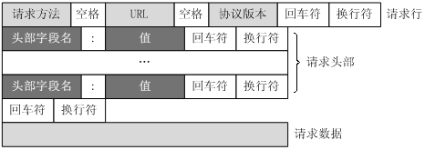

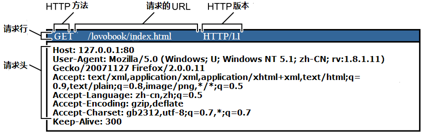

- 常见头部字段名
  - `Host` ：目的主机的域名/IP
  - `Connection` : 是否长连接
  - `User-Agent`：浏览器的信息
  - `Cookie` : 浏览器携带的备注信息给服务器看的，往往包含登录成功的认证信息

### 1.2.2 响应消息结构

- 服务的相应信息格式如下：


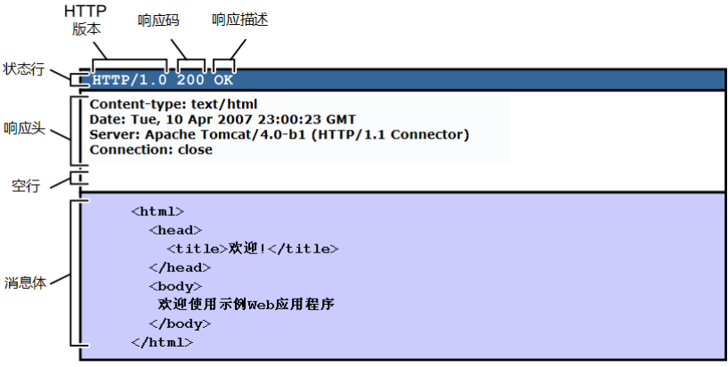

- 状态码
  - 100-199: 请求已收到，但是没处理完，别着急
  - 200-299：正常的响应结果
    - 200 OK
  - 300-399：重定向，如果需要继续访问，需要换个地方
    - 301：资源的**永久位置变更**，原 URL 废弃
    - 302：资源的**临时位置变更**，原 URL 仍有效
    - 304：资源没有变化，使用上一次访问的缓存
  - 400-499：请求的资源的URL不正确
    - 401：认证失败
    - 403：没有权限响应
    - 404：请求的资源不存在
  - 500-599：服务器出现了问题，无法提供服务
    - 503：服务器当前不能处理客户端的请求，一段时间后可能恢复正常

# 2. Apache

- web服务器是根据http协议的服务端软件
- 目前全球排名最高的是Nginx
- Apache专注于http功能，Nginx什么都能干，简直变形金刚

## 2.1 安装部署

- RockyLinux软件仓库中存在此软件包，可以直接通过yum进行安装
- ubuntu中软件包名不一样，`apt -y install apache2`

```bash
[root@localhost]:~$ yum install -y httpd		# 在ubuntu中，软件包叫做apache2
[root@localhost]:~$ systemctl enable --now httpd
Created symlink /etc/systemd/system/multi-user.target.wants/httpd.service → /usr/lib/systemd/system/httpd.service.
[root@localhost]:~$ httpd -v
Server version: Apache/2.4.62 (Rocky Linux)
Server built:   Dec 12 2025 00:00:00
```

## 2.2 网站根目录

- web server启动后，浏览器访问的时候会从某个目录中将资源相应浏览器，这个目录就是网站目录
- apache默认的网站根目录在`/var/www/html`，如果此目录下没有索引文件，默认会响应HTTP Server Test Page
- 默认情况下，在访问一个路径的时候，会到路径下找`index.html`文件

```bash
[root@localhost]:~$ cd /var/www/html/
[root@localhost]:/var/www/html$ ls
index.html
[root@localhost]:/var/www/html$ cat index.html
snow
```

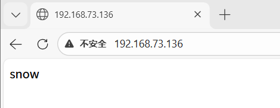

- 如果要访问非index.html文件，那么需要写清楚URL路径

```bash
[root@localhost]:/var/www/html$ mkdir admin
[root@localhost]:/var/www/html$ echo "admin is online" > admin/adimin.html
```

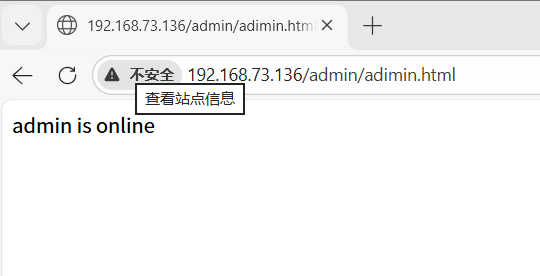

## 2.3 相关配置文件

| 文件                       | 说明                 |
| :------------------------- | :------------------- |
| /etc/httpd/conf/httpd.conf | 主配置文件           |
| /etc/httpd/conf.d/         | 存放虚拟主机配置文件 |
| /etc/httpd/conf.modules.d/ | 存放模块配置文件     |
| /etc/httpd/modules/        | 存放模块文件         |
| /var/log/httpd/            | 存放日志文件         |
| /var/www/html/             | 存放默认的网页文件   |

## 2.4 虚拟主机

- apache可以根据请求的域名不一样，响应不同的网站目录中的文件
  - FQDN即完全限定域名，互联网中可以**唯一标识一台主机**的完整域名，包含了主机名、各级域名和根域名，能够直接映射到对应的 IP 地址。
  - `website1.iproute.cn`：梦幻花园风格
  - `website2.iproute.cn`：星际穿越风格
  - `website3.iproute.cn`：艺术画廊风格


```bash
[root@localhost]:/var/www/html$ cat << EOF > /etc/httpd/conf.d/site.conf
# vhost01
<Virtualhost *:80>
   ServerName website1.iproute.cn
   Documentroot /data/website1/
   <Directory /data/website1>
      Require all granted
   </Directory>
</Virtualhost>

# vhost02
<Virtualhost *:80>
   ServerName website2.iproute.cn
   Documentroot /data/website2/
   <Directory /data/website2>
      Require all granted
   </Directory>
</Virtualhost>

# vhost03
<Virtualhost *:80>
   ServerName website3.iproute.cn
   Documentroot /data/website3/
   <Directory /data/website3>
      Require all granted
   </Directory>
</Virtualhost>
EOF

[root@localhost]:~$ mkdir -p /data/website{1..3}
[root@localhost]:~$ systemctl restart httpd
```

- 为了本地模拟，需要修改我们的电脑，认为`website{1..3}.iproute.cn`网址是指向虚拟机的，可以修改hosts文件，因为hosts文件被篡改可能导致被钓鱼盗号等等，所以这个文件修改需要管理员身份。在开始菜单搜索cmd，右键以管理员身份运行


- 使用命令打开hosts文件，只有这样做，才有管理员权限，才能编辑这个文件，要保存！！！

```bash
C:\Windows\System32>notepad drivers\etc\hosts

...
192.168.73.136 website1.iproute.cn
192.168.73.136 website2.iproute.cn
192.168.73.136 website3.iproute.cn
```

- 页面访问结果


## 2.5 keepalive持久连接

- 每个资源获取完成后不会断开连接，而是继续等待其它的请求完成，默认是开启持久连接。当开启持久连接后的断开条件是以超时时间为限制，默认为5s。

```bash
# 默认开启进行测试验证，三次请求，都是一个连接
[root@localhost ~]# curl -v http://127.0.0.1  http://127.0.0.1 http://127.0.0.1
[root@localhost ~]# ss -tan | grep 80
TIME-WAIT 0      0               127.0.0.1:39486          127.0.0.1:80

# 关闭后进行测试验证，三次请求，分开为三个连接
[root@localhost ~]# echo "Keepalive Off" > /etc/httpd/conf.d/kp.conf
[root@localhost ~]#  ss -tan | grep 80
TIME-WAIT 0      0      [::ffff:127.0.0.1]:80   [::ffff:127.0.0.1]:33352
TIME-WAIT 0      0      [::ffff:127.0.0.1]:80   [::ffff:127.0.0.1]:33342
TIME-WAIT 0      0      [::ffff:127.0.0.1]:80   [::ffff:127.0.0.1]:33330

# 可以ab压力测试，没开启keepalive的时候，压力比较大
# 目前的apache默认的mpm模块是event支持上万并发，效果不明显，top -d 1可以查看cpu占用
[root@localhost ~]# ab -c 1000 -n 10000 http://127.0.0.1/
# -c	即concurrency，用于指定的并发数
# -n	即requests，用于指定压力测试总共的执行次数
```

## 2.6 服务日志

- httpd 有两种常见日志类型：访问日志和错误日志，错误日志使用标准 syslog 级别，按严重性递增排序。
- https://httpd.apache.org/docs/current/mod/core.html#loglevel

```bash
[root@localhost]:~$ grep -A27 '<IfModule log_config_module>' /etc/httpd/conf/httpd.conf 

<IfModule log_config_module>
    #
    # The following directives define some format nicknames for use with
    # a CustomLog directive (see below).
    #
    # LogFormat定义的是日志格式，最后是当前格式名称
	# 日志格式变量的含义：https://httpd.apache.org/docs/current/mod/mod_log_config.html#logformat
    LogFormat "%h %l %u %t \"%r\" %>s %b \"%{Referer}i\" \"%{User-Agent}i\"" combined
    LogFormat "%h %l %u %t \"%r\" %>s %b" common

    <IfModule logio_module>
      # You need to enable mod_logio.c to use %I and %O
      LogFormat "%h %l %u %t \"%r\" %>s %b \"%{Referer}i\" \"%{User-Agent}i\" %I %O" combinedio
    </IfModule>

    #
    # The location and format of the access logfile (Common Logfile Format).
    # If you do not define any access logfiles within a <VirtualHost>
    # container, they will be logged here.  Contrariwise, if you *do*
    # define per-<VirtualHost> access logfiles, transactions will be
    # logged therein and *not* in this file.
    #
    #CustomLog "logs/access_log" common

    #
    # If you prefer a logfile with access, agent, and referer information
    # (Combined Logfile Format) you can use the following directive.
    #
    # 指定日志的位置
    CustomLog "logs/access_log" combined
</IfModule>

```

- 新增自定义 LogFormat 并在 CustomLog 中引用，使得在日志中可以看到被访问的文件路径
- 推荐在日志中记录访问文件的位置

```bash
[root@localhost]:~$ vim /etc/httpd/conf/httpd.conf 
[root@localhost]:~$ grep -A6 '<IfModule log_config_module>' /etc/httpd/conf/httpd.conf 
<IfModule log_config_module>
    #
    # The following directives define some format nicknames for use with
    # a CustomLog directive (see below).
    #
    LogFormat "%h %l %u %t \"%r\" %>s %b \"%{Referer}i\" \"%{User-Agent}i\"" combined
    LogFormat "%h %l %u %t \"%r\" %>s %b \"%{Referer}i\" \"%{User-Agent}i\" \"%f\"" mycombined
...
    CustomLog "logs/access_log" mycombined		# 注意这里要改为对应的名称
```

- 查看日志

```bash
[root@localhost]:~$ tail -f /var/log/httpd/access_log

192.168.73.1 - - [22/Jan/2026:13:16:53 +0800] "GET / HTTP/1.1" 304 - "-" "Mozilla/5.0 (Windows NT 10.0; Win64; x64) AppleWebKit/537.36 (KHTML, like Gecko) Chrome/144.0.0.0 Safari/537.36 Edg/144.0.0.0" "/data/website1/index.html"
192.168.73.1 - - [22/Jan/2026:13:17:04 +0800] "GET / HTTP/1.1" 304 - "-" "Mozilla/5.0 (Windows NT 10.0; Win64; x64) AppleWebKit/537.36 (KHTML, like Gecko) Chrome/144.0.0.0 Safari/537.36 Edg/144.0.0.0" "/data/website2/index.html"
192.168.73.1 - - [22/Jan/2026:13:17:13 +0800] "GET / HTTP/1.1" 304 - "-" "Mozilla/5.0 (Windows NT 10.0; Win64; x64) AppleWebKit/537.36 (KHTML, like Gecko) Chrome/144.0.0.0 Safari/537.36 Edg/144.0.0.0" "/data/website3/index.html"
```

## 2.7 URI匹配规则

Apache httpd的URL匹配规则主要包括以下几种指令:

1. `<Location>`: 基于URL路径进行匹配。
2. `<LocationMatch>`: 使用正则表达式进行URL路径匹配。
3. `<Directory>`: 基于服务器文件系统的目录路径进行匹配。
4. `<DirectoryMatch>`: 使用正则表达式进行目录路径匹配。
5. `<Files>`: 基于文件名进行匹配。
6. `<FilesMatch>`: 使用正则表达式进行文件名匹配。

**优先级：**

这些指令的优先级从高到低为:

1. `<Files>` 和 `<FilesMatch>`
2. `<Directory>` 和 `<DirectoryMatch>`
3. `<Location>` 和 `<LocationMatch>`

**指令常用选项：**

1. `<Location>` 指令:
   - `path`: 指定需要匹配的 URL 路径。可以使用通配符
   - `Require`: 指定需要通过身份验证才能访问的用户或组
2. `<LocationMatch>` 指令:
   - `regex`: 指定一个正则表达式来匹配 URL。
   - 其他选项同 `<Location>` 指令。
3. `<Directory>` 指令:
   - `path`: 指定需要匹配的目录路径。可以使用通配符。
   - `Options`: 设置目录的访问选项,如 `FollowSymLinks`、`Indexes` 等。
   - `AllowOverride`: 控制 .htaccess 文件的覆盖范围。
   - 其他选项同 `<Location>` 指令。
4. `<Files>` 指令:
   - `filename`: 指定需要匹配的文件名。可以使用通配符。
   - 其他选项同 `<Location>` 指令。
5. `<FilesMatch>` 指令:
   - `regex`: 指定一个正则表达式来匹配文件名。
   - 其他选项同 `<Files>` 指令

```bash
[root@localhost]:~$ mkdir -pv /data/site04/public
mkdir: created directory '/data/site04'
mkdir: created directory '/data/site04/public'
[root@localhost]:~$ touch /data/site04/public/{1,2,3}.html
[root@localhost]:~$ ln -s /etc/passwd /data/site04/public/passwd.txt

[root@localhost]:~$ tree /data/site04
/data/site04
├── admin
│   ├── dir
│   │   └── index.html
│   └── index.html
└── public
    ├── 1.html
    ├── 2.html
    ├── 3.html
    └── passwd.txt -> /etc/passwd

3 directories, 6 files

[root@localhost]:~$ vim /etc/httpd/conf.d/site.conf
Listen 8001
<Virtualhost *:8001>
   Documentroot /data/site04
	
	# 访问此网站的public文件夹的规则
   <Directory /data/site04/public>
      Options Indexs FollowSymLinks
      Require all granted
   </Directory>

	# 访问此网站的/admin路径的时候，此路径指的是URL中的路径
   <Location "/admin">
      AuthType Basic
      AuthName "Admin Area"
      AuthUserFile "/etc/httpd/.htpasswd"
      Require valid-user
   </Location>
</Virtualhost>
```

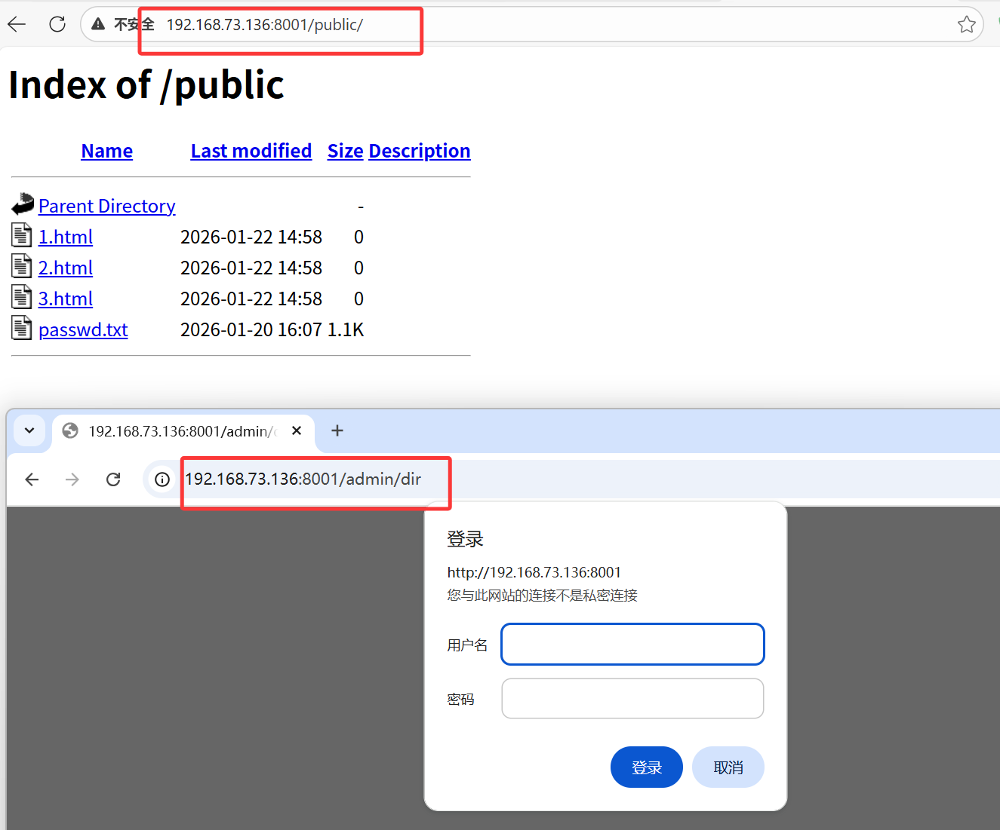

## 2.8 Options指令

| 选项                 | 功能说明                                                     | 适用场景                       |
| -------------------- | ------------------------------------------------------------ | ------------------------------ |
| Indexes              | 当目录无默认文件（如 index.html）时，自动生成文件列表        | 开发环境调试，生产慎用         |
| FollowSymLinks       | 允许通过符号链接访问目录外资源（在 `<Location>` 中无效）     | 跨目录资源整合                 |
| MultiViews           | 内容协商：根据请求头（如语言）自动匹配文件（需 mod_negotiation） | 多语言站点适配                 |
| ExecCGI              | 允许执行 CGI 脚本（需 mod_cgi）                              | 动态脚本处理（如 Perl/Python） |
| Includes             | 启用服务端包含（SSI）（需 mod_include）                      | 动态页面片段嵌入               |
| IncludesNOEXEC       | 允许 SSI 但禁用 `#exec` 执行命令/CGI                         | 安全限制下的 SSI 功能          |
| SymLinksIfOwnerMatch | 仅当符号链接与目标文件所有者相同时允许访问（在 `<Location>` 中无效） | 高安全要求的共享环境           |
| All                  | 启用除 `MultiViews` 外的所有特性（默认值）                   | 快速启用常用功能               |
| None                 | 禁用所有额外特性                                             | 严格安全策略                   |

- Indexes
  - 访问的目录没有默认的主页文件(index.html)，会显示403，意思是没权限列出当前的文件列表，options中设置Indexes就可以了
- FollowSymLinks
  - 在列出的文件列表中，如果有软链接，会跟着软链接跳转到系统的任何地方，关闭这个，就不给使用软链接了

## 2.9 AllowOverride指令

用于控制是否允许在 .htaccess 文件中覆盖主配置文件的设定，通常用于目录级的动态配置，无需重启服务即可生效。作用域限制为：仅能在 `<Directory>` 块中生效，在 `<Location>`、`<Files>` 等配置段中无效。

**常用参数**

| 参数值        | 说明                                                         |
| ------------- | ------------------------------------------------------------ |
| None          | 完全忽略 .htaccess 文件，服务器不读取其内容（默认推荐，提升性能与安全性）。 |
| All           | 允许 .htaccess 覆盖所有支持的指令（需谨慎启用，可能引发安全风险）。 |
| AuthConfig    | 允许覆盖认证相关指令（如 AuthName, Require）。               |
| FileInfo      | 允许覆盖文件处理指令（如 ErrorDocument, RewriteRule, Header）。 |
| Indexes       | 允许覆盖目录索引控制指令（如 DirectoryIndex, IndexIgnore）。 |
| Limit         | 允许覆盖访问控制指令（如 Allow, Deny, Order）。              |
| Options[=...] | 允许覆盖目录特性控制指令（如 Options FollowSymLinks，可指定具体允许的选项）。 |

```bash
[root@localhost]:~$ mkdir -pv /data/site05/public
mkdir: created directory '/data/site05'
mkdir: created directory '/data/site05/public'
[root@localhost]:~$ touch /data/site05/public/{1,2,3}.html
[root@localhost]:~$ cat << EOF > /etc/httpd/conf.d/site02.conf
Listen 8002
<Virtualhost *:8002>
   Documentroot /data/site05
   <Directory /data/site05/public>
      AllowOverride Options=Indexes
      Require all granted
   </Directory>
</Virtualhost>
EOF
[root@localhost]:~$ systemctl restart httpd
# 通过浏览器访问：禁止访问
# 通过 .htaccess 文件覆盖设定
[root@localhost]:~$ echo "Options Indexes" > /data/site05/public/.htaccess
# 通过浏览器访问测试验证
```

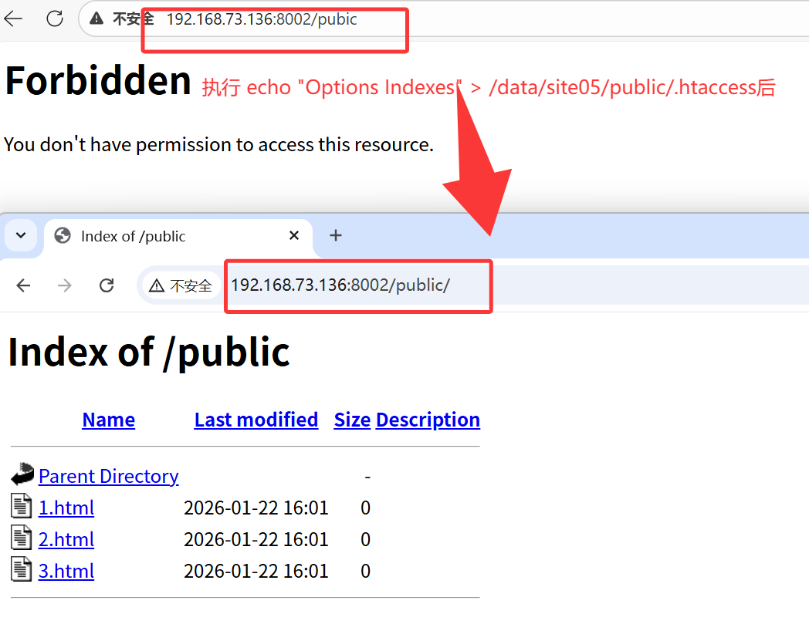

## 2.10 访问控制

基于客户端IP地址的访问控制：

- Apache 2.4 默认 **拒绝所有未显式授权** 的访问，需明确配置 `Require all granted` 开放全局访问
- `Require host` 可基于域名控制（如 Require host [example.com](http://example.com/)），但需注意 DNS 解析延迟可能影响性能
- 不带 `not` 的多个 `Require` 是“或”关系（任一满足即可）
- 带 `not` 和不带 `not` 的语句混合时是“与”关系（需同时满足）

常见语法：

- 允许所有主机访问：`Require all granted`
- 拒绝所有主机访问：`Require all denied`
- 授权/拒绝指定来源的IP/host访问：`Require [not] <ip|host>  <ipaddress|hostname>`

组合策略配置：

- `<RequireAll>` 内部所有条件必须同时满足（逻辑与）
- `<RequireAny>` 内部任一条件满足即可（逻辑或）

基于用户的访问控制主要通过身份验证（Authentication）和授权（Authorization）机制实现：

**认证类型**：

- Basic 认证：用户名密码以 Base64 编码传输（明文，需配合 HTTPS 保证安全）
- Digest 认证：密码哈希传输（更安全，但配置复杂）

**核心配置指令**：

- AuthName：定义认证区域名称（浏览器弹窗提示文本）
- AuthUserFile：指定存储用户名密码的文本文件路径（如 .htpasswd）
- Require：授权规则（如 valid-user 允许所有认证用户，或指定用户/组）

```bash
[root@localhost]:~$ mkdir -pv /data/site06/admin
mkdir: created directory '/data/site06'
mkdir: created directory '/data/site06/admin'
[root@localhost]:~$ echo "This is NO.6 website!" > /data/site06/admin/index.html
[root@localhost]:~$ htpasswd -c /etc/httpd/.htpasswd user1	# 加-c是覆盖原有的
New password: 
Re-type new password: 
Adding password for user user1
[root@localhost]:~$ htpasswd /etc/httpd/.htpasswd user2
New password: 
Re-type new password: 
Adding password for user user2
[root@localhost]:~$  cat << EOF > /etc/httpd/conf.d/site06.conf
Listen 8006
<Virtualhost *:8006>
   Documentroot /data/site06
   <Directory /data/site06/admin>
      AuthType Basic
      AuthName "FBI warning"
      AuthUserFile "/etc/httpd/.htpasswd"
      <RequireAll>
         Require user user1
         # 客户端主机地址
         Require ip 192.168.73.1 # 与直接空格加ip即可，也可以是一个网段
         # 同时满足IP和用户认证
      </RequireAll>
   </Directory>
</Virtualhost>
EOF
[root@localhost]:~$ systemctl restart httpd
# 测试验证
# 如果不加本地ip则本地主机访问 403
# 加入本地ip即可正常访问
```

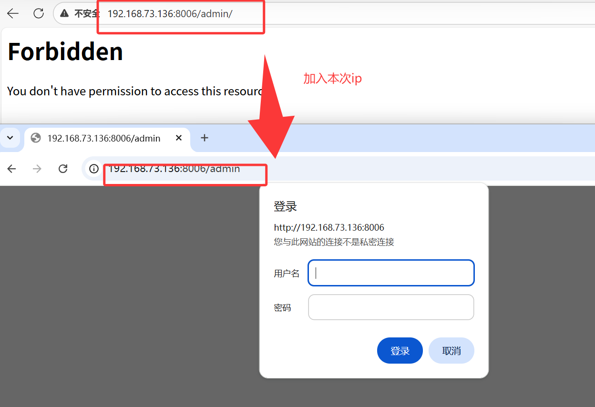

## 2.11 别名和重定向

**别名（Alias） 和 重定向（Redirect） 是两种不同的 URL 处理机制，核心区别在于是否改变客户端浏览器地址栏的 URL** 以及**是否触发新的 HTTP 请求**

- 别名alias
  - 用于将 URL 路径映射到文件系统的不同位置，实现灵活的资源管理和访问控制。

```bash
[root@localhost]:~$ cat << EOF > /etc/httpd/conf.d/site07.conf
Listen 8007
<Virtualhost *:8007>
   Alias /icons /usr/share/httpd/icons
   <Directory /usr/share/httpd/icons>
      Options Indexes FollowSymLinks
      AllowOverride none
      Require all granted
   </Directory>
</Virtualhost>
EOF
[root@localhost]:~$ systemctl restart httpd
[root@localhost]:~$ tail -f /var/log/httpd/access_log
...
192.168.73.1 - - [22/Jan/2026:16:54:44 +0800] "GET /icons/world2.png HTTP/1.1" 200 363 "http://192.168.73.136:8007/icons/" "Mozilla/5.0 (Windows NT 10.0; Win64; x64) AppleWebKit/537.36 (KHTML, like Gecko) Chrome/144.0.0.0 Safari/537.36 Edg/144.0.0.0" "/usr/share/httpd/icons/world2.png"
# 通过日志，可以看到实际的访问位置是/usr/share/httpd/icons
```

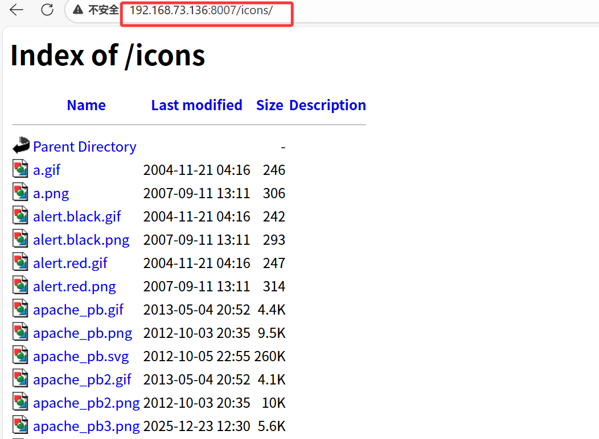

- 重定向Redirect
  - 强制客户端跳转到另一个 URL，通常用于路径迁移或权限控制
  - **网站改版迁移**：旧路径 `http://old.com` 永久跳转到 `http://new.com`（301）
  - **权限控制**：未登录用户访问 `/admin` 时跳转到登录页（302）
  - **临时维护**：将流量临时导向通知页面（302）

### 2.11.1 网站迁移

- 整个网站访问都跳转到新的地址

```bash
[root@localhost]:~$ mkdir -pv /data/new_site08/
mkdir: created directory '/data/new_site08/'
[root@localhost]:~$ echo "This is New NO.8 website" > /data/new_site08/index.html
[root@localhost]:~$ cat << EOF > /etc/httpd/conf.d/site08.conf
# old site 
<Virtualhost *>
   ServerName cloud.iproute.cn
   Redirect 301 / http://ncloud.iproute.cn/
</Virtualhost>

# new site
<Virtualhost *>
   ServerName ncloud.iproute.cn
   Documentroot /data/new_site08
   <Directory /data/new_site08>
      Require all granted
   </Directory>
</Virtualhost>
EOF
# 测试验证
C:\Users\ddd>curl -L http://cloud.iproute.cn/index.html
This is New NO.8 website!

C:\Users\ddd>curl -I http://cloud.iproute.cn/index.html
HTTP/1.1 301 Moved Permanently
Date: Thu, 22 Jan 2026 10:48:08 GMT
Server: Apache/2.4.62 (Rocky Linux)
Location: http://ncloud.iproute.cn/index.html
Content-Type: text/html; charset=iso-8859-1
```

### 2.11.2 未跳转登录

- 修改URL到登录的地址上
- 用户访问需登录的资源（如个人中心、订单页），系统通过302重定向到登录页，并在登录成功后携带return_url参数跳回原页面
  - 当请求的 **URI 以 /profile 开头**，且请求头 **Cookie 中不包含名为 session_token 的 Cookie** 时，触发重定向。
  - 将用户浏览器重定向到 **/login?return_url=原始请求路径**，状态码为 **302 临时重定向**，并停止后续重写规则处理。
  - 典型用途：对需要登录的 **/profile** 路径进行访问控制，未登录则先跳转到登录页，并携带 **return_url** 便于登录后回到原页面。

```bash
[root@localhost]:/data/new_site08$ mkdir profile
[root@localhost]:/data/new_site08$ mkdir login
[root@localhost]:/data/new_site08$ echo "in profile" > profile/index.html
[root@localhost]:/data/new_site08$ echo "login" > login/index.html
[root@localhost]:/data/new_site08$ cat << EOF > /etc/httpd/conf.d/site08.conf
# old site 
<Virtualhost *>
   ServerName cloud.iproute.cn
   Redirect 301 / http://ncloud.iproute.cn/
</Virtualhost>

# new site
<Virtualhost *>
   ServerName ncloud.iproute.cn
   Documentroot /data/new_site08
   RewriteEngine On
   RewriteCond %{REQUEST_URI} ^/profile
   RewriteCond %{HTTP_COOKIE} !session_token
   RewriteRule ^(.*)$ /login?return_url=$1 [R=302,L]
   <Directory /data/new_site08>
      Require all granted
   </Directory>
</Virtualhost>
EOF
[root@localhost]:~$ systemctl restart httpd
# cmd检测
C:\Users\ddd>curl cloud.iproute.cn/profile
<!DOCTYPE HTML PUBLIC "-//IETF//DTD HTML 2.0//EN">
<html><head>
<title>301 Moved Permanently</title>
</head><body>
<h1>Moved Permanently</h1>
<p>The document has moved <a href="http://ncloud.iproute.cn/profile">here</a>.</p>
</body></html>

C:\Users\ddd>curl -L ncloud.iproute.cn/profile
login

C:\Users\ddd>curl -I ncloud.iproute.cn/profile
HTTP/1.1 302 Found
Date: Thu, 22 Jan 2026 10:58:35 GMT
Server: Apache/2.4.62 (Rocky Linux)
Location: http://ncloud.iproute.cn/login?return_url=
Content-Type: text/html; charset=iso-8859-1
```

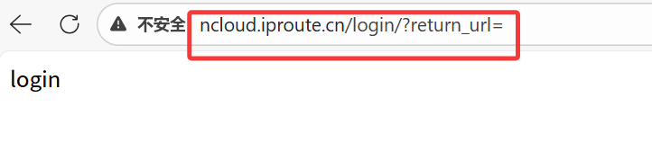

### 2.11.3 移动页面跳转

根据User-Agent将移动端用户临时重定向至移动版站点

- 当请求的 **User-Agent** 包含 **android、iphone 或 ipad**（不区分大小写），且访问的主机名正好是 **www.example.com** 时，Apache 会将请求以 **HTTP 302 临时重定向** 转发到 **http://m.example.com/**，并保留原始请求的路径部分；
- 同时这是本条规则链的**最后一条**，不再继续处理后续重写规则。典型用途是实现对移动设备的**按域名分流**（m 子域）

```bash
[root@localhost]:~$ cat << EOF > /etc/httpd/conf.d/site08.conf
# old site 
<Virtualhost *>
   ServerName cloud.iproute.cn
   Redirect 301 / http://ncloud.iproute.cn/
</Virtualhost>

# new site
<Virtualhost *>
   ServerName ncloud.iproute.cn
   Documentroot /data/new_site08
   RewriteEngine On
   RewriteCond %{HTTP_USER_AGENT} "android|iphone|ipad" [NC]
   RewriteCond %{HTTP_HOST} ^ncloud\.iproute\.cn$
   RewriteRule ^(.*)$ http://www.baidu.com/$1 [R=302,L]
   <Directory /data/new_site08>
      Require all granted
   </Directory>
</Virtualhost>
EOF

# 手机平板访问ncloud.iproute.cn网址的时候，跳转到手机对应的页面
[root@localhost]:~$ systemctl restart httpd
```


## 2.12 网页压缩技术

- 使用 mod_deflate 模块压缩页面优化传输速度
- 适用场景
  - 节约带宽，额外消耗CPU；同时，可能有些较老浏览器不支持
  - 压缩适于压缩的资源，例如文本文件

```bash
[root@localhost]:~$ mkdir -pv /data/site0901/ /data/site0902
mkdir: created directory '/data/site0901/'
mkdir: created directory '/data/site0902'
[root@localhost]:~$ vim /data/site0901/index.html
[root@localhost]:~$ vim /data/site0902/index.html
[root@localhost]:~$ cat << EOF > /etc/httpd/conf.d/site09.conf
Listen 8009
Listen 8010
<Virtualhost *:8009>
   Documentroot /data/site0901/
   <Directory /data/site0901/>
      Require all granted
   </Directory>
   AddOutputFilterByType DEFLATE text/plain
   AddOutputFilterByType DEFLATE text/html     
   SetOutputFilter DEFLATE
</Virtualhost>

<Virtualhost *:8010>
   Documentroot /data/site0902/
   <Directory /data/site0902/>
      Require all granted
   </Directory>
</Virtualhost>
EOF
[root@localhost]:~$ systemctl restart httpd

```

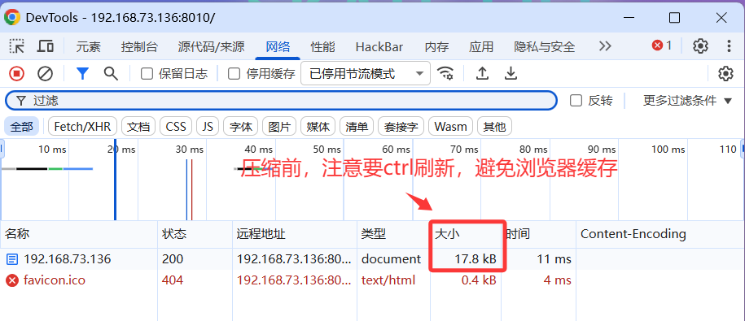

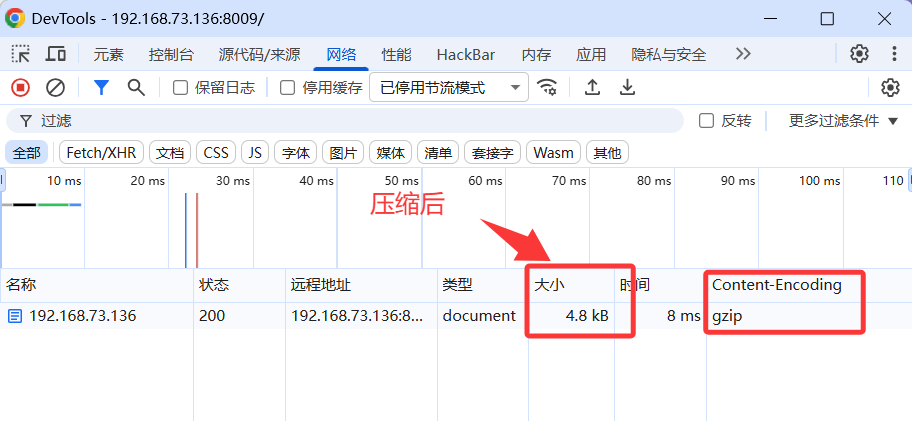

- 可以明显看到压缩后小了很多

# 3. HTTPS

- Web网站的登录页面都是使用https加密传输的，加密数据以保障数据的安全，HTTPS能够加密信息，以免敏感信息被第三方获取,所以很多银行网站或电子邮箱等等安全级别较高的服务都会采用HTTPS协议，HTTPS其实是有两部分组成: HTTP + SSL/ TLS,也就是在HTTP上又加了一层处理加密信息的模块。服务端和客户端的信息传输都会通过TLS进行加密，所以传输的数据都是加密后的数据。

## 3.1 HTTPS请求过程

[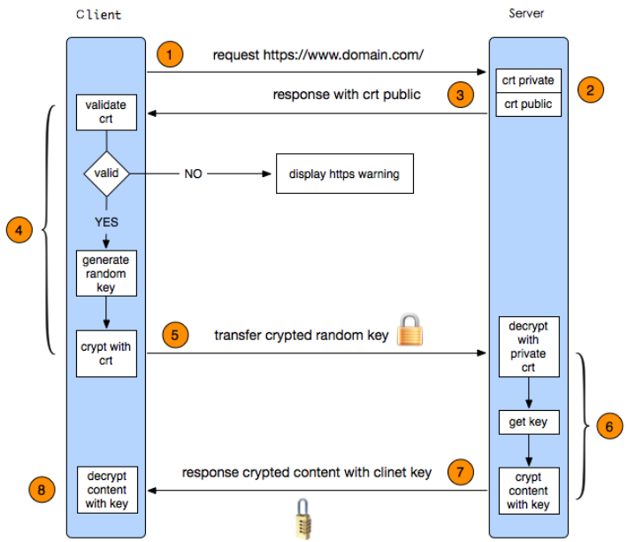](https://git.inmind-lab.com/aaronxu/Linux-book/src/branch/main/02.企业服务/04.Apache/HTTPS请求过程.png)

- https 实现过程如下：

  1. **客户端发起HTTPS请求**

     客户端访问某个web端的https地址，一般都是443端口

  1. **服务端的配置**

     采用https协议的服务器必须要有一套证书，可以通过**权威机构**申请，也可以自己制作，目前国内很多⽹站都⾃⼰做的，当你访问⼀个⽹站的时候提示证书不可信任就表示证书是⾃⼰做的，证书就是⼀个公钥和私钥匙，就像⼀把锁和钥匙，正常情况下只有你的钥匙可以打开你的锁，你可以把这个送给别⼈让他锁住⼀个箱⼦，⾥⾯放满了钱或秘密，别⼈不知道⾥⾯放了什么⽽且别⼈也打不开，只有你的钥匙是可以打开的。

     ```text
     对称加密与非对称加密区别
     对称加密只有密钥
     非对称加密有公私钥，公钥加密，私钥解密
     ```

  1. **传送证书**

     服务端给客户端传递证书，其实就是公钥，⾥⾯包含了很多信息，例如证书得到颁发机构、过期时间等等。

  1. **客户端解析证书**

     这部分⼯作是有客户端完成的，⾸先回验证公钥的有效性，⽐如颁发机构、过期时间等等，如果发现异常则会弹出⼀个警告框提示证书可能存在问题，如果证书没有问题就⽣成⼀个随机值，然后⽤证书对该随机值进⾏加密，就像2步骤所说把随机值锁起来，不让别⼈看到。

  1. **传送4步骤的加密数据**

     就是将⽤证书加密后的随机值传递给服务器，⽬的就是为了让服务器得到这个随机值，以后客户端和服务端的通信就可以通过这个随机值进⾏加密解密了。

  1. **服务端解密信息**

     服务端用私钥解密5步骤加密后的随机值之后，得到了客户端传过来的随机值(私钥)，然后把内容通过该值进⾏对称加密，对称加密就是将信息和私钥通过算法混合在⼀起，这样除非你知道私钥，不然是⽆法获取其内部的内容，而正好客户端和服务端都知道这个私钥，所以只要机密算法够复杂就可以保证数据的安全性。

  1. **传输加密后的信息**

     服务端将⽤私钥加密后的数据传递给客户端，在客户端可以被还原出原数据内容

  1. **客户端解密信息**

     客户端⽤之前⽣成的私钥获解密服务端传递过来的数据，由于数据⼀直是加密的，因此即使第三⽅获取到数据也⽆法知道其详细内容。

## 3.1 HTTPS加解密过程

**HTTPS 中使用的加密技术主要包括以下几个步骤:**

1. 密钥协商:
   - 在 SSL/TLS 握手过程中,客户端和服务器协商出一个对称加密密钥。
   - 这个对称密钥是用于后续数据加密和解密的临时密钥。
2. 对称加密:
   - 客户端和服务器使用协商好的对称密钥对 HTTP 请求和响应数据进行加密和解密。
   - 对称加密算法通常包括 AES、DES、3DES 等,速度快且计算开销小。
3. 非对称加密:
   - 在握手过程中,服务器使用自己的私钥对称密钥进行加密,发送给客户端。
   - 客户端使用服务器的公钥解密获得对称密钥。
   - 非对称加密算法通常包括 RSA、ECC 等,安全性高但计算开销大。
4. 摘要算法:
   - 客户端和服务器使用摘要算法(如 SHA-256)计算数据的数字签名。
   - 数字签名用于验证数据的完整性,确保数据在传输过程中未被篡改。
5. 证书验证:
   - 客户端使用预先内置的受信任根证书颁发机构(CA)公钥,验证服务器证书的合法性。
   - 这确保连接的服务器是真实的,而不是中间人攻击者伪造的。

## 3.3 案例

- 自建 HTTPS 服务器：自签名证书生成、Apache 配置、强制 HTTP 跳转 HTTPS及测试验证

```bash
[root@localhost]:~$ mkdir -pv /data/site10/
mkdir: created directory '/data/site10/'
[root@localhost]:~$ echo "This is NO.10 website!" > /data/site10/index.html
# 安装 mod_ssl 模块和 openssl 工具
[root@localhost]:~$ yum install mod_ssl openssl -y
[root@localhost]:~$ vim /etc/httpd/conf/httpd.conf
ServerName test.iproute.cn:80
# 确认 httpd 已经加载 ssl_module 模块
[root@localhost]:~$ httpd -M | grep ssl
 ssl_module (shared)
 # 备份默认 ssl.conf 文件避免互相影响
[root@localhost]:~$  mv /etc/httpd/conf.d/ssl.conf{,.bak}
[root@localhost]:~$ grep -nr 'ssl' /etc/httpd/conf.modules.d/*
/etc/httpd/conf.modules.d/00-ssl.conf:1:LoadModulessl_module modules/mod_ssl.so
[root@localhost]:~$ mkdir -p /etc/httpd/ssl
[root@localhost]:~$ openssl req -x509 -nodes -days 365 -newkey rsa:2048 \
   -keyout /etc/httpd/ssl/server.key \
   -out /etc/httpd/ssl/server.crt \
   -subj "/C=XX/ST=Test/O=DevEnv/CN=ssl.iproute.cn" \
   -addext "subjectAltName=DNS:ssl.iproute.cn,IP:172.16.175.129"

# HTTPS 相关虚拟主机配置
[root@localhost]:~$ cat << EOF > /etc/httpd/conf.d/site10.conf
# ​​​​强制 HTTP 跳转 HTTPS
<VirtualHost *:80>
   ServerName ssl.iproute.cn
   RewriteEngine On
   RewriteCond %{HTTPS} off
   RewriteRule (.*) https://%{HTTP_HOST}%{REQUEST_URI} [R=301,L]
</VirtualHost>

Listen 443 https
<VirtualHost *:443>
   ServerName ssl.iproute.cn
   DocumentRoot /data/site10/
   <Directory /data/site10/>
      Require all granted
   </Directory>
   SSLEngine on
   SSLCertificateFile /etc/httpd/ssl/server.crt
   SSLCertificateKeyFile /etc/httpd/ssl/server.key

   # 安全增强配置（可选但推荐）
   # 禁用旧协议
   SSLProtocol all -SSLv2 -SSLv3 -TLSv1 -TLSv1.1
   # 强加密套件
   SSLCipherSuite HIGH:!aNULL:!MD5:!3DES
</VirtualHost>
EOF
[root@localhost]:~$ systemctl restart httpd
```

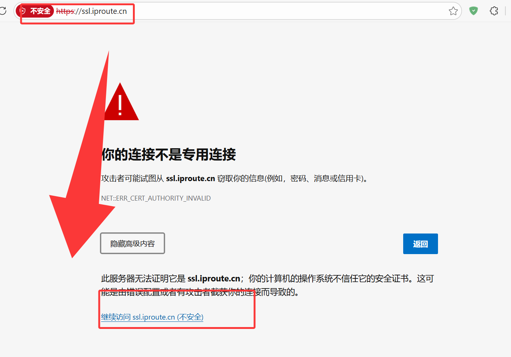


# 4. MPM多路处理模块

- httpd支持三种MPM工作模式：prefork，worker，event
- 修改注释可以修改

```bash
[root@localhost]:~$ cat /etc/httpd/conf.modules.d/00-mpm.conf |grep mpm
#LoadModule mpm_prefork_module modules/mod_mpm_prefork.so
#LoadModule mpm_worker_module modules/mod_mpm_worker.so
LoadModule mpm_event_module modules/mod_mpm_event.so
```

| 模式        | 特点                                    | KeepAlive处理    | 并发能力       |
| ----------- | --------------------------------------- | ---------------- | -------------- |
| **prefork** | 每个请求一个进程，无线程                | 同步阻塞，性能差 | 🟥 低（几百级） |
| **worker**  | 每个进程多个线程                        | 同步阻塞         | 🟧 中（几千级） |
| **event**   | 每个进程多个线程，KeepAlive连接异步管理 | 非阻塞，线程复用 | 🟩 高（上万级） |

- prefork模式

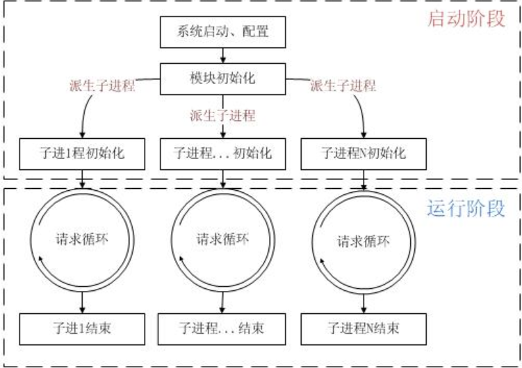

```bash
[root@localhost]:~$ vim /etc/httpd/conf.modules.d/00-mpm.conf	# 改到prefork模式
[root@localhost]:~$ httpd -V
Server version: Apache/2.4.62 (Rocky Linux)
Server built:   Dec 12 2025 00:00:00
Server's Module Magic Number: 20120211:134
Server loaded:  APR 1.7.0, APR-UTIL 1.6.1, PCRE 8.44 2020-02-12
Compiled using: APR 1.7.0, APR-UTIL 1.6.1, PCRE 8.44 2020-02-12
Architecture:   64-bit
Server MPM:     prefork
  threaded:     no
    forked:     yes (variable process count)
Server compiled with....
 -D APR_HAS_SENDFILE
 -D APR_HAS_MMAP
 -D APR_HAVE_IPV6 (IPv4-mapped addresses enabled)
 -D APR_USE_PROC_PTHREAD_SERIALIZE
 -D APR_USE_PTHREAD_SERIALIZE
 -D SINGLE_LISTEN_UNSERIALIZED_ACCEPT
 -D APR_HAS_OTHER_CHILD
 -D AP_HAVE_RELIABLE_PIPED_LOGS
 -D DYNAMIC_MODULE_LIMIT=256
 -D HTTPD_ROOT="/etc/httpd"
 -D SUEXEC_BIN="/usr/sbin/suexec"
 -D DEFAULT_PIDLOG="run/httpd.pid"
 -D DEFAULT_SCOREBOARD="logs/apache_runtime_status"
 -D DEFAULT_ERRORLOG="logs/error_log"
 -D AP_TYPES_CONFIG_FILE="conf/mime.types"
 -D SERVER_CONFIG_FILE="conf/httpd.conf"
 
# 通过调整配置文件，可以修改prefork的参数
[root@localhost]:~$ vim /etc/httpd/conf.d/mpm.conf
[root@localhost]:~$ vim /etc/httpd/conf.d/mpm.conf
StartServers 5              #开始访问进程
MinSpareServers 5           #最小空闲进程
MaxSpareServers 10           #无人访问时，留下空闲的进程
ServerLimit 256               #最多进程数,最大值 20000
MaxRequestWorkers 256         #最大的并发连接数，默认256
MaxConnectionsPerChild 4000    
#子进程最多能处理的请求数量。在处理MaxRequestsPerChild 个请求之后,子进程将会被父进程终止，这时候子进程占用的内存就会释放(为0时永远不释放）
MaxRequestsPerChild 4000
#从 httpd.2.3.9开始被MaxConnectionsPerChild代替
[root@localhost]:~$ systemctl restart httpd

[root@localhost]:~$ ps aux | grep httpd
root        3636  0.1  0.4  23816 16096 ?        Ss   11:56   0:00 /usr/sbin/httpd -DFOREGROUND
apache      3637  0.0  0.3 239060 11640 ?        Sl   11:56   0:00 /usr/sbin/httpd -DFOREGROUND
apache      3638  0.0  0.2  42388  9444 ?        Sl   11:56   0:00 /usr/sbin/httpd -DFOREGROUND
apache      3639  0.0  0.2  42388  9444 ?        Sl   11:56   0:00 /usr/sbin/httpd -DFOREGROUND
apache      3640  0.0  0.2  42388  9572 ?        Sl   11:56   0:00 /usr/sbin/httpd -DFOREGROUND
apache      3641  0.0  0.2  42388  9444 ?        Sl   11:56   0:00 /usr/sbin/httpd -DFOREGROUND
root        3669  0.0  0.0   3876  2048 pts/0    S+   11:57   0:00 grep --color=auto httpd

# 查看进程数
[root@localhost]:~$ pstree -p 3636
httpd(3636)─┬─httpd(3637)─┬─{httpd}(3642)
            │             ├─{httpd}(3645)
            │             ├─{httpd}(3646)
            │             ├─{httpd}(3648)
            │             ├─{httpd}(3649)
            │             ├─{httpd}(3650)
            │             ├─{httpd}(3651)
            │             ├─{httpd}(3653)
            │             ├─{httpd}(3654)
            │             ├─{httpd}(3657)
            │             ├─{httpd}(3658)
            │             ├─{httpd}(3659)
            │             ├─{httpd}(3660)
            │             ├─{httpd}(3661)
            │             ├─{httpd}(3662)
            │             ├─{httpd}(3663)
            │             ├─{httpd}(3664)
            │             └─{httpd}(3665)
            ├─httpd(3638)─┬─{httpd}(3643)
            │             └─{httpd}(3644)
            ├─httpd(3639)─┬─{httpd}(3655)
            │             └─{httpd}(3656)
            ├─httpd(3640)─┬─{httpd}(3647)
            │             └─{httpd}(3652)
            └─httpd(3641)─┬─{httpd}(3666)
                          └─{httpd}(3667)

# 修改prefork参数
[root@localhost]:~$ vim /etc/httpd/conf.d/mpm.conf
StartServers 10
MinSpareServers 5
MaxSpareServers 10
ServerLimit 256
MaxRequestWorkers 256
MaxConnectionsPerChild 4000
MaxRequestsPerChild 4000

# 再看进程数
[root@localhost]:~$ ps aux | grep httpd
root        3700  0.7  0.4  23816 16088 ?        Ss   12:00   0:00 /usr/sbin/httpd -DFOREGROUND
apache      3701  0.0  0.2  42388  9492 ?        Sl   12:00   0:00 /usr/sbin/httpd -DFOREGROUND
apache      3702  0.0  0.2  42388  9492 ?        Sl   12:00   0:00 /usr/sbin/httpd -DFOREGROUND
apache      3703  0.0  0.3 239060 11644 ?        Sl   12:00   0:00 /usr/sbin/httpd -DFOREGROUND
apache      3704  0.0  0.2  42388  9492 ?        Sl   12:00   0:00 /usr/sbin/httpd -DFOREGROUND
apache      3705  0.0  0.2  42388  9492 ?        Sl   12:00   0:00 /usr/sbin/httpd -DFOREGROUND
apache      3706  0.0  0.2  42388  9492 ?        Sl   12:00   0:00 /usr/sbin/httpd -DFOREGROUND
apache      3707  0.0  0.2  42388  9492 ?        Sl   12:00   0:00 /usr/sbin/httpd -DFOREGROUND
apache      3708  0.0  0.2  42388  9492 ?        Sl   12:00   0:00 /usr/sbin/httpd -DFOREGROUND
apache      3709  0.0  0.2  42388  9492 ?        Sl   12:00   0:00 /usr/sbin/httpd -DFOREGROUND
apache      3710  0.0  0.2  42388  9492 ?        Sl   12:00   0:00 /usr/sbin/httpd -DFOREGROUND
root        3748  0.0  0.0   3876  2048 pts/0    R+   12:00   0:00 grep --color=auto httpd
[root@localhost]:~$ pstree -p 3700
httpd(3700)─┬─httpd(3701)─┬─{httpd}(3713)
            │             └─{httpd}(3714)
            ├─httpd(3702)─┬─{httpd}(3711)
            │             └─{httpd}(3712)
            ├─httpd(3703)─┬─{httpd}(3715)
            │             ├─{httpd}(3720)
            │             ├─{httpd}(3721)
            │             ├─{httpd}(3722)
            │             ├─{httpd}(3723)
            │             ├─{httpd}(3724)
            │             ├─{httpd}(3725)
            │             ├─{httpd}(3726)
            │             ├─{httpd}(3727)
            │             ├─{httpd}(3731)
            │             ├─{httpd}(3733)
            │             ├─{httpd}(3734)
            │             ├─{httpd}(3735)
            │             ├─{httpd}(3736)
            │             ├─{httpd}(3737)
            │             ├─{httpd}(3739)
            │             ├─{httpd}(3740)
            │             └─{httpd}(3741)
            ├─httpd(3704)─┬─{httpd}(3716)
            │             └─{httpd}(3717)
            ├─httpd(3705)─┬─{httpd}(3743)
            │             └─{httpd}(3744)
            ├─httpd(3706)─┬─{httpd}(3738)
            │             └─{httpd}(3742)
            ├─httpd(3707)─┬─{httpd}(3728)
            │             └─{httpd}(3729)
            ├─httpd(3708)─┬─{httpd}(3730)
            │             └─{httpd}(3732)
            ├─httpd(3709)─┬─{httpd}(3745)
            │             └─{httpd}(3746)
            └─httpd(3710)─┬─{httpd}(3718)
                          └─{httpd}(3719)

# 使用ab进行压力测试
[root@localhost]:~$ ab -c 1000 -n 1000000 http://127.0.0.1/
# -c	即concurrency，用于指定的并发数
# -n	即requests，用于指定压力测试总共的执行次数
Every 1.0s:...  localhost: Fri Jan 23 12:05:18 2026

httpd-+-httpd
      |-38*[httpd---2*[{httpd}]]
      `-httpd---18*[{httpd}]
      └─httpd───18*[{httpd}]
[root@localhost]:~$ watch -n 1 pstree 3700

Every 1.0s:...  localhost: Fri Jan 23 12:05:30 2026

httpd-+-8*[httpd]
      `-9*[httpd---2*[{httpd}]]
# 测试过程中，可以看到最大进程数
[root@localhost]:~$ ps aux |grep httpd |wc -l
72
# 结束ab的压力测试，等待一段时间，可以看到进程数慢慢减少
[root@localhost]:~$ ps aux |grep httpd |wc -l
12
```

- worker模式

```bash
[root@localhost ~]# vim /etc/httpd/conf.d/mpm.conf
ServerLimit         16
StartServers         2
MaxRequestWorkers  150
MinSpareThreads     25
MaxSpareThreads     75
ThreadsPerChild     25
[root@localhost]:~$ cat /etc/httpd/conf.modules.d/00-mpm.conf |grep mpm
#LoadModule mpm_prefork_module modules/mod_mpm_prefork.so
#LoadModule mpm_worker_module modules/mod_mpm_worker.so
LoadModule mpm_event_module modules/mod_mpm_event.so
```

- 实际工作用，兼容性最好的是prefork，性能最强的是event，根据实际的业务做调整

# 5. LAMP架构

- LAMP就是由Linux+Apache+MySQL+PHP组合起来的架构

- 并且Apache默认情况下就内置了PHP解析模块，所以无需CGI即可解析PHP代码

**请求示意图：**

[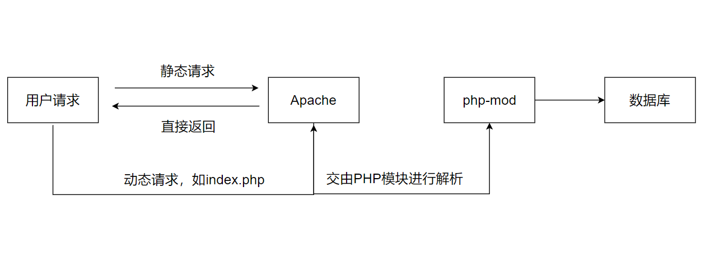](https://git.inmind-lab.com/aaronxu/Linux-book/src/branch/main/02.企业服务/04.Apache/LAMP架构.png)

## 5.1 Apache部署

- 略
- 为了方便权限管理，将apache的启动用户改为www，保持和php一致

```bash
[root@localhost]:~$ useradd -s /usr/sbin/nologin -r -u 666 www
[root@localhost]:~$ id www
uid=666(www) gid=666(www) groups=666(www)
[root@localhost]:~$ grep -A2 "User " /etc/httpd/conf/httpd.conf
User www
Group www

[root@localhost]:~$ systemctl restart httpd


```


## 5.2 php环境

- 安装php8.0

```bash
# 安装之前，可以看一下仓库中匹配的软件
[root@localhost]:~$ yum list |grep php-*
# 开始安装php环境
[root@localhost]:~$ yum -y install php*
# 验证环境
[root@localhost]:~$ php -v
PHP 8.0.30 (cli) (built: Dec 18 2025 18:46:25) ( NTS gcc x86_64 )
Copyright (c) The PHP Group
Zend Engine v4.0.30, Copyright (c) Zend Technologies
    with Zend OPcache v8.0.30, Copyright (c), by Zend Technologies
    with Xdebug v3.1.2, Copyright (c) 2002-2021, by Derick Rethans
# 启动php服务之前，先修改用户为www
[root@localhost]:~$ grep -A3 "user =" /etc/php-fpm.d/www.conf 
user = www
; RPM: Keep a group allowed to write in log dir.
group = www
# socket的facl的用户也需要修改
[root@localhost]:~$ grep "listen.acl_users" /etc/php-fpm.d/www.conf 
listen.acl_users = www,nginx

# 启动php服务
[root@localhost]:~$ systemctl enable --now php-fpm
Created symlink /etc/systemd/system/multi-user.target.wants/php-fpm.service → /usr/lib/systemd/system/php-fpm.service.
[root@localhost]:~$ ps aux |grep php-fpm
root       12997  1.1  1.0 266440 39800 ?        Ss   15:03   0:00 php-fpm: master process (/etc/php-fpm.conf)
www        12998  0.0  0.4 268412 17964 ?        S    15:03   0:00 php-fpm: pool www
www        12999  0.0  0.4 268412 17964 ?        S    15:03   0:00 php-fpm: pool www
www        13000  0.0  0.4 268412 17964 ?        S    15:03   0:00 php-fpm: pool www
www        13001  0.0  0.4 268412 17836 ?        S    15:03   0:00 php-fpm: pool www
www        13002  0.0  0.4 268412 17964 ?        S    15:03   0:00 php-fpm: pool www
root       13004  0.0  0.0   3884  2176 pts/0    S+   15:03   0:00 grep --color=auto php-fpm
# 重启apache识别php模块
[root@localhost]:~$ systemctl restart httpd

# 在site10的虚拟主机中，放入一个探针文件
[root@localhost]:/data/site10$ echo "<?php phpinfo();?>" > tz.php

```

- 浏览器访问测试

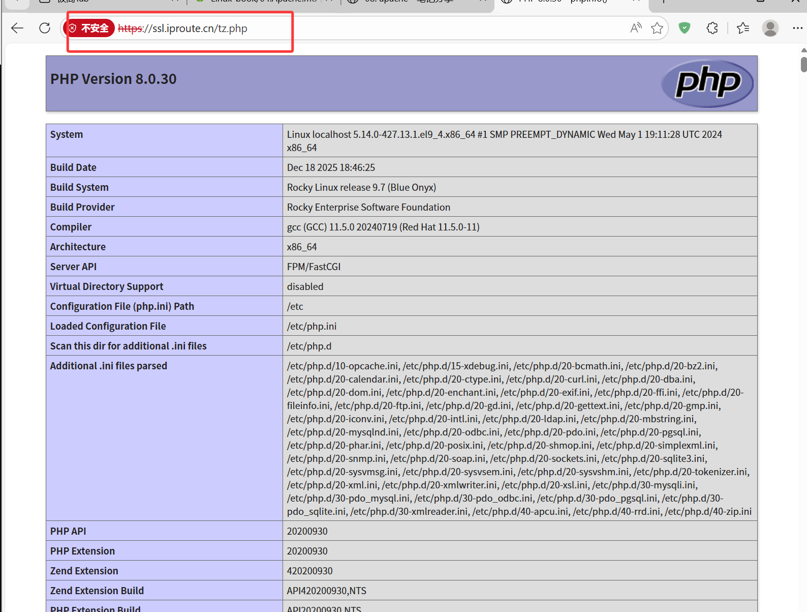

## 5.3 安装Mysql数据库

- 此处安装mariadb数据库，是MySQL的分支，完全兼容MySQL

```bash
# 安装数据库的服务端和客户端
[root@localhost]:~$ yum install -y mariadb-server mariadb

# 启动数据库
[root@localhost]:~$ systemctl enable --now mariadb
Created symlink /etc/systemd/system/mysql.service → /usr/lib/systemd/system/mariadb.service.
Created symlink /etc/systemd/system/mysqld.service → /usr/lib/systemd/system/mariadb.service.
Created symlink /etc/systemd/system/multi-user.target.wants/mariadb.service → /usr/lib/systemd/system/mariadb.service.

# 设置数据库的初始密码
[root@localhost]:~$ mysqladmin password '123456'

# 查看数据库
[root@localhost]:~$ mysql -uroot -p123456 -e "show databases;"
+--------------------+
| Database           |
+--------------------+
| information_schema |
| mysql              |
| performance_schema |
+--------------------+
```

- 测试数据库的连接

```bash
[root@localhost]:/data/site10$ cat mysql.php
<?php
    $servername = "localhost";
    $username = "root";
    $password = "123456";

    // 创建连接
    $conn = mysqli_connect($servername, $username, $password);

    // 检测连接
    if (!$conn) {
         die("Connection failed: " . mysqli_connect_error());
    }
    echo "连接MySQL...成功！";
?>
```

- 浏览器访问测试

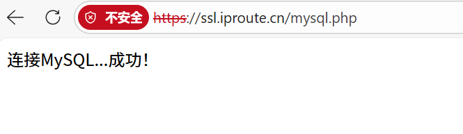

## 5.4 phpmyadmin安装

- 部署phpmyadmin工具，该工具可以让我们可视化管理我们的数据库
- 新建一个虚拟主机，用于做phpmyadmin网站

```bash
[root@localhost]:/etc/httpd/conf.d$ cat pma.conf
<Virtualhost *:80>
   ServerName pma.iproute.cn
   Documentroot /data/pma
   <Directory /data/pma>
      AllowOverride none
      Require all granted
   </Directory>
</Virtualhost>

[root@localhost]:/data/pma$ systemctl restart httpd
[root@localhost]:/data/pma$ mkdir -p /data/pma
[root@localhost]:/data/pma$ unzip phpMyAdmin-5.1.1-all-languages.zip 
[root@localhost]:/data/pma$ mv phpMyAdmin-5.1.1-all-languages/* .
[root@localhost]:/data/pma$ ls
CONTRIBUTING.md
ChangeLog
LICENSE
README
RELEASE-DATE-5.1.1
babel.config.json
composer.json
composer.lock
config.sample.inc.php
doc
examples
favicon.ico
index.php
js
libraries
locale
package.json
phpMyAdmin-5.1.1-all-languages
phpMyAdmin-5.1.1-all-languages.zip
print.css
robots.txt
setup
show_config_errors.php
sql
templates
themes
url.php
vendor
yarn.lock
```

- 访问报错了，提示`/var/lib/php/session` 没有权限

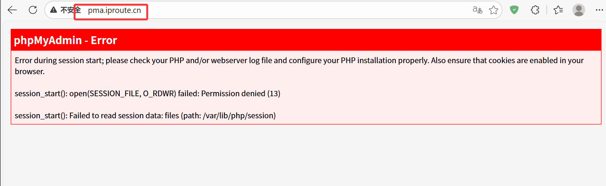

- 赋予`/var/lib/php/session`权限

```bash
[root@localhost]:~$ chown -R www:www /var/lib/php/session
[root@localhost]:~$ chown -R www:www /data/pma
```

- 登录数据库管理工具

  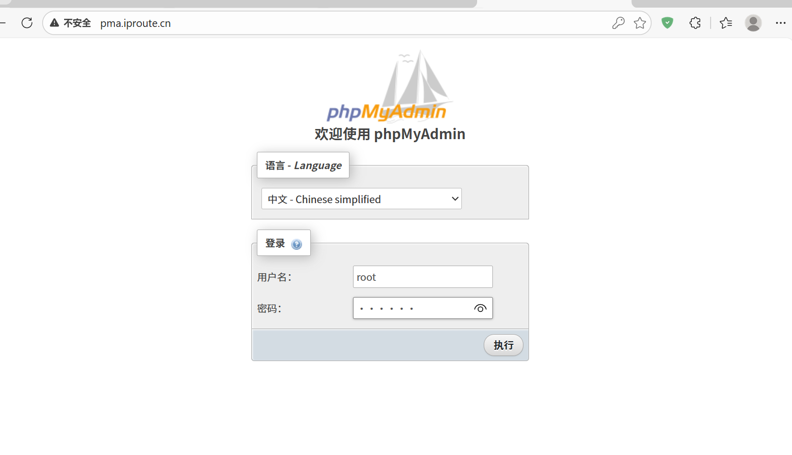

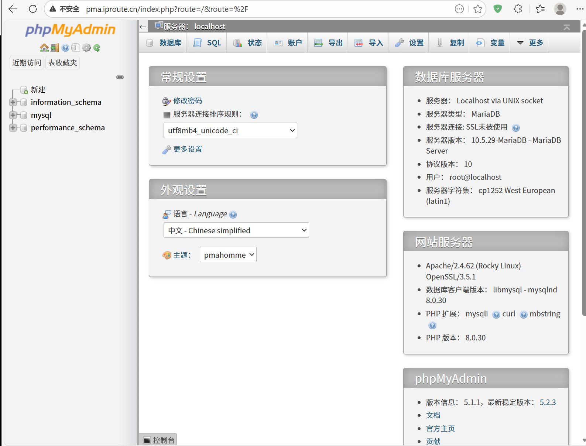

## 5.5 个人网站

- 创建博客的虚拟主机

```bash
[root@localhost]:/etc/httpd/conf.d$ cat blog.conf
<Virtualhost *:80>
   ServerName blog.iproute.cn
   Documentroot /data/blog
   <Directory /data/blog>
      AllowOverride none
      Require all granted
   </Directory>
</Virtualhost>

[root@localhost]:~$ mkdir -p /data/blog
[root@localhost]:~$ systemctl restart httpd
```

- 下载源代码

```bash
[root@localhost]:~$ cd /data/blog
[root@localhost]:/data/blog$ wget https://github.com/typecho/typecho/releases/latest/download/typecho.zip
[root@localhost]:/data/blog$ unzip typecho.zip
[root@localhost]:/data/blog$ ls
LICENSE.txt  admin  index.php  install  install.php  typecho.zip  usr  var

[root@localhost]:~$ setfacl -m d:u:www:rw /data			# 注意文件权限
[root@localhost]:/$ chown -R www:www /data/

```

- 创建mysql数据库

```bash
[root@localhost]:~$ mysql -uroot -p123456 -e "create database typecho;show databases;"
+--------------------+
| Database           |
+--------------------+
| information_schema |
| mysql              |
| performance_schema |
| typecho            |
+--------------------+
```

- 进入博客程序安装，进入主页


- 在网址后面加上`/amin`可以进入后台

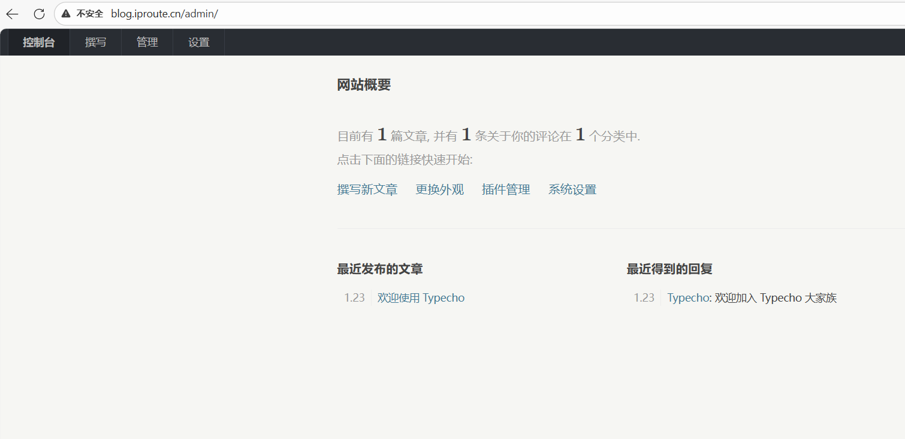

- 部署完成后，可以更换主题
  - 主题下载站：https://typechx.com/

```bash
[root@localhost]:/data/blog$ tree -L 1
.
├── LICENSE.txt
├── admin
├── config.inc.php
├── index.php
├── install
├── install.php
├── typecho.zip
├── usr			# 主题和插件都放在usr中
└── var

4 directories, 5 files
[root@localhost]:/data/blog/usr$ tree -L 1
.
├── plugins
├── themes		# 放主题的地方吧
└── uploads

3 directories, 0 files

[root@localhost]:/data/blog/usr$ cd themes
[root@localhost]:/data/blog/usr/themes$ wget https://github.com/little-gt/THEME-RoricalTheme/archive/refs/tags/V1.2.4.zip
[root@localhost]:/data/blog/usr/themes$ ll -h
total 20K
drwxr-xr-x+ 3 www www 4.0K Mar  1  2025 BeaconNav-main
drwxr-xr-x+ 4 www www 4.0K Oct 23 04:32 Romanticism-main
drwxr-xr-x+ 3 www www 4.0K Jan 20 14:28 classic-22
drwxr-xr-x+ 4 www www 4.0K Jan 23 20:00 de
drwxr-xr-x+ 5 www www 4.0K Jul 15  2025 xa
# 注意权限要是www用户能够访问的
```

- 启用新的主题


```bash
httpd -t # 检查httpd语法
```

## 5.6 个人网盘

- 创建网盘虚拟主机配置文件
  - 虚拟主机(vhost)不是虚拟机(vpc)，虚拟主机一般指的是根据域名或者端口在同一个服务器上，部署不同的业务

```bash
[root@localhost]:/etc/httpd/conf.d$ cat kodbox.conf 
<Virtualhost *:80>
   ServerName kod.iproute.cn
   Documentroot /data/kod
   <Directory /data/kod>
      AllowOverride none
      Require all granted
   </Directory>
</Virtualhost>

[root@localhost]:/etc/httpd/conf.d$ cd
[root@localhost]:~$ mkdir -p /data/kod/
[root@localhost]:~$ cd /data/kod
[root@localhost]:/data/kod$ wget https://static.kodcloud.com/update/download/kodbox.1.64.zip
[root@localhost]:/data/kod$ rz -E
rz waiting to receive.
[root@localhost]:/data/kod$ ls
kodbox.1.64.zip
[root@localhost]:/data/kod$ unzip kodbox.1.64.zip 
[root@localhost]:/data/kod$ ls
Changelog.md  config  index.php        plugins
app           data    kodbox.1.64.zip  static
[root@localhost]:/data/kod$ chown -R www:www /data/kod/	# 一定要给权限，不然访问的是默认页面
[root@localhost]:/data/kod$ systemctl restart http
```

- 创建数据库，可以通过pma.iproute.cn图形化创建，也可以命令行创建

```bash
[root@localhost]:/data/kod$ mysql -uroot -p123456 -e "create database kodbox;show databases;"
+--------------------+
| Database           |
+--------------------+
| information_schema |
| kodbox             |
| mysql              |
| performance_schema |
| typecho            |
+--------------------+

```

- 进入安装步骤


