- 如果已经安装了apache，先停止apache服务，看看端口

```bash
[root@localhost]:~$ systemctl disable --now httpd
Removed "/etc/systemd/system/multi-user.target.wants/httpd.service".
[root@localhost]:~$ ss -ntl
State    Recv-Q   Send-Q      Local Address:Port            Peer Address:Port         Process         
LISTEN   0        50                0.0.0.0:139                  0.0.0.0:*                            
LISTEN   0        128               0.0.0.0:22                   0.0.0.0:*                            
LISTEN   0        50                0.0.0.0:445                  0.0.0.0:*                            
LISTEN   0        50                   [::]:139                     [::]:*                            
LISTEN   0        128                  [::]:22                      [::]:*                            
LISTEN   0        50                   [::]:445                     [::]:*                            
LISTEN   0        80                      *:3306                       *:*                            
```

# 1.Nginx安装

## 1.1 编译安装

- Nginx编译安装相比yum安装在安全性方面有以下主要优势：

1. **版本控制更灵活**
- **获取最新安全补丁**：可以立即安装包含安全修复的最新版本，无需等待仓库更新
  
- **避免旧版本漏洞**：yum仓库中的版本可能滞后，存在已知漏洞
  
- **长期支持版本选择**：可以选择特定LTS版本，获得更长的安全支持周期


2. **模块定制化**
- **仅安装必要模块**：减少攻击面，移除不需要的功能模块
   - **安全模块集成**：可编译加入安全增强模块如：
     - `ngx_http_headers_module`（安全头设置）
     - `ngx_http_limit_req_module`（请求限制）
     - 第三方安全模块（ModSecurity等）
   
- **禁用危险模块**：排除可能带来风险的模块


3. **编译选项安全加固**

```bash
# 示例安全编译选项
./configure \
  --with-cc-opt="-O2 -g -pipe -Wall -Wp,-D_FORTIFY_SOURCE=2 -fexceptions" \
  --with-ld-opt="-Wl,-z,relro,-z,now" \
  --prefix=/usr/local/nginx \
  --user=nginx \
  --group=nginx \
  --with-http_ssl_module \
  --with-http_realip_module \
  --with-http_stub_status_module \
  --without-http_autoindex_module  # 禁用目录列表
```

4. **运行环境更安全**
- **非特权用户运行**：可指定专用低权限用户
  
- **自定义安装路径**：避免标准路径被攻击者预测
  
- **文件权限控制**：精细设置配置文件和日志权限


5. **安全特性启用**

   - **TLS优化**：启用最新TLS版本和加密套件

   - **安全头支持**：完整的安全响应头功能

   - **连接限制**：内置防护DDoS攻击的模块


6. **依赖管理**

   - **可控的依赖版本**：自行选择依赖库版本，避免仓库中的老旧依赖

   - **安全补丁应用**：及时为依赖库打补丁


- 对比表格

| 特性         | 编译安装     | Yum安装      |
| ------------ | ------------ | ------------ |
| 版本时效性   | 立即获取最新 | 有延迟       |
| 模块定制     | 完全可控     | 固定集合     |
| 安全加固选项 | 可深度定制   | 有限         |
| 依赖控制     | 自主管理     | 仓库管理     |
| 更新速度     | 即时         | 依赖仓库更新 |

- 实际建议：

  - **适合编译安装的场景**：

    - 对安全性要求高的生产环境

    - 需要特定安全模块

    - 希望快速应用安全补丁

    - 有专业运维团队


  - **适合yum安装的场景**：

    - 快速部署测试环境

    - 小型项目或内部系统

    - 缺乏专业运维资源

    - 需要自动依赖管理


  - 编译安装虽然安全性更高，但需要更多的维护工作。最佳实践是：**生产环境使用编译安装并建立自己的更新流程，开发测试环境可使用yum安装提高效率**。

  - 编译安装命令


```bash
# 准备编译环境
yum -y install gcc pcre-devel openssl-devel zlib-devel
# 如果需要编译安装，为避免冲突需要将yum部署的nginx版本先卸载掉！
# 准备源码包
[root@localhost]:~$ wget http://nginx.org/download/nginx-1.22.0.tar.gz -P /usr/local/src/
[root@localhost]:~$ cd /usr/local/src/
[root@localhost]:/usr/local/src$ ls
nginx-1.22.0.tar.gz
[root@localhost]:~$ cd /usr/local/src && tar xzvf nginx-1.22.0.tar.gz
# 编译
[root@localhost]:/usr/local/src/nginx-1.22.0$ useradd -r -s /sbin/nologin nginx
useradd: user 'nginx' already exists
[root@localhost]:/usr/local/src/nginx-1.22.0$ id nginx
uid=665(nginx) gid=665(nginx) groups=665(nginx)
[root@localhost]:/usr/local/src/nginx-1.22.0$ ./configure --prefix=/apps/nginx \
  --user=nginx \
  --group=nginx \
  --with-http_ssl_module \
  --with-http_v2_module \
  --with-http_realip_module \
  --with-http_stub_status_module \
  --with-http_gzip_static_module \
  --with-pcre \
  --with-stream \
  --with-stream_ssl_module \
  --with-stream_realip_module \
  --with-file-aio
  
  nginx path prefix: "/apps/nginx"
  nginx binary file: "/apps/nginx/sbin/nginx"
  nginx modules path: "/apps/nginx/modules"
  nginx configuration prefix: "/apps/nginx/conf"
  nginx configuration file: "/apps/nginx/conf/nginx.conf"
  nginx pid file: "/apps/nginx/logs/nginx.pid"
  nginx error log file: "/apps/nginx/logs/error.log"
  nginx http access log file: "/apps/nginx/logs/access.log"
  nginx http client request body temporary files: "client_body_temp"
  nginx http proxy temporary files: "proxy_temp"
  nginx http fastcgi temporary files: "fastcgi_temp"
  nginx http uwsgi temporary files: "uwsgi_temp"
  nginx http scgi temporary files: "scgi_temp"

[root@localhost]:/usr/local/src/nginx-1.22.0$ make -j 2 && make install
# 善后工作
[root@localhost]:/apps/nginx$ ll -h
total 4.0K
drwxr-xr-x 2 root root 4.0K Jan 25 12:51 conf
drwxr-xr-x 2 root root   40 Jan 25 12:51 html
drwxr-xr-x 2 root root    6 Jan 25 12:51 logs
drwxr-xr-x 2 root root   19 Jan 25 12:51 sbin
[root@localhost]:/apps/nginx$ chown -R nginx:nginx /apps/nginx
[root@localhost]:/apps/nginx$ ll -h
total 4.0K
drwxr-xr-x 2 nginx nginx 4.0K Jan 25 12:51 conf
drwxr-xr-x 2 nginx nginx   40 Jan 25 12:51 html
drwxr-xr-x 2 nginx nginx    6 Jan 25 12:51 logs
drwxr-xr-x 2 nginx nginx   19 Jan 25 12:51 sbin
[root@localhost]:/apps/nginx$ nginx
-bash: nginx: command not found
[root@localhost]:/apps/nginx$ ln -s /apps/nginx/sbin/nginx /usr/sbin/
[root@localhost]:/apps/nginx$ nginx
[root@localhost]:/apps/nginx$ which nginx
/usr/sbin/nginx

[root@localhost]:/apps/nginx$ nginx -t			# 检查语法
nginx: the configuration file /apps/nginx/conf/nginx.conf syntax is ok
nginx: configuration file /apps/nginx/conf/nginx.conf test is successful

[root@localhost]:/apps/nginx$ nginx -v
nginx version: nginx/1.22.0

# systemd管理
[root@localhost]:/apps/nginx$ cat << EOF > /usr/lib/systemd/system/nginx.service
[Unit]
Description=The nginx HTTP and reverse proxy server 
Documentation=http://nginx.org/en/docs/
After=network.target remote-fs.target nss-lookup.target
Wants=network-online.target
 
[Service]
Type=forking
PIDFile=/apps/nginx/run/nginx.pid
ExecStart=/apps/nginx/sbin/nginx -c /apps/nginx/conf/nginx.conf
ExecReload=/bin/kill -s HUP $MAINPID
ExecStop=/bin/kill -s TERM $MAINPID
 
[Install]
WantedBy=multi-user.target
EOF

# 更新nginx.pid存储位置
[root@localhost]:/apps/nginx$ mkdir run
[root@localhost]:/apps/nginx$ vim /apps/nginx/conf/nginx.conf
pid        /apps/nginx/run/nginx.pid;

# 启动
[root@localhost]:/apps/nginx$ systemctl enable --now
[root@localhost]:/apps/nginx$ systemctl status nginx
● nginx.service - The nginx HTTP and reverse proxy>
     Loaded: loaded (/usr/lib/systemd/system/nginx>
    Drop-In: /usr/lib/systemd/system/nginx.service>
             └─php-fpm.conf
     Active: active (running) since Sun 2026-01-25>
       Docs: http://nginx.org/en/docs/
    Process: 7289 ExecStart=/apps/nginx/sbin/nginx>
   Main PID: 7290 (nginx)
      Tasks: 2 (limit: 22951)
     Memory: 2.1M
        CPU: 16ms
     CGroup: /system.slice/nginx.service
             ├─7290 "nginx: master process /apps/n>
             └─7291 "nginx: worker process"

Jan 25 13:21:06 localhost systemd[1]: Starting The>
Jan 25 13:21:06 localhost systemd[1]: Started The >
lines 1-17/17 (END)
[root@localhost]:/apps/nginx/run$ curl -I 127.0.0.1HTTP/1.1 200 OK
Server: nginx/1.22.0
Date: Sun, 25 Jan 2026 05:25:03 GMT
Content-Type: text/html
Content-Length: 615
Last-Modified: Sun, 25 Jan 2026 04:51:02 GMT
Connection: keep-alive
ETag: "6975a136-267"
Accept-Ranges: bytes

```

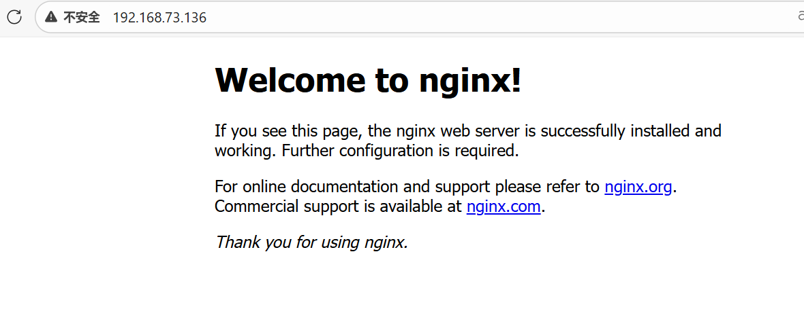

## 1.2 yum 安装

- yum 下载的相关文件都是放在默认的位置，简单高效
- 编译安装可以自定义版本和功能，更适合业务的定制化

```bash
# 安装
[root@localhost ~]# yum provides nginx
[root@localhost ~]# yum install nginx -y
# 启动
[root@localhost ~]# systemctl start nginx && systemctl enable nginx
# 关闭防火墙和SELINUX
# 测试
[root@localhost ~]# curl -I 127.0.0.1
HTTP/1.1 200 OK
Server: nginx/1.20.1
```

# 2. nginx命令

```bash
[root@localhost ~]# nginx -h
nginx version: nginx/1.20.1
Usage: nginx [-?hvVtTq] [-s signal] [-p prefix]
             [-e filename] [-c filename] [-g directives]
```

**常用选项**

| 选项 | 说明                     |
| :--- | :----------------------- |
| -v   | 输出版本                 |
| -V   | 编译相关选项             |
| -t   | 测试验证配置文件的正确性 |
| -s   | 发送信号指令给主进程     |

- 相关文件

| 文件                                  | 说明             |
| ------------------------------------- | ---------------- |
| /etc/nginx/nginx.conf                 | 主配置文件       |
| /var/log/nginx/                       | 日志文件目录     |
| /usr/share/nginx/html/                | 默认站点根目录   |
| /usr/lib/systemd/system/nginx.service | Systemd服务文件  |
| /var/run/nginx.pid                    | 主进程ID文件     |
| /usr/share/nginx/modules              | 动态加载模块目录 |
| /etc/nginx/conf.d/                    | 子配置文件目录   |

# 3. 主配置文件

```bash
[root@localhost]:/apps/nginx/conf$ grep -Ev '^$|^#|\s*#' /apps/nginx/conf/nginx.conf
user  nginx;
worker_processes  auto;
error_log  logs/error.log;
pid        /apps/nginx/run/nginx.pid;
events {
    worker_connections  1024;
}
http {
    include       mime.types;
    default_type  application/octet-stream;
    log_format  main  '$remote_addr - $remote_user [$time_local] "$request" '
                      '$status $body_bytes_sent "$http_referer" '
                      '"$http_user_agent" "$http_x_forwarded_for""$request_filename"';
    access_log  logs/access.log  main;
    sendfile        on;
    keepalive_timeout  65;
    server {
        listen       80;
        server_name  localhost;
        location / {
            root   html;
            index  index.html index.htm;
        }
        error_page   500 502 503 504  /50x.html;
        location = /50x.html {
            root   html;
        }
    }
}

```

- 关闭编译安装的nginx，使用yum安装

```bash
[root@localhost]:~$ systemctl disable --now nginx
Removed "/etc/systemd/system/multi-user.target.wants/nginx.service".
[root@localhost]:~$ rm -rf /usr/sbin/nginx
[root@localhost]:~$ rm -rf /usr/lib/systemd/system/nginx.service

# 使用yum安装nginx
[root@localhost]:~$ yum -y install nginx
[root@localhost]:~$ systemctl enable --now nginx
```

# 4. 虚拟主机

- 定义 PC 站点，根目录为 `/data/nginx/site01`，直接通过 `x.x.x.x:8001`
- 定义 Mobile 站点，根目录为 `/data/nginx/site02`，通过自定义域名访问
- 定义 Test 站点，根目录为 `/data/nginx/site03`, 仅能通过本地 `127.0.0.1:8003` 访问
- 定义 Test 站点，访问 `127.0.0.1:8003/status`，根目录为 `/data/nginx`

```bash
[root@localhost]:/data$ mkdir -pv /data/nginx/site0{1..3}/
mkdir: created directory '/data/nginx'
mkdir: created directory '/data/nginx/site01/'
mkdir: created directory '/data/nginx/site02/'
mkdir: created directory '/data/nginx/site03/'
[root@localhost]:/data$ mkdir -pv /data/nginx/status
mkdir: created directory '/data/nginx/status'
[root@localhost]:/data$ echo "Running 3 websites" > /data/nginx/status/index.html
[root@localhost]:/data$ echo "Hello PC website!" > /data/nginx/site01/index.html
[root@localhost]:/data$ echo "Hello Moblie Website!" > /data/nginx/site02/index.html
[root@localhost]:/data$ echo "Hello Local Test Website!" > /data/nginx/site03/index.html
[root@localhost]:/data$ cat << EOF > /etc/nginx/conf.d/vhost.conf
# PC
server {
    listen  8001;
    location  / {
        root  /data/nginx/site01;
    }
}
# Mobile
server {
    listen 80 default_server;
    server_name website2.iproute.cn;
    location / {
        root /data/nginx/site02;
    }
}
# Test
server {
    listen 127.0.0.1:8003;
    location / {
        root /data/nginx/site03;
    }
    location /status {
        root /data/nginx;  
    }
}
EOF
# 检查配置文件并重新加载
[root@localhost]:/data$ nginx -t
nginx: the configuration file /etc/nginx/nginx.conf syntax is ok
nginx: configuration file /etc/nginx/nginx.conf test is successful
[root@localhost]:/data$ nginx -s reload
```


# 5. Location

- Nginx 的 location 指令是配置请求路由的核心机制，其匹配规则基于 **URI** 和**修饰符**，优先级由匹配类型和顺序共同决定。

  ```shell
  location [ = | ~ | ~* | ^~ ] uri { ... }
  ```

  | 修饰符   | 匹配类型 | 语法示例                | 说明                                             |
  | -------- | -------- | ----------------------- | ------------------------------------------------ |
  | =        | 精确匹配 | location = /path        | 仅当 URI 完全等于 /path 时匹配，优先级最高       |
  | ^~       | 前缀匹配 | location ^~ /images/    | 匹配以 /images/ 开头的 URI，停止后续正则检查     |
  | ~        | 正则匹配 | location ~ .php$        | 区分大小写，正则表达式匹配，按配置文件顺序匹配   |
  | ~*       | 正则匹配 | location ~* .(jpg,png)$ | 不区分大小写，正则表达式匹配，按配置文件顺序匹配 |
  | 无修饰符 | 前缀匹配 | location /static/       | 匹配以 /static/ 开头的 URI，需继续正则检查       |
  | /        | 通用匹配 | location /              | 匹配所有请求，优先级最低                         |

- **优先级**：`= ^~ ~/~* 无修饰符 /`

- 测试
  - 下面的配置，在访问`website2.iprote.cn/wb.html`的时候，是site02回应的

```bash
[root@localhost]:/etc/nginx/conf.d$ vim vhost.conf 
server {
    listen 80 default_server;
    server_name website2.iproute.cn;
    location = /wb.html {
        root /data/nginx/site02;
    }
    location /wb.html {
        root /data/nginx/site03;
    }
}


```

****

# 6. 访问控制

- Nginx 的访问控制是保障服务器安全的核心机制，通过多种方式精细化管控请求入口
- 基于IP地址的访问控制
  - 默认是没有被匹配的都会允许
  - 可以使用location针对特定的url做认证

```bash
[root@localhost]:~$ yum provides htpasswd	# yum provides x 可以查看某个命令的工具包
[root@localhost]:/etc/nginx/conf.d$ cat pan.conf 
server {
    listen 80;
    server_name pan.iproute.cn;
    root /data/nginx/pan;
    location / {
          index index.html;
    }

    location /pan {
    	  autoindex on;
	  autoindex_exact_size off;
	  autoindex_localtime on;
	  autoindex_format html;
	  limit_rate 10m;
    }
	
    location /admin {
          allow 192.168.73.0;
	  deny all;
    }

}
```


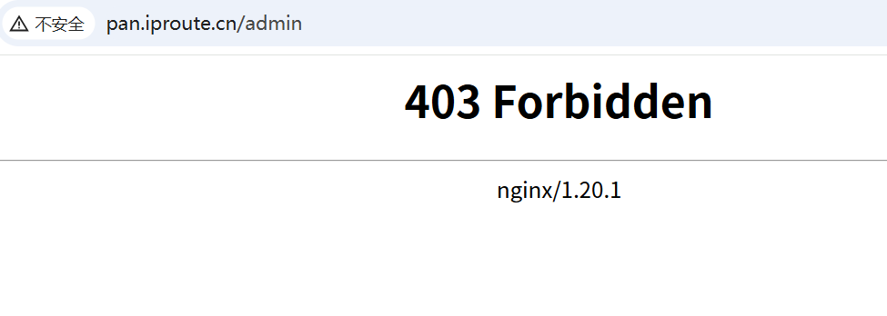

- 基于http用户名密码的认证

```bash
# -c 新建配置文件，并且添加用户admin
# 生成密码文件
## 首次创建
[root@localhost]:~$ htpasswd -c /etc/nginx/.htpasswd admin
New password: 
Re-type new password: 
Adding password for user admin
[root@localhost]:~$ htpasswd /etc/nginx/.htpasswd root
New password: 
Re-type new password: 
Adding password for user root
[root@localhost]:~$ cat /etc/nginx/conf.d/pan.conf 
server {
    listen 80;
    server_name pan.iproute.cn;
    root /data/nginx/pan;
    location / {
          index index.html;
    }

    location /pan {
    	  autoindex on;
	  autoindex_exact_size off;
	  autoindex_localtime on;
	  autoindex_format html;
	  limit_rate 10m;
    }
	
    location /admin {
          auth_basic "FBI Warning!!!";
	  auth_basic_user_file /etc/nginx/.htpasswd;
    }

}
```


- 根据变量中的特定内容，可以做认证
  - 拒绝windows访问

```bash
[root@localhost]:~$ cat /etc/nginx/conf.d/pan.conf 
server {
    listen 80;
    server_name pan.iproute.cn;
    root /data/nginx/pan;
    if ($http_user_agent ~* windows) {
        return 403;
    }
    ...
}

```


# 7. 日志相关

- 修改官方日志，加上访问的实际路径
- nginx的变量含义，可以在官方文档查询到：https://nginx.org/en/docs/varindex.html
- nginx变量可以在配置文件任何地方使用

```bash
[root@localhost]:/var/log/nginx$ vim /etc/nginx/nginx.conf
...
http {
    log_format  main  '$remote_addr - $remote_user [$time_local] "$request" '
                      '$status $body_bytes_sent "$http_referer" '
                      '"$http_user_agent" "$http_x_forwarded_for""$request_filename"';

    access_log  /var/log/nginx/access.log  main;	# 在这里选择日志格式
...
```

- 常用变量

```bash
$remote_addr;
# 存放了客户端的地址，注意是客户端的公网IP
$proxy_add_x_forwarded_for;
# 此变量表示将客户端IP追加请求报文中X-Forwarded-For首部字段，多个IP之间用逗号分隔，如果请求中没有X-Forwarder-For，就使用$remote_addr
$args;
# 变量中存放了URL中的参数
$document_root;
# 保存了针对当前资源的系统根目录
$document_uri;
# 保存了当前请求中不包含参数的URI,注意是不包含请求的指令，比如/img/logo.png
$host;
# 存放了请求的host名称
limit_rate 10240;
echo $limit_rate;
# 如果nginx服务器使用limit_rate配置了显示网络速率，则会显示，如果没有设置，则显示0
$remote_port;
# 客户端请求Nginx服务器时随机打开的端口，这是每个客户端自己的端口
$remote_user;
# 已经经过Auth Basic Module验证的用户名
$request_body_file;
# 做反向代理时发给后端服务器的本地资源的名称
$request_method;
# 请求资源的方式，GET/PUT等等
$request_filename;
# 当前请求的资源文件的磁盘路径，由root或alias指令与URL请求生成的文件绝对路径
# /apps/nginx/html/www/index.html
$request_uri;
# 包含请求参数的原始URI,不包含主机名，相当于:$document_uri?$args
$scheme;
# 请求的协议，例如：http,https,ftp等等
$server_protocol;
# 保存了客户端请求资源使用的协议版本，例如：HTTP/1.0,HTTP/1.1,HTTP/2.0等等
$server_addr;
# 保存了服务器的IP地址
$server_name;
# 请求的服务器的主机名
$server_port;
# 请求的服务器的端口号
$http_<name>
# name为任意请求报文首部字段，表示记录请求报文的首部字段
$http_user_agent;
# 客户端浏览器的详细信息
$http_cookie;
# 客户端的cookie信息
$cookie_<name>
# name为任意请求报文首部字段cookie的key名
```

- 可以自定义变量

# 8. 网页压缩

- 相关的配置

```bash
# 启用或禁用 gzip 压缩，默认关闭
gzip on | off;
# 压缩比由低到高1到9，默认为1
gzip_comp_level level;
# 禁用 IE6 gzip 功能
gzip_disable "MSIE [1-6]\.";
# gzip 压缩的最小文件，小于设置值的文件将不会压缩
gzip_min_length 1k;
# 启用压缩功能时，协议的最小版本，默认 HTTP/1.1
gzip_http_version 1.0 | 1.1;
# 指定 Nginx 服务需要向服务器申请的缓存空间的个数和大小，平台不同，默认：32 4k或者 16 8k
gzip_buffers number size;
# 指明仅对哪些类型的资源执行压缩操作，默认为 gzip_types text/html，不用显示指定，否则出错
gzip_types mime-type ...;
# 如果启用压缩，是否在相应报文首部插入 "vary: Accept-Encoding"，一般建议打开
gzip_vary on | off
```

- 可以尝试修改配置文件，对比压缩前后的区别

```bash
[root@localhost]:/etc/nginx/conf.d$ cat pan.conf 
server {
    listen 80;
    server_name pan.iproute.cn;
    root /data/nginx/pan;
    gzip on;
    gzip_comp_level 9;
    gzip_min_length 1k;
    gzip_vary on;
    location / {
          index index.html;
    }

    location /pan {
    	  autoindex on;
	  autoindex_exact_size off;
	  autoindex_localtime on;
	  autoindex_format html;
	  limit_rate 10m;
    }
	
    location /admin {
          auth_basic "FBI Warning!!!";
	  	  auth_basic_user_file /etc/nginx/.htpasswd;
    }

}
```


# 9. 第三方模块

- 第三方模块是对nginx的功能扩展，第三方模块需要在编译安装Nginx的时候使用参数--add-module=PATH指定路径添加，有的模块是由公司的开发人员针对业务需求定制开发的，有的模块是开源爱好者开发好之后上传到github进行开源的模块，nginx支持第三方模块需要从源码重新编译支持.

- 开源 **echo模块**：https://github.com/openresty/echo-nginx-module

```bash
[root@localhost nginx-1.22.0]# vim /apps/nginx/conf.d/echo.conf
server {
    listen 80;
    server_name echo.iproute.cn;

    location /main {
        index index.html;
        default_type text/html;
        echo "hello world,main-->";
        echo $remote_addr;
        echo_reset_timer;
        # 将计时器开始时间重置为当前时间

        echo_location /sub1;
        echo_location /sub2;
        echo "took $echo_timer_elapsed sec for total.";
}
    location /sub1 {
        echo_sleep 2;
        echo hello;
}
    location /sub2 {
        echo_sleep 1;
        echo world;
}
}


# 重新编译nginx，以前的配置文件不会丢失
[root@localhost ~]# cd /usr/local/src
[root@localhost src]# wget https://github.com/openresty/echo-nginx-module/archive/refs/heads/master.zip
[root@localhost src]# unzip echo-nginx-module-master.zip
[root@localhost src]# mv echo-nginx-module-master echo-nginx-module
[root@localhost src]# cd nginx-1.22.0
[root@localhost nginx-1.22.0]# ./configure --prefix=/apps/nginx \
--user=nginx \
--group=nginx \
--with-http_ssl_module \
--with-http_v2_module \
--with-http_realip_module \
--with-http_stub_status_module \
--with-http_gzip_static_module \
--with-pcre \
--with-stream \
--with-stream_ssl_module \
--with-stream_realip_module \
--add-module=/usr/local/src/echo-nginx-module
[root@localhost nginx-1.22.0]# make -j 2 && make install

# 停止yum版本的nginx
[root@localhost ~]# systemctl stop nginx

# 启动编译版本的nginx
[root@localhost ~]# /apps/nginx/sbin/nginx -c /apps/nginx/conf/nginx.conf

# 进行访问测试
[root@localhost ~]# echo "192.168.173.1 echo.iproute.cn" >> /etc/hosts
[root@localhost ~]# curl echo.iproute.cn/main
hello world,main-->
192.168.88.140
hello
world
took 3.008 sec for total.
```

# 10 其他配置

## 10.1 Alias

- **alias：** 定义路径别名，会把访问的路径重新定义到其指定的路径，文档映射的另一种机制，仅能用于location上下文，此指令使用较少

```bash
[root@localhost]:/etc/nginx/conf.d$ cat pan.conf 
server {
    listen 80;
    server_name pan.iproute.cn;
    root /data/nginx/pan;
,,,
    
    location /website01/ {
     		# 当访问website01的时候，nginx将/data/nginx/site01/作为返回内容的目录
          alias /data/nginx/site01/;
    }

}
```


## 10.2 自定义错误页面

- 定义错误页，以指定的响应状态码进行响应,可用位置: http, server, location, if in location

```bash
[root@localhost]:/etc/nginx/conf.d$ cat pan.conf
server {
    listen 80;
    server_name pan.iproute.cn;
    root /data/nginx/pan;
    ....

    error_page 404 /40x.html;
    location /40x.html{
          root /data/nginx/error_page;
    }

}

# 准备一个404页面
[root@localhost]:/data/nginx$ cd error_page/
[root@localhost]:/data/nginx/error_page$ vim 40x.html
[root@localhost]:/data/nginx/error_page$ nginx -s reload

```


## 10.3 长连接配置

- 可以修改keepalive的时间

```bash
[root@localhost]:/etc/nginx/conf.d$ cat pan.conf
server {
    listen 80;
    server_name pan.iproute.cn;
    root /data/nginx/pan;
    keepalive_timeout 60;
    keepalive_requests 100000;
。。。。。。
```

## 10.4 作为下载服务器

- ngx_http_autoindex_module模块处理以斜杠字符"/"结尾的请求，并生成目录列表可以做为下载服务配置使用

- 相关指令：

  ```shell
  autoindex on|off;
  # 自动文件索引功能，默认off
  autoindex_exact_size on|off;
  # 计算文件确切大小(单位bytes),off显示大概大小(单位K、M),默认on
  autoindex_localtime on|off;
  # 显示本机时间而非GMT(格林威治)时间,默认off
  autoindex_format html|xml|json|jsonp;
  # 显示索引的页面分割，默认html
  limit_rate rate;
  # 限制响应客户端传输速率(除GET和HEAD以外的所有方法),单位B/s,既bytes/second,默认值0，表示无限制，此指令由ngx_http_core
  ```

```bash
[root@localhost]:/etc/nginx/conf.d$ cat /etc/nginx/conf.d/pan.conf
server {
    listen 80;
    server_name pan.iproute.cn;
    root /data/nginx/pan;
    location / {
          index index.html;
    }

    location /pan {
    	  autoindex on;
	  autoindex_exact_size off;
	  autoindex_localtime on;
	  autoindex_format html;
	  limit_rate 10m;
	  add_before_body /autoindex/header.html;
      add_after_body /autoindex/footer.html;
    }
}
[root@localhost]:/etc/nginx/conf.d$ nginx -t
nginx: the configuration file /etc/nginx/nginx.conf syntax is ok
nginx: configuration file /etc/nginx/nginx.conf test is successful
[root@localhost]:/etc/nginx/conf.d$ echo "<meta charset='utf-8'>资源下载站" > /data/nginx/pan/index.html
[root@localhost]:/etc/nginx/conf.d$ nginx -s reload
[root@localhost]:/etc/nginx/conf.d$ dd </dev/zero >/data/nginx/pan/pan/testfile bs=512M count=4
4+0 records in
4+0 records out
2147483648 bytes (2.1 GB, 2.0 GiB) copied, 40.3716 s, 53.2 MB/s

```

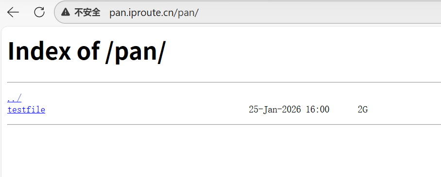

- 限速10M/s


- 可以放好看的头部和底部:https://github.com/Aaronxwz/nginx_autoindex

## 10.5 上传功能

- 上传功能是配合后端代码实现的，可以对上传的文件做一定的限制
  - 最常见调整的是：`client_max_body_size 1m;`

```bash
client_max_body_size 1m;
# 设置允许客户端上传单个文件的最大值，默认值为1m,上传文件超过此值会出现413错误
client_body_buffer_size size;
# 用户接受每个客户端请求报文的body部分的缓冲区大小;默认16k;超出此大小时，其将被暂存到磁盘上client_body_temp_path指定所定义的位置
client_body_temp_path path [level1 [level 2 [level 3]]];
# 设定存储客户端请求报文的body部分的临时存储路径及子目录结构和数量，目录名为16进制的数字，使用hash之后的值从后往前截取1位、2位、2位作为目录名
# 1级目录占1位16进制，即2^4=16个目录 0-f
# 2级默认占2位16进制，即2^8=256个目录 00-ff
# 3级目录占2位16进制，即2^8=256个目录
#因为如果所有上传的文件都放在一个文件夹下，不仅很容易文件名冲突，并且容易导致一个文件夹特别大。所以有必要创建子目录这里的level1,2,3如果有值就代表存在一级，二级，三级子目录。目录名是由数字进行命名的，所以这里的具体的值就是代表目录名的数字位数，比如如果如下设置
#client_body_temp_path  /spool/nginx/client_temp 3 2;
#可能创建的文件路径为
#/spool/nginx/client_temp/702/45/00000123457
[root@localhost ~]# md5sum f1
d41d8cd98f00b204e9800998ecf8427e  f1
[root@localhost ~]# md5sum f2
b026324c6904b2a9cb4b88d6d61c81d1  f2
```

## 10.6 Nginx状态页

- 状态页显示的是整个服务器的状态，而非虚拟主机的状态

```bash
[root@localhost]:/etc/nginx/conf.d$ cat www.conf 
server {
    listen 80;
    server_name status.test.com;

    location /status {
        stub_status on;
        # 开启nginx状态页显示
        allow 192.168.73.0/24;
        deny all;
    }
}

```

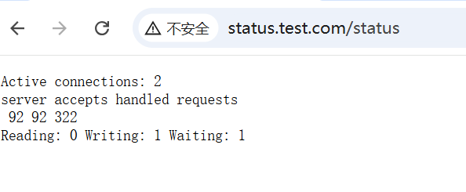

- Active connections: 2 表示Nginx正在处理的活动连接数2个。
- server 92 表示Nginx启动到现在共处理了92个连接
- accepts 92 表示Nginx启动到现在共成功创建92次握手
- handled requests 322 表示总共处理了 322 次请求
- Reading:Nginx 读取到客户端的 Header 信息数，数值越大，说明排队越长，性能不足
- Writing:Nginx 返回给客户端 Header 信息数，数值越大，说明访问量越大
- Waiting:Nginx 已经处理完正在等候下一次请求指令的驻留链接（开启keep-alive的情况下，这个值等于Active-(Reading+Writing)）

## 10.7 其他

- 是否启用asynchronous file I/O(AIO)功能，需要编译开启`--with-file-aio`
- 在读取文件的时候使用异步可以提高效率

```bash
[root@localhost nginx-1.22.0]# vim /apps/nginx/conf.d/www.conf
server {
  listen 80;
  server_name file.test.com;
  aio on;
...
}
```

# 11. https

- 部署基于ssl的http认证
  - 简单来说，**PKI（公钥基础设施）** 和 **CA（证书颁发机构）** 的存在是为了解决互联网通信中的“信任”问题。它们的核心作用是证明“你连接的那个网站/服务器，确实就是它声称的那个人
- 生成ca证书

```bash
[root@localhost]:~$ cd /etc/nginx/
[root@localhost]:/etc/nginx$ mkdir certs && cd certs
[root@localhost]:/etc/nginx/certs$ openssl req -newkey rsa:4096 -nodes -sha256 -keyout ca.key -x509 -days 3650 -out ca.crt
[root@localhost]:/etc/nginx/certs$ ls
ca.crt  ca.key
[root@localhost]:/etc/nginx/certs$ sz ca.crt		# 发送到自己电脑

```

- 导入ca证书到本地


- 生成证书请求文件
  - server's hostname 写一下域名

```bash
[root@localhost]:/etc/nginx/certs$ openssl req -newkey rsa:4096 -nodes -sha256 -keyout ssl.iproute.cn.key -out ssl.iproute.cn.csr
```

- 签发证书

```bash
[root@localhost]:/etc/nginx/certs$ openssl x509 -req -days 36500 -in ssl.iproute.cn.csr -CA ca.crt -CAkey ca.key -CAcreateserial -out ssl.iproute.cn.crt
[root@localhost]:/etc/nginx/certs$ cat ssl.iproute.cn.crt ca.crt > iproute.crt

```

- 验证证书内容是否合法

```bash
[root@localhost]:/etc/nginx/certs$ openssl x509 -in ssl.iproute.cn.crt -noout -text
```

- 配置证书

```bash
[root@localhost]:/etc/nginx/certs$ cat /etc/nginx/conf.d/ssl.conf
server {
    listen 80;
    listen 443 ssl;
    server_name ssl.iproute.cn;
    ssl_certificate /etc/nginx/certs/iproute.crt;
    ssl_certificate_key /etc/nginx/certs/ssl.iproute.cn.key;
    ssl_session_cache shared:sslcache:20m;
    ssl_session_timeout 10m;
    root /data/nginx/site01;
}

[root@localhost]:/etc/nginx/certs$ nginx -t
nginx: the configuration file /etc/nginx/nginx.conf syntax is ok
nginx: configuration file /etc/nginx/nginx.conf test is successful
[root@localhost]:/etc/nginx/certs$ nginx -s reload
```

- 访问测试


# 12 性能优化

## 12.0 Nginx 架构和进程

### 12.0.1 Nginx架构

Nginx 采用了 master-worker 架构，由 master 进程负责通信和调度，worker 进程响应具体的请求

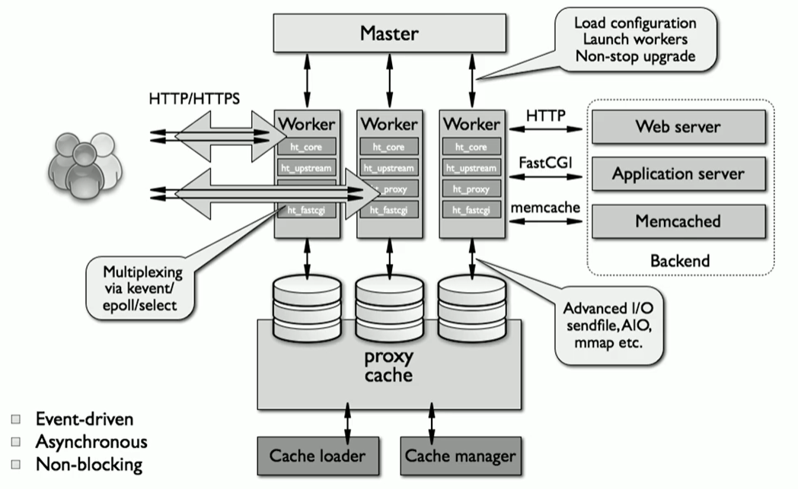

### 12.0.2 Nginx进程模型

Nginx 的进程模型是其高性能和高并发的核心，采用多进程架构（默认模式），主要由 Master 进程和多个 Worker 进程组成，结合**异步非阻塞 I/O 模型**实现高效请求处理

[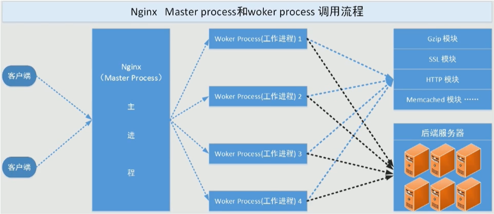](https://git.inmind-lab.com/aaronxu/Linux-book/src/branch/main/02.企业服务/05.Nginx/Nginx进程模型.png)

**Master 进程:**

- 对外接口：接收外部的操作(信号)
- 对内转发：根据外部的操作的不同，通过信号管理 worker
- 监控：监控 worker 进程的运行状态，worker 进程异常终止后，自动重启 worker 进程
- 配置加载：读取 Nginx 配置文件并验证其有效性和正确性
- 管理连接：建立、绑定和关闭 socket 连接
- 按照配置生成、管理和结束工作进程
- 接受外界指令，比如重启、升级及退出服务器等指令
- 不中断服务，实现平滑升级，重启服务并应用新的配置
- 开启日志文件，获取文件描述符
- 不中断服务，实现平滑升级，升级失败进行回滚处理

**Worker 进程:**

- 所有 Worker 进程都是平等的，接受处理客户的请求
- 实际处理：网络请求，由 Worker 进程处理
- Worker进程数量：在nginx.conf 中配置，一般设置为核心数，充分利用 CPU 资源，同时，避免进程数量过多，避免进程竞争 CPU 资源，增加上下文切换的损耗。
- 将请求依次送入各个功能模块进行处理
- I/O调用，获取响应数据
- 与后端服务器通信，接收后端服务器的处理结果
- 缓存数据，访问缓存索引，查询和调用缓存数据
- 发送请求结果，响应客户的请求
- 接收主程序指令，比如重启、升级和退出等

**工作细节**

[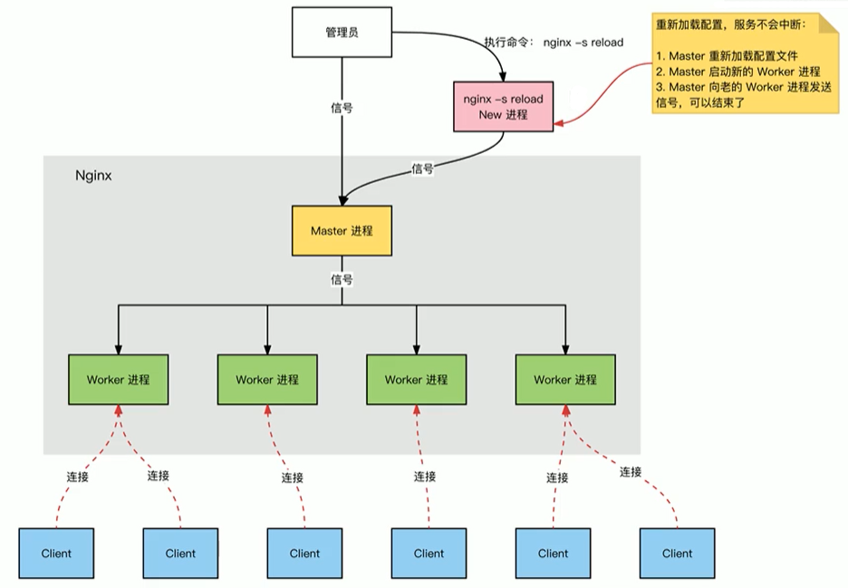](https://git.inmind-lab.com/aaronxu/Linux-book/src/branch/main/02.企业服务/05.Nginx/Nginx进程模型工作细节01.png)

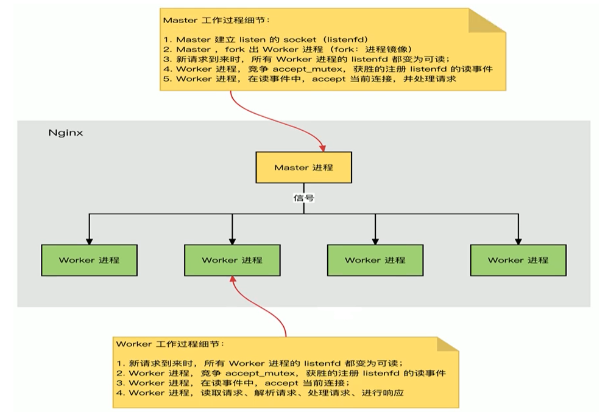

### 12.0.3 Nginx进程间通信

**图示如下**

[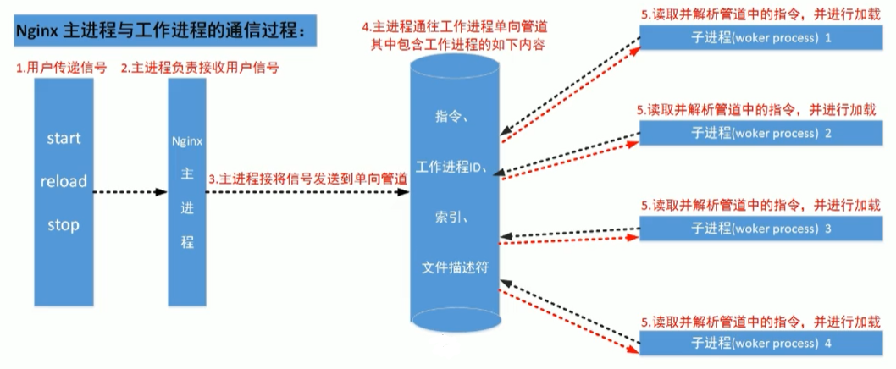](https://git.inmind-lab.com/aaronxu/Linux-book/src/branch/main/02.企业服务/05.Nginx/Nginx进程间通信.png)

**信号**：Master 进程通过信号控制 Worker 进程的生命周期及配置更新，典型场景：SIGHUP（重新加载配置文件）、SIGTERM（优雅关闭 Worker 进程）、SIGUSR1（重新打开日志文件） **管道**：Master 进程与 Worker 进程之间单向传递指令，Master 进程传递 Worker ID、指令、索引、文件描述符等等，Worker 进程监听管道事件并执行具体事项 **共享内存**：Worker 进程间共享数据，典型场景：限流计数、缓存状态等等

### 12.0.4 HTTP 请求处理流程

**图示如下**


## 12.1 CPU

```bash
user    nginx nginx;    #启动Nginx工作进程的用户和组
worker_processes [number | auto];   #启动Nginx工作进程的数量，一般设为和CPU核心数相同
worker_cpu_affinity 0001 0010 0100 1000;  # 将Nginx工作进程绑定到指定的CPU核心，默认Nginx是不进行进程绑定的，绑定并不是意味着当前nginx进程独占一核心CPU，但是可以保障此进程不会运行在其他核心上，这就极大减少了nginx的工作进程在不同的cpu核心上的来回跳转，减少了cpu对进程的资源分配与回收以及内存管理等，因此可以有效的提升nginx服务器的性能。
CPU MASK：0001    0号CPU
          0010    1号CPU
          0100    2号CPU
          1000    3号CPU
[root@localhost ~]# watch -n.5 'ps axo pid,cmd,psr |grep nginx'
# 查看nginx进程对应的CPU
  6834 nginx: master process /apps   2
 47621 nginx: worker process         0
 47622 nginx: worker process         1
 47623 nginx: worker process         2
 47624 nginx: worker process         3
[root@localhost ~]# while true;do ab -c 1000 -n 2000 http://127.0.0.1/;done
# 压力测试 要先yum -y install httpd-tools
```

## 12.2 工作优先级

- 调整worker进程的优先级(nice值)
  - nice可以影响CPU调度时间周期
  - -20是最高优先级，19是最低优先级，0是默认
- 调整每个Worker能打开的文件数
  - 由于Linux中一切皆文件，所以各种连接也都是文件，最大文件打开数会影响并发
  - 调整系统的limits，才可以让nginx配置文件中`worker_rlimit_nofile`生效

```bash
worker_priority 0;   #工作进程优先级(-20~19)
#所有worker进程能打开的文件数量上线，
#包括：Nginx的所有连接(例如与代理服务器的连接等)，而不仅仅是与客户端的连接，
#另一个考虑因素是实际的并发连接数不能超过系统级别的最大打开文件数的限制，最好与ulimit -n的值保持一致
worker_rlimit_nofile 65536;     
[root@localhost ~]# vim /etc/security/limits.conf
*        soft    nofile    102400
*        hard    nofile    102400


# 案例-修改优先级
root@localhost nginx-1.22.0]# vim /apps/nginx/conf/nginx.conf
worker_priority -20;

#重载配置
[root@localhost nginx-1.22.0]# nginx -t
[root@localhost nginx-1.22.0]# systemctl restart nginx

# 查看优先级
[root@localhost ~]# watch -n.5 'ps axo pid,cmd,psr,nice |grep nginx'
Every 0.5s: ps axo pid,cmd,psr,nice |grep nginx                   Mon Jul 15 08:11:44 2024

 22950 nginx: master process /apps   1   0
 22951 nginx: worker process         0 -20
 22952 nginx: worker process         1 -20
 22953 nginx: worker process         2 -20
 22954 nginx: worker process         3 -20
 23004 grep nginx                    3   0
```

## 12.3 其他优化

```bash
daemon off;    # 前台运行nginx服务，用于测试、docker等环境
master_process off|on;    # 是否开启Nginx的master-worker工作模式，仅用于开发调试场景，默认为on
events {
  worker_connections 65536;    # 设置单个工作进程的最大并发连接数
  use epoll;    # 使用epoll事件驱动，Nginx支持众多的事件驱动，比如：select、poll、epoll,只能设置在events模块中
  accept_mutex on;  # on为同一时刻一个请求轮流由work进程处理，而防止被同时唤醒所有worker，避免多个睡眠进程被唤醒的设置，默认为off,新请求会唤醒所有worker进程，此过程也被称为"惊群",因此nginx刚安装完以后要进行适当的优化，建议设置为on
  multi_accept on;  # on时Nginx服务器的每个工作进程可以同时接受多个新的网络连接，此指令默认为off，即默认为一个工作进程只能一次接受一个新的网络连接，打开后几个同时接受多个，建议设置为on
}
```

- 默认配置并不支持高并发，在压力测试下会报错

```shell
[root@localhost ~]# yum install -y httpd-tools
[root@localhost ~]# while true;do ab -c 1000 -n 10000 http://127.0.0.1/;sleep 0.5;done

[root@localhost ~]# tail /apps/nginx/logs/error.log
2021/05/24 12:35:53 [crit] 6828#0: *10996 open() "/apps/nginx/html/index.html" failed (24: Too many open files), client: 127.0.0.1, server: localhost, request: "GET / HTTP/1.0", host: "127.0.0.1"
2021/05/24 12:35:53 [crit] 6828#0: *10996 open() "/apps/nginx/html/50x.html" failed (24: Too many open files), client: 127.0.0.1, server: localhost, request: "GET / HTTP/1.0", host: "127.0.0.1"

[root@localhost ~]# vim /etc/security/limits.conf
*        -       nproc     100000
[root@localhost ~]# vim /apps/nginx/conf/nginx.conf
worker_rlimit_nofile 65536;
events {
    worker_connections  10240;
}
[root@localhost ~]# systemctl restart nginx
```

# 13. LNMP架构

- LNMP是一套技术的组合，L=Linux、N=Nginx、M=MySQL、P=PHP

- 首先 nginx 服务是不能处理动态请求，那么当用户发起动态请求时，nginx 无法处理
- 当用户发起 http 请求，请求会被 nginx 处理，如果是静态资源请求 nginx 则直接返回，如果是动态请求 nginx 则通过 fastcgi 协议转交给后端的 PHP 程序处理


## 13.1 部署

```bash
[root@localhost]:~$ vim /etc/php-fpm.d/www.conf
...
;listen = /run/php-fpm/www.sock
listen = 0.0.0.0:9000
...
[root@localhost]:~$ systemctl restart php-fpm
# mysql还在
[root@localhost]:~$ mysql -uroot -p123456 -e "show databases;"
+--------------------+
| Database           |
+--------------------+
| information_schema |
| kodbox             |
| mysql              |
| performance_schema |
| typecho            |
+--------------------+
# 准备测试页面
[root@localhost]:/data/nginx$ mkdir -pv lnmp
mkdir: created directory 'lnmp'
[root@localhost]:/data/nginx$ cat << EOF > /data/nginx/lnmp/index.php
<?php
    phpinfo();
?>
EOF
# 添加 nginx vhost 配置文件：将 php 请求转给 php-fpm 处理
[root@localhost]:/etc/nginx/conf.d$ cat php.conf
server {
    listen 80;
    server_name php.iproute.cn;
    root /data/nginx/lnmp;

    location / {
        index index.php index.html;
        }
    location ~ \.php$ {
        fastcgi_pass 127.0.0.1:9000;
        fastcgi_param SCRIPT_FILENAME $document_root$fastcgi_script_name;
        include fastcgi_params;
        }
}
# 一定要给权限
[root@localhost]:/etc/nginx/conf.d$ chown -R www:www /data/nginx/
[root@localhost]:/etc/nginx/conf.d$ nginx -s reload

```

- 访问探针

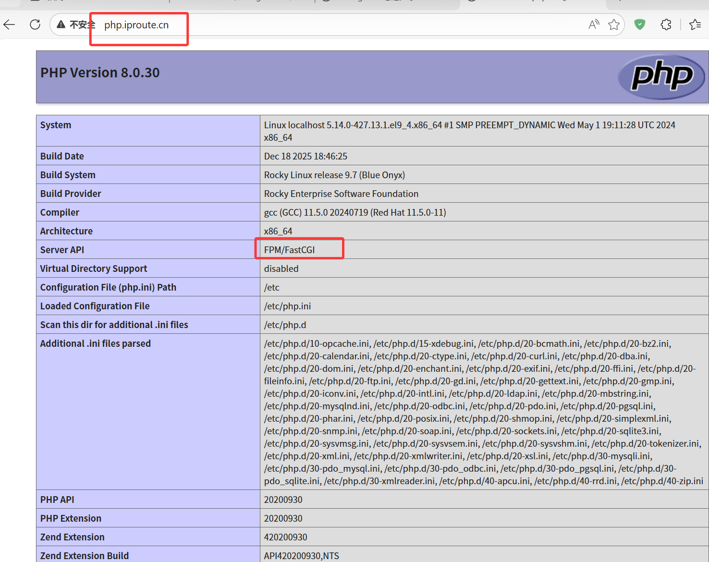

## 13.2 phpmyadmin

```bash
# 创建虚拟主机
[root@localhost]:/etc/nginx/conf.d$ cat pma.conf 
server {
    listen 80;
    server_name pma.iproute.cn;
    root /data/nginx/pma;

    location / {
        index index.php index.html;
    }

    location ~ \.php$ {
        fastcgi_pass 127.0.0.1:9000;
        fastcgi_param SCRIPT_FILENAME $document_root$fastcgi_script_name;
        include fastcgi_params;
    }
}

# 到/data/nginx/pma目录下上传phpmyadmin源码
root@localhost]:/data/nginx/pma$ ls
CONTRIBUTING.md
ChangeLog
LICENSE
README
RELEASE-DATE-5.1.1
babel.config.json
composer.json
composer.lock
config.sample.inc.php
doc
examples
favicon.ico
index.php
js
libraries
locale
package.json
phpMyAdmin-5.1.1-all-languages.zip
print.css
robots.txt
setup
show_config_errors.php
sql
templates
themes
url.php
vendor
yarn.lock
[root@localhost]:/data/nginx/pma$ nginx -s reload
```

- 发现报错了，是session文件夹没有权限

```bash
[root@localhost]:/etc/nginx/conf.d$ chown -R www:www /var/lib/php/session
```

- 访问phpmyadmin成功

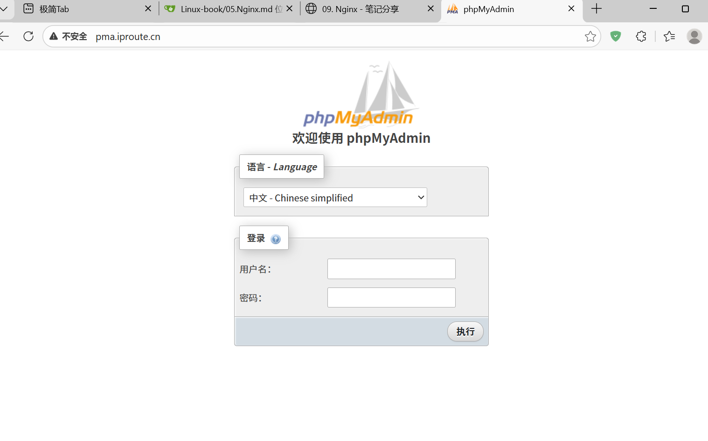

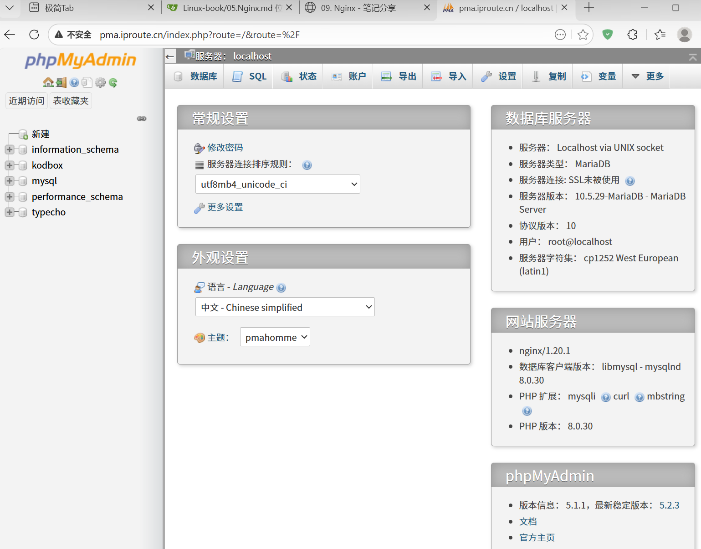

## 13.3 部署论坛

- 下载discuz的源代码
  - https://www.discuz.vip/download

```bash
[root@localhost]:/etc/nginx/conf.d$ cat discuz.conf 
server {
    listen 80;
    server_name bbs.iproute.cn;
    root /data/nginx/discuz;
    index index.php index.html;

    location ~ .*\.php(\/.*)*$ {
        fastcgi_pass   127.0.0.1:9000;
        fastcgi_index  index.php;
        fastcgi_param  SCRIPT_FILENAME $document_root$fastcgi_script_name;
        include fastcgi_params;
    }
}

# 上传论坛源代码
[root@localhost]:/etc/nginx/conf.d$ cd
[root@localhost]:~$ mkdir -p /data/nginx/discuz && cd /data/nginx/discuz
[root@localhost]:/data/nginx/discuz$ ls
Discuz_X3.5_SC_UTF8_20250901.zip  readme.html
LICENSE                           upload
qqqun.png                         utility.html
readme
[root@localhost]:/data/nginx/discuz$ ls
Discuz_X3.5_SC_UTF8_20250901.zip  member.php
LICENSE                           misc.php
admin.php                         plugin.php
api                               portal.php
api.php                           qqqun.png
archiver                          readme
config                            readme.html
connect.php                       robots.txt
crossdomain.xml                   search.php
data                              source
favicon.ico                       static
forum.php                         template
group.php                         uc_client
home.php                          uc_server
index.php                         upload
install                           utility.html
# 给权限，更新nginx配置
[root@localhost]:/data/nginx/discuz$ mv upload/* .
[root@localhost]:/data/nginx/discuz$ chown -R www:www /data/nginx/discuz/
[root@localhost]:/data/nginx/discuz$ nginx -s reload

```

- 创建discuz数据库

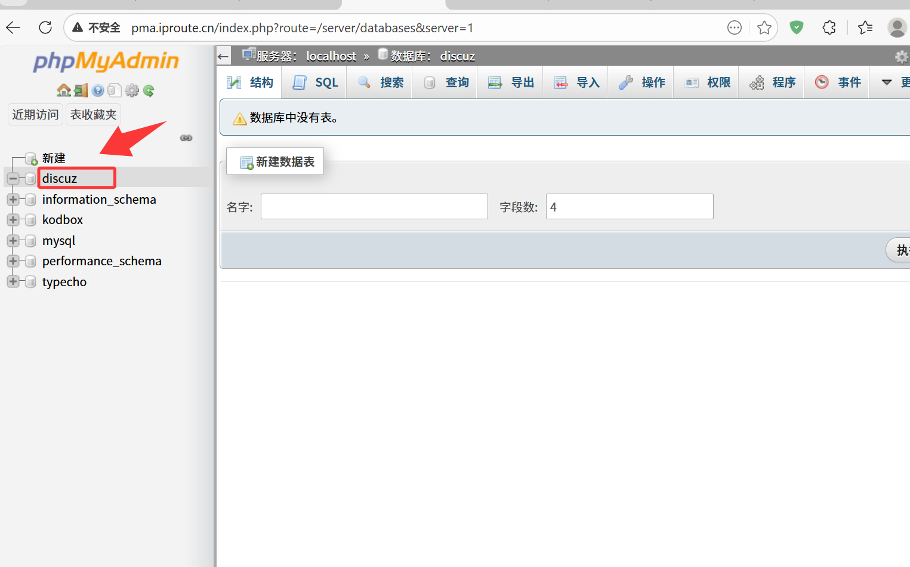

- 开始安装


- 论坛搭建完成

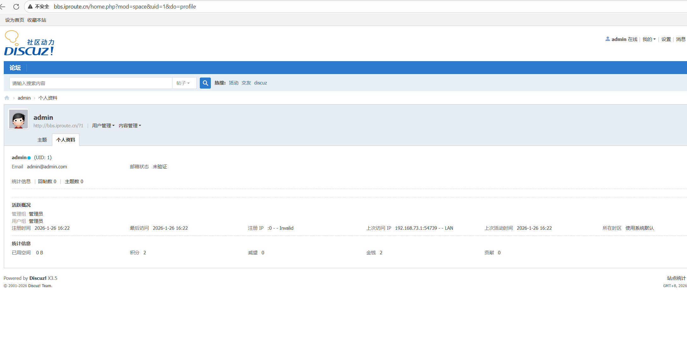

## 13.4 网盘部署

- 部署虚拟主机

```bash
[root@localhost]:/etc/nginx/conf.d$ cat kod.conf
server {
        listen 80;
        server_name kod.iproute.cn;
        root /data/nginx/kod;
        index index.php index.html;

        location ~ .*\.php(\/.*)*$ {
                root /data/nginx/kod;
                fastcgi_pass   127.0.0.1:9000;
                fastcgi_index  index.php;
                fastcgi_param  SCRIPT_FILENAME $document_root$fastcgi_script_name;
                include fastcgi_params;
        }
}
[root@localhost]:/etc/nginx/conf.d$ nginx -t
nginx: the configuration file /etc/nginx/nginx.conf syntax is ok
nginx: configuration file /etc/nginx/nginx.conf test is successful
# 可以更新表明语法也就没有问题了
[root@localhost]:/etc/nginx/conf.d$ nginx -s reload
```

- 上传kodbox网盘源代码

```bash
[root@localhost]:/data/nginx$ mkdir kod && cd kod
# 使用wget或者通过windows本地上传
[root@localhost]:/data/nginx/kod$ ls
Changelog.md  config  index.php        plugins
app           data    kodbox.1.64.zip  static
# 上传源码的目录要给访问权限
[root@localhost]:/data/nginx/kod$ chown -R www:www /data/nginx/kod
```

- 进入安装页面

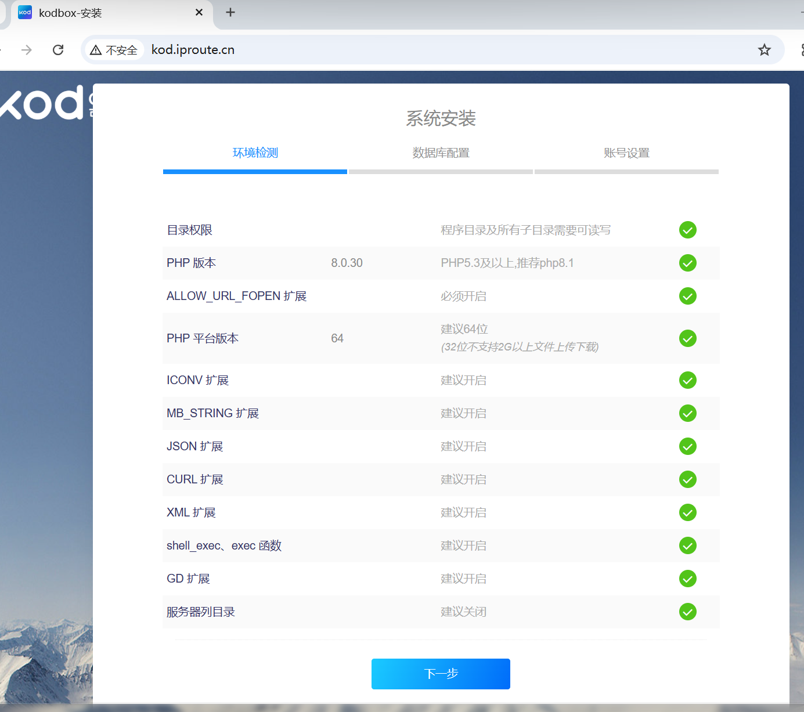

- 创建kodbox数据库


- 安装成功


# 14. 代理服务

- 正向代理和反向代理

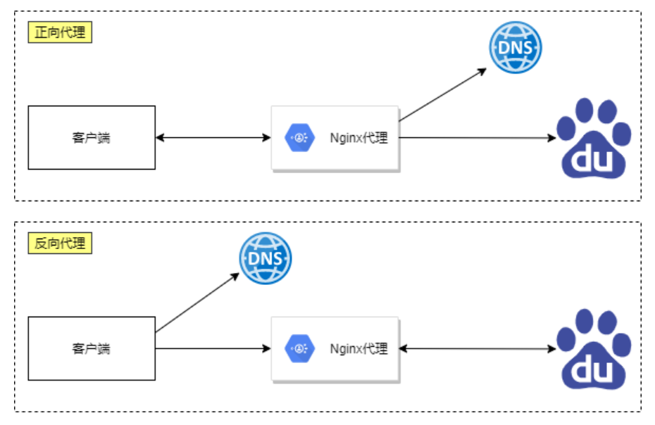

- 正向代理与反向代理的区别
  - 区别在于形式上服务的”对象”不一样
  - 正向代理代理的对象是客户端，为客户端服务
    - 比如：明星的经纪人
  - 反向代理代理的对象是服务端，为服务端服务
    - 比如：公司的传达室
- Nginx作为代理服务，可支持的代理协议非常的多
- 常用优化配置

```bash
[root@Nginx ~]# vim /etc/nginx/proxy_params
proxy_set_header Host $http_host;
proxy_set_header X-Real-IP $remote_addr;
proxy_set_header X-Forwarded-For $proxy_add_x_forwarded_for;
 
proxy_connect_timeout 30;
proxy_send_timeout 60;
proxy_read_timeout 60;
 
proxy_buffering on;
proxy_buffer_size 32k;
proxy_buffers 4 128k;
```

## 14.1 反向代理实战

- 为了方便部署后端应用，安装一下docker引擎
- 安装教程

```bash
rm -f /etc/yum.repos.d/docker-ce.repo
wget -O /etc/yum.repos.d/docker-ce.repo http://mirrors.aliyun.com/docker-ce/linux/centos/docker-ce.repo
yum makecache
yum install -y docker-ce docker-ce-cli containerd.io --allowerasing
systemctl enable --now docker
```

- 安装好docker之后，可以跑如下服务

```bash
[root@localhost]:~$ docker run -d --name lipstick --restart=always registry.cn-hangzhou.aliyuncs.com/eagleslab/games:lipstick
# 加名字可以查看服务IP地址，看最后的IPAdress值
```

- 出现一个问题，此服务是运行在内部网络中的，外部无法访问，需要一个代理
  - 配置nginx可以作为反向代理

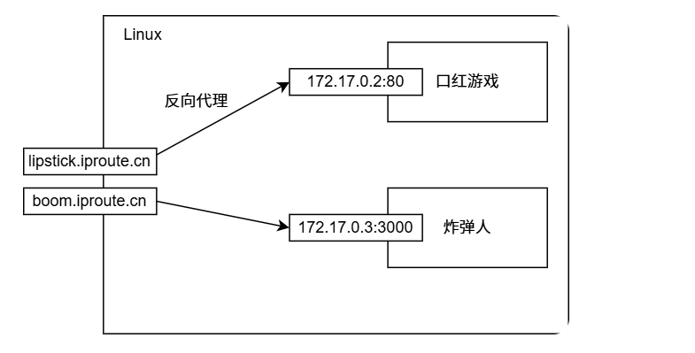

```bash
[root@localhost]:/etc/nginx/conf.d$ cat lipstick.conf 
server {
    listen 80;
    server_name lipstick.iproute.cn;

    location / {
        proxy_pass http://172.17.0.2:80;
        include proxy_params;
    }
}

```


- 炸弹人游戏服务

```bash
[root@localhost]:/etc/nginx/conf.d$ cat boom.conf
server {
    listen 80;
    server_name boom.iproute.cn;

    location / {
        proxy_pass http://172.17.0.3:3000;
        include proxy_params;
    }
}
[root@localhost]:/etc/nginx/conf.d$ docker run -d --name boom --restart=always registry.cn-hangzhou.aliyuncs.com/eagleslab/games:boom
[root@localhost]:/etc/nginx/conf.d$ docker inspect boom
[root@localhost]:/etc/nginx/conf.d$ nginx -s reload
```

- 这个游戏可以联机，可与开两个窗口进行测试


## 14.2 代理路径问题

- 在`proxy_pass`后面的路径是否以`/`结尾是有区别的

| `proxy_pass`地址格式      | 请求 URI 拼接规则                                            | 通俗理解                                   |
| ------------------------- | ------------------------------------------------------------ | ------------------------------------------ |
| **不以** **`/`** **结尾** | 保留`location`匹配的完整路径，将`location`匹配部分 + 后续 URI 拼接到代理地址后 | 代理地址**拼接完整请求路径**               |
| **以** **`/`** **结尾**   | 剔除`location`匹配的路径，仅将`location`后的剩余 URI 拼接到代理地址后 | 代理地址**替换****`location`****匹配部分** |

- 如果location使用正则匹配（~ ~*），proxy_pass 结尾是否加 / 完全无效，Nginx 会忽略location匹配的内容，直接将完整请求 URI拼接到proxy_pass后。

# 15. 网络基础

## 15.1 OSI七层模型

- 由ISO组织制定的一套数字通信标准流程模型，这个模型是一个建议模型，不是强制的。
- 七层模型从高到低
  - 应用层
    - 提供用户的交互接口
  - 表示层
    - 提供数据的编码解码，压缩解压缩，加密解密等处理
  - 会话层
    - 提供会话ID，会话管理
  - 传输层
    - 提供数据的分段，提供具体传输方式，在应用数据前加上TCP/UDP的头部，此层叫做数据段
    - TCP
      - 可靠传输，使用序列号和确认号来确保每个数据都被正确的接受
      - 应用层不需要制定额外的机制，就可以保障数据的准确传输
      - TCP需要有额外的网络开销
    - UDP
      - 不可靠传输，数据不分段，单个的数据不能超过MTU限制
      - 发送后，无法获取到对方是否成功无误的接受
      - 使用UDP如果需要可靠传输，需要应用层面制定额外的机制保障
    - 端口号
      - 将数据与应用的进程号进行绑定
      - 区分电脑上的不同网络应用
      - 源和目的端口号
      - 端口号范围：1-65535
      - 1-1024是预留给公用服务的
        - 80 http
        - 443 https
        - 445 smb
        - 22 ssh
        - 53 dns
        - 23 telnet
        - 3306 mysql
        - 3389 windows远程桌面
  - 网络层
    - 最大传输单元，一个网络数据包常见最大是1500字节，叫做MTU，此层叫做数据包
    - 提供了远程访问的IP地址寻址功能，相当于门牌号码，可以帮助快递找到你在的大概位置
    - 基本概念
      - 公网IP地址、私有IP地址
      - 子网掩码，用于定义网络位，网络位相同表示同一个局域网
      - 广播地址，是主机位都为1，向此地址发送数据，全部局域网都能收到
      - 网络号，是主机位都为0，此地址无法用于通信，是用来代指此局域网的
    - 源和目的IP地址
  - 数据链路层
    - 提供数据完整性校验，需要保证每一个二进制都是正确的，此层叫做数据帧
      - 使用CRC循环冗余校验算法，将二进制计算得到校验值，此校验值在接受的时候会拿来与新计算的比较，如果一致，说明数据有效
    - 提供物理传输接口的编号(MAC地址)，此地址是烧录在芯片上，无法轻易改变，能够确定具体的设备的具体的接口
    - MAC地址并不是全球唯一的，虚拟机的网卡MAC地址随机产生并可自定义，为了保障通信，在一个局域网中，必须唯一
    - 源和目的mac地址
  - 物理层
    - 定义数据传输介质的电气规范（二级制，数据位）
    - 有线
      - 电缆
      - 光缆
      - 接口类型
        - RJ45 水晶头
        - SC连接器 LC连接器
    - 无线

## 15.2 数据封装

- 物理层
- 数据链路层
  - MAC地址
  - ARP协议
    - 向局域网发送二层的广播（目的mac全是1），查询目的IP地址所对应的MAC地址
    - 收到正确的回应，就会记录在本地的ARP表中，下次再访问就可以直接完成数据的封装
    - ARP表是为了保障局域网内通信的
  - 数据在局域网中，具体是从哪一个设备的什么接口接收，由mac地址决定
  - 在windows或者linuxz中查看arp表的命令`arp -a`
- 网络层
  - IP地址
  - 广播传递的范围仅限于同一个局域网，无法跨越IP网段传播
  - 网络层会维护一个路由表，路由表可以指明去往其他网段应该从什么接口出发，每台具备转发能力的网络层设备，都会查询路由表，然后进行转发，经过多跳之后，数据就可以到达目的地所在的局域网
  - 维护路由表的方法
    - 静态路由，手动把路由表条目写上去
    - 动态路由，通过协议，路由器互相学习
      - OSPF
      - BGP
- 传输层
  - 提供端口号
  - 发送端往往是随机端口号，接收端是常用端口号
- 应用层
  - 端口号对应的进程

# 16. 负载均衡

- 负载均衡实验

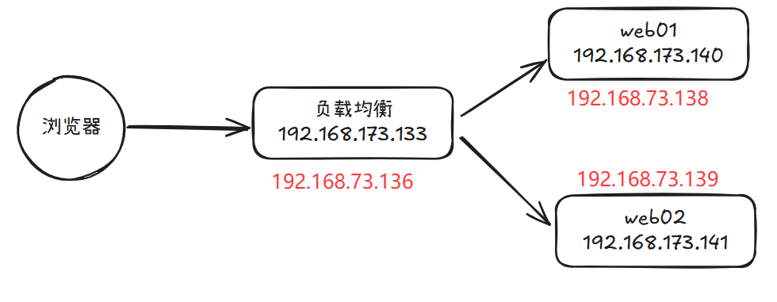

- 部署web01和web02上的网站

```bash
hostnamectl set-hostname web02
yum -y install nginx
systemctl enable --now nginx
systemctl disable --now firewalld
echo Web02 > /usr/share/nginx/html/index.html
```

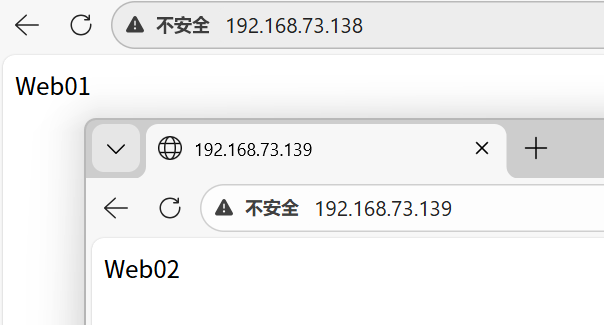

- 配置Nginx负载均衡

```bash
[root@localhost]:~$ hostnamectl set-hostname LB
[root@LB]:~$ systemctl enable --now nginx
[root@LB]:~$ setenforce 0
[root@LB]:~$ sed -i s/SELINUX=enforcing/SELINUX=disabled/ /etc/selinux/config

# 反向代理优化的命令
[root@LB]:~$ cat /etc/nginx/proxy_params 
proxy_set_header Host $http_host;
proxy_set_header X-Real-IP $remote_addr;
proxy_set_header X-Forwarded-For $proxy_add_x_forwarded_for;
 
proxy_connect_timeout 30;
proxy_send_timeout 60;
proxy_read_timeout 60;
 
proxy_buffering on;
proxy_buffer_size 32k;
proxy_buffers 4 128k;

# 配置负载均衡
[root@LB]:~$ cat /etc/nginx/conf.d/node_proxy.conf upstream node {
    server 192.168.73.138:80;
    server 192.168.73.139:80;
}
server {
    listen 80;
    server_name node.iproute.cn;
 
    location / {
        proxy_pass http://node;
        include proxy_params;
    }
}
[root@LB]:~$ nginx -s reload

```

- 多次刷新，查看负载均衡的效果

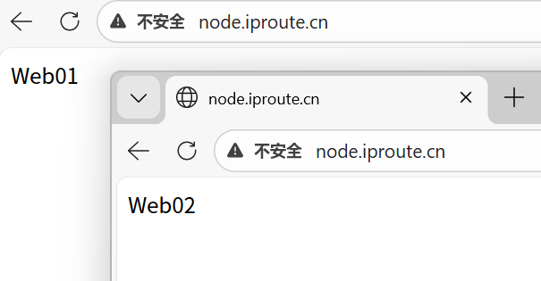

- 如果一台机器出现端口都无法访问的情况，nginx会察觉到，并且将流量不引向故障节点，但是如果机器端口可以访问，但是网页状态码不是200-399的时候，就无法察觉了

```bash
[root@web01 ~]# systemctl stop nginx
[root@web01 ~]# systemctl start nginx
[root@web01 ~]# mv /usr/share/nginx/html/index.html ind.html
```

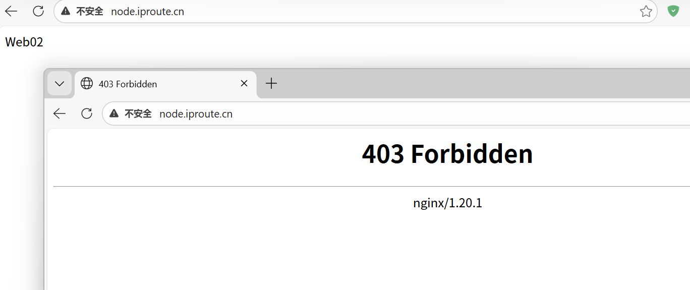

- 优化nginx的配置，如果出现错误状态码，就进入下一轮选择

```bash
[root@LB]:~$ cat /etc/nginx/conf.d/node_proxy.conf upstream node {
    server 192.168.73.138:80;
    server 192.168.73.139:80;
}
server {
    listen 80;
    server_name node.iproute.cn;
 
    location / {
        proxy_pass http://node;
	proxy_next_upstream error timeout http_403;
        include proxy_params;
    }
}
[root@LB]:~$ nginx -s reload

```

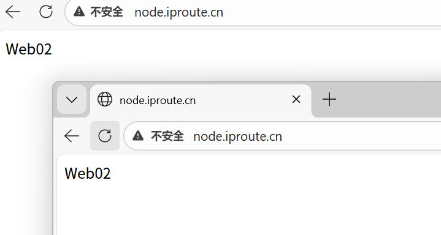

- 负载均衡算法

| **调度算法** | **概述**                                                     |
| :----------- | :----------------------------------------------------------- |
| rr 轮询      | 按时间顺序逐一分配到不同的后端服务器(默认)                   |
| weight       | 加权轮询,weight值越大,分配到的访问几率越高                   |
| ip_hash      | 每个请求按访问IP的hash结果分配,这样来自同一IP的固定访问一个后端服务器 |
| url_hash     | 按照访问URL的hash结果来分配请求,使每个URL定向到同一个后端服务器 |
| least_conn   | 最少链接数,哪个机器链接数少少就分发                          |

- 加权轮询

```bash
[root@LB]:~$ cat /etc/nginx/conf.d/node_proxy.conf upstream node {
    server 192.168.73.138:80 weight=2;
    server 192.168.73.139:80;
}
server {
    listen 80;
    server_name node.iproute.cn;
 
    location / {
        proxy_pass http://node;
	proxy_next_upstream error timeout http_403;
        include proxy_params;
    }
}
[root@LB]:~$ nginx -s reload
[root@LB]:~$ echo "192.168.73.136 node.iproute.cn" >> /etc/hosts
[root@LB]:~$ while true;do curl node.iproute.cn;sleep 1;done
Web01
Web02
Web01
Web01
Web02
Web01
Web01
Web02
Web01
Web01
Web02
Web01
Web01
```

- ip_hash
  - 上次是哪台服务器提供的服务，这一次还是还是分配到哪一台
  - 如果客户端都走相同代理, 会导致某一台服务器连接过多

```bash
[root@LB]:~$ cat /etc/nginx/conf.d/node_proxy.conf upstream node {
    ip_hash;
    server 192.168.73.138:80;
    server 192.168.73.139:80;
}
server {
    listen 80;
    server_name node.iproute.cn;
 
    location / {
        proxy_pass http://node;
	proxy_next_upstream error timeout http_403;
        include proxy_params;
    }
}
[root@LB]:~$ nginx -s reload
[root@LB]:~$ while true;do curl node.iproute.cn;sleep 1;done
Web01
Web01
Web01
Web01
Web01
Web01
Web01
Web01
Web01
Web01
Web01
Web01
```

- Nginx负载均衡后端状态

| **状态**     | **概述**                          |
| :----------- | :-------------------------------- |
| down         | 当前的server暂时不参与负载均衡    |
| backup       | 预留的备份服务器                  |
| max_fails    | 允许请求失败的次数                |
| fail_timeout | 经过max_fails失败后, 服务暂停时间 |
| max_conns    | 限制最大的接收连接数              |

- 如果某台机器需要维护

```bash
[root@LB]:~$ cat /etc/nginx/conf.d/node_proxy.conf upstream node {
    server 192.168.73.138:80 down;
    server 192.168.73.139:80;
}
server {
    listen 80;
    server_name node.iproute.cn;
 
    location / {
        proxy_pass http://node;
	proxy_next_upstream error timeout http_403;
        include proxy_params;
    }
}
[root@LB]:~$ nginx -s reload
[root@LB]:~$ while true;do curl node.iproute.cn;sleep 1;done
Web02
Web02
Web02
Web02
Web02
Web02
Web02
Web02
Web02
Web02
```

- 如果某个节点访问失败触发了条件，那么就会转向backup

```bash
[root@LB]:~$ cat /etc/nginx/conf.d/node_proxy.conf upstream node {
    server 192.168.73.138:80 backup;
    server 192.168.73.139:80 max_fails=1 fail_timeout=10s;
}
server {
    listen 80;
    server_name node.iproute.cn;
 
    location / {
        proxy_pass http://node;
	proxy_next_upstream error timeout http_403;
        include proxy_params;
    }
}
[root@LB]:~$ nginx -s reload

# 去故意制造失败，这样就每隔10s，就会访问失败一次
[root@web01 ~]# iptables -A INPUT -p tcp --dport 80 -j REJECT
[root@LB]:~$ while true;do curl node.iproute.cn;sleep 1;done
Web02
Web02
Web02
Web02
Web02
Web02
Web02
Web02
Web02
Web02
Web02
Web02
Web02
Web02
Web02
Web02
Web02
Web02
Web02
Web02
Web02
Web02
Web02
Web02
Web02
Web02
Web02
Web02
Web02
Web02
```

- 设置达到失败条件，就down
  - 10s内失败2次就触发条件

```bash
[root@LB]:~$ cat /etc/nginx/conf.d/node_proxy.conf upstream node {
    server 192.168.73.138:80;
    server 192.168.73.139:80 max_fails=1 fail_timeout=10s;
}
server {
    listen 80;
    server_name node.iproute.cn;
 
    location / {
        proxy_pass http://node;
	proxy_next_upstream error timeout http_403;
        include proxy_params;
    }
}
[root@LB]:~$ nginx -s reload
```

- max_conns最大TCP连接数

```bash
[root@LB]:~$ cat /etc/nginx/conf.d/node_proxy.conf upstream node {
    server 192.168.73.138:80;
    server 192.168.73.139:80 max_conns=1;
}
server {
    listen 80;
    server_name node.iproute.cn;
 
    location / {
        proxy_pass http://node;
	proxy_next_upstream error timeout http_403;
        include proxy_params;
    }
}
[root@LB]:~$ nginx -s reload
```

- 健康检查
  - 在Nginx官方模块提供的模块中，没有对负载均衡后端节点的健康检查模块，但可以使用第三方模块。 `nginx_upstream_check_module`来检测后端服务的健康状态。

```bash
[root@LB]:~$ yum install -y gcc zlib-devel glibc gcc-c++ pcre-devel openssl-devel patch
[root@LB]:/usr/src$ mkdir -p nginx
[root@LB]:/usr/src$ cd nginx
[root@LB]:/usr/src/nginx$ yum -y install tar
[root@LB]:/usr/src/nginx$ wget http://nginx.org/download/nginx-1.20.1.tar.gz
[root@LB]:/usr/src/nginx$ tar -zxf nginx-1.20.1.tar.gz
[root@LB]:/usr/src/nginx$ wget https://github.com/yaoweibin/nginx_upstream_check_module/archive/master.zip
[root@LB]:/usr/src/nginx$ unzip nginx_upstream_check_module-master.zip 
[root@LB]:/usr/src/nginx$ cd nginx-1.20.1
[root@LB]:/usr/src/nginx/nginx-1.20.1$ patch -p1 <../nginx_upstream_check_module-master/check_1.20.1+.patch
[root@LB]:/usr/src/nginx/nginx-1.20.1$ ./configure --prefix=/etc/nginx \
--sbin-path=/usr/sbin/nginx \
--modules-path=/usr/lib64/nginx/modules \
--conf-path=/etc/nginx/nginx.conf \
--error-log-path=/var/log/nginx/error.log \
--http-log-path=/var/log/nginx/access.log \
--pid-path=/var/run/nginx.pid \
--lock-path=/var/run/nginx.lock \
--http-client-body-temp-path=/var/cache/nginx/client_temp \
--http-proxy-temp-path=/var/cache/nginx/proxy_temp \
--http-fastcgi-temp-path=/var/cache/nginx/fastcgi_temp \
--http-uwsgi-temp-path=/var/cache/nginx/uwsgi_temp \
--http-scgi-temp-path=/var/cache/nginx/scgi_temp \
--user=nginx --group=nginx --with-compat \
--with-file-aio --with-threads --with-http_addition_module \
--with-http_auth_request_module --with-http_dav_module \
--with-http_flv_module --with-http_gunzip_module \
--with-http_gzip_static_module --with-http_mp4_module \
--with-http_random_index_module --with-http_realip_module \
--with-http_secure_link_module --with-http_slice_module \
--with-http_ssl_module --with-http_stub_status_module \
--with-http_sub_module --with-http_v2_module --with-mail \
--with-mail_ssl_module --with-stream --with-stream_realip_module \
--with-stream_ssl_module --with-stream_ssl_preread_module \
--add-module=/usr/src/nginx/nginx_upstream_check_module-master \
--with-cc-opt='-Wno-error -O2 -g -pipe -Wall -Wp,-D_FORTIFY_SOURCE=2 -fexceptions -fstack-protector-strong --param=ssp-buffer-size=4 -grecord-gcc-switches -m64 -mtune=generic -fPIC' \
--with-ld-opt='-Wl,-z,relro -Wl,-z,now -pie'
[root@LB]:/usr/src/nginx/nginx-1.20.1$ make -j 4 && make install
[root@LB]:/usr/src/nginx/nginx-1.20.1$ mkdir -p /var/cache/nginx/client_temp

```

- 修改配置文件

```bash
[root@LB]:/usr/src/nginx/nginx-1.20.1$ cat /etc/nginx/conf.d/node_proxy.conf 
upstream node {
    server 192.168.73.138:80 max_fails=2 fail_timeout=10s;
    server 192.168.73.139:80 max_fails=2 fail_timeout=10s;
    check interval=3000 rise=2 fall=3 timeout=1000 type=tcp;
}

server {
    listen 80;
    server_name node.iproute.cn;
 
    location / {
        proxy_pass http://node;
	proxy_next_upstream error timeout http_403;
        include proxy_params;
    }

    location /upstream_check {
    	check_status;
    }
}

[root@LB]:/usr/src/nginx/nginx-1.20.1$ systemctl restart nginx
```

- 访问`/upstream_check`页面查看节点的状态

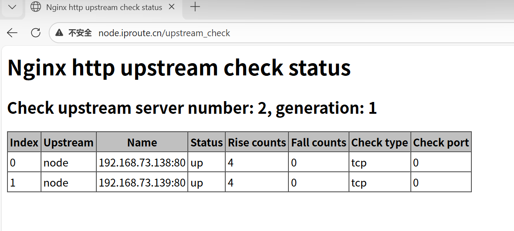

- 模拟其中一个节点故障，使用iptables将端口封禁

```bash
[root@web01 ~]# iptables -A INPUT -p tcp --dport 80 -j REJECT
```

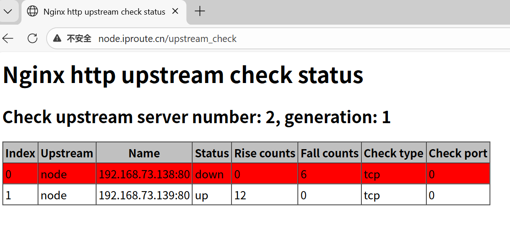

# 17. 负载均衡会话保持

- 什么是会话，http是无状态，如果想要保持登录状态，目前主流的方案
  - cookie
    - 服务器给浏览器发放一个id，并且服务器会找地方存下来这个id以及id对应的数据
    - 登录成功，服务器就会找到浏览器对应的id，并且记录此id已经登陆成功
    - 每次浏览器都需要携带此cookie让服务器可以辨识
  - token
    - 服务器通过私钥将用户的id和登录相关信息进行加密，加密之后存放到客户端上，服务器不需要保存客户端的信息
    - 客户端在访问的时候，带上加密后的信息，服务器使用私钥解密，可以认出客户端的状态

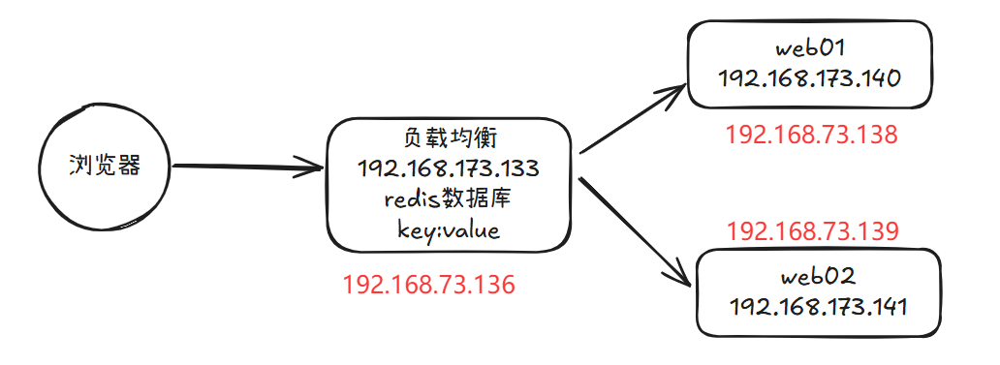

- 在LB设备上搭建redis数据库，可以共享存储会话信息
- 在两个web安装php环境，部署一个可登录的系统

```bash
yum -y install php*
systemctl enable --now php-fpm
systemctl disable --now firewalld
setenforce 0
sed -i s/SELINUX=enforcing/SELINUX=disabled/ /etc/selinux/config
sed -i "s/user = apache/user = nginx/" /etc/php-fpm.d/www.conf
sed -i "s/group = apache/group = nginx/" /etc/php-fpm.d/www.conf
echo "extension=redis.so" > /etc/php.d/redis.ini
systemctl restart php-fpm
cd /usr/share/nginx/html/
rm -rf *
```

- 在`/usr/share/nginx/html/index.php`文件中写入下面代码

```php
<!DOCTYPE html>
<html lang="en">
<head>
    <meta charset="UTF-8">
    <meta name="viewport" content="width=device-width, initial-scale=1.0">
    <title>登录</title>
    <style>
        .box {
            position: absolute;
            top: 50%;
            left: 50%;
            transform: translate(-50%, -50%);
            width: 400px;
            border: 1px solid black;
            padding: 20px;
        }
    </style>
</head>
<body>
    <?php
    session_start();
    if (isset($_POST['username']) && isset($_POST['password'])) {
        $username = $_POST['username'];
        $password = $_POST['password'];
        if ($username == 'admin' && $password == '123456') {
            $_SESSION['username'] = $username;
            $_SESSION['money'] = 100;
            exit("登录成功！余额为：{$_SESSION['money']}, <a href='?shopping'>点我购物</a>");
        }    
        else {
            exit("用户名或密码错误！");
        }
    }

    if (isset($_SESSION['username']) && !isset($_GET['shopping'])) {
        exit("欢迎回来，{$_SESSION['username']}！余额为：{$_SESSION['money']}, <a href='?shopping'>点我购物</a>");
    }

    if (isset($_GET['shopping'])) {
        if (!isset($_SESSION['money'])) {
            exit("余额不足！");
        }
        $_SESSION['money'] -= 10;
        exit("购买成功！余额为：{$_SESSION['money']}, <a href='?shopping'>继续购物</a>");
    }

    ?>
    <div class="box">
        <h1>欢迎登录web01/02</h1>
        <form action="" method="POST">
            <input type="text" placeholder="用户名" name="username" required>
            <input type="password" placeholder="密码" name="password" required>
            <input type="submit" value="登录">
        </form>
    </div>
</body>
</html>
```

- 配置nginx虚拟主机文件

```bash
[root@web01 html]# cat /etc/nginx/conf.d/php.conf 
server {
    listen 80;
    server_name login.iproute.cn;
    root /usr/share/nginx/html/;

    location / {
        index index.php index.html;
    }

    location ~ \.php$ {
        fastcgi_pass unix:/run/php-fpm/www.sock;
        fastcgi_param SCRIPT_FILENAME $document_root$fastcgi_script_name;
        include fastcgi_params;
    }
}

[root@web02 html]# mkdir -p /var/lib/php/session
[root@web01 html]# cd /var/lib/php/session
[root@web01 session]# ls
[root@web01 session]# chown nginx:nginx /var/lib/php/session
[root@web01 session]# ls
sess_756fchpp4ltoedi4j0ld7nkcp8
```

- 因为负载均衡的存在，所以数据是不对的，两个节点都各自保存一份数据


- 使用redis将数据集中存储，在LB上部署共享的数据库

```bash
yum -y install redis
sed -i "s/bind 127.0.0.1 -::1/bind 0.0.0.0 -::1/" /etc/redis/redis.conf
systemctl enable --now redis
```

- 到web上设置session数据存入redis数据库

```bash
[root@web01 ~]# vim /etc/php-fpm.d/www.conf
.....
;php_value[session.save_handler] = files
;php_value[session.save_path]    = /var/lib/php/session
php_value[session.save_handler] = redis
php_value[session.save_path] = "tcp://192.168.73.136:6379"
.....

[root@web01 ~]# systemctl restart php-fpm
```

- 解决问题的思路
  - redis扩展想办法装上
  - 使用samba共享session文件
- 需要在web01以及web02上下载redis扩展

```bash
dnf install -y https://rpms.remirepo.net/enterprise/remi-release-9.rpm
dnf module reset php -y
dnf module enable php:remi-8.0 -y
dnf install -y php-redis
systemctl restart php-fpm
# 最后显示redis即可
```

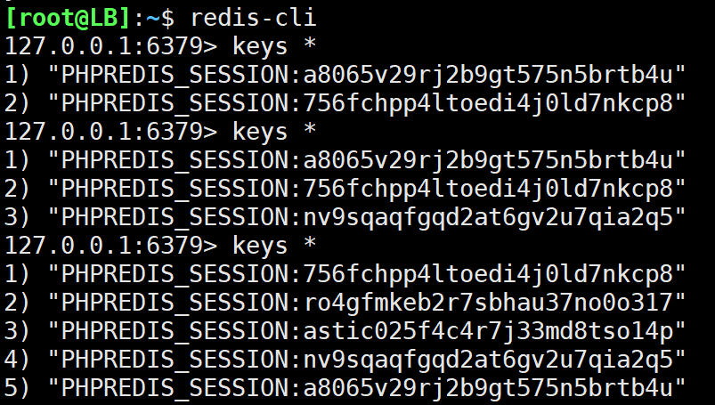

```bash
[root@LB]:~$ redis-cli
127.0.0.1:6379> keys *
1) "PHPREDIS_SESSION:n9gfreb438ks76i9mi8slb62cu"
127.0.0.1:6379> get PHPREDIS_SESSION:n9gfreb438ks76i9mi8slb62cu
""
127.0.0.1:6379> get PHPREDIS_SESSION:n9gfreb438ks76i9mi8slb62cu
"username|s:5:\"admin\";money|i:100;"
127.0.0.1:6379> 
```

