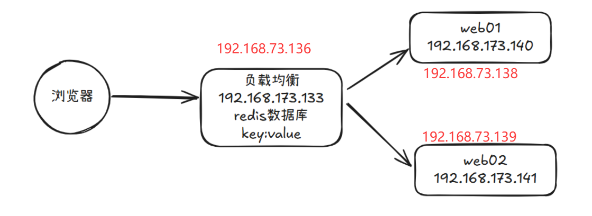
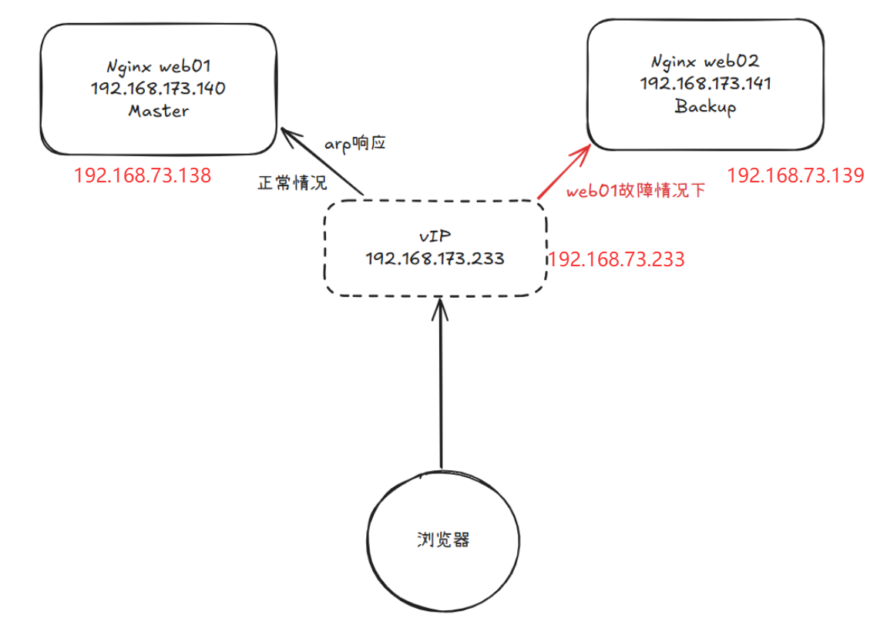

# 1. keepalived高可用基本概述

-  一般是指2台机器启动着完全相同的业务系统，当有一台机器down机了，另外一台服务器就能快速的接管，对于访问的用户是无感知的。

- 硬件通常使用 F5

- 软件通常使用 keepalived

- keepalived软件是基于VRRP协议实现的，VRRP虚拟路由冗余协议，主要用于解决单点故障问题

## 1.1 VRRP原理

- VRRP协议是一种容错的主备模式的协议，保证当主机的下一跳路由出现故障时，由另一台路由器来代替出现故障的路由器进行工作，通过VRRP可以在网络发生故障时透明的进行设备切换而不影响主机之间的数据通信。
- 虚拟路由器：VRRP组中所有的路由器，拥有虚拟的IP+MAC(00-00-5e-00-01-VRID)地址
- 主路由器：虚拟路由器内部通常只有一台物理路由器对外提供服务，主路由器是由选举算法产生，对外提供各种网络功能。
- 备份路由器：VRRP组中除主路由器之外的所有路由器，不对外提供任何服务，只接受主路由的通告，当主路由器挂掉之后，重新进行选举算法接替master路由器。
- 选举机制
  - 优先级
  - 抢占模式下，一旦有优先级高的路由器加入，即成为Master
  - 非抢占模式下，只要Master不挂掉，优先级高的路由器只能等待
- 三种状态
  - Initialize状态：系统启动后进入initialize状态
  - Master状态
  - Backup状态

# 2. keepalived高可用安装配置



- 本次实验环境



- 在web两台机器上部署keepalived

```bash
yum install -y keepalived
cp /etc/keepalived/keepalived.conf{,.old}
```

- 配置web01
  - state MASTER 角色可以不配置，默认是ip地址数值大的做MASTER

```bash
[root@web01 ~]# cat /etc/keepalived/keepalived.conf
! Configuration File for keepalived

global_defs {
    router_id web01
}

vrrp_instance VI_1 {
    state MASTER        
    interface ens160
    virtual_router_id 50
    priority 100
    advert_int 1
    authentication {    
        auth_type PASS
        auth_pass 1111
    }
    virtual_ipaddress {
        192.168.73.233
    }
}

```

- 配置web02

```bash
[root@web02 ~]# cat /etc/keepalived/keepalived.conf
! Configuration File for keepalived

global_defs {
    router_id web02
}

vrrp_instance VI_1 {
    state BACKUP        
    interface ens160
    virtual_router_id 50
    priority 100
    advert_int 1
    authentication {    
        auth_type PASS
        auth_pass 1111
    }
    virtual_ipaddress {
        192.168.73.233
    }
}

```

- 启动keepalived服务

```bash
systemctl enable --now keepalived
```

- 通过分别开关两台机器，可以看到地址的切换过程

```bash
C:\Users\bbben>arp -a
接口: 192.168.73.1 --- 0x2
  Internet 地址         物理地址              类型
...
  192.168.73.233        00-0c-29-dd-9d-3d     动态
  
# web01挂了
C:\Users\bbben>arp -a
接口: 192.168.73.1 --- 0x2
  Internet 地址         物理地址              类型
...
  192.168.73.233        00-0c-29-9a-bd-ae     动态
# 对应IP地址的mac地址不同，此时web02为master，再启动web01，master仍是web02
```

- 默认是抢占模式，只看优先级，可以通过配置`nopreempt`关闭抢占

```bash
Master配置
    vrrp_instance VI_1 {
        state BACKUP
        priority 150
        nopreempt
    }

Backup配置
    vrrp_instance VI_1 {
        state BACKUP
        priority 100
        nopreempt
    }
    
# 将web01的priority改为150，重启web01，此时master应换回web01
[root@web01 ~]# ip a
2: ens160: <BROADCAST,MULTICAST,UP,LOWER_UP> mtu 1500 qdisc mq state UP group default qlen 1000
...
    inet 192.168.73.233/32 scope global ens160
       valid_lft forever preferred_lft forever
    inet6 fe80::20c:29ff:fedd:9d3d/64 scope link noprefixroute 
       valid_lft forever preferred_lft forever
C:\Users\bbben>arp -a
接口: 192.168.73.1 --- 0x2
  Internet 地址         物理地址              类型
...
  192.168.73.233        00-0c-29-dd-9d-3d     动态
```

- 可以在两个节点上都结合脚本，如果本地服务出问题了，可以主动关闭`keepalived`不参与选举

```bash
[root@web01 ~]# vim check_web.sh
#!/bin/sh
nginxpid=$(ps -C nginx --no-header|wc -l)

#1.判断Nginx是否存活,如果不存活则尝试启动Nginx
if [ $nginxpid -eq 0 ];then
    exit 1;
fi
exit 0;

[root@web01 ~]# chmod +x check_web.sh
```

- 调用此配置文件

```bash
[root@web01 ~]# vim /etc/keepalived/keepalived.conf
! Configuration File for keepalived

global_defs {
    router_id web01
}

vrrp_instance VI_1 {
    interface ens160
    virtual_router_id 50
    priority 100
    advert_int 1
    authentication {    
        auth_type PASS
        auth_pass 1111
    }
    virtual_ipaddress {
        192.168.173.233
    }
	vrrp_script check_web {
	    script "/root/check_web.sh"			# 目前无法调用脚本
	    interval 5
	    fall 2
	    weight -20
	    rise 2
	}
	
	track_script {
	    check_web
	}
}


[root@web01 ~]# systemctl restart keepalived
```

- 也可以自己写脚本命令，加入到contab中，当检测到服务不正常的情况下，主动降低优先级

```bash
[root@web01 ~]# cat check_web_cron.sh 
#!/bin/sh
nginxpid=$(ps -C nginx --no-header|wc -l)

for ((i=1; i<=5; i++)); do
	#1.判断Nginx是否存活,如果不存活则尝试启动Nginx
	if [ $nginxpid -eq 0 ];then
	    systemctl start nginx
	    sleep 3
	    #2.等待3秒后再次获取一次Nginx状态
	    nginxpid=$(ps -C nginx --no-header|wc -l) 
	    #3.再次进行判断, 如Nginx还不存活则停止Keepalived,让地址进行漂移,并退出脚本  
	    if [ $nginxpid -eq 0 ];then
	        systemctl stop keepalived
	   fi
	fi
    sleep 10
done

[root@web01 ~]# crontab -e
* * * * * /root/check_web_cron.sh
```

