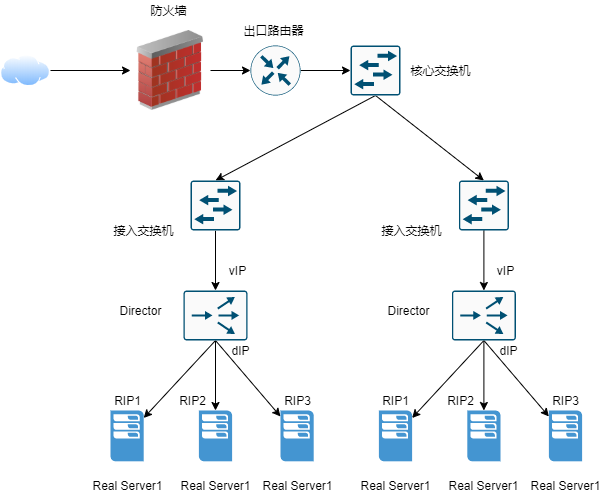
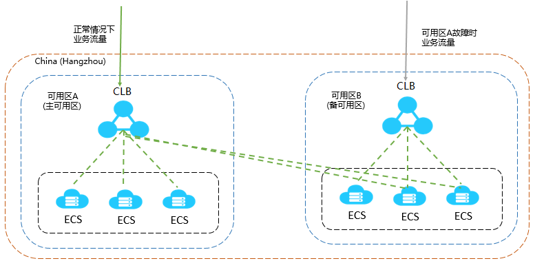
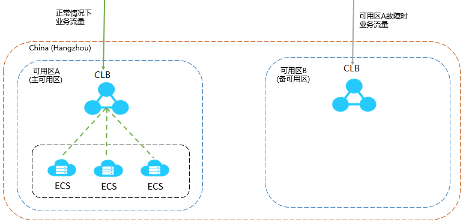
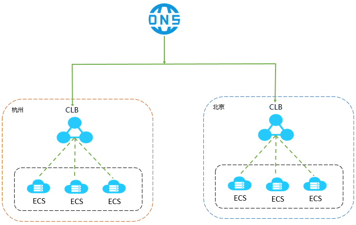
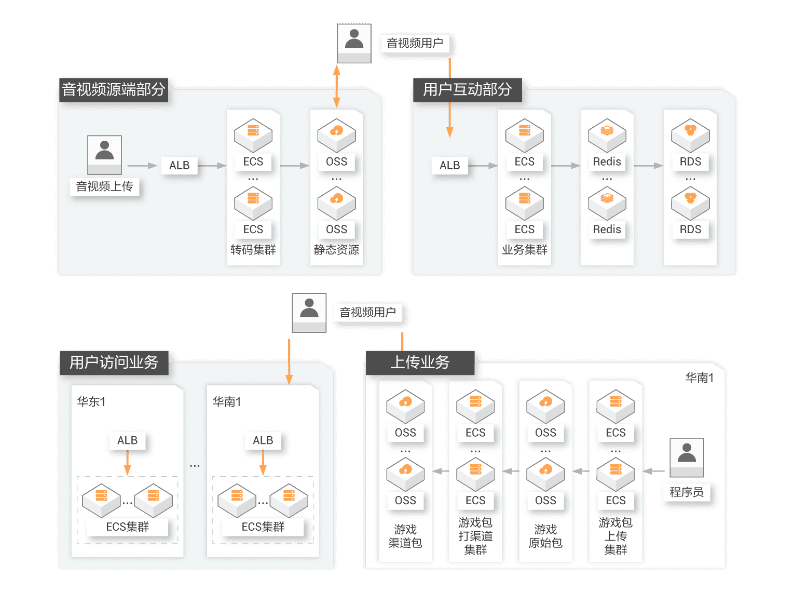
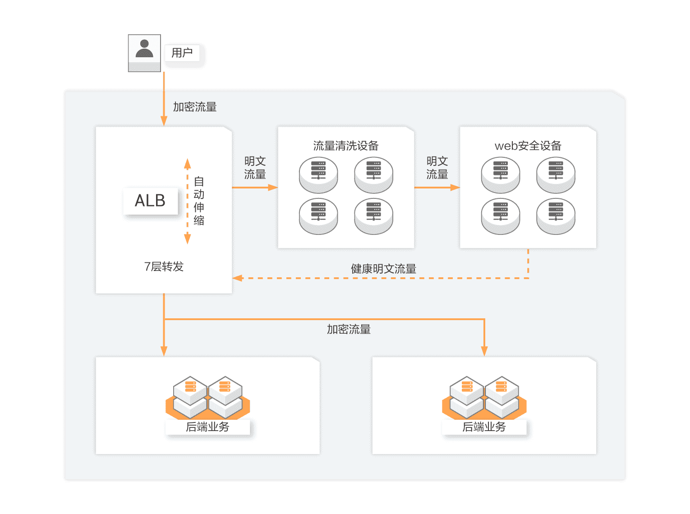
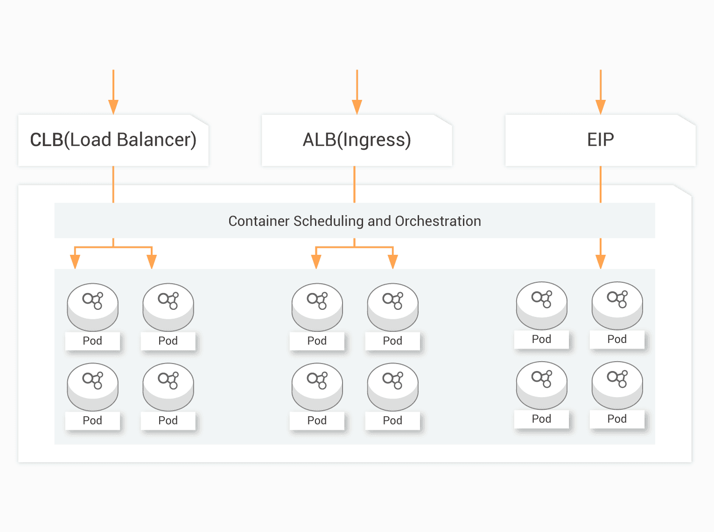
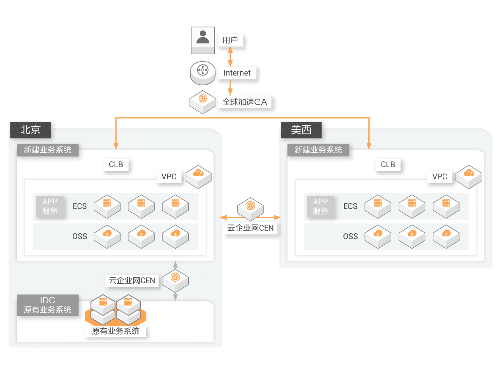
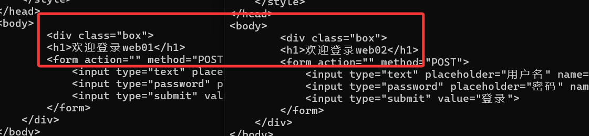
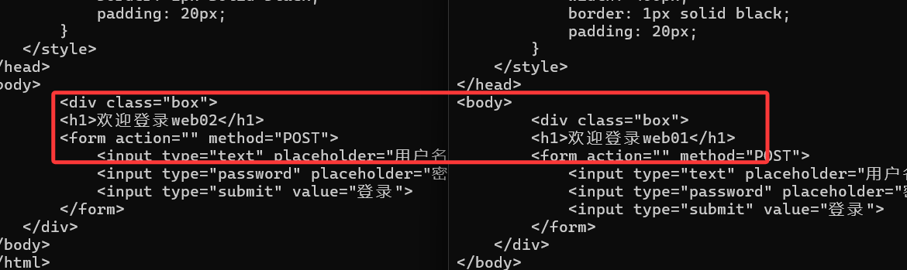

# 0. LVS概念及相关介绍

## 0.1 LVS介绍

- LVS：Linux Virtual Server，负载调度器，内核集成，章文嵩（花名 正明）, 阿里的四层SLB(Server Load Balance)是基于LVS+keepalived实现。
- LVS 官网：http://www.linuxvirtualserver.org/
- LVS 相关术语
  - VS: Virtual Server，负责调度
  - RS: Real Server，负责真正提供服务

## 0.2 LVS工作原理

- VS根据请求报文的目标IP和目标协议及端口将其调度转发至某RS，根据调度算法来挑选RS。LVS是内核级功能，工作在INPUT链的位置，将发往INPUT的流量进行“处理”

- 查看内核支持LVS

```bash
[root@localhost ~]# grep -i -C 10 ipvs /boot/config-3.10.0-957.el7.x86_64
```

## 0.3 LVS集群体系架构

[](https://git.inmind-lab.com/aaronxu/Linux-book/src/branch/main/02.企业服务/07.负载均衡/image-20210712073700965.png)

## 0.4 LVS 功能及组织架构

下面摘自于阿里云：[https://help.aliyun.com/document_detail/27543.html?spm=5176.21213303.J_6028563670.7.505a3edaQq9WLJ&scm=20140722.S_help%40%40%E6%96%87%E6%A1%A3%40%4027543.S_0.ID_27543-OR_s%2Bhelpproduct-V_1-P0_0](https://help.aliyun.com/document_detail/27543.html?spm=5176.21213303.J_6028563670.7.505a3edaQq9WLJ&scm=20140722.S_help@@文档@@27543.S_0.ID_27543-OR_s%2Bhelpproduct-V_1-P0_0)

负载均衡的应用场景为高访问量的业务，提高应用程序的可用性和可靠性。

## 0.5 应用于高访问量的业务

如果您的应用访问量很高，您可以通过配置监听规则将流量分发到不同的云服务器ECS（Elastic Compute Service）实例上。此外，您可以使用会话保持功能将同一客户端的请求转发到同一台后端ECS，提高访问效率。

## 0.6 扩展应用程序

您可以根据业务发展的需要，随时添加和移除ECS实例来扩展应用系统的服务能力，适用于各种Web服务器和App服务器。

## 0.7 消除单点故障

您可以在CLB实例下添加多台ECS实例。当其中一部分ECS实例发生故障后，CLB会自动屏蔽故障的ECS实例，将请求分发给正常运行的ECS实例，保证应用系统仍能正常工作。

## 0.8 同城容灾 （多可用区容灾）

为了提供更加稳定可靠的CLB服务，CLB已在各地域部署了多可用区以实现同地域容灾。当主可用区出现机房故障或不可用时，CLB仍然有能力在非常短的时间内（大约30s中断）切换到另外一个备可用区恢复服务能力；当主可用区恢复时，CLB同样会自动切换到主可用区提供服务。

使用CLB时，您可以将CLB实例部署在支持多可用区的地域以实现同城容灾。此外，建议您结合自身的应用需要，综合考虑后端服务器的部署。如果您的每个可用区均至少添加了一台ECS实例，那么此种部署模式下的CLB服务的效率是最高的。

如下图所示，在CLB实例下绑定不同可用区的ECS实例。正常情况下，用户访问流量将同时转发至主、备可用区内的ECS实例；当可用区A发生故障时，用户访问流量将只转发至备可用区内的ECS实例。此种部署既可以避免因为单个可用区的故障而导致对外服务的不可用，也可以通过不同产品间可用区的选择来降低延迟。

[](https://git.inmind-lab.com/aaronxu/Linux-book/src/branch/main/02.企业服务/07.负载均衡/image-20260126164022894.png)

如果您采取如下图所示的部署方案，即在CLB实例的主可用区下绑定多台ECS实例，而在备可用区没有任何ECS实例。正常情况下，用户访问流量将只转发至主可用区内的ECS实例，比较于上图，流量传输延时低；当可用区A发生故障时会造成业务中断，因为备可用区没有ECS实例来接收请求。这样的部署方式很明显是以牺牲高可用性为代价来获取低延时。

[](https://git.inmind-lab.com/aaronxu/Linux-book/src/branch/main/02.企业服务/07.负载均衡/image-20260126164030445.png)

## 0.9 跨地域容灾

您可以在不同地域下部署CLB实例，并分别挂载相应地域内不同可用区的ECS。上层利用云解析做智能DNS，将域名解析到不同地域的CLB实例服务地址下，可实现全局CLB。当某个地域出现不可用时，暂停对应解析即可实现所有用户访问不受影响。

[](https://git.inmind-lab.com/aaronxu/Linux-book/src/branch/main/02.企业服务/07.负载均衡/image-20260126164037588.png)

## 0.10 LVS应用场景

### 0.10.1 音视频/游戏等大并发流量场景

 音视频/游戏等行业经常面临突发访问，海量流量，后端服务压力大。如短视频/长视频/直播/在校教育/游戏等业务中，由于服务端与用户端之间需要实时大量的互动，因此，用户流量非常大，而音视频业务的波峰波谷效应明显，这对整个系统的性能、弹性、稳定性和可用性带来了巨大的挑战，需要使用负载均衡进行流量分发

[](https://git.inmind-lab.com/aaronxu/Linux-book/src/branch/main/02.企业服务/07.负载均衡/img-safe-1.png)

### 0.10.2 零售/金融/企业等弹性高可靠场景

 新零售新金融业务变化快，新业务上线、老业务调整时常发生，大促大型活动常态化；因此，对即开即用网络，快速交付能力，弹性伸缩能力，安全可靠、灵活计费等需求显著，需要使用负载均衡搭建高可靠架构。

[](https://git.inmind-lab.com/aaronxu/Linux-book/src/branch/main/02.企业服务/07.负载均衡/img-safe-2.png)

### 0.10.3 云原生网络应用场景

 随着云原生逐步成熟，互联网/金融/企业等诸多行业新建业务时选择云原生部署，或对现有业务进行云原生化改造。无论是使用阿里云ACK/ASK/SAE还是开源K8S，云原生网络均可用到负载均衡服务来实现流量调度。

[](https://git.inmind-lab.com/aaronxu/Linux-book/src/branch/main/02.企业服务/07.负载均衡/img-safe-4.png)

### 0.10.4 跨地域网络应用场景

 跨地域跨可用区的容灾方案。互联网/金融/企业等业务逐步遍及全球，需要将不同地域用户智能调度访问到相应的业务系统，为了降本增效，线下IDC业务需要与云上业务互通，需要使用负载均衡构建跨地域或混合云容灾架构。

[](https://git.inmind-lab.com/aaronxu/Linux-book/src/branch/main/02.企业服务/07.负载均衡/img-safe-3.png)

## 0.11 LVS集群类型中的术语

- VS：Virtual Server，Director Server(DS), Dispatcher(调度器)，Load Balancer
- RS：Real Server(lvs), upstream server(nginx)上游服务器, backend server(haproxy)
- CIP：Client IP
- VIP：Virtual server IP VS外网的IP
- DIP：Director IP VS内网的IP
- RIP：Real server IP
- 访问流程：CIP <–> VIP == DIP <–> RIP

# 1. LVS集群的工作模式

- lvs-nat：修改请求报文的目标IP,多目标IP的DNAT
- lvs-dr：操纵封装新的MAC地址。MAC头的修改
- lvs-tun：在原请求IP报文之外新加一个IP首部。
- lvs-fullnat：修改请求报文的源和目标IP

# 2. NAT模式

- 先确保内部的设备可以通过SNAT上网

```bash
[root@web01 ~]# ip route
default via 192.168.147.128 dev ens160 proto static metric 100 
192.168.147.0/24 dev ens160 proto kernel scope link src 192.168.147.132 metric 100 # 先关闭nginx
[root@LB]:~$ systemctl disable --now nginx
Removed "/etc/systemd/system/multi-user.target.wants/nginx.service".

# 开启负载均衡器
[root@LB]:~$ vim /etc/sysctl.conf
...
net.ipv4.ip_forward = 1
[root@LB]:~$ sysctl -p
net.ipv4.ip_forward = 1

# 配置SNAT
[root@LB]:~$ iptables -t nat -A POSTROUTING -s 192.168.147.0/24 -j MASQUERADE

# 配置两个web节点，修改ip地址，主要将网关指向LB
[root@web01 ~]# ip route
default via 192.168.147.128 dev ens160 proto static metric 100 
192.168.147.0/24 dev ens160 proto kernel scope link src 192.168.147.132 metric 100 

# 检查两个web节点都有网了
[root@web01 ~]# ping qq.com
PING qq.com (113.108.81.189) 56(84) bytes of data.
64 bytes from 113.108.81.189 (113.108.81.189): icmp_seq=1 ttl=127 time=44.5 ms
64 bytes from 113.108.81.189 (113.108.81.189): icmp_seq=2 ttl=127 time=46.5 ms
64 bytes from 113.108.81.189 (113.108.81.189): icmp_seq=3 ttl=127 time=43.6 ms
^C
--- qq.com ping statistics ---
3 packets transmitted, 3 received, 0% packet loss, time 2003ms
rtt min/avg/max/mdev = 43.619/44.886/46.530/1.217 ms
[root@web02 ~]# ping baidu.com
PING baidu.com (124.237.177.164) 56(84) bytes of data.
64 bytes from 124.237.177.164 (124.237.177.164): icmp_seq=1 ttl=127 time=43.2 ms
64 bytes from 124.237.177.164 (124.237.177.164): icmp_seq=2 ttl=127 time=44.2 ms
^C
--- baidu.com ping statistics ---
2 packets transmitted, 2 received, 0% packet loss, time 1000ms
rtt min/avg/max/mdev = 43.169/43.659/44.150/0.490 ms
```

- 配置lvs

```bash
[root@LB]:~$ yum -y install ipvsadm

# 查看启动或关闭服务进行的动作
# 启动的时候将规则导入
# 退出的时候将规则保存，并清空规则
[root@LB]:~$ systemctl cat ipvsadm
# /usr/lib/systemd/system/ipvsadm.service
[Unit]
Description=Initialise the Linux Virtual Server
After=syslog.target network.target

[Service]
Type=oneshot
ExecStart=/bin/bash -c "exec /sbin/ipvsadm-restore>
ExecStop=/bin/bash -c "exec /sbin/ipvsadm-save -n >
ExecStop=/sbin/ipvsadm -C
RemainAfterExit=yes

[Install]
WantedBy=multi-user.target
```

- 配置规则

```bash
[root@LB]:~$ ipvsadm -A -t 192.168.73.136:80 -s rr
# -A 添加一个负载均衡集群
# -t 指定集群的入口地址和端口号，使用tcp
# -s 指定算法rr是轮询

[root@LB]:~$ ipvsadm -a -t 192.168.73.136:80 -r 192.168.147.132:80 -m
[root@LB]:~$ ipvsadm -a -t 192.168.73.136:80 -r 192.168.147.133:80 -m
# -a 添加RS
# -m masquerade, nat类型

# 查看规则，相当于DNAT
[root@LB]:~$ ipvsadm -L -n
IP Virtual Server version 1.2.1 (size=4096)
Prot LocalAddress:Port Scheduler Flags
  -> RemoteAddress:Port           Forward Weight ActiveConn InActConn
TCP  192.168.73.136:80 rr
  -> 192.168.147.132:80           Masq    1      0          0         
  -> 192.168.147.133:80           Masq    1      0          0 
```

- 访问测试，使用命令

``` bash
C:\Users\bbben>curl 192.168.73.136
```



# 3. DR模式

- VS通过修改数据包的目的mac地址，将流量引向对应的节点，因为不修改任何IP信息，所以为了让对应节点认为此数据是自己处理，所以vIP需要配置到每一个节点的虚拟接口上

- 恢复web01和web02虚拟机为nat模式，并且自动获得ip地址
- 需要修改web01和web02的arp通告和应答级别
  - IP地址冲突是通过arp发现的，关掉了就不会发现了

```bash
# 先清空所有nat规则
[root@LB]:~$ iptables -L -n -t nat

# 给web01和web02都通过修改arp来防止IP地址冲突
echo 1 > /proc/sys/net/ipv4/conf/all/arp_ignore
echo 2 > /proc/sys/net/ipv4/conf/all/arp_announce
```

- 给web01和web02都添加一个vIP地址到虚拟接口上
  - 这个vIP其实就是LB的IP地址


```bash
[root@web01 ~]# nmcli connection modify lo +ipv4.address 192.168.73.100/32
[root@web01 ~]# nmcli d reapply lo
Connection successfully reapplied to device 'lo'.
# 若有警告，使用ip addr add 192.168.73.100/32 dev lo label lo:0
[root@web02 ~]# nmcli connection modify lo +ipv4.address 192.168.73.100/32
[root@web02 ~]# nmcli d reapply lo
Connection successfully reapplied to device 'lo'.
```

- 配置LB服务器

```bash
[root@LB]:~$ nmcli connection modify ens160 +ipv4.address 192.168.73.100/32
[root@LB]:~$ nmcli d reapply ens160
Connection successfully reapplied to device 'ens160'.
[root@LB]:~$ ipvsadm -A -t 192.168.73.100:80 -s rr
[root@LB]:~$ ipvsadm -a -t 192.168.73.100:80 -r 192.168.73.138
[root@LB]:~$ ipvsadm -a -t 192.168.73.100:80 -r 192.168.73.140
[root@LB]:~$ ipvsadm -L -n
IP Virtual Server version 1.2.1 (size=4096)
Prot LocalAddress:Port Scheduler Flags
  -> RemoteAddress:Port           Forward Weight ActiveConn InActConn
TCP  192.168.73.100:80 rr
  -> 192.168.73.138:80            Route   1      0          0         
  -> 192.168.73.140:80            Route   1      0          0   
```



# 4. TUN模式

- vs在收到数据后，在原数据外面套用一个隧道的原和目的IP的封装，rs收到后，将外面的隧道封装拆开，处理数据，然后直接回复给客户端


# 5. FULLNAT模式

- 通过同时修改请求报文的源IP地址和目标IP地址进行转发

# 6. 各种模式对比

| 特性             | **NAT 模式**             | **DR 模式**                | **TUN 模式**                    | **FullNAT 模式**          |
| :--------------- | :----------------------- | :------------------------- | :------------------------------ | :------------------------ |
| **核心原理**     | 修改数据包目标 IP (DNAT) | 修改数据帧目标 MAC         | 在原 IP 包外二次封装 IP 头      | 同时修改源 IP 和目标 IP   |
| **数据入路径**   | 客户端 → LVS → RS        | 客户端 → LVS → RS          | 客户端 → LVS → RS               | 客户端 → LVS → RS         |
| **数据出路径**   | **RS → LVS → 客户端**    | **RS → 客户端 (直接返回)** | **RS → 客户端 (直接返回)**      | **RS → LVS → 客户端**     |
| **LVS 负载压力** | 很大（处理双向流量）     | 极小（仅处理入站）         | 较小（仅处理入站）              | 很大（处理双向流量）      |
| **网络要求**     | RS 和 LVS 必须在同一子网 | **必须同一二层网络 (LAN)** | 三层路由可达 (可跨机房)         | 三层路由可达 (极灵活)     |
| **RS 网关设置**  | 指向 LVS 的内网 IP       | 指向公网默认网关           | 指向公网默认网关                | 无需特殊设置              |
| **RS 特殊配置**  | 无                       | **需配置 VIP 并抑制 ARP**  | **需配置 VIP 并支持 IPIP 协议** | 无 (如需 IP 则需加载 TOA) |
| **跨网段能力**   | 不支持                   | 不支持                     | 支持                            | **完美支持**              |
| **性能排名**     | 4 (最低)                 | **1 (最高)**               | 2                               | 3                         |