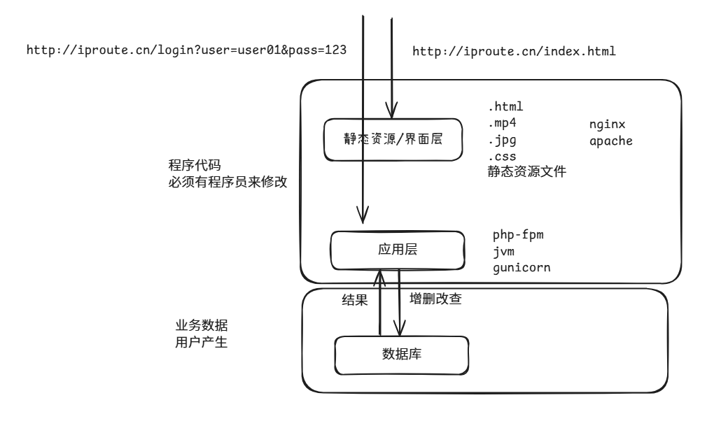
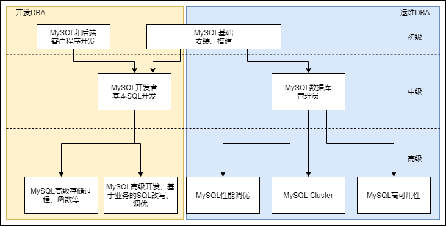
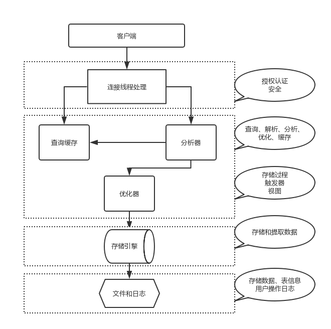
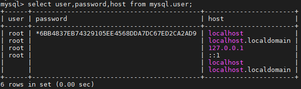
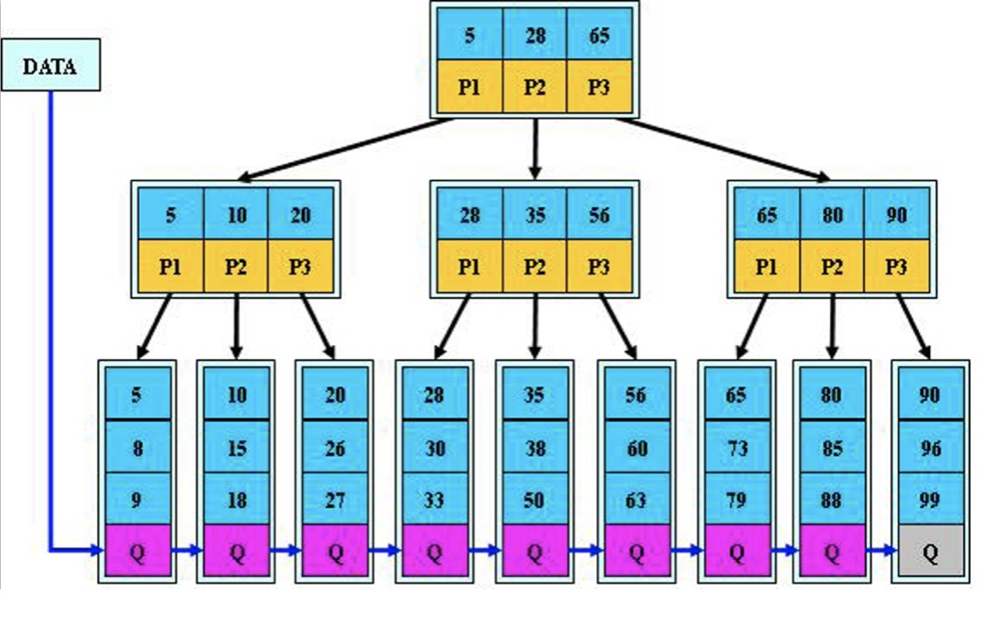
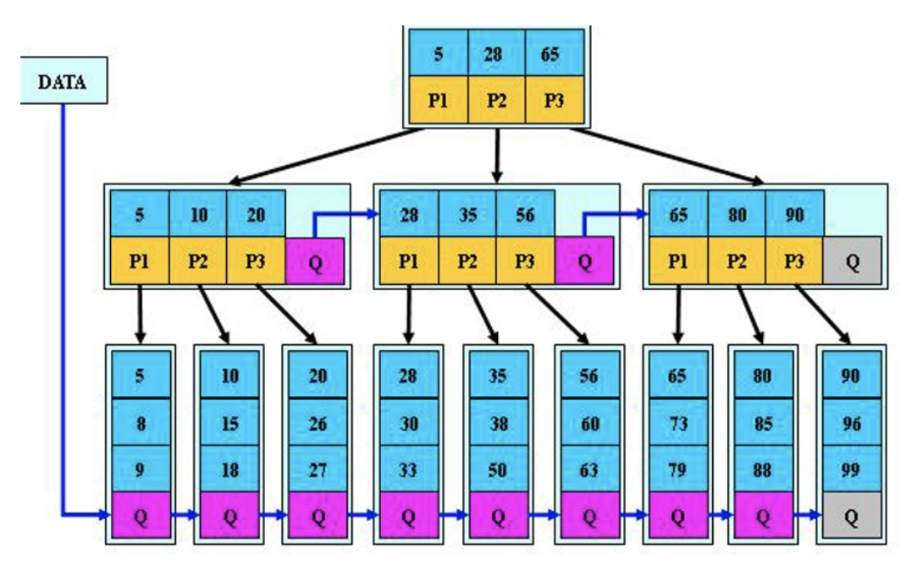
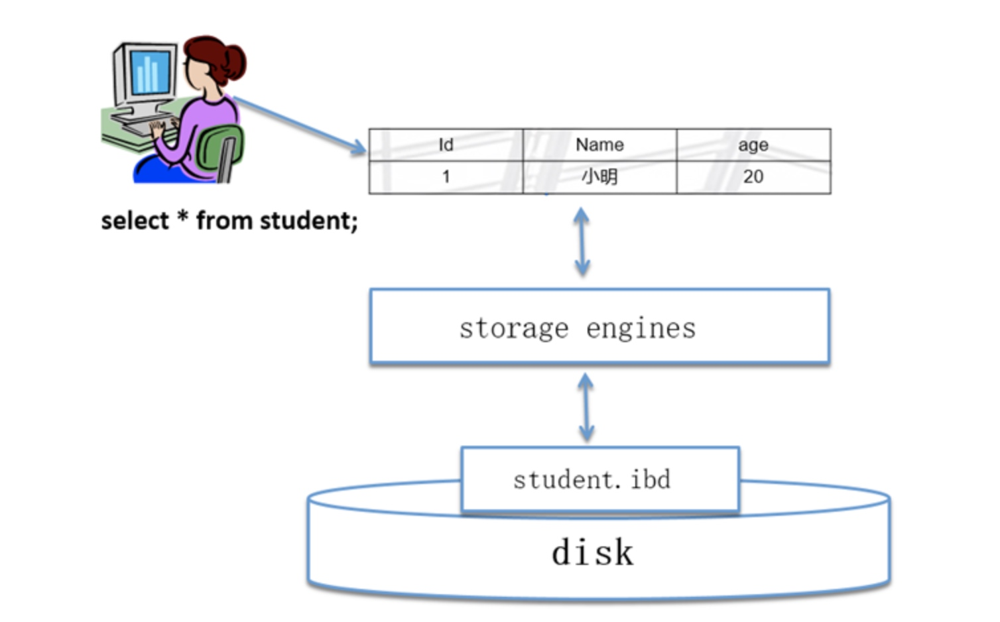
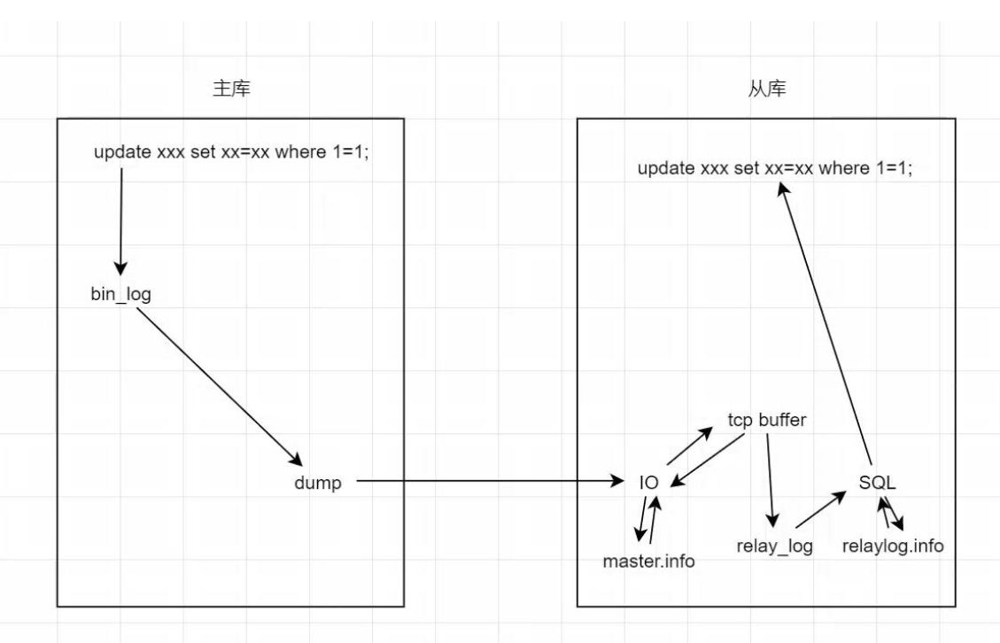
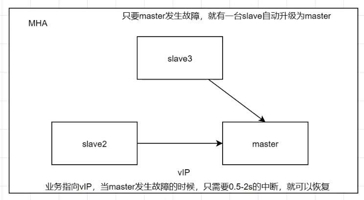

- 虚拟机还原快照后初始化命令

```bash
[root@localhost ~]# systemctl disable --now firewalld
Removed "/etc/systemd/system/multi-user.target.wants/firewalld.service".
Removed "/etc/systemd/system/dbus-org.fedoraproject.FirewallD1.service".
[root@localhost ~]# setenforce 0
[root@localhost ~]# sed -i "s/SELINUX=enforcing/SELINUX=disabled/" /etc/selinux/config
[root@localhost ~]# yum -y install wget unzip tar tree vim lrzsz
```

- 数据库存储的是业务数据



# 1. 数据库介绍

## 1.1 什么是数据

数据(data)是事实或观察的结果，是对客观事物的逻辑归纳，是用于表示客观事物的未经加工的的原始素材。

数据可以是连续的值，比如声音、图像，称为模拟数据。也可以是离散的，如符号、文字，称为数字数据。

在计算机系统中，数据以二进制信息单元0,1的形式表示。

## 1.2 什么是数据库

数据库就是存储和管理数据的仓库，数据按照一定的格式进行存储，用户可以对数据库中的数据进行增加修改、删除、查询等操作。数据库的分为关系型数据库和非关系型数据库。

关系型数据库是指采用了关系模型来组织数据的数据库，简单来说就是二维表格模型，好比Excel文件中的表格，强调使用表格的方式存储数据。关系型数据库核心元素：数据行、数据列、数据表、数据库（数据表的集合），非关系型数据库强调Key-Value的方式存储数据。

**常用关系数据库：**MySQL、SQLite、Oracle等 **常见非关系数据库：**MongoDB、Redis

### 1.2.1 数据库市场

#### 1.2.1.1 MySQL的市场应用

- 中、大型互联网公司
- 市场空间：互联网领域第一
- 趋势明显
- 同源产品：MariaDB、PerconaDB

#### 1.2.1.2 其他产品

- 微软：SQLserver
  - 微软和sysbase合作开发的产品，后来自己开发，windows平台
  - 三、四线小公司，传统行业在用
- IBM：DB2
  - 市场占有量小
  - 目前只有：国有银行（人行，中国银行，工商银行等）、中国移动应用
- PostgreSQL
- MongoDB
- Redis

## 1.3 MySQL数据库

- MySQL是一个关系型数据库管理系统由瑞典 MySQL AB公司开发，属于Oracle旗下产品。MySQL是最流行的关系型数据库管理系统之一，在WEB应用方面，MySQL是最好的RDBMS (Relational Database Management System，关系数据库管理系统）应用软件之一。

- **数据库管理员(Database Administrator，简称*DBA*)：**是从事管理和维护数据库管理系统(DBMS)的相关工作人员的统称，属于运维工程师的一个分支，主要负责业务数据库从设计、测试到部署交付的全生命周期管理。

- 如下图所示，分别是开发DBA和运维DBA：

[](https://git.inmind-lab.com/aaronxu/Linux-book/src/branch/main/03.数据库/01.Mysql/image-20240721145430464.png)

包括但不限于以下工作内容：

- 数据管理
  - 对库和表的创建
  - 基本的数据增删改查
- 用户管理
  - root，运维用户ops，程序连接用户(只读用户，读写用户)
  - 以及对于不同用户的权限管理
- 集群管理
- 数据备份、恢复
  - 逻辑备份、物理备份、冷备、热备、温备、全备、增量备份、差异备份等
- 健康及状态监控
  - 进程，端口、集群状态、主从复制 延时情况、SQL读写速率等

# 2. MySQL的安装

## 2.1 安装方式

- rpm、yum安装
  - 安装方便、安装速度快、无法定制
- 二进制
  - 不需要安装，解压即可使用，不能定制功能
- 编译安装
  - 可定制，安装慢
  - 四个步骤
    - 解压(tar)
    - 生成(./configure) cmake
    - 编译(make)
    - 安装(make install)

## 2.2 安装部署步骤

- 二进制安装

```bash
# 下载二进制包并且解压
[root@localhost]:~$ wget https://downloads.mysql.com/archives/get/p/23/file/mysql-5.6.40-linux-glibc2.12-x86_64.tar.gz
[root@localhost]:~$ tar xzvf mysql-5.6.40-linux-glibc2.12-x86_64.tar.gz

#为了后续写的脚本，方便监控mysql
[root@localhost]:~$ mkdir /application
[root@localhost]:~$ mv mysql-5.6.40-linux-glibc2.12-x86_64 /application/mysql-5.6.40
[root@localhost]:~$ ln -s /application/mysql-5.6.40 /application/mysql 

#该文件夹有mysql初始化（预设）配置文件，覆盖文件是因为注释更全。
[root@localhost]:~$ cd /application/mysql/support-files
[root@localhost]:/application/mysql/support-files$  

[root@localhost]:/application/mysql/support-files$ cp my-default.cnf /etc/my.cnf
[root@localhost]:/application/mysql/support-files$ mkdir /etc/init.d
# mysql.server包含如何启动mysql的脚本命令，让系统知道通过该命令启动mysql时的动作，该目录存放系统中各种服务的启动/停止脚本
[root@localhost]:/application/mysql/support-files$ cp mysql.server /etc/init.d/mysqld

[root@localhost]:/application/mysql/support-files$ cd /application/mysql/scripts
[root@localhost]:/application/mysql/scripts$ useradd mysql -s /sbin/nologin -M

[root@localhost]:/application/mysql/scripts$ yum -y install autoconf
[root@localhost]:/application/mysql/scripts$ yum install -y perl-Sys-Hostname
[root@localhost]:/application/mysql/scripts$ ./mysql_install_db --user=mysql --basedir=/application/mysql --data=/application/mysql/data

#写到环境变量的子配置文件内，未修改前只能使用/bin/mysql的命令才能启用，而不能全局使用
[root@localhost]:/application/mysql/scripts$ vim /etc/profile.d/mysql.sh
export PATH="/application/mysql/bin:$PATH"

[root@localhost]:/application/mysql/scripts$ source /etc/profile	#否则要重启系统才生效

# 需要注意，官方编译的二进制包默认是在/usr/local目录下的，我们需要修改配置文件
[root@localhost]:/application/mysql/scripts$ sed -i 's#/usr/local#/application#g' /etc/init.d/mysqld /application/mysql/bin/mysqld_safe
```

- 使用mysql可以通过公共systemctl启动

```bash
[root@localhost]:/application/mysql/scripts$ vim /usr/lib/systemd/system/mysqld.service
[Unit]
Description=MySQL Server
Documentation=man:mysqld(8)
Documentation=https://dev.mysql.com/doc/refman/en/using-systemd.html
After=network.target
After=syslog.target
[Install]
WantedBy=multi-user.target
[Service]
User=mysql
Group=mysql
ExecStart=/application/mysql/bin/mysqld --defaults-file=/etc/my.cnf	
#强制从my.cnf读配置，不然会从多个路径读配置
LimitNOFILE = 5000
server_id = 1	
#用作主从的时候生效
```

- 修改配置文件，指定程序目录和数据目录的位置

```bash
[root@localhost]:~$ vim /etc/my.cnf
basedir = /application/mysql/
datadir = /application/mysql/data
```

- 启动mysql

```bash
[root@localhost]:~$ systemctl daemon-reload
[root@localhost]:~$ systemctl enable --now mysqld
Created symlink /etc/systemd/system/multi-user.target.wants/mysqld.service → /usr/lib/systemd/system/mysqld.service.
```

- 设置root密码

```bash
[root@localhost]:~$ mysqladmin -uroot password '123456'
Warning: Using a password on the command line interface can be insecure.
```

- 兼容mysql5.6，降低`libncures.so.5`

```bash
[root@localhost]:~$ ln -s /usr/lib64/libncurses.so.6 /usr/lib64/libncurses.so.5
[root@localhost]:~$ ln -s /usr/lib64/libtinfo.so.6 /usr/lib64/libtinfo.so.5
```

- 尝试登陆mysql

```bash
[root@localhost]:~$ mysql -uroot -p123456
Warning: Using a password on the command line interface can be insecure.
Welcome to the MySQL monitor.  Commands end with ; or \g.
Your MySQL connection id is 2
Server version: 5.6.40 MySQL Community Server (GPL)

mysql> show databases;
+--------------------+
| Database           |
+--------------------+
| information_schema |
| mysql              |
| performance_schema |
| test               |
+--------------------+
4 rows in set (0.01 sec)

mysql> \q
Bye
```

# 3. 客户端工具

## 3.1 mysql

```bash
[root@localhost]:~$ mysql -uroot -p123456
[root@localhost]:~$ mysql -uroot -p123456 -e "show databases;"
[root@localhost]:~$ mysql -uroot -p123456 -h 192.168.73.136 -P 3306	# 远程登录
```

## 3.2 mysqladmin

- 主要用于监控服务器，设置密码，刷新权限，开关服务

```bash
# 设置密码，初始情况下密码为空
mysqladmin -uroot password '123456'

# 有密码的情况下，需要加上旧密码
mysqladmin -uroot -p123 password '123456'

# 查看数据的一些状态
mysqladmin -uroot -p123456 status
```

## 3.3 mysqldump

- 用于备份还原数据库

```bash
mysqldump -uroot -p --all-databases > /backup/mysqldump/all.db
# 备份所有数据库
mysqldump -uroot -p test > /backup/mysqldump/test.db
# 备份指定数据库
mysqldump -uroot -p  mysql db event > /backup/mysqldump/2table.db
# 备份指定数据库指定表(多个表以空格间隔)
mysqldump -uroot -p test --ignore-table=test.t1 --ignore-table=test.t2 > /backup/mysqldump/test2.db
# 备份指定数据库排除某些表
```

- 还原数据库

```bash
mysqladmin -uroot -p create db_name 
mysql -uroot -p  db_name < /backup/mysqldump/db_name.db
# 注：在导入备份数据库前，db_name如果没有，是需要创建的； 而且与db_name.db中数据库名是一样的才可以导入。
mysql > use db_name
mysql > source /backup/mysqldump/db_name.db
# source也可以还原数据库
```

## 3.4 Navicate

- 下载地址：https://www.inmind-lab.com/pan/Tools/Navicat Premium 17.3.6.zip
- 默认情况下mysql只允许`127.0.0.1或者localhost`登录，需要先授权

```bash
[root@localhost]:~$ mysql -uroot -p123456
mysql> grant all privileges on *.* to root@"192.168.73.%" identified by "123456";
Query OK, 0 rows affected (0.00 sec)

mysql> flush privileges;
Query OK, 0 rows affected (0.01 sec)
```

- 然后打开navicate，输入数据库的连接信息，连接到数据库中


# 4. MySQL架构

## 4.1 客户端与服务器模型

[](https://git.inmind-lab.com/aaronxu/Linux-book/src/branch/main/03.数据库/01.Mysql/tL76EP1rBEQKcpeU-173958397657497.png!thumbnail)

- mysql是一个典型的C/S服务结构

  - mysql自带的客户端程序（/application/mysql/bin）
  - mysql
  - mysqladmin
  - mysqldump

- mysqld一个二进制程序，后台的守护进程

  - 单进程
  - 多线程

- 应用层连接MySQL方式

  - TCP/IP的连接方式，远程方式，PHP应用可安装于另一台机器

    测试需要服务器数据库

    mysql> grant all privileges on *.* to root@'192.168.128.%' identified by '123456';

    客户端数据库

    yum -y install mariadb #安装客户端

    mysql -uroot -p123456 -h192.168.128.X -P3306

  - socket，**默认连接方式，**本地连接，快速无需建立TCP连接，通过/application/mysql/tmp下的mysql.sock文件

    - `mysql -uroot -p123456 -h127.0.0.1	#TCP连接方式`

## 4.2 MySQL服务器构成

### 4.2.1 mysqld服务结构

- 实例=mysqld后台守护进程+Master Thread +干活的Thread+预分配的内存
  - 公司=老板+经理+员工+办公室

[](https://git.inmind-lab.com/aaronxu/Linux-book/src/branch/main/03.数据库/01.Mysql/k1P7hTxOM3vKCIG2-173958397657498.png!thumbnail)

- 连接层
  - 验证用户的合法性(ip,端口,用户名)
  - 提供两种连接方式(socket,TCP/IP)
  - 验证操作权限
  - 提供一个与SQL层交互的专用线程
- SQL层
  - 接受连接层传来的SQL语句
  - 检查语法
  - 检查语义(DDL,DML,DQL,DCL)
  - 解析器，解析SQL语句，生成多种执行计划
  - 优化器，根据多种执行计划，选择最优方式
  - 执行器，执行优化器传来的最优方式SQL
    - 提供与存储引擎交互的线程
    - 接收返回数据，优化成表的形式返回SQL
  - 将数据存入缓存
  - 记录日志，binlog
- 存储引擎
  - 接收上层的执行结构
  - 取出磁盘文件和相应数据
  - 返回给SQL层，结构化之后生成表格，由专用线程返回给客户端

### 4.2.2 mysql逻辑结构

MySQL的逻辑对象：做为管理人员或者开发人员操作的对象

- 库
- 表：元数据+真实数据行
- 元数据：列+其它属性（行数+占用空间大小+权限）
- 列：列名字+数据类型+其他约束（非空、唯一、主键、非负数、自增长、默认值）

最直观的数据：二维表，必须用库来存放

[](https://git.inmind-lab.com/aaronxu/Linux-book/src/branch/main/03.数据库/01.Mysql/DsbxGtxBZzy6d1kN-173958397657599.png!thumbnail)

mysql逻辑结构与Linux系统对比

| MySQL                    | Linux                         |
| ------------------------ | ----------------------------- |
| 库                       | 目录                          |
| show databases;          | ls -l /                       |
| use mysql                | cd /mysql                     |
| 表                       | 文件                          |
| show tables;             | ls                            |
| 二维表=元数据+真实数据行 | 文件=文件名+文件属性+文件内容 |

# 5. MySQL结构

## 5.1 数据库 

- 数据库相当于文件夹，一个Mysql可以管理多个数据库

```sql
# 查看数据库
show databases;

# 创建数据库
create database db01;

# 进入数据库
use db01

# 删除数据库
drop database db01;
```

## 5.2 表

- 相当于电子表格文件，一个数据库可以管理多个表

```sql
# 查看表，必须要在库中才能查看
show tables;

# 创建表，必须要同时指定列名和每一列的属性
create table users(
	id int,
    username varchar(200),
    password varchar(200)
)default char set utf8;

# 插入示例数据
insert into users value(1, '张三', '123456'),(2, '李四'， '123123');

# 清空表
truncate table users;

# 删除表
drop table users;

# 查看创建表的命令
show create table students\G（在命令行终端中使用\G结尾可以代替;从而使表格显示的更好看）
```

## 5.3 文件结构

- mysql的存储引擎决定了文件结构，目前主流的存储引擎
- myisam

```bash
[root@localhost ~]# ll -h /application/mysql/data/test/
total 24K
-rw-rw----. 1 mysql mysql   60 Feb  1 14:25 students.MYD	# 表数据文件
-rw-rw----. 1 mysql mysql 2.0K Feb  1 14:25 students.MYI	# 表索引定义文件
-rw-rw----. 1 mysql mysql 8.5K Feb  1 14:25 students.frm	# 表结构定义文件
```

- innodb

```bash
[root@localhost ~]# ll -h /application/mysql/data/test/
-rw-rw----. 1 mysql mysql 8.5K Feb  1 14:19 students.frm	# 表结构定义文件
-rw-rw----. 1 mysql mysql  96K Feb  1 14:19 students.ibd	# 独立表空间文件
```

# 6. MySQL用户权限管理

## 6.1 Mysql用户基础操作

- Linux用户的作用
  - 登录系统
  - 管理系统文件
- Linux用户管理
  - 创建用户:useradd
  - 删除用户:userdel
  - 修改用户:usermod
- Mysql用户的作用
  - 登录Mysql数据库
  - 管理数据库对象
- Mysql用户管理
  - 创建用户:create user
  - 删除用户:delete user、drop user
  - 修改用户:update
- 用户的定义
  - username@'主机域'
  - 主机域:可以理解为是Mysql登录的白名单
  - 主机域格式：
    - 10.1.1.12
    - 10.1.0.1%
    - 10.1.0.%
    - 10.1.%.%
    - %
    - localhost
    - 192.168.1.1/255.255.255.0
- 刚装完mysql数据库该做的事情
  - 设定初始密码

### 忘记密码

```bash
# 忘记root密码
[root@localhost ~]# systemctl stop mysqld
[root@localhost ~]# mysqld_safe --skip-grant-tables --skip-networking	
# skip-networking 禁止掉3306端口，不允许网络登录

# 修改root密码
[root@localhost ~]# mysql -uroot
mysql> update mysql.user set password=PASSWORD('123') where user='root' and host='localhost';
mysql> flush privileges;

# 杀死mysqld服务，重启
[root@localhost ~]# pkill mysqld
[root@localhost ~]# systemctl start mysqld
```

## 6.2 用户管理

```sql
# 创建用户
create user user01@'192.168.73.%' identified by '123456';

# 查看用户
select user,host from mysql.user;

# 查看当前正在登录用户本人是谁
select user();

# 查看当前user的数据库
select database();

# 删除用户
drop user user01@'192.168.73.%';

# 修改密码，需要记得刷新权限，不然mysql内存缓存的权限未生效
update mysql.user set password=PASSWORD('user01') where user='root' and host='localhost';
flush privileges;

# 修改密码和权限一起，也需要刷新权限
grant all privileges on *.* to user01@'192.168.88.%' identified by '123456';
flush privileges;
```

## 6.3 用户权限

- 查看当前用户权限

```sql
select * from mysql.user\G
```

- 可以给指定用户权限

```bash
grant     all privileges    on     *.*    to   user01@'192.168.88.%'  identified by '123';
                权限               作用对象          归属                  密码
```

- `all privileges`：不包含grant以外的所有权限
- `*.*`表示`库名.表名` ，如果是`*` 表示所有
  - 授予的CREATE权限作为全局权限(ON *.*)，MySQL中全局CREATE权限隐含了DROP权限
  - 如果要约束权限，最好是能限制到特定的库中
- 想要新建一个超级管理员

```sql
grant all privileges on *.* to root@'192.168.73.%' identified by '123456' with grant option;
```

- 想要限制某个用户的权限

```sql
grant select,update,delete,insert on *.* to 'user01'@'192.168.73.%' identified by '123456';
```

- 想要单独剥夺某个权限

```sql
# 去除某个用户的特定权限，在限制权限的时候，此用户需要限制到某个库
REVOKE DELETE ON *.* FROM 'root'@'192.168.73.%';

# 验证用户权限
SHOW GRANTS FOR 'root'@'192.168.73.%';

# 野路子，手动修改
update mysql.user set Delete_priv="N" where User="root" and Host="192.168.73.%";
```

# 7. 启动流程


```bash
[root@localhost ~]# systemctl cat mysqld
# /usr/lib/systemd/system/mysqld.service
[Unit]
Description=MySQL Server
Documentation=man:mysqld(8)
Documentation=https://dev.mysql.com/doc/refman/en/using-systemd.html
After=network.target
After=syslog.target

[Install]
WantedBy=multi-user.target

[Service]
User=mysql
Group=mysql
ExecStart=/application/mysql/bin/mysqld --defaults-file=/etc/my.cnf     
#强制从my.cnf读配置，不然会从多个路径读配置
LimitNOFILE = 5000
server_id = 1   
#用作主从的时候生效
```

- 手动启动mysql

```bash
/etc/init.d/mysqld start
```

- 手动关闭mysql

```bash
/etc/init.d/mysqld stop
```

## 7.1 实例初始化配置

- mysql的配置可以在如下几个位置设置，mysql的查找顺序是

  - mysqld的启动命令行

  - 在启动的时候，指定的--defaults-file中的配置，如果没有指定，默认在`/etc/my.cnf`
  - 配置文件，默认在`/etc/my.cnf`
  - 预编译，在编译的时候指定的配置

- 常见的配置

```bash
--skip-grant-tables 
--skip-networking
--datadir=/application/mysql/data
--basedir=/application/mysql
--defaults-file=/etc/my.cnf
--pid-file=/application/mysql/data/db01.pid
--socket=/application/mysql/data/mysql.sock
--user=mysql
--port=3306
--log-error=/application/mysql/data/db01.err
```

# 8. 多实例配置

- 如果mysql出现故障，但是还在运行，应该如何处理，可以在Linux上运行多个mysql实例，并且完成数据的迁移，将业务迁移到新端口上

```bash
#创建数据目录
[root@localhost]:~$ mkdir -p /data/330{7..9}
#创建配置文件
[root@localhost]:~$ touch /data/330{7..9}/my.cnf
[root@localhost]:~$ touch /data/330{7..9}/mysql.log
#编辑3307配置文件
[root@localhost]:~$ vim /data/3307/my.cnf
[mysqld]
basedir=/application/mysql
datadir=/data/3307/data
socket=/data/3307/mysql.sock
log_error=/data/3307/mysql.log
log-bin=/data/3307/mysql-bin
server_id=7
port=3307
[client]
socket=/data/3307/mysql.sock

#编辑3308配置文件
[root@localhost]:~$ vim /data/3308/my.cnf
[mysqld]
basedir=/application/mysql
datadir=/data/3308/data
socket=/data/3308/mysql.sock
log_error=/data/3308/mysql.log
log-bin=/data/3308/mysql-bin
server_id=8
port=3308
[client]
socket=/data/3308/mysql.sock

#编辑3309配置文件
[root@localhost]:~$ vim /data/3309/my.cnf
[mysqld]
basedir=/application/mysql
datadir=/data/3309/data
socket=/data/3309/mysql.sock
log_error=/data/3309/mysql.log
log-bin=/data/3309/mysql-bin
server_id=9
port=3309
[client]
socket=/data/3309/mysql.sock

# 修改目录权限
[root@localhost]:~$ chown -R mysql.mysql /data/330* 

# 初始化3307数据,每条命令需要间隔若干秒，否则失败
[root@localhost]:~$ /application/mysql/scripts/mysql_install_db \
--user=mysql \
--defaults-file=/data/3307/my.cnf \
--basedir=/application/mysql --datadir=/data/3307/data

#初始化3308数据,每条命令需要间隔若干秒，否则失败
[root@localhost]:~$ /application/mysql/scripts/mysql_install_db \
--user=mysql \
--defaults-file=/data/3308/my.cnf \
--basedir=/application/mysql --datadir=/data/3308/data

#初始化3309数据,每条命令需要间隔若干秒，否则失败
[root@localhost]:~$ /application/mysql/scripts/mysql_install_db \
--user=mysql \
--defaults-file=/data/3309/my.cnf \
--basedir=/application/mysql --datadir=/data/3309/data

#启动多实例
[root@localhost]:~$ mysqld_safe --defaults-file=/data/3307/my.cnf &
[root@localhost]:~$ mysqld_safe --defaults-file=/data/3308/my.cnf &
[root@localhost]:~$ mysqld_safe --defaults-file=/data/3309/my.cnf &

#设置每个实例的密码
[root@localhost]:~$ mysqladmin -S /data/3308/mysql.sock -uroot password '123456'
[root@localhost]:~$ mysqladmin -S /data/3308/mysql.sock -uroot password '123456'
[root@localhost]:~$ mysqladmin -S /data/3309/mysql.sock -uroot password '123456'

#查看server_id
[root@localhost]:~$  mysql -S /data/3307/mysql.sock -uroot -p123456 -e "show variables like 'server_id'"
Warning: Using a password on the command line interface can be insecure.
+---------------+-------+
| Variable_name | Value |
+---------------+-------+
| server_id     | 7     |
+---------------+-------+
[root@localhost]:~$  mysql -S /data/3308/mysql.sock -uroot -p123456 -e "show variables like 'server_id'"
Warning: Using a password on the command line interface can be insecure.
+---------------+-------+
| Variable_name | Value |
+---------------+-------+
| server_id     | 8     |
+---------------+-------+
[root@localhost]:~$  mysql -S /data/3309/mysql.sock -uroot -p123456 -e "show variables like 'server_id'"
Warning: Using a password on the command line interface can be insecure.
+---------------+-------+
| Variable_name | Value |
+---------------+-------+
| server_id     | 9     |
+---------------+-------+

# 进入单独的mysql实例
[root@localhost]:~$  mysql -S /data/3307/mysql.sock -uroot -p123456
Type 'help;' or '\h' for help. Type '\c' to clear the current input statement.

mysql> 

# 关闭实例
[root@localhost]:~$ mysqladmin -S /data/3307/mysql.sock -uroot -p123456 shutdown
[root@localhost]:~$ mysqladmin -S /data/3308/mysql.sock -uroot -p123456 shutdown
[root@localhost]:~$ mysqladmin -S /data/3309/mysql.sock -uroot -p123456 shutdown
```

- 查看多实例启动后的端口号

```bash
[root@localhost]:~$ ss -ntl
State    Recv-Q   Send-Q      Local Address:Port            Peer Address:Port         Process         
LISTEN   0        128               0.0.0.0:22                   0.0.0.0:*                            
LISTEN   0        128                  [::]:22                      [::]:*                            
LISTEN   0        80                      *:3306                       *:*                            
LISTEN   0        80                      *:3307                       *:*                            
LISTEN   0        80                      *:3308                       *:*                            
LISTEN   0        80                      *:3309                       *:*                         
```

# 9. SQL

- SQL是结构化的查询语句
- SQL的种类
  - DDL：数据定义语句
  - DCL：数据控制语句
  - DML：数据操作语句
  - DQL：数据查询语句
- 注释，代码不执行
  - `#`
  - `--空格`
  - `/**/`
  - `/*!40100*/`需要特定的mysql版本才可执行

## 9.1 DDL 数据定义

```sql
-- 创建数据库
create database db01;

-- 最好不要大小写但是重名的数据库，因为windows不兼容
create database DB01;

mysql> show variables like 'lower_case_table_names';
+------------------------+-------+
| Variable_name          | Value |
+------------------------+-------+
| lower_case_table_names | 0     |
+------------------------+-------+
1 row in set (0.00 sec)
具体lower_case_table_names 取值详解如下：
0：区分大小写
1：不区分大小写，存储的时候，将表名都转换成小写
2：不区分大小写，存储的时候，表名跟建表时大小写保持一致
修改方式如下，在配置文件中加上
[root@localhost]:/data$ cat /etc/my.cnf
.....
lower_case_table_names = 1
....

-- 查看数据库
show database;

-- 查看数据库的创建语句（DQL）
show create database db01;

-- 创建时添加数据库的属性
create database db01 charset utf8;

-- 删除数据库
drop database db01;

-- 修改数据库
alter database db01 charset utf8;

-- 进入数据库中
use db01

-- 创建表
create table student(
    sid int,
    sname varchar(20),
    sage tinyint,
    sgender enum('m','f'),
    cometime datetime
);

-- 删除表
drop table student;

-- 带数据属性的创建学生表
create table student(
    sid int not null primary key auto_increment comment '学号',
    sname varchar(20) not null comment '学生姓名',
    sgender enum('男','女') not null default 'm' comment '学生性别',
    cometime datetime not null default now() comment '入学时间'
)charset utf8 engine innodb;

-- 查看建表的语句
show create table student;

-- 查看表
show tables;

-- 查看表中列的定义信息
desc student;
explain student;
```

数据属性

| not null       | 不允许是空                                |
| -------------- | ----------------------------------------- |
| primary key    | 主键(唯一且非空)                          |
| auto_increment | 自增，此列必须是primary key或者unique key |
| unique key     | 单独的唯一的                              |
| default        | 默认值                                    |
| unsigned       | 非负数                                    |
| comment        | 注释                                      |

- 修改表结构

```sql
-- 修改表名
alter table student rename stu;

-- 添加列和列数据类型的定义
alter table stu add test varchar(20), add qq int;

-- 添加列到开头
alter table stu add classid varchar(20) first;

-- 添加到指定列之后
alter table stu add phone int after age;

-- 删除指定列
alter table stu drop qq;

-- 修改指定列的属性
alter table stu modify sid varchar(20);

-- 修改指定列名和属性
alter table stu change phone telphone char(20);
```

## 9.2 DCL 数据控制

- DCL是针对权限进行控制

```sql
# 授予root@'192.168.175.%'用户所有权限(非超级管理员)
grant all on *.* to root@'192.168.73.%' identified by '123456'；

# 授权一个超级管理员
grant all on *.* to root@'192.168.73.%' identified by '123456' with grant option;

-- 格式：GRANT 数据库权限 ON 作用范围 TO 用户名@访问主机 WITH 限制参数1=值 限制参数2=值 ...;
GRANT 权限列表 ON 数据库.表 TO '用户名'@'访问主机' 
WITH 
  MAX_QUERIES_PER_HOUR 数值
  MAX_UPDATES_PER_HOUR 数值
  MAX_CONNECTIONS_PER_HOUR 数值
  MAX_USER_CONNECTIONS 数值;

max_queries_per_hour：一个用户每小时可发出的查询数量
max_updates_per_hour：一个用户每小时可发出的更新数量
max_connections_per_hour：一个用户每小时可连接到服务器的次数
max_user_connections：允许同时连接数量

# 收回select权限
revoke select on *.* from root@'192.168.73.%';
# 查看权限
show grants for root@'192.168.73.%';
```

## 9.3 DML 数据操作

- 操作表中的数据

```bash
create table stu(
sid int not null primary key auto_increment comment '学号',
sname varchar(20) not null comment '学生姓名',
sgender enum('m','f') not null default 'm' comment '学生性别',
sage int comment '年龄',
qq varchar(20) comment 'QQ',
telphone varchar(20) comment '电话号',
cometime datetime not null comment '入学时间'
)charset utf8 engine innodb;

# 基础用法，插入数据
insert into stu values(1,'zhangsan','m',19,'123123','18888888888',NOW());

# 规范用法，插入数据
insert into stu
(sname,sgender,sage,qq,telphone,cometime) 
values
('lisi','f',20,'11111',1777777777,NOW());

# 插入多条数据
insert into stu
(sname,sgender,sage,qq,telphone,cometime) 
values
('linux01','f',20,'11111',1777777777,NOW()),
('linux02','f',20,'22222',1777777777,NOW());

# 不是非空字段可以为空
insert into stu
(sname,cometime) 
values('linux03',NOW());

# 复制stu表到student
insert into student select * from stu;
```

- 更新数据

```sql
# 不规范，因为没有加条件，表中所有的条目都符合，都会被修改
update stu set sgender='f';

# 规范update修改
update stu set sgender='f' where sid=1;

# 如果非要全表修改
update stu set sgender='f' where 1=1;

# 修改密码，需要刷新权限flush privileges
update mysql.user set password=PASSWORD('123456') where user='root' and host='localhost';
```

- 删除数据

```sql
# 不规范
delete from stu;

# 规范删除（危险）
delete from stu where sid=6;

# DDL清空表中的内容，恢复表原来的状态，自增重新从1开始，否则delete依旧正常增长
truncate table stu;
```

- 复制表，如果需要一个测试或者备份的表

```sql
# 创建一样的表结构，并且修改表名，创建一个新的表
show create stu;

# 将数据复制到新的表中，可以只要没被删除的，并且前100条
insert into student select * from stu where status=1 limit 100;
```

## 9.4 DQL 数据查询

- 对数据进行查询
- 演示用的SQL文件下载：https://download.s21i.faiusr.com/23126342/0/0/ABUIABAAGAAgzcXwhQYozuPv2AE?f=world.sql&v=1622942413

```sql
mysql -uroot -p123 < world.sql

# 查看指定列的数据，比如查看国家代码和地区
select CountryCode,District from city;

# 只看开头的两行
select CountryCode,District from city limit 2;

# 从第2行后继续查看2行
select CountryCode,District from city limit 2,2;

# 带条件的查询，只看符合CountryCode="CHN"的条件
select name,population from city where countrycode='CHN';

# 带多条件查询
select name,population from city where countrycode='CHN' and district='jiangsu';

# 模糊查询，使用%表示模糊匹配
select name,population,countrycode from city where countrycode like '%H%' limit 10;

# 排序，默认是按照指定列的升序
select id,name,population,countrycode from city order by countrycode limit 10;

# 排序，按照指定列的倒叙
select id,name,population,countrycode from city order by countrycode desc limit 10;

# 查询范围(>,<,<=,>=,<>)
select * from city where population>=8000000;

# 使用and or查询
select * from city where countrycode='CHN' or countrycode='USA';

# 使用in查询
select * from city where countrycode in ('CHN','USA');

# 多表查询
select country.name,city.name,city.population,country.code from city,country where city.countrycode=country.code and city.population < 100;
```

## 9.5 数据类型

- 四种主要类别
  - 数值
    - int
    - bigint
    - float
    - double
  - 字符
    - char
    - varchar
    - longtext
    - enum
      - 由一组固定的合法值组成的枚举
      - 在取值的时候只能选择一个
    - set
      - 由一组固定的合法值组成的集
      - 在取值的时候可以以`,`分隔无空格多个值
  - 二进制
    - binary
  - 时间
    - 打印时间
    - 获取时间的函数`select NOW();`

## 9.6 列属性

| 数据类型 | 属性           | 说明                                   |
| -------- | -------------- | -------------------------------------- |
| 数值     | unsigned       | 禁止使用负值                           |
| 仅整数   | auto_increment | 生成包含连续唯一整数值的序列           |
| 字符串   | character set  | 指定要使用的字符集                     |
| 字符串   | collate        | 指定字符集整理                         |
| 字符串   | binary         | 指定二进制整理                         |
| 全部*    | Null或not Null | 指定列是否可以包含NULL值               |
| 全部     | Default        | 如果未为新记录指定值，则为其提供默认值 |

# 10. 索引

- 索引是数据库中用于加快数据检索速度的数据结构。它类似于书籍的目录，可以帮助数据库快速定位到表中的特定行，而不需要扫描整个表。

## 10.1 索引的作用

- 加快数据检索速度。
- 提高查询性能。
- 通过唯一索引保证数据的唯一性。

## 10.2 索引类型介绍

### 10.2.1 按数据结构分类

- **B-Tree 索引**：最常见的索引类型，适用于全键值、键值范围或键值前缀查找。
- **Hash 索引**：基于哈希表实现，适用于等值查询，不支持范围查询。
- **Full-Text 索引**：用于全文搜索，适用于文本字段。
- **二叉树** ：是一种每个节点最多支持两个分支的树结构，相比单向链表多了一个分支。二叉查找树在二叉树的基础上增加了规则，即左子树所有节点值小于根节点，右子树所有节点值大于根节点。但二叉查找树可能出现斜树问题，导致时间复杂度增加。
- **平衡二叉树（AVL 树）** ：具有二叉查找树的所有特点，同时规定左右两个子树的高度差绝对值不能超过 1。它通过左旋和右旋的方式来维持平衡。
- **B 树** ：是一种多路平衡查找树，满足平衡二叉树的规则，但可以有多个子树。子树的数量取决于关键字的数量，比如根节点有两个关键字，那么它能拥有的子树数量是关键字数量加 1。在存储同样数据量的情况下，平衡二叉树的高度要大于 B 树。

#### 10.2.1.1 B+树



**B+树的特点**：

1. 多路平衡树，每个节点可以有多个子节点，树始终保持平衡，适合高效查找。
2. 数据只在叶子节点，内部节点只存键值和指针(索引信息)，叶子节点存键值和实际数据（或数据指针）。
3. 叶子节点通过指针连接成链表，支持高效的范围查询和顺序访问。
4. 适合磁盘存储，节点大小通常设计为磁盘块大小，减少磁盘 I/O 次数。

#### 10.2.1.2 B*树

[](https://git.inmind-lab.com/aaronxu/Linux-book/src/branch/main/03.数据库/01.Mysql/HET6YsqLtNayuI6Q-1739583976575107.png!thumbnail)

#### 10.2.1.3 为什么 MySQL 使用 B+ 树？

1. **数据存储在叶子节点** B+ 树的所有数据都存储在叶子节点，内部节点只存储键值和指针。这种设计使得树的高度更低，查询效率更高。
2. **叶子节点形成有序链表** B+ 树的叶子节点通过指针连接成链表，非常适合范围查询（如 `BETWEEN`、`>`、`<` 等操作），只需遍历叶子节点即可。
3. **更适合磁盘存储** B+ 树的节点大小通常设计为磁盘块的大小，减少了磁盘 I/O 次数，适合处理大规模数据。
4. **更高的查询效率** 由于 B+ 树的内部节点只存储键值和指针，一个节点可以存储更多的键值，从而降低树的高度，减少查找时间。

#### 10.2.1.4 B+ 树 vs B 树

| 特性             | B 树                   | B+ 树                      |
| ---------------- | ---------------------- | -------------------------- |
| **数据存储位置** | 所有节点都可以存储数据 | 只有叶子节点存储数据       |
| **叶子节点连接** | 叶子节点没有连接       | 叶子节点通过指针连接成链表 |
| **范围查询效率** | 较低                   | 较高                       |
| **适合场景**     | 内存数据库或小规模数据 | 磁盘数据库或大规模数据     |

### 10.2.2 按功能分类

- 普通索引（INDEX）：最基本的索引，没有任何限制。

  - 就像是在一本书的页边做了一些标记,方便以后快速找到感兴趣的内容。
  - 普通索引不要求值必须唯一,可以建立在单个列或多个列上。
  - 普通索引可以提高查询速度,但更新和插入数据时会稍微损耗一些性能。
  
- 唯一索引（UNIQUE）：索引列的值必须唯一，允许有空值。

  - 可以认为是一种特殊的主键,它要求索引列的值必须是唯一的。
  - 唯一索引既可以提高查询效率,又能确保数据的完整性,防止出现重复数据。
  - 不过,与主键不同的是,唯一索引允许出现空值。
  
- 主键索引（PRIMARY KEY）：特殊的唯一索引，不允许有空值。

  - 就像是一本书的目录页,可以快速定位到某一页的内容。
  - 每一行数据都有一个独一无二的标识(主键),建立主键索引可以迅速找到对应的行。
  - 主键索引是最重要的索引类型,能大大提高查询效率。
  
- **全文索引（FULLTEXT）**：用于全文搜索。

## 10.3 索引管理

- 添加普通索引

```sql
# 将stu的sname列作为索引
create index sname_idx on stu(sname);

# 查看索引
show index from stu\G
```

- 添加主键索引
  - 在创建表的时候可以直接指定为主键

```sql
alter table table_name add primary key (column_name);
```

- 添加唯一索引

```sql
create unique index qq_idx on stu(qq);
```

- 删除索引

```sql
# 删除索引
drop index sname_idx on stu;

# 删除主键索引
ALTER TABLE table_name DROP PRIMARY KEY;
```

- 前缀索引

```sql
#比如表里很多城市以D开头，Dalas Des'Moine Denver Detroit，以字母D建立的索引会加快检索速度
alter table test add index idx_name(name(10));
```

- 联合索引，多个字段建立索引
  - 比如医院挂水的时候，护士会同时问年龄和姓名

```sql
# 创建people表
create table people (id int,name varchar(20),age tinyint,money int ,gender enum('m','f'));

# 创建联合索引
alter table people add index idx_gam(gender,age,money);
```

## 10.4 分析搜索性能

- 在SQL语句前加上EXPLAIN关键字即可获取SQL查询的执行计划,了解查询是如何执行的,从而帮助我们识别并优化查询性能瓶颈。
- `EXPLAIN` 是 SQL 中一个非常有用的关键字,它可以帮助我们分析和优化 SQL 查询的执行计划。

### 10.4.1 index

- FUll Index Scan，index与All区别为index类型只遍历索引树

### 10.4.2 range

- 索引范围扫描

```sql
# 在没有索引的情况下，是all的扫描类型
explain select * fromo city where population>30000000;

# 添加索引之后，可以达到range，也就是在B+树上范围查找
alter table city add index idx_city(population);
```

### 10.4.3 ref

- 非唯一索引扫描或者唯一索引的前缀扫描

```sql
alter table city drop key idx_code;

# 在city中，很多都是CHN，所以非唯一索引
explain select * from city where countrycode='CHN';

# 在city中，查找的是一个范围，CHN和USA，那么扫描类型就会变成range
explain select * from city where countrycode in ('CHN','USA');

# 使用联合查询union all可以将多个ref扫描一起查，提高效率
explain select * from city where countrycode='CHN' union all select * from city where countrycode='USA';
```

### 10.4.4 eq_ref

- 类似ref，区别就是在使用的索引是唯一索引

### 10.4.5 const、system

- 当MySQL对查询某部分进行优化，并转换为一个常量时，使用这些类型访问。
- 如将主键置于where列表中，MySQL就能将该查询转换为一个常量

```sql
# 使用主键进行搜索
explain select * from city where id=1000;
```

### 10.4.6 NULL

- MySQL在优化过程中分解语句，执行时甚至不用访问表或索引，例如从一个索引列里选取最小值可以通过单独索引查找完成。

```sql
mysql> explain select * from city where id=1000000000000000000000000000;
```

### 10.4.7 Extra(扩展)

在 MySQL 中,当你执行一条 SQL 语句时,结果集通常包含一个名为 "Extra" 的列,它提供了一些额外的信息,可以帮助我们更好地理解 SQL 语句的执行过程。下面是一些常见的 "Extra" 信息及其含义:

1. No index used
   - 表示在执行 SQL 语句时,数据库没有使用任何索引。这可能会降低查询性能。
2. Using index
   - 表示在执行 SQL 语句时,数据库使用了索引来优化查询。这通常意味着查询性能较好。
3. Using index condition
   - 表示在执行 SQL 语句时,数据库使用了索引条件下推(Index Condition Pushdown)技术来优化查询。这可以减少不必要的行访问。
4. Using index for group-by
   - 表示在执行 GROUP BY 语句时,数据库使用了索引来优化分组操作。
5. Using temporary
   - 表示在执行 SQL 语句时,数据库创建了一个临时表来存储中间结果。这可能会降低查询性能。
6. Using filesort
   - 表示在执行 SQL 语句时,数据库需要对结果集进行额外的排序操作。这可能会降低查询性能。
7. Using join buffer (Block Nested Loop)
   - 表示在执行 JOIN 查询时,数据库使用了连接缓冲区来优化连接操作。
8. Impossible WHERE noticed after reading const tables
   - 表示在执行 SQL 语句时,数据库发现 WHERE 条件永远为 false,因此直接返回空结果集。
9. No tables used
   - 表示在执行 SQL 语句时,数据库没有访问任何表,例如执行 `SELECT 1;`。
10. Select tables optimized away
    - 表示在执行 SQL 语句时,数据库优化掉了部分表的访问,例如在某些情况下,数据库可以直接从索引中获取所需的数据,而无需访问表本身。

# 11. 存储引擎

## 11.1 存储引擎简介

 Mysql的数据用不同的技术存储在文件(或内存)中，不同的技术拥有不同的存储机制、索引技巧、锁定水平，通过选择不同的技术获得不同的功能，从而改善应用的整体功能，而这些不同的技术和功能就是存储引擎（也称作表引擎）

 Mysql支持的存储引擎：InnoDB、MyISAM、MEMORY、CSV、BLACKHOLE、FEDERATED、MRG_MYISAM、 ARCHIVE、PERFORMANCE_SCHEMA。其中NDB和InnoDB提供事务安全表，其他存储引擎都是非事务安全表

[](https://git.inmind-lab.com/aaronxu/Linux-book/src/branch/main/03.数据库/01.Mysql/KkaagjFIBB8C0CCF-1739583976575108.png!thumbnail)

- 文件系统：

  - 操作系统组织和存取数据的一种机制。
  - 文件系统是一种软件。

- 文件系统类型：

  ext2 3 4 ，xfs 数据

  - 不管使用什么文件系统，数据内容不会变化
  - 不同的是，存储空间、大小、速度。

- MySQL引擎：

  - 可以理解为，MySQL的“文件系统”，只不过功能更加强大。

- MySQL引擎功能：

  - 除了可以提供基本的存取功能，还有更多功能事务功能、锁定、备份和恢复、优化以及特殊功能
  - 总之，存储引擎的各项特性就是为了保障数据库的安全和性能设计结构。

## 11.2 MySQL自带的存储引擎类型

- MySQL 提供以下存储引擎:
  - InnoDB
  - MyISAM
  - MEMORY
  - ARCHIVE
  - FEDERATED
  - EXAMPLE
  - BLACKHOLE
  - MERGE
  - NDBCLUSTER
  - CSV
- 还可以使用第三方存储引擎:
  - MySQL当中插件式的存储引擎类型
  - MySQL的两个分支
  - perconaDB
  - mariaDB

## 11.3 不同存储引擎介绍

- innodb支持的功能比较多
  - 支持事务，支持外键，行级锁
- myisam读插入操作性能比较高
  - 访问速度快，不支持事务，外键，表级锁

## 11.4 查看当前MySQL的存储引擎

```sql
# 查看支持的存储引擎
show engines;

# 查看innodb的表
select table_schema,table_name,engine from information_schema.tables where engine='innodb';
mysql> select table_schema,table_name,engine from information_schema.tables where engine='innodb';
+--------------+----------------------+--------+
| table_schema | table_name           | engine |
+--------------+----------------------+--------+
| db01         | stu                  | InnoDB |
| mysql        | innodb_index_stats   | InnoDB |
| mysql        | innodb_table_stats   | InnoDB |
| mysql        | slave_master_info    | InnoDB |
| mysql        | slave_relay_log_info | InnoDB |
| mysql        | slave_worker_info    | InnoDB |
| test         | stu                  | InnoDB |
| world        | city                 | InnoDB |
| world        | country              | InnoDB |
| world        | countrylanguage      | InnoDB |
+--------------+----------------------+--------+
10 rows in set (0.04 sec)

# 查看myisam的表
select table_schema,table_name,engine from information_schema.tables where engine='myisam';
mysql> select table_schema,table_name,engine from information_schema.tables where engine='myisam';
+--------------------+---------------------------+--------+
| table_schema       | table_name                | engine |
+--------------------+---------------------------+--------+
| information_schema | COLUMNS                   | MyISAM |
| information_schema | EVENTS                    | MyISAM |
| information_schema | OPTIMIZER_TRACE           | MyISAM |
| information_schema | PARAMETERS                | MyISAM |
| information_schema | PARTITIONS                | MyISAM |
| information_schema | PLUGINS                   | MyISAM |
| information_schema | PROCESSLIST               | MyISAM |
| information_schema | ROUTINES                  | MyISAM |
| information_schema | TRIGGERS                  | MyISAM |
| information_schema | VIEWS                     | MyISAM |
| mysql              | columns_priv              | MyISAM |
| mysql              | db                        | MyISAM |
| mysql              | event                     | MyISAM |
| mysql              | func                      | MyISAM |
| mysql              | help_category             | MyISAM |
| mysql              | help_keyword              | MyISAM |
| mysql              | help_relation             | MyISAM |
| mysql              | help_topic                | MyISAM |
| mysql              | ndb_binlog_index          | MyISAM |
| mysql              | plugin                    | MyISAM |
| mysql              | proc                      | MyISAM |
| mysql              | procs_priv                | MyISAM |
| mysql              | proxies_priv              | MyISAM |
| mysql              | servers                   | MyISAM |
| mysql              | tables_priv               | MyISAM |
| mysql              | time_zone                 | MyISAM |
| mysql              | time_zone_leap_second     | MyISAM |
| mysql              | time_zone_name            | MyISAM |
| mysql              | time_zone_transition      | MyISAM |
| mysql              | time_zone_transition_type | MyISAM |
| mysql              | user                      | MyISAM |
+--------------------+---------------------------+--------+
31 rows in set (0.01 sec)

# 查看指定表的存储引擎
show create table city\G
mysql> show create table city\G
*************************** 1. row ***************************
       Table: city
Create Table: CREATE TABLE `city` (
  `ID` int(11) NOT NULL AUTO_INCREMENT,
  `Name` char(35) NOT NULL DEFAULT '',
  `CountryCode` char(3) NOT NULL DEFAULT '',
  `District` char(20) NOT NULL DEFAULT '',
  `Population` int(11) NOT NULL DEFAULT '0',
  PRIMARY KEY (`ID`),
  KEY `CountryCode` (`CountryCode`),
  CONSTRAINT `city_ibfk_1` FOREIGN KEY (`CountryCode`) REFERENCES `country` (`Code`)
) ENGINE=InnoDB AUTO_INCREMENT=4080 DEFAULT CHARSET=latin1
1 row in set (0.00 sec)

```

## 11.5 存储引擎切换

- 备份数据

```bash
[root@db01 ~]# mysqldump -uroot -p123 -A --triggers -R --master-data=2 >/tmp/full.sql
# -A 全表备份
# --triggers 备份所有表关联的触发器
# -R 备份数据库中的所有存储过程和函数
# --master-data=2 备份时刻 MySQL 二进制日志(binlog)的文件名和
```

- 修改引擎

```bash
[root@db01 ~]# sed -i 's#ENGINE=MYISAM#ENGINE=INNODB#g' /tmp/full.sql
```

- 导入数据库

```bash
mysql -uroot -p123456 -s /data/3307/mysql.sock < /tmp/full.sql
```

## 11.6 数据库服务损坏

- 拷贝库目录到新库中

```sql
[root@localhost]:~$ cp -r /application/mysql/data/world/ /data/3307/data/
[root@localhost]:~$ chown -R mysql.mysql /data/3307/data/
```

- 启动新的数据库

```bash
[root@localhost]:~$ mysqld_safe --defaults-file=/data/3307/my.cnf
[root@localhost]:~$ mysql -uroot -p123456 -S /data/3307/mysql.sock 
```

- 查看数据库

```sql
mysql> show databases;
+--------------------+
| Database           |
+--------------------+
| information_schema |
| mysql              |
| performance_schema |
| test               |
| world              |
+--------------------+
5 rows in set (0.01 sec)
```

- 查看库中的数据

```sql
mysql> use world
Reading table information for completion of table and column names
You can turn off this feature to get a quicker startup with -A

Database changed
mysql> show tables;
+-----------------+
| Tables_in_world |
+-----------------+
| city            |
| country         |
| countrylanguage |
+-----------------+
3 rows in set (0.00 sec)

# 此时表空间并未加载，无法查询
mysql> select * from city;
ERROR 1146 (42S02): Table 'world.city' doesn't exist
```

- 重建此表的结构
  - 如果有外键，需要先梳理关系，先将父表创建好
  - 在此案例中，city和countrylanguage都是需要依赖country的，所以先恢复country
- 先创建`country_new`表，表结构需要保持一致，看建表文档

```sql
CREATE TABLE `country_new` (
  `Code` char(3) NOT NULL DEFAULT '',
  `Name` char(52) NOT NULL DEFAULT '',
  `Continent` enum('Asia','Europe','North America','Africa','Oceania','Antarctica','South America') NOT NULL DEFAULT 'Asia',
  `Region` char(26) NOT NULL DEFAULT '',
  `SurfaceArea` float(10,2) NOT NULL DEFAULT '0.00',
  `IndepYear` smallint(6) DEFAULT NULL,
  `Population` int(11) NOT NULL DEFAULT '0',
  `LifeExpectancy` float(3,1) DEFAULT NULL,
  `GNP` float(10,2) DEFAULT NULL,
  `GNPOld` float(10,2) DEFAULT NULL,
  `LocalName` char(45) NOT NULL DEFAULT '',
  `GovernmentForm` char(45) NOT NULL DEFAULT '',
  `HeadOfState` char(60) DEFAULT NULL,
  `Capital` int(11) DEFAULT NULL,
  `Code2` char(2) NOT NULL DEFAULT '',
  PRIMARY KEY (`Code`)
) ENGINE=InnoDB DEFAULT CHARSET=latin1;
```

- 删除表空间文件

```sql
alter table countrynew discard tablespace;
```

- 拷贝旧表空间文件，并授权

```sql
[root@localhost]:~$ cp /data/3307/data/world/country.ibd /data/3307/data/world/country_new.ibd
[root@localhost]:~$ rm -rf /data/3307/data/world/country.*
[root@localhost]:~$ chown -R mysql.mysql /data/3307/data/world/
```

- 导入表空间文件

```sql
mysql> alter table country_new import tablespace;
Query OK, 0 rows affected, 1 warning (0.03 sec)

mysql> alter table country_new rename country;
Query OK, 0 rows affected (0.01 sec)
```

- 此时county表已经恢复了，再去恢复city和countrylanguage表

```sql 
mysql> select * from country limit 1;
+------+-------+---------------+-----------+-------------+-----------+------------+----------------+--------+--------+-----------+----------------------------------------------+-------------+---------+-------+
| Code | Name  | Continent     | Region    | SurfaceArea | IndepYear | Population | LifeExpectancy | GNP    | GNPOld | LocalName | GovernmentForm                               | HeadOfState | Capital | Code2 |
+------+-------+---------------+-----------+-------------+-----------+------------+----------------+--------+--------+-----------+----------------------------------------------+-------------+---------+-------+
| ABW  | Aruba | North America | Caribbean |      193.00 |      NULL |     103000 |           78.4 | 828.00 | 793.00 | Aruba     | Nonmetropolitan Territory of The Netherlands | Beatrix     |     129 | AW    |
+------+-------+---------------+-----------+-------------+-----------+------------+----------------+--------+--------+-----------+----------------------------------------------+-------------+---------+-------+
1 row in set (0.00 sec)
```

- 继续恢复city和countrylanguage表

```sql
-- 先从官方文档找到创表的结构代码
mysql> show create table city\G
*************************** 1. row ***************************
       Table: city
Create Table: CREATE TABLE `city` (
  `ID` int(11) NOT NULL AUTO_INCREMENT,
  `Name` char(35) NOT NULL DEFAULT '',
  `CountryCode` char(3) NOT NULL DEFAULT '',
  `District` char(20) NOT NULL DEFAULT '',
  `Population` int(11) NOT NULL DEFAULT '0',
  PRIMARY KEY (`ID`),
  KEY `CountryCode` (`CountryCode`),
  CONSTRAINT `city_ibfk_1` FOREIGN KEY (`CountryCode`) REFERENCES `country` (`Code`)
) ENGINE=InnoDB AUTO_INCREMENT=4080 DEFAULT CHARSET=latin1
1 row in set (0.01 sec)

mysql> show create table countrylanguage\G
*************************** 1. row ***************************
       Table: countrylanguage
Create Table: CREATE TABLE `countrylanguage` (
  `CountryCode` char(3) NOT NULL DEFAULT '',
  `Language` char(30) NOT NULL DEFAULT '',
  `IsOfficial` enum('T','F') NOT NULL DEFAULT 'F',
  `Percentage` float(4,1) NOT NULL DEFAULT '0.0',
  PRIMARY KEY (`CountryCode`,`Language`),
  KEY `CountryCode` (`CountryCode`),
  CONSTRAINT `countryLanguage_ibfk_1` FOREIGN KEY (`CountryCode`) REFERENCES `country` (`Code`)
) ENGINE=InnoDB DEFAULT CHARSET=latin1
1 row in set (0.00 sec)

-- 到新数据库创建
mysql> CREATE TABLE `city_new` (
    ->   `ID` int(11) NOT NULL AUTO_INCREMENT,
    ->   `Name` char(35) NOT NULL DEFAULT '',
    ->   `CountryCode` char(3) NOT NULL DEFAULT '', 
    ->   `District` char(20) NOT NULL DEFAULT '',
    ->   `Population` int(11) NOT NULL DEFAULT '0', 
    ->   PRIMARY KEY (`ID`),
    ->   KEY `CountryCode` (`CountryCode`),
    ->   CONSTRAINT `city_ibfk_1` FOREIGN KEY (`CountryCode`) REFERENCES `country` (`Code`)
    -> ) ENGINE=InnoDB AUTO_INCREMENT=4080 DEFAULT CHARSET=latin1;
Query OK, 0 rows affected (0.01 sec)
mysql> CREATE TABLE `countrylanguage_new` (
    ->   `CountryCode` char(3) NOT NULL DEFAULT '', 
    ->   `Language` char(30) NOT NULL DEFAULT '',
    ->   `IsOfficial` enum('T','F') NOT NULL DEFAULT 'F',
    ->   `Percentage` float(4,1) NOT NULL DEFAULT '0.0',
    ->   PRIMARY KEY (`CountryCode`,`Language`),
    ->   KEY `CountryCode` (`CountryCode`),
    ->   CONSTRAINT `countryLanguage_ibfk_1` FOREIGN KEY (`CountryCode`) REFERENCES `country` (`Code`) 
    -> ) ENGINE=InnoDB DEFAULT CHARSET=latin1;
Query OK, 0 rows affected (0.02 sec)

mysql> show tables;
+---------------------+
| Tables_in_world     |
+---------------------+
| city                |
| city_new            |
| country             |
| countrylanguage     |
| countrylanguage_new |
+---------------------+
5 rows in set (0.00 sec)


-- 删除表空间文件
mysql> alter table city_new discard tablespace;
Query OK, 0 rows affected (0.00 sec)

mysql> alter table countrylanguage_new discard tableespace;
Query OK, 0 rows affected (0.00 sec)

```

- 拷贝旧表空间文件，并授权

```bash
[root@localhost]:/data/3307/data/world$ ll -lh
total 1.0M
-rw-r----- 1 mysql mysql 8.6K Feb  3 15:04 city.frm
-rw-r----- 1 mysql mysql 576K Feb  3 15:04 city.ibd
-rw-rw---- 1 mysql mysql 8.6K Feb  3 15:37 city_new.frm
-rw-rw---- 1 mysql mysql 9.0K Feb  3 15:11 country.frm
-rw-r----- 1 mysql mysql 160K Feb  3 15:15 country.ibd
-rw-r----- 1 mysql mysql 8.5K Feb  3 15:04 countrylanguage.frm
-rw-r----- 1 mysql mysql 224K Feb  3 15:04 countrylanguage.ibd
-rw-rw---- 1 mysql mysql 8.5K Feb  3 15:37 countrylanguage_new.frm
-rw-r----- 1 mysql mysql   65 Feb  3 15:04 db.opt
[root@localhost]:/data/3307/data/world$ cp city.ibd city_new.ibd
[root@localhost]:/data/3307/data/world$ cp countrylanguage.ibd countrylanguage_new.ibd
[root@localhost]:/data/3307/data/world$ rm -rf a/3307/data/world/city.*
[root@localhost]:/data/3307/data/world$ rm -rf a/3307/data/world/countrylanguage.*
[root@localhost]:/data/3307/data/world$ ll -lh
total 1.8M
-rw-r----- 1 mysql mysql 8.6K Feb  3 15:04 city.frm
-rw-r----- 1 mysql mysql 576K Feb  3 15:04 city.ibd
-rw-rw---- 1 mysql mysql 8.6K Feb  3 15:37 city_new.frm
-rw-r----- 1 root  root  576K Feb  3 15:42 city_new.ibd
-rw-r----- 1 root  root  160K Feb  3 15:41 country_new.ibd
-rw-r----- 1 mysql mysql 8.5K Feb  3 15:04 countrylanguage.frm
-rw-r----- 1 mysql mysql 224K Feb  3 15:04 countrylanguage.ibd
-rw-rw---- 1 mysql mysql 8.5K Feb  3 15:37 countrylanguage_new.frm
-rw-r----- 1 root  root  224K Feb  3 15:42 countrylanguage_new.ibd
-rw-r----- 1 mysql mysql   65 Feb  3 15:04 db.opt
[root@localhost]:/data/3307/data/world$ chown -R mysql.mysql /data/3307/data/world
[root@localhost]:/data/3307/data/world$ ll -lh
total 1.8M
-rw-r----- 1 mysql mysql 8.6K Feb  3 15:04 city.frm
-rw-r----- 1 mysql mysql 576K Feb  3 15:04 city.ibd
-rw-rw---- 1 mysql mysql 8.6K Feb  3 15:37 city_new.frm
-rw-r----- 1 mysql mysql 576K Feb  3 15:42 city_new.ibd
-rw-r----- 1 mysql mysql 160K Feb  3 15:41 country_new.ibd
-rw-r----- 1 mysql mysql 8.5K Feb  3 15:04 countrylanguage.frm
-rw-r----- 1 mysql mysql 224K Feb  3 15:04 countrylanguage.ibd
-rw-rw---- 1 mysql mysql 8.5K Feb  3 15:37 countrylanguage_new.frm
-rw-r----- 1 mysql mysql 224K Feb  3 15:42 countrylanguage_new.ibd
-rw-r----- 1 mysql mysql   65 Feb  3 15:04 db.opt
```

- 导入表空间文件

```sql
mysql> alter table city_new import tablespace;
Query OK, 0 rows affected, 1 warning (0.07 sec)

mysql> alter table countrylanguage_new import tspace;
Query OK, 0 rows affected, 1 warning (0.04 sec

mysql> alter table city_new rename city;
Query OK, 0 rows affected (0.01 sec)

mysql> alter table countrylanguage_new rename countrylanguage;
Query OK, 0 rows affected (0.01 sec)

mysql> select * from city limit 1;
+----+-------+-------------+----------+------------+
| ID | Name  | CountryCode | District | Population |
+----+-------+-------------+----------+------------+
|  1 | Kabul | AFG         | Kabol    |    1780000 |
+----+-------+-------------+----------+------------+
1 row in set (0.01 sec)

mysql> select * from countrylanguage limit 1;
+-------------+----------+------------+------------+
| CountryCode | Language | IsOfficial | Percentage |
+-------------+----------+------------+------------+
| ABW         | Dutch    | T          |        5.3 |
+-------------+----------+------------+------------+
1 row in set (0.01 sec)
```

# 12. 事务

- 事务ACID特性
  - Atomic（原子性）
    - 所有语句作为一个单元全部成功执行或全部取消。
  - Consistent（一致性）
    - 如果数据库在事务开始时处于一致状态，则在执行该事务期间将保留一致状态。
  - Isolated（隔离性）
    - 事务之间不相互影响。
  - Durable（持久性）
    - 事务成功完成后，所做的所有更改都会准确地记录在数据库中。所做的更改不会丢失。


- 事务的案例

```sql
# 默认情况下，不手动输入begin进入事务，每个命令都会被自动提交
# 查看自动提交状态
show variables like 'autocommit';
mysql> show variables like 'autocommit';
+---------------+-------+
| Variable_name | Value |
+---------------+-------+
| autocommit    | ON    |
+---------------+-------+
1 row in set (0.00 sec)

# 临时关闭
set autocommit=0;

# 永久关闭
vim /etc/my.cnf
[mysqld]
autocommit=0
```

- 演示事务

```sql
begin;
insert into test1 value(1);
insert into test1 value(1);
insert into test1 value(1);
delete from test1 where 1=1;
commit;				# 成功提交
-- rollback;			# 回退，此事务的操作不生效
```

## 12.1 redo

- redo,顾名思义“重做日志”，是事务日志的一种。
- 在事务ACID过程中，实现的是“D”持久化的作用

- 在记录事务中的操作(顺序写入，性能极高)，当commit的时候，这些操作会被写入到表中，当rollback的时候，这些操作会被放弃

## 12.2 undo

- undo,顾名思义“回滚日志”，是事务日志的一种。
- 在事务ACID过程中，实现的是“A”原子性的作用。当然C的特性也和undo有关
- 如果删除了，或者修改了某行数据，undo日志中会记录数据原本样子

## 12.3 事务中的锁

- 锁”顾名思义就是锁定的意思
- 在事务ACID特性过程中，“锁”和“隔离级别”一起来实现“I”隔离的作用。
- 排他锁：保证在多事务操作时，数据的一致性。
- 共享锁：保证在多事务工作期间，数据查询时不会被阻塞。

- 多版本并发控制（MVCC）
  - 只阻塞修改类操作，不阻塞查询类操作
  - 乐观锁的机制（谁先提交谁为准）

- 锁的力度
  - MyIsam：低并发锁（表级锁）
  - Innodb：高并发锁（行级锁）
- 事务的隔离级别
- 四种隔离级别
  - READ UNCOMMITTED（独立提交）
    - 允许事务查看其他事务所进行的未提交更改，一个用户update命令后未commit，另一个用户看到的是修改的内存里的，即使没有写入硬盘
  - READ COMMITTED
    - 允许事务查看其他事务所进行的已提交更改
  - REPEATABLE READ
    - 确保每个事务的 SELECT 输出一致，一个用户update命令即使commit。另一个用户看到的未修改的，除非重新登录或者commit+
    - InnoDB 的默认级别
  - SERIALIZABLE
    - 将一个事务的结果与其他事务完全隔离，一个用户update命令后commit，另一个用户即使select都看不到。

```sql
mysql> show variables like '%iso%';
#查看隔离级别
[mysqld]
transaction_isolation=read-uncommit
#修改隔离级别为RU
mysql> use test
mysql> select * from stu;
mysql> insert into stu(id,name,sex,money) values(2,'li4','f',123);
[mysqld]
transaction_isolation=read-commit
#修改隔离级别为RC
```

| 隔离级别     | 英文缩写 | 解决的问题               | 存在的问题             | InnoDB 实现方式                 | 并发性能 | 适用场景                     |
| ------------ | -------- | ------------------------ | ---------------------- | ------------------------------- | -------- | ---------------------------- |
| 读未提交     | RU       | 无                       | 脏读、不可重复读、幻读 | 无锁，直接读最新版本            | 最高     | 无生产场景，临时查询         |
| 读已提交     | RC       | 脏读                     | 不可重复读、幻读       | 快照读（MVCC）+ 行级锁          | 较高     | 一致性一般、并发要求高的场景 |
| **可重复读** | **RR**   | 脏读、不可重复读、幻读 * | 无（InnoDB 优化）      | 快照读（MVCC）+ 行级锁 + 间隙锁 | **中等** | **绝大多数生产业务系统**     |
| 串行化       | S        | 所有并发问题             | 无                     | 表级锁，事务串行执行            | 最低     | 一致性极高、无并发需求的场景 |

> 注 *：SQL 标准中 RR 未解决幻读，**InnoDB 通过 Next-Key Lock 彻底解决幻读**。

- 脏读
  - A 事务改了数据但**没提交**，B 事务此时读到了 A 的**未提交修改**；后续 A 事务**回滚**，B 事务读到的就是 “不存在的虚假数据”（脏数据）。
- 不可重复读
  - A 事务中**多次读取同一数据**，在 A 事务未结束时，B 事务**修改并提交**了该数据；导致 A 事务后续再读，结果和第一次不一样。
- 幻读
  - A 事务中**多次执行同一范围查询**，在 A 事务未结束时，B 事务**插入 / 删除并提交**了符合该范围的新数据；导致 A 事务后续再查，结果的**行数变多 / 变少**，像出现了 “幻觉”。

# 13. 日志

## 13.1 错误日志

- 记录mysql服务的运行报错日志

```bash
[root@localhost]:~$ vim /etc/my.cnf
# 编辑配置文件
[mysqld]
log_error=/application/mysql/data/mysql.err
mysql> show variables like 'log_error';
# 查看方式
```

## 13.2 一般查询日志

- 记录执行成功的sql语句

```bash
[root@localhost]:~$ vim /etc/my.cnf
[root@db01 ~]# vim /etc/my.cnf
[mysqld]
general_log=on
general_log_file=/application/mysql/data/sql.log
# 编辑配置文件
mysql> show variables like '%gen%';
# 查看方式
```

## 13.3 二进制日志

- 记录对数据的所有操作

- 二进制日志模式
  - statement：语句模式
  - row：行模式，即数据行的变化过程
  - mixed：以上两者的混合模式。
  - 企业推荐使用row模式
- binlog的作用
  - 如果我拥有数据库搭建开始所有的二进制日志，那么我可以把数据恢复到任意时刻
  - 数据的备份恢复
  - 数据的复制
- 开启binlog功能

```bash
[root@localhost]:~$ vim /etc/my.cnf
[mysqld]
log-bin=mysql-bin
binlog_format=row
server_id=1

# 之后要重启生效
[root@localhost]:~$ systemctl restart mysqld
```

- 查看binlog文件

```bash
# 物理查看
[root@localhost]:~$ ll /application/mysql/data/mysql-bin*
-rw-rw---- 1 mysql mysql 120 Feb  4 11:35 /application/mysql/data/mysql-bin.000001
-rw-rw---- 1 mysql mysql  19 Feb  4 11:35 /application/mysql/data/mysql-bin.index

# MySQL命令行查看
mysql> show binary logs;
+------------------+-----------+
| Log_name         | File_size |
+------------------+-----------+
| mysql-bin.000001 |       120 |
+------------------+-----------+
1 row in set (0.00 sec)

mysql> show master status;
+------------------+----------+--------------+------------------+-------------------+
| File             | Position | Binlog_Do_DB | Binlog_Ignore_DB | Executed_Gtid_Set |
+------------------+----------+--------------+------------------+-------------------+
| mysql-bin.000001 |      120 |              |                  |                   |
+------------------+----------+--------------+------------------+-------------------+
1 row in set (0.00 sec)

# 查看binlog事件
mysql> show binlog events in 'mysql-bin.000001';
+------------------+-----+-------------+-----------+-------------+---------------------------------------+
| Log_name         | Pos | Event_type  | Server_id | End_log_pos | Info                                  |
+------------------+-----+-------------+-----------+-------------+---------------------------------------+
| mysql-bin.000001 |   4 | Format_desc |         1 |         120 | Server ver: 5.6.40-log, Binlog ver: 4 |
+------------------+-----+-------------+-----------+-------------+---------------------------------------+
1 row in set (0.00 sec)
```

- binlog数据恢复，先模拟

```sql
# 查看binlog文件
mysql> show master status;
+------------------+----------+--------------+------------------+-------------------+
| File             | Position | Binlog_Do_DB | Binlog_Ignore_DB | Executed_Gtid_Set |
+------------------+----------+--------------+------------------+-------------------+
| mysql-bin.000001 |      120 |              |                  |                   |
+------------------+----------+--------------+------------------+-------------------+
1 row in set (0.00 sec)

# 模拟数据变化
mysql> create database binlog;
Query OK, 1 row affected (0.01 sec)

mysql> use binlog
Database changed
mysql> create table binlog_table(id int);
Query OK, 0 rows affected (0.02 sec)

# 此时pos发生变化
mysql> show master status;
+------------------+----------+--------------+------------------+-------------------+
| File             | Position | Binlog_Do_DB | Binlog_Ignore_DB | Executed_Gtid_Set |
+------------------+----------+--------------+------------------+-------------------+
| mysql-bin.000001 |      331 |              |                  |                   |
+------------------+----------+--------------+------------------+-------------------+
1 row in set (0.01 sec)

# 模拟数据再次发生变化
mysql> insert into binlog_table values(1);
Query OK, 1 row affected (0.01 sec)

mysql> show master status;
+------------------+----------+--------------+------------------+-------------------+
| File             | Position | Binlog_Do_DB | Binlog_Ignore_DB | Executed_Gtid_Set |
+------------------+----------+--------------+------------------+-------------------+
| mysql-bin.000001 |      533 |              |                  |                   |
+------------------+----------+--------------+------------------+-------------------+
1 row in set (0.00 sec)

# 再次插入数据
mysql> insert into binlog_table value(2);
Query OK, 1 row affected (0.00 sec)

mysql> insert into binlog_table value(3);
Query OK, 1 row affected (0.01 sec)

mysql> show master status;
+------------------+----------+--------------+------------------+-------------------+
| File             | Position | Binlog_Do_DB | Binlog_Ignore_DB | Executed_Gtid_Set |
+------------------+----------+--------------+------------------+-------------------+
| mysql-bin.000001 |      937 |              |                  |                   |
+------------------+----------+--------------+------------------+-------------------+
1 row in set (0.00 sec)


# 删除数据操作
mysql> delete from binlog_table where id=1;
Query OK, 1 row affected (0.01 sec)

mysql> show master status;
+------------------+----------+--------------+------------------+-------------------+
| File             | Position | Binlog_Do_DB | Binlog_Ignore_DB | Executed_Gtid_Set |
+------------------+----------+--------------+------------------+-------------------+
| mysql-bin.000001 |     1139 |              |                  |                   |
+------------------+----------+--------------+------------------+-------------------+
1 row in set (0.00 sec)

# 修改数据
mysql> update binlog_table set id=22 where id=2;
Query OK, 1 row affected (0.01 sec)
Rows matched: 1  Changed: 1  Warnings: 0

mysql> show master status;
+------------------+----------+--------------+------------------+-------------------+
| File             | Position | Binlog_Do_DB | Binlog_Ignore_DB | Executed_Gtid_Set |
+------------------+----------+--------------+------------------+-------------------+
| mysql-bin.000001 |     1347 |              |                  |                   |
+------------------+----------+--------------+------------------+-------------------+
1 row in set (0.00 sec)

# 查看数据操作，数据pos不会变化
mysql> select * from binlog_table;
mysql> show master status;
+------------------+----------+--------------+------------------+-------------------+
| File             | Position | Binlog_Do_DB | Binlog_Ignore_DB | Executed_Gtid_Set |
+------------------+----------+--------------+------------------+-------------------+
| mysql-bin.000001 |     1347 |              |                  |                   |
+------------------+----------+--------------+------------------+-------------------+
1 row in set (0.00 sec)

# 删库跑路
mysql> drop table binlog_table;
Query OK, 0 rows affected (0.00 sec)

mysql> drop database binlog;
Query OK, 0 rows affected (0.01 sec)

mysql> show master status;
+------------------+----------+--------------+------------------+-------------------+
| File             | Position | Binlog_Do_DB | Binlog_Ignore_DB | Executed_Gtid_Set |
+------------------+----------+--------------+------------------+-------------------+
| mysql-bin.000001 |     1565 |              |                  |                   |
+------------------+----------+--------------+------------------+-------------------+
1 row in set (0.00 sec)
```

- 恢复数据

```sql
# 查看当前binlog事件
mysql> show binlog events in 'mysql-bin.000001';
+------------------+------+-------------+-----------+-------------+-------------------------------------------------------------------+
| Log_name         | Pos  | Event_type  | Server_id | End_log_pos | Info                                                              |
+------------------+------+-------------+-----------+-------------+-------------------------------------------------------------------+
| mysql-bin.000001 |    4 | Format_desc |         1 |         120 | Server ver: 5.6.40-log, Binlog ver: 4                             |
| mysql-bin.000001 |  120 | Query       |         1 |         220 | create database binlog                                            |
| mysql-bin.000001 |  220 | Query       |         1 |         331 | use `binlog`; create table binlog_table(id int)                   |
| mysql-bin.000001 |  331 | Query       |         1 |         405 | BEGIN                                                             |
| mysql-bin.000001 |  405 | Table_map   |         1 |         462 | table_id: 70 (binlog.binlog_table)                                |
| mysql-bin.000001 |  462 | Write_rows  |         1 |         502 | table_id: 70 flags: STMT_END_F                                    |
| mysql-bin.000001 |  502 | Xid         |         1 |         533 | COMMIT /* xid=15 */                                               |
| mysql-bin.000001 |  533 | Query       |         1 |         607 | BEGIN                                                             |
| mysql-bin.000001 |  607 | Table_map   |         1 |         664 | table_id: 70 (binlog.binlog_table)                                |
| mysql-bin.000001 |  664 | Write_rows  |         1 |         704 | table_id: 70 flags: STMT_END_F                                    |
| mysql-bin.000001 |  704 | Xid         |         1 |         735 | COMMIT /* xid=18 */                                               |
| mysql-bin.000001 |  735 | Query       |         1 |         809 | BEGIN                                                             |
| mysql-bin.000001 |  809 | Table_map   |         1 |         866 | table_id: 70 (binlog.binlog_table)                                |
| mysql-bin.000001 |  866 | Write_rows  |         1 |         906 | table_id: 70 flags: STMT_END_F                                    |
| mysql-bin.000001 |  906 | Xid         |         1 |         937 | COMMIT /* xid=19 */                                               |
| mysql-bin.000001 |  937 | Query       |         1 |        1011 | BEGIN                                                             |
| mysql-bin.000001 | 1011 | Table_map   |         1 |        1068 | table_id: 70 (binlog.binlog_table)                                |
| mysql-bin.000001 | 1068 | Delete_rows |         1 |        1108 | table_id: 70 flags: STMT_END_F                                    |
| mysql-bin.000001 | 1108 | Xid         |         1 |        1139 | COMMIT /* xid=21 */                                               |
| mysql-bin.000001 | 1139 | Query       |         1 |        1213 | BEGIN                                                             |
| mysql-bin.000001 | 1213 | Table_map   |         1 |        1270 | table_id: 70 (binlog.binlog_table)                                |
| mysql-bin.000001 | 1270 | Update_rows |         1 |        1316 | table_id: 70 flags: STMT_END_F                                    |
| mysql-bin.000001 | 1316 | Xid         |         1 |        1347 | COMMIT /* xid=23 */                                               |
| mysql-bin.000001 | 1347 | Query       |         1 |        1476 | use `binlog`; DROP TABLE `binlog_table` /* generated by server */ |
| mysql-bin.000001 | 1476 | Query       |         1 |        1565 | drop database binlog                                              |
+------------------+------+-------------+-----------+-------------+-------------------------------------------------------------------+
25 rows in set (0.00 sec)

# 使用mysqlbinlog工具查看
[root@localhost]:~$ mysqlbinlog --base64-output=decode-rows /application/mysql/data/mysql-bin.000001
/*!50530 SET @@SESSION.PSEUDO_SLAVE_MODE=1*/;
/*!40019 SET @@session.max_insert_delayed_threads=0*/;
/*!50003 SET @OLD_COMPLETION_TYPE=@@COMPLETION_TYPE,COMPLETION_TYPE=0*/;
DELIMITER /*!*/;
# at 4
#260204 11:35:24 server id 1  end_log_pos 120 CRC32 0xce788190 	Start: binlog v 4, server v 5.6.40-log created 260204 11:35:24 at startup
# Warning: this binlog is either in use or was not closed properly.
ROLLBACK/*!*/;
# at 120
#260204 11:38:34 server id 1  end_log_pos 220 CRC32 0xdcecad96 	Query	thread_id=1	exec_time=error_code=0
SET TIMESTAMP=1770176314/*!*/;
SET @@session.pseudo_thread_id=1/*!*/;
SET @@session.foreign_key_checks=1, @@session.sql_auto_is_null=0, @@session.unique_checks=1, @@session.autocommit=1/*!*/;
SET @@session.sql_mode=1075838976/*!*/;
SET @@session.auto_increment_increment=1, @@session.auto_increment_offset=1/*!*/;
/*!\C utf8 *//*!*/;
SET @@session.character_set_client=33,@@session.collation_connection=33,@@session.collation_server=8/*!*/;
SET @@session.lc_time_names=0/*!*/;
SET @@session.collation_database=DEFAULT/*!*/;
create database binlog
/*!*/;
# at 220
#260204 11:38:54 server id 1  end_log_pos 331 CRC32 0xf0df0156 	Query	thread_id=1	exec_time=error_code=0
use `binlog`/*!*/;
SET TIMESTAMP=1770176334/*!*/;
create table binlog_table(id int)
/*!*/;
# at 331
#260204 11:40:10 server id 1  end_log_pos 405 CRC32 0x0848a9fc 	Query	thread_id=1	exec_time=error_code=0
SET TIMESTAMP=1770176410/*!*/;
BEGIN
/*!*/;
# at 405
#260204 11:40:10 server id 1  end_log_pos 462 CRC32 0xbcb8befa 	Table_map: `binlog`.`binlog_table` mapped to number 70
# at 462
#260204 11:40:10 server id 1  end_log_pos 502 CRC32 0x12140876 	Write_rows: table id 70 flags: STMT_END_F
# at 502
#260204 11:40:10 server id 1  end_log_pos 533 CRC32 0x1c8f9973 	Xid = 15
COMMIT/*!*/;
# at 533
#260204 11:41:15 server id 1  end_log_pos 607 CRC32 0xc9a04197 	Query	thread_id=1	exec_time=error_code=0
SET TIMESTAMP=1770176475/*!*/;
BEGIN
/*!*/;
# at 607
#260204 11:41:15 server id 1  end_log_pos 664 CRC32 0xb9b40d47 	Table_map: `binlog`.`binlog_table` mapped to number 70
# at 664
#260204 11:41:15 server id 1  end_log_pos 704 CRC32 0x7113a311 	Write_rows: table id 70 flags: STMT_END_F
# at 704
#260204 11:41:15 server id 1  end_log_pos 735 CRC32 0x27e3cf55 	Xid = 18
COMMIT/*!*/;
# at 735
#260204 11:41:30 server id 1  end_log_pos 809 CRC32 0xd1e4d8ed 	Query	thread_id=1	exec_time=error_code=0
SET TIMESTAMP=1770176490/*!*/;
BEGIN
/*!*/;
# at 809
#260204 11:41:30 server id 1  end_log_pos 866 CRC32 0x4414332f 	Table_map: `binlog`.`binlog_table` mapped to number 70
# at 866
#260204 11:41:30 server id 1  end_log_pos 906 CRC32 0x5ba05d7b 	Write_rows: table id 70 flags: STMT_END_F
# at 906
#260204 11:41:30 server id 1  end_log_pos 937 CRC32 0xa8630803 	Xid = 19
COMMIT/*!*/;
# at 937
#260204 11:42:45 server id 1  end_log_pos 1011 CRC32 0xdaf83cf3 	Query	thread_id=1	exec_time=error_code=0
SET TIMESTAMP=1770176565/*!*/;
BEGIN
/*!*/;
# at 1011
#260204 11:42:45 server id 1  end_log_pos 1068 CRC32 0x03bbe36a 	Table_map: `binlog`.`binlog_table` mapped to number 70
# at 1068
#260204 11:42:45 server id 1  end_log_pos 1108 CRC32 0x9f7ccea3 	Delete_rows: table id 70 flags: STMT_END_F
# at 1108
#260204 11:42:45 server id 1  end_log_pos 1139 CRC32 0x7b31e36f 	Xid = 21
COMMIT/*!*/;
# at 1139
#260204 11:43:55 server id 1  end_log_pos 1213 CRC32 0x1f7cbe54 	Query	thread_id=1	exec_time=error_code=0
SET TIMESTAMP=1770176635/*!*/;
BEGIN
/*!*/;
# at 1213
#260204 11:43:55 server id 1  end_log_pos 1270 CRC32 0x567f11f4 	Table_map: `binlog`.`binlog_table` mapped to number 70
# at 1270
#260204 11:43:55 server id 1  end_log_pos 1316 CRC32 0x23291196 	Update_rows: table id 70 flags: STMT_END_F
# at 1316
#260204 11:43:55 server id 1  end_log_pos 1347 CRC32 0x932c597b 	Xid = 23
COMMIT/*!*/;
# at 1347
#260204 11:44:46 server id 1  end_log_pos 1476 CRC32 0x541e77be 	Query	thread_id=1	exec_time=error_code=0
SET TIMESTAMP=1770176686/*!*/;
DROP TABLE `binlog_table` /* generated by server */
/*!*/;
# at 1476
#260204 11:44:55 server id 1  end_log_pos 1565 CRC32 0xa06633c9 	Query	thread_id=1	exec_time=error_code=0
SET TIMESTAMP=1770176695/*!*/;
drop database binlog
/*!*/;
DELIMITER ;
# End of log file
ROLLBACK /* added by mysqlbinlog */;
/*!50003 SET COMPLETION_TYPE=@OLD_COMPLETION_TYPE*/;
/*!50530 SET @@SESSION.PSEUDO_SLAVE_MODE=0*/;

[root@localhost]:~$ mysqlbinlog --base64-output=decode-rows /application/mysql/data/mysql-bin.000001|grep -v SET
DELIMITER /*!*/;
# at 4
#260204 11:35:24 server id 1  end_log_pos 120 CRC32 0xce788190 	Start: binlog v 4, server v 5.6.40-log created 260204 11:35:24 at startup
# Warning: this binlog is either in use or was not closed properly.
ROLLBACK/*!*/;
# at 120
#260204 11:38:34 server id 1  end_log_pos 220 CRC32 0xdcecad96 	Query	thread_id=1	exec_time=error_code=0
/*!\C utf8 *//*!*/;
create database binlog
/*!*/;
# at 220
#260204 11:38:54 server id 1  end_log_pos 331 CRC32 0xf0df0156 	Query	thread_id=1	exec_time=error_code=0
use `binlog`/*!*/;
create table binlog_table(id int)
/*!*/;
# at 331
#260204 11:40:10 server id 1  end_log_pos 405 CRC32 0x0848a9fc 	Query	thread_id=1	exec_time=error_code=0
BEGIN
/*!*/;
# at 405
#260204 11:40:10 server id 1  end_log_pos 462 CRC32 0xbcb8befa 	Table_map: `binlog`.`binlog_table` mapped to number 70
# at 462
#260204 11:40:10 server id 1  end_log_pos 502 CRC32 0x12140876 	Write_rows: table id 70 flags: STMT_END_F
# at 502
#260204 11:40:10 server id 1  end_log_pos 533 CRC32 0x1c8f9973 	Xid = 15
COMMIT/*!*/;
# at 533
#260204 11:41:15 server id 1  end_log_pos 607 CRC32 0xc9a04197 	Query	thread_id=1	exec_time=error_code=0
BEGIN
/*!*/;
# at 607
#260204 11:41:15 server id 1  end_log_pos 664 CRC32 0xb9b40d47 	Table_map: `binlog`.`binlog_table` mapped to number 70
# at 664
#260204 11:41:15 server id 1  end_log_pos 704 CRC32 0x7113a311 	Write_rows: table id 70 flags: STMT_END_F
# at 704
#260204 11:41:15 server id 1  end_log_pos 735 CRC32 0x27e3cf55 	Xid = 18
COMMIT/*!*/;
# at 735
#260204 11:41:30 server id 1  end_log_pos 809 CRC32 0xd1e4d8ed 	Query	thread_id=1	exec_time=error_code=0
BEGIN
/*!*/;
# at 809
#260204 11:41:30 server id 1  end_log_pos 866 CRC32 0x4414332f 	Table_map: `binlog`.`binlog_table` mapped to number 70
# at 866
#260204 11:41:30 server id 1  end_log_pos 906 CRC32 0x5ba05d7b 	Write_rows: table id 70 flags: STMT_END_F
# at 906
#260204 11:41:30 server id 1  end_log_pos 937 CRC32 0xa8630803 	Xid = 19
COMMIT/*!*/;
# at 937
#260204 11:42:45 server id 1  end_log_pos 1011 CRC32 0xdaf83cf3 	Query	thread_id=1	exec_time=error_code=0
BEGIN
/*!*/;
# at 1011
#260204 11:42:45 server id 1  end_log_pos 1068 CRC32 0x03bbe36a 	Table_map: `binlog`.`binlog_table` mapped to number 70
# at 1068
#260204 11:42:45 server id 1  end_log_pos 1108 CRC32 0x9f7ccea3 	Delete_rows: table id 70 flags: STMT_END_F
# at 1108
#260204 11:42:45 server id 1  end_log_pos 1139 CRC32 0x7b31e36f 	Xid = 21
COMMIT/*!*/;
# at 1139
#260204 11:43:55 server id 1  end_log_pos 1213 CRC32 0x1f7cbe54 	Query	thread_id=1	exec_time=error_code=0
BEGIN
/*!*/;
# at 1213
#260204 11:43:55 server id 1  end_log_pos 1270 CRC32 0x567f11f4 	Table_map: `binlog`.`binlog_table` mapped to number 70
# at 1270
#260204 11:43:55 server id 1  end_log_pos 1316 CRC32 0x23291196 	Update_rows: table id 70 flags: STMT_END_F
# at 1316
#260204 11:43:55 server id 1  end_log_pos 1347 CRC32 0x932c597b 	Xid = 23
COMMIT/*!*/;
# at 1347
#260204 11:44:46 server id 1  end_log_pos 1476 CRC32 0x541e77be 	Query	thread_id=1	exec_time=error_code=0
DROP TABLE `binlog_table` /* generated by server */
/*!*/;
# at 1476
#260204 11:44:55 server id 1  end_log_pos 1565 CRC32 0xa06633c9 	Query	thread_id=1	exec_time=error_code=0
drop database binlog
/*!*/;
DELIMITER ;
# End of log file
ROLLBACK /* added by mysqlbinlog */;

# 发现开始删库删表的开始位置是1347，开始截取删库之前的binlog日志
[root@localhost]:~$ mysqlbinlog --start-position=120 --stop-position=1347 /application/mysql/data/mysql-bin.000001 > /tmp/binlog.sql

# 恢复数据，恢复之前，临时关闭binlog，否则会继续记录恢复的过程，导致binlog变成脏日志
mysql> set sql_log_bin=0;
Query OK, 0 rows affected (0.00 sec)

mysql> source /tmp/binlog.sql
Query OK, 0 rows affected (0.01 sec)

Query OK, 0 rows affected, 1 warning (0.00 sec)

Query OK, 0 rows affected (0.00 sec)

Query OK, 0 rows affected (0.00 sec)

Query OK, 0 rows affected (0.00 sec)

Query OK, 0 rows affected (0.00 sec)

Query OK, 0 rows affected (0.00 sec)

Query OK, 0 rows affected (0.00 sec)

Query OK, 0 rows affected (0.00 sec)

Query OK, 0 rows affected (0.00 sec)

Charset changed
Query OK, 0 rows affected (0.00 sec)

Query OK, 0 rows affected (0.00 sec)

Query OK, 0 rows affected (0.00 sec)

Query OK, 0 rows affected (0.00 sec)

Query OK, 1 row affected (0.00 sec)

Database changed
Query OK, 0 rows affected (0.00 sec)

Query OK, 0 rows affected (0.01 sec)

Query OK, 0 rows affected (0.00 sec)

Query OK, 0 rows affected (0.00 sec)

Query OK, 0 rows affected (0.00 sec)

Query OK, 0 rows affected (0.00 sec)

Query OK, 0 rows affected (0.00 sec)

Query OK, 0 rows affected (0.00 sec)

Query OK, 0 rows affected (0.00 sec)

Query OK, 0 rows affected (0.00 sec)

Query OK, 0 rows affected (0.00 sec)

Query OK, 0 rows affected (0.00 sec)

Query OK, 0 rows affected (0.00 sec)

Query OK, 0 rows affected (0.00 sec)

Query OK, 0 rows affected (0.00 sec)

Query OK, 0 rows affected (0.00 sec)

Query OK, 0 rows affected (0.00 sec)

Query OK, 0 rows affected (0.00 sec)

Query OK, 0 rows affected (0.01 sec)

Query OK, 0 rows affected (0.00 sec)

Query OK, 0 rows affected (0.00 sec)

Query OK, 0 rows affected (0.00 sec)

Query OK, 0 rows affected (0.00 sec)

Query OK, 0 rows affected (0.00 sec)

Query OK, 0 rows affected (0.00 sec)

# 检查数据恢复情况
mysql> show databases;
+--------------------+
| Database           |
+--------------------+
| information_schema |
| binlog             |
| db01               |
| mysql              |
| performance_schema |
| test               |
| test1              |
| world              |
+--------------------+
8 rows in set (0.00 sec)

mysql> use binlog
Database changed
mysql> show tables;
+------------------+
| Tables_in_binlog |
+------------------+
| binlog_table     |
+------------------+
1 row in set (0.00 sec)

mysql> select * from binlog.binlog_table;
+------+
| id   |
+------+
|   22 |
|    3 |
+------+
2 rows in set (0.00 sec)

mysql> set sql_log_bin=1;
Query OK, 0 rows affected (0.00 sec)
```

- 查看某个特定数据库的binlog

```sql
# 刷新一个新的binlog，从新日志开始记录，但是原来的日志也不会删除
mysql> flush logs;
Query OK, 0 rows affected (0.00 sec)

mysql> show master status;
+------------------+----------+--------------+------------------+-------------------+
| File             | Position | Binlog_Do_DB | Binlog_Ignore_DB | Executed_Gtid_Set |
+------------------+----------+--------------+------------------+-------------------+
| mysql-bin.000002 |      120 |              |                  |                   |
+------------------+----------+--------------+------------------+-------------------+
1 row in set (0.00 sec)

# 创建db1,db2两个库
mysql> create database db1;
Query OK, 1 row affected (0.00 sec)

mysql> create database db2;
Query OK, 1 row affected (0.00 sec)

# 库db1操作
mysql> use db1
Database changed
mysql> create table t1(id int);
Query OK, 0 rows affected (0.01 sec)

mysql> insert into t1 values(1),(2),(3),(4),(5);
Query OK, 5 rows affected (0.01 sec)
Records: 5  Duplicates: 0  Warnings: 0

# 库db2操作
mysql> use db2
Database changed
mysql> create table t2(id int);
Query OK, 0 rows affected (0.02 sec)

mysql> insert into t2 value(1),(2),(3);
Query OK, 3 rows affected (0.01 sec)
Records: 3  Duplicates: 0  Warnings: 0

mysql> show binlog events in 'mysql-bin.000002';
+------------------+-----+-------------+-----------+-------------+---------------------------------------+
| Log_name         | Pos | Event_type  | Server_id | End_log_pos | Info                                  |
+------------------+-----+-------------+-----------+-------------+---------------------------------------+
| mysql-bin.000002 |   4 | Format_desc |         1 |         120 | Server ver: 5.6.40-log, Binlog ver: 4 |
| mysql-bin.000002 | 120 | Query       |         1 |         211 | create database db1                   |
| mysql-bin.000002 | 211 | Query       |         1 |         302 | create database db2                   |
| mysql-bin.000002 | 302 | Query       |         1 |         397 | use `db1`; create table t1(id int)    |
| mysql-bin.000002 | 397 | Query       |         1 |         468 | BEGIN                                 |
| mysql-bin.000002 | 468 | Table_map   |         1 |         512 | table_id: 74 (db1.t1)                 |
| mysql-bin.000002 | 512 | Write_rows  |         1 |         572 | table_id: 74 flags: STMT_END_F        |
| mysql-bin.000002 | 572 | Xid         |         1 |         603 | COMMIT /* xid=99 */                   |
| mysql-bin.000002 | 603 | Query       |         1 |         698 | use `db2`; create table t2(id int)    |
| mysql-bin.000002 | 698 | Query       |         1 |         769 | BEGIN                                 |
| mysql-bin.000002 | 769 | Table_map   |         1 |         813 | table_id: 75 (db2.t2)                 |
| mysql-bin.000002 | 813 | Write_rows  |         1 |         863 | table_id: 75 flags: STMT_END_F        |
| mysql-bin.000002 | 863 | Xid         |         1 |         894 | COMMIT /* xid=105 */                  |
+------------------+-----+-------------+-----------+-------------+---------------------------------------+
13 rows in set (0.00 sec)

# 只查看db1数据库的binlog
[root@localhost]:~$ mysqlbinlog -d db1 --base64-output=decode-rows -vvv /application/mysql/data/mysql-bin.000002
/*!50530 SET @@SESSION.PSEUDO_SLAVE_MODE=1*/;
/*!40019 SET @@session.max_insert_delayed_threads=0*/;
/*!50003 SET @OLD_COMPLETION_TYPE=@@COMPLETION_TYPE,COMPLETION_TYPE=0*/;
DELIMITER /*!*/;
# at 4
#260204 11:43:55 server id 1  end_log_pos 120 CRC32 0x246f509a 	Start: binlog v 4, server v 5.6.40-log created 260204 11:43:55
# Warning: this binlog is either in use or was not closed properly.
# at 120
#260204 11:43:55 server id 1  end_log_pos 211 CRC32 0xb7fbcc38 	Query	thread_id=1	exec_time=536	error_code=0
SET TIMESTAMP=1770176635/*!*/;
SET @@session.pseudo_thread_id=1/*!*/;
SET @@session.foreign_key_checks=1, @@session.sql_auto_is_null=0, @@session.unique_checks=1, @@session.autocommit=1/*!*/;
SET @@session.sql_mode=1075838976/*!*/;
SET @@session.auto_increment_increment=1, @@session.auto_increment_offset=1/*!*/;
/*!\C utf8 *//*!*/;
SET @@session.character_set_client=33,@@session.collation_connection=33,@@session.collation_server=8/*!*/;
SET @@session.lc_time_names=0/*!*/;
SET @@session.collation_database=DEFAULT/*!*/;
create database db1
/*!*/;
# at 211
# at 302
#260204 11:43:55 server id 1  end_log_pos 397 CRC32 0x4f4b1593 	Query	thread_id=1	exec_time=591	error_code=0
use `db1`/*!*/;
SET TIMESTAMP=1770176635/*!*/;
create table t1(id int)
/*!*/;
# at 397
#260204 11:43:55 server id 1  end_log_pos 468 CRC32 0x2091f074 	Query	thread_id=1	exec_time=644	error_code=0
SET TIMESTAMP=1770176635/*!*/;
BEGIN
/*!*/;
# at 468
#260204 11:43:55 server id 1  end_log_pos 512 CRC32 0xedaedcc9 	Table_map: `db1`.`t1` mapped to number 74
# at 512
#260204 11:43:55 server id 1  end_log_pos 572 CRC32 0xadd280e1 	Write_rows: table id 74 flags: STMT_END_F
### INSERT INTO `db1`.`t1`
### SET
###   @1=1 /* INT meta=0 nullable=1 is_null=0 */
### INSERT INTO `db1`.`t1`
### SET
###   @1=2 /* INT meta=0 nullable=1 is_null=0 */
### INSERT INTO `db1`.`t1`
### SET
###   @1=3 /* INT meta=0 nullable=1 is_null=0 */
### INSERT INTO `db1`.`t1`
### SET
###   @1=4 /* INT meta=0 nullable=1 is_null=0 */
### INSERT INTO `db1`.`t1`
### SET
###   @1=5 /* INT meta=0 nullable=1 is_null=0 */
# at 572
#260204 11:43:55 server id 1  end_log_pos 603 CRC32 0x93aee213 	Xid = 99
COMMIT/*!*/;
# at 603
# at 698
#260204 11:43:55 server id 1  end_log_pos 769 CRC32 0xbe277327 	Query	thread_id=1	exec_time=695	error_code=0
SET TIMESTAMP=1770176635/*!*/;
BEGIN
/*!*/;
# at 769
# at 813
# at 863
#260204 11:43:55 server id 1  end_log_pos 894 CRC32 0x963f31eb 	Xid = 105
COMMIT/*!*/;
DELIMITER ;
# End of log file
ROLLBACK /* added by mysqlbinlog */;
/*!50003 SET COMPLETION_TYPE=@OLD_COMPLETION_TYPE*/;
/*!50530 SET @@SESSION.PSEUDO_SLAVE_MODE=0*/;
```

## 13.4 慢日志

- 是将mysql服务器中影响数据库性能的相关SQL语句记录到日志文件
- 通过对这些特殊的SQL语句分析，改进以达到提高数据库性能的目的
- 开启方式

```sql
[root@localhost]:~$ vim /etc/my.cnf
[mysqld]
# 指定是否开启慢查询日志
slow_query_log = 1
# 指定慢日志文件存放位置（默认在data）
slow_query_log_file=/application/mysql/data/slow.log
# 设定慢查询的阀值(默认10s)
long_query_time=0.05
# 不使用索引的慢查询日志是否记录到索引
log_queries_not_using_indexes
# 查询检查返回少于该参数指定行的SQL不被记录到慢查询日志
min_examined_row_limit=100
```

- 慢查询语句

```bash
# 导入SELECT练习中的world库
[root@localhost ~]# wget -O world.sql 'https://download.s21i.faiusr.com/23126342/0/0/ABUIABAAGAAgzcXwhQYozuPv2AE?f=world.sql&v=1622942413'
[root@localhost ~]# mysql -uroot -p123456 < world.sql

# 登录到数据库中
mysql> use world

# 创建一个新的表
mysql> create table t1 select * from city;

# 将t1表所有内容插入到t1表中（多插入几次）
mysql> insert into t1 select * from t1;
mysql> insert into t1 select * from t1;
mysql> insert into t1 select * from t1;
mysql> insert into t1 select * from t1;

# 搜索t1表中id>2000的数据
mysql> select * from t1 where id>2000;
```

- 查看慢日志

```bash
[root@localhost data]# tail -f /application/mysql/data/slow.log
# Time: 260204 13:38:39
# User@Host: root[root] @ localhost []  Id:     1
# Query_time: 3.822443  Lock_time: 0.000196 Rows_sent: 0  Rows_examined: 522112
SET timestamp=1770183519;
insert into t1 select * from t1;
# Time: 260204 13:38:53
# User@Host: root[root] @ localhost []  Id:     1
# Query_time: 0.724949  Lock_time: 0.000126 Rows_sent: 266112  Rows_examined: 522112
SET timestamp=1770183533;
select * from t1 where id>2000;

# 慢日志分析工具
[root@localhost ~]# mysqldumpslow -s c -t 10 /application/mysql/data/slow.log
```

- pt-query-digest分析工具

```bash
[root@localhost ~]# wget https://downloads.percona.com/downloads/percona-toolkit/3.5.0/binary/redhat/9/x86_64/percona-toolkit-3.5.0-5.el9.x86_64.rpm
[root@localhost ~]# yum install -y percona-toolkit-3.5.0-5.el9.x86_64.rpm
[root@localhost ~]# pt-query-digest /application/mysql/data/slow.log
```

# 14. 备份与恢复

**备份的原因：**

- 第一个是保护公司的数据.
- 第二个是让网站能7*24小时提供服务(用户体验)。
- 备份就是为了恢复。
- 尽量减少数据的丢失（公司的损失）

## 14.1 备份的类型

- 冷备份:
  - 这些备份在用户不能访问数据时进行，因此无法读取或修改数据。这些脱机备份会阻止执行任何使用数据的活动。这些类型的备份不会干扰正常运行的系统的性能。但是，对于某些应用程序，会无法接受必须在一段较长的时间里锁定或完全阻止用户访问数据。
- 温备份:
  - 这些备份在读取数据时进行，但在多数情况下，在进行备份时不能修改数据本身。这种中途备份类型的优点是不必完全锁定最终用户。但是，其不足之处在于无法在进行备份时修改数据集，这可能使这种类型的备份不适用于某些应用程序。在备份过程中无法修改数据可能产生性能问题。
- 热备份:
  - 这些动态备份在读取或修改数据的过程中进行，很少中断或者不中断传输或处理数据的功能。使用热备份时，系统仍可供读取和修改数据的操作访问。

## 14.2 备份的方式

**逻辑备份：**MySQL软件自带的功能

- 基于SQL语句的备份
  - binlog
  - into outfile 此方式恢复数据较为麻烦，导出的是字符串，需要解析格式
  - mysqldump

```sql
# 将查询的内容写入文件
[root@localhost ~]# vim /etc/my.cnf
[mysqld]
secure_file_priv=/tmp
mysql> select * from world.city into outfile '/tmp/world_city.data';
    * mysqldump
    * replication
```

**物理备份：**通过二进制方式直接拖走所有数据、配置文件

- 基于数据文件的备份
  - Xtrabackup（percona公司）

**备份策略：**

- 全量备份 full
- 增量备份 increamental

**备份工具：**

- mysqldump（逻辑）
  - mysql原生自带很好用的逻辑备份工具
- mysqlbinlog（逻辑）
  - 实现binlog备份的原生态命令
- xtrabackup（物理）
  - precona公司开发的性能很高的物理备份工具

## 14.3 mysqldump

- 备份单个数据库

```bash
[root@localhost ~]# mysqldump -uroot -p123456 db_name > backup.sql
```

- 备份多个数据库

```bash
[root@localhost ~]# mysqldump -uroot -p123456 --databases db1 db2 > backup.sql
```

- 备份所有数据库

```bash
[root@localhost ~]# mysqldump -uroot -p123456 --all-databases > all_backup.sql
```

- 只备份表结构

```bash
[root@localhost ~]# mysqldump -uroot -p123456 --no-data db_name > structure.sql
```

- 备份数据但不锁定表

```bash
[root@localhost ~]# mysqldump -uroot -p123456 --single-transaction db_name > backup.sql
```

- 常用的热备份备份语句

```bash
mysqldump -uroot -p3307 -A -R --triggers --master-data=2 --single-transaction |gzip > /tmp/full_$(date +%F).sql.gz
```

- 数据恢复

```bash
mysql> set sql_log_bin=0;
#先不记录二进制日志
mysql> source /backup/full.sql
#库内恢复操作
[root@localhost ~]# mysql -uroot -p123456 < /backup/full.sql
#库外恢复操作
```

- 实战案例-企业故障恢复
- 故障模拟

```bash
mysql> reset master;
Query OK, 0 rows affected (0.01 sec)

mysql> show master status;
+------------------+----------+--------------+------------------+-------------------+
| File             | Position | Binlog_Do_DB | Binlog_Ignore_DB | Executed_Gtid_Set |
+------------------+----------+--------------+------------------+-------------------+
| mysql-bin.000001 |      120 |              |                  |                   |
+------------------+----------+--------------+------------------+-------------------+
1 row in set (0.00 sec)

# 创建backup库
mysql> create database backup;
Query OK, 1 row affected (0.00 sec)
mysql> use backup
Database changed

# 创建full表
mysql> create table full select * from world.city;
Query OK, 4079 rows affected (0.08 sec)
Records: 4079  Duplicates: 0  Warnings: 0

mysql> show tables;
+------------------+
| Tables_in_backup |
+------------------+
| full             |
+------------------+
1 row in set (0.00 sec)

# 进行备份
[root@localhost]:~$ mkdir /backup
[root@localhost]:~$ mysqldump -uroot -p123456 -A -R --triggers --master-data=1 --single-transaction|gzip > /backup/full_$(date +%F).sql.gz
Warning: Using a password on the command line interface can be insecure.
[root@localhost]:~$ ll /backup/
total 328
-rw-r--r-- 1 root root 333953 Feb  4 15:12 full_2026-02-04.sql.gz
```

- 模拟备份后的数据变化

```bash
# 把full表中所有的countrycode都改成CHN
mysql> update full set countrycode='CHN' where 1=1; 
Query OK, 3716 rows affected (0.02 sec)
Rows matched: 4079  Changed: 3716  Warnings: 0

# 删除id大于200的数据
mysql> delete from full where id>200;
Query OK, 3879 rows affected (0.02 sec)

# 产生一个新的表
mysql> create table new select * from mysql.user;
Query OK, 9 rows affected (0.87 sec)
Records: 9  Duplicates: 0  Warnings: 0
```

- 模拟第二天上午10点，误删new表

```sql
mysql> drop table new;
Query OK, 0 rows affected (0.01 sec)

mysql> show tables;
+------------------+
| Tables_in_backup |
+------------------+
| full             |
+------------------+
1 row in set (0.00 sec)

# 此为误操作后的正常操作
mysql> create table test1 select * from world.city; 
Query OK, 4079 rows affected (0.11 sec)
Records: 4079  Duplicates: 0  Warnings: 0
```

- 启动一个新的数据库实例

```bash
[root@localhost]:~$ mysqld_safe --default-file=/data/3307/my.cnf &
[1] 1828
[root@localhost]:~$ Logging to '/application/mysql/data/localhost.localdomain.err'.
260204 15:19:39 mysqld_safe Starting mysqld daemon with databases from /application/mysql/data

#解压全备数据文件，如果用同一个机器的不同实例则不需要这步
[root@localhost ~]# scp /backup/full_2024-08-16.sql.gz root@192.168.88.20:/tmp
```

- 准备恢复，剔除误操作

```bash
mysql> show binlog events in 'mysql-bin.000001'\G
# 解压全备数据文件
[root@localhost]:~$ gzip -d /backup/full_2026-02-04.sql.gz
[root@localhost]:~$ ll /backup/
total 1068
-rw-r--r-- 1 root root 1089756 Feb  4 15:12 full_2026-02-04.sql

# 找到全备数据的binlog位置点
[root@localhost]:~$ head -50 /backup/full_2026-02-04.sql | grep -i 'change master to'
CHANGE MASTER TO MASTER_LOG_FILE='mysql-bin.000001', MASTER_LOG_POS=134046;

# 在生产环境中找到drop删除前的位置点
mysql> show binlog events in 'mysql-bin.000001'\G
*************************** 81. row ***************************
   Log_name: mysql-bin.000001
        Pos: 511006
 Event_type: Query
  Server_id: 1
End_log_pos: 511126
       Info: use `backup`; DROP TABLE `new` /* generated by server */

# 截取二进制日志，把备份点到DROP之前的pos，和DROP之后的pos到结束，进行截取
[root@localhost]:~$ mysqlbinlog -uroot -p123456 \
--start-position=134046 --stop-position=511006 /application/mysql/data/mysql-bin.000001 \
--start-position=511126 /application/mysql/data/mysql-bin.000001 > /tmp/inc.sql
Warning: Using a password on the command line interface can be insecure.
# 如果是新库是远程主机，就将截取好的binlog日志发送到远程主机上，本机不需要发送
```

- 在新的库内恢复数据

```bash
[root@localhost]:~$ mysql -uroot -p123456 -S /data/3307/mysql.sock
#不记录二进制日志
mysql> set sql_log_bin=0;
Query OK, 0 rows affected (0.00 sec)
#恢复全备数据
mysql> source /backup/full_2026-02-04.sql
mysql> use backup
Reading table information for completion of table and column names
You can turn off this feature to get a quicker startup with -A

Database changed
mysql> show tables;
+------------------+
| Tables_in_backup |
+------------------+
| full             |
+------------------+
1 row in set (0.00 sec)
# 此时只恢复了前一天23点的全被数据，所以并没有new表

# 再次恢复我们截取好的binlog日志(增量日志)
mysql> source /tmp/inc.sql
mysql> show tables;
+------------------+
| Tables_in_backup |
+------------------+
| full             |
| new              |
| test1            |
+------------------+
3 rows in set (0.00 sec)
mysql> select user,host from new;
+--------+-----------------------+
| user   | host                  |
+--------+-----------------------+
| root   | localhost             |
| root   | localhost.localdomain |
| root   | 127.0.0.1             |
| root   | ::1                   |
|        | localhost             |
|        | localhost.localdomain |
| root   | 192.168.73.%          |
| user01 | 192.168.73.%          |
| user01 | 192.168.73.1          |
+--------+-----------------------+
9 rows in set (0.00 sec)
```

- 将被误删的表，导出导入到生产环境

```bash
[root@localhost]:~$  mysqldump -uroot -p123456 -S /data/3307/mysql.sock backup new > /tmp/new.sql
Warning: Using a password on the command line interface can be insecure.
# 导出new表,发送到生产数据库，此时生产数据库backup库里没有new表（被无良开发drop掉了）；可直接从new.sql导入
mysql> use backup
Reading table information for completion of table and column names
You can turn off this feature to get a quicker startup with -A

mysql> show tables;
+------------------+
| Tables_in_backup |
+------------------+
| full             |
| test1            |
+------------------+
2 rows in set (0.00 sec)

mysql> source /tmp/new.sql
Query OK, 0 rows affected (0.00 sec)

Query OK, 0 rows affected (0.00 sec)

Query OK, 0 rows affected (0.00 sec)

Query OK, 0 rows affected (0.00 sec)

Query OK, 0 rows affected (0.00 sec)

Query OK, 0 rows affected (0.00 sec)

Query OK, 0 rows affected (0.01 sec)

Query OK, 0 rows affected (0.00 sec)

Query OK, 0 rows affected (0.00 sec)

Query OK, 0 rows affected (0.00 sec)

Query OK, 0 rows affected (0.00 sec)

Query OK, 0 rows affected (0.00 sec)

Query OK, 0 rows affected (0.00 sec)

Query OK, 0 rows affected (0.01 sec)

Query OK, 0 rows affected (0.00 sec)

Query OK, 0 rows affected (0.00 sec)

Query OK, 0 rows affected (0.00 sec)

Query OK, 9 rows affected (0.01 sec)
Records: 9  Duplicates: 0  Warnings: 0

Query OK, 0 rows affected (0.00 sec)

Query OK, 0 rows affected (0.00 sec)

Query OK, 0 rows affected (0.00 sec)

Query OK, 0 rows affected (0.00 sec)

Query OK, 0 rows affected (0.00 sec)

Query OK, 0 rows affected (0.00 sec)

Query OK, 0 rows affected (0.00 sec)

Query OK, 0 rows affected (0.00 sec)

Query OK, 0 rows affected (0.00 sec)

Query OK, 0 rows affected (0.00 sec)
mysql> show tables;
+------------------+
| Tables_in_backup |
+------------------+
| full             |
| new              |
| test1            |
+------------------+
3 rows in set (0.00 sec)

```

## 14.4 物理备份(Xtrabackup)

- Xtrabackup安装

```bash
# 下载并安装Percona官方仓库配置包（适配RHEL/CentOS 8+）
yum install -y https://repo.percona.com/yum/percona-release-latest.noarch.rpm

# 启用xtrabackup 2.4仓库（默认可能禁用，需显式开启）
percona-release enable-only tools release
# 刷新yum缓存，加载新仓库信息
yum clean all && yum makecache

# 直接安装，yum会自动匹配系统版本并安装所有依赖
yum install -y percona-xtrabackup-24

# 查看版本，确认安装成功
xtrabackup --version
# 预期输出：xtrabackup version 2.4.xx based on MySQL server 5.7.xx (Linux (x86_64))
```

- 全量备份

```bash
innobackupex --user=root --password=123456 -S /tmp/mysql.sock /backup
```

- 恢复备份
  - 前提1：被恢复的目录是空的
  - 前提2：被恢复的数据库的实例是关闭的

```bash
[root@db01 full]# /etc/init.d/mysqld stop
#停库
[root@db01 full]# cd /application/mysql
#进入mysql目录
[root@db01 mysql]# rm -fr data/
#删除data目录（在生产中可以备份一下）
[root@db01 mysql]# innobackupex --copy-back /backup/full
#拷贝数据
[root@db01 mysql]# chown -R mysql.mysql /application/mysql/data/
#授权
[root@db01 mysql]# /etc/init.d/mysqld start
#启动MySQL
```

- 增量备份与恢复

```bash
[root@mysql-db01 ~]#  innobackupex --user=root --password=123456 --no-timestamp -S /tmp/mysql.sock /backup/full
#不使用之前的全备，执行一次全备
```

- 模拟数据变化

```sql
mysql> create database inc1;
mysql> use inc1
mysql> create table inc1_tab(id int);
mysql> insert into inc1_tab values(1),(2),(3);
mysql> commit;
mysql> select * from inc1_tab;
```

- 增量备份

```bash
[root@db01 ~]# innobackupex --user=root --password=123456 --no-timestamp --incremental -S /tmp/mysql.sock --incremental-basedir=/backup/full/ /backup/inc1
参数说明:
--incremental：开启增量备份功能
--incremental-basedir：上一次备份的路径
```

- 再次模拟数据变化

```sql
mysql> create database inc2;
mysql> use inc2
mysql> create table inc2_tab(id int);
mysql> insert into inc2_tab values(1),(2),(3);
mysql> commit;
```

- 再次增量

```bash
root@db01 ~]# innobackupex --user=root --password=123456 --no-timestamp --incremental -S /tmp/mysql.sock --incremental-basedir=/backup/inc1/ /backup/inc2
```

- 增量恢复

```bash
[root@db01 ~]# rm -fr /application/mysql/data/

[root@db01 ~]# innobackupex --apply-log --redo-only /backup/full/
[root@db01 ~]# innobackupex --apply-log --redo-only --incremental-dir=/backup/inc1/ /backup/full/
[root@db01 ~]# innobackupex --apply-log --incremental-dir=/backup/inc2/ /backup/full/

[root@db01 mysql]# innobackupex --apply-log /backup/full/
[root@db01 mysql]# systemctl stop mysqld
[root@db01 mysql]# innobackupex --copy-back /backup/full/
[root@db01 mysql]# chown -R mysql.mysql /application/mysql/data/
[root@db01 mysql]# systemctl start mysqld

# 登录到mysql中，查看还原情况
```

# 15. 主从复制

## 15.1 主从复制原理




- 主从复制是 MySQL 的一项功能，允许服务器将更改从一个实例复制到另一个实例。
  - 主服务器将所有数据和结构更改记录到二进制日志中。
  - 从属服务器从主服务器请求该二进制日志并在本地应用其内容。
  - IO：请求主库，获取上一次执行过的新的事件，并存放到relaylog
  - SQL：从relaylog中将sql语句翻译给从库执行
- 主从复制的前提
  - 两台或两台以上的数据库实例
  - 主库要开启二进制日志
  - 主库要有复制用户
  - 主库的server_id和从库不同
  - 从库需要在开启复制功能前，要获取到主库之前的数据（主库备份，并且记录binlog当时位置）
  - 从库在第一次开启主从复制时，时必须获知主库：ip，port，user，password，logfile，pos
  - 从库要开启相关线程：IO、SQL
  - 从库需要记录复制相关用户信息，还应该记录到上次已经从主库请求到哪个二进制日志
  - 从库请求过来的binlog，首先要存下来，并且执行binlog，执行过的信息保存下来
- 主从复制涉及到的文件和线程
  - 主库：
    - 主库binlog：记录主库发生过的修改事件
    - dump thread：给从库传送（TP）二进制日志线程
  - 从库：
    - relay-log（中继日志）：存储所有主库TP过来的binlog事件，在SQL thread执行完毕，数据持久化后清空，但写入relaylog.info文件
    - relaylog.info：类似于master的binlog文件
    - master.info：存储复制用户信息，**上次请求到的主库binlog位置点**
    - IO thread：接收主库发来的binlog日志，也是从库请求主库的线程
    - SQL thread：执行主库TP过来的日志
- 原理
  - 通过change master to语句告诉从库主库的ip，port，user，password，file，pos
  - 从库通过start slave命令开启复制必要的IO线程和SQL线程
  - 从库通过IO线程拿着change master to用户密码相关信息，连接主库，验证合法性
  - 从库连接成功后，会根据binlog的pos问主库，有没有比这个更新的
  - 主库接收到从库请求后，比较一下binlog信息，如果有就将最新数据通过dump线程给从库IO线程
  - 从库通过IO线程接收到主库发来的binlog事件，存储到TCP/IP缓存中，并返回ACK更新master.info
  - 将TCP/IP缓存中的内容存到relay-log中
  - SQL线程读取relay-log.info，读取到上次已经执行过的relay-log位置点，继续执行后续的relay-log日志，执行完成后，更新relay-log.info

## 15.2 部署主从复制

- 主库操作(db01)

```bash
[root@db01]:~$ vim /etc/my.cnf
[mysqld] #在mysqld标签下配置
server_id =1
#主库server-id为1，从库的server_id必须与主库不同
log_bin=mysql-bin
#开启binlog日志
[root@db01]:~$ systemctl restart mysqld

mysql> show variables like 'server_id';
+---------------+-------+
| Variable_name | Value |
+---------------+-------+
| server_id     | 1     |
+---------------+-------+
1 row in set (0.01 sec)

mysql> show variables like 'server_id';
+---------------+-------+
| Variable_name | Value |
+---------------+-------+
| server_id     | 5     |
+---------------+-------+
1 row in set (0.00 sec)
```

- 先将数据全量备份导入到库中，确保在主从复制开始的时候，主从数据库相差不能太大

```bash
[root@db01]:~$ mysqldump -uroot -p123456 -A -R --triggers --master-data=2 --single-transaction > /tmp/full.sql
Warning: Using a password on the command line interface can be insecure.
[root@db01]:~$ scp /tmp/full.sql root@192.168.73.140:/tmp/
The authenticity of host '192.168.73.140 (192.168.73.140)' can't be established.
ED25519 key fingerprint is SHA256:0Kzw0G1D6vq1qELP394G3Vrp/DTl9AIKcUzAIPpOfXQ.
This key is not known by any other names
Are you sure you want to continue connecting (yes/no/[fingerprint])? yes    
Warning: Permanently added '192.168.73.140' (ED25519) to the list of known hosts.
root@192.168.73.140's password: 
full.sql          
```

- 创建用于从库复制数据的用户

```bash
[root@db01]:~$ mysql -uroot -p123456
mysql> grant replication slave on *.* to slave@'192.168.73.%' identified by '123456';
Query OK, 0 rows affected (0.01 sec)

mysql> flush privileges;
Query OK, 0 rows affected (0.01 sec)
```

- 从库操作(db02)
- 修改配置文件

```bash
[root@db02 ~]# vim /etc/my.cnf
#修改db02配置文件
[mysqld]
#在mysqld标签下配置
server_id =5
#主库server-id为1，从库不等于1
log_bin=mysql-bin
#开启binlog日志

[root@db02 ~]# systemctl restart mysqld

# 导入全量备份
[root@db02 ~]# mysql -uroot -p123456
mysql> source /tmp/full.sql
```

- 记录主库db01当前的binlog位置，方便基于最新的pos开始增量复制

```bash
mysql> show master status;
+------------------+----------+--------------+------------------+-------------------+
| File             | Position | Binlog_Do_DB | Binlog_Ignore_DB | Executed_Gtid_Set |
+------------------+----------+--------------+------------------+-------------------+
| mysql-bin.000001 |   650100 |              |                  |                   |
+------------------+----------+--------------+------------------+-------------------+
1 row in set (0.00 sec)
```

- 在从库配置上主库的信息

```bash
mysql> change master to
    -> master_host='192.168.73.136',
    -> master_user='slave',
    -> master_password='123456',
    -> master_log_file='mysql-bin.000001',
    -> master_log_pos=650100;
Query OK, 0 rows affected, 2 warnings (0.03 sec)

# master_auto_position=1;	# 与前两句冲突，表示自动适配master的file和position，MariaDB5.5不支持GTID特性。此时未开启GTID
# master_auto_position=1 表示开启 MySQL 的基于 GTID 的主从复制功能。
# GTID(Global Transaction Identifier)是一种基于事务的复制方式,相比传统的基于文件和位置的复制方式,GTID 复制更加灵活和可靠。
# 当 master_auto_position=1 时,slave 会自动找到主库上最新的 GTID 位置,而不需要手动指定日志文件和位置。这样可以避免主从同步时由于位置不匹配而导致的问题。
```

- 开启主从复制

```bash
mysql> start slave;
Query OK, 0 rows affected (0.01 sec)

mysql> show slave status\G
*************************** 1. row ***************************
               Slave_IO_State: Waiting for master to send event
                  Master_Host: 192.168.73.136
                  Master_User: slave
                  Master_Port: 3306
                Connect_Retry: 60
              Master_Log_File: mysql-bin.000001
          Read_Master_Log_Pos: 650648
               Relay_Log_File: db02-relay-bin.000004
                Relay_Log_Pos: 283
        Relay_Master_Log_File: mysql-bin.000001
             Slave_IO_Running: Yes
            Slave_SQL_Running: Yes
              Replicate_Do_DB: 
          Replicate_Ignore_DB: 
           Replicate_Do_Table: 
       Replicate_Ignore_Table: 
      Replicate_Wild_Do_Table: 
  Replicate_Wild_Ignore_Table: 
                   Last_Errno: 0
                   Last_Error: 
                 Skip_Counter: 0
          Exec_Master_Log_Pos: 650648
              Relay_Log_Space: 618
              Until_Condition: None
               Until_Log_File: 
                Until_Log_Pos: 0
           Master_SSL_Allowed: No
           Master_SSL_CA_File: 
           Master_SSL_CA_Path: 
              Master_SSL_Cert: 
            Master_SSL_Cipher: 
               Master_SSL_Key: 
        Seconds_Behind_Master: 0
Master_SSL_Verify_Server_Cert: No
                Last_IO_Errno: 0
                Last_IO_Error: 
               Last_SQL_Errno: 0
               Last_SQL_Error: 
  Replicate_Ignore_Server_Ids: 
             Master_Server_Id: 1
                  Master_UUID: fb1fc8a0-ff1c-11f0-87bd-000c2976bce9
             Master_Info_File: /application/mysql/data/master.info
                    SQL_Delay: 0
          SQL_Remaining_Delay: NULL
      Slave_SQL_Running_State: Slave has read all relay log; waiting for the slave I/O thread to update it
           Master_Retry_Count: 86400
                  Master_Bind: 
      Last_IO_Error_Timestamp: 
     Last_SQL_Error_Timestamp: 
               Master_SSL_Crl: 
           Master_SSL_Crlpath: 
           Retrieved_Gtid_Set: 
            Executed_Gtid_Set: 
                Auto_Position: 0
1 row in set (0.00 sec)


# 看到Slave_IO_Running: Yes	Slave_SQL_Running: Yes表示运行成功
# 从数据库：/application/mysql/data目录下出现master.info文件，记录了同步的索引号
# 测试方法：在主里面库建表插入内容，从里面可以看到主新增的内容表示同步成功。
```

## 15.3 故障处理

- io线程出问题
  - user password ip port 
  - 网络：不同，延迟高，防火墙
- SQL线程出问题
  - 从库做了更改，与主库不同步冲突

```bash
# 处理方法一，忽略冲突的binlog操作
#临时停止同步
mysql> stop slave;
#将同步指针向下移动一个（可重复操作），告诉这个执行不了的binlog条目不执行，去执行下一条。
mysql> set global sql_slave_skip_counter=1;
#开启同步
mysql> start slave;

# 处理方法二，跳过指定的pos
[root@db01 ~]# vim /etc/my.cnf
#编辑配置文件
slave-skip-errors=1032,1062,1007
#在[mysqld]标签下添加以下参数

# 处理方法三，阻止从库写入数据
-- 临时开启（从库）
SET GLOBAL read_only=1;
SET GLOBAL super_read_only=1;  -- MySQL5.7+，禁止super权限用户写（包括root）
-- 永久开启（修改从库my.cnf，重启生效）
[mysqld]
read_only=1
super_read_only=1  -- 关键：彻底禁止所有用户写从库
```

## 15.4 延时从库

```bash
mysql>stop slave;
#停止主从
mysql>CHANGE MASTER TO MASTER_DELAY = 180;
#设置延时为180秒
mysql>start slave;
#开启主从
mysql> show slave status \G
SQL_Delay: 60
#查看状态

mysql> stop slave;
#停止主从
mysql> CHANGE MASTER TO MASTER_DELAY = 0;
#设置延时为0
mysql> start slave;
#开启主从
```

## 15.5 半同步复制

- 主库在写入数据的时候，必须要能得到至少一个从库接收到的ACK

```bash
[root@db01 ~]# mysql -uroot -p123456
#登录数据库
mysql> show global variables like 'have_dynamic_loading';
#查看是否有动态支持 have_dynamic_loading=YES
mysql> INSTALL PLUGIN rpl_semi_sync_master SONAME'semisync_master.so';
#安装自带插件
mysql> SET GLOBAL rpl_semi_sync_master_enabled = 1;
#启动插件
mysql> SET GLOBAL rpl_semi_sync_master_timeout = 1000;
#设置超时
[root@db01 ~]# vim /etc/my.cnf
#修改配置文件
[mysqld]
rpl_semi_sync_master_enabled=1
rpl_semi_sync_master_timeout=1000	#多长时间认为超时，单位ms
#在[mysqld]标签下添加如下内容（不用重启库）
mysql> show variables like'rpl%';
mysql> show global status like 'rpl_semi%';
#检查安装

```

- 从库安装

```bash
[root@mysql-db02 ~]# mysql -uroot -p123456
#登录数据库
mysql>  INSTALL PLUGIN rpl_semi_sync_slave SONAME'semisync_slave.so';
#安装slave半同步插件
mysql> SET GLOBAL rpl_semi_sync_slave_enabled = 1;
#启动插件
mysql> stop slave io_thread;
mysql> start slave io_thread;
#重启io线程使其生效
[root@mysql-db02 ~]# vim /etc/my.cnf
#编辑配置文件（不需要重启数据库）
[mysqld]
rpl_semi_sync_slave_enabled =1
#在[mysqld]标签下添加如下内容
```

- 测试半同步

```bash
mysql> create database test1;
Query OK, 1 row affected (0.04 sec)
mysql> create database test2;
Query OK, 1 row affected (0.00 sec)
#创建两个数据库，test1和test2
mysql> show global status like 'rpl_semi%';
#查看复制状态，Rpl_semi_sync_master_status状态是ON
+--------------------------------------------+-------+
| Variable_name                              | Value |
+--------------------------------------------+-------+
| Rpl_semi_sync_master_clients               | 1     |
| Rpl_semi_sync_master_net_avg_wait_time     | 768   |
| Rpl_semi_sync_master_net_wait_time         | 1497  |
| Rpl_semi_sync_master_net_waits             | 2     |
| Rpl_semi_sync_master_no_times              | 0     |
| Rpl_semi_sync_master_no_tx                 | 0     |
| Rpl_semi_sync_master_status                | ON    |
| Rpl_semi_sync_master_timefunc_failures     | 0     |
| Rpl_semi_sync_master_tx_avg_wait_time      | 884   |
| Rpl_semi_sync_master_tx_wait_time          | 1769  |
| Rpl_semi_sync_master_tx_waits              | 2     |
| Rpl_semi_sync_master_wait_pos_backtraverse | 0     |
| Rpl_semi_sync_master_wait_sessions         | 0     |
#此行显示2，表示刚才创建的两个库执行了半同步
| Rpl_semi_sync_master_yes_tx                | 2     | 
+--------------------------------------------+-------+
14 rows in set (0.06 sec)
mysql> show databases;
#从库查看
+--------------------+
| Database           |
+--------------------+
| information_schema |
| mysql              |
| performance_schema |
| test               |
| test1              |
| test2              |
+--------------------+

# 主库
mysql> SET GLOBAL rpl_semi_sync_master_enabled = 0;
#关闭半同步（1:开启 0:关闭）
mysql> show global status like 'rpl_semi%';
#查看半同步状态
+--------------------------------------------+-------+
| Variable_name                              | Value |
+--------------------------------------------+-------+
| Rpl_semi_sync_master_clients               | 1     |
| Rpl_semi_sync_master_net_avg_wait_time     | 768   |
| Rpl_semi_sync_master_net_wait_time         | 1497  |
| Rpl_semi_sync_master_net_waits             | 2     |
| Rpl_semi_sync_master_no_times              | 0     |
| Rpl_semi_sync_master_no_tx                 | 0     |
| Rpl_semi_sync_master_status                | OFF   | #状态为关闭
| Rpl_semi_sync_master_timefunc_failures     | 0     |
| Rpl_semi_sync_master_tx_avg_wait_time      | 884   |
| Rpl_semi_sync_master_tx_wait_time          | 1769  |
| Rpl_semi_sync_master_tx_waits              | 2     |
| Rpl_semi_sync_master_wait_pos_backtraverse | 0     |
| Rpl_semi_sync_master_wait_sessions         | 0     |
| Rpl_semi_sync_master_yes_tx                | 2     | 
+--------------------------------------------+-------+
14 rows in set (0.00 sec)

mysql> create database test3;
Query OK, 1 row affected (0.00 sec)
mysql> create database test4;
Query OK, 1 row affected (0.00 sec)
#再一次创建两个库
mysql> show global status like 'rpl_semi%';
#再一次查看半同步状态，此时Rpl_semi_sync_master_status变成OFF
+--------------------------------------------+-------+
| Variable_name                              | Value |
+--------------------------------------------+-------+
| Rpl_semi_sync_master_clients               | 1     |
| Rpl_semi_sync_master_net_avg_wait_time     | 768   |
| Rpl_semi_sync_master_net_wait_time         | 1497  |
| Rpl_semi_sync_master_net_waits             | 2     |
| Rpl_semi_sync_master_no_times              | 0     |
| Rpl_semi_sync_master_no_tx                 | 0     |
| Rpl_semi_sync_master_status                | OFF   |
| Rpl_semi_sync_master_timefunc_failures     | 0     |
| Rpl_semi_sync_master_tx_avg_wait_time      | 884   |
| Rpl_semi_sync_master_tx_wait_time          | 1769  |
| Rpl_semi_sync_master_tx_waits              | 2     |
| Rpl_semi_sync_master_wait_pos_backtraverse | 0     |
| Rpl_semi_sync_master_wait_sessions         | 0     |
#此行还是显示2，则证明，刚才的那两条并没有执行半同步否则应该是4
| Rpl_semi_sync_master_yes_tx                | 2     | 
+--------------------------------------------+-------+
14 rows in set (0.00 sec)
注:不难发现，在查询半同步状态是，开启半同步，查询会有延迟时间，关闭之后则没有
```

- 某公司程序员不小心删除了核心业务数据，已知公司没有全量备份，但是有延时从库（1个小时)。现在要求恢复数据库 思路:
  1. 停止业务数据库
  2. 停止延时从库的slave
  3. 检查业务数据库bin_log，找到slave上最新的pos和删除前的pos
  4. 导入从库，检查数据是否完整
  5. 恢复业务数据
- 模拟故障：配置延时从库，然后主库随便增删改，然后删除表，尝试恢复

## 15.6 过滤复制

- 可以让从库选择自己想要同步的库

```bash
[root@db01 data]# vim /data/3307/my.cnf 
replicate-do-db=world
#在[mysqld]标签下添加
mysqladmin -S /data/3307/mysql.sock -p123456 shutdown
#关闭MySQL
mysqld_safe --defaults-file=/data/3307/my.cnf &
#启动MySQL
#设置主从的server_id，如法炮制设置主从关系,记得change master to时候加上参数master_port = ‘3306’,
```

- 主库：
  - 白名单:只记录白名单中列出的库的二进制日志
    - binlog-do-db
  - 黑名单：不记录黑名单列出的库的二进制日志
    - binlog-ignore-db
- 从库：
  - 白名单：只执行白名单中列出的库或者表的中继日志
    - --replicate-do-db=test
    - --replicate-do-table=test.t1
    - --replicate-wild-do-table=test.t2
  - 黑名单：不执行黑名单中列出的库或者表的中继日志
    - --replicate-ignore-db
    - --replicate-ignore-table
    - --replicate-wild-ignore-table

# 16. MHA

MHA（Master High Availability）目前在MySQL高可用方面是一个相对成熟的解决方案，它由日本DeNA公司youshimaton（现就职于Facebook公司）开发，是一套优秀的作为MySQL高可用性环境下故障切换和主从提升的高可用软件。在MySQL故障切换过程中，MHA能做到在0~30秒之内自动完成数据库的故障切换操作，并且在进行故障切换的过程中，MHA能在最大程度上保证数据的一致性，以达到真正意义上的高可用。

[](https://git.inmind-lab.com/aaronxu/Linux-book/src/branch/main/03.数据库/01.Mysql/MHA_topo-1739583976576115.jpg)

MHA能够在较短的时间内实现自动故障检测和故障转移，通常在0.5-2秒以内;在复制框架中，MHA能够很好地解决复制过程中的数据一致性问题，由于不需要在现有的replication中添加额外的服务器，仅需要一个manager节点，而一个Manager能管理多套复制，所以能大大地节约服务器的数量;另外，安装简单，无性能损耗，以及不需要修改现有的复制部署也是它的优势之处。

MHA还提供在线主库切换的功能，能够安全地切换当前运行的主库到一个新的主库中(通过将从库提升为主库),大概0.5-2秒内即可完成。

MHA由两部分组成：MHA Manager（管理节点）和MHA Node（数据节点）。MHA Manager可以独立部署在一台独立的机器上管理多个Master-Slave集群，也可以部署在一台Slave上。当Master出现故障时，它可以自动将最新数据的Slave提升为新的Master,然后将所有其他的Slave重新指向新的Master。整个故障转移过程对应用程序是完全透明的。
