# 1. 缓存

- 缓存是为了调节速度不一致的两个或多个不同的物质的速度，在中间对速度较快的一方起到一个加速访问速度较慢的一方的作用

- 比如 CPU 的一级、二级缓存是保存了 CPU 最近经常访问的数据，内存是保存 CPU 经常访问硬盘的数据，而且硬盘也有大小不一的缓存，甚至是物理服务器的 raid 卡有也缓存

- 为了起到加速 CPU 访问硬盘数据的目的，因为 CPU 的速度太快了， CPU 需要的数据硬盘往往不能在短时间内满足 CPU 的需求，

- 因此 PCU 缓存、内存、 Raid 卡以及硬盘缓存就在一定程度上满足了 CPU 的数据需求，即 CPU 从缓存读取数据可以大幅提高 CPU 的工作效率。


## 1.1 系统缓存

### buffer与cahe

- **Buffer (缓冲区)** ：主要用于**写**操作，目的是**缓解速度不匹配**。它将零散的小块数据攒成大块，一次性写入目标设备（如硬盘）。
  - 缓冲也叫写缓冲，一般用于写操作，可以将数据先写入内存再写入磁盘，buffer 一般用于写缓冲，用于解决不同介质的速度不一致的缓冲，先将数据临时写入到里自己最近的地方，以提高写入速度，CPU 会把数据先写到内存的磁盘缓冲区，然后就认为数据已经写入完成看，然后由内核在后续的时间再写入磁盘，所以服务器突然断电会丢失内存中的部分数据。

- **Cache (缓存)** ：主要用于**读**操作，目的是**加快访问速度**。它将频繁访问的热点数据保存在高速介质（如内存）中，避免重复从慢速设备读取。
  - 缓存也叫读缓存，一般用于读操作，CPU 读文件从内存读，如果内存没有就先从硬盘读到内存再读到 CPU，将需要频繁读取的数据放在里自己最近的缓存区域，下次读取的时候即可快速读取。
  - cache保存位置
    - 客户端：浏览器
    - 内存：本地服务器、远程服务器
    - 硬盘：本地硬盘、远程服务器

  - cache的特性
    - 自动过期：给缓存的数据加上有效时间，超出时间后自动过期删除
    - 过期时间：强制过期，源网站更新图片后 CDN 是不会更新的，需要强制使图片缓存过期
    - 命中率：即缓存的读取命中率


## 1.2 用户层缓存 DNS缓存

- DNS缓存，浏览器发生域名解析的时候，会将结果缓存一段时间，加速访问
- 网站资源缓存，如果此页面没有发生变化，短时间内再次访问，会出现304状态码，意思是直接使用本地的缓存
  - 默认为 60 秒，即 60 秒之内再访问同一个域名就不再进行 DNS 解析
  - 查看 chrome 浏览器的 DNS 缓存：chrome://net-internals/#dns
  - DNS 预获取，仅在HTML5中支持，当一个页面中包含多个域名的时候浏览器会先尝试解析域名并进行缓存，之后再使用的时候即可直接使用不需要再进行DNS 解析

## 1.3 浏览器缓存过期机制

### 1.3.1 最后修改时间

- 系统调用会获取文件的最后修改时间，如果没有发生变化就返回给浏览器304 的状态码，表示没有发生变化，然后浏览器就使用的本地的缓存展示资源。

### 1.3.2 Etag标记

- 基于Etag标记是否一直做判断页面是否发生过变化，比如基于Nginx的Etag on来实现

### 1.3.3 过期时间 expires

- 以上两种都需要发送请求，即不管资源是否过期都要发送请求进行协商，这样会消耗不必要的时间，因此有了缓存的过期时间

- Expire 是 HttpHeader 中代表资源的过期时间，由服务器端设置。如果带有 Expire ，则在 Expire 过期前不会发生 Http 请求，直接从缓存中读取。用户强制 F5 例外

- 第一次请求资源时,响应报文带有资源的过期时间，默认为30天，当前此方式使用的比较多，但是无法保证客户的时间都是准确并且一致的，因此会加入一个最大生存周期，使用用户本地的时间计算缓存数据是否超过多少天，假如过期时间Expires:为2031年，但是缓存的最大生存周期Cache-Control: max-age=315360000，计算为天等于3650天即10年

### 1.3.4 混合使用和缓存刷新

- 通常 Last-Modified,Etag,Expire 是一起混合使用的

  - 特别是 Last-Modified 和 Expire 经常一起使用，因为 Expire 可以让浏览器完全不发起 Http 请求，而当浏览器强制 F5 的时候又有 Last-Modified ，这样就很好的达到了浏览器段缓存的效果。

  - Etag 和 Expire 一起使用时，先判断 Expire ，如果已经过期，再发起 Http 请求，如果 Etag 变化了，则返回 200 响应。如果 Etag 没有变化,则返回 304 响应。

  - Last-Modified,Etag,Expires 三个同时使用时。先判断 Expire ，然后发送 Http 请求，服务器先判断 last-modified ，再判断 Etag ，必须都没有过期，才能返回 304 响应。

#### 1.3.4.1 缓存刷新

- 第一次访问,获取最新数据,返回 200响应码
- 鼠标点击二次访问 (Cache),输入地址后回车,浏览器对所有没有过期的内容直接使用本地缓存。
- F5或点刷新按钮, 会向服务器发送请求缓存协商信息,last-modified和etag会有影响,但expires本地过期时间不受影响,无变化返回304
- 按shift+F5强制刷新,所有缓存不再使用,直接连接服务器,获取最新数据,返回200响应码

### 1.3.5 cookie 和 session

- Cookie是访问某些网站以后在本地存储的一些网站相关的信息，下次再访问的时候减少一些步骤,比如加密后的账户名密码等信息

- Cookies是服务器在客户端浏览器上存储的小段文本并随每一个请求发送至同一个服务器，是一种实现客户端保持状态的方案。

- session称为会话信息，位于web服务器上，主要负责访问者与网站之间的交互，当浏览器请求http地址时，可以基于之前的session实现会话保持、session共享等。

## 1.4 CDN缓存

- CDN网络缓存，将静态资源提前发送到各个CDN节点上，当用户请求静态资源的时候，由最近的节点直接响应，环节服务器压力，提升用户体验

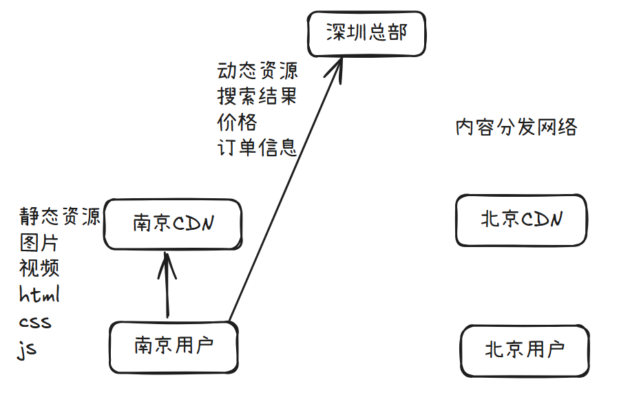

- 内容分发网络（Content Delivery Network，CDN）是建立并覆盖在承载网上，由不同区域的服务器组成的分布式网络。将源站资源缓存到全国各地的边缘服务器，利用全球调度系统使用户能够就近获取，有效降低访问延迟，降低源站压力,提升服务可用性。

- 常见的CDN服务商

  - 百度CDN：https://cloud.baidu.com/product/cdn.html

  - 阿里CDN：https://www.aliyun.com/product/cdn?spm=5176.8269123.416540.50.728y8n

  - 腾讯CDN：https://www.qcloud.com/product/cdn

  - 腾讯云CDN收费介绍：https://cloud.tencent.com/document/product/228/2949

- CDN主要优势

  - CDN 有效地解决了目前互联网业务中网络层面的以下问题：
    - 用户与业务服务器地域间物理距离较远，需要进行多次网络转发，传输延时较高且不稳定。
    - 用户使用运营商与业务服务器所在运营商不同，请求需要运营商之间进行互联转发。
    - 业务服务器网络带宽、处理能力有限，当接收到海量用户请求时，会导致响应速度降低、可用性降低。
    - 利用CDN防止和抵御DDos等攻击,实现安全保护

## 1.5 应用层缓存

- Nginx、PHP等web服务可以设置应用缓存以加速响应用户请求，另外有些解释性语言，比如：PHP/Python/Java不能直接运行，需要先编译成字节码，但字节码需要解释器解释为机器码之后才能执行，因此字节码也是一种缓存，有时候还会出现程序代码上线后字节码没有更新的现象。所以一般上线新版前,需要先将应用缓存清理,再上线新版

- 另外可以利用动态页面静态化技术,加速访问,比如:将访问数据库的数据的动态页面,提前用程序生成静态页面文件html.电商网站的商品介绍,评论信息非实时数据等皆可利用此技术实现

## 1.6 数据层缓存

- 分布式缓存服务

  - Redis

  - Memcached

- 数据库

  - MySQL 查询缓存

  - innodb缓存、MyISAM缓存

## 1.7 硬件缓存

### 1.7.1 CPU缓存

- CPU缓存(L1的数据缓存和L1的指令缓存)、二级缓存、三级缓存

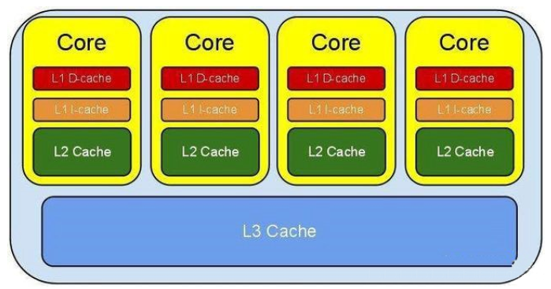

[](https://git.inmind-lab.com/aaronxu/Linux-book/src/branch/main/03.数据库/02.Redis/CPU缓存02.png)

## 1.8 磁盘相关缓存

- 磁盘缓存：Disk Cache
- 磁盘阵列缓存：Raid Cache，可使用电池防止断电丢失数据

# 2. redis介绍

## 2.1 redis简介

- Redis是一个开源的、遵循BSD协议的、基于内存的而且目前比较流行的键值数据库(key-value database)，是一个非关系型数据库，redis 提供将内存通过网络远程共享的一种服务，提供类似功能的还有memcached，但相比memcached，redis还提供了易扩展、高性能、具备数据持久性等功能。

- Redis 在高并发、低延迟环境要求比较高的环境使用量非常广泛，目前redis在DB-Engine月排行榜https://db-engines.com/en/ranking 中一直比较靠前，而且一直是键值型存储类的首位

## 2.2 redis特性

- 速度快: 10W QPS,基于内存,C语言实现
- 单线程
- 持久化
- 支持多种数据结构
- 支持多种编程语言
- 功能丰富: 支持Lua脚本,发布订阅,事务,pipeline等功能
- 简单: 代码短小精悍(单机核心代码只有23000行左右),单线程开发容易,不依赖外部库,使用简单
- 主从复制
- 支持高可用和分布式

## 2.3 单线程

Redis 6.0版本前一直是单线程方式处理用户的请求

[](https://git.inmind-lab.com/aaronxu/Linux-book/src/branch/main/03.数据库/02.Redis/redis单线程01.png)

单线程为何如此快?

- 纯内存
- 非阻塞
- 避免线程切换和竞态消耗

[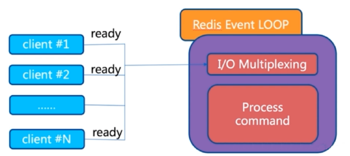](https://git.inmind-lab.com/aaronxu/Linux-book/src/branch/main/03.数据库/02.Redis/redis单线程02.png)

注意事项:

- 一次只运行一条命令
- 拒绝长(慢)命令:keys, flushall, flushdb, slow lua script, mutil/exec, operate big value(collection)
- 其实不是单线程: 早期版本是单进程单线程,3版本后实际还有其它的线程, fysnc file descriptor,close file descriptor

## 2.4 redis 对比 memcached

- 支持数据的持久化：可以将内存中的数据保持在磁盘中，重启redis服务或者服务器之后可以从备份文件中恢复数据到内存继续使用
- 支持更多的数据类型：支持string(字符串)、hash(哈希数据)、list(列表)、set(集合)、zset(有序集合)
- 支持数据的备份：可以实现类似于数据的master-slave模式的数据备份，另外也支持使用快照+AOF
- 支持更大的value数据：memcache单个key value最大只支持1MB，而redis最大支持512MB(生产不建议超过2M,性能受影响)
- 在Redis6版本前,Redis 是单线程，而memcached是多线程，所以单机情况下没有memcached 并发高,性能更好,但redis 支持分布式集群以实现更高的并发，单Redis实例可以实现数万并发
- 支持集群横向扩展：基于redis cluster的横向扩展，可以实现分布式集群，大幅提升性能和数据安全性
- 都是基于 C 语言开发

## 2.5 redis 典型应用场景

- Session 共享：常见于web集群中的Tomcat或者PHP中多web服务器session共享
- 缓存：数据查询、电商网站商品信息、新闻内容
- 计数器：访问排行榜、商品浏览数等和次数相关的数值统计场景
- 微博/微信社交场合：共同好友,粉丝数,关注,点赞评论等
- 消息队列：ELK的日志缓存、部分业务的订阅发布系统
- 地理位置: 基于GEO(地理信息定位),实现摇一摇,附近的人,外卖等功能

**数据更新操作流程：**


**数据读操作流程：**


# 3. redis安装

- 官方下载地址：http://download.redis.io/releases/

## 3.1 redis编译安装

- 下载源代码

```bash
wget http://download.redis.io/releases/redis-6.2.20.tar.gz
```

- 安装编译环境

```bash
yum -y install make gcc tcl tar
```

- 解压源码

```bash
tar xzvf redis-6.2.20.tar.gz
```

- 编译安装

```bash
cd redis-6.2.20/src/
make
make PREFIX=/apps/redis install
```

- 添加环境变量，为了能够在任意地方运行redis相关命令

```bash
echo "PATH=/apps/redis/bin:$PATH" > /etc/profile.d/redis.sh
. /etc/profile.d/redis.sh
```

- 目录结构

```bash
[root@localhost ~]# cd /apps/redis
[root@localhost redis]# tree
.
└── bin
    ├── redis-benchmark
    ├── redis-check-aof -> redis-server
    ├── redis-check-rdb -> redis-server
    ├── redis-cli
    ├── redis-sentinel -> redis-server
    └── redis-server

1 directory, 6 files
```

| 文件名            | 作用                                                      |
| ----------------- | --------------------------------------------------------- |
| `redis-benchmark` | `这是 Redis 的性能测试工具,用于测试 Redis 服务器的性能。` |
| `redis-check-aof` | `AOF相关功能`                                             |
| `redis-check-rdb` | `rdb相关功能`                                             |
| `redis-cli`       | `这是 Redis 的命令行客户端工具`                           |
| `redis-sentinel`  | `哨兵相关功能`                                            |
| `redis-server`    | `这是 Redis 服务器的主程序文件`                           |

- 准备相关文件

```bash
mkdir /apps/redis/{etc,log,data,run}

# 从源码文件夹中复制默认配置
cp redis-6.2.20/redis.conf /apps/redis/etc/
```

- 在前台启动redis

```bash
redis-server /apps/redis/etc/redis.conf
```

- 内核调优
  - OOM Killer
    - 在 Linux 系统运维中，**OOM Killer (Out of Memory Killer)** 是内核的一项“自我保护机制”。当系统物理内存耗尽且无法通过回收（Swap/Cache）释放更多空间时，内核会根据算法挑选并杀掉一个或多个进程，以防止整个系统崩溃（Kernel Panic）。
  - vm.overcommit_memory
    - 查看警告信息有提示，建议将其值改为1
    - 0 表示内核将检查是否有足够的可用内存供应用进程使用；如果有足够的可用内存，内存申请允许；否则，内存申请失败，并把错误返回给应用进程。
    - 1 表示内核允许分配所有的物理内存，而不管当前的内存状态如何
    - 2 表示内核允许分配超过所有物理内存和交换空间总和的内存

```bash
[root@localhost ~]# echo "vm.overcommit_memory=1" >> /etc/sysctl.conf
[root@localhost ~]# sysctl -p
vm.overcommit_memory = 1
```

- 创建redis用户

```bash
useradd -r -s /sbin/nologin redis
chown -R redis.redis /apps/redis/
[root@localhost ~]# id redis
uid=996(redis) gid=993(redis) groups=993(redis)
```

- 编辑redis启动服务文件

```bash
vim /lib/systemd/system/redis.service

[Unit]
Description=Redis persistent key-value database
After=network.target
[Service]
ExecStart=/apps/redis/bin/redis-server /apps/redis/etc/redis.conf --supervised systemd
ExecStop=/bin/kill -s QUIT $MAINPID
Type=simple
User=redis
Group=redis
RuntimeDirectory=redis
RuntimeDirectoryMode=0755
[Install]
WantedBy=multi-user.target
```

- 启动redis服务

```bash
[root@localhost ~]# getenforce
Enforcing
[root@localhost ~]# setenforce 0
[root@localhost ~]# vim /etc/selinux/config 
SELINUX=disabled
[root@localhost ~]# systemctl disable --now firewalld
Removed "/etc/systemd/system/multi-user.target.wants/firewalld.service".
Removed "/etc/systemd/system/dbus-org.fedoraproject.FirewallD1.service".

[root@localhost ~]# systemctl daemon-reload
[root@localhost ~]# systemctl enable --now redis
Created symlink /etc/systemd/system/multi-user.target.wants/redis.service → /usr/lib/systemd/system/redis.service.
```

- 客户端连接测试

```bash
[root@localhost ~]# redis-cli
127.0.0.1:6379> 
```

- 临时关闭rdb，不然会报错

```bash
vim /apps/redis/etc/redis.conf
# 去掉此内容前面的注释
save ""

# 可以设置密码
requirepass redis
```

- 手动设置key value

```bash
127.0.0.1:6379> auth redis
OK
127.0.0.1:6379> set name bbben
OK
127.0.0.1:6379> get name
"bbben"
127.0.0.1:6379> flushdb
OK
```

- 编写一个程序，一次性写入一万个key value

```bash
# 安装python的pip软件管理
yum -y install pip

# 安装python-redis模块
pip install redis

# 编写python程序
vim redis_test.py
import redis
pool = redis.ConnectionPool(host="127.0.0.1",port=6379,password="redis")
r = redis.Redis(connection_pool=pool)
for i in range(100):
    r.set(f"key-{i}", f"value-{i}")
    data = r.get(f"key-{i}")
    print(data)
    
python redis_test.py
```

- 验证数据是否正确写入

```bash
[root@localhost ~]# redis-cli -a redis --no-auth-warning
127.0.0.1:6379> get key-99
"value-99"
```

## 3.2 redis多实例

- 解决配置文件问题，复制出多个配置文件，修改不同端口号

```bash
cd /apps/redis
mv etc/redis.conf etc/redis_6379.conf

# 修改配置文件中如下几条
vim etc/redis_6379.conf
port 6379
pidfile /apps/redis/run/redis_6379.pid
logfile "/apps/redis/log/redis_6379.log"
dbfilename dumpi_6379.rdb
dir /apps/redis/data
appendfilename "appendonlyi_6379.aof"

# 修改启动服务
[root@localhost redis]# systemctl disable --now redis
Removed "/etc/systemd/system/multi-user.target.wants/redis.service".
# 修改启动时调用的配置文件
[root@localhost system]# cd /lib/systemd/system/
[root@localhost system]# mv redis.service redis_6379.service
[root@localhost system]# vim redis_6379.service 
ExecStart=/apps/redis/bin/redis-server /apps/redis/etc/redis_6379.conf --supervised systemd

[root@localhost etc]# systemctl daemon-reload
[root@localhost etc]# systemctl start redis_6379
[root@localhost etc]# ss -ntl
State   Recv-Q  Send-Q     Local Address:Port          Peer Address:Port       Process        
LISTEN  0       128              0.0.0.0:22                 0.0.0.0:*                         
LISTEN  0       511            127.0.0.1:6379               0.0.0.0:*                         
LISTEN  0       511                [::1]:6379                  [::]:*                         
LISTEN  0       128                 [::]:22                    [::]:*          
```

- 相同的方式，将6380和6381实例启动

```bash
cd /apps/redis
cp -a etc/redis_6379.conf etc/redis_6380.conf 
sed -i "s/6379/6380/g" etc/redis_6380.conf
cp -a /lib/systemd/system/redis_6379.service /lib/systemd/system/redis_6380.service
sed -i "s/6379/6380/g" /lib/systemd/system/redis_6380.service
systemctl enable --now redis_6380.service
cp -a etc/redis_6379.conf etc/redis_6381.conf
sed -i "s/6379/6381/g" etc/redis_6381.conf
cp -a /lib/systemd/system/redis_6379.service /lib/systemd/system/redis_6381.service
sed -i "s/6379/6381/g" /lib/systemd/system/redis_6381.service
systemctl daemon-reload 
systemctl enable --now redis_6381.service
```

- 验证端口号

```bash
[root@localhost redis]# ss -ntl
State    Recv-Q   Send-Q      Local Address:Port            Peer Address:Port         Process         
LISTEN   0        128               0.0.0.0:22                   0.0.0.0:*                            
LISTEN   0        511             127.0.0.1:6379                 0.0.0.0:*                            
LISTEN   0        511             127.0.0.1:6381                 0.0.0.0:*                            
LISTEN   0        511             127.0.0.1:6380                 0.0.0.0:*                            
LISTEN   0        128                  [::]:22                      [::]:*                            
LISTEN   0        511                 [::1]:6380                    [::]:*                            
LISTEN   0        511                 [::1]:6381                    [::]:*                            
LISTEN   0        511                 [::1]:6379                    [::]:*                           
```

- 查看文件结构

```bash
[root@localhost redis]# tree
.
├── bin
│   ├── redis-benchmark
│   ├── redis-check-aof -> redis-server
│   ├── redis-check-rdb -> redis-server
│   ├── redis-cli
│   ├── redis-sentinel -> redis-server
│   └── redis-server
├── data
├── etc
│   ├── redis_6379.conf
│   ├── redis_6380.conf
│   └── redis_6381.conf
├── log
│   ├── redis_6379.log
│   ├── redis_6380.log
│   └── redis_6381.log
└── run
    ├── redis_6379.pid
    ├── redis_6380.pid
    └── redis_6381.pid

5 directories, 15 files
```

# 4. redis常用配置

- 基础配置

```bash
# 如果是127.0.0.1，就只能本地访问
bind 0.0.0.0

# 监听端口号
port 6379

# 前台运行，改成yes之后，再用redis-server启动就会在控制台前台运行
daemonize no

# 日志文件的位置
logfile "/path/redis.log"

# 设置redis连接密码
requirepass foobared
```

- 快照配置
  - redis支持将当前的数据以快照的方式保存下来
  - RPO (Recovery Point Objective) —— 复原点目标
    - 指发生故障时，业务能容忍的**数据丢失量**（以时间衡量）。
  - RTO (Recovery Time Objective) —— 复原时间目标
    - 指从故障发生到业务**恢复正常运行**所需的时间。

```bash
# 不进行快照
save ""

# 900秒内1个key发生改变，触发快照机制
save 900 1
save 300 10
save 60 10000

# 默认为yes时,可能会因空间满等原因快照无法保存出错时，会禁止redis写入操作
stop-writes-on-bgsave-error yes

# rdb快照是否压缩
rdbcompression yes

# rdb快照完整性校验
rdbchecksum yes

# 快照文件名
dbfilename dump.rdb

# 快照的路径
dir ./
```

- 主从复制相关，见标题7

- 客户端配置

```bash
# 限制最大连接客户端数量
maxclients 10000

# 是否开启aof日志记录
appendonly no

# aof日志存放名字
appendfilename "appendonly.aof"

#aof持久化策略的配置
#no表示由操作系统保证数据同步到磁盘,Linux的默认fsync策略是30秒，最多会丢失30s的数据
#always表示每次写入都执行fsync，以保证数据同步到磁盘,安全性高,性能较差
#everysec表示每秒执行一次fsync，可能会导致丢失这1s数据,此为默认值,也生产建议值
appendfsync everysec

no-appendfsync-on-rewrite no #在aof rewrite期间,是否对aof新记录的append暂缓使用文件同步策略,主要考虑磁盘IO开支和请求阻塞时间。
#默认为no,表示"不暂缓",新的aof记录仍然会被立即同步到磁盘，是最安全的方式，不会丢失数据，但是要忍受阻塞的问题
#为yes,相当于将appendfsync设置为no，这说明并没有执行磁盘操作，只是写入了缓冲区，因此这样并不会造成阻塞（因为没有竞争磁盘），但是如果这个时候redis挂掉，就会丢失数据。丢失多少数据呢？Linux的默认fsync策略是30秒，最多会丢失30s的数据,但由于yes性能较好而且会避免出现阻塞因此比较推荐
#rewrite 即对aof文件进行整理,将空闲空间回收,从而可以减少恢复数据时间
auto-aof-rewrite-percentage 100 #当Aof log增长超过指定百分比例时，重写AOF文件，设置为0表示不自动重写Aof日志，重写是为了使aof体积保持最小，但是还可以确保保存最完整的数据
auto-aof-rewrite-min-size 64mb #触发aof rewrite的最小文件大小
aof-load-truncated yes #是否加载由于某些原因导致的末尾异常的AOF文件(主进程被kill/断电等)，建议yes
aof-use-rdb-preamble no #redis4.0新增RDB-AOF混合持久化格式，在开启了这个功能之后，AOF重写产生的文件将同时包含RDB格式的内容和AOF格式的内容，其中RDB格式的内容用于记录已有的数据，而AOF格式的内容则用于记录最近发生了变化的数据，这样Redis就可以同时兼有RDB持久化和AOF持久化的优点（既能够快速地生成重写文件，也能够在出现问题时，快速地载入数据）,默认为no,即不启用此功能
```

## 4.1 动态修改配置

- 如果在运行中的redis上，让配置立即生效，可以使用config动态配置

```bash
# 设置密码，立即生效
127.0.0.1:6379> config set requirepass redis666
OK
127.0.0.1:6379> config get requirepass
1) "requirepass"
2) "redis666"

# 临时调整最大内存
127.0.0.1:6379> config set maxmemory 8589934592
OK
127.0.0.1:6379> config get maxmemory
1) "maxmemory"
2) "8589934592"
```

## 4.2 慢查询

[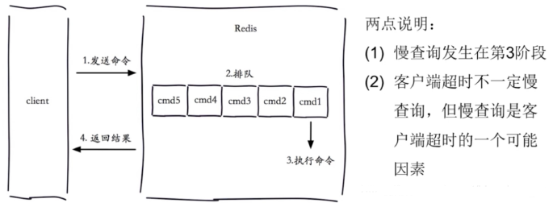](https://git.inmind-lab.com/aaronxu/Linux-book/src/branch/main/03.数据库/02.Redis/慢查询.png)

- 可以通过config set命令动态修改参数，并使配置持久化到配置文件中

```bash
config set slowlog-log-slower-than 20000
config set slowlog-max-len 1000
config rewrite
```

- 慢日志查看

```bash
# 为了能看到日志，故意将慢的定义位1微秒
127.0.0.1:6379> config set slowlog-log-slower-than 1
OK
127.0.0.1:6379> config set slowlog-max-len 1000
OK
127.0.0.1:6379> SLOWLOG len
# 获取慢查询日志列表当前的长度
(integer) 2
127.0.0.1:6379> SLOWLOG get
```

# 5. 持久化

## 5.1 RDB

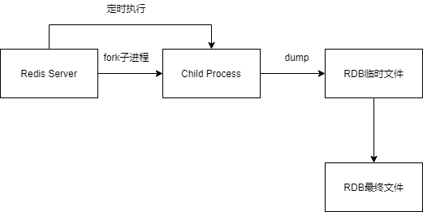

- Redis从master主进程先fork出一个子进程，使用写时复制机制，子进程将内存的数据保存为一个临时文件

- 当数据保存完成之后再将上一次保存的RDB文件替换掉，然后关闭子进程，这样可以保证每一次做RDB快照保存的数据都是完整的
- 因为直接替换RDB文件的时候,可能会出现突然断电等问题,而导致RDB文件还没有保存完整就因为突然关机停止保存,而导致数据丢失的情况.后续可以手动将每次生成的RDB文件进行备份，这样可以最大化保存历史数据
- ```bash
  [root@localhost redis]# pstree -p |grep redis-server;ll -h /apps/redis/data/
             |-redis-server(17302)-+-{redis-server}(17303)
             |                     |-{redis-server}(17304)
             |                     |-{redis-server}(17305)
             |                     `-{redis-server}(17306)
             |-redis-server(17337)-+-{redis-server}(17341)
             |                     |-{redis-server}(17342)
             |                     |-{redis-server}(17343)
             |                     `-{redis-server}(17344)
             |-redis-server(17391)-+-{redis-server}(17392)
             |                     |-{redis-server}(17393)
             |                     |-{redis-server}(17394)
             |                     `-{redis-server}(17395)
  total 0
  ```

- 相关配置

```bash
save 900 1
save 300 10
save 60 10000
stop-writes-on-bgsave-error yes
rdbcompression yes
rdbchecksum yes
dbfilename dump.rdb
dir /var/lib/redis	#编译安装，默认RDB文件存放在启动redis的工作目录，建议明确指定存入目录
```

- RDB执行
  - bgsave：异步后台执行,不影响其它命令的执行
  - 自动: 制定规则,自动执行 

- RDB优点

  - **恢复速度快**

    - 恢复时直接把 RDB 文件读入内存，比 AOF 逐条重放命令要快很多，适合大数据量场景。

    **文件小、节省空间**

    - 采用压缩的二进制格式，比 AOF 的文本命令日志更小，节省磁盘和带宽。

    **对性能影响小**

    - 可配置在**子进程**中完成保存，主进程继续处理请求，对业务影响有限。

    **方便备份和迁移**

    - 单文件结构，复制、移动、归档都简单，适合做定时备份、跨环境部署。

    **版本兼容性好**

    - 新版本 Redis 一般能向下兼容旧版 RDB 文件，利于升级和回滚。

- RDB缺点

  - **可能丢失最近数据**

    - 依赖固定频率的快照，如果两次快照之间宕机，这段时间的数据会全部丢失，无法做到强一致。

    **大内存时阻塞风险**

    - 数据量大时，创建子进程和写盘会占用较多资源，极端情况下仍可能导致短暂停顿。

    **fork 开销随数据量增长**

    - 需要 fork 子进程，数据量越大，fork 越慢，在内存紧张或高并发时更明显。

    **不适合高频写入场景**

    - 快照间隔设置短，会频繁写盘；设置长，则数据安全性差，需要在性能和可靠性间折中。

    **单点故障风险**

    - 只依赖一个 RDB 文件，一旦该文件损坏，从最近一次成功快照开始的数据都会丢失。


## 5.2 AOF

- 开启aof注意事项
  - aof的恢复顺序高于rdb，所以在配置文件中开启aof，然后重启服务，会导致redis的rdb持久数据没有加载
  - 正确做法
    - 现在运行中的redis中使用config开启aof
    - 然后再config rewrite保存配置，这样重启也不会丢失数据了

```bash
127.0.0.1:6379> config set appendonly yes 
OK
127.0.0.1:6379> config rewrite
OK
```

- 相关配置

```bash
appendonly yes
appendfilename "appendonly-${port}.aof"
appendfsync everysec
dir /path
no-appendfsync-on-rewrite yes
auto-aof-rewrite-percentage 100
auto-aof-rewrite-min-size 64mb
aof-load-truncated yes
```

- AOF优点

  - **数据安全性更高**

    - 每条写命令几乎实时写入文件，配合 `appendfsync always`可实现**最多丢失一条命令**的数据，适合对数据完整性要求高的场景。

    **可读性强、易调试**

    - AOF 是文本格式，记录的是原始 Redis 命令，运维可以直接查看、编辑或删除异常命令来修复数据问题。

    **自动重写压缩体积**

    - 支持 AOF Rewrite，由子进程生成精简后的最小命令集，既保留当前数据状态，又大幅减小文件体积。

    **天然支持增量持久化**

    - 只需追加命令即可，无需像 RDB 那样定期全量快照，更适合持续写入的业务。

- AOF缺点

  - **恢复速度慢**

    - 重启时需要逐条重放命令，文件越大、命令越多，恢复耗时越长，相比 RDB 有明显劣势。

    **文件体积通常更大**

    - 即使经过重写，也比同数据的 RDB 文件大，占用更多磁盘空间和备份带宽。

    **对性能有一定影响**

    - 每次写操作都要追加日志，`always`模式尤其耗性能；即使是 `everysec`，也会带来额外的 I/O 开销。

    **重写期间资源消耗高**

    - AOF Rewrite 同样需要 fork 子进程并遍历数据，期间内存和 CPU 占用上升，可能影响线上请求。

    **存在命令兼容风险**

    - 若低版本 Redis 生成的 AOF 文件在高版本上执行，可能因命令变化导致恢复失败，需要版本对齐或转换。

## 5.3 RDB和AOF的选择

- 如果主要充当缓存功能,或者可以承受数分钟数据的丢失, 通常生产环境一般只需启用RDB即可,此也是默认值

- 如果数据需要持久保存,一点不能丢失,可以选择同时开启RDB和AOF,一般不建议只开启AOF

# 6. redis常用操作

```bash
# 显示节点信息
info

# 切换数据库，redis默认有16个数据库0-15
select 0

# 查看所有的key，生产别用
keys *
keys n*

# 设置key
set key value

# 删除一个key
del key

# 根据key获取value
get key

# 一次设置多个value
mset name "张三" age 18 hobby "抽烟喝酒烫头"

# 一次获得多个value
mget name age

# 手动rdb持久化
bgsave

# 获取keys数量
dbsize

# 清空所有的keys，默认是同步的，也就是如果卡住了，redis就无法工作了
flushdb

# 清空所有的keys，异步清除
flushdb async

# 清空所有数据库中所有keys
flushall

# 终止服务端，如果有rdb配置就会快照，如果开启了aof，也会更新aof
shutdown
```

## 6.1 数据类型

- 字符串

  - 添加值后面可以加上的选项

  | **参数**    | **说明**                                                     |
  | ----------- | ------------------------------------------------------------ |
  | **NX**      | **只在键不存在时**才设置。常用于实现分布式锁。               |
  | **XX**      | **只在键已经存在时**才设置（即只更新，不创建）。             |
  | **GET**     | 返回键之前存储的旧值。如果键不存在，返回 `nil`。             |
  | **EX**      | 设置键的过期时间，单位为 **秒**。                            |
  | **PX**      | 设置键的过期时间，单位为 **毫秒**。                          |
  | **KEEPTTL** | 保留键原有的过期时间（如果不加这个参数，重新 SET 会覆盖掉之前的过期时间）。 |

- 字符串在redis中的一些操作

```bash
# 获取value的字节数
strlen name

# 在value字符串后追加字符串
append name " xwz"

# 判断key是否存在
exists name

# 查看key的过期时间
ttl age

# 设置key的过期时间
expire name 30

# 取消key的过期时间
persist name

# value自增，如果key不存在，操作之前，key就会被置为0。
incr age

# value自减，如果key的value类型错误或者是个不能表示成数字的字符串，就返回错误。
decr num
```

- 列表

```bash
# 创建列表
lpush name user01 user02 user03 user04
rpush course linux python java

# 查看类型
type name

# 追加元素
lpush name abc
rpush name tom

# 获取列表长度
llen name

# 根据下标获取列表元素
lindex name 0
lindex name -1
lindex 1

# 获取元素范围
lindex 0 -1
```

- 集合

```bash
# 生成集合以及添加数据，只有不存在的元素可以添加进去
sadd set2 v2 v3

# 查看集合的所有数据
smembers set2
```

- 有序集合

```bash
# 创建，其中1为排序，v1为value
zadd zset1 1 v1
```

- 哈希

```bash
# 创建一个哈希类型
127.0.0.1:6379> hset user01 name user01 age 18 hobby "lalala"
(integer) 3

# 查看此此类型的数据
127.0.0.1:6379> hgetall user01
1) "name"
2) "user01"
3) "age"
4) "18"
5) "hobby"
6) "lalala"
```

# 7. 主从复制

- 虽然Redis可以实现单机的数据持久化，但无论是RDB也好或者AOF也好，都解决不了单点宕机问题，即一旦单台 redis服务器本身出现系统故障、硬件故障等问题后，就会直接造成数据的丢失

- 此外,单机的性能也是有极限的,因此需要使用另外的技术来解决单点故障和性能扩展的问题。

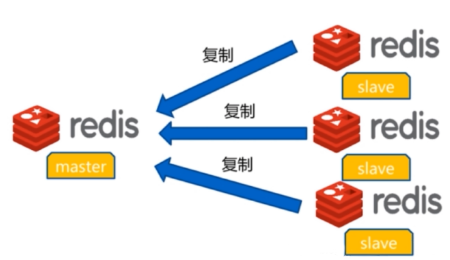

## 7.1 redis 主从复制架构

- 主从模式（master/slave），可以实现Redis数据的跨主机备份。

- 程序端连接到高可用负载的VIP，然后连接到负载服务器设置的Redis后端real server，此模式不需要在程序里面配置Redis服务器的真实IP地址，当后期Redis服务器IP地址发生变更只需要更改redis 相应的后端real server即可， 可避免更改程序中的IP地址设置。

  - 一个master可以有多个slave

  - 一个slave只能有一个master

  - 数据流向是单向的，master到slave

## 7.2 实现

- 在6379上设置master并且设置key用作测试

```bash
[root@localhost ~]# redis-cli -p 6379 -a redis --no-auth-warning
127.0.0.1:6379> info replication
# Replication
role:master
connected_slaves:0
master_failover_state:no-failover
master_replid:1cd2d508f09d3fd06abc5baae23386adffbcbde1
master_replid2:0000000000000000000000000000000000000000
master_repl_offset:0
second_repl_offset:-1
repl_backlog_active:0
repl_backlog_size:1048576
repl_backlog_first_byte_offset:0
repl_backlog_histlen:0
127.0.0.1:6379> set key1 v1-master
OK
127.0.0.1:6379> get key1
"v1-master"
```

- 在6380上执行登录，设置key1

```bash
[root@localhost ~]# redis-cli -p 6380 -a redis --no-auth-warning
# 设置密码
127.0.0.1:6380> config set requirepass redis
OK
127.0.0.1:6380> config rewrite
OK127.0.0.1:6380> info replication
# Replication
role:master
connected_slaves:0
master_failover_state:no-failover
master_replid:53e4567144804df56f04b3a1b76502ecb8270746
master_replid2:0000000000000000000000000000000000000000
master_repl_offset:0
second_repl_offset:-1
repl_backlog_active:0
repl_backlog_size:1048576
repl_backlog_first_byte_offset:0
repl_backlog_histlen:0
127.0.0.1:6380> set key1 v1-slave1
OK
127.0.0.1:6380> get key1
"v1-slave1"
```

- 在6381上执行相同的操作

```bash
[root@localhost ~]# redis-cli -p 6381 -a redis --no-auth-warning
127.0.0.1:6381> config set requirepass redis
OK
127.0.0.1:6381> config rewrite
OK
127.0.0.1:6381> set key1 v1-slave2
OK
127.0.0.1:6381> get key1
"v1-slave2"
```

- 在slave上设置master的连接

```bash
[root@localhost ~]# redis-cli -p 6380 -a redis --no-auth-warning
127.0.0.1:6380> replicaof 192.168.73.128 6379
OK
127.0.0.1:6380> config set masterauth redis
OK
127.0.0.1:6380> info replication
# Replication
role:slave
master_host:192.168.73.128
master_port:6379
master_link_status:down
master_last_io_seconds_ago:-1
master_sync_in_progress:0
slave_read_repl_offset:0
slave_repl_offset:0
master_link_down_since_seconds:-1
slave_priority:100
slave_read_only:1
replica_announced:1
connected_slaves:0
master_failover_state:no-failover
master_replid:53e4567144804df56f04b3a1b76502ecb8270746
master_replid2:0000000000000000000000000000000000000000
master_repl_offset:0
second_repl_offset:-1
repl_backlog_active:0
repl_backlog_size:1048576
repl_backlog_first_byte_offset:0
repl_backlog_histlen:0

[root@localhost ~]# redis-cli -p 6381 -a redis --no-auth-warning
127.0.0.1:6381> replicaof 192.168.73.128 6379
OK
127.0.0.1:6381> config set masterauth redis
OK
127.0.0.1:6381> info replication
# Replication
role:slave
master_host:192.168.73.128
master_port:6379
master_link_status:down
master_last_io_seconds_ago:-1
master_sync_in_progress:0
slave_read_repl_offset:0
slave_repl_offset:0
master_link_down_since_seconds:-1
slave_priority:100
slave_read_only:1
replica_announced:1
connected_slaves:0
master_failover_state:no-failover
master_replid:b47a945eb90a8d7f350509095a0365e2feecc1bb
master_replid2:0000000000000000000000000000000000000000
master_repl_offset:0
second_repl_offset:-1
repl_backlog_active:0
repl_backlog_size:1048576
repl_backlog_first_byte_offset:0
repl_backlog_histlen:0
```

- 连上后进行检查
  - 如果出现连接不上，检查6379配置文件`bind`有没有加上被连接的IP地址

```bash
[root@localhost data]# vim /apps/redis/etc/redis_6379.conf
bind 192.168.73.128
[root@localhost data]# systemctl restart redis_6379
[root@localhost data]# ss -ntl
State   Recv-Q  Send-Q     Local Address:Port          Peer Address:Port       Process        
LISTEN  0       511       192.168.73.128:6379               0.0.0.0:*                         
LISTEN  0       128              0.0.0.0:22                 0.0.0.0:*                         
LISTEN  0       511            127.0.0.1:6380               0.0.0.0:*                         
LISTEN  0       511            127.0.0.1:6381               0.0.0.0:*                         
LISTEN  0       511                [::1]:6381                  [::]:*                         
LISTEN  0       511                [::1]:6380                  [::]:*                         
LISTEN  0       128                 [::]:22                    [::]:*      
[root@localhost data]# redis-cli -h 192.168.73.128 -p 6379 -a redis --no-auth-warning
192.168.73.128:6379> info replication
# Replication
role:master
connected_slaves:2
slave0:ip=127.0.0.1,port=6381,state=online,offset=98,lag=0
slave1:ip=127.0.0.1,port=6380,state=online,offset=98,lag=0
master_failover_state:no-failover
master_replid:73f2d6502eb3aa57b70d38fc84f8887a415430f3
master_replid2:0000000000000000000000000000000000000000
master_repl_offset:98
second_repl_offset:-1
repl_backlog_active:1
repl_backlog_size:1048576
repl_backlog_first_byte_offset:1
repl_backlog_histlen:98

[root@localhost data]# vim /apps/redis/etc/redis_6379.conf
bind 127.0.0.1 192.168.73.128
[root@localhost data]# systemctl restart redis_6379
[root@localhost data]# ss -ntl
State   Recv-Q  Send-Q     Local Address:Port          Peer Address:Port       Process        
LISTEN  0       511       192.168.73.128:6379               0.0.0.0:*                         
LISTEN  0       128              0.0.0.0:22                 0.0.0.0:*                         
LISTEN  0       511            127.0.0.1:6379               0.0.0.0:*                         
LISTEN  0       511            127.0.0.1:6380               0.0.0.0:*                         
LISTEN  0       511            127.0.0.1:6381               0.0.0.0:*                         
LISTEN  0       511                [::1]:6381                  [::]:*                         
LISTEN  0       511                [::1]:6380                  [::]:*                         
LISTEN  0       128                 [::]:22                    [::]:*           
[root@localhost data]# redis-cli -p 6379 -a redis --no-auth-warning
127.0.0.1:6379> info replication
# Replication
role:master
connected_slaves:2
slave0:ip=127.0.0.1,port=6381,state=online,offset=84,lag=1
slave1:ip=127.0.0.1,port=6380,state=online,offset=98,lag=0
master_failover_state:no-failover
master_replid:3e9099e0f1db3a7f2387d178ea4dedd1c22e7e41
master_replid2:0000000000000000000000000000000000000000
master_repl_offset:98
second_repl_offset:-1
repl_backlog_active:1
repl_backlog_size:1048576
repl_backlog_first_byte_offset:1
repl_backlog_histlen:98
```

- 退出从的操作

```bash
[root@localhost data]# redis-cli -p 6380 -a redis --no-auth-warning
127.0.0.1:6380> replicaof no one
OK
127.0.0.1:6380> info replication
# Replication
role:master	# 从变为master
connected_slaves:0
master_failover_state:no-failover
master_replid:6cf53c44bc6a134884cd809a7a808bc8f6199460
master_replid2:3e9099e0f1db3a7f2387d178ea4dedd1c22e7e41
master_repl_offset:322
second_repl_offset:323
repl_backlog_active:1
repl_backlog_size:1048576
repl_backlog_first_byte_offset:1
repl_backlog_histlen:322

[root@localhost data]# redis-cli -p 6379 -a redis --no-auth-warning
127.0.0.1:6379> info replication
# Replication
role:master
connected_slaves:1		# 从连接变为1
slave0:ip=127.0.0.1,port=6381,state=online,offset=378,lag=1
master_failover_state:no-failover
master_replid:3e9099e0f1db3a7f2387d178ea4dedd1c22e7e41
master_replid2:0000000000000000000000000000000000000000
master_repl_offset:378
second_repl_offset:-1
repl_backlog_active:1
repl_backlog_size:1048576
repl_backlog_first_byte_offset:1
repl_backlog_histlen:378
```

- 再次添加

```bash
[root@localhost data]# redis-cli -p 6380 -a redis --no-auth-warning
127.0.0.1:6380> replicaof 192.168.73.128 6379
OK
127.0.0.1:6380> config set masterauth redis
OK
127.0.0.1:6380> info replication
# Replication
role:slave	# 又变为slave
master_host:192.168.73.128
master_port:6379
master_link_status:up	# 变为up
master_last_io_seconds_ago:6
master_sync_in_progress:0
slave_read_repl_offset:644
slave_repl_offset:644
slave_priority:100
slave_read_only:1
replica_announced:1
connected_slaves:0
master_failover_state:no-failover
master_replid:3e9099e0f1db3a7f2387d178ea4dedd1c22e7e41
master_replid2:0000000000000000000000000000000000000000
master_repl_offset:644
second_repl_offset:-1
repl_backlog_active:1
repl_backlog_size:1048576
repl_backlog_first_byte_offset:603
repl_backlog_histlen:42
```

- 主从成功之后，在主上修改key，可以看到slave会同步变化

```bash
127.0.0.1:6379> set key1 v1-master
OK

127.0.0.1:6380> get key1
"v1-master"

127.0.0.1:6379> set key1 v1-master-hahaha
OK

127.0.0.1:6380> get key1
"v1-master-hahaha"
```

- 如果主出问题了，可以选择一个slave手动提升为master，命令是`replicaof no one`，别忘了把其他的slave改过来，别忘了去应用上修改redis


- 同步日志

```bash
[root@localhost ~]# tail /apps/redis/log/redis_6379.log
1305:M 11 Mar 2026 20:45:15.473 * Background saving terminated with success
1305:M 11 Mar 2026 20:45:15.474 * Synchronization with replica 127.0.0.1:6380 succeeded
1305:M 11 Mar 2026 20:47:37.753 * Replica 127.0.0.1:6381 asks for synchronization
1305:M 11 Mar 2026 20:47:37.753 * Partial resynchronization not accepted: Replication ID mismatch (Replica asked for 'ae2a20f865a7051233045719a8d61fd5cb76f35a', my replication IDs are '1839c17c2c51408c21deaae29c0718055b5e89c1' and '0000000000000000000000000000000000000000')
1305:M 11 Mar 2026 20:47:37.754 * Starting BGSAVE for SYNC with target: disk
1305:M 11 Mar 2026 20:47:37.754 * Background saving started by pid 1414
1414:C 11 Mar 2026 20:47:37.758 * DB saved on disk
1414:C 11 Mar 2026 20:47:37.759 * RDB: 0 MB of memory used by copy-on-write
1305:M 11 Mar 2026 20:47:37.810 * Background saving terminated with success
1305:M 11 Mar 2026 20:47:37.810 * Synchronization with replica 127.0.0.1:6381 succeeded
```

- 在slave节点观察日志

```bash
[root@localhost ~]# tail /apps/redis/log/redis_6380.log
787:S 11 Mar 2026 20:45:15.411 * Full resync from master: 1839c17c2c51408c21deaae29c0718055b5e89c1:0
787:S 11 Mar 2026 20:45:15.474 * MASTER <-> REPLICA sync: receiving 1908 bytes from master to disk
787:S 11 Mar 2026 20:45:15.474 * MASTER <-> REPLICA sync: Flushing old data
787:S 11 Mar 2026 20:45:15.474 * MASTER <-> REPLICA sync: Loading DB in memory
787:S 11 Mar 2026 20:45:15.475 * Loading RDB produced by version 6.2.20
787:S 11 Mar 2026 20:45:15.475 * RDB age 0 seconds
787:S 11 Mar 2026 20:45:15.475 * RDB memory usage when created 1.86 Mb
787:S 11 Mar 2026 20:45:15.475 # Done loading RDB, keys loaded: 103, keys expired: 0.
787:S 11 Mar 2026 20:45:15.475 * MASTER <-> REPLICA sync: Finished with success
787:S 11 Mar 2026 20:46:32.860 # CONFIG REWRITE executed with success.
```

## 7.3 故障恢复

### 7.3.1 主从复制故障恢复过程介绍

- slave 节点故障和恢复
  - client指向另一个从节点即可，并及时修复故障从节点

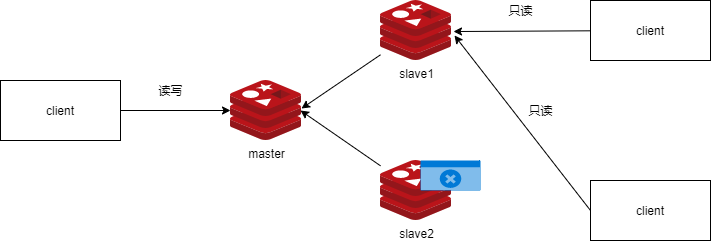

- master 节点故障和恢复
  - 需要提升slave为新的master


- master故障后，只能手动提升一个slave为新master，不支持自动切换。master的切换会导致master_replid发生变化，slave之前的master_replid就和当前master不一致从而会引发所有slave的全量同步

### 7.3.2 主从复制故障恢复实现

- 假设主节点6379故障

```bash
[root@localhost ~]# systemctl stop redis_6379
```

- 查看从节点6380

```bash
127.0.0.1:6380> info replication
# Replication
role:slave
master_host:192.168.73.128
master_port:6379
master_link_status:down		# 从节点down了
master_last_io_seconds_ago:-1
master_sync_in_progress:0
slave_read_repl_offset:953
slave_repl_offset:953
master_link_down_since_seconds:54
slave_priority:100
slave_read_only:1
replica_announced:1
connected_slaves:0
master_failover_state:no-failover
master_replid:1839c17c2c51408c21deaae29c0718055b5e89c1
master_replid2:0000000000000000000000000000000000000000
master_repl_offset:953
second_repl_offset:-1
repl_backlog_active:1
repl_backlog_size:1048576
repl_backlog_first_byte_offset:1
repl_backlog_histlen:953
```

- 取消6380的从并提升为新的master

```bash
127.0.0.1:6380> replicaof no one
OK
127.0.0.1:6380> info replication
# Replication
role:master
connected_slaves:0
master_failover_state:no-failover
master_replid:9a371972cc8e8cd66d5d3fa2860e9a521b02967b
master_replid2:1839c17c2c51408c21deaae29c0718055b5e89c1
master_repl_offset:953
second_repl_offset:954
repl_backlog_active:1
repl_backlog_size:1048576
repl_backlog_first_byte_offset:1
repl_backlog_histlen:953
```

- 修改6381这个从指向6380新的master

```bash
127.0.0.1:6381> replicaof 127.0.0.1 6380
OK
127.0.0.1:6381> info replication
# Replication
role:slave
master_host:127.0.0.1
master_port:6380
master_link_status:up
master_last_io_seconds_ago:5
master_sync_in_progress:0
slave_read_repl_offset:967
slave_repl_offset:967
slave_priority:100
slave_read_only:1
replica_announced:1
connected_slaves:0
master_failover_state:no-failover
master_replid:9a371972cc8e8cd66d5d3fa2860e9a521b02967b
master_replid2:1839c17c2c51408c21deaae29c0718055b5e89c1
master_repl_offset:967
second_repl_offset:954
repl_backlog_active:1
repl_backlog_size:1048576
repl_backlog_first_byte_offset:197
repl_backlog_histlen:771
```

- 此时再到master6380上

```bash
127.0.0.1:6380> info replication
# Replication
role:master
connected_slaves:1	# 有一个slave了
slave0:ip=127.0.0.1,port=6381,state=online,offset=1037,lag=1
master_failover_state:no-failover
master_replid:9a371972cc8e8cd66d5d3fa2860e9a521b02967b
master_replid2:1839c17c2c51408c21deaae29c0718055b5e89c1
master_repl_offset:1037
second_repl_offset:954
repl_backlog_active:1
repl_backlog_size:1048576
repl_backlog_first_byte_offset:1
repl_backlog_histlen:1037

127.0.0.1:6380> set key88 value88
OK
127.0.0.1:6381> get key88
"value88"

```

## 7.4 实现redis的级联复制

- 在6379上slave指向6381

```bash
127.0.0.1:6379> replicaof 127.0.0.1 6381
OK
127.0.0.1:6379> config set masterauth redis
OK
127.0.0.1:6379> info replication
# Replication
role:slave
master_host:127.0.0.1
master_port:6381
master_link_status:up
master_last_io_seconds_ago:6
master_sync_in_progress:0
slave_read_repl_offset:1489
slave_repl_offset:1489
slave_priority:100
slave_read_only:1
replica_announced:1
connected_slaves:0
master_failover_state:no-failover
master_replid:9a371972cc8e8cd66d5d3fa2860e9a521b02967b
master_replid2:0000000000000000000000000000000000000000
master_repl_offset:1489
second_repl_offset:-1
repl_backlog_active:1
repl_backlog_size:1048576
repl_backlog_first_byte_offset:1490
repl_backlog_histlen:0
```

- 6381上查看

```bash
127.0.0.1:6381> info replication
# Replication
role:slave
master_host:127.0.0.1
master_port:6380
master_link_status:up
master_last_io_seconds_ago:3
master_sync_in_progress:0
slave_read_repl_offset:1601
slave_repl_offset:1601
slave_priority:100
slave_read_only:1
replica_announced:1
connected_slaves:1
slave0:ip=127.0.0.1,port=6379,state=online,offset=1601,lag=1	# 6379是slave
master_failover_state:no-failover
master_replid:9a371972cc8e8cd66d5d3fa2860e9a521b02967b
master_replid2:1839c17c2c51408c21deaae29c0718055b5e89c1
master_repl_offset:1601
second_repl_offset:954
repl_backlog_active:1
repl_backlog_size:1048576
repl_backlog_first_byte_offset:197
repl_backlog_histlen:1405
```

- 之前6381上的信息也都可以在6379上查看

```bash
127.0.0.1:6379> get name
"uer01"
127.0.0.1:6379> get key88
"value88"
```

## 7.5 主从复制优化

### 7.5.1 主从复制过程

Redis主从复制分为全量同步和增量同步

- 全量复制过程

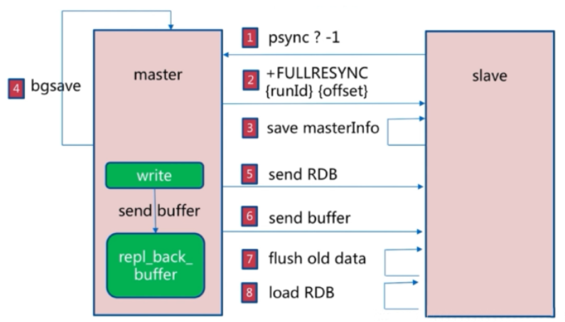

首次同步是全量同步，主从同步可以让从服务器从主服务器同步数据，而且从服务器还可再有其它的从服务器，即另外一台redis服务器可以从一台从服务器进行数据同步，redis 的主从同步是非阻塞的，master收到从服务器的psync(2.8版本之前是SYNC)命令,会fork一个子进程在后台执行bgsave命令，并将新写入的数据写入到一个缓冲区中，bgsave执行完成之后,将生成的RDB文件发送给slave，然后master再将缓冲区的内容以redis协议格式再全部发送给slave，slave 先删除旧数据,slave将收到后的RDB文件载入自己的内存，再加载所有收到缓冲区的内容 从而这样一次完整的数据同步

Redis全量复制一般发生在Slave首次初始化阶段，这时Slave需要将Master上的所有数据都复制一份。

- 增量复制过程

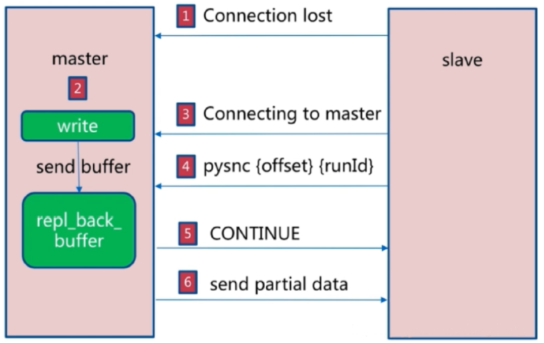

全量同步之后再次需要同步时,从服务器只要发送当前的offset位置(等同于MySQL的binlog的位置)给主服务器，然后主服务器根据相应的位置将之后的数据(包括写在缓冲区的积压数据)发送给从服务器,其再次保存到其内存即可。

- 主从同步完整过程
  1. 从服务器连接主服务器，发送PSYNC命令
  2. 主服务器接收到PSYNC命令后，开始执行BGSAVE命令生成RDB快照文件并使用缓冲区记录此后执行的所有写命令
  3. 主服务器BGSAVE执行完后，向所有从服务器发送RDB快照文件，并在发送期间继续记录被执行的写命令
  4. 从服务器收到快照文件后丢弃所有旧数据，载入收到的快照至内存
  5. 主服务器快照发送完毕后,开始向从服务器发送缓冲区中的写命令
  6. 从服务器完成对快照的载入，开始接收命令请求，并执行来自主服务器缓冲区的写命令
  7. 后期同步会先发送自己slave_repl_offset位置，只同步新增加的数据，不再全量同步


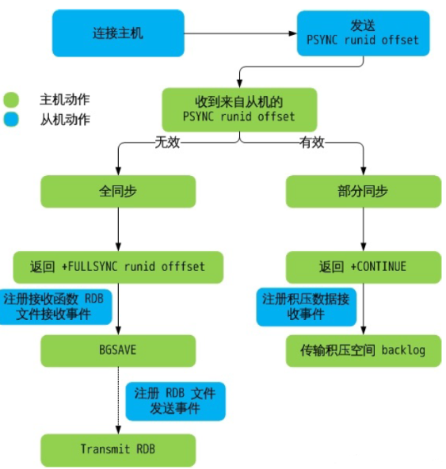

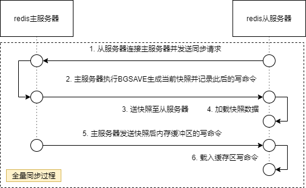

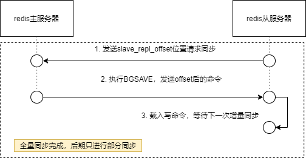

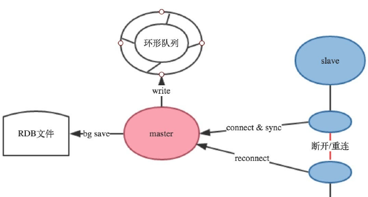

- 复制缓冲区(环形队列)配置参数

```shell
#复制缓冲区大小，建议要设置足够大
rep-backlog-size 1mb
#Redis同时也提供了当没有slave需要同步的时候，多久可以释放环形队列：
repl-backlog-ttl 3600
```

- 避免全量复制
  - 第一次全量复制不可避免,后续的全量复制可以利用小主节点(内存小),业务低峰时进行全量
  - 节点运行 run-id 不匹配:主节点重启会导致RUNID变化,可能会触发全量复制,可以利用故障转移，例如哨兵或集群,而从节点重新启动,不会导致全量复制
  - 复制积压缓冲区不足: 当主节点生成的新数据大于缓冲区大小,从节点恢复和主节点连接后,会导致全量复制.解决方法将repl-backlog-size 调大
- 避免复制风暴
  - 单节点复制风暴
    - 当主节点重启，多从节点复制
    - 解决方法：更换复制拓扑

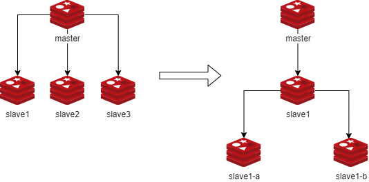

- 单机器复制风暴
  - 机器宕机后，大量全量复制
  - 解决方法：主节点分散多机器

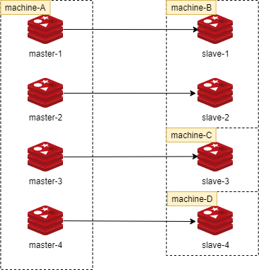

## 7.6 常见主从复制故障汇总

- mater密码不对
  - 即配置的master密码不对，导致验证不通过而无法建立主从同步关系。

```bash
[root@slave1 ~]#tail -f /var/log/redis/redis.log
3939:S 24 Oct 2020 16:13:57.552 # Server initialized
3939:S 24 Oct 2020 16:13:57.552 * DB loaded from disk: 0.000 seconds
3939:S 24 Oct 2020 16:13:57.552 * Ready to accept connections
3939:S 24 Oct 2020 16:13:57.554 * Connecting to MASTER 0.0.18:6379
3939:S 24 Oct 2020 16:13:57.554 * MASTER <-> REPLICA sync started
3939:S 24 Oct 2020 16:13:57.556 * Non blocking connect for SYNC fired the event.
3939:S 24 Oct 2020 16:13:57.558 * Master replied to PING, replication can continue...
3939:S 24 Oct 2020 16:13:57.559 # Unable to AUTH to MASTER: -ERR invalid password
```

- 无法远程连接
  - 在开启了安全模式情况下，没有设置bind地址或者密码

```bash
[root@slave1 ~]#redis-cli -h 192.168.175.10
192.168.175.10:6379> KEYS *
(error) DENIED Redis is running in protected mode because protected mode is enabled
```

- 配置不一致

  - 主从节点的maxmemory不一致,主节点内存大于从节点内存,主从复制可能丢失数据

  - rename-command 命令不一致,如在主节点定义了fushall,flushdb,从节点没定义,结果执行flushdb,不同步

# 8. 消息队列

- 消息队列: 把要传输的数据放在队列中
- 功能: 可以实现多个系统之间的解耦,异步,削峰/限流等
- 常用的消息队列应用: kafka,rabbitMQ,redis


消息队列主要分为两种,这两种模式Redis都支持

- 生产者/消费者模式
- 发布者/订阅者模式

## 8.1 生产者消费者模式

### 8.1.1 模式介绍

- 生产者消费者模式下，多个消费者同时监听一个队列，但是一个消息只能被最先抢到消息的消费者消费，即消息任务是一次性读取和处理，此模式在分布式业务架构中很常用，比较常用的消息队列软件还有RabbitMQ、Kafka、RocketMQ、ActiveMQ等。

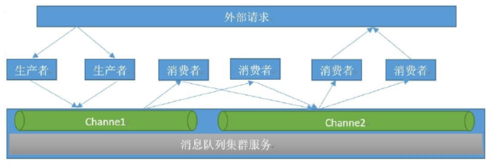

### 8.1.2 队列介绍

- 队列当中的消息由不同的生产者写入，也会有不同的消费者取出进行消费处理，但是一个消息一定是只能被取出一次也就是被消费一次。

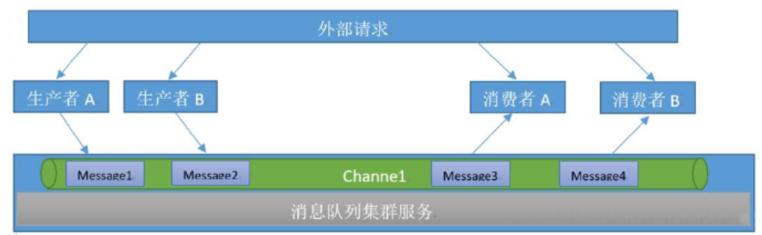

- 模拟生产者发布消息

```bash
[root@localhost ~]# redis-cli
127.0.0.1:6379> auth redis
OK
127.0.0.1:6379> lpush channel1 msg1
(integer) 1
127.0.0.1:6379> lpush channel1 msg2
(integer) 2
127.0.0.1:6379> lpush channel1 msg3
(integer) 3
127.0.0.1:6379> lpush channel1 msg4
(integer) 4
127.0.0.1:6379> lpush channel1 msg5
(integer) 5
127.0.0.1:6379> lrange channel1 0 -1
1) "msg5"
2) "msg4"
3) "msg3"
4) "msg2"
5) "msg1"
```

- 模拟消费者消费

```bash
127.0.0.1:6379> rpop channel1
"msg1"
127.0.0.1:6379> rpop channel1
"msg2"
127.0.0.1:6379> rpop channel1
"msg3"
127.0.0.1:6379> rpop channel1
"msg4"
127.0.0.1:6379> rpop channel1
"msg5"
127.0.0.1:6379> rpop channel1
(nil)
```

## 8.2 发布者订阅模式

### 8.2.1 模式简介

- 在发布者订阅者模式下，发布者将消息发布到指定的channel里面，凡是监听该channel的消费者都会收到同样的一份消息，这种模式类似于是收音机的广播模式，即凡是收听某个频道的听众都会收到主持人发布的相同的消息内容。此模式常用于群聊天、群通知、群公告等场景

  - Publisher：发布者

  - Subscriber：订阅者

  - Channel：频道


- 模拟订阅者监听频道

```bash
127.0.0.1:6379> subscribe channel1
Reading messages... (press Ctrl-C to quit)
1) "subscribe"
2) "channel1"
3) (integer) 1
```

- 模拟发布者发布信息

```bash
127.0.0.1:6379> publish channel1 test1
(integer) 1		#订阅者个数
127.0.0.1:6379> publish channel1 test2
(integer) 1
```

- 模拟订阅者收到消息，多个订阅者都可以收到消息

```bash
127.0.0.1:6379> subscribe channel1
Reading messages... (press Ctrl-C to quit)
1) "subscribe"
2) "channel1"
3) (integer) 1
1) "message"
2) "channel1"
3) "test1"
1) "message"
2) "channel1"
3) "test2"

127.0.0.1:6379> subscribe channel1
Reading messages... (press Ctrl-C to quit)
1) "subscribe"
2) "channel1"
3) (integer) 1
1) "message"
2) "channel1"
3) "test3"
```

- 模拟订阅多个频道

```bash
127.0.0.1:6379> subscribe channel1 channel2
Reading messages... (press Ctrl-C to quit)
1) "subscribe"
2) "channel1"
3) (integer) 1
1) "subscribe"
2) "channel2"
3) (integer) 2
1) "message"
2) "channel1"
3) "test4"

127.0.0.1:6379> subscribe channel1 channel2
Reading messages... (press Ctrl-C to quit)
1) "subscribe"
2) "channel1"
3) (integer) 1
1) "subscribe"
2) "channel2"
3) (integer) 2
1) "message"
2) "channel1"
3) "test4"
1) "message"
2) "channel2"
3) "test5"
```

- 订阅所有频道

```shell
127.0.0.1:6379> psubscribe *   #支持通配符*
```

- 订阅匹配的频道

```shell
127.0.0.1:6379> PSUBSCRIBE chann*   #匹配订阅多个频道
```

- 取消订阅

```shell
127.0.0.1:6379> unsubscribe channel1
1) "unsubscribe"
2) "channel1"
3) (integer) 0
```

# 9. redis哨兵(Sentinel)

## 9.1 redis集群介绍

- 主从架构无法实现master和slave角色的自动切换，即当master出现redis服务异常、主机断电、磁盘损坏等问题导致master无法使用，而redis主从复制无法实现自动的故障转移(将slave 自动提升为新master)，需要手动修改环境配置,才能切换到slave redis服务器，另外也无法横向扩展Redis服务的并行写入性能，当单台Redis服务器性能无法满足业务写入需求的时候,也需要解决以上的两个核心问题
  - master和slave角色的无缝切换，让业务无感知从而不影响业务使用
  - 可横向动态扩展Redis服务器，从而实现多台服务器并行写入以实现更高并发的目的。

- redis集群实现方法
  - 客户端分片: 由应用决定将不同的KEY发送到不同的Redis服务器
  - 代理分片: 由代理决定将不同的KEY发送到不同的Redis服务器,代理程序如:codis,twemproxy等
  - Redis Cluster

## 9.2 哨兵工作原理

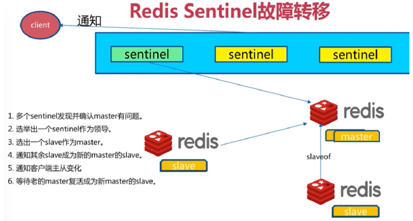

- Sentinel 进程是用于监控redis集群中Master主服务器工作的状态，在Master主服务器发生故障的时候，可以实现Master和Slave服务器的切换，保证系统的高可用，此功能在redis2.6+的版本已引用，Redis的哨兵模式到了2.8版本之后就稳定了下来。一般在生产环境也建议使用Redis的2.8版本的以后版本

- 哨兵(Sentinel) 是一个分布式系统，可以在一个架构中运行多个哨兵(sentinel) 进程，这些进程使用流言协议(gossip protocols)来接收关于Master主服务器是否下线的信息，并使用投票协议(Agreement Protocols)来决定是否执行自动故障迁移,以及选择哪个Slave作为新的Master

- 每个哨兵(Sentinel)进程会向其它哨兵(Sentinel)、Master、Slave定时发送消息，以确认对方是否”活”着，如果发现对方在指定配置时间(此项可配置)内未得到回应，则暂时认为对方已离线，也就是所谓的”主观认为宕机” (主观:是每个成员都具有的独自的而且可能相同也可能不同的意识)，英文名称：Subjective Down，简称SDOWN

- 有主观宕机，对应的有客观宕机。当“哨兵群”中的多数Sentinel进程在对Master主服务器做出SDOWN的判断，并且通过 SENTINEL is-master-down-by-addr 命令互相交流之后，得出的Master Server下线判断，这种方式就是“客观宕机”(客观:是不依赖于某种意识而已经实际存在的一切事物)，英文名称是：Objectively Down， 简称 ODOWN

- 通过一定的vote算法，从剩下的slave从服务器节点中，选一台提升为Master服务器节点，然后自动修改相关配置，并开启故障转移（failover）

- Sentinel 机制可以解决master和slave角色的自动切换问题，但单个 Master 的性能瓶颈问题无法解决,类似于MySQL中的MHA功能

- Redis Sentinel中的Sentinel节点个数应该为大于等于3且最好为奇数

- 客户端初始化时连接的是Sentinel节点集合，不再是具体的Redis节点，但Sentinel只是配置中心不是代理。

- Redis Sentinel 节点与普通redis 没有区别,要实现读写分离依赖于客户端程序

- redis 3.0 之前版本中,生产环境一般使用哨兵模式,但3.0后推出redis cluster功能后,可以支持更大规模的生产环境

### 9.2.2 sentinel中的三个定时任务

- 每10秒每个sentinel对master和slave执行info
  - 发现slave节点
  - 确认主从关系
- 每2秒每个sentinel通过master节点的channel交换信息(pub/sub)
  - 通过sentinel_hello频道交互
  - 交互对节点的“看法”和自身信息
- 每1秒每个sentinel对其他sentinel和redis执行ping

## 9.3 实现哨兵

- 哨兵的准备实现主从复制架构
  - 哨兵的前提是已经实现了一个redis的主从复制的运行环境，从而实现一个一主两从基于哨兵的高可用redis架构
  - 注意: master 的配置文件中masterauth 和slave 都必须相同

- 编辑哨兵的配置文件
  - Sentinel实际上是一个特殊的redis服务器,有些redis指令支持,但很多指令并不支持.默认监听在26379/tcp端口
  - 哨兵可以不和Redis服务器部署在一起，但一般部署在一起，所有redis节点使用相同的配置文件

```bash
# 如果是编译安装，在源码目录有sentinel.conf，复制到安装目录即可
[root@localhost ~]# cp redis-6.2.20/sentinel.conf /apps/redis/etc/sentinel.conf
[root@localhost ~]# cd /apps/redis
[root@localhost redis]# tree
.
├── bin
│   ├── redis-benchmark
│   ├── redis-check-aof -> redis-server
│   ├── redis-check-rdb -> redis-server
│   ├── redis-cli
│   ├── redis-sentinel -> redis-server
│   └── redis-server
├── data
│   ├── appendonly_6379.aof
│   ├── dump_6379.rdb
│   ├── dump_6380.rdb
│   └── dump_6381.rdb
├── etc
│   ├── redis_6379.conf
│   ├── redis_6380.conf
│   ├── redis_6381.conf
│   └── sentinel.conf	# 哨兵配置文件
├── log
│   ├── redis_6379.log
│   ├── redis_6380.log
│   └── redis_6381.log
└── run
    ├── redis_6379.pid
    ├── redis_6380.pid
    └── redis_6381.pid

5 directories, 20 files

[root@localhost redis]# vim etc/sentinel.conf 
pidfile /apps/redis/run/redis-sentinel-26379.pid
dir /apps/redis/data	#工作目录
logfile "/apps/redis/log/redis-sentinel-26379.log"
sentinel monitor mymaster 127.0.0.1 6379 2
#指定当前mymaster集群中master服务器的地址和端口
#2为法定人数限制(quorum)，即有几个sentinel认为master down了就进行故障转移，一般此值是所有sentinel节点(一般总数是>=3的 奇数,如:3,5,7等)的一半以上的整数值，比如，总数是3，即3/2=1.5，取整为2,是master的ODOWN客观下线的依据

#sentinel auth-pass &lt;master-name&gt; &lt;password&gt;
sentinel auth-pass mymaster redis
#mymaster集群中master的密码，注意此行要在上面行的下面

# sentinel down-after-milliseconds &lt;master-name&gt; &lt;milliseconds&gt;
sentinel down-after-milliseconds mymaster 30000
#(SDOWN)判断mymaster集群中所有节点的主观下线的时间，单位：毫秒，建议3000

sentinel parallel-syncs mymaster 1
#发生故障转移后，同时向新master同步数据的slave数量，数字越小总同步时间越长，但可以减轻新master的负载压力

# sentinel failover-timeout &lt;master-name&gt; &lt;milliseconds&gt;
sentinel failover-timeout mymaster 180000
#所有slaves指向新的master所需的超时时间，单位：毫秒

sentinel deny-scripts-reconfig yes
#禁止修改脚本


[root@localhost redis]# mv etc/sentinel.conf etc/sentinel_26379.conf
[root@localhost redis]# cd etc
[root@localhost etc]# cp sentinel_26379.conf sentinel_26380.conf
[root@localhost etc]# cp sentinel_26379.conf sentinel_26381.conf
[root@localhost etc]# vim sentinel_26380.conf
port 26380
pidfile /apps/redis/run/redis-sentinel-26380.pid
logfile "/apps/redis/log/redis-sentinel-26380.log"
[root@localhost etc]# vim sentinel_26381.conf
port 26381
pidfile /apps/redis/run/redis-sentinel-26381.pid
logfile "/apps/redis/log/redis-sentinel-26381.log"

[root@localhost etc]# chown -R redis.redis /apps/redis/
```

- 启动哨兵

```bash
[root@localhost etc]# vim /lib/systemd/system/redis-sentinel_26379.service
[Unit]
Description=Redis Sentinel
After=network.target
After=network-online.target
Wants=network-online.target
[Service]
ExecStart=/apps/redis/bin/redis-sentinel /apps/redis/etc/sentinel_26379.conf --supervised systemd
ExecStop=/usr/libexec/redis-shutdown redis-sentinel
Type=simple
User=redis
Group=redis
RuntimeDirectory=redis
RuntimeDirectoryMode=0755
[Install]
WantedBy=multi-user.target

[root@localhost etc]# cp /lib/systemd/system/redis-sentinel_26379.service /lib/systemd/system/redis-sentinel_26380.service 
[root@localhost etc]# cp /lib/systemd/system/redis-sentinel_26379.service /lib/systemd/system/redis-sentinel_26381.service 
[root@localhost etc]# vim /lib/systemd/system/redis-sentinel_26380.service
[Unit]
Description=Redis Sentinel
After=network.target
After=network-online.target
Wants=network-online.target
[Service]
ExecStart=/apps/redis/bin/redis-sentinel /apps/redis/etc/sentinel_26380.conf --supervised systemd
ExecStop=/usr/libexec/redis-shutdown redis-sentinel
Type=simple
User=redis
Group=redis
RuntimeDirectory=redis
RuntimeDirectoryMode=0755
[Install]
WantedBy=multi-user.target
[root@localhost etc]# vim /lib/systemd/system/redis-sentinel_26381.service
[Unit]
Description=Redis Sentinel
After=network.target
After=network-online.target
Wants=network-online.target
[Service]
ExecStart=/apps/redis/bin/redis-sentinel /apps/redis/etc/sentinel_26381.conf --supervised systemd
ExecStop=/usr/libexec/redis-shutdown redis-sentinel
Type=simple
User=redis
Group=redis
RuntimeDirectory=redis
RuntimeDirectoryMode=0755
[Install]
WantedBy=multi-user.target

[root@localhost etc]# systemctl daemon-reload
[root@localhost etc]# systemctl start redis-sentinel_26379
[root@localhost etc]# systemctl start redis-sentinel_26380
[root@localhost etc]# systemctl start redis-sentinel_26381
[root@localhost etc]# ss -ntl
State   Recv-Q  Send-Q    Local Address:Port           Peer Address:Port       Process        
LISTEN  0       511      192.168.73.128:6379                0.0.0.0:*                         
LISTEN  0       511             0.0.0.0:26380               0.0.0.0:*                         
LISTEN  0       511             0.0.0.0:26381               0.0.0.0:*                         
LISTEN  0       511             0.0.0.0:26379               0.0.0.0:*                         
LISTEN  0       511           127.0.0.1:6379                0.0.0.0:*                         
LISTEN  0       511           127.0.0.1:6381                0.0.0.0:*                         
LISTEN  0       511           127.0.0.1:6380                0.0.0.0:*                         
LISTEN  0       128             0.0.0.0:22                  0.0.0.0:*                         
LISTEN  0       511                [::]:26380                  [::]:*                         
LISTEN  0       511                [::]:26381                  [::]:*                         
LISTEN  0       511                [::]:26379                  [::]:*                         
LISTEN  0       128                [::]:22                     [::]:*                         
LISTEN  0       511               [::1]:6380                   [::]:*                         
LISTEN  0       511               [::1]:6381                   [::]:*          
```

- 查看哨兵日志

```bash
[root@localhost ~]# tail /apps/redis/log/redis-sentinel-26379.log
1715:X 11 Mar 2026 22:18:55.409 * monotonic clock: POSIX clock_gettime
1715:X 11 Mar 2026 22:18:55.410 * Running mode=sentinel, port=26379.
1715:X 11 Mar 2026 22:18:55.436 # Sentinel ID is 5abdf03f2eb8c2a55bb6d0d153e4b993514faf93
1715:X 11 Mar 2026 22:18:55.436 # +monitor master mymaster 127.0.0.1 6379 quorum 2
1715:X 11 Mar 2026 22:18:55.438 * +slave slave 127.0.0.1:6380 127.0.0.1 6380 @ mymaster 127.0.0.1 6379
1715:X 11 Mar 2026 22:18:55.440 * +slave slave 127.0.0.1:6381 127.0.0.1 6381 @ mymaster 127.0.0.1 6379
1715:X 11 Mar 2026 22:19:01.398 * +sentinel sentinel 751f2d390dfa55fb1fa4d48310bee07ef495ba55 127.0.0.1 26380 @ mymaster 127.0.0.1 6379
1715:X 11 Mar 2026 22:19:04.382 * +sentinel sentinel f2e5fd5f3ec07cfe1934dbc580a469c9a49dd6bb 127.0.0.1 26381 @ mymaster 127.0.0.1 6379
1715:X 11 Mar 2026 22:21:56.073 * +fix-slave-config slave 127.0.0.1:6380 127.0.0.1 6380 @ mymaster 127.0.0.1 6379	
1715:X 11 Mar 2026 22:21:56.073 * +fix-slave-config slave 127.0.0.1:6381 127.0.0.1 6381 @ mymaster 127.0.0.1 6379
```

- 查看当前sentinel状态
  - 在sentinel状态中尤其是最后一行，涉及到masterIP是多少，有几个slave，有几个sentinels，必须是符合全部服务器数量

```bash
[root@localhost ~]# redis-cli -p 26379
127.0.0.1:26379> info sentinel
# Sentinel
sentinel_masters:1
sentinel_tilt:0
sentinel_running_scripts:0
sentinel_scripts_queue_length:0
sentinel_simulate_failure_flags:0
master0:name=mymaster,status=ok,address=127.0.0.1:6379,slaves=2,sentinels=3

```

## 9.4 停止Redis Master测试故障转移

- 6379故障

```bash
127.0.0.1:6379> shutdown
not connected> 
[root@localhost ~]# ss -ntl
State   Recv-Q  Send-Q    Local Address:Port           Peer Address:Port       Process        
LISTEN  0       511             0.0.0.0:26380               0.0.0.0:*                         
LISTEN  0       511             0.0.0.0:26381               0.0.0.0:*                         
LISTEN  0       511             0.0.0.0:26379               0.0.0.0:*                         
LISTEN  0       511           127.0.0.1:6381                0.0.0.0:*                         
LISTEN  0       511           127.0.0.1:6380                0.0.0.0:*                         
LISTEN  0       128             0.0.0.0:22                  0.0.0.0:*                         
LISTEN  0       511                [::]:26380                  [::]:*                         
LISTEN  0       511                [::]:26381                  [::]:*                         
LISTEN  0       511                [::]:26379                  [::]:*                         
LISTEN  0       128                [::]:22                     [::]:*                         
LISTEN  0       511               [::1]:6380                   [::]:*                         
LISTEN  0       511               [::1]:6381                   [::]:*                 
```

- 此时看哨兵sentinel状态，`address`由6379变为了6380

```bash
127.0.0.1:26379> info sentinel
# Sentinel
sentinel_masters:1
sentinel_tilt:0
sentinel_running_scripts:0
sentinel_scripts_queue_length:0
sentinel_simulate_failure_flags:0
master0:name=mymaster,status=ok,address=127.0.0.1:6379,slaves=2,sentinels=3
127.0.0.1:26379> info sentinel
# Sentinel
sentinel_masters:1
sentinel_tilt:0
sentinel_running_scripts:0
sentinel_scripts_queue_length:0
sentinel_simulate_failure_flags:0
master0:name=mymaster,status=ok,address=127.0.0.1:6380,slaves=2,sentinels=3
```

- 此时6380变为了master

```bash
127.0.0.1:6380> info replication
# Replication
role:master		# 这里
connected_slaves:1
slave0:ip=127.0.0.1,port=6381,state=online,offset=956799,lag=0
master_failover_state:no-failover
master_replid:b43cbbe032b6effad263ac5485101708bb7f2410
master_replid2:dcbbe577606e11c51b8ee831ab79829a369c3930
master_repl_offset:956932
second_repl_offset:916051
repl_backlog_active:1
repl_backlog_size:1048576
repl_backlog_first_byte_offset:1
repl_backlog_histlen:956932
```

- 再重启6379

```bash
127.0.0.1:6379> info replication
# Replication
role:slave
master_host:127.0.0.1
master_port:6380
master_link_status:down
master_last_io_seconds_ago:-1
master_sync_in_progress:0
slave_read_repl_offset:1
slave_repl_offset:1
master_link_down_since_seconds:-1
slave_priority:100
slave_read_only:1
replica_announced:1
connected_slaves:0
master_failover_state:no-failover
master_replid:060e2bdf084b077c6d6d63edc196a97b75f61999
master_replid2:0000000000000000000000000000000000000000
master_repl_offset:0
second_repl_offset:-1
repl_backlog_active:0
repl_backlog_size:1048576
repl_backlog_first_byte_offset:0
repl_backlog_histlen:0
127.0.0.1:6379> config set masterauth redis	# 这一步之前没有写入配置文件
OK
127.0.0.1:6379> info replication
# Replication
role:slave
master_host:127.0.0.1
master_port:6380
master_link_status:up
master_last_io_seconds_ago:1
master_sync_in_progress:0
slave_read_repl_offset:1019101
slave_repl_offset:1019101
slave_priority:100
slave_read_only:1
replica_announced:1
connected_slaves:0
master_failover_state:no-failover
master_replid:b43cbbe032b6effad263ac5485101708bb7f2410
master_replid2:0000000000000000000000000000000000000000
master_repl_offset:1019101
second_repl_offset:-1
repl_backlog_active:1
repl_backlog_size:1048576
repl_backlog_first_byte_offset:1017070
repl_backlog_histlen:2032

# 有2个slave
127.0.0.1:6380> info replication
# Replication
role:master
connected_slaves:2
slave0:ip=127.0.0.1,port=6381,state=online,offset=1072014,lag=1
slave1:ip=127.0.0.1,port=6379,state=online,offset=1072014,lag=1
master_failover_state:no-failover
master_replid:b43cbbe032b6effad263ac5485101708bb7f2410
master_replid2:dcbbe577606e11c51b8ee831ab79829a369c3930
master_repl_offset:1072147
second_repl_offset:916051
repl_backlog_active:1
repl_backlog_size:1048576
repl_backlog_first_byte_offset:23572
repl_backlog_histlen:1048576

# 配置文件要配置这个密码才可以进行主从配置
[root@localhost ~]# cat /apps/redis/etc/redis_6380.conf | grep masterauth
# masterauth &lt;master-password&gt;
masterauth "redis"
[root@localhost ~]# cat /apps/redis/etc/redis_6381.conf | grep masterauth
# masterauth &lt;master-password&gt;
masterauth "redis"
[root@localhost ~]# cat /apps/redis/etc/redis_6379.conf | grep masterauth
masterauth redis
```

- 再关闭6380，看哨兵，此时master是6381

```bash
[root@localhost ~]# systemctl stop redis_6380

127.0.0.1:26379> info sentinel
# Sentinel
sentinel_masters:1
sentinel_tilt:0
sentinel_running_scripts:0
sentinel_scripts_queue_length:0
sentinel_simulate_failure_flags:0
master0:name=mymaster,status=ok,address=127.0.0.1:6381,slaves=2,sentinels=3

127.0.0.1:6381> info replication
# Replication
role:master
connected_slaves:1
slave0:ip=127.0.0.1,port=6379,state=online,offset=1155617,lag=0
master_failover_state:no-failover
master_replid:ac57fed1053f632a5af9068014773aa07ad4ad96
master_replid2:b43cbbe032b6effad263ac5485101708bb7f2410
master_repl_offset:1155750
second_repl_offset:1130675
repl_backlog_active:1
repl_backlog_size:1048576
repl_backlog_first_byte_offset:107175
repl_backlog_histlen:1048576
```

- 再启动6380，看master6381

```bash
127.0.0.1:6381> info replication
# Replication
role:master
connected_slaves:2	# 两个slave，6380上线了
slave0:ip=127.0.0.1,port=6379,state=online,offset=1184032,lag=1
slave1:ip=127.0.0.1,port=6380,state=online,offset=1184032,lag=1
master_failover_state:no-failover
master_replid:ac57fed1053f632a5af9068014773aa07ad4ad96
master_replid2:b43cbbe032b6effad263ac5485101708bb7f2410
master_repl_offset:1184032
second_repl_offset:1130675
repl_backlog_active:1
repl_backlog_size:1048576
repl_backlog_first_byte_offset:135457
repl_backlog_histlen:1048576
```

## 9.5 python连接Sentinel哨兵

### 9.5.1 python连接redis

- 客户端链接sentinel工作原理：选举出一个sentinel
- 由这个sentinel 通过masterName 获取master节点信息
- sentinel 发送 role 指令确认 mater 的信息
- 客户端订阅 sentinel 的相关频道,获取新的 master 信息变化，并自动连接新的 master

### 9.5.2 python连接Sentinel哨兵

```bash
[root@localhost ~]# vim sentinel_test.py
import redis
from redis.sentinel import Sentinel

sentinel = Sentinel([('127.0.0.1', 26379),
                     ('127.0.0.1', 26380),                     ('127.0.0.1', 26781)
                     ],socket_timeout=0.5)
redis_auth_pass = 'redis'

master = sentinel.discover_master('mymaster')
print(master)
[root@localhost ~]# python sentinel_test.py 
('127.0.0.1', 6381)

[root@localhost ~]# vim sentinel_test.py
import redis
from redis.sentinel import Sentinel

sentinel = Sentinel([('127.0.0.1', 26379),
		             ('127.0.0.1', 26380),
                     ('127.0.0.1', 26781)
                     ],socket_timeout=0.5)
redis_auth_pass = 'redis'

master = sentinel.discover_master('mymaster')
print(master)
slave = sentinel.discover_slaves('mymaster')
print(slave)
[root@localhost ~]# python sentinel_test.py 
('127.0.0.1', 6381)
[('127.0.0.1', 6379), ('127.0.0.1', 6380)]

[root@localhost ~]# vim sentinel_test.py
import redis
from redis.sentinel import Sentinel

sentinel = Sentinel([('127.0.0.1', 26379),
                     ('127.0.0.1', 26380),
                     ('127.0.0.1', 26781)
                     ],socket_timeout=0.5)
redis_auth_pass = 'redis'

master = sentinel.discover_master('mymaster')

slave = sentinel.discover_slaves('mymaster')

master = sentinel.master_for('mymaster', socket_timeout=0.5,
password=redis_auth_pass, db=0)

slave = sentinel.slave_for('mymaster', socket_timeout=0.5,
password=redis_auth_pass, db=0)

for i in range(10000):
    master.set(f"key-{i}", f"value-{i}")
    
for i in range(10):
    print(slave.get(f'key-{i*10}'))

[root@localhost ~]# python sentinel_test.py 
b'value-0'
b'value-10'
b'value-20'
b'value-30'
b'value-40'
b'value-50'
b'value-60'
b'value-70'
b'value-80'
b'value-90'

# 1000个值，utf8解码
[root@localhost ~]# vim sentinel_test.py
......
for i in range(1000):
    master.set(f"key-{i}", f"value-{i}")
for i in range(10):
    print(slave.get(f'key-{i*10}').decode('utf-8'))
[root@localhost ~]# python sentinel_test.py 
value-0
value-10
value-20
value-30
value-40
value-50
value-60
value-70
value-80
value-90
```

# 10. Redis 集群(Cluster)

## 10.1 Redis Cluster 工作原理

- 在哨兵sentinel机制中，可以解决redis高可用问题，即当master故障后可以自动将slave提升为master，从而可以保证redis服务的正常使用，但是无法解决redis单机写入的瓶颈问题，即单机redis写入性能受限于单机的内存大小、并发数量、网卡速率等因素。
- Redis Cluster特点如下
  - 所有Redis节点使用(PING机制)互联
  - 集群中某个节点的是否失效，是由整个集群中超过半数的节点监测都失效，才能算真正的失效
  - 客户端不需要proxy即可直接连接redis，应用程序中需要配置有全部的redis服务器IP
  - redis cluster把所有的redis node 平均映射到 0-16383个槽位(slot)上，读写需要到指定的redis node上进行操作，因此有多少个redis node相当于redis 并发扩展了多少倍，每个redis node 承担16384/N个槽位
  - Redis cluster预先分配16384个(slot)槽位，当需要在redis集群中写入一个key -value的时候，会使用CRC16(key) mod 16384之后的值，决定将key写入值哪一个槽位从而决定写入哪一个Redis节点上，从而有效解决单机瓶颈。

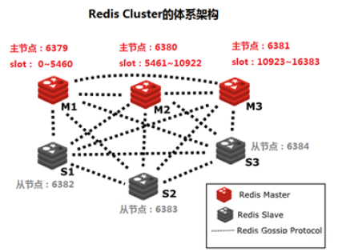

### 10.1.1 Redis cluster基本架构

- 假如三个主节点分别是：A，B，C三个节点，采用哈希槽(hash slot)的方式来分配16384个slot的活，它们三个节点分别承担的slot 区间可以是：

  - 节点A覆盖：0-5460

  - 节点B覆盖：5461-10922

  - 节点C覆盖：10923-16383

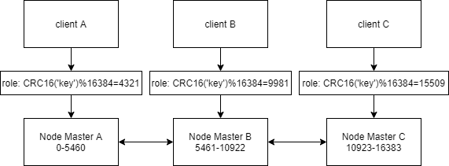

### 10.1.2 Redis cluster 主从架构

- Redis cluster的架构解决了并发的问题

- 对每个master 节点都实现主从复制,从而实现 redis 高可用性

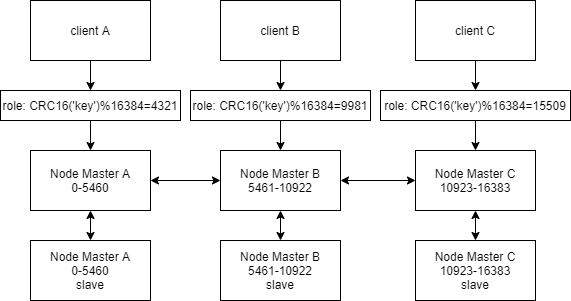

### 10.1.3 Redis Cluster 部署架构说明

- 环境A：3台服务器，每台服务器启动6379和6380两个redis 服务实例，适用于测试环境

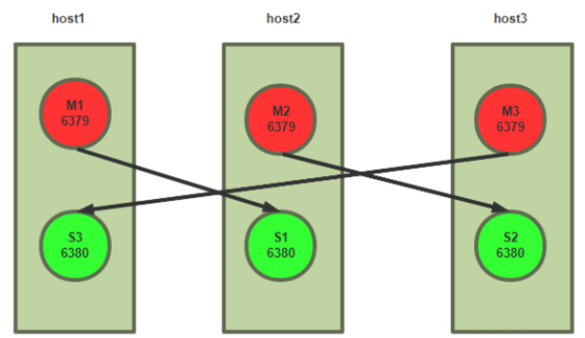

- 环境B：6台服务器，分别是三组master/slave，适用于生产环境

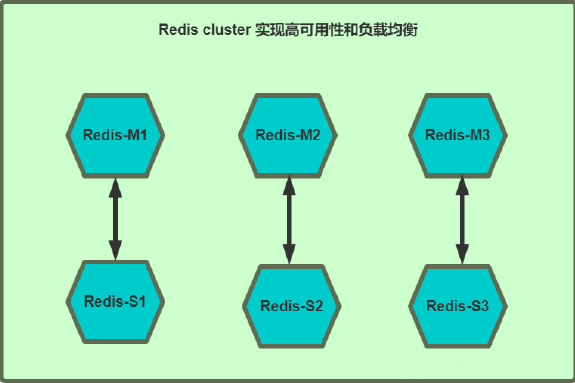

## 10.2 部署

- 部署方式
  - 原生命令安装
    - 理解Redis Cluster架构
    - 生产环境不使用
  - 官方工具安装
    - 高效、准确
    - 生产环境可以使用
  - 自主研发
    - 可以实现可视化的自动化部署
- 采用官方工具部署
- 先搭建环境，配置六个节点

```bash
# 像关闭上面的三个哨兵
[root@localhost ~]# systemctl stop redis-sentinel_26379
[root@localhost ~]# systemctl stop redis-sentinel_26380
[root@localhost ~]# systemctl stop redis-sentinel_26381

# 直接另创三个节点，修改一下对应配置文件
[root@localhost redis]# cd etc
[root@localhost etc]# cp redis_6379.conf redis_6382.conf
[root@localhost etc]# cp redis_6379.conf redis_6383.conf
[root@localhost etc]# cp redis_6379.conf redis_6384.conf
[root@localhost etc]# tree
.
├── redis_6379.conf
├── redis_6380.conf
├── redis_6381.conf
├── redis_6382.conf
├── redis_6383.conf
├── redis_6384.conf
├── sentinel_26379.conf
├── sentinel_26380.conf
└── sentinel_26381.conf

0 directories, 9 files
[root@localhost etc]# sed -i "s/6379/6382/g" redis_6382.conf 
[root@localhost etc]# grep "6382" redis_6382.conf 
# Accept connections on the specified port, default is 6382 (IANA #815344).
port 6382
# tls-port 6382
pidfile "/apps/redis/run/redis_6382.pid"
logfile "/apps/redis/log/redis_6382.log"
dbfilename "dump_6382.rdb"
appendfilename "appendonly_6382.aof"
# cluster-config-file nodes-6382.conf
# cluster-announce-tls-port 6382
[root@localhost etc]# sed -i "s/6379/6383/g" redis_6383.conf 
[root@localhost etc]# sed -i "s/6379/6384/g" redis_6384.conf 
[root@localhost etc]# grep "6383" redis_6383.conf 
# Accept connections on the specified port, default is 6383 (IANA #815344).
port 6383
# tls-port 6383
pidfile "/apps/redis/run/redis_6383.pid"
logfile "/apps/redis/log/redis_6383.log"
dbfilename "dump_6383.rdb"
appendfilename "appendonly_6383.aof"
# cluster-config-file nodes-6383.conf
# cluster-announce-tls-port 6383
[root@localhost etc]# grep "6384" redis_6384.conf 
# Accept connections on the specified port, default is 6384 (IANA #815344).
port 6384
# tls-port 6384
pidfile "/apps/redis/run/redis_6384.pid"
logfile "/apps/redis/log/redis_6384.log"
dbfilename "dump_6384.rdb"
appendfilename "appendonly_6384.aof"
# cluster-config-file nodes-6384.conf
# cluster-announce-tls-port 6384

# 复制另外三个节点启动文件
[root@localhost etc]# systemctl cat redis_6379
# /usr/lib/systemd/system/redis_6379.service
[Unit]
Description=Redis persistent key-value database
After=network.target
[Service]
ExecStart=/apps/redis/bin/redis-server /apps/r>
ExecStop=/bin/kill -s QUIT $MAINPID
Type=simple
User=redis
Group=redis
RuntimeDirectory=redis
RuntimeDirectoryMode=0755
[Install]
WantedBy=multi-user.target
[root@localhost etc]# cd /usr/lib/systemd/system
[root@localhost system]# cp redis_6379.service  redis_6382.service
[root@localhost system]# cp redis_6379.service  redis_6383.service
[root@localhost system]# cp redis_6379.service  redis_6384.service
[root@localhost system]# sed -i "s/6379/6382/g" redis_6382.service
[root@localhost system]# sed -i "s/6379/6383/g" redis_6383.service 
[root@localhost system]# sed -i "s/6379/6384/g" redis_6384.service 
[root@localhost system]# chown -R redis:redis /apps/redis/
```

- 启动六个节点

```bash
[root@localhost ~]# systemctl daemon-reload	# 读取配置文件

[root@localhost ~]# ss -ntl
State   Recv-Q  Send-Q     Local Address:Port          Peer Address:Port       Process        
LISTEN  0       511       192.168.73.128:6380               0.0.0.0:*                         
LISTEN  0       511       192.168.73.128:6381               0.0.0.0:*                         
LISTEN  0       128              0.0.0.0:22                 0.0.0.0:*                         
LISTEN  0       511            127.0.0.1:6381               0.0.0.0:*                         
LISTEN  0       511            127.0.0.1:6380               0.0.0.0:*                         
LISTEN  0       128                 [::]:22                    [::]:*                         
[root@localhost ~]# systemctl restart redis_6379
[root@localhost ~]# systemctl restart redis_6380
[root@localhost ~]# systemctl restart redis_638
1
[root@localhost ~]# systemctl start redis_6382
[root@localhost ~]# systemctl start redis_6383
[root@localhost ~]# systemctl start redis_6384
[root@localhost ~]# ss -ntl
State   Recv-Q  Send-Q     Local Address:Port          Peer Address:Port       Process        
LISTEN  0       511       192.168.73.128:6382               0.0.0.0:*                         
LISTEN  0       511       192.168.73.128:6383               0.0.0.0:*                         
LISTEN  0       511       192.168.73.128:6380               0.0.0.0:*                         
LISTEN  0       511       192.168.73.128:6381               0.0.0.0:*                         
LISTEN  0       511       192.168.73.128:6379               0.0.0.0:*                         
LISTEN  0       511       192.168.73.128:6384               0.0.0.0:*                         
LISTEN  0       511            127.0.0.1:6384               0.0.0.0:*                         
LISTEN  0       128              0.0.0.0:22                 0.0.0.0:*                         
LISTEN  0       511            127.0.0.1:6381               0.0.0.0:*                         
LISTEN  0       511            127.0.0.1:6380               0.0.0.0:*                         
LISTEN  0       511            127.0.0.1:6383               0.0.0.0:*                         
LISTEN  0       511            127.0.0.1:6382               0.0.0.0:*                         
LISTEN  0       511            127.0.0.1:6379               0.0.0.0:*                         
LISTEN  0       128                 [::]:22                    [::]:*       

# 配置有问题，集群模式要开启，日志文件每个节点也不同
[root@localhost redis]# vim etc/redis_6379.conf
cluster-enabled yes
cluster-config-file nodes-6379.conf
[root@localhost redis]# vim etc/redis_6380.conf 
cluster-enabled yes
cluster-config-file nodes-6380.conf
[root@localhost redis]# vim etc/redis_6381.conf 
cluster-enabled yes
cluster-config-file nodes-6381.conf
[root@localhost redis]# vim etc/redis_6382.conf 
cluster-enabled yes
cluster-config-file nodes-6382.conf
[root@localhost redis]# vim etc/redis_6383.conf 
cluster-enabled yes
cluster-config-file nodes-6383.conf
[root@localhost redis]# vim etc/redis_6384.conf 
cluster-enabled yes
cluster-config-file nodes-6384.conf

# 重启6个节点
[root@localhost redis]# systemctl restart redis_6379
[root@localhost redis]# systemctl restart redis_6380
[root@localhost redis]# systemctl restart redis_6381
[root@localhost redis]# systemctl restart redis_6382
[root@localhost redis]# systemctl restart redis_6383
[root@localhost redis]# systemctl restart redis_6384
[root@localhost redis]# ss -ntl
State   Recv-Q  Send-Q    Local Address:Port           Peer Address:Port       Process        
LISTEN  0       511           127.0.0.1:16381               0.0.0.0:*                         
LISTEN  0       511           127.0.0.1:16380               0.0.0.0:*                         
LISTEN  0       511           127.0.0.1:16383               0.0.0.0:*                         
LISTEN  0       511           127.0.0.1:16382               0.0.0.0:*                         
LISTEN  0       511           127.0.0.1:16379               0.0.0.0:*                         
LISTEN  0       511      192.168.73.128:16382               0.0.0.0:*                         
LISTEN  0       511      192.168.73.128:16383               0.0.0.0:*                         
LISTEN  0       511      192.168.73.128:16380               0.0.0.0:*                         
LISTEN  0       511      192.168.73.128:16381               0.0.0.0:*                         
LISTEN  0       511      192.168.73.128:16379               0.0.0.0:*                         
LISTEN  0       511      192.168.73.128:16384               0.0.0.0:*                         
LISTEN  0       511      192.168.73.128:6382                0.0.0.0:*                         
LISTEN  0       511      192.168.73.128:6383                0.0.0.0:*                         
LISTEN  0       511      192.168.73.128:6380                0.0.0.0:*                         
LISTEN  0       511      192.168.73.128:6381                0.0.0.0:*                         
LISTEN  0       511      192.168.73.128:6379                0.0.0.0:*                         
LISTEN  0       511      192.168.73.128:6384                0.0.0.0:*                         
LISTEN  0       511           127.0.0.1:6384                0.0.0.0:*                         
LISTEN  0       128             0.0.0.0:22                  0.0.0.0:*                         
LISTEN  0       511           127.0.0.1:6381                0.0.0.0:*                         
LISTEN  0       511           127.0.0.1:6380                0.0.0.0:*                         
LISTEN  0       511           127.0.0.1:6383                0.0.0.0:*                         
LISTEN  0       511           127.0.0.1:6382                0.0.0.0:*                         
LISTEN  0       511           127.0.0.1:6379                0.0.0.0:*                         
LISTEN  0       511           127.0.0.1:16384               0.0.0.0:*                         
LISTEN  0       128                [::]:22                     [::]:*        
```

- 先清空所有数据

```bash
[root@localhost redis]# redis-cli -a redis --no-auth-warning -p 6379 flushall
OK
[root@localhost redis]# redis-cli -a redis --no-auth-warning -p 6380 flushall
OK
[root@localhost redis]# redis-cli -a redis --no-auth-warning -p 6381 flushall
OK
[root@localhost redis]# redis-cli -a redis --no-auth-warning -p 6382 flushall
OK
[root@localhost redis]# redis-cli -a redis --no-auth-warning -p 6383 flushall
OK
[root@localhost redis]# redis-cli -a redis --no-auth-warning -p 6384 flushall
OK
```

- 创建集群

```bash
[root@localhost redis]# redis-cli -a redis --no-auth-warning --cluster create \
192.168.73.128:6379 192.168.73.128:6380 192.168.73.128:6381 \
192.168.73.128:6382 192.168.73.128:6383 192.168.73.128:6384 \
--cluster-replicas 1
>>> Performing hash slots allocation on 6 nodes...
Master[0] -> Slots 0 - 5460
Master[1] -> Slots 5461 - 10922
Master[2] -> Slots 10923 - 16383
Adding replica 192.168.73.128:6383 to 192.168.73.128:6379
Adding replica 192.168.73.128:6384 to 192.168.73.128:6380
Adding replica 192.168.73.128:6382 to 192.168.73.128:6381
>>> Trying to optimize slaves allocation for anti-affinity
[WARNING] Some slaves are in the same host as their master
M: e774b47e2f85e2c2cf7f006171d1c3cd1a6de95f 192.168.73.128:6379
   slots:[0-5460] (5461 slots) master
M: c8be290fbb39029a46687b2e01f7b44504aef06a 192.168.73.128:6380
   slots:[5461-10922] (5462 slots) master
M: 488331291d0f88f902aabfbe27411f2d3fe1f47e 192.168.73.128:6381
   slots:[10923-16383] (5461 slots) master
S: fd045a07cc9daa4d9655185373cb64977881e95b 192.168.73.128:6382
   replicates c8be290fbb39029a46687b2e01f7b44504aef06a
S: 659d6731ce93266c36a52c0394a02db3a6a6b3aa 192.168.73.128:6383
   replicates 488331291d0f88f902aabfbe27411f2d3fe1f47e
S: 1f3d7160765e1ce77249f39e9af51c4d9d6c9435 192.168.73.128:6384
   replicates e774b47e2f85e2c2cf7f006171d1c3cd1a6de95f
Can I set the above configuration? (type 'yes' to accept): yes
>>> Nodes configuration updated
>>> Assign a different config epoch to each node
>>> Sending CLUSTER MEET messages to join the cluster
Waiting for the cluster to join
### 这边可以看到主从状态
>>> Performing Cluster Check (using node 192.168.73.128:6379)
M: e774b47e2f85e2c2cf7f006171d1c3cd1a6de95f 192.168.73.128:6379
   slots:[0-5460] (5461 slots) master
   1 additional replica(s)
M: 488331291d0f88f902aabfbe27411f2d3fe1f47e 127.0.0.1:6381
   slots:[10923-16383] (5461 slots) master
   1 additional replica(s)
M: c8be290fbb39029a46687b2e01f7b44504aef06a 127.0.0.1:6380
   slots:[5461-10922] (5462 slots) master
   1 additional replica(s)
S: 659d6731ce93266c36a52c0394a02db3a6a6b3aa 127.0.0.1:6383
   slots: (0 slots) slave
   replicates 488331291d0f88f902aabfbe27411f2d3fe1f47e
S: 1f3d7160765e1ce77249f39e9af51c4d9d6c9435 127.0.0.1:6384
   slots: (0 slots) slave
   replicates e774b47e2f85e2c2cf7f006171d1c3cd1a6de95f
S: fd045a07cc9daa4d9655185373cb64977881e95b 127.0.0.1:6382
   slots: (0 slots) slave
   replicates c8be290fbb39029a46687b2e01f7b44504aef06a
[OK] All nodes agree about slots configuration.
>>> Check for open slots...
>>> Check slots coverage...
[OK] All 16384 slots covered.


# 如果集群配置出错了，下面命令可以用于清除
[root@localhost redis]# redis-cli -a redis --no-auth-warning -p 6384 cluster reset hard

```

- 向集群中写入key

```bash
# user01经过计算不能写入6379，应写入6380
[root@localhost redis]# redis-cli -a redis --no-auth-warning -p 6379 set name user01
(error) MOVED 5798 127.0.0.1:6380
[root@localhost redis]# redis-cli -a redis --no-auth-warning -p 6380 set name user01
OK
# 18经过计算不能写入6380，应写入6379
[root@localhost redis]# redis-cli -a redis --no-auth-warning -p 6380 set age 18
(error) MOVED 741 127.0.0.1:6379
[root@localhost redis]# redis-cli -a redis --no-auth-warning -p 6379 set age 18
OK
# 需要根据反馈的值写入到对应的节点

# 只能get到对应的值
[root@localhost redis]# redis-cli -a redis --no-auth-warning -p 6379 get age
"18"
[root@localhost redis]# redis-cli -a redis --no-auth-warning -p 6379 get name
(error) MOVED 5798 127.0.0.1:6380
```

- 模拟master故障
  - 对应的slave节点自动提升为新master

```bash
# 停掉6379
[root@localhost redis]# systemctl stop redis_6379
[root@localhost redis]# redis-cli -a redis --no-auth-warning --cluster info 192.168.73.128 6379
Could not connect to Redis at 192.168.73.128:6379: Connection refused

# 查看节点状态
[root@localhost redis]# redis-cli -a redis --no-auth-warning -p 6380 cluster nodes
1f3d7160765e1ce77249f39e9af51c4d9d6c9435 127.0.0.1:6384@16384 master - 0 1773308314139 7 connected 0-5460
e774b47e2f85e2c2cf7f006171d1c3cd1a6de95f 127.0.0.1:6379@16379 master,fail - 1773308177341 1773308172315 1 disconnected
c8be290fbb39029a46687b2e01f7b44504aef06a 127.0.0.1:6380@16380 myself,master - 0 1773308312000 2 connected 5461-10922
fd045a07cc9daa4d9655185373cb64977881e95b 127.0.0.1:6382@16382 slave c8be290fbb39029a46687b2e01f7b44504aef06a 0 1773308314000 2 connected
488331291d0f88f902aabfbe27411f2d3fe1f47e 127.0.0.1:6381@16381 master - 0 1773308313135 3 connected 10923-16383
659d6731ce93266c36a52c0394a02db3a6a6b3aa 127.0.0.1:6383@16383 slave 488331291d0f88f902aabfbe27411f2d3fe1f47e 0 1773308315144 3 connected
# 可以看到6379挂掉了，master变为6380，6381，6384

# 再重启6379，查看节点状态
[root@localhost redis]# systemctl start redis_6379
[root@localhost redis]# redis-cli -a redis --no-auth-warning -p 6380 cluster nodes
1f3d7160765e1ce77249f39e9af51c4d9d6c9435 127.0.0.1:6384@16384 master - 0 1773308501000 7 connected 0-5460
e774b47e2f85e2c2cf7f006171d1c3cd1a6de95f 127.0.0.1:6379@16379 slave 1f3d7160765e1ce77249f39e9af51c4d9d6c9435 0 1773308503235 7 connected
c8be290fbb39029a46687b2e01f7b44504aef06a 127.0.0.1:6380@16380 myself,master - 0 1773308503000 2 connected 5461-10922
fd045a07cc9daa4d9655185373cb64977881e95b 127.0.0.1:6382@16382 slave c8be290fbb39029a46687b2e01f7b44504aef06a 0 1773308502231 2 connected
488331291d0f88f902aabfbe27411f2d3fe1f47e 127.0.0.1:6381@16381 master - 0 1773308504239 3 connected 10923-16383
659d6731ce93266c36a52c0394a02db3a6a6b3aa 127.0.0.1:6383@16383 slave 488331291d0f88f902aabfbe27411f2d3fe1f47e 0 1773308501226 3 connected
# 可以看到6379,6382,6383为slave，6380,6381,6384为master

[root@localhost redis]# redis-cli -a redis --no-auth-warning -p 6380 --cluster info 192.168.73.128 6379
127.0.0.1:6381 (48833129...) -> 0 keys | 5461 slots | 1 slaves.
127.0.0.1:6384 (1f3d7160...) -> 1 keys | 5461 slots | 1 slaves.
127.0.0.1:6380 (c8be290f...) -> 1 keys | 5462 slots | 1 slaves.
[OK] 2 keys in 3 masters.
0.00 keys per slot on average.
[root@localhost redis]# redis-cli -a redis --no-auth-warning --cluster info 192.168.73.128 6379
127.0.0.1:6381 (48833129...) -> 0 keys | 5461 slots | 1 slaves.
127.0.0.1:6384 (1f3d7160...) -> 1 keys | 5461 slots | 1 slaves.
127.0.0.1:6380 (c8be290f...) -> 1 keys | 5462 slots | 1 slaves.
[OK] 2 keys in 3 masters.
0.00 keys per slot on average.
```

