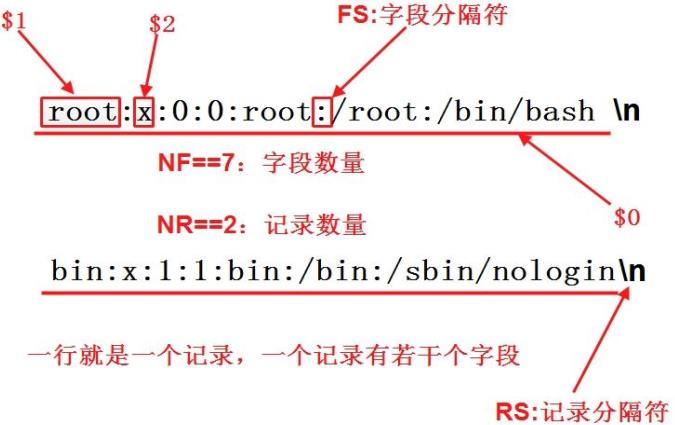

# 1. 通配符

- Linux 中的通配符是一种特殊的符号,用于匹配文件名或目录名。这些通配符可以帮助用户更快地输入命令和文件路径。或者可以理解为用户文件名和路径的匹配。由shell进行解析，一般情况下与某些命令配合使用，如：find，cp，mv，ls，rm等。

## 1.1 shell中常见的通配符

```bash
*: 匹配0或多个字符
?: 匹配任意一个字符
[....]: 匹配方括号中任意单个字符	# [1-9]
[!....]: 匹配除了方括号中指定字符之外的字符
范围 [a-z]: 匹配指定范围内的任意一个字符
大括号 {}: 用于匹配由逗号分隔的单个字符串
```

## 1.2 shell元字符

- 在 Shell 脚本中,除了通配符,还有一些特殊的元字符需要了解。这些元字符有特殊的含义,在编写 Shell 脚本时需要特别注意。以下是 Shell 中常见的一些元字符及其用法

```bash
IFS：<tab>/<space>/<enter>
=：设定变量
$：取变量值
>/< ：重定向
|：管道
&：后台执行命令
()：在子shell中执行命令/运算或命令替换
{}：用于扩展变量、生成序列等。
例如 echo {A..Z} 会输出 A 到 Z 的大写字母序列。
;：命令结束后，忽略其返回值，继续执行下一个命令
&&：命令结束后，若为true，继续执行下一个命令
||：命令结束后，若为false，继续执行下一个命令
!：非
#：注释
\：转义符
```

```bash
# 这里${IFS}相当于是空格，也可代替tab键以及回车键
[root@localhost ~]# echo hahaha > ha.txt	# >重定向
[root@localhost ~]# cat${IFS}ha.txt
hahaha

[root@localhost ~]# bbben=ollie	# 设定变量
[root@localhost ~]# echo ${bbben}	# $用来取变量的值
ollie

# | 前面语句执行后管道传递给后面的的语句
[root@localhost ~]# cat /etc/passwd | grep 'root'
root:x:0:0:root:/root:/bin/bash
operator:x:11:0:operator:/root:/sbin/nologin

# & 后台执行
[root@localhost ~]# ping 8.8.8.8 > ping.log &
[1] 1312
[root@localhost ~]# tail ping.log
PING 8.8.8.8 (8.8.8.8) 56(84) bytes of data.
64 bytes from 8.8.8.8: icmp_seq=1 ttl=128 time=44.4 ms
64 bytes from 8.8.8.8: icmp_seq=2 ttl=128 time=44.4 ms
64 bytes from 8.8.8.8: icmp_seq=3 ttl=128 time=43.7 ms
64 bytes from 8.8.8.8: icmp_seq=4 ttl=128 time=47.8 ms
64 bytes from 8.8.8.8: icmp_seq=5 ttl=128 time=46.2 ms
64 bytes from 8.8.8.8: icmp_seq=6 ttl=128 time=48.5 ms
64 bytes from 8.8.8.8: icmp_seq=7 ttl=128 time=44.6 ms
64 bytes from 8.8.8.8: icmp_seq=8 ttl=128 time=50.6 ms
[root@localhost ~]# pkill ping		# 杀死这个进程
[1]+  Terminated              ping 8.8.8.8 > ping.log

# ()在子shell中执行命令/运算或命令替换
# ``可以替代()
[root@localhost ~]# echo $(ls)
anaconda-ks.cfg dump.rdb ha.txt ping.log redis-6.2.20 redis-6.2.20.tar.gz redis_test.py sentinel_test.py
[root@localhost ~]# echo `ls`
anaconda-ks.cfg dump.rdb ha.txt ping.log redis-6.2.20 redis-6.2.20.tar.gz redis_test.py sentinel_test.py

# {}用于扩展变量、生成序列等
[root@localhost ~]# echo {1..10}
1 2 3 4 5 6 7 8 9 10
[root@localhost ~]# echo {a..z}
a b c d e f g h i j k l m n o p q r s t u v w x y z
[root@localhost ~]# echo file.{old,new}
file.old file.new

# ;：命令结束后，忽略其返回值，继续执行下一个命令
[root@localhost ~]# echo hello;cat ha.txt 
hello
hahaha
[root@localhost ~]# echo hello:cat ha.txt 
hello:cat ha.txt

# &&：命令结束后，若为true，继续执行下一个命令
[root@localhost ~]# cat ha.txt && ping -c 1 qq.com
hahaha
PING qq.com (111.33.167.71) 56(84) bytes of data.
64 bytes from 111.33.167.71 (111.33.167.71): icmp_seq=1 ttl=128 time=38.1 ms

--- qq.com ping statistics ---
1 packets transmitted, 1 received, 0% packet loss, time 0ms
rtt min/avg/max/mdev = 38.119/38.119/38.119/0.000 ms
# ||：命令结束后，若为false，继续执行下一个命令
[root@localhost ~]# cat ha.1txt || ping -c 1 qq.com
cat: ha.1txt: No such file or directory
PING qq.com (112.60.14.252) 56(84) bytes of data.
64 bytes from 112.60.14.252 (112.60.14.252): icmp_seq=1 ttl=128 time=41.1 ms

--- qq.com ping statistics ---
1 packets transmitted, 1 received, 0% packet loss, time 0ms
rtt min/avg/max/mdev = 41.100/41.100/41.100/0.000 ms

# 带上#号注释一切命令都无效
[root@localhost ~]# #poweroff

# \做转义符
[root@localhost ~]# mkdir double\ kickflip
[root@localhost ~]# ls
 anaconda-ks.cfg    redis-6.2.20
'double kickflip'   redis-6.2.20.tar.gz
 dump.rdb           redis_test.py
 ha.txt             sentinel_test.py
 ping.log
[root@localhost ~]# rm -rf double\ kickflip/
# 删除也需要加上\转义符
# \换行
[root@localhost ~]# ping \
> -c 1\
>  qq.com
PING qq.com (113.108.81.189) 56(84) bytes of data.

--- qq.com ping statistics ---
1 packets transmitted, 0 received, 100% packet loss, time 0ms
```

- shell中的转义符：

```bash
1. 反斜杠 \: 是最常用的转义符,用于转义其后的一个字符
例如 echo "This is a backslash: \\" 会输出 This is a backslash: \
2. 单引号'...': 可以将整个字符串括起来,使其中的特殊字符失去特殊含义，硬转义
3. 双引号"...": 内部的大部分特殊字符仍然保留特殊含义,软转义

示例：
echo 'Hello, $USER'    	输出--->  Hello, $USER
echo "Hello, $USER"		输出--->  Hello, root
```

```bash
# 双引号会对里面的变量名进行自动处理，单引号则不会
[root@localhost ~]# echo "${bbben}hahaha"
olliehahaha
[root@localhost ~]# echo '${bbben}hahaha'
${bbben}hahaha
```

# 2. find文件查找

- 实时查找工具，通过遍历指定路径下的文件系统完成文件查找

- 工作特点:

  - 查找速度略慢

  - 精确查找

  - 实时查找

  - 可以满足多种条件匹配

```shell
find [选项] [路径] [查找条件 + 处理动作]

查找路径：指定具体目录路径，默认是当前文件夹
查找条件：指定的查找标准（文件名/大小/类型/权限等），默认是找出所有文件
处理动作：对符合条件的文件做什么操作，默认输出屏幕
```

## 2.1 查找条件

```bash
根据文件名查找：
    ‐name "filename" 支持global
    ‐iname "filename" 忽略大小写
    ‐regex "PATTERN" 以Pattern匹配整个文件路径字符串，而不仅仅是文件名称
根据属主和属组查找：
    ‐user USERNAME：查找属主为指定用户的文件
    ‐group GROUPNAME：查找属组为指定属组的文件
    ‐uid UserID：查找属主为指定的ID号的文件
    ‐gid GroupID：查找属组为指定的GID号的文件
    ‐nouser：查找没有属主的文件
    ‐nogroup：查找没有属组的文件
根据文件类型查找：
    ‐type Type：
    f/d/l/s/b/c/p
根据文件大小来查找：
	‐size [+|‐]N[bcwkMG]
根据时间戳:
    天：
        ‐atime [+|‐]N
        ‐mtime
        ‐ctime
    分钟：
        ‐amin N
        ‐cmin N
        ‐mmin N
根据权限查找：
    ‐perm [+|‐]MODE
    MODE：精确权限匹配
    /MODE：任何一类(u，g，o)对象的权限中只要能一位匹配即可
    ‐MODE：每一类对象都必须同时拥有为其指定的权限标准
组合条件：
    与：‐a 多个条件and并列
    或：‐o 多个条件or并列
    非：‐not 条件取反
```

## 2.2 示例

- 根据文件名查找

```bash
[root@localhost ~]# find /etc -name "ens160*"
/etc/NetworkManager/system-connections/ens160.nmconnection
[root@localhost ~]# find /etc -iname "ENS160*"	# -i可以忽略大小写
/etc/NetworkManager/system-connections/ens160.nmconnection
```

- 按文件大小

```bash
[root@localhost ~]# find /etc -size +5M
/etc/udev/hwdb.bin
[root@localhost ~]# find /etc -size 5M
[root@localhost ~]# find /etc -size -5M
......
[root@localhost ~]# find /etc -size +5M -ls	# 找到的处理动作-ls，这里的ls与原本的ls并不是同一个命令
 33858238  11456 -r--r--r--   1 root     root     11730661 Jan 17 18:39 /etc/udev/hwdb.bin
```

- 指定查找的目录深度

```bash
[root@localhost ~]# find / -maxdepth 3 -a -name "ens160"	# 最大查找深度
# -a是同时满足，-o是或
[root@localhost ~]# find / -mindepth 3 -a -name "ens160"	# 最小查找深度
```

- 按时间找

```bash
[root@localhost ~]# find /etc -mtime +5        # 修改时间超过5天
[root@localhost ~]# find /etc -mtime 5        # 修改时间等于5天
[root@localhost ~]# find /etc -mtime -5        # 修改时间5天以内
/etc
/etc/resolv.conf
/etc/profile.d
/etc/profile.d/redis.sh
/etc/systemd/system
/etc/systemd/system/multi-user.target.wants
/etc/systemd/system/multi-user.target.wants/redis_6380.service
/etc/systemd/system/multi-user.target.wants/redis_6381.service
/etc/group
/etc/gshadow
/etc/passwd
/etc/shadow
/etc/ld.so.cache
/etc/selinux
/etc/selinux/config
/etc/sysctl.conf
/etc/pkgconfig
```

- 按照文件属主、属组找，文件的属主和属组

```bash
[root@localhost ~]# find / -user redis
[root@localhost ~]# find /home -group xwz
[root@localhost ~]# find /home -user xwz -group xwz
[root@localhost ~]# find /home -user xwz -a -group root
[root@localhost ~]# find /home -user xwz -o -group root
[root@localhost ~]# find /home -nouser        # 没有属主的文件
[root@localhost ~]# find /home -nogroup        # 没有属组的文件
```

- 按文件类型

```bash
[root@localhost ~]# find /dev -type d
/dev
/dev/dri
/dev/dri/by-path
/dev/snd
/dev/snd/by-path
/dev/vfio
/dev/net
/dev/mqueue
/dev/hugepages
/dev/rl
/dev/block
/dev/disk
/dev/disk/by-uuid
/dev/disk/by-partuuid
/dev/disk/by-path
/dev/disk/by-id
/dev/disk/by-diskseq
/dev/bsg
/dev/char
/dev/mapper
/dev/pts
/dev/shm
/dev/input
/dev/input/by-id
/dev/input/by-path
/dev/bus
/dev/bus/usb
/dev/bus/usb/002
/dev/bus/usb/001
/dev/dma_heap
/dev/cpu
/dev/cpu/3
/dev/cpu/2
/dev/cpu/1
/dev/cpu/0
```

- 按文件权限

```bash
[root@localhost ~]# find / -perm 644 -ls
[root@localhost ~]# find / -perm -644 -ls    # 权限小于644的
[root@localhost ~]# find / -perm 4000 -ls
[root@localhost ~]# find / -perm -4000 -ls
```

- 按正则表达式

```bash
[root@localhost ~]# find /etc -regex '.*ens[0-9][0-9][0-9].*'
/etc/NetworkManager/system-connections/ens160.nmconnection
# .*    任意多个字符
# [0-9]    任意一个数字
```

## 2.2 处理动作

```bash
‐print：默认的处理动作，显示至屏幕
‐ls：类型于对查找到的文件执行“ls ‐l”命令
‐delete：删除查找到的文件
‐fls /path/to/somefile：查找到的所有文件的长格式信息保存至指定文件中
‐ok COMMAND {}\：对查找到的每个文件执行由COMMAND指定的命令
 并且对于每个文件执行命令之前，都会交换式要求用户确认
‐exec COMMAND {} \：对查找到的每个文件执行由COMMAND指定的命令
{}：用于引用查找到的文件名称自身
[root@server1 ~]# find /etc -regex '.*host.*' -exec cp -r {} dir1/ \;
```

```bash
[root@localhost ~]# find /etc -regex '.*ens[0-9][0-9][0-9].*' -print
/etc/NetworkManager/system-connections/ens160.nmconnection
[root@localhost ~]# find /etc -regex '.*ens[0-9][0-9][0-9].*' -ls
 33858236      4 -rw-------   1 root     root          229 Jan 17 17:41 /etc/NetworkManager/system-connections/ens160.nmconnection
[root@localhost ~]# find / -regex '.*file[0-8][0-8]' -delete
[root@localhost ~]# find /root -regex '.*file[0-9]' -exec cp -r {} dir1 \;
cp: '/root/dir1/file1' and 'dir1/file1' are the same file
cp: '/root/dir1/file2' and 'dir1/file2' are the same file
cp: '/root/dir1/file3' and 'dir1/file3' are the same file
cp: '/root/dir1/file4' and 'dir1/file4' are the same file
cp: '/root/dir1/file5' and 'dir1/file5' are the same file
cp: '/root/dir1/file6' and 'dir1/file6' are the same file
cp: '/root/dir1/file7' and 'dir1/file7' are the same file
cp: '/root/dir1/file8' and 'dir1/file8' are the same file
cp: '/root/dir1/file9' and 'dir1/file9' are the same file
[root@localhost ~]# ls dir1/
file1  file3  file5  file7  file9
file2  file4  file6  file8
[root@localhost ~]# find /root -regex '.*file[0-9]' -exec echo hello > {} \;
[root@localhost ~]# cat {}
hello
hello
hello
hello
hello
hello
hello
hello
hello
hello
hello
hello
hello
hello
hello
hello
hello
hello
```

# 3. 正则表达式

正则表达式是一种强大的文本匹配和处理工具。它允许你定义复杂的匹配模式,在文本中查找、替换和操作数据。正则表达式被广泛应用于各种文本处理工具和命令中,如 sed、awk、grep 等.....

1. 字符匹配

- `.`：匹配任意单个字符
- `[]`：匹配指定范围内任意单个字符 `[a-z]` `[0-9]`
- `[^]`：匹配指定范围外任意单个字符 `[^a-z]` `[^0-9]`
- `[:alnum:]`：字母与数字字符
- `[:alpha:]`：字母
- `[:ascii:]`：ASCII 字符
- `[:blank:]`：空格或制表符
- `[:cntrl:]`：ASCII 控制字符
- `[:digit:]`：数字
- `[:graph:]`：非控制、非空格字符
- `[:lower:]`：小写字母
- `[:print:]`：可打印字符
- `[:punct:]`：标点符号字符
- `[:space:]`：空白字符，包括垂直制表符
- `[:upper:]`：大写字母
- `[:xdigit:]`：十六进制数字

1. 匹配次数

- `*`：匹配前面的字符任意次数
- `.*`：匹配任意长度的字符
- `\?`：匹配其前面字符 0 或 1 次，即前面的可有可无 `'a\?b'`
- `\+`：匹配其前面的字符至少 1 次 `'a\+b'`
- `\{m\}`：匹配前面的字符 m 次
- `\{m,n\}`：匹配前面的字符至少 m 次，至多 n 次
- `\{0,n\}`：匹配前面的字符至多 n 次
- `\{m,\}`：匹配前面的字符至少 m 次

1. 位置锚定

- `^`：行首锚定，用于模式的最左侧
- `$`：行末锚定，用于模式的最右侧
- `^PATTERN$`：用于模式匹配整行
- `^$`：空行
- `\<` 或 `\b`：词首锚定，用于单词模式的左侧
- `\>` 或 `\b`：词尾锚定，用于单词模式的右侧
- `\<PATTERN\>`：匹配整个单词 `'\<hello\>'`

1. 分组

- `()`: 用于分组,可以对一组字符应用量词等操作
- 分组括号中的模式匹配到的内容会被正则表达式引擎记录于内部的变量中
- `\1`、`\2` 等: 用于引用前面匹配的分组内容
- `\1`:从左侧起，第一个左括号以及与之匹配右括号之间的模式所匹配到的字符；

```bash
grep -Ev "^#|^$"	文件名	# 其中^#以#开头，^$直接开头到结尾，即是空格，-v除去这些内容，-E正则
```

# 4. 文本三剑客之grep

- grep作用：过滤文本内容

| 选项                     | 描述                             |
| ------------------------ | -------------------------------- |
| -E :--extended--regexp   | 模式是扩展正则表达式（ERE）      |
| -i :--ignore--case       | 忽略大小写                       |
| -n: --line--number       | 打印行号                         |
| -o:--only--matching      | 只打印匹配的内容                 |
| -c:--count               | 只打印每个文件匹配的行数         |
| -B:--before--context=NUM | 打印匹配的前几行                 |
| -A:--after--context=NUM  | 打印匹配的后几行                 |
| -C:--context=NUM         | 打印匹配的前后几行               |
| --color[=WHEN]           | 匹配的字体颜色，别名已定义了     |
| -v:--invert--match       | 打印不匹配的行                   |
| -e                       | 多点操作eg：grep -e "^s" -e "s$" |

```bash
[root@localhost ~]# cat /etc/passwd | grep root
root:x:0:0:root:/root:/bin/bash
operator:x:11:0:operator:/root:/sbin/nologin

[root@localhost ~]# cat /etc/passwd | grep -E "^root" -n -i
1:root:x:0:0:root:/root:/bin/bash

# -A打印匹配的后几行
[root@localhost ~]# cat /etc/passwd | grep -E "^root" -n -i -A 10
1:root:x:0:0:root:/root:/bin/bash
2-bin:x:1:1:bin:/bin:/sbin/nologin
3-daemon:x:2:2:daemon:/sbin:/sbin/nologin
4-adm:x:3:4:adm:/var/adm:/sbin/nologin
5-lp:x:4:7:lp:/var/spool/lpd:/sbin/nologin
6-sync:x:5:0:sync:/sbin:/bin/sync
7-shutdown:x:6:0:shutdown:/sbin:/sbin/shutdown
8-halt:x:7:0:halt:/sbin:/sbin/halt
9-mail:x:8:12:mail:/var/spool/mail:/sbin/nologin
10-operator:x:11:0:operator:/root:/sbin/nologin
11-games:x:12:100:games:/usr/games:/sbin/nologin

# -B打印匹配的前几行
[root@localhost ~]# cat /etc/passwd | grep -E "^lp" -n -i -B 3
2-bin:x:1:1:bin:/bin:/sbin/nologin
3-daemon:x:2:2:daemon:/sbin:/sbin/nologin
4-adm:x:3:4:adm:/var/adm:/sbin/nologin
5:lp:x:4:7:lp:/var/spool/lpd:/sbin/nologin

# -C打印匹配的前后几行
[root@localhost ~]# cat /etc/passwd | grep -E "^lp" -n -i -C 3
2-bin:x:1:1:bin:/bin:/sbin/nologin
3-daemon:x:2:2:daemon:/sbin:/sbin/nologin
4-adm:x:3:4:adm:/var/adm:/sbin/nologin
5:lp:x:4:7:lp:/var/spool/lpd:/sbin/nologin
6-sync:x:5:0:sync:/sbin:/bin/sync
7-shutdown:x:6:0:shutdown:/sbin:/sbin/shutdown
8-halt:x:7:0:halt:/sbin:/sbin/halt

# 匹配的字体颜色，别名已定义了
[root@localhost ~]# which grep
alias grep='grep --color=auto'
	/usr/bin/grep

# -v打印不匹配的行
[root@localhost ~]# cat /etc/passwd | grep -E "^lp" -n -i -v
1:root:x:0:0:root:/root:/bin/bash
2:bin:x:1:1:bin:/bin:/sbin/nologin
3:daemon:x:2:2:daemon:/sbin:/sbin/nologin
4:adm:x:3:4:adm:/var/adm:/sbin/nologin
6:sync:x:5:0:sync:/sbin:/bin/sync
7:shutdown:x:6:0:shutdown:/sbin:/sbin/shutdown
8:halt:x:7:0:halt:/sbin:/sbin/halt
9:mail:x:8:12:mail:/var/spool/mail:/sbin/nologin
10:operator:x:11:0:operator:/root:/sbin/nologin
11:games:x:12:100:games:/usr/games:/sbin/nologin
12:ftp:x:14:50:FTP User:/var/ftp:/sbin/nologin
13:nobody:x:65534:65534:Kernel Overflow User:/:/sbin/nologin
14:systemd-coredump:x:999:997:systemd Core Dumper:/:/sbin/nologin
15:dbus:x:81:81:System message bus:/:/sbin/nologin
16:tss:x:59:59:Account used for TPM access:/:/usr/sbin/nologin
17:sssd:x:998:996:User for sssd:/:/sbin/nologin
18:sshd:x:74:74:Privilege-separated SSH:/usr/share/empty.sshd:/usr/sbin/nologin
19:chrony:x:997:995:chrony system user:/var/lib/chrony:/sbin/nologin
20:redis:x:996:993::/home/redis:/sbin/nologin
```

## 4.1 示例

- 文本内容

```bash
[root@localhost ~]# python -c "import this" > file
[root@localhost ~]# cat file
The Zen of Python, by Tim Peters

Beautiful is better than ugly.
Explicit is better than implicit.
Simple is better than complex.
Complex is better than complicated.
Flat is better than nested.
Sparse is better than dense.
Readability counts.
Special cases aren't special enough to break the rules.
Although practicality beats purity.
Errors should never pass silently.
Unless explicitly silenced.
In the face of ambiguity, refuse the temptation to guess.
There should be one-- and preferably only one --obvious way to do it.
Although that way may not be obvious at first unless you're Dutch.
Now is better than never.
Although never is often better than *right* now.
If the implementation is hard to explain, it's a bad idea.
If the implementation is easy to explain, it may be a good idea.
Namespaces are one honking great idea -- let's do more of those!
```

- 过滤出所有包含a的行

```bash
# 无论大小写
[root@localhost ~]# grep -i "a" file
Beautiful is better than ugly.
Explicit is better than implicit.
Simple is better than complex.
Complex is better than complicated.
Flat is better than nested.
Sparse is better than dense.
Readability counts.
Special cases aren't special enough to break the rules.
Although practicality beats purity.
Errors should never pass silently.
In the face of ambiguity, refuse the temptation to guess.
There should be one-- and preferably only one --obvious way to do it.
Although that way may not be obvious at first unless you're Dutch.
Now is better than never.
Although never is often better than *right* now.
If the implementation is hard to explain, it'sa bad idea.
If the implementation is easy to explain, it my be a good idea.
Namespaces are one honking great idea -- let's do more of those!
# 精准匹配
[root@localhost ~]# grep "a" file
Beautiful is better than ugly.
Explicit is better than implicit.
Simple is better than complex.
Complex is better than complicated.
Flat is better than nested.
Sparse is better than dense.
Readability counts.
Special cases aren't special enough to break the rules.
Although practicality beats purity.
Errors should never pass silently.
In the face of ambiguity, refuse the temptation to guess.
There should be one-- and preferably only one --obvious way to do it.
Although that way may not be obvious at first unless you're Dutch.
Now is better than never.
Although never is often better than *right* now.
If the implementation is hard to explain, it'sa bad idea.
If the implementation is easy to explain, it my be a good idea.
Namespaces are one honking great idea -- let's do more of those!
```

- 过滤出所有包含a的行，无论大小写，并且显示该行所在的行号

```bash
[root@localhost ~]# grep -in "a" file
3:Beautiful is better than ugly.
4:Explicit is better than implicit.
5:Simple is better than complex.
6:Complex is better than complicated.
7:Flat is better than nested.
8:Sparse is better than dense.
9:Readability counts.
10:Special cases aren't special enough to break the rules.
11:Although practicality beats purity.
12:Errors should never pass silently.
14:In the face of ambiguity, refuse the temptation to guess.
15:There should be one-- and preferably only one --obvious way to do it.
16:Although that way may not be obvious at first unless you're Dutch.
17:Now is better than never.
18:Although never is often better than *right* now.
19:If the implementation is hard to explain, it's a bad idea.
20:If the implementation is easy to explain, it may be a good idea.
21:Namespaces are one honking great idea -- let's do more of those!
```

- 仅仅打印出所有匹配的字符或者字符串

```bash
[root@localhost ~]# grep -o "A" file
A
A
A
```

- 统计匹配到的字符或字符串总共的行数

```bash
[root@localhost ~]# grep -c "a" file
18
```

- 打印所匹配到的字符串的前几行

```bash
[root@localhost ~]# grep -B 2 "Simple" file
Beautiful is better than ugly.
Explicit is better than implicit.
Simple is better than complex.
```

- 打印所匹配到的字符串的后几行

```bash
[root@localhost ~]# grep -A 3 "Simple" file
Simple is better than complex.
Complex is better than complicated.
Flat is better than nested.
Sparse is better than dense.
```

- 打印所匹配到的字符串的前后几行

```bash
[root@localhost ~]# grep -C 2 "Simple" file
Beautiful is better than ugly.
Explicit is better than implicit.
Simple is better than complex.
Complex is better than complicated.
Flat is better than nested.
```

- 取反，过滤出不包含Simple的行

```bash
[root@localhost ~]# grep -vn "Simple" file
1:The Zen of Python, by Tim Peters
2:
3:Beautiful is better than ugly.
4:Explicit is better than implicit.
6:Complex is better than complicated.
7:Flat is better than nested.
8:Sparse is better than dense.
9:Readability counts.
10:Special cases aren't special enough to break the rules.
11:Although practicality beats purity.
12:Errors should never pass silently.
13:Unless explicitly silenced.
14:In the face of ambiguity, refuse the temptation to guess.
15:There should be one-- and preferably only one --obvious way to do it.
16:Although that way may not be obvious at first unless you're Dutch.
17:Now is better than never.
18:Although never is often better than *right* now.
19:If the implementation is hard to explain, it's a bad idea.
20:If the implementation is easy to explain, it may be a good idea.
21:Namespaces are one honking great idea -- let's do more of those!
```

## 4.2 基于grep的正则表达式

- **最常用：**查看配置文件时去除所有的注释和空行

```bash
[root@localhost ~]# grep -Ev "^#|^$" /etc/ssh/sshd_config
Include /etc/ssh/sshd_config.d/*.conf
AuthorizedKeysFile	.ssh/authorized_keys
Subsystem	sftp	/usr/libexec/openssh/sftp-server

grep -Ev "^$|^\s*#"	/etc/ssh/sshd_config	# 更准确
```

- **获取IP地址：**

```bash
[root@localhost ~]# ip a | grep global | grep -oE '([[:digit:]]{1,3}\.){3}[[:digit:]]{1,3}' | head -n 1
192.168.73.128

# 这种方式也可，只是正则匹配部分不同
[root@localhost ~]# ip a | grep "global " | grep -oE '[0-9.]+' | head -n 1
192.168.73.128
```

# 5. 文本三剑客之sed

- **sed（Stream Editor）** 是 Linux/Unix 下的**流式文本编辑器**，被称为“文本三剑客”之一。
- sed 主要用于**对文本进行批量、自动化的处理**，特点是：

  - **不破坏原文件**（默认只输出处理结果）
  - **适合脚本自动化**
  - **擅长处理大文件**

  它可以在不打开文件的情况下，完成文本的查找、替换、删除、插入等操作。

- ### sed 的实际应用场景

  1. **批量替换文本内容**
     - 例如：将配置文件中所有的旧 IP 替换为新 IP
     - 常用于修改配置文件、脚本、代码中的固定字段
  2. **删除或过滤行**
     - 删除空行、注释行
     - 提取日志中指定时间段的内容
  3. **文本格式化**
     - 统一字段分隔符
     - 调整输出格式，方便后续分析或导入数据库
  4. **自动化运维和脚本**
     - 在 Shell 脚本中动态修改配置文件
     - 配合定时任务实现自动维护

## 5.1 语法

- 注意sed默认是不替换内容的，只是输出在控制台，只有加上`-i`才是替换内容，这一步操作需要谨慎进行，无法返回上一步

```bash
sed的命令格式： sed [option] 'sed command' filename
sed的脚本格式：sed [option] ‐f 'sed script' filename

常用选项：
‐n ：只打印模式匹配的行
‐e ：直接在命令行模式上进行sed动作编辑，此为默认选项
‐f ：将sed的动作写在一个文件内，用–f filename 执行filename内的sed动作
‐r ：支持扩展表达式
‐i ：直接修改文件内容
查询文本的方式
使用行号和行号范围
x：行号
x,y：从x行到y行
x,y!：x行到y行之外
/pattern：查询包含模式的行
/pattern/, /pattern/：查询包含两个模式的行
/pattern/,x：x行内查询包含模式的行
x,/pattern/：x行后查询匹配模式的行
```

- 动作说明

```bash
常用选项：
p：打印匹配的行(‐n)
=：显示文件行号
a\：指定行号后添加新文本
i\：指定行号前添加新文本
d：删除定位行
c\：用新文本替换定位文本
w filename：写文本到一个文件
r filename：从另一个文件读文本
s///：替换
替换标记：
g：行内全局替换
p：显示替换成功的行
w：将替换成功的结果保存至指定文件
q：第一个模式匹配后立即退出
{}：在定位行执行的命令组，用逗号分隔
g：将模式2粘贴到/pattern n/
```

## 5.2 案例

- 将结果输出到标准输出，真实并没有修改

```bash
[root@localhost ~]# cat << EOF > file1
def func():
   print("hello")
   return 1
EOF
[root@localhost ~]# sed -e 2a\hahaha file1	# -e默认sed编辑，a\指定行号后添加新文本
def func():
   print("hello")
hahaha
   return 1
```

### 5.2.1 以行为单位的新增/删除

- 将 /etc/passwd 的内容列出并且列印行号，同时，请将第 2~5 行删除

```bash
[root@localhost ~]# nl /etc/passwd | sed '2,5d'
     1	root:x:0:0:root:/root:/bin/bash
     6	sync:x:5:0:sync:/sbin:/bin/sync
     7	shutdown:x:6:0:shutdown:/sbin:/sbin/shutdown
     8	halt:x:7:0:halt:/sbin:/sbin/halt
     9	mail:x:8:12:mail:/var/spool/mail:/sbin/nologin
    10	operator:x:11:0:operator:/root:/sbin/nologin
    11	games:x:12:100:games:/usr/games:/sbin/nologin
    12	ftp:x:14:50:FTP User:/var/ftp:/sbin/nologin
    13	nobody:x:65534:65534:Kernel Overflow User:/:/sbin/nologin
    14	systemd-coredump:x:999:997:systemd Core Dumper:/:/sbin/nologin
    15	dbus:x:81:81:System message bus:/:/sbin/nologin
    16	tss:x:59:59:Account used for TPM access:/:/usr/sbin/nologin
    17	sssd:x:998:996:User for sssd:/:/sbin/nologin
    18	sshd:x:74:74:Privilege-separated SSH:/usr/share/empty.sshd:/usr/sbin/nologin
    19	chrony:x:997:995:chrony system user:/var/lib/chrony:/sbin/nologin
    20	redis:x:996:993::/home/redis:/sbin/nologin
```

- 只删除第2行

```bash
[root@localhost ~]# nl /etc/passwd | sed '2d'
     1	root:x:0:0:root:/root:/bin/bash
     3	daemon:x:2:2:daemon:/sbin:/sbin/nologin
     4	adm:x:3:4:adm:/var/adm:/sbin/nologin
     5	lp:x:4:7:lp:/var/spool/lpd:/sbin/nologin
     6	sync:x:5:0:sync:/sbin:/bin/sync
     7	shutdown:x:6:0:shutdown:/sbin:/sbin/shutdown
     8	halt:x:7:0:halt:/sbin:/sbin/halt
     9	mail:x:8:12:mail:/var/spool/mail:/sbin/nologin
    10	operator:x:11:0:operator:/root:/sbin/nologin
    11	games:x:12:100:games:/usr/games:/sbin/nologin
    12	ftp:x:14:50:FTP User:/var/ftp:/sbin/nologin
    13	nobody:x:65534:65534:Kernel Overflow User:/:/sbin/nologin
    14	systemd-coredump:x:999:997:systemd Core Dumper:/:/sbin/nologin
    15	dbus:x:81:81:System message bus:/:/sbin/nologin
    16	tss:x:59:59:Account used for TPM access:/:/usr/sbin/nologin
    17	sssd:x:998:996:User for sssd:/:/sbin/nologin
    18	sshd:x:74:74:Privilege-separated SSH:/usr/share/empty.sshd:/usr/sbin/nologin
    19	chrony:x:997:995:chrony system user:/var/lib/chrony:/sbin/nologin
    20	redis:x:996:993::/home/redis:/sbin/nologin
```

- 删除第3行到最后一行的内容

```bash
[root@localhost ~]# nl /etc/passwd | sed '3,$d'
	 1	root:x:0:0:root:/root:/bin/bash
     2	bin:x:1:1:bin:/bin:/sbin/nologin
sed '3,$d'中 3为第三行，$为最后一行，d为删除
```

- 在第2行后面新增kickflip字符

```bash
[root@localhost ~]# nl /etc/passwd | sed '2a\kickflip' | sed '4,$d'
     1	root:x:0:0:root:/root:/bin/bash
     2	bin:x:1:1:bin:/bin:/sbin/nologin
kickflip
```

- 加到第2行的前面

```bash
[root@localhost ~]# nl /etc/passwd | sed '2i\kickflip' | sed '4,$d'
     1	root:x:0:0:root:/root:/bin/bash
kickflip
     2	bin:x:1:1:bin:/bin:/sbin/nologin
```

- 添加多行内容

```bash
[root@localhost ~]# nl /etc/passwd | sed '2i\kickflip\ntreflip' | sed '5,$d'
     1	root:x:0:0:root:/root:/bin/bash
kickflip
treflip
     2	bin:x:1:1:bin:/bin:/sbin/nologin
```

### 5.3.2 以行为单位的替换与显示

- 将第2-5行的内容取代为”No 2-5 number“

```bash
[root@localhost ~]# nl /etc/passwd | sed '2,5c\No 2-5 number' | sed '7,$d'
     1	root:x:0:0:root:/root:/bin/bash
No 2-5 number
     6	sync:x:5:0:sync:/sbin:/bin/sync
     7	shutdown:x:6:0:shutdown:/sbin:/sbin/shutdown
     8	halt:x:7:0:halt:/sbin:/sbin/halt
     9	mail:x:8:12:mail:/var/spool/mail:/sbin/nologin
```

- 修改SElinux的模式

```bash
[root@localhost ~]# nl /etc/selinux/config | sed '22c\SELINUX=enforcing'
       
     1	# This file controls the state of SELinux on the system.
     2	# SELINUX= can take one of these three values:
     3	#     enforcing - SELinux security policy is enforced.
     4	#     permissive - SELinux prints warnings instead of enforcing.
     5	#     disabled - No SELinux policy is loaded.
     6	# See also:
     7	# https://access.redhat.com/documentation/en-us/red_hat_enterprise_linux/9/html/using_selinux/changing-selinux-states-and-modes_using-selinux#changing-selinux-modes-at-boot-time_changing-selinux-states-and-modes
     8	#
     9	# NOTE: Up to RHEL 8 release included, SELINUX=disabled would also
    10	# fully disable SELinux during boot. If you need a system with SELinux
    11	# fully disabled instead of SELinux running with no policy loaded, you
    12	# need to pass selinux=0 to the kernel command line. You can use grubby
    13	# to persistently set the bootloader to boot with selinux=0:
    14	#
    15	#    grubby --update-kernel ALL --args selinux=0
    16	#
    17	# To revert back to SELinux enabled:
    18	#
    19	#    grubby --update-kernel ALL --remove-args selinux
    20	#
SELINUX=enforcing
    22	# SELINUXTYPE= can take one of these three values:
    23	#     targeted - Targeted processes are protected,
    24	#     minimum - Modification of targeted policy. Only selected processes are protected.
    25	#     mls - Multi Level Security protection.
    26	SELINUXTYPE=targeted
```

- 仅列出 /etc/passwd 文件内的第 5-7 行

```bash
[root@localhost ~]# nl /etc/passwd | sed -n '5,7p'	# ‐n ：只打印模式匹配的行 p：打印匹配的行(‐n)
     5	lp:x:4:7:lp:/var/spool/lpd:/sbin/nologin
     6	sync:x:5:0:sync:/sbin:/bin/sync
     7	shutdown:x:6:0:shutdown:/sbin:/sbin/shutdown
```

### 5.3.3 数据的搜寻与显示

- 搜索 /etc/passwd有root关键字的行

```bash
[root@localhost ~]# nl /etc/passwd | sed -n '/root/p'
     1	root:x:0:0:root:/root:/bin/bash
    10	operator:x:11:0:operator:/root:/sbin/nologin
'/root/p' p：打印匹配的行(‐n)，其中'是分隔符
```

- 获得当前主机的IP地址
- 查看当前IP信息

```bash
[root@localhost ~]# ip address
1: lo: <LOOPBACK,UP,LOWER_UP> mtu 65536 qdisc noqueue state UNKNOWN group default qlen 1000
    link/loopback 00:00:00:00:00:00 brd 00:00:00:00:00:00
    inet 127.0.0.1/8 scope host lo
       valid_lft forever preferred_lft forever
    inet6 ::1/128 scope host 
       valid_lft forever preferred_lft forever
2: ens160: <BROADCAST,MULTICAST,UP,LOWER_UP> mtu 1500 qdisc mq state UP group default qlen 1000
    link/ether 00:0c:29:76:bc:e9 brd ff:ff:ff:ff:ff:ff
    altname enp3s0
    inet 192.168.73.128/24 brd 192.168.73.255 scope global dynamic noprefixroute ens160
       valid_lft 1091sec preferred_lft 1091sec
    inet6 fe80::20c:29ff:fe76:bce9/64 scope link noprefixroute 
       valid_lft forever preferred_lft forever
```

- 取出IP地址前后不需要的内容

```bash
[root@localhost ~]# ip address | sed -n '/global/p'
    inet 192.168.73.128/24 brd 192.168.73.255 scope global dynamic noprefixroute ens160
[root@localhost ~]# ip address | sed -n '/global/p'| sed 's/^.*inet\s//g'
192.168.73.128/24 brd 192.168.73.255 scope global dynamic noprefixroute ens160
```

- 最终获得当前主机的IP地址

```bash
[root@localhost ~]# ip address | sed -n '/global/p'| sed 's/^.*inet\s//g' | sed 's/\/.*//g'
192.168.73.128
# 如果不使用转义符号可以使用#或者%来代替
[root@localhost ~]# ip address | sed -n '/global/p'| sed 's/^.*inet\s//g' | sed 's#/.*##g'
192.168.73.128
[root@localhost ~]# ip address | sed -n '/global/p'| sed 's/^.*inet\s//g' | sed 's%/.*%%g'
192.168.73.128
```

### 5.3.4 数据的搜寻并删除

- 删除/etc/passwd所有包含root的行，其他行输出

```bash
[root@localhost ~]# nl /etc/passwd | sed '/root/d'
     2	bin:x:1:1:bin:/bin:/sbin/nologin
     3	daemon:x:2:2:daemon:/sbin:/sbin/nologin
     4	adm:x:3:4:adm:/var/adm:/sbin/nologin
     5	lp:x:4:7:lp:/var/spool/lpd:/sbin/nologin
     6	sync:x:5:0:sync:/sbin:/bin/sync
     7	shutdown:x:6:0:shutdown:/sbin:/sbin/shutdown
     8	halt:x:7:0:halt:/sbin:/sbin/halt
     9	mail:x:8:12:mail:/var/spool/mail:/sbin/nologin
    11	games:x:12:100:games:/usr/games:/sbin/nologin
    12	ftp:x:14:50:FTP User:/var/ftp:/sbin/nologin
    13	nobody:x:65534:65534:Kernel Overflow User:/:/sbin/nologin
    14	systemd-coredump:x:999:997:systemd Core Dumper:/:/sbin/nologin
    15	dbus:x:81:81:System message bus:/:/sbin/nologin
    16	tss:x:59:59:Account used for TPM access:/:/usr/sbin/nologin
    17	sssd:x:998:996:User for sssd:/:/sbin/nologin
    18	sshd:x:74:74:Privilege-separated SSH:/usr/share/empty.sshd:/usr/sbin/nologin
    19	chrony:x:997:995:chrony system user:/var/lib/chrony:/sbin/nologin
    20	redis:x:996:993::/home/redis:/sbin/nologin
```

### 5.3.5 数据的搜寻并执行命令

- 搜索/etc/passwd,找到root对应的行，执行后面花括号中的一组命令，每个命令之间用分号分隔，这里把bash替换为blueshell，再输出这行

```bash
[root@localhost ~]# nl /etc/passwd | sed -n '/root/{s/bash/blueshell/p;q}'
     1	root:x:0:0:root:/root:/bin/blueshell
```

### 5.3.6 数据的搜寻并替换

- 除了整行的处理模式之外， sed 还可以用行为单位进行部分数据的搜寻并取代

```bash
sed 's/要被取代的字串/新的字串/g'
```

- 案例同5.3.5

### 5.3.7 多点编辑

- 一条sed命令，删除/etc/passwd第三行到末尾的数据，并把bash替换为blueshell
- -e 表示多点编辑，第一个编辑命令删除/etc/passwd第三行到末尾的数据，第二条命令搜索bash替换为blueshell

```bash
[root@localhost ~]# nl /etc/passwd | sed -e '3,$d' -e 's/bash/blueshell/'
     1	root:x:0:0:root:/root:/bin/blueshell
     2	bin:x:1:1:bin:/bin:/sbin/nologin
```

### 5.3.8 直接修改文件内容(危险动作)

- 在sed的选项中加入`-i`，就是直接修改文件内容，实时生效，所以必须慎重使用。最好是先不加`-i`参数在测试环境中测试好了以后，在去修改文件本身

```bash
[root@localhost ~]# cat testfile
I am 小王, my qq is 21390819
I am 小王, my qq is 88888888
[root@localhost ~]# sed -i 's/小王/wangting/g' testfile
[root@localhost ~]# cat testfile
I am wangting, my qq is 21390819
I am wangting, my qq is 88888888
```

# 6. 文本三剑客之awk

- awk是 Linux/Unix 下的一种文本处理编程语言，也是“文本三剑客”之一。它擅长按字段（列）处理结构化文本，如日志和配置文件，并能进行过滤、计算及报表生成。

- awk的核心优势在于其字段处理能力，通过模式匹配与动作执行，可以轻松实现复杂的数据提取与统计。

  - 按列提取数据
    - 轻松从每行文本中提取特定字段，例如从 /etc/passwd文件中获取所有用户名。

  - 日志分析与统计
    - 对日志文件进行过滤，并基于特定字段（如状态码）进行计数和汇总，常用于分析 Nginx 或系统日志。

  - 数据计算与报表生成
    - 执行数值运算（如求和、求平均值），并格式化输出结果，适合处理 CSV 等结构化数据文件。

## 6.1 使用方法

```bash
awk '{pattern + action}' {filenames}
```

- awk
  - 这是调用 awk 程序的命令本身。

- 'pattern { action }'

  - 这是一个用单引号 ' '包裹的 awk 脚本，它告诉 awk 如何处理文本。

    - pattern(模式/条件)：用于匹配输入的行。它可以是正则表达式（如 /error/）、比较表达式（如 $3 > 100），或者直接省略（表示匹配所有行）。

    - { action }(动作)：当某一行匹配 pattern时，将执行花括号 {}内的指令。最常见的动作是 { print }，即输出该行内容。

- filenames(文件名)
  - 这是 awk 要处理的一个或多个目标文件。awk 会逐行读取这些文件，并对每一行应用上述的 pattern { action }规则。


- awk语言的最基本功能是在文件或者字符串中基于指定规则浏览和抽取信息，awk抽取信息后，才能进行其他文本操作。完整的awk脚本通常用来格式化文本文件中的信息。

- 通常，awk是以文件的一行为处理单位的。awk每接收文件的一行，然后执行相应的命令，来处理文本。

- 关注点：**1、分隔符；2、具体的分析（定制化输出、数学与逻辑运算）**

## 6.2 awk工作原理

- 执行 awk 时，它依次对/etc/passwd 中的每一行执行 print 命令

- -F参数：指定分隔符，可指定一个或多个

- print 后面做字符串的拼接

  

```bash
[root@localhost ~]# awk -F: '{print $0}' /etc/passwd
# -F后面跟分隔符，这里是:  {print $0}打印全部 $0是全部，$1是第一列
root:x:0:0:root:/root:/bin/bash
bin:x:1:1:bin:/bin:/sbin/nologin
......
[root@localhost ~]# awk -F: '{print $1}' /etc/passwd
# {print $1}打印第一列
root
bin
daemon
adm
lp
sync
shutdown
halt
mail
operator
games
ftp
nobody
systemd-coredump
dbus
tss
sssd
sshd
chrony
redis
[root@localhost ~]# awk -F: '{print "用户名：" $1}' /etc/passwd
用户名：root
用户名：bin
用户名：daemon
用户名：adm
用户名：lp
用户名：sync
用户名：shutdown
用户名：halt
用户名：mail
用户名：operator
用户名：games
用户名：ftp
用户名：nobody
用户名：systemd-coredump
用户名：dbus
用户名：tss
用户名：sssd
用户名：sshd
用户名：chrony
用户名：redis

# 打印第一列和第三列，中间加一个空格
[root@localhost ~]# awk -F: '{print $1 " " $3}' /etc/passwd
root 0
bin 1
daemon 2
adm 3
lp 4
sync 5
shutdown 6
halt 7
mail 8
operator 11
games 12
ftp 14
nobody 65534
systemd-coredump 999
dbus 81
tss 59
sssd 998
sshd 74
chrony 997

# 打印第一列和第三列，中间加一个制表符，前边拼接字符
[root@localhost ~]# awk -F: '{print "username:" $1 "\t tuid:" $3}' /etc/passwd
username:root	 tuid:0
username:bin	 tuid:1
username:daemon	 tuid:2
username:adm	 tuid:3
username:lp	 tuid:4
username:sync	 tuid:5
username:shutdown	 tuid:6
username:halt	 tuid:7
username:mail	 tuid:8
username:operator	 tuid:11
username:games	 tuid:12
username:ftp	 tuid:14
username:nobody	 tuid:65534
username:systemd-coredump	 tuid:999
username:dbus	 tuid:81
username:tss	 tuid:59
username:sssd	 tuid:998
username:sshd	 tuid:74
username:chrony	 tuid:997
username:redis	 tuid:996
```

## 6.3 案例

### 6.3.1 查看文件内容

- 只查看test.txt文件（100行）内第20到第30行的内容**（企业面试）**
- NR为内置变量，表示行号，从1开始

```bash
[root@localhost ~]# seq 100 > test.txt
[root@localhost ~]# awk '{if(NR>=20 && NR<=30) print $1}' test.txt
20
21
22
23
24
25
26
27
28
29
30
```

### 6.3.2 过滤指定字符

- 已知文本内容如下：

```bash
[root@localhost ~]# cat testfile
I am wangting, my qq is 21390819
```

- 从该文本中过滤出姓名和qq号，要求最后输出结果为：Name: QQ

```bash
[root@localhost ~]# awk -F '[ ,]' '{print "Name:" $3 "\nQQ:" $8}' testfile
Name:wangting
QQ:21390819
```

## 6.4 BEGIN 和 END 模块

1. BEGIN 模块:

- `BEGIN` 模块是在 awk 开始处理输入数据之前执行的。

- 它通常用于初始化一些变量或者打印一些提示信息。
- 比如在处理文件之前,先打印一行 "Processing the file..."。

2. END 模块:

- `END` 模块是在 awk 处理完所有输入数据之后执行的。
- 它通常用于输出一些最终的统计信息或者结果。
- 比如在处理完文件后,打印出总共处理了多少行数据。

### 6.4.1 案例一：统计当前系统中存在的账户数量

- 在BEGIN中先定义一个初始的变量count=0，并且打印一段话，然后第二个{}中是具体执行的语句。最后在END中定义结束的操作，打印count的值.....

```bash
awk 'BEGIN {一开始执行的内容，只执行一遍}{反复执行的内容} END{最后执行的内容，仅一遍}' /etc/passwd
```

```bash
[root@localhost ~]# awk 'BEGIN {count=0;print "[start] user count is:" count}{count++;print $0} END{print "end user count is:" count}' /etc/passwd
[start] user count is:0
root:x:0:0:root:/root:/bin/bash
bin:x:1:1:bin:/bin:/sbin/nologin
daemon:x:2:2:daemon:/sbin:/sbin/nologin
adm:x:3:4:adm:/var/adm:/sbin/nologin
lp:x:4:7:lp:/var/spool/lpd:/sbin/nologin
sync:x:5:0:sync:/sbin:/bin/sync
shutdown:x:6:0:shutdown:/sbin:/sbin/shutdown
halt:x:7:0:halt:/sbin:/sbin/halt
mail:x:8:12:mail:/var/spool/mail:/sbin/nologin
operator:x:11:0:operator:/root:/sbin/nologin
games:x:12:100:games:/usr/games:/sbin/nologin
ftp:x:14:50:FTP User:/var/ftp:/sbin/nologin
nobody:x:65534:65534:Kernel Overflow User:/:/sbin/nologin
systemd-coredump:x:999:997:systemd Core Dumper:/:/sbin/nologin
dbus:x:81:81:System message bus:/:/sbin/nologin
tss:x:59:59:Account used for TPM access:/:/usr/sbin/nologin
sssd:x:998:996:User for sssd:/:/sbin/nologin
sshd:x:74:74:Privilege-separated SSH:/usr/share/empty.sshd:/usr/sbin/nologin
chrony:x:997:995:chrony system user:/var/lib/chrony:/sbin/nologin
redis:x:996:993::/home/redis:/sbin/nologin
end user count is:20
```

### 6.4.2 实例二：统计某个文件夹下的文件占用的字节数

```bash
[root@localhost ~]# ll | awk 'BEGIN {size=0} {size=size+$5} END{print "size is",size}'
size is 2510892
[root@localhost ~]# ll | awk 'BEGIN {size=0} {size=size+$5} END{print "size is",size/1024/1024,"M"}'
size is 2.39457 M
```

## 6.5 awk运算符

| 运算符                  | 描述                             |
| ----------------------- | -------------------------------- |
| **赋值运算符**          |                                  |
| = += -= *= /= %= ^= **= | 赋值语句                         |
| **逻辑运算符**          |                                  |
| \|\|                    | 逻辑或                           |
| &&                      | 逻辑与                           |
| **正则运算符**          |                                  |
| ~ !~                    | 匹配正则表达式和不匹配正则表达式 |
| **关系运算符**          |                                  |
| < <= > >= != ==         | 关系运算符                       |
| **算数运算符**          |                                  |
| + -                     | 加,减                            |
| * / &                   | 乘,除与求余                      |
| + - !                   | 一元加,减和逻辑非                |
| ^ ***                   | 求幂                             |
| ++ --                   | 增加或减少，作为前缀或后缀       |
| **其他运算符**          |                                  |
| $                       | 字段引用                         |
| 空格                    | 字符串链接符                     |
| ?:                      | 三目运算符                       |
| ln                      | 数组中是否存在某键值             |

### 6.5.1 案例

- awk 赋值运算符：a+=5;等价于： a=a+5;其他同类

```bash
[root@localhost ~]# awk 'BEGIN{a=5;a+=5;print a}'
10
```

- awk逻辑运算符：判断表达式 a>2&&b>1为真还是为假，后面的表达式同理

```bash
[root@localhost ~]# awk 'BEGIN{a=1;b=2;print (a>2&&b>1, a=1||b>1)}'
0 1
```

- awk正则运算符：

```bash
[root@localhost ~]# awk 'BEGIN{a="100testhaha";if(a~/100/){print "OK"}else{print "NO"}}'
OK
[root@localhost ~]# awk 'BEGIN{a="123testhaha";if(a~/100/){print "OK"}else{print "NO"}}'
NO
```

- 关系运算符：
  - 如： > < 可以作为字符串比较，也可以用作数值比较，关键看操作数如果是字符串就会转换为字符串比较。两个都为数字 才转为数值比较。字符串比较：按照ascii码顺序比较。

```bash
[root@localhost ~]# awk 'BEGIN{a=11;if(a>9){print "OK"}}'
OK
[root@localhost ~]# awk 'BEGIN{a;if(a>=b){print "OK"}}'
OK
```

- 算术运算符：
  - 说明：所有用作算术运算符进行操作，操作数自动转为数值，所有非数值都变为0

```bash
[root@localhost ~]# awk 'BEGIN{a="b";print a++,++a}'
0 2
# 到字母直接就截断了，只存入20
[root@localhost ~]# awk 'BEGIN{a="20b4";print a++,++a}'
20 22
```

- 三目运算符`?`

```bash
[root@localhost ~]# awk 'BEGIN{a="b";print a=="b"?"ok":"err"}'
ok
[root@localhost ~]# awk 'BEGIN{a="b";print a=="c"?"ok":"err"}'
err
```

## 6.6 常用 awk 内置变量

| 变量名 | 属性                                |
| ------ | ----------------------------------- |
| $0     | 当前记录                            |
| $1~$n  | 当前记录的第n个字段                 |
| FS     | 输入字段分割符 默认是空格           |
| RS     | 输入记录分割符 默认为换行符         |
| NF     | 当前记录中的字段个数，就是有多少列  |
| NR     | 已经读出的记录数，就是行号，从1开始 |
| OFS    | 输出字段分割符 默认也是空格         |
| ORS    | 输出的记录分割符 默认为换行符       |

注：内置变量很多，参阅相关资料

- 字段分隔符 FS FS="\t+" 一个或多个 Tab 分隔

```bash
[root@localhost ~]# echo -e "aa\t\tbb\t\t\tcc\t\t\t\t\t" > testfile
[root@localhost ~]# cat testfile
aa		bb			cc	
[root@localhost ~]# cat -A testfile
aa^I^Ibb^I^I^Icc^I^I^I^I^I$
[root@localhost ~]# awk 'BEGIN{FS="\t+"}{print $1,$2,$3}' testfile
aa bb cc
# 打印输出的字段分隔符OFS默认也是空格
```

- FS="[[:space:]+]" 一个或多个空白空格，默认的，匹配到不符合的就停止

```bash
[root@localhost ~]# cat << EOF > testfile
aa bb           cc
EOF
[root@localhost ~]# awk 'BEGIN{FS="[[:space:]+]"}{print $1,$2,$3}' testfile
aa bb 
[root@localhost ~]# awk -F [[:space:]+] '{print $1,$2}' testfile
aa bb
```

- FS="[" "]+" 以一个或多个空格分隔

```bash
[root@localhost ~]# cat << EOF > testfile
aa bb  cc
EOF
[root@localhost ~]# awk -F [" "]+ '{print $1,$2,$3}' testfile
aa bb cc
```

- 字段数量 NF：显示满足用:分割，并且有8个字段的

```bash
[root@localhost ~]# cat << EOF > testfile
bin:x:1:1:bin:/bin:/sbin/nologin:888
bin:x:1:1:bin:/bin:/sbin/nologin
EOF
[root@localhost ~]# awk -F ':' 'NF==8{print $0}' testfile
bin:x:1:1:bin:/bin:/sbin/nologin:888
[root@localhost ~]# awk -F ':' 'NF==7{print $0}' testfile
bin:x:1:1:bin:/bin:/sbin/nologin
[root@localhost ~]# awk -F ':' 'NF>=7{print $0}' testfile
bin:x:1:1:bin:/bin:/sbin/nologin:888
bin:x:1:1:bin:/bin:/sbin/nologin
```

- 记录数量 NR (行号)

```bash
[root@localhost ~]# ip a show ens160 | awk -F [" "]+ 'NR==4{print $5}'
192.168.73.255
# ip a show ens160的第4行第5个字段
```

- RS 记录分隔符变量

```bash
[root@localhost ~]# awk 'BEGIN{FS=":";RS="\n"}{print $1","$2","$3}' testfile
bin,x,1
bin,x,1

# 使用脚本运行
[root@localhost ~]# cat awk.txt
#!/bin/awk
BEGIN {
    FS=":"
    RS="\n"
}
{
    print $1","$2","$3
}
[root@localhost ~]# awk -f awk.txt testfile
bin,x,1
bin,x,1
```

- OFS：输出字段分隔符

```bash
[root@localhost ~]# awk 'BEGIN{FS=":";OFS="#"}{print $1,$2,$3}' testfile
bin#x#1
bin#x#1
```

## 6.7 awk正则

| 元字符          | 功能                                            | 示例                                 | 解释                                                         |
| --------------- | ----------------------------------------------- | ------------------------------------ | ------------------------------------------------------------ |
| ^               | 首航定位符                                      | /^root/                              | 匹配所有以root开头的行                                       |
| $               | 行尾定位符                                      | /root$/                              | 匹配所有以root结尾的行                                       |
| .               | 匹配任意单个字符                                | /r..t/                               | 匹配字母r,然后两个任意字符，再以t结尾的行                    |
| *               | 匹配0个或多个前导字符(包括回车)                 | /a*ool/                              | 匹配0个或多个a之后紧跟着ool的行，比如ool，aaaaool等          |
| +               | 匹配1个或多个前导字符                           | /a+b/                                | ab, aaab                                                     |
| ?               | 匹配0个或1个前导字符                            | /a?b/                                | b，ab                                                        |
| []              | 匹配指定字符组内的任意一个字符                  | /^[abc]/                             | 匹配以a或b或c开头的行                                        |
| [^]             | 匹配不在指定字符组内任意一个字符                | /^[^abc]/                            | 匹配不以字母a或b或c开头的行                                  |
| ()              | 子表达式组合                                    | /(rool)+/                            | 表示一个或多个rool组合，当有一些字符需要组合时，使用括号括起来 |
| \|              | 或者的意思                                      | /(root)\¦B/                          | 匹配root或者B的行                                            |
| \               | 转义字符                                        | /a///                                | 匹配a//                                                      |
| ~,!~            | 匹配，不匹配的条件语句                          | $1~/root/                            | 匹配第一个字段包含字符root的所有记录                         |
| x{m}x{m,}x{m,n} | x重复m次x重复至少m次x重复至少m次，但是不超过n次 | /(root){3}//(root){3,}//(root){3,6}/ |                                                              |

awk使用正则表达式

- 规则表达式
  - `awk '/REG/{action} ' file` ，其中/REG/为正则表达式，可以将满足条件的记录送入到：action 进行处理

```bash
[root@localhost ~]# awk '/root/{print $0}' /etc/passwd
root:x:0:0:root:/root:/bin/bash
operator:x:11:0:operator:/root:/sbin/nologin
[root@localhost ~]# awk -F ":" '$5~/root/{print$0}' /etc/passwd
root:x:0:0:root:/root:/bin/bash
[root@localhost ~]# ip a show ens160 | awk 'BEGIN{FS="[[:space:]:]+"} NR==4{print$3}'
192.168.73.128/24
```

- 布尔表达式
  - `awk '布尔表达式{action}' file` 仅当对前面的布尔表达式求值为真时， awk 才执行代码块

```bash
[root@localhost ~]# awk -F: '$1=="root"{print$0}' /etc/passwd
root:x:0:0:root:/root:/bin/bash
[root@localhost ~]# awk -F: '($1=="root")&&($5=="root"){print$0}' /etc/passwd
root:x:0:0:root:/root:/bin/bash
```

## 6.8 awk的if、循环、和数组

- for循环

```bash
[root@localhost ~]# cat awk.txt
#!/bin/awk
BEGIN{for ( x=1; x<=4; x++ ) {
    print "iteration", x
}}
[root@localhost ~]# awk -f awk.txt 
iteration 1
iteration 2
iteration 3
iteration 4
```

- break语句

```bash
[root@localhost ~]# cat awk.txt 
#!/bin/awk
BEGIN{
x=1
while(1) {
    print "iteration",x
    if ( x==10 ){
        break
    }
    x++
}
}
[root@localhost ~]# awk -f awk.txt
iteration 1
iteration 2
iteration 3
iteration 4
iteration 5
iteration 6
iteration 7
iteration 8
iteration 9
```

- continue语句

```bash
[root@localhost ~]# cat awk.txt 
#!/bin/awk
BEGIN{
x=1
while (1) {
        if ( x==4 ) {
        x++
        continue
    }
    print "iteration", x
    if ( x>20 ) {
        break
    }
    x++
}
}
[root@localhost ~]# awk -f awk.txt 
iteration 1
iteration 2
iteration 3
iteration 5
iteration 6
iteration 7
iteration 8
iteration 9
iteration 10
iteration 11
iteration 12
iteration 13
iteration 14
iteration 15
iteration 16
iteration 17
iteration 18
iteration 19
iteration 20
iteration 21
```

- 数组
  - 在awk中，数组叫关联数组，与我们在其它编程语言中的数组有很大的区别。关联数组，简单来说，类似于python语言中的dict、java语言中的map，其下标不再局限于数值型，而可以是字符串，即下标为key，value=array[key]。既然为key，那其下标也不再是有序的啦。

```bash
[root@localhost ~]# cat awk.txt 
#!/bin/awk
BEGIN{
    cities[1]="beijing"
    cities[2]="shanghai"
    cities["three"]="guangzhou"
    for( c in cities) {
        print cities[c]
    }
    print cities[1]
    print cities["1"]
    print cities["three"]
}
[root@localhost ~]# awk -f awk.txt
guangzhou
beijing
shanghai
beijing
beijing
guangzhou
```

- 用 awk 中查看服务器连接状态并汇总

```bash
[root@localhost ~]# ss -ntla | awk '$1!="State"{++s[$1]}END{for(a in s)print a,s[a]}'
LISTEN 10
ESTAB 5
```

- `$1!="State"`去除第一行的`State`
- `++s[$1]`该状态计数加1
- `END{...}`: 处理完所有行后执行
- `for(a in s)print a,s[a]`: 遍历数组，打印状态和数量

## 6.9 常用字符串函数

| 函数            | 说明                                |
| --------------- | ----------------------------------- |
| gsub(r,s)       | 在整个$0中用s替代r                  |
| gsub(r,s,t)     | 在整个t中用s替代r                   |
| index(s,t)      | 返回s中字符串t的第一位置            |
| length(s)       | 返回s长度                           |
| match(s,r)      | 测试s是否包含匹配r的字符串          |
| split(s,a,fs)   | 在fs上将s分成序列a                  |
| sprint(fmt,exp) | 返回经fmt格式化后的exp              |
| sub(r,s)        | 用s替代$0中最左边最长的r            |
| substr(s,p)     | 返回字符串s从p开始的后缀部分        |
| substr(s,p,n)   | 返回字符串s从p开始长度为n的后缀部分 |
| tolower(s)      | 返回小写字符串                      |
| toupper(s)      | 返回大写字符串                      |

字符串函数的应用：

- 在 info 中查找满足正则表达式， /[0-9]+/ 用”!”替换，并且替换后的值，赋值给 info

```bash
[root@localhost ~]# awk 'BEGIN{info="this is a test2026test!";gsub(/[0-9]+/,"!",info);print info}'
this is a test!test!
```

- 如果查找到数字则匹配成功返回 ok，否则失败，返回未找到

```bash
[root@localhost ~]# awk 'BEGIN{info="this is a test2026test!";print index(info,"test")?"ok":"no found"}'
ok
```

- 从第 4 个 字符开始，截取 10 个长度字符串

```bash
[root@localhost ~]# awk 'BEGIN{info="this is a test2026test!";print substr(info,4,10)}'
s is a tes
```

- 分割 info,动态创建数组 tA,awk for …in 循环，是一个无序的循环。 并不是从数组下标1…n 开始

```bash
[root@localhost ~]# awk 'BEGIN{info="this is a test2026test!";split(info,tA," ");print length(tA);for(k in tA){print k,tA[k];}}'
4
1 this
2 is
3 a
4 test2026test!
```

