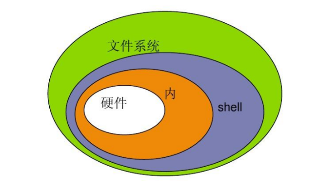

# 1. Shell脚本介绍

- Shell 脚本编程，简单来说，就是将一系列 Linux 命令写入一个文件（脚本），让系统自动按顺序执行，从而实现任务自动化。
- 它本质上是调用 Shell 解释器（如 Bash）来执行命令，并支持变量、条件判断、循环、函数等基础编程结构，是一门“胶水语言”，专为连接和调度各类命令与工具而设计。



- Shell 是一个用 C 语言编写的程序，它是用户使用 Linux 的桥梁。Shell 既是一种命令语言，又是一种程序设计语言。
- Shell 是指一种应用程序，这个应用程序提供了一个界面，用户通过这个界面访问操作系统内核的服务。(翻译官，帮你翻译命令给内核执行)

###  🎯核心作用与应用场景

- **自动化日常任务**：批量执行命令，如文件备份 (`cp`, `rsync`)、日志轮转、定时清理等，替代繁琐的手动操作。
- **系统管理与监控**：批量创建用户、修改权限、部署服务、监控系统资源（CPU/内存/磁盘），是运维工作的得力助手。
- **日志分析与文本处理**：结合 `grep`、`awk`、`sed`等“文本三剑客”，高效完成日志过滤、数据统计和报表生成。
- **作为“胶水”串联工具**：将不同语言或程序（如 Python、Java）的脚本串联起来，编排复杂的自动化流程。

------

### 💡 核心概念速览

- **脚本文件**：通常以 `.sh`为后缀，首行固定为 `#!/bin/bash`（Shebang），用于指定解释器。
- **变量**：无需预先声明类型，直接赋值使用（如 `name="Tom"`），通过 `$name`引用。
- **流程控制**：支持 `if`条件判断和 `for`/`while`循环，用于根据不同情况执行不同操作。
- **函数**：将常用的命令块封装起来，提高代码的复用性和可维护性。
- **管道与重定向**：通过 `|`连接多个命令，并通过 `>`、`>>`、`2>`等符号控制输入/输出流向。

# 2. 变量

## 2.1 变量命名

- **字符集**：只能使用英文字母 (a-z, A-Z)、数字 (0-9) 和下划线 `_`。
- **首字符**：不能以数字开头。
- **命名规范**：变量名中不能包含空格或标点符号（如 `?`, `*`, `$`等）。
- **保留字**：不能使用 Shell 的关键字（如 `if`, `for`, `while`, `fi`等）。
- **大小写敏感**：`name`和 `Name`是两个不同的变量。
- **赋值格式**：等号 `=`两边不能有空格。

## 2.2 声明变量

- 访问变量的语法形式为：`${var}` 和 `$var` 。
- 变量名外面的花括号是可选的，加不加都行，加花括号是为了帮助解释器识别变量的边界，所以推荐加花括号。

```shell
#!/bin/bash	# 声明当前的语言，使用bash去执行
a="hello world"
echo ${a}
```

- 执行在命令行输入

```bash
[root@localhost shell-code]# bash demo01.sh
hello world
```

## 2.3 只读变量

- 使用 readonly 命令可以将变量定义为只读变量，只读变量的值不能被改变。

```bash
#!/bin/bash
rword="hello world"
echo ${rword}
readonly rword
rword="hello world2"
```

```bash
[root@localhost shell-code]# bash demo02.sh
hello world
demo02.sh: line 5: rword: readonly variable
```

## 2.4 删除变量

```shell
dword="hello"
echo ${dword}

unset dword	# 删除变量
echo ${dword}
echo ${bbben}	# 打印一个没有的变量，不会报错，只会打印一个空
```

```bash
[root@localhost shell-code]# bash demo03.sh
hello


```

## 2.5 变量类型

- **局部变量** - 局部变量是仅在某个脚本内部有效的变量。它们不能被其他的程序和脚本访问。
- **环境变量** - 环境变量是对当前 shell 会话内所有的程序或脚本都可见的变量。创建它们跟创建局部变量类似，但使用的是 `export` 关键字，shell 脚本也可以定义环境变量。

**常见的环境变量：**

| 变量      | 描述                                               |
| --------- | -------------------------------------------------- |
| `$HOME`   | 当前用户的用户目录                                 |
| `$PATH`   | 用分号分隔的目录列表，shell 会到这些目录中查找命令 |
| `$PWD`    | 当前工作目录                                       |
| `$RANDOM` | 0 到 32767 之间的整数                              |
| `$UID`    | 数值类型，当前用户的用户 ID                        |
| `$PS1`    | 主要系统输入提示符                                 |
| `$PS2`    | 次要系统输入提示符                                 |

- **本地变量** - 生效范围仅为当前shell进程；（其他shell，当前的子sehll进程均无效）

  - 变量赋值：name = “value”

- **位置变量** - shell 脚本中用来引用命令行参数的特殊变量。当你运行一个 shell 脚本时,可以在命令行上传递参数,这些参数可以在脚本中使用位置变量引用。

  位置变量包括以下几种:

  1. `$0`: 表示脚本本身的名称。
  2. `$1`, `$2`, `$3`, ..., `$n`: 分别表示第1个、第2个、第3个...第n个参数。
  3. `$#`: 表示传递给脚本的参数个数。
  4. `$*`: 表示所有参数,将所有参数当作一个整体。
  5. `$@`: 表示所有参数,但是每个参数都是独立的。

```bash
[root@localhost shell-code]# export bbben=kickflip
[root@localhost shell-code]# echo ${bbben}
kickflip
[root@localhost shell-code]# echo $HOME
/root
[root@localhost shell-code]# echo $PATH
/apps/redis/bin:/root/.local/bin:/root/bin:/usr/local/sbin:/usr/local/bin:/usr/sbin:/usr/bin
[root@localhost shell-code]# echo $PWD
/root/shell-code
[root@localhost shell-code]# echo $UID
0
[root@localhost shell-code]# echo $RANDOM
10266
[root@localhost shell-code]# echo $PS1
\[\][\u@\h \W]\$ \[\]
[root@localhost shell-code]# echo $PS2
\[\]> \[\]
[root@localhost shell-code]# sh
sh-5.1# echo $bbben
kickflip
sh-5.1# echo $UID
0
sh-5.1# exit
exit
```

```bash
[root@localhost shell-code]# cat demo04.sh
#!/bin/bash
echo "Script name: $0"
echo "First argument: $1"
echo "Second argument: $2"
echo "Total arguments: $#"
echo "All arguments: $*"
echo "All arguments (separately): $@"
[root@localhost shell-code]# chmod +x demo04.sh	# 授予可执行权限在可以使用./的方式执行
[root@localhost shell-code]# ./demo04.sh world 2026
Script name: ./demo04.sh
First argument: world
Second argument: 2026
Total arguments: 2
All arguments: world 2026
All arguments (separately): world 2026
# 直接.加上空格相当与当前的bash，就不需要授予可执行权限了
[root@localhost shell-code]# . demo04.sh world 2026
Script name: /bin/bash
First argument: world
Second argument: 2026
Total arguments: 2
All arguments: world 2026
All arguments (separately): world 2026
```

- 统计给出指定文件的行数

```bash
[root@localhost shell-code]#  cat demo05.sh
#!/bin/bash
linecount="$(wc -l /etc/passwd | awk -F " " '{print $1}')"
echo "The number of lines in /etc/passwd is: ${linecount}"
[root@localhost shell-code]# . demo05.sh
The number of lines in /etc/passwd is: 20 
[root@localhost shell-code]# wc -l /etc/passwd
20 /etc/passwd

# 传入指定文件，显示这个文件有多少行
[root@localhost shell-code]# cat demo05.sh
#!/bin/bash
linecount="$(wc -l $1 | awk -F " " '{print $1}')"
echo "This file has ${linecount} lines."
[root@localhost shell-code]# . demo05.sh /apps/redis/etc/redis_6379.conf 
This file has 2057 lines.
```

# 3. 字符串

- shell 字符串可以用单引号 `' '`，也可以用双引号 `" "`，也可以不用引号。

  - 单引号的特点
    - 单引号里不识别变量
    - 单引号里不能出现单独的单引号（使用转义符也不行），但可成对出现，作为字符串拼接使用。

  - 双引号的特点
    - 双引号里识别变量
      - 双引号里可以出现转义字符

- 综上，推荐使用双引号。

## 3.1 字符串的拼接

```bash
[root@localhost shell-code]# cat demo06.sh
# 使用单引号拼接
name1='white'
str1='hello,'${name1}''
str2='hello,${name1}'
echo ${str1}_${str2}

# 使用双引号拼接
name2="black"
str3="hello, "${name2}""
str4="hello, ${name2}"
echo ${str3}_${str4}
[root@localhost shell-code]# . demo06.sh
hello,white_hello,${name1}
hello, black_hello, black
```

## 3.2 获取字符串的长度

```bash
[root@localhost shell-code]# cat demo07.sh
txt="12345"
echo ${#txt}
[root@localhost shell-code]# . demo07.sh
5
```

## 3.3 截取子字符串

- `${variable:start:length}`

```bash
[root@localhost shell-code]# cat demo08.sh
text="12345"
echo ${text:2:2}
[root@localhost shell-code]# . demo08.sh
34
```

# 4. 数组

- bash 只支持一维数组。

- 数组下标从 0 开始，下标可以是整数或算术表达式，其值应大于或等于 0。

## 4.1 创建/访问数组

```bash
[root@localhost shell-code]# cat demo09.sh
#!/bin/bash
# 创建数组
fruits=("apple" "banana" "cherry")

# 访问数组元素
echo "First fruit: ${fruits[0]}"
echo "Second fruit: ${fruits[1]}"
echo "Third fruit: ${fruits[2]}"
echo "All fruits: ${fruits[@]}"
echo ${fruits[*]}
[root@localhost shell-code]# . demo09.sh
First fruit: apple
Second fruit: banana
Third fruit: cherry
All fruits: apple banana cherry
apple banana cherry
```

## 4.2 获取数组的长度

```bash
[root@localhost shell-code]# cat demo10.sh
fruits=("apple" "banana" "cherry")
echo "数组元素个数：${#fruits[*]}"
[root@localhost shell-code]# . demo10.sh
数组元素个数：3
```

## 4.3 删除元素

- 用`unset`命令来从数组中删除一个元素：

```bash
[root@localhost shell-code]# cat demo11.sh
nums=([0]="nls" [1]="18" [2]="teacher")
echo "数组元素个数为: ${#nums[*]}"
unset nums[0]
echo "数组元素个数为: ${#nums[*]}"
[root@localhost shell-code]# . demo11.sh
数组元素个数为: 3
数组元素个数为: 2
```

# 5. 运算符

## 5.1 算数运算符

- 下表列出了常用的算术运算符，假定变量 x 为 10，变量 y 为 20：

| 运算符 | 说明                                          | 举例                           |
| ------ | --------------------------------------------- | ------------------------------ |
| +      | 加法                                          | `expr $x + $y` 结果为 30。     |
| -      | 减法                                          | `expr $x - $y` 结果为 -10。    |
| *      | 乘法                                          | `expr $x * $y` 结果为 200。    |
| /      | 除法                                          | `expr $y / $x` 结果为 2。      |
| %      | 取余                                          | `expr $y % $x` 结果为 0。      |
| =      | 赋值                                          | `x=$y` 将把变量 y 的值赋给 x。 |
| ==     | 相等。用于比较两个数字，相同则返回 true。     | `[ $x == $y ]` 返回 false。    |
| !=     | 不相等。用于比较两个数字，不相同则返回 true。 | `[ $x != $y ]` 返回 true。     |

- **注意：**条件表达式要放在方括号之间，并且要有空格，例如: `[$x==$y]` 是错误的，必须写成 `[ $x == $y ]`

- expr本身是一个命令，可以直接进行运算

```bash
[root@localhost shell-code]# cat demo12.sh
x=10
y=20

echo "x=${x}, y=${y}"

val=`expr ${x} + ${y}`
echo "${x} + ${y} = $val"

val=`expr ${x} - ${y}`
echo "${x} - ${y} = $val"

val=`expr ${x} \* ${y}`
echo "${x} * ${y} = $val"

val=`expr ${y} / ${x}`
echo "${y} / ${x} = $val"

val=`expr ${y} % ${x}`
echo "${y} % ${x} = $val"

if [[ ${x} == ${y} ]]
then
  echo "${x} = ${y}"
fi
if [[ ${x} != ${y} ]]
then
  echo "${x} != ${y}"
fi
[root@localhost shell-code]# . demo12.sh
x=10, y=20
10 + 20 = 30
10 - 20 = -10
10 * 20 = 200
20 / 10 = 2
20 % 10 = 0
10 != 20
```

### 5.1.1 案例一：计算ID之和

- 计算/etc/passwd文件中第10个用户和第15个用户的ID之和

```bash
[root@localhost shell-code]# cat id.sh
#!/bin/bash
# userid1=$(cat /etc/passwd | sed -n '10p'| awk -F: '{print $3}')
# userid2=$(cat /etc/passwd | sed -n '15p'| awk -F: '{print $3}')
userid1=$(awk -F: '{if (NR==10) print $3}' /etc/passwd)
userid2=$(awk -F: '{if (NR==15) print $3}' /etc/passwd)

userid_sum=$[$userid1 + $userid2]
echo $userid_sum
[root@localhost shell-code]# . id.sh
92
```

### 5.1.2 案例二：统计文件数量

- 统计/etc/,/var/,/usr/目录下有多少目录和文件

```bash
[root@localhost shell-code]# cat file.sh
#!/bin/bash
sum_etc=$(find /etc | wc -l)
sum_var=$(find /var | wc -l)
sum_usr=$(find /usr | wc -l)

sum=$[$sum_etc + $sum_var + $sum_usr]
echo $sum
[root@localhost shell-code]# . file.sh
39514
```

## 5.2 关系运算符

- 关系运算符只支持数字，不支持字符串，除非字符串的值是数字。

- 下表列出了常用的关系运算符，假定变量 x 为 10，变量 y 为 20：

| 运算符 | 说明                                                  | 举例                         |
| ------ | ----------------------------------------------------- | ---------------------------- |
| `-eq`  | 检测两个数是否相等，相等返回 true。                   | `[ $a -eq $b ]`返回 false。  |
| `-ne`  | 检测两个数是否相等，不相等返回 true。                 | `[ $a -ne $b ]` 返回 true。  |
| `-gt`  | 检测左边的数是否大于右边的，如果是，则返回 true。     | `[ $a -gt $b ]` 返回 false。 |
| `-lt`  | 检测左边的数是否小于右边的，如果是，则返回 true。     | `[ $a -lt $b ]` 返回 true。  |
| `-ge`  | 检测左边的数是否大于等于右边的，如果是，则返回 true。 | `[ $a -ge $b ]` 返回 false。 |
| `-le`  | 检测左边的数是否小于等于右边的，如果是，则返回 true。 | `[ $a -le $b ]`返回 true。   |

- **示例：**

```bash
[root@localhost shell-code]# cat demo13.sh
x=10
y=20

echo "x=${x}, y=${y}"

if [[ ${x} -eq ${y} ]]; then
   echo "${x} -eq ${y} : x 等于 y"
else
   echo "${x} -eq ${y}: x 不等于 y"
fi

if [[ ${x} -ne ${y} ]]; then
   echo "${x} -ne ${y}: x 不等于 y"
else
   echo "${x} -ne ${y}: x 等于 y"
fi

if [[ ${x} -gt ${y} ]]; then
   echo "${x} -gt ${y}: x 大于 y"
else
   echo "${x} -gt ${y}: x 不大于 y"
fi

if [[ ${x} -lt ${y} ]]; then
   echo "${x} -lt ${y}: x 小于 y"
else
   echo "${x} -lt ${y}: x 不小于 y"
fi

if [[ ${x} -ge ${y} ]]; then
   echo "${x} -ge ${y}: x 大于或等于 y"
else
   echo "${x} -ge ${y}: x 小于 y"
fi

if [[ ${x} -le ${y} ]]; then
   echo "${x} -le ${y}: x 小于或等于 y"
else
   echo "${x} -le ${y}: x 大于 y"
fi
[root@localhost shell-code]# . demo13.sh
x=10, y=20
10 -eq 20: x 不等于 y
10 -ne 20: x 不等于 y
10 -gt 20: x 不大于 y
10 -lt 20: x 小于 y
10 -ge 20: x 小于 y
10 -le 20: x 小于或等于 y
```

### 5.2.1 案例：猜数字小游戏

```bash
[root@localhost shell-code]# cat guess.sh
#!/bin/bash
num2=66
while true
do
    read -p "请输入你要猜的数字：" num1 # -p 参数可以在输入前显示提示信息
    if [ $num1 -gt $num2 ];then
        echo "你猜大了"
    elif [ $num1 -lt $num2 ];then
        echo "你猜小了"
    else
        echo "你猜对了"
        break
    fi
done
[root@localhost shell-code]# . guess.sh
请输入你要猜的数字：100
你猜大了
请输入你要猜的数字：50
你猜小了
请输入你要猜的数字：75
你猜大了
请输入你要猜的数字：65
你猜小了
请输入你要猜的数字：70
你猜大了
请输入你要猜的数字：67
你猜大了
请输入你要猜的数字：66
你猜对了
[root@localhost shell-code]# cat guess.sh
#!/bin/bash
num2=$RANDOM # $RANDOM 是一个环境变量，每次使用时都会生成一个0-32767之间的随机数
while true
do
    read -p "请输入你要猜的数字：" num1 # -p 参数可以在输入前显示提示信息
    if [ $num1 -gt $num2 ];then
        echo "你猜大了"
    elif [ $num1 -lt $num2 ];then
        echo "你猜小了"
    else
        echo "你猜对了"
        break
    fi
done
[root@localhost shell-code]# . guess.sh
请输入你要猜的数字：100
你猜小了
请输入你要猜的数字：1000
你猜小了
请输入你要猜的数字：10000
你猜小了
请输入你要猜的数字：30000 
你猜大了
请输入你要猜的数字：20000
你猜小了
请输入你要猜的数字：25000
你猜大了
请输入你要猜的数字：22500
你猜小了
请输入你要猜的数字：24500
你猜大了
请输入你要猜的数字：24000
你猜小了
请输入你要猜的数字：24250
你猜小了
请输入你要猜的数字：24350
你猜小了
请输入你要猜的数字：24400
你猜大了
请输入你要猜的数字：24375
你猜小了
请输入你要猜的数字：24378
你猜大了
请输入你要猜的数字：24376
你猜对了
```

## 5.3 字符串运算符

- 下表列出了常用的字符串运算符，假定变量 a 为 "abc"，变量 b 为 "efg"：

| 运算符 | 说明                                       | 举例                       |
| ------ | ------------------------------------------ | -------------------------- |
| `=`    | 检测两个字符串是否相等，相等返回 true。    | `[ $a = $b ]` 返回 false。 |
| `!=`   | 检测两个字符串是否相等，不相等返回 true。  | `[ $a != $b ]` 返回 true。 |
| `-z`   | 检测字符串长度是否为 0，为 0 返回 true。   | `[ -z $a ]` 返回 false。   |
| `-n`   | 检测字符串长度是否为 0，不为 0 返回 true。 | `[ -n $a ]` 返回 true。    |
| `str`  | 检测字符串是否为空，不为空返回 true。      | `[ $a ]` 返回 true。       |

- 示例：

```bash
[root@localhost shell-code]# cat demo14.sh
x="abc"
y="xyz"


echo "x=${x}, y=${y}"

if [[ ${x} = ${y} ]]; then
   echo "${x} = ${y} : x 等于 y"
else
   echo "${x} = ${y}: x 不等于 y"
fi

if [[ ${x} != ${y} ]]; then
   echo "${x} != ${y} : x 不等于 y"
else
   echo "${x} != ${y}: x 等于 y"
fi

if [[ -z ${x} ]]; then
   echo "-z ${x} : 字符串长度为 0"
else
   echo "-z ${x} : 字符串长度不为 0"
fi

if [[ -n "${x}" ]]; then
   echo "-n ${x} : 字符串长度不为 0"
else
   echo "-n ${x} : 字符串长度为 0"
fi

if [[ ${x} ]]; then
   echo "${x} : 字符串不为空"
else
   echo "${x} : 字符串为空"
fi
[root@localhost shell-code]# . demo14.sh
x=abc, y=xyz
abc = xyz: x 不等于 y
abc != xyz : x 不等于 y
-z abc : 字符串长度不为 0
-n abc : 字符串长度不为 0
abc : 字符串不为空
```

## 5.4 逻辑运算符

- 以下介绍 Shell 的逻辑运算符，假定变量 x 为 10，变量 y 为 20:

| 运算符 | 说明       | 举例                                            |
| ------ | ---------- | ----------------------------------------------- |
| `&&`   | 逻辑的 AND | `[[ ${x} -lt 100 && ${y} -gt 100 ]]` 返回 false |
| `||`   | 逻辑的OR   | `[[ ${x} -lt 100 || ${y} -gt 100 ]]` 返回 true  |

- 示例：

```bash
[root@localhost shell-code]# cat demo15.sh
x=10
y=20

echo "x=${x}, y=${y}"

if [[ ${x} -lt 100 && ${y} -gt 100 ]]
then
   echo "${x} -lt 100 && ${y} -gt 100 返回 true"
else
   echo "${x} -lt 100 && ${y} -gt 100 返回 false"
fi

if [[ ${x} -lt 100 || ${y} -gt 100 ]]
then
   echo "${x} -lt 100 || ${y} -gt 100 返回 true"
else
   echo "${x} -lt 100 || ${y} -gt 100 返回 false"
fi
[root@localhost shell-code]# . demo15.sh
x=10, y=20
10 -lt 100 && 20 -gt 100 返回 false
10 -lt 100 || 20 -gt 100 返回 true
```

## 5.5 布尔运算符

- 下表列出了常用的布尔运算符，假定变量 x 为 10，变量 y 为 20：

| 运算符 | 说明                                                | 举例                                       |
| ------ | --------------------------------------------------- | ------------------------------------------ |
| `!`    | 非运算，表达式为 true 则返回 false，否则返回 true。 | `[ ! false ]` 返回 true。                  |
| `-o`   | 或运算，有一个表达式为 true 则返回 true。           | `[ $a -lt 20 -o $b -gt 100 ]` 返回 true。  |
| `-a`   | 与运算，两个表达式都为 true 才返回 true。           | `[ $a -lt 20 -a $b -gt 100 ]` 返回 false。 |

- 示例：

```bash
[root@localhost shell-code]# cat demo16.sh
x=10
y=20

echo "x=${x}, y=${y}"

if [[ ${x} != ${y} ]]; then
   echo "${x} != ${y} : x 不等于 y"
else
   echo "${x} != ${y}: x 等于 y"
fi

if [[ ${x} -lt 100 && ${y} -gt 15 ]]; then
   echo "${x} 小于 100 且 ${y} 大于 15 : 返回 true"
else
   echo "${x} 小于 100 且 ${y} 大于 15 : 返回 false"
fi

if [[ ${x} -lt 100 || ${y} -gt 100 ]]; then
   echo "${x} 小于 100 或 ${y} 大于 100 : 返回 true"
else
   echo "${x} 小于 100 或 ${y} 大于 100 : 返回 false"
fi

if [[ ${x} -lt 5 || ${y} -gt 100 ]]; then
   echo "${x} 小于 5 或 ${y} 大于 100 : 返回 true"
else
   echo "${x} 小于 5 或 ${y} 大于 100 : 返回 false"
fi
[root@localhost shell-code]# . demo16.sh
x=10, y=20
10 != 20 : x 不等于 y
10 小于 100 且 20 大于 15 : 返回 true
10 小于 100 或 20 大于 100 : 返回 true
10 小于 5 或 20 大于 100 : 返回 false
```

## 5.6 文件测试运算符

- 文件测试运算符用于检测 Unix 文件的各种属性。

- 属性检测描述如下：

| 操作符  | 说明                                                         | 举例                        |
| ------- | ------------------------------------------------------------ | --------------------------- |
| -b file | 检测文件是否是块设备文件，如果是，则返回 true。              | `[ -b $file ]` 返回 false。 |
| -c file | 检测文件是否是字符设备文件，如果是，则返回 true。            | `[ -c $file ]` 返回 false。 |
| -d file | 检测文件是否是目录，如果是，则返回 true。                    | `[ -d $file ]` 返回 false。 |
| -f file | 检测文件是否是普通文件（既不是目录，也不是设备文件），如果是，则返回 true。 | `[ -f $file ]` 返回 true。  |
| -g file | 检测文件是否设置了 SGID 位，如果是，则返回 true。            | `[ -g $file ]` 返回 false。 |
| -k file | 检测文件是否设置了粘着位(Sticky Bit)，如果是，则返回 true。  | `[ -k $file ]`返回 false。  |
| -p file | 检测文件是否是有名管道，如果是，则返回 true。                | `[ -p $file ]` 返回 false。 |
| -u file | 检测文件是否设置了 SUID 位，如果是，则返回 true。            | `[ -u $file ]` 返回 false。 |
| -r file | 检测文件是否可读，如果是，则返回 true。                      | `[ -r $file ]` 返回 true。  |
| -w file | 检测文件是否可写，如果是，则返回 true。                      | `[ -w $file ]` 返回 true。  |
| -x file | 检测文件是否可执行，如果是，则返回 true。                    | `[ -x $file ]` 返回 true。  |
| -s file | 检测文件是否为空（文件大小是否大于 0），不为空返回 true。    | `[ -s $file ]` 返回 true。  |
| -e file | 检测文件（包括目录）是否存在，如果是，则返回 true。          | `[ -e $file ]` 返回 true。  |

```bash
[root@localhost shell-code]# cat demo17.sh
file="/etc/hosts"

if [[ -r ${file} ]]; then
   echo "${file} 文件可读"
else
   echo "${file} 文件不可读"
fi
if [[ -w ${file} ]]; then
   echo "${file} 文件可写"
else
   echo "${file} 文件不可写"
fi
if [[ -x ${file} ]]; then
   echo "${file} 文件可执行"
else
   echo "${file} 文件不可执行"
fi
if [[ -f ${file} ]]; then
   echo "${file} 文件为普通文件"
else
   echo "${file} 文件为特殊文件"
fi
if [[ -d ${file} ]]; then
   echo "${file} 文件是个目录"
else
   echo "${file} 文件不是个目录"
fi
if [[ -s ${file} ]]; then
   echo "${file} 文件不为空"
else
   echo "${file} 文件为空"
fi
if [[ -e ${file} ]]; then
   echo "${file} 文件存在"
else
   echo "${file} 文件不存在"
fi
[root@localhost shell-code]# . demo17.sh
/etc/hosts 文件可读
/etc/hosts 文件可写
/etc/hosts 文件不可执行
/etc/hosts 文件为普通文件
/etc/hosts 文件不是个目录
/etc/hosts 文件不为空
/etc/hosts 文件存在
```

# 6. 用户交互read

## 6.1 常用选项

| 选项 | 描述                       |
| ---- | -------------------------- |
| `-p` | 在读取输入之前显示提示信息 |
| `-n` | 限制输入的字符数           |
| `-s` | 隐藏用户输入               |
| `-a` | 将输入存储到数组变量中     |
| `-d` | 指定用于终止输入的分隔符   |
| `-t` | 设置超时时间(以秒为单位)   |
| `-e` | 允许使用 Readline 编辑键   |
| `-i` | 设置默认值                 |

- 示例：

```bash
[root@localhost shell-code]# cat test.sh
read -p "输入密码：" -s pass
echo -e "\n你输入的密码是${pass}" 
[root@localhost shell-code]# . test.sh
输入密码：
你输入的密码是88888888
```

## 6.2 案例：计算器

```bash
[root@localhost shell-code]# cat jisuanqi.sh
#!/bin/bash

echo "Enter the first number:"
read num1
echo "Enter the second number:"
read num2

echo "The sum is: $((num1 + num2))"
echo "The difference is: $((num1 - num2))"
echo "The product is: $((num1 * num2))"
echo "The quotient is: $((num1 / num2))"
[root@localhost shell-code]# . jisuanqi.sh
Enter the first number:
1
Enter the second number:
2
The sum is: 3
The difference is: -1
The product is: 2
The quotient is: 0
```

# 7. 控制语句

## 7.1 条件语句

- 跟其它程序设计语言一样，Bash 中的条件语句让我们可以决定一个操作是否被执行。结果取决于一个包在`[[ ]]`里的表达式。

- 由`[[ ]]`（`sh`中是`[ ]`）包起来的表达式被称作 **检测命令** 或 **基元**。这些表达式帮助我们检测一个条件的结果

1. `if` 语句

- `if`在使用上跟其它语言相同。如果中括号里的表达式为真，那么`then`和`fi`之间的代码会被执行。`fi`标志着条件代码块的结束。

```bash
# 写成一行
if [[ 1 -eq 1 ]]; then echo "1 -eq 1 result is: true"; fi
# Output: 1 -eq 1 result is: true

# 写成多行
if [[ "abc" -eq "abc" ]]
then
  echo ""abc" -eq "abc" result is: true"
fi
# Output: abc -eq abc result is: true
```

2. `if else` 语句

同样，我们可以使用`if..else`语句，例如：

```bash
if [[ 2 -ne 1 ]]; then
  echo "true"
else
  echo "false"
fi
# Output: true
```

3. `if elif else` 语句

有些时候，`if..else`不能满足我们的要求。别忘了`if..elif..else`，使用起来也很方便。

```bash
x=10
y=20
if [[ ${x} > ${y} ]]; then
   echo "${x} > ${y}"
elif [[ ${x} < ${y} ]]; then
   echo "${x} < ${y}"
else
   echo "${x} = ${y}"
fi
# Output: 10 < 20
```

## 7.2 循环语句

- 循环其实不足为奇。跟其它程序设计语言一样，bash 中的循环也是只要控制条件为真就一直迭代执行的代码块。Bash 中有四种循环：`for`，`while`，`until`和`select`。

### 7.2.1 for循环

- `for`与 C 语言中非常像。看起来是这样：

```bash
for arg in elem1 elem2 ... elemN
do
  ### 语句
done
```

- 在每次循环的过程中，`arg`依次被赋值为从`elem1`到`elemN`。这些值还可以是通配符或者大括号扩展。

- 当然，我们还可以把`for`循环写在一行，但这要求`do`之前要有一个分号，就像下面这样：

```bash
for i in {1..5}; do echo $i; done
```

- 还有，如果你觉得`for..in..do`对你来说有点奇怪，那么你也可以像 C 语言那样使用`for`，比如：

```bash
for (( i = 0; i < 10; i++ )); do
  echo $i
done
```

- 当我们想对一个目录下的所有文件做同样的操作时，`for`就很方便了。举个例子，如果我们想把所有的`.bash`文件移动到`script`文件夹中，并给它们可执行权限，我们的脚本可以这样写：

```bash
DIR=/home/zp
for FILE in ${DIR}/*.sh; do
  mv "$FILE" "${DIR}/scripts"
done
# 将 /home/zp 目录下所有 sh 文件拷贝到 /home/zp/scripts
```

#### 7.2.1.1 案例一：创建用户

- 创建用户user1‐user10家目录，并且在user1‐10家目录下创建1.txt‐10.txt

```bash
[root@localhost shell-code]# cat adduser.sh
#!/bin/bash
for i in {1..10}
do
    mkdir /home/user$i
    for j in $(seq 10)
    do
       touch /home/user$i/$j.txt
    done
done
[root@localhost shell-code]# . adduser.sh
[root@localhost shell-code]# tree /home/
/home/
├── user1
│   ├── 1.txt
│   ├── 10.txt
│   ├── 2.txt
│   ├── 3.txt
│   ├── 4.txt
│   ├── 5.txt
│   ├── 6.txt
│   ├── 7.txt
│   ├── 8.txt
│   └── 9.txt
├── user10
│   ├── 1.txt
│   ├── 10.txt
│   ├── 2.txt
│   ├── 3.txt
│   ├── 4.txt
│   ├── 5.txt
│   ├── 6.txt
│   ├── 7.txt
│   ├── 8.txt
│   └── 9.txt
├── user2
│   ├── 1.txt
│   ├── 10.txt
│   ├── 2.txt
│   ├── 3.txt
│   ├── 4.txt
│   ├── 5.txt
│   ├── 6.txt
│   ├── 7.txt
│   ├── 8.txt
│   └── 9.txt
├── user3
│   ├── 1.txt
│   ├── 10.txt
│   ├── 2.txt
│   ├── 3.txt
│   ├── 4.txt
│   ├── 5.txt
│   ├── 6.txt
│   ├── 7.txt
│   ├── 8.txt
│   └── 9.txt
├── user4
│   ├── 1.txt
│   ├── 10.txt
│   ├── 2.txt
│   ├── 3.txt
│   ├── 4.txt
│   ├── 5.txt
│   ├── 6.txt
│   ├── 7.txt
│   ├── 8.txt
│   └── 9.txt
├── user5
│   ├── 1.txt
│   ├── 10.txt
│   ├── 2.txt
│   ├── 3.txt
│   ├── 4.txt
│   ├── 5.txt
│   ├── 6.txt
│   ├── 7.txt
│   ├── 8.txt
│   └── 9.txt
├── user6
│   ├── 1.txt
│   ├── 10.txt
│   ├── 2.txt
│   ├── 3.txt
│   ├── 4.txt
│   ├── 5.txt
│   ├── 6.txt
│   ├── 7.txt
│   ├── 8.txt
│   └── 9.txt
├── user7
│   ├── 1.txt
│   ├── 10.txt
│   ├── 2.txt
│   ├── 3.txt
│   ├── 4.txt
│   ├── 5.txt
│   ├── 6.txt
│   ├── 7.txt
│   ├── 8.txt
│   └── 9.txt
├── user8
│   ├── 1.txt
│   ├── 10.txt
│   ├── 2.txt
│   ├── 3.txt
│   ├── 4.txt
│   ├── 5.txt
│   ├── 6.txt
│   ├── 7.txt
│   ├── 8.txt
│   └── 9.txt
└── user9
    ├── 1.txt
    ├── 10.txt
    ├── 2.txt
    ├── 3.txt
    ├── 4.txt
    ├── 5.txt
    ├── 6.txt
    ├── 7.txt
    ├── 8.txt
    └── 9.txt

10 directories, 100 files
```

#### 7.2.1.2 案例二：检查磁盘占用

- 列出/var/目录下各个子目录占用磁盘大小

```bash
[root@localhost shell-code]# cat size.sh
#!/bin/bash
for i in `ls /var/` # 先执行反引号里面的命令
do
    path="/var/$i"
    if [ -d $path ];then
        du -sh $path    # du -sh 统计当前目录的大小
    fi
done
[root@localhost shell-code]# . size.sh
0       /var/adm
59M     /var/cache
0       /var/crash
0       /var/db
0       /var/empty
0       /var/ftp
0       /var/games
0       /var/kerberos
81M     /var/lib
0       /var/local
0       /var/lock
8.2M    /var/log
0       /var/mail
0       /var/nis
0       /var/opt
0       /var/preserve
0       /var/run
12K     /var/spool
4.0K    /var/tmp
0       /var/yp
```

#### 7.2.1.3 案例三：测试连通性

- 批量测试地址是否在线

```bash
[root@localhost shell-code]# cat ping.sh
#!/bin/bash
for i in {120..130}
do
    ping -c 2 192.168.73.$i &> /dev/null
    if [ $? -eq 0 ];then
        echo 192.168.73.$i >> /root/host.txt
    fi
done
[root@localhost shell-code]# . ping.sh
[root@localhost shell-code]# cat /root/host.txt 
192.168.73.128
```

### 7.2.2 while循环

- `while`循环检测一个条件，只要这个条件为 *真*，就执行一段命令。被检测的条件跟`if..then`中使用的[基元](https://github.com/denysdovhan/bash-handbook/blob/master/translations/zh-CN/README.md#基元和组合表达式)并无二异。因此一个`while`循环看起来会是这样：

```bash
while 循环条件
do
  ### 语句
done
```

#### 7.2.2.1 案例一：数字累加

- 计算1+2+..100的总和

```bash
[root@localhost shell-code]# cat sum.sh
#!/bin/bash
i=1
sum=0
while [ $i -le 100 ]
do
    let sum+=$i
    let i++
done
echo $sum
[root@localhost shell-code]# . sum.sh
5050
```

#### 7.2.2.2 案例二：猜数字小游戏

- 加上随机数

```bash
[root@localhost shell-code]# cat guess.sh
#!/bin/bash
num2=$((RANDOM%100+1))
while true
do
    read -p "请输入你要猜的数字：" num1
    if [ $num1 -gt $num2 ];then
        echo "你猜大了"
    elif [ $num1 -lt $num2 ];then
        echo "你猜小了"
    else
        echo "你猜对了"
        break
    fi
done
[root@localhost shell-code]# . guess.sh
请输入你要猜的数字：50
你猜大了
请输入你要猜的数字：25
你猜小了
请输入你要猜的数字：40
你猜大了
请输入你要猜的数字：36
你猜大了
请输入你要猜的数字：34
你猜大了
请输入你要猜的数字：32
你猜大了
请输入你要猜的数字：30
你猜大了
请输入你要猜的数字：27
你猜大了
请输入你要猜的数字：26
你猜对了
```

### 7.2.3 until循环

- `until`循环跟`while`循环正好相反。它跟`while`一样也需要检测一个测试条件，但不同的是，只要该条件为 *假* 就一直执行循环：

```bash
until 条件测试
do
    ##循环体
done
```

- 示例：

```bash
[root@localhost shell-code]# cat until.sh
x=0
until [ ${x} -ge 5 ]; do
  echo ${x}
  x=`expr ${x} + 1`
done
[root@localhost shell-code]# . until.sh
0
1
2
3
4
```

### 7.2.4 退出循环

- `break`和`continue`

- 如果想提前结束一个循环或跳过某次循环执行，可以使用 shell 的`break`和`continue`语句来实现。它们可以在任何循环中使用。

> `break`语句用来提前结束当前循环。
>
> `continue`语句用来跳过某次迭代。

- 示例：

```bash
# 查找 10 以内第一个能整除 2 和 3 的正整数
i=1
while [[ ${i} -lt 10 ]]; do
  if [[ $((i % 3)) -eq 0 ]] && [[ $((i % 2)) -eq 0 ]]; then
    echo ${i}
    break;
  fi
  i=`expr ${i} + 1`
done
# Output: 6

# 打印10以内的奇数
for (( i = 0; i < 10; i ++ )); do
  if [[ $((i % 2)) -eq 0 ]]; then
    continue;
  fi
  echo ${i}
done
#  Output:
#  1
#  3
#  5
#  7
#  9
```

# 8. 函数

## 8.1 函数定义

- bash 函数定义语法如下：

```bash
[ function ] funname [()] {
    action;
    [return int;]
}
function FUNNAME(){
函数体
返回值
}
FUNNME #调用函数
```

> 💡 说明：
>
> 1. 函数定义时，`function` 关键字可有可无。
> 2. 函数返回值 - return 返回函数返回值，返回值类型只能为整数（0-255）。如果不加 return 语句，shell 默认将以最后一条命令的运行结果，作为函数返回值。
> 3. 函数返回值在调用该函数后通过 `$?` 来获得。
> 4. 所有函数在使用前必须定义。这意味着必须将函数放在脚本开始部分，直至 shell 解释器首次发现它时，才可以使用。调用函数仅使用其函数名即可。

- 示例：

```bash
[root@localhost shell-code]# cat func.sh
#!/bin/bash
func(){
    echo "这是我的第一个函数"
}

echo "------函数执行之前-------"
func
echo "------函数执行之前-------"
[root@localhost shell-code]# . func.sh
------函数执行之前-------
这是我的第一个函数
------函数执行之前-------
```

## 8.2 返回值

- 示例:

```bash
func(){
	echo "这个函数会对输入的两个数字进行相加运算..."
	echo "输入第一个数字: "
	read aNum
	echo "输入第二个数字: "
	read anotherNum
	echo "两个数字分别为 $aNum 和 $anotherNum !"
	return $(($aNum+$anotherNum))
}
func
echo "输入的两个数字之和为 $? !"
#可以使用$?来获取返回值
```

## 8.3 函数参数

- **位置参数**是在调用一个函数并传给它参数时创建的变量

| 变量           | 描述                           |
| -------------- | ------------------------------ |
| `$0`           | 脚本名称                       |
| `$1 … $9`      | 第 1 个到第 9 个参数列表       |
| `${10} … ${N}` | 第 10 个到 N 个参数列表        |
| `$*` or `$@`   | 除了`$0`外的所有位置参数       |
| `$#`           | 不包括`$0`在内的位置参数的个数 |
| `$FUNCNAME`    | 函数名称（仅在函数内部有值）   |

- 示例：

```bash
[root@localhost shell-code]# cat func1.sh 
#!/bin/bash

x=0
if [[ -n $1 ]]; then
  echo "第一个参数为：$1"
  x=$1
else
  echo "第一个参数为空"
fi

y=0
if [[ -n $2 ]]; then
  echo "第二个参数为：$2"
  y=$2
else
  echo "第二个参数为空"
fi

paramsFunction(){
  echo "函数第一个入参：$1"
  echo "函数第二个入参：$2"
}
paramsFunction ${x} ${y}
[root@localhost shell-code]# . func1.sh 10 30
第一个参数为：10
第二个参数为：30
函数第一个入参：10
函数第二个入参：30
```

## 8.4 函数处理参数

- 另外，还有几个特殊字符用来处理参数：

| 参数处理 | 说明                                             |
| -------- | ------------------------------------------------ |
| `$#`     | 返回参数个数                                     |
| `$*`     | 返回所有参数                                     |
| ``$`     | 参数处理                                         |
| `$!`     | 后台运行的最后一个进程的 ID 号                   |
| `$@`     | 返回所有参数                                     |
| `$-`     | 返回 Shell 使用的当前选项，与 set 命令功能相同。 |
| `$?`     | 函数返回值                                       |

```bash
runner() {
  return 0
}

name=zp
paramsFunction(){
  echo "函数第一个入参：$1"
  echo "函数第二个入参：$2"
  echo "传递到脚本的参数个数：$#"
  echo "所有参数："
  printf "+ %s\n" "$*"
  echo "脚本运行的当前进程 ID 号：$$"
  echo "后台运行的最后一个进程的 ID 号：$!"
  echo "所有参数："
  printf "+ %s\n" "$@"
  echo "Shell 使用的当前选项：$-"
  runner
  echo "runner 函数的返回值：$?"
}
paramsFunction 1 "abc" "hello, \"zp\""
#  Output:
#  函数第一个入参：1
#  函数第二个入参：abc
#  传递到脚本的参数个数：3
#  所有参数：
#  + 1 abc hello, "zp"
#  脚本运行的当前进程 ID 号：26400
#  后台运行的最后一个进程的 ID 号：
#  所有参数：
#  + 1
#  + abc
#  + hello, "zp"
#  Shell 使用的当前选项：hB
#  runner 函数的返回值：0
```

# 9. 实际案例

## 9.1 案例一：开机显示系统信息脚本

```bash
[root@localhost shell-code]# cat os.sh
#!/bin/bash
yum install -y net-tools &> /dev/null
wangka=`ip a | grep ens | head -1 | cut -d: -f2`
System=$(hostnamectl | grep System | awk '{print $3,$4,$5}')
Kernel=$(hostnamectl | grep Kernel | awk -F: '{print $2}')
Virtualization=$(hostnamectl | grep Virtualization| awk '{print $2}')
Statichostname=$(hostnamectl | grep Static|awk -F: '{print $2}')
Ens32=$(ifconfig $wangka | awk 'NR==2 {print $2}')
Lo=$(ifconfig lo | awk 'NR==2 {print $2}')
NetworkIp=$(curl -s icanhazip.com)
echo "当前系统版本是：$System"
echo "当前系统内核是：$Kernel"
echo "当前虚拟平台是：$Virtualization"
echo "当前主机名是：$Statichostname"
echo "当前网卡$wangka的地址是：$Ens32"
echo "当前lo0接口的地址是：$Lo"
echo "当前公网地址是：$NetworkIp"
[root@localhost shell-code]# . os.sh
当前系统版本是：Rocky Linux 9.4
当前系统内核是： Linux 5.14.0-427.13.1.el9_4.x86_64
当前虚拟平台是：vmware
当前主机名是： (unset)
当前网卡 ens160的地址是：192.168.73.128
当前lo0接口的地址是：127.0.0.1
当前公网地址是：112.21.155.40
```

## 9.2 案例二：监控httpd进程

- **需求：**

​	1.每隔10s监控httpd的进程数，若进程数大于等于500，则自动重启Apache服务，并检测服务是否重启成功

​	2.若未成功则需要再次启动，若重启5次依旧没有成功，则向管理员发送告警邮件（使用echo输出已发送即可），并退出检测

​	3.如果启动成功，则等待1分钟后再次检测httpd进程数，若进程数正常，则恢复正常检测（10s一次），否则放弃重启并向管理员发送告警邮件，并退出检测

```bash
[root@localhost ~]# cat httpd.sh
#!/bin/bash
function check_httpd_process_number() {
process_num=`ps -ef | grep httpd| wc -l`

if [ $process_num -gt 50 ];then
    systemctl restart httpd &> /dev/null
    # 重启五次httpd确保服务启动
    systemctl status httpd &> /dev/null
    if [ $? -ne 0 ];then
        num_restart_httpd=0
        while true;do
            let num_restart_httpd++
            systemctl restart httpd &> /dev/null
            systemctl status httpd &> /dev/null
            [ $? -eq 0 ]  && break
            [ $num_restart_httpd -eq 6 ] && break
        done
    fi

    # 判断重启服务的结果
    systemctl status httpd &> /dev/null
    [ $? -ne 0 ] && echo "apache未正常重启，已发送邮件给管理员" && return                                                                                    1
    sleep 60
        return 0

    # 再次判断进程是否正常
    process_num=`ps -ef | grep httpd| wc -l`
    if [ $process_num -gt 50 ] ;then
        echo "apache经过重启进程数依然大于50"
        return 1
    else
        return 0
    fi

else
    echo "进程数小于50"
    sleep 3
    return 0
fi
}

# 每十秒钟执行一次函数，检查进程是否正常
while true;do
check_httpd_process_number
[ $? -eq 1 ] && exit
done

# Output:
[root@localhost ~]# bash http.sh
进程数小于50
进程数小于50
进程数小于50
进程数小于50

# 复制窗口进行压力测试
[root@localhost ~]# for i in {1..10}; do ab -c $((10000/$i)) -n 2000 http://127.0.0.1/ & done
```

## 9.3 案例三：统计文件

- 统计两个目录下的相同文件，以及不同文件

```bash
#!/bin/bash
# server1的文件在/test/目录中，server2的文件在/root/demo中，通过md5值来判断文件一致性，最终输出相同文件以及各自的不同文件
#定义两个数组的索引
point1=0
point2=0
echo "/test/的文件："
# 将server1上的文件的散列值记录到数组当中
for i in `ls /root/demo`;do
	md5=`md5sum /root/demo/$i | awk '{print $1}'`
	arrar1[$point1]=$md5:$i
	echo ${arrar1[$point1]}
	let point1++
done
echo "/root/demo的文件："
# 将server2上的文件的散列值记录到数组当中
for i in `ls /test`;do
	md5=`md5sum /test/$i | awk '{print $1}'`
	arrar2[$point2]=$md5:$i
	echo ${arrar2[$point2]}
	let point2++
done

# 找出相同文件以及server1上的独立文件，server1的每个文件都和server2上进行比较
echo "-------------------------------"
for i in ${arrar1[@]};do
	for j in ${arrar2[@]};do
		temp_flag=0     #定义一个标志位，表示没找到相同的文件
		server1_md5=`echo $i | awk -F: '{print $1}'`
		server2_md5=`echo $j | awk -F: '{print $1}'`
		server1_filename=`echo $i | awk -F: '{print $2}'`
		server2_filename=`echo $j | awk -F: '{print $2}'`
		if [ $server1_md5 == $server2_md5 ];then
			echo -e "两边共同文件\t\t\t$server1_filename"
			temp_flag=1    #找到了相同的文件
			break
		fi
	done
	if [ $temp_flag -eq 0 ];then
		echo -e "server1不同文件\t\t\t$i"
	fi
done

# 找出server2上的独立文件
for i in ${arrar2[@]};do
	for j in ${arrar1[@]};do
		temp_flag=0
		server1_md5=`echo $i | awk -F: '{print $1}'`
		server2_md5=`echo $j | awk -F: '{print $1}'`
		server1_filename=`echo $i | awk -F: '{print $2}'`
		server2_filename=`echo $j | awk -F: '{print $2}'`
		if [ $server1_md5 == $server2_md5 ];then
			temp_flag=1
			break
		fi
	done
	if [ $temp_flag -eq 0 ];then
		echo -e "server2不同文件\t\t\t$i"
	fi
done
```