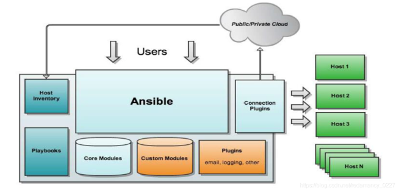
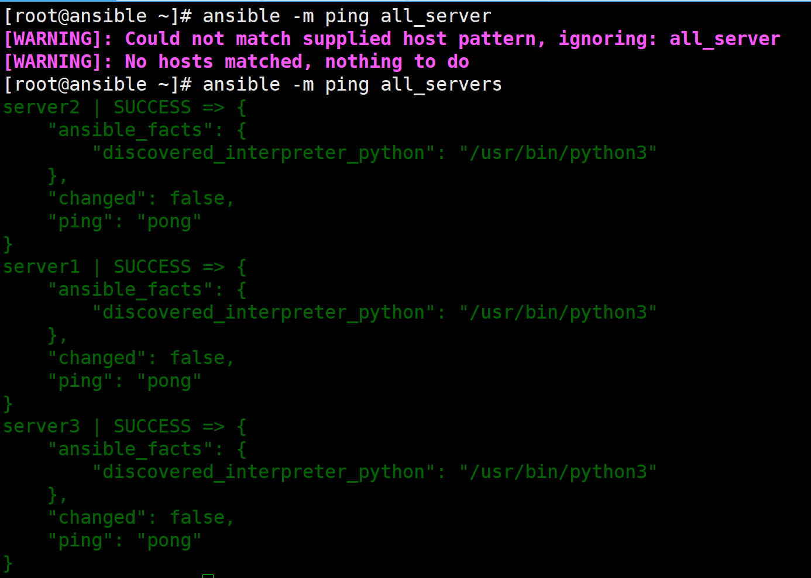
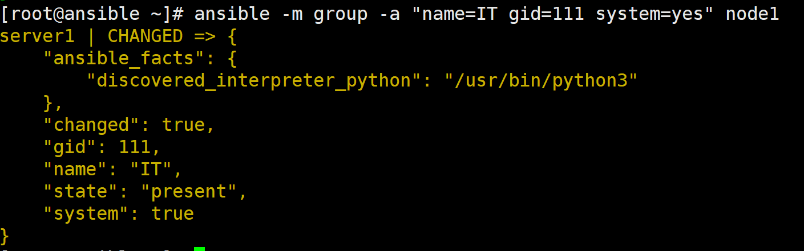
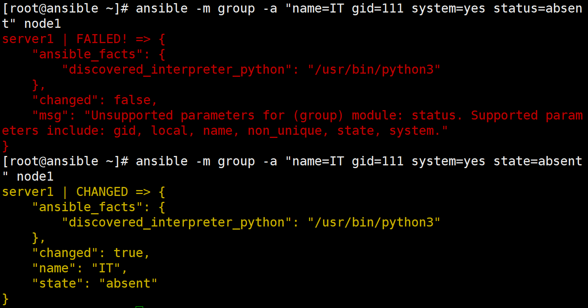
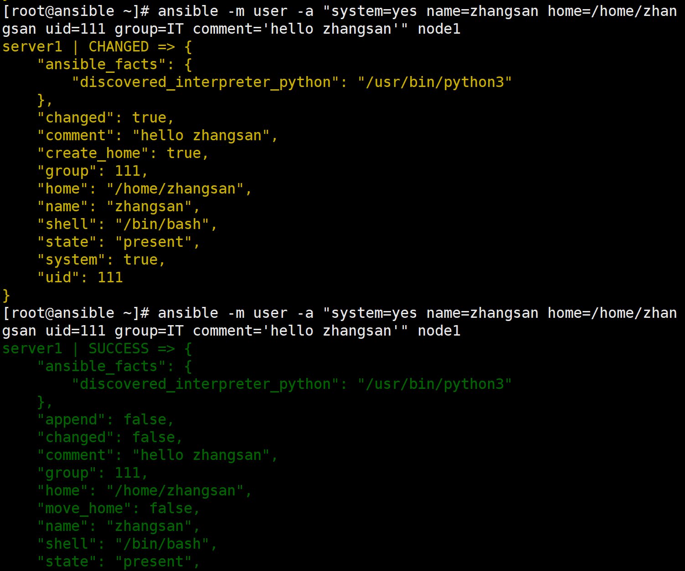
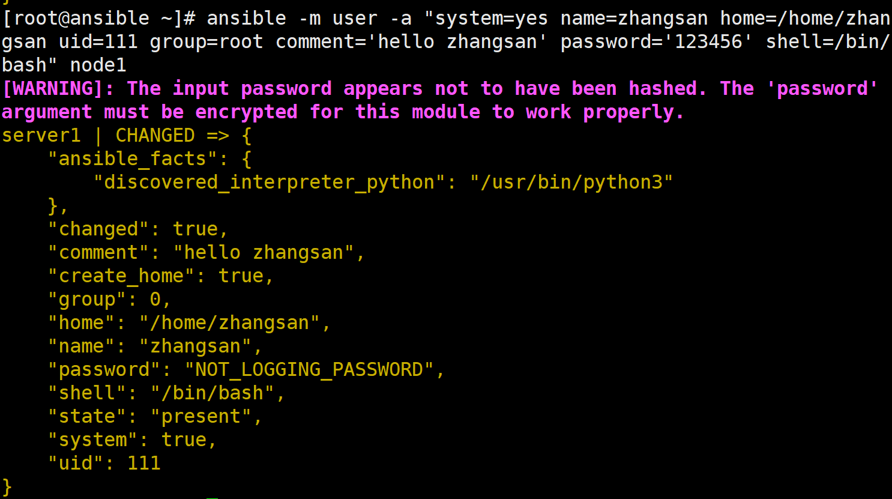
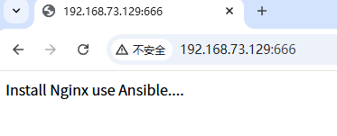
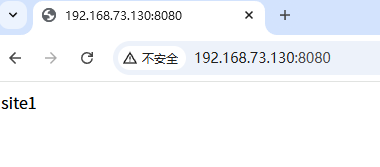

# 1. ansible自动化运维

## 1.1 ansible介绍

- ansible 是一款基于 Python 开发的开源自动化运维工具，专为简化 IT 基础设施管理而设计。它通过 SSH 协议与远程主机通信，无需在目标机器上安装任何代理（Agentless），即可实现批量系统配置、应用部署和任务编排。ansible 使用 YAML 语法编写 Playbook，其学习曲线平缓，非常适合集成到 CI/CD 流程中。

------

### 🎯 核心优势与应用场景

- **核心功能**
  - **系统配置管理**：统一配置服务器环境，如安装软件包、管理用户与权限、分发配置文件等。
  - **应用部署**：自动化部署各类应用，支持从代码拉取、编译到服务启停的完整流程。
  - **任务编排与调度**：按预定顺序在多台主机上执行操作，如滚动更新、灰度发布等。
- **关键特性**
  - **幂等性 (Idempotence)**：任务可重复执行且结果一致，不会因多次运行而产生副作用，是持续部署和集成的理想选择。
  - **无代理架构 (Agentless)**：仅需在控制节点安装 ansible，通过 SSH 连接受控节点，降低了维护成本和安全风险。
  - **模块化设计**：内置海量模块（如文件、包、服务管理），覆盖绝大多数运维场景。同时支持自定义模块，以满足特定需求。
  - **跨平台支持**：兼容 Linux、Windows、网络设备及多种云平台，具有良好的可扩展性。

------

### ⚙️ 工作原理

- ansible 本身是一个自动化框架，其批量能力源于“**Playbook + 模块**”的组合：

  - **Playbook (剧本)**：使用 YAML 语言编写，用于定义要在哪些主机上执行哪些任务，是 ansible 的核心配置文件。

  - **模块 (Module)**：真正执行具体操作的单元。ansible 将模块推送到目标主机执行，执行完毕后即删除，不会在目标端留下任何程序。

- 简单来说，ansible 负责调度和编排，而模块负责完成具体的“动作”。

## 1.2 核心组件



- ansible 的架构由以下几个核心组件构成，它们协同工作，实现了强大的自动化运维能力：

### 🎯 1. ansible 核心程序

- 作为整个系统的“总指挥”，它是一个基于 Python 开发的命令行工具。通过它，用户可以调用各类模块和插件，对主机执行**临时命令 (ad-hoc)** 或运行复杂的 **Playbook** 剧本。

------

### 📋 2. Host Inventory (主机清单)

- 这是一个主机信息数据库，用于定义 ansible 可管理的主机及其连接参数。它通常以文件形式存在（如 `/etc/ansible/hosts`），支持将主机分组管理，并可为不同主机或组设置变量（如 IP、端口、SSH 用户等）。

------

### 📖 3. Playbooks (剧本)

- 采用 YAML 语言编写，是 ansible 实现复杂自动化的核心。它将一系列任务（Task）按预定义的顺序组织起来，并指定在哪些主机上执行。通过 Playbook，可以轻松编排系统配置、应用部署、服务启停等完整流程。

------

### 🧩 4. Modules (模块)

- 模块是真正执行具体操作的“功能单元”。ansible 本身不执行任务，而是将模块推送到目标主机上运行。主要分为两类：

  - **Core Modules (核心模块)**：ansible 自带的大量常用模块，覆盖了文件操作、软件包管理、服务控制、用户管理等绝大多数运维场景。

  - **Custom Modules (自定义模块)**：当核心模块无法满足特定需求时，用户可以使用任意编程语言（如 Python、Shell、Go 等）编写自定义模块来扩展功能。

------

### 🔌 5. Connection Plugins (连接插件)

- 负责 ansible 控制节点与远程主机之间的通信。默认使用 **SSH** 协议，无需在目标主机安装任何代理程序 (Agentless)。此外，也支持 local、paramiko、zeromq 等多种连接方式，以适应不同的网络和安全环境。

## 1.3 任务执行方式

- ansible 的任务执行方式主要分为 **Ad-hoc** 和 **Playbook** 两种模式。

------

### 💻 Ad-hoc 模式 (点对点)

Ad-hoc 模式用于快速、临时地在多台主机上执行单个操作，适合执行简单的运维任务。

- **执行方式**：通过 `ansible`命令直接调用单个模块。
- **特点**：命令即时生效，无需编写文件，但不利于复杂流程的复用和管理。

------

### 📖 Playbook 模式 (剧本)

- Playbook 模式是 ansible 的核心，用于将多个任务、变量、条件判断和模板等组合成一个完整的自动化流程，类似于一个 Shell 脚本。

- **执行方式**：通过 `ansible-playbook`命令执行 YAML 格式的 Playbook 文件。
- **特点**：支持复杂流程编排，可重复执行，易于版本控制和复用，是系统配置、应用部署等场景的主要方式。

------

### ⚙️ 通用执行流程

无论是 Ad-hoc 还是 Playbook，其底层执行步骤基本一致：

1. **读取配置**：加载 `ansible.cfg`文件和主机清单 (Inventory)。
2. **匹配主机**：根据命令行或 Playbook 中指定的模式，确定目标主机列表。
3. **加载模块**：根据任务调用相应的模块（如 `command`, `yum`, `copy`等）。
4. **推送执行**：在控制节点将模块内容生成一个临时的 Python 脚本，通过 SSH 传输到目标主机的临时目录并执行。
5. **返回结果**：目标主机执行完毕后，将结果（成功、失败、变化等）返回给控制节点，并清理临时文件。

## 1.4 特点

**🧩 无代理架构 (Agentless)**

- 被控端无需安装任何服务程序或代理，仅依赖 SSH 等标准协议，极大降低了部署和维护成本。

**🚀 无中心服务器**

- 采用无服务器端设计，在控制节点安装 ansible 后，直接通过命令行即可对目标主机执行操作，简单直接。

**🧱 模块化设计**

- 所有具体操作均由模块 (Module) 完成。ansible 本身作为框架负责调度，其模块可用任意编程语言开发，扩展性强。

**📖 Playbook 编排**

- 使用 YAML 语言编写 Playbook (剧本)，以声明式方式定义任务流程，可读性强，易于复用和版本管理。

**🔗 SSH 通信**

- 默认通过 SSH 协议与远程主机通信，利用现有安全通道，无需额外开放端口，部署和使用都非常便捷。

**🏛️ 支持多级指挥**

- 支持通过主机清单 (Inventory) 对主机进行分组和分层管理，可实现从“组”到“多组”乃至“多层结构”的复杂任务编排。

**🔄 幂等性 (Idempotence)**

- 绝大多数模块具备幂等性，即同一操作重复执行多次，结果与执行一次相同，不会因重复操作而产生副作用，非常适合持续部署和配置管理。

## 1.5 执行过程

- ansible 在 **Ad-hoc 模式**下的典型执行流程，其完整步骤如下：

1. 📄 **加载配置**

   - ansible 启动后，会按以下顺序加载配置文件，后续操作将遵循这些配置：

     - 环境变量 `ANSIBLE_CONFIG`指定的文件

     - 当前目录下的 `./ansible.cfg`

     - 用户家目录下的 `~/.ansible.cfg`

     - 系统默认的 `/etc/ansible/ansible.cfg`

2. 🎯 **解析主机**

   - 根据命令行指定的模式（如主机名、组名），从主机清单文件（默认为 `/etc/ansible/hosts`）中解析出目标主机列表，并准备并发连接。

3. ⚙️ **准备模块**

   - 根据用户指定的模块（如 `command`、`shell`、`copy`等）及其参数，在控制节点准备好模块的代码或参数。对于部分模块，ansible 会将其封装成一个临时的 Python 脚本文件。

4. 📤 **传输脚本**

   - 通过 SSH 连接远程主机，将上一步生成的临时 Python 脚本传输到目标用户的家目录下，路径通常为：
     - `远程用户家目录/.ansible/tmp/ansible-tmp-xxxx/xxx.py`

5. 🔑 **赋权执行**

   - 在远程主机上，为传输过去的临时脚本文件添加可执行权限（`chmod +x`），然后通过 Python 解释器执行该脚本。

6. 📥 **返回结果**

   - 脚本执行完毕后，将其输出结果（如 `changed`、`failed`状态及返回信息）通过 SSH 通道传回控制节点，并呈现在终端上。

7. 🧹 **清理退出**

   - 在远程主机上删除临时脚本文件，断开 SSH 连接，任务结束。整个过程无需在目标主机上安装任何 agent 程序。

# 2. ansible部署

- 安装ansible

```text
[root@ansible ~]# yum install -y epel-release
[root@ansible ~]# yum install -y ansible
```

- **说明：**ansible只是一个工具，不需要启动，安装好以后，直接使用即可。并且只有服务端需要安装，客户端不需要安装....

## 2.1 参数说明

```text
`Inventory 文件参数:
-i 或 --inventory: 指定 Inventory 文件的路径
-l 或 --limit: 限制操作的主机范围
-g 或 --groups: 指定要操作的主机组
`剧本(Playbook)参数:
-p 或 --playbook-dir: 指定 Playbook 所在目录
-e 或 --extra-vars: 传递额外的变量
`任务(Task)参数:
-m 或 --module-name: 指定要使用的模块名称
-a 或 --args: 传递模块的参数
`连接参数:
-c 或 --connection: 指定连接类型,如 ssh、local 等
-u 或 --user: 指定远程连接的用户
`输出参数:
-v 或 --verbose: 增加输出信息的详细程度
--check: 进行一次"试运行",不会实际改变任何状态
--diff: 显示配置文件的改动情况
`其他参数:
-f 或 --forks: 指定并行执行的进程数
-t 或 --tags: 只执行带有指定 tag 的任务
--list-hosts: 列出受管主机
--list-tasks: 列出所有任务
```

## 2.2 快速开始

- **实验环境：**四台Linux虚拟机，HOSTNAME分别为：ansible、server1、server2、server3

- 其中，ansible做为服务端，其他server均作为客户端

- 免密登录

```bash
# 在ansible上修改hosts文件，方便使用主机名管理主机
[root@ansible ~]# vim /etc/hosts
......
192.168.73.129 server1
192.168.73.130 server2
192.168.73.131 server3

# 生成密钥对
[root@ansible ~]# ssh-keygen -P "" -t rsa
Generating public/private rsa key pair.
Enter file in which to save the key (/root/.ssh/id_rsa): 
Your identification has been saved in /root/.ssh/id_rsa
Your public key has been saved in /root/.ssh/id_rsa.pub
The key fingerprint is:
SHA256:dCs/V0Tpb/FdqiiLMiQ/5RYD7t32X2DRZvQGQyevr4E root@ansible
The key's randomart image is:
+---[RSA 3072]----+
|             .B..|
|             +.B |
|        . . ..= +|
|    .  . . . =.+.|
|   . .  S . o oo=|
|  . o +  o . +..=|
|   = + +  o.E.o..|
|    * +.+ .o.. o |
|     =...+... .  |
+----[SHA256]-----+

# 将公钥发送给需要被管理端，以实现免密登录
[root@ansible ~]# ssh-copy-id -i /root/.ssh/id_rsa.pub root@server1
[root@ansible ~]# ssh-copy-id -i /root/.ssh/id_rsa.pub root@server2
[root@ansible ~]# ssh-copy-id -i /root/.ssh/id_rsa.pub root@server3
```

### 2.2.1 常用工具

- ansible：临时命令执行工具，常用于执行临时命令
- ansible-doc：常用于模块功能的查询
- ansible-playbook：用于执行剧本

### 2.2.2 主要配置文件

- /etc/ansible/ansible.cfg：主配置文件
- /etc/ansible/hosts：主机清单文件
- /etc/ansible/roles：角色目录

### 2.2.3 配置主机清单

- 编辑`/etc/ansible/hosts`文件，再最后面添加上被管理端

```bash
[root@ansible ~]# vim /etc/ansible/hosts
......
......
......
## [dbservers]
##
## db01.intranet.mydomain.net
## db02.intranet.mydomain.net
## 10.25.1.56
## 10.25.1.57


# Ex4: Multiple hosts arranged into groups such as 'Debian' and 'openSUSE':

## [Debian]
## alpha.example.org
## beta.example.org

## [openSUSE]
## green.example.com
## blue.example.com

# 定义自己的主机组
[all_servers]
server1
server2
server3

[node1]
server1

[node2]
server2

[node3]
server3
```

- 主配置文件`ansible.cfg`，默认可以不用改

```bash
[root@localhost ~]# vim /etc/ansible/ansible.cfg
[defaults]


# some basic default values...


#inventory      = /etc/ansible/hosts          # 定义主机清单文件
#library        = /usr/share/my_modules/      # 库文件的存放位置
#module_utils   = /usr/share/my_module_utils/           
#remote_tmp     = ~/.ansible/tmp              # 生成的临时py文件在远程主机的目录
#local_tmp      = ~/.ansible/tmp              # 生成的临时py文件在本地主机的目录
#plugin_filters_cfg = /etc/ansible/plugin_filters.yml
#forks          = 5                            # 默认的并发数
#poll_interval  = 15                           # 默认的线程池
#sudo_user      = root                         # 默认的sudo用户
#ask_sudo_pass = True               
#ask_pass      = True
#transport      = smart
#remote_port    = 22
#module_lang    = C
#module_set_locale = False
transport      = smart
在ansible配置中，transport = smart 是指定 ansible 用于远程连接的传输机制。smart 是 ansible 的默认传输选项，它会尝试根据环境自动选择最佳的传输机制。


当 smart 被设置时，ansible 会按照以下顺序尝试不同的传输机制：


如果已经建立了 SSH 连接（例如，通过 SSH Agent 或者在 ansible.cfg 中配置了 SSH 连接参数），则使用 SSH 传输。
如果未建立 SSH 连接，并且目标主机是本地主机，则使用本地传输（即直接在本地执行命令）。
如果未建立 SSH 连接，并且目标主机是远程主机，则使用 Paramiko 传输（基于 Python 的 SSH2 实现）。
通过使用 smart 选项，ansible 可以自动选择合适的传输机制，以确保在不同的环境中都能正常工作。如果您希望显式地指定传输机制，可以将 transport 设置为 ssh、local 或 paramiko，以强制使用相应的传输方式。
```

### 2.2.4 执行状态

- ansible的执行状态

  - 绿色：执行成功并且不需要做改变的操作

  - 黄色：执行成功并且对目标主机做变更

  - 红色：执行失败

  - 粉色：警告信息

  - 蓝色：显示ansible命令执行的过程

## 2.3 常用模块

### 2.3.1 ping模块

- 测试与主机的连通性

- 示例：

```bash
[root@ansible ~]# ansible -m ping all_servers
server2 | SUCCESS => {
    "ansible_facts": {
        "discovered_interpreter_python": "/usr/bin/python3"
    },
    "changed": false,
    "ping": "pong"
}
server1 | SUCCESS => {
    "ansible_facts": {
        "discovered_interpreter_python": "/usr/bin/python3"
    },
    "changed": false,
    "ping": "pong"
}
server3 | SUCCESS => {
    "ansible_facts": {
        "discovered_interpreter_python": "/usr/bin/python3"
    },
    "changed": false,
    "ping": "pong"
}

# 也可以单独ping某个节点，这是因为上面的主机清单里配置了各个节点以及all_servers
[root@ansible ~]# ansible -m ping node1
server1 | SUCCESS => {
    "ansible_facts": {
        "discovered_interpreter_python": "/usr/bin/python3"
    },
    "changed": false,
    "ping": "pong"
}


# 返回说明：
"SUCCESS" 表示 ansible 成功执行了任务，没有遇到错误。
"ansible_facts" 是一个包含 ansible 任务执行期间收集到的事实（facts）的字典。
"discovered_interpreter_python" 是一个收集到的事实，它指示目标主机上的 Python 解释器的路径为 /usr/bin/python。这对于后续的 ansible 任务可能需要使用 Python 的情况很有用。
"changed" 表示 ansible 是否对目标主机进行了更改。在这种情况下，值为 false 表示没有进行任何更改。
"ping" 是一个简单的回应，用于测试与目标主机的连通性。如果值为 "pong"，表示与目标主机的连接正常。
```



### 2.3.2 Group模块

- 用户创建和修改用户组

- 示例：对node1主机组的成员创建一个IT组，组ID为111

```bash
[root@ansible ~]# ansible-doc -s group
action: group      
gid       # 设置组的GID号      
name=     # 管理组的名称      
state     # 指定组状态，默认为创建，设置值为absent为删除      
system    # 设置值为yes，表示为创建系统组

[root@ansible ~]# ansible -m group -a "name=IT gid=111 system=yes" node1
server1 | CHANGED => {
    "ansible_facts": {
        "discovered_interpreter_python": "/usr/bin/python3"
    },
    "changed": true,
    "gid": 111,
    "name": "IT",
    "state": "present",
    "system": true
}

# 看到node1上确实添加了gid为111的IT组
[root@node1 ~]# tail /etc/group
systemd-journal:x:190:
systemd-coredump:x:997:
dbus:x:81:
ssh_keys:x:101:
tss:x:59:
sssd:x:996:
sshd:x:74:
chrony:x:995:
sgx:x:994:
IT:x:111:

# 也可以对这个组做一些变化
[root@ansible ~]# ansible -m group -a "name=IT gid=111 system=yes state=absent" node1
server1 | CHANGED => {
    "ansible_facts": {
        "discovered_interpreter_python": "/usr/bin/python3"
    },
    "changed": true,
    "name": "IT",
    "state": "absent"
}
[root@node1 ~]# tail /etc/group
render:x:998:
systemd-journal:x:190:
systemd-coredump:x:997:
dbus:x:81:
ssh_keys:x:101:
tss:x:59:
sssd:x:996:
sshd:x:74:
chrony:x:995:
sgx:x:994:
```





### 2.3.3 User模块

- 用于对用户的创建，修改和删除等操作

```bash
# 查看某个模块的具体用法
[root@ansible ~]# ansible-doc -l | wc -l
7736	# #共有7736个模块
[root@ansible ~]# ansible-doc -s user
comment    # 用户的描述信息 
 createhom  # 是否创建家目录
 force      # 在使用`state=absent'是, 行为与`userdel ‐‐force'一致.  
 group      # 指定基本组  
 groups     # 指定附加组，如果指定为('groups=')表示删除所有组  
 home       # 指定用户家目录 
 name              # 指定用户名
 password        # 指定用户密码 
 remove          # 在使用 `state=absent'时, 行为是与 `userdel ‐‐remove'一致.
 shell           # 指定默认shell 
 state           #设置帐号状态，不指定为创建，指定值为absent表示删除
 system          # 当创建一个用户，设置这个用户是系统用户。这个设置不能更改现有用户
 uid             #指定用户的uid     
 update_password  # 更新用户密码
 expires         #指明密码的过期时间
 ......
```

- 示例：在主机组node1上创建一个系统用户张三，家目录为/home/zhangsan，uid为111，附加组为IT，以及给一个注释

```bash
[root@ansible ~]# ansible -m user -a "system=yes name=zhangsan home=/home/zhangsan uid=111 group=IT comment='hello zhangsan'" node1
server1 | CHANGED => {
    "ansible_facts": {
        "discovered_interpreter_python": "/usr/bin/python3"
    },
    "changed": true,
    "comment": "hello zhangsan",
    "create_home": true,
    "group": 111,
    "home": "/home/zhangsan",
    "name": "zhangsan",
    "shell": "/bin/bash",
    "state": "present",
    "system": true,
    "uid": 111
}

[root@node1 ~]# id zhangsan
uid=111(zhangsan) gid=111(IT) groups=111(IT)


# 删除用户及家目录
[root@ansible ~]# ansible -m user -a "name=zhangsan state=absent remove=yes" node1
server1 | CHANGED => {
    "ansible_facts": {
        "discovered_interpreter_python": "/usr/bin/python3"
    },
    "changed": true,
    "force": false,
    "name": "zhangsan",
    "remove": true,
    "state": "absent",
    "stderr": "userdel: zhangsan mail spool (/var/spool/mail/zhangsan) not found\n",
    "stderr_lines": [
        "userdel: zhangsan mail spool (/var/spool/mail/zhangsan) not found"
    ]
}

[root@node1 ~]# id zhangsan
id: ‘zhangsan’: no such user


# 添加系统用户，指定uid、家目录、主组及注释、密码
[root@ansible ~]# ansible -m user -a "system=yes name=zhangsan home=/home/zhangsan uid=111 group=root comment='hello zhangsan' password='123456' shell=/bin/bash" node1
[WARNING]: The input password appears not to have been hashed. The 'password'
argument must be encrypted for this module to work properly.
server1 | CHANGED => {
    "ansible_facts": {
        "discovered_interpreter_python": "/usr/bin/python3"
    },
    "changed": true,
    "comment": "hello zhangsan",
    "create_home": true,
    "group": 0,
    "home": "/home/zhangsan",
    "name": "zhangsan",
    "password": "NOT_LOGGING_PASSWORD",
    "shell": "/bin/bash",
    "state": "present",
    "system": true,
    "uid": 111
}
[root@node1 ~]# id zhangsan
uid=111(zhangsan) gid=0(root) groups=0(root)
```

- 重复命令不会有报错，`change`以及`append`字段变成了false，并且信息是绿色的





### 2.3.4 Command模块

- command模块是ansible默认使用的模块。不支持管道，变量及重定向等
- **适用场景**：执行简单的、参数固定的命令，如 `ls`, `systemctl status nginx`, `mkdir /tmp/test`。

- 示例：

```bash
# 查看command相关选项
[root@ansible ~]# ansible-doc ‐s command
......
......
[root@ansible ~]# ansible -a "touch /root/ansibe.txt" all_servers
server2 | CHANGED | rc=0 >>

server1 | CHANGED | rc=0 >>

server3 | CHANGED | rc=0 >>

[root@node1 ~]# ls
anaconda-ks.cfg  ansibe.txt
[root@node2 ~]# ls
anaconda-ks.cfg  ansibe.txt
[root@node3 ~]# ls
anaconda-ks.cfg  ansibe.txt

[root@ansible ~]# ansible -a "find / -name ens160.*" all_servers
server3 | CHANGED | rc=0 >>
/etc/NetworkManager/system-connections/ens160.nmconnection
server2 | CHANGED | rc=0 >>
/etc/NetworkManager/system-connections/ens160.nmconnection
server1 | CHANGED | rc=0 >>
/etc/NetworkManager/system-connections/ens160.nmconnection

[root@ansible ~]# ansible -a "ls" all_servers
server2 | CHANGED | rc=0 >>
anaconda-ks.cfg
ansibe.txt
node2.txt
server3 | CHANGED | rc=0 >>
anaconda-ks.cfg
ansibe.txt
node3.txt
server1 | CHANGED | rc=0 >>
anaconda-ks.cfg
ansibe.txt
node1.txt
```

### 2.3.5 Shell模块

- 在远程主机上执行bash命令，相对于command而言，支持性更好一点，但是对于某些复杂的命令，也可能会执行失败

- 解决方法：可以到脚本中把命令卸载，使用script模块执行脚本到远程主机
- **适用场景**：执行包含复杂逻辑的单行命令，如 `ps aux | grep nginx | wc -l`或 `df -h | grep /dev/sda1`。

```bash
[root@ansible ~]# ansible -m shell -a "hostname" all_servers
server2 | CHANGED | rc=0 >>
node2
server1 | CHANGED | rc=0 >>
node1
server3 | CHANGED | rc=0 >>
node3
```

### 2.3.6 Script模块

- 可以发送shell脚本到远程主机上并执行
- **适用场景**：在多台主机上运行统一的、逻辑复杂的脚本，如系统初始化、批量部署等。

- 示例：

```bash
[root@ansible ~]# vim test.bash
#!/bin/bash
for i in `seq 5`
do
	touch /root/test_${i}.txt
done

# script模块
[root@ansible ~]# ansible -m script -a "/root/test.sh" node2
server2 | CHANGED => {
    "changed": true,
    "rc": 0,
    "stderr": "Shared connection to server2 closed.\r\n",
    "stderr_lines": [
        "Shared connection to server2 closed."
    ],
    "stdout": "",
    "stdout_lines": []
}

# server2验证
[root@node2 ~]# ls
anaconda-ks.cfg  node2.txt   test_2.txt  test_4.txt
ansibe.txt       test_1.txt  test_3.txt  test_5.txt
```

### 2.3.7 Copy模块

- 用于将文件或目录从**控制节点（本地）**推送到**远程主机**，是分发配置文件、脚本和静态资源的常用模块。

- 参数解释：

```text
[root@ansible ~]# ansible-doc -s copy
backup：在覆盖之前，将源文件备份，备份文件包含时间信息。      
content：用于替代“src”，可以直接设定指定文件的值      
dest：必选项。要将源文件复制到的远程主机的绝对路径      
directory_mode：递归设定目录的权限，默认为系统默认权限      
force：强制覆盖目的文件内容，默认为yes      
others：所有的file模块里的选项都可以在这里使用      
src：被复制到远程主机的本地文件，可以是绝对路径，也可以是相对路径。如果路径是一个目录，它将递归复制


ansible -m copy -a "src=/本地文件 dest=/远程文件" nodes
```

示例：

- 在创建文件时修改文件的属主和属组信息

```bash
[root@ansible ~]# ansible -m copy -a "src=/root/test.sh dest=/root/test1 owner=zhangsan group=IT" node1
server1 | CHANGED => {
    "ansible_facts": {
        "discovered_interpreter_python": "/usr/bin/python3"
    },
    "changed": true,
    "checksum": "6d064543be42b7e4be1582cf0324bf82437b1f5e",
    "dest": "/root/test1",
    "gid": 111,
    "group": "IT",
    "md5sum": "83e7365f433d6c77a0e2544edce01d3c",
    "mode": "0644",
    "owner": "zhangsan",
    "secontext": "system_u:object_r:admin_home_t:s0",
    "size": 64,
    "src": "/root/.ansible/tmp/ansible-tmp-1773933276.04377-1414-193319135402279/source",
    "state": "file",
    "uid": 111
}
[root@node1 ~]# ll
total 8
-rw-------. 1 root     root 907 Jan 17 17:42 anaconda-ks.cfg
-rw-r--r--. 1 root     root   0 Mar 18 21:06 ansibe.txt
-rw-r--r--. 1 root     root   0 Mar 18 21:18 node1.txt
-rw-r--r--. 1 zhangsan IT    64 Mar 19 23:14 test1
```

- 在传输文件时修改文件的权限信息，并且备份远程主机文件

```bash
# 如果要传过去的也叫做test1，需要先修改一下要覆盖的文件内容，如果与之前的内容一样是不会备份的
[root@ansible ~]# cat test.sh
#!/bin/bash
for i in `seq 5`
do
	touch /root/test_${i}.txt
done
# hahaha

# 然后再执行ansible命令
[root@ansible ~]# ansible -m copy -a "src=/root/test.sh dest=/root/test1 backup=yes mode=777" node1
server1 | CHANGED => {
    "ansible_facts": {
        "discovered_interpreter_python": "/usr/bin/python3"
    },
    "backup_file": "/root/test1.2006.2026-03-19@23:22:19~",	# 备份文件路径
    "changed": true,
    "checksum": "49a426bca8feeaa4bc433a0e498b8f90cb1a9389",
    "dest": "/root/test1",
    "gid": 111,
    "group": "IT",
    "md5sum": "90674a46bf301d63853add905797ff63",
    "mode": "0777",
    "owner": "zhangsan",
    "secontext": "system_u:object_r:admin_home_t:s0",
    "size": 73,
    "src": "/root/.ansible/tmp/ansible-tmp-1773933737.6958635-1459-26029401486991/source",
    "state": "file",
    "uid": 111
}

[root@node1 ~]# ll
total 12
-rw-------. 1 root     root 907 Jan 17 17:42 anaconda-ks.cfg
-rw-r--r--. 1 root     root   0 Mar 18 21:06 ansibe.txt
-rw-r--r--. 1 root     root   0 Mar 18 21:18 node1.txt
-rwxrwxrwx. 1 zhangsan IT    73 Mar 19 23:22 test1
-rw-r--r--. 1 zhangsan IT    64 Mar 19 23:14 test1.2006.2026-03-19@23:22:19~
```

- 创建一个文件并直接编辑文件

```bash
[root@ansible ~]# ansible -m copy -a "content='hello ansible\n' dest=/root/test3" node1
server1 | CHANGED => {
    "ansible_facts": {
        "discovered_interpreter_python": "/usr/bin/python3"
    },
    "changed": true,
    "checksum": "df800445bb74b4abb144b3f9bf03f90aa9618f4c",
    "dest": "/root/test3",
    "gid": 0,
    "group": "root",
    "md5sum": "f61d358bbdd6a9bd2e93322023a4e29d",
    "mode": "0644",
    "owner": "root",
    "secontext": "system_u:object_r:admin_home_t:s0",
    "size": 14,
    "src": "/root/.ansible/tmp/ansible-tmp-1773933940.754658-1487-269501440297897/source",
    "state": "file",
    "uid": 0
}

[root@node1 ~]# ll
total 16
-rw-------. 1 root     root 907 Jan 17 17:42 anaconda-ks.cfg
-rw-r--r--. 1 root     root   0 Mar 18 21:06 ansibe.txt
-rw-r--r--. 1 root     root   0 Mar 18 21:18 node1.txt
-rwxrwxrwx. 1 zhangsan IT    73 Mar 19 23:22 test1
-rw-r--r--. 1 zhangsan IT    64 Mar 19 23:14 test1.2006.2026-03-19@23:22:19~
-rw-r--r--. 1 root     root  14 Mar 19 23:25 test3
[root@node1 ~]# cat test3
hello ansible
```

### 2.3.8 File模块

- 用于对文件进行相关操作

- 参数解释：

```text
[root@ansible ~]# ansible‐doc ‐s file  
‐ name: Sets attributes of files    
    force：需要在两种情况下强制创建软链接，一种是源文件不存在，但之后会建立的情况下；另一种是目标软链接已存在，需要先取消之前的软链，然后创建新的软链，有两个选项：yes|no      
    group：定义文件/目录的属组      
    mode：定义文件/目录的权限      
    owner：定义文件/目录的属主      
    path：必选项，定义文件/目录的路径      
    recurse：递归设置文件的属性，只对目录有效      
    src：被链接的源文件路径，只应用于state=link的情况      
    dest：被链接到的路径，只应用于state=link的情况      
  state：   
    absent: 删除文件
    directory：如果目录不存在，就创建目录         
    file：验证文件是否存在，即使文件不存在，也不会被创建         
    link：创建软链接         
    hard：创建硬链接         
    touch：如果文件不存在，则会创建一个新的文件，如果文件或目录已存在，则更新其后修改时间
```

示例：

- 创建目录

```bash
[root@ansible ~]# ansible -m file -a "name=test1 owner=root group=root mode=664 state=directory" node1
server1 | CHANGED => {
    "ansible_facts": {
        "discovered_interpreter_python": "/usr/bin/python3"
    },
    "changed": true,
    "gid": 0,
    "group": "root",
    "mode": "0664",
    "owner": "root",
    "path": "test1",
    "secontext": "unconfined_u:object_r:admin_home_t:s0",
    "size": 6,
    "state": "directory",
    "uid": 0
}
[root@node1 ~]# ll
total 12
-rw-------. 1 root     root 907 Jan 17 17:42 anaconda-ks.cfg
-rw-r--r--. 1 root     root   0 Mar 18 21:06 ansibe.txt
-rw-r--r--. 1 root     root   0 Mar 18 21:18 node1.txt
drw-rw-r--. 2 root     root   6 Mar 19 23:28 test1
-rw-r--r--. 1 zhangsan IT    64 Mar 19 23:14 test1.2006.2026-03-19@23:22:19~
-rw-r--r--. 1 root     root  14 Mar 19 23:25 test3
```

- 创建文件

```bash
[root@ansible ~]# ansible -m file -a "path=/root/test2 owner=root group=root mode=644 state=touch" node1
server1 | CHANGED => {
    "ansible_facts": {
        "discovered_interpreter_python": "/usr/bin/python3"
    },
    "changed": true,
    "dest": "/root/test2",
    "gid": 0,
    "group": "root",
    "mode": "0644",
    "owner": "root",
    "secontext": "unconfined_u:object_r:admin_home_t:s0",
    "size": 0,
    "state": "file",
    "uid": 0
}
[root@node1 ~]# ll
total 12
-rw-------. 1 root     root 907 Jan 17 17:42 anaconda-ks.cfg
-rw-r--r--. 1 root     root   0 Mar 18 21:06 ansibe.txt
-rw-r--r--. 1 root     root   0 Mar 18 21:18 node1.txt
drw-rw-r--. 2 root     root   6 Mar 19 23:28 test1
-rw-r--r--. 1 zhangsan IT    64 Mar 19 23:14 test1.2006.2026-03-19@23:22:19~
-rw-r--r--. 1 root     root   0 Mar 19 23:30 test2
-rw-r--r--. 1 root     root  14 Mar 19 23:25 test3
```

- 删除文件/目录

```bash
[root@ansible ~]# ansible -m file -a "path=/root/test2 state=absent" node1
server1 | CHANGED => {
    "ansible_facts": {
        "discovered_interpreter_python": "/usr/bin/python3"
    },
    "changed": true,
    "path": "/root/test2",
    "state": "absent"
}
[root@node1 ~]# ll
total 12
-rw-------. 1 root     root 907 Jan 17 17:42 anaconda-ks.cfg
-rw-r--r--. 1 root     root   0 Mar 18 21:06 ansibe.txt
-rw-r--r--. 1 root     root   0 Mar 18 21:18 node1.txt
drw-rw-r--. 2 root     root   6 Mar 19 23:28 test1
-rw-r--r--. 1 zhangsan IT    64 Mar 19 23:14 test1.2006.2026-03-19@23:22:19~
-rw-r--r--. 1 root     root  14 Mar 19 23:25 test3
```

- 创建软链接文件

```bash
[root@ansible ~]# ansible -m file -a "src=/root/test1 dest=/root/test2 state=link" node1
server1 | CHANGED => {
    "ansible_facts": {
        "discovered_interpreter_python": "/usr/bin/python3"
    },
    "changed": true,
    "dest": "/root/test2",
    "gid": 0,
    "group": "root",
    "mode": "0777",
    "owner": "root",
    "secontext": "unconfined_u:object_r:admin_home_t:s0",
    "size": 11,
    "src": "/root/test1",
    "state": "link",
    "uid": 0
}
[root@node1 ~]# ll
total 12
-rw-------. 1 root     root 907 Jan 17 17:42 anaconda-ks.cfg
-rw-r--r--. 1 root     root   0 Mar 18 21:06 ansibe.txt
-rw-r--r--. 1 root     root   0 Mar 18 21:18 node1.txt
drw-rw-r--. 2 root     root   6 Mar 19 23:28 test1
-rw-r--r--. 1 zhangsan IT    64 Mar 19 23:14 test1.2006.2026-03-19@23:22:19~
lrwxrwxrwx. 1 root     root  11 Mar 19 23:34 test2 -> /root/test1
-rw-r--r--. 1 root     root  14 Mar 19 23:25 test3
```

- 创建硬链接文件

```bash
[root@ansible ~]# ansible -m file -a "src=/root/test3 dest=/root/test4 state=hard" node1
server1 | CHANGED => {
    "ansible_facts": {
        "discovered_interpreter_python": "/usr/bin/python3"
    },
    "changed": true,
    "dest": "/root/test4",
    "gid": 0,
    "group": "root",
    "mode": "0644",
    "owner": "root",
    "secontext": "system_u:object_r:admin_home_t:s0",
    "size": 14,
    "src": "/root/test3",
    "state": "hard",
    "uid": 0
}
[root@node1 ~]# ll
total 16
-rw-------. 1 root     root 907 Jan 17 17:42 anaconda-ks.cfg
-rw-r--r--. 1 root     root   0 Mar 18 21:06 ansibe.txt
-rw-r--r--. 1 root     root   0 Mar 18 21:18 node1.txt
drw-rw-r--. 2 root     root   6 Mar 19 23:28 test1
-rw-r--r--. 1 zhangsan IT    64 Mar 19 23:14 test1.2006.2026-03-19@23:22:19~
lrwxrwxrwx. 1 root     root  11 Mar 19 23:34 test2 -> /root/test1
-rw-r--r--. 2 root     root  14 Mar 19 23:25 test3
-rw-r--r--. 2 root     root  14 Mar 19 23:25 test4
```

### 2.3.9 Yum模块

- 用于远程操作主机下载软件包

- 参数说明：

```text
[root@ansible ~]# ansible‐doc ‐s yum  
    conf_file           #设定远程yum安装时所依赖的配置文件。如配置文件没有在默认的位置。 
    disable_gpg_check   #是否禁止GPG checking，只用于`present' or `latest'。 
    disablerepo         #临时禁止使用yum库。 只用于安装或更新时。      
    enablerepo          #临时使用的yum库。只用于安装或更新时。      
    name=               #所安装的包的名称      
    state               #present安装， latest安装最新的, absent 卸载软件。      
    update_cache        #强制更新yum的缓存
```

- 示例：

```bash
[root@ansible ~]# ansible -m yum -a "name=httpd state=latest" node3
server3 | CHANGED => {
    "ansible_facts": {
        "discovered_interpreter_python": "/usr/bin/python3"
    },
    "changed": true,
    "msg": "",
    "rc": 0,
    "results": [
        "Installed: httpd-2.4.62-7.el9_7.3.x86_64",
        "Installed: apr-util-openssl-1.6.1-23.el9.x86_64",
        "Installed: httpd-core-2.4.62-7.el9_7.3.x86_64",
        "Installed: mod_http2-2.0.26-5.el9.x86_64",
        "Installed: httpd-filesystem-2.4.62-7.el9_7.3.noarch",
        "Installed: rocky-logos-httpd-90.16-1.el9.noarch",
        "Installed: mod_lua-2.4.62-7.el9_7.3.x86_64",
        "Installed: httpd-tools-2.4.62-7.el9_7.3.x86_64",
        "Installed: apr-1.7.0-12.el9_3.x86_64",
        "Installed: apr-util-1.6.1-23.el9.x86_64",
        "Installed: mailcap-2.1.49-5.el9.0.2.noarch",
        "Installed: apr-util-bdb-1.6.1-23.el9.x86_64"
    ]
}
# node3上已经有apache相关配置文件了
[root@node3 ~]# cd /etc/httpd
[root@node3 httpd]# 
```

### 2.3.10 Service模块

- 用于远程管理主机上的service服务类

- 参数说明：

```text
[root@ansible ~]# ansible-doc -s service
> SERVICE    (/usr/lib/python2.7/site‐packages/ansible/modules/system/service.py) 
        Controls services on remote hosts. Supported init systems include BSD init, OpenRC,  SysV, Solaris          
        SMF, systemd, upstart. For Windows targets, use the [win_service] module instead. 
  * note: This module has a corresponding action plugin.
  ......
  ......
  arguments     #命令行提供额外的参数      
  enabled       #设置开机启动，可以设置为yes或者no。      
  name=         #服务名称      
  runlevel      #开机启动的级别，一般不用指定。      
  sleep         #在重启服务的过程中，是否等待。如在服务关闭以后等待2秒再启动。      
  state         #started启动服务， stopped停止服务， restarted重启服务， reloaded重载配置
```

- 示例：

```bash
[root@ansible ~]# ansible -m service -a "name=httpd state=started" node3
server3 | CHANGED => {
    "ansible_facts": {
        "discovered_interpreter_python": "/usr/bin/python3"
    },
    "changed": true,
    "name": "httpd",
    "state": "started",
    "status": {
        "AccessSELinuxContext": "system_u:object_r:httpd_unit_file_t:s0",
        "ActiveEnterTimestampMonotonic": "0",
        "ActiveExitTimestampMonotonic": "0",
        "ActiveState": "inactive",
        "After": "-.mount systemd-journald.socket sysinit.target basic.target nss-lookup.target system.slice httpd-init.service tmp.mount systemd-tmpfiles-setup.service network.target remote-fs.target",
        "AllowIsolate": "no",
        "AssertResult": "no",
        "AssertTimestampMonotonic": "0",
        "Before": "shutdown.target",
        "BlockIOAccounting": "no",
        "BlockIOWeight": "[not set]",
        "CPUAccounting": "yes",
        "CPUAffinityFromNUMA": "no",
        "CPUQuotaPerSecUSec": "infinity",
        "CPUQuotaPeriodUSec": "infinity",
        "CPUSchedulingPolicy": "0",
        "CPUSchedulingPriority": "0",
        "CPUSchedulingResetOnFork": "no",
        "CPUShares": "[not set]",
        "CPUUsageNSec": "[not set]",
        "CPUWeight": "[not set]",
        "CacheDirectoryMode": "0755",
        "CanFreeze": "yes",
        "CanIsolate": "no",
        "CanReload": "yes",
        "CanStart": "yes",
        "CanStop": "yes",
        "CapabilityBoundingSet": "cap_chown cap_dac_override cap_dac_read_search cap_fowner cap_fsetid cap_kill cap_setgid cap_setuid cap_setpcap cap_linux_immutable cap_net_bind_service cap_net_broadcast cap_net_admin cap_net_raw cap_ipc_lock cap_ipc_owner cap_sys_module cap_sys_rawio cap_sys_chroot cap_sys_ptrace cap_sys_pacct cap_sys_admin cap_sys_boot cap_sys_nice cap_sys_resource cap_sys_time cap_sys_tty_config cap_mknod cap_lease cap_audit_write cap_audit_control cap_setfcap cap_mac_override cap_mac_admin cap_syslog cap_wake_alarm cap_block_suspend cap_audit_read cap_perfmon cap_bpf cap_checkpoint_restore",
        "CleanResult": "success",
        "CollectMode": "inactive",
        "ConditionResult": "no",
        "ConditionTimestampMonotonic": "0",
        "ConfigurationDirectoryMode": "0755",
        "Conflicts": "shutdown.target",
        "ControlGroupId": "0",
        "ControlPID": "0",
        "CoredumpFilter": "0x33",
        "DefaultDependencies": "yes",
        "DefaultMemoryLow": "0",
        "DefaultMemoryMin": "0",
        "Delegate": "no",
        "Description": "The Apache HTTP Server",
        "DevicePolicy": "auto",
        "Documentation": "\"man:httpd.service(8)\"",
        "DynamicUser": "no",
        "Environment": "LANG=C",
        "ExecMainCode": "0",
        "ExecMainExitTimestampMonotonic": "0",
        "ExecMainPID": "0",
        "ExecMainStartTimestampMonotonic": "0",
        "ExecMainStatus": "0",
        "ExecReload": "{ path=/usr/sbin/httpd ; argv[]=/usr/sbin/httpd $OPTIONS -k graceful ; ignore_errors=no ; start_time=[n/a] ; stop_time=[n/a] ; pid=0 ; code=(null) ; status=0/0 }",
        "ExecReloadEx": "{ path=/usr/sbin/httpd ; argv[]=/usr/sbin/httpd $OPTIONS -k graceful ; flags= ; start_time=[n/a] ; stop_time=[n/a] ; pid=0 ; code=(null) ; status=0/0 }",
        "ExecStart": "{ path=/usr/sbin/httpd ; argv[]=/usr/sbin/httpd $OPTIONS -DFOREGROUND ; ignore_errors=no ; start_time=[n/a] ; stop_time=[n/a] ; pid=0 ; code=(null) ; status=0/0 }",
        "ExecStartEx": "{ path=/usr/sbin/httpd ; argv[]=/usr/sbin/httpd $OPTIONS -DFOREGROUND ; flags= ; start_time=[n/a] ; stop_time=[n/a] ; pid=0 ; code=(null) ; status=0/0 }",
        "ExitType": "main",
        "FailureAction": "none",
        "FileDescriptorStoreMax": "0",
        "FinalKillSignal": "9",
        "FragmentPath": "/usr/lib/systemd/system/httpd.service",
        "FreezerState": "running",
        "GID": "[not set]",
        "GuessMainPID": "yes",
        "IOAccounting": "no",
        "IOReadBytes": "18446744073709551615",
        "IOReadOperations": "18446744073709551615",
        "IOSchedulingClass": "2",
        "IOSchedulingPriority": "4",
        "IOWeight": "[not set]",
        "IOWriteBytes": "18446744073709551615",
        "IOWriteOperations": "18446744073709551615",
        "IPAccounting": "no",
        "IPEgressBytes": "[no data]",
        "IPEgressPackets": "[no data]",
        "IPIngressBytes": "[no data]",
        "IPIngressPackets": "[no data]",
        "Id": "httpd.service",
        "IgnoreOnIsolate": "no",
        "IgnoreSIGPIPE": "yes",
        "InactiveEnterTimestampMonotonic": "0",
        "InactiveExitTimestampMonotonic": "0",
        "JobRunningTimeoutUSec": "infinity",
        "JobTimeoutAction": "none",
        "JobTimeoutUSec": "infinity",
        "KeyringMode": "private",
        "KillMode": "mixed",
        "KillSignal": "28",
        "LimitAS": "infinity",
        "LimitASSoft": "infinity",
        "LimitCORE": "infinity",
        "LimitCORESoft": "0",
        "LimitCPU": "infinity",
        "LimitCPUSoft": "infinity",
        "LimitDATA": "infinity",
        "LimitDATASoft": "infinity",
        "LimitFSIZE": "infinity",
        "LimitFSIZESoft": "infinity",
        "LimitLOCKS": "infinity",
        "LimitLOCKSSoft": "infinity",
        "LimitMEMLOCK": "8388608",
        "LimitMEMLOCKSoft": "8388608",
        "LimitMSGQUEUE": "819200",
        "LimitMSGQUEUESoft": "819200",
        "LimitNICE": "0",
        "LimitNICESoft": "0",
        "LimitNOFILE": "524288",
        "LimitNOFILESoft": "1024",
        "LimitNPROC": "14345",
        "LimitNPROCSoft": "14345",
        "LimitRSS": "infinity",
        "LimitRSSSoft": "infinity",
        "LimitRTPRIO": "0",
        "LimitRTPRIOSoft": "0",
        "LimitRTTIME": "infinity",
        "LimitRTTIMESoft": "infinity",
        "LimitSIGPENDING": "14345",
        "LimitSIGPENDINGSoft": "14345",
        "LimitSTACK": "infinity",
        "LimitSTACKSoft": "8388608",
        "LoadState": "loaded",
        "LockPersonality": "no",
        "LogLevelMax": "-1",
        "LogRateLimitBurst": "0",
        "LogRateLimitIntervalUSec": "0",
        "LogsDirectoryMode": "0755",
        "MainPID": "0",
        "ManagedOOMMemoryPressure": "auto",
        "ManagedOOMMemoryPressureLimit": "0",
        "ManagedOOMPreference": "none",
        "ManagedOOMSwap": "auto",
        "MemoryAccounting": "yes",
        "MemoryAvailable": "infinity",
        "MemoryCurrent": "[not set]",
        "MemoryDenyWriteExecute": "no",
        "MemoryHigh": "infinity",
        "MemoryLimit": "infinity",
        "MemoryLow": "0",
        "MemoryMax": "infinity",
        "MemoryMin": "0",
        "MemorySwapMax": "infinity",
        "MountAPIVFS": "no",
        "NFileDescriptorStore": "0",
        "NRestarts": "0",
        "NUMAPolicy": "n/a",
        "Names": "httpd.service",
        "NeedDaemonReload": "no",
        "Nice": "0",
        "NoNewPrivileges": "no",
        "NonBlocking": "no",
        "NotifyAccess": "main",
        "OOMPolicy": "continue",
        "OOMScoreAdjust": "0",
        "OnFailureJobMode": "replace",
        "OnSuccessJobMode": "fail",
        "Perpetual": "no",
        "PrivateDevices": "no",
        "PrivateIPC": "no",
        "PrivateMounts": "no",
        "PrivateNetwork": "no",
        "PrivateTmp": "yes",
        "PrivateUsers": "no",
        "ProcSubset": "all",
        "ProtectClock": "no",
        "ProtectControlGroups": "no",
        "ProtectHome": "no",
        "ProtectHostname": "no",
        "ProtectKernelLogs": "no",
        "ProtectKernelModules": "no",
        "ProtectKernelTunables": "no",
        "ProtectProc": "default",
        "ProtectSystem": "no",
        "RefuseManualStart": "no",
        "RefuseManualStop": "no",
        "ReloadResult": "success",
        "ReloadSignal": "1",
        "RemainAfterExit": "no",
        "RemoveIPC": "no",
        "Requires": "sysinit.target -.mount system.slice",
        "RequiresMountsFor": "/var/tmp",
        "Restart": "no",
        "RestartKillSignal": "28",
        "RestartUSec": "100ms",
        "RestrictNamespaces": "no",
        "RestrictRealtime": "no",
        "RestrictSUIDSGID": "no",
        "Result": "success",
        "RootDirectoryStartOnly": "no",
        "RuntimeDirectoryMode": "0755",
        "RuntimeDirectoryPreserve": "no",
        "RuntimeMaxUSec": "infinity",
        "RuntimeRandomizedExtraUSec": "0",
        "SameProcessGroup": "no",
        "SecureBits": "0",
        "SendSIGHUP": "no",
        "SendSIGKILL": "yes",
        "Slice": "system.slice",
        "StandardError": "inherit",
        "StandardInput": "null",
        "StandardOutput": "journal",
        "StartLimitAction": "none",
        "StartLimitBurst": "5",
        "StartLimitIntervalUSec": "10s",
        "StartupBlockIOWeight": "[not set]",
        "StartupCPUShares": "[not set]",
        "StartupCPUWeight": "[not set]",
        "StartupIOWeight": "[not set]",
        "StateChangeTimestampMonotonic": "0",
        "StateDirectoryMode": "0755",
        "StatusErrno": "0",
        "StopWhenUnneeded": "no",
        "SubState": "dead",
        "SuccessAction": "none",
        "SyslogFacility": "3",
        "SyslogLevel": "6",
        "SyslogLevelPrefix": "yes",
        "SyslogPriority": "30",
        "SystemCallErrorNumber": "2147483646",
        "TTYReset": "no",
        "TTYVHangup": "no",
        "TTYVTDisallocate": "no",
        "TasksAccounting": "yes",
        "TasksCurrent": "[not set]",
        "TasksMax": "22952",
        "TimeoutAbortUSec": "1min 30s",
        "TimeoutCleanUSec": "infinity",
        "TimeoutStartFailureMode": "terminate",
        "TimeoutStartUSec": "1min 30s",
        "TimeoutStopFailureMode": "terminate",
        "TimeoutStopUSec": "1min 30s",
        "TimerSlackNSec": "50000",
        "Transient": "no",
        "Type": "notify",
        "UID": "[not set]",
        "UMask": "0022",
        "UnitFilePreset": "disabled",
        "UnitFileState": "disabled",
        "UtmpMode": "init",
        "Wants": "httpd-init.service",
        "WatchdogSignal": "6",
        "WatchdogTimestampMonotonic": "0",
        "WatchdogUSec": "infinity"
    }
}

# 可以在node3上看到80端口已经起来了
[root@node3 httpd]# ss -ntl
State    Recv-Q   Send-Q     Local Address:Port     Peer Address:Port  Process  
LISTEN   0        128              0.0.0.0:22            0.0.0.0:*              
LISTEN   0        128                 [::]:22               [::]:*              
[root@node3 httpd]# ss -ntl
State    Recv-Q   Send-Q     Local Address:Port     Peer Address:Port  Process  
LISTEN   0        128              0.0.0.0:22            0.0.0.0:*              
LISTEN   0        511                    *:80                  *:*              
LISTEN   0        128                 [::]:22     
```

### 2.3.11 Selinux模块

- 用于管理远程主机的selinux设置

- 参考说明：

```text
[root@node1 ~]# ansible-doc -s selinux 
# selinux模块针对selinux的修改操作是针对配置文件进行修改的
‐ name: Change policy and state of SELinux    
configfile:
描述: SELinux 配置文件的路径,如果不是标准路径。
参数类型: 字符串
policy:
描述: 要使用的 SELinux 策略的名称。
参数类型: 字符串
state:
描述: (必需) SELinux 的模式。
参数类型: 字符串
可选值:
enforcing: 强制 SELinux 策略生效。
permissive: 以警告模式运行 SELinux,不会阻止任何操作。
disabled: 完全禁用 SELinux。
```

- 示例：

```bash
# node3上此时selinux模式是enforcing
[root@node3 ~]# getenforce
Enforcing
[root@ansible ~]# ansible -m selinux -a "state=disabled policy=targeted" all_servers
[WARNING]: SELinux state temporarily changed from 'enforcing' to 'permissive'.
State change will take effect next reboot.
server1 | CHANGED => {
    "ansible_facts": {
        "discovered_interpreter_python": "/usr/bin/python3"
    },
    "changed": true,
    "configfile": "/etc/selinux/config",
    "msg": "Config SELinux state changed from 'enforcing' to 'disabled'",
    "policy": "targeted",
    "reboot_required": true,
    "state": "disabled"
}
server2 | CHANGED => {
    "ansible_facts": {
        "discovered_interpreter_python": "/usr/bin/python3"
    },
    "changed": true,
    "configfile": "/etc/selinux/config",
    "msg": "Config SELinux state changed from 'enforcing' to 'disabled'",
    "policy": "targeted",
    "reboot_required": true,
    "state": "disabled"
}
server3 | CHANGED => {
    "ansible_facts": {
        "discovered_interpreter_python": "/usr/bin/python3"
    },
    "changed": true,
    "configfile": "/etc/selinux/config",
    "msg": "Config SELinux state changed from 'enforcing' to 'disabled'",
    "policy": "targeted",
    "reboot_required": true,
    "state": "disabled"
}

# 可以看到selinux的配置文件里面已经变成disabled了
[root@node3 ~]# cat /etc/selinux/config 
......
SELINUX=enforcing
# SELINUXTYPE= can take one of these three values:
#     targeted - Targeted processes are protected,
#     minimum - Modification of targeted policy. Only selected processes are protected.
#     mls - Multi Level Security protection.
SELINUXTYPE=targeted
[root@node3 ~]# cat /etc/selinux/config 
......
SELINUX=disabled
# SELINUXTYPE= can take one of these three values:
#     targeted - Targeted processes are protected,
#     minimum - Modification of targeted policy. Only selected processes are protected.
#     mls - Multi Level Security protection.
SELINUXTYPE=targeted
[root@node3 ~]# getenforce
Permissive
```

# 3. Playbook(剧本)

## 3.1 介绍

- Ansible playbook是一种可执行的YAML文件,用于描述如何部署和配置一个系统或应用程序。一个playbook由一个或多个play组成,每个play都针对特定的主机或主机组执行一系列任务。

- 一个playbook的基本结构如下:

```text
- hosts: all
  vars:
    package_name: nginx
    config_file: /etc/nginx/nginx.conf
  tasks:
    - name: Install Nginx
      yum:
        name: "{{ package_name }}"
        state: present
    - name: Copy Nginx configuration
      copy:
        src: nginx.conf
        dest: "{{ config_file }}"
      notify:
        - restart nginx
  handlers:
    - name: restart nginx
      service:
        name: nginx
        state: restarted
```

- 在上面的例子中,我们定义了以下几个主要字段:

  - `hosts`: 指定要运行任务的主机或主机组。

  - `vars`: 定义要在playbook中使用的变量。

  - `tasks`: 定义要执行的任务列表。每个任务都有一个名称和一个模块。

  - `handlers`: 定义当某些任务触发时需要执行的处理程序,比如重启服务。

- 执行playbook剧本：
  - `ansible-playbook xxxxx.yaml`即可

## 3.2 快速开始

### 3.2.1 案例：服务安装

- 安装nginx并且修改配置文件

- 先编写一个nginx的子配置文件

```bash
[root@ansible playbook]# mkdir -p conf
[root@ansible playbook]# code conf/site.conf
[root@ansible playbook]# cat conf/site.conf
server {
    listen 666;
    server_name localhost;
    location / {
        root /data;
        index index.html;
    }
```

- 编写playbook，要求是为目标机器安装nginx并且拷贝配置文件到该机器上，然后启动nginx

```bash
}[root@ansible playbook]# code nginx.yaml
[root@ansible playbook]# cat nginx.yaml
- name: install nginx web server
  hosts: node1
  remote_user: root


  tasks:
  - name: Install epel-release
    yum:
     name: epel-release
     state: latest


  - name: Install Nginx
    yum:
     name: nginx
     state: latest


  - name: Copy conf to nginx.conf.d
    copy:
     src: /root/playbook/conf/site.conf
     dest: /etc/nginx/conf.d/site.conf


  - name: Create "data" directory
    file:
     name: /data
     state: directory


  - name: Start Nginx service
    service:
     name: nginx
     state: started


  - name: create web index file
    shell: echo "Install Nginx use Ansible...." > /data/index.html

```

- 启动playbook

```bash
[root@ansible playbook]# ansible-playbook nginx.yaml

PLAY [install nginx web server] ************************************************

TASK [Gathering Facts] *********************************************************
ok: [server1]

TASK [Install epel-release] ****************************************************
ok: [server1]

TASK [Install Nginx] ***********************************************************
ok: [server1]

TASK [Copy conf to nginx.conf.d] ***********************************************
changed: [server1]

TASK [Create "data" directory] *************************************************
changed: [server1]

TASK [Start Nginx service] *****************************************************
changed: [server1]

TASK [create web index file] ***************************************************
changed: [server1]

PLAY RECAP *********************************************************************
server1                    : ok=7    changed=4    unreachable=0    failed=0    skipped=0    rescued=0    ignored=0   

# 到node1上可以看到监听的666端口已经开启了，nginx部署成功并成功启动
[root@node1 ~]# ss -ntl
State    Recv-Q   Send-Q     Local Address:Port     Peer Address:Port  Process  
LISTEN   0        128              0.0.0.0:22            0.0.0.0:*              
LISTEN   0        511              0.0.0.0:80            0.0.0.0:*              
LISTEN   0        511              0.0.0.0:666           0.0.0.0:*              
LISTEN   0        128                 [::]:22               [::]:*              
LISTEN   0        511                 [::]:80               [::]:*              
```

- 在浏览器上访问node1的666端口可以看到网页的页面



## 3.3 高级配置

### 3.3.1 fact(事实变量)

- Ansible 内置了大量的事实(fact)变量,可以在 Playbook 中使用。这些事实变量可以帮助我们更好地了解目标主机的环境和配置信息,从而编写更加智能和动态的自动化脚本。

- 常用的内置事实变量包括:

1. 操作系统信息:
   - `ansible_distribution`: 操作系统发行版名称,如 "CentOS"、"Ubuntu"
   - `ansible_distribution_version`: 操作系统版本号
   - `ansible_os_family`: 操作系统家族,如 "RedHat"、"Debian"
   - `ansible_kernel`: 内核版本
2. 硬件信息:
   - `ansible_processor`: CPU 型号
   - `ansible_processor_vcpus`: 虚拟 CPU 核数
   - `ansible_memtotal_mb`: 内存总量(MB)
   - `ansible_architecture`: CPU 架构,如 "x86_64"
3. 网络信息:
   - `ansible_default_ipv4`: 默认 IPv4 地址和网关
   - `ansible_all_ipv4_addresses`: 所有 IPv4 地址
   - `ansible_interfaces`: 所有网络接口名称
   - `ansible_hostname`: 主机名
4. 其他信息:
   - `ansible_user_id`: 当前执行 Ansible 的用户 ID
   - `ansible_date_time`: 主机当前日期和时间
   - `ansible_env`: 主机环境变量
   - `ansible_play_hosts`: 当前 play 中涉及的所有主机

- 这些事实变量可以帮助我们编写出更加智能和定制化的 Playbook。比如,我们可以根据操作系统的不同,执行不同的软件包安装任务;根据 CPU 架构,选择合适的软件包版本;根据内存大小,调整应用程序的配置等。

### 3.3.2 循环迭代

- 在playbook中，可以使用循环进行数据的迭代。这样一个模块就可以执行多次任务，因为往往我们部署一个服务的时候，都需要安装多个软件包的。

- 示例：使用yum循环安装软件包

```text
- name: Install packages
  yum:
    name: "{{ item }}"
    state: present
  loop:
    - nginx
    - mysql
    - php
```

或者：

```text
- name: Install packages
  yum:
    name: "{{ item }}"
    state: present
  with_items:
    - httpd
    - mysql
    - php
```

- 这样就可以实现一个yum安装多个软件包了，避免了playbook过于臃肿。

#### 3.3.2.1 RHCE真题讲解(2023-10)

创建一个名为 /home/student/ansible/packages.yml的 playbook：

1. 将 php 和 mariadb 软件包安装到 dev、test 和 prod 主机组中的主机上
2. 将 Development Tools 软件包组安装到 dev 主机组中的主机上
3. 将 dev 主机组中主机上的所有软件包更新为最新版本

```bash
[root@ansible ~]# vim playbook/packages.yml
- name: install pkgs
  hosts: dev,test,prod
  tasks:
    - name: install mariadb php
      yum:
        name: "{{ item }}"
        state: present
      loop:
        - php
        - mariadb


- name: install group pkgs
  hosts: dev
  tasks:
    - name: install Development Tools
      yum:
        name: "@Development Tools"
        state: present


- name: update pkgs
  hosts: dev
  tasks:
    - name: update pkgs
      yum:
        name: "*"
        state: latest
```

#### 3.3.2.2 案例：循环创建用户

- 循环创建用户，用户信息如下

| 名称     | 组   | 家目录             | shell     | 描述信息    |
| -------- | ---- | ------------------ | --------- | ----------- |
| zhangsan | xsb  | /home/xsb/zhangsan | /bin/bash | 销售        |
| lisi     | xsb  | /home/xsb/lisi     | /bin/bash | 销售        |
| wangwu   | jsb  | /home/jsb/wangwu   | /bin/sh   | java工程师  |
| maliu    | jsb  | /home/jsb/maliu    | /bin/sh   | linux工程师 |
| zhaoqi   | cwb  | /home/cwb/zhaoqi   | /bin/sh   | 会计        |

- 循环创建出以上用户并指定用户信息：

```bash
[root@ansible ~]# vim playbook/user.yml
- name: Manage user
  hosts: node1
  remote_user: root
  tasks:
  - name: Ensure groups xsb, jsb, cwb exist
    group:
      name: "{{ item.group }}"
    with_items:
      - { group: xsb }
      - { group: jsb }
      - { group: cwb }


  - name: Create users zhangsan, lisi, wangwu, maliu, zhaoqi
    user:
      name: "{{ item.name }}"
      group: "{{ item.group }}"
      shell: "{{ item.shell }}"
      comment: "{{ item.comment }}"
      home: "{{ item.home }}"
    with_items:
      - { name: 'zhangsan', group: 'xsb', home: '/home/xsb/zhangsan', shell: '/bin/bash', comment: '销售' }
      - { name: 'lisi', group: 'xsb', home: '/home/xsb/lisi', shell: '/bin/bash', comment: '销售' }
      - { name: 'wangwu', group: 'jsb', home: '/home/jsb/wangwu', shell: '/bin/sh', comment: 'java工程师' }
      - { name: 'maliu', group: 'jsb', home: '/home/jsb/maliu', shell: '/bin/sh', comment: 'linux工程师' }
      - { name: 'zhaoqi', group: 'cwb', home: '/home/cwb/zhaoqi', shell: '/bin/sh', comment: '会计' }
```

### 3.3.3 条件判断

- 在 Ansible Playbook 中,我们可以使用条件判断语句来根据不同的条件执行不同的任务。

**when 语句：**

- `when` 语句是最常用的条件判断语句。它可以根据变量的值、事实(facts)或者 Jinja2 表达式来决定是否执行某个任务。

```text
- name: Install packages on CentOS 7
  yum:
    name:
      - httpd
      - mariadb-server
    state: present
  when: ansible_distribution == 'CentOS' and ansible_distribution_major_version|int == 7


- name: Install packages on CentOS 8
  yum:
    name:
      - nginx
      - mysql-server
    state: present
  when: ansible_distribution == 'CentOS' and ansible_distribution_major_version|int == 8
```

- 在这个例子中:

1. 第一个任务会在 CentOS 7 系统上安装 httpd 和 mariadb-server 软件包。`when` 语句确保了只有在 `ansible_distribution` 等于 'CentOS' 且 `ansible_distribution_major_version` 等于 7 时,这个任务才会执行。
2. 第二个任务会在 CentOS 8 系统上安装 nginx 和 mysql-server 软件包。同样的,`when` 语句确保了只有在 `ansible_distribution` 等于 'CentOS' 且 `ansible_distribution_major_version` 等于 8 时,这个任务才会执行。

#### 3.3.3.1 RHCE真题讲解(2023-10-)

**考试原题（第八题）：**

创建一个名为/home/student/ansible/parted.yml 的playbook，它将在dev主机组上运行下列任务

1. 如果磁盘/dev/vdd存在，则创建1500m分区
2. 如果无法创建请求的分区大小，应显示错误消息 Could not create partition of that size，并且应改为使用大小 800m。
3. 如果磁盘/dev/vdd不存在 ，应显示错误消息 disk /dev/vdd does not exist。
4. 如果磁盘/dev/vdb存在，则创建1500m分区
5. 如果无法创建请求的分区大小，应显示错误消息 Could not create partition of that size，并且应改为使用大小 800m。
6. 最后分区都要格式化为ext4文件系统，并挂载在/mnt/fs01上

**简化题目：**在所有机器上创建sdb1分区，大小为1Gib，前提是sdb存在，如果不存在，请提示.......

```text
[root@ansible playbook]# vim disk.yaml
- name: Create sdb1 partition
  hosts: all_servers
  tasks:
    - name: Check if sdb block device exists
      stat:
        path: /dev/sdb
      register: sdb_stat


    - name: Create 1GB partition on sdb
      parted:
        device: /dev/sdb
        number: 1
        state: present
        part_end: 1GB
      when: sdb_stat.stat.exists


    - name: sdb block device not exists
      debug:
        msg: "sdb block device does not exist, cannot create partition."
      when: not sdb_stat.stat.exists
      
      


# Output:
TASK [Create 1GB partition on sdb] ************************************        *********
skipping: [server1]
skipping: [server3]
changed: [server2]


TASK [sdb block device not exists] ************************************        *********
ok: [server1] => {
    "msg": "sdb block device does not exist, cannot create partition."
}
skipping: [server2]
ok: [server3] => {
    "msg": "sdb block device does not exist, cannot create partition."
}
```

**验证：**

```text
[root@server2 ~]# lsblk
NAME            MAJ:MIN RM  SIZE RO TYPE MOUNTPOINT
sda               8:0    0   20G  0 disk
├─sda1            8:1    0    1G  0 part /boot
└─sda2            8:2    0   19G  0 part
  ├─centos-root 253:0    0   17G  0 lvm  /
  └─centos-swap 253:1    0    2G  0 lvm  [SWAP]
sdb               8:16   0    2G  0 disk
└─sdb1            8:17   0  953M  0 part
sr0              11:0    1  918M  0 rom
```

## 3.4 Jinjia2模板

- Jinja2是一个功能强大的Python模板引擎,它被广泛应用于Ansible的playbook中。Jinja2模板语法提供了丰富的功能,使得在playbook中插入动态内容变得更加容易和灵活。

- 简单来讲，就是将原本静态的playbook转变为动态的。

### 3.4.1 RHCE真题讲解(2023-10)

**原题（第九题）：**生成主机文件

1. 编写模板文件/home/student/ansible/hosts.j2 ，针对每个清单主机包含一行内容，其格式与 /etc/hosts 相同。
2. 创建名为 /home/student/ansible/hosts.yml 的playbook，它将使用此模板在 dev 主机组中的主机上生成文件 /etc/myhosts。
3. 该 playbook 运行后，dev 主机组中主机上的文件/etc/myhosts 应针对每个受管主机包含一行内容。

**题目变更如下：**

我们使用jinjia2和ansible内置变量动态的生成hosts文件，并且发送给远程主机

- 编写模板文件

```text
[root@ansible playbook]# code hosts.j2
127.0.0.1   localhost localhost.localdomain localhost4 localhost4.localdomain4
::1         localhost localhost.localdomain localhost6 localhost6.localdomain6



{{hostvars[host].ansible_ens160.ipv4.address}} {{hostvars[host].ansible_hostname}}


# ansible_playbook
```

- 编写hosts.yaml剧本来渲染并且发送该模板文件到目标主机，使之替换原本的hosts

```text
[root@ansible playbook]# code hosts.yaml
- name: Config hosts file
  hosts: all_servers
  remote_user: root


  tasks:
  - name: copy hosts.j2 to group servers
    template:
      src: hosts.j2
      dest: /etc/hosts
      
# 执行该playbook
[root@ansible playbook]# ansible-playbook hosts.yaml

PLAY [Config hosts file] *******************************************************

TASK [Gathering Facts] *********************************************************
ok: [server2]
ok: [server3]
ok: [server1]

TASK [copy hosts.j2 to group servers] ******************************************
changed: [server2]
changed: [server3]
changed: [server1]

PLAY RECAP *********************************************************************
server1                    : ok=2    changed=1    unreachable=0    failed=0    skipped=0    rescued=0    ignored=0   
server2                    : ok=2    changed=1    unreachable=0    failed=0    skipped=0    rescued=0    ignored=0   
server3                    : ok=2    changed=1    unreachable=0    failed=0    skipped=0    rescued=0    ignored=0   
```

- 检查并验证：

```text
[root@node1 ~]# cat /etc/hosts
127.0.0.1   localhost localhost.localdomain localhost4 localhost4.localdomain4
::1         localhost localhost.localdomain localhost6 localhost6.localdomain6


192.168.73.129 node1
192.168.73.130 node2
192.168.73.131 node3

# ansible_playbook
```

### 3.4.2 案例：生成nginx配置文件

- 我们可以在playbook中自定义变量，然后更具自定义的变量使用jinjia2模板渲染nginx的配置文件

- 先编写nginx.yaml剧本，在里面定义变量

```text
[root@ansible playbook]# code nginx.yaml
- name: nginx conf
  hosts: node1
  remote_user: root
  vars:
    nginx_vhosts:
      - web1:
        listen: 8080
        root: "/var/www/nginx/web1/"
      - web2:
        listen: 8080
        server_name: "web2.baidu.com"
        root: "/var/www/nginx/web2/"
      - web3:
        listen: 8080
        server_name: "web3.baidu.com"
        root: "/var/www/nginx/web3/"
  tasks:
    - name: mkdir /data
      file:
        name: /data
        state: directory
    - name: template config
      template:
        src: /root/playbook/site.conf.j2
        dest: /data/nginx.conf
```

- 编写nginx子配置文件site.conf，子配置文件中使用jinjia2语法进行渲染

```text
[root@ansible playbook]# code site.conf.j2

server {
  listen {{ vhost.listen }}
  
server_name {{ vhost.server_name }}
  
root {{ vhost.root }}
}

```

- 启动配置

```bash
[root@ansible playbook]# ansible-playbook nginx.yaml

PLAY [nginx conf] **************************************************************

TASK [Gathering Facts] *********************************************************
ok: [server1]

TASK [mkdir /data] *************************************************************
ok: [server1]

TASK [template config] *********************************************************
changed: [server1]

PLAY RECAP *********************************************************************
server1                    : ok=3    changed=1    unreachable=0    failed=0    skipped=0    rescued=0    ignored=0   
```

- server1上验证配置文件是否渲染成功

```text
[root@node1 ~]# cat /data/nginx.conf
server {
  listen 8080
  root /var/www/nginx/web1/
}
server {
  listen 8080
  server_name web2.baidu.com
  root /var/www/nginx/web2/
}
server {
  listen 8080
  server_name web3.baidu.com
  root /var/www/nginx/web3/
}
```

# 4. Role(角色)

- Ansible 中的 Role 是一种组织和重用代码的强大方式。角色可以帮助你将相关的任务、变量、文件等集中管理,使得代码更加模块化和可重用。

- 如果将所有的play都写在一个playbook中，很容易导致这个playbook文件变得臃肿庞大，且不易读。因此，可以将多个不同任务分别写在不同的playbook中，然后使用include将其包含进去即可。而role则是整合playbook的方式。无论是include还是role，其目的都是分割大playbook以及复用某些细化的play甚至是task。
- 使用 Role 的核心优势在于：
  - **结构清晰**：将复杂配置拆分为独立的“功能模块”，使项目一目了然。
  - **高度复用**：一个 Role 可在多个 Playbook 中调用，只需传递不同参数即可适配不同环境。
  - **易于维护**：修改某个功能时，只需关注对应的 Role，不影响其他部分。
  - **方便共享**：可以轻松打包成 Ansible Galaxy 角色，在社区或团队内部分享。

## 4.1 目录结构

- 在角色中，将task，templates，handlers，files等内容都分开存放，然后再playbook中直接调用角色即可

```bash
[root@ansible roles]# tree apache/
apache/
├── defaults
│   └── main.yml
├── files
├── handlers
│   └── main.yml
├── meta
│   └── main.yml
├── README.md
├── tasks
│   └── main.yml
├── templates
├── tests
│   ├── inventory
│   └── test.yml
└── vars
    └── main.yml
```

- `defaults/main.yml`: 定义角色的默认变量
- `handlers/main.yml`: 定义角色的处理程序
- `meta/main.yml`: 定义角色的元数据,如依赖关系、作者信息等
- `tasks/main.yml`: 定义角色的主要任务
- `templates/`: 存放角色使用的模板文件
- `tests/`: 存放角色的测试相关文件
- `vars/main.yml`: 定义角色的变量

## 4.2 初始化自定义Role

- 可以使用ansible-galaxy工具通过init选项初始化一个角色

```text
[root@ansible roles]# ansible-galaxy init apache
- Role apache was created successfully
[root@ansible roles]# ls apache/
README.md  files     meta   templates  vars
defaults   handlers  tasks  tests
```

## 4.3 案例：使用Role安装httpd

- 初始化httpd角色

```bash
[root@ansible roles]# ansible-galaxy init httpd
- Role httpd was created successfully
[root@ansible roles]# tree httpd
httpd
├── README.md
├── defaults
│   └── main.yml
├── files
├── handlers
│   └── main.yml
├── meta
│   └── main.yml
├── tasks
│   └── main.yml
├── templates
├── tests
│   ├── inventory
│   └── test.yml
└── vars
    └── main.yml

8 directories, 8 files
```

- 编写角色中的task

```bash
[root@ansible httpd]# code tasks/main.yml
---
# tasks file for httpd
- name: Install httpd
  yum:
    name: httpd
    state: present
- name: copy site2.conf to apache web server
  copy:
    src: site.conf
    dest: /etc/httpd/conf.d/site2.conf


- name: create directory1 for apache web server
  file:
    name: /data/site1/
    state: directory


- name: create directory2 for apache web server
  file:
    name: /data/site2/
    state: directory


- name: Start httpd
  service:
    name: httpd
    state: started
- name: Write index file
  shell: echo "site1" > /data/site1/index.html && echo "site2" > /data/site2/index.html
```

- 编写角色中的file

```bash
[root@ansible httpd]# code files/site.conf
Listen 8080
Listen 9090


<Directory "/data/">
Require all granted
</Directory>


<VirtualHost *:8080>
DocumentRoot "/data/site1/"
</VirtualHost>


<VirtualHost *:9090>
DocumentRoot "/data/site2/"
</VirtualHost>
```

- 编写一个playbook剧本调用该角色

```bash
[root@ansible httpd]# code httpd.yaml
- name: Install httpd web server
  hosts: node2
  roles:
  - /root/playbook/roles/httpd
  
[root@ansible httpd]# ansible-playbook httpd.yaml

PLAY [Install httpd web server] ************************************************

TASK [Gathering Facts] *********************************************************
ok: [server2]

TASK [/root/playbook/roles/httpd : Install httpd] ******************************
changed: [server2]

TASK [/root/playbook/roles/httpd : copy site2.conf to apache web server] *******
changed: [server2]

TASK [/root/playbook/roles/httpd : create directory1 for apache web server] ****
changed: [server2]

TASK [/root/playbook/roles/httpd : create directory2 for apache web server] ****
changed: [server2]

TASK [/root/playbook/roles/httpd : Start httpd] ********************************
changed: [server2]

TASK [/root/playbook/roles/httpd : Write index file] ***************************
changed: [server2]

PLAY RECAP *********************************************************************
server2                    : ok=7    changed=6    unreachable=0    failed=0    skipped=0    rescued=0    ignored=0   
```

- 验证

```text
[root@node2 ~]# ss -ntl
State    Recv-Q   Send-Q     Local Address:Port     Peer Address:Port  Process  
LISTEN   0        128              0.0.0.0:22            0.0.0.0:*              
LISTEN   0        511                    *:9090                *:*              
LISTEN   0        511                    *:80                  *:*              
LISTEN   0        128                 [::]:22               [::]:*              
LISTEN   0        511                    *:8080                *:*              
```




## 4.4 RHCE真题讲解(2023-10)

**题目(第六题)：**

根据下列要求，在 /home/student/ansible/roles中创建名为 apache 的角色：

1. httpd软件包已安装，设为在系统启动时启用
2. 防火墙已启用并正在运行，并使用允许访问 Web 服务器的规则
3. 模板文件 index.html.j2 已存在，用于创建具有以下输出的文件 /var/www/html/index.html： Welcome to HOSTNAME on IPADDRESS 其中，HOSTNAME 是受管节点的完全限定域名，IPADDRESS 则是受管节点的 IP 地址。
4. 按照下方所述，创建一个使用此角色的 playbook /home/student/ansible/newrole.yml： 该 playbook 在 webservers 主机组中的主机上运行

```bash
[student@workstation ansible# cd roles/
[student@workstation roles]# ansible-galaxy init apache
[student@workstation roles]# vim apache/tasks/main.yml
---
# tasks file for apache
- name: install http
  yum:
    name: httpd
    state: present
- name: config system service
  service:
    name: "{{ item }}"
    state: started
    enabled: yes
  loop:
    - httpd
    - firewalld
- name: firewalld service
  firewalld:
    zone: public
    service: http
    permanent: yes
    immediate: yes
    state: enabled
- name: user templates
  template:
    src: index.html.j2
    dest: /var/www/html/index.html
[student@workstation roles]# vim apache/templates/index.html.j2
Welcome to {{ ansible_fqdn }} on {{ ansible_default_ipv4.address }}


[student@workstation roles]# cd ..
[student@workstation ansible]# vim newrole.yml
- name: use apache role
  hosts: webservers
  roles:
  - apache


# 运行脚本
[student@workstation ansible]# ansible-playbook newrole.yml
# 访问测试
[student@workstation ansible]# curl serverc
Welcome to serverc.lab.example.com on 172.25.250.12
[student@workstation ansible]# curl serverd
Welcome to serverd.lab.example.com on 172.25.250.13
```

