# 1. 常见监控软件介绍

### 📊 1. Cacti

- **核心定位**：一款基于 **PHP + MySQL + SNMP + RRDTool** 的网络流量与性能监控工具，专注于图形化展示。
- **工作原理**：通过 **轮询** 方式，由主服务器定时向设备请求数据。
- **主要特点**：
  - **图形强大**：擅长绘制历史趋势图，适合观察流量、CPU、磁盘等指标的长期变化。
  - **告警薄弱**：本身不擅长实时告警，需依赖其他系统（如Nagios）或插件实现异常通知。
- **适用场景**：对历史数据可视化要求高，但告警需求简单的网络设备和基础资源监控。

------

### 🚨 2. Nagios

- **核心定位**：一款老牌、开源的网络与主机监控报警系统，核心优势在于 **告警能力** 和 **插件扩展**。
- **监控范围**：支持主机存活、服务状态（HTTP/FTP等）、系统资源（CPU/内存/磁盘）及网络设备（交换机/路由器）等。
- **主要特点**：
  - **告警灵活**：支持邮件、短信等多种告警方式，并可自定义事件处理逻辑。
  - **扩展性强**：拥有庞大的插件生态，可监控几乎所有IT基础设施。
  - **图形一般**：自带界面侧重状态展示，图表美观度不足，通常与Cacti等工具配合使用。
- **适用场景**：追求稳定可靠告警，且监控规模在数千台服务器级别的传统运维环境。

------

### 🧠 3. Ganglia

- **核心定位**：由UC Berkeley发起，专为 **大规模集群**（尤其是Hadoop生态）设计的分布式监控系统。
- **核心组件**：`gmond`(节点数据采集)、`gmetad`(数据聚合) 和 Web前端。
- **主要特点**：
  - **高性能**：专为高并发、大规模节点设计，对系统资源消耗小。
  - **实时性强**：擅长实时展示集群中每个节点的CPU、内存、网络等性能指标。
  - **集群友好**：是Hadoop官方推荐的监控方案之一，便于横向扩展。
- **适用场景**：监控大规模服务器或Hadoop/Kafka等分布式集群的性能指标。

------

### 🚀 4. Zabbix

- **核心定位**：一套企业级的 **分布式监控解决方案**，集数据采集、告警、可视化于一体。
- **核心功能**：
  - **全面监控**：覆盖服务器、网络设备、应用、服务等多种对象。
  - **方式多样**：支持 **主动** 与 **被动** 两种数据收集模式，并兼容Agent、SNMP、JMX等多种协议。
  - **强大告警**：提供灵活的告警规则和通知渠道（邮件、短信等）。
  - **可视化佳**：内置功能强大的Web界面，支持自动发现、模板化配置和丰富的图表展示。
-  **适用场景**：适用于从几十到上万台设备的复杂环境，是传统运维和云环境下的主流选择。

------

### 📈 5. 主流监控软件对比

| 软件        | 核心优势             | 图形能力       | 告警能力       | 适用场景                            |
| ----------- | -------------------- | -------------- | -------------- | ----------------------------------- |
| **Cacti**   | 历史数据趋势图       | **非常强**     | 弱，需二次开发 | 网络流量、基础资源的可视化展示      |
| **Nagios**  | 稳定、灵活、告警强大 | 一般，依赖插件 | **非常强**     | 对告警可靠性要求高的传统IT环境      |
| **Ganglia** | 专为大规模集群设计   | 适合集群展示   | 一般           | 大规模Hadoop、Kafka等分布式集群监控 |
| **Zabbix**  | 功能全面，一体化方案 | **强**         | **强**         | 从中小规模到大规模、复杂的混合环境  |

# 2. Zabbix监控简介📖

- 一句话概括：**Zabbix 是一个企业级、开源、分布式的监控平台，通过 Web 界面统一监控服务器和网络设备的“健康状况”和“性能指标”，并在出现问题时及时告警。**

  - **核心功能**：监控 CPU、内存、磁盘、网络流量、服务状态、日志等，保障线上业务稳定运行。

  - **工作原理**：通过在被监控主机上部署 Agent 或使用 SNMP 等协议采集数据，上报给 Zabbix Server，Server 将数据存入数据库，最后通过 Web 界面进行展示、绘图和告警。
  - **核心优势**：开源免费、功能全面、支持分布式和自动化，是运维监控领域的主流选择。

## 2.1 zabbix优点✅

- **开源免费**：无软件授权成本，源代码开放，可自由使用和二次开发。

- **资源占用低**：Zabbix Server 对服务器性能要求不高，适合长期稳定运行。

- **监控范围广**：自带丰富的监控模板，支持 Linux/Windows 服务器、网络设备（交换机/路由器）、数据库、中间件等。

- **易于扩展**：支持分布式监控和自动发现功能，可轻松管理大规模设备集群。

- **高可定制**：提供开放的 API 接口，方便与 CMDB、工单系统等第三方平台集成。

## 2.2 zabbix缺点⚠️

- **数据库压力大**：所有监控数据都存储在数据库中，随着时间推移，数据量巨大，容易成为性能瓶颈。

- **配置繁琐**：对大量主机进行批量修改时，操作不够便捷，需要依赖模板或脚本。

- **学习成本**：虽然入门简单，但要实现复杂的监控需求，需要深入理解其架构和原理，并进行二次开发。

- **告警噪音**：默认配置下，系统级别的告警较多，容易形成“告警风暴”，需要管理员进行精细化的过滤和调优。

## 2.3 zabbix组件结构🏗️

Zabbix 的架构可以看作一条完整的数据流水线：**Agent 采集 → Server 处理 → 数据库存储 → Web 展示**。各组件协同工作，具体如下：

| 组件                  | 核心职责                                                     |
| --------------------- | ------------------------------------------------------------ |
| **Zabbix Server**     | 整个监控系统的“大脑”，负责接收数据、处理告警、执行任务调度。 |
| **数据库 (Database)** | 存储所有配置信息、监控数据和历史记录，是 Zabbix 的数据基石。 |
| **Web 界面**          | 提供图形化的操作平台，用于配置监控、查看图表和接收告警，通常与 Server 同机部署。 |
| **Zabbix Proxy**      | (可选) 部署在监控节点众多的环境中，作为 Server 的“代理”，分担数据采集压力，适用于跨机房场景。 |
| **Zabbix Agent**      | (可选) 部署在被监控主机上，负责采集本机数据并发送给 Server 或 Proxy。 |

## 2.4 zabbix监控方式🔄

Zabbix 支持两种数据收集模式，理解它们的区别是配置的关键：

| 模式                   | 通信方向       | 核心特点                                                     |
| ---------------------- | -------------- | ------------------------------------------------------------ |
| **被动模式 (Passive)** | Server → Agent | **Server 主动拉取数据。** 配置简单，但 Server 负载随监控项增多而增大。 |
| **主动模式 (Active)**  | Agent → Server | **Agent 主动上报数据。** 能显著减轻 Server 的压力，更适合大规模监控场景。 |

**💡 实践建议**

在实际生产中，通常结合使用两种模式：对核心关键主机使用**被动模式**确保数据实时性；对海量普通主机使用**主动模式**以优化 Server 性能。

## 2.5 Zabbix架构

[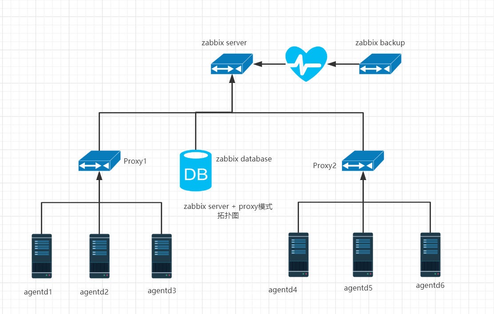](https://git.inmind-lab.com/aaronxu/Linux-book/src/branch/main/05.监控告警/01.Zabbix/1604564765251-b49bb305-e64a-4d66-be84-e5326100d97c.png)

## 2.6 Zabbix常用术语

以下是 Zabbix 中的几个核心概念，理解它们是掌握 Zabbix 的关键：

| 术语                    | 核心定义                                                | 关键点                                                       |
| ----------------------- | ------------------------------------------------------- | ------------------------------------------------------------ |
| **主机 (Host)**         | 被监控的网络设备或服务器，通过 IP 或域名标识。          | 监控的**最小单位**，所有监控项都挂载在主机上。               |
| **主机组 (Host Group)** | 主机的逻辑集合，用于分类管理（如 Web 服务器、数据库）。 | 主要用于**权限控制和批量管理**，不直接关联监控数据。         |
| **监控项 (Item)**       | 从主机上采集的具体指标，是 Zabbix 数据的最小单元。      | 每个监控项都有一个唯一的 **Key** 来标识，如 `system.cpu.load`。 |
| **触发器 (Trigger)**    | 定义监控项数据的“阈值规则”，并根据数据状态判断问题。    | 状态在 **OK** (正常) 和 **Problem** (问题) 之间切换，是**告警的核心**。 |

# 3. Zabbix-server部署

## 3.1 安装Zabbix 服务端

- 准备zabbix的yum源，这里通过安装zabbix-release软件包来自动获取zabbix的源。然后安装服务端相关组件

- 官网地址：https://www.zabbix.com/

```bash
[root@localhost ~]# rpm -Uvh https://repo.zabbix.com/zabbix/6.0/rhel/9/x86_64/zabbix-release-latest-6.0.el9.noarch.rpm
[root@localhost ~]# yum install -y zabbix-server-mysql zabbix-web-mysql zabbix-apache-conf zabbix-sql-scripts zabbix-selinux-policy zabbix-agent --nobest

# 安装中文插件
[root@localhost ~]# yum install -y glibc-langpack-zh.x86_64
```

- 关闭防火墙和Selinux

```bash
[root@localhost ~]# setenforce 0
[root@localhost ~]# vim /etc/selinux/config 
SELINUX=disabled

[root@localhost ~]# systemctl stop firewalld
[root@localhost ~]# systemctl disable --now firewalld
Removed "/etc/systemd/system/multi-user.target.wants/firewalld.service".
Removed "/etc/systemd/system/dbus-org.fedoraproject.FirewallD1.service".
```

## 3.2 准备数据库环境

- 安装数据库，这里还是选择mariadb即可

```bash
[root@localhost ~]# yum install -y mariadb-server

# 启动mariadb数据库
[root@localhost ~]# systemctl enable --now mariadb

# 初始化数据库并设置密码
[root@localhost ~]# mysqladmin -uroot password '123456'

# 测试数据库连接是否正常
[root@localhost ~]# mysql -uroot -p123456 -e "show databases;"
+--------------------+
| Database           |
+--------------------+
| information_schema |
| mysql              |
| performance_schema |
+--------------------+
```

- 创建zabbix所需数据库以及zabbix账户

```bash
[root@localhost ~]# mysql -uroot -p123456
# 创建zabbix库
MariaDB [(none)]> create database zabbix character set utf8mb4 collate utf8mb4_bin;
Query OK, 1 row affected (0.001 sec)

# 创建zabbix账户
MariaDB [(none)]> grant all privileges on zabbix.* to zabbix@localhost identified by '123456';
Query OK, 0 rows affected (0.003 sec)

# 刷新账户信息
MariaDB [(none)]> flush privileges;
Query OK, 0 rows affected (0.001 sec)

# 先开启这个后面可以向数据库导入文件
MariaDB [(none)]> set global log_bin_trust_function_creators = 1;
Query OK, 0 rows affected (0.000 sec)
```

## 3.3 修改服务端相关配置

- 导入初始架构数据

```bash
[root@localhost ~]# zcat /usr/share/zabbix-sql-scripts/mysql/server.sql.gz | mysql --default-character-set=utf8mb4 -D zabbix -uzabbix -p123456

# zabbix安装包中有一个SQL文件，这是zabbix架构的初始数据。
[root@localhost ~]# mysql -uzabbix -p123456 -D zabbix -e "show tables"
\+----------------------------+
| Tables_in_zabbix           |
+----------------------------+
| acknowledges               |
| actions                    |
| alerts                     |
| auditlog                   |
| autoreg_host               |
| conditions                 |
| config                     |
| config_autoreg_tls         |
| corr_condition             |
| corr_condition_group       |
| corr_condition_tag         |
| corr_condition_tagpair     |
| corr_condition_tagvalue    |
| corr_operation             |
| correlation                |
| dashboard                  |
| dashboard_page             |
| dashboard_user             |
| dashboard_usrgrp           |
| dbversion                  |
| dchecks                    |
| dhosts                     |
| drules                     |
| dservices                  |
| escalations                |
| event_recovery             |
| event_suppress             |
| event_tag                  |
| events                     |
| expressions                |
| functions                  |
| globalmacro                |
| globalvars                 |
| graph_discovery            |
| graph_theme                |
| graphs                     |
| graphs_items               |
| group_discovery            |
| group_prototype            |
| ha_node                    |
| history                    |
| history_log                |
| history_str                |
| history_text               |
| history_uint               |
| host_discovery             |
| host_inventory             |
| host_tag                   |
| hostmacro                  |
| hosts                      |
| hosts_groups               |
| hosts_templates            |
| housekeeper                |
| hstgrp                     |
| httpstep                   |
| httpstep_field             |
| httpstepitem               |
| httptest                   |
| httptest_field             |
| httptest_tag               |
| httptestitem               |
| icon_map                   |
| icon_mapping               |
| ids                        |
| images                     |
| interface                  |
| interface_discovery        |
| interface_snmp             |
| item_condition             |
| item_discovery             |
| item_parameter             |
| item_preproc               |
| item_rtdata                |
| item_tag                   |
| items                      |
| lld_macro_path             |
| lld_override               |
| lld_override_condition     |
| lld_override_opdiscover    |
| lld_override_operation     |
| lld_override_ophistory     |
| lld_override_opinventory   |
| lld_override_opperiod      |
| lld_override_opseverity    |
| lld_override_opstatus      |
| lld_override_optag         |
| lld_override_optemplate    |
| lld_override_optrends      |
| maintenance_tag            |
| maintenances               |
| maintenances_groups        |
| maintenances_hosts         |
| maintenances_windows       |
| media                      |
| media_type                 |
| media_type_message         |
| media_type_param           |
| module                     |
| opcommand                  |
| opcommand_grp              |
| opcommand_hst              |
| opconditions               |
| operations                 |
| opgroup                    |
| opinventory                |
| opmessage                  |
| opmessage_grp              |
| opmessage_usr              |
| optemplate                 |
| problem                    |
| problem_tag                |
| profiles                   |
| proxy_autoreg_host         |
| proxy_dhistory             |
| proxy_history              |
| regexps                    |
| report                     |
| report_param               |
| report_user                |
| report_usrgrp              |
| rights                     |
| role                       |
| role_rule                  |
| script_param               |
| scripts                    |
| service_alarms             |
| service_problem            |
| service_problem_tag        |
| service_status_rule        |
| service_tag                |
| services                   |
| services_links             |
| sessions                   |
| sla                        |
| sla_excluded_downtime      |
| sla_schedule               |
| sla_service_tag            |
| sysmap_element_trigger     |
| sysmap_element_url         |
| sysmap_shape               |
| sysmap_url                 |
| sysmap_user                |
| sysmap_usrgrp              |
| sysmaps                    |
| sysmaps_element_tag        |
| sysmaps_elements           |
| sysmaps_link_triggers      |
| sysmaps_links              |
| tag_filter                 |
| task                       |
| task_acknowledge           |
| task_check_now             |
| task_close_problem         |
| task_data                  |
| task_remote_command        |
| task_remote_command_result |
| task_result                |
| timeperiods                |
| token                      |
| trends                     |
| trends_uint                |
| trigger_depends            |
| trigger_discovery          |
| trigger_queue              |
| trigger_tag                |
| triggers                   |
| users                      |
| users_groups               |
| usrgrp                     |
| valuemap                   |
| valuemap_mapping           |
| widget                     |
| widget_field               |
+----------------------------+

# 这里再关掉
[root@localhost ~]# mysql -uroot -p123456  -e "set global log_bin_trust_function_creators = 0;"
```

- 配置zabbix连接数据库

```bash
[root@localhost ~]# vim /etc/zabbix/zabbix_server.conf 
DBPassword=123456
```

- 启动所有服务

```bash
# 安装zabbix的时候，会附带安装httpd来提供web服务，因为zabbix默认情况下是有一个web网站的
[root@localhost ~]# systemctl start zabbix-server zabbix-agent httpd php-fpm

[root@localhost ~]# ss -ntl
State   Recv-Q  Send-Q   Local Address:Port           Peer Address:Port       Process       
LISTEN  0       4096           0.0.0.0:10051               0.0.0.0:*                        
LISTEN  0       4096           0.0.0.0:10050               0.0.0.0:*                        
LISTEN  0       128            0.0.0.0:22                  0.0.0.0:*                        
LISTEN  0       4096              [::]:10051                  [::]:*                        
LISTEN  0       4096              [::]:10050                  [::]:*                        
LISTEN  0       80                   *:3306                      *:*                        
LISTEN  0       511                  *:80                        *:*                        
LISTEN  0       128               [::]:22                     [::]:*                     
```

## 3.4 服务端初始化

完成上述配置后，可以在浏览器中输入`http://IP/zabbix`打开zabbix的web界面开始初始化

- 进入初始化页面，可以选择中文

[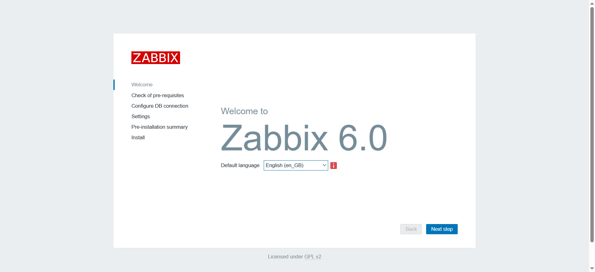](https://git.inmind-lab.com/aaronxu/Linux-book/src/branch/main/05.监控告警/01.Zabbix/image-20250316143441157.png)

- 状态检测
  - 确保所有的php检测都是ok的状态

[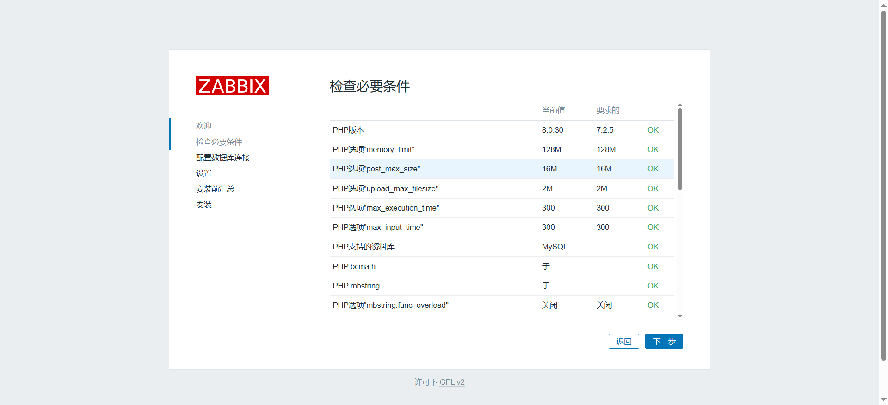](https://git.inmind-lab.com/aaronxu/Linux-book/src/branch/main/05.监控告警/01.Zabbix/image-20250316143522811.png)

- 连接数据库
  - 数据库的信息按照图上的填入，其中密码是我们刚刚设置的zabbix用户的密码，端口号3306

[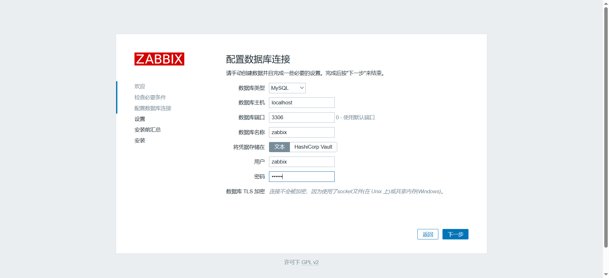](https://git.inmind-lab.com/aaronxu/Linux-book/src/branch/main/05.监控告警/01.Zabbix/image-20250316143612944.png)

- zabbix信息
  - 填写主机名以及选择正确的时区

[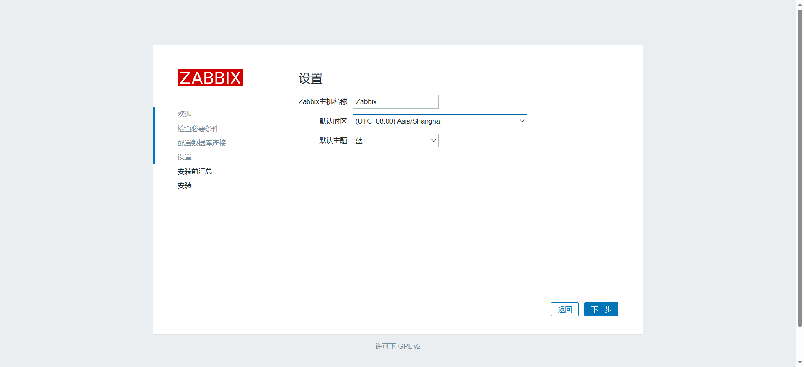](https://git.inmind-lab.com/aaronxu/Linux-book/src/branch/main/05.监控告警/01.Zabbix/image-20250316143728527.png)

- 完成安装，看到如下界面，说明zabbix初始化成功

[](https://git.inmind-lab.com/aaronxu/Linux-book/src/branch/main/05.监控告警/01.Zabbix/image-20250316143812080.png)

- 登录zabbix的web网站，默认用户名和密码如下

**username：**Admin

**password：**zabbix

[](https://git.inmind-lab.com/aaronxu/Linux-book/src/branch/main/05.监控告警/01.Zabbix/image-20250316143838085.png)

- 进入Zabbix界面

[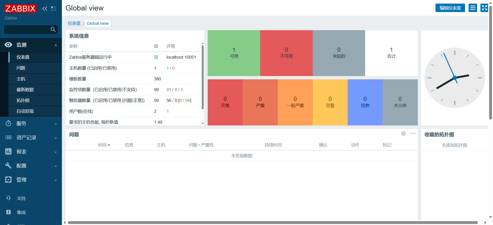](https://git.inmind-lab.com/aaronxu/Linux-book/src/branch/main/05.监控告警/01.Zabbix/image-20250316144001404.png)

## 3.5 客户端配置

1. 在node1上安装zabbix-agent客户端

```bash
[root@node1 ~]# rpm -Uvh https://repo.zabbix.com/zabbix/6.0/rhel/9/x86_64/zabbix-release-latest-6.0.el9.noarch.rpm

[root@node1 ~]# yum install zabbix-agent -y
```

1. 修改客户端配置文件

```bash
[root@node1 ~]# vim /etc/zabbix/zabbix_agentd.conf  
# 主要修改以下三个参数
Server=192.168.73.136
ServerActive=192.168.73.136

Hostname=node1
```

1. 启动zabbix-agent

```bash
[root@node1 ~]# setenforce 0
[root@node1 ~]# systemctl stop firewalld
[root@node1 ~]# systemctl start zabbix-agent
```

# 4. 快速使用

## 4.1 主机监控

先简单的监控一个主机的状态和信息

- 添加一个主机

[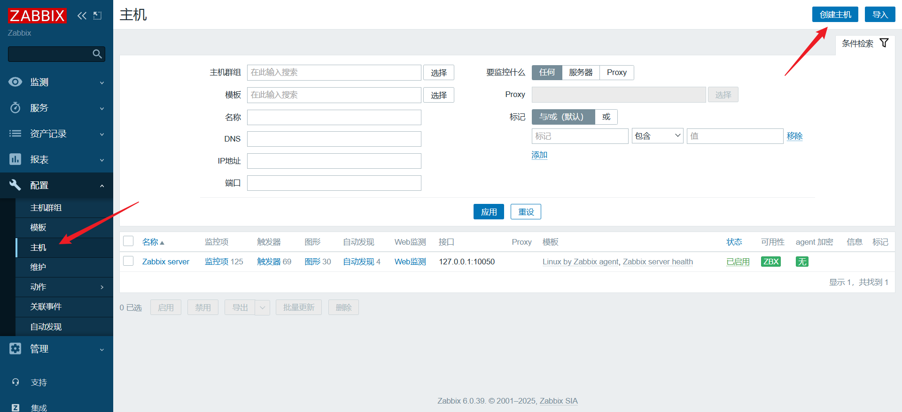](https://git.inmind-lab.com/aaronxu/Linux-book/src/branch/main/05.监控告警/01.Zabbix/image-20250316144631981.png)

- 填写主机信息

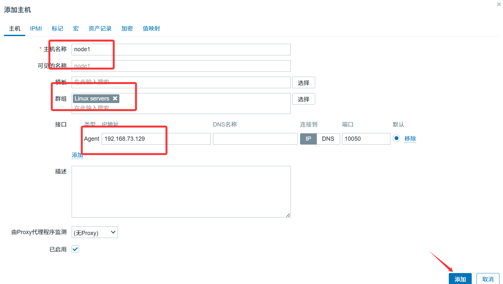

- 添加模板

zabbix内置了很多模板，比如监控Linux主机的模板，监控httpd的模板，监控MySQL的模板等等。我们可以直接使用这些模板，当然也可以自定义。

[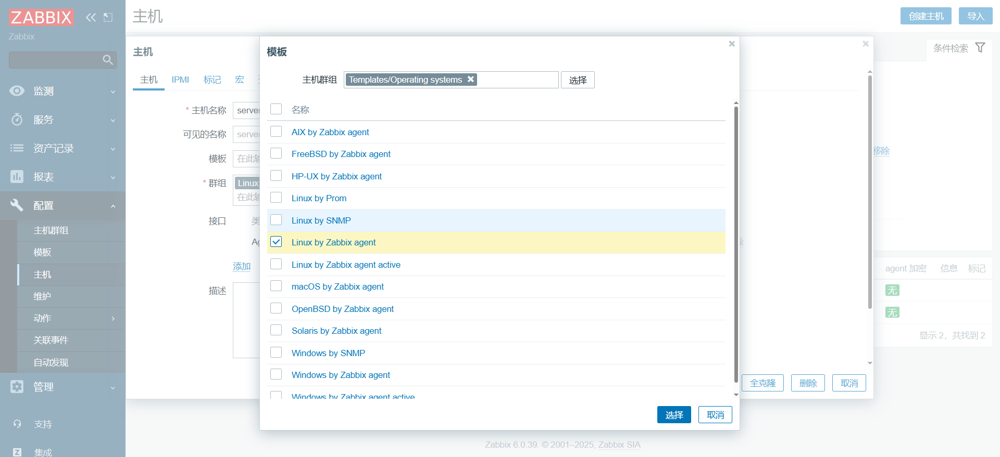](https://git.inmind-lab.com/aaronxu/Linux-book/src/branch/main/05.监控告警/01.Zabbix/image-20250316145451714.png)

- 查看监控项

在监测中，点击最新数据，然后过滤出node1主机，就可以看到各个监控项的具体数据

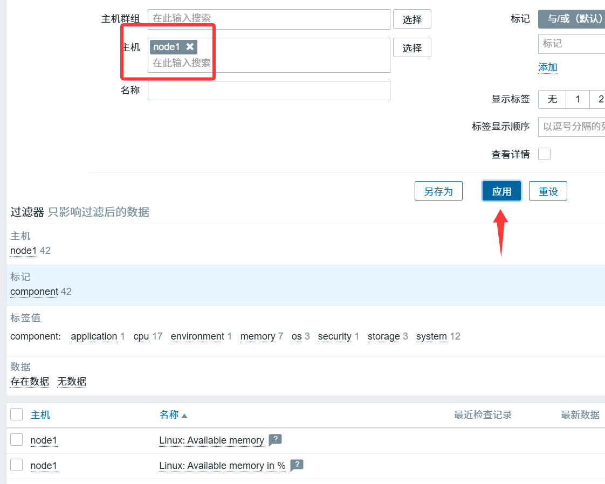

- 查看具体数据

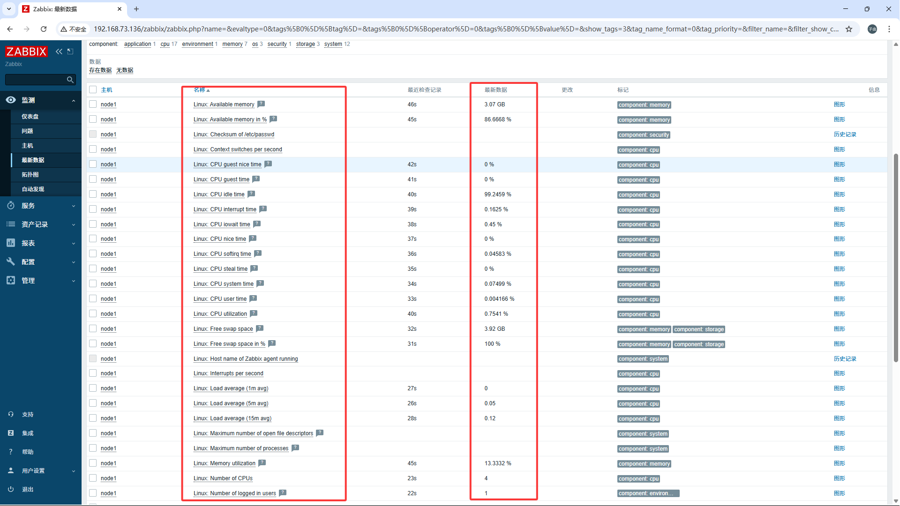

### 4.1.1 手动添加主机监控项

模板中内置的很多的监控项，但是如果没有我们想要的监控项的话，我们可以手动添加。

- 创建监控项

在配置中，选择对应的主机，然后创建监控项

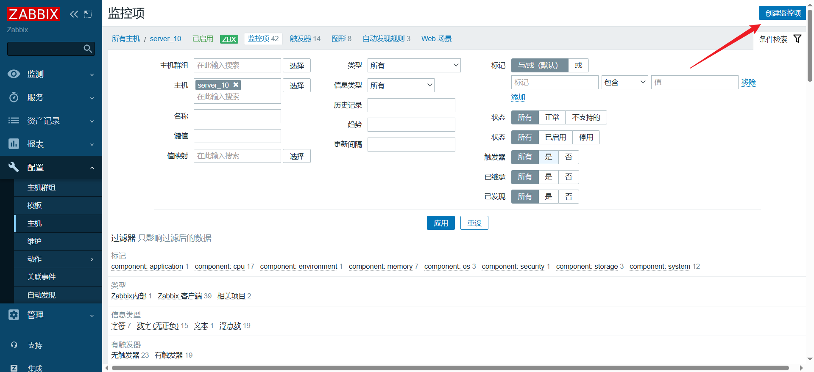

- 创建一个监控项用于查看已挂载文件系统情况

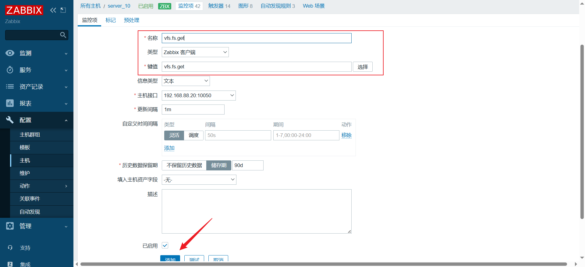

- 查看监控项获取到的的监控结果

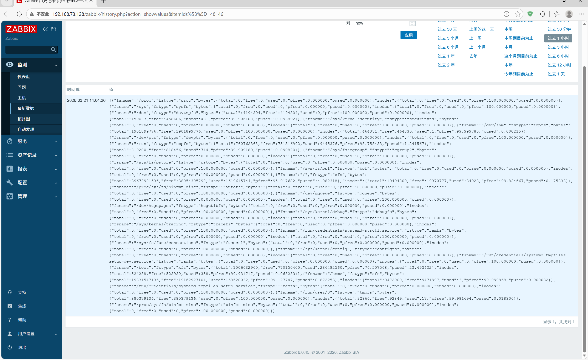

## 4.2 自定义应用配置监控项

### 4.2.1 Nginx进程监控

在node1上安装nginx服务，然后编写监控项配置文件，来监控nginx的进程数量

#### 4.2.1.1 安装nginx

```bash
[root@node1 ~]# yum install -y epel-release nginx
[root@node1 ~]# systemctl enable --now nginx
Created symlink /etc/systemd/system/multi-user.target.wants/nginx.service → /usr/lib/systemd/system/nginx.service.
```

#### 4.2.1.2 配置监控项文件

```bash
[root@node1 ~]# vim /etc/zabbix/zabbix_agentd.d/userparameter_nginx.conf
UserParameter=nginx_process_num,ps aux | grep "worker process" -c

# 重启zabbix-agent
[root@node1 zabbix_agentd.d]# systemctl restart zabbix-agent
```

#### 4.2.1.3 服务端验证

可以在服务端上安装一个zabbix工具`zabbix-get`,可以通过该工具在命令行中验证监控项的是否生效

```bash
[root@localhost ~]# yum -y install zabbix-get

[root@localhost ~]# zabbix_get -s 192.168.73.129 -k nginx_process_num
6

[root@node1 ~]# systemctl stop nginx
[root@localhost ~]# zabbix_get -s 192.168.73.129 -k nginx_process_num
2
```

#### 4.2.1.4 添加监控项

在web网站上使用刚刚编写的监控项

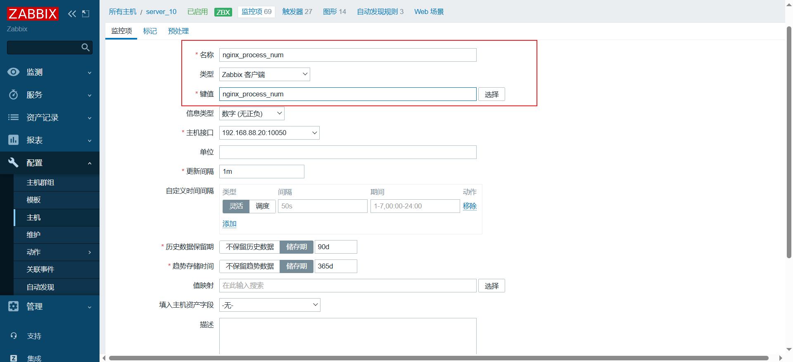

查看刚刚添加的监控项键值的状态为已启用

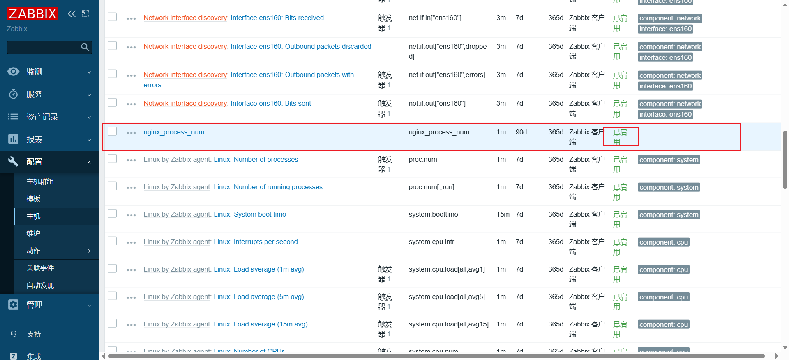

查看具体的检测到的数据，在菜单栏中点击监测->最新数据，然后过滤刚刚的监控项

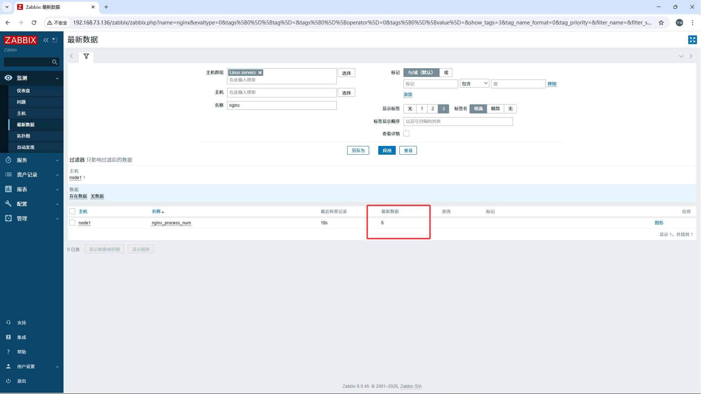

查看数据统计以及变化折线图

[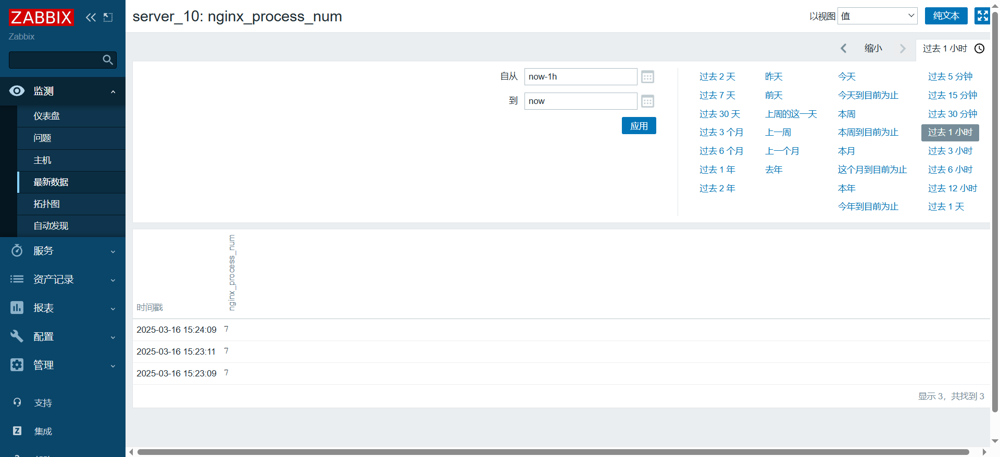](https://git.inmind-lab.com/aaronxu/Linux-book/src/branch/main/05.监控告警/01.Zabbix/image-20250316152417222.png)

#### 4.2.1.5 添加触发器

给该监控项添加触发器，让他能够出发警告通知

[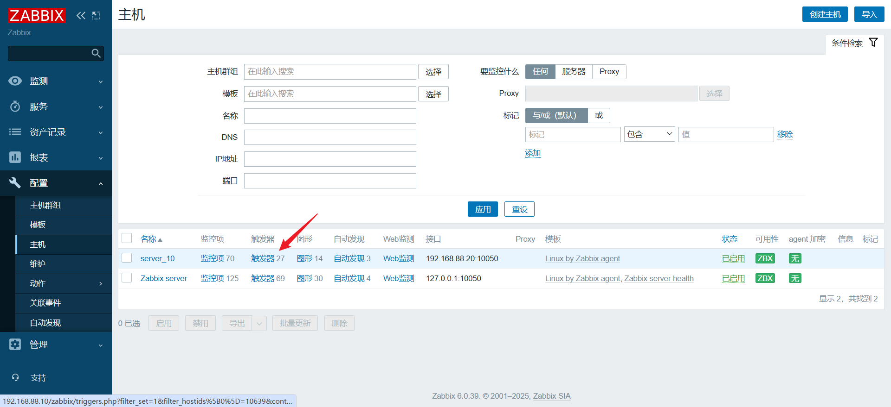](https://git.inmind-lab.com/aaronxu/Linux-book/src/branch/main/05.监控告警/01.Zabbix/image-20250316152509112.png)

创建一个新的触发器

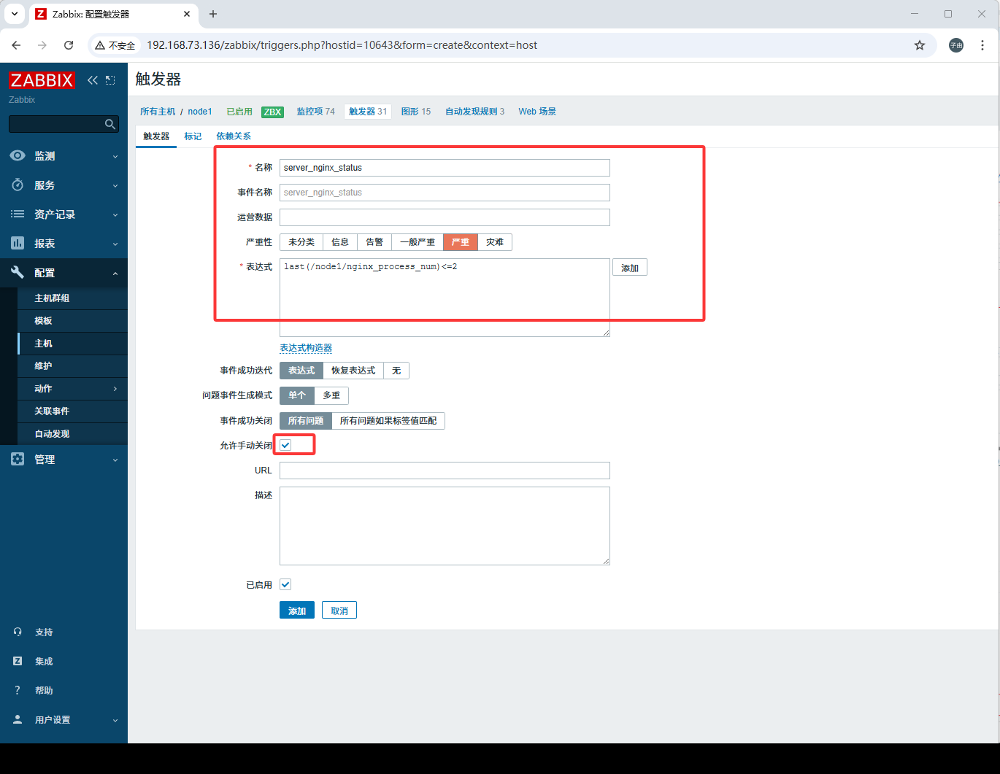

可以看到我们刚刚添加的触发器

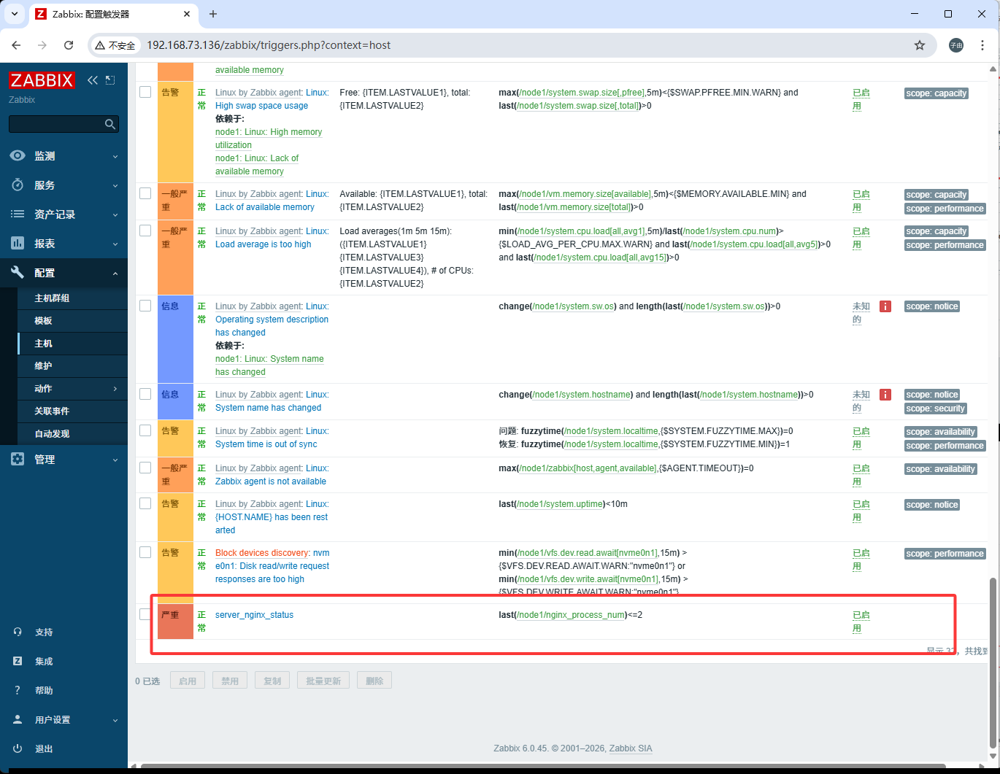

#### 4.2.1.6 手动宕机告警测试

在node1上手动关闭nginx后，在仪表盘中查看告警信息

```bash
[root@node1 ~]# systemctl stop nginx
```

查看仪表盘，可以看到告警在闪烁

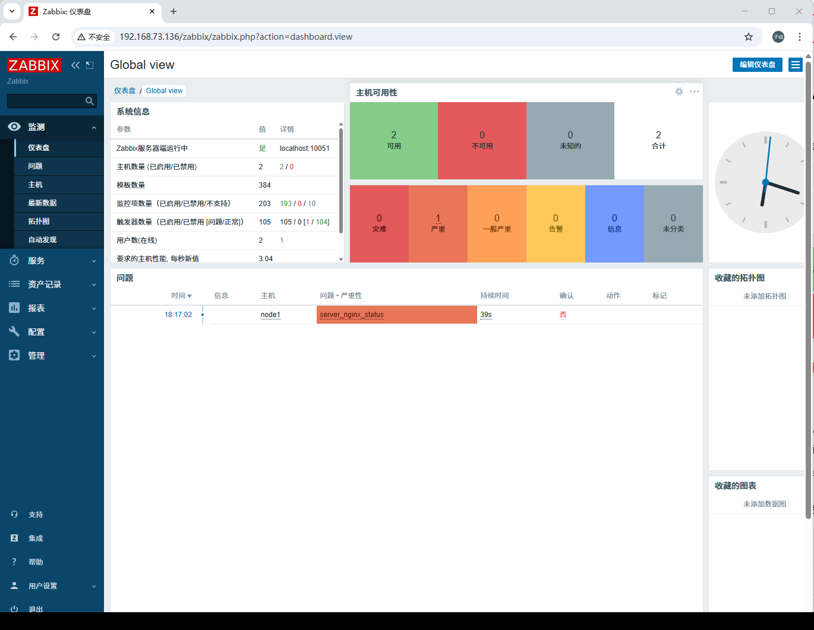

可以看到这里有一个告警信息，说明我们刚刚创建的触发器生效了。

这样的话，运维工程师就可以直接在这个网站上看到当前服务器组或者集群中各个机器和服务的状态。 不需要在一个一个登录上去查看了。

但是只是这样还是不够只能，稍后我们将继续配置触发告警以后，通过邮件或者叮叮企业微信等平台向工程师发送告警信息。

## 4.3 常见服务的监控项

### 4.3.1 Redis自定义监控项

```bash
vim /usr/local/zabbix/etc/zabbix_agentd.conf.d/redis.conf
UserParameter=Redis.Status,/usr/local/redis/bin/redis-cli -h 127.0.0.1 -p 6379 ping |grep -c PONG
UserParameter=Redis_conn[*],/usr/local/redis/bin/redis-cli -h $1 -p $2 info | grep -w "connected_clients" | awk -F':' '{print $2}'
UserParameter=Redis_rss_mem[*],/usr/local/redis/bin/redis-cli -h $1 -p $2 info | grep -w "used_memory_rss" | awk -F':' '{print $2}'
UserParameter=Redis_lua_mem[*],/usr/local/redis/bin/redis-cli -h $1 -p $2 info | grep -w "used_memory_lua" | awk -F':' '{print $2}'
UserParameter=Redis_cpu_sys[*],/usr/local/redis/bin/redis-cli -h $1 -p $2 info | grep -w "used_cpu_sys" | awk -F':' '{print $2}'
UserParameter=Redis_cpu_user[*],/usr/local/redis/bin/redis-cli -h $1 -p $2 info | grep -w "used_cpu_user" | awk -F':' '{print $2}'
UserParameter=Redis_cpu_sys_cline[*],/usr/local/redis/bin/redis-cli -h $1 -p $2 info | grep -w "used_cpu_sys_children" | awk -F':' '{print $2}'
UserParameter=Redis_cpu_user_cline[*],/usr/local/redis/bin/redis-cli -h $1 -p $2 info | grep -w "used_cpu_user_children" | awk -F':' '{print $2}'
UserParameter=Redis_keys_num[*],/usr/local/redis/bin/redis-cli -h $1 -p $2 info | grep -w "$$1" | grep -w "keys" | grep db$3 | awk -F'=' '{print $2}' | awk -F',' '{print $1}'
UserParameter=Redis_loading[*],/usr/local/redis/bin/redis-cli -h $1 -p $2 info | grep loading | awk -F':' '{print $$2}'

Redis.Status --检测Redis运行状态， 返回整数
Redis_conn  --检测Redis成功连接数，返回整数
Redis_rss_mem  --检测Redis系统分配内存，返回整数
Redis_lua_mem  --检测Redis引擎消耗内存，返回整数
Redis_cpu_sys --检测Redis主程序核心CPU消耗率，返回整数
Redis_cpu_user --检测Redis主程序用户CPU消耗率，返回整数
Redis_cpu_sys_cline --检测Redis后台核心CPU消耗率，返回整数
Redis_cpu_user_cline --检测Redis后台用户CPU消耗率，返回整数
Redis_keys_num --检测库键值数，返回整数
Redis_loding --检测Redis持久化文件状态，返回整数
```

### 4.3.2 Nginx自定义监控项

```bash
vim /etc/nginx/conf.d/default.conf
    location /nginx-status
    {
        stub_status on;
        access_log off;
        allow 127.0.0.1;
        deny all;
    }

    
vim /usr/local/zabbix/etc/zabbix_agentd.conf.d/nginx.conf
UserParameter=Nginx.active,/usr/bin/curl -s "http://127.0.0.1:80/nginx-status" | awk '/Active/ {print $NF}'
UserParameter=Nginx.read,/usr/bin/curl -s "http://127.0.0.1:80/nginx-status" | grep 'Reading' | cut -d" " -f2
UserParameter=Nginx.wrie,/usr/bin/curl -s "http://127.0.0.1:80/nginx-status" | grep 'Writing' | cut -d" " -f4
UserParameter=Nginx.wait,/usr/bin/curl -s "http://127.0.0.1:80/nginx-status" | grep 'Waiting' | cut -d" " -f6
UserParameter=Nginx.accepted,/usr/bin/curl -s "http://127.0.0.1:80/nginx-status" | awk '/^[ \t]+[0-9]+[ \t]+[0-9]+[ \t]+[0-9]+/ {print $1}'
UserParameter=Nginx.handled,/usr/bin/curl -s "http://127.0.0.1:80/nginx-status" | awk '/^[ \t]+[0-9]+[ \t]+[0-9]+[ \t]+[0-9]+/ {print $2}'
UserParameter=Nginx.requests,/usr/bin/curl -s "http://127.0.0.1:80/nginx-status" | awk '/^[ \t]+[0-9]+[ \t]+[0-9]+[ \t]+[0-9]+/ {print $3}'
```

### 4.3.3 TCP协议自定义监控项

```bash
vim /usr/local/zabbix/share/zabbix/alertscripts/tcp_connection.sh
#!/bin/bash
function ESTAB { 
/usr/sbin/ss -ant |awk '{++s[$1]} END {for(k in s) print k,s[k]}' | grep 'ESTAB' | awk '{print $2}'
}
function TIMEWAIT {
/usr/sbin/ss -ant | awk '{++s[$1]} END {for(k in s) print k,s[k]}' | grep 'TIME-WAIT' | awk '{print $2}'
}
function LISTEN {
/usr/sbin/ss -ant | awk '{++s[$1]} END {for(k in s) print k,s[k]}' | grep 'LISTEN' | awk '{print $2}'
}
$1

vim /usr/local/zabbix/etc/zabbix_agentd.conf.d/cattcp.conf
UserParameter=tcp[*],/usr/local/zabbix/share/zabbix/alertscripts/tcp_connection.sh $1

tcp[TIMEWAIT] --检测TCP的驻留数，返回整数
tcp[ESTAB]  --检测TCP的连接数、返回整数
tcp[LISTEN] --检测TCP的监听数，返回整数
```

### 4.3.4 系统监控自带监控项

```bash
agent.ping 检测客户端可达性、返回nothing表示不可达。1表示可达
system.cpu.load --检测cpu负载。返回浮点数
system.cpu.util -- 检测cpu使用率。返回浮点数
vfs.dev.read -- 检测硬盘读取数据，返回是sps.ops.bps浮点类型，需要定义1024倍
vfs.dev.write -- 检测硬盘写入数据。返回是sps.ops.bps浮点类型，需要定义1024倍
net.if.out[br0] --检测网卡流速、流出方向，时间间隔为60S
net.if.in[br0] --检测网卡流速，流入方向（单位：字节） 时间间隔60S
proc.num[]  目前系统中的进程总数，时间间隔60s
proc.num[,,run] 目前正在运行的进程总数，时间间隔60S
###处理器信息
通过zabbix_get 获取负载值
合理的控制用户态、系统态、IO等待时间剋保证进程高效率的运行
系统态运行时间较高说明进程进行系统调用的次数比较多，一般的程序如果系统态运行时间占用过高就需要优化程序，减少系统调用
io等待时间过高则表明硬盘的io性能差，如果是读写文件比较频繁、读写效率要求比较高，可以考虑更换硬盘，或者使用多磁盘做raid的方案
system.cpu.swtiches --cpu的进程上下文切换，单位sps，表示每秒采样次数，api中参数history需指定为3
system.cpu.intr  --cpu中断数量、api中参数history需指定为3
system.cpu.load[percpu,avg1]  --cpu每分钟的负载值，按照核数做平均值(Processor load (1 min average per core))，api中参数history需指定为0
system.cpu.load[percpu,avg5]  --cpu每5分钟的负载值，按照核数做平均值(Processor load (5 min average per core))，api中参数history需指定为0
system.cpu.load[percpu,avg15]  --cpu每5分钟的负载值，按照核数做平均值(Processor load (15 min average per core))，api中参数history需指定为0
```

### 4.3.5 自定义系统监控项

```bash
###内存相关
vim /usr/local/zabbix/etc/zabbix_agentd.conf.d/catcarm.conf
UserParameter=ram.info[*],/bin/cat  /proc/meminfo  |awk '/^$1:{print $2}'
ram.info[Cached] --检测内存的缓存使用量、返回整数，需要定义1024倍
ram.info[MemFree] --检测内存的空余量，返回整数，需要定义1024倍
ram.info[Buffers] --检测内存的使用量，返回整数，需要定义1024倍

####TCP相关的自定义项
vim /usr/local/zabbix/share/zabbix/alertscripts/tcp_connection.sh
#!/bin/bash
function ESTAB { 
/usr/sbin/ss -ant |awk '{++s[$1]} END {for(k in s) print k,s[k]}' | grep 'ESTAB' | awk '{print $2}'
}
function TIMEWAIT {
/usr/sbin/ss -ant | awk '{++s[$1]} END {for(k in s) print k,s[k]}' | grep 'TIME-WAIT' | awk '{print $2}'
}
function LISTEN {
/usr/sbin/ss -ant | awk '{++s[$1]} END {for(k in s) print k,s[k]}' | grep 'LISTEN' | awk '{print $2}'
}
$1

vim /usr/local/zabbix/etc/zabbix_agentd.conf.d/cattcp.conf
UserParameter=tcp[*],/usr/local/zabbix/share/zabbix/alertscripts/tcp_connection.sh $1

tcp[TIMEWAIT] --检测TCP的驻留数，返回整数
tcp[ESTAB]  --检测tcp的连接数、返回整数
tcp[LISTEN] --检测TCP的监听数，返回整数
```

# 5. Zabbix告警配置

## 5.1 Zabbix通过邮件告警

### 5.1.1 配置告警设置

- 配置E-mail参数

在菜单栏中选择管理->报警媒介类型

[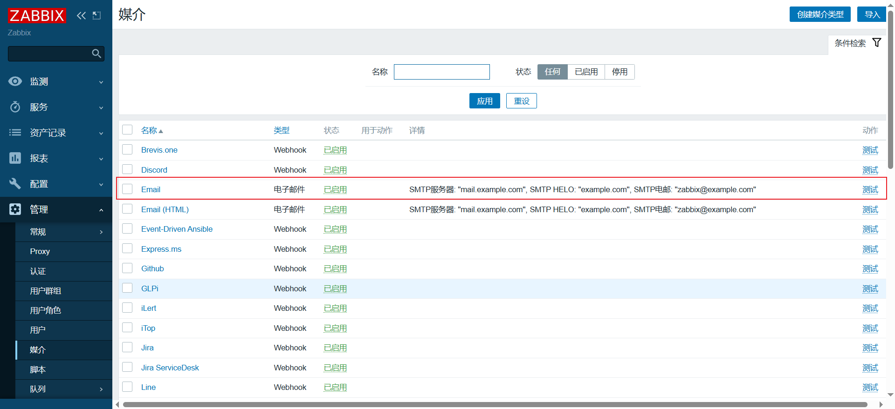](https://git.inmind-lab.com/aaronxu/Linux-book/src/branch/main/05.监控告警/01.Zabbix/image-20250316153912958.png)

按照图中配置参数，最后面的密码是在QQ邮箱中申请的**授权码**

[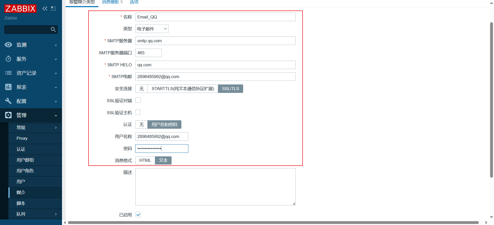](https://git.inmind-lab.com/aaronxu/Linux-book/src/branch/main/05.监控告警/01.Zabbix/image-20250316154138064.png)

- 测试是否能够发信

[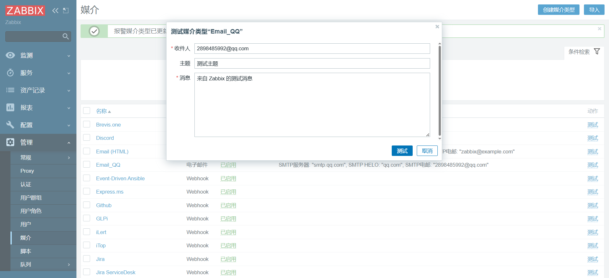](https://git.inmind-lab.com/aaronxu/Linux-book/src/branch/main/05.监控告警/01.Zabbix/image-20250316154236124.png)

如果QQ邮箱测试失败的同学，可以尝试网易的163邮箱，亲测可以，需要注册邮箱号，开启smtp服务，配置如下

[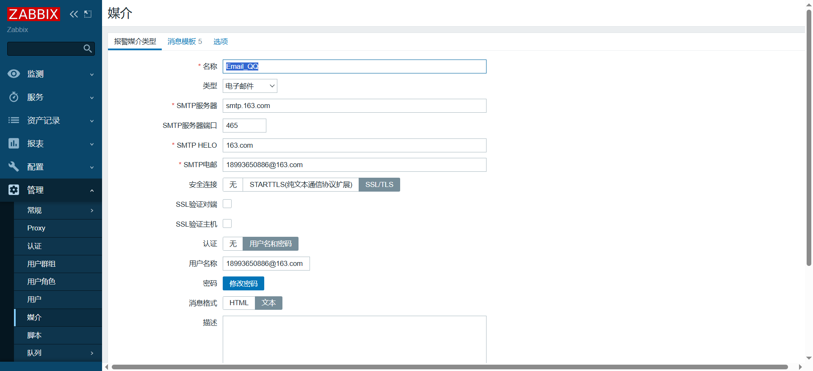](https://git.inmind-lab.com/aaronxu/Linux-book/src/branch/main/05.监控告警/01.Zabbix/image-20250316165313573.png)

- 修改Admin用户的报警媒介

[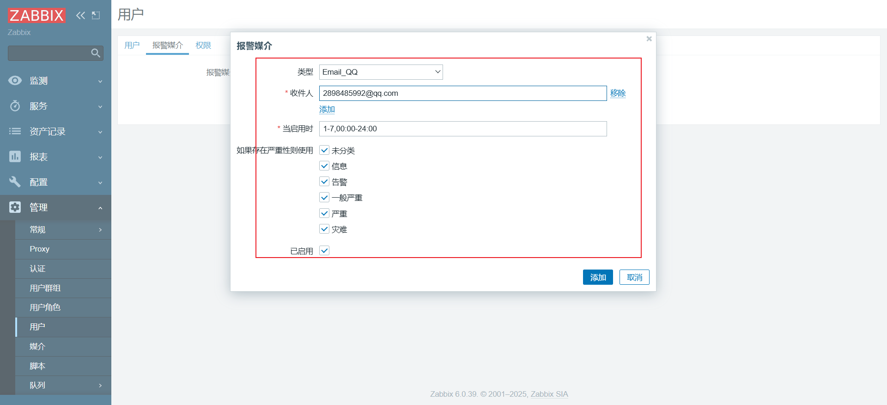](https://git.inmind-lab.com/aaronxu/Linux-book/src/branch/main/05.监控告警/01.Zabbix/image-20250316155758866.png)

- 配置告警动作

这里定义如果触发告警，应该怎么处理。以及如果发送邮件，邮件的内容是什么样的....

[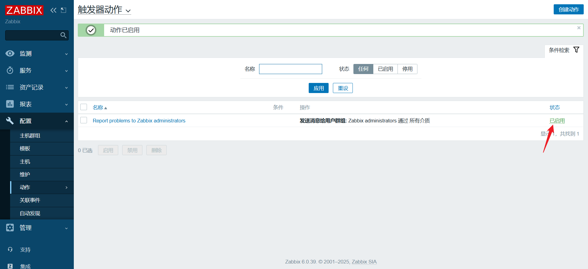](https://git.inmind-lab.com/aaronxu/Linux-book/src/branch/main/05.监控告警/01.Zabbix/image-20250316155845820.png)

当然也可以自定义告警信息

[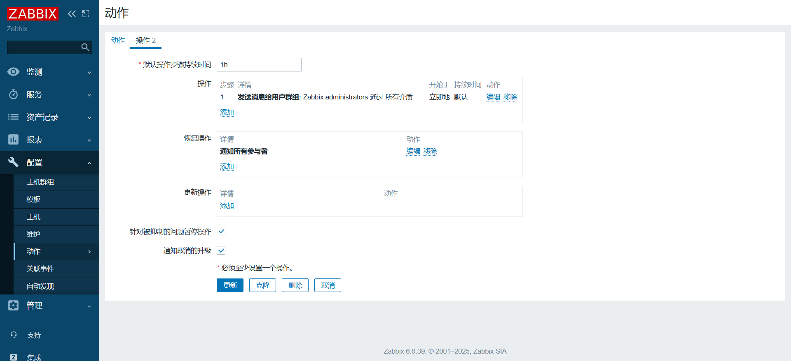](https://git.inmind-lab.com/aaronxu/Linux-book/src/branch/main/05.监控告警/01.Zabbix/image-20250316155928572.png) [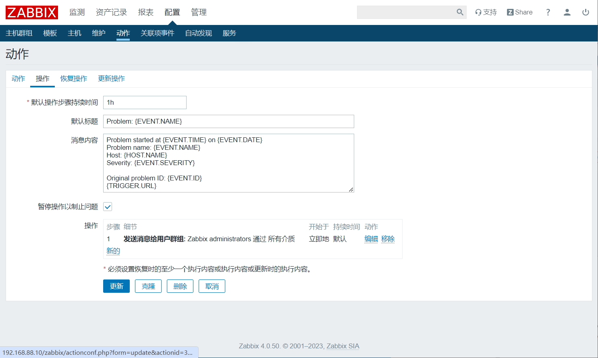](https://git.inmind-lab.com/aaronxu/Linux-book/src/branch/main/05.监控告警/01.Zabbix/image-20240811191936758.png)

```text
【监控事件】：{EVENT.NAME}

事件开始于{EVENT.TIME}-{EVENT.DATE}
事件名称：{EVENT.NAME}
主机：{HOST.NAME}
事件级别：{EVENT.SEVERITY}

事件ID：{EVENT.ID}
{TRIGGER.URL}
```

### 5.1.2 邮件告警测试

- 内存占用告急

```bash
[root@node1 ~]# dd </dev/zero >testfile bs=256M count=16
```

手动停止server2上面的nginx服务以后，查看邮件

[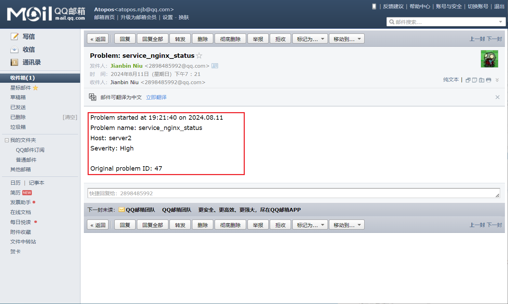](https://git.inmind-lab.com/aaronxu/Linux-book/src/branch/main/05.监控告警/01.Zabbix/image-20240811192208427.png)

可以看到，成功通过邮件发送告警信息

当问题恢复以后，也会发送邮件给我们

[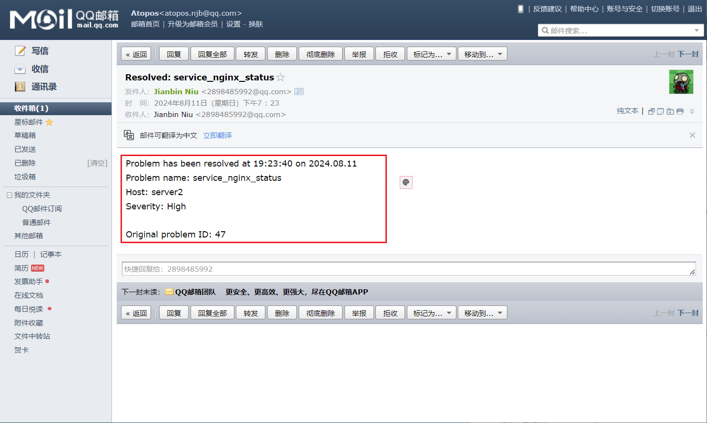](https://git.inmind-lab.com/aaronxu/Linux-book/src/branch/main/05.监控告警/01.Zabbix/image-20240811192344941.png)

## 5.2 Zabbix通过钉钉告警

### 5.2.1 创建钉钉群聊

先下载电脑版本的钉钉，然后创建一个群聊（创建群聊需要三个好友起步，大家可以相互之间添加好友）并且创建群聊

### 5.2.2 添加群机器人

添加自定义机器人，并且配置关键词

[](https://git.inmind-lab.com/aaronxu/Linux-book/src/branch/main/05.监控告警/01.Zabbix/image-20240811205608526.png)

保存好Webhook，并且设置安全关键词为：告警

[](https://git.inmind-lab.com/aaronxu/Linux-book/src/branch/main/05.监控告警/01.Zabbix/image-20240811205636906.png)

### 5.2.3 创建python脚本

由于zabbix无法直接向钉钉发送告警信息，所以这里需要借助python脚本来实现，让zabbix调用python脚本来向机器人接口发送信息

- 安装requests模块

```bash
[root@server1 ~]# yum install -y python-requests
```

- python脚本如下：

```bash
[root@server1 alertscripts]# cd /usr/lib/zabbix/alertscripts
[root@server1 alertscripts]# vim zabbix_send_ding.py 
#!/usr/bin/python
# -*- coding: utf-8 -*-
# Author: Aaronxu
import requests
import json
import sys
import os

headers = {'Content-Type': 'application/json;charset=utf-8'}
api_url = "https://oapi.dingtalk.com/robot/send?access_token=8eab8f6f2d872a0e14376fd782b6aaf40bd57b1352f9cc8ed42c238baaec80e0"
def msg(text):
    json_text= {
    "msgtype": "text",
    "at": {
        "atMobiles": [
            "18888888888"
        ],
            "isAtAll": True
     },
     "text": {
        "content": text
     }
    }
    response = requests.post(api_url,json.dumps(json_text),headers=headers).content
    print(response)

if __name__ == '__main__':
# 这里用发送关键字用来触发告警
    text = "告警"
# 使用sys.argv来接收一个参数，该参数是zabbix发送的消息
    # text = sys.argv[1]
    msg(text)
```

- 测试脚本

```bash
# 如果手动测试脚本的话，需要把text = sys.argv[1]先注释了
[root@server1 alertscripts]# chmod a+x zabbix_send_ding.py
[root@server1 alertscripts]# ./zabbix_send_ding.py
{"errcode":0,"errmsg":"ok"}
```

### 5.2.4 配置zabbix钉钉告警

- 添加告警媒介

因为我们使用的python脚本只接收一个参数（内容），所以只需要添加一个参数{ALERT.MESSAGE}即可

[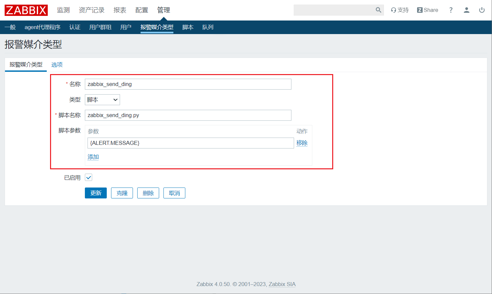](https://git.inmind-lab.com/aaronxu/Linux-book/src/branch/main/05.监控告警/01.Zabbix/image-20240811210327296.png)

- 添加处理动作

[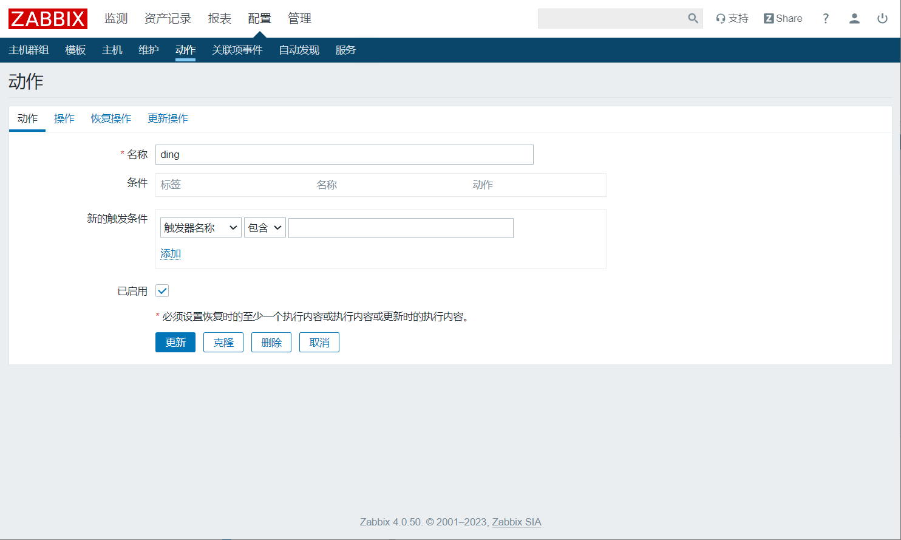](https://git.inmind-lab.com/aaronxu/Linux-book/src/branch/main/05.监控告警/01.Zabbix/image-20240811210412566.png)

[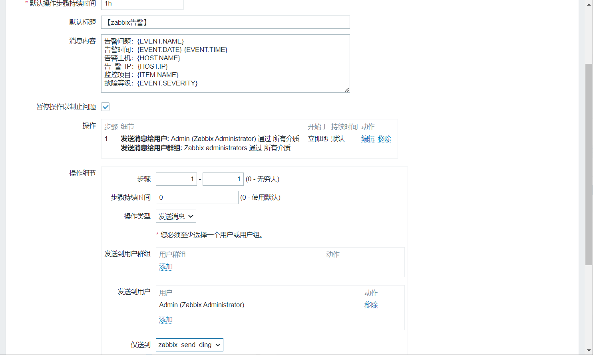](https://git.inmind-lab.com/aaronxu/Linux-book/src/branch/main/05.监控告警/01.Zabbix/image-20240811210446030.png)

恢复操作

[](https://git.inmind-lab.com/aaronxu/Linux-book/src/branch/main/05.监控告警/01.Zabbix/image-20240811210609196.png)

告警消息内容如下：

```bash
【zabbix告警】
告警问题：{EVENT.NAME}
告警时间：{EVENT.DATE}-{EVENT.TIME}
告警主机：{HOST.NAME}
告  警  IP：{HOST.IP}
监控项目：{ITEM.NAME}
故障等级：{EVENT.SEVERITY}


【zabbix告警恢复】
恢复时间：{EVENT.DATE}-{EVENT.TIME}
告警名称：{EVENT.NAME}
告警主机：{HOST.NAME}
告  警  IP：{HOST.IP}
告警等级：{EVENT.SEVERITY}


【zabbix告警更新】
{USER.FULLNAME} {EVENT.UPDATE.ACTION} problem at {EVENT.UPDATE.DATE} {EVENT.UPDATE.TIME}.
{EVENT.UPDATE.MESSAGE}
```

- 绑定用户，填写钉钉的手机号即可

[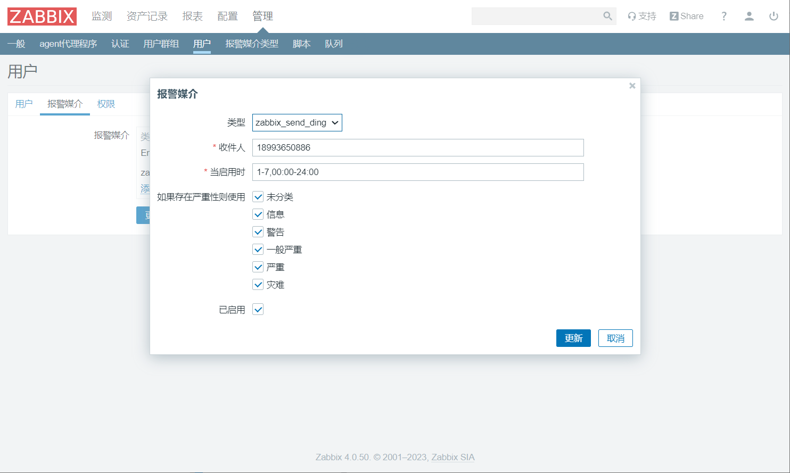](https://git.inmind-lab.com/aaronxu/Linux-book/src/branch/main/05.监控告警/01.Zabbix/image-20240811210717780.png)

### 5.2.5 测试钉钉告警

[](https://git.inmind-lab.com/aaronxu/Linux-book/src/branch/main/05.监控告警/01.Zabbix/image-20250215104654160.png)