# 1. Prometheus介绍

## 📊 1.1 Prometheus 简介

Prometheus 是一套开源的系统监控和告警工具包，由前 Google 工程师于 2012 年在 SoundCloud 发起。它采用“拉取式”（pull）模型，通过 HTTP 协议从被监控目标定期抓取指标，并存储在本地时序数据库中，支持强大的 PromQL 查询语言、灵活的告警规则以及丰富的可视化集成（如 Grafana）。

目前，Prometheus 已成为独立的开源项目，并于 2016 年 5 月作为继 Kubernetes 之后的第二个项目加入 CNCF 基金会，是云原生监控领域的事实标准之一。

## 🚀 1.2 Prometheus 的优势

Prometheus 之所以被广泛应用，主要得益于以下核心优势：

- **多维数据模型**：数据由指标名和一组键值对标签（labels）唯一标识，便于按不同维度进行聚合、切片和过滤。
- **强大的 PromQL 查询语言**：内置的 PromQL 支持对时间序列数据进行实时查询、聚合和计算，可用于生成图表和告警规则。
- **独立部署，不依赖分布式存储**：核心服务以单节点方式运行，不依赖外部数据库，部署简单，可靠性高。
- **拉取（Pull）模型采集**：通过 HTTP 主动从目标拉取数据，便于在本地测试和排查问题。
- **支持推送（Push）模式**：通过 Pushgateway 组件，可以接收短暂或批处理任务的监控数据，弥补了 Pull 模型的不足。
- **灵活的监控目标发现**：支持通过静态配置文件或动态服务发现（如 Kubernetes、Consul）自动识别监控目标。
- **丰富的可视化与生态集成**：提供原生查询界面，并能与 Grafana 等工具无缝集成，实现强大的数据可视化。

## 🏗️ 1.3 Prometheus 的组件与架构

Prometheus 的架构设计围绕其核心组件展开，各组件协同工作，构成完整的监控体系。

- **Prometheus Server**

  架构的核心，负责从监控目标拉取数据、存储时序数据、执行记录规则和告警规则，并提供 PromQL 查询接口。它是一个独立的 Go 语言二进制文件，无外部依赖，可独立部署。

- **Client Library**

  客户端库，嵌入到应用程序代码中，用于暴露指标数据（如 HTTP 请求数、内存使用率等）。Prometheus Server 通过访问这些暴露的 `/metrics`接口来抓取数据。

- **Exporter**

  导出器，用于采集各类组件（如 Linux 系统、Nginx、MySQL）的指标，并将其转换为 Prometheus 兼容的格式。它们通常作为独立进程运行，并暴露一个 `/metrics`接口供 Server 拉取。

- **Pushgateway**

  推送网关，为生命周期较短的批处理任务或无法被直接拉取的任务提供数据上报的入口。任务将数据推送到 Pushgateway，再由 Prometheus Server 从 Pushgateway 拉取。

- **Alertmanager**

  告警管理器，接收来自 Prometheus Server 的告警事件，进行去重、分组和路由，并通过邮件、短信、Webhook 等方式发送通知。

- **Service Discovery**

  服务发现机制，允许 Prometheus 自动发现需要监控的目标（如 Kubernetes 中的 Pod），极大地简化了在动态环境下的监控配置。

## 🎯 1.4 Prometheus 的适用场景

Prometheus 尤其适合以下场景：

- **云原生与容器环境监控**：与 Kubernetes 深度集成，能够自动发现并监控容器、节点和服务，是云原生架构下的首选监控方案。
- **微服务架构监控**：通过多维标签，可以轻松地对服务、实例、接口等多个维度进行指标聚合与分析，快速定位性能瓶颈。
- **高动态环境的实时监控**：采用 Pull 模型和服务发现，能够适应环境的频繁变化，无需手动维护监控目标列表。
- **可靠性优先的运维场景**：设计上强调高可用和容错性，即使在部分组件故障时，也能保证核心监控功能的正常运行，帮助快速诊断问题。

## ⚠️ 1.5 Prometheus 的局限性

Prometheus 并非适用于所有场景，其局限性主要体现在：

- **不适用于 100% 精确计费的场景**：由于数据采集是基于拉取周期和本地存储，可能存在数据丢失或重复，因此不适合用于对请求数、交易额等进行精确计费的场景。
- **长期存储依赖外部方案**：Prometheus 本身专注于短期存储和实时查询。对于需要存储数月甚至数年历史数据的场景，通常需要结合 Thanos、Cortex 等远程存储或长期存储方案。

# 2. 部署

## 2.1 二进制部署

- 下载prometheus的二进制包

官网地址：https://prometheus.io/download/

```bash
[root@localhost ~]# wget https://github.com/prometheus/prometheus/releases/download/v3.10.0/prometheus-3.10.0.linux-amd64.tar.gz
```

- 获取软件包的哈希值，与官网提供的软件包的哈希值进行对比，保证下载的Prometheus软件包的完整性

```bash
[root@localhost ~]# sha256sum prometheus-3.10.0.linux-amd64.tar.gz 
41c50d97bb6a181623fc89d3fe61d0cc68ee69cc93da9091b8bba005f9690122  prometheus-3.10.0.linux-amd64.tar.gz

41c50d97bb6a181623fc89d3fe61d0cc68ee69cc93da9091b8bba005f9690122  prometheus-3.10.0.linux-amd64.tar.gz
```

- 解压软件包到指定目录

```bash
[root@localhost ~]# mkdir /data
[root@localhost ~]# tar -zxvf prometheus-3.10.0.linux-amd64.tar.gz -C /data/
[root@localhost ~]# cd /data/
[root@localhost data]# chown -R root:root /data/prometheus-3.10.0.linux-amd64/
[root@localhost data]# ln -sv prometheus-3.10.0.linux-amd64 prometheus
'prometheus' -> 'prometheus-3.10.0.linux-amd64'
```

### 2.1.1 前台启动

- 启动Prometheus，会输出如下信息，此时当终端关闭或者按下ctrl + c服务会自动关闭

```bash
[root@localhost data]# cd /data/prometheus
[root@localhost prometheus]# ./prometheus
time=2026-03-21T15:20:13.159+08:00 level=INFO source=main.go:1611 msg="updated GOGC" old=100 new=75
time=2026-03-21T15:20:13.160+08:00 level=INFO source=main.go:723 msg="Leaving GOMAXPROCS=4: CPU quota undefined" component=automaxprocs
time=2026-03-21T15:20:13.161+08:00 level=INFO source=memlimit.go:198 msg="GOMEMLIMIT is updated" component=automemlimit package=github.com/KimMachineGun/automemlimit/memlimit GOMEMLIMIT=3423423283 previous=9223372036854775807
time=2026-03-21T15:20:13.161+08:00 level=INFO source=main.go:771 msg="No time or size retention was set so using the default time retention" duration=15d
time=2026-03-21T15:20:13.162+08:00 level=INFO source=main.go:822 msg="Starting Prometheus Server" mode=server version="(version=3.10.0, branch=HEAD, revision=54e010926b0a270cadb22be1113ad45fe9bcb90a)"
time=2026-03-21T15:20:13.162+08:00 level=INFO source=main.go:827 msg="operational information" build_context="(go=go1.26.0, platform=linux/amd64, user=root@2ee2be8e6652, date=20260225-21:12:02, tags=netgo,builtinassets)" host_details="(Linux 5.14.0-427.13.1.el9_4.x86_64 #1 SMP PREEMPT_DYNAMIC Wed May 1 19:11:28 UTC 2024 x86_64 localhost (none))" fd_limits="(soft=524287, hard=524288)" vm_limits="(soft=unlimited, hard=unlimited)"
time=2026-03-21T15:20:13.483+08:00 level=INFO source=web.go:696 msg="Start listening for connections" component=web address=0.0.0.0:9090
time=2026-03-21T15:20:13.493+08:00 level=INFO source=main.go:1350 msg="Starting TSDB ..."
time=2026-03-21T15:20:13.495+08:00 level=INFO source=tls_config.go:354 msg="Listening on" component=web address=[::]:9090
time=2026-03-21T15:20:13.495+08:00 level=INFO source=tls_config.go:357 msg="TLS is disabled." component=web http2=false address=[::]:9090
time=2026-03-21T15:20:13.501+08:00 level=INFO source=head.go:680 msg="Replaying on-disk memory mappable chunks if any" component=tsdb
time=2026-03-21T15:20:13.501+08:00 level=INFO source=head.go:766 msg="On-disk memory mappable chunks replay completed" component=tsdb duration=2.07µs
time=2026-03-21T15:20:13.501+08:00 level=INFO source=head.go:774 msg="Replaying WAL, this may take a while" component=tsdb
time=2026-03-21T15:20:13.502+08:00 level=INFO source=head.go:847 msg="WAL segment loaded" component=tsdb segment=0 maxSegment=0 duration=429.468µs
time=2026-03-21T15:20:13.502+08:00 level=INFO source=head.go:884 msg="WAL replay completed" component=tsdb checkpoint_replay_duration=97.79µs wal_replay_duration=524.41µs wbl_replay_duration=310ns chunk_snapshot_load_duration=0s mmap_chunk_replay_duration=2.07µs total_replay_duration=689.663µs
time=2026-03-21T15:20:13.505+08:00 level=INFO source=main.go:1371 msg="filesystem information" fs_type=XFS_SUPER_MAGIC
time=2026-03-21T15:20:13.505+08:00 level=INFO source=main.go:1374 msg="TSDB started"
time=2026-03-21T15:20:13.505+08:00 level=INFO source=main.go:1564 msg="Loading configuration file" filename=prometheus.yml
time=2026-03-21T15:20:13.508+08:00 level=INFO source=main.go:1604 msg="Completed loading of configuration file" db_storage=1.674µs remote_storage=1.935µs web_handler=620ns query_engine=1.672µs scrape=1.655182ms scrape_sd=93.247µs notify=284.262µs notify_sd=23.198µs rules=2.683µs tracing=5.399µs filename=prometheus.yml totalDuration=2.475674ms
time=2026-03-21T15:20:13.508+08:00 level=INFO source=main.go:1335 msg="Server is ready to receive web requests."
time=2026-03-21T15:20:13.508+08:00 level=INFO source=manager.go:202 msg="Starting rule manager..." component="rule manager"
```

- 新开一个窗口，检查端口号以及关闭防火墙和selinux

```bash
[root@localhost ~]# systemctl stop firewalld[root@localhost ~]# setenforce 0
[root@localhost ~]# ss -ntl
State   Recv-Q  Send-Q   Local Address:Port        Peer Address:Port      Process       
LISTEN  0       128            0.0.0.0:22               0.0.0.0:*                       
LISTEN  0       4096                 *:9090                   *:*                       
LISTEN  0       128               [::]:22                  [::]:*    
```

### 2.1.2 检查配置文件

- 在Prometheus日常维护中，一定会对配置文件prometheus.yml进行再编辑操作，通常对Prometheus服务进行重新启动操作即可完成对配置文件的加载。当然也可以通过动态的热加载来更新prometheus.yml中的配置信息 查看进程id，向进程发送SIHHUP信号

```bash
# kill -HUP pid
```

- 通过HTTP API发送post请求到/-/reload

```bash
# curl -X POST http://localhost:9090/-/reload
```

- 检查配置文件的语法正确性

```bash
[root@localhost ~]# cd /data/prometheus
[root@localhost prometheus]# ll -h
total 370M
-rw-r--r-- 1 root root  12K Feb 26 05:42 LICENSE
-rw-r--r-- 1 root root 3.9K Feb 26 05:42 NOTICE
drwxr-xr-x 4 root root   70 Mar 24 13:51 data
-rwxr-xr-x 1 root root 197M Feb 26 05:16 prometheus
-rw-r--r-- 1 root root 1.1K Feb 26 05:42 prometheus.yml
-rwxr-xr-x 1 root root 173M Feb 26 05:16 promtool
[root@localhost prometheus]# ./promtool check config prometheus.yml 
Checking prometheus.yml
 SUCCESS: prometheus.yml is valid prometheus config file syntax
```

### 2.1.3 创建自启动脚本

```bash
[root@localhost ~]# vim /usr/lib/systemd/system/prometheus.service
[Unit]
Description=Prometheus Server
Documentation=https://prometheus.io/docs/introduction/overview/
After=network.target

[Service]
Type=simple
Restart=on-failure
ExecStart=/data/prometheus/prometheus \
    --config.file=/data/prometheus/prometheus.yml \
    --storage.tsdb.path=/data/prometheus/data \
    --web.listen-address=:9090 \
    --web.enable-lifecycle
ExecReload=/bin/kill -HUP $MAINPID

[Install]
WantedBy=multi-user.target
```

- systemd重载配置以及启动prometheus

```bash
[root@localhost ~]# systemctl daemon-reload
[root@localhost ~]# systemctl enable --now prometheus
Created symlink /etc/systemd/system/multi-user.target.wants/prometheus.service → /usr/lib/systemd/system/prometheus.service.
[root@localhost ~]# ss -ntl
State          Recv-Q         Send-Q                 Local Address:Port                   Peer Address:Port         Process         
LISTEN         0              128                          0.0.0.0:22                          0.0.0.0:*                            
LISTEN         0              4096                               *:9090                              *:*                            
LISTEN         0              128                             [::]:22                             [::]:*                         
```

### 2.1.4 浏览器访问测试


# 3. Exporter

## 3.1 简介📦

- 在 Prometheus 的监控体系中，**Exporter** 是负责采集和暴露监控数据的关键组件。Prometheus Server 通过定时访问 Exporter 暴露的 HTTP 接口（默认为 `/metrics`）来拉取数据，而无需关心底层数据的采集细节。

  它的核心工作流程如下：

  1. **数据采集**：从目标系统（如操作系统、数据库、硬件设备等）获取原始监控数据。
  2. **格式转换**：将采集到的数据转换为 Prometheus 标准的文本格式。
  3. **数据暴露**：通过 HTTP 服务暴露 `/metrics`接口，供 Prometheus Server 抓取。

- Prometheus 官方和社区提供了丰富的 Exporter，覆盖了绝大多数常见组件的监控需求，例如：

  - **数据库**：`mysqld_exporter`、`redis_exporter`

  - **操作系统**：`node_exporter`

  - **消息队列**：`rabbitmq_exporter`

## 3.2 Exporter 类型

Exporter 可以根据其实现方式和与监控目标的集成程度，分为以下两大类：

| 类型           | 特点                                                         | 实现方式                                                     | 典型示例                                                     |
| -------------- | ------------------------------------------------------------ | ------------------------------------------------------------ | ------------------------------------------------------------ |
| **直接采集型** | 在被监控的应用或系统中**内置**了指标暴露功能，Prometheus 可直接抓取。 | 通常在应用代码中使用 Prometheus 客户端库（Client Library）进行埋点，暴露 `/metrics`接口。 | Kubernetes API Server、etcd、cAdvisor、Kubelet。             |
| **间接采集型** | 监控目标本身**不原生支持** Prometheus，需要一个独立的“代理”程序来完成数据采集和转换。 | 作为一个独立进程运行，通过读取文件（如 `/proc`）、执行命令（如 `SHOW STATUS`）或调用 API 等方式获取数据，转换后再暴露。 | **主机监控**：`node_exporter` **数据库监控**：`mysqld_exporter` **中间件监控**：`redis_exporter` |

## 3.3 文本数据格式

在Prometheus的监控环境中，所有返回监控样本数据的Exporter程序，均需要遵守Prometheus规范，即基于文本的数据格式，其特点是具有更好的跨平台和可读性。

- 可以使用浏览器，或者通过curl工具来获得采集数据

```bash
# 以HELP开头的行，表示metric的帮助与说明解释，可以包含当前监控指标名称和对应的说明信息
# 以TYPE开始的行，表示定义metric的类型
# 以非#开头的行即监控样本的数据，包括metric_name{label_name1,label_name2...} value [timestamp可选项]

[root@localhost ~]# curl 192.168.73.136:9090/metrics
# HELP go_gc_duration_seconds A summary of the pause duration of garbage collection cycles.
# TYPE go_gc_duration_seconds summary
go_gc_duration_seconds{quantile="0"} 9.4601e-05
go_gc_duration_seconds{quantile="0.25"} 0.000141153
go_gc_duration_seconds{quantile="0.5"} 0.000416738
go_gc_duration_seconds{quantile="0.75"} 0.001050261
go_gc_duration_seconds{quantile="1"} 0.008308442
go_gc_duration_seconds_sum 0.014675204
go_gc_duration_seconds_count 13
# HELP go_goroutines Number of goroutines that currently exist.
# TYPE go_goroutines gauge
go_goroutines 32
# HELP go_info Information about the Go environment.
# TYPE go_info gauge
go_info{version="go1.15.8"} 1
# HELP go_memstats_alloc_bytes Number of bytes allocated and still in use.
# TYPE go_memstats_alloc_bytes gauge
go_memstats_alloc_bytes 1.6849432e+07
# HELP go_memstats_alloc_bytes_total Total number of bytes allocated, even if freed.
# TYPE go_memstats_alloc_bytes_total counter
go_memstats_alloc_bytes_total 6.016028e+07
# HELP go_memstats_buck_hash_sys_bytes Number of bytes used by the profiling bucket hash table.
# TYPE go_memstats_buck_hash_sys_bytes gauge
go_memstats_buck_hash_sys_bytes 1.461736e+06
# HELP go_memstats_frees_total Total number of frees.
# TYPE go_memstats_frees_total counter
go_memstats_frees_total 219435
# HELP go_memstats_gc_cpu_fraction The fraction of this program's available CPU time used by the GC since the program started.
# TYPE go_memstats_gc_cpu_fraction gauge
go_memstats_gc_cpu_fraction 3.012333999853177e-05
# HELP go_memstats_gc_sys_bytes Number of bytes used for garbage collection system metadata.
# TYPE go_memstats_gc_sys_bytes gauge
go_memstats_gc_sys_bytes 5.719272e+06
```

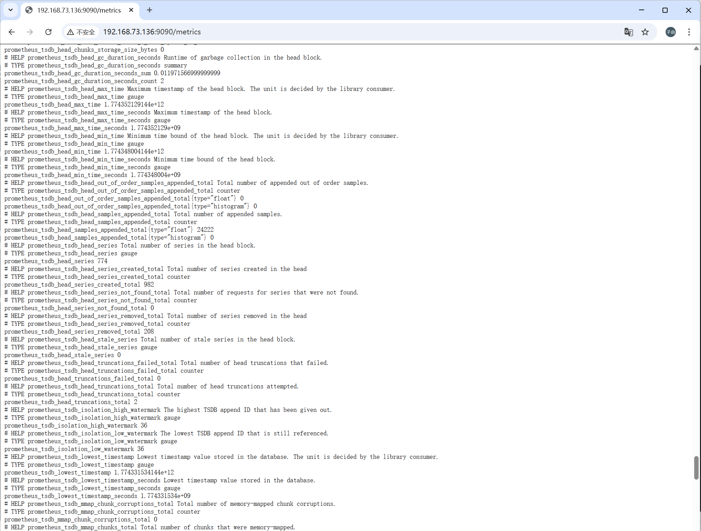

## 3.4 Linux主机监控

Prometheus社区很活跃，提供了非常多类型的Exporter。可以在官网中找到自己想要的Exporter并进行下载https://prometheus.io/download/

由于Linux操作系统自身并不支持Prometheus，所以Prometheus官方提供了go语言编写的Node Exporter来实现对Linux操作系统主机的监控数据采集。它提供了系统内部几乎所有的标准指标，如cpu、内存、磁盘空间、磁盘I/O、系统负载和网络带宽。另外它还提供了由内核公开的大量额外监控指标，从负载平均到主板温度等。

### 3.4.1 安装Exporter

- 下载node exporter的二进制包并解压

```bash
[root@node1 ~]# wget https://github.com/prometheus/node_exporter/releases/download/v1.8.2/node_exporter-1.8.2.linux-amd64.tar.gz
[root@node1 ~]# mkdir /data
[root@node1 ~]# tar -zxvf node_exporter-1.8.2.linux-amd64.tar.gz -C /data/
node_exporter-1.8.2.linux-amd64/
node_exporter-1.8.2.linux-amd64/NOTICE
node_exporter-1.8.2.linux-amd64/node_exporter
node_exporter-1.8.2.linux-amd64/LICENSE
[root@node1 ~]# cd /data/
[root@node1 data]# chown -R root:root node_exporter-1.8.2.linux-amd64/
[root@node1 data]# ln -sv node_exporter-1.8.2.linux-amd64 node_exporter
'node_exporter' -> 'node_exporter-1.8.2.linux-amd64'
```

- 启动node_exporter

```bash
[root@node1 node_exporter]# ./node_exporter 
```

- 将node_exporter也写成服务后台运行

```bash
[root@node1 node_exporter]# vim /usr/lib/systemd/system/node-exporter.service
[Unit]
Description=Prometheus Node-exporter
Documentation=https://prometheus.io/docs/introduction/>
After=network.target

[Service]
Type=simple
Restart=on-failure
ExecStart=/data/node_exporter/node_exporter 

[Install]
WantedBy=multi-user.target

[root@node1 node_exporter]# systemctl daemon-reload
[root@node1 node_exporter]# systemctl enable --now node-exporter
Created symlink /etc/systemd/system/multi-user.target.wants/node-exporter.service → /usr/lib/systemd/system/node-exporter.service.
[root@node1 node_exporter]# systemctl status node-exporter 
● node-exporter.service - Prometheus Node-exporter
     Loaded: loaded (/usr/lib/systemd/system/node-exporter.service; enabled; pr>
     Active: active (running) since Tue 2026-03-24 20:29:37 CST; 30s ago
       Docs: https://prometheus.io/docs/introduction/>
   Main PID: 1751 (node_exporter)
      Tasks: 5 (limit: 22951)
     Memory: 9.5M
        CPU: 134ms
     CGroup: /system.slice/node-exporter.service
             └─1751 /data/node_exporter/node_exporter

Mar 24 20:29:37 node1 node_exporter[1751]: ts=2026-03-24T12:29:37.843Z caller=n>
Mar 24 20:29:37 node1 node_exporter[1751]: ts=2026-03-24T12:29:37.843Z caller=n>
Mar 24 20:29:37 node1 node_exporter[1751]: ts=2026-03-24T12:29:37.844Z caller=n>
Mar 24 20:29:37 node1 node_exporter[1751]: ts=2026-03-24T12:29:37.844Z caller=n>
Mar 24 20:29:37 node1 node_exporter[1751]: ts=2026-03-24T12:29:37.844Z caller=n>
Mar 24 20:29:37 node1 node_exporter[1751]: ts=2026-03-24T12:29:37.844Z caller=n>
Mar 24 20:29:37 node1 node_exporter[1751]: ts=2026-03-24T12:29:37.844Z caller=n>
Mar 24 20:29:37 node1 node_exporter[1751]: ts=2026-03-24T12:29:37.844Z caller=n>
Mar 24 20:29:37 node1 node_exporter[1751]: ts=2026-03-24T12:29:37.845Z caller=t>
Mar 24 20:29:37 node1 node_exporter[1751]: ts=2026-03-24T12:29:37.845Z caller=t>
[root@node1 node_exporter]# ss -ntl
State    Recv-Q   Send-Q     Local Address:Port     Peer Address:Port  Process  
LISTEN   0        128              0.0.0.0:22            0.0.0.0:*              
LISTEN   0        4096                   *:9100                *:*              
LISTEN   0        128                 [::]:22               [::]:*    
```

### 3.4.2 关联Prometheus server

当启动node_exporter开始工作时，node_exporter和Prometheus server还没有进行关联，二者各自独立没有关联。

可以在Prometheus server中，找到主机目录，找到主配置文件，使用其中的静态配置功能static_configs来采集node_exporter提供的数据

**server主配置文件介绍：**

```bash
[root@localhost prometheus]# vim prometheus.yml 
# my global config
global:
  scrape_interval: 15s # Set the scrape interval to every 15 seconds. Default is every 1 minut                    e.
  evaluation_interval: 15s # Evaluate rules every 15 seconds. The default is every 1 minute.
  # scrape_timeout is set to the global default (10s).

# Alertmanager configuration
alerting:
  alertmanagers:
    - static_configs:
        - targets:
          # - alertmanager:9093

# Load rules once and periodically evaluate them according to the global 'evaluation_interval'                    .
rule_files:
  # - "first_rules.yml"
  # - "second_rules.yml"

# A scrape configuration containing exactly one endpoint to scrape:
# Here it's Prometheus itself.
scrape_configs:
  # The job name is added as a label `job=<job_name>` to any timeseries scraped from this conf                    ig.
  - job_name: "prometheus"

    # metrics_path defaults to '/metrics'
    # scheme defaults to 'http'.

    static_configs:
      - targets: ["localhost:9090"]


==================================================================================
# 配置文件解释
global:
  scrape_interval：每次数据采集的时间间隔，默认为1分钟
  scrape_timeout：采集请求超时时间，默认为10秒
  evaluation_interval：执行rules的频率，默认为1分钟
scrape_configs：主要用于配置被采集数据节点操作，每一个采集配置主要由以下几个参数
  job_name：全局唯一名称
    scrape_interval：默认等于global内设置的参数，设置后可以覆盖global中的值
    scrape_timeout：默认等于global内设置的参数
    metrics_path：从targets获取meitric的HTTP资源路径，默认是/metrics
    honor_labels：Prometheus如何处理标签之间的冲突。若设置为True，则通过保留变迁来解决冲突；若设置为false，则通过重命名；
    scheme：用于请求的协议方式，默认是http
    params：数据采集访问时HTTP URL设定的参数
    relabel_configs：采集数据重置标签配置
    metric_relabel_configs：重置标签配置
    sample_limit：对每个被已知样本数量的每次采集进行限制，如果超过限制，该数据将被视为失败。默认值为0，表示无限制
```

- 直接编辑主配置文件，添加job与node_exporter关联

```bash
scrape_configs:
  # The job name is added as a label `job=<job_name>` to any timeseries scraped from this config.
  - job_name: "prometheus"

    # metrics_path defaults to '/metrics'
    # scheme defaults to 'http'.

    static_configs:
      - targets: ["localhost:9090"]
  - job_name: "node_exporter"
    static_configs:
      - targets: ["192.168.73.129:9100"]
```

- 检查配置文件并且重启服务

```bash
[root@localhost prometheus]# ./promtool check config prometheus.yml 
Checking prometheus.yml
 SUCCESS: prometheus.yml is valid prometheus config file syntax

[root@localhost prometheus]# systemctl reload prometheus
[root@localhost prometheus]# ss -ntl
State  Recv-Q  Send-Q   Local Address:Port   Peer Address:Port Process                                                        
LISTEN 0       128            0.0.0.0:22          0.0.0.0:*                                                                   
LISTEN 0       4096                 *:9090              *:*                                                                   
LISTEN 0       128               [::]:22             [::]:*                                                                  
```

### 3.4.3 查看Targets

重启服务即可成功关联

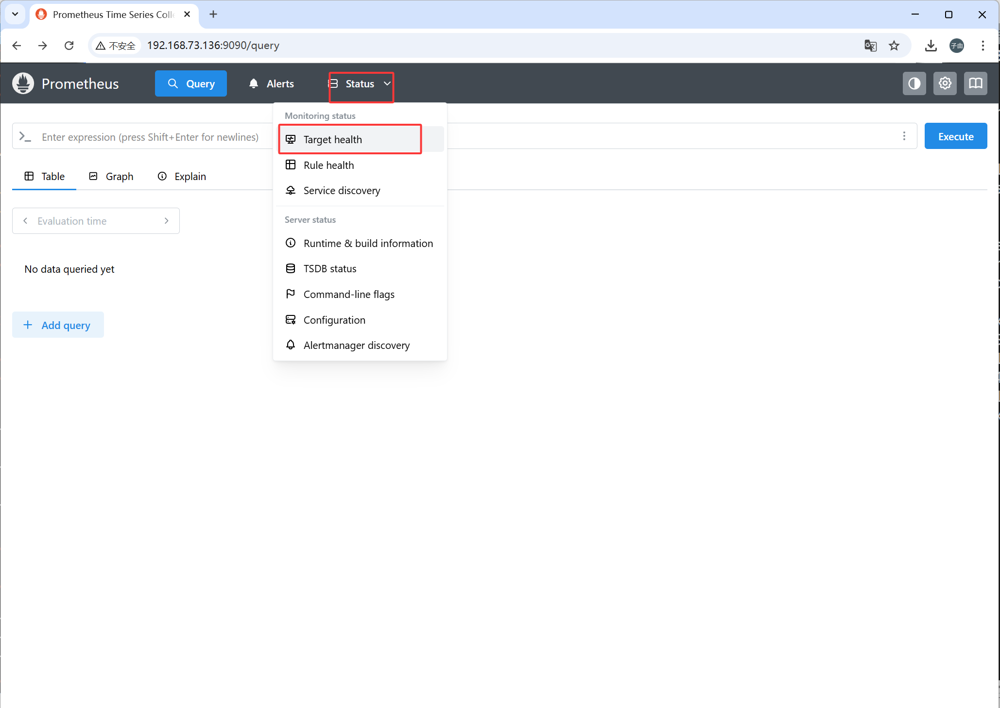

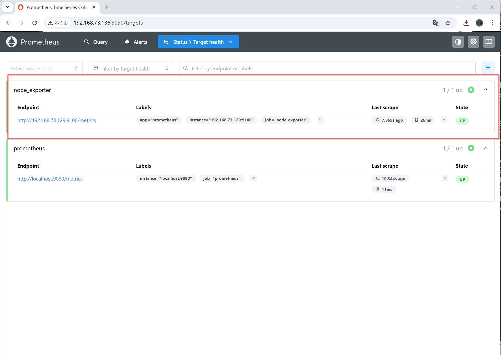

### 3.4.4 metricts数据采集

`node_exporter` 是 Prometheus 生态系统中的一个重要组件，用于收集主机级别的系统指标（如 CPU、内存、磁盘、网络等）。以下是 `node_exporter` 常见的监控项及其含义

#### 3.4.4.1 常见采集项

1. **CPU 相关指标**

- **`node_cpu_seconds_total`**：CPU 在每个模式（user、system、idle 等）下的使用时间（秒）。
  - 模式包括：`user`（用户态）、`system`（内核态）、`idle`（空闲）、`iowait`（等待 I/O）等。
  
- **`node_cpu_cores`**：CPU 核心数。

- **`node_cpu_frequency_hertz`**：CPU 频率。

------

2. **内存相关指标**

- **`node_memory_MemTotal_bytes`**：系统总内存大小。
- **`node_memory_MemFree_bytes`**：空闲内存大小。
- **`node_memory_Buffers_bytes`**：缓冲区使用的内存大小。
- **`node_memory_Cached_bytes`**：缓存使用的内存大小。
- **`node_memory_SwapTotal_bytes`**：交换分区总大小。
- **`node_memory_SwapFree_bytes`**：空闲交换分区大小。

------

3. **磁盘相关指标**

- **`node_disk_read_bytes_total`**：磁盘读取的总字节数。
- **`node_disk_written_bytes_total`**：磁盘写入的总字节数。
- **`node_disk_reads_completed_total`**：完成的磁盘读取操作数。
- **`node_disk_writes_completed_total`**：完成的磁盘写入操作数。
- **`node_disk_io_time_seconds_total`**：磁盘 I/O 操作的总时间。
- **`node_filesystem_size_bytes`**：文件系统总大小。
- **`node_filesystem_free_bytes`**：文件系统空闲大小。

------

4. **网络相关指标**

- **`node_network_receive_bytes_total`**：网络接口接收的总字节数。
- **`node_network_transmit_bytes_total`**：网络接口发送的总字节数。
- **`node_network_receive_packets_total`**：网络接口接收的数据包总数。
- **`node_network_transmit_packets_total`**：网络接口发送的数据包总数。

------

5. **系统负载相关指标**

- **`node_load1`**：1 分钟内的系统平均负载。
- **`node_load5`**：5 分钟内的系统平均负载。
- **`node_load15`**：15 分钟内的系统平均负载。

------

6. **进程相关指标**

- **`node_procs_running`**：当前正在运行的进程数。
- **`node_procs_blocked`**：当前被阻塞的进程数。

------

7. **文件描述符相关指标**

- **`node_filefd_allocated`**：已分配的文件描述符数量。
- **`node_filefd_maximum`**：文件描述符的最大数量。

------

8. **时间相关指标**

- **`node_time_seconds`**：当前系统时间（Unix 时间戳）。
- **`node_boot_time_seconds`**：系统启动时间（Unix 时间戳）。

------

9. **其他指标**

- **`node_uname_info`**：系统信息（如内核版本、操作系统等）。
- **`node_os_info`**：操作系统信息。

#### 3.4.4.2 示例

一、CPU 在每个模式（user、system、idle 等）下的使用时间（秒）

`node_cpu_seconds_total`

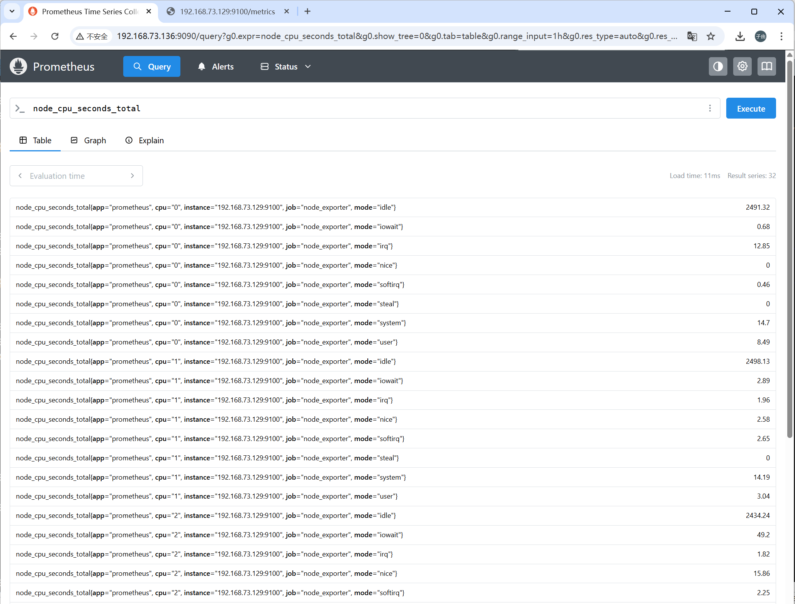

可以通过PromQL（后面会介绍这种查询语言）表达式进行查询，计算每核cpu每秒的空闲时间，然后对主机上的所有cpu求平均值

```
avg without(cpu,mode) (rate(node_cpu_seconds_total {mode="idle"} [1m]))
```

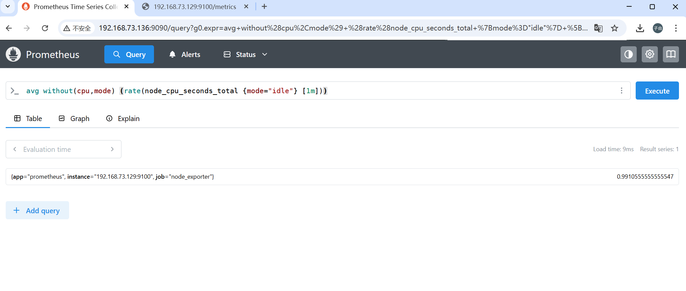

二、内存信息采集

当前主机内存查看

```bash
[root@node1 ~]# free -b
               total        used        free      shared  buff/cache   available
Mem:      3803807744   499318784  3126358016     9457664   415989760  3304488960
Swap:     4206882816           0  4206882816
```

总内存：`node_memory_MemTotal_bytes`

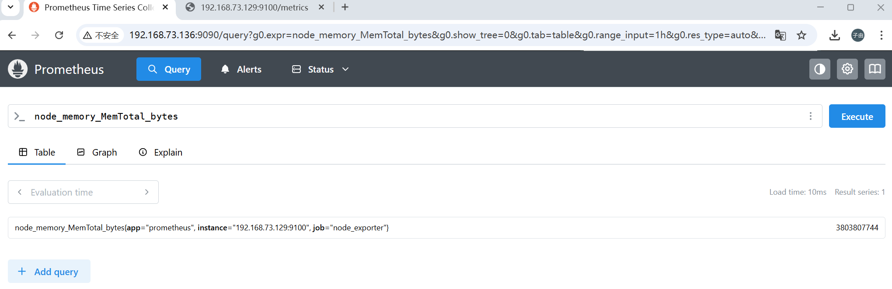

空闲内存：`node_memory_MemFree_bytes`

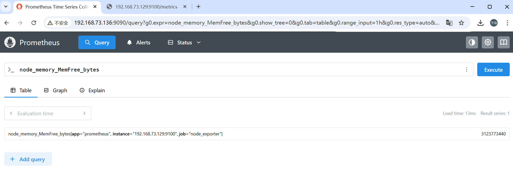

三、磁盘信息采集

磁盘 I/O 操作的总时间：`node_disk_io_time_seconds_total`

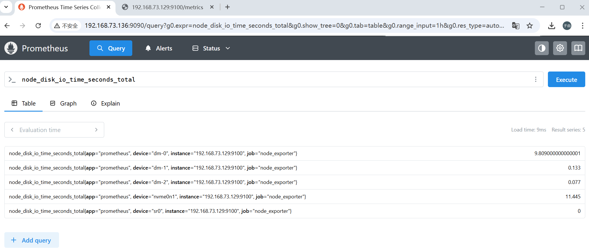

四、文件系统采集

`node_filesystem_size_bytes`

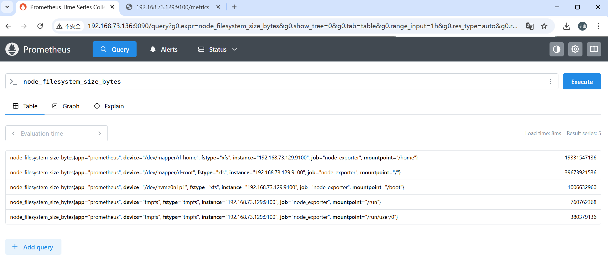

五、网络信息采集

`node_network_info`

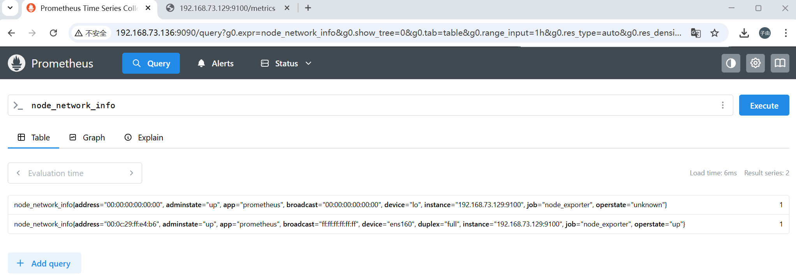

任意一个Exporter都会提供足够多的metric，我们在学习的时候也不需要关心具体有多少metric，每个metric具体意思（其实见名知义大概也可以猜到）

## 3.5 MySQL监控

### 3.5.1 部署MySQL环境

```bash
[root@node1 ~]# yum -y install mariadb-server
# 启动mariadb数据库
[root@node1 ~]# systemctl enable --now mariadb
Created symlink /etc/systemd/system/mysql.service → /usr/lib/systemd/system/mariadb.service.
Created symlink /etc/systemd/system/mysqld.service → /usr/lib/systemd/system/mariadb.service.
Created symlink /etc/systemd/system/multi-user.target.wants/mariadb.service → /usr/lib/systemd/system/mariadb.service.
# 初始化数据库并设置密码
[root@node1 ~]# mysqladmin -uroot password '123456'
# 测试数据库连接是否正常
[root@node1 ~]# mysql -uroot -p123456 -e "show databases;"
+--------------------+
| Database           |
+--------------------+
| information_schema |
| mysql              |
| performance_schema |
+--------------------+

[root@node1 ~]# mysql -uroot -p123456
Welcome to the MariaDB monitor.  Commands end with ; or \g.
Your MariaDB connection id is 5
Server version: 10.5.29-MariaDB MariaDB Server

Copyright (c) 2000, 2018, Oracle, MariaDB Corporation Ab and others.

Type 'help;' or '\h' for help. Type '\c' to clear the current input statement.
# 创建exporter用户
MariaDB [(none)]> grant all privileges on *.* to mysqld_exporter@'localhost' identified by '123456';
Query OK, 0 rows affected (0.002 sec)

# 刷新账户信息
MariaDB [(none)]> flush privileges;
Query OK, 0 rows affected (0.001 sec)
```

### 3.5.2 安装Exporter

官网下载mysqld_exporter二进制包解压缩

```bash
[root@node1 ~]# wget https://github.com/prometheus/mysqld_exporter/releases/download/v0.15.1/mysqld_exporter-0.15.1.linux-amd64.tar.gz

[root@node1 ~]# tar -zxvf mysqld_exporter-0.15.1.linux-amd64.tar.gz -C /data/
mysqld_exporter-0.15.1.linux-amd64/
mysqld_exporter-0.15.1.linux-amd64/LICENSE
mysqld_exporter-0.15.1.linux-amd64/mysqld_exporter
mysqld_exporter-0.15.1.linux-amd64/NOTICE
[root@node1 ~]# cd /data/
[root@node1 data]# chown -R root:root mysqld_exporter-0.15.1.linux-amd64/
[root@node1 data]# ln -sv mysqld_exporter-0.15.1.linux-amd64/ mysqld_exporter
'mysqld_exporter' -> 'mysqld_exporter-0.15.1.linux-amd64/'
```

### 3.5.3 配置Exporter

```bash
[root@node1 mysqld_exporter]# pwd
/data/mysqld_exporter

# 创建一个配置文件.mysqld_exporter.cnf
[root@node1 mysqld_exporter]# vim .mysqld_exporter.cnf
[client]
user=mysqld_exporter
password=123456

# 挂在后台启动
[root@node1 mysqld_exporter]# vim .mysqld_exporter.cnf
[root@node1 mysqld_exporter]# ./mysqld_exporter --config.my-cnf='.mysqld_exporter.cnf' &
[1] 5725
[root@node1 mysqld_exporter]# ts=2026-03-24T13:16:24.223Z caller=mysqld_exporter.go:220 level=info msg="Starting mysqld_exporter" version="(version=0.15.1, branch=HEAD, revision=cc349684494b5038ec5a52233bdca9eb9291e6f2)"
ts=2026-03-24T13:16:24.223Z caller=mysqld_exporter.go:221 level=info msg="Build context" build_context="(go=go1.21.5, platform=linux/amd64, user=root@d89c15b9f5ad, date=20231212-07:55:09, tags=unknown)"
ts=2026-03-24T13:16:24.223Z caller=mysqld_exporter.go:233 level=info msg="Scraper enabled" scraper=slave_status
ts=2026-03-24T13:16:24.224Z caller=mysqld_exporter.go:233 level=info msg="Scraper enabled" scraper=global_status
ts=2026-03-24T13:16:24.224Z caller=mysqld_exporter.go:233 level=info msg="Scraper enabled" scraper=global_variables
ts=2026-03-24T13:16:24.224Z caller=mysqld_exporter.go:233 level=info msg="Scraper enabled" scraper=info_schema.innodb_cmp
ts=2026-03-24T13:16:24.224Z caller=mysqld_exporter.go:233 level=info msg="Scraper enabled" scraper=info_schema.innodb_cmpmem
ts=2026-03-24T13:16:24.224Z caller=mysqld_exporter.go:233 level=info msg="Scraper enabled" scraper=info_schema.query_response_time
ts=2026-03-24T13:16:24.225Z caller=tls_config.go:274 level=info msg="Listening on" address=[::]:9104
ts=2026-03-24T13:16:24.226Z caller=tls_config.go:277 level=info msg="TLS is disabled." http2=false address=[::]:9104

[root@node1 mysqld_exporter]# ss -ntl
State    Recv-Q   Send-Q     Local Address:Port     Peer Address:Port  Process  
LISTEN   0        128              0.0.0.0:22            0.0.0.0:*              
LISTEN   0        4096                   *:9104                *:*              
LISTEN   0        4096                   *:9100                *:*              
LISTEN   0        128                 [::]:22               [::]:*              
LISTEN   0        80                     *:3306                *:*      

# 做成服务，注意：如果做成服务要启动先要把之前后台启动的进程kill掉
[root@node1 ~]# cd /data/mysqld_exporter
[root@node1 mysqld_exporter]# ls
LICENSE  NOTICE  mysqld_exporter
[root@node1 mysqld_exporter]# vim /usr/lib/systemd/system/mysqld-exporter.service
[Unit]
Description=Prometheus Mysqld-exporter
Documentation=https://prometheus.io/docs/introduction/>
After=network.target

[Service]
Type=simple
Restart=on-failure
ExecStart=/data/mysqld_exporter/mysqld_exporter --config.my-cnf='/data/mysqld_exporter/.mysqld_exporter.cnf'

[Install]
WantedBy=multi-user.target
[root@node1 mysqld_exporter]# systemctl daemon-reload 
[root@node1 mysqld_exporter]# systemctl start mysqld-exporter
[root@node1 mysqld_exporter]# systemctl status mysqld-exporter
● mysqld-exporter.service - Prometheus Mysqld-exporter
     Loaded: loaded (/usr/lib/systemd/system/mysqld-exporter.service; disabled;>
     Active: active (running) since Wed 2026-03-25 15:06:56 CST; 5s ago
       Docs: https://prometheus.io/docs/introduction/>
   Main PID: 1831 (mysqld_exporter)
      Tasks: 6 (limit: 22951)
     Memory: 4.6M
        CPU: 17ms
     CGroup: /system.slice/mysqld-exporter.service
             └─1831 /data/mysqld_exporter/mysqld_exporter --config.my-cnf=/data>

Mar 25 15:06:56 node1 mysqld_exporter[1831]: ts=2026-03-25T07:06:56.491Z caller>
Mar 25 15:06:56 node1 mysqld_exporter[1831]: ts=2026-03-25T07:06:56.492Z caller>
Mar 25 15:06:56 node1 mysqld_exporter[1831]: ts=2026-03-25T07:06:56.492Z caller>
Mar 25 15:06:56 node1 mysqld_exporter[1831]: ts=2026-03-25T07:06:56.492Z caller>
Mar 25 15:06:56 node1 mysqld_exporter[1831]: ts=2026-03-25T07:06:56.492Z caller>
Mar 25 15:06:56 node1 mysqld_exporter[1831]: ts=2026-03-25T07:06:56.492Z caller>
Mar 25 15:06:56 node1 mysqld_exporter[1831]: ts=2026-03-25T07:06:56.492Z caller>
Mar 25 15:06:56 node1 mysqld_exporter[1831]: ts=2026-03-25T07:06:56.492Z caller>
Mar 25 15:06:56 node1 mysqld_exporter[1831]: ts=2026-03-25T07:06:56.493Z caller>
Mar 25 15:06:56 node1 mysqld_exporter[1831]: ts=2026-03-25T07:06:56.494Z caller>
```

### 3.5.4 关联Prometheus server

```bash
[root@localhost prometheus]# vim prometheus.yml 
 - job_name: 'mysqld_exporter'
    scrape_interval: 10s
    static_configs:
      - targets: [”192.168.73.129:9104“]
      
[root@server1 prometheus]# ./promtool check config prometheus.yml
[root@localhost prometheus]# ./promtool check config prometheus.yml 
Checking prometheus.yml
 SUCCESS: prometheus.yml is valid prometheus config file syntax

[root@localhost prometheus]# systemctl restart prometheus
```

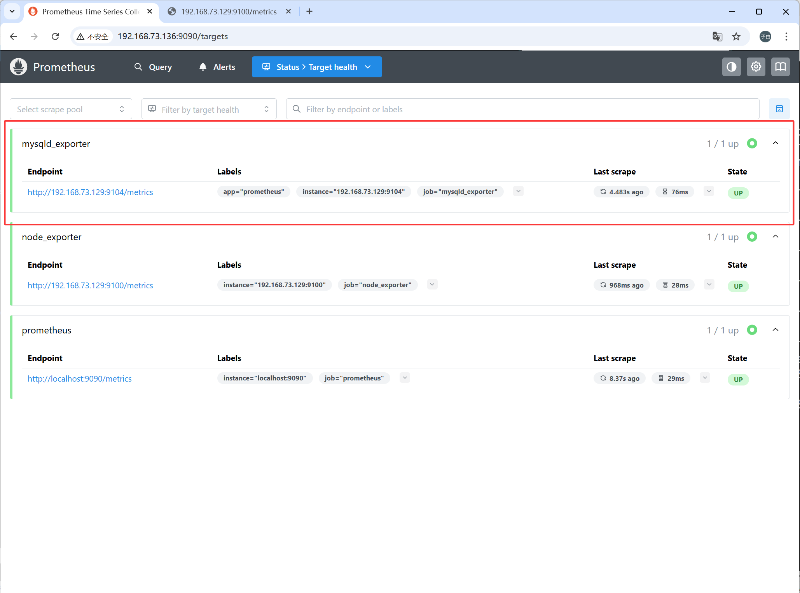

### 3.5.5 metricts数据采集

MySQL数据库的性能状态监控内容非常多，但通常必不可少的内容包括查询吞吐量、查询执行性能、连接情况、缓冲池使用情况等。

#### 3.5.5.1 常见采集项

1. MySQL状态信息：

   - `mysql_global_status_connections`: 当前连接数。
   - `mysql_global_status_threads_connected`: 当前连接的线程数。
   - `mysql_global_status_threads_running`: 当前正在运行的线程数。

------

2. **查询性能**：

- `mysql_global_status_questions`: 服务器启动以来执行的查询总数。
- `mysql_global_status_slow_queries`: 慢查询的数量。

------

3. **连接和线程**：

- `mysql_global_status_max_used_connections`: 服务器启动以来同时使用的最大连接数。
- `mysql_global_status_aborted_connects`: 失败的连接尝试次数。

------

4. **InnoDB存储引擎**：

- `mysql_global_status_innodb_buffer_pool_read_requests`: InnoDB缓冲池的读请求次数。
- `mysql_global_status_innodb_buffer_pool_reads`: 从磁盘读取的次数。
- `mysql_global_status_innodb_buffer_pool_pages_free`: InnoDB缓冲池中空闲的页数。
- `mysql_global_status_innodb_row_lock_waits`: InnoDB行锁等待的次数。

------

5. **网络流量**：

- `mysql_global_status_bytes_received`: 从所有客户端接收的字节数。
- `mysql_global_status_bytes_sent`: 发送到所有客户端的字节数。

------

6. **表缓存**：

- `mysql_global_status_table_open_cache_hits`: 表缓存命中次数。
- `mysql_global_status_table_open_cache_misses`: 表缓存未命中次数。

------

7. **复制状态**（如果启用了复制）：

- `mysql_slave_status_slave_io_running`: 从库I/O线程是否正在运行。
- `mysql_slave_status_slave_sql_running`: 从库SQL线程是否正在运行。
- `mysql_slave_status_seconds_behind_master`: 从库落后主库的秒数。

#### 3.5.5.2 示例

一、查询吞吐量，MySQL客户端应用程序发送的所有查询语句，该计数器都是递增的

`mysql_global_status_questions`

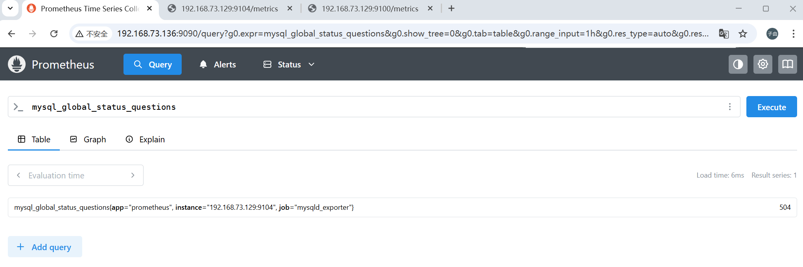

二、查询执行性能，每当查询时间超过预先设定的慢查询时间计数器都会递增

`mysql_global_status_slow_queries`

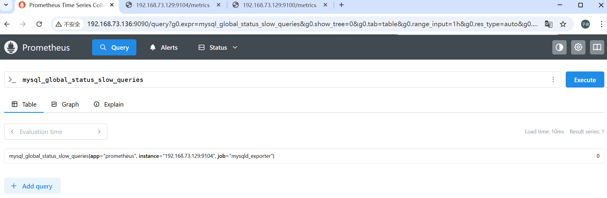

三、连接情况，查询MySQL所设置的最大连接数，防止连接数量过大导致服务器过载运行

`mysql_global_variables_max_connections`

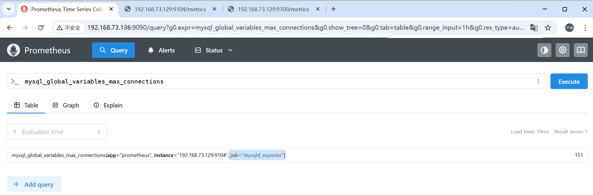

四、查看当前连接数

`mysql_global_status_threads_connected`

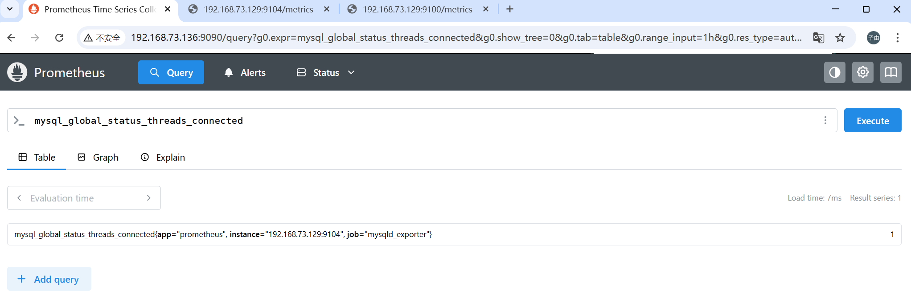

五、缓存池使用情况

`mysql_global_status_innodb_buffer_pool_bytes_data`

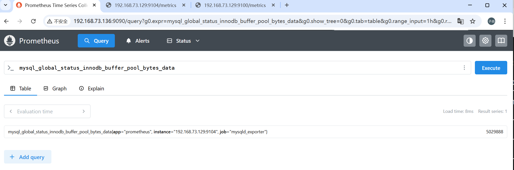

Prometheus大多数情况下，显示的默认单位为字节，必要时候，可以自己进行单位换算

`mysql_global_status_innodb_buffer_pool_bytes_data/1024/1024`

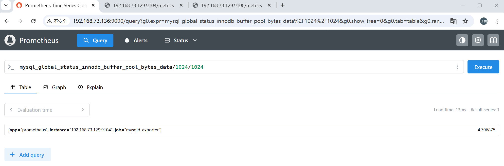

存储单位通常以 **1024** 为基数进行换算（二进制方式），但在某些场景下也可能以 **1000** 为基数（十进制方式）。以下是常见的存储单位及其换算关系：

| 单位   | 缩写 | 换算关系（二进制）               | 换算关系（十进制）               |
| ------ | ---- | -------------------------------- | -------------------------------- |
| 字节   | B    | 1 B = 8 bit                      | 1 B = 8 bit                      |
| 千字节 | KB   | 1 KB = 1024 B                    | 1 KB = 1000 B                    |
| 兆字节 | MB   | 1 MB = 1024 KB = 1,048,576 B     | 1 MB = 1000 KB = 1,000,000 B     |
| 吉字节 | GB   | 1 GB = 1024 MB = 1,073,741,824 B | 1 GB = 1000 MB = 1,000,000,000 B |
| 太字节 | TB   | 1 TB = 1024 GB                   | 1 TB = 1000 GB                   |
| 拍字节 | PB   | 1 PB = 1024 TB                   | 1 PB = 1000 TB                   |
| 艾字节 | EB   | 1 EB = 1024 PB                   | 1 EB = 1000 PB                   |
| 泽字节 | ZB   | 1 ZB = 1024 EB                   | 1 ZB = 1000 EB                   |
| 尧字节 | YB   | 1 YB = 1024 ZB                   | 1 YB = 1000 ZB                   |

# 4. 服务发现

Prometheus服务发现能够自动化检测分类，并且能够识别新目标和变更目标。也就是说，可以自动发现并监控目标或变更目标，动态进行数据采集和处理。

## 4.1 基于文件的服务发现

- 准备JSON格式的文件

```bash
[root@server1 ~]# cd /data/prometheus
[root@server1 prometheus]# mkdir targets
[root@server1 prometheus]# vim targets/dev_node.json
[{
    "targets": [ "192.168.88.20:9100","192.168.88.20:9104" ],
    "labels": {
         "env": "dev_webgame"
        }
}]
-------------------------------------------------------------------
或者这里是准备yaml文件，那么下面相应的配置文件需要与yaml匹配
[root@localhost prometheus]# mkdir targets
[root@localhost prometheus]# vim targets/dev_node.yml

- targets:
  - "192.168.73.129:9100"
  - "192.168.73.129:9104"
```

- 修改配置文件

```bash
[root@server1 prometheus]# vim /data/prometheus/prometheus.yml 
  - job_name: "node_service_discovery"
    scrape_interval: 10s
    file_sd_configs:
      - files:
        - targets/*.yml
        refresh_interval: 10s
```

- 重新启动服务

```bash
[root@localhost prometheus]# systemctl restart prometheus
```

扩展：这是基于文件发现，还有基于consul基于dns的服务发现，这个自行扩展。

# 5. 相关概念

## 5.1 Jobs和Instances

在 Prometheus 中，任何可被抓取监控数据的 HTTP 服务端点都被称为一个**实例 (Instance)**，通常对应一个独立进程。而一组具有相同采集目的的实例集合，则称为一个**作业 (Job)**。

**配置示例：**

yaml

scrape_configs:

- job_name: 'api-server'

  static_configs:

  - targets:
    - '1.2.3.4:5670' # instance 1
    - '1.2.3.4:5671' # instance 2
    - '5.6.7.8:5670' # instance 3
    - '5.6.7.8:5671' # instance 4

Prometheus 在抓取数据时会自动附加两个标签用于标识数据源：

- `job`: 目标所属的 Job 名称。
- `instance`: 被抓取目标的 `<host>:<port>`部分。

**自动生成的关键指标：**

- `up{job="<job-name>", instance="<instance-id>"}`: 实例健康状态 (1=正常, 0=异常)，是判断服务存活性的核心指标。
- `scrape_duration_seconds{...}`: 本次抓取耗时。
- `scrape_samples_scraped{...}`: 本次抓取到的样本数量。

## 5.2 数据模型

Prometheus所有采集的监控数据均以**指标的形式**保存在内置的时间序列数据库当中（TSDB）：属于同一**指标名称**、同一**标签**集合的、有**时间戳**标记的数据流。除了存储的时间序列，Prometheus还可以根据查询请求产生临时的、衍生的时间序列作为返回结果。

### 5.2.1 指标名称和标签

每条时间序列由 **指标名称 (Metric Name)** 和一组 **标签 (Labels)** 唯一标识。

- **指标名称 (Metric Name)**
  - **含义**: 描述监控对象，如 `http_requests_total`表示 HTTP 请求总数。
  - **命名规范**: 推荐使用 `[a-zA-Z_:][a-zA-Z0-9_:]*`格式。为避免冲突，自定义指标名建议使用统一前缀。
  - **注意**: 以 `:`开头的名称保留给**记录规则 (Recording Rule)** 使用，Exporter 不应直接暴露此类指标。
- **标签 (Labels)**
  - **作用**: 构成 Prometheus 强大的**多维数据模型**。通过不同标签（如 `method`, `status`）的组合，可以对同一指标进行细粒度的区分和聚合。
  - **命名规范**: 推荐使用 `[a-zA-Z_][a-zA-Z0-9_]*`格式。
  - **系统保留**: 以 `__`(双下划线) 开头的标签为系统内部使用，用户不应创建。
  - **标签值**: 可以是任意 UTF-8 字符。值为空的标签等同于不存在该标签。

### 5.2.2 样本(Sample)

- 时间序列中的每一个数据点称为一个样本，由以下三部分组成：
  1. **指标 (Metric)**: 指标名称及其标签集合。
  2. **时间戳 (Timestamp)**: 毫秒级精度的时间戳。
  3. **样本值 (Value)**: 一个 `float64`类型的数值。

### 5.2.3 表示方式

通过如下表示方式表示指定名称和指定标签集合的时间序列

```text
<metric name>{<label name>=<label value>, ...}
```

例如，指标名称为 `api_http_requests_total`，标签为 `method="POST"` 和 `handler="/messages"` 的时间序列可以表示为：

```text
api_http_requests_total{method="POST", handler="/messages"}
```

## 5.3 指标类型

Prometheus的客户端库中提供了**四种核心的指标类型**。但这些类型只是在客户端库（客户端可以根据不同的数据类型调用不同的api接口）和在线协议中，实际在Prometheus Server中并不对指标类型进行区分，而是简单地把这些指标统一视为无类型的时间序列

### 5.3.1 Counter计数器

- **特点**: 一个单调递增的累计计数器，其值只能增加或在服务重启时重置为 0。

- **典型用途**: 统计请求总数、任务完成数、错误发生次数等。

- **PromQL 应用**: 通常与 `rate()`或 `increase()`函数结合，计算单位时间内的速率或增量。

#### 5.3.1.1 示例

一、**磁盘读取字节速率**

**指标：**`node_disk_read_bytes_total`

- **含义**：磁盘读取的总字节数（计数器类型）。
- **场景**：监控磁盘的读取速率，判断磁盘 I/O 是否过高。

PromQL 查询

```promql
rate(node_disk_read_bytes_total[1m])
```

- **解释**：计算过去 1 分钟内磁盘读取字节数的平均速率（单位：字节/秒）。

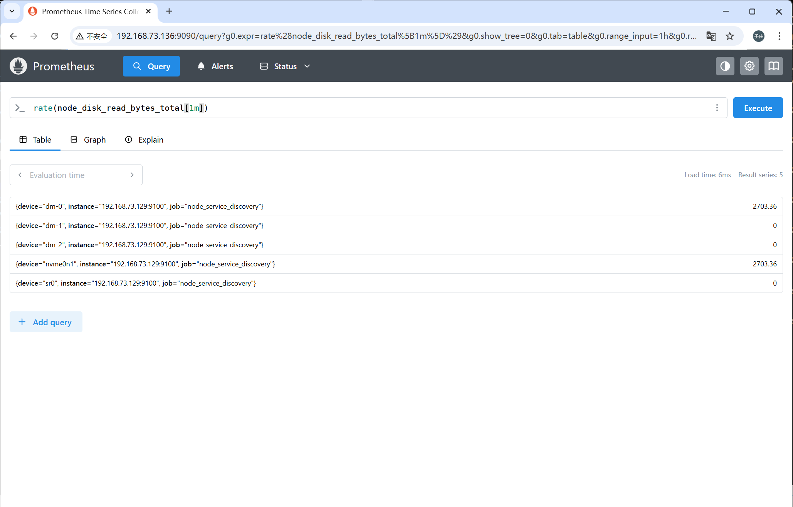

转换为 MB/s

```promql
rate(node_disk_read_bytes_total[1m]) / 1024 / 1024
```

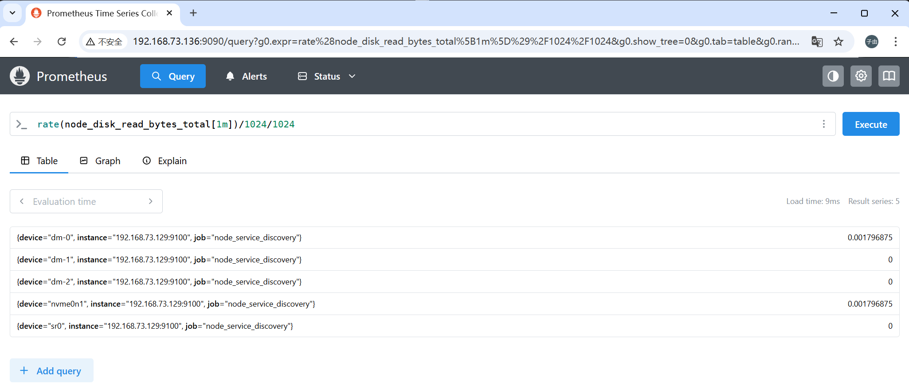

二、**网络接收字节速率**

**指标：**`node_network_receive_bytes_total`

- **含义**：网络接口接收的总字节数（计数器类型）。
- **场景**：监控网络接口的接收速率，判断网络流量是否异常。

PromQL 查询

```promql
rate(node_network_receive_bytes_total[1m])
```

- **解释**：计算过去 1 分钟内网络接口接收字节数的平均速率（单位：字节/秒）。

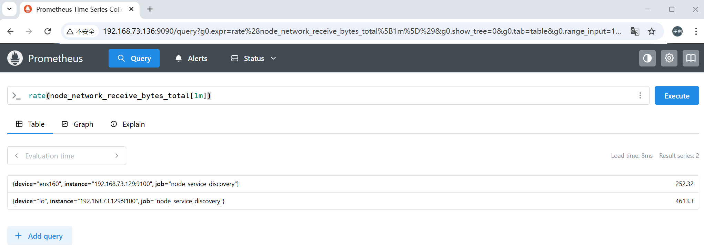

转换为 Mbps，只是`rate`是平均速率，`irate`为下载实时速率，仅计算区间向量中最后两个样本的增长率，适合实时监控变化

```promql
rate(node_network_receive_bytes_total[1m]) * 8 / 1024 / 1024
```

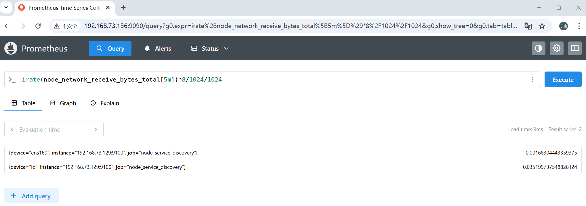

- **解释**：将字节速率转换为 Mbps（兆比特/秒），便于直观理解。

### 5.3.2 Gauge仪表盘

Gauge类型代表一种样本数据可以任意变化的指标，即**可增可减**。Gauge通常用于像温度或者内存使用率这种指标数据，也可以表示能随时请求增加会减少的总数，例如当前并发请求的数量。

[](https://git.inmind-lab.com/aaronxu/Linux-book/src/branch/main/05.监控告警/02.Prometheus/img-ref-4.com&app=2002&size=f9999,10000&q=a80&n=0&g=0n&fmt=jpeg)

2分钟空余内存的变化情况

```bash
node_memory_MemFree_bytes[2m]
```

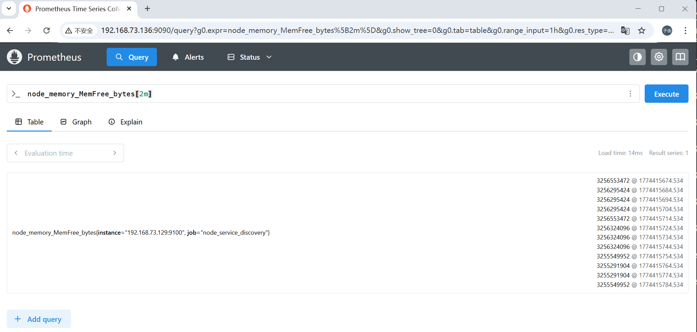

对于Gauge类型的监控指标，通过PromQL内置的函数delta（）可以获取样本在一段时间内的变化情况，例如，计算空余内存两分钟的变化差异

```text
delta(node_memory_MemFree_bytes[2m])
```

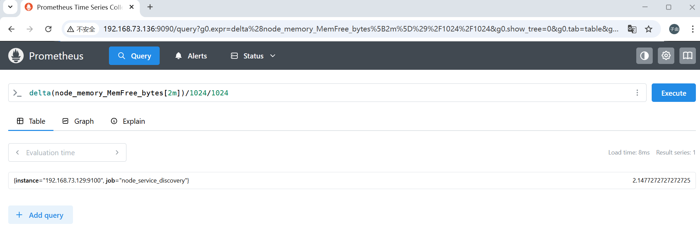

还可以通过PromQL内置函数predict_linear（）基于简单线性回归的方式，对样本数据的变化趋势做出预测。例如，基于两小时的样本数据，来预测主机可用磁盘空间在4个小时之后的剩余情况

```text
predict_linear(node_filesystem_free_bytes{device="/dev/mapper/rl-root"}[2h],4 * 3600)
```

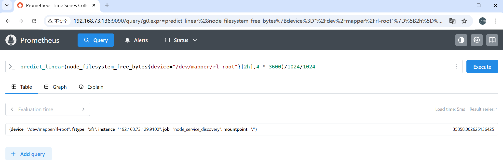

### 5.3.3 Histogram直方图

在大多数情况下人们都倾向于使用某些**量化指标的平均值**，例如cpu的平均使用率、页面的平均响应时间。这种方式的问题很明显，以系统api调用的平均响应时间为例：如果大多数api请求都维持在100ms的响应时间范围内，而个别请求的响应时间需要5秒，那么就会导致某些web页面的响应落到中位数的情况，而这种现象被称为**长尾问题**。

为了区分是平均的慢还是长尾的慢，最简单的方式就是按照请求延迟的范围进行分组。例如，统计延迟在0-10ms之间的请求数有多少而10-20ms之间的请求数又有多少。通过这种方式可以快速分析系统慢的原因。Histogram和Summary都是为了能够解决这样问题的存在，通过Histogram和Summary类型的监控指标我们可以快速了解监控样本的分布情况。

[](https://git.inmind-lab.com/aaronxu/Linux-book/src/branch/main/05.监控告警/02.Prometheus/img-ref-5.com&app=2002&size=f9999,10000&q=a80&n=0&g=0n&fmt=jpeg)

Histogram在一段时间范围内对数据进行采样（通常是请求持续时间或响应大小等），并将其计入可配置的存储桶（bucket）中，后续可通过指定区间筛选样本，也可以统计样本总数，最后一般将数据展示为直方图。

### 5.3.4 Summary摘要

Summary 与 Histogram 类似，用于统计样本的分布情况（如请求延迟、响应大小），但它是在**客户端直接计算并暴露分位数 (quantile)**，而非通过服务端聚合。

#### 核心特性

- **指标构成**：
  - `{basename}_sum`：所有观测值的总和 (Counter)
  - `{basename}_count`：观测的总次数 (Counter)
  - `{basename}{quantile="φ"}`：客户端预先计算好的分位数 (Gauge)，例如 `quantile="0.95"`表示 P95 值。
- **计算方式**：分位数在客户端通过滑动时间窗口计算得出，Prometheus Server 直接存储和使用这些值，查询时无需再计算。
- **与 Histogram 对比**：
  - **Histogram**：在 Server 端通过 `_bucket`和 `histogram_quantile()`函数计算分位数，支持跨实例聚合。
  - **Summary**：在客户端计算分位数，Server 端开销小，但分位数无法跨实例聚合。

# 6. PromQL

Prometheus 提供了一种强大的表达式语言 **PromQL (Prometheus Query Language)**，用于实时选择、聚合和分析时间序列数据。管理员可借此深入了解系统性能、绘制图表及配置告警规则。

## 6.1 时序数据库🗄️

- Prometheus 采用**时序数据库 (TSDB)** 存储所有监控数据，并结合其他组件（如 Pushgateway, Alertmanager）构成完整的监控告警系统。

  #### TSDB 特点

  - **数据写入**
    - **模式**：平稳、持续、高并发、高吞吐。
    - **特征**：写多读少，通常超过 95% 的操作为写入。
    - **数据**：主要写入最近时间段的数据，极少更新。
  - **数据查询**
    - **模式**：按时间范围读取，近期数据访问概率远高于历史数据。
    - **特征**：支持对不同时间密度的数据进行多精度查询。
  - **数据存储**
    - **规模**：数据量大，通常按时间分片存储。
    - **时效**：数据具有时效性，会按保留策略自动降采样或删除。

  #### 对 TSDB 的基本要求

  - **高吞吐写入**：支持高并发、高吞吐的持续写入。
  - **低延迟查询**：支持对聚合结果的快速查询。
  - **海量存储**：能存储海量时间序列数据。
  - **高可用**：支持在线服务场景下的高可用部署。
  - **分布式扩展**：底层通常采用分布式架构，以应对写入和存储压力。

## 6.2 时序数据📈

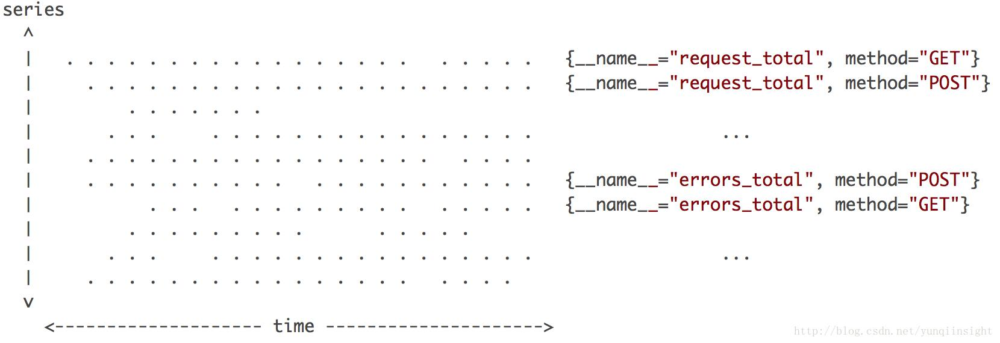

- 时序数据是按时间顺序记录的系统状态变化数据，每个数据点称为一个**样本 (Sample)**。
  - **时间序列 (Time Series)**：对同一指标、同一组标签，随时间不断追加样本而形成的数据流。
  - **向量 (Vector)**：多个时间序列的集合。
    - **即时向量 (Instant Vector)**：特定时间点，一组时间序列各自最新的一个样本集合。
    - **范围向量 (Range Vector)**：特定时间点，一组时间序列在指定时间范围内的所有样本集合。

#### 样本 (Sample) 的构成

每个样本由三部分组成：

1. **指标 (Metric)**：指标名称 (Metric Name) 和一组标签 (Label Set)。
   - **示例**：`request_total{path="/status", method="GET"}`
2. **时间戳 (Timestamp)**：毫秒级精度的时间戳。
3. **样本值 (Value)**：`float64`类型的数值。

在底层，指标名称通常也被视为一个特殊的标签 `__name__`。

时间序列的指标（Metrics）存储格式为 key-value。

[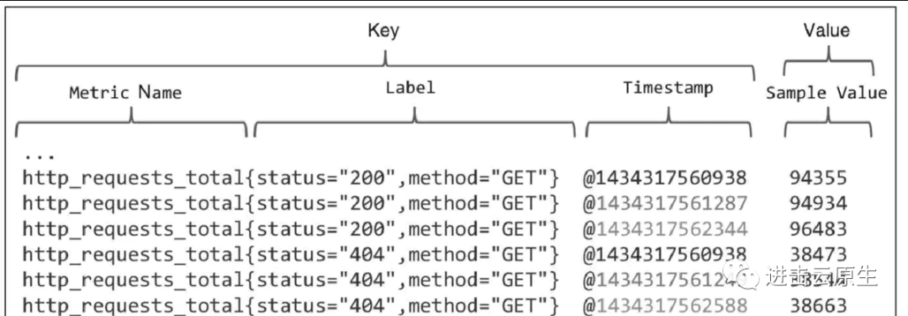](https://git.inmind-lab.com/aaronxu/Linux-book/src/branch/main/05.监控告警/02.Prometheus/image-20250317201508496.png)

## 6.3 时间序列选择器🔍

### 6.3.1 即时向量选择器

即时向量选择器由两部分组成

- **指标名称**：用于限定特定指标下的时间序列，即负责过滤指标，可选
- **匹配器**：或称为标签选择器，用于过滤时间序列上的标签，定义在{}中
- 常见使用举例
  - prometheus_http_requests_total，仅给定指标名称
  - {job="node_exporter"}，仅给定匹配器
  - up{job="node_exporter"}，指标名称和匹配器的组合

匹配器用于定义标签过滤的条件，目前支持如下四种

- =：相等匹配模式，用来指定返回的时间序列与指定的标签完全匹配
- !=：反向匹配模式，即不等于模式
- =~：正则表达式匹配模式
- !~：反向正则表达式

**注意**：选择器必须指定指标名或至少一个非空标签匹配器，例如 `{job=~".+"}`是合法的，而 `{job=~".*"}`是无效的。

### 6.3.2 范围向量选择器

用于获取特定时间范围内的一组样本序列，是许多 PromQL 函数（如 `rate()`, `increase()`）的基础。

- **语法**：在即时向量选择器后附加 `[<duration>]`。
- **示例**：`http_requests_total{job="prometheus"}[5m]`
- **可用单位**：`ms`, `s`, `m`, `h`, `d`, `w`, `y`。
- **组合规则**：可使用整数时间单位组合，如 `1h30m`，但不允许使用小数，如 `1.5h`。

> **注意**：由于各 Target 抓取时间存在微小偏差，范围向量返回的样本时间戳不会严格对齐，Prometheus 保证趋势准确，但非绝对精确。

### 6.3.3 偏移量修改器(Offset)

用于修改选择器的时间基准，默认以当前时间为基准。

- **语法**：`selector [range] offset <duration>`
- **示例**：
  - `up{job="node_exporter"}[5m]`：过去 5 分钟的数据。
  - `up{job="node_exporter"}[5m] offset 1d`：**昨天**同一时间段的 5 分钟数据。

> **注意**：`offset`必须紧跟在选择器之后。

## 6.4 PromQL操作符

### 6.4.1 数学运算

PromQL支持的所有数学运算符如下所示：

- `+` (加法)
- `-` (减法)
- `*` (乘法)
- `/` (除法)
- `%` (求余)
- `^` (幂运算)

示例：计算当前内存的使用率

```text
(node_memory_MemTotal_bytes - node_memory_MemFree_bytes) / node_memory_MemTotal_bytes * 100
```

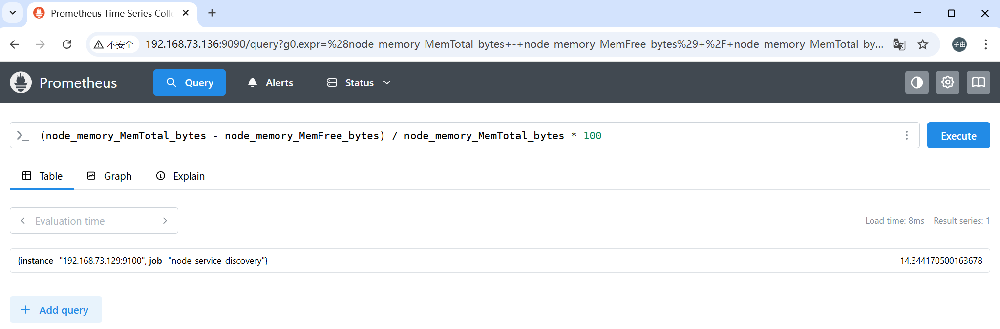

### 6.4.2 布尔运算

目前，Prometheus支持以下布尔运算符如下：

- `==` (相等)
- `!=` (不相等)
- `>` (大于)
- `<` (小于)
- `>=` (大于等于)
- `<=` (小于等于)

### 6.4.3 集合运算符

使用瞬时向量表达式能够获取到一个包含多个时间序列的集合，我们称为瞬时向量。 通过集合运算，可以在两个瞬时向量与瞬时向量之间进行相应的集合操作。目前，Prometheus支持以下集合运算符：

- `and` (并且，交集)
- `or` (或者，并集)
- `unless` (差集)

***vector1 and vector2\*** 会产生一个由vector1的元素组成的新的向量。该向量包含vector1中完全匹配vector2中的元素组成。

***vector1 or vector2\*** 会产生一个新的向量，该向量包含vector1中所有的样本数据，以及vector2中没有与vector1匹配到的样本数据。

***vector1 unless vector2\*** 会产生一个新的向量，新向量中的元素由vector1中没有与vector2匹配的元素组

### 6.4.4 操作符优先级

在PromQL操作符中优先级由高到低依次为：

1. `^`
2. `*, /, %`
3. `+, -`
4. `==, !=, <=, <, >=, >`
5. `and, unless`
6. `or`

## 6.5 PromQL聚合操作

Prometheus还提供了下列内置的聚合操作符，这些操作符作用域瞬时向量。可以将瞬时表达式返回的样本数据进行聚合，形成一个新的时间序列。

- `sum` (求和)
- `min` (最小值)
- `max` (最大值)
- `avg` (平均值)
- `stddev` (标准差)
- `stdvar` (标准差异)
- `count` (计数)
- `count_values` (对value进行计数)
- `bottomk` (后n条时序)
- `topk` (前n条时序)
- `quantile` (分布统计)

**示例，计算所有CPU核心的使用率**

```text
100 - (avg(rate(node_cpu_seconds_total{mode="idle"}[1m])) by (instance) * 100)
```

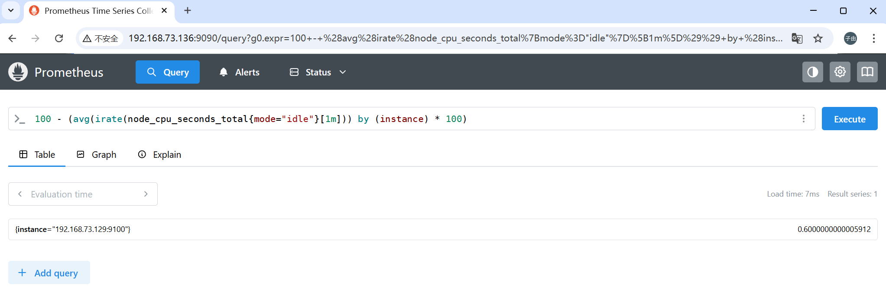

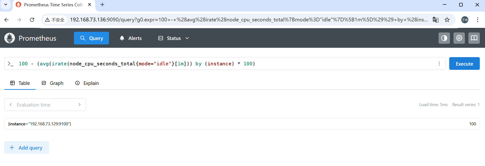

**without**用于从计算结果中**移除列举的标签，而保留其它标签**。by则正好相反，结果向量中**只保留列出的标签，其余标签则移除**。通过without和by可以按照样本的问题对数据进行聚合。

例如：

```text
sum(node_memory_Active_bytes) without (instance)
```

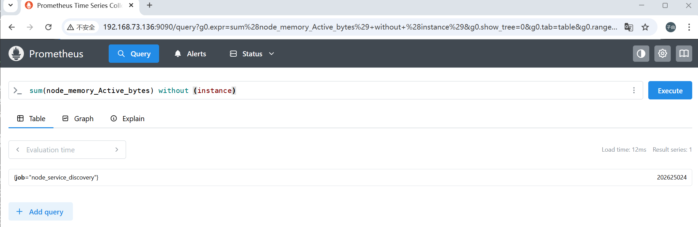

等价于

```text
sum(http_requests_total) by (code,handler,job,method)
```

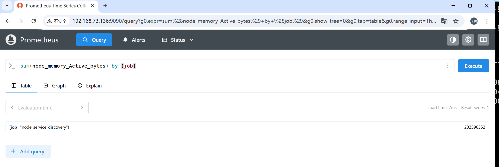

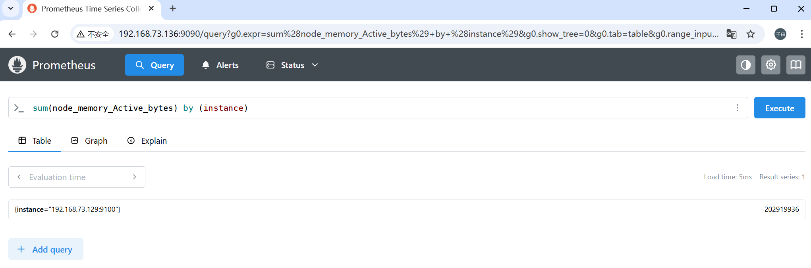

如果只需要计算整个应用的HTTP请求总量，可以直接使用表达式：

```text
sum(http_requests_total)
```

## 6.6 内置函数

### 6.6.1 计算Counter指标增长率

我们知道Counter类型的监控指标其特点是只增不减，在没有发生重置（如服务器重启，应用重启）的情况下其样本值应该是不断增大的。为了能够更直观的表示样本数据的变化剧烈情况，需要计算样本的增长速率。

如下图所示，样本增长率反映出了样本变化的剧烈程度：

[](https://git.inmind-lab.com/aaronxu/Linux-book/src/branch/main/05.监控告警/02.Prometheus/counter-to-rate.png)通过增长率表示样本的变化情况

increase(v range-vector)函数是PromQL中提供的众多内置函数之一。其中参数v是一个区间向量，increase函数获取区间向量中的第一个后最后一个样本并返回其增长量。因此，可以通过以下表达式Counter类型指标的增长率：

```text
increase(node_cpu_seconds_total[2m] )/120
```

这里通过node_cpu[2m]获取时间序列最近两分钟的所有样本，**increase计算出最近两分钟的增长量，最后除以时间120秒得到node_cpu样本在最近两分钟的平均增长率。**并且这个值也近似于主机节点最近两分钟内的平均CPU使用率。

除了使用increase函数以外，PromQL中还直接内置了rate(v range-vector)函数，rate函数可以直接计算区间向量v在时间窗口内平均增长速率。因此，通过以下表达式可以得到与increase函数相同的结果：

```text
rate(node_cpu_seconds_total[2m])
```

需要注意的是使用rate或者increase函数去计算样本的平均增长速率，**容易陷入“长尾问题”当中**，其无法反应在时间窗口内样本数据的突发变化。 例如，对于主机而言在2分钟的时间窗口内，可能在某一个由于访问量或者其它问题导致CPU占用100%的情况，但是通过计算在时间窗口内的平均增长率却无法反应出该问题。

为了解决该问题，PromQL提供了另外一个灵敏度更高的函数irate(v range-vector)。irate同样用于计算区间向量的计算率，但是其反应出的是**瞬时增长率**。irate函数是通过区间向量**中最后两个样本数据**来计算区间向量的增长速率。这种方式可以避免在时间窗口范围内的“长尾问题”，并且体现出更好的灵敏度，通过irate函数绘制的图标能够更好的反应样本数据的瞬时变化状态。

```text
irate(node_cpu_seconds_total[2m])
```

irate函数相比于rate函数提供了更高的灵敏度，不过当需要分析长期趋势或者在告警规则中，irate的这种灵敏度反而容易造成干扰。因此在长期趋势分析或者告警中**更推荐使用rate函数**。

### 6.6.2 预测Gauge指标变化趋势

在一般情况下，系统管理员为了确保业务的持续可用运行，会针对服务器的资源设置相应的告警阈值。例如，当磁盘空间只剩512MB时向相关人员发送告警通知。 这种基于阈值的告警模式对于当资源用量是平滑增长的情况下是能够有效的工作的。 但是如果资源不是平滑变化的呢？ 比如有些某些业务增长，存储空间的增长速率提升了高几倍。这时，如果基于原有阈值去触发告警，当系统管理员接收到告警以后可能还没来得及去处理问题，系统就已经不可用了。 因此阈值通常来说不是固定的，需要定期进行调整才能保证该告警阈值能够发挥去作用。 那么还有没有更好的方法吗？

PromQL中内置的predict_linear(v range-vector, t scalar) 函数可以帮助系统管理员更好的处理此类情况，predict_linear函数可以预测时间序列v在t秒后的值。它基于简单线性回归的方式，对时间窗口内的样本数据进行统计，从而可以对时间序列的变化趋势做出预测。**例如，基于2小时的样本数据，来预测主机可用磁盘空间的是否在4个小时候被占满，可以使用如下表达式：**

```text
predict_linear(node_filesystem_free_bytes[2h],4 * 3600) <0
```

# 7. Grafana数据展示

grafana是一款图形显示非常优秀的工具，支持图表模板导入，支持除Prometheus之外多种数据源（包括MySQL、zabbix、elasticsearch等等）

## 7.1 部署Grafana

- 下载软件包并且安装，官网地址：https://grafana.com/grafana/download

```bash
[root@localhost ~]# wget https://dl.grafana.com/oss/release/grafana-7.5.3-1.x86_64.rpm
[root@localhost ~]# yum install -y grafana-7.5.3-1.x86_64.rpm
```

- 启动Grafana

```bash
[root@localhost ~]# ss -ntl
State  Recv-Q Send-Q Local Address:Port Peer Address:PortProcess 
LISTEN 0      128          0.0.0.0:22        0.0.0.0:*           
LISTEN 0      4096               *:9090            *:*           
LISTEN 0      128             [::]:22           [::]:*           
[root@localhost ~]# systemctl start grafana-server
# 检查3000端口是否监听
[root@localhost ~]# ss -ntl
State  Recv-Q Send-Q Local Address:Port Peer Address:PortProcess 
LISTEN 0      128          0.0.0.0:22        0.0.0.0:*           
LISTEN 0      4096               *:3000            *:*           
LISTEN 0      4096               *:9090            *:*           
LISTEN 0      128             [::]:22           [::]:*           
```

## 7.2 访问Grafana

首次登陆用户名密码为admin admin

登录以后会提示修改密码

[](https://git.inmind-lab.com/aaronxu/Linux-book/src/branch/main/05.监控告警/02.Prometheus/image-20240812231457248.png) [](https://git.inmind-lab.com/aaronxu/Linux-book/src/branch/main/05.监控告警/02.Prometheus/image-20240812231508406.png)

## 7.3 使用Grafana

- 添加数据源

[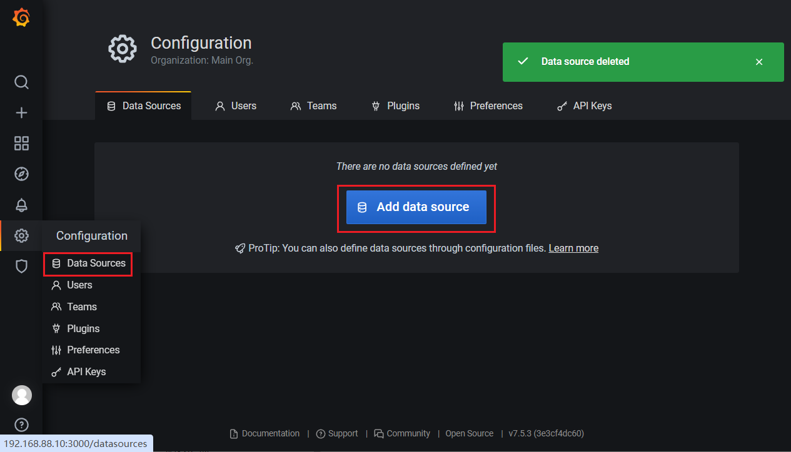](https://git.inmind-lab.com/aaronxu/Linux-book/src/branch/main/05.监控告警/02.Prometheus/image-20240812231620019.png)

- 连接Prometheus

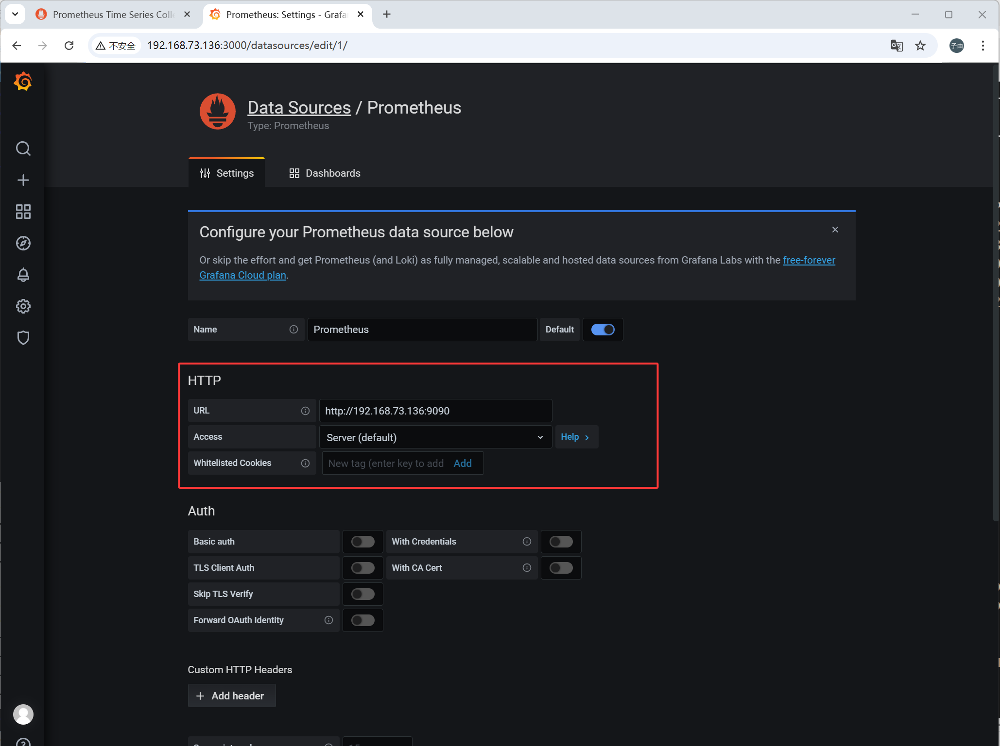

- 添加数据展示(Dashboard)

[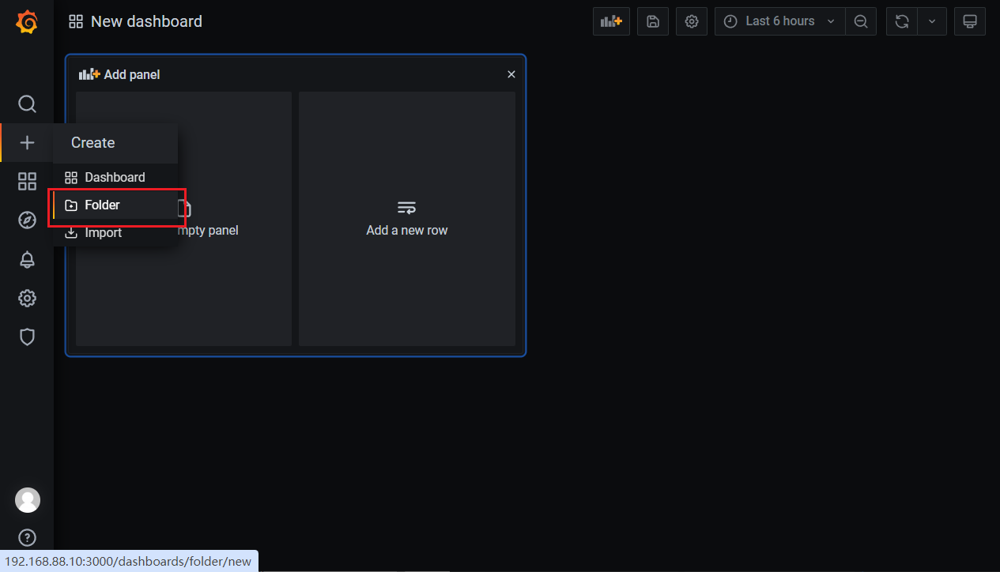](https://git.inmind-lab.com/aaronxu/Linux-book/src/branch/main/05.监控告警/02.Prometheus/image-20240812232151965.png) [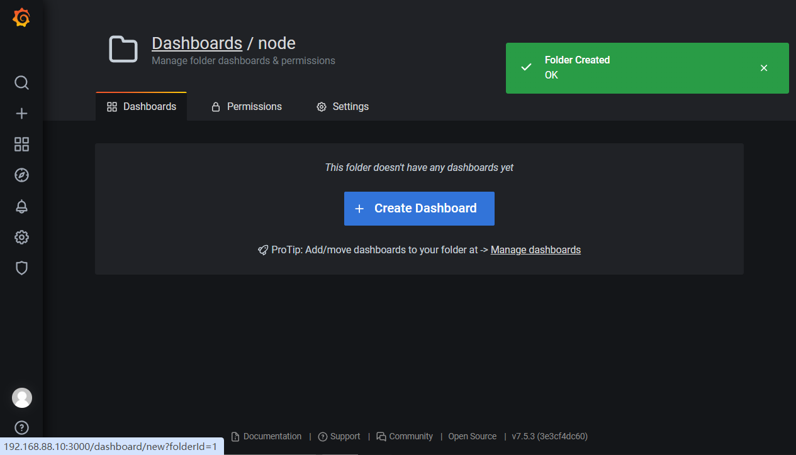](https://git.inmind-lab.com/aaronxu/Linux-book/src/branch/main/05.监控告警/02.Prometheus/image-20240812231822414.png)

[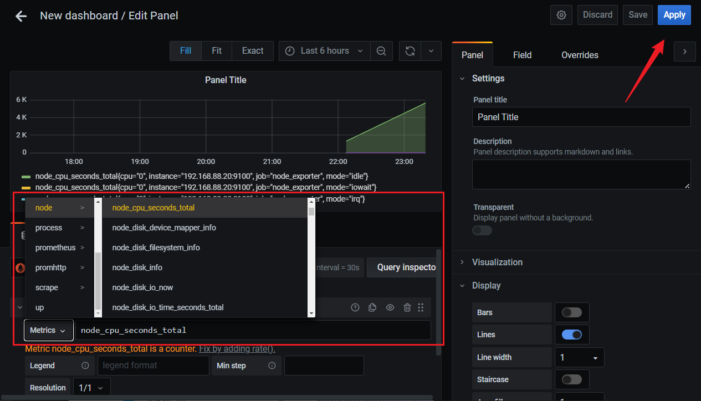](https://git.inmind-lab.com/aaronxu/Linux-book/src/branch/main/05.监控告警/02.Prometheus/image-20240812232017223.png)

- 添加成功以后，就可以在首页中看到我们的数据展示了

[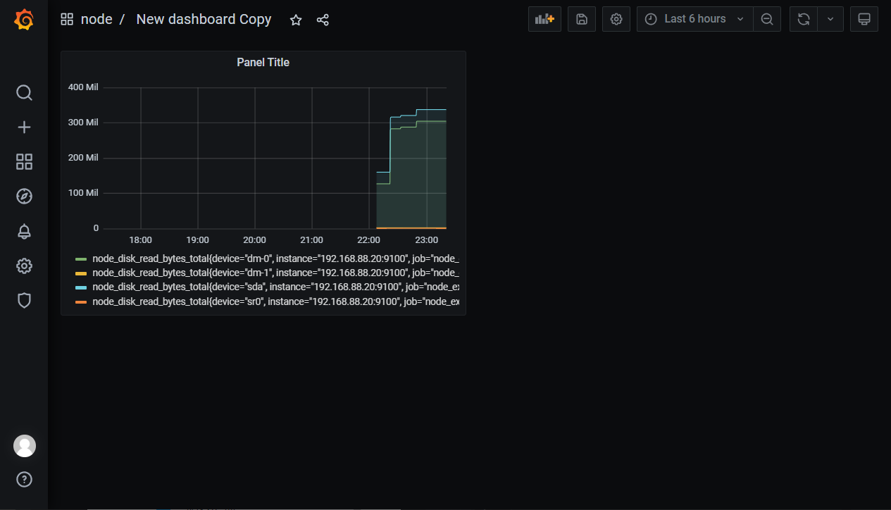](https://git.inmind-lab.com/aaronxu/Linux-book/src/branch/main/05.监控告警/02.Prometheus/image-20240812232120331.png)

我们可以添加多个数据展示

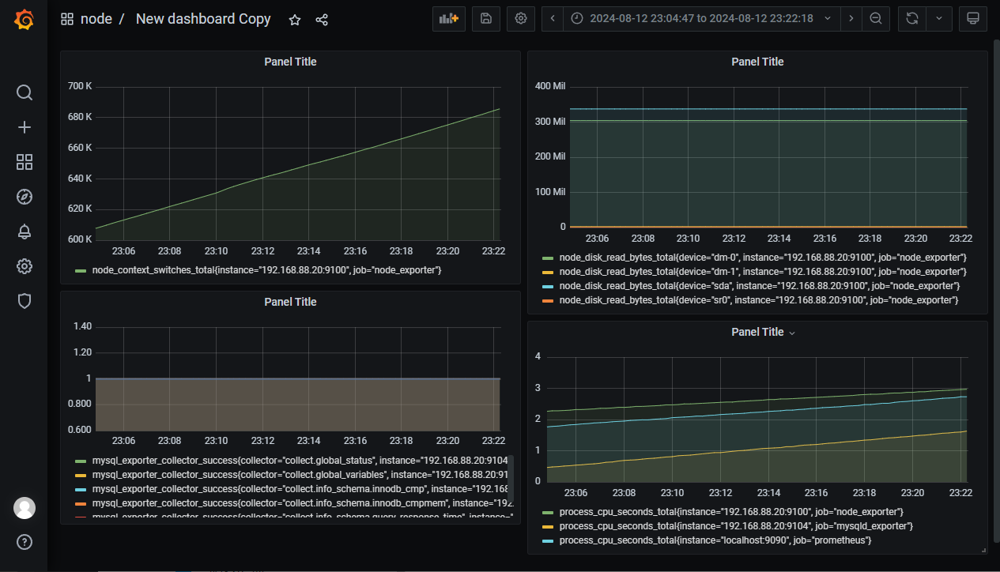

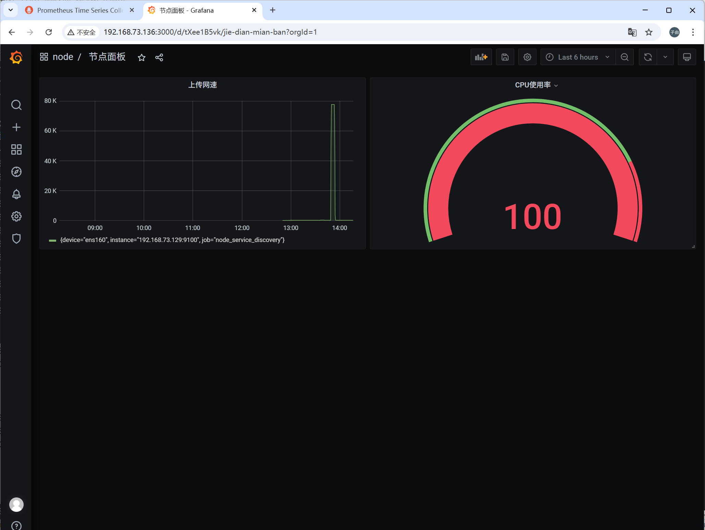

## 7.4 使用第三方模板

自己创建图表展示比较麻烦，我们可以直接使用别人以及做好的模板

官方模板网站：https://grafana.com/grafana/dashboards/

- 可以在搜索框中搜索我们想要的模板

[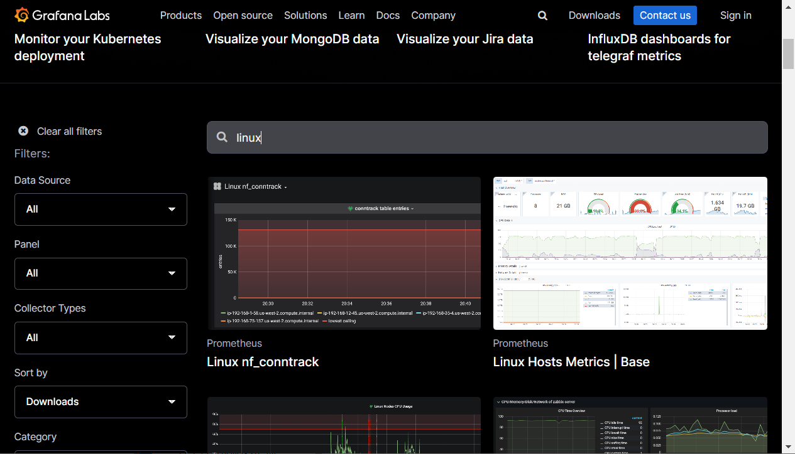](https://git.inmind-lab.com/aaronxu/Linux-book/src/branch/main/05.监控告警/02.Prometheus/image-20240812232546568.png)

- 找到想要的模板以后，直接复制模板代码

[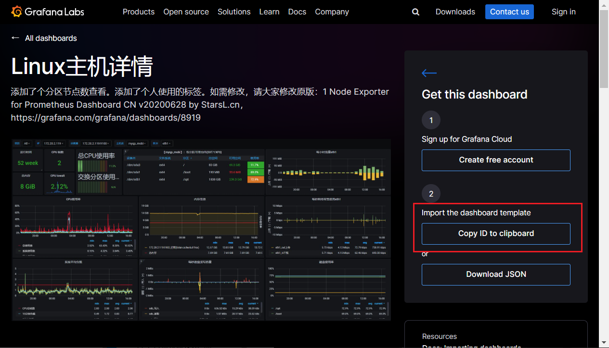](https://git.inmind-lab.com/aaronxu/Linux-book/src/branch/main/05.监控告警/02.Prometheus/image-20240812232616066.png)

- 回到我们自己的Grafana中直接import导入进去

[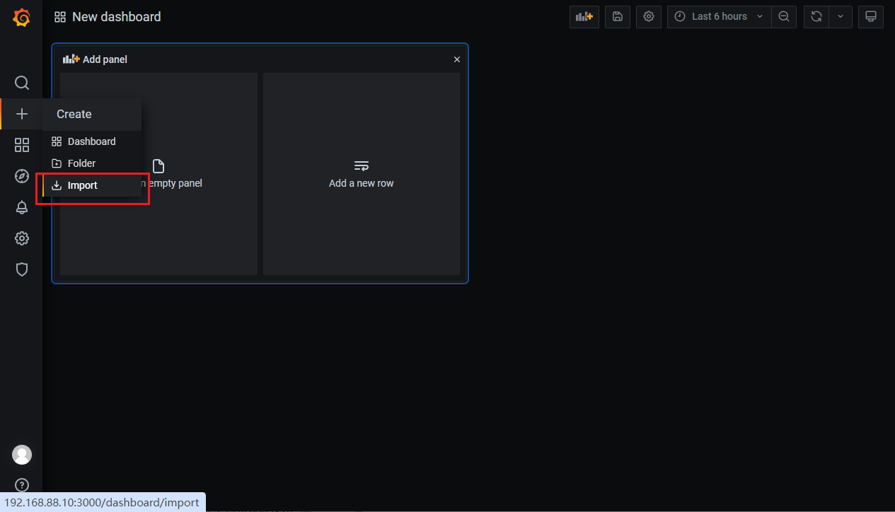](https://git.inmind-lab.com/aaronxu/Linux-book/src/branch/main/05.监控告警/02.Prometheus/image-20240812232709674.png) [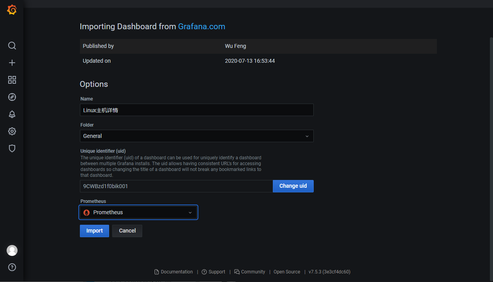](https://git.inmind-lab.com/aaronxu/Linux-book/src/branch/main/05.监控告警/02.Prometheus/image-20240812232741905.png)

- 然后就可以看到我们导入的模板了，并且可以选择不同的Exporter

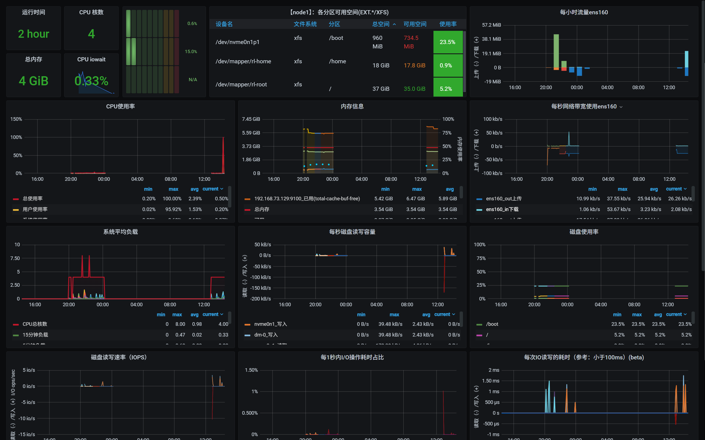

# 8. Alertmanager告警

## 8.1 概述

Prometheus 的监控体系遵循关注点分离原则，由 `Prometheus Server`和 `Alertmanager`两个独立组件协同工作：

- **Prometheus Server**：负责根据预设规则周期性地评估指标，当条件满足时生成告警（Alert）事件。
- **Alertmanager**：作为告警的“处理中心”，负责接收、处理并发送告警通知。

**告警处理流程**

1. **定义接收人 (Receiver)**：在 Alertmanager 中配置 `receiver`，每个 `receiver`代表一个通知渠道（如邮件、企业微信、钉钉）及对应的接收人。
2. **配置路由规则 (Route)**：在 Alertmanager 中定义 `route`，根据告警的标签将其分发到不同的 `receiver`。
3. **编写告警规则 (Alerting Rules)**：在 Prometheus 中编写规则，当规则持续满足时，将告警发送至 Alertmanager 的 API 端点。

下图展示了从指标采集到告警通知的完整链路：

[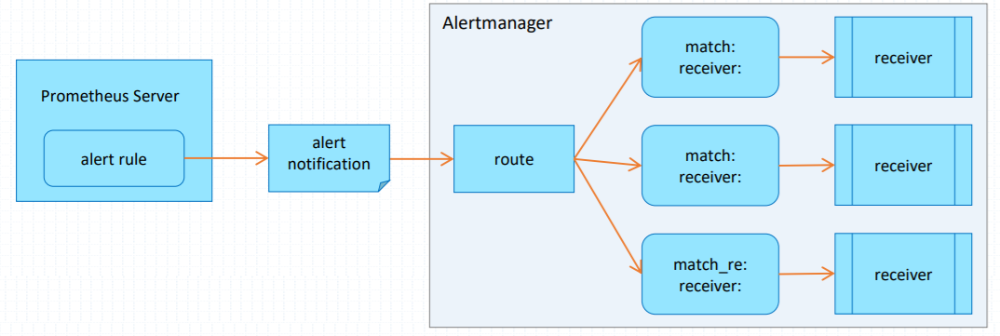](https://git.inmind-lab.com/aaronxu/Linux-book/src/branch/main/05.监控告警/02.Prometheus/image-20210731230744073.png)

## 8.2 Alertmanager机制

除了基础的告警通知，Alertmanager 还提供了一系列高级功能来管理和优化告警流，避免“告警风暴”，确保关键信息不被淹没。

### 8.2.1 分组机制(Grouping)

将具有相同特征的告警合并为一条通知，显著减少通知数量。当大规模故障发生时，所有相关的告警（如某服务所有实例宕机）会被聚合成一条包含实例列表的告警，让您能快速掌握整体影响范围，而不是被海量信息刷屏。

### 8.2.2 抑制机制(Inhibition)

基于告警间的依赖关系，当一个高优先级的根因告警触发时，自动“压制”或“屏蔽”由其引发的低优先级、衍生告警。例如，当“数据中心网络中断”告警触发时，可以抑制该区域内所有“主机宕机”或“服务不可用”的告警，让您能集中精力处理核心故障。

### 8.2.3 静默机制(Silencing)

在指定的时间窗口内，对匹配特定条件的告警“静音”，使其不触发任何通知。这通常用于计划内的系统维护或已知问题的处理期间，避免在维护窗口内收到大量预期内的告警，确保运维人员能专注于真正的故障。

## 8.3 部署Alertmanger

- 下载二进制包

```bash
[root@localhost ~]# wget https://github.com/prometheus/alertmanager/releases/download/v0.21.0/alertmanager-0.21.0.linux-amd64.tar.gz
```

- 解压到指定位置以及赋予权限

```bash
[root@localhost ~]# tar -zxvf alertmanager-0.21.0.linux-amd64.tar.gz -C /data/
alertmanager-0.21.0.linux-amd64/
alertmanager-0.21.0.linux-amd64/alertmanager
alertmanager-0.21.0.linux-amd64/amtool
alertmanager-0.21.0.linux-amd64/NOTICE
alertmanager-0.21.0.linux-amd64/LICENSE
alertmanager-0.21.0.linux-amd64/alertmanager.yml
[root@localhost ~]# cd /data/
[root@localhost data]# chown -R root:root alertmanager-0.21.0.linux-amd64
[root@localhost data]# ln -sv alertmanager-0.21.0.linux-amd64 alertmanager
'alertmanager' -> 'alertmanager-0.21.0.linux-amd64'
```

- 编辑Alertmanger配置文件

默认的配置文件内容：

```bash
[root@localhost data]# cd alertmanager
[root@localhost alertmanager]# ls
LICENSE  NOTICE  alertmanager  alertmanager.yml  amtool
[root@localhost alertmanager]# cat alertmanager.yml
global:								# 全局配置模块
  resolve_timeout: 5m				# 用于设置处理超时时间，默认是5分钟
route:								# 路由配置模块
  group_by: ['alertname']			# 告警分组
  group_wait: 10s					# 10s内收到的同组告警在同一条告警通知中发送出去
  group_interval: 10s				# 同组之间发送告警通知的时间间隔
  repeat_interval: 1h				# 相同告警信息发送重复告警的周期
  receiver: 'web.hook'				# 使用的接收器名称
receivers:							# 接收器
- name: 'web.hook'					# 接收器名称
  webhook_configs:					# 设置webhook地址
  - url: 'http://127.0.0.1:5001/'
inhibit_rules:						# 告警抑制功能模块
  - source_match:
      severity: 'critical'			# 当存在源标签告警触发时抑制含有目标标签的告警
    target_match:
      severity: 'warning'			
    equal: ['alertname', 'dev', 'instance'] 	# 保证该配置下标签内容相同才会被抑制
```

自定义Alertmanager使用qq邮箱报警的配置文件:

```bash
[root@localhost alertmanager]# vim alertmanager.yml 
global:
  resolve_timeout: 5m
  smtp_from: '18862041609@163.com'
  smtp_smarthost: 'smtp.163.com:465'
  smtp_auth_username: '18862041609@163.com'
  smtp_auth_password: 'PCd9RQRC5rwhtGTC'
  smtp_require_tls: false
  smtp_hello: '163.com'

route:
  group_by: ['alertname']
  group_wait: 10s
  group_interval: 10s
  repeat_interval: 1h
  receiver: 'email'
receivers:
- name: 'email'
  email_configs:
    - to: '2331506709@qq.com'
      send_resolved: true
inhibit_rules:
  - source_match:
      severity: 'critical'
    target_match:
      severity: 'warning'
    equal: ['alertname', 'dev', 'instance']
```

- 启动Alertmanager

```bash
# 后台启动
[root@server1 alertmanager]# ./alertmanager &

# 服务启动
[root@localhost alertmanager]# vim /usr/lib/systemd/system/alertmanager.service
[Unit]
Description=Prometheus Alertmanager
Documentation=https://prometheus.io/docs/introduction/>
After=network.target

[Service]
Type=simple
Restart=on-failure
ExecStart=/data/alertmanager/alertmanager --config.file='/data/alertmanager/alertmanager.yml'

[Install]
WantedBy=multi-user.target
[root@localhost alertmanager]# systemctl daemon-reload
[root@localhost alertmanager]# systemctl restart alertmanager
[root@localhost alertmanager]# systemctl status alertmanager
● alertmanager.service - Prometheus Alertmanager
     Loaded: loaded (/usr/lib/systemd/system/alertmanager.service; en>
     Active: active (running) since Wed 2026-03-25 15:37:41 CST; 14s >
       Docs: https://prometheus.io/docs/introduction/>
   Main PID: 2458 (alertmanager)
      Tasks: 9 (limit: 22951)
     Memory: 10.9M
        CPU: 239ms
     CGroup: /system.slice/alertmanager.service
             └─2458 /data/alertmanager/alertmanager --config.file=/da>

Mar 25 15:37:41 localhost systemd[1]: Started Prometheus Alertmanager.
Mar 25 15:37:41 localhost alertmanager[2458]: level=info ts=2026-03-2>
Mar 25 15:37:41 localhost alertmanager[2458]: level=info ts=2026-03-2>
Mar 25 15:37:41 localhost alertmanager[2458]: level=info ts=2026-03-2>
Mar 25 15:37:41 localhost alertmanager[2458]: level=info ts=2026-03-2>
Mar 25 15:37:41 localhost alertmanager[2458]: level=info ts=2026-03-2>
Mar 25 15:37:41 localhost alertmanager[2458]: level=info ts=2026-03-2>
Mar 25 15:37:41 localhost alertmanager[2458]: level=info ts=2026-03-2>
Mar 25 15:37:43 localhost alertmanager[2458]: level=info ts=2026-03-2>
Mar 25 15:37:51 localhost alertmanager[2458]: level=info ts=2026-03-2>
[root@localhost alertmanager]# ss -ntl
State  Recv-Q Send-Q   Local Address:Port   Peer Address:Port Process 
LISTEN 0      128            0.0.0.0:22          0.0.0.0:*            
LISTEN 0      4096                 *:3000              *:*            
LISTEN 0      4096                 *:9090              *:*            
LISTEN 0      4096                 *:9094              *:*            
LISTEN 0      4096                 *:9093              *:*            
LISTEN 0      128               [::]:22             [::]:*            
```

- 关联Prometheus

```bash
[root@localhost data]# cd prometheus
[root@localhost prometheus]# ls
LICENSE  NOTICE  data  prometheus  prometheus.yml  promtool  targets
[root@localhost prometheus]# vim prometheus.yml 

alerting:
  alertmanagers:
    - static_configs:
        - targets:
          - 192.168.73.136:9093
          # - alertmanager:9093
......
scrape_configs:
......
  - job_name: "Alertmanager"
    static_configs:
      - targets: ["192.168.73.136:9093"]
```

- 添加告警规则并且在Prometheus配置文件中导入

```bash
[root@localhost prometheus]# mkdir -p /data/prometheus/rules/
[root@localhost prometheus]# vim prometheus.yml
rule_files:
  - "/data/prometheus/rules/*.yml"
  
[root@server1 rules]# cd /data/prometheus/rules
[root@server1 rules]# vim rules.yml 
groups:
- name: up
  rules:
  - alert: node
    expr: up{instance="192.168.73.129:9100",job="node_service_discovery"} == 0
    for: 1m
    labels:
      severity: critical
    annotations:
      description: "部分节点已经失联超过1分钟！！！"
      summary: "Node down"
        
[root@localhost rules]# cd ..
[root@localhost prometheus]# ./promtool check rules rules/rules.yml 
Checking rules/rules.yml
  SUCCESS: 1 rules found

# 重启Prometheus
[root@localhost prometheus]# systemctl restart prometheus
```

- 在web中查看Rules

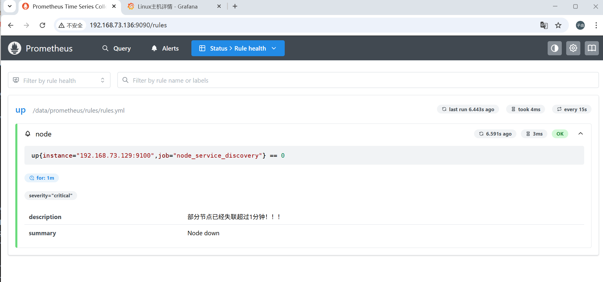

### 8.3.1 关闭node-exporer测试

[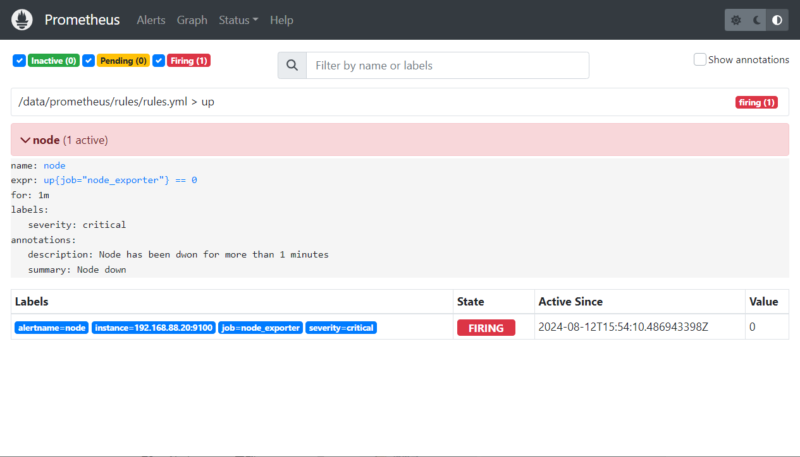](https://git.inmind-lab.com/aaronxu/Linux-book/src/branch/main/05.监控告警/02.Prometheus/image-20240813000948277.png)

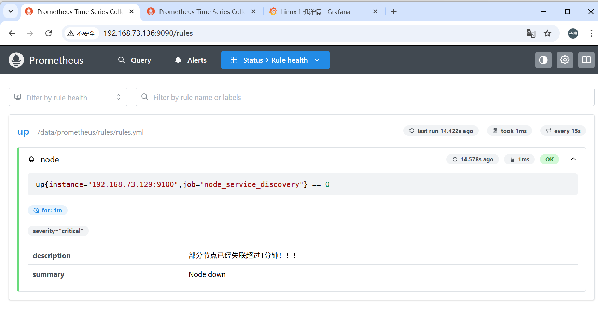

- Interval没有满足触发条件，告警未激活状态
- pending，已满足触发条件，但未满足告警持续时间的状态，即未满足告警中for子句指定的持续时间
- firing，已满足触发条件且已经超过for子句中指定的持续时间时的状态

[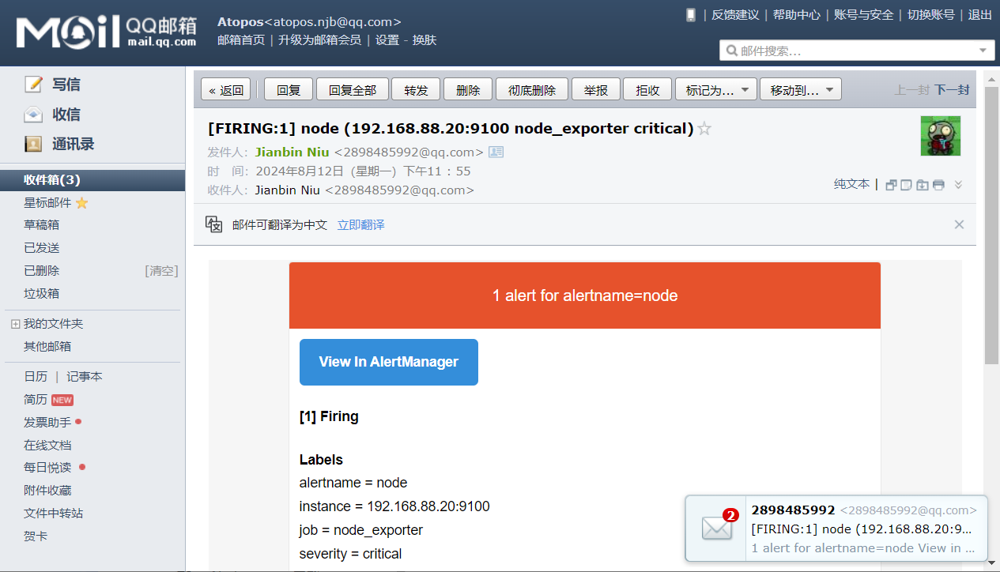](https://git.inmind-lab.com/aaronxu/Linux-book/src/branch/main/05.监控告警/02.Prometheus/image-20240813000937339.png)

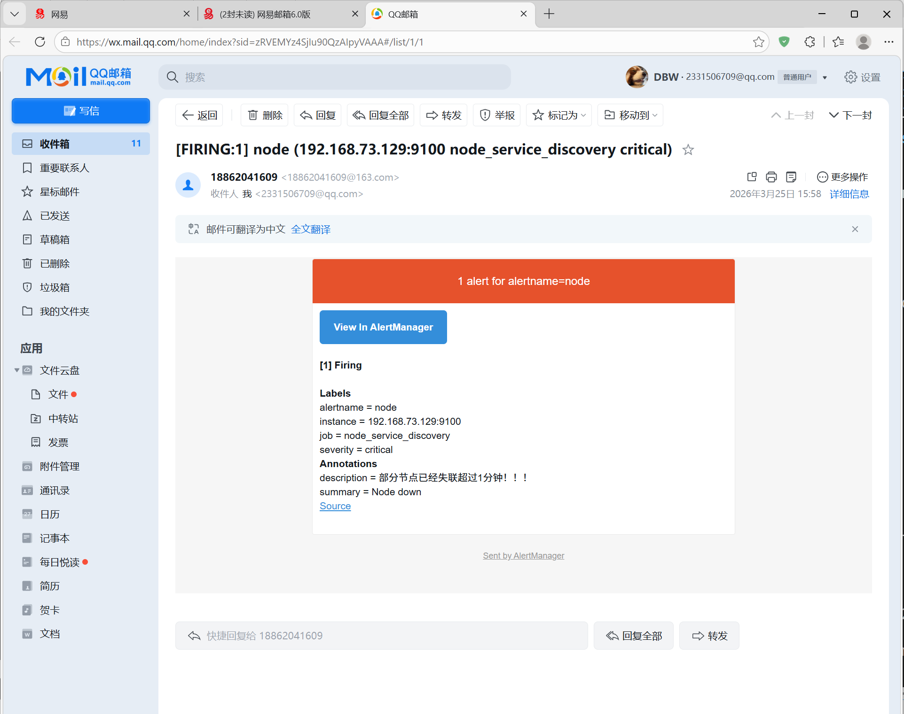

## 8.4 Altermanager告警过程

在Alertmanager中，告警通知的发送逻辑是通过**路由（`route`）**和**接收器（`receivers`）**的配置来实现的。当你定义一个告警规则时，Alertmanager会根据路由规则来决定将告警发送到哪个接收器，而接收器则定义了具体的告警通知方式（如邮件、Slack、Webhook等）。以下是如何将告警与邮件通知关联起来的详细解释，结合你提供的配置文件内容。

------

### 8.4.1 **告警规则（Prometheus）**

告警规则是在Prometheus中定义的，例如你之前提到的`node`告警规则：

```yaml
groups:
- name: up
  rules:
  - alert: node
    expr: up{job="node_exporter"} == 0
    for: 1m
    labels:
      severity: critical
    annotations:
      description: "Node has been down for more than 1 minutes"
      summary: "Node down"
```

当这个规则触发时，Prometheus会将告警发送到Alertmanager。告警会包含以下关键信息：

- **告警名称（`alertname`）**：`node`
- **标签（`labels`）**：例如`severity: critical`
- **注释（`annotations`）**：例如`description`和`summary`

------

### 8.4.2 **Alertmanager的路由规则**

Alertmanager通过路由规则来决定如何处理接收到的告警。在你的配置中：

```yaml
route:
  group_by: ['alertname']
  group_wait: 10s
  group_interval: 10s
  repeat_interval: 1h
  receiver: 'email'
```

#### 8.4.2.1 关键点：

- **`receiver: 'email'`**：这是默认的接收器名称。它告诉Alertmanager，所有未被其他路由规则匹配的告警都将发送到名为`email`的接收器。
- **`group_by: ['alertname']`**：表示告警会根据`alertname`标签进行分组。这意味着具有相同`alertname`的告警会被归为一组，然后一起发送通知。

------

### 8.4.3 **接收器配置**

接收器定义了告警通知的具体方式。在你的配置中：

```yaml
receivers:
- name: 'email'
  email_configs:
  - to: '2898485992@qq.com'
    send_resolved: true
```

#### 8.4.3.1 关键点：

- **`name: 'email'`**：接收器的名称。这与路由规则中的`receiver: 'email'`相匹配。

- `email_configs`

  ：定义了邮件通知的具体配置。

  - **`to: '2898485992@qq.com'`**：收件人的邮箱地址。
  - **`send_resolved: true`**：当告警解决时，也会发送邮件通知。

------

### 8.4.4 **告警的发送流程**

当Prometheus触发告警并发送到Alertmanager时，以下是处理流程：

1. **接收告警**：Alertmanager接收到告警后，会根据告警的`alertname`、`labels`等信息进行处理。

2. 匹配路由规则：

   - 根据`route`配置，告警会根据`alertname`分组。
   - 默认情况下，所有告警都会发送到`email`接收器。
   
3. 匹配接收器：

   - 找到名为`email`的接收器。
   - 根据`email_configs`配置，将告警通知发送到指定的邮箱地址。
   
4. 发送邮件：

   - Alertmanager使用全局配置中的SMTP服务器信息（如`smtp_from`、`smtp_smarthost`等）。
- 将告警内容（包括`annotations`中的描述）通过邮件发送给`to`指定的收件人。

------

### 8.4.5 **如何知道发送邮件？**

Alertmanager知道发送邮件的原因是：

- **路由规则**指定了告警的默认接收器为`email`。
- **接收器配置**中，`email`接收器定义了邮件通知的方式和目标邮箱。

如果需要发送其他通知方式（如Slack、Webhook等），只需在`receivers`中定义其他接收器，并在`route`中指定对应的接收器即可。

------

### 8.4.6 示例：添加Slack通知

假设你希望某些告警发送到Slack，可以这样配置：

```yaml
route:
  group_by: ['alertname']
  group_wait: 10s
  group_interval: 10s
  repeat_interval: 1h
  receiver: 'email'  # 默认接收器
  routes:
    - match:
        severity: critical
      receiver: 'slack'  # 为严重告警指定Slack接收器

receivers:
- name: 'email'
  email_configs:
  - to: '2898485992@qq.com'
    send_resolved: true

- name: 'slack'
  slack_configs:
  - api_url: 'https://hooks.slack.com/services/XYZ'
    channel: '#alerts'
    send_resolved: true
```

在这个配置中：

- 所有`severity: critical`的告警会发送到Slack。
- 其他告警仍然发送到邮件。

通过这种方式，Alertmanager可以根据告警的特征（如标签、严重性等）灵活地选择通知方式。

**其他告警方式自行扩展，以及Grafana工具的更多用法**