- 目前我们主流的硬盘主要有两种形态，一种是及机械硬盘(HDD)，一种是的固态硬盘(SSD)

# 1. 硬盘工作原理💽

## 1.1 机械硬盘 (HDD)

机械硬盘 (Hard Disk Drive, HDD) 通过机械部件读写数据。其内部由高速旋转的磁性盘片、可在盘片上移动的磁头及机械臂构成。数据以磁性方式存储在盘片的同心圆上。

由于读写过程涉及盘片旋转和机械臂寻道，HDD存在固有的机械延迟，因此随机读写性能相对较弱。同时，长期运行带来的机械磨损会导致磁头定位精度下降，可能引发速度变慢、文件损坏等问题，这也是老旧电脑运行卡顿的常见原因之一。


## 1.2 固态硬盘 (SSD)

固态硬盘 (Solid State Drive, SSD) 基于闪存 (Flash) 技术，数据通过主控芯片写入浮栅晶体管来存储和读取。

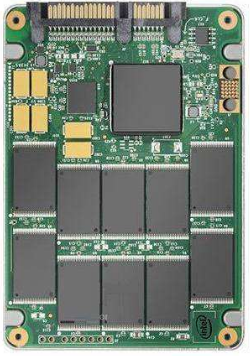

由于没有机械运动部件，SSD的读写完全依赖数字电路，因此访问延迟极低，随机读写性能远超HDD。但其也存在局限性：

- **写入寿命**：闪存单元有写入次数上限（P/E次数），达到一定次数后性能会下降甚至失效。
- **数据恢复**：一旦损坏，数据恢复的难度和成本通常高于HDD。

因此，尽管SSD在个人电脑中日益普及，但在对成本和数据可靠性要求极高的企业级存储场景，HDD依然是主力。


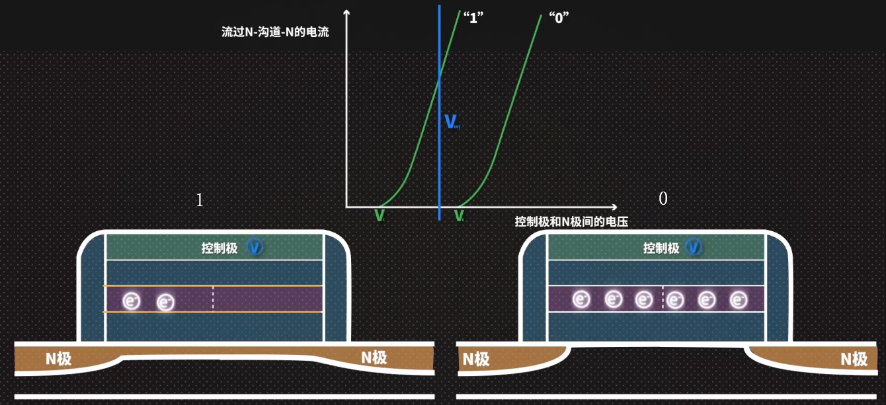

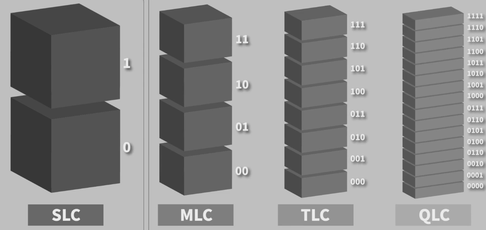 

# 2. 硬盘设备命名🏷️

在Linux系统中，不同类型的磁盘设备有不同的命名规则：

- **物理磁盘**：使用 `sd`前缀加小写字母标识，如系统中的第一块硬盘为 `/dev/sda`，第二块为 `/dev/sdb`，以此类推。
- **磁盘分区**：在物理磁盘名后加上数字表示，如 `/dev/sda1`、`/dev/sda2`等。
- **其他设备**：
  - **NVMe 固态硬盘**：通常命名为 `/dev/nvme0n1`、`/dev/nvme0n2`。
  - **U盘/移动硬盘**：通常也使用 `sd`前缀，如 `/dev/sdc`。

# 3. 分区表🗺️

分区表是硬盘上的一块特殊区域，用于记录分区信息，帮助操作系统识别和管理磁盘布局。主流的分区表格式有MBR和GPT两种。

| 特性         | MBR (主引导记录)                                             | GPT (GUID 分区表)                                            |
| ------------ | ------------------------------------------------------------ | ------------------------------------------------------------ |
| **管理容量** | 最大支持约 **2 TiB**。                                       | 理论支持高达 **18 EB**，足以应对当前及未来的大容量硬盘。     |
| **分区数量** | 最多 **4 个主分区**。若要创建更多分区，需使用**扩展分区**，其内部可划分多个逻辑分区，但在分区表中仅算作1个。 | 支持数量极多（Windows系统通常限制为128个），管理更灵活。     |
| **系统引导** | 需要一个标记为“**活动 (Active)**”的主分区，用于存放引导文件 (Boot Loader)。 | 需要一个 **EFI 系统分区 (ESP)** 来存放UEFI引导文件。通常还包含一个MSR (微软保留分区)。 |
| **兼容性**   | 兼容所有操作系统，是传统的标准格式。                         | 需要系统支持UEFI启动模式。                                   |

- 启动流程简述
  - **MBR 磁盘**：BIOS/UEFI 读取 MBR，找到“活动分区”，然后加载并执行其中的引导程序。

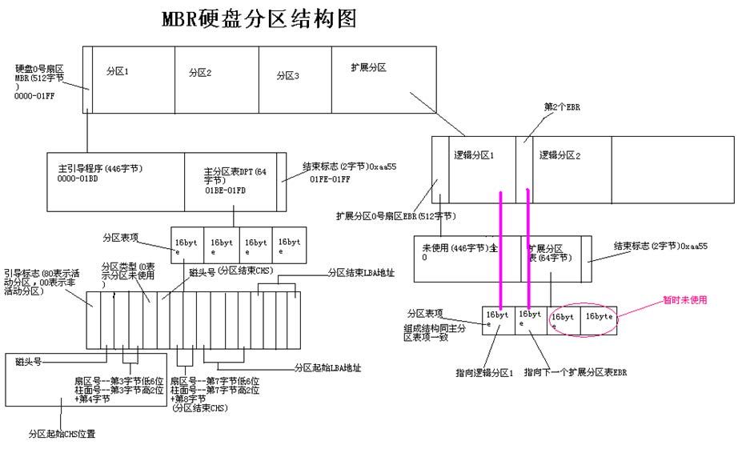

- **GPT 磁盘**：固件读取 EFI 分区中的引导程序，再加载操作系统。缺少 EFI 分区通常会导致无法从GPT磁盘启动。

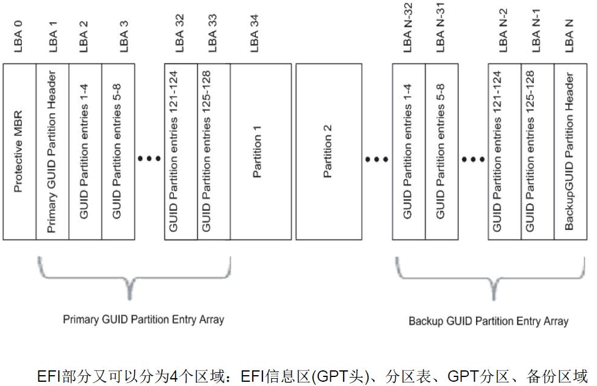

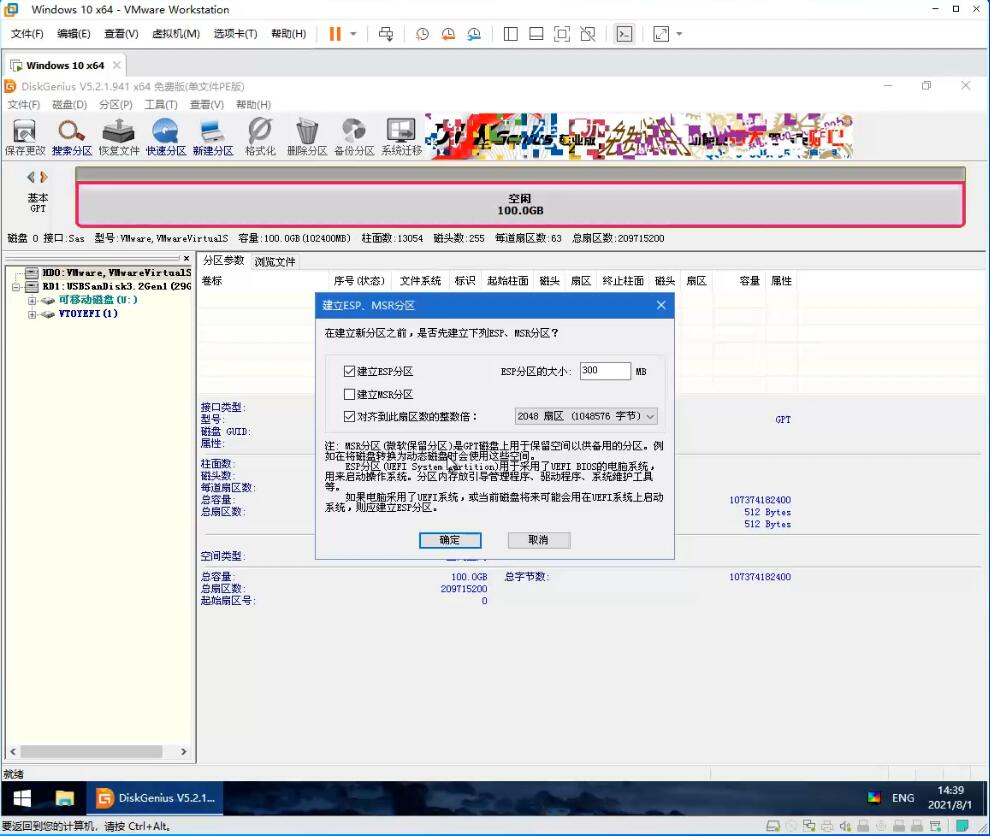

电脑启动的时候：

- MBR分区表会找到激活分区，从里面加载系统启动；

- GPT分区表会查找EFI分区，没有是开不了机的，所以GPT分区表情况下需要建立ESP，MSR分区。

- MSR是微软保留的引导分区，分区一般不会坏因此一般不需要。

- ESP建立512MB，对齐到扇区整数倍是指一次读写几个扇区（例如新建个txt只写一个字符，依旧占用4K，除非越写越大超过4K，占4K的整数倍），并不是越大越好也不是越小越好，根据实际需求，一般是4KB。

# 4. 管理分区

- 列出块设备

```bash
[root@localhost ~]# lsblk
NAME        MAJ:MIN RM  SIZE RO TYPE MOUNTPOINTS
sda           8:0    0   20G  0 disk 
sdb           8:16   0   20G  0 disk 
sr0          11:0    1 1024M  0 rom  
nvme0n1     259:0    0   60G  0 disk 
├─nvme0n1p1 259:1    0    1G  0 part /boot
└─nvme0n1p2 259:2    0   59G  0 part 
  ├─rl-root 253:0    0   37G  0 lvm  /
  ├─rl-swap 253:1    0  3.9G  0 lvm  [SWAP]
  └─rl-home 253:2    0 18.1G  0 lvm  /home
```

- 创建分区命令

```bash
fdisk  管理MBR分区
gdisk  管理GPT分区
parted 高级分区操作
```

- 重新设置内存中的内核分区表版本

```bash
partprobe
```

## 4.1 parted 命令

- parted的操作都是实时生效的，小心使用
- 格式：

```bash
parted [选项]... [设备 [命令 [参数]...]...] 
```

- 操作命令：

```bash
cp [FROM-DEVICE] FROM-MINOR TO-MINOR           #将文件系统复制到另一个分区 
help [COMMAND]                                 #打印通用求助信息，或关于 COMMAND 的信息 
mklabel 标签类型                               #创建新的磁盘标签 (分区表) 
mkfs MINOR 文件系统类型                        #在 MINOR 创建类型为“文件系统类型”的文件系统 
mkpart 分区类型 [文件系统类型] 起始点 终止点   #创建一个分区 
mkpartfs 分区类型 文件系统类型 起始点 终止点   #创建一个带有文件系统的分区 
move MINOR 起始点 终止点                       #移动编号为 MINOR 的分区 
name MINOR 名称                                #将编号为 MINOR 的分区命名为“名称” 
print [MINOR]                                  #打印分区表，或者分区 
quit                                           #退出程序 
rescue 起始点 终止点                           #挽救临近“起始点”、“终止点”的遗失的分区 
resize MINOR 起始点 终止点                     #改变位于编号为 MINOR 的分区中文件系统的大小 
rm MINOR                                       #删除编号为 MINOR 的分区 
select 设备                                    #选择要编辑的设备 
set MINOR 标志 状态                            #改变编号为 MINOR 的分区的标志
```

- 查看分区情况

```bash
[root@localhost ~]# parted /dev/nvme0n1 print
Model: VMware Virtual NVMe Disk (nvme)
Disk /dev/nvme0n1: 64.4GB
Sector size (logical/physical): 512B/512B
Partition Table: msdos
Disk Flags: 

Number  Start   End     Size    Type     File system  Flags
 1      1049kB  1075MB  1074MB  primary  xfs          boot
 2      1075MB  64.4GB  63.3GB  primary               lvm

[root@localhost ~]# parted /dev/sda print
Error: /dev/sda: unrecognised disk label
Model: ATA VMware Virtual S (scsi)                                        
Disk /dev/sda: 21.5GB
Sector size (logical/physical): 512B/512B
Partition Table: unknown
Disk Flags: 
```

- 设置磁盘的分区表

```bash
# [root@localhost ~]# parted /dev/nvme0n2 mklabel msdos
[root@localhost ~]# parted /dev/sda mklabel gpt
Information: You may need to update /etc/fstab.

[root@localhost ~]# parted /dev/sda print
Model: ATA VMware Virtual S (scsi)
Disk /dev/sda: 21.5GB
Sector size (logical/physical): 512B/512B
Partition Table: gpt
Disk Flags: 

Number  Start  End  Size  File system  Name  Flags
# 由于没有分区，所有没有具体的分区信息
```

- 对磁盘进行分区

```bash
# 创建1个G大小的分区
[root@localhost ~]# parted /dev/sda mkpart primary 1 1G
Information: You may need to update /etc/fstab.

[root@localhost ~]# parted /dev/sda print                                 
Model: ATA VMware Virtual S (scsi)
Disk /dev/sda: 21.5GB
Sector size (logical/physical): 512B/512B
Partition Table: gpt
Disk Flags: 

Number  Start   End     Size   File system  Name     Flags
 1      1049kB  1000MB  999MB               primary
```

- 删除分区

```bash
[root@localhost ~]# parted /dev/sda rm 1
Information: You may need to update /etc/fstab.

[root@localhost ~]# parted /dev/sda print                                 
Model: ATA VMware Virtual S (scsi)
Disk /dev/sda: 21.5GB
Sector size (logical/physical): 512B/512B
Partition Table: gpt
Disk Flags: 

Number  Start  End  Size  File system  Name  Flags
```

- 修改磁盘为mbr分区，注意会丢失所有数据

```bash
[root@localhost ~]# parted /dev/sda mklabel msdos
Warning: The existing disk label on /dev/sda will be destroyed and all data on this disk will be lost. Do you want to continue?
Yes/No? yes                                                               
Information: You may need to update /etc/fstab.

[root@localhost ~]# parted /dev/sda print
Model: ATA VMware Virtual S (scsi)
Disk /dev/sda: 21.5GB
Sector size (logical/physical): 512B/512B
Partition Table: msdos
Disk Flags: 

Number  Start  End  Size  Type  File system  Flags
```

## 4.2 fdisk工具

管理磁盘中MBR分区

```
fdisk [磁盘名称]
```

fdisk命令中的参数以及作用

| 参数 | 作用                   |
| ---- | ---------------------- |
| m    | 查看全部可用的参数     |
| n    | 添加新的分区           |
| d    | 删除某个分区信息       |
| l    | 列出所有可用的分区类型 |
| t    | 改变某个分区的类型     |
| p    | 查看分区信息           |
| w    | 保存并退出             |
| q    | 不保存直接退出         |

[](https://git.inmind-lab.com/aaronxu/Linux-book/src/branch/main/01.Linux基础/09.存储管理/分区操作.gif)

```bash
[root@localhost ~]# fdisk /dev/sda

Welcome to fdisk (util-linux 2.37.4).
Changes will remain in memory only, until you decide to write them.
Be careful before using the write command.


Command (m for help): n
Partition type
   p   primary (0 primary, 0 extended, 4 free)
   e   extended (container for logical partitions)
Select (default p): p
Partition number (1-4, default 1): 1
First sector (2048-41943039, default 2048): 
Last sector, +/-sectors or +/-size{K,M,G,T,P} (2048-41943039, default 41943039): +1G

Created a new partition 1 of type 'Linux' and of size 1 GiB.

Command (m for help): p
Disk /dev/sda: 20 GiB, 21474836480 bytes, 41943040 sectors
Disk model: VMware Virtual S
Units: sectors of 1 * 512 = 512 bytes
Sector size (logical/physical): 512 bytes / 512 bytes
I/O size (minimum/optimal): 512 bytes / 512 bytes
Disklabel type: dos
Disk identifier: 0x207d4739

Device     Boot Start     End Sectors Size Id Type
/dev/sda1        2048 2099199 2097152   1G 83 Linux

Command (m for help): w
The partition table has been altered.
Calling ioctl() to re-read partition table.
Syncing disks.

[root@localhost ~]# lsblk
NAME        MAJ:MIN RM  SIZE RO TYPE MOUNTPOINTS
sda           8:0    0   20G  0 disk 
└─sda1        8:1    0    1G  0 part 
sdb           8:16   0   20G  0 disk 
sr0          11:0    1 1024M  0 rom  
nvme0n1     259:0    0   60G  0 disk 
├─nvme0n1p1 259:1    0    1G  0 part /boot
└─nvme0n1p2 259:2    0   59G  0 part 
  ├─rl-root 253:0    0   37G  0 lvm  /
  ├─rl-swap 253:1    0  3.9G  0 lvm  [SWAP]
  └─rl-home 253:2    0 18.1G  0 lvm  /home
```

## 4.3 gdisk工具

管理磁盘中的GPT分区

使用方式和选项与fdisk中几乎一致

```bash
[root@localhost ~]# gdisk /dev/sda
GPT fdisk (gdisk) version 1.0.7

Partition table scan:
  MBR: MBR only
  BSD: not present
  APM: not present
  GPT: not present


***************************************************************
Found invalid GPT and valid MBR; converting MBR to GPT format
in memory. THIS OPERATION IS POTENTIALLY DESTRUCTIVE! Exit by
typing 'q' if you don't want to convert your MBR partitions
to GPT format!
***************************************************************


Command (? for help): ?
b	back up GPT data to a file
c	change a partition's name
d	delete a partition
i	show detailed information on a partition
l	list known partition types
n	add a new partition
o	create a new empty GUID partition table (GPT)
p	print the partition table
q	quit without saving changes
r	recovery and transformation options (experts only)
s	sort partitions
t	change a partition's type code
v	verify disk
w	write table to disk and exit
x	extra functionality (experts only)
?	print this menu

Command (? for help): p
Disk /dev/sda: 41943040 sectors, 20.0 GiB
Model: VMware Virtual S
Sector size (logical/physical): 512/512 bytes
Disk identifier (GUID): 126C3307-C463-4BE7-A7BA-0C5C20ECF440
Partition table holds up to 128 entries
Main partition table begins at sector 2 and ends at sector 33
First usable sector is 34, last usable sector is 41943006
Partitions will be aligned on 2048-sector boundaries
Total free space is 39845821 sectors (19.0 GiB)

Number  Start (sector)    End (sector)  Size       Code  Name
   1            2048         2099199   1024.0 MiB  8300  Linux filesystem

Command (? for help): d
Using 1

Command (? for help): w

Final checks complete. About to write GPT data. THIS WILL OVERWRITE EXISTING
PARTITIONS!!

Do you want to proceed? (Y/N): Y
OK; writing new GUID partition table (GPT) to /dev/sda.
The operation has completed successfully.
[root@localhost ~]# lsblk
NAME        MAJ:MIN RM  SIZE RO TYPE MOUNTPOINTS
sda           8:0    0   20G  0 disk 
sdb           8:16   0   20G  0 disk 
sr0          11:0    1 1024M  0 rom  
nvme0n1     259:0    0   60G  0 disk 
├─nvme0n1p1 259:1    0    1G  0 part /boot
└─nvme0n1p2 259:2    0   59G  0 part 
  ├─rl-root 253:0    0   37G  0 lvm  /
  ├─rl-swap 253:1    0  3.9G  0 lvm  [SWAP]
  └─rl-home 253:2    0 18.1G  0 lvm  /home
[root@localhost ~]# parted /dev/sda print
Model: ATA VMware Virtual S (scsi)
Disk /dev/sda: 21.5GB
Sector size (logical/physical): 512B/512B
Partition Table: gpt	# 使用gdisk改过后变成了gpt格式了
Disk Flags: 

Number  Start  End  Size  File system  Name  Flags

```

# 5. 存储结构与磁盘划分📂

Linux系统采用单一的树形目录结构，所有文件和目录都从根目录（`/`）开始。理解各目录的用途是系统管理的基础。

#### 常见目录功能解析

| 目录名称         | 功能说明                                                     |
| ---------------- | ------------------------------------------------------------ |
| `/`              | **根目录**：整个文件系统的起点，所有其他目录和文件都挂载于此。 |
| `/boot`          | **启动目录**：存放系统启动所必需的文件，如内核 (`vmlinuz`)、初始内存盘 (`initrd`) 和引导加载程序 (`GRUB`) 配置。 |
| `/dev`           | **设备文件目录**：将硬件设备抽象为文件，如硬盘 (`/dev/sda`)、终端 (`/dev/tty`)。 |
| `/etc`           | **配置文件目录**：存放系统和绝大多数应用程序的配置文件，如用户账户 (`/etc/passwd`)、网络 (`/etc/hosts`)。 |
| `/home`          | **普通用户家目录**：每个用户在此拥有以自己用户名命名的子目录，用于存放个人数据和配置。 |
| `/root`          | **root用户家目录**：系统管理员（root）的主目录，区别于普通用户的 `/home`。 |
| `/bin`           | **基础命令目录**：存放系统启动和单用户模式下必需的基本命令，如 `ls`, `cp`, `bash`。 |
| `/sbin`          | **系统管理命令目录**：存放系统管理和维护相关的命令，如 `fdisk`, `ifconfig`，通常仅root可用。 |
| `/lib`/ `/lib64` | **共享库目录**：存放 `/bin`和 `/sbin`中程序依赖的共享库文件。`/lib64`专为64位系统提供。 |
| `/media`         | **可移动媒体挂载点**：系统自动挂载U盘、光盘等可移动设备时使用的目录。 |
| `/mnt`           | **临时挂载点**：管理员手动挂载文件系统（如新硬盘分区）时常用的目录。 |
| `/opt`           | **第三方软件目录**：用于安装非系统自带的商业或大型第三方软件。 |
| `/srv`           | **服务数据目录**：存放由系统提供的服务（如HTTP、FTP）所使用的数据文件。 |
| `/tmp`           | **临时文件目录**：所有用户均可读写，系统重启后内容通常会被清空。 |
| `/proc`          | **内核与进程信息虚拟文件系统**：不占用磁盘空间，实时反映内核、进程及系统状态，如 `/proc/cpuinfo`。 |
| `/sys`           | **设备与驱动信息虚拟文件系统**：与 `/proc`类似，提供设备、驱动和内核参数的接口。 |
| `/usr`           | **用户程序目录**：存放系统级的只读数据，如应用程序、库文件和文档。其子目录包括： • `/usr/bin`, `/usr/sbin`: 大部分用户和管理命令。 • `/usr/local`: 用户自行编译安装的软件。 • `/usr/share`: 共享数据，如帮助文档。 |
| `/var`           | **可变数据目录**：存放日志、缓存、邮件队列等频繁变化的文件，如 `/var/log`。 |
| `/lost+found`    | **文件系统恢复目录**：当文件系统发生错误时，`fsck`工具会将恢复的文件片段存放在此。 |

------

#### 路径表示方法

- **绝对路径 (Absolute Path)**

  从根目录 `/`开始的完整路径，唯一确定一个文件或目录的位置。

```bash
/home/alice/Documents/report.txt

/etc/nginx/nginx.conf
```

- **相对路径 (Relative Path)**

  相对于当前工作目录的路径，不以 `/`开头。

# 6. 物理设备的命名规则⚙️

在Linux中，硬件设备被抽象为设备文件，存放在 `/dev`目录下。了解其命名规则有助于管理磁盘和分区。

#### 常见设备文件

| 硬件设备      | 设备文件示例                      | 说明                               |
| ------------- | --------------------------------- | ---------------------------------- |
| IDE 硬盘      | `/dev/hda`, `/dev/hdb`            | 较老的设备接口，新系统已基本淘汰。 |
| SCSI/SATA/U盘 | `/dev/sda`, `/dev/sdb`            | 目前最常见的硬盘和U盘命名方式。    |
| 软驱          | `/dev/fd0`, `/dev/fd1`            | 基本已淘汰。                       |
| 打印机        | `/dev/lp0`- `/dev/lp15`           | 并行端口打印机。                   |
| 光驱          | `/dev/cdrom`, `/dev/sr0`          | 后者是更通用的SCSI光驱设备名。     |
| 鼠标          | `/dev/mouse`, `/dev/input/mouse*` | 具体名称取决于驱动和接口。         |
| 磁带机        | `/dev/st0`, `/dev/ht0`            | SCSI磁带机和IDE磁带机。            |

#### 硬盘与分区命名详解

当前主流的硬盘设备名均以 `/dev/sd`开头。命名规则如下：

- **硬盘标识**: `sd`后面的小写字母 (`a`-`p`) 代表第几块硬盘。例如：
  - `/dev/sda`：第一块硬盘
  - `/dev/sdb`：第二块硬盘
- **分区标识**: 在硬盘名后加数字表示分区。编号规则与分区表类型相关：
  - **主分区和扩展分区**：编号从 `1`到 `4`。
  - **逻辑分区**：编号从 `5`开始，即使前面只有1个主分区，逻辑分区也从 `5`开始编号（如 `sda5`, `sda6`）。

**示例解析：**

- `/dev/sda1`：第一块硬盘 (`sda`) 的第一个分区，通常是主分区。
- `/dev/sda2`：第一块硬盘的第二个分区。
- `/dev/sda5`：第一块硬盘的第一个逻辑分区，意味着该硬盘至少有1个扩展分区。

> **注意**：设备文件的字母顺序由内核识别顺序决定，可能与物理插槽位置不完全一致。

设备文件名称：

[](https://git.inmind-lab.com/aaronxu/Linux-book/src/branch/main/01.Linux基础/09.存储管理/设备命名规则.png)

# 7. 文件系统与数据资料📂

分区完成后，需要为其建立一套“管理规则”，即**文件系统 (File System)**。它规定了数据如何存放、如何索引、如何保证一致性，从而让用户能像操作普通文件一样使用磁盘空间。

Linux支持多种文件系统，从宏观上可分为两类：

- **日志式文件系统 (Journaling FS)**：如 Ext3/4, XFS。通过记录日志来保障数据一致性，适合对可靠性要求高的场景。
- **索引式文件系统 (Indexed FS)**：如 Ext4, XFS。通过 inode 索引表管理数据块，是 Linux 的主流选择。

[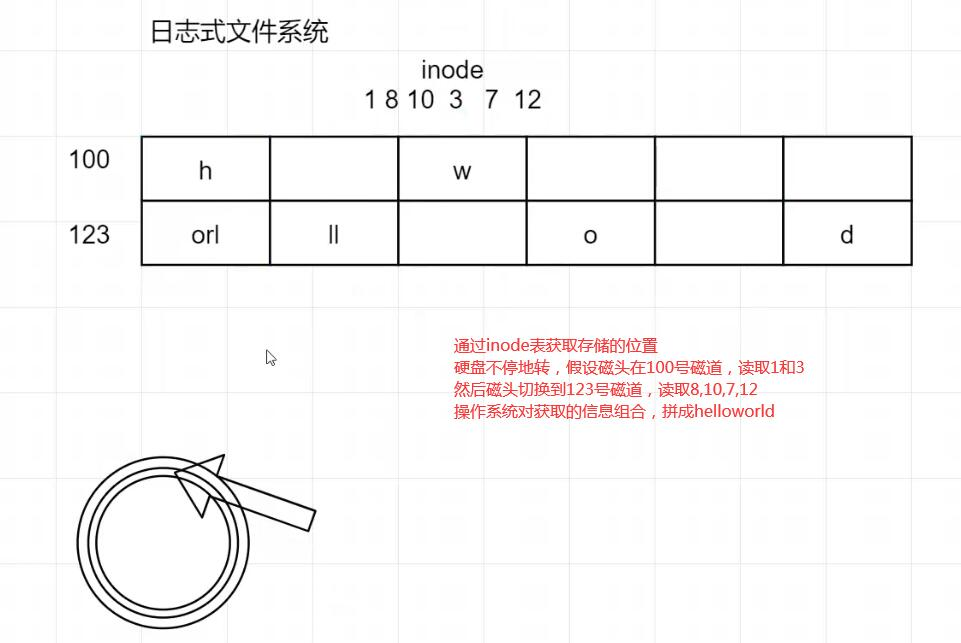](https://git.inmind-lab.com/aaronxu/Linux-book/src/branch/main/01.Linux基础/09.存储管理/日志文件系统1.png) [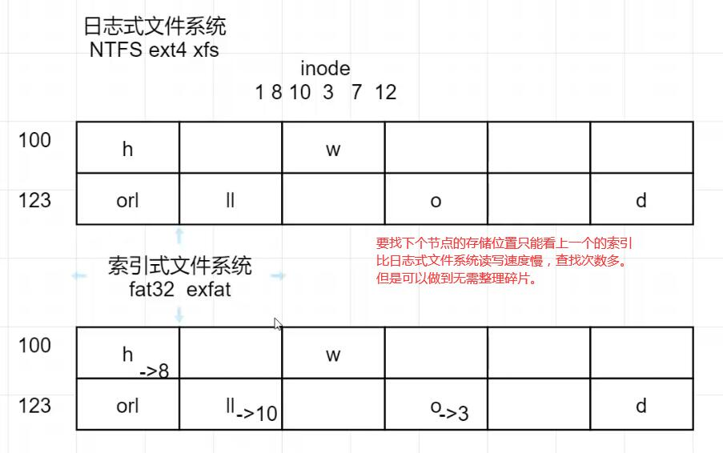](https://git.inmind-lab.com/aaronxu/Linux-book/src/branch/main/01.Linux基础/09.存储管理/日志文件系统2.png)

## 7.1 Linux常见的文件系统🗂️

| 文件系统 | 类型   | 主要特点                                                     | 适用场景                                          |
| -------- | ------ | ------------------------------------------------------------ | ------------------------------------------------- |
| **Ext3** | 日志式 | • 在 Ext2 基础上增加日志功能，支持从 Ext2 原地升级。 • 提供 `data=journal | ordered                                           |
| **Ext4** | 日志式 | • Ext3 的改进版，RHEL 6 及许多发行版的默认文件系统。 • **大容量**：支持 1EiB 卷和 16TiB 单文件。 • **高性能**：引入 extents、多块分配、延迟分配等机制，减少碎片，提升大文件性能。 • **高可靠**：支持日志校验和、在线碎片整理、无限子目录等。 | 通用场景，适合个人电脑、服务器及虚拟机。          |
| **XFS**  | 日志式 | • 高性能日志文件系统，RHEL 7 及以后版本的默认选择。 • **高吞吐**：专为高并发、大文件、顺序 I/O 优化，延迟低。 • **快速恢复**：日志机制对性能影响小，宕机后恢复速度快。 • **超大容量**：支持高达 18EB 的存储。 | 数据库、文件服务器、大数据处理等 I/O 密集型场景。 |

------

### ⚙️ 格式化：构建文件系统的内部布局

执行 `mkfs`命令格式化分区时，内核会为其创建一套完整的内部结构，主要包括：

1. **初始化核心元数据**
   - **超级块 (Superblock)**：记录文件系统全局信息，如块大小、总块数、inode 总数、状态等。它是文件系统的“总地图”。
   - **块组描述符表**：当分区较大时，文件系统会被划分为多个块组 (Block Group)，此表记录各块组的管理信息，便于崩溃后局部恢复。
2. **构建 inode 与数据区**
   - **inode 表 (inode table)**：存放所有文件的元数据（属性），每个文件对应一个 inode。
   - **数据块区 (data blocks)**：实际存储文件内容的地方。
3. **建立日志区 (Journal)**
   - 日志式文件系统会划出专门的日志区域，用于记录待提交的操作，以保证数据一致性。

> **纠正说明**：
>
> 您提到的“日志式先干掉inode表，索引式先干掉第一个索引”的说法不准确。
>
> 正确的理解是：格式化会**初始化**整个 inode 表和数据区。而“索引”的概念体现在 inode 内部，它通过指针指向数据块，而非“删除第一个索引表示空间可用”。

------

### 📄 inode：文件的“身份证”与“数据指针”

每个文件都唯一对应一个 inode，它不存储文件名，而是记录了文件的详细属性和数据位置。关键字段包括：

- **文件元信息**：权限 (rwx)、所有者 (owner/group)、大小 (size)、时间戳 (atime/mtime/ctime)、特殊权限 (SUID/SGID/SBIT) 等。
- **数据块指针**：指向文件数据所在的磁盘块。对于大文件，会使用多级间接指针或 extents (区段) 来管理。

**inode 数量与耗尽问题**

- inode 总数在格式化时确定，通常远大于文件数量。
- 可能出现磁盘空间未满，但 inode 已耗尽的情况。这通常是由于存在海量小文件导致。
- 使用 `df -i`命令可以查看 inode 的使用情况。

------

### 🔗 目录、文件名与数据的关系

目录本质上是一种特殊的文件，其内容是一张“目录项 (dentry)”列表，记录了“文件名 → inode 编号”的映射关系。通过文件名找到 inode，再通过 inode 找到数据块，这就构成了 Linux 中“一切皆文件”的基础。

------

### 🌉 VFS：统一的虚拟文件系统接口

为兼容 Ext4、XFS、Btrfs 及网络文件系统 (NFS) 等多种格式，Linux 内核在用户程序和具体文件系统之间引入了**虚拟文件系统 (VFS)** 作为抽象层。

- **对用户**：应用程序通过统一的系统调用 (`open`, `read`, `write`) 操作文件，无需关心底层文件系统类型。
- **对内核**：VFS 将通用操作翻译成具体文件系统的实现，屏蔽了底层差异，极大简化了文件系统的扩展和维护。

[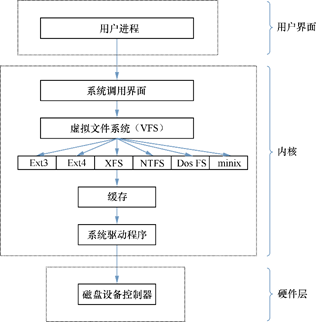](https://git.inmind-lab.com/aaronxu/Linux-book/src/branch/main/01.Linux基础/09.存储管理/虚拟文件接口.png)

## 7.2 mkfs工具

Linux mkfs（英文全拼：make file system）命令用于在特定的分区上建立 linux 文件系统。

**格式：**

```bash
mkfs [-V] [-t fstype] [fs-options] filesys [blocks]
```

选项：

- device ： 预备检查的硬盘分区，例如：/dev/nvme0n1p1
- -V : 详细显示模式
- -c : 在制做档案系统前，检查该partition 是否有坏轨
- -l bad_blocks_file : 将有坏轨的block资料加到 bad_blocks_file 里面
- block : 给定 block 的大小

**实例：使用parted分区，然后使用mkfs创建ext4文件系统**

```bash
[root@localhost ~]# parted /dev/sda print
Error: /dev/sda: unrecognised disk label
Model: ATA VMware Virtual S (scsi)                                        
Disk /dev/sda: 21.5GB
Sector size (logical/physical): 512B/512B
Partition Table: unknown
Disk Flags: 
[root@localhost ~]# parted /dev/sda mklabel gpt
Information: You may need to update /etc/fstab.

[root@localhost ~]# parted /dev/sda print
Model: ATA VMware Virtual S (scsi)
Disk /dev/sda: 21.5GB
Sector size (logical/physical): 512B/512B
Partition Table: gpt
Disk Flags: 

Number  Start  End  Size  File system  Name  Flags

[root@localhost ~]# parted /dev/sda mkpart primary 1 1G
Information: You may need to update /etc/fstab.

[root@localhost ~]# parted /dev/sda print                                 
Model: ATA VMware Virtual S (scsi)
Disk /dev/sda: 21.5GB
Sector size (logical/physical): 512B/512B
Partition Table: gpt
Disk Flags: 

Number  Start   End     Size   File system  Name     Flags
 1      1049kB  1000MB  999MB               primary

[root@localhost ~]# mkfs.ext4 /dev/sda1
mke2fs 1.46.5 (30-Dec-2021)
Creating filesystem with 243968 4k blocks and 61056 inodes
Filesystem UUID: 25885165-549a-47c4-be4c-1f54f425b628
Superblock backups stored on blocks: 
	32768, 98304, 163840, 229376

Allocating group tables: done                            
Writing inode tables: done                            
Creating journal (4096 blocks): done
Writing superblocks and filesystem accounting information: done

[root@localhost ~]# lsblk
NAME        MAJ:MIN RM  SIZE RO TYPE MOUNTPOINTS
sda           8:0    0   20G  0 disk 
└─sda1        8:1    0  953M  0 part 
sdb           8:16   0   20G  0 disk 
sr0          11:0    1 1024M  0 rom  
nvme0n1     259:0    0   60G  0 disk 
├─nvme0n1p1 259:1    0    1G  0 part /boot
└─nvme0n1p2 259:2    0   59G  0 part 
  ├─rl-root 253:0    0   37G  0 lvm  /
  ├─rl-swap 253:1    0  3.9G  0 lvm  [SWAP]
  └─rl-home 253:2    0 18.1G  0 lvm  /home

[root@localhost ~]# parted /dev/sda print
Model: ATA VMware Virtual S (scsi)
Disk /dev/sda: 21.5GB
Sector size (logical/physical): 512B/512B
Partition Table: gpt
Disk Flags: 

Number  Start   End     Size   File system  Name     Flags
 1      1049kB  1000MB  999MB  ext4         primary
```

## 7.3 mount挂载

挂载文件系统`mount 文件系统 挂载目录`

mount命令中的参数以及作用

| 参数 | 作用                                 |
| ---- | ------------------------------------ |
| -a   | 挂载所有在/etc/fstab中定义的文件系统 |
| -t   | 指定文件系统的类型                   |

临时挂载文件系统

系统在重启后挂载就会失效

```bash
[root@node-1 ~]# mkdir backup
[root@node-1 ~]# mount /dev/sda2 /root/backup
```

如果想让硬件设备和目录永久地进行自动关联，就必须把挂载信息按照指定的填写格式“设备文件 挂载目录 格式类型 权限选项 是否备份 是否自检”,写入到/etc/fstab文件中。

用于挂载信息的指定填写格式中，各字段所表示的意义

| 字段     | 意义                                                         |
| -------- | ------------------------------------------------------------ |
| 设备文件 | 一般为设备的路径+设备名称，也可以写唯一识别码（UUID，Universally Unique Identifier） |
| 挂载目录 | 指定要挂载到的目录，需在挂载前创建好                         |
| 格式类型 | 指定文件系统的格式，比如Ext3、Ext4、XFS、SWAP、iso9660（此为光盘设备）等 |
| 权限选项 | 若设置为defaults，则默认权限为：rw, suid, dev, exec, auto, nouser, async |
| 是否备份 | 若为1则开机后使用dump进行磁盘备份，为0则不备份               |
| 是否自检 | 若为1则开机后自动进行磁盘自检，为0则不自检                   |

- 实例，挂载分区`/dev/sda1`到`/mnt/storage`下，并且设置为永久自动挂载

```bash
[root@localhost ~]# mkdir /mnt/storage
[root@localhost ~]# mount /dev/sda1 /mnt/storage
[root@localhost ~]# df -h
Filesystem           Size  Used Avail Use% Mounted on
devtmpfs             4.0M     0  4.0M   0% /dev
tmpfs                1.8G     0  1.8G   0% /dev/shm
tmpfs                726M  9.1M  717M   2% /run
/dev/mapper/rl-root   37G  3.0G   34G   9% /
/dev/nvme0n1p1       960M  226M  735M  24% /boot
/dev/mapper/rl-home   19G  161M   18G   1% /home
tmpfs                363M     0  363M   0% /run/user/0
/dev/sda1            920M   24K  856M   1% /mnt/storage
[root@localhost ~]# cd /mnt/storage
[root@localhost storage]# dd </dev/zero >file bs=256M count=2
2+0 records in
2+0 records out
536870912 bytes (537 MB, 512 MiB) copied, 7.44977 s, 72.1 MB/s
[root@localhost storage]# df -h
Filesystem           Size  Used Avail Use% Mounted on
devtmpfs             4.0M     0  4.0M   0% /dev
tmpfs                1.8G     0  1.8G   0% /dev/shm
tmpfs                726M  9.1M  717M   2% /run
/dev/mapper/rl-root   37G  3.0G   34G   9% /
/dev/nvme0n1p1       960M  226M  735M  24% /boot
/dev/mapper/rl-home   19G  161M   18G   1% /home
tmpfs                363M     0  363M   0% /run/user/0
/dev/sda1            920M  513M  344M  60% /mnt/storage	# 挂载后存储在这里
[root@localhost storage]# cd
[root@localhost ~]# umount /dev/sda1
[root@localhost ~]# df -h
Filesystem           Size  Used Avail Use% Mounted on
devtmpfs             4.0M     0  4.0M   0% /dev
tmpfs                1.8G     0  1.8G   0% /dev/shm
tmpfs                726M  9.1M  717M   2% /run
/dev/mapper/rl-root   37G  3.0G   34G   9% /	# 原本应存储到这里
/dev/nvme0n1p1       960M  226M  735M  24% /boot
/dev/mapper/rl-home   19G  161M   18G   1% /home
tmpfs                363M     0  363M   0% /run/user/0
[root@localhost ~]# cd /mnt/storage/
[root@localhost storage]# ll -h
total 0
[root@localhost storage]# cd
[root@localhost ~]# mount /dev/sda1 /mnt/storage
[root@localhost ~]# cd /mnt/storage
[root@localhost storage]# ll -h
total 513M
-rw-r--r-- 1 root root 512M Mar 28 13:34 file
drwx------ 2 root root  16K Mar 28 13:29 lost+found


# 先卸载sdb1
[root@localhost ~]# umount /dev/sda1
[root@localhost ~]# df -h
Filesystem           Size  Used Avail Use% Mounted on
devtmpfs             4.0M     0  4.0M   0% /dev
tmpfs                1.8G     0  1.8G   0% /dev/shm
tmpfs                726M  9.1M  717M   2% /run
/dev/mapper/rl-root   37G  3.0G   34G   9% /
/dev/nvme0n1p1       960M  226M  735M  24% /boot
/dev/mapper/rl-home   19G  161M   18G   1% /home
tmpfs                363M     0  363M   0% /run/user/0
[root@localhost ~]# vim /etc/fstab 
# 最后一行加上
/dev/sda1 /mnt/storage ext4 defaults 0 0

[root@localhost ~]# systemctl daemon-reload
[root@localhost ~]# mount -a
# 测试是否正确配置，fstab上的设备挂一遍试试看，万一错了重启系统会失败。
[root@localhost ~]# df -h
Filesystem           Size  Used Avail Use% Mounted on
devtmpfs             4.0M     0  4.0M   0% /dev
tmpfs                1.8G     0  1.8G   0% /dev/shm
tmpfs                726M  9.1M  717M   2% /run
/dev/mapper/rl-root   37G  3.0G   34G   9% /
/dev/nvme0n1p1       960M  226M  735M  24% /boot
/dev/mapper/rl-home   19G  161M   18G   1% /home
tmpfs                363M     0  363M   0% /run/user/0
/dev/sda1            920M  513M  344M  60% /mnt/storage
```

## 7.4 umount

撤销已经挂载的设备文件`umount [挂载点/设备文件]`

```bash
[root@node-1 ~]# umount /dev/sda2
```

挂载实验：

```shell
#进行了格式化后
#[root@localhost ~]# mkfs.ext4 /dev/sdb1
#未挂载sdb1前，此时file0创建在sda1上
[root@localhost ~]# mkdir /mnt/disk1
[root@localhost ~]# touch /mnt/disk1/file0
[root@localhost ~]# ll /mnt/disk1/
-rw-r--r--  1 root root 0 6月   9 19:44 file0
#挂载sdb1,file0消失
[root@localhost ~]# mount /dev/sdb1 /mnt/disk1/
[root@localhost ~]# ll /mnt/disk1/
drwx------ 2 root root 16384 6月   9 19:42 lost+found
#此时file0创建在sda1
[root@localhost ~]# touch /mnt/disk1/file1
[root@localhost ~]# ll /mnt/disk1/
-rw-r--r-- 1 root root     0 6月   9 19:48 file1
drwx------ 2 root root 16384 6月   9 19:42 lost+found
#卸载sdb1,file1消失，file0出现
[root@localhost ~]# umount /dev/sdb1
[root@localhost ~]# ll /mnt/disk1/
-rw-r--r--  1 root root 0 6月   9 19:44 file0
```

## 7.5 df

用于显示文件系统的磁盘空间使用情况

```
df [选项]
```

常用选项

- `-h`：以人类可读的格式显示磁盘空间，使用K、M、G等单位。
- `-T`：显示文件系统类型。

```bash
[root@localhost ~]# df -h
Filesystem           Size  Used Avail Use% Mounted on
devtmpfs             4.0M     0  4.0M   0% /dev
tmpfs                1.8G     0  1.8G   0% /dev/shm
tmpfs                726M  9.1M  717M   2% /run
/dev/mapper/rl-root   37G  3.0G   34G   9% /
/dev/nvme0n1p1       960M  226M  735M  24% /boot
/dev/mapper/rl-home   19G  161M   18G   1% /home
tmpfs                363M     0  363M   0% /run/user/0
/dev/sda1            920M  513M  344M  60% /mnt/storage
[root@localhost ~]# df -hT
Filesystem          Type      Size  Used Avail Use% Mounted on
devtmpfs            devtmpfs  4.0M     0  4.0M   0% /dev
tmpfs               tmpfs     1.8G     0  1.8G   0% /dev/shm
tmpfs               tmpfs     726M  9.1M  717M   2% /run
/dev/mapper/rl-root xfs        37G  3.0G   34G   9% /
/dev/nvme0n1p1      xfs       960M  226M  735M  24% /boot
/dev/mapper/rl-home xfs        19G  161M   18G   1% /home
tmpfs               tmpfs     363M     0  363M   0% /run/user/0
/dev/sda1           ext4      920M  513M  344M  60% /mnt/storage
```

## 7.6 du

查看某个目录下文件数据的占用量

```
du [选项] [文件]
[root@localhost ~]# du
0	./.ssh
213556	.
[root@localhost ~]# du -sh
209M	.
[root@localhost ~]# du -sh /mnt
513M	/mnt
[root@localhost ~]# du -sh /
du: cannot access '/proc/1593/task/1593/fd/4': No such file or directory
du: cannot access '/proc/1593/task/1593/fdinfo/4': No such file or directory
du: cannot access '/proc/1593/fd/3': No such file or directory
du: cannot access '/proc/1593/fdinfo/3': No such file or directory
3.4G	/
```

# 8. 添加交换分区

SWAP（交换）分区是一种通过在硬盘中预先划分一定的空间，然后将把内存中暂时不常用的数据临时存放到硬盘中，以便腾出物理内存空间让更活跃的程序服务来使用的技术

在生产环境中，交换分区的大小一般为真实物理内存的1.5～2倍

```bash
[root@localhost ~]# mkswap /dev/sdb
mkswap: /dev/sdb: warning: don't erase bootbits sectors
        (gpt partition table detected). Use -f to force.
Setting up swapspace version 1, size = 20 GiB (21474832384 bytes)
no label, UUID=106a21c2-ea1e-4c2e-8899-218f90a4e4ac
[root@localhost ~]# free -h
               total        used        free      shared  buff/cache   available
Mem:           3.5Gi       550Mi       3.0Gi       9.0Mi       311Mi       3.0Gi
Swap:          3.9Gi          0B       3.9Gi
[root@localhost ~]# swapon /dev/sdb		# 挂载swap交换分区
[root@localhost ~]# free -h
               total        used        free      shared  buff/cache   available
Mem:           3.5Gi       566Mi       3.0Gi       9.0Mi       311Mi       3.0Gi
Swap:           23Gi          0B        23Gi


[root@localhost ~]# vim /etc/fstab				# 写入fstab文件中永久挂载
#
# /etc/fstab
# Created by anaconda on Sat Nov  9 02:51:16 2024
#
# Accessible filesystems, by reference, are maintained under '/dev/disk/'.
# See man pages fstab(5), findfs(8), mount(8) and/or blkid(8) for more info.
#
# After editing this file, run 'systemctl daemon-reload' to update systemd
# units generated from this file.
#
/dev/mapper/rl-root     /                       xfs     defaults        0 0
UUID=a237403c-8f88-4a42-adae-58fae0934a04 /boot                   xfs     defaults        0 0
/dev/mapper/rl-home     /home                   xfs     defaults        0 0
/dev/mapper/rl-swap     none                    swap    defaults        0 0
/dev/sda1 /mnt/storage ext4 defaults 0 0
/dev/sdb swap swap defaults 0 0 

[root@localhost ~]# swapoff /dev/sdb
[root@localhost ~]# free -h
               total        used        free      shared  buff/cache   available
Mem:           3.5Gi       616Mi       2.9Gi       9.0Mi       369Mi       2.9Gi
Swap:          3.9Gi          0B       3.9Gi
```

# 9. 磁盘容量配额

简单理解就是可以通过磁盘配额限制某个用户能够使用多大的空间

## 9.1 quota

### 9.1.1 实例切入

描述：

- 创建5个用户user1,user2,user3,user4,user5，密码和用户名相同，初始组为usergrp组。
- 5个用户都可以取得300M的磁盘使用空间，文件数量不限。超过250M,给于提示。

### 9.1.2 准备磁盘

- 创建分区

```bash
[root@localhost ~]# fdisk /dev/sda

Welcome to fdisk (util-linux 2.37.4).
Changes will remain in memory only, until you decide to write them.
Be careful before using the write command.

This disk is currently in use - repartitioning is probably a bad idea.
It's recommended to umount all file systems, and swapoff all swap
partitions on this disk.


Command (m for help): p

Disk /dev/sda: 20 GiB, 21474836480 bytes, 41943040 sectors
Disk model: VMware Virtual S
Units: sectors of 1 * 512 = 512 bytes
Sector size (logical/physical): 512 bytes / 512 bytes
I/O size (minimum/optimal): 512 bytes / 512 bytes
Disklabel type: gpt
Disk identifier: 1D8E9E66-4AB9-4B36-9D7B-7BBDBEA5B42B

Device     Start     End Sectors  Size Type
/dev/sda1   2048 1953791 1951744  953M Linux filesystem

Command (m for help): d 1
Selected partition 1
Partition 1 has been deleted.

Command (m for help): p
Disk /dev/sda: 20 GiB, 21474836480 bytes, 41943040 sectors
Disk model: VMware Virtual S
Units: sectors of 1 * 512 = 512 bytes
Sector size (logical/physical): 512 bytes / 512 bytes
I/O size (minimum/optimal): 512 bytes / 512 bytes
Disklabel type: gpt
Disk identifier: 1D8E9E66-4AB9-4B36-9D7B-7BBDBEA5B42B

Command (m for help): n
Partition number (1-128, default 1): 
First sector (34-41943006, default 2048): 
Last sector, +/-sectors or +/-size{K,M,G,T,P} (2048-41943006, default 41943006): +2G

Created a new partition 1 of type 'Linux filesystem' and of size 2 GiB.
Partition #1 contains a ext4 signature.

Do you want to remove the signature? [Y]es/[N]o: Y

The signature will be removed by a write command.

Command (m for help): p
Disk /dev/sda: 20 GiB, 21474836480 bytes, 41943040 sectors
Disk model: VMware Virtual S
Units: sectors of 1 * 512 = 512 bytes
Sector size (logical/physical): 512 bytes / 512 bytes
I/O size (minimum/optimal): 512 bytes / 512 bytes
Disklabel type: gpt
Disk identifier: 1D8E9E66-4AB9-4B36-9D7B-7BBDBEA5B42B

Device     Start     End Sectors Size Type
/dev/sda1   2048 4196351 4194304   2G Linux filesystem

Filesystem/RAID signature on partition 1 will be wiped.

Command (m for help): w
The partition table has been altered.
Syncing disks.
```

- lsblk 查看当前分区情况

```bash
[root@localhost ~]# lsblk
NAME        MAJ:MIN RM  SIZE RO TYPE MOUNTPOINTS
sda           8:0    0   20G  0 disk 
└─sda1        8:1    0    2G  0 part /mnt/storage
sdb           8:16   0   20G  0 disk 
sr0          11:0    1 1024M  0 rom  
nvme0n1     259:0    0   60G  0 disk 
├─nvme0n1p1 259:1    0    1G  0 part /boot
└─nvme0n1p2 259:2    0   59G  0 part 
  ├─rl-root 253:0    0   37G  0 lvm  /
  ├─rl-swap 253:1    0  3.9G  0 lvm  [SWAP]
  └─rl-home 253:2    0 18.1G  0 lvm  /home
```

- 格式化分区的文件系统

```bash
[root@localhost ~]# mkfs.ext4 /dev/sda1
mke2fs 1.46.5 (30-Dec-2021)
/dev/sda1 contains a ext4 file system
	last mounted on /mnt/storage on Sat Mar 28 13:43:15 2026
Proceed anyway? (y,N) y
Creating filesystem with 524288 4k blocks and 131072 inodes
Filesystem UUID: a15bdc6a-f741-4d7c-aada-ea5607980862
Superblock backups stored on blocks: 
	32768, 98304, 163840, 229376, 294912

Allocating group tables: done                            
Writing inode tables: done                            
Creating journal (16384 blocks): done
Writing superblocks and filesystem accounting information: done 
```

- 创建目录并挂载

```bash
[root@localhost ~]# mount /dev/sda1 /mnt/storage/
[root@localhost ~]# df -Th
Filesystem          Type      Size  Used Avail Use% Mounted on
devtmpfs            devtmpfs  4.0M     0  4.0M   0% /dev
tmpfs               tmpfs     1.8G     0  1.8G   0% /dev/shm
tmpfs               tmpfs     726M  9.1M  717M   2% /run
/dev/mapper/rl-root xfs        37G  3.0G   34G   9% /
/dev/nvme0n1p1      xfs       960M  226M  735M  24% /boot
/dev/mapper/rl-home xfs        19G  161M   18G   1% /home
tmpfs               tmpfs     363M     0  363M   0% /run/user/0
/dev/sda1           ext4      2.0G   24K  1.8G   1% /mnt/storage
```

### 9.1.3 准备用户

```bash
[root@atopos ~]# setenforce 0
# 临时关闭SELinux
[root@atopos ~]# getenforce 
Permissive
[root@atopos ~]# groupadd usergrp
[root@localhost ~]# for i in {1..5}; do useradd -g usergrp -b /mnt/storage user$i; done
```

### 9.1.4 确保文件系统支持

- 检查挂载点是否支持quota配置

```bash
[root@localhost ~]# mount | grep storage
/dev/sda1 on /mnt/storage type ext4 (rw,relatime)
```

- 重新挂载，让文件系统支持quota配置

```bash
[root@localhost ~]# mount -o remount,usrquota,grpquota /mnt/storage/
[root@localhost ~]# mount | grep storage
/dev/sda1 on /mnt/storage type ext4 (rw,relatime,quota,usrquota,grpquota)
```

### 9.1.5 安装 quota

- 软限制：当达到软限制时会提示用户，但仍允许用户在限定的额度内继续使用。
- 硬限制：当达到硬限制时会提示用户，且强制终止用户的操作。

quotacheck主要参数

- -a：扫描所有在/etc/mtab内含有quota参数的文件系统
- -u：针对用户扫描文件与目录的使用情况，会新建一个aquota.user文件
- -g：针对用户组扫描文件与目录的使用情况，会新增一个aquota.group文件
- -v：显示扫描过程的信息

```bash
[root@localhost ~]# yum install -y quota
```

### 9.1.6 开启 quota

```bash
[root@localhost ~]# quotacheck -avug
quotacheck: Your kernel probably supports ext4 quota feature but you are using external quota files. Please switch your filesystem to use ext4 quota feature as external quota files on ext4 are deprecated. You can enable the feature by unmounting the file system and running 'tune2fs -O quota <device>'.
quotacheck: Scanning /dev/sda1 [/mnt/storage] done
quotacheck: Cannot stat old user quota file /mnt/storage/aquota.user: No such file or directory. Usage will not be subtracted.
quotacheck: Cannot stat old group quota file /mnt/storage/aquota.group: No such file or directory. Usage will not be subtracted.
quotacheck: Cannot stat old user quota file /mnt/storage/aquota.user: No such file or directory. Usage will not be subtracted.
quotacheck: Cannot stat old group quota file /mnt/storage/aquota.group: No such file or directory. Usage will not be subtracted.
quotacheck: Checked 8 directories and 15 files
quotacheck: Old file not found.
quotacheck: Old file not found.
[root@localhost ~]# quotaon -avug
quotaon: Your kernel probably supports ext4 quota feature but you are using external quota files. Please switch your filesystem to use ext4 quota feature as external quota files on ext4 are deprecated. You can enable the feature by unmounting the file system and running 'tune2fs -O quota <device>'.
/dev/sda1 [/mnt/storage]: group quotas turned on
/dev/sda1 [/mnt/storage]: user quotas turned on
```

### 9.1.7 编辑配额配置

```bash
[root@localhost ~]# edquota -u user1
Disk quotas for user user1 (uid 1000):
  Filesystem                   blocks       soft       hard     inodes     soft     hard
  /dev/sda1                    300000       250000     300000      6        0        0                                                                                        
```

[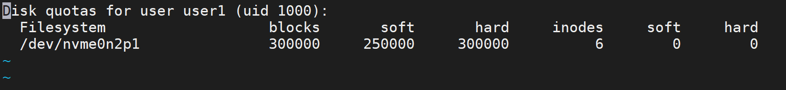](https://git.inmind-lab.com/aaronxu/Linux-book/src/branch/main/01.Linux基础/09.存储管理/磁盘容量配额1.png)

- 可以将针对user1的限制复制给user2

```sh
[root@localhost ~]# edquota -p user1 -u user2
```

- 查看限制情况

```bash
[root@localhost ~]# repquota -as
*** Report for user quotas on device /dev/sda1
Block grace time: 7days; Inode grace time: 7days
                        Space limits                File limits
User            used    soft    hard  grace    used  soft  hard  grace
----------------------------------------------------------------------
root      --     20K      0K      0K              2     0     0       
user1     --     16K    245M    293M              4     0     0       
user2     --     16K    245M    293M              4     0     0       
user3     --     16K      0K      0K              4     0     0       
user4     --     16K      0K      0K              4     0     0       
user5     --     16K      0K      0K              4     0     0       
```

### 9.1.8 测试

```bash
# user1用户测试
[root@localhost ~]# su - user1
[user1@localhost ~]$ dd if=/dev/zero of=bigfile bs=10M count=500
sda1: warning, user block quota exceeded.
sda1: write failed, user block limit reached.
dd: error writing 'bigfile': Disk quota exceeded
30+0 records in
29+0 records out
307183616 bytes (307 MB, 293 MiB) copied, 0.329328 s, 933 MB/s
[user1@localhost ~]$ du -sh
293M	.
[root@localhost ~]# repquota -as
*** Report for user quotas on device /dev/sda1
Block grace time: 7days; Inode grace time: 7days
                        Space limits                File limits
User            used    soft    hard  grace    used  soft  hard  grace
----------------------------------------------------------------------
root      --     20K      0K      0K              2     0     0       
user1     +-    293M    245M    293M  6days       5     0     0       
user2     --     16K    245M    293M              4     0     0       
user3     --     16K      0K      0K              4     0     0       
user4     --     16K      0K      0K              4     0     0       
user5     --     16K      0K      0K              4     0     0       


# user2用户测试
[root@localhost ~]# su - user2
[user2@localhost ~]$ dd if=/dev/zero of=bigfile bs=10M count=50
sda1: warning, user block quota exceeded.
sda1: write failed, user block limit reached.
dd: error writing 'bigfile': Disk quota exceeded
30+0 records in
29+0 records out
307183616 bytes (307 MB, 293 MiB) copied, 0.346968 s, 885 MB/s
[user2@localhost ~]$ du -sh
293M	.
[root@localhost ~]# repquota -as
*** Report for user quotas on device /dev/sda1
Block grace time: 7days; Inode grace time: 7days
                        Space limits                File limits
User            used    soft    hard  grace    used  soft  hard  grace
----------------------------------------------------------------------
root      --     20K      0K      0K              2     0     0       
user1     +-    293M    245M    293M  6days       5     0     0       
user2     +-    293M    245M    293M  6days       6     0     0       
user3     --     16K      0K      0K              4     0     0       
user4     --     16K      0K      0K              4     0     0       
user5     --     16K      0K      0K              4     0     0       
```

### 9.1.9 quota 命令

Linux quota命令用于显示磁盘已使用的空间与限制。

执行quota指令，可查询磁盘空间的限制，并得知已使用多少空间

选项：

- -g 列出群组的磁盘空间限制。
- -q 简明列表，只列出超过限制的部分。
- -u 列出用户的磁盘空间限制。
- -v 显示该用户或群组，在所有挂入系统的存储设备的空间限制。
- -V 显示版本信息。

```bash
[root@localhost ~]# su - user1
Last login: Sat Mar 28 14:37:57 CST 2026 on pts/0
[user1@localhost ~]$ quota
Disk quotas for user user1 (uid 1000): 
     Filesystem  blocks   quota   limit   grace   files   quota   limit   grace
      /dev/sda1  300000* 250000  300000   6days       5       0       0        
```

## 9.2 xfs_quota

专门针对XFS文件系统来管理quota磁盘容量配额服务

```
xfs_quota [参数] 配额 文件系统
```

- -c参数用于以参数的形式设置要执行的命令
- -x参数是专家模式

硬盘使用量的软限制和硬限制分别为3MB和6MB；创建文件数量的软限制和硬限制分别为3个和6个。

```bash
[root@localhost ~]# xfs_quota -x -c 'limit bsoft=3m bhard=6m isoft=3 ihard=6 test' /boot
[root@localhost ~]# xfs_quota -x -c report /boot
User quota on /boot (/dev/sda1)
                               Blocks                     
User ID          Used       Soft       Hard    Warn/Grace     
---------- -------------------------------------------------- 
root           115516          0          0     00 [--------]
test                0       3072       6144     00 [--------]
[root@localhost ~]# su - test
[test@localhost ~]$ dd if=/dev/zero of=/boot/tom bs=5M count=1
1+0 records in
1+0 records out
5242880 bytes (5.2 MB) copied, 0.00350676 s, 1.5 GB/s
[test@localhost ~]$ dd if=/dev/zero of=/boot/tom bs=8M count=1
dd: error writing ‘/boot/tom’: Disk quota exceeded
1+0 records in
0+0 records out
4194304 bytes (4.2 MB) copied, 0.00760235 s, 552 MB/s
```

# 10. 软硬方式链接🔗

- 在 Linux 中，链接（Link）是一种让多个文件名指向同一份数据的机制。主要分为硬链接和软链接两种。

#### 硬链接 (Hard Link)

- **本质**：硬链接是**同一个 inode 的多个文件名**。系统不为其分配独立的 inode，因此硬链接文件与原始文件本质上是同一个文件，只是名称不同。
- **链接计数**：每创建一个硬链接，文件的 inode 链接数就会加 1。只有当链接数减至 0 时，文件的数据块才会被真正释放。因此，即便原始文件被删除，通过剩余的硬链接依然可以访问数据。
- **核心限制**：
  - **不能跨文件系统**：因为不同文件系统的 inode 编号各自独立。
  - **不能链接目录**：为避免目录树出现循环引用，此操作通常被禁止。

#### 软链接 (Symbolic Link)

- **本质**：软链接是一个**独立的特殊文件**，拥有自己全新的 inode。其内部存储的是所链接文件的路径名，类似于 Windows 系统中的“快捷方式”。
- 使用的是**相对路径**
- **特性**：
  - **可跨文件系统**：因为它只存储路径字符串。
  - **可链接目录**。
  - **依赖目标**：如果原始文件被删除或移动，软链接将失效，成为“悬空链接”或“断链”，访问时会提示 `No such file or directory`。

## 10.1 ln

用于创建链接文件

```
ln [选项] 目标
```

**常用参数**

| 参数 | 作用                                                         |
| ---- | ------------------------------------------------------------ |
| `-s` | **创建符号链接**（软链接）。如果不带此参数，则默认创建硬链接。 |
| `-f` | **强制创建**。如果目标文件已存在，则先删除再创建。           |
| `-i` | **交互式操作**。在覆盖已存在的目标文件前，会提示用户确认。   |
| `-v` | **显示详细信息**。在执行操作时，输出创建过程。               |

### 10.1.1 软链接演示

```bash
[root@localhost ~]# ln -s oldfile newfile
[root@localhost ~]# ll -h
total 209M
-rw-r--r--  1 root root  25M Mar 25 14:44 alertmanager-0.21.0.linux-amd64.tar.gz
-rw-------. 1 root root  907 Jan 17 17:42 anaconda-ks.cfg
-rw-r--r--  1 root root  50M Apr  7  2021 grafana-7.5.3-1.x86_64.rpm
lrwxrwxrwx  1 root root    7 Mar 28 15:13 newfile -> oldfile
-rw-r--r--  1 root root   13 Mar 28 15:11 oldfile
-rw-r--r--  1 root root 135M Mar 21 15:09 prometheus-3.10.0.linux-amd64.tar.gz
[root@localhost ~]# cat newfile
hello python
[root@localhost ~]# echo "hello linux" > oldfile
[root@localhost ~]# cat newfile
hello linux
[root@localhost ~]# mv newfile /tmp/
[root@localhost ~]# ll -lh
total 209M
-rw-r--r--  1 root root  25M Mar 25 14:44 alertmanager-0.21.0.linux-amd64.tar.gz
-rw-------. 1 root root  907 Jan 17 17:42 anaconda-ks.cfg
-rw-r--r--  1 root root  50M Apr  7  2021 grafana-7.5.3-1.x86_64.rpm
-rw-r--r--  1 root root   12 Mar 28 15:14 oldfile
-rw-r--r--  1 root root 135M Mar 21 15:09 prometheus-3.10.0.linux-amd64.tar.gz
[root@localhost ~]# cd /tmp/
[root@localhost tmp]# ll -lh
total 0
lrwxrwxrwx 1 root root  7 Mar 28 15:13 newfile -> oldfile
drwx------ 3 root root 17 Mar 28 13:05 systemd-private-9c359e8a35e349ca8744ff004e0aa659-chronyd.service-QPnTyD
drwx------ 3 root root 17 Mar 28 13:05 systemd-private-9c359e8a35e349ca8744ff004e0aa659-dbus-broker.service-cgOVtI
drwx------ 3 root root 17 Mar 28 13:05 systemd-private-9c359e8a35e349ca8744ff004e0aa659-kdump.service-ppDUqX
drwx------ 3 root root 17 Mar 28 13:05 systemd-private-9c359e8a35e349ca8744ff004e0aa659-systemd-logind.service-zCSBFe
[root@localhost tmp]# cat newfile	# 这里软链接采取的是相对路径
cat: newfile: No such file or directory
[root@localhost tmp]# cd
[root@localhost ~]# ln -s /root/oldfile newfile	# 这里采取的是绝对路径
[root@localhost ~]# ll -h
total 209M
-rw-r--r--  1 root root  25M Mar 25 14:44 alertmanager-0.21.0.linux-amd64.tar.gz
-rw-------. 1 root root  907 Jan 17 17:42 anaconda-ks.cfg
-rw-r--r--  1 root root  50M Apr  7  2021 grafana-7.5.3-1.x86_64.rpm
lrwxrwxrwx  1 root root   13 Mar 28 15:17 newfile -> /root/oldfile
-rw-r--r--  1 root root   12 Mar 28 15:14 oldfile
-rw-r--r--  1 root root 135M Mar 21 15:09 prometheus-3.10.0.linux-amd64.tar.gz
[root@localhost ~]# cat newfile 
hello linux
[root@localhost ~]# mv newfile /tmp/
mv: overwrite '/tmp/newfile'? yes
[root@localhost ~]# ll -h /tmp
total 0
lrwxrwxrwx 1 root root 13 Mar 28 15:17 newfile -> /root/oldfile
drwx------ 3 root root 17 Mar 28 13:05 systemd-private-9c359e8a35e349ca8744ff004e0aa659-chronyd.service-QPnTyD
drwx------ 3 root root 17 Mar 28 13:05 systemd-private-9c359e8a35e349ca8744ff004e0aa659-dbus-broker.service-cgOVtI
drwx------ 3 root root 17 Mar 28 13:05 systemd-private-9c359e8a35e349ca8744ff004e0aa659-kdump.service-ppDUqX
drwx------ 3 root root 17 Mar 28 13:05 systemd-private-9c359e8a35e349ca8744ff004e0aa659-systemd-logind.service-zCSBFe
[root@localhost ~]# cat /tmp/newfile 
hello linux
[root@localhost ~]# mv /tmp/newfile /mnt/storage/	# 可以跨分区
[root@localhost ~]# ll -h /mnt/storage/
total 52K
-rw------- 1 root  root    7.0K Mar 28 14:23 aquota.group
-rw------- 1 root  root    7.0K Mar 28 14:28 aquota.user
drwx------ 2 root  root     16K Mar 28 14:13 lost+found
lrwxrwxrwx 1 root  root      13 Mar 28 15:17 newfile -> /root/oldfile
drwx------ 2 user1 usergrp 4.0K Mar 28 14:47 user1
drwx------ 2 user2 usergrp 4.0K Mar 28 14:49 user2
drwx------ 2 user3 usergrp 4.0K Mar 28 14:18 user3
drwx------ 2 user4 usergrp 4.0K Mar 28 14:18 user4
drwx------ 2 user5 usergrp 4.0K Mar 28 14:18 user5
```

### 10.1.2 硬链接演示

```bash
[root@localhost ~]# ll -h
total 209M
-rw-r--r--  1 root root  25M Mar 25 14:44 alertmanager-0.21.0.linux-amd64.tar.gz
-rw-------. 1 root root  907 Jan 17 17:42 anaconda-ks.cfg
-rw-r--r--  1 root root  50M Apr  7  2021 grafana-7.5.3-1.x86_64.rpm
-rw-r--r--  1 root root 135M Mar 21 15:09 prometheus-3.10.0.linux-amd64.tar.gz
[root@localhost ~]# stat anaconda-ks.cfg 
  File: anaconda-ks.cfg
  Size: 907       	Blocks: 8          IO Block: 4096   regular file
Device: fd00h/64768d	Inode: 101373479   Links: 1
Access: (0600/-rw-------)  Uid: (    0/    root)   Gid: (    0/    root)
Access: 2026-01-17 17:42:26.083560717 +0800
Modify: 2026-01-17 17:42:26.232561046 +0800
Change: 2026-01-17 17:42:26.232561046 +0800
 Birth: 2026-01-17 17:42:26.083560717 +0800
[root@localhost ~]# ln anaconda-ks.cfg newfile
[root@localhost ~]# ll -h
total 209M
-rw-r--r--  1 root root  25M Mar 25 14:44 alertmanager-0.21.0.linux-amd64.tar.gz
-rw-------. 2 root root  907 Jan 17 17:42 anaconda-ks.cfg
-rw-r--r--  1 root root  50M Apr  7  2021 grafana-7.5.3-1.x86_64.rpm
-rw-------. 2 root root  907 Jan 17 17:42 newfile
-rw-r--r--  1 root root 135M Mar 21 15:09 prometheus-3.10.0.linux-amd64.tar.gz
[root@localhost ~]# stat newfile
  File: newfile
  Size: 907       	Blocks: 8          IO Block: 4096   regular file
Device: fd00h/64768d	Inode: 101373479   Links: 2	# 空间相同
Access: (0600/-rw-------)  Uid: (    0/    root)   Gid: (    0/    root)
Access: 2026-01-17 17:42:26.083560717 +0800
Modify: 2026-01-17 17:42:26.232561046 +0800
Change: 2026-03-28 15:06:37.184553542 +0800
 Birth: 2026-01-17 17:42:26.083560717 +0800
[root@localhost ~]# du -sh
209M	.
[root@localhost ~]# rm -rf newfile
[root@localhost ~]# du -sh
209M	.		# 占有的内存不变
[root@localhost ~]# ll -h
total 209M
-rw-r--r--  1 root root  25M Mar 25 14:44 alertmanager-0.21.0.linux-amd64.tar.gz
-rw-------. 1 root root  907 Jan 17 17:42 anaconda-ks.cfg
-rw-r--r--  1 root root  50M Apr  7  2021 grafana-7.5.3-1.x86_64.rpm
-rw-r--r--  1 root root 135M Mar 21 15:09 prometheus-3.10.0.linux-amd64.tar.gz

[root@localhost ~]# echo "hello linux" > oldfile
[root@localhost ~]# ln oldfile newfile
[root@localhost ~]# ll -lh
total 209M
-rw-r--r--  1 root root  25M Mar 25 14:44 alertmanager-0.21.0.linux-amd64.tar.gz
-rw-------. 1 root root  907 Jan 17 17:42 anaconda-ks.cfg
-rw-r--r--  1 root root  50M Apr  7  2021 grafana-7.5.3-1.x86_64.rpm
-rw-r--r--  2 root root   12 Mar 28 15:10 newfile
-rw-r--r--  2 root root   12 Mar 28 15:10 oldfile
-rw-r--r--  1 root root 135M Mar 21 15:09 prometheus-3.10.0.linux-amd64.tar.gz
[root@localhost ~]# cat newfile
hello linux
[root@localhost ~]# echo "hello python" > oldfile
[root@localhost ~]# cat newfile
hello python
```

# 11. 分布式存储

- 单机存储
  - 1. 扩展存在上限
    2. 存在单点故障
    3. 传统存储共享方式的单一，iscsi，smb，ftp，object
    4. 备份不方便

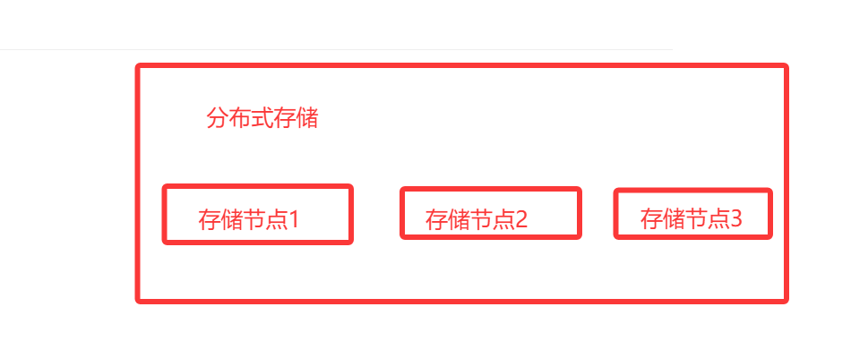

## 11.1 认识分布式存储

**🗄️ 什么是分布式存储？**

简单来说，分布式存储是一种数据存储技术，它**通过网络将分散的存储资源（如硬盘、服务器）连接起来，并作为一个整体来进行管理和使用**。数据被切分后，存储在多台独立的设备上。

**🎯 解决了什么问题？**

分布式存储主要解决了传统集中式存储在容量、性能、可靠性和成本上的瓶颈。

- **海量数据存储**

  解决了单机存储容量有限的问题。当数据增长到TB、PB甚至EB级别时，单机无法容纳，分布式存储可以通过增加节点实现近乎无限的横向扩展。

- **高并发访问**

  解决了单机I/O性能瓶颈。通过将数据分片并分散存储，大量客户端可以同时从不同节点读写数据，从而提供远超单机系统的聚合带宽和IOPS。

- **高可靠性**

  解决了单机故障导致数据丢失的风险。通过数据冗余（如副本、纠删码）技术，即使部分节点或硬盘损坏，数据依然完整，服务不中断。

- **低成本与弹性**

  解决了专用硬件成本高昂的问题。分布式存储通常基于通用x86服务器和标准网络设备构建，避免了昂贵的专用硬件（Scale-up），通过增加普通节点即可实现扩容（Scale-out），更具性价比。

**🚀 为什么会出现分布式存储？**

分布式存储的出现是数据时代发展的必然结果，主要受以下因素驱动：

1. **数据规模的爆炸式增长**

   互联网、物联网、大数据等业务产生的数据量远超单机处理能力，传统存储架构在容量和性能上无法满足需求。

2. **对系统可用性的极致追求**

   7x24小时不间断服务成为常态。分布式系统通过冗余设计，确保了单点故障不影响整体服务，这是单机存储无法比拟的。

3. **成本效益的考量**

   使用大量廉价的通用服务器构建存储集群，比购买高端专用存储设备（如大型机、高端SAN）的成本要低得多，尤其适合大规模部署。

## 11.2 分布式存储系统的特性✅

分布式存储之所以广泛应用，主要源于其在**可扩展性、高可用性、性能和成本效益**方面的显著优势。

| 优点                 | 核心描述                                                     | 解决的关键问题                                               |
| -------------------- | ------------------------------------------------------------ | ------------------------------------------------------------ |
| **高可扩展性**       | **“按需扩容，不受限”** 采用 **Scale-out**（横向扩展）架构，通过增加普通服务器节点即可线性提升系统的存储容量和吞吐能力。 | 突破了单机物理硬件上限，轻松应对从 TB 到 EB 级别的海量数据增长。 |
| **高可靠性与可用性** | **“永不宕机，数据无忧”** 数据通过**副本**或**纠删码**技术在多个节点间冗余存储。当部分硬件发生故障时，系统能自动切换并恢复数据，保证服务不中断。 | 消除了单点故障风险，确保数据完整性和业务连续性。             |
| **高并发与高性能**   | **“人多力量大”** 采用**分片（Sharding）**机制，将海量数据分散存储在多台服务器上。大量客户端可以同时从不同节点并发读写，聚合带宽远超单机存储。 | 解决了单机 I/O 性能瓶颈，满足高并发、大带宽的业务场景需求。  |
| **高性价比**         | **“便宜又大碗”** 基于通用的 x86 服务器和标准网络设备构建，利用**分布式技术**替代昂贵的专用硬件（如高端 SAN/NAS）。 | 大幅降低了每 GB 的存储成本和总体拥有成本（TCO）。            |
| **灵活性与易管理性** | **“统一资源池”** 将分散的物理资源整合成一个统一的**资源池**，管理员可以像管理一台机器一样管理整个集群。 | 简化了运维管理，实现了资源的动态调度和自动化运维。           |

## 11.3 开源分布式文件系统

下表对当前流行的开源分布式文件系统进行了多维度对比，方便快速了解其特性与差异。

| 文件系统      | 开发语言 | 开源协议  | 数据存储方式 | 集群节点通信协议    | 专用元数据存储点 | 在线扩容 | 冗余备份 | 单点故障 | 跨集群同步 | 易用性             | 适用场景           | FUSE挂载 | 访问接口     |
| ------------- | -------- | --------- | ------------ | ------------------- | ---------------- | -------- | -------- | -------- | ---------- | ------------------ | :----------------- | -------- | ------------ |
| **Ceph**      | C++      | LGPL      | 对象/文件/块 | 私有协议 (TCP)      | 占用 MDS         | 支持     | 支持     | 存在     | 不支持     | 安装简单, 文档专业 | 单集群的大中小文件 | 支持     | POSIX        |
| **GlusterFS** | C        | GPL V3    | 文件/块      | 私有协议 (TCP/RDMA) | 无               | 支持     | 支持     | 不存在   | 支持       | 安装简单, 文档专业 | 跨集群云存储       | 支持     | POSIX        |
| **FastDFS**   | C        | GPL V3    | 文件/Trunk   | 私有协议 (TCP)      | 无               | 支持     | 支持     | 不存在   | 部分支持   | 安装简单, 社区活跃 | 单集群的中小文件   | 不支持   | 不支持 POSIX |
| **MooseFS**   | C        | GPL V3    | 块           | 私有协议 (TCP)      | 占用 MFS         | 支持     | 支持     | 存在     | 不支持     | 安装简单, 文档多   | 单集群的大中文件   | 支持     | POSIX        |
| **HDFS**      | Java     | Apache    | 文件         | 私有协议 (TCP)      | 占用 MDS         | 支持     | 支持     | 存在     | 不支持     | 安装简单, 文档专业 | MapReduce计算框架  | 支持     | 不支持 POSIX |
| **Lustre**    | C        | GPLv2     | 对象         | 私有协议 (TCP/RDMA) | 双MDS            | 支持     | 支持     | 存在     | 未知       | 复杂, 依赖内核     | 大文件读写, HPC    | 支持     | POSIX/MPI    |
| **TFS**       | C++      | GPL V2    | 块           | 私有协议 (TCP)      | 占用 NS          | 支持     | 支持     | 存在     | 支持       | 安装复杂, 文档少   | 跨集群的小文件     | 未知     | 不支持 POSIX |
| **MogileFS**  | Perl     | GPL       | 文件         | HTTP                | 占用 DB          | 支持     | 不支持   | 存在     | 不支持     | 未知               | Web 2.0海量小图    | 不支持   | 不支持 POSIX |
| **Swift**     | Python   | Apache    | 对象         | TCP                 | 无               | 支持     | 支持     | 不存在   | 未知       | 未知               | OpenStack对象存储  | 不支持   | 不支持 POSIX |
| **Cinder**    | Python   | Apache    | 块           | TCP                 | 未知             | 支持     | 支持     | 未知     | 未知       | 未知               | OpenStack块存储    | 未知     | 不支持 POSIX |
| **Sheepdog**  | C        | GPLv2     | 块           | totem协议           | 无               | 支持     | 支持     | 不存在   | 未知       | 未知               | 弹性块存储/虚拟机  | 支持     | 未知         |
| **GridFS**    | C++      | 同MongoDB | 文件(分片)   | 同MongoDB           | 同MongoDB        | 支持     | 支持     | 存在     | 支持       | 安装简单           | 大文件(>16MB)      | 不支持   | 不支持 POSIX |

**💡 关键指标解读**

- **数据存储方式**：指数据在底层是以对象、文件还是块的形式进行组织和管理。
- **专用元数据存储点**：指元数据是否集中存储在某个特定节点（如MDS, NS, DB），这直接关系到系统是否存在“单点故障”风险。
- **单点故障**：指系统中是否存在某个关键节点，一旦失效会导致整个服务不可用。“无”或“不存在”通常意味着系统通过多副本或去中心化设计实现了高可用。
- **跨集群同步**：指数据能否在地理位置不同的多个集群之间进行复制和同步，是实现异地容灾和多活架构的关键能力。
- **FUSE挂载**：指是否支持通过FUSE（用户空间文件系统）将分布式文件系统挂载为本地目录，从而允许应用程序通过标准的POSIX接口（如`open`, `read`, `write`）进行访问。

# 12 存储服务分类

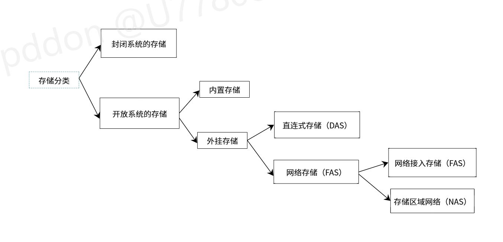

三种存储方式：DAS、SAN、NAS

三种存储类型：块存储、文件存储、对象存储

<!--  -->-1775738546643-3.jpg)

## 12.1 块存储

**💾 什么是块存储？**

块存储（Block Storage）是一种将数据以**固定大小的“块”（Block）**为单位进行存储和管理的存储技术。在块存储系统中，数据被分割成大小相同的块，每个块被赋予一个唯一的地址，然后被分散存储到不同的物理磁盘上。操作系统（OS）通过文件系统（如 ext4, XFS）将块组织成一个个完整的文件。

> **核心特点**：块存储设备对外表现为一个**原始的、未格式化的硬盘**，用户可以自由地在其上创建任意类型的文件系统。

**🔧 块存储的工作原理**

1. **数据分块**：当上层应用（如数据库、虚拟机）写入数据时，数据被切分成固定大小的块（如 4KB）。
2. **地址寻址**：每个块都有一个独立的逻辑地址（LBA），操作系统通过这个地址来读写数据，而不是通过文件名。
3. **逻辑卷管理**：通过 RAID 或 LVM（逻辑卷管理）等技术，将多个物理硬盘或块设备组合成一个大的逻辑卷，提供给用户使用。

**✅ 块存储的优点**

- **极致性能**：数据直接通过 SCSI, iSCSI, FC 等协议读写，没有额外的文件系统开销，延迟极低，IOPS（每秒读写次数）极高。
- **灵活可控**：用户拥有设备的完全控制权，可以自由选择文件系统类型（如 ext4, XFS, ZFS），并进行精细的格式化配置。
- **广泛兼容**：是几乎所有操作系统（Linux, Windows 等）的原生支持存储类型，应用兼容性最好。

**❌ 块存储的缺点**

- **无共享**：多个客户端无法直接同时挂载同一个块设备并协调写入，否则会导致数据损坏。需要配合集群文件系统（如 GFS2, OCFS2）才能实现共享。
- **容量限制**：单个块设备的容量受限于后端存储系统的配置，扩容通常需要停机或复杂的操作。
- **管理复杂**：对于大规模、跨地域的共享数据场景，块存储的管理和维护成本较高。

**🚀 主要应用场景**

块存储非常适合对性能和延迟敏感，且不需要多节点共享写的场景。

- **数据库**：如 MySQL, Oracle, PostgreSQL。数据库的日志和数据文件需要极高的 IOPS 和低延迟，块存储是首选。
- **虚拟化/云平台**：如 VMware, OpenStack, 阿里云 ECS。虚拟机的系统盘和数据盘通常以块设备（如云硬盘）的形式提供。
- **高性能计算 (HPC)**：需要高速读写大量数据的科学计算和工程模拟场景。

## 12.2 文件存储

**📁 什么是文件存储？**

文件存储（File Storage）是一种**基于文件和目录层级结构**的数据存储方式。它通过**网络附加存储（NAS）**协议（如 NFS、SMB/CIFS）为客户端提供标准的文件系统视图，使用户可以像访问本地文件夹一样，通过路径（如 `/home/user/data`）来存取数据。

> **核心特点**：对外呈现为一个**挂载点**，支持多客户端通过标准协议进行**共享访问**。

**🏗️ 文件存储的架构**

典型的文件存储架构包含一个**控制平面**（元数据服务）和一个**数据平面**（数据存储服务）。

1. **元数据服务 (Metadata Service)**：管理文件系统的命名空间、目录结构、权限和属性。这是文件存储的“大脑”。
2. **数据存储服务 (Data Service)**：实际存储文件内容和数据块。数据通常被打散存储在多个节点上以实现冗余和性能提升。

客户端通过挂载协议（如 NFSv3/v4, SMB）连接到存储集群，由客户端内核或用户态库（如 FUSE）将文件操作转换为网络请求发送给存储集群。

**✅ 文件存储的优点**

- **易于使用和共享**：提供标准的文件系统接口（POSIX 兼容），开发者和运维人员无需修改应用即可直接使用。支持多客户端并发读写，非常适合需要共享数据的场景（如代码仓库、日志分析）。
- **强大的数据管理**：支持丰富的文件属性（权限、ACL、时间戳），便于进行细粒度的访问控制和数据生命周期管理（分层、归档）。
- **良好的扩展性**：分布式文件存储（如 CephFS, GlusterFS）可以通过增加节点来扩展容量和吞吐量，适应数据增长。

**❌ 文件存储的缺点**

- **性能瓶颈**：所有文件操作都需要经过元数据服务，在高并发场景下容易成为性能瓶颈。网络延迟和协议开销也会降低 IOPS 和吞吐量。
- **单点故障风险**：传统的中心化元数据服务存在单点故障风险。虽然现代分布式系统通过多副本和主备机制解决了此问题，但架构上更为复杂。

**🚀 主要应用场景**

文件存储适用于需要共享访问、目录结构清晰且对性能要求不是极端苛刻的场景。

- **共享工作区**：如企业内部的共享网盘、部门文件服务器、代码仓库（Git/SVN）后端存储。
- **媒体处理**：如视频编辑、图像处理、音频制作，需要多台工作站并发访问同一个素材库。
- **大数据分析**：作为 Hadoop、Spark 等计算框架的输入/输出数据源，提供统一的数据视图。
- **备份与归档**：用于集中存储备份数据、日志文件和冷数据，便于统一管理。

## 12.3 对象存储

**对象存储 (Object Storage)**

对象存储是一种**扁平化**、**基于HTTP协议**的数据存储架构。它将数据和元数据打包成一个个独立的“对象”，存储在一个无层次结构的“桶”（Bucket）中。每个对象通过一个全球唯一的ID进行访问，而非传统的文件路径。

> **核心特点**：**非层次化、海量扩展、HTTP接口**。它不关心底层的文件系统或块设备细节，专为海量非结构化数据（图片、视频、日志、备份）的存储和管理而设计。

**🏗️ 对象存储的架构**

对象存储通常采用**去中心化**或**分布式哈希表 (DHT)** 架构，以实现极高的可扩展性。

1. **数据平面 (Data Plane)**：对象被切分成多个分片（Chunks），并通过**纠删码 (Erasure Coding)** 或**多副本**技术分散存储在成千上万个节点上，确保数据的高可靠性和持久性。
2. **元数据平面 (Metadata Plane)**：元数据（如对象名、大小、创建时间、自定义标签）与对象数据分离存储，通常通过专用的数据库或索引服务进行管理，以支持快速检索。
3. **接入层 (Access Layer)**：提供统一的 **RESTful API** 接口（如 AWS S3, OpenStack Swift），客户端通过HTTP/HTTPS协议进行数据的上传、下载和管理。

**✅ 对象存储的优点**

- **近乎无限的扩展性**：采用扁平化结构，没有目录树深度的限制，理论上可以存储数十亿甚至数万亿个对象，容量可达EB级别。
- **极高的数据持久性**：通过纠删码或多副本机制，数据被分散存储，即使多个节点或硬盘发生故障，数据也不会丢失。
- **低成本**：硬件通常为标准的x86服务器，无需昂贵的专有硬件，且纠删码技术比多副本更节省存储空间，降低了每GB的成本。
- **易于访问和管理**：提供标准的HTTP API，任何能联网的设备（手机、服务器、IoT设备）都可以轻松上传和下载数据，非常适合跨地域、跨平台的应用。

**❌ 对象存储的缺点**

- **不适合频繁修改**：对象存储设计为“**一次写入，多次读取**”，修改一个对象通常需要完整的覆盖重写，不适合需要频繁更新和随机写入的场景（如数据库）。
- **高延迟**：基于HTTP协议，且需要经过元数据查询和数据路由，访问延迟远高于块存储和文件存储，不适合对延迟极其敏感的业务。
- **无原生文件语义**：不支持文件锁、硬链接、POSIX权限等高级文件系统特性，无法直接挂载为本地磁盘使用。

**🚀 主要应用场景**

对象存储是云计算时代的基石，广泛应用于以下场景：

- **静态网站托管**：直接通过HTTP服务HTML、CSS、JS和图片等静态资源。
- **海量数据备份与归档**：如数据库备份、日志归档、冷数据长期保存，利用其高持久性和低成本特性。
- **内容分发网络 (CDN) 源站**：作为图片、视频等富媒体内容的原始存储，通过CDN加速全球分发。
- **大数据分析**：作为数据湖（Data Lake）的底层存储，存储海量的原始日志、传感器数据等，供Hadoop、Spark等计算框架进行分析。
- **云原生应用**：作为Kubernetes等平台的持久化存储，用于存储应用产生的非结构化数据。

## 12.4 各类存储差异

**🗂️ 各类存储差异总结**

存储的世界主要分为三大流派：**块存储**、**文件存储**和**对象存储**。

为了方便记忆，你可以把它们想象成不同的“容器”：

- **块存储** 像一块**空白硬盘**，速度快但需要自己格式化。
- **文件存储** 像一块**公共网盘**，大家都能看，有目录结构。
- **对象存储** 像一个大号的**网盘备份箱**，东西往里一扔拿链接，无限扩容。

**📊 多维度对比一览**

下表清晰地展示了三者在核心特性上的差异：

| 特性         | 🚀 块存储 (Block Storage)   | 📁 文件存储 (File Storage)   | ☁️ 对象存储 (Object Storage)           |
| ------------ | -------------------------- | --------------------------- | ------------------------------------- |
| **核心概念** | 裸磁盘、卷                 | 目录、文件夹                | 桶 (Bucket)、对象 (Object)            |
| **数据结构** | 扁平的块 (无固定格式)      | 树状的层级结构 (目录树)     | 扁平的命名空间 (无目录概念)           |
| **访问方式** | 挂载为本地磁盘 (iSCSI, FC) | 挂载为网络驱动器 (NFS, SMB) | HTTP/HTTPS 接口 (RESTful API)         |
| **典型协议** | SCSI, iSCSI, FC            | NFS, SMB/CIFS               | S3, Swift                             |
| **写入方式** | 直接写入扇区               | 通过文件系统接口            | PUT/POST 请求上传                     |
| **数据共享** | **不支持** (单主机独占)    | **支持** (多主机并发读写)   | **支持** (多主机通过API访问)          |
| **性能**     | **极高** (低延迟, 高IOPS)  | **中等** (受网络和协议影响) | **较高吞吐量** (适合大文件, 延迟较高) |
| **容量扩展** | 较难 (需LVM扩展)           | 中等 (可在线扩容)           | **无限扩展** (理论上EB级)             |
| **成本**     | 昂贵 (硬件成本高)          | 中等                        | **廉价** (利用通用服务器)             |
| **适用场景** | 数据库、虚拟机系统盘       | 企业共享盘、开发环境        | 图片视频、备份归档、大数据            |

**🎯 如何快速选择**？

根据以下口诀，你可以快速判断该用哪种存储：

1. **看业务类型**
   - **结构化数据 (数据库、ERP)**：首选 **块存储**。因为数据库需要极致的随机读写性能和低延迟，块存储能提供裸设备的性能。
   - **非结构化数据 (图片、视频、日志)**：首选 **对象存储**。因为这类数据量大，需要长期保存且读取频繁，对象存储成本低且扩展性强。
   - **需要多人协作 (办公文档、代码)**：首选 **文件存储**。因为大家习惯通过文件夹路径访问，且需要多台机器同时读写。
2. **看访问接口**
   - **需要挂载本地路径 (`/mnt/data`)**：选 **块存储** 或 **文件存储**。
   - **需要调用 API (`PUT / GET`)**：选 **对象存储**。
3. **看规模与成本**
   - **数据量 < 100TB，预算充足**：块/文件存储足够。
   - **数据量 > PB级，追求低成本**：必须上 **对象存储**。

# 13.Ceph文件系统

- 参考：[ceph使用教程 | Aaron's Note](https://iproute.cn/2026/03/02/ceph-an-zhuang-ming-ling/#1-ceph概念)

## 13.1 ceph概念

Ceph 是一个**统一的、高可靠、高扩展的分布式存储系统**，底层基于 **RADOS**（Reliable Autonomic Distributed Object Store）分布式对象存储，对外同时提供**块存储（RBD）、文件系统（CephFS）、对象存储（RGW）** 三种服务。

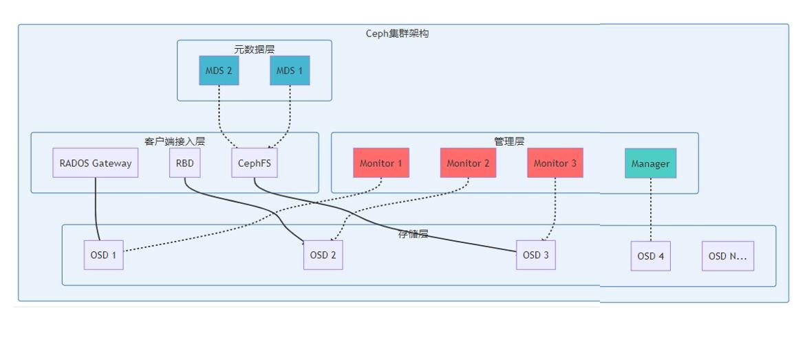

### 13.1.1 核心概念

#### 13.1.1.1 RADOS

Ceph 底层核心，**分布式对象存储系统**，所有数据最终以 **Object（对象）** 形式存储在 OSD 上。

- 无中心架构，用 **CRUSH 算法** 做数据分布与定位
- 自带**副本 / 纠删码、故障检测、自动恢复、数据重平衡**
- 是 RBD/CephFS/RGW 三种服务的基础

#### 13.1.1.2 Object（对象）

- Ceph 最小存储单元：**数据 + 元数据 + 唯一 ID**
- 大小通常 4MB/8MB/16MB（可配置）
- 文件 / 块 / 对象上层数据都会被切分为 Object 存入 RADOS

#### 13.1.1.3 Pool（存储池）(相当于开一个百度网盘账号，分配内存)

- 逻辑分区：**命名空间 + 数据策略**集合
- 定义：**副本数、PG 数量、CRUSH 规则、数据类型（数据 / 元数据）**
- 不同服务（RBD/CephFS/RGW）建议用独立 Pool

#### 13.1.1.4 PG（Placement Group）

- **中间逻辑层**：一组 Object 的集合
- 作用：减少 OSD 元数据开销、提升数据分布均衡性
- 一个 PG 会映射到 N 个 OSD（副本数决定 N）

#### 13.1.1.5 CRUSH 算法

- 伪随机数据分布算法：**无中心查表**
- 输入：Object ID + Pool ID + CRUSH Rule → 输出：目标 OSD 列表
- 支持**机架 / 机房 / 主机**级故障域隔离

### 13.1.2 Ceph 核心组件

#### 13.1.2.1 Monitor（MON）— 集群大脑

**作用**

- 维护集群**全局状态与一致性**（Paxos 仲裁）
- 存储 4 张 Map：**Mon Map、OSD Map、PG Map、CRUSH Map**
- 集群认证、服务发现、健康检查、配置管理
- 保证**无单点故障**：通常部署 **3/5 奇数节点**

**关键参数与调整影响**

- `mon_clock_drift_allowed`：时钟偏差容忍度（默认 0.05s）
  - 调大：容忍更大时钟差 → **集群更稳，但一致性风险上升**
  - 调小：时钟更严格 → **易出现 HEALTH_WARN/ERR，服务中断**
- `mon_osd_down_out_interval`：OSD 下线多久标记为 out（默认 300s）
  - 调大：故障判定变慢 → **恢复慢，但抖动减少**
  - 调小：快速判定故障 → **立即触发恢复，IO 波动大**
- `mon_paxos_proposer_timeout`：Paxos 提案超时
  - 调大：网络差时更稳 → **收敛慢，配置更新延迟**
  - 调小：收敛快 → **网络抖动易失败，集群不稳定**

#### 13.1.2.2 OSD（Object Storage Daemon）— 数据存储核心

**作用**

- 真正**存储数据对象**（BlueStore/FileStore）
- 数据**副本同步、故障恢复、数据回填、重平衡**
- 心跳上报状态、响应客户端 IO
- 每个 OSD 通常对应**一块物理盘**

**关键参数与调整影响**

- `osd_pool_default_size`：默认副本数（默认 3）
  - 调大：**数据更安全** → 可用容量下降、网络 / IO 负载上升
  - 调小：**容量提升、性能提升** → 可靠性下降（丢盘风险高）
- `osd_recovery_max_active`：单 OSD 最大并发恢复（默认 3）
  - 调大：**恢复更快** → 业务 IO 延迟飙升、集群不稳定
  - 调小：**业务优先** → 恢复慢、数据冗余不足风险
- `osd_op_threads`：OSD 工作线程（默认 1）
  - 调大：**高并发 IO 更快** → CPU 占用高、上下文切换开销大
  - 调小：CPU 省 → **高并发时队列阻塞、延迟高**
- `bluestore_compression_algorithm`：BlueStore 压缩算法（lz4/zstd）
  - 开启 lz4：**节省空间（1.2–2 倍）、低 CPU 开销**
  - 开启 zstd：**压缩比更高** → 读写延迟增加、CPU 高
- `osd_memory_target`：OSD 内存上限（默认 4GB）
  - 调大：**缓存更大、读性能更好** → 内存占用高、OOM 风险
  - 调小：内存省 → **缓存命中率低、读性能差**
- `pg_num / pgp_num`：PG 数量
  - 太少：**数据不均、OSD 热点、恢复慢**
  - 太多：**内存暴涨、心跳压力大、扩缩容极慢**
  - 推荐：`OSD总数 × (100–300) / 副本数 / 池数`

#### 13.1.2.3 Manager（MGR）— 集群管家

**作用**

- 监控指标、Dashboard、REST API、CLI 增强
- 负载均衡、自动化调度、状态统计
- 模块：Prometheus、Zabbix、Balancer、Dashboard 等

**调整影响**

- 启用 `mgr balancer`：自动数据均衡 → **后台 IO 增加、业务延迟微升**
- 关闭 MGR：**Dashboard / 监控失效**，但不影响数据 IO

#### 13.1.2.4 RGW（RADOS Gateway）— 对象存储网关

**作用**

- 提供 **S3/Swift 兼容**的对象存储接口
- 用户 / 桶 / 权限管理、配额、地域复制

**调整影响**

- `rgw_thread_pool_size`：RGW 线程数
  - 调大：**并发更高** → CPU / 内存占用上升
  
- `rgw_max_concurrent_requests`：最大并发请求

  - 调大：**高并发强** → 队列长、延迟上升

#### 13.1.2.5 RBD（RADOS Block Device）— 块存储

**作用**

- 提供**分布式块设备**（云硬盘、虚拟机磁盘）
- 快照、克隆、增量备份、扩容

**调整影响**

- `rbd_cache`：开启客户端缓存
  - 开启：**随机读性能大幅提升** → 数据一致性风险（断电丢缓存）
- `rbd_cache_size`：客户端缓存大小
  - 调大：**读性能更好** → 客户端内存占用高

### 13.1.3 CephFS 文件系统专用组件

CephFS = **MDS（元数据） + 数据 Pool（RADOS）**，提供 **POSIX 兼容分布式文件系统**Ceph。

#### 13.1.3.1 MDS（Metadata Server）— 元数据服务器

**作用**

- 管理**文件系统命名空间**：目录、文件名、权限、inode、属性
- 处理 `open/stat/readdir/rename/unlink` 等元数据操作
- 元数据缓存、分布式分片、负载均衡
- 数据 IO 不经过 MDS（直接客户端 ↔ OSD）

**关键参数与调整影响**

- `mds_cache_size`：MDS 元数据缓存（默认 1GB）
  - 调大：**元数据操作极快** → 内存暴涨、大目录卡顿风险
  - 调小：内存省 → **缓存频繁淘汰、stat/readdir 慢**
- `mds_max_completed_requests`：完成请求缓存数
  - 调大：**重入 / 重试更快** → 内存占用高
- `mds_beacon_interval`：MDS 心跳间隔（默认 1s）
  - 调大：**网络 / CPU 省** → 故障检测慢、切换慢
  - 调小：故障切换快 → **心跳开销大**
- `mds_standby_for_rank`：Standby 热备
  - 开启：**MDS 故障秒级切换** → 额外资源占用
- `mds_cache_mid`：缓存淘汰阈值
  - 调大：**缓存更积极** → 内存占用高、GC 频繁

#### 13.1.3.2 CephFS 双 Pool 结构

- fs_metadata Pool：存 inode、目录、权（低容量、高 IOPS、低延迟）
  - 建议：**SSD、副本 3、小 PG 数量**
- fs_data Pool：存文件内容（大容量、高吞吐）
  - 建议：**HDD/SSD、副本 3 / 纠删码、PG 合理**

### 13.1.4 组件关系与整体架构

- **MON**：维护集群地图与一致性
- **OSD**：存数据、副本、恢复、IO
- **MGR**：监控、Dashboard、调度
- **MDS**：仅 CephFS 用，管元数据
- **RBD/RGW/CephFS**：上层接口，基于 RADOS

### 13.1.5 调整原则总结

- **MON**：**优先稳定**，时钟 / 超时不要激进
- **OSD**：**业务 IO 与恢复平衡**，恢复参数高峰期调低
- **PG**：**一次算好、分批调整**，严禁频繁改
- **MDS**：**内存给够**，元数据性能决定文件系统体验
- **副本数**：**生产 3 副本**，容量与安全平衡
- **压缩**：**BlueStore 开 lz4**，空间与性能平衡

## 13.2 安装命令

```bash
[root@node1 ~]# dnf search release-ceph
Rocky Linux 9 - BaseOS                                                                                                                   1.7 MB/s |  17 MB     00:09    
Rocky Linux 9 - AppStream                                                                                                                1.9 MB/s |  17 MB     00:09    
Rocky Linux 9 - Extras                                                                                                                    13 kB/s |  17 kB     00:01    
Zabbix Official Repository - x86_64                                                                                                       16 kB/s | 594 kB     00:37    
Zabbix Official Repository (non-supported) - x86_64                                                                                      272  B/s | 1.1 kB     00:04    
Zabbix Official Repository (Agent2 Plugins) - x86_64                                                                                     362  B/s | 1.6 kB     00:04    
====================================================================== Name Matched: release-ceph =======================================================================
centos-release-ceph-pacific.noarch : Ceph Pacific packages from the CentOS Storage SIG repository
centos-release-ceph-quincy.noarch : Ceph Quincy packages from the CentOS Storage SIG repository
centos-release-ceph-reef.noarch : Ceph Reef packages from the CentOS Storage SIG repository
centos-release-ceph-squid.noarch : Ceph Squid packages from the CentOS Storage SIG repository
[root@node1 ~]# dnf install --assumeyes centos-release-ceph-squid
[root@node1 ~]# dnf install --assumeyes cephadm
[root@node1 ~]# CEPH_RELEASE=19.2.3
[root@node1 ~]# curl --silent --remote-name --location https://download.ceph.com/rpm-${CEPH_RELEASE}/el9/noarch/cephadm
[root@node1 ~]# chmod +x cephadm 
[root@node1 ~]# curl -o /etc/pki/rpm-gpg/RPM-GPG-KEY-EPEL-9 https://dl.fedoraproject.org/pub/epel/RPM-GPG-KEY-EPEL-9
[root@node1 ~]# ./cephadm add-repo --release 19.2.3
[root@node1 ~]# ./cephadm install
[root@node1 ~]# yum -y install python3-jinja2 python3-yaml
[root@node1 ~]# cephadm bootstrap --mon-ip 192.168.73.129
......
Ceph Dashboard is now available at:

	     URL: https://node1:8443/
	    User: admin
	Password: h2vx4u9txp # 改为了zxcvbnm123

Enabling client.admin keyring and conf on hosts with "admin" label
Saving cluster configuration to /var/lib/ceph/9f4f8184-341b-11f1-9aba-000c29ffe4b6/config directory
You can access the Ceph CLI as following in case of multi-cluster or non-default config:

	sudo /usr/sbin/cephadm shell --fsid 9f4f8184-341b-11f1-9aba-000c29ffe4b6 -c /etc/ceph/ceph.conf -k /etc/ceph/ceph.client.admin.keyring

Or, if you are only running a single cluster on this host:

	sudo /usr/sbin/cephadm shell 

Please consider enabling telemetry to help improve Ceph:

	ceph telemetry on

For more information see:

	https://docs.ceph.com/en/latest/mgr/telemetry/

Bootstrap complete.
[root@node1 ~]# yum -y install ceph-common-19.2.3
# 上面装不上使用下面的方法
[root@node1 ~]# cephadm shell
Inferring fsid 9f4f8184-341b-11f1-9aba-000c29ffe4b6
Inferring config /var/lib/ceph/9f4f8184-341b-11f1-9aba-000c29ffe4b6/mon.node1/config
Using ceph image with id 'aade1b12b8e6' and tag 'v19' created on 2025-07-17 19:53:27 +0000 UTC
quay.io/ceph/ceph@sha256:af0c5903e901e329adabe219dfc8d0c3efc1f05102a753902f33ee16c26b6cee
[ceph: root@node1 /]# ceph -v
ceph version 19.2.3 (c92aebb279828e9c3c1f5d24613efca272649e62) squid (stable)
[ceph: root@node1 /]# ceph -s
  cluster:
    id:     9f4f8184-341b-11f1-9aba-000c29ffe4b6
    health: HEALTH_WARN
            OSD count 0 < osd_pool_default_size 3
 
  services:
    mon: 1 daemons, quorum node1 (age 24m)
    mgr: node1.risvoc(active, since 17m)
    osd: 0 osds: 0 up, 0 in
 
  data:
    pools:   0 pools, 0 pgs
    objects: 0 objects, 0 B
    usage:   0 B used, 0 B / 0 B avail
    pgs:     
[ceph: root@node1 /]# exit
exit

[root@node1 ~]# ceph orch host label add node1 --labels _admin
# 最好在容器镜像里敲，宿主机装不上
[root@node1 ~]# cephadm shell
Inferring fsid 9f4f8184-341b-11f1-9aba-000c29ffe4b6
Inferring config /var/lib/ceph/9f4f8184-341b-11f1-9aba-000c29ffe4b6/mon.node1/config
Using ceph image with id 'aade1b12b8e6' and tag 'v19' created on 2025-07-17 19:53:27 +0000 UTC
quay.io/ceph/ceph@sha256:af0c5903e901e329adabe219dfc8d0c3efc1f05102a753902f33ee16c26b6cee
[ceph: root@node1 /]# ceph orch host label add node1 _admin
Added label _admin to host node1

[root@node1 ~]# ssh-copy-id -f -i /etc/ceph/ceph.pub node2
/usr/bin/ssh-copy-id: INFO: Source of key(s) to be installed: "/etc/ceph/ceph.pub"
The authenticity of host 'node2 (192.168.73.130)' can't be established.
ED25519 key fingerprint is SHA256:0Kzw0G1D6vq1qELP394G3Vrp/DTl9AIKcUzAIPpOfXQ.
This key is not known by any other names
Are you sure you want to continue connecting (yes/no/[fingerprint])? yes
root@node2's password: 

Number of key(s) added: 1

Now try logging into the machine, with:   "ssh 'node2'"
and check to make sure that only the key(s) you wanted were added.

[root@node1 ~]# ssh-copy-id -f -i /etc/ceph/ceph.pub node3
/usr/bin/ssh-copy-id: INFO: Source of key(s) to be installed: "/etc/ceph/ceph.pub"
The authenticity of host 'node3 (192.168.73.131)' can't be established.
ED25519 key fingerprint is SHA256:0Kzw0G1D6vq1qELP394G3Vrp/DTl9AIKcUzAIPpOfXQ.
This host key is known by the following other names/addresses:
    ~/.ssh/known_hosts:1: node2
Are you sure you want to continue connecting (yes/no/[fingerprint])? yes
root@node3's password: 

Number of key(s) added: 1

Now try logging into the machine, with:   "ssh 'node3'"
and check to make sure that only the key(s) you wanted were added.

# 另外两个节点也装上podman
[root@node2 ~]# yum -y install podman
[root@node3 ~]# yum -y install podman

# 然后就可以在node1里面加上另外两个osd了
[ceph: root@node1 /]# ceph orch host add node2 192.168.73.130 osd
Added host 'node2' with addr '192.168.73.130'
[ceph: root@node1 /]# ceph orch host add node3 192.168.73.131 osd
Added host 'node3' with addr '192.168.73.131'

# 加硬盘
[ceph: root@node1 /]# ceph orch daemon add osd node1:/dev/nvme0n2
Created osd(s) 0 on host 'node1'
[ceph: root@node1 /]# ceph orch daemon add osd node2:/dev/nvme0n2
Created osd(s) 1 on host 'node2'
[ceph: root@node1 /]# ceph orch daemon add osd node3:/dev/nvme0n2
Created osd(s) 2 on host 'node3'

# 设置监视器，默认会加入，也可以手动添加
# [root@node1 ~]# ceph orch daemon add mon node2
# [root@node1 ~]# ceph orch daemon add mon node3
# 默认已经使用了
[ceph: root@node1 /]# ceph orch daemon add mon node2
Error EINVAL: name mon.node2 already in use
[ceph: root@node1 /]# ceph orch daemon add mon node3
Error EINVAL: name mon.node3 already in use

# 显示状态
# [root@node1 ~]# ceph mon stat
# [root@node1 ~]# ceph orch ps --daemon-type mon
[ceph: root@node1 /]# ceph mon stat
e3: 3 mons at {node1=[v2:192.168.73.129:3300/0,v1:192.168.73.129:6789/0],node2=[v2:192.168.73.130:3300/0,v1:192.168.73.130:6789/0],node3=[v2:192.168.73.131:3300/0,v1:192.168.73.131:6789/0]} removed_ranks: {} disallowed_leaders: {}, election epoch 14, leader 0 node1, quorum 0,1,2 node1,node2,node3
[ceph: root@node1 /]# ecph orch ps --daemon-type mon
bash: ecph: command not found
[ceph: root@node1 /]# ceph orch ps --daemon-type mon
NAME       HOST   PORTS  STATUS          REFRESHED   AGE  MEM USE  MEM LIM  VERSION  IMAGE ID      CONTAINER ID  
mon.node1  node1         running (118m)   103s ago  118m    79.9M    2048M  19.2.3   aade1b12b8e6  cca142cbeccf  
mon.node2  node2         running (13m)     29s ago   13m    35.6M    2048M  19.2.3   aade1b12b8e6  2e62a0dd6b97  
mon.node3  node3         running (3m)      29s ago    3m    30.4M    2048M  19.2.3   aade1b12b8e6  e5bb30d19cbf  

```

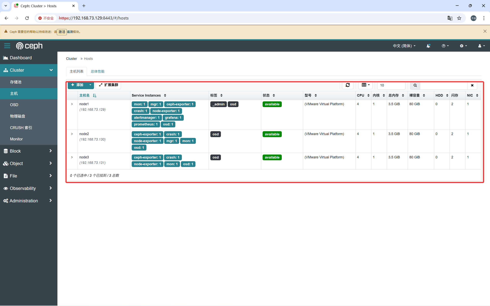

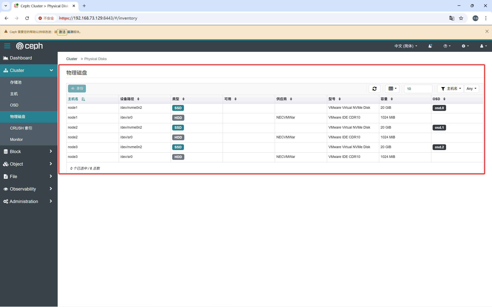

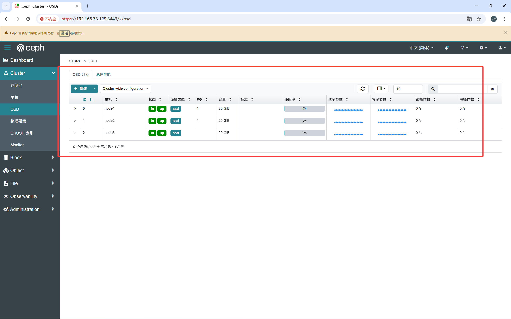

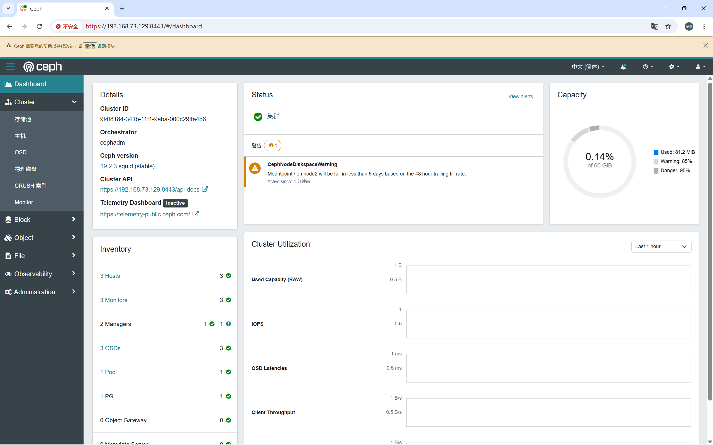

## 13.3 主机管理命令

- 添加节点到ceph集群

```bash
# 基础添加（指定节点名、IP）
ceph orch host add node2 192.168.73.130

# 可选：添加时指定标签（用于分组管理，如 osd节点、mon节点）
ceph orch host add node3 192.168.93.131 --labels osd,mon
```

- 节点信息查看

```bash
# 基础查看（节点名、IP、标签、状态）
[ceph: root@node1 /]# ceph orch host ls
HOST   ADDR            LABELS      STATUS  
node1  192.168.73.129  _admin,osd          
node2  192.168.73.130  osd                 
node3  192.168.73.131  osd                 
3 hosts in cluster

# 格式化输出（更清晰，适合脚本解析）
[ceph: root@node1 /]# ceph orch host ls --format json-pretty

[
  {
    "addr": "192.168.73.129",
    "hostname": "node1",
    "labels": [
      "_admin",
      "osd"
    ],
    "status": ""
  },
  {
    "addr": "192.168.73.130",
    "hostname": "node2",
    "labels": [
      "osd"
    ],
    "status": ""
  },
  {
    "addr": "192.168.73.131",
    "hostname": "node3",
    "labels": [
      "osd"
    ],
    "status": ""
  }
]
```

- 查看节点上运行的服务

```bash
# 查看单个节点的服务（如node2）
[ceph: root@node1 /]# ceph orch ps --host node2
NAME                 HOST   PORTS             STATUS         REFRESHED  AGE  MEM USE  MEM LIM  VERSION  IMAGE ID      CONTAINER ID  
alertmanager.node1   node1  *:9093,9094       running (73m)     9m ago  46h    47.7M        -  0.25.0   c8568f914cd2  a35c85cbf240  
ceph-exporter.node1  node1                    running (73m)     9m ago  46h    23.0M        -  19.2.3   aade1b12b8e6  130edff4d789  
ceph-exporter.node2  node2                    running (73m)     9m ago  44h    13.7M        -  19.2.3   aade1b12b8e6  5e334efbb79b  
ceph-exporter.node3  node3                    running (9m)      9m ago  44h    22.4M        -  19.2.3   aade1b12b8e6  22b5f6533c18  
crash.node1          node1                    running (73m)     9m ago  46h    15.2M        -  19.2.3   aade1b12b8e6  f85564e04d8c  
crash.node2          node2                    running (73m)     9m ago  44h    10.6M        -  19.2.3   aade1b12b8e6  78862931cc33  
crash.node3          node3                    running (9m)      9m ago  44h    12.3M        -  19.2.3   aade1b12b8e6  2ad20007f0ec  
grafana.node1        node1  *:3000            running (73m)     9m ago  46h     217M        -  10.4.0   c8b91775d855  26590749247e  
mgr.node1.risvoc     node1  *:9283,8765,8443  running (73m)     9m ago  46h     632M        -  19.2.3   aade1b12b8e6  daa791118d53  
mgr.node2.errekj     node2  *:8443,9283,8765  running (73m)     9m ago  44h     555M        -  19.2.3   aade1b12b8e6  29706b699212  
mon.node1            node1                    running (73m)     9m ago  46h    77.3M    2048M  19.2.3   aade1b12b8e6  0949c5787d8a  
mon.node2            node2                    running (73m)     9m ago  44h    79.0M    2048M  19.2.3   aade1b12b8e6  ef1489a25cc7  
mon.node3            node3                    running (9m)      9m ago  44h    36.1M    2048M  19.2.3   aade1b12b8e6  fd61b72e5e91  
node-exporter.node1  node1  *:9100            running (73m)     9m ago  46h    24.6M        -  1.7.0    72c9c2088986  254cf060add3  
node-exporter.node2  node2  *:9100            running (73m)     9m ago  44h    23.7M        -  1.7.0    72c9c2088986  29ed0f7c135b  
node-exporter.node3  node3  *:9100            running (9m)      9m ago  44h    22.1M        -  1.7.0    72c9c2088986  cbce2017ca86  
osd.0                node1                    running (73m)     9m ago  45h    72.7M    4096M  19.2.3   aade1b12b8e6  82c741e946de  
osd.1                node2                    running (73m)     9m ago  44h    71.7M    4096M  19.2.3   aade1b12b8e6  70bf656bdd25  
osd.2                node3                    running (9m)      9m ago  44h    32.5M    4096M  19.2.3   aade1b12b8e6  aeed5a3c4e74  
prometheus.node1     node1  *:9095            running (73m)     9m ago  46h     149M        -  2.51.0   1d3b7f56885b  040a732794c5

# 查看所有节点的服务分布
[ceph: root@node1 /]# ceph orch ps
NAME                 HOST   PORTS             STATUS         REFRESHED  AGE  MEM USE  MEM LIM  VERSION  IMAGE ID      CONTAINER ID  
alertmanager.node1   node1  *:9093,9094       running (74m)     9m ago  46h    47.7M        -  0.25.0   c8568f914cd2  a35c85cbf240  
ceph-exporter.node1  node1                    running (74m)     9m ago  46h    23.0M        -  19.2.3   aade1b12b8e6  130edff4d789  
ceph-exporter.node2  node2                    running (73m)     9m ago  44h    13.7M        -  19.2.3   aade1b12b8e6  5e334efbb79b  
ceph-exporter.node3  node3                    running (9m)      9m ago  44h    22.4M        -  19.2.3   aade1b12b8e6  22b5f6533c18  
crash.node1          node1                    running (74m)     9m ago  46h    15.2M        -  19.2.3   aade1b12b8e6  f85564e04d8c  
crash.node2          node2                    running (73m)     9m ago  44h    10.6M        -  19.2.3   aade1b12b8e6  78862931cc33  
crash.node3          node3                    running (9m)      9m ago  44h    12.3M        -  19.2.3   aade1b12b8e6  2ad20007f0ec  
grafana.node1        node1  *:3000            running (74m)     9m ago  46h     217M        -  10.4.0   c8b91775d855  26590749247e  
mgr.node1.risvoc     node1  *:9283,8765,8443  running (74m)     9m ago  46h     632M        -  19.2.3   aade1b12b8e6  daa791118d53  
mgr.node2.errekj     node2  *:8443,9283,8765  running (73m)     9m ago  44h     555M        -  19.2.3   aade1b12b8e6  29706b699212  
mon.node1            node1                    running (74m)     9m ago  46h    77.3M    2048M  19.2.3   aade1b12b8e6  0949c5787d8a  
mon.node2            node2                    running (73m)     9m ago  44h    79.0M    2048M  19.2.3   aade1b12b8e6  ef1489a25cc7  
mon.node3            node3                    running (9m)      9m ago  44h    36.1M    2048M  19.2.3   aade1b12b8e6  fd61b72e5e91  
node-exporter.node1  node1  *:9100            running (74m)     9m ago  46h    24.6M        -  1.7.0    72c9c2088986  254cf060add3  
node-exporter.node2  node2  *:9100            running (73m)     9m ago  44h    23.7M        -  1.7.0    72c9c2088986  29ed0f7c135b  
node-exporter.node3  node3  *:9100            running (9m)      9m ago  44h    22.1M        -  1.7.0    72c9c2088986  cbce2017ca86  
osd.0                node1                    running (73m)     9m ago  45h    72.7M    4096M  19.2.3   aade1b12b8e6  82c741e946de  
osd.1                node2                    running (73m)     9m ago  44h    71.7M    4096M  19.2.3   aade1b12b8e6  70bf656bdd25  
osd.2                node3                    running (9m)      9m ago  44h    32.5M    4096M  19.2.3   aade1b12b8e6  aeed5a3c4e74  
prometheus.node1     node1  *:9095            running (74m)     9m ago  46h     149M        -  2.51.0   1d3b7f56885b  040a732794c5 
```

- 查看节点磁盘信息（osd相关）

```bash
# 列出节点的可用磁盘（用于部署OSD）
[ceph: root@node1 /]# ceph orch device ls node2
HOST   PATH          TYPE  DEVICE ID                                             SIZE  AVAILABLE  REFRESHED  REJECT REASONS                                                           
node2  /dev/nvme0n2  ssd   VMware_Virtual_NVMe_Disk_VMware_NVME_0000            20.0G  No         12m ago    Has a FileSystem, Insufficient space (<10 extents) on vgs, LVM detected  
node2  /dev/sr0      hdd   VMware_Virtual_IDE_CDROM_Drive_10000000000000000001  1023M  No         12m ago    Failed to determine if device is BlueStore, Insufficient space (<5GB)   
```

- 节点维护模式

```bash
# 进入维护模式
[ceph: root@node1 /]# ceph orch host maintenance enter node2

# 退出维护模式（维护完成后）
[ceph: root@node1 /]# ceph orch host maintenance exit node2
```

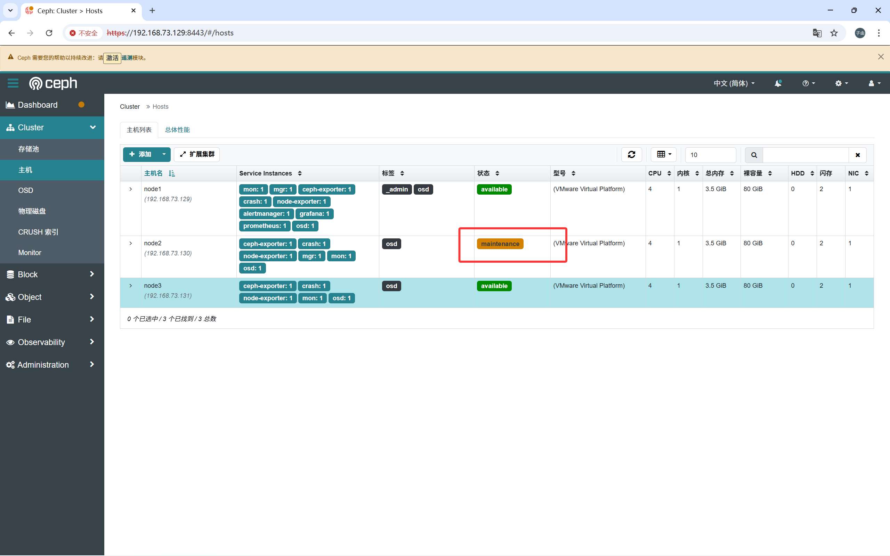

- 修改节点标签

```bash
# 添加标签（如给node2添加osd标签）
ceph orch host label add node2 osd

# 删除标签（如移除node2的mon标签）
ceph orch host label rm node2 mon

# 查看节点标签
ceph orch host ls --host node2
```

- 更新节点上的ceph版本

```bash
# 升级单个节点的所有服务
ceph orch upgrade start --host node02 --image quay.io/ceph/ceph:v20.2.0

# 升级集群所有节点（全量升级）
ceph orch upgrade start --image quay.io/ceph/ceph:v20.2.0
```

- 删除节点

```bash
# 1. 进入维护模式（迁移服务）
[ceph: root@node1 /]# ceph orch host maintenance enter node2
Daemons for Ceph cluster 9f4f8184-341b-11f1-9aba-000c29ffe4b6 stopped on host node2. Host node2 moved to maintenance mode

# 2. 移除节点（删除集群中的节点记录）
[ceph: root@node1 /]# ceph orch host rm node2
Error EINVAL: Not allowed to remove node2 from cluster. The following daemons are running in the host:
type                 id             
-------------------- ---------------
ceph-exporter        node2          
crash                node2          
node-exporter        node2          
mgr                  node2.errekj   
mon                  node2          
osd                  1              

Please run 'ceph orch host drain node2' to remove daemons from host
[ceph: root@node1 /]# ceph orch host drain node2
Scheduled to remove the following daemons from host 'node2'
type                 id             
-------------------- ---------------
ceph-exporter        node2          
crash                node2          
node-exporter        node2          
mgr                  node2.errekj   
mon                  node2          
osd                  1     

# 查看清理状态
[ceph: root@node1 /]# ceph orch osd rm status
OSD  HOST   STATE                    PGS  REPLACE  FORCE  ZAP    DRAIN STARTED AT  
1    node2  done, waiting for purge    0  False    False  False  
# 节点数太少了，移除不了，服务都已经停止了

# 强制移除节点
[ceph: root@node1 /]# ceph orch host rm node2 --force
Removed  host 'node2'
```

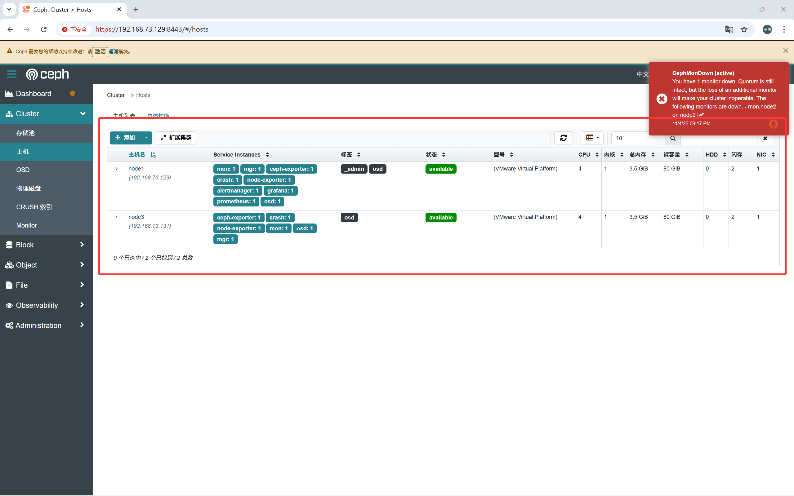

## 13.4 osd管理命令

- osd创建

```bash
# 指定节点+磁盘创建（如 node1 的 nvme0n2）
ceph orch daemon add osd node1:/dev/nvme0n2

# 批量创建（为节点所有可用磁盘创建 OSD）
ceph orch apply osd --all-available-devices --placement="node1,node2"
```

- 验证创建结果

```bash
[ceph: root@node1 /]# ceph osd ls	# 列出所有 OSD 编号（如 osd.0、osd.1）
0
1
2
[ceph: root@node1 /]# ceph osd tree	# 查看 OSD 拓扑（节点-OSD 对应关系、状态）
ID  CLASS  WEIGHT   TYPE NAME       STATUS  REWEIGHT  PRI-AFF
-1         0.05846  root default                             
-3         0.01949      host node1                           
 0    ssd  0.01949          osd.0       up   1.00000  1.00000
-5         0.01949      host node2                           
 1    ssd  0.01949          osd.1     down   1.00000  1.00000
-7         0.01949      host node3                           
 2    ssd  0.01949          osd.2       up   1.00000  1.00000
```

- 基础状态查看

```bash
# 查看所有 OSD 状态（up/down、in/out、权重等）
ceph osd status
# 简写：ceph osd stat

# 查看 OSD 详细拓扑（含节点、磁盘、状态、权重）
ceph osd tree

# 查看单个 OSD 信息（如 osd.0）
ceph osd info osd.0
[ceph: root@node1 /]# ceph osd info osd.1
osd.1 down in  weight 1 up_from 47 up_thru 47 down_at 50 last_clean_interval [36,42) [v2:192.168.73.130:6800/2259890400,v1:192.168.73.130:6801/2259890400] [v2:192.168.73.130:6802/2259890400,v1:192.168.73.130:6803/2259890400] exists 44bc6884-1709-441b-9731-515afca5aca3
```

- 性能/健康查看

```bash
# 查看 OSD 性能指标（吞吐量、IOPS、延迟）
ceph osd perf

# 查看 OSD 磁盘使用情况（容量、使用率）
ceph osd df
# 格式化输出（更清晰）
ceph osd df --format json-pretty
```

- 查看osd对应的磁盘/进程

```bash
# 查看 OSD 进程分布（节点、PID、磁盘路径）
ceph orch ps --daemon-type osd

# 查看节点上的 OSD 磁盘映射（如 node01）
ceph orch device ls node01 --detail | grep -A5 "osd."
```

- osd维护操作

```bash
# 先将 OSD 标记为 out，Ceph 会自动迁移该 OSD 上的数据到其他 OSD，避免数据丢失
# 标记单个 OSD 为 out（如 osd.0）
ceph osd out osd.0

# 批量标记（如 osd.0、osd.1）
ceph osd out osd.0 osd.1

# 停止 OSD（如 osd.0）
ceph orch daemon stop osd.0

# 启动 OSD
ceph orch daemon start osd.0

# 重启 OSD
ceph orch daemon restart osd.0

# 重启节点上所有 OSD（如 node01）
ceph orch daemon restart osd --host node01

# OSD 标记为「in」（维护完成后恢复）
ceph osd in osd.0

# # 设置 OSD 权重（如 osd.0 权重为 1.0，默认 1.0）
ceph osd crush set osd.0 1.0 host=node01

# 查看 OSD 权重
ceph osd crush tree

# 安全删除 OSD（推荐）
# 步骤 1：标记 OSD 为 out（迁移数据）
ceph osd out osd.0

# 步骤 2：停止 OSD 进程
ceph orch daemon stop osd.0

# 步骤 3：从集群中删除 OSD
ceph osd rm osd.0

# 步骤 4：删除 OSD 认证密钥（可选，清理残留）
ceph auth del osd.0

# 步骤 5：从 CRUSH 映射中移除 OSD
ceph osd crush rm osd.0

# 强制删除 OSD（紧急场景，慎用）
ceph osd rm osd.0 --force
```

- OSD 故障排查常用命令

```bash
# 查看 OSD 错误日志
ceph logs --name osd.0

# 检查 OSD 心跳状态
ceph osd ping osd.0

# 查看集群健康状态（重点关注 OSD 相关告警）
ceph health detail
```

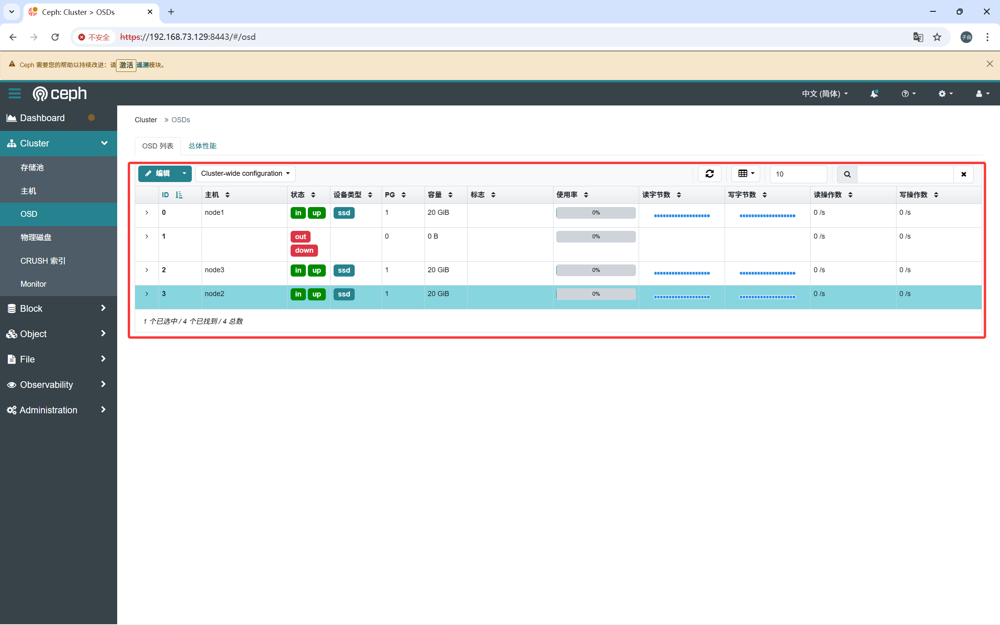

## 13.5 存储池相关命令

- 创建存储池

```bash
# 先创建 RBD 存储池（若未创建）
ceph osd pool create rbd 128 128  # 128为PG/PGP数量，测试环境可设小些
rbd pool init rbd  # 初始化 RBD 存储池

[ceph: root@node1 /]# ceph osd pool create rbd 3 3
pool 'rbd' created
[ceph: root@node1 /]# rbd pool init rbd
```

### 13.5.1 rbd块存储

- 创建RDB映像

```bash
# 基础创建：创建名为 demo.img、大小 10GB 的映像（默认池 rbd）
rbd create demo.img --size 10G

# 指定存储池创建：在 pool1 池中创建 test.img，大小 20GB
rbd create pool1/test.img --size 20G

# 高级创建：指定块大小（4M）、特性（如开启分层）
rbd create demo2.img --size 5G --object-size 4M --features layering
```

- 查看 RBD 映像

```bash
# 查看默认池（rbd）所有映像
rbd ls

# 查看指定池的映像
rbd ls pool

# 查看映像详细信息（如 demo.img）
rbd info demo.img
[ceph: root@node1 /]# rbd info demo.img
rbd image 'demo.img':
	size 10 GiB in 2560 objects
	order 22 (4 MiB objects)
	snapshot_count: 0
	id: d4ac2c2d19a7
	block_name_prefix: rbd_data.d4ac2c2d19a7
	format: 2
	features: layering, exclusive-lock, object-map, fast-diff, deep-flatten
	op_features: 
	flags: 
	create_timestamp: Sat Apr 11 14:12:53 2026
	access_timestamp: Sat Apr 11 14:12:53 2026
	modify_timestamp: Sat Apr 11 14:12:53 2026


# 查看指定池的映像信息
rbd info pool1/test.img

# 查看映像占用空间（含快照）
rbd du demo.img
[ceph: root@node1 /]# rbd du demo.img
NAME      PROVISIONED  USED
demo.img       10 GiB   0 B
```

- 修改映像大小（扩容 / 缩容）

```bash
# 扩容：将 demo.img 扩容到 15GB
rbd resize demo.img --size 15G

# 缩容：将 demo.img 缩容到 8GB（需先卸载并确保数据已迁移，慎用）
rbd resize demo.img --size 8G --allow-shrink

# 查看扩容/缩容结果
rbd info demo.img

[ceph: root@node1 /]# rbd resize demo.img --size 15G
Resizing image: 100% complete...done.
[ceph: root@node1 /]# rbd resize demo.img --size 8G --allow-shrink
Resizing image: 100% complete...done.
[ceph: root@node1 /]# rbd du demo.img
NAME      PROVISIONED  USED
demo.img        8 GiB   0 B
[ceph: root@node1 /]# rbd info demo.img
rbd image 'demo.img':
	size 8 GiB in 2048 objects
	order 22 (4 MiB objects)
	snapshot_count: 0
	id: d4ac2c2d19a7
	block_name_prefix: rbd_data.d4ac2c2d19a7
	format: 2
	features: layering, exclusive-lock, object-map, fast-diff, deep-flatten
	op_features: 
	flags: 
	create_timestamp: Sat Apr 11 14:12:53 2026
	access_timestamp: Sat Apr 11 14:12:53 2026
	modify_timestamp: Sat Apr 11 14:12:53 2026
```

- 删除 RBD 映像

```bash
# 删除默认池的 demo.img
rbd rm demo.img

# 删除指定池的映像
rbd rm pool1/test.img

# 强制删除（映像被占用时，慎用）
rbd rm demo.img --force
```

- 创建快照

```bash
# 为 demo.img 创建名为 snap1 的快照
rbd snap create demo.img@snap1

# 一次性创建带时间戳的快照（便于管理）
rbd snap create demo.img@$(date +%Y%m%d_%H%M%S)
```

- 查看快照

```bash
# 查看 demo.img 的所有快照
rbd snap ls demo.img

# 查看快照详细信息
rbd info demo.img@snap1

[ceph: root@node1 /]# rbd snap ls demo.img
SNAPID  NAME             SIZE   PROTECTED  TIMESTAMP               
     3  snap1            8 GiB             Sat Apr 11 14:16:51 2026
     4  20260411_141702  8 GiB             Sat Apr 11 14:17:03 2026
[ceph: root@node1 /]# rbd info demo.img@snap1
rbd image 'demo.img':
	size 8 GiB in 2048 objects
	order 22 (4 MiB objects)
	snapshot_count: 2
	id: d4ac2c2d19a7
	block_name_prefix: rbd_data.d4ac2c2d19a7
	format: 2
	features: layering, exclusive-lock, object-map, fast-diff, deep-flatten
	op_features: 
	flags: 
	create_timestamp: Sat Apr 11 14:12:53 2026
	access_timestamp: Sat Apr 11 14:12:53 2026
	modify_timestamp: Sat Apr 11 14:12:53 2026
	protected: False
```

- 恢复快照

```bash
# 将 demo.img 恢复到 snap1 快照状态（需先卸载映像）
rbd snap rollback demo.img@snap1
```

- 删除快照

```bash
# 删除单个快照
rbd snap rm demo.img@snap1

# 删除所有快照（批量清理）
rbd snap purge demo.img
```

- 快照设置为保护状态，方便后续克隆

```bash
# 为快照 snap1 开启保护（防止快照被删除）
rbd snap protect demo.img@snap1

# 取消保护（如需删除快照）
rbd snap unprotect demo.img@snap1
```

- 创建克隆映像

```bash
# 从 demo.img@snap1 克隆出 new_demo.img
rbd clone demo.img@snap1 new_demo.img

# 指定存储池克隆
rbd clone demo.img@snap1 pool1/clone_demo.img
```

- 查看克隆关系

```bash
# 查看映像的父快照（确认克隆来源）
rbd info new_demo.img | grep parent
```

- 扁平化克隆（脱离父快照，独立存储）

```bash
# 扁平化 new_demo.img
rbd flatten new_demo.img

# 查看扁平化结果（parent 字段消失）
rbd info new_demo.img
```

- 映射映像到本地设备

```bash
# 映射 demo.img 到本地（生成 /dev/rbd0 设备）
rbd map demo.img

# 指定用户/密钥映射（非 root 用户）
rbd map demo.img --name client.admin --keyring /etc/ceph/ceph.client.admin.keyring

# 查看映射关系
rbd showmapped
```

- 格式化并挂载映像

```bash
# 格式化映像（ext4 文件系统）
mkfs.ext4 /dev/rbd0

# 挂载到 /mnt/rbd 目录
mount /dev/rbd0 /mnt/rbd
```

- 卸载并取消映射

```bash
# 先卸载
umount /mnt/rbd

# 取消映射
rbd unmap /dev/rbd0

# 强制取消映射（设备被占用时）
rbd unmap /dev/rbd0 --force
```

#### 13.5.1.1 iscsi挂载

- 纯 targetcli 实现 RBD → iSCSI（无需 ceph-iscsi）

```bash
dnf install -y targetcli python3-kmod python3-pyparsing

# 映射 demo.img（默认 rbd 池）
rbd map demo.img

# 验证映射结果（输出 /dev/rbd0 即成功）
rbd showmapped

# 进入交互式界面
targetcli
```

- 进入 targetcli 后执行：

```bash
# 1. 创建块存储后端（关联 RBD 映射的设备 /dev/rbd0）
/backstores/block create demo_iscsi /dev/rbd0

# 2. 创建 iSCSI 目标名称（格式固定，可自定义后半段）
/iscsi create iqn.2026-03.com.ceph:demo-rbd

# 3. 为 iSCSI 目标添加 LUN（关联第一步的块存储）
/iscsi/iqn.2026-03.com.ceph:demo-rbd/tpg1/luns create /backstores/block/demo_iscsi

# 4. 关闭认证（测试环境简化，生产可加 CHAP）
/iscsi/iqn.2026-03.com.ceph:demo-rbd/tpg1 set attribute authentication=0 demo_mode_write_protect=0 generate_node_acls=1 cache_dynamic_acls=1

# 5. 允许所有客户端访问（测试用，生产可指定客户端 IQN）
/iscsi/iqn.2026-03.com.ceph:demo-rbd/tpg1/acls create ANY

# 6. 保存配置（重启后不丢失）
saveconfig

# 7. 退出
exit
```

- 启动并配置 iSCSI 服务自启

```bash
# 启动 target 服务（即 iSCSI 目标服务）
systemctl enable --now target

# 验证服务状态（active (running) 即正常）
systemctl status target
```

- windows使用iscsi发起程序连接iscsi

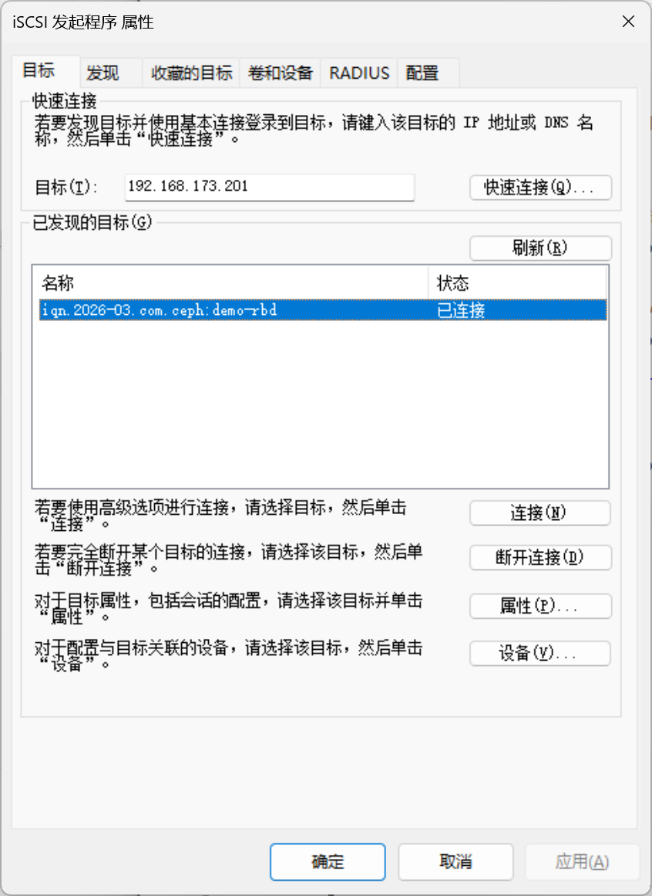

**iscsi发起程序**

- 关键验证与维护命令

```bash
# 查看 iSCSI 配置（确认目标和 LUN 已创建）
targetcli ls

# 查看当前 iSCSI 连接（Windows 连接后可看到会话）
targetcli /iscsi/iqn.2026-03.com.ceph:demo-rbd/tpg1/connections ls

# 停止/重启 iSCSI 服务
systemctl stop target
systemctl restart target

# 取消 RBD 映射（如需卸载）
rbd unmap /dev/rbd0
```

## 13.6 对象存储

- Ceph 对象存储依赖 RGW 守护进程和专用存储池，先完成基础部署

```bash
# 1. 创建 RGW 所需存储池（默认池名，也可自定义）
ceph osd pool create default.rgw.buckets.data 8 8
ceph osd pool create default.rgw.control 8 8
ceph osd pool create default.rgw.meta 8 8
ceph osd pool create default.rgw.log 8 8

# 2. 创建 RGW 服务，指定部署节点为 node1，服务名自定义为 rgw.node1
[ceph: root@node1 /]# ceph orch apply rgw myrgw --placement="1 node1"
Scheduled rgw.myrgw update...
[ceph: root@node1 /]# ceph orch daemon add rgw myrgw node1
Deployed rgw.myrgw.node1.vvvwib on host 'node1'


# 查看 RGW 服务状态（确认服务已创建）
ceph orch ls | grep rgw
[ceph: root@node1 /]# ceph orch ls | grep rgw
rgw.myrgw      ?:80             0/1  23s ago    28s  node1    

# 查看 RGW 守护进程（确认 node1 上已启动）
ceph orch ps --daemon-type rgw
```

- 重启 / 停止 / 删除 RGW 网关

```bash
# 重启指定 RGW 进程（如 rgw.node1）
ceph orch daemon restart rgw.node1

# 停止 RGW 进程
ceph orch daemon stop rgw.node1

# 删除 RGW 进程（如需重新部署）
ceph orch daemon rm rgw.node1
```

- 配置 RGW 端口 / 域名（自定义）

```bash
# 修改 RGW 监听端口（默认 8080，改为 80）
ceph config set rgw rgw_frontends "civetweb port=80"

# 配置 RGW 域名（如 s3.ceph.com）
ceph config set rgw rgw_dns_name s3.ceph.com

# 重启 RGW 使配置生效
ceph orch daemon restart rgw.node01
```

- 创建 S3 协议用户（最常用）

```bash
# 创建名为 s3-user1 的用户，指定所属租户（默认 default）
radosgw-admin user create --uid="s3-user1" --display-name="S3 User 1"

# 输出示例（关键信息：access_key/secret_key，用于客户端连接）：
# "access_key": "554Z2786E8824792980C",
# "secret_key": "87654321ABCDEFGHIJKLMNOPQRSTUVWXYZ"

[ceph: root@node1 /]# radosgw-admin user create --uid="s3-user1" --display-name="S3 User 1"
{
    "user_id": "s3-user1",
    "display_name": "S3 User 1",
    "email": "",
    "suspended": 0,
    "max_buckets": 1000,
    "subusers": [],
    "keys": [
        {
            "user": "s3-user1",
            "access_key": "J7J14C23J9ESBQ9S10IO",
            "secret_key": "MNtn1niDMoMFfHmEuhx7wV2MQt1qD0mzQSrs81Uj",
            "active": true,
            "create_date": "2026-04-11T15:19:41.686048Z"
        }
    ],
    "swift_keys": [],
    "caps": [],
    "op_mask": "read, write, delete",
    "default_placement": "",
    "default_storage_class": "",
    "placement_tags": [],
    "bucket_quota": {
        "enabled": false,
        "check_on_raw": false,
        "max_size": -1,
        "max_size_kb": 0,
        "max_objects": -1
    },
    "user_quota": {
        "enabled": false,
        "check_on_raw": false,
        "max_size": -1,
        "max_size_kb": 0,
        "max_objects": -1
    },
    "temp_url_keys": [],
    "type": "rgw",
    "mfa_ids": [],
    "account_id": "",
    "path": "/",
    "create_date": "2026-04-11T15:19:41.684928Z",
    "tags": [],
    "group_ids": []
}
```

- 查看用户信息

```bash
# 查看单个用户详情
radosgw-admin user info --uid="s3-user1"

# 列出所有用户
radosgw-admin user list

# 查看用户的桶/配额等统计信息
radosgw-admin user stats --uid="s3-user1"
```

- 修改用户信息（重置密钥 / 显示名）

```bash
# 重置用户的 S3 密钥
radosgw-admin key create --uid="s3-user1" --key-type="s3" --gen-access-key --gen-secret-key

# 修改用户显示名
radosgw-admin user modify --uid="s3-user1" --display-name="New S3 User 1"
```

- 删除用户

```bash
# 先删除用户的所有桶（否则删除失败）
radosgw-admin bucket rm --bucket="user1-bucket" --uid="s3-user1"

# 删除用户
radosgw-admin user rm --uid="s3-user1"
```

- 创建桶（两种方式）
- 方式 1：通过 radosgw-admin（服务端）

```bash
radosgw-admin bucket create --bucket="test-bucket" --uid="s3-user1"
```

- 方式 2：通过 s3cmd（客户端，需先安装）

```bash
# 安装 s3cmd
dnf install -y s3cmd

# 配置 s3cmd（填入 access_key/secret_key 和 RGW 地址）
s3cmd --configure

# 创建桶
s3cmd mb s3://test-bucket
```

- 查看桶信息

```bash
# 列出所有桶
radosgw-admin bucket list

# 查看单个桶详情
radosgw-admin bucket info --bucket="test-bucket"

# 查看桶内对象
s3cmd ls s3://test-bucket
```

- 设置桶配额（限制大小 / 对象数）

```bash
# 为桶设置配额：最大 10GB，最多 1000 个对象
radosgw-admin bucket quota set --bucket="test-bucket" --max-size=10G --max-objects=1000

# 查看桶配额
radosgw-admin bucket quota get --bucket="test-bucket"
```

- 删除桶

```bash
# 空桶直接删除
radosgw-admin bucket rm --bucket="test-bucket" --uid="s3-user1"

# 非空桶强制删除（先删对象再删桶）
s3cmd rm --recursive s3://test-bucket
radosgw-admin bucket rm --bucket="test-bucket" --uid="s3-user1"
```

- 对象（Object）管理
- 上传 / 下载 / 删除对象

```bash
# 上传本地文件到桶（s3cmd 方式）
s3cmd put local-file.txt s3://test-bucket/remote-file.txt

# 下载桶内对象到本地
s3cmd get s3://test-bucket/remote-file.txt local-file-download.txt

# 删除桶内对象
s3cmd rm s3://test-bucket/remote-file.txt

# 批量删除桶内所有对象
s3cmd rm --recursive s3://test-bucket/
```

- 查看对象元数据

```bash
# 查看单个对象元数据
s3cmd info s3://test-bucket/remote-file.txt

# 服务端查看对象信息
radosgw-admin object info --bucket="test-bucket" --object="remote-file.txt"
```

- 权限与配额管理
- 设置用户全局配额

```bash
# 限制用户 s3-user1 最大存储 50GB，最多 5000 个对象
radosgw-admin user quota set --uid="s3-user1" --max-size=50G --max-objects=5000

# 查看用户配额
radosgw-admin user quota get --uid="s3-user1"
```

- 配置桶访问权限（公开 / 私有）

```bash
# 设置桶为公有读（所有人可下载对象）
s3cmd setacl s3://test-bucket --acl-public

# 设置桶为私有（仅用户自己访问）
s3cmd setacl s3://test-bucket --acl-private

# 给指定用户授予桶的读写权限
s3cmd setacl s3://test-bucket --acl-grant=write:another-user-uid --uid="s3-user1"
```

- 故障排查常用命令

```bash
# 查看 RGW 日志（定位连接/权限错误）
ceph logs --name rgw.node01

# 检查 RGW 存储池状态
ceph osd pool stats default.rgw.buckets.data

# 修复 RGW 元数据不一致
radosgw-admin bucket sync --bucket="test-bucket"
```