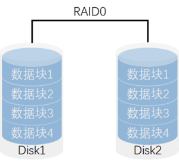
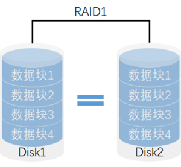
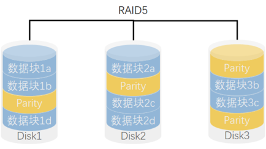
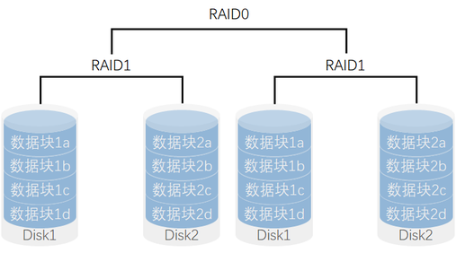
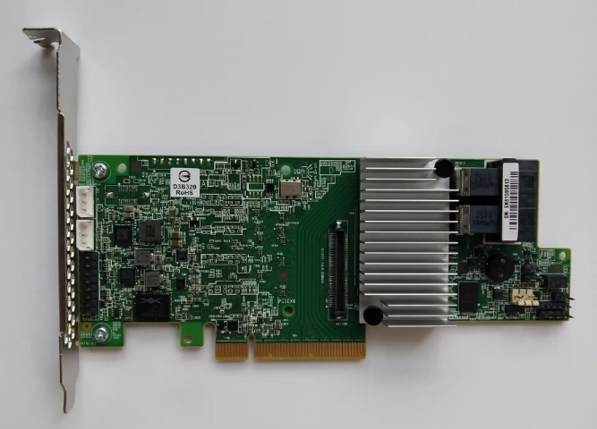
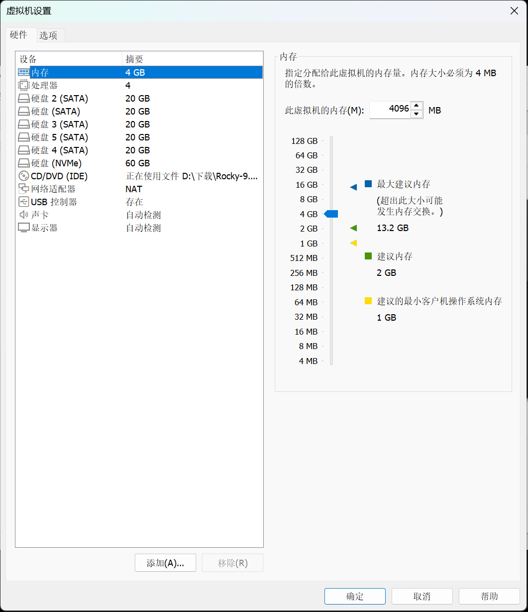

# 1. 磁盘阵列💾

**RAID (Redundant Array of Independent Disks)** 即独立磁盘冗余阵列，通过将多个物理硬盘组合成一个逻辑单元，以实现**数据冗余**（备份）或**性能提升**（加速），或两者兼得。

## 1.1 RAID 0（条带化，Striping）

- **原理**：将数据分割成块，并行写入多个磁盘。
- **优点**：极高的读写性能（理论速度是单盘的 N 倍），存储利用率 100%。
- **缺点**：**无容错能力**，任意一块盘损坏，所有数据全部丢失。
- **磁盘需求**：至少 2 块。
- **适用场景**：对 I/O 性能要求极高，但对数据安全性要求不高的场景（如缓存、临时文件）。

[](https://git.inmind-lab.com/aaronxu/Linux-book/src/branch/main/01.Linux基础/10.磁盘阵列RAID/RAID0.png)

## 1.2 **RAID 1（镜像，Mirroring）**

- **原理**：将数据同时完整地写入两块或多块硬盘（互为镜像）。

- **优点**：**极高的数据安全性**，只要有一块盘存活，数据就不丢失。

- **缺点**：存储利用率极低，仅为总容量的 1/N (N为镜像盘数量)。

- **磁盘需求**：至少 2 块。

- **适用场景**：存放极其重要的系统盘或核心数据库数据。

[](https://git.inmind-lab.com/aaronxu/Linux-book/src/branch/main/01.Linux基础/10.磁盘阵列RAID/RAID1.png)

## 1.3 **RAID 5（带奇偶校验的条带化，Striping with Parity）**

- **原理**：数据与奇偶校验信息（Parity）交叉存储在所有磁盘上。奇偶校验用于数据恢复。
- **优点**：兼顾性能与冗余，存储利用率较高（(N-1)/N）。
- **缺点**：写入性能有额外开销（需计算校验位）；**只允许坏 1 块盘**。
- **磁盘需求**：至少 3 块。
- **性能**：读性能接近 RAID 0，写性能略低。
- **适用场景**：大多数通用服务器、文件服务器。

RAID5的核心思想是使用奇偶校验信息来提供数据的冗余备份。当其中一个硬盘驱动器发生故障时，剩余的硬盘驱动器可以通过计算奇偶校验信息来恢复丢失的数据。这种方式既提供了数据冗余和容错能力，又降低了整体存储成本。

[](https://git.inmind-lab.com/aaronxu/Linux-book/src/branch/main/01.Linux基础/10.磁盘阵列RAID/RAID5.png)

## 1.4 **RAID 10（RAID 1+0，镜像与条带化的组合）**

- **原理**：先做 RAID 1（镜像），再做 RAID 0（条带化）。结合了两者的优点。
- **优点**：极高的读写性能，极高的数据安全性。
- **缺点**：存储利用率低（50%），成本高。
- **磁盘需求**：至少 4 块。
- **容错性**：允许不同镜像组中的磁盘同时损坏，但不能坏同一组内的镜像盘。
- **适用场景**：数据库、金融交易系统等对性能和数据安全要求极高的环境。

[](https://git.inmind-lab.com/aaronxu/Linux-book/src/branch/main/01.Linux基础/10.磁盘阵列RAID/RAID10.png)

## 1.5 **硬件磁盘阵列（Hardware RAID）**

### 1.5.1 **特点**

- **专用硬件控制器**：硬件 RAID 使用专门的 RAID 控制器卡（RAID Controller），通常是插入主板的 PCIe 扩展卡或者集成在服务器主板上的芯片。该控制器管理磁盘阵列的所有操作并执行 RAID 级别的计算。
- **独立于操作系统**：硬件 RAID 完全独立于操作系统，RAID 控制器负责所有 RAID 相关操作，操作系统只看到一个逻辑磁盘。
- **硬件加速**：硬件 RAID 卡通常带有专用处理器（ASIC 或 FPGA）和缓存，用来加速 RAID 操作，提高性能

### 1.5.2 阵列卡

[](https://git.inmind-lab.com/aaronxu/Linux-book/src/branch/main/01.Linux基础/10.磁盘阵列RAID/阵列卡.png)

## 1.6 **软件磁盘阵列（Software RAID）**

### 1.6.1 **特点**

- **由操作系统实现**：软件 RAID 通过操作系统内核或专门的 RAID 软件来管理和实现 RAID 功能。Linux 的 `mdadm`、Windows 的动态磁盘管理和 macOS 的磁盘工具等都支持软件 RAID。
- **没有专用硬件**：软件 RAID 不需要专用的 RAID 控制器，所有 RAID 计算和管理工作都由主机的 CPU 执行。
- **灵活性高**：软件 RAID 通常可以在不同的硬件平台之间迁移，因为 RAID 配置数据存储在磁盘上，而不是特定的控制器中。

## 1.7 **硬件 RAID 和软件 RAID 的对比**

| **对比项**   | **硬件 RAID**                            | **软件 RAID**                      |
| ------------ | ---------------------------------------- | ---------------------------------- |
| **实现方式** | 专用 RAID 控制器                         | 操作系统或软件实现                 |
| **性能**     | 高，特别是在 RAID 5/6 等级别中           | 较低，占用主机 CPU 资源            |
| **磁盘管理** | 独立于操作系统，系统只看到一个逻辑磁盘   | 依赖于操作系统的磁盘管理           |
| **成本**     | 高，需购买 RAID 控制器                   | 低，无需额外硬件                   |
| **功能支持** | 支持热备盘、硬盘监控、电池缓存等高级功能 | 功能较少，依赖操作系统提供的功能   |
| **灵活性**   | 依赖特定硬件，不易迁移                   | 容易迁移，跨硬件平台使用           |
| **故障恢复** | 控制器损坏可能需要相同型号的控制器       | 可以在不同硬件上恢复               |
| **适用场景** | 企业级、大型存储系统，数据中心           | 个人用户、小型服务器，开发测试环境 |

# 2. 部署磁盘阵列

为了后续实验，我们先添加5块全新的磁盘。关机状态下，在虚拟机设置中新增磁盘即可。最好添加完成以后，拍个快照保存一下。方便我们后续多次实验恢复。



## 2.1 mdadm磁盘整列

对于Linux上通过软件的形式构建磁盘整列，我们常用的方式是通过mdadm这个工具来完成。当然对于部分Linux发行版本，mdadm可能没有内置安装好，所以我们需要手动安装一下。

## 2.2 安装mdadm工具

yum是Linux中用于安装软件的工具，可以理解为应用商店

```sh
[root@localhost ~]# yum -y install mdadm
```

## 2.3 mdadm命令

常用参数以及作用

| 参数 | 作用             |
| ---- | ---------------- |
| -a   | 检测设备名称     |
| -n   | 指定设备数量     |
| -l   | 指定RAID级别     |
| -C   | 创建             |
| -v   | 显示过程         |
| -f   | 模拟设备损坏     |
| -r   | 移除设备         |
| -Q   | 查看摘要信息     |
| -D   | 查看详细信息     |
| -S   | 停止RAID磁盘阵列 |
| -x   | 备份盘数量       |

## 2.4 RAID 0阵列实验

### 2.4.1 部署

- 创建RAID 0阵列

```sh
[root@localhost ~]# mdadm -Cv /dev/md0 -a yes -n 2 -l 0 /dev/sda /dev/sdb
mdadm: --auto is deprecated and will be removed in future releases.
mdadm: chunk size defaults to 512K
mdadm: partition table exists on /dev/sda
mdadm: partition table exists on /dev/sda but will be lost or
       meaningless after creating array
mdadm: partition table exists on /dev/sdb
mdadm: partition table exists on /dev/sdb but will be lost or
       meaningless after creating array
Continue creating array [y/N]? y
mdadm: Defaulting to version 1.2 metadata
mdadm: array /dev/md0 started.
[root@localhost ~]# lsblk
NAME        MAJ:MIN RM  SIZE RO TYPE  MOUNTPOINTS
sda           8:0    0   20G  0 disk  
└─md0         9:0    0   40G  0 raid0 
sdb           8:16   0   20G  0 disk  
└─md0         9:0    0   40G  0 raid0 
sdc           8:32   0   20G  0 disk  
sdd           8:48   0   20G  0 disk  
sde           8:64   0   20G  0 disk  
sr0          11:0    1 1024M  0 rom   
nvme0n1     259:0    0   60G  0 disk  
├─nvme0n1p1 259:1    0    1G  0 part  /boot
└─nvme0n1p2 259:2    0   59G  0 part  
  ├─rl-root 253:0    0   37G  0 lvm   /
  ├─rl-swap 253:1    0  3.9G  0 lvm   [SWAP]
  └─rl-home 253:2    0 18.1G  0 lvm   /home
```

通过lsblk命令检查RAID 0阵列创建情况

- 格式化文件系统

```sh
[root@localhost ~]# mkfs.ext4 /dev/md0
mke2fs 1.46.5 (30-Dec-2021)
Creating filesystem with 10477056 4k blocks and 2621440 inodes
Filesystem UUID: 2c8196a3-84bc-40bd-99c7-f7d84483aa1c
Superblock backups stored on blocks: 
	32768, 98304, 163840, 229376, 294912, 819200, 884736, 1605632, 2654208, 
	4096000, 7962624

Allocating group tables: done                            
Writing inode tables: done                            
Creating journal (65536 blocks): done
Writing superblocks and filesystem accounting information: done   
```

- 创建挂载点，并对设备进行挂载

```sh
[root@localhost ~]# mkdir /mnt/raid0
[root@localhost ~]# mount /dev/md0 /mnt/raid0
[root@localhost ~]# df -h
Filesystem           Size  Used Avail Use% Mounted on
devtmpfs             4.0M     0  4.0M   0% /dev
tmpfs                1.8G     0  1.8G   0% /dev/shm
tmpfs                726M   11M  716M   2% /run
/dev/mapper/rl-root   37G  3.0G   34G   9% /
/dev/nvme0n1p1       960M  228M  733M  24% /boot
/dev/mapper/rl-home   19G  161M   18G   1% /home
tmpfs                363M     0  363M   0% /run/user/0
/dev/md0              40G   24K   38G   1% /mnt/raid0
[root@localhost ~]# lsblk
NAME        MAJ:MIN RM  SIZE RO TYPE  MOUNTPOINTS
sda           8:0    0   20G  0 disk  
└─md0         9:0    0   40G  0 raid0 /mnt/raid0
sdb           8:16   0   20G  0 disk  
└─md0         9:0    0   40G  0 raid0 /mnt/raid0
sdc           8:32   0   20G  0 disk  
sdd           8:48   0   20G  0 disk  
sde           8:64   0   20G  0 disk  
sr0          11:0    1 1024M  0 rom   
nvme0n1     259:0    0   60G  0 disk  
├─nvme0n1p1 259:1    0    1G  0 part  /boot
└─nvme0n1p2 259:2    0   59G  0 part  
  ├─rl-root 253:0    0   37G  0 lvm   /
  ├─rl-swap 253:1    0  3.9G  0 lvm   [SWAP]
  └─rl-home 253:2    0 18.1G  0 lvm   /home

# mount为临时挂载，也可以将挂载信息写入/etc/fstab文件中，进行永久挂载
[root@localhost ~]# echo "/dev/md0 /mnt/RAID0 ext4 defaults 0 0" >> /etc/fstab
[root@localhost ~]# mount -a
mount: (hint) your fstab has been modified, but systemd still uses
       the old version; use 'systemctl daemon-reload' to reload.
[root@localhost ~]# systemctl daemon-reload
[root@localhost ~]# mount -a
[root@localhost ~]# df -h
Filesystem           Size  Used Avail Use% Mounted on
devtmpfs             4.0M     0  4.0M   0% /dev
tmpfs                872M     0  872M   0% /dev/shm
tmpfs                349M  6.3M  343M   2% /run
/dev/mapper/rl-root   17G  1.7G   16G  10% /
/dev/nvme0n1p1       960M  261M  700M  28% /boot
tmpfs                175M     0  175M   0% /run/user/0
/dev/md0             9.8G   24K  9.3G   1% /mnt/RAID0

# 确保fstab文件中的内容格式正确
```

- 查看/dev/md0磁盘阵列的详细信息

```sh
[root@localhost ~]# mdadm -D /dev/md0
/dev/md0:
           Version : 1.2
     Creation Time : Sat Mar 28 16:07:34 2026
        Raid Level : raid0
        Array Size : 41908224 (39.97 GiB 42.91 GB)
      Raid Devices : 2
     Total Devices : 2
       Persistence : Superblock is persistent

       Update Time : Sat Mar 28 16:07:34 2026
             State : clean 
    Active Devices : 2
   Working Devices : 2
    Failed Devices : 0
     Spare Devices : 0

            Layout : original
        Chunk Size : 512K

Consistency Policy : none

              Name : localhost:0  (local to host localhost)
              UUID : 1b688a96:fa24dc5b:a2c3e51f:9bc5533d
            Events : 0

    Number   Major   Minor   RaidDevice State
       0       8        0        0      active sync   /dev/sda
       1       8       16        1      active sync   /dev/sdb
```

**部分字段解释：**

**Number**: 这个字段表示每个磁盘在 RAID 阵列中的编号（从 0 开始）。这是 RAID 阵列中每个设备的索引或设备号。

**Major**: 这是设备文件的主设备号（major number），它用于标识设备的类型。不同的主设备号通常对应不同的驱动程序或设备类别。

**Minor**: 这是设备文件的次设备号（minor number），用于标识同一类型设备中的不同实例。主设备号和次设备号共同唯一标识系统中的一个设备。

**RaidDevice**: 这是设备在 RAID 阵列中的逻辑设备编号。通常从 0 开始，表示该设备在 RAID 阵列中的顺序。

**State**: 表示 RAID 阵列中该设备的当前状态。常见状态如下：

- **active sync**: 表示该设备处于活动状态，并且与 RAID 阵列中的其他设备同步。
- **faulty**: 表示设备出现故障，不能正常工作。
- **spare**: 表示该设备是热备盘，当其他设备故障时可自动替换。

**set-A / set-B**: 这可能是与 RAID 10 或其他多组 RAID 配置相关的信息，表示该磁盘属于某个 RAID 子组或镜像组。例如，**set-A** 和 **set-B** 可能表示 RAID 10 配置中的两个镜像组。

**/dev/nvme0nX**: 这是设备的名称，表示设备在系统中的路径。在这里，设备是 NVMe 协议的磁盘（例如，`/dev/nvme0n2`）。不同的数字后缀（例如 `n2`, `n3` 等）表示不同的 NVMe 设备。

### 2.4.2 测试

通过fio磁盘测试工具来测试我们的RAID 0阵列的读写情况

```sh
[root@localhost ~]# yum install -y fio
```

#### 2.4.2.1 单块硬盘测试

```sh
# 先挂载单块硬盘
[root@localhost ~]# mkdir /mnt/test
[root@localhost ~]# mkfs.ext4 /dev/nvme0n4
mke2fs 1.46.5 (30-Dec-2021)
Creating filesystem with 1310720 4k blocks and 327680 inodes
Filesystem UUID: 0694e52f-3816-4223-b51b-6600bf32bb21
Superblock backups stored on blocks:
        32768, 98304, 163840, 229376, 294912, 819200, 884736

Allocating group tables: done
Writing inode tables: done
Creating journal (16384 blocks): done
Writing superblocks and filesystem accounting information: done

[root@localhost ~]# mount /dev/nvme0n4 /mnt/test
[root@localhost ~]# df -h
Filesystem           Size  Used Avail Use% Mounted on
devtmpfs             4.0M     0  4.0M   0% /dev
tmpfs                872M     0  872M   0% /dev/shm
tmpfs                349M  6.3M  343M   2% /run
/dev/mapper/rl-root   17G  1.7G   16G  10% /
/dev/nvme0n1p1       960M  261M  700M  28% /boot
tmpfs                175M     0  175M   0% /run/user/0
/dev/md0             9.8G   24K  9.3G   1% /mnt/RAID0
/dev/nvme0n4         4.9G   24K  4.6G   1% /mnt/test

# 开始测试
[root@localhost test]# fio --name=write_test --filename=/mnt/test/testfile --size=1G --bs=1M --rw=write --direct=1 --numjobs=1
write_test: (g=0): rw=write, bs=(R) 1024KiB-1024KiB, (W) 1024KiB-1024KiB, (T) 1024KiB-1024KiB, i                                                                   oengine=psync, iodepth=1
fio-3.35
Starting 1 process
write_test: Laying out IO file (1 file / 1024MiB)

write_test: (groupid=0, jobs=1): err= 0: pid=29670: Thu Nov 14 16:51:32 2024
  write: IOPS=1404, BW=1405MiB/s (1473MB/s)(1024MiB/729msec); 0 zone resets
    clat (usec): min=570, max=2700, avg=694.62, stdev=136.39
     lat (usec): min=588, max=2709, avg=710.02, stdev=136.41
    clat percentiles (usec):
     |  1.00th=[  586],  5.00th=[  594], 10.00th=[  603], 20.00th=[  619],
     | 30.00th=[  635], 40.00th=[  652], 50.00th=[  668], 60.00th=[  693],
     | 70.00th=[  709], 80.00th=[  742], 90.00th=[  783], 95.00th=[  848],
     | 99.00th=[ 1057], 99.50th=[ 1450], 99.90th=[ 2409], 99.95th=[ 2704],
     | 99.99th=[ 2704]
   bw (  MiB/s): min= 1400, max= 1400, per=99.67%, avg=1400.00, stdev= 0.00, samples=1
   iops        : min= 1400, max= 1400, avg=1400.00, stdev= 0.00, samples=1
  lat (usec)   : 750=83.11%, 1000=15.53%
  lat (msec)   : 2=1.07%, 4=0.29%
  cpu          : usr=0.14%, sys=8.52%, ctx=1024, majf=0, minf=8
  IO depths    : 1=100.0%, 2=0.0%, 4=0.0%, 8=0.0%, 16=0.0%, 32=0.0%, >=64=0.0%
     submit    : 0=0.0%, 4=100.0%, 8=0.0%, 16=0.0%, 32=0.0%, 64=0.0%, >=64=0.0%
     complete  : 0=0.0%, 4=100.0%, 8=0.0%, 16=0.0%, 32=0.0%, 64=0.0%, >=64=0.0%
     issued rwts: total=0,1024,0,0 short=0,0,0,0 dropped=0,0,0,0
     latency   : target=0, window=0, percentile=100.00%, depth=1

Run status group 0 (all jobs):
  WRITE: bw=1405MiB/s (1473MB/s), 1405MiB/s-1405MiB/s (1473MB/s-1473MB/s), io=1024MiB (1074MB),                                                                    run=729-729msec

Disk stats (read/write):
  nvme0n4: ios=0/1793, merge=0/6, ticks=0/1173, in_queue=1173, util=86.50%
```

#### 2.4.2.2 RAID 0测试

```sh
[root@localhost RAID0]# fio --name=write_test --filename=/mnt/RAID0/testfile --size=1G --bs=1M --rw=write --d                                                                                               irect=1 --numjobs=1
write_test: (g=0): rw=write, bs=(R) 1024KiB-1024KiB, (W) 1024KiB-1024KiB, (T) 1024KiB-1024KiB, ioengine=psync                                                                                               , iodepth=1
fio-3.35
Starting 1 process
write_test: Laying out IO file (1 file / 1024MiB)

write_test: (groupid=0, jobs=1): err= 0: pid=29232: Thu Nov 14 16:40:26 2024
  write: IOPS=1314, BW=1315MiB/s (1378MB/s)(1024MiB/779msec); 0 zone resets
    clat (usec): min=513, max=3382, avg=737.41, stdev=259.09
     lat (usec): min=527, max=3469, avg=759.04, stdev=265.36
    clat percentiles (usec):
     |  1.00th=[  537],  5.00th=[  570], 10.00th=[  578], 20.00th=[  611],
     | 30.00th=[  627], 40.00th=[  660], 50.00th=[  676], 60.00th=[  709],
     | 70.00th=[  758], 80.00th=[  824], 90.00th=[  898], 95.00th=[  963],
     | 99.00th=[ 2147], 99.50th=[ 2540], 99.90th=[ 3294], 99.95th=[ 3392],
     | 99.99th=[ 3392]
   bw (  MiB/s): min= 1275, max= 1275, per=97.03%, avg=1275.45, stdev= 0.00, samples=1
   iops        : min= 1275, max= 1275, avg=1275.00, stdev= 0.00, samples=1
  lat (usec)   : 750=69.43%, 1000=26.86%
  lat (msec)   : 2=2.34%, 4=1.37%
  cpu          : usr=0.39%, sys=9.77%, ctx=1024, majf=0, minf=10
  IO depths    : 1=100.0%, 2=0.0%, 4=0.0%, 8=0.0%, 16=0.0%, 32=0.0%, >=64=0.0%
     submit    : 0=0.0%, 4=100.0%, 8=0.0%, 16=0.0%, 32=0.0%, 64=0.0%, >=64=0.0%
     complete  : 0=0.0%, 4=100.0%, 8=0.0%, 16=0.0%, 32=0.0%, 64=0.0%, >=64=0.0%
     issued rwts: total=0,1024,0,0 short=0,0,0,0 dropped=0,0,0,0
     latency   : target=0, window=0, percentile=100.00%, depth=1

Run status group 0 (all jobs):
  WRITE: bw=1315MiB/s (1378MB/s), 1315MiB/s-1315MiB/s (1378MB/s-1378MB/s), io=1024MiB (1074MB), run=779-779ms                                                                                               ec

Disk stats (read/write):
    md0: ios=0/1660, merge=0/0, ticks=0/1229, in_queue=1229, util=86.06%, aggrios=0/1024, aggrmerge=0/0, aggr                                                                                               ticks=0/703, aggrin_queue=703, aggrutil=86.57%
  nvme0n2: ios=0/1024, merge=0/0, ticks=0/702, in_queue=702, util=86.57%
  nvme0n3: ios=0/1024, merge=0/0, ticks=0/705, in_queue=705, util=86.57%
```

由此可以看出，似乎单块磁盘和RAID 0的写入速度是差不多一样的。按道理来说，RAID 0是将数据分散在两块磁盘上，写入速度理应翻倍。但是由于这是虚拟机，使用我们自己电脑的物理磁盘，我们的物理硬盘只有一块，所以这里看不到RAID 0的双倍读写速度的效果。

``` bash
[root@localhost ~]# fio --name=write_test --filename=/mnt/raid0/testfile --size=1G --bs=1M --rw=write --direct=1 --numjobs=1
write_test: (g=0): rw=write, bs=(R) 1024KiB-1024KiB, (W) 1024KiB-1024KiB, (T) 1024KiB-1024KiB, ioengine=psync, iodepth=1
fio-3.35
Starting 1 process
write_test: Laying out IO file (1 file / 1024MiB)
Jobs: 1 (f=1)
write_test: (groupid=0, jobs=1): err= 0: pid=1887: Sat Mar 28 16:16:15 2026
  write: IOPS=418, BW=418MiB/s (439MB/s)(1024MiB/2448msec); 0 zone resets
    clat (usec): min=742, max=6193, avg=2360.11, stdev=666.38
     lat (usec): min=752, max=6231, avg=2386.28, stdev=668.61
    clat percentiles (usec):
     |  1.00th=[ 1205],  5.00th=[ 1385], 10.00th=[ 1516], 20.00th=[ 1942],
     | 30.00th=[ 2089], 40.00th=[ 2212], 50.00th=[ 2311], 60.00th=[ 2409],
     | 70.00th=[ 2540], 80.00th=[ 2737], 90.00th=[ 3064], 95.00th=[ 3458],
     | 99.00th=[ 4883], 99.50th=[ 5145], 99.90th=[ 5866], 99.95th=[ 6194],
     | 99.99th=[ 6194]
   bw (  KiB/s): min=385024, max=493568, per=100.00%, avg=437861.75, stdev=49312.66, samples=4
   iops        : min=  376, max=  482, avg=427.50, stdev=48.23, samples=4
  lat (usec)   : 750=0.10%, 1000=0.20%
  lat (msec)   : 2=22.56%, 4=74.41%, 10=2.73%
  cpu          : usr=0.57%, sys=78.30%, ctx=988, majf=0, minf=12
  IO depths    : 1=100.0%, 2=0.0%, 4=0.0%, 8=0.0%, 16=0.0%, 32=0.0%, >=64=0.0%
     submit    : 0=0.0%, 4=100.0%, 8=0.0%, 16=0.0%, 32=0.0%, 64=0.0%, >=64=0.0%
     complete  : 0=0.0%, 4=100.0%, 8=0.0%, 16=0.0%, 32=0.0%, 64=0.0%, >=64=0.0%
     issued rwts: total=0,1024,0,0 short=0,0,0,0 dropped=0,0,0,0
     latency   : target=0, window=0, percentile=100.00%, depth=1

Run status group 0 (all jobs):
  WRITE: bw=418MiB/s (439MB/s), 418MiB/s-418MiB/s (439MB/s-439MB/s), io=1024MiB (1074MB), run=2448-2448msec

Disk stats (read/write):
    md0: ios=0/1998, merge=0/0, ticks=0/4525, in_queue=4525, util=96.05%, aggrios=0/1024, aggrmerge=0/0, aggrticks=0/2277, aggrin_queue=2278, aggrutil=95.51%
  sdb: ios=0/1024, merge=0/0, ticks=0/2337, in_queue=2337, util=95.51%
  sda: ios=0/1024, merge=0/0, ticks=0/2218, in_queue=2219, util=95.08%
```

### 2.4.3 删除磁盘阵列

```sh
# 先取消挂载，如果写入到fstab文件中，要记得删除
[root@localhost ~]# umount /dev/md0
# 停止磁盘整列
[root@localhost ~]# mdadm -S /dev/md0
mdadm: stopped /dev/md0
# 删除阵列中的数据块信息
[root@localhost ~]# mdadm --zero-superblock /dev/nvme0n2 /dev/nvme0n3
# 检查磁盘情况
[root@localhost ~]# lsblk
NAME        MAJ:MIN RM  SIZE RO TYPE MOUNTPOINTS
sda           8:0    0   20G  0 disk 
sdb           8:16   0   20G  0 disk 
sdc           8:32   0   20G  0 disk 
sdd           8:48   0   20G  0 disk 
sde           8:64   0   20G  0 disk 
sr0          11:0    1 1024M  0 rom  
nvme0n1     259:0    0   60G  0 disk 
├─nvme0n1p1 259:1    0    1G  0 part /boot
└─nvme0n1p2 259:2    0   59G  0 part 
  ├─rl-root 253:0    0   37G  0 lvm  /
  ├─rl-swap 253:1    0  3.9G  0 lvm  [SWAP]
  └─rl-home 253:2    0 18.1G  0 lvm  /home
```

## 2.5 RAID 1阵列实验

### 2.5.1 部署

按照上面实验中的方式，创建RAID1阵列以及完成挂载

```bash
[root@localhost ~]# mdadm -Cv /dev/md0 -a yes -n 2 -l 1 /dev/sda /dev/sdb
mdadm: --auto is deprecated and will be removed in future releases.
To optimalize recovery speed, it is recommended to enable write-indent bitmap, do you want to enable it now? [y/N]? y
mdadm: partition table exists on /dev/sda
mdadm: partition table exists on /dev/sda but will be lost or
       meaningless after creating array
mdadm: Note: this array has metadata at the start and
    may not be suitable as a boot device.  If you plan to
    store '/boot' on this device please ensure that
    your boot-loader understands md/v1.x metadata, or use
    --metadata=0.90
mdadm: partition table exists on /dev/sdb
mdadm: partition table exists on /dev/sdb but will be lost or
       meaningless after creating array
mdadm: size set to 20954112K
Continue creating array [y/N]? y
mdadm: Defaulting to version 1.2 metadata
mdadm: array /dev/md0 started.
[root@localhost ~]# lsblk
NAME        MAJ:MIN RM  SIZE RO TYPE  MOUNTPOINTS
sda           8:0    0   20G  0 disk  
└─md0         9:0    0   20G  0 raid1 
sdb           8:16   0   20G  0 disk  
└─md0         9:0    0   20G  0 raid1 
sdc           8:32   0   20G  0 disk  
sdd           8:48   0   20G  0 disk  
sde           8:64   0   20G  0 disk  
sr0          11:0    1 1024M  0 rom   
nvme0n1     259:0    0   60G  0 disk  
├─nvme0n1p1 259:1    0    1G  0 part  /boot
└─nvme0n1p2 259:2    0   59G  0 part  
  ├─rl-root 253:0    0   37G  0 lvm   /
  ├─rl-swap 253:1    0  3.9G  0 lvm   [SWAP]
  └─rl-home 253:2    0 18.1G  0 lvm   /home

[root@localhost ~]# mkfs.ext4 /dev/md0
mke2fs 1.46.5 (30-Dec-2021)
/dev/md0 contains a ext4 file system
	last mounted on /mnt/raid0 on Sat Mar 28 16:10:24 2026
Proceed anyway? (y,N) y
Creating filesystem with 5238528 4k blocks and 1310720 inodes
Filesystem UUID: 59d6ab18-54ff-4c06-9b06-47a88990dad3
Superblock backups stored on blocks: 
	32768, 98304, 163840, 229376, 294912, 819200, 884736, 1605632, 2654208, 
	4096000

Allocating group tables: done                            
Writing inode tables: done                            
Creating journal (32768 blocks): done
Writing superblocks and filesystem accounting information: done   

[root@localhost ~]# mkdir /mnt/raid1
[root@localhost ~]# mount /dev/md0 /mnt/raid1
[root@localhost ~]# df -h
Filesystem           Size  Used Avail Use% Mounted on
devtmpfs             4.0M     0  4.0M   0% /dev
tmpfs                1.8G     0  1.8G   0% /dev/shm
tmpfs                726M   11M  716M   2% /run
/dev/mapper/rl-root   37G  3.1G   34G   9% /
/dev/nvme0n1p1       960M  228M  733M  24% /boot
/dev/mapper/rl-home   19G  161M   18G   1% /home
tmpfs                363M     0  363M   0% /run/user/0
/dev/md0              20G   24K   19G   1% /mnt/raid1
```

**注意最后的磁盘大小，我们将使用两块大小为20G的磁盘创建RAID1阵列。但是发现最后的磁盘大小还是20G，这也验证了RAID 1的特性，两块磁盘存放一样的数据，将数据镜像化，所以可用空间也会打对折**

### 2.5.2 磁盘写入测试

```sh
[root@localhost ~]# fio --name=write_test --filename=/mnt/raid1/testfile --size=1G --bs=1M --rw=write --direct=1 --numjobs=1
write_test: (g=0): rw=write, bs=(R) 1024KiB-1024KiB, (W) 1024KiB-1024KiB, (T) 1024KiB-1024KiB, ioengine=psync, iodepth=1
fio-3.35
Starting 1 process
write_test: Laying out IO file (1 file / 1024MiB)
Jobs: 1 (f=1): [W(1)][100.0%][w=176MiB/s][w=176 IOPS][eta 00m:00s]
write_test: (groupid=0, jobs=1): err= 0: pid=1996: Sat Mar 28 16:22:43 2026
  write: IOPS=191, BW=192MiB/s (201MB/s)(1024MiB/5335msec); 0 zone resets
    clat (usec): min=1916, max=21276, avg=5176.25, stdev=1942.69
     lat (usec): min=1944, max=21302, avg=5205.65, stdev=1945.13
    clat percentiles (usec):
     |  1.00th=[ 2671],  5.00th=[ 2999], 10.00th=[ 3458], 20.00th=[ 3916],
     | 30.00th=[ 4146], 40.00th=[ 4359], 50.00th=[ 4621], 60.00th=[ 4948],
     | 70.00th=[ 5407], 80.00th=[ 6259], 90.00th=[ 7701], 95.00th=[ 9241],
     | 99.00th=[11731], 99.50th=[12649], 99.90th=[14746], 99.95th=[21365],
     | 99.99th=[21365]
   bw (  KiB/s): min=143073, max=247808, per=100.00%, avg=197677.00, stdev=39579.02, samples=10
   iops        : min=  139, max=  242, avg=192.90, stdev=38.81, samples=10
  lat (msec)   : 2=0.10%, 4=23.05%, 10=73.34%, 20=3.42%, 50=0.10%
  cpu          : usr=0.47%, sys=75.57%, ctx=1101, majf=0, minf=11
  IO depths    : 1=100.0%, 2=0.0%, 4=0.0%, 8=0.0%, 16=0.0%, 32=0.0%, >=64=0.0%
     submit    : 0=0.0%, 4=100.0%, 8=0.0%, 16=0.0%, 32=0.0%, 64=0.0%, >=64=0.0%
     complete  : 0=0.0%, 4=100.0%, 8=0.0%, 16=0.0%, 32=0.0%, 64=0.0%, >=64=0.0%
     issued rwts: total=0,1024,0,0 short=0,0,0,0 dropped=0,0,0,0
     latency   : target=0, window=0, percentile=100.00%, depth=1

Run status group 0 (all jobs):
  WRITE: bw=192MiB/s (201MB/s), 192MiB/s-192MiB/s (201MB/s-201MB/s), io=1024MiB (1074MB), run=5335-5335msec

Disk stats (read/write):
    md0: ios=0/2001, merge=0/0, ticks=0/9700, in_queue=9700, util=98.21%, aggrios=0/2075, aggrmerge=0/24, aggrticks=0/7406, aggrin_queue=7406, aggrutil=90.28%
  sdb: ios=0/2075, merge=0/24, ticks=0/7417, in_queue=7417, util=72.05%
  sda: ios=0/2075, merge=0/24, ticks=0/7396, in_queue=7396, util=90.28%
```

从测试结果中可以看见，RAID 1阵列的磁盘写入速度会比单块磁盘相对慢一点，因为RAID 1阵列是将一份数据写入两遍。

## 2.6 RAID 10阵列实验

建议恢复快照到磁盘刚添加磁盘的状态。最少需要4块额外的硬盘

### 2.6.1 部署

- 创建RAID 10阵列

```sh
[root@localhost ~]#  mdadm -Cv /dev/md0 -a yes -n 4 -l 10 /dev/sda /dev/sdb /dev/sdc /dev/sdd
mdadm: --auto is deprecated and will be removed in future releases.
To optimalize recovery speed, it is recommended to enable write-indent bitmap, do you want to enable it now? [y/N]? y
mdadm: layout defaults to n2
mdadm: layout defaults to n2
mdadm: chunk size defaults to 512K
mdadm: /dev/sda appears to be part of a raid array:
       level=raid1 devices=2 ctime=Sat Mar 28 16:19:53 2026
mdadm: partition table exists on /dev/sda but will be lost or
       meaningless after creating array
mdadm: /dev/sdb appears to be part of a raid array:
       level=raid1 devices=2 ctime=Sat Mar 28 16:19:53 2026
mdadm: partition table exists on /dev/sdb but will be lost or
       meaningless after creating array
mdadm: size set to 20954112K
Continue creating array [y/N]? y
mdadm: Defaulting to version 1.2 metadata
mdadm: array /dev/md0 started.

[root@localhost ~]# lsblk
NAME        MAJ:MIN RM  SIZE RO TYPE   MOUNTPOINTS
sda           8:0    0   20G  0 disk   
└─md0         9:0    0   40G  0 raid10 
sdb           8:16   0   20G  0 disk   
└─md0         9:0    0   40G  0 raid10 
sdc           8:32   0   20G  0 disk   
└─md0         9:0    0   40G  0 raid10 
sdd           8:48   0   20G  0 disk   
└─md0         9:0    0   40G  0 raid10 
sde           8:64   0   20G  0 disk   
sr0          11:0    1 1024M  0 rom    
nvme0n1     259:0    0   60G  0 disk   
├─nvme0n1p1 259:1    0    1G  0 part   /boot
└─nvme0n1p2 259:2    0   59G  0 part   
  ├─rl-root 253:0    0   37G  0 lvm    /
  ├─rl-swap 253:1    0  3.9G  0 lvm    [SWAP]
  └─rl-home 253:2    0 18.1G  0 lvm    /home
[root@localhost ~]# mkdir /mnt/raid10
[root@localhost ~]# mkfs.ext4 /dev/md0 
mke2fs 1.46.5 (30-Dec-2021)
/dev/md0 contains a ext4 file system
	last mounted on /mnt/raid1 on Sat Mar 28 16:21:31 2026
Proceed anyway? (y,N) y
Creating filesystem with 10477056 4k blocks and 2621440 inodes
Filesystem UUID: 5abc9071-8819-4de8-bffb-6b02f5d4c889
Superblock backups stored on blocks: 
	32768, 98304, 163840, 229376, 294912, 819200, 884736, 1605632, 2654208, 
	4096000, 7962624

Allocating group tables: done                            
Writing inode tables: done                            
Creating journal (65536 blocks): done
Writing superblocks and filesystem accounting information: done   

[root@localhost ~]# mount /dev/md0 /mnt/raid10
[root@localhost ~]# df -h
Filesystem           Size  Used Avail Use% Mounted on
devtmpfs             4.0M     0  4.0M   0% /dev
tmpfs                1.8G     0  1.8G   0% /dev/shm
tmpfs                726M   11M  716M   2% /run
/dev/mapper/rl-root   37G  3.1G   34G   9% /
/dev/nvme0n1p1       960M  228M  733M  24% /boot
/dev/mapper/rl-home   19G  161M   18G   1% /home
tmpfs                363M     0  363M   0% /run/user/0
/dev/md0              40G   24K   38G   1% /mnt/raid10
# 这里可以看到，虽然我们使用了4块大小为20G的硬盘，但是最后的实际大小只有40G。
```

- 检查整列情况

```sh
[root@localhost ~]# mdadm -D /dev/md0
/dev/md0:
           Version : 1.2
     Creation Time : Sat Mar 28 16:25:22 2026
        Raid Level : raid10
        Array Size : 41908224 (39.97 GiB 42.91 GB)
     Used Dev Size : 20954112 (19.98 GiB 21.46 GB)
      Raid Devices : 4
     Total Devices : 4
       Persistence : Superblock is persistent

     Intent Bitmap : Internal

       Update Time : Sat Mar 28 16:28:54 2026
             State : active 
    Active Devices : 4
   Working Devices : 4
    Failed Devices : 0
     Spare Devices : 0

            Layout : near=2
        Chunk Size : 512K

Consistency Policy : bitmap

              Name : localhost:0  (local to host localhost)
              UUID : a960ea0e:436f1558:7e57525c:4c218819
            Events : 49

    Number   Major   Minor   RaidDevice State
       0       8        0        0      active sync set-A   /dev/sda
       1       8       16        1      active sync set-B   /dev/sdb
       2       8       32        2      active sync set-A   /dev/sdc
       3       8       48        3      active sync set-B   /dev/sdd
```

### 2.6.2 磁盘写入测试

```sh
[root@localhost ~]# fio --name=write_test --filename=/mnt/raid10/testfile --size=1G --bs=1M --rw=write --direct=1 --numjobs=1
write_test: (g=0): rw=write, bs=(R) 1024KiB-1024KiB, (W) 1024KiB-1024KiB, (T) 1024KiB-1024KiB, ioengine=psync, iodepth=1
fio-3.35
Starting 1 process
write_test: Laying out IO file (1 file / 1024MiB)
Jobs: 1 (f=1): [W(1)][100.0%][w=177MiB/s][w=177 IOPS][eta 00m:00s]
write_test: (groupid=0, jobs=1): err= 0: pid=2057: Sat Mar 28 16:30:08 2026
  write: IOPS=176, BW=176MiB/s (185MB/s)(1024MiB/5804msec); 0 zone resets
    clat (usec): min=2547, max=16066, avg=5631.68, stdev=1021.42
     lat (usec): min=2570, max=16103, avg=5662.76, stdev=1023.91
    clat percentiles (usec):
     |  1.00th=[ 3326],  5.00th=[ 4113], 10.00th=[ 4752], 20.00th=[ 5014],
     | 30.00th=[ 5276], 40.00th=[ 5407], 50.00th=[ 5604], 60.00th=[ 5735],
     | 70.00th=[ 5932], 80.00th=[ 6128], 90.00th=[ 6587], 95.00th=[ 7046],
     | 99.00th=[ 8160], 99.50th=[ 8717], 99.90th=[15139], 99.95th=[16057],
     | 99.99th=[16057]
   bw (  KiB/s): min=175776, max=186368, per=100.00%, avg=181176.09, stdev=3684.98, samples=11
   iops        : min=  171, max=  182, avg=176.73, stdev= 3.61, samples=11
  lat (msec)   : 4=4.49%, 10=95.12%, 20=0.39%
  cpu          : usr=0.40%, sys=88.57%, ctx=1265, majf=0, minf=12
  IO depths    : 1=100.0%, 2=0.0%, 4=0.0%, 8=0.0%, 16=0.0%, 32=0.0%, >=64=0.0%
     submit    : 0=0.0%, 4=100.0%, 8=0.0%, 16=0.0%, 32=0.0%, 64=0.0%, >=64=0.0%
     complete  : 0=0.0%, 4=100.0%, 8=0.0%, 16=0.0%, 32=0.0%, 64=0.0%, >=64=0.0%
     issued rwts: total=0,1024,0,0 short=0,0,0,0 dropped=0,0,0,0
     latency   : target=0, window=0, percentile=100.00%, depth=1

Run status group 0 (all jobs):
  WRITE: bw=176MiB/s (185MB/s), 176MiB/s-176MiB/s (185MB/s-185MB/s), io=1024MiB (1074MB), run=5804-5804msec

Disk stats (read/write):
    md0: ios=0/3011, merge=0/0, ticks=0/14147, in_queue=14147, util=98.36%, aggrios=0/1558, aggrmerge=0/7, aggrticks=0/4581, aggrin_queue=4581, aggrutil=82.17%
  sdd: ios=0/2069, merge=0/0, ticks=0/5476, in_queue=5476, util=71.90%
  sdb: ios=0/1047, merge=0/15, ticks=0/3574, in_queue=3574, util=77.60%
  sdc: ios=0/2069, merge=0/0, ticks=0/6202, in_queue=6202, util=82.17%
  sda: ios=0/1047, merge=0/15, ticks=0/3074, in_queue=3074, util=69.43%
```

### 2.6.3 损坏磁盘阵列及修复

在确认有一块物理硬盘设备出现损坏而不能继续正常使用后，应该使用mdadm命令将其移除，然后查看RAID磁盘阵列的状态，可以发现状态已经改变。

```bash
[root@localhost ~]# mdadm /dev/md0 -f /dev/sda
[root@localhost ~]# mdadm -D /dev/md0
/dev/md0:
           Version : 1.2
     Creation Time : Sat Mar 28 16:25:22 2026
        Raid Level : raid10
        Array Size : 41908224 (39.97 GiB 42.91 GB)
     Used Dev Size : 20954112 (19.98 GiB 21.46 GB)
      Raid Devices : 4
     Total Devices : 4
       Persistence : Superblock is persistent

     Intent Bitmap : Internal

       Update Time : Sat Mar 28 16:30:47 2026
             State : clean, degraded 
    Active Devices : 3
   Working Devices : 3
    Failed Devices : 1
     Spare Devices : 0

            Layout : near=2
        Chunk Size : 512K

Consistency Policy : bitmap

              Name : localhost:0  (local to host localhost)
              UUID : a960ea0e:436f1558:7e57525c:4c218819
            Events : 52

    Number   Major   Minor   RaidDevice State
       -       0        0        0      removed
       1       8       16        1      active sync set-B   /dev/sdb
       2       8       32        2      active sync set-A   /dev/sdc
       3       8       48        3      active sync set-B   /dev/sdd

       0       8        0        -      faulty   /dev/sda
[root@localhost ~]# df -h
Filesystem           Size  Used Avail Use% Mounted on
devtmpfs             4.0M     0  4.0M   0% /dev
tmpfs                1.8G     0  1.8G   0% /dev/shm
tmpfs                726M   11M  716M   2% /run
/dev/mapper/rl-root   37G  3.1G   34G   9% /
/dev/nvme0n1p1       960M  228M  733M  24% /boot
/dev/mapper/rl-home   19G  161M   18G   1% /home
tmpfs                363M     0  363M   0% /run/user/0
/dev/md0              40G  1.1G   37G   3% /mnt/raid10
```

在RAID 10级别的磁盘阵列中，当RAID 1磁盘阵列中存在一个故障盘时并不影响RAID 10磁盘阵列的使用。当购买了新的硬盘设备后再使用mdadm命令来予以替换即可，在此期间我们可以在/RAID目录中正常地创建或删除文件。由于我们是在虚拟机中模拟硬盘，所以先重启系统，然后再把新的硬盘添加到RAID磁盘阵列中。

```bash
[root@localhost ~]# umount /mnt/RAID10
#有时候失败，告诉设备忙，-f参数都没用
#可以使用fuser -mk /mnt/RAID10命令杀死所有占用该文件的进程

# 先热移除/dev/nvme0n2
[root@localhost ~]#  mdadm /dev/md0 -r /dev/sda
mdadm: hot removed /dev/sda from /dev/md0
[root@localhost ~]# mdadm -D /dev/md0
/dev/md0:
           Version : 1.2
     Creation Time : Sat Mar 28 16:25:22 2026
        Raid Level : raid10
        Array Size : 41908224 (39.97 GiB 42.91 GB)
     Used Dev Size : 20954112 (19.98 GiB 21.46 GB)
      Raid Devices : 4
     Total Devices : 3
       Persistence : Superblock is persistent

     Intent Bitmap : Internal

       Update Time : Sat Mar 28 16:32:50 2026
             State : clean, degraded 
    Active Devices : 3
   Working Devices : 3
    Failed Devices : 0
     Spare Devices : 0

            Layout : near=2
        Chunk Size : 512K

Consistency Policy : bitmap

              Name : localhost:0  (local to host localhost)
              UUID : a960ea0e:436f1558:7e57525c:4c218819
            Events : 53

    Number   Major   Minor   RaidDevice State
       -       0        0        0      removed
       1       8       16        1      active sync set-B   /dev/sdb
       2       8       32        2      active sync set-A   /dev/sdc
       3       8       48        3      active sync set-B   /dev/sdd

# 再重新添加/dev/nvme0n2
[root@localhost ~]# mdadm /dev/md0 -a /dev/sda
mdadm: re-added /dev/sda
[root@localhost ~]# mdadm -D /dev/md0
/dev/md0:
           Version : 1.2
     Creation Time : Sat Mar 28 16:25:22 2026
        Raid Level : raid10
        Array Size : 41908224 (39.97 GiB 42.91 GB)
     Used Dev Size : 20954112 (19.98 GiB 21.46 GB)
      Raid Devices : 4
     Total Devices : 4
       Persistence : Superblock is persistent

     Intent Bitmap : Internal

       Update Time : Sat Mar 28 16:33:48 2026
             State : clean 
    Active Devices : 4
   Working Devices : 4
    Failed Devices : 0
     Spare Devices : 0

            Layout : near=2
        Chunk Size : 512K

Consistency Policy : bitmap

              Name : localhost:0  (local to host localhost)
              UUID : a960ea0e:436f1558:7e57525c:4c218819
            Events : 57

    Number   Major   Minor   RaidDevice State
       0       8        0        0      active sync set-A   /dev/sda
       1       8       16        1      active sync set-B   /dev/sdb
       2       8       32        2      active sync set-A   /dev/sdc
       3       8       48        3      active sync set-B   /dev/sdd

# 有时会发现，刚添加上的磁盘处于rebuilding的状态，等待一会儿，就会恢复正常了。

# 重新再次挂载即可正常使用
[root@localhost ~]# df -h
Filesystem           Size  Used Avail Use% Mounted on
devtmpfs             4.0M     0  4.0M   0% /dev
tmpfs                1.8G     0  1.8G   0% /dev/shm
tmpfs                726M   11M  716M   2% /run
/dev/mapper/rl-root   37G  3.1G   34G   9% /
/dev/nvme0n1p1       960M  228M  733M  24% /boot
/dev/mapper/rl-home   19G  161M   18G   1% /home
tmpfs                363M     0  363M   0% /run/user/0
/dev/md0              40G  1.1G   37G   3% /mnt/raid10

# 有的时候，可能会存在/dev/sda无法添加的情况，对于这种情况，只能将整个整列全部删除干净之后重新创建
```

## 2.7 RAID 5阵列实验+备份盘

为了避免多个实验之间相互发生冲突，我们需要保证每个实验的相对独立性，为此需要大家自行将虚拟机还原到初始状态。

部署RAID 5磁盘阵列时，至少需要用到3块硬盘，还需要再加一块备份硬盘，所以总计需要在虚拟机中模拟4块硬盘设备

现在创建一个RAID 5磁盘阵列+备份盘。在下面的命令中，参数-n 3代表创建这个RAID 5磁盘阵列所需的硬盘数，参数-l 5代表RAID的级别，而参数-x 1则代表有一块备份盘。当查看/dev/md0（即RAID 5磁盘阵列的名称）磁盘阵列的时候就能看到有一块备份盘在等待中了。

```bash
[root@localhost ~]# mdadm -Cv /dev/md0 -n 4 -l 5 -x 1 /dev/sda /dev/sdb /dev/sdc /dev/sdd /dev/sde
To optimalize recovery speed, it is recommended to enable write-indent bitmap, do you want to enable it now? [y/N]? y
mdadm: layout defaults to left-symmetric
mdadm: layout defaults to left-symmetric
mdadm: chunk size defaults to 512K
mdadm: /dev/sda appears to be part of a raid array:
       level=raid10 devices=4 ctime=Sat Mar 28 16:25:22 2026
mdadm: partition table exists on /dev/sda but will be lost or
       meaningless after creating array
mdadm: /dev/sdb appears to be part of a raid array:
       level=raid10 devices=4 ctime=Sat Mar 28 16:25:22 2026
mdadm: partition table exists on /dev/sdb but will be lost or
       meaningless after creating array
mdadm: /dev/sdc appears to be part of a raid array:
       level=raid10 devices=4 ctime=Sat Mar 28 16:25:22 2026
mdadm: /dev/sdd appears to be part of a raid array:
       level=raid10 devices=4 ctime=Sat Mar 28 16:25:22 2026
mdadm: size set to 20954112K
Continue creating array [y/N]? y
mdadm: Defaulting to version 1.2 metadata
mdadm: array /dev/md0 started.
[root@localhost ~]# lsblk
NAME        MAJ:MIN RM  SIZE RO TYPE  MOUNTPOINTS
sda           8:0    0   20G  0 disk  
└─md0         9:0    0   60G  0 raid5 
sdb           8:16   0   20G  0 disk  
└─md0         9:0    0   60G  0 raid5 
sdc           8:32   0   20G  0 disk  
└─md0         9:0    0   60G  0 raid5 
sdd           8:48   0   20G  0 disk  
└─md0         9:0    0   60G  0 raid5 
sde           8:64   0   20G  0 disk  
└─md0         9:0    0   60G  0 raid5 
sr0          11:0    1 1024M  0 rom   
nvme0n1     259:0    0   60G  0 disk  
├─nvme0n1p1 259:1    0    1G  0 part  /boot
└─nvme0n1p2 259:2    0   59G  0 part  
  ├─rl-root 253:0    0   37G  0 lvm   /
  ├─rl-swap 253:1    0  3.9G  0 lvm   [SWAP]
  └─rl-home 253:2    0 18.1G  0 lvm   /home

[root@localhost ~]# mdadm -D /dev/md0
/dev/md0:
           Version : 1.2
     Creation Time : Sat Mar 28 16:38:54 2026
        Raid Level : raid5
        Array Size : 62862336 (59.95 GiB 64.37 GB)
     Used Dev Size : 20954112 (19.98 GiB 21.46 GB)
      Raid Devices : 4
     Total Devices : 5
       Persistence : Superblock is persistent

     Intent Bitmap : Internal

       Update Time : Sat Mar 28 16:40:16 2026
             State : clean, degraded, recovering 
    Active Devices : 3
   Working Devices : 5
    Failed Devices : 0
     Spare Devices : 2

            Layout : left-symmetric
        Chunk Size : 512K

Consistency Policy : bitmap

    Rebuild Status : 76% complete

              Name : localhost:0  (local to host localhost)
              UUID : 01110fd9:36b9947d:23e2d267:19753974
            Events : 17

    Number   Major   Minor   RaidDevice State
       0       8        0        0      active sync   /dev/sda
       1       8       16        1      active sync   /dev/sdb
       2       8       32        2      active sync   /dev/sdc
       5       8       48        3      spare rebuilding   /dev/sdd

       4       8       64        -      spare   /dev/sde
```

将部署好的RAID 5磁盘阵列格式化为ext4文件格式，然后挂载到目录上，之后就可以使用了。

```bash
[root@localhost ~]# mkfs.ext4 /dev/md0
mke2fs 1.46.5 (30-Dec-2021)
/dev/md0 contains a ext4 file system
	last mounted on /mnt/raid10 on Sat Mar 28 16:28:34 2026
Proceed anyway? (y,N) y
Creating filesystem with 15715584 4k blocks and 3932160 inodes
Filesystem UUID: a5f556a5-b1cb-4abb-ad89-6c0493bff6e6
Superblock backups stored on blocks: 
	32768, 98304, 163840, 229376, 294912, 819200, 884736, 1605632, 2654208, 
	4096000, 7962624, 11239424

Allocating group tables: done                            
Writing inode tables: done                            
Creating journal (65536 blocks): done
Writing superblocks and filesystem accounting information: done   

[root@localhost ~]# mkdir /mnt/raid5
[root@localhost ~]# mount /dev/md0 /mnt/raid5
[root@localhost ~]# df -h
Filesystem           Size  Used Avail Use% Mounted on
devtmpfs             4.0M     0  4.0M   0% /dev
tmpfs                1.8G     0  1.8G   0% /dev/shm
tmpfs                726M   11M  716M   2% /run
/dev/mapper/rl-root   37G  3.1G   34G   9% /
/dev/nvme0n1p1       960M  228M  733M  24% /boot
/dev/mapper/rl-home   19G  161M   18G   1% /home
tmpfs                363M     0  363M   0% /run/user/0
/dev/md0              59G   24K   56G   1% /mnt/raid5
```

把硬盘设备/dev/sdb移出磁盘阵列，然后迅速查看/dev/md0磁盘阵列的状态

```bash
[root@localhost ~]# mdadm /dev/md0 -f /dev/sdb

# /dev/sde由原来的spare顶上来变成spare-building
[root@localhost ~]# mdadm -D /dev/md0
/dev/md0:
           Version : 1.2
     Creation Time : Sat Mar 28 16:38:54 2026
        Raid Level : raid5
        Array Size : 62862336 (59.95 GiB 64.37 GB)
     Used Dev Size : 20954112 (19.98 GiB 21.46 GB)
      Raid Devices : 4
     Total Devices : 5
       Persistence : Superblock is persistent

     Intent Bitmap : Internal

       Update Time : Sat Mar 28 16:43:28 2026
             State : clean, degraded, recovering 
    Active Devices : 3
   Working Devices : 4
    Failed Devices : 1
     Spare Devices : 1

            Layout : left-symmetric
        Chunk Size : 512K

Consistency Policy : bitmap

    Rebuild Status : 1% complete

              Name : localhost:0  (local to host localhost)
              UUID : 01110fd9:36b9947d:23e2d267:19753974
            Events : 27

    Number   Major   Minor   RaidDevice State
       0       8        0        0      active sync   /dev/sda
       4       8       64        1      spare rebuilding   /dev/sde
       2       8       32        2      active sync   /dev/sdc
       5       8       48        3      active sync   /dev/sdd

       1       8       16        -      faulty   /dev/sdb

# 然后过一会儿，/dev/sde的状态就会变成active sync
[root@localhost ~]# mdadm -D /dev/md0
/dev/md0:
           Version : 1.2
     Creation Time : Sat Mar 28 16:38:54 2026
        Raid Level : raid5
        Array Size : 62862336 (59.95 GiB 64.37 GB)
     Used Dev Size : 20954112 (19.98 GiB 21.46 GB)
      Raid Devices : 4
     Total Devices : 5
       Persistence : Superblock is persistent

     Intent Bitmap : Internal

       Update Time : Sat Mar 28 16:45:27 2026
             State : clean 
    Active Devices : 4
   Working Devices : 4
    Failed Devices : 1
     Spare Devices : 0

            Layout : left-symmetric
        Chunk Size : 512K

Consistency Policy : bitmap

              Name : localhost:0  (local to host localhost)
              UUID : 01110fd9:36b9947d:23e2d267:19753974
            Events : 52

    Number   Major   Minor   RaidDevice State
       0       8        0        0      active sync   /dev/sda
       4       8       64        1      active sync   /dev/sde
       2       8       32        2      active sync   /dev/sdc
       5       8       48        3      active sync   /dev/sdd

       1       8       16        -      faulty   /dev/sdb
```

- 复原，先把sdb卸载，然后再挂载

```bash
[root@localhost ~]# mdadm /dev/md0 -r /dev/sdb
mdadm: hot removed /dev/sdb from /dev/md0
[root@localhost ~]# mdadm -D /dev/md0
/dev/md0:
           Version : 1.2
     Creation Time : Sat Mar 28 16:38:54 2026
        Raid Level : raid5
        Array Size : 62862336 (59.95 GiB 64.37 GB)
     Used Dev Size : 20954112 (19.98 GiB 21.46 GB)
      Raid Devices : 4
     Total Devices : 4
       Persistence : Superblock is persistent

     Intent Bitmap : Internal

       Update Time : Sat Mar 28 16:48:32 2026
             State : clean 
    Active Devices : 4
   Working Devices : 4
    Failed Devices : 0
     Spare Devices : 0

            Layout : left-symmetric
        Chunk Size : 512K

Consistency Policy : bitmap

              Name : localhost:0  (local to host localhost)
              UUID : 01110fd9:36b9947d:23e2d267:19753974
            Events : 53

    Number   Major   Minor   RaidDevice State
       0       8        0        0      active sync   /dev/sda
       4       8       64        1      active sync   /dev/sde
       2       8       32        2      active sync   /dev/sdc
       5       8       48        3      active sync   /dev/sdd
[root@localhost ~]# mdadm /dev/md0 -a /dev/sdb
mdadm: re-added /dev/sdb
[root@localhost ~]# mdadm -D /dev/md0
/dev/md0:
           Version : 1.2
     Creation Time : Sat Mar 28 16:38:54 2026
        Raid Level : raid5
        Array Size : 62862336 (59.95 GiB 64.37 GB)
     Used Dev Size : 20954112 (19.98 GiB 21.46 GB)
      Raid Devices : 4
     Total Devices : 5
       Persistence : Superblock is persistent

     Intent Bitmap : Internal

       Update Time : Sat Mar 28 16:48:51 2026
             State : clean 
    Active Devices : 4
   Working Devices : 5
    Failed Devices : 0
     Spare Devices : 1

            Layout : left-symmetric
        Chunk Size : 512K

Consistency Policy : bitmap

              Name : localhost:0  (local to host localhost)
              UUID : 01110fd9:36b9947d:23e2d267:19753974
            Events : 54

    Number   Major   Minor   RaidDevice State
       0       8        0        0      active sync   /dev/sda
       4       8       64        1      active sync   /dev/sde
       2       8       32        2      active sync   /dev/sdc
       5       8       48        3      active sync   /dev/sdd

       1       8       16        -      spare   /dev/sdb
```

