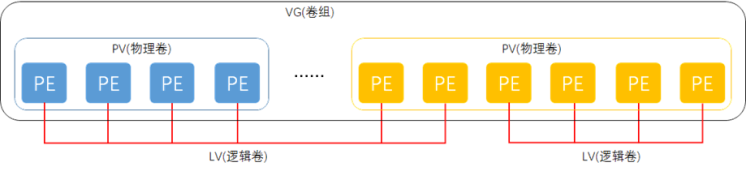

# 1. LVM（逻辑卷管理器）

## 1.1 什么是LVM？✅

**逻辑卷管理器（LVM，Logical Volume Manager）** 是存在于物理存储设备与文件系统之间的 **一个抽象化管理层**，主要目的是解决传统硬盘**分区之后大小不可灵活调整的问题**，提高了存储资源的管理灵活性和扩展性。

在传统的磁盘分区模型中，一旦分区创建完毕，**大小就固定**，若要对分区扩容或缩容，**不仅操作复杂，而且极可能导致数据损坏甚至丢失**。

而 LVM 则引入了以下三层逻辑结构，实现了 **"存储资源池" 管理的概念**：

1. **物理卷（Physical Volume，PV）**
2. **卷组（Volume Group，VG）**
3. **逻辑卷（Logical Volume，LV）**

🎯 LVM 的核心价值在于：让用户在无需关心底层硬盘的实际分布与架构的前提下，实现**存储空间的动态划分、扩展与缩减**，并且可以对文件系统进行在线调整（部分文件系统支持），极大地提升了存储管理的弹性和安全性。

## 1.2 LVM 的三层架构解析📘

| 层次    | 名称          | 全称                | 描述                                                         |
| ------- | ------------- | ------------------- | ------------------------------------------------------------ |
| Layer 1 | 物理卷 （PV） | **Physical Volume** | 是 LVM 的最底层，可以是**整块物理硬盘、硬盘上的某个分区，甚至是 RAID 阵列**。它是构建卷组的基本单元。 |
| Layer 2 | 卷组 （VG）   | **Volume Group**    | 由一个或多个物理卷（PV）组成，相当于一个大的“存储池”。卷组中的空间会被划分为多个固定大小的存储单元，称为 PE（Physical Extent）。 |
| Layer 3 | 逻辑卷 （LV） | **Logical Volume**  | 是从卷组中分配出来的逻辑存储空间，用户可以将其格式化为文件系统并挂载使用。**逻辑卷的大小可以在线动态调整**，这是 LVM 最强大的功能之一。 |

> 🧠 补充概念：**PE（Physical Extent，物理扩展块）**
>
> - 是卷组中最小的存储分配单位，类似于文件系统中的“块”。
> - 默认情况下，每个 PE 的大小为 **4MB**，但可以在创建卷组时自定义。
> - 卷组将所有 PV 的空间划分为若干个 PE，然后逻辑卷（LV）就是由这些 PE 组合而成。

[](https://git.inmind-lab.com/aaronxu/Linux-book/src/branch/main/01.Linux基础/11.LVM逻辑卷管理/LVM逻辑图.png)

如上图所示，LVM 的工作流程可以简述为：

1. **物理设备（如 /dev/sdb, /dev/sdc）** → 通过 `pvcreate`初始化为 **物理卷（PV）**
2. **多个 PV** → 通过 `vgcreate`合并为一个 **卷组（VG）**
3. **从 VG 中划分空间** → 通过 `lvcreate`创建一个或多个 **逻辑卷（LV）**
4. **格式化 LV**（如 ext4/xfs）→ **挂载使用**

这样，用户看到的不再是固定的物理分区，而是一个可以自由伸缩的逻辑存储空间！

## 1.3 部署逻辑卷🛠️

LVM 的管理主要围绕三个对象：**物理卷（PV）、卷组（VG）、逻辑卷（LV）**，每个对象都有对应的创建、查看、删除、扩展、缩减等操作。

下面是 LVM 最常用的管理命令一览表：

| 功能类别                 | 物理卷（PV）                | 卷组（VG）                                                   | 逻辑卷（LV）                                                 |
| ------------------------ | --------------------------- | ------------------------------------------------------------ | ------------------------------------------------------------ |
| **扫描（查找现有资源）** | `pvscan`                    | `vgscan`                                                     | `lvscan`                                                     |
| **创建（新建资源）**     | `pvcreate <设备>`           | `vgcreate <vg名> <pv1> <pv2>...`                             | `lvcreate -L <大小> -n <lv名> <vg名>`                        |
| **显示（查看详情）**     | `pvdisplay` `pvs`（简洁版） | `vgdisplay` `vgs`                                            | `lvdisplay` `lvs`                                            |
| **删除（移除资源）**     | `pvremove <pv设备>`         | `vgremove <vg名>`                                            | `lvremove <lv路径，如/dev/vg名/lv名>`                        |
| **扩展（增加空间）**     | —                           | `vgextend <vg名> <pv设备>`                                   | `lvextend -L +<大小> <lv路径>` 或 `lvextend -l +<PE数> <lv路径>` |
| **缩减（减少空间）**     | —                           | `vgreduce <vg名> <pv设备>`                                   | `lvreduce -L -<大小> <lv路径>` ⚠️ 注意：缩减前需先卸载并调整文件系统！ |
| **其他常用操作**         | —                           | `vgchange -a y <vg名>`（激活VG） `vgchange -a n <vg名>`（停用VG） | `lvresize`（调整LV大小，类似lvextend/lvreduce） `resize2fs`或 `xfs_growfs`（调整文件系统大小） |

> ⚠️ 注意事项：
>
> - **扩展逻辑卷（LV）相对安全且支持在线操作（尤其对 ext4/xfs 文件系统）**
> - **缩减逻辑卷（LV）风险较高，必须先卸载文件系统，且要先缩减文件系统，再缩减 LV！**
> - 推荐使用 `lvs`/ `vgs`/ `pvs`作为 `lvdisplay`/ `vgdisplay`/ `pvdisplay`的简洁替代命令。

为了避免多个实验之间相互发生冲突，请大家自行将虚拟机还原到初始状态，并在虚拟机中添加两块新硬盘设备，然后开机

第1步：让新添加的两块硬盘设备支持LVM技术

```bash
[root@localhost ~]# pvcreate /dev/sda /dev/sdb
  Cannot use /dev/sda: device is partitioned
  Cannot use /dev/sdb: device is partitioned
#有时候创建不成功，有残留数据需要重新做分区表
#[root@localhost ~]#parted /dev/sd[b-c] mklabel msdos
```

第2步：把两块硬盘设备加入到storage卷组中，然后查看卷组的状态

```bash
[root@localhost ~]# vgcreate storage /dev/sda /dev/sdb
  Volume group "storage" successfully created
[root@localhost ~]# vgdisplay storage
  --- Volume group ---
  VG Name               storage
  System ID             
  Format                lvm2
  Metadata Areas        2
  Metadata Sequence No  1
  VG Access             read/write
  VG Status             resizable
  MAX LV                0
  Cur LV                0
  Open LV               0
  Max PV                0
  Cur PV                2
  Act PV                2
  VG Size               39.99 GiB
  PE Size               4.00 MiB
  Total PE              10238
  Alloc PE / Size       0 / 0   
  Free  PE / Size       10238 / 39.99 GiB
  VG UUID               YOZEUw-xVl8-2TNg-suN9-sJfH-fezr-SKBxpf
```

第3步：切割出一个约为150MB的逻辑卷设备。

这里需要注意切割单位的问题。在对逻辑卷进行切割时有两种计量单位。

第一种是以容量为单位，所使用的参数为-L。例如，使用-L 150M生成一个大小为150MB的逻辑卷。

另外一种是以基本单元的个数为单位，所使用的参数为-l。每个基本单元的大小默认为4MB。例如，使用-l 37可以生成一个大小为37×4MB=148MB的逻辑卷。

⚙️ 命令参数解析

```
lvcreate -n vo -l 37 -i 2 -I 8M storage
```

| 参数       | 全称 / 含义              | 本例作用                                                     |
| ---------- | ------------------------ | ------------------------------------------------------------ |
| `lvcreate` | 创建逻辑卷的命令         | 在指定卷组中创建新的逻辑卷。                                 |
| `-n vo`    | `--name`                 | 将新逻辑卷命名为 **vo**。                                    |
| `-l 37`    | `--extents`              | 指定逻辑卷大小为 **37 个扩展单元 (LE)**。                    |
| `-i 2`     | `--stripes`              | 启用**条带化 (Striping)**，跨 **2 个物理卷**分布数据，类似 RAID 0，可提升 I/O 性能。 |
| `-I 8M`    | `--stripesize`           | 设置条带大小为 **8 MiB**。                                   |
| `storage`  | 卷组 (Volume Group) 名称 | 在名为 **storage** 的卷组中创建逻辑卷。                      |

```bash
# [root@localhost ~]# lvcreate -n vo -l 37 -I 8M storage
[root@localhost ~]# lvcreate -n vo -l 37 -i 2 -I 8M storage
  Reducing requested stripe size 8.00 MiB to maximum, physical extent size 4.00 MiB.
  Rounding size 148.00 MiB (37 extents) up to stripe boundary size 152.00 MiB (38 extents).
  Logical volume "vo" created.
[root@localhost ~]# lsblk
NAME         MAJ:MIN RM  SIZE RO TYPE MOUNTPOINTS
sr0           11:0    1  1.7G  0 rom
nvme0n1      259:0    0   20G  0 disk
├─nvme0n1p1  259:1    0    1G  0 part /boot
└─nvme0n1p2  259:2    0   19G  0 part
  ├─rl-root  253:0    0   17G  0 lvm  /
  └─rl-swap  253:1    0    2G  0 lvm  [SWAP]
nvme0n2      259:3    0    5G  0 disk
└─storage-vo 253:2    0  148M  0 lvm
nvme0n3      259:4    0    5G  0 disk
nvme0n4      259:5    0    5G  0 disk
nvme0n5      259:6    0    5G  0 disk
nvme0n6      259:7    0    5G  0 disk

# 每个PE占4M，37*4=148M，远少于/dev/sda的20G，不会占用到第二个PV（/dev/sdb），所以lsblk只看到占用了/dev/sda
[root@localhost ~]# lvcreate -n vo -l 37 storage
  Logical volume "vo" created.
[root@localhost ~]# lsblk
NAME         MAJ:MIN RM  SIZE RO TYPE MOUNTPOINTS
sda            8:0    0   20G  0 disk 
└─storage-vo 253:3    0  148M  0 lvm  
sdb            8:16   0   20G  0 disk 
sdc            8:32   0   20G  0 disk 
sdd            8:48   0   20G  0 disk 
sde            8:64   0   20G  0 disk 
sr0           11:0    1 1024M  0 rom  
nvme0n1      259:0    0   60G  0 disk 
├─nvme0n1p1  259:1    0    1G  0 part /boot
└─nvme0n1p2  259:2    0   59G  0 part 
  ├─rl-root  253:0    0   37G  0 lvm  /
  ├─rl-swap  253:1    0  3.9G  0 lvm  [SWAP]
  └─rl-home  253:2    0 18.1G  0 lvm  /home


[root@localhost ~]# lvdisplay
  --- Logical volume ---
  LV Path                /dev/rl/swap
  LV Name                swap
  VG Name                rl
  LV UUID                ue2cg1-gvKP-MNRA-sfpY-oIsL-4uaz-XcIL6w
  LV Write Access        read/write
  LV Creation host, time localhost.localdomain, 2026-01-17 17:27:19 +0800
  LV Status              available
  # open                 2
  LV Size                <3.92 GiB
  Current LE             1003
  Segments               1
  Allocation             inherit
  Read ahead sectors     auto
  - currently set to     256
  Block device           253:1
   
  --- Logical volume ---
  LV Path                /dev/rl/home
  LV Name                home
  VG Name                rl
  LV UUID                qUARi9-8Ru1-qofN-Xp8o-MrKq-Qqbx-QsUSqT
  LV Write Access        read/write
  LV Creation host, time localhost.localdomain, 2026-01-17 17:27:20 +0800
  LV Status              available
  # open                 1
  LV Size                <18.07 GiB
  Current LE             4625
  Segments               1
  Allocation             inherit
  Read ahead sectors     auto
  - currently set to     256
  Block device           253:2
   
  --- Logical volume ---
  LV Path                /dev/rl/root
  LV Name                root
  VG Name                rl
  LV UUID                vzW2Ql-b7Z8-80mx-3JmB-jVLy-UIPP-eWujLt
  LV Write Access        read/write
  LV Creation host, time localhost.localdomain, 2026-01-17 17:27:20 +0800
  LV Status              available
  # open                 1
  LV Size                37.01 GiB
  Current LE             9475
  Segments               1
  Allocation             inherit
  Read ahead sectors     auto
  - currently set to     256
  Block device           253:0
   
  --- Logical volume ---
  LV Path                /dev/storage/vo
  LV Name                vo
  VG Name                storage
  LV UUID                FgObQ3-y05U-p2TZ-fzXm-2nWS-B4yl-t3qwvp
  LV Write Access        read/write
  LV Creation host, time localhost, 2026-03-30 19:42:21 +0800
  LV Status              available
  # open                 0
  LV Size                148.00 MiB
  Current LE             37
  Segments               1
  Allocation             inherit
  Read ahead sectors     auto
  - currently set to     256
  Block device           253:3
```

第4步：把生成好的逻辑卷进行格式化，然后挂载使用。

```bash
[root@localhost ~]# mkfs.ext4 /dev/storage/vo
mke2fs 1.46.5 (30-Dec-2021)
Creating filesystem with 151552 1k blocks and 37848 inodes
Filesystem UUID: 0fbb9e57-ec34-4507-80af-18595d08ffbc
Superblock backups stored on blocks: 
	8193, 24577, 40961, 57345, 73729

Allocating group tables: done                            
Writing inode tables: done                            
Creating journal (4096 blocks): done
Writing superblocks and filesystem accounting information: done 

[root@localhost ~]# mkdir /mnt/vo
[root@localhost ~]# mount /dev/storage/vo /mnt/vo
[root@localhost ~]# df -h
Filesystem              Size  Used Avail Use% Mounted on
devtmpfs                4.0M     0  4.0M   0% /dev
tmpfs                   1.8G     0  1.8G   0% /dev/shm
tmpfs                   726M  9.1M  717M   2% /run
/dev/mapper/rl-root      37G  3.1G   34G   9% /
/dev/nvme0n1p1          960M  228M  733M  24% /boot
/dev/mapper/rl-home      19G  161M   18G   1% /home
tmpfs                   363M     0  363M   0% /run/user/0
/dev/mapper/storage-vo  134M   14K  123M   1% /mnt/vo
[root@localhost ~]# lsblk
NAME         MAJ:MIN RM  SIZE RO TYPE MOUNTPOINTS
sda            8:0    0   20G  0 disk 
└─storage-vo 253:3    0  148M  0 lvm  /mnt/vo
sdb            8:16   0   20G  0 disk 
sdc            8:32   0   20G  0 disk 
sdd            8:48   0   20G  0 disk 
sde            8:64   0   20G  0 disk 
sr0           11:0    1 1024M  0 rom  
nvme0n1      259:0    0   60G  0 disk 
├─nvme0n1p1  259:1    0    1G  0 part /boot
└─nvme0n1p2  259:2    0   59G  0 part 
  ├─rl-root  253:0    0   37G  0 lvm  /
  ├─rl-swap  253:1    0  3.9G  0 lvm  [SWAP]
  └─rl-home  253:2    0 18.1G  0 lvm  /home

[root@localhost ~]# echo "/dev/storage/vo /mnt/vo ext4 defaults 0 0" >> /etc/fstab
```

## 1.4 扩容逻辑卷

第1步：把上一个实验中的逻辑卷vo扩展至290MB

```bash
[root@localhost ~]# umount /mnt/vo
[root@localhost ~]# lvextend -L 290M /dev/storage/vo
  Rounding size to boundary between physical extents: 292.00 MiB.
  Size of logical volume storage/vo changed from 148.00 MiB (37 extents) to 292.00 MiB (73 extents).
  Logical volume storage/vo successfully resized.
```

第2步：检查硬盘完整性，并重置硬盘容量，否则挂载了还是148M

```bash
[root@localhost ~]# e2fsck -f /dev/storage/vo
e2fsck 1.46.5 (30-Dec-2021)
Pass 1: Checking inodes, blocks, and sizes
Pass 2: Checking directory structure
Pass 3: Checking directory connectivity
Pass 4: Checking reference counts
Pass 5: Checking group summary information
/dev/storage/vo: 11/37848 files (0.0% non-contiguous), 15165/151552 blocks
[root@localhost ~]# resize2fs /dev/storage/vo
resize2fs 1.46.5 (30-Dec-2021)
Resizing the filesystem on /dev/storage/vo to 299008 (1k) blocks.
The filesystem on /dev/storage/vo is now 299008 (1k) blocks long.
```

第3步：重新挂载硬盘设备并查看挂载状态

```bash
[root@localhost ~]# systemctl daemon-reload
[root@localhost ~]# mount /dev/storage/vo /mnt/vo
[root@localhost ~]# df -h
Filesystem              Size  Used Avail Use% Mounted on
devtmpfs                4.0M     0  4.0M   0% /dev
tmpfs                   1.8G     0  1.8G   0% /dev/shm
tmpfs                   726M  9.1M  717M   2% /run
/dev/mapper/rl-root      37G  3.1G   34G   9% /
/dev/nvme0n1p1          960M  228M  733M  24% /boot
/dev/mapper/rl-home      19G  161M   18G   1% /home
tmpfs                   363M     0  363M   0% /run/user/0
/dev/mapper/storage-vo  268M   14K  250M   1% /mnt/vo
```

第4步，如果扩容到25G，则会占用到sdb的pv

```shell
[root@localhost ~]# umount /mnt/vo
[root@localhost ~]# lsblk
NAME         MAJ:MIN RM  SIZE RO TYPE MOUNTPOINTS
sda            8:0    0   20G  0 disk 
└─storage-vo 253:3    0   19G  0 lvm  
sdb            8:16   0   20G  0 disk 
sdc            8:32   0   20G  0 disk 
sdd            8:48   0   20G  0 disk 
sde            8:64   0   20G  0 disk 
sr0           11:0    1 1024M  0 rom  
nvme0n1      259:0    0   60G  0 disk 
├─nvme0n1p1  259:1    0    1G  0 part /boot
└─nvme0n1p2  259:2    0   59G  0 part 
  ├─rl-root  253:0    0   37G  0 lvm  /
  ├─rl-swap  253:1    0  3.9G  0 lvm  [SWAP]
  └─rl-home  253:2    0 18.1G  0 lvm  /home
[root@localhost ~]# lvextend -L 25G /dev/storage/vo
  Size of logical volume storage/vo changed from 19.00 GiB (4864 extents) to 25.00 GiB (6400 extents).
  Logical volume storage/vo successfully resized.
[root@localhost ~]# e2fsck -f /dev/storage/vo
e2fsck 1.46.5 (30-Dec-2021)
Pass 1: Checking inodes, blocks, and sizes
Pass 2: Checking directory structure
Pass 3: Checking directory connectivity
Pass 4: Checking reference counts
Pass 5: Checking group summary information
/dev/storage/vo: 11/1529856 files (0.0% non-contiguous), 391996/6291456 blocks
[root@localhost ~]# resize2fs /dev/storage/vo
resize2fs 1.46.5 (30-Dec-2021)
Resizing the filesystem on /dev/storage/vo to 26214400 (1k) blocks.
The filesystem on /dev/storage/vo is now 26214400 (1k) blocks long.

[root@localhost ~]# mount /dev/storage/vo /mnt/vo
[root@localhost ~]# lsblk
NAME         MAJ:MIN RM  SIZE RO TYPE MOUNTPOINTS
sda            8:0    0   20G  0 disk 
└─storage-vo 253:3    0   25G  0 lvm  /mnt/vo
sdb            8:16   0   20G  0 disk 
└─storage-vo 253:3    0   25G  0 lvm  /mnt/vo
sdc            8:32   0   20G  0 disk 
sdd            8:48   0   20G  0 disk 
sde            8:64   0   20G  0 disk 
sr0           11:0    1 1024M  0 rom  
nvme0n1      259:0    0   60G  0 disk 
├─nvme0n1p1  259:1    0    1G  0 part /boot
└─nvme0n1p2  259:2    0   59G  0 part 
  ├─rl-root  253:0    0   37G  0 lvm  /
  ├─rl-swap  253:1    0  3.9G  0 lvm  [SWAP]
  └─rl-home  253:2    0 18.1G  0 lvm  /home
[root@localhost ~]# df -h
Filesystem              Size  Used Avail Use% Mounted on
devtmpfs                4.0M     0  4.0M   0% /dev
tmpfs                   1.8G     0  1.8G   0% /dev/shm
tmpfs                   726M  9.1M  717M   2% /run
/dev/mapper/rl-root      37G  3.1G   34G   9% /
/dev/nvme0n1p1          960M  228M  733M  24% /boot
/dev/mapper/rl-home      19G  161M   18G   1% /home
tmpfs                   363M     0  363M   0% /run/user/0
/dev/mapper/storage-vo   24G   14K   23G   1% /mnt/vo
```

## 1.5 缩小逻辑卷

第1步：检查文件系统的完整性

```bash
[root@localhost ~]# umount /mnt/vo
[root@localhost ~]# e2fsck -f /dev/storage/vo
e2fsck 1.46.5 (30-Dec-2021)
Pass 1: Checking inodes, blocks, and sizes
Pass 2: Checking directory structure
Pass 3: Checking directory connectivity
Pass 4: Checking reference counts
Pass 5: Checking group summary information
/dev/storage/vo: 11/6374400 files (0.0% non-contiguous), 1608773/26214400 blocks
```

第2步：把逻辑卷vo的容量减小到120MB

```bash
[root@localhost ~]# resize2fs /dev/storage/vo 120M
resize2fs 1.46.5 (30-Dec-2021)
Resizing the filesystem on /dev/storage/vo to 122880 (1k) blocks.
The filesystem on /dev/storage/vo is now 122880 (1k) blocks long.

[root@localhost ~]# lvreduce -L 120M /dev/storage/vo
  File system ext4 found on storage/vo.
  File system size (120.00 MiB) is equal to the requested size (120.00 MiB).
  File system reduce is not needed, skipping.
  Size of logical volume storage/vo changed from 25.00 GiB (6400 extents) to 120.00 MiB (30 extents).
  Logical volume storage/vo successfully resized.
```

第3步：重新挂载文件系统并查看系统状态

```bash
[root@localhost ~]# mount /dev/storage/vo /mnt/vo
[root@localhost ~]# df -h
Filesystem              Size  Used Avail Use% Mounted on
devtmpfs                4.0M     0  4.0M   0% /dev
tmpfs                   1.8G     0  1.8G   0% /dev/shm
tmpfs                   726M  9.1M  717M   2% /run
/dev/mapper/rl-root      37G  3.1G   34G   9% /
/dev/nvme0n1p1          960M  228M  733M  24% /boot
/dev/mapper/rl-home      19G  161M   18G   1% /home
tmpfs                   363M     0  363M   0% /run/user/0
/dev/mapper/storage-vo  108M   14K   99M   1% /mnt/vo
```

## 1.6 逻辑卷快照

LVM还具备有“快照卷”功能，该功能类似于虚拟机软件的还原时间点功能。例如，可以对某一个逻辑卷设备做一次快照，如果日后发现数据被改错了，就可以利用之前做好的快照卷进行覆盖还原。LVM的快照卷功能有两个特点：

- 快照卷的容量必须等同于逻辑卷的容量；
- 快照卷仅一次有效，一旦执行还原操作后则会被立即自动删除。

```bash
[root@localhost ~]# vgdisplay
  --- Volume group ---
  VG Name               rl
  System ID             
  Format                lvm2
  Metadata Areas        1
  Metadata Sequence No  4
  VG Access             read/write
  VG Status             resizable
  MAX LV                0
  Cur LV                3
  Open LV               3
  Max PV                0
  Cur PV                1
  Act PV                1
  VG Size               <59.00 GiB
  PE Size               4.00 MiB
  Total PE              15103
  Alloc PE / Size       15103 / <59.00 GiB
  Free  PE / Size       0 / 0   
  VG UUID               wcr6YH-vNv5-Osp0-chPR-j7DT-Q3TC-a3upkF
   
  --- Volume group ---
  VG Name               storage
  System ID             
  Format                lvm2
  Metadata Areas        2
  Metadata Sequence No  9
  VG Access             read/write
  VG Status             resizable
  MAX LV                0
  Cur LV                1
  Open LV               1
  Max PV                0
  Cur PV                2
  Act PV                2
  VG Size               39.99 GiB
  PE Size               4.00 MiB
  Total PE              10238
  Alloc PE / Size       30 / 120.00 MiB
  Free  PE / Size       10208 / <39.88 GiB
  VG UUID               YOZEUw-xVl8-2TNg-suN9-sJfH-fezr-SKBxpf
```

接下来用重定向往逻辑卷设备所挂载的目录中写入一个文件

```bash
[root@localhost ~]# tree /etc > /mnt/vo/tree.txt
[root@localhost ~]# df -h
Filesystem              Size  Used Avail Use% Mounted on
devtmpfs                4.0M     0  4.0M   0% /dev
tmpfs                   1.8G     0  1.8G   0% /dev/shm
tmpfs                   726M  9.1M  717M   2% /run
/dev/mapper/rl-root      37G  3.1G   34G   9% /
/dev/nvme0n1p1          960M  228M  733M  24% /boot
/dev/mapper/rl-home      19G  161M   18G   1% /home
tmpfs                   363M     0  363M   0% /run/user/0
/dev/mapper/storage-vo  108M   47K   99M   1% /mnt/vo
```

第1步：使用-s参数生成一个快照卷，使用-L参数指定切割的大小。

另外，还需要在命令后面写上是针对哪个逻辑卷执行的快照操作。**强烈建议快照大小和原来的LVM一样大**

```bash
[root@localhost ~]# lvcreate -L 120M -s -n SNAP /dev/storage/vo
#强烈建议快照大小和原来的LVM一样大，虽然指定大小是120M，并不是创建一个120M大小的快照，除非修改、新增的文件超出120M才会出事情，删除不影响。
  Logical volume "SNAP" created.
[root@localhost ~]# lvdisplay storage
  --- Logical volume ---
  LV Path                /dev/storage/vo
  LV Name                vo
  VG Name                storage
  LV UUID                FgObQ3-y05U-p2TZ-fzXm-2nWS-B4yl-t3qwvp
  LV Write Access        read/write
  LV Creation host, time localhost, 2026-03-30 19:42:21 +0800
  LV snapshot status     source of
                         SNAP [active]
  LV Status              available
  # open                 1
  LV Size                120.00 MiB
  Current LE             30
  Segments               1
  Allocation             inherit
  Read ahead sectors     auto
  - currently set to     256
  Block device           253:3
   
  --- Logical volume ---
  LV Path                /dev/storage/SNAP
  LV Name                SNAP
  VG Name                storage
  LV UUID                4JC0yA-aV1y-5Yj1-c7vr-hpVz-fqHn-UvyMPH
  LV Write Access        read/write
  LV Creation host, time localhost, 2026-03-30 20:03:11 +0800
  LV snapshot status     active destination for vo
  LV Status              available
  # open                 0
  LV Size                120.00 MiB
  Current LE             30
  COW-table size         120.00 MiB
  COW-table LE           30
  Allocated to snapshot  0.01%
  Snapshot chunk size    4.00 KiB
  Segments               1
  Allocation             inherit
  Read ahead sectors     auto
  - currently set to     256
  Block device           253:6

```

第2步：在逻辑卷所挂载的目录中创建一个50MB的垃圾文件，然后再查看快照卷的状态。可以发现存储空间占的用量上升了

```bash
[root@localhost ~]# dd if=/dev/zero of=/mnt/vo/files count=1 bs=50M
1+0 records in
1+0 records out
52428800 bytes (52 MB, 50 MiB) copied, 0.441121 s, 119 MB/s
[root@localhost ~]# lvdisplay storage
  --- Logical volume ---
  LV Path                /dev/storage/vo
  LV Name                vo
  VG Name                storage
  LV UUID                FgObQ3-y05U-p2TZ-fzXm-2nWS-B4yl-t3qwvp
  LV Write Access        read/write
  LV Creation host, time localhost, 2026-03-30 19:42:21 +0800
  LV snapshot status     source of
                         SNAP [active]
  LV Status              available
  # open                 1
  LV Size                120.00 MiB
  Current LE             30
  Segments               1
  Allocation             inherit
  Read ahead sectors     auto
  - currently set to     256
  Block device           253:3
   
  --- Logical volume ---
  LV Path                /dev/storage/SNAP
  LV Name                SNAP
  VG Name                storage
  LV UUID                4JC0yA-aV1y-5Yj1-c7vr-hpVz-fqHn-UvyMPH
  LV Write Access        read/write
  LV Creation host, time localhost, 2026-03-30 20:03:11 +0800
  LV snapshot status     active destination for vo
  LV Status              available
  # open                 0
  LV Size                120.00 MiB
  Current LE             30
  COW-table size         120.00 MiB
  COW-table LE           30
  Allocated to snapshot  0.02%
  Snapshot chunk size    4.00 KiB
  Segments               1
  Allocation             inherit
  Read ahead sectors     auto
  - currently set to     256
  Block device           253:6
   
[root@localhost ~]# lvdisplay storage
  --- Logical volume ---
  LV Path                /dev/storage/vo
  LV Name                vo
  VG Name                storage
  LV UUID                FgObQ3-y05U-p2TZ-fzXm-2nWS-B4yl-t3qwvp
  LV Write Access        read/write
  LV Creation host, time localhost, 2026-03-30 19:42:21 +0800
  LV snapshot status     source of
                         SNAP [active]
  LV Status              available
  # open                 1
  LV Size                120.00 MiB
  Current LE             30
  Segments               1
  Allocation             inherit
  Read ahead sectors     auto
  - currently set to     256
  Block device           253:3
   
  --- Logical volume ---
  LV Path                /dev/storage/SNAP
  LV Name                SNAP
  VG Name                storage
  LV UUID                4JC0yA-aV1y-5Yj1-c7vr-hpVz-fqHn-UvyMPH
  LV Write Access        read/write
  LV Creation host, time localhost, 2026-03-30 20:03:11 +0800
  LV snapshot status     active destination for vo
  LV Status              available
  # open                 0
  LV Size                120.00 MiB
  Current LE             30
  COW-table size         120.00 MiB
  COW-table LE           30
  Allocated to snapshot  41.88%	# 从0.02变成了41.88
  Snapshot chunk size    4.00 KiB
  Segments               1
  Allocation             inherit
  Read ahead sectors     auto
  - currently set to     256
  Block device           253:6
```

第3步：为了校验SNAP快照卷的效果，需要对逻辑卷进行快照还原操作。在此之前记得先卸载掉逻辑卷设备与目录的挂载。

```bash
[root@localhost ~]# umount /mnt/vo
[root@localhost ~]# lvconvert --merge /dev/storage/SNAP
  Merging of volume storage/SNAP started.
  storage/vo: Merged: 76.57%
  storage/vo: Merged: 100.00%
```

第4步：快照卷会被自动删除掉，并且刚刚在逻辑卷设备被执行快照操作后再创建出来的50MB的垃圾文件也被清除了

```bash
[root@localhost ~]# mount /dev/storage/vo /mnt/vo
[root@localhost ~]# df -h
Filesystem              Size  Used Avail Use% Mounted on
devtmpfs                4.0M     0  4.0M   0% /dev
tmpfs                   1.8G     0  1.8G   0% /dev/shm
tmpfs                   726M  9.1M  717M   2% /run
/dev/mapper/rl-root      37G  3.1G   34G   9% /
/dev/nvme0n1p1          960M  228M  733M  24% /boot
/dev/mapper/rl-home      19G  161M   18G   1% /home
tmpfs                   363M     0  363M   0% /run/user/0
/dev/mapper/storage-vo  108M   47K   99M   1% /mnt/vo
```

## 1.7 删除逻辑卷

第1步：取消逻辑卷与目录的挂载关联，删除配置文件中永久生效的设备参数。

```bash
[root@localhost ~]# umount /mnt/vo/
[root@localhost ~]# vi /etc/fstab 
#
# /etc/fstab
# Created by anaconda on Mon Apr 15 17:31:00 2019
#
# Accessible filesystems, by reference, are maintained under '/dev/disk'
# See man pages fstab(5), findfs(8), mount(8) and/or blkid(8) for more info
#
/dev/mapper/centos-root /                       xfs     defaults        0 0
UUID=63e91158-e754-41c3-b35d-7b9698e71355 /boot                   xfs     defaults        0 0
/dev/mapper/centos-swap swap                    swap    defaults        0 0
```

第2步：删除逻辑卷设备，需要输入y来确认操作

```bash
root@localhost ~]# lvremove /dev/storage/vo
Do you really want to remove active logical volume storage/vo? [y/n]: y
  Logical volume "vo" successfully removed.
```

第3步：删除卷组，此处只写卷组名称即可，不需要设备的绝对路径。

```bash
[root@localhost ~]# vgremove storage
  Volume group "storage" successfully removed
```

第4步：删除物理卷设备

```bash
[root@localhost ~]# pvremove /dev/sda /dev/sdb
  Labels on physical volume "/dev/sda" successfully wiped.
  Labels on physical volume "/dev/sdb" successfully wiped.
[root@localhost ~]# lsblk
NAME        MAJ:MIN RM  SIZE RO TYPE MOUNTPOINTS
sda           8:0    0   20G  0 disk 
sdb           8:16   0   20G  0 disk 
sdc           8:32   0   20G  0 disk 
sdd           8:48   0   20G  0 disk 
sde           8:64   0   20G  0 disk 
sr0          11:0    1 1024M  0 rom  
nvme0n1     259:0    0   60G  0 disk 
├─nvme0n1p1 259:1    0    1G  0 part /boot
└─nvme0n1p2 259:2    0   59G  0 part 
  ├─rl-root 253:0    0   37G  0 lvm  /
  ├─rl-swap 253:1    0  3.9G  0 lvm  [SWAP]
  └─rl-home 253:2    0 18.1G  0 lvm  /home
```