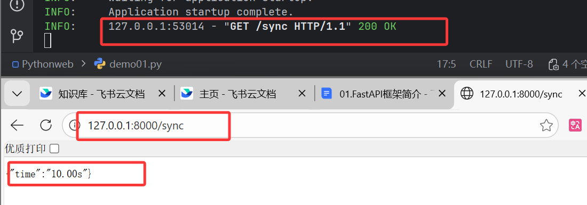
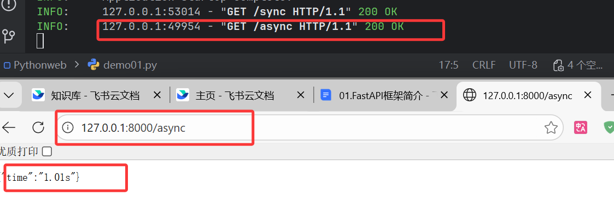
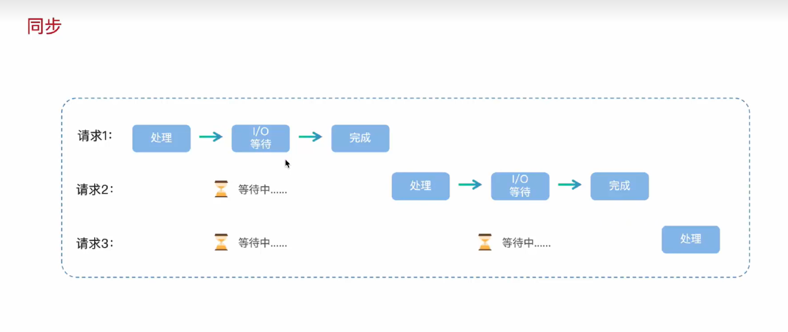
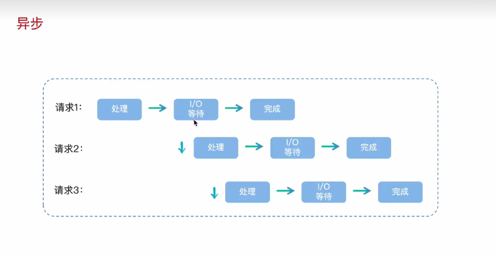
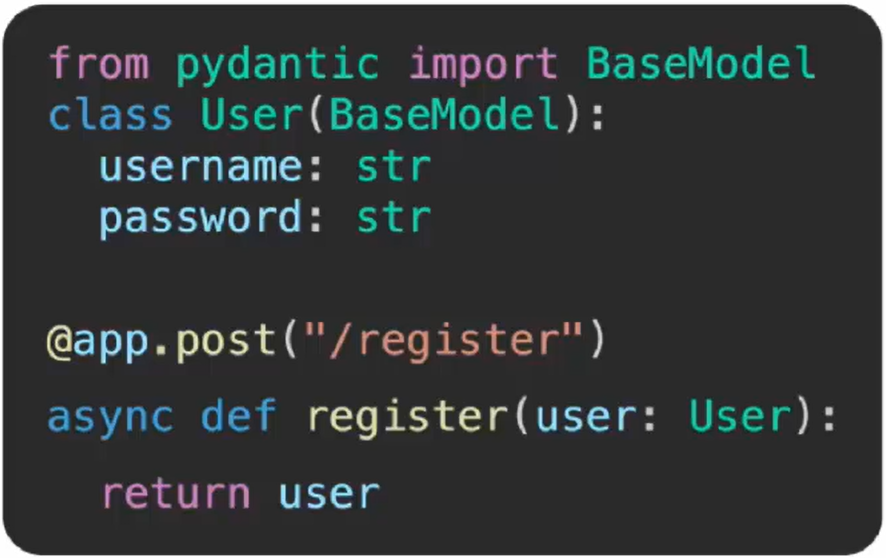
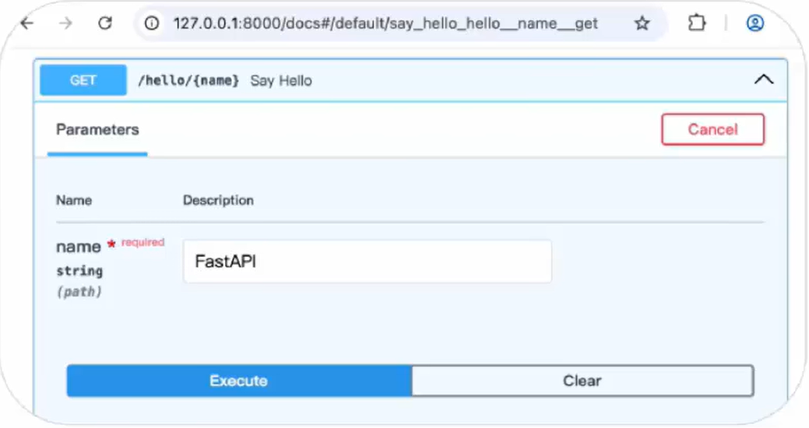
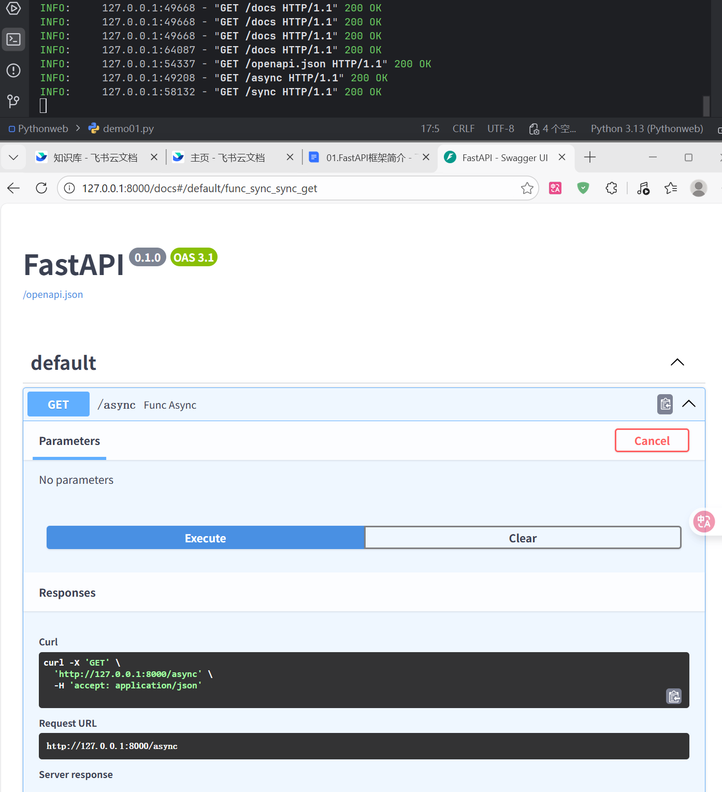

- FastAPI是基于Python的高性能Web框架，专门用于快速构建API接口服务

# 1. FastAPI-原生异步支持，释放真正性

```Python
from fastapi import FastAPI
# 异步
import asyncio
import time

app = FastAPI()

@app.get("/async")
async def func_async():
    start = time.time()
    tasks = [asyncio.sleep(1) for i in range(10)]
    await asyncio.gather(*tasks)
    end = time.time()
    return {"time":f'{end - start:.2f}s'}


# 同步
@app.get("/sync")
def func_sync():
    start = time.time()
    for i in range(10):
        time.sleep(1)
    end = time.time()
    return {"time":f'{end - start:.2f}s'}
```

- demo01.py验证同步异步性质代码如上，运行先在命令行中

```Bash
(.venv) PS C:\Users\dingbenwang\Desktop\Pythonweb> uvicorn demo01:app --reload
INFO:     Will watch for changes in these directories: ['C:\\Users\\dingbenwang\\Desktop\\Pythonweb']
INFO:     Uvicorn running on http://127.0.0.1:8000 (Press CTRL+C to quit)
INFO:     Started reloader process [50096] using StatReload
INFO:     Started server process [49740]
INFO:     Waiting for application startup.
INFO:     Application startup complete.
INFO:     127.0.0.1:55704 - "GET /async HTTP/1.1" 200 OK
INFO:     127.0.0.1:55704 - "GET /favicon.ico HTTP/1.1" 404 Not Found
INFO:     127.0.0.1:60235 - "GET /sync HTTP/1.1" 200 OK
```

- 浏览器访问http://127.0.0.1:8000网址加上装饰器名结果：



- 同步结果如上



- 异步结果如上

## 1.1 同步流程



## 1.2 异步流程



# 2. FastAPI优点

## 2.1 类型提示与验证

- Pydantic类型提示与验证，减少手动校验代码



## 2.2 可交互式文档

- 自动生成可交互式文档，浏览器中直接调用和测试API



- 结果如下可以直接进行同步和异步的调试



- 由此可以看出FastAPI异步性能高，开发效率高，自动生成文档