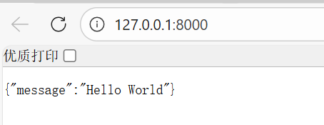
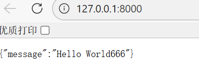
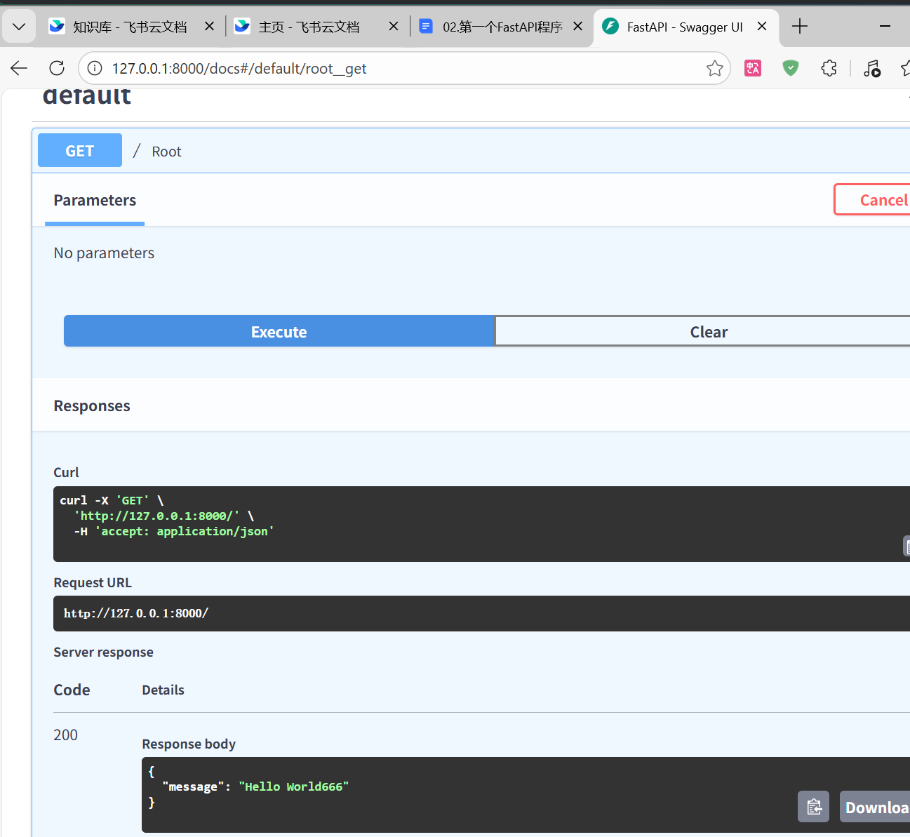

```Python
from fastapi import FastAPI

# 创建FastAPI实例
app = FastAPI()

@app.get("/")
async def root():        # async修饰表示使用异步的方式
    return {"message":"Hello World"}

@app.get("/hello/{name}")
async def say_hello(name:str):
    return {"message":f"Hello {name}"}
```

- 说是在pycharm中直接右键运行就可以，但是目前我的pycharm中无法做到，只能通过命令行运行上面代码
- 运行命令格式为：`uvicorn`+`文件名`+`:`+`实例名`+`--reload`
  - 其中`uvicorn`是FastAPI高性能的服务器，用来运行FastAPI项目，`--reload`表示修改了代码过后会自动重启服务器

```Bash
(.venv) PS C:\Users\dingbenwang\Desktop\Pythonweb> uvicorn main:app --reload
INFO:     Will watch for changes in these directories: ['C:\\Users\\dingbenwang\\Desktop\\Pythonweb']
INFO:     Uvicorn running on http://127.0.0.1:8000 (Press CTRL+C to quit)    # 直接点击这里的网址跳转
INFO:     Started reloader process [52204] using StatReload
INFO:     Started server process [53188]
INFO:     Waiting for application startup.
INFO:     Application startup complete.
INFO:     127.0.0.1:53803 - "GET / HTTP/1.1" 200 OK
```

- 跳转到浏览器结果如图



- `--reload`有了之后修改代码并保存服务器会自动重启，此时刷新浏览器即可得到新的内容



- 访问FastAPI中docs交互式文档页面

