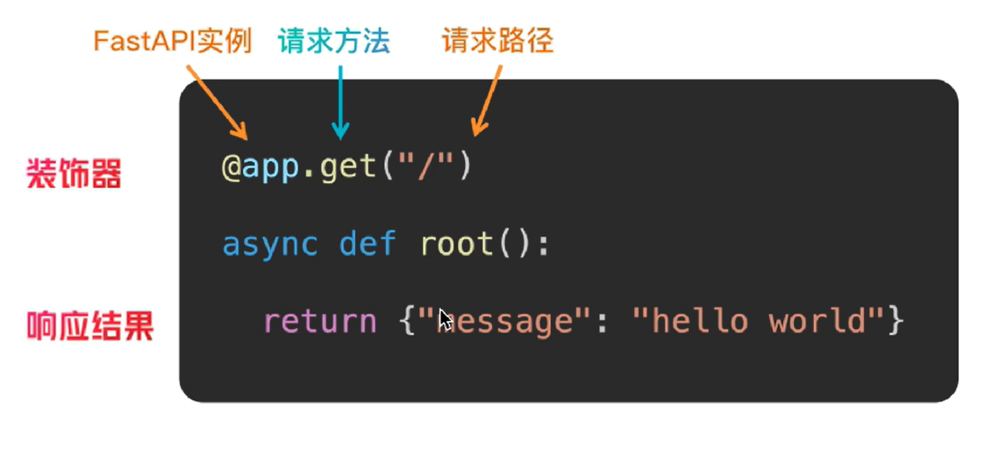
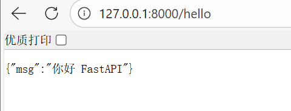
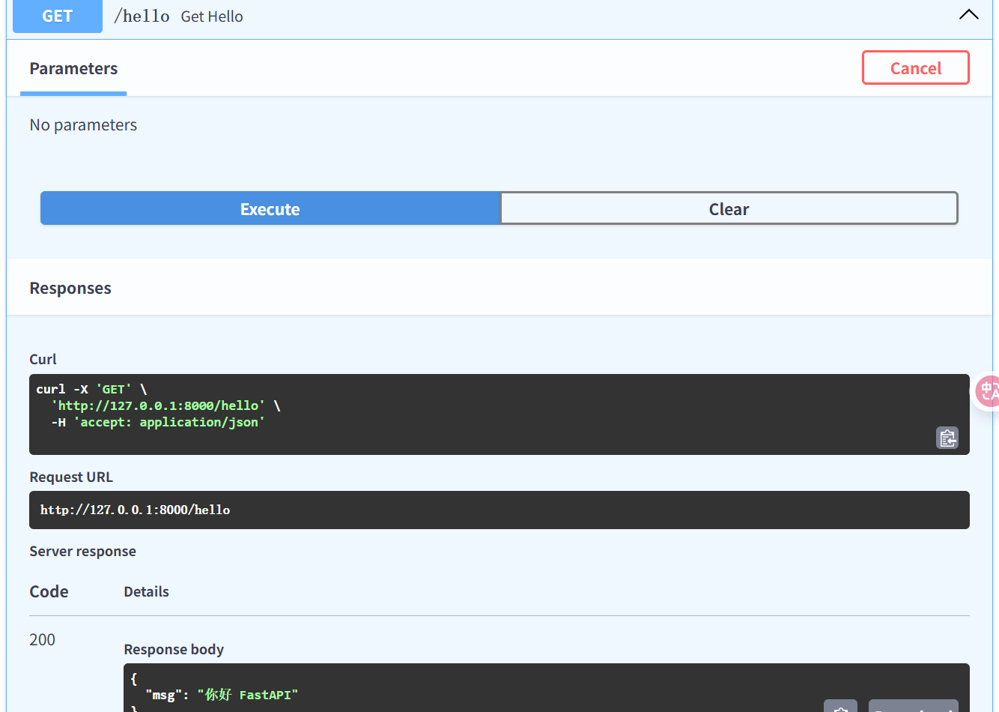
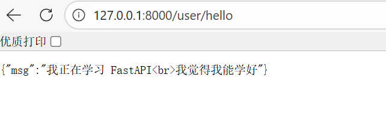

# 1. 路由定义

- `路由`就是`URL地址`和`处理函数`之间的映射关系，它决定了当用户访问某个特定网址时，服务器应该执行哪段代码来返回结果。

# 2. 如何实现路由

- FastAPI的路由定义基于Python的装饰器模式
- 路由写法



# 3. 代码实现

```Python
from fastapi import FastAPI

# 创建FastAPI实例
app = FastAPI()

# 访问 /hello 响应结果 msg: 你好 FastAPI
@app.get("/hello")
async def get_hello():
    return {"msg":"你好 FastAPI"}
```

# 4. 结果



- 直接在端口号后加上`/hello`访问
- 或者在docs交互式文档中访问



# 5. 练习

- 题目如下


```Python
@app.get("/user/hello")
async def get_user_hello():
    return {"msg":"我正在学习 FastAPI<br>我觉得我能学好"}
```

- 结果如下

