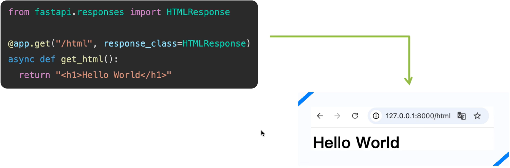
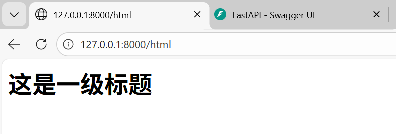
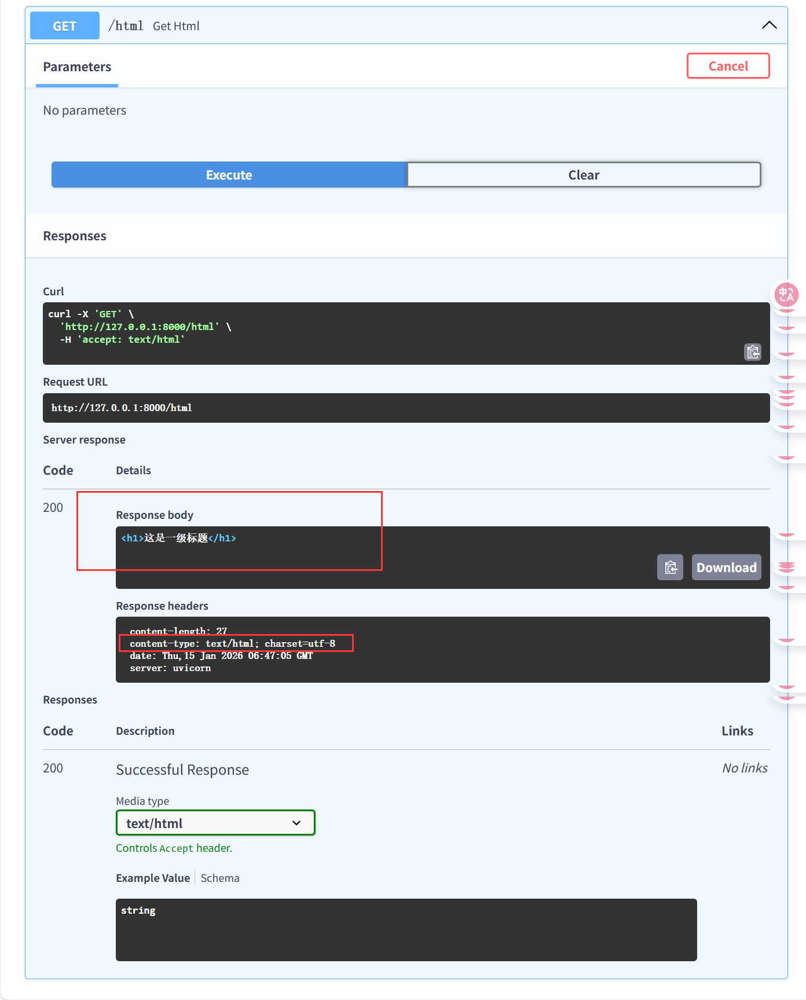
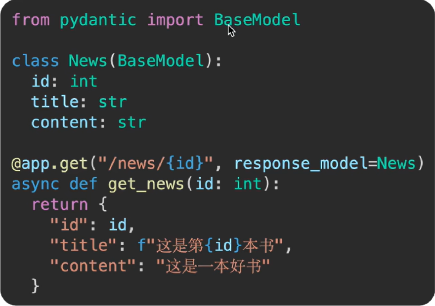
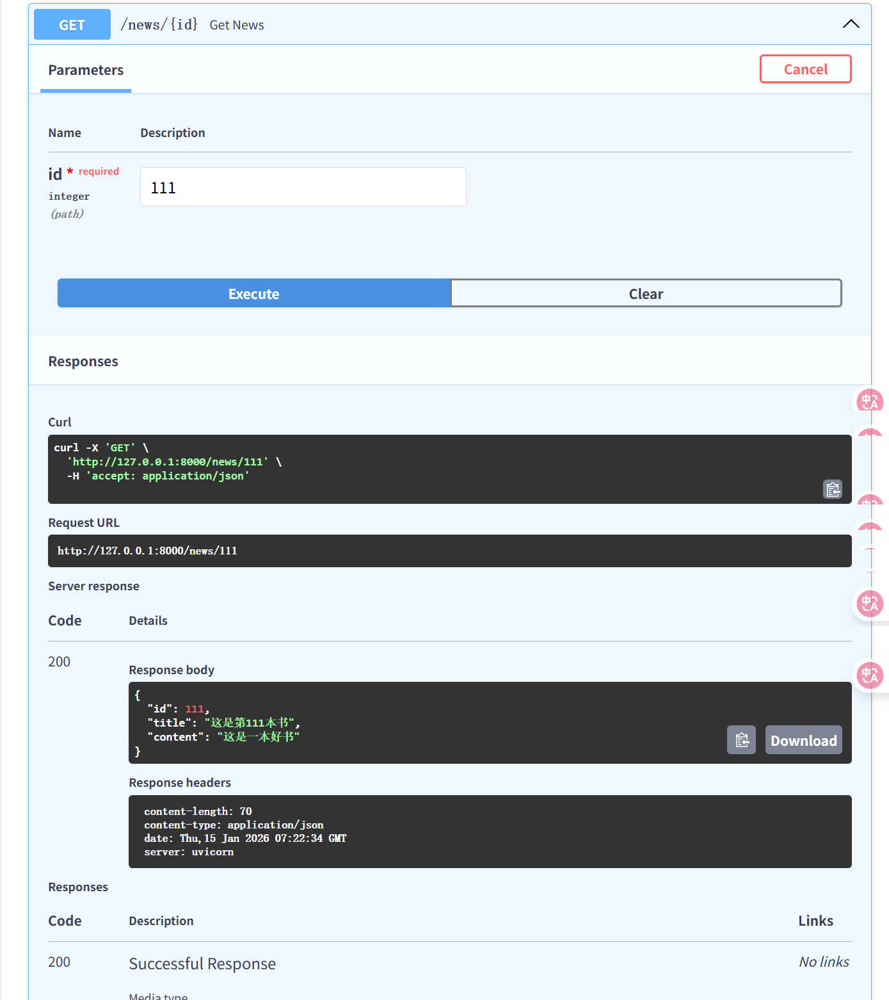
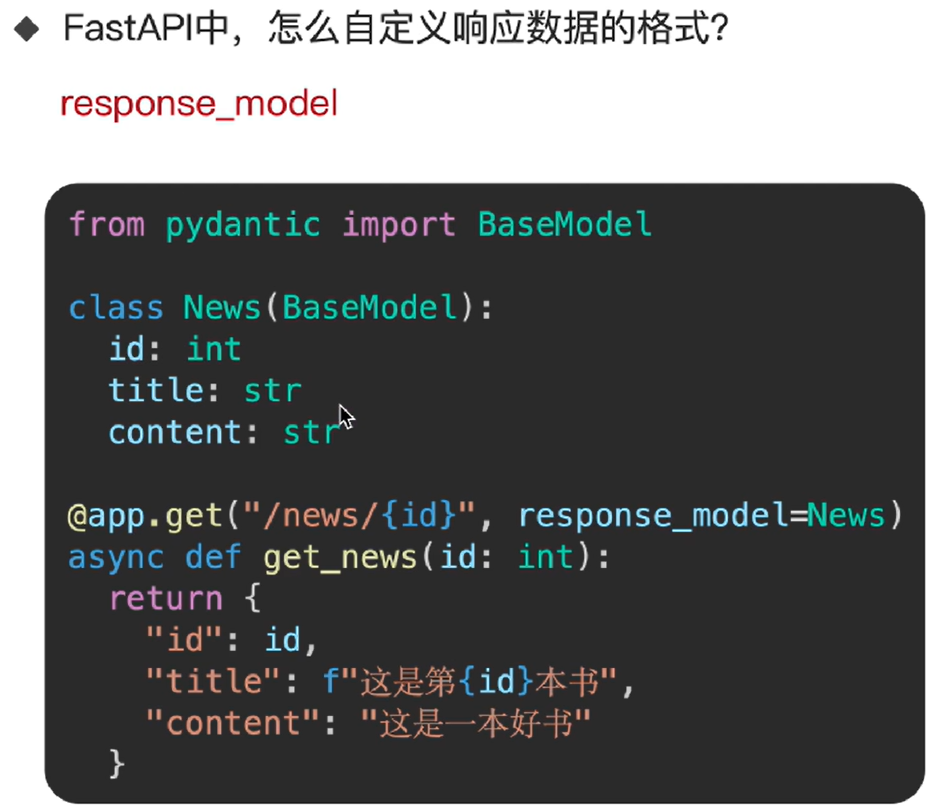
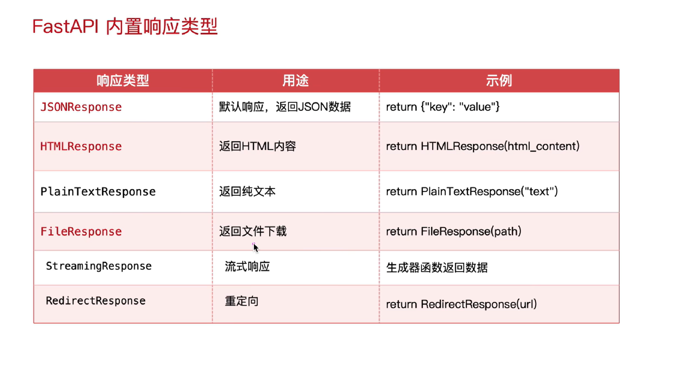
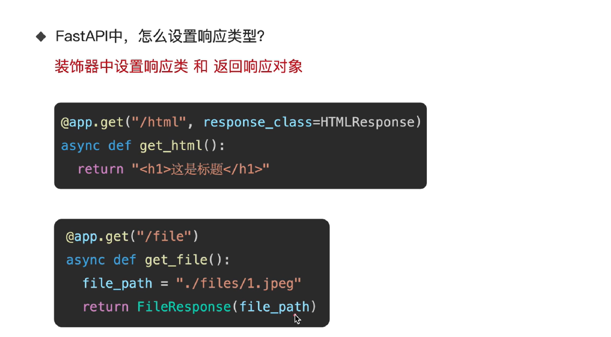

# 1. 响应类型

- 默认情况下，FastAPI会**自动**将路径操作函数返回的**Python对象**（字典、列表、Pydantic模型等），经由jsonable_encoder转换为`JSON`兼容格式，并包装为`JSONResponse`返回。这省去了手动序列化的步骤，让开发者能更专注于业务逻辑
- 如果需要返回非JSON数据（如HTML、文件流），FastAPI提供了丰富的响应类型来返回不同数据

<!--  -->

# 2. JSONResponse


- 这里的JSON格式都是FastAPI自动转换的格式，不需要人为操作

# 3. 响应类型设置方式

## 3.1 装饰器中指定响应类

- 场景：固定返回类型（HTML、纯文本等）


## 3.2 返回响应对象

- 场景：文件下载、图片、流式响应


# 4. 响应HTML格式

- 设置响应类为`HTMLResponse`，当前接口即可返回HTML内容

****

```python
from fastapi.responses import HTMLResponse

# 接口 → 响应 HTML 代码
@app.get("/html", response_class=HTMLResponse)
async def get_html():
    return "<h1>这是一级标题</h1>"
```





# 5. 响应文件格式

- `FileResponse`是FastAPI提供的专门用于高效返回文件内容（如图片、PDF、Excel、音视频等）的响应类。它能够智能处理文件路径、媒体类型推断、范围请求和缓存头部，是服务静态文件的推荐方式。


```python
from fastapi.responses import FileResponse

# 接口： 返回一张图片内容
@app.get("/file")
async def get_file():
    path = "./煜甜儿的抖音_-_抖音/001.jpg"
    return FileResponse(path)
```


# 6. 自定义响应数据格式

- `response_model`是`路径操作装饰器`（如@app.get或@app.post）的关键参数，它通过一个`Pydantic模型来严格定义和约束API端点的输出格式`。这一机制在提供自动数据验证和序列化的同时，更是保障数据安全性的第一道防线。



```python
from pydantic import BaseModel

# 需求： 新闻接口 → 响应数据格式 id、title、content
class News(BaseModel):
    id: int
    title: str
    content: str

@app.get("/news/{id}", response_model=News)
async def get_news(id: int):
    return {
        "id":id,					# 注意这里返回时的数据格式一定要完整，上面News里有的返回时也要有，否则会报错
        "title": f"这是第{id}本书",
        "content": "这是一本好书"
    }
```



- 本人感受来觉得这个自定义的响应数据格式和JSON格式差不多，不对，其实就是JSON格式，只不过内容是我想要的自定义的类似于结构体





