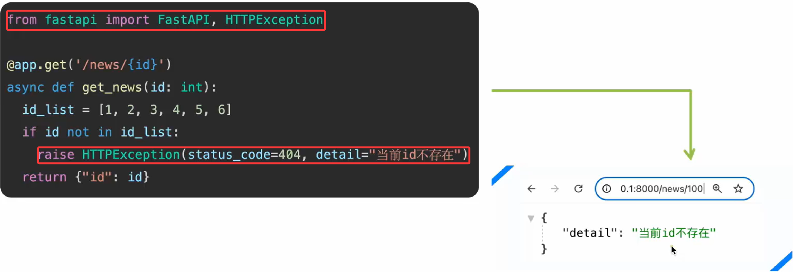
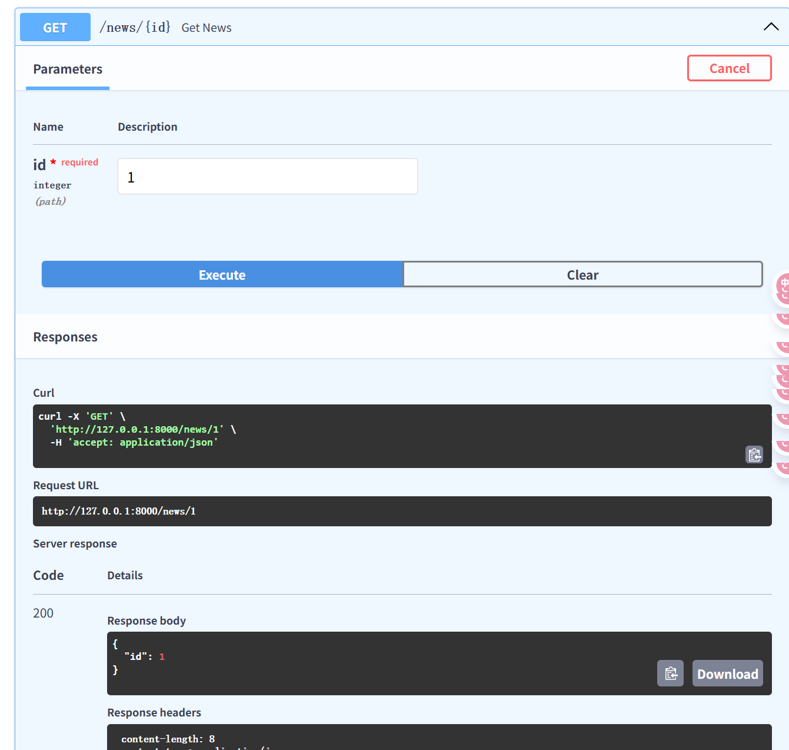
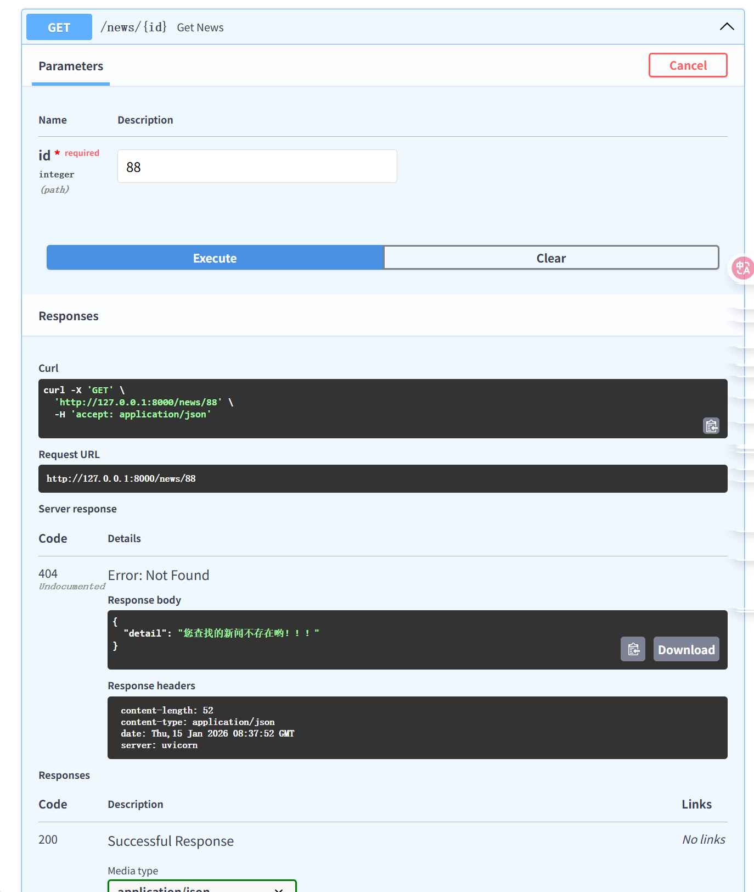

-  对于`客户端`引发的错误（4××，如资源未找到、认证失败），应使用`fastapi.HTTPException`来中断正常处理流程，并返回标准错误响应。



```python
from fastapi import HTTPException

# 需求： 按 id 来查询新闻 → 1-6
@app.get("/news/{id}")
async def get_news(id: int):
    id_list = [1, 2, 3, 4, 5, 6]
    if id not in id_list:			# 自己定义的判断条件，满足则raise抛出错误信息
        raise HTTPException(status_code=404, detail="您查找的新闻不存在哟！！！")
    return {"id": id}
```

- 正常：



- 抛出错误：

