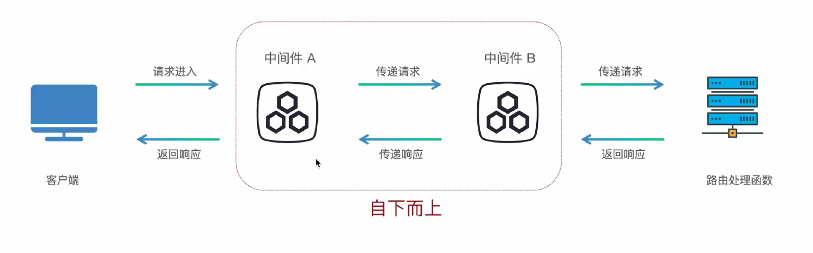
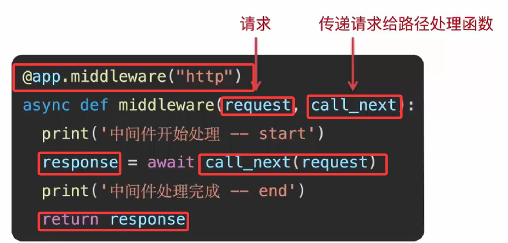
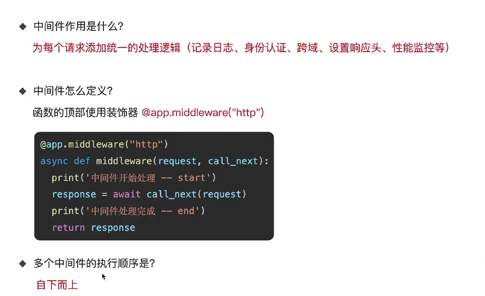

+ 使用中间件为每个请求前后添加统一的处理逻辑


# 1. 中间件执行流程

- 中间件（Middleware）是一个在`每次请求进入FastAPI应用时`都会被执行的函数。
- 它在请求到达实际的路径操作（路由处理函数）之前运行，并且在响应返回给客户端之前再运行一次。



-  注意其中多个中间件在代码中的执行顺序是自下而上的

# 2. 中间件写法

- 中间件：函数的顶部使用装饰器`@app.middleware("http")`



# 3. 代码实现及结果

- 一个中间件

```python
@app.middleware("http")
async def middleware1(request, call_next):
    print("中间件1 start")
    reponse = await call_next(request)		# 异步处理，要使用await
    print("中间件1 end")
    return reponse
```

- 结果

```bash
中间件1 start
中间件1 end
INFO:     127.0.0.1:53977 - "GET / HTTP/1.1" 200 OK
```

- 两个中间件

```python
@app.middleware("http")
async def middleware1(request, call_next):
    print("中间件1 start")
    reponse = await call_next(request)
    print("中间件1 end")
    return reponse

@app.middleware("http")
async def middleware2(request, call_next):
    print("中间件2 start")
    reponse = await call_next(request)
    print("中间件2 end")
    return reponse
```

- 结果

```bash
中间件2 start
中间件1 start
中间件1 end
中间件2 end
INFO:     127.0.0.1:54054 - "GET / HTTP/1.1" 200 OK
```

- 可以看出来，多个中间件运行顺序是从代码自下而上的，请求先开始最下面的，再开始上面的，然后响应是上面的先结束，最后结束最下面的

# 4. 总结

