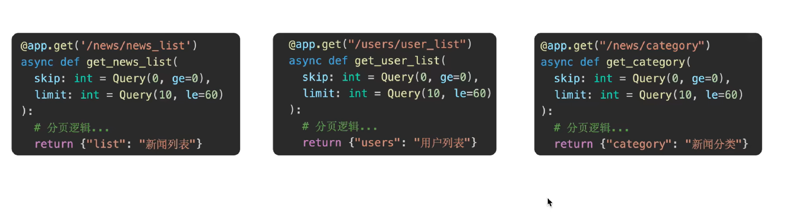
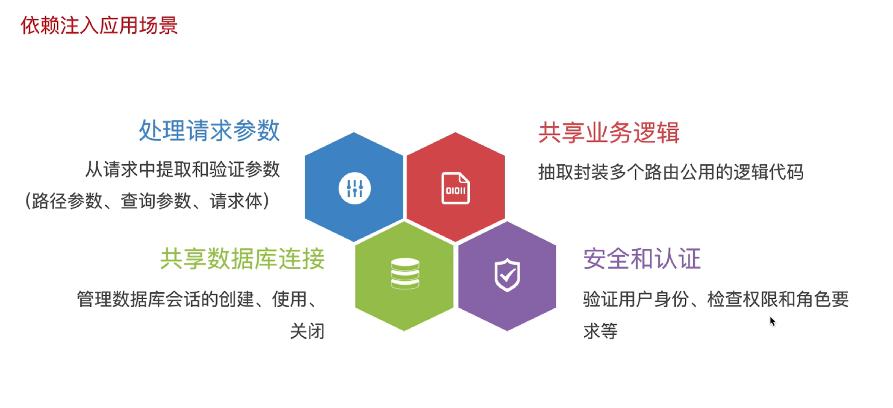
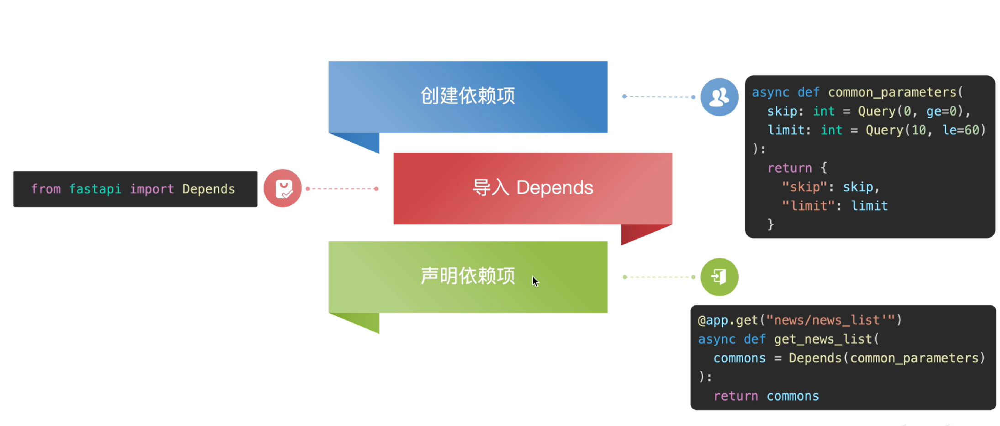
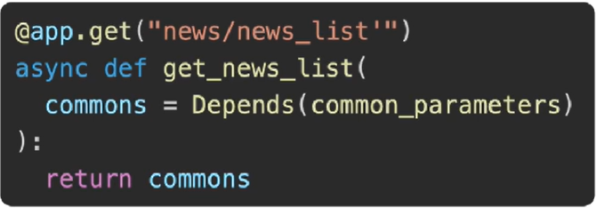
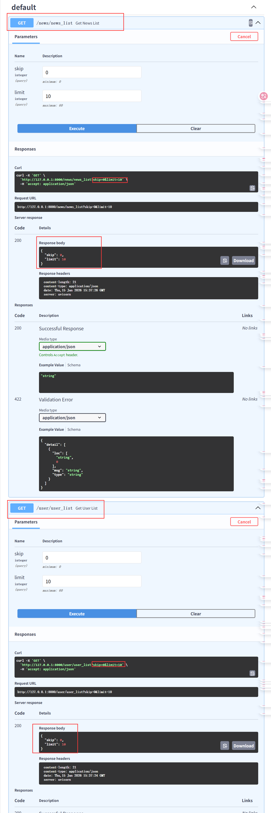
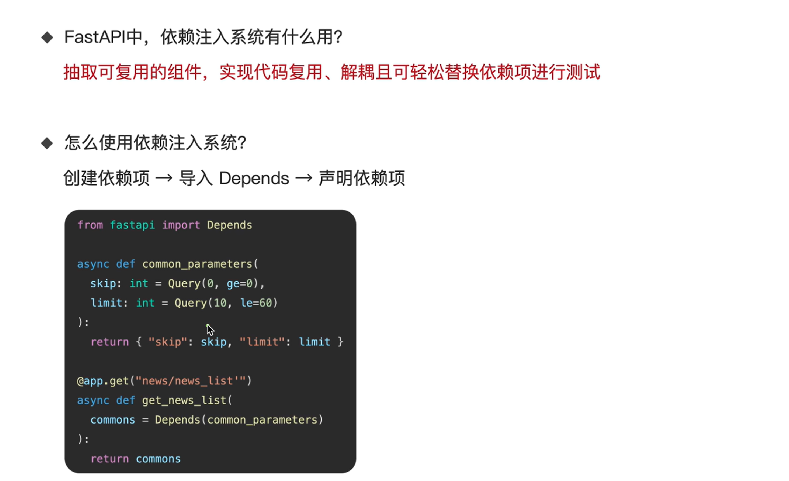

# 1. 依赖注入与中间件区别

- 使用依赖注入系统来共享通用逻辑，减少代码重复



- 注意区分中间件和依赖注入两者


- 说白了就是中间件控制所有接口，而依赖注入只要控制个人所需要的接口

# 2. 依赖注入

- 依赖项： 可`重用`的组件（函数/类），负责提供某种功能或数据
- 注入：FastAPI自动帮你调用依赖项，并将结果"注入"到路径操作函数中
- 优点：
  - 代码复用：一次编写，多处使用
  - 解耦：业务逻辑与基础设施代码分离
  - 易于测试：轻易地用模拟依赖替换真实依赖进行测试
- 应用场景



# 3. 依赖注入系统使用方法



## 3.1 创建依赖项


## 3.2 导入Depends


## 3.3 声明依赖项



# 4. 代码实现及结果

```python
from fastapi import FastAPI, Query, Depends # 依赖注入第二步，导入Depends
# 创建FastAPI实例
app = FastAPI()

# 分页参数逻辑共用： 新闻列表和用户列表
# 1. 依赖项
async def common_parameters(
        skip: int = Query(0, ge=0),
        limit: int = Query(10, le=60)
):
    return {"skip": skip, "limit": limit}

# 3. 声明依赖项 → 依赖注入
@app.get("/news/news_list")
async def get_news_list(common = Depends(common_parameters)):
    return common

@app.get("/user/user_list")
async def get_user_list(common = Depends(common_parameters)):
    return common

```



# 5. 总结



