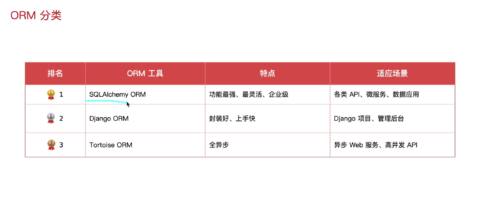
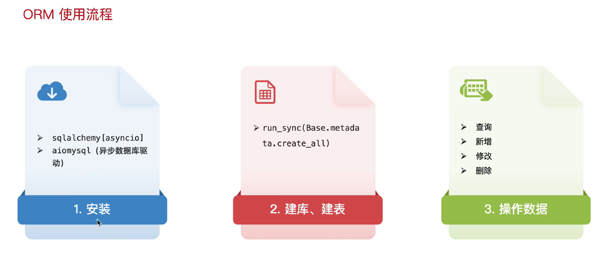
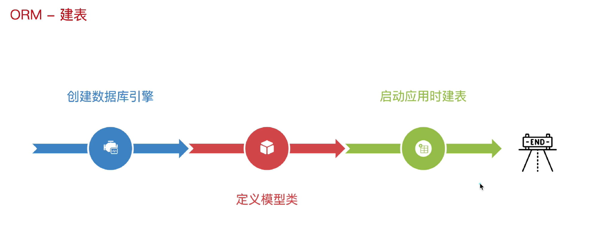
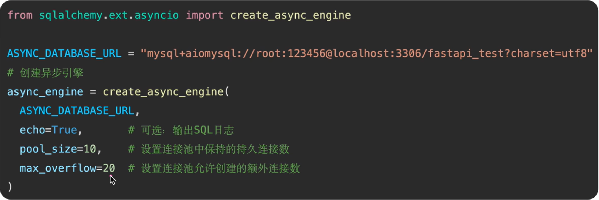
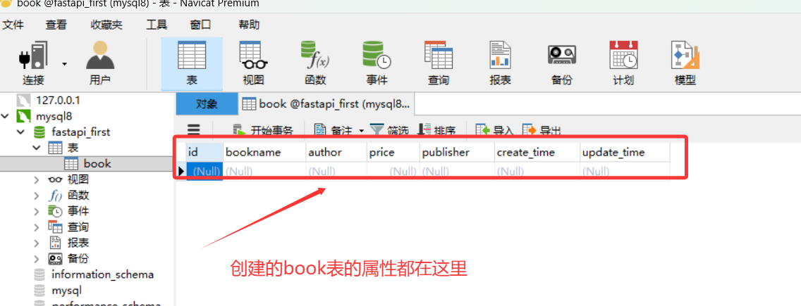
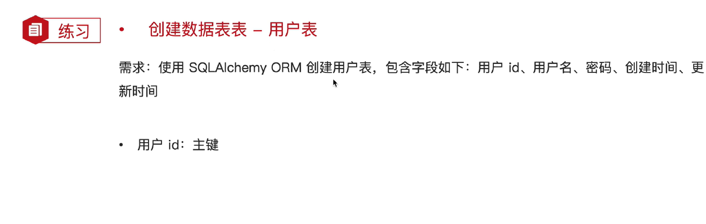
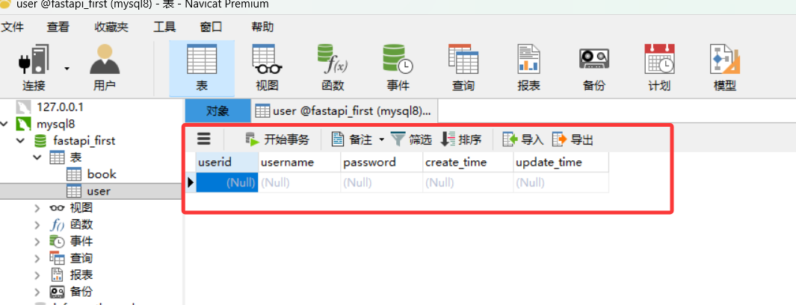

# 1. ORM简介

- ORM(Object-RelationalMapping，对象关系映射)是一种编程技术，用于在`面向对象编程语言和关系型数据之间建立映射`。它允许开发者通过`操作对象的方式`与数据库进行交互，而无需直接编写复杂的SQL语句。
- 优势：
  - 减少重复的SQL代码
  - 代码更简洁易读
  - 自动处理数据库连接和事务
  - 自动防止SQL注入攻击

# 2. ORM分类



# 3. ORM使用流程



## 3.1 安装

```bash
pip install sqlalchemy[asyncio] aiomysql		# 安装两个包
```

## 3.2 建库、建表

```sql
create database xx;					# 建库仍采用正常sql语句
```



### 3.2.1 创建数据库引擎

- 使用`create_async_engine`创建异步引擎



### 3.2.2 定义模型类

- 基类，继承`DeclarativeBase(包含通用属性和字段的映射)`
- 定义数据库表对应的模型类


### 3.2.3 创建数据表

- 1. 从连接池获取异步连接，开启事务，执行ORM操作
  2. FastAPI应用启动时，创建数据库表


# 4. 总代码加效果

```python
import datetime

from sqlalchemy import DateTime, func, insert_sentinel, String, Float

from fastapi import FastAPI
from sqlalchemy.ext.asyncio import create_async_engine
from sqlalchemy.orm import DeclarativeBase, Mapped, mapped_column # Mapped约定属性类型，mapped_column映射字段

app = FastAPI()


# 1.创建异步引擎
ASYNC_DATABASE_URL = "mysql+aiomysql://root:1@localhost:3306/fastapi_first?charset=utf8"
async_engine = create_async_engine(
    ASYNC_DATABASE_URL,
    echo=True,          # 可选，输出SQL日志
    pool_size=10,        # 设置连接池活跃的连接数
    max_overflow=20     # 允许额外的连接数
)


# 2. 定义模型类： 基类 + 表对应的模型类
# 基类：创建时间、更新时间；书籍表：id、书名、作者、价格、出版社
class Base(DeclarativeBase):            # 基类
    create_time: Mapped[datetime] = mapped_column(DateTime, insert_default=func.now(), default=func.now, comment="创建时间")
    update_time: Mapped[datetime] = mapped_column(DateTime, insert_default=func.now(), default=func.now, onupdate=func.now(), comment="修改时间")

class Book(Base):                       # 表
    __tablename__ = "book"

    id: Mapped[int] = mapped_column(primary_key=True, comment="书籍id")
    bookname: Mapped[str] = mapped_column(String(255), comment="书名")
    author: Mapped[str] = mapped_column(String(255), comment="作者")
    price: Mapped[float] = mapped_column(Float, comment="价格")
    publisher: Mapped[str] = mapped_column(String(255), comment="出版社")


# 3. 建表：定义函数建表 → FastAPI启动的时候调用建表的函数
async def create_tables():
    # 获取异步引擎，创建事务 - 建表
    async with async_engine.begin() as conn:
        await conn.run_sync(Base.metadata.create_all)   # Base模型类的元数据创建

@app.on_event("startup")
async def startup_event():
    await create_tables()


@app.get("/")
async def root():
    return {"message": "Hello World"}
```

```bash
(.venv) PS C:\Users\dingbenwang\Desktop\Pythonweb> uvicorn demo01:app --reload
INFO:     Will watch for changes in these directories: ['C:\\Users\\dingbenwang\\Desktop\\Pythonweb']
INFO:     Uvicorn running on http://127.0.0.1:8000 (Press CTRL+C to quit)
INFO:     Started reloader process [37804] using StatReload
INFO:     Started server process [36080]
INFO:     Waiting for application startup.
2026-01-17 00:25:25,152 INFO sqlalchemy.engine.Engine SELECT DATABASE()
2026-01-17 00:25:25,153 INFO sqlalchemy.engine.Engine [raw sql] ()
2026-01-17 00:25:25,155 INFO sqlalchemy.engine.Engine SELECT @@sql_mode
2026-01-17 00:25:25,155 INFO sqlalchemy.engine.Engine [raw sql] ()
2026-01-17 00:25:25,156 INFO sqlalchemy.engine.Engine SELECT @@lower_case_table_names
2026-01-17 00:25:25,156 INFO sqlalchemy.engine.Engine [raw sql] ()
2026-01-17 00:25:25,157 INFO sqlalchemy.engine.Engine BEGIN (implicit)
2026-01-17 00:25:25,157 INFO sqlalchemy.engine.Engine DESCRIBE `fastapi_first`.`book`
2026-01-17 00:25:25,157 INFO sqlalchemy.engine.Engine [raw sql] ()
2026-01-17 00:25:25,163 INFO sqlalchemy.engine.Engine 
CREATE TABLE book (
        id INTEGER NOT NULL COMMENT '书籍id' AUTO_INCREMENT, 
        bookname VARCHAR(255) NOT NULL COMMENT '书名', 
        author VARCHAR(255) NOT NULL COMMENT '作者', 
        price FLOAT NOT NULL COMMENT '价格', 
        publisher VARCHAR(255) NOT NULL COMMENT '出版社', 
        create_time DATETIME NOT NULL COMMENT '创建时间', 
        update_time DATETIME NOT NULL COMMENT '修改时间', 
        PRIMARY KEY (id)
)


2026-01-17 00:25:25,164 INFO sqlalchemy.engine.Engine [no key 0.00065s] ()
2026-01-17 00:25:25,190 INFO sqlalchemy.engine.Engine COMMIT
INFO:     Application startup complete.
INFO:     127.0.0.1:58878 - "GET / HTTP/1.1" 200 OK
INFO:     127.0.0.1:58878 - "GET /favicon.ico HTTP/1.1" 404 Not Found

```



# 5. 练习



```python
import datetime

from fastapi import FastAPI
from sqlalchemy import DateTime, func, String
from sqlalchemy.ext.asyncio import create_async_engine
from sqlalchemy.orm import DeclarativeBase, Mapped, mapped_column


app = FastAPI()

# 1. 创建异步引擎
ASYNC_DATABASE_URL = "mysql+aiomysql://root:1@localhost:3306/fastapi_first?charset=utf8"
async_engine = create_async_engine(
    ASYNC_DATABASE_URL,
    echo=True,
    pool_size=10,
    max_overflow=20
)

# 2. 定义模型类： 基类 + 表对应的模型类
class Base(DeclarativeBase):        # 基类
    create_time: Mapped[datetime] = mapped_column(DateTime, insert_default=func.now(), default=func.now, comment="创建时间")
    update_time: Mapped[datetime] = mapped_column(DateTime, insert_default=func.now(), default=func.now, onupdate=func.now(), comment="修改时间")

class User(Base):                   # 表
    __tablename__ = "user"

    userid: Mapped[int] = mapped_column(primary_key=True, comment="用户id")
    username: Mapped[str] = mapped_column(String(255), comment="用户名")
    password: Mapped[str] = mapped_column(String(255), comment="密码")

# 3. 建表
async def create_tables():
    async with async_engine.begin() as conn:
        await conn.run_sync(Base.metadata.create_all)

@app.on_event("startup")
async def startup_event():
    await create_tables()


@app.get("/")
async def root():
    return {"message": "人生苦短，我学FastAPI"}
```

```bash
 INFO:     Started server process [4740]
INFO:     Waiting for application startup.
2026-01-17 00:54:06,516 INFO sqlalchemy.engine.Engine SELECT DATABASE()
2026-01-17 00:54:06,516 INFO sqlalchemy.engine.Engine [raw sql] ()
2026-01-17 00:54:06,517 INFO sqlalchemy.engine.Engine SELECT @@sql_mode
2026-01-17 00:54:06,517 INFO sqlalchemy.engine.Engine [raw sql] ()
2026-01-17 00:54:06,517 INFO sqlalchemy.engine.Engine SELECT @@lower_case_table_names
2026-01-17 00:54:06,517 INFO sqlalchemy.engine.Engine [raw sql] ()
2026-01-17 00:54:06,518 INFO sqlalchemy.engine.Engine BEGIN (implicit)
2026-01-17 00:54:06,518 INFO sqlalchemy.engine.Engine DESCRIBE `fastapi_first`.`user`
2026-01-17 00:54:06,518 INFO sqlalchemy.engine.Engine [raw sql] ()
2026-01-17 00:54:06,520 INFO sqlalchemy.engine.Engine 
CREATE TABLE user (
        userid INTEGER NOT NULL COMMENT '用户id' AUTO_INCREMENT, 
        username VARCHAR(255) NOT NULL COMMENT '用户名', 
        password VARCHAR(255) NOT NULL COMMENT '密码', 
        create_time DATETIME NOT NULL COMMENT '创建时间', 
        update_time DATETIME NOT NULL COMMENT '修改时间', 
        PRIMARY KEY (userid)
)


2026-01-17 00:54:06,520 INFO sqlalchemy.engine.Engine [no key 0.00031s] ()
2026-01-17 00:54:06,532 INFO sqlalchemy.engine.Engine COMMIT
INFO:     Application startup complete.
```

