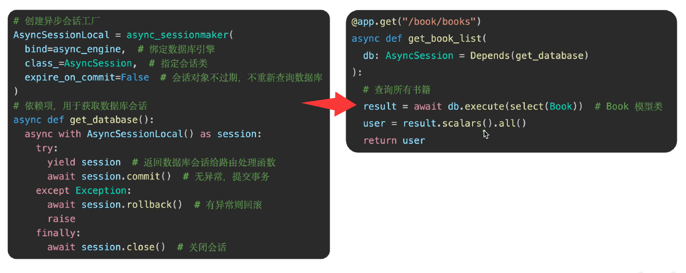
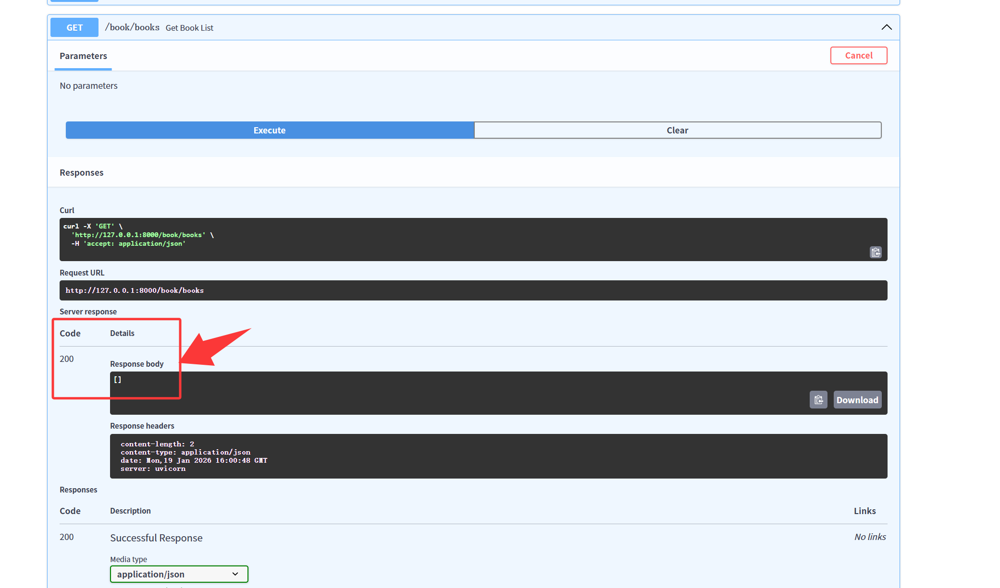
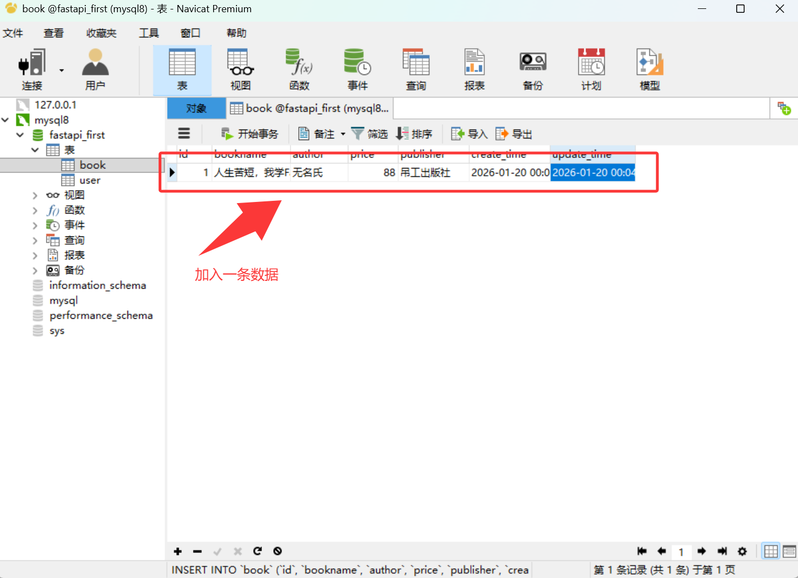
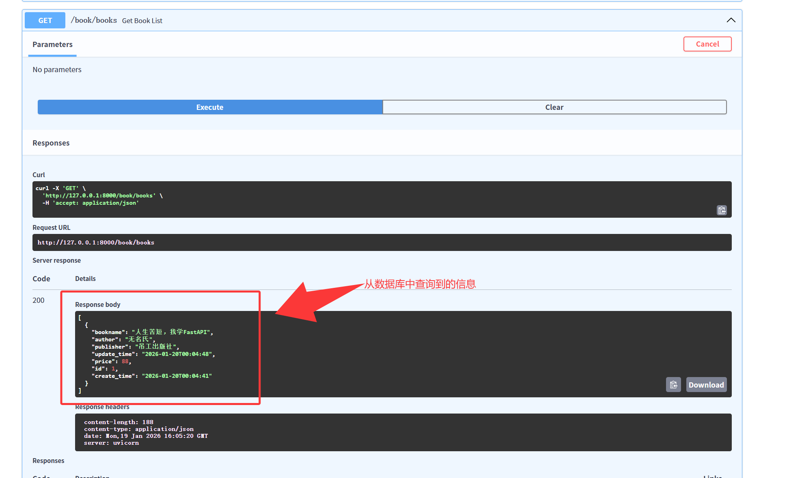
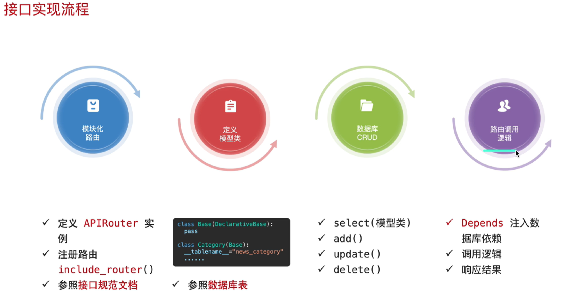

# 1. 实现流程

- 核心： 创造`依赖项`，使用`Depends`注入到处理函数



- 先创建依赖项，依赖项需要创建异步会话工厂
- 然后进行依赖注入

# 2. 代码实现

```python
from sqlalchemy import DateTime, func, String, Float, select
from sqlalchemy.ext.asyncio import create_async_engine , async_sessionmaker, AsyncSession

# 需求：查询功能的接口，查询图书 → 依赖注入：创建依赖项获取数据库会话 + Depends 注入路由处理函数
# 先创建异步会话工厂，要导入async_sessionmaker工厂函数
AsyncSessionLocal = async_sessionmaker(
    bind=async_engine,      # 绑定数据库引擎，就是上面的异步引擎
    class_=AsyncSession,    # 指定会话类
    expire_on_commit=False  # 提交后会话不过期，不会重新查询数据库
)

# 依赖项
async def get_database():
    async with AsyncSessionLocal() as session:
        try:
            yield session               # 返回数据库会话给路由处理函数
            await session.commit()      # 提交事务
        except Exception:
            await session.rollback()    # 有异常，回滚
            raise
        finally:
            await session.close()       # 关闭会话


# 路由
@app.get("/book/books")
async def get_book_list(db: AsyncSession = Depends(get_database)):
    # 查询
    result = await db.execute(select(Book))
    book = result.scalars().all()
    return book

```

- 初步查询结果是空的，因为表里没有数据



- 通过可视化工具加入一条数据



- 此时再次刷新页面并访问可以查询到信息，能查询到信息表明数据库会话依赖注入成功



# 接口实现流程

