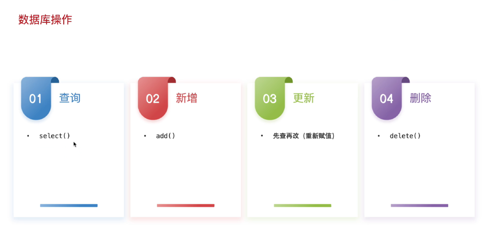

# 1. 数据库操作-查询

- 核心语句：`await db.execute(select(模型类))`，返回一个ORM对象

## 1.1 方法

- 获取所有数据
  - `scalars().all()`
- 获取单条数据
  - `scalars().first()`
  - `get(模型类，主键值)`，不需要基于ORM对象，直接基于模型类和主键的值，上面两条都是要基于ORM对象的

- 以上三条就是提取数据的方法

## 1.2 实现

- 获取全部数据

```python
# 路由
@app.get("/book/books")
async def get_book_list(db: AsyncSession = Depends(get_database)):
    # 查询
    result = await db.execute(select(Book))
    book = result.scalars().all()   # 获取所有数据
    return book
```

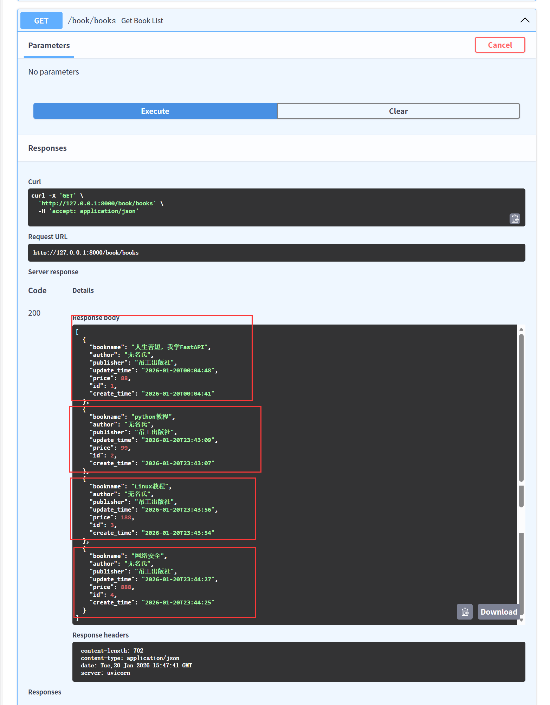

- 获取单条数据，这个是第一条

```python
# 路由
@app.get("/book/books")
async def get_book_list(db: AsyncSession = Depends(get_database)):
    # 查询
    result = await db.execute(select(Book))
    # book = result.scalars().all()   # 获取所有数据
    book = result.scalars().first()
    return book
```

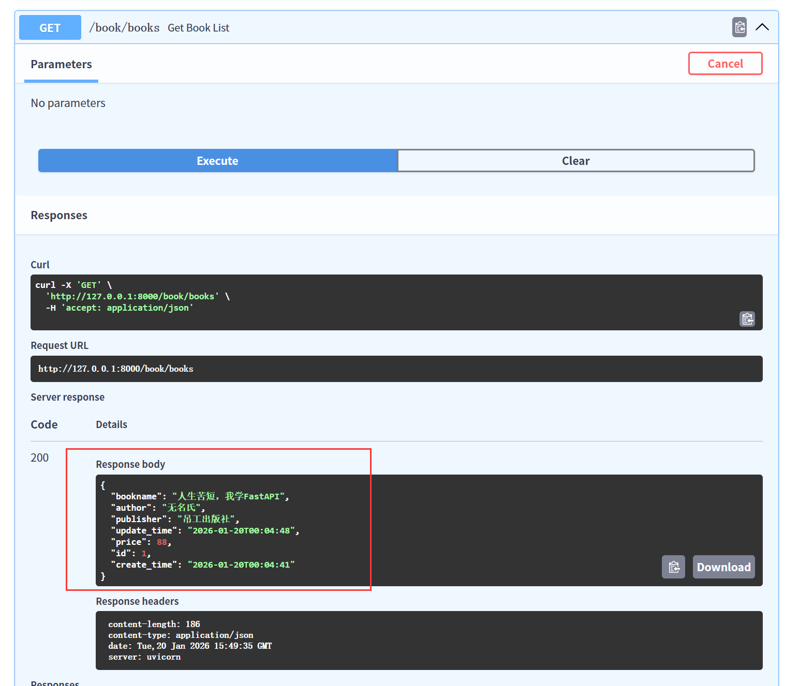

- 获取指定的单条数据

```python
# 路由
@app.get("/book/books")
async def get_book_list(db: AsyncSession = Depends(get_database)):
    # 查询
    # result = await db.execute(select(Book))
    # # book = result.scalars().all()   # 获取所有数据
    # book = result.scalars().first()
    book = await db.get(Book, 4)
    return book
```

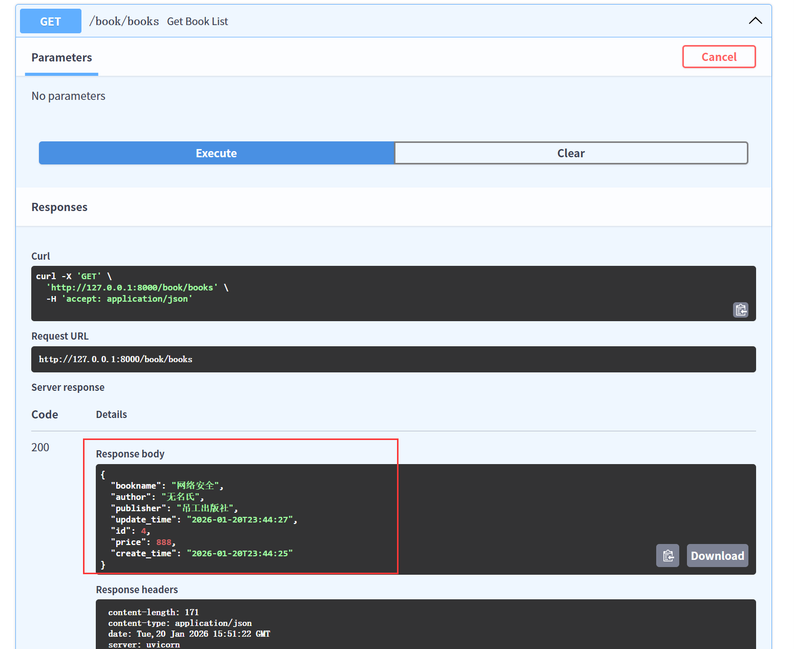

## 1.3 查询条件

- 有条件的查询格式为`select(Book).where(条件1，条件2)`
- 条件有：
  - 比较判断：== ; > ; < ; >= ; <= 等
  - 模糊查询：like()
  - 与非查询：&; | : ~
  - 包含查询： in_()

### 1.3.1 查询条件-比较判断

- 比较判断：== ; > ; < ; >= ; <= 等

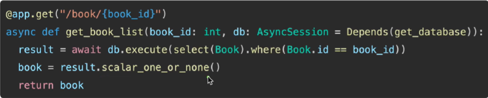

- 实现

```python
# 条件查询
# 需求：路径参数 书籍id
@app.get("/book/get_book/{book_id}")
async def get_book_list(book_id = int, db: AsyncSession = Depends(get_database)):
    result = await db.execute(select(Book).where(Book.id == book_id))
    book = result.scalar_one_or_none()
    return book

# 需求： 条件 价格小于等于200
@app.get("/book/search_book")
async def get_search_book(db: AsyncSession = Depends(get_database)):
    result = await db.execute(select(Book).where(Book.price <= 200))
    books = result.scalars().all()
    return books
```

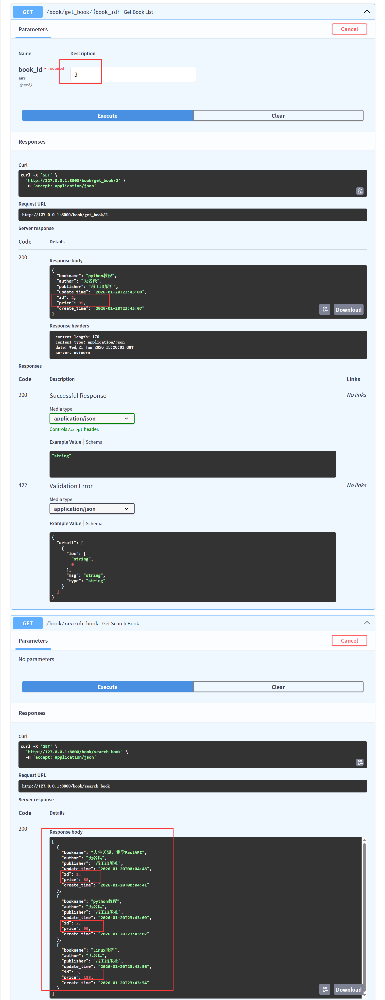

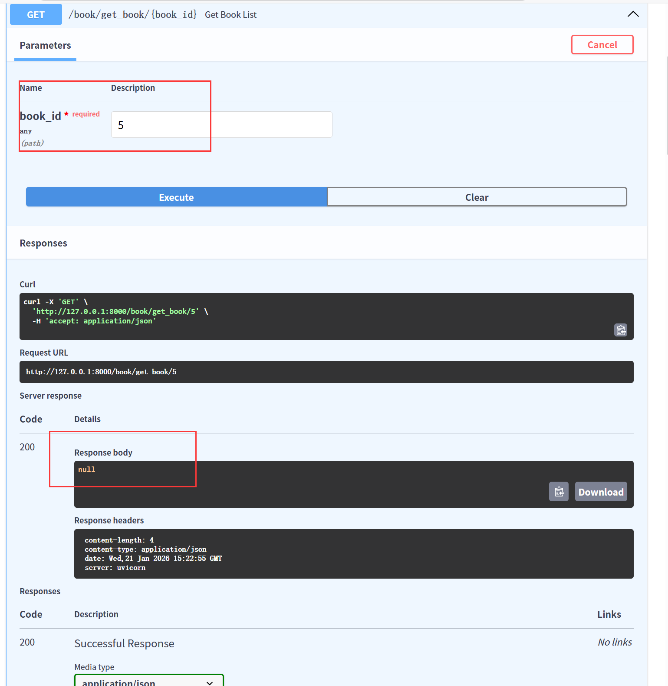

### 1.3.2 查询条件-模糊&与非&包含

- 模糊查询：`like()`
  - `%`：零个、一个或多个字符，也就是任意字符都行
  - `_`：一个单个字符
- 多个字符

```python
# 模糊条件
# 需求： 作者以张 开头   % _
@app.get("/book/search_book")
async def get_search_book(db: AsyncSession = Depends(get_database)):
    result = await db.execute(select(Book).where(Book.author.like("张%")))
    book = result.scalars().all()
    return book
```

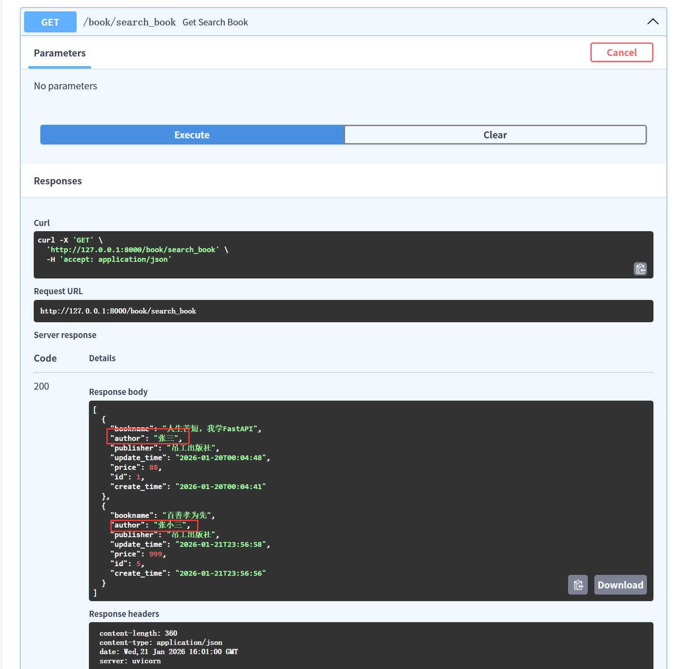

- 单个字符，将`%`变为`_`

```python
# 模糊条件
# 需求： 作者以张 开头   % _
@app.get("/book/search_book")
async def get_search_book(db: AsyncSession = Depends(get_database)):
    result = await db.execute(select(Book).where(Book.author.like("张_")))
    book = result.scalars().all()
    return book
```

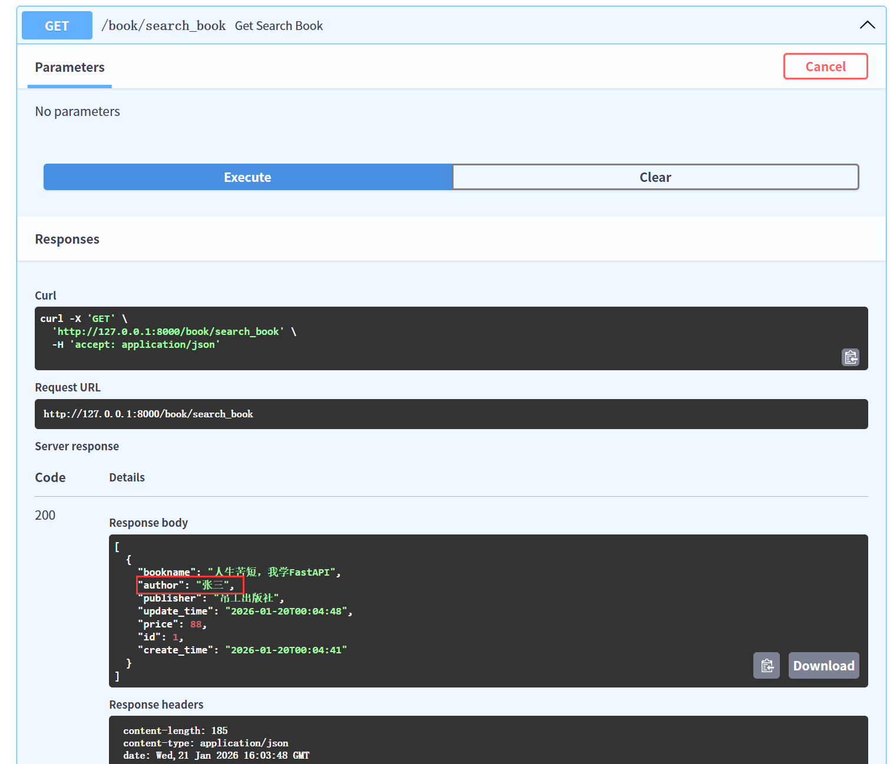

- 条件与`&`

```python
    result = await db.execute(select(Book).where((Book.author.like("张%")) & (Book.price > 500)))
```

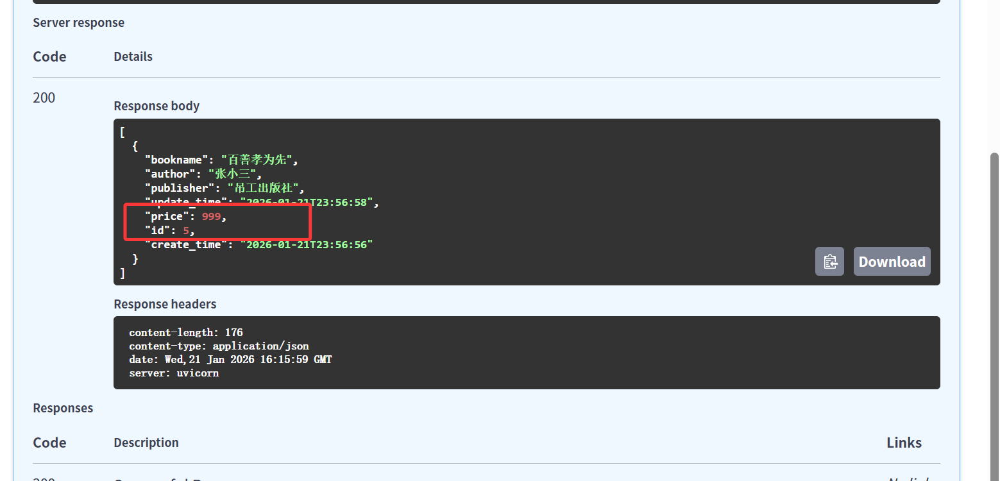

- 条件或`|`

```python
    result = await db.execute(select(Book).where((Book.author.like("张%")) | (Book.price > 500)))
```

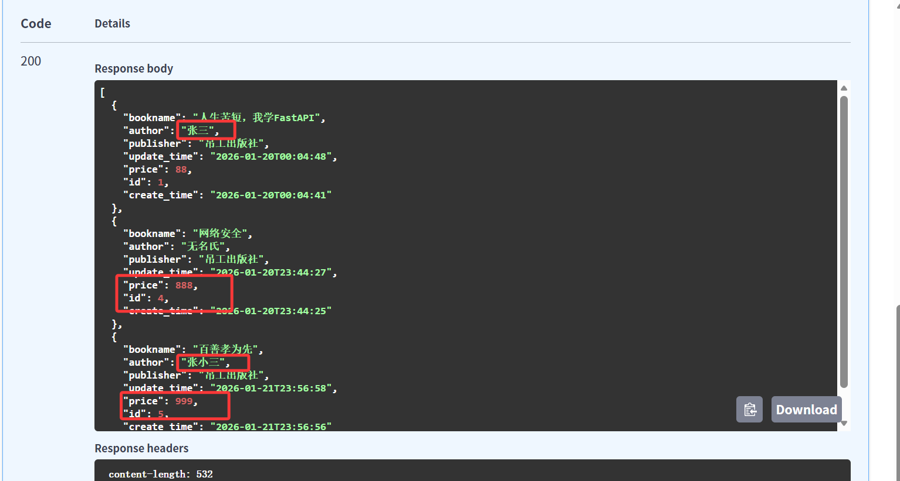

- 条件非`!`

```python
    result = await db.execute(select(Book).where((Book.author.like("!张%")) | (Book.price > 500)))
```

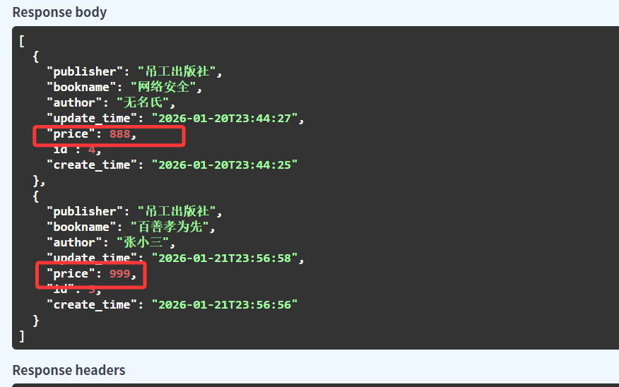

- 包含`in_()`

```python
# 需求：书籍id列表，数据库里面的id如果在书籍id列表里，就返回
    id_list = [1, 3, 5, 7]
    result = await db.execute(select(Book).where(Book.id.in_(id_list)))
```

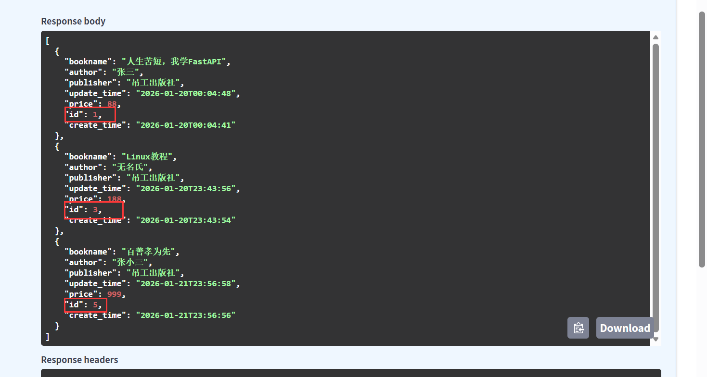

# 2.  聚合查询

- 聚合查询，就是用来统计数据的
- 聚合计算：`func.方法(模型类.属性)`
  - count：统计行数量
  - avg：求平均值
  - max：求最大值
  - min：求最小值
  - sum：求和

## 2.1 方法

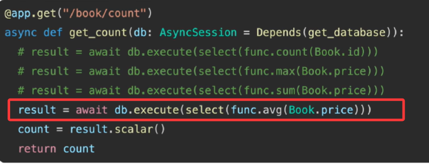

## 2.2 实现

```python
# 聚合查询
@app.get("/book/count")
async def get_count(db: AsyncSession = Depends(get_database)):
     # 聚合查询 select(func.方法名(模型类.属性))
     # result = await db.execute(select(func.count(Book.id)))
     # result = await db.execute(select(func.max(Book.price)))
     # result = await db.execute(select(func.sum(Book.price)))
     result = await db.execute(select(func.avg(Book.price)))
     num = result.scalar()      # 用来提取一个数值 → 标量值
     return num
```

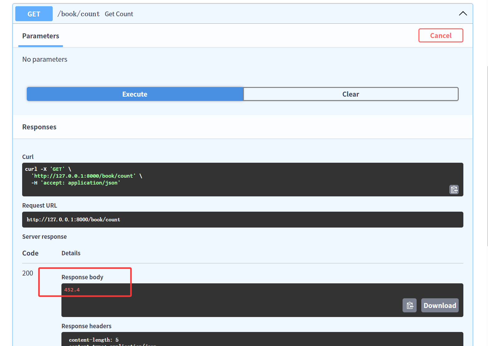

# 3. 分页查询

- 分页查询： `select().offset().limit()`
  - `offset`：跳过的记录数
  - `limit`：返回的记录数

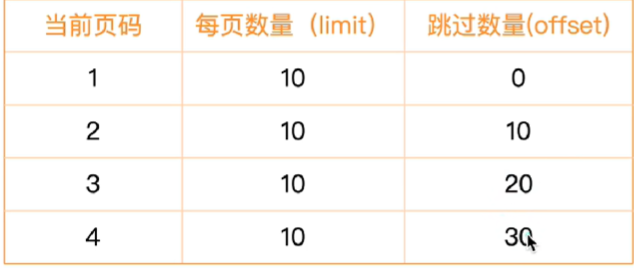

- `offset值 = (当前页码-1) * 每页数量limit`

## 3.1 方法

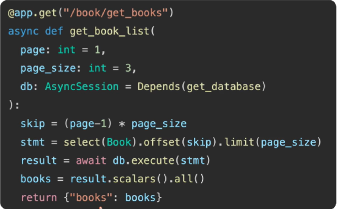

## 3.2 实现

```bash
# 分页查询
@app.get("/book/get_book_list")
async def get_book_list(
        page: int = 1,
        page_size: int = 2,
        db: AsyncSession = Depends(get_database)
):
    # (页码-1) * 每页数量
    skip = (page - 1) * page_size
    
    # offset 跳过的记录数； limit 每页的记录数
    stmt = select(Book).offset(skip).limit(page_size)
    result = await db.execute(stmt)
    books = result.scalars().all()
    return books
```

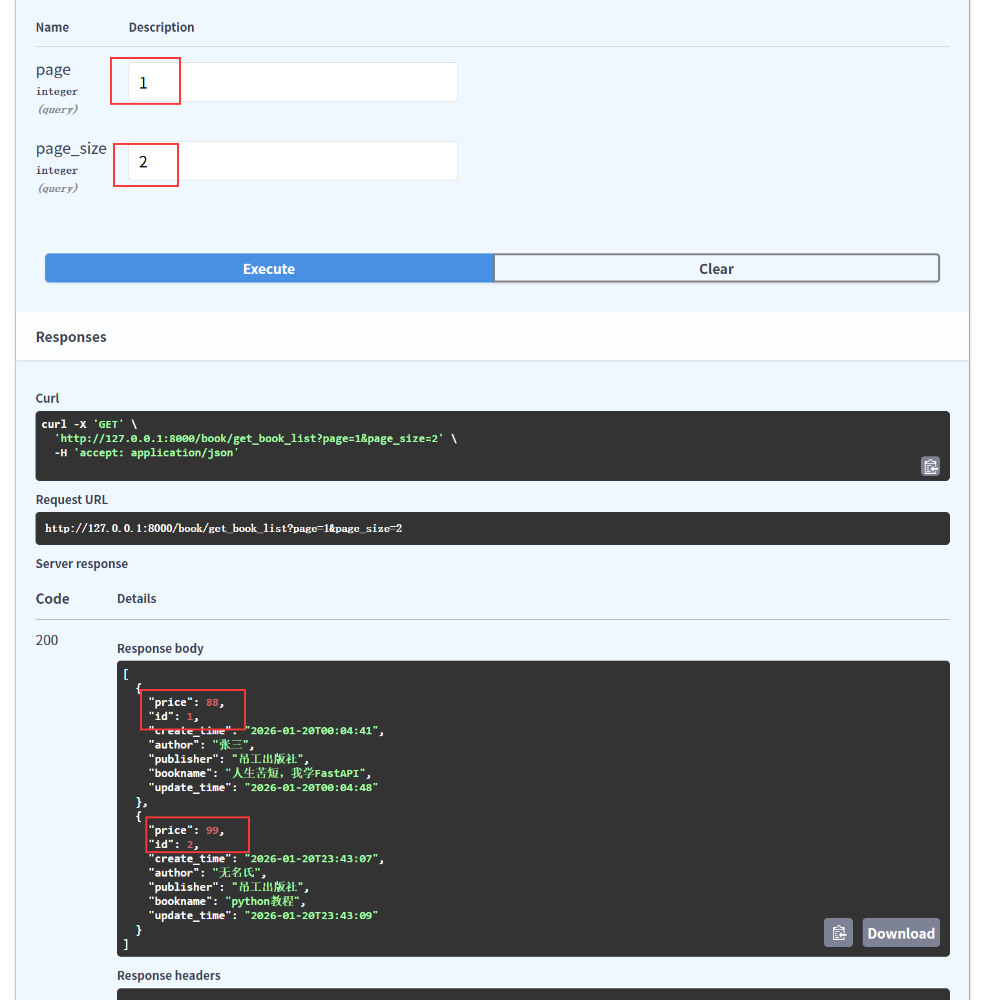

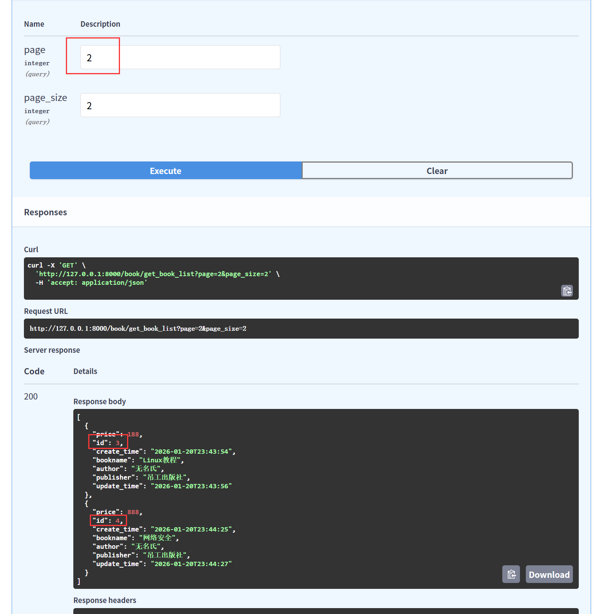

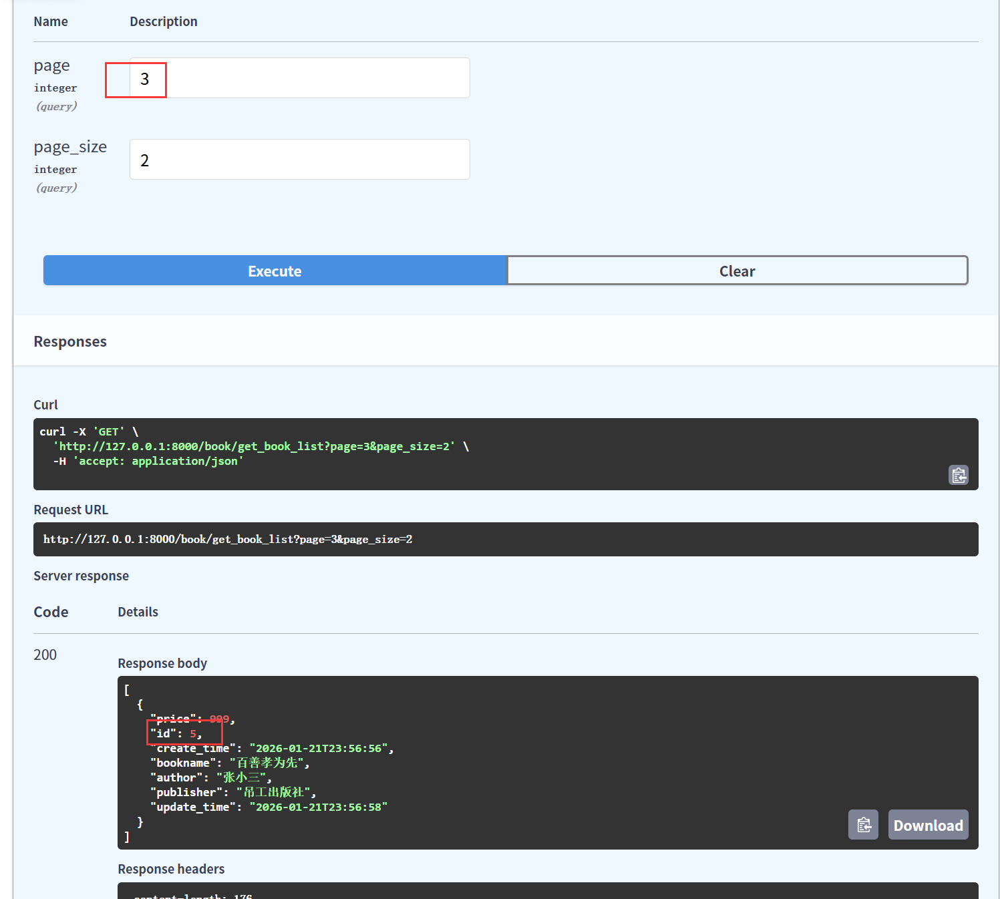

# 4. ORM-查询-总结

- 核心思路
  - `select()`→`db.execute()`→`从ORM对象获取数据`→`响应结果`
  - `db.get(模型类,主键类)`
- `select`


- 从ORM对象获取数据的方法

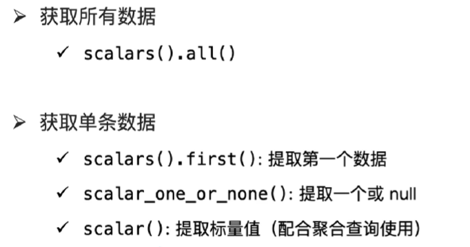