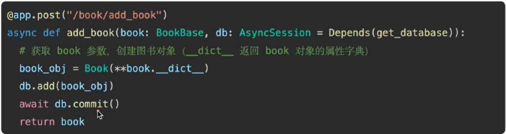
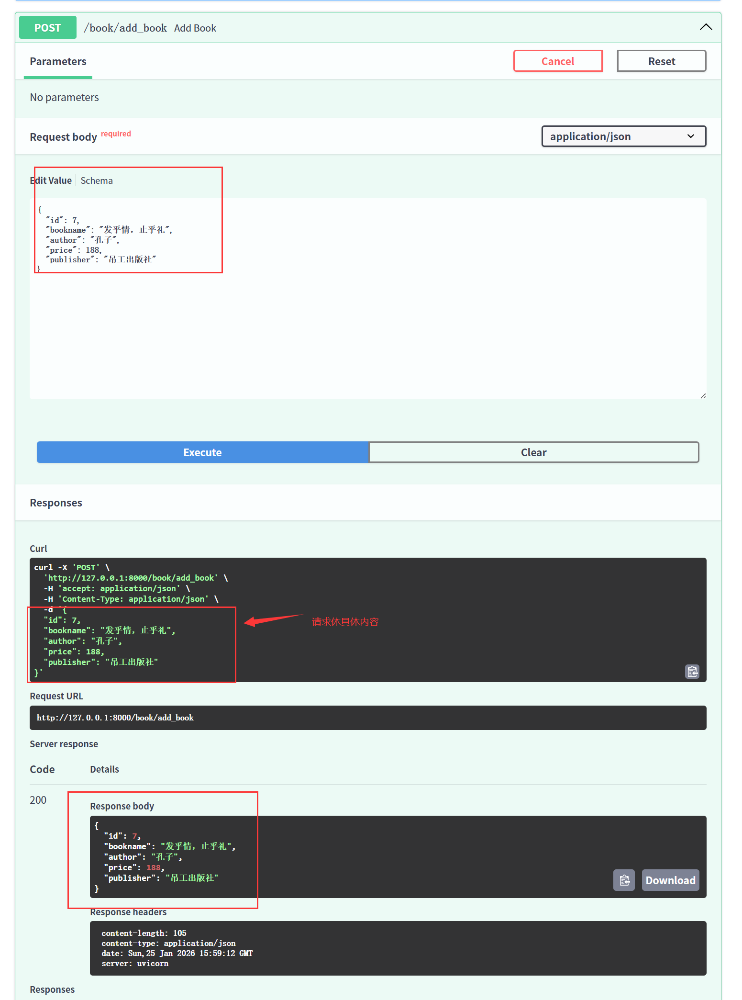
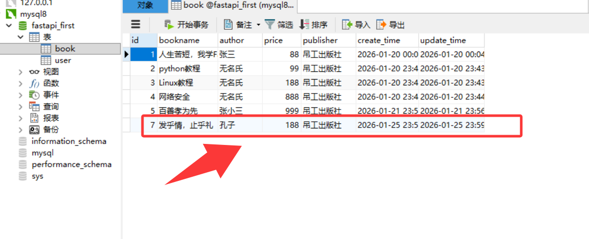

- 核心步骤：定义ORM对象 → 添加对象到事务： `add(对象) `→ `commit`提交到数据库

# 1. 方法



- 先获取到ORM对象，其中book是用户输入的图书信息，通过`book.__dict__`转成字典，然后通过`**`展开字典拿到所有键值对，把这些键值对通过模型类`Book`来转换成ORM对象，最后`add`然后`commit`提交

# 2. 实现

```bash
# 添加数据
# 需求：用户输入图书信息（id、书名、作者、价格、出版社） → 新增
# 用户输入 → 参数 → 请求体
# 先定义出一个请求体参数的类，继承自BaseModel类
class BookBase(BaseModel):
    id: int
    bookname: str
    author: str
    price: float
    publisher: str

@app.post("/book/add_book")
async def add_book(book: BookBase, db: AsyncSession = Depends(get_database)):
    # 现有ORM对象 → add → commit
    book_obj = Book(**book.__dict__)
    db.add(book_obj)
    await db.commit()
    return book
```



- 再到数据库中可以观察到确实添加了一条新的数据

