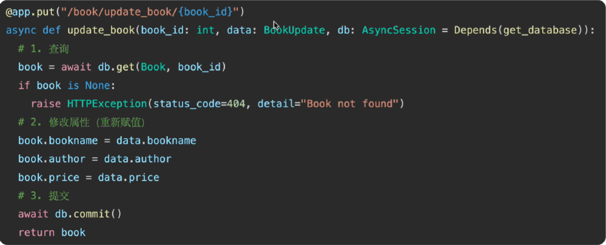
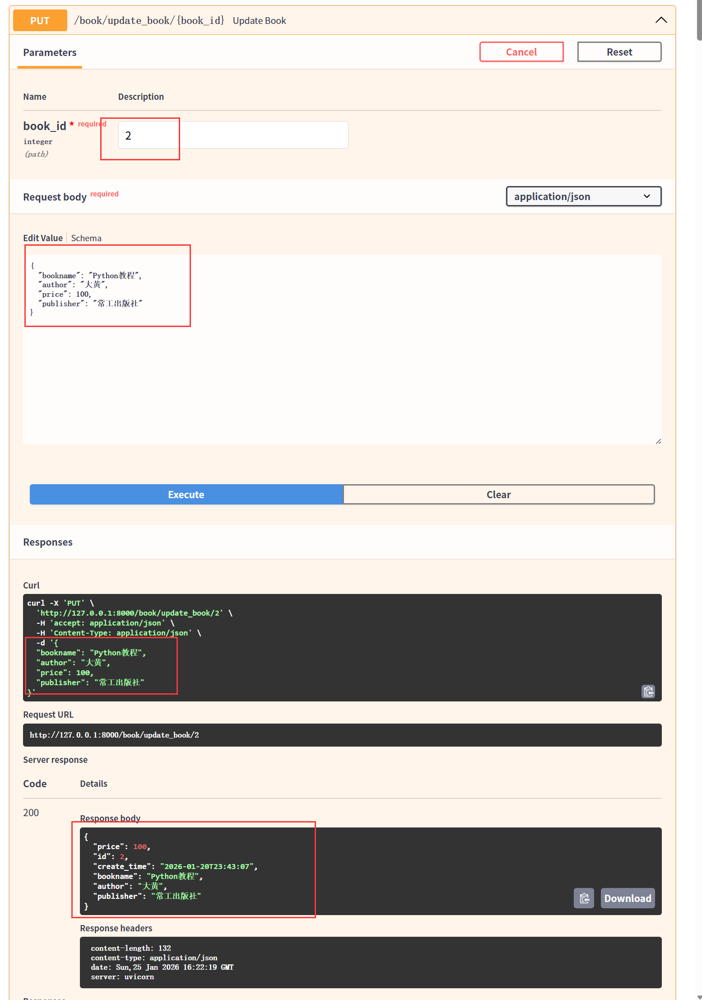
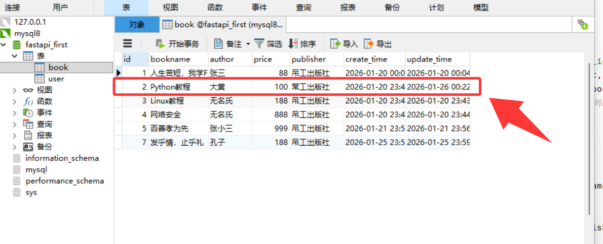

- 核心步骤：查询`get/select` → 属性重新赋值 →  `commit`提交到数据库

# 1. 方法



- 路由里设置一个路径参数，代表的是用户要该的那个`id`
- 先通过`id`值查找这本书的信息，如果没有找到，则`raise`抛出异常
- 如果找到，则需要修改属性进行重新赋值
- 重新赋值的参数则与添加数据类似，是一个请求体参数
- 最后提交到数据库并返回响应信息

# 2. 实现

```bash
from fastapi HTTPException
# 更新数据
# 需求：修改图书的信息：先查再改
# 设计思路：接口提供路径参数id：作用是查找；请求体参数：作用是新数据（书名、作者、价格、出版社）
# 请求体类
class BookUpdate(BaseModel):
    bookname: str
    author: str
    price: float
    publisher: str

@app.put("/book/update_book/{book_id}")
async def update_book(book_id: int, data: BookUpdate,db: AsyncSession = Depends(get_database)):
    db_book = await db.get(Book, book_id)   # 1.查询
    if db_book is None:     # 未找到抛出异常
        raise HTTPException(
            status_code=404,
            detail="没有这本树啊"
        )
    # 2.找到则修改重新赋值
    db_book.bookname = data.bookname
    db_book.author = data.author
    db_book.price = data.price
    db_book.publisher = data.publisher

    await db.commit()   # 3.提交到数据库
    return db_book
```



- 到数据库中查看具体数据确实数据更新了

