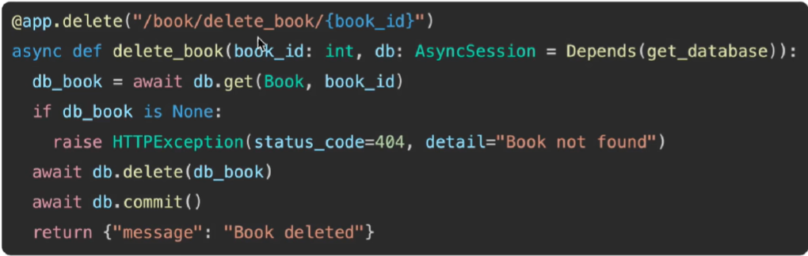
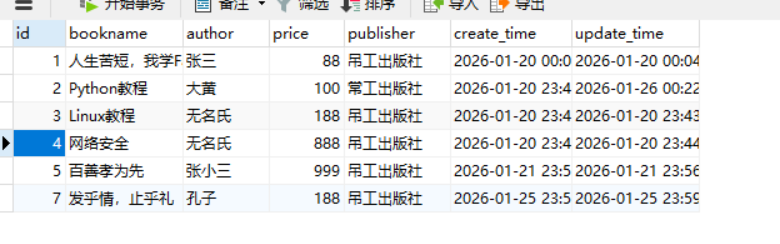
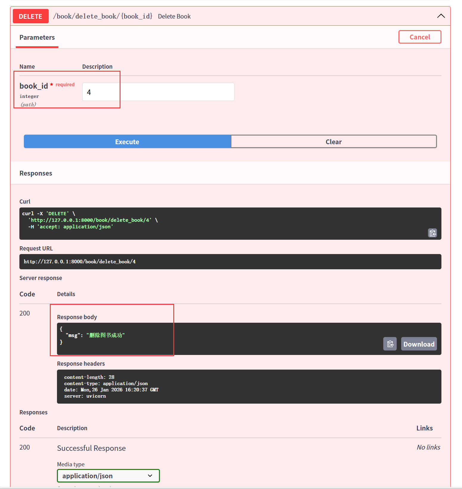
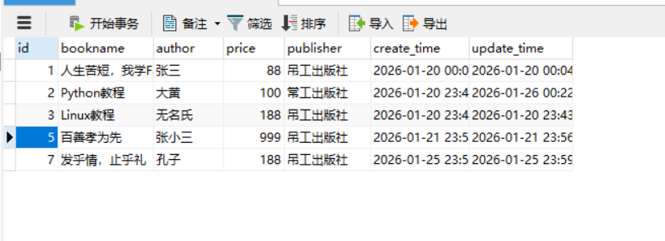
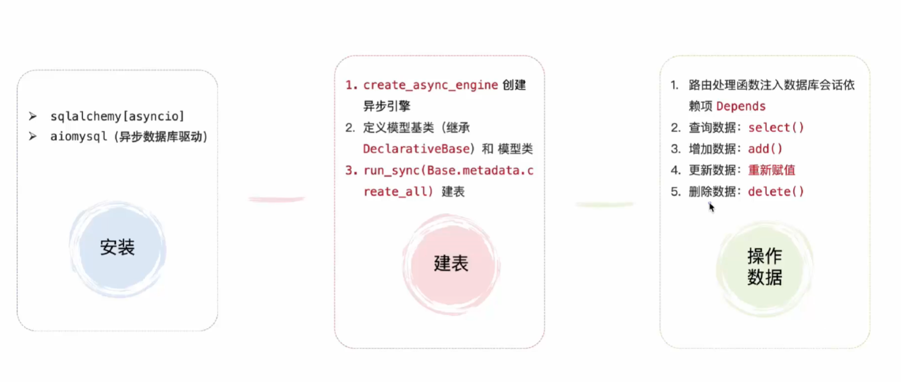

- 核心步骤：查询`get` → `delete`删除 → `commit`提交到数据库

# 1. 方法



- 用户提供一个路径参数，主键id
- 先查询是否有id对应的书，如果有则可以进行`delete`删除并`commit`提交
- 如果没有则`raise`抛出异常

# 2. 实现

```bash
from fastapi HTTPException

# 删除数据
@app.delete("/book/delete_book/{book_id}")
async def delete_book(book_id: int, db: AsyncSession = Depends(get_database)):
    # 先查询，再删除，最后提交
    db_book = await db.get(Book, book_id)
    if db_book is None:
        raise HTTPException(
            status_code=404,
            detail="没有这本书呦！！！"
        )
    await db.delete(db_book)
    await db.commit()
    return {"msg": "删除图书成功"}
```





- 回到数据库中查看id为4的图书确实没有了



# ORM总结

