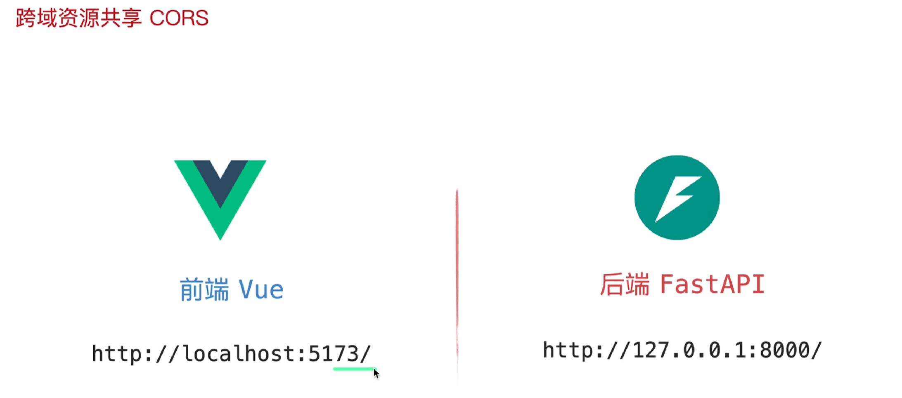
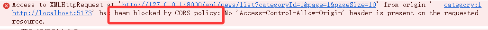
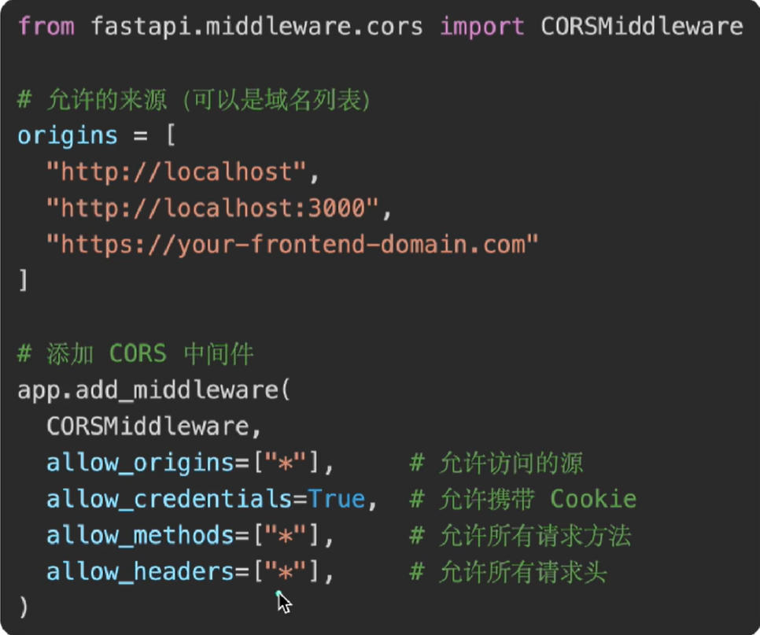
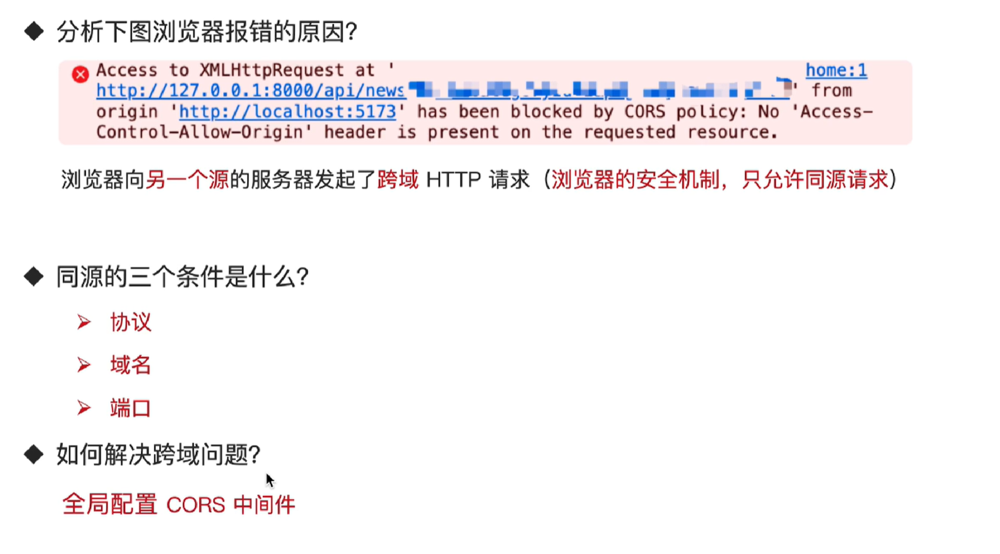

# 跨域资源共享CORS

- 跨域资源共享(CORS)是一种`浏览器安全机制`，用于允许在一个源(Origin)的Web应用，通过浏览器向另一个源的服务器发起跨域HTTP请求，并在`服务器授权`的前提下获取资源

## 同源的`三个条件`：

- 协议
- 域名
- 端口

## 问题

- 由于跨域问题，会被浏览器的安全机制拦截

- 浏览器眼中，这里的域名和端口号都不相同，虽然`localhost`就是`127.0.0.1`，但是浏览器不认，这里只有协议是`http`协议相同。

# 解决方法-CORS中间件

- CORS：让后端主动告诉浏览器：这个前端“允许访问”

# 总结

